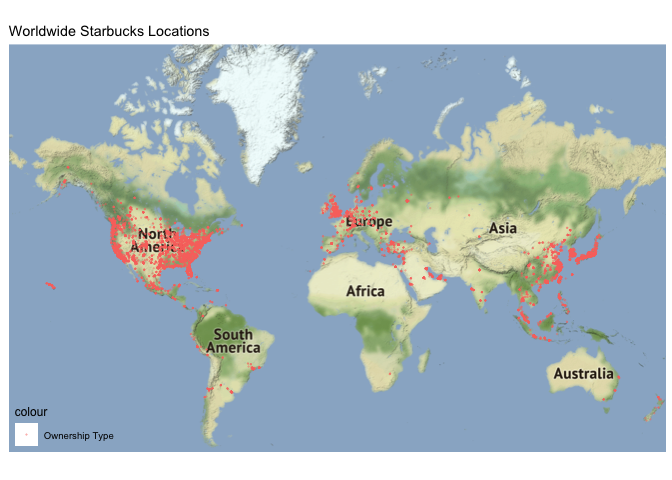
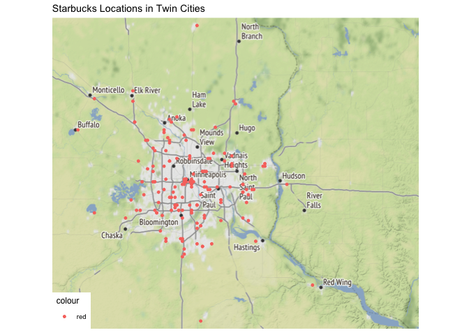
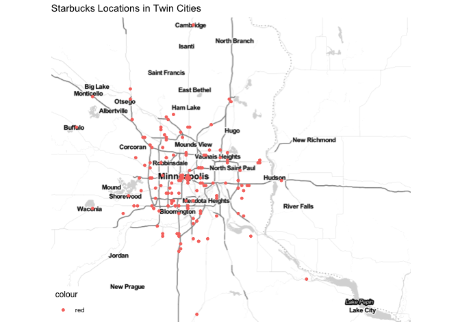
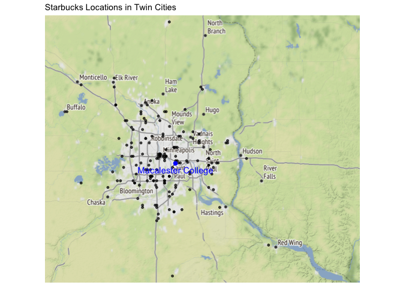
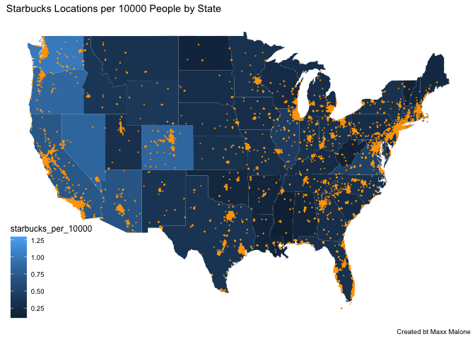
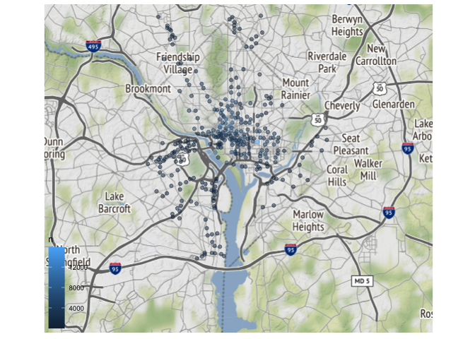
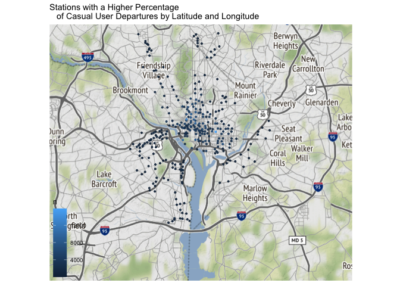
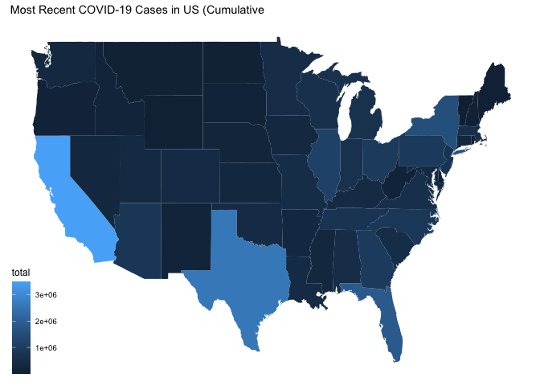
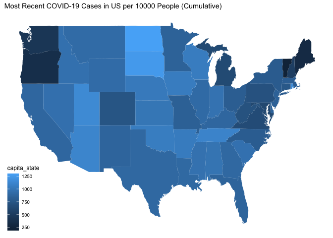

```r
library(tidyverse)     # for data cleaning and plotting
library(lubridate)     # for date manipulation
library(openintro)     # for the abbr2state() function
library(palmerpenguins)# for Palmer penguin data
library(maps)          # for map data
library(ggmap)         # for mapping points on maps
library(gplots)        # for col2hex() function
library(RColorBrewer)  # for color palettes
library(sf)            # for working with spatial data
library(leaflet)       # for highly customizable mapping
library(carData)       # for Minneapolis police stops data
library(ggthemes)      # for more themes (including theme_map())
theme_set(theme_minimal())
```


```r
# Starbucks locations
Starbucks <- read_csv("https://www.macalester.edu/~ajohns24/Data/Starbucks.csv")

starbucks_us_by_state <- Starbucks %>% 
  filter(Country == "US") %>% 
  count(`State/Province`) %>% 
  mutate(state_name = str_to_lower(abbr2state(`State/Province`))) 

# Lisa's favorite St. Paul places - example for you to create your own data
favorite_stp_by_lisa <- tibble(
  place = c("Home", "Macalester College", "Adams Spanish Immersion", 
            "Spirit Gymnastics", "Bama & Bapa", "Now Bikes",
            "Dance Spectrum", "Pizza Luce", "Brunson's"),
  long = c(-93.1405743, -93.1712321, -93.1451796, 
           -93.1650563, -93.1542883, -93.1696608, 
           -93.1393172, -93.1524256, -93.0753863),
  lat = c(44.950576, 44.9378965, 44.9237914,
          44.9654609, 44.9295072, 44.9436813, 
          44.9399922, 44.9468848, 44.9700727)
  )

#COVID-19 data from the New York Times
covid19 <- read_csv("https://raw.githubusercontent.com/nytimes/covid-19-data/master/us-states.csv")
```

## Put your homework on GitHub!

If you were not able to get set up on GitHub last week, go [here](https://github.com/llendway/github_for_collaboration/blob/master/github_for_collaboration.md) and get set up first. Then, do the following (if you get stuck on a step, don't worry, I will help! You can always get started on the homework and we can figure out the GitHub piece later):

* Create a repository on GitHub, giving it a nice name so you know it is for the 4th weekly exercise assignment (follow the instructions in the document/video).  
* Copy the repo name so you can clone it to your computer. In R Studio, go to file --> New project --> Version control --> Git and follow the instructions from the document/video.  
* Download the code from this document and save it in the repository folder/project on your computer.  
* In R Studio, you should then see the .Rmd file in the upper right corner in the Git tab (along with the .Rproj file and probably .gitignore).  
* Check all the boxes of the files in the Git tab under Stage and choose commit.  
* In the commit window, write a commit message, something like "Initial upload" would be appropriate, and commit the files.  
* Either click the green up arrow in the commit window or close the commit window and click the green up arrow in the Git tab to push your changes to GitHub.  
* Refresh your GitHub page (online) and make sure the new documents have been pushed out.  
* Back in R Studio, knit the .Rmd file. When you do that, you should have two (as long as you didn't make any changes to the .Rmd file, in which case you might have three) files show up in the Git tab - an .html file and an .md file. The .md file is something we haven't seen before and is here because I included `keep_md: TRUE` in the YAML heading. The .md file is a markdown (NOT R Markdown) file that is an interim step to creating the html file. They are displayed fairly nicely in GitHub, so we want to keep it and look at it there. Click the boxes next to these two files, commit changes (remember to include a commit message), and push them (green up arrow).  
* As you work through your homework, save and commit often, push changes occasionally (maybe after you feel finished with an exercise?), and go check to see what the .md file looks like on GitHub.  
* If you have issues, let me know! This is new to many of you and may not be intuitive at first. But, I promise, you'll get the hang of it! 


## Instructions

* Put your name at the top of the document. 

* **For ALL graphs, you should include appropriate labels.** 

* Feel free to change the default theme, which I currently have set to `theme_minimal()`. 

* Use good coding practice. Read the short sections on good code with [pipes](https://style.tidyverse.org/pipes.html) and [ggplot2](https://style.tidyverse.org/ggplot2.html). **This is part of your grade!**

* When you are finished with ALL the exercises, uncomment the options at the top so your document looks nicer. Don't do it before then, or else you might miss some important warnings and messages.


## Warm-up exercises from tutorial

These exercises will reiterate what you learned in the "Mapping data with R" tutorial. If you haven't gone through the tutorial yet, you should do that first.

### Starbucks locations (`ggmap`)

  1. Add the `Starbucks` locations to a world map. Add an aesthetic to the world map that sets the color of the points according to the ownership type. What, if anything, can you deduce from this visualization?  


```r
world <- get_stamenmap(
    bbox = c(left = -180, bottom = -57, right = 179, top = 82.1), 
    maptype = "terrain",
    zoom = 2)
ggmap(world) + 
  geom_point(data = Starbucks, 
             aes(x = Longitude, y = Latitude, color = 'Ownership Type'), 
             alpha = .3,
             size = .1, 
             ) +
  ggtitle(label = "Worldwide Starbucks Locations") +
  theme_map() +
  theme(legend.background = element_blank())
```

<!-- -->


From this visualization we can see that the Starbucks franchise is worldwide, however a majority of their locations are in the United States or Eastern Europe. We can also see that Japan's Starbucks are densily populated.


  2. Construct a new map of Starbucks locations in the Twin Cities metro area (approximately the 5 county metro area).  
  

```r
TwinCities <- get_stamenmap(
    bbox = c(left = -94, bottom = 44.4, right = -92, top = 45.6), 
    maptype = "terrain",
    zoom = 9)
ggmap(TwinCities) + 
  geom_point(data = Starbucks, 
             aes(x = Longitude, y = Latitude, color = "red"), 
             alpha = 1,
             size = 1, 
             ) +
  ggtitle(label = "Starbucks Locations in Twin Cities") +
  theme_map()
```

<!-- -->


  3. In the Twin Cities plot, play with the zoom number. What does it do?  (just describe what it does - don't actually include more than one map).  

The zoom number determines how detailed the map is. The higher the number is the more detailed the map will be. 

  4. Try a couple different map types (see `get_stamenmap()` in help and look at `maptype`). Include a map with one of the other map types.  
  

```r
TwinCities <- get_stamenmap(
    bbox = c(left = -94, bottom = 44.4, right = -92, top = 45.6), 
    maptype = "toner-lite",
    zoom = 9)
ggmap(TwinCities) + 
  geom_point(data = Starbucks, 
             aes(x = Longitude, y = Latitude, color = "red"), 
             alpha = 1,
             size = 1, 
             ) +
  ggtitle(label = "Starbucks Locations in Twin Cities") +
  theme_map()
```

<!-- -->
  

  5. Add a point to the map that indicates Macalester College and label it appropriately. There are many ways you can do think, but I think it's easiest with the `annotate()` function (see `ggplot2` cheatsheet).
  

```r
TwinCities <- get_stamenmap(
    bbox = c(left = -94, bottom = 44.4, right = -92, top = 45.6), 
    maptype = "terrain",
    zoom = 9)
ggmap(TwinCities) + 
  geom_point(data = Starbucks, 
             aes(x = Longitude, y = Latitude), 
             alpha = .7,
             size = 1, 
             ) +
  ggtitle(label = "Starbucks Locations in Twin Cities") +
  theme_map() +
  annotate('text', x= -93.171, y= 44.91, label = 'Macalester College', colour = "blue")+
  annotate('point', x= -93.171, y= 44.938,size = 2, colour = "blue") 
```

<!-- -->


### Choropleth maps with Starbucks data (`geom_map()`)

The example I showed in the tutorial did not account for population of each state in the map. In the code below, a new variable is created, `starbucks_per_10000`, that gives the number of Starbucks per 10,000 people. It is in the `starbucks_with_2018_pop_est` dataset.


```r
census_pop_est_2018 <- read_csv("https://www.dropbox.com/s/6txwv3b4ng7pepe/us_census_2018_state_pop_est.csv?dl=1") %>% #Loads in data to read and gives it a name
  separate(state, into = c("dot","state"), extra = "merge") %>% #Creates two separate columns
  select(-dot) %>% #Removes the dot column
  mutate(state = str_to_lower(state)) #Makes names of states lowercase

starbucks_with_2018_pop_est <-
  starbucks_us_by_state %>% #Loads in Starbucks data
  left_join(census_pop_est_2018, #Preparing to join data sets
            by = c("state_name" = "state")) %>% # Joins Starbucks data to state_name by state
  mutate(starbucks_per_10000 = (n/est_pop_2018)*10000) #Adds new variable to create number of Starbucks per 10,000 people
```

  6. **`dplyr` review**: Look through the code above and describe what each line of code does.

Code above has been annotated.


  7. Create a choropleth map that shows the number of Starbucks per 10,000 people on a map of the US. Use a new fill color, add points for all Starbucks in the US (except Hawaii and Alaska), add an informative title for the plot, and include a caption that says who created the plot (you!). Make a conclusion about what you observe.
  

```r
starbucks_us_by_state <- Starbucks %>% 
  filter(Country == "US") %>% 
  mutate(state_name = str_to_lower(abbr2state(`State/Province`))) %>% 
  filter(state_name != "hawaii") %>% 
  filter(state_name != "alaska")

states_map <- map_data("state")

starbucks_with_2018_pop_est %>% 
  ggplot() +
  geom_map(map = states_map,
           aes(map_id = state_name,
               fill = starbucks_per_10000)) +
  geom_point(data = starbucks_us_by_state,
             aes(x = Longitude, y = Latitude),
             alpha = .7,
             size = .05,
             color = "orange") +
  expand_limits(x = states_map$long, y = states_map$lat) + 
  labs(title = "Starbucks Locations per 10000 People by State",
       caption = "Created bt Maxx Malone") +
  theme_map() +
  theme(legend.background = element_blank())
```

<!-- -->
  
From this graph we can see that Starbucks locations are more densely located in urban locations such as cities and suburbs. As for the number of Starbucks per 10000 people we can see that the west coast has more Starbucks locations and in particular Colorado looks to have the most Starbucks locations per 10000 people.


### A few of your favorite things (`leaflet`)

  8. In this exercise, you are going to create a single map of some of your favorite places! The end result will be one map that satisfies the criteria below. 

  * Create a data set using the `tibble()` function that has 10-15 rows of your favorite places. The columns will be the name of the location, the latitude, the longitude, and a column that indicates if it is in your top 3 favorite locations or not. For an example of how to use `tibble()`, look at the `favorite_stp_by_lisa` I created in the data R code chunk at the beginning.  
  

```r
Maxx_Places <- tribble(
  ~Location, ~lon,  ~lat, ~Top3,
  "Home", -93.51766, 44.73518, TRUE,
  "GFs House", -93.43302, 44.77451 , FALSE,
  "Lake O'Dowd", -93.51895, 44.737321, TRUE,
  "Macalester College", -93.17073, 44.93818, FALSE,
  "Canterbury Park", -93.48320, 44.79088, TRUE,
  "Friends College House", -94.00682, 44.16152, FALSE,
  "GParents House", -93.45265, 44.73048, FALSE,
  "My College House", -93.16893, 44.94905, FALSE,
  "Redstone", -93.42820, 44.85990, FALSE,
  "Upper Red Lake", -94.725061, 48.197386, FALSE)
Maxx_Places
```

<div data-pagedtable="false">
  <script data-pagedtable-source type="application/json">
{"columns":[{"label":["Location"],"name":[1],"type":["chr"],"align":["left"]},{"label":["lon"],"name":[2],"type":["dbl"],"align":["right"]},{"label":["lat"],"name":[3],"type":["dbl"],"align":["right"]},{"label":["Top3"],"name":[4],"type":["lgl"],"align":["right"]}],"data":[{"1":"Home","2":"-93.51766","3":"44.73518","4":"TRUE"},{"1":"GFs House","2":"-93.43302","3":"44.77451","4":"FALSE"},{"1":"Lake O'Dowd","2":"-93.51895","3":"44.73732","4":"TRUE"},{"1":"Macalester College","2":"-93.17073","3":"44.93818","4":"FALSE"},{"1":"Canterbury Park","2":"-93.48320","3":"44.79088","4":"TRUE"},{"1":"Friends College House","2":"-94.00682","3":"44.16152","4":"FALSE"},{"1":"GParents House","2":"-93.45265","3":"44.73048","4":"FALSE"},{"1":"My College House","2":"-93.16893","3":"44.94905","4":"FALSE"},{"1":"Redstone","2":"-93.42820","3":"44.85990","4":"FALSE"},{"1":"Upper Red Lake","2":"-94.72506","3":"48.19739","4":"FALSE"}],"options":{"columns":{"min":{},"max":[10]},"rows":{"min":[10],"max":[10]},"pages":{}}}
  </script>
</div>

  * Create a `leaflet` map that uses circles to indicate your favorite places. Label them with the name of the place. Choose the base map you like best. Color your 3 favorite places differently than the ones that are not in your top 3 (HINT: `colorFactor()`). Add a legend that explains what the colors mean.  
  

```r
leafletmap <- colorFactor("viridis", 
                     domain = Maxx_Places$Top3)
leaflet(Maxx_Places) %>% 
  addTiles() %>% 
  addCircles(lng = ~lon,
            lat = ~lat,
            label = ~Location,
            color = ~leafletmap(Top3),
            opacity = 1) 
```

```{=html}
<div id="htmlwidget-5bdc510bef0b14cc55e2" style="width:672px;height:480px;" class="leaflet html-widget"></div>
<script type="application/json" data-for="htmlwidget-5bdc510bef0b14cc55e2">{"x":{"options":{"crs":{"crsClass":"L.CRS.EPSG3857","code":null,"proj4def":null,"projectedBounds":null,"options":{}}},"calls":[{"method":"addTiles","args":["//{s}.tile.openstreetmap.org/{z}/{x}/{y}.png",null,null,{"minZoom":0,"maxZoom":18,"tileSize":256,"subdomains":"abc","errorTileUrl":"","tms":false,"noWrap":false,"zoomOffset":0,"zoomReverse":false,"opacity":1,"zIndex":1,"detectRetina":false,"attribution":"&copy; <a href=\"http://openstreetmap.org\">OpenStreetMap<\/a> contributors, <a href=\"http://creativecommons.org/licenses/by-sa/2.0/\">CC-BY-SA<\/a>"}]},{"method":"addCircles","args":[[44.73518,44.77451,44.737321,44.93818,44.79088,44.16152,44.73048,44.94905,44.8599,48.197386],[-93.51766,-93.43302,-93.51895,-93.17073,-93.4832,-94.00682,-93.45265,-93.16893,-93.4282,-94.725061],10,null,null,{"interactive":true,"className":"","stroke":true,"color":["#FDE725","#440154","#FDE725","#440154","#FDE725","#440154","#440154","#440154","#440154","#440154"],"weight":5,"opacity":1,"fill":true,"fillColor":["#FDE725","#440154","#FDE725","#440154","#FDE725","#440154","#440154","#440154","#440154","#440154"],"fillOpacity":0.2},null,null,["Home","GFs House","Lake O'Dowd","Macalester College","Canterbury Park","Friends College House","GParents House","My College House","Redstone","Upper Red Lake"],{"interactive":false,"permanent":false,"direction":"auto","opacity":1,"offset":[0,0],"textsize":"10px","textOnly":false,"className":"","sticky":true},null,null]}],"limits":{"lat":[44.16152,48.197386],"lng":[-94.725061,-93.16893]}},"evals":[],"jsHooks":[]}</script>
```
  
  * Connect all your locations together with a line in a meaningful way (you may need to order them differently in the original data).  


```r
leafletmap <- colorFactor("viridis",
                     domain = Maxx_Places$Top3)
leaflet(Maxx_Places) %>% 
  addTiles() %>% 
  addCircles(lng = ~lon,
            lat = ~lat,
            label = ~Location,
            color = ~leafletmap(Top3),
            opacity = 1) %>% 
  addPolylines(lng = ~lon, 
               lat = ~lat, 
               color = col2hex("blue"))
```

```{=html}
<div id="htmlwidget-a82f31a85ca43e5adfa0" style="width:672px;height:480px;" class="leaflet html-widget"></div>
<script type="application/json" data-for="htmlwidget-a82f31a85ca43e5adfa0">{"x":{"options":{"crs":{"crsClass":"L.CRS.EPSG3857","code":null,"proj4def":null,"projectedBounds":null,"options":{}}},"calls":[{"method":"addTiles","args":["//{s}.tile.openstreetmap.org/{z}/{x}/{y}.png",null,null,{"minZoom":0,"maxZoom":18,"tileSize":256,"subdomains":"abc","errorTileUrl":"","tms":false,"noWrap":false,"zoomOffset":0,"zoomReverse":false,"opacity":1,"zIndex":1,"detectRetina":false,"attribution":"&copy; <a href=\"http://openstreetmap.org\">OpenStreetMap<\/a> contributors, <a href=\"http://creativecommons.org/licenses/by-sa/2.0/\">CC-BY-SA<\/a>"}]},{"method":"addCircles","args":[[44.73518,44.77451,44.737321,44.93818,44.79088,44.16152,44.73048,44.94905,44.8599,48.197386],[-93.51766,-93.43302,-93.51895,-93.17073,-93.4832,-94.00682,-93.45265,-93.16893,-93.4282,-94.725061],10,null,null,{"interactive":true,"className":"","stroke":true,"color":["#FDE725","#440154","#FDE725","#440154","#FDE725","#440154","#440154","#440154","#440154","#440154"],"weight":5,"opacity":1,"fill":true,"fillColor":["#FDE725","#440154","#FDE725","#440154","#FDE725","#440154","#440154","#440154","#440154","#440154"],"fillOpacity":0.2},null,null,["Home","GFs House","Lake O'Dowd","Macalester College","Canterbury Park","Friends College House","GParents House","My College House","Redstone","Upper Red Lake"],{"interactive":false,"permanent":false,"direction":"auto","opacity":1,"offset":[0,0],"textsize":"10px","textOnly":false,"className":"","sticky":true},null,null]},{"method":"addPolylines","args":[[[[{"lng":[-93.51766,-93.43302,-93.51895,-93.17073,-93.4832,-94.00682,-93.45265,-93.16893,-93.4282,-94.725061],"lat":[44.73518,44.77451,44.737321,44.93818,44.79088,44.16152,44.73048,44.94905,44.8599,48.197386]}]]],null,null,{"interactive":true,"className":"","stroke":true,"color":"#0000FF","weight":5,"opacity":0.5,"fill":false,"fillColor":"#0000FF","fillOpacity":0.2,"smoothFactor":1,"noClip":false},null,null,null,{"interactive":false,"permanent":false,"direction":"auto","opacity":1,"offset":[0,0],"textsize":"10px","textOnly":false,"className":"","sticky":true},null]}],"limits":{"lat":[44.16152,48.197386],"lng":[-94.725061,-93.16893]}},"evals":[],"jsHooks":[]}</script>
```
  
  
  * If there are other variables you want to add that could enhance your plot, do that now.  
  


## Revisiting old datasets

This section will revisit some datasets we have used previously and bring in a mapping component. 

### Bicycle-Use Patterns

The data come from Washington, DC and cover the last quarter of 2014.

Two data tables are available:

- `Trips` contains records of individual rentals
- `Stations` gives the locations of the bike rental stations

Here is the code to read in the data. We do this a little differently than usualy, which is why it is included here rather than at the top of this file. To avoid repeatedly re-reading the files, start the data import chunk with `{r cache = TRUE}` rather than the usual `{r}`. This code reads in the large dataset right away.


```r
data_site <- 
  "https://www.macalester.edu/~dshuman1/data/112/2014-Q4-Trips-History-Data.rds" 
Trips <- readRDS(gzcon(url(data_site)))
Stations<-read_csv("http://www.macalester.edu/~dshuman1/data/112/DC-Stations.csv")
```

  9. Use the latitude and longitude variables in `Stations` to make a visualization of the total number of departures from each station in the `Trips` data. Use either color or size to show the variation in number of departures. This time, plot the points on top of a map. Use any of the mapping tools you'd like.
  

```r
Stationmap <- get_stamenmap(
  bbox = c(left = -77.23, bottom = 38.74, right = -76.82, top = 39.01),
           maptype = "terrain",
           zoom = 11)

dept_by_station <- Trips %>% 
  left_join(Stations,
             by = c("sstation" = "name")) %>%
  group_by(lat, long) %>% 
  summarize(n = n(), 
            prop_casual = mean(client == "Casual"))
ggmap(Stationmap)+
  geom_point(data = dept_by_station,
             aes(x = long,
                 y = lat,
                 color = n),
             alpha = .5)+
  theme_map()+
  theme(legend.background = element_blank())
```

<!-- -->
  
  
  10. Only 14.4% of the trips in our data are carried out by casual users. Create a plot that shows which area(s) have stations with a much higher percentage of departures by casual users. What patterns do you notice? Also plot this on top of a map. I think it will be more clear what the patterns are.
  

```r
 ggmap(Stationmap) +
    geom_point(data = dept_by_station,
               aes(x = long, y = lat,
                   color = n),
               alpha = .9,
               size = .7)+
  theme_map()+
  labs(title = "Stations with a Higher Percentage
   of Casual User Departures by Latitude and Longitude",
       x = "",
       y = "") +
  theme(legend.background = element_blank())
```

<!-- -->

From this map we can see that casual users are typically located in the center of the city. This may be attributed to the fact that casual users do not want to bike long distances and therefore bike where there are stations nearby.

  
### COVID-19 data

The following exercises will use the COVID-19 data from the NYT.

  11. Create a map that colors the states by the most recent cumulative number of COVID-19 cases (remember, these data report cumulative numbers so you don't need to compute that). Describe what you see. What is the problem with this map?
  

```r
US_map <- map_data("state")
covid19 %>%
  mutate(state = str_to_lower(state)) %>% 
  group_by(state) %>% 
  summarize(total = max(cases)) %>% 
  ggplot()+
  geom_map(map = US_map,
           aes(map_id = state,
               fill = total))+
  expand_limits(x = US_map$long, y = US_map$lat)+
  labs(title = " Most Recent COVID-19 Cases in US (Cumulative")+
  theme_map()+
  theme(legend.background = element_blank())
```

<!-- -->
  
From this map we can see that on average states with higher populations have a brighter color/more cases. That is also what is wrong with this graph. We do not account for the population size in our code and therefore the number of cases are not proportional to the population of each state.
  

  12. Now add the population of each state to the dataset and color the states by most recent cumulative cases/10,000 people. See the code for doing this with the Starbucks data. You will need to make some modifications. 
  

```r
covid19 %>% 
  mutate(state = str_to_lower(state)) %>% 
  group_by(state) %>% 
  summarize(total = max(cases)) %>% 
  left_join(census_pop_est_2018,
            by = c("state" = "state")) %>% 
  mutate(capita_state = (total/est_pop_2018)*10000) %>% 
  ggplot()+
  geom_map(map = states_map,
           aes(map_id = state,
               fill = capita_state))+
  expand_limits(x = states_map$long, y = states_map$lat)+
  labs(title = "Most Recent COVID-19 Cases in US per 10000 People (Cumulative)")+
  theme_map()+
  theme(legend.background = element_blank())
```

<!-- -->
  

  13. **CHALLENGE** Choose 4 dates spread over the time period of the data and create the same map as in exercise 12 for each of the dates. Display the four graphs together using faceting. What do you notice?
  
## Minneapolis police stops

These exercises use the datasets `MplsStops` and `MplsDemo` from the `carData` library. Search for them in Help to find out more information.

  14. Use the `MplsStops` dataset to find out how many stops there were for each neighborhood and the proportion of stops that were for a suspicious vehicle or person. Sort the results from most to least number of stops. Save this as a dataset called `mpls_suspicious` and display the table. 
  

```r
mpls_suspicious <- MplsStops %>% 
  group_by(neighborhood) %>% 
  summarize(total_stops = n(),
            n_suspicious = (sum(problem == "suspicious")),
            prop_suspicious = mean(problem == "suspicious")) %>% 
  arrange(desc(total_stops))
mpls_suspicious
```

<div data-pagedtable="false">
  <script data-pagedtable-source type="application/json">
{"columns":[{"label":["neighborhood"],"name":[1],"type":["fct"],"align":["left"]},{"label":["total_stops"],"name":[2],"type":["int"],"align":["right"]},{"label":["n_suspicious"],"name":[3],"type":["int"],"align":["right"]},{"label":["prop_suspicious"],"name":[4],"type":["dbl"],"align":["right"]}],"data":[{"1":"Downtown West","2":"4409","3":"3338","4":"0.7570878"},{"1":"Whittier","2":"3328","3":"1351","4":"0.4059495"},{"1":"Near - North","2":"2256","3":"937","4":"0.4153369"},{"1":"Lyndale","2":"2154","3":"872","4":"0.4048282"},{"1":"Jordan","2":"2075","3":"813","4":"0.3918072"},{"1":"Hawthorne","2":"2031","3":"785","4":"0.3865091"},{"1":"Marcy Holmes","2":"1798","3":"517","4":"0.2875417"},{"1":"Lowry Hill East","2":"1491","3":"603","4":"0.4044266"},{"1":"East Phillips","2":"1387","3":"959","4":"0.6914203"},{"1":"Folwell","2":"1230","3":"485","4":"0.3943089"},{"1":"Willard - Hay","2":"1207","3":"532","4":"0.4407622"},{"1":"Holland","2":"1169","3":"319","4":"0.2728828"},{"1":"Ventura Village","2":"1096","3":"766","4":"0.6989051"},{"1":"Powderhorn Park","2":"1055","3":"746","4":"0.7071090"},{"1":"Midtown Phillips","2":"1019","3":"767","4":"0.7526987"},{"1":"Steven's Square - Loring Heights","2":"1006","3":"447","4":"0.4443340"},{"1":"Nicollet Island - East Bank","2":"945","3":"163","4":"0.1724868"},{"1":"King Field","2":"846","3":"249","4":"0.2943262"},{"1":"Central","2":"832","3":"528","4":"0.6346154"},{"1":"Cedar Riverside","2":"825","3":"563","4":"0.6824242"},{"1":"North Loop","2":"799","3":"333","4":"0.4167710"},{"1":"McKinley","2":"772","3":"315","4":"0.4080311"},{"1":"Loring Park","2":"741","3":"548","4":"0.7395412"},{"1":"Phillips West","2":"726","3":"466","4":"0.6418733"},{"1":"Webber - Camden","2":"656","3":"385","4":"0.5868902"},{"1":"Longfellow","2":"603","3":"441","4":"0.7313433"},{"1":"Prospect Park - East River Road","2":"594","3":"210","4":"0.3535354"},{"1":"CARAG","2":"559","3":"234","4":"0.4186047"},{"1":"Audubon Park","2":"554","3":"206","4":"0.3718412"},{"1":"Tangletown","2":"547","3":"98","4":"0.1791590"},{"1":"Elliot Park","2":"544","3":"424","4":"0.7794118"},{"1":"East Isles","2":"530","3":"112","4":"0.2113208"},{"1":"Seward","2":"510","3":"380","4":"0.7450980"},{"1":"Victory","2":"498","3":"265","4":"0.5321285"},{"1":"St. Anthony West","2":"475","3":"128","4":"0.2694737"},{"1":"Windom Park","2":"461","3":"158","4":"0.3427332"},{"1":"Como","2":"452","3":"138","4":"0.3053097"},{"1":"Windom","2":"404","3":"183","4":"0.4529703"},{"1":"Harrison","2":"401","3":"245","4":"0.6109726"},{"1":"Bottineau","2":"377","3":"96","4":"0.2546419"},{"1":"Corcoran","2":"360","3":"220","4":"0.6111111"},{"1":"Cleveland","2":"356","3":"206","4":"0.5786517"},{"1":"Logan Park","2":"355","3":"79","4":"0.2225352"},{"1":"Marshall Terrace","2":"355","3":"93","4":"0.2619718"},{"1":"Lind - Bohanon","2":"344","3":"272","4":"0.7906977"},{"1":"Northeast Park","2":"326","3":"130","4":"0.3987730"},{"1":"Sheridan","2":"318","3":"101","4":"0.3176101"},{"1":"ECCO","2":"308","3":"188","4":"0.6103896"},{"1":"Mid - City Industrial","2":"278","3":"77","4":"0.2769784"},{"1":"Downtown East","2":"262","3":"143","4":"0.5458015"},{"1":"Lynnhurst","2":"245","3":"86","4":"0.3510204"},{"1":"Waite Park","2":"244","3":"144","4":"0.5901639"},{"1":"Lowry Hill","2":"243","3":"117","4":"0.4814815"},{"1":"Hiawatha","2":"235","3":"161","4":"0.6851064"},{"1":"Linden Hills","2":"218","3":"124","4":"0.5688073"},{"1":"St. Anthony East","2":"218","3":"66","4":"0.3027523"},{"1":"University of Minnesota","2":"218","3":"84","4":"0.3853211"},{"1":"Standish","2":"212","3":"180","4":"0.8490566"},{"1":"Beltrami","2":"211","3":"53","4":"0.2511848"},{"1":"Howe","2":"196","3":"146","4":"0.7448980"},{"1":"Kenwood","2":"193","3":"48","4":"0.2487047"},{"1":"Northrop","2":"189","3":"172","4":"0.9100529"},{"1":"East Harriet","2":"169","3":"80","4":"0.4733728"},{"1":"Cedar - Isles - Dean","2":"153","3":"54","4":"0.3529412"},{"1":"Columbia Park","2":"151","3":"64","4":"0.4238411"},{"1":"Diamond Lake","2":"149","3":"115","4":"0.7718121"},{"1":"Regina","2":"142","3":"108","4":"0.7605634"},{"1":"Ericsson","2":"136","3":"105","4":"0.7720588"},{"1":"Bancroft","2":"134","3":"113","4":"0.8432836"},{"1":"Shingle Creek","2":"132","3":"106","4":"0.8030303"},{"1":"Fulton","2":"130","3":"90","4":"0.6923077"},{"1":"Bryn - Mawr","2":"125","3":"78","4":"0.6240000"},{"1":"Sumner - Glenwood","2":"123","3":"70","4":"0.5691057"},{"1":"Kenny","2":"118","3":"65","4":"0.5508475"},{"1":"Keewaydin","2":"115","3":"105","4":"0.9130435"},{"1":"Minnehaha","2":"113","3":"95","4":"0.8407080"},{"1":"Cooper","2":"112","3":"56","4":"0.5000000"},{"1":"Wenonah","2":"112","3":"101","4":"0.9017857"},{"1":"Bryant","2":"96","3":"77","4":"0.8020833"},{"1":"Field","2":"87","3":"68","4":"0.7816092"},{"1":"West Calhoun","2":"80","3":"45","4":"0.5625000"},{"1":"Armatage","2":"77","3":"65","4":"0.8441558"},{"1":"Morris Park","2":"74","3":"71","4":"0.9594595"},{"1":"Hale","2":"61","3":"48","4":"0.7868852"},{"1":"Page","2":"41","3":"32","4":"0.7804878"},{"1":"Camden Industrial","2":"34","3":"12","4":"0.3529412"},{"1":"Humboldt Industrial Area","2":"10","3":"4","4":"0.4000000"}],"options":{"columns":{"min":{},"max":[10]},"rows":{"min":[10],"max":[10]},"pages":{}}}
  </script>
</div>
  
  15. Use a `leaflet` map and the `MplsStops` dataset to display each of the stops on a map as a small point. Color the points differently depending on whether they were for suspicious vehicle/person or a traffic stop (the `problem` variable). HINTS: use `addCircleMarkers`, set `stroke = FAlSE`, use `colorFactor()` to create a palette.  


```r
p_fprob <- colorFactor("viridis",
                   domain = MplsStops$problem)

leaflet(MplsStops) %>% 
  addTiles() %>% 
  addCircleMarkers(lng = ~long,
                   lat = ~lat,
                   color = ~p_prob(problem),
                   radius = 1,
                   opacity = 0.7,
                   stroke = FALSE) %>% 
  addLegend(pal = p_prob,
            values = ~problem,
            position = "bottomleft")
```

```
## Error in p_prob(problem): could not find function "p_prob"
```

  
  16. Save the folder from moodle called Minneapolis_Neighborhoods into your project/repository folder for this assignment. Make sure the folder is called Minneapolis_Neighborhoods. Use the code below to read in the data and make sure to **delete the `eval=FALSE`**. Although it looks like it only links to the .sph file, you need the entire folder of files to create the `mpls_nbhd` data set. These data contain information about the geometries of the Minneapolis neighborhoods. Using the `mpls_nbhd` dataset as the base file, join the `mpls_suspicious` and `MplsDemo` datasets to it by neighborhood (careful, they are named different things in the different files). Call this new dataset `mpls_all`.


```r
mpls_nbhd <- st_read("Minneapolis_Neighborhoods/Minneapolis_Neighborhoods.shp", quiet = TRUE)

mpls_join <- mpls_nbhd %>% 
  left_join(MplsDemo,
            by = c("BDNAME" = "neighborhood"))
mpls_all <- mpls_join %>% 
  left_join(mpls_suspicious,
            by = c("BDNAME" = "neighborhood"))
```

  17. Use `leaflet` to create a map from the `mpls_all` data  that colors the neighborhoods by `prop_suspicious`. Display the neighborhood name as you scroll over it. Describe what you observe in the map.


```r
pal_1<- colorFactor("viridis", domain = 
                      mpls_all$prop_suspicious)

leaflet(mpls_all) %>% 
  addTiles() %>% 
  addPolygons(stroke = FALSE,
              fillColor = ~pal_1(prop_suspicious),
              fillOpacity = .9,
              label = ~BDNAME)%>%
  addLegend(position = "topright",
            pal = pal_1,
            values = ~prop_suspicious,
            opacity = 1)
```

```{=html}
<div id="htmlwidget-094620d89d8be61c63bc" style="width:672px;height:480px;" class="leaflet html-widget"></div>
<script type="application/json" data-for="htmlwidget-094620d89d8be61c63bc">{"x":{"options":{"crs":{"crsClass":"L.CRS.EPSG3857","code":null,"proj4def":null,"projectedBounds":null,"options":{}}},"calls":[{"method":"addTiles","args":["//{s}.tile.openstreetmap.org/{z}/{x}/{y}.png",null,null,{"minZoom":0,"maxZoom":18,"tileSize":256,"subdomains":"abc","errorTileUrl":"","tms":false,"noWrap":false,"zoomOffset":0,"zoomReverse":false,"opacity":1,"zIndex":1,"detectRetina":false,"attribution":"&copy; <a href=\"http://openstreetmap.org\">OpenStreetMap<\/a> contributors, <a href=\"http://creativecommons.org/licenses/by-sa/2.0/\">CC-BY-SA<\/a>"}]},{"method":"addPolygons","args":[[[[{"lng":[-93.2625807586419,-93.2625806878156,-93.2625700779113,-93.2625700618395,-93.2625700273936,-93.2625700228498,-93.2625700216787,-93.2625700607467,-93.2625717465796,-93.2625737983956,-93.2625738506515,-93.2625739658418,-93.2625779407818,-93.2625932251104,-93.2626228048217,-93.2626229323957,-93.2626229313947,-93.2626229259507,-93.262622270619,-93.262621840719,-93.2626218408436,-93.262621833225,-93.2626218660551,-93.2626335209791,-93.2626337163238,-93.262635947283,-93.2626359474151,-93.2626359766291,-93.2626359782945,-93.2626381079673,-93.262654497426,-93.2626576446837,-93.2626594701109,-93.2626773137426,-93.26267731392,-93.2626773787714,-93.2626773881553,-93.2626774761437,-93.2626811988828,-93.2627215446022,-93.2627277977384,-93.2639263573641,-93.2639522606787,-93.2643780815319,-93.2652100303866,-93.2652100988112,-93.2662227171954,-93.2665041871519,-93.2665042961214,-93.2668515019245,-93.2672611066829,-93.2677607949855,-93.2677611383647,-93.2680119010678,-93.2680506958402,-93.2689008647673,-93.2690282842359,-93.2690283919385,-93.270302493711,-93.2703027826073,-93.271595847823,-93.27159618867,-93.2718413753494,-93.2728542795305,-93.2728543403508,-93.2740946640443,-93.2741196220534,-93.2741403999134,-93.2745414513631,-93.2746033477917,-93.2747209445383,-93.2747231581564,-93.2747557516956,-93.2747557527012,-93.2747558201812,-93.2747585449955,-93.2747624113151,-93.2747391896539,-93.2747355338193,-93.2747223031977,-93.2747049998892,-93.2747004068225,-93.2746869996558,-93.274664545337,-93.2746472786129,-93.2746261837108,-93.2745872306321,-93.2745505019992,-93.2744713811487,-93.2743778444928,-93.2743484397253,-93.2742431426661,-93.274202411427,-93.2741159415992,-93.2740320563423,-93.2739931504772,-93.2738046452433,-93.2737967863281,-93.2736726600895,-93.2736568977228,-93.2736293507002,-93.273578831417,-93.2733883147152,-93.2733198381236,-93.2733124305669,-93.2731384946025,-93.2731193916288,-93.2730276450678,-93.2729722601169,-93.2728054033566,-93.2724694976845,-93.2724153632495,-93.2721217301223,-93.2719614476314,-93.2718022119525,-93.2716571516839,-93.271345980388,-93.270896133633,-93.2708711047059,-93.270719201779,-93.2707158910542,-93.27069674069,-93.2704401465388,-93.2704211090035,-93.2704204253057,-93.2704108585612,-93.2704027189444,-93.270368181773,-93.2703632166636,-93.2703152594913,-93.2701248453699,-93.2700727370524,-93.270065912626,-93.2700367409385,-93.2699991648359,-93.269908818549,-93.2698465145963,-93.2698200865911,-93.2697910075678,-93.2697461449132,-93.2697080254027,-93.2696971337292,-93.2696515800498,-93.2695986261786,-93.2695869393814,-93.2695678379386,-93.2695611909686,-93.2695594227277,-93.2695554392713,-93.2695550889908,-93.269555053982,-93.2695550307419,-93.26955502411,-93.2695549181524,-93.2695544474759,-93.2695492894621,-93.2695463041987,-93.2695462608876,-93.2695462326852,-93.2691995917041,-93.2689750366206,-93.2689749821239,-93.2689672106748,-93.2688786653363,-93.2682869339451,-93.2676870889584,-93.2676540485292,-93.266417352931,-93.2664062114491,-93.2651165640952,-93.2651164994596,-93.2625807586419],"lat":[44.9609082137146,44.9608966736807,44.9591277381002,44.9591251313564,44.9591192034235,44.9591183495065,44.9591183036153,44.9590996948488,44.9583009170337,44.9573283858649,44.9573264333491,44.9573222709851,44.9571770416855,44.9566187511345,44.9555382149256,44.9555335828765,44.9555334560032,44.9555239720776,44.954453313218,44.9537535288867,44.9537534694998,44.9537413986358,44.9537372271843,44.9522579201747,44.9522330624204,44.9519500523984,44.9519499894123,44.9519463326432,44.9519461427865,44.9517615315224,44.9503407846618,44.9500678821159,44.9499104535372,44.9483709975995,44.9483709130181,44.948365365797,44.9483645163923,44.9483569995255,44.9483569881659,44.9483568670621,44.9483568484782,44.948353231394,44.9483531532254,44.9483552158604,44.9483592412906,44.9483592404616,44.9483533622268,44.9483517270305,44.9483517271421,44.9483523836004,44.9483531573923,44.9483540965895,44.9483540978372,44.9483533501086,44.9483532336507,44.9483506928073,44.9483503103535,44.9483503104614,44.9483518021402,44.9483518024265,44.9483532345615,44.9483532348954,44.9483535287578,44.9483547372818,44.9483547373407,44.9483562664294,44.948356208442,44.9483561581459,44.9483551942842,44.9483550445369,44.9483547624378,44.9483547573468,44.9483546785951,44.9483548171658,44.9483627022079,44.9486759533789,44.9489429737223,44.9492380484373,44.9492844829087,44.9493479496405,44.9494309580203,44.9494529835318,44.9495173004039,44.9496278504485,44.9497128681116,44.9497805285175,44.9499054578735,44.9500232601937,44.9502436293194,44.950451412567,44.9505167389868,44.9507060343232,44.9507736020798,44.9509170433358,44.9510484719286,44.9511094260036,44.9513669469977,44.9513762659117,44.9515234516335,44.9515421406882,44.9515748049485,44.9516352771137,44.9518633233194,44.9519475121654,44.9519566200268,44.9521704622072,44.9521937711472,44.95230571515,44.9523732916796,44.9525768752362,44.9529722916449,44.9530360152577,44.9533834726254,44.9535761314243,44.9537675330923,44.953941891748,44.954307958526,44.9548534749733,44.9548838267426,44.9550680302741,44.9550722695756,44.95509678289,44.9554252613662,44.9554496325761,44.9554506099849,44.9554643153075,44.9554759767906,44.9555254560361,44.9555325676585,44.9556012695779,44.9558740502964,44.9559486992855,44.9559584742638,44.9560096377632,44.95607553797,44.9562339888868,44.956343258329,44.9564064026687,44.9564758816721,44.956583069171,44.9566741461058,44.9567001683413,44.9568823869295,44.957094208813,44.9571409454925,44.9573804241244,44.957463737387,44.9583577484892,44.9591254709423,44.9591929971348,44.9591998041021,44.9592045055444,44.959205936223,44.9592261870612,44.959316777757,44.9603110933238,44.9608860906936,44.9608945307909,44.960899817998,44.9609039915204,44.9609066937559,44.9609066937013,44.9609066679167,44.9609063703855,44.9609043797482,44.960902359824,44.9609024334108,44.9609051825404,44.9609052071166,44.9609127450086,44.9609127449416,44.9609082137146]}]],[[{"lng":[-93.2601055025157,-93.2600999248059,-93.2600366119938,-93.2599169672066,-93.2597937229544,-93.2597148981519,-93.2596677813388,-93.2595374689654,-93.259402963285,-93.2592632396707,-93.2591173786241,-93.2589638400242,-93.2589413781842,-93.2587778910837,-93.2585728931148,-93.2584607592362,-93.2581612649302,-93.2577820780505,-93.2575523955358,-93.2573906480081,-93.2572105356908,-93.2571407517703,-93.2571389039217,-93.2571375297509,-93.25713791241,-93.2572552861088,-93.2573858627966,-93.2576137345775,-93.2576414228974,-93.2576727711654,-93.2579584848034,-93.2579851150239,-93.2580013946802,-93.2580636270779,-93.2580691185392,-93.2580763418649,-93.2580990588092,-93.2580999863363,-93.2581385793058,-93.2581548276216,-93.2582088708647,-93.2583367590821,-93.2583786488798,-93.2584152453849,-93.2584438588081,-93.2584507300895,-93.2584560614296,-93.2585639250075,-93.2588984769768,-93.2590094554907,-93.2591176202887,-93.2591177931738,-93.2594701005671,-93.2598664120038,-93.2599190563639,-93.2599196916714,-93.2599556680269,-93.2599663449592,-93.2603590701326,-93.2604315302272,-93.2608185257349,-93.26081974571,-93.2616489482157,-93.2616497221237,-93.2616572300119,-93.2624333678043,-93.2637777688716,-93.2638091876158,-93.2638178851244,-93.263821427422,-93.2644908282061,-93.2645934880877,-93.2645982491227,-93.264873513216,-93.2654064376645,-93.2654106628221,-93.2654115180235,-93.2662222305909,-93.2662277631823,-93.2670369808358,-93.2670436897369,-93.2678831876024,-93.2678876015447,-93.2678957368922,-93.2679087978699,-93.2683939259843,-93.2686167454656,-93.2688165154243,-93.2689738680413,-93.2690495327778,-93.2690544663224,-93.2690565777916,-93.2690905697396,-93.2691096809706,-93.269131368901,-93.2691344275195,-93.269139683225,-93.2691556504273,-93.2691627667794,-93.2691668907999,-93.2691841769807,-93.2692121974544,-93.2692133361047,-93.2692448195751,-93.2692531948286,-93.2692698250992,-93.2693445402735,-93.2701840114615,-93.2702612705253,-93.2708666251197,-93.270913261666,-93.2711075253137,-93.2711729216635,-93.2712229070208,-93.2712515924681,-93.2712795036298,-93.2713459895612,-93.2714323923311,-93.2721705339862,-93.27217816755,-93.2735428207058,-93.2735497934367,-93.2735552512923,-93.2749263162176,-93.2749386539361,-93.2749439000985,-93.2763457061696,-93.2763677007391,-93.2763727862926,-93.2763729142226,-93.2769290000651,-93.2778500639507,-93.2778564063435,-93.2778653776732,-93.2780486940131,-93.2788505248316,-93.2788633427724,-93.2795490557148,-93.2795631333906,-93.2795699664008,-93.279812803174,-93.2803746660043,-93.2803936778231,-93.2803947102099,-93.2803958696119,-93.2804004465546,-93.2804057340597,-93.2804500242303,-93.2805326573422,-93.2806915989769,-93.2808324292818,-93.2808346688859,-93.280838377954,-93.2808415166888,-93.2808556627001,-93.2810142403526,-93.2810444621599,-93.2810475197769,-93.2810950371505,-93.2811086455752,-93.2811767548063,-93.2812333123838,-93.2812416194448,-93.2812987179502,-93.2813009766313,-93.2815019816257,-93.281502125239,-93.2815046436092,-93.281612054848,-93.281598509779,-93.2815978598537,-93.281523117786,-93.2815230394758,-93.2815108023908,-93.2815105912049,-93.2814709050297,-93.2814653845004,-93.2813752107409,-93.2812900806128,-93.2812120384882,-93.2811241638485,-93.2810551272352,-93.2808176753096,-93.2805072299169,-93.280253974778,-93.2802358614752,-93.2798704800974,-93.2798270792764,-93.279610997303,-93.2795475577589,-93.2793928177694,-93.2792479214549,-93.2791950607344,-93.2791418622833,-93.2790736050579,-93.279063503078,-93.2789849171863,-93.2789016842965,-93.2788175186049,-93.2785996963088,-93.2785008394471,-93.2784904223493,-93.278034630049,-93.2780295546696,-93.2779555601461,-93.2778278318953,-93.2776653634385,-93.277531562636,-93.2774496683203,-93.2774443138407,-93.2774270323145,-93.2773924654434,-93.2771430309818,-93.2771400948853,-93.2770645480973,-93.2770387965544,-93.2769980570938,-93.2769776860803,-93.27695500112,-93.2764354753894,-93.2764208160522,-93.2761269168329,-93.2760009241827,-93.2759530753435,-93.275913592916,-93.275547989233,-93.2752840664235,-93.2747954250523,-93.274790081472,-93.2739768169425,-93.2738522665465,-93.2736337276199,-93.2736013686928,-93.2724937232406,-93.2724383035123,-93.2724246733032,-93.2722479868174,-93.2713187494117,-93.2713113463394,-93.2707828601626,-93.2707304797311,-93.2705599358767,-93.2702577956494,-93.2702562068496,-93.2702275350425,-93.270202908044,-93.270022052309,-93.2690236516908,-93.2690191843793,-93.2690077983107,-93.2690050062405,-93.2690013973732,-93.268946132892,-93.2686572653712,-93.2678893582343,-93.266744515851,-93.2667196611032,-93.2666634216234,-93.2666478842437,-93.2661658417762,-93.2658588821321,-93.2654968686436,-93.2653709235993,-93.2653594282212,-93.2653033687295,-93.2652960222626,-93.2649742629729,-93.2648202000954,-93.2647579585963,-93.2647478049735,-93.2647264583778,-93.2647260510141,-93.2646846283484,-93.2639239243561,-93.2639064932302,-93.2639026031915,-93.2638439372918,-93.263797976092,-93.2637927199321,-93.2636927543078,-93.2635860756999,-93.2634788403367,-93.263367660335,-93.2632698851205,-93.2631709819893,-93.2630700216808,-93.2629669434368,-93.2628616725569,-93.2627541457488,-93.2626442553939,-93.2625319002086,-93.2624169548451,-93.262291990036,-93.2621637523225,-93.2620320150578,-93.2618964806811,-93.2618413374088,-93.2617569491396,-93.2616128290757,-93.2614635759861,-93.2613084009648,-93.2611387950533,-93.2609597959827,-93.2607526873343,-93.2605888043015,-93.2604561480742,-93.2603200931532,-93.2602335510783,-93.2601803634583,-93.2601138868169,-93.2601055025157],"lat":[44.9829952758614,44.9829925119575,44.9829611467962,44.9829026295739,44.9828436512322,44.9828052857656,44.9827827325681,44.9827209839089,44.9826578484569,44.9825928454909,44.9825255465866,44.9824552410012,44.9824450299057,44.9823707100229,44.9822781308179,44.9822278489278,44.9820935480778,44.9819235096859,44.9818195973128,44.9817456975544,44.9816628899629,44.9816300790565,44.9816292096076,44.9816285629327,44.9816280873621,44.9814819250525,44.9813193171653,44.9810355486146,44.9810010664158,44.9809620289577,44.9806062233678,44.9805730599266,44.9805527873337,44.9804836116092,44.9804775071001,44.9804702149567,44.9804472770098,44.9804463431361,44.9804073746812,44.980390969368,44.9803364045176,44.9802072785934,44.9801649844096,44.9801280346232,44.9800991436897,44.9800922065578,44.9800868243932,44.979951894193,44.9795333884789,44.9793945606135,44.9792592504901,44.9792590338266,44.9788418963163,44.9783726448331,44.9783172867216,44.9783166197574,44.9782669447349,44.9782522022648,44.9778057496741,44.9777233754958,44.9772834260724,44.9772820389912,44.9763331218782,44.9763322364007,44.9763230034623,44.9753684523887,44.9759409218552,44.975954300588,44.975943407723,44.9759389718205,44.9751005751515,44.9749719971323,44.9749660337133,44.9746420921708,44.9740149139559,44.9740099406283,44.9740089319363,44.9730513636199,44.9730448295499,44.9720965757175,44.9720887147007,44.9711106653139,44.9711055220213,44.9711005012662,44.9710924387682,44.9707929790278,44.9706572703709,44.970535599332,44.9703824671176,44.9702737552428,44.9702666652567,44.9702636314444,44.9702147937161,44.9701873347398,44.9701561747601,44.9701478924584,44.970133670073,44.9700904524377,44.9700711903307,44.9700600252335,44.9700132376051,44.969945727506,44.9699429833534,44.9698671283597,44.9698362294859,44.9698369587498,44.9698402384865,44.9698770802499,44.9698804707843,44.9699125151495,44.9699149842595,44.9699252658098,44.9699336892423,44.9699401269372,44.9699438208984,44.9699474151141,44.9699678518526,44.9699944114279,44.9702987218112,44.9703018830461,44.9708670692095,44.9708698652976,44.9708720543625,44.9714218605855,44.9714271496314,44.9714293969156,44.9720301024925,44.9720395269179,44.9720416309174,44.9720416841255,44.9722716583036,44.9726525653684,44.9726543897255,44.9726569714436,44.9727097204994,44.9729404389839,44.9729441281991,44.9738230996317,44.9738411453175,44.9738486729554,44.9741162113507,44.9747352247193,44.9747561712051,44.9747573076831,44.9747590138489,44.9747657367799,44.9747735050187,44.9748385806617,44.9749599912837,44.9751935225215,44.975386458109,44.9753895266367,44.9753946084356,44.9753989086962,44.9754359607424,44.9758513082496,44.9759304663941,44.9759383468777,44.9760608683394,44.9760981493172,44.9762847485948,44.976397495464,44.9764140520031,44.9765278736813,44.9765323755966,44.9769330584431,44.976933570557,44.9769424952127,44.977323170949,44.9775449521676,44.9775482961417,44.9779322241647,44.9779385046923,44.9789190920222,44.9789359747609,44.9789438791786,44.9789449783053,44.9789629378652,44.9789798931881,44.9789954367059,44.9790129365274,44.9790266884033,44.979125053765,44.979384040785,44.9795958337728,44.9796109808247,44.9799165368417,44.9799528322709,44.9801026811782,44.9801479436808,44.9802564625837,44.9803580779977,44.9803951491829,44.9804324566822,44.9804787375933,44.9804858151809,44.9805249835925,44.98056646648,44.980608415448,44.9807169780718,44.9807662475847,44.980769471894,44.9809105466018,44.9809121174674,44.9809350201445,44.9809745535901,44.9810248388267,44.981083301682,44.9811190845247,44.9811214235335,44.9811289748082,44.9811440782461,44.9812530640406,44.9812543471215,44.9812873561142,44.9813036229923,44.9813293588818,44.9813422277196,44.9813565583699,44.9816847433788,44.9816940029744,44.9819017580676,44.9819816074693,44.9820119315701,44.9820395263368,44.9822950556203,44.9824795158515,44.9828210279007,44.9828248397649,44.9834049284418,44.9834937658248,44.9836496395458,44.9836730850838,44.9844755996469,44.98451654783,44.9845266195269,44.9844012147178,44.9837459194083,44.9837406987123,44.9833420630943,44.9833025525789,44.9831739101088,44.9829460009089,44.9829448026032,44.9829231754359,44.9829045989875,44.9827902522795,44.9821589974859,44.9821561730436,44.9821489731498,44.9821472085478,44.9821500635936,44.9821937861318,44.9824072254713,44.9829746067769,44.9837669440536,44.9837841453074,44.9838218658801,44.9838322867614,44.9841555971732,44.9843371417537,44.9845868271047,44.9846581176236,44.9846646247833,44.9846910164076,44.9846942498853,44.9848358590224,44.9849033388239,44.9849306001655,44.9849350481191,44.9849443982417,44.9849445768783,44.9849626080821,44.9852937325101,44.9852802838879,44.9852772825904,44.9852327090823,44.9851977883858,44.9851938561626,44.9851190609887,44.985040475033,44.9849627081079,44.9848833586895,44.9848147965453,44.9847467091224,44.9846784412856,44.9846099488753,44.984541185917,44.9844721082478,44.9844026482625,44.9843327410617,44.9842623100225,44.9841868995565,44.9841106819584,44.9840335220067,44.9839552448118,44.9839238227637,44.983875733173,44.9837946499207,44.9837116885246,44.9836264063199,44.9835341944046,44.983437855588,44.9833274287549,44.9832409115875,44.9831720872472,44.983102616633,44.9830591044607,44.9830323617656,44.9829994284845,44.9829952758614]}]],[[{"lng":[-93.2449864570206,-93.2449865743561,-93.2450080188521,-93.2450151678479,-93.2450289888272,-93.245039020369,-93.2450434883275,-93.2450946394873,-93.2451081631776,-93.2451324925191,-93.2452017061873,-93.2452210360436,-93.2452212707899,-93.2452227481817,-93.2453108745269,-93.2453185035561,-93.2454781544446,-93.2454931743282,-93.2454970411653,-93.2455573397683,-93.2456792049868,-93.24571114204,-93.2457634083079,-93.2459087249721,-93.2459219368919,-93.2459657794597,-93.2459911426172,-93.2461041865883,-93.2461259137592,-93.2461325228354,-93.24613969926,-93.2461714496587,-93.2462904430687,-93.2464055529901,-93.2464075557828,-93.2464822918246,-93.2464945347446,-93.2465015788042,-93.2465447746183,-93.2467197418464,-93.2468486877418,-93.2469831043076,-93.2470052356655,-93.247144509849,-93.2471584058678,-93.2473662694006,-93.2473663748036,-93.2474932453003,-93.2474933849836,-93.2476710690362,-93.247922199066,-93.2479883146569,-93.2482625980874,-93.2483277295943,-93.248421468489,-93.2484229097844,-93.2485956133681,-93.2486125912565,-93.2486241468859,-93.248636802201,-93.2488409895074,-93.2491059416167,-93.249117357985,-93.2491740143522,-93.2493990357501,-93.2494176655369,-93.2495247980582,-93.2495322496941,-93.2495325634087,-93.2495392936276,-93.2496097760791,-93.2496473326203,-93.2497428115567,-93.2497435992658,-93.2497587409903,-93.2498533785104,-93.2498760106859,-93.2500374804244,-93.2501626661966,-93.25018054221,-93.2501934044417,-93.2502566965148,-93.2504320683481,-93.2506337772009,-93.2507903894582,-93.25081626393,-93.2508311112372,-93.2508370258698,-93.2510228257961,-93.2511679431665,-93.251206876486,-93.2512680391153,-93.251275177735,-93.2512792783762,-93.2512827421777,-93.2514144680605,-93.2515031771425,-93.251506091739,-93.2516312753369,-93.2518486780622,-93.25203792638,-93.2520722503183,-93.2520735835212,-93.2521032876021,-93.2523047640144,-93.2523309236036,-93.2523325424424,-93.2524694464307,-93.2526243077882,-93.2526555937547,-93.2526763098876,-93.2527022956299,-93.2527128425167,-93.2527136264528,-93.2528050609425,-93.2528602643701,-93.2528973435261,-93.2528976997991,-93.2529207264754,-93.2529270045031,-93.2529587292509,-93.2537207124205,-93.2537619544353,-93.255071624663,-93.2550847479647,-93.2564072470504,-93.2564237576144,-93.2564336672614,-93.2577987519562,-93.2578067482256,-93.2587976975394,-93.2590577974,-93.2591316874135,-93.2591317520002,-93.2591358403772,-93.2594929966549,-93.2605137833099,-93.2605180288197,-93.2605476409948,-93.2605272716735,-93.2600876918662,-93.2600412673898,-93.2600412406977,-93.2600404882866,-93.2600508707201,-93.260057522408,-93.2600618693231,-93.2600920737768,-93.2601576436499,-93.2602666596464,-93.260465014142,-93.2604731476646,-93.2604756082309,-93.2610633843171,-93.2610711331463,-93.2610747365179,-93.2617703153245,-93.2618880985531,-93.26231434241,-93.2624004238766,-93.2624050353426,-93.2624155805398,-93.2624333678043,-93.2616572300119,-93.2616497221237,-93.2616489482157,-93.26081974571,-93.2608185257349,-93.2604315302272,-93.2603590701326,-93.2599663449592,-93.2599556680269,-93.2599196916714,-93.2599190563639,-93.2598664120038,-93.2594701005671,-93.2591177931738,-93.2591176202887,-93.2590094554907,-93.2588984769768,-93.2585639250075,-93.2584560614296,-93.2584507300895,-93.2584438588081,-93.2584152453849,-93.2583786488798,-93.2583367590821,-93.2582088708647,-93.2581548276216,-93.2581385793058,-93.2580999863363,-93.2580990588092,-93.2580763418649,-93.2580691185392,-93.2580636270779,-93.2580013946802,-93.2579851150239,-93.2579584848034,-93.2576727711654,-93.2576414228974,-93.2576137345775,-93.2573858627966,-93.2572552861088,-93.25713791241,-93.2571375297509,-93.2571252424291,-93.2571112034011,-93.2569070931966,-93.2567509928318,-93.2564127978321,-93.2562090123639,-93.2560242390803,-93.2558175566955,-93.2557951143697,-93.2556230563756,-93.2554588919657,-93.2554373499437,-93.2554185332859,-93.2552586590343,-93.2552433177059,-93.2551044175357,-93.2549539444564,-93.2548066786464,-93.2547578277293,-93.2547537300064,-93.2546622033453,-93.2545200701201,-93.2543800851364,-93.2542419975638,-93.2542270419569,-93.2541767140632,-93.2541056059715,-93.2539726091447,-93.2538409308381,-93.2537104392856,-93.2535810153856,-93.2534536410002,-93.253320117873,-93.2532346394172,-93.2531794440422,-93.2530367392161,-93.2529302382538,-93.2528225892796,-93.2527137770962,-93.2526873855757,-93.2526037750923,-93.252492565527,-93.2523801217931,-93.2522664147519,-93.2521514165206,-93.2520625920949,-93.2520351309025,-93.2519174882107,-93.2518566901123,-93.2517984504263,-93.2516779795367,-93.2515560387952,-93.2515331330174,-93.2515232704579,-93.251432569909,-93.2513075209264,-93.2512531700269,-93.251235380851,-93.2512310723184,-93.251180834825,-93.2510531540925,-93.2509237158645,-93.250792442841,-93.2506592399835,-93.2505240337935,-93.2503866823318,-93.2503839513227,-93.2503838841558,-93.2502470601467,-93.2501050100906,-93.2500536563163,-93.2500535840804,-93.2499596666013,-93.2498254593008,-93.2498114833655,-93.2496602170668,-93.2495055559401,-93.2493420238276,-93.2491739714522,-93.2489752685142,-93.2488645948613,-93.2487530935771,-93.2486389851007,-93.2485220273572,-93.2484019085466,-93.2482784246084,-93.2481509227859,-93.2480188111356,-93.2478811909706,-93.2477648656529,-93.2476431833954,-93.2475148994182,-93.2474576102699,-93.2474130430344,-93.2473775697577,-93.2471989986195,-93.2471205646903,-93.2469390451282,-93.2464859930661,-93.2463097917777,-93.246151251475,-93.2459795947348,-93.2458189256268,-93.2456664288472,-93.2455206264172,-93.2454393430714,-93.2453597376773,-93.2452816682784,-93.2452461576805,-93.245225642476,-93.2452050246058,-93.2451296837154,-93.2451074263991,-93.2450555847705,-93.245015712929,-93.2450089195458,-93.2449864570206],"lat":[44.9789336625517,44.9789333711589,44.9788795180518,44.9788615694156,44.9788268592992,44.9788016698678,44.9787904493818,44.9786619992691,44.9786280401146,44.9785669452889,44.9783931364985,44.978342294217,44.9783416781383,44.9783377918918,44.9781060183236,44.978086061894,44.97766843734,44.9776331185449,44.9776240280389,44.9774822429125,44.9772511387091,44.9771905730062,44.9771093301035,44.9768834322527,44.9768660361325,44.9768083046595,44.9767749058173,44.9766260529242,44.9765974447132,44.9765887416953,44.9765802841044,44.9765428698929,44.9764026404435,44.9762847383423,44.9762826865017,44.9762061392742,44.9761935981443,44.9761863829952,44.9761421394197,44.975991148389,44.9758798732242,44.9757638732994,44.9757462600564,44.9756354242947,44.9756243652361,44.9754748071371,44.9754747289801,44.9753834450641,44.9753833444528,44.9752554980403,44.9750738953719,44.9750260846317,44.97482773279,44.9747798379057,44.9747109052829,44.9747098452224,44.9745828444849,44.9745704049935,44.9745619371165,44.9745526634153,44.9744030523851,44.9742032793202,44.9741946708603,44.9741519528715,44.9739662320473,44.9739508565261,44.9738624337358,44.9738562833392,44.9738560236647,44.9738504698891,44.9737922949244,44.973761297612,44.9736693310488,44.9736685707398,44.9736539865032,44.9735628286818,44.973542244323,44.9733953831566,44.9732696418324,44.9732516864784,44.9732387686536,44.9731751959934,44.9729984240121,44.9727813200378,44.9726090129892,44.9725805445568,44.9725642097225,44.9725571036669,44.9723338294879,44.9721594426434,44.9721126540089,44.972039157114,44.9720305776786,44.9720256479176,44.972021486749,44.9718631914174,44.971757364906,44.9717538869445,44.9716045440136,44.9713451842332,44.9711276764612,44.9710882281942,44.9710866955676,44.9710525553001,44.9708209891553,44.9707840868693,44.9707818032339,44.9705886660236,44.9703713184794,44.9703274098412,44.9702983358051,44.9702618651367,44.9702470610901,44.9702456915909,44.9700857153591,44.9699932051852,44.9699310632407,44.9699304661802,44.9698918739475,44.9698813534526,44.9698281889795,44.9703488051458,44.970366742711,44.9709363489357,44.9709420558211,44.9714921758727,44.9714990444134,44.9715032754959,44.9720860534443,44.9720894661836,44.9725300483851,44.9726456889776,44.9726785383323,44.9726785671962,44.9726801993837,44.9728228152843,44.9732304174065,44.9732321117995,44.97324393464,44.9732686851215,44.9738028365064,44.9738592452194,44.9738592784832,44.973860192767,44.9739765184284,44.9740343323632,44.9740721250579,44.974157321943,44.974264964708,44.9743848294787,44.9745276362683,44.9745334937229,44.9745352635785,44.9747779076135,44.9747811057045,44.9747825924345,44.9750825395088,44.9751333281186,44.9753171276467,44.9753542465428,44.9753562345873,44.9753607816496,44.9753684523887,44.9763230034623,44.9763322364007,44.9763331218782,44.9772820389912,44.9772834260724,44.9777233754958,44.9778057496741,44.9782522022648,44.9782669447349,44.9783166197574,44.9783172867216,44.9783726448331,44.9788418963163,44.9792590338266,44.9792592504901,44.9793945606135,44.9795333884789,44.979951894193,44.9800868243932,44.9800922065578,44.9800991436897,44.9801280346232,44.9801649844096,44.9802072785934,44.9803364045176,44.980390969368,44.9804073746812,44.9804463431361,44.9804472770098,44.9804702149567,44.9804775071001,44.9804836116092,44.9805527873337,44.9805730599266,44.9806062233678,44.9809620289577,44.9810010664158,44.9810355486146,44.9813193171653,44.9814819250525,44.9816280873621,44.9816285629327,44.9816231649519,44.9816169957047,44.9815226886579,44.9814505650462,44.9812943038572,44.9812009524019,44.9811170372824,44.981024237969,44.9810143061101,44.9809381608105,44.9808666859517,44.9808573075071,44.9808492620155,44.9807809049792,44.9807744667995,44.9807161757366,44.9806542138056,44.9805947864213,44.9805754919037,44.9805738748481,44.9805377257639,44.9804828558771,44.980430104567,44.980379376179,44.9803740270552,44.9803560281276,44.9803305958088,44.9802843457582,44.9802398732513,44.980197134053,44.9801560902403,44.9801170353691,44.980077476663,44.9800529065352,44.9800370413411,44.9799972513824,44.9799683307932,44.9799397498157,44.979911501231,44.9799048026164,44.9798835796063,44.9798559813188,44.9798286991359,44.9798017240227,44.9797750523441,44.9797549108019,44.9797486841005,44.9797226012119,44.9797094220255,44.9796967973316,44.9796712634135,44.9796459913122,44.9796413497963,44.9796393507515,44.9796209701584,44.9795961881895,44.9795856534494,44.9795822055289,44.979581370028,44.9795716336368,44.9795474269128,44.979523420462,44.9794995997919,44.9794759458898,44.9794524451665,44.9794290758545,44.9794286218742,44.9794286109984,44.979405813505,44.9793826345316,44.9793744242,44.9793744124183,44.979359398445,44.9793383725086,44.979336183146,44.9793129487475,44.9792896507814,44.979265480185,44.9792411051859,44.9792128382255,44.9791975300871,44.9791832349395,44.9791697842175,44.9791571470341,44.9791452915192,44.9791341949262,44.9791237943852,44.979114044191,44.9791048748763,44.9790978218225,44.9790910412202,44.9790844613867,44.9790817486965,44.979079637796,44.979077957916,44.9790702650566,44.9790668881201,44.9790595872472,44.9790413648405,44.9790336041462,44.9790259840793,44.9790168363469,44.9790072264994,44.9789969838254,44.9789860093948,44.9789793300974,44.9789723684336,44.9789651107383,44.9789616053573,44.9789595802835,44.9789575460836,44.9789496626262,44.9789471972194,44.9789414539962,44.9789369597794,44.9789361939161,44.9789336625517]}]],[[{"lng":[-93.2495770034483,-93.2495085800302,-93.249339347058,-93.249146919461,-93.2489167196135,-93.2486111082392,-93.2484263569495,-93.2482418658205,-93.2478843098427,-93.2475943759597,-93.2473645283371,-93.24717832879,-93.2470930924279,-93.2470306185874,-93.2470298481042,-93.2470287959481,-93.246652143262,-93.2460434876316,-93.2458903860882,-93.2458896864109,-93.2458867955265,-93.2458838149716,-93.2459327431309,-93.2460431875136,-93.2461081536272,-93.2461410354475,-93.2461539956152,-93.2463292965181,-93.2463819407112,-93.2465470101021,-93.2465853574763,-93.2466395630505,-93.2466452034987,-93.2466693964644,-93.246745588136,-93.2467573110941,-93.2471913061447,-93.2472716682431,-93.2474963276859,-93.2475055975974,-93.2475084856701,-93.2477074063631,-93.247723379211,-93.2479376850351,-93.2482406887383,-93.2482486238332,-93.2482486694583,-93.2485217793539,-93.2485689528823,-93.2495574108512,-93.2498376486728,-93.2498376686902,-93.2498414489955,-93.2498440936821,-93.2498441097453,-93.2498441136606,-93.2498521028916,-93.2509795666338,-93.2511084462124,-93.2511086096996,-93.2511172377748,-93.2511716358075,-93.2522668658183,-93.2523446424563,-93.2523458768482,-93.2523459909157,-93.2523679720338,-93.253578161305,-93.2535901617613,-93.2536259932983,-93.2547598681167,-93.2548923985346,-93.2549254630189,-93.2561362971984,-93.2561365354557,-93.2561769567973,-93.2574394585908,-93.2574395498383,-93.2574653439159,-93.2577481839996,-93.2581641381427,-93.2582084752711,-93.2587040122911,-93.2587041897168,-93.2587669819025,-93.2596527003171,-93.2596686941913,-93.2599660454312,-93.2599734482865,-93.2600209173092,-93.2610511215022,-93.2610730764424,-93.2610744540104,-93.261091636249,-93.2612685373322,-93.2625480308868,-93.2625563598112,-93.2625566259515,-93.2625700216787,-93.2625700228498,-93.2625700273936,-93.2625700618395,-93.2625700779113,-93.2625806878156,-93.2625807586419,-93.2651164994596,-93.2651165640952,-93.2664062114491,-93.266417352931,-93.2676540485292,-93.2676870889584,-93.2682869339451,-93.2688786653363,-93.2689672106748,-93.2689749821239,-93.2689750366206,-93.2691995917041,-93.2695462326852,-93.2695404743199,-93.2695370243151,-93.269536936737,-93.2695369331606,-93.2695368960735,-93.2695319718716,-93.2695279487821,-93.2695232467725,-93.269523240299,-93.2695231802504,-93.2695087346487,-93.2693446555129,-93.2692862890078,-93.2691281149789,-93.2689177596366,-93.2689082889237,-93.2687820601059,-93.2687102175691,-93.2682725445162,-93.2682376079036,-93.268109792991,-93.267889481347,-93.2678363776869,-93.2677552003774,-93.2677524853301,-93.2677497728177,-93.2676577666687,-93.2676566182868,-93.2676565574445,-93.267578079631,-93.2674667778731,-93.2674311473222,-93.2674215542375,-93.2672376897139,-93.2672131099621,-93.2670240472004,-93.2669986682285,-93.2667058131485,-93.2664452803554,-93.2659674763458,-93.265921516297,-93.2658783611786,-93.2658783155496,-93.265651084484,-93.2652526335045,-93.2651122994173,-93.265112242381,-93.2626844658672,-93.2625407778928,-93.2625311196906,-93.2625308256333,-93.2608173750963,-93.2607478436183,-93.2604016476279,-93.2596897595902,-93.2596889255799,-93.2596884984378,-93.2596841268581,-93.2596743937874,-93.2596657647024,-93.2596632284516,-93.259657755421,-93.2596570278803,-93.2589399316042,-93.2584646131723,-93.2583143316861,-93.258225859869,-93.258168696083,-93.2581671850009,-93.2581668452614,-93.2580064740056,-93.2578937525195,-93.2574708289278,-93.2569396022561,-93.2569220853058,-93.2568954016817,-93.2568405157359,-93.2568163703933,-93.2566934137053,-93.2566426534419,-93.2565500755228,-93.2564290862619,-93.256416656071,-93.2562219463744,-93.2560604970228,-93.2557940164077,-93.255762053089,-93.2557563962449,-93.2557457088419,-93.2556992218019,-93.255615961456,-93.2555506731734,-93.255424035565,-93.2554239886583,-93.2552162939257,-93.2550736985464,-93.254917802748,-93.2547973693886,-93.2547971538649,-93.254741485349,-93.2547390689497,-93.2546066418138,-93.2545645522837,-93.2544367902889,-93.2542690050634,-93.2542673735092,-93.2541518144808,-93.2540901462182,-93.2538746437976,-93.2538482947714,-93.2536748551288,-93.2536656757524,-93.2536502694561,-93.2533851271576,-93.2531257577672,-93.2530748559402,-93.2530395353707,-93.2528690906512,-93.2527848196656,-93.2527570230171,-93.2527568100453,-93.2526696994084,-93.2525178388908,-93.252436912006,-93.2523699030924,-93.2523417666724,-93.2522566208678,-93.2521751285365,-93.2521309300469,-93.251974896729,-93.2519482518827,-93.2519025842345,-93.2518869611254,-93.2517769592132,-93.2517191023594,-93.2516486278537,-93.2516330845971,-93.2516275666534,-93.2516242949285,-93.2516227522376,-93.2515598327161,-93.2515597959549,-93.2513879296465,-93.2512620487159,-93.2512595578443,-93.2512182752817,-93.2511809520508,-93.2510908147622,-93.2508570910551,-93.2506155892821,-93.2505746032237,-93.2505201845583,-93.2504437411329,-93.250426542883,-93.2503792917414,-93.2503769634054,-93.250351552352,-93.2502375270794,-93.2499457969019,-93.249923477012,-93.2498053847687,-93.2497662018119,-93.2495770034483],"lat":[44.9662967560422,44.9662185964669,44.9660252789284,44.9658236691853,44.9656005318671,44.9652779570937,44.9650307064366,44.9646733668547,44.9639264765903,44.963378366089,44.9630129150947,44.9627445989232,44.9626217732136,44.9625317454138,44.9625306341379,44.9625291185146,44.9619863456638,44.9610950791058,44.9608708854585,44.9608698624405,44.9608656271889,44.9608612613578,44.9608145017755,44.9607089493415,44.9606500832433,44.960620288939,44.9606085468046,44.960449703871,44.9603956655561,44.9602262283298,44.9601868674514,44.9601326248323,44.9601269826303,44.9601027700347,44.960026529234,44.9600147954471,44.9604339317589,44.9605115392695,44.9607285026836,44.9607374541524,44.9607402442773,44.9609277548966,44.9609276713023,44.9609265634812,44.9609249970223,44.9609249551273,44.9609249551814,44.9609235424423,44.9609237448311,44.9609279879293,44.9609291898229,44.9609232952428,44.9598743624879,44.9591399676434,44.9591357763828,44.959134089258,44.9591340950047,44.959134911628,44.959135004355,44.9591350036446,44.9591349614537,44.9591347635286,44.959130784537,44.9591305022277,44.9591304964463,44.9591304929781,44.9591296903905,44.9591245682749,44.9591245162347,44.9591243644126,44.9591263684039,44.9591266013399,44.959126660148,44.9591283294293,44.9591283296949,44.9591283837436,44.9591254978717,44.9591254979723,44.9591254382471,44.9591265372131,44.959128151392,44.9591283250909,44.9591289267818,44.9591289269756,44.9591290036384,44.9591243343364,44.9591242490934,44.9591169748307,44.9591167938755,44.9591156313504,44.9591214531684,44.9591215774718,44.9591215861462,44.9591216828373,44.9591212162551,44.9591183532238,44.9591183341459,44.9591183335279,44.9591183036153,44.9591183495065,44.9591192034235,44.9591251313564,44.9591277381002,44.9608966736807,44.9609082137146,44.9609127449416,44.9609127450086,44.9609052071166,44.9609051825404,44.9609024334108,44.960902359824,44.9609043797482,44.9609063703855,44.9609066679167,44.9609066937013,44.9609066937559,44.9609039915204,44.960899817998,44.9620097455211,44.9626747791079,44.962691499132,44.962692666171,44.9627011620598,44.963869742741,44.9648243018913,44.9659399812893,44.9659419716427,44.965955663855,44.9659538138539,44.9659327872973,44.965925307425,44.9659050377918,44.9658780796027,44.9658768661734,44.965860688888,44.9658514828718,44.9657953906398,44.9657909130924,44.9657745319077,44.9657462966485,44.9657394908097,44.965729086107,44.9657291445437,44.9657292029829,44.9657311892011,44.9657312141312,44.9657312158692,44.9657329098026,44.9657353099974,44.9657368547669,44.9657372706296,44.965745240429,44.9657463059803,44.96574751264,44.9657476739303,44.9657495408407,44.9657499473401,44.9657506905792,44.965750762077,44.9657508292447,44.9657508291978,44.9657511817728,44.9657517977662,44.9657520618864,44.9657520618273,44.9657566150413,44.9657569354397,44.9657569558097,44.965756957298,44.9657607616263,44.9657609155085,44.9657616813591,44.9657660303608,44.9657660357558,44.9657660370926,44.9657660638491,44.9657661234875,44.9657661762233,44.9657661914709,44.965766225131,44.9657662297413,44.9657706062129,44.9657735036664,44.9657744197944,44.9657811793254,44.9657855481653,44.9657856634821,44.9657856892038,44.9657979439524,44.9658065580771,44.9658388730845,44.9658794626722,44.9658808010702,44.965882840153,44.9658870335906,44.9658892869217,44.9659007588794,44.9659054948813,44.9659141327388,44.9659254203387,44.9659265807562,44.9659447478892,44.9659598096822,44.9659846715244,44.965988101833,44.9659887091738,44.9659898561699,44.9659948457744,44.9660037794315,44.9660107859828,44.9660243759827,44.9660243804292,44.9660466685784,44.9660619705916,44.9660786998425,44.966091623077,44.9660916462291,44.9660976202823,44.9660978785019,44.9661088813409,44.9661123781744,44.966122992867,44.9661369328155,44.9661370677401,44.966146668341,44.9661517921712,44.966169695103,44.9661716339751,44.966184396893,44.9661850712123,44.9661862045521,44.9662057129733,44.9662247972603,44.9662285417327,44.9662311396298,44.9662432487875,44.9662492359744,44.9662512098304,44.9662512248833,44.9662574138908,44.9662682012969,44.9662739491138,44.9662787086677,44.9662807072272,44.9662867569059,44.9662925461784,44.9662941905991,44.9662999974842,44.9663009889863,44.9663026892145,44.9663032704885,44.9663073647028,44.9663095178024,44.966312141307,44.966312719939,44.9663129691145,44.9663131174051,44.9663131867089,44.9663160285314,44.9663160302886,44.9663237922524,44.9663294791545,44.9663295914465,44.9663314566402,44.96633234832,44.9663345024077,44.9663400863415,44.9663382886796,44.9663379836647,44.9663375784219,44.9663370089393,44.9663368809353,44.9663365289625,44.9663365118531,44.966335611238,44.9663315668762,44.966321216882,44.9663204250611,44.9663162351441,44.9663128933195,44.9662967560422]}]],[[{"lng":[-93.2882976528817,-93.288300434456,-93.2883436059979,-93.2883966690069,-93.2884656770637,-93.2885241296335,-93.2885667171569,-93.2886004830003,-93.2886200819165,-93.2886361133376,-93.2886431184195,-93.2886472343833,-93.2886533202628,-93.288655307205,-93.2886580436548,-93.2886530157709,-93.2886111882296,-93.2885483432596,-93.2884996030833,-93.2884984879158,-93.2884920816448,-93.2884917439554,-93.2884838293808,-93.2884380205387,-93.2883857571602,-93.2883855279341,-93.2883462991589,-93.2883461958782,-93.2883269638155,-93.2883225002751,-93.2883189381817,-93.2882958978397,-93.2882500653648,-93.2882437858196,-93.2881810690944,-93.2881101160782,-93.2881019687337,-93.2880123862843,-93.2879994566446,-93.2879906769535,-93.2879836315304,-93.2879836063324,-93.2879835572222,-93.2879830206976,-93.2879627031328,-93.2879565846967,-93.2880065733656,-93.2880060966457,-93.2895181473737,-93.2895225367058,-93.2898405775751,-93.2908447077207,-93.2913877167717,-93.2914306569702,-93.2930111044749,-93.2949176245689,-93.2955231819631,-93.2955315175644,-93.2971501170481,-93.2971542329076,-93.2971540093055,-93.2971495284946,-93.2971490653665,-93.2971449218591,-93.297144773983,-93.2971225632434,-93.29710783874,-93.2970491290477,-93.2969981856261,-93.2969868231795,-93.2969758467131,-93.2968102344493,-93.2968049340802,-93.296552327673,-93.2963536532256,-93.2958813611857,-93.2954553023408,-93.2952220921301,-93.294988332366,-93.2949482693842,-93.2949295503495,-93.2947618261365,-93.2947437299671,-93.2946508172296,-93.2944947361615,-93.2944745355414,-93.2944470449809,-93.2943299716615,-93.2942971545115,-93.2942824321257,-93.2941829136368,-93.2941796063817,-93.2941725700196,-93.2940851152758,-93.2940685971197,-93.2940528550354,-93.2940518410177,-93.2940155487787,-93.2940143922648,-93.2940143642722,-93.2940143669142,-93.2940143757182,-93.2940144276407,-93.2940148399487,-93.2940148620008,-93.2940148699465,-93.2940148794187,-93.2940149341946,-93.2940150471698,-93.2940153215079,-93.294015167961,-93.294010234892,-93.2940102229763,-93.2940102214568,-93.2940100082883,-93.2939545195008,-93.2938856113923,-93.2937267060563,-93.2939517613089,-93.2940463748576,-93.2940802160148,-93.2940884385302,-93.2941047634054,-93.2941129675536,-93.2941009779531,-93.2940992453234,-93.2940971872552,-93.294095977591,-93.2930912460698,-93.2930849668687,-93.2928041602705,-93.2926748719558,-93.2924259055177,-93.2918626753867,-93.2910375627074,-93.2910117993689,-93.2910073714954,-93.2905694290937,-93.2905661659906,-93.2904227797606,-93.2902455457112,-93.2902439163252,-93.2902167594796,-93.2896641036171,-93.2895382072644,-93.2891778315099,-93.2891368813032,-93.2885037225351,-93.2884004182575,-93.2882976528817],"lat":[44.9890356035354,44.9890297031805,44.9889381541394,44.9888181545166,44.9886456487458,44.9884618803975,44.9882818492013,44.9880896067117,44.9879780318933,44.9878730055357,44.9877208204999,44.9876314092365,44.9874991683435,44.987456014802,44.9873965998407,44.9872390384199,44.9869576496147,44.9866012155042,44.9864172095916,44.9864129958125,44.9863888174255,44.9863875349333,44.9863576577736,44.9861847217744,44.9859725240068,44.9859715943251,44.9858123235799,44.9858119068876,44.9857338262271,44.9857157023843,44.9856999061686,44.9855977716359,44.9853945996112,44.9853667591342,44.9851244929867,44.9848504156667,44.9848189393375,44.9844575767923,44.9844054173025,44.9843699948204,44.9843415787136,44.9843414824142,44.9843412790188,44.9843391118571,44.9842571565778,44.9842324790042,44.979488963604,44.9794599258004,44.9796695287131,44.9796701378849,44.9797245783949,44.9798847957337,44.979954626881,44.9799600287593,44.9801588482268,44.9803743336437,44.9804427709539,44.9804437131562,44.9806261237884,44.9806265866928,44.9806734237332,44.9815821303407,44.9816102918788,44.9818625148099,44.9818715117812,44.9820014879651,44.9820876550213,44.9821882539927,44.9822755453919,44.9822950156297,44.982304824125,44.9824527884077,44.9824575245271,44.9825887078078,44.9826477363278,44.9827128502049,44.9827715902655,44.982821703818,44.9828991559354,44.9829124302389,44.9829226248539,44.9830139665218,44.983026360696,44.9830899915621,44.9831968822933,44.9832107162635,44.9832407841102,44.9833688259405,44.9834047184893,44.983428430182,44.9835887307138,44.9835940603342,44.9836322926566,44.9841074922278,44.9841443899254,44.9841795579158,44.984181822814,44.9842628986133,44.9842654792287,44.9842655430925,44.9842662908267,44.9842679689567,44.9842786181061,44.9843625245868,44.9843671009764,44.9843685154649,44.9843705796088,44.9843818406228,44.9844046073984,44.9844606173345,44.9844753936958,44.9849485647491,44.9849497056835,44.9849498676459,44.9849703747719,44.9850832532706,44.9851624723879,44.9853384714933,44.9854611976795,44.9855585722482,44.9856120817892,44.9856250830964,44.9856509020563,44.9863212253533,44.9881455275165,44.9884089580296,44.9887717636867,44.9889849822961,44.9889982977655,44.9889983809822,44.9890021015741,44.9890032685959,44.9890055171739,44.9890106010596,44.9890180432762,44.9890182761885,44.9890183148983,44.9892877982981,44.9892849999767,44.9891620016688,44.9890136354939,44.9890136494619,44.98901387476,44.9890184570362,44.9890195000167,44.9890224867401,44.9890228254767,44.9890324663312,44.9890340388048,44.9890356035354]}]],[[{"lng":[-93.3104532271649,-93.3098245697384,-93.3093872617734,-93.3087763843903,-93.3080975438797,-93.30807387441,-93.3075141899499,-93.3068422841479,-93.3068123225488,-93.3055658954414,-93.3055656301466,-93.3055387111774,-93.3049744042362,-93.3046672244362,-93.3046443610248,-93.3042806256766,-93.3042692244382,-93.3042583283983,-93.3042581506894,-93.3039155524847,-93.3030058488455,-93.3029872237818,-93.302325759322,-93.3017219078995,-93.3017111641904,-93.3004527032887,-93.3004526487063,-93.3004510924934,-93.2993567287032,-93.2991944015762,-93.2991871625254,-93.2991871054043,-93.2991844905613,-93.2991797901921,-93.299181639175,-93.2991816476091,-93.2991816783562,-93.2991912346061,-93.2991937733709,-93.2991967102768,-93.2991967518235,-93.2991967857018,-93.2991967963807,-93.2991979609706,-93.299198079671,-93.2991991553432,-93.2992013012832,-93.2992013221792,-93.2992121118395,-93.2992121119015,-93.2992136230972,-93.2992136232593,-93.2992136861786,-93.3003351685189,-93.3003556253505,-93.3017112084814,-93.3025364588634,-93.3029615166857,-93.3042281008255,-93.3054732648291,-93.3066918685974,-93.3079632461088,-93.3092326141759,-93.3105305520674,-93.3117642329451,-93.3121551726857,-93.3126830991238,-93.313053047272,-93.314319637336,-93.3155961739624,-93.3168667330132,-93.3175781345044,-93.3181238004739,-93.3193651795487,-93.3194025076523,-93.319404826459,-93.3194090744331,-93.3194187139198,-93.3194289004262,-93.3194367871641,-93.3194367927664,-93.3194531258281,-93.3194533620847,-93.319469723477,-93.319469734801,-93.3194859919144,-93.3194862338743,-93.3194863604212,-93.3194892131175,-93.3194953387127,-93.3195027353785,-93.3195027386206,-93.3195009589799,-93.3194933377477,-93.3194918652912,-93.3182281003477,-93.3182278959808,-93.3173876539798,-93.3171079532795,-93.3169598559063,-93.3169597530882,-93.3163416400459,-93.3157289954189,-93.3156765150473,-93.3156763538386,-93.3144626018392,-93.3141941349994,-93.314185893053,-93.3139281992648,-93.3128873378154,-93.3124208256571,-93.3105935852173,-93.3104532271649],"lat":[45.051234974208,45.0512341640054,45.0512335984764,45.0512278325848,45.0512214203517,45.0512211969175,45.0512159078709,45.0512095539677,45.051209271174,45.0511974740662,45.0511974729859,45.0511972180224,45.0511918729015,45.0511889607261,45.0511887452345,45.0511852972857,45.0511851886231,45.0511850848078,45.0511850837851,45.0511818355524,45.0511732034052,45.0511730274521,45.051166747014,45.0511610104812,45.0511609074317,45.0511489397906,45.051148939751,45.0511489251257,45.0511385084564,45.0511369620088,45.0511368927945,45.0511368927525,45.0511368683326,45.0511368234816,45.0493491742448,45.0493399532292,45.0493362947161,45.0481921355151,45.0478879110773,45.0475362968944,45.0475313300966,45.0475272657802,45.047526041177,45.0470637805569,45.0470165435828,45.0465898406717,45.0457383584901,45.0457301587369,45.0441478801576,45.0441478378676,45.0439262804986,45.0439261698247,45.0439170064264,45.0439220734425,45.043922156682,45.0439276858634,45.0439255027625,45.0439251627465,45.043925509342,45.0439266875051,45.0439324241113,45.043938003483,45.0439390747645,45.0439400538733,45.0439420613613,45.0439433546797,45.0439450994455,45.0439466700437,45.0439476921093,45.0439531734812,45.0439541570718,45.0439431791047,45.0439551629279,45.0439651395581,45.0439654384812,45.0439654577741,45.043965491643,45.0439655690177,45.0439656511964,45.0439657140927,45.0439663826384,45.0457696649825,45.0457957517635,45.0476018867291,45.0476031176448,45.0493977940459,45.049424486369,45.0494385339178,45.0497531937924,45.0504293710306,45.0512457509914,45.0512462602726,45.0512462574792,45.0512462487235,45.0512462470013,45.0512447143978,45.0512447142814,45.0512436854898,45.0512433429064,45.0512431607203,45.0512431606606,45.051242399626,45.0512416411824,45.0512415759363,45.0512415758409,45.0512400617888,45.0512397260417,45.0512397156569,45.0512393921007,45.051238080451,45.0512374887296,45.0512351545012,45.051234974208]}]],[[{"lng":[-93.2809263620739,-93.2809281515835,-93.2809334566541,-93.2809341635728,-93.2810105413511,-93.2811478918957,-93.2811814902506,-93.2814885890811,-93.2817183176562,-93.2822140180892,-93.2822982087926,-93.2823150911016,-93.282359045766,-93.2847395426604,-93.2848755200064,-93.2865101533309,-93.2865316612215,-93.2865328233987,-93.2867297211074,-93.2870895720903,-93.2871293867259,-93.2871326778216,-93.2871328659884,-93.2871344057985,-93.2871753945012,-93.2871817508293,-93.2874843508981,-93.2874890634943,-93.2878165291891,-93.2878504396976,-93.2880901971266,-93.288100530091,-93.2881009124837,-93.2881087610188,-93.288109820706,-93.2881101382666,-93.2880821051475,-93.2880819619442,-93.2880815902192,-93.2880854916486,-93.2881058921134,-93.2881109390121,-93.288113165327,-93.2881181350386,-93.2881487414752,-93.2882023170725,-93.2882577217514,-93.2883018029025,-93.2883403655766,-93.2885929247406,-93.288630598941,-93.2886670170207,-93.2887147877633,-93.2887695874282,-93.2888176431225,-93.288888678704,-93.2889398118977,-93.2890123506732,-93.2890683645877,-93.2890968486579,-93.2891850278741,-93.2892352386285,-93.2892983012283,-93.2893702434673,-93.2894256511857,-93.2894838125156,-93.2895438246608,-93.2896029151793,-93.2896580270563,-93.2897158925629,-93.2897734544247,-93.2898270417781,-93.289926290893,-93.289948343756,-93.2900546368188,-93.2901630871021,-93.2902736578657,-93.290448293333,-93.2905320569687,-93.2906172361302,-93.2906227314855,-93.2907038168757,-93.2908050091381,-93.290899337971,-93.2910086143273,-93.291119450184,-93.291231808766,-93.2913419458377,-93.2914323727229,-93.2916156922823,-93.291866219029,-93.2919028069943,-93.2920837005749,-93.292313060264,-93.2928227041832,-93.2928798554154,-93.2930804056963,-93.293310458787,-93.2937728707551,-93.2938485137324,-93.2939363135068,-93.2940820069121,-93.2940889408941,-93.2942290162312,-93.2943516780031,-93.2946041215697,-93.2947900489605,-93.2949284985616,-93.2949769592636,-93.2951947258217,-93.295508479933,-93.2963722444347,-93.2964976174309,-93.2966611876908,-93.2969022072486,-93.2973083634972,-93.2976216406064,-93.2980602154272,-93.2984064877857,-93.2987566744465,-93.2987592561348,-93.2990649014051,-93.2990672484067,-93.2990674539271,-93.2990723128567,-93.2990728540702,-93.2990755240216,-93.2990885208062,-93.2990888009597,-93.2991143208288,-93.299130028999,-93.2991317000896,-93.2991330036684,-93.2991341686724,-93.2991380545062,-93.2991382033408,-93.2991701144772,-93.2991703213936,-93.2991723573027,-93.2992136467198,-93.2992136861786,-93.2992136232593,-93.2992136230972,-93.2992121119015,-93.2992121118395,-93.2992013221792,-93.2992013012832,-93.2991991553432,-93.299198079671,-93.2991979609706,-93.2991967963807,-93.2991967857018,-93.2991967518235,-93.2991967102768,-93.2991937733709,-93.2991912346061,-93.2991816783562,-93.2991816476091,-93.299181639175,-93.2991797901921,-93.2991786363463,-93.2978980669241,-93.2978979057157,-93.2969784290908,-93.2966297278005,-93.2966075191289,-93.2953534222352,-93.2953319383673,-93.2952859597152,-93.2942109462993,-93.2940819821617,-93.294076779067,-93.2940561126659,-93.2930470055708,-93.2928072811551,-93.2928072418051,-93.2927604672693,-93.2926300763783,-93.2915236439199,-93.29149241393,-93.2914923314217,-93.2902542743037,-93.2902047097263,-93.2899039609958,-93.2889711791798,-93.2889679689762,-93.2889587014015,-93.2889585833514,-93.2883374375445,-93.2882801387785,-93.2876803232566,-93.2876802331322,-93.2876744778683,-93.2870293704365,-93.2869772950761,-93.2864017522166,-93.2864016671697,-93.2860876054622,-93.2858599463315,-93.2858562982001,-93.2857592914214,-93.2855426287291,-93.2851965221202,-93.2851236838944,-93.2850997730214,-93.2848488783239,-93.2844518133968,-93.2840883496144,-93.2835376303451,-93.2835276062354,-93.2833632562852,-93.2830112725767,-93.2829925631154,-93.2829908088252,-93.2829221198805,-93.2826787039271,-93.2817660884247,-93.2815017909673,-93.2814957733371,-93.2814949062488,-93.2814933002354,-93.2813502211771,-93.281325832829,-93.2812157697884,-93.2811975119254,-93.2811859743059,-93.2810941548306,-93.2810651359205,-93.2810104835349,-93.2809756386352,-93.2809408575475,-93.2809233907364,-93.2808560628855,-93.2808474437519,-93.2807661433529,-93.2807661357985,-93.280708361397,-93.2806896784979,-93.2806707621876,-93.280650808242,-93.2806409137029,-93.2806273767608,-93.2806273357277,-93.2806250479813,-93.2806249788775,-93.2806322621871,-93.2806362609131,-93.2806579858512,-93.2806693495265,-93.2806715613298,-93.2806973614891,-93.2807049996514,-93.280723622002,-93.2807354010145,-93.2807694336442,-93.2807757515616,-93.2807903089232,-93.2808349587736,-93.2809011446391,-93.2809245713359,-93.2809263620739],"lat":[45.0420818336577,45.0420818361611,45.0420818436144,45.0420818451476,45.0420819576524,45.0420821615363,45.0420822104709,45.0420826627372,45.0420830004158,45.0420837280593,45.0420838520154,45.0420838759385,45.0420839408796,45.0420874024958,45.0420875989149,45.0420899457851,45.0420383080297,45.0420355160697,45.041562785154,45.0404685926625,45.0403475289736,45.0403375188911,45.0403365598744,45.0403287626984,45.0401210808781,45.0400888809737,45.0385556261381,45.0385317487805,45.0368970847022,45.0367380554222,45.0356136289626,45.0354616810583,45.0354560693874,45.0352059235318,45.0351721993879,45.0351620608193,45.0327364587376,45.0327240999978,45.0326919096877,45.032695330344,45.0327132180851,45.0327176438612,45.0327195946625,45.0327238890046,45.0327503413491,45.0327975970692,45.0328468932107,45.0328858917044,45.0329209598077,45.0331440637607,45.0331756173464,45.0332086437351,45.0332498568079,45.0332979716704,45.0333411608746,45.0334028138557,45.0334475019025,45.0335127318134,45.0335620190592,45.033587083717,45.0336639274099,45.0337080593914,45.033764068361,45.0338275357601,45.0338769689947,45.0339288347968,45.0339811483839,45.0340329635988,45.0340811880577,45.0341318441789,45.0341820033376,45.0342283549016,45.0343115433923,45.03433002781,45.0344182517707,45.034505151999,45.0345906924676,45.0347199175423,45.0347782029177,45.0348354402244,45.0348390051524,45.0348916186506,45.0349548443015,45.0350099455051,45.0350738883475,45.0351364682616,45.0351976672175,45.0352547270394,45.0353015726845,45.0353938881595,45.0355095203247,45.0355264080704,45.0356058304591,45.0357089205583,45.0359400602953,45.0359653509537,45.0360540992391,45.0361559047724,45.0363480889201,45.0363759201933,45.0364082229851,45.0364599974036,45.0364624619447,45.0365136262285,45.0365550194617,45.0366376841905,45.0366932860511,45.0367312644972,45.036744557681,45.0368029863418,45.0368826766491,45.0370796281749,45.037108214457,45.0371435132177,45.0371955263573,45.0372859197809,45.0373539192493,45.0374505959439,45.0375285560502,45.0376067987369,45.0376073747134,45.0376749398687,45.0376754589784,45.0376755050192,45.037676578452,45.0377021283711,45.0378276842516,45.0384392572444,45.0384524501612,45.0395785812236,45.0402717083849,45.0403455283027,45.0404094637671,45.0404666390144,45.0406572693586,45.0406639593987,45.0421024932284,45.0421111250535,45.0421958884436,45.0439153507868,45.0439170064264,45.0439261698247,45.0439262804986,45.0441478378676,45.0441478801576,45.0457301587369,45.0457383584901,45.0465898406717,45.0470165435828,45.0470637805569,45.047526041177,45.0475272657802,45.0475313300966,45.0475362968944,45.0478879110773,45.0481921355151,45.0493362947161,45.0493399532292,45.0493491742448,45.0511368234816,45.0511368226321,45.0511358473698,45.0511358472493,45.0511351382331,45.0511348679382,45.0511348501886,45.0511338682993,45.0511338508597,45.0511338145487,45.0511329597428,45.0511328573077,45.0511328532444,45.0511328362035,45.0511320237116,45.0511318295892,45.0511318295581,45.0511317916007,45.0511316872964,45.0511307813758,45.0511307562849,45.0511307562186,45.051129730366,45.0511296881907,45.0511294382382,45.0511286530271,45.0511286503767,45.0511286427246,45.0511286426271,45.0511281163441,45.0511280669055,45.0511275547889,45.0511275547134,45.0511275498966,45.0511269964471,45.0511269507565,45.0511264532905,45.0511264532184,45.0511261801325,45.0511259817034,45.0511259785921,45.0511258931172,45.0511257043432,45.0511254004863,45.0511253361214,45.0511253155727,45.0511250942567,45.0511247442232,45.0511244228922,45.0511239325559,45.0511239238028,45.0511237765674,45.0511234618521,45.0511236820721,45.0511237030266,45.0511245100959,45.0511273687587,45.0511380786763,45.0511411790121,45.0511230573316,45.0511181122274,45.0511089617585,45.0502931066815,45.0501540425509,45.0493966812212,45.0492710401505,45.0491722871378,45.048386396083,45.0480593377217,45.0474433821562,45.0470506474657,45.04678043874,45.0466447539363,45.0462399769644,45.0461985267901,45.0458075525484,45.0458075183496,45.0455296739415,45.0454130661896,45.0452950095632,45.0451113511265,45.0450202953467,45.0447843163653,45.0447802915747,45.0445549329976,45.0445481521295,45.0443703856607,45.0442727379048,45.0440370695112,45.0439579676091,45.0439425769127,45.0437629590919,45.0436407071716,45.0433426158112,45.0432362110769,45.0429287613215,45.0428889837314,45.0427973308138,45.0425162426564,45.0422016845313,45.0420903503544,45.0420818336577]}]],[[{"lng":[-93.2990723128567,-93.2990674539271,-93.2990672484067,-93.2990649014051,-93.2987592561348,-93.2987566744465,-93.2984064877857,-93.2980602154272,-93.2976216406064,-93.2973083634972,-93.2969022072486,-93.2966611876908,-93.2964976174309,-93.2963722444347,-93.295508479933,-93.2951947258217,-93.2949769592636,-93.2949284985616,-93.2947900489605,-93.2946041215697,-93.2943516780031,-93.2942290162312,-93.2940889408941,-93.2940820069121,-93.2939363135068,-93.2938485137324,-93.2937728707551,-93.293310458787,-93.2930804056963,-93.2928798554154,-93.2928227041832,-93.292313060264,-93.2920837005749,-93.2919028069943,-93.291866219029,-93.2916156922823,-93.2914323727229,-93.2913419458377,-93.291231808766,-93.291119450184,-93.2910086143273,-93.290899337971,-93.2908050091381,-93.2907038168757,-93.2906227314855,-93.2906172361302,-93.2905320569687,-93.290448293333,-93.2902736578657,-93.2901630871021,-93.2900546368188,-93.289948343756,-93.289926290893,-93.2898270417781,-93.2897734544247,-93.2897158925629,-93.2896580270563,-93.2896029151793,-93.2895438246608,-93.2894838125156,-93.2894256511857,-93.2893702434673,-93.2892983012283,-93.2892352386285,-93.2891850278741,-93.2890968486579,-93.2890683645877,-93.2890123506732,-93.2889398118977,-93.288888678704,-93.2888176431225,-93.2887695874282,-93.2887147877633,-93.2886670170207,-93.288630598941,-93.2885929247406,-93.2883403655766,-93.2883018029025,-93.2882577217514,-93.2882023170725,-93.2881487414752,-93.2881181350386,-93.288113165327,-93.2881109390121,-93.2881058921134,-93.2880854916486,-93.2880815902192,-93.2880805593897,-93.2880801719956,-93.2880779061178,-93.288035599818,-93.2880355566802,-93.2880312855408,-93.2880308137937,-93.2880302842164,-93.2880298642537,-93.2873320311734,-93.2860694544209,-93.2858976444824,-93.2857356925583,-93.2855099443769,-93.2854963339949,-93.2853332027327,-93.2853214348791,-93.2848286803264,-93.2847637183069,-93.2837655311269,-93.2837344766482,-93.283512108417,-93.2826459502985,-93.2826414327193,-93.2826403308389,-93.2826353135662,-93.2829215829508,-93.2830348134135,-93.2837064638175,-93.2837078252179,-93.2842603000107,-93.2845231606295,-93.2850705208203,-93.2855634452239,-93.2855663202767,-93.2864819272735,-93.2865200672605,-93.2865203032475,-93.2872370785582,-93.2880625140239,-93.2893023691187,-93.2893112706033,-93.2895901954003,-93.2905699455282,-93.291158834499,-93.2918348252117,-93.2918349368609,-93.2918358960281,-93.2930780289213,-93.2930801464528,-93.2931039125369,-93.293655290802,-93.2938088526453,-93.2943417199112,-93.2943724667928,-93.2951498301549,-93.2951498796365,-93.2956013556125,-93.2956014583791,-93.2956347221073,-93.2968421332379,-93.2968422537686,-93.2968965559972,-93.2971084967932,-93.2980982186858,-93.2981159026221,-93.2981846988949,-93.2982469243552,-93.300195205422,-93.3001952904262,-93.3019310644654,-93.3019720410799,-93.3032180293126,-93.3032410177206,-93.3045054462916,-93.3045056315292,-93.3057817740484,-93.3057818730117,-93.3068963026008,-93.3070479452535,-93.3082591438092,-93.3083239793648,-93.3083296164129,-93.3083296478631,-93.30832969567,-93.3083297936556,-93.3083505291316,-93.3083682925867,-93.3083684943179,-93.3083813974478,-93.3084057734093,-93.3084059444603,-93.3084314958852,-93.308440070293,-93.3084400856472,-93.3084402711418,-93.308447064108,-93.3084766970738,-93.3084838974726,-93.3084835434463,-93.3084829851264,-93.3084808178329,-93.3084803013874,-93.3084775542012,-93.3084762687986,-93.3071957318967,-93.3059273718057,-93.3059275709801,-93.305942276086,-93.3059669669014,-93.3059672740227,-93.3059914155217,-93.3059964348631,-93.3059973955091,-93.3065906061186,-93.3065907089972,-93.3065908879456,-93.3066237490129,-93.3066239255301,-93.3066289545729,-93.3066291031136,-93.3066327156828,-93.3066552826237,-93.3066554532803,-93.30667363708,-93.3066756715061,-93.3066759130471,-93.3066692217981,-93.3057663922575,-93.3054063161892,-93.3054016638244,-93.3044194323461,-93.3041432532506,-93.3041418221622,-93.3028434938947,-93.3026910189024,-93.3025033645788,-93.3023305231982,-93.3021518295271,-93.3020151060231,-93.301908927571,-93.3017675631239,-93.3016584260972,-93.3016208735932,-93.3015178761727,-93.301397498703,-93.3012592291649,-93.3010934903347,-93.3009271266276,-93.3007857680699,-93.3006527564219,-93.3005320861917,-93.3004447281249,-93.3003714352995,-93.3003517051607,-93.3003342408448,-93.3002101681779,-93.3001126277496,-93.3000194221671,-93.2998941158095,-93.2997715895912,-93.2996787010442,-93.2995743768367,-93.299481779347,-93.2993805502708,-93.2992780771252,-93.2991884305993,-93.2990723128567],"lat":[45.037676578452,45.0376755050192,45.0376754589784,45.0376749398687,45.0376073747134,45.0376067987369,45.0375285560502,45.0374505959439,45.0373539192493,45.0372859197809,45.0371955263573,45.0371435132177,45.037108214457,45.0370796281749,45.0368826766491,45.0368029863418,45.036744557681,45.0367312644972,45.0366932860511,45.0366376841905,45.0365550194617,45.0365136262285,45.0364624619447,45.0364599974036,45.0364082229851,45.0363759201933,45.0363480889201,45.0361559047724,45.0360540992391,45.0359653509537,45.0359400602953,45.0357089205583,45.0356058304591,45.0355264080704,45.0355095203247,45.0353938881595,45.0353015726845,45.0352547270394,45.0351976672175,45.0351364682616,45.0350738883475,45.0350099455051,45.0349548443015,45.0348916186506,45.0348390051524,45.0348354402244,45.0347782029177,45.0347199175423,45.0345906924676,45.034505151999,45.0344182517707,45.03433002781,45.0343115433923,45.0342283549016,45.0341820033376,45.0341318441789,45.0340811880577,45.0340329635988,45.0339811483839,45.0339288347968,45.0338769689947,45.0338275357601,45.033764068361,45.0337080593914,45.0336639274099,45.033587083717,45.0335620190592,45.0335127318134,45.0334475019025,45.0334028138557,45.0333411608746,45.0332979716704,45.0332498568079,45.0332086437351,45.0331756173464,45.0331440637607,45.0329209598077,45.0328858917044,45.0328468932107,45.0327975970692,45.0327503413491,45.0327238890046,45.0327195946625,45.0327176438612,45.0327132180851,45.032695330344,45.0326919096877,45.0326026343273,45.0325691806978,45.0323729867107,45.0316002068696,45.0315994384125,45.0315213753204,45.0315127846264,45.0315031033381,45.0314954232754,45.030720468436,45.0293194430088,45.0291287865713,45.0289491544308,45.0286950160364,45.0286796962366,45.0284051732294,45.0283853713293,45.0275561273837,45.027448185482,45.0257895108975,45.0257379059761,45.0253683852355,45.0239289903792,45.0239214839328,45.0239196536847,45.0239113117907,45.0239202260679,45.0239237519454,45.0239446641642,45.0239446509547,45.0239392656819,45.0239367021913,45.0239313634635,45.0239265541038,45.0239265259714,45.0239285530072,45.0239286357244,45.0239286368242,45.023928928892,45.0239292585445,45.0239395302763,45.0239396041875,45.023942068495,45.0239507135559,45.023954697615,45.0239601881021,45.0239601890913,45.0239601979576,45.0239702343798,45.0239702513492,45.023970442883,45.023972938474,45.0239736338852,45.0239760432709,45.0239761823919,45.023985263842,45.0239852638802,45.0239905342547,45.0239905361332,45.0239909251899,45.0240007131645,45.0240007141555,45.024001154763,45.0240013851123,45.0240024598718,45.0240024793633,45.0240031029295,45.0240036657734,45.0240213019189,45.0240213037804,45.0240369882781,45.0240373575905,45.024047315295,45.0240474987757,45.0240576344236,45.0240576354512,45.0240722307198,45.024072230787,45.0240771641205,45.0240778359521,45.0240873330239,45.0240878408058,45.0240878840978,45.0240890619455,45.0240913168545,45.0240959535446,45.0250661187029,45.0258971605158,45.0259068909906,45.0265297952023,45.0277064373416,45.0277153795762,45.0290627332245,45.0295148476727,45.029515723179,45.0295233274313,45.0298031847635,45.0310238779698,45.0313204805883,45.0313204785568,45.0313204745918,45.0313204569757,45.0313204530382,45.0313204323428,45.0313204216029,45.0313112784679,45.0313003530448,45.0313107466584,45.0320796787321,45.0333706774624,45.0333923257188,45.0350959331646,45.0354500317118,45.0354500287628,45.0354484374939,45.0354521707904,45.0354588068596,45.0366771044333,45.0366874674273,45.0369831533165,45.0369916600255,45.0371991547893,45.0384953973878,45.0385025535257,45.0392667764184,45.0393523135295,45.0393624651115,45.0393609849684,45.0391612802591,45.0390816702708,45.0390806413384,45.0388634671688,45.0388020184593,45.0388016989422,45.0385128061508,45.0384794703295,45.0384375866211,45.0383993005655,45.0383588937861,45.038328117354,45.03830482538,45.0382741875108,45.0382495066165,45.0382410145513,45.0382183228479,45.0381921993912,45.038161307571,45.0381244869001,45.0380881586222,45.0380568060076,45.0380262726674,45.0379986661326,45.0379805323274,45.0379640786771,45.0379596490842,45.0379557277152,45.0379283766078,45.0379073261217,45.0378865198566,45.0378586105363,45.0378310468312,45.0378096970466,45.0377867416783,45.0377669269874,45.0377441554705,45.0377217041734,45.0377008944485,45.037676578452]}]],[[{"lng":[-93.2630900435003,-93.2645912724485,-93.264616655804,-93.2661096426988,-93.2661562737224,-93.2675273555783,-93.267630848954,-93.2676629788806,-93.2676683582509,-93.2676707698711,-93.2676675701459,-93.2676674155648,-93.2676731104574,-93.2681790680805,-93.2688841008468,-93.2688841483329,-93.268884267057,-93.2688872279968,-93.2688872742555,-93.2688875980761,-93.2688889475229,-93.2688890286597,-93.2688891304615,-93.2688894282724,-93.2689146223974,-93.2690664311717,-93.2690720363465,-93.2694478491783,-93.2700830051611,-93.2701113462658,-93.2703781321096,-93.271667079571,-93.2716947808411,-93.2716949330461,-93.2726498805455,-93.2726520013225,-93.2727296024886,-93.2727554500962,-93.2738508516086,-93.2738508675745,-93.2738511561896,-93.2738559283841,-93.2738591910696,-93.2738618335243,-93.2738685114393,-93.27387460026,-93.2738789334894,-93.2738791496427,-93.2738797645901,-93.273881213167,-93.273888350176,-93.2738960138325,-93.2739042689785,-93.2739076903483,-93.2739130584053,-93.2739226958918,-93.2739316453018,-93.2739445537233,-93.273960480231,-93.2739776804801,-93.2739808112087,-93.2739938439789,-93.2740250359006,-93.2740384669713,-93.2740498132541,-93.2740559881219,-93.2740610866616,-93.2740758815631,-93.2740893769049,-93.2741020560236,-93.2741161287619,-93.2741290518912,-93.2741408315928,-93.2741514791118,-93.2741609980809,-93.2741693996611,-93.2741766924783,-93.2741828851088,-93.2741869499246,-93.274190354721,-93.2741931043632,-93.2741951998818,-93.2741968229967,-93.2741975629525,-93.274197187206,-93.2741958589248,-93.274193571044,-93.2741928182588,-93.2741903049098,-93.2741860313837,-93.274180673285,-93.2741690911351,-93.274168354896,-93.2741683497539,-93.2741420785099,-93.2741319138538,-93.2741226386313,-93.2741159645654,-93.2741129934654,-93.274110884516,-93.2741099446122,-93.2741096229563,-93.2741092044623,-93.2741078599642,-93.2741107106315,-93.2741107118093,-93.2741108947314,-93.2741130093817,-93.274115975986,-93.2741215046686,-93.2741274219315,-93.2741284532975,-93.2741366255727,-93.2741460736699,-93.2741567912952,-93.2741688222008,-93.2741821964353,-93.2741969578634,-93.2742127586196,-93.2742300176373,-93.274248839176,-93.2742694067486,-93.2742916673904,-93.2743163680568,-93.2743449202605,-93.274376610603,-93.2743946487776,-93.2744007069314,-93.2744141230841,-93.2744350700331,-93.274457543832,-93.274482324107,-93.2744825775161,-93.2744837752347,-93.2744382944146,-93.2741480401661,-93.2732447292809,-93.2732398909447,-93.2731708006758,-93.272975030729,-93.272772405561,-93.272753552871,-93.2717223088474,-93.2716668177691,-93.2715849872966,-93.2701153116878,-93.2700756553137,-93.2689100734811,-93.2688699793577,-93.2688578015615,-93.2676497071189,-93.2676461057895,-93.267634307282,-93.2669790898494,-93.2669337412994,-93.2661752170336,-93.2661151557487,-93.2646460129212,-93.2646152640202,-93.263712890331,-93.2631163730797,-93.2631163687792,-93.2631163662141,-93.2631163537253,-93.2631163498598,-93.2631163282904,-93.2631118230972,-93.2631117750426,-93.2631064747598,-93.2631064328115,-93.2631064407194,-93.2631085012994,-93.263108652747,-93.2631086662018,-93.2630981148067,-93.2630980241917,-93.2630980230362,-93.2630934886318,-93.2630933924782,-93.2630855075539,-93.2630857152001,-93.2630866233293,-93.2630899969589,-93.2630900274116,-93.2630900435003],"lat":[45.0052745832364,45.0052763438905,45.0052763738796,45.0052721070716,45.0052719740688,45.0052810317119,45.0052576663585,45.0052040045348,45.0051950219302,45.0051909932907,45.0050458827937,45.0050388723334,45.0050388520073,45.005037023846,45.0050344699365,45.0050386486325,45.0050490908735,45.00531056709,45.005323642958,45.0054151695342,45.0057954827416,45.0058184329935,45.0058475666569,45.0059311381116,45.0059989710037,45.0060297142279,45.0060308499785,45.0060253847991,45.0060161447783,45.0060157337798,45.0060145879859,45.0060090513383,45.0060089308548,45.0060089301038,45.005991172682,45.0059911333468,45.0059896905754,45.0059892090211,45.0059673889228,45.0059676633756,45.0059726242214,45.0060548682471,45.0061039056953,45.0061436233732,45.0062322100768,45.006305123588,45.0063528240645,45.0063552096277,45.006361981173,45.0063779143282,45.0064505750992,45.006523102304,45.0065960817711,45.0066244330835,45.0066689177814,45.0067440193859,45.0068094619327,45.0068933684589,45.006986310012,45.0070797971568,45.0070962780947,45.0071648972184,45.0073291000129,45.0074037643302,45.0074708710745,45.0075107270875,45.0075436320564,45.0076488798904,45.0077518643937,45.0078558783776,45.0079814635658,45.008108642986,45.0082374976257,45.0083681138764,45.0085005790215,45.0086350235423,45.0087715770175,45.0089103951197,45.0090201883169,45.0091315546214,45.0092446020132,45.009359453765,45.0094959712102,45.0096353347573,45.0096962702665,45.0097591736146,45.0098244236083,45.0098401000042,45.0098924899221,45.0099640194801,45.0100402431267,45.0101811038384,45.0101900668845,45.0101901028714,45.0104766586033,45.0105937327982,45.0107153320052,45.0108244778466,45.0108880670531,45.0109491988459,45.0109932311697,45.0110082997134,45.0110656440886,45.0111216621811,45.0111681698628,45.011168217553,45.0111760891262,45.0112294318388,45.011281685715,45.0113547668731,45.0114196215851,45.0114309221843,45.0115079865561,45.0115865422048,45.011666566629,45.0117484026917,45.0118322618727,45.0119184285482,45.0120050596073,45.0120946568768,45.0121877657304,45.0122852816374,45.0123870470821,45.0124965152851,45.0126198961687,45.0127541297494,45.0128264291896,45.0128493212223,45.0128999996045,45.012974990394,45.0130515842668,45.0131320656416,45.013132890994,45.0131367846431,45.0131377616563,45.0131440026619,45.0131634187187,45.0131635229301,45.0131650075573,45.0131692140604,45.013168860636,45.0131688288882,45.0131670277059,45.0131668483958,45.013166584805,45.0131618378872,45.0131617823743,45.0131601815289,45.0131601818459,45.0131601822382,45.0131602040292,45.0131602039807,45.013160203727,45.0131602102706,45.0131603161294,45.013162086104,45.0131624032932,45.0131701413696,45.01317012201,45.0131695548199,45.0131691750646,45.0131688052448,45.0131682122779,45.0131656928418,45.013164508709,45.0131602661581,45.012175851713,45.0121654725379,45.0110937023599,45.0110852559473,45.0110814759201,45.0100928506878,45.01002045519,45.0100140234738,45.0085682054447,45.0085557395945,45.0085556856056,45.0074800635291,45.0074575145701,45.006379303647,45.0063758414546,45.0063606970618,45.0052937983128,45.0052840922546,45.0052745832364]}]],[[{"lng":[-93.3193815365843,-93.3193814515718,-93.3193815370656,-93.3193815871155,-93.3193816897383,-93.3193855561471,-93.3193860508126,-93.3193858097314,-93.3193834598249,-93.3193832682279,-93.3193682844074,-93.3193558382809,-93.3193335281392,-93.3193292863824,-93.317976012634,-93.3178342449821,-93.3177918990792,-93.3175806011719,-93.3162480605678,-93.3142344119456,-93.3141045759206,-93.3121146275708,-93.3119713384313,-93.3117364237602,-93.3117329993442,-93.3113341613948,-93.3104932650569,-93.310461709727,-93.3097680070084,-93.3093940273725,-93.3091983806655,-93.3091922094982,-93.3091841935792,-93.3079345311567,-93.3079208326182,-93.3075247961638,-93.3068753933736,-93.3066759130471,-93.3066756715061,-93.30667363708,-93.3066554532803,-93.3066552826237,-93.3066327156828,-93.3066291031136,-93.3066289545729,-93.3066239255301,-93.3066237490129,-93.3065908879456,-93.3065907089972,-93.3065906061186,-93.3059973955091,-93.3059964348631,-93.3059914155217,-93.3059672740227,-93.3059669669014,-93.305942276086,-93.3059275709801,-93.3059273718057,-93.3071957318967,-93.3084762687986,-93.3084775542012,-93.3084803013874,-93.3084808178329,-93.3084829851264,-93.3084835434463,-93.3084838974726,-93.3084766970738,-93.308447064108,-93.3084402711418,-93.3084400856472,-93.308440070293,-93.3084314958852,-93.3084059444603,-93.3084057734093,-93.3083813974478,-93.3083684943179,-93.3083682925867,-93.3083505291316,-93.3083297936556,-93.30832969567,-93.3083296478631,-93.3083296164129,-93.3083308826352,-93.3086408545335,-93.3095973596421,-93.3108885364193,-93.310888927195,-93.3121651573886,-93.3121653946468,-93.3134233457868,-93.3134236134951,-93.3147011226954,-93.3147012698716,-93.3159777666407,-93.3159781345811,-93.3172501043389,-93.3172502616652,-93.318522570763,-93.3185230833402,-93.3185285110759,-93.3185354627269,-93.3185603035154,-93.3185749612877,-93.3186217865368,-93.318622359225,-93.3186397801259,-93.3186620235608,-93.3186625455331,-93.3186625563777,-93.318662561277,-93.3187015465801,-93.3187028189862,-93.3187345600273,-93.318743331828,-93.3187491817176,-93.318749451256,-93.3187494536624,-93.318751540455,-93.3187579415322,-93.3187623958646,-93.3187655439275,-93.3187920589171,-93.3187953520802,-93.3187954559706,-93.3187954958141,-93.3188109903989,-93.3188262121484,-93.3192041442668,-93.3192042282562,-93.3192184436349,-93.319219821253,-93.3192206398273,-93.3192258801544,-93.3192333350638,-93.3192352192975,-93.3192367278869,-93.3192421127027,-93.3192557504652,-93.3193201685967,-93.3193242641697,-93.3193315963305,-93.3193318839193,-93.3193318876073,-93.3193318973762,-93.3193319206764,-93.3193321335471,-93.3197177461504,-93.3231758722372,-93.3231844994984,-93.3232120011939,-93.3232315513915,-93.3232315981156,-93.3232316810291,-93.323184922838,-93.3217866577729,-93.3204301873786,-93.3201865313105,-93.3198225611745,-93.3193941095328,-93.319388766442,-93.3193815365843],"lat":[45.0420163035152,45.0420162845721,45.0420192908132,45.042021074222,45.0420246545377,45.0421609494588,45.0421783246505,45.0421782714281,45.042177751835,45.0421777103374,45.0421743934292,45.0421716403074,45.0421667023728,45.0421657642171,45.0418669181205,45.0418352291798,45.0418257625196,45.0417785282081,45.0414840609135,45.0410390465893,45.0410103520259,45.040569056866,45.0405372796108,45.040485179761,45.0404844199932,45.0403959675944,45.0402094699156,45.0402024719342,45.0400486134435,45.0399656652736,45.0399217754783,45.0399203911983,45.0399185927177,45.0396418574035,45.0396388241732,45.0395511188281,45.0394065876449,45.0393624651115,45.0393523135295,45.0392667764184,45.0385025535257,45.0384953973878,45.0371991547893,45.0369916600255,45.0369831533165,45.0366874674273,45.0366771044333,45.0354588068596,45.0354521707904,45.0354484374939,45.0354500287628,45.0354500317118,45.0350959331646,45.0333923257188,45.0333706774624,45.0320796787321,45.0313107466584,45.0313003530448,45.0313112784679,45.0313204216029,45.0313204323428,45.0313204530382,45.0313204569757,45.0313204745918,45.0313204785568,45.0313204805883,45.0310238779698,45.0298031847635,45.0295233274313,45.029515723179,45.0295148476727,45.0290627332245,45.0277153795762,45.0277064373416,45.0265297952023,45.0259068909906,45.0258971605158,45.0250661187029,45.0240959535446,45.0240913168545,45.0240890619455,45.0240878840978,45.0240878849291,45.0240881492045,45.0240889568489,45.0240944474708,45.0240944495182,45.024095469462,45.0240954696098,45.0240965234949,45.0240965236588,45.0240975106556,45.024097510744,45.0240984864552,45.0240984866721,45.0241039606505,45.0241039607416,45.0241091202176,45.024109122308,45.0241091442828,45.0243779249185,45.0253382817729,45.0259049839706,45.0277151452369,45.0277406636296,45.0285173018105,45.029508938567,45.0295321993479,45.029532710435,45.0295328670014,45.03127077484,45.0313274551476,45.0327423282998,45.0331332452185,45.0333939977499,45.0334059534108,45.0334060703848,45.0334992142157,45.0337844656188,45.0339829572735,45.0341231993912,45.0353049864555,45.0354517493951,45.0354564175621,45.0354582279612,45.0354582727035,45.0354583154901,45.0354593848295,45.0354648582965,45.0364029579988,45.0364489326116,45.0364761786939,45.0366508613459,45.0368994008425,45.0369622170917,45.0370125323567,45.0371920163472,45.0376465840226,45.0397937812732,45.039930299529,45.0401747276643,45.0401842889809,45.0401843960578,45.0401847406824,45.0401854704242,45.0401926103673,45.0402013736855,45.0402798941344,45.0402800903309,45.0417933998681,45.0428690720755,45.0428717228764,45.0428761759723,45.0428657345219,45.0425534697823,45.0422505210319,45.0421961015147,45.0421148072759,45.0420191115923,45.0420179181825,45.0420163035152]}]],[[{"lng":[-93.3193860508126,-93.3193892175671,-93.3194256706844,-93.3194367199788,-93.3194367871641,-93.3194289004262,-93.3194187139198,-93.3194090744331,-93.319404826459,-93.3194025076523,-93.3193651795487,-93.3181238004739,-93.3175781345044,-93.3168667330132,-93.3155961739624,-93.314319637336,-93.313053047272,-93.3126830991238,-93.3121551726857,-93.3117642329451,-93.3105305520674,-93.3092326141759,-93.3079632461088,-93.3066918685974,-93.3054732648291,-93.3042281008255,-93.3029615166857,-93.3025364588634,-93.3017112084814,-93.3003556253505,-93.3003351685189,-93.2992136861786,-93.2992136467198,-93.2991723573027,-93.2991703213936,-93.2991701144772,-93.2991382033408,-93.2991380545062,-93.2991341686724,-93.2991330036684,-93.2991317000896,-93.299130028999,-93.2991143208288,-93.2990888009597,-93.2990885208062,-93.2990755240216,-93.2990728540702,-93.2990723128567,-93.2991884305993,-93.2992780771252,-93.2993805502708,-93.299481779347,-93.2995743768367,-93.2996787010442,-93.2997715895912,-93.2998941158095,-93.3000194221671,-93.3001126277496,-93.3002101681779,-93.3003342408448,-93.3003517051607,-93.3003714352995,-93.3004447281249,-93.3005320861917,-93.3006527564219,-93.3007857680699,-93.3009271266276,-93.3010934903347,-93.3012592291649,-93.301397498703,-93.3015178761727,-93.3016208735932,-93.3016584260972,-93.3017675631239,-93.301908927571,-93.3020151060231,-93.3021518295271,-93.3023305231982,-93.3025033645788,-93.3026910189024,-93.3028434938947,-93.3041418221622,-93.3041432532506,-93.3044194323461,-93.3054016638244,-93.3054063161892,-93.3057663922575,-93.3066692217981,-93.3066759130471,-93.3068753933736,-93.3075247961638,-93.3079208326182,-93.3079345311567,-93.3091841935792,-93.3091922094982,-93.3091983806655,-93.3093940273725,-93.3097680070084,-93.310461709727,-93.3104932650569,-93.3113341613948,-93.3117329993442,-93.3117364237602,-93.3119713384313,-93.3121146275708,-93.3141045759206,-93.3142344119456,-93.3162480605678,-93.3175806011719,-93.3177918990792,-93.3178342449821,-93.317976012634,-93.3193292863824,-93.3193335281392,-93.3193558382809,-93.3193682844074,-93.3193832682279,-93.3193834598249,-93.3193858097314,-93.3193860508126],"lat":[45.0421783246505,45.0422898677961,45.0435740660747,45.0439633584097,45.0439657140927,45.0439656511964,45.0439655690177,45.043965491643,45.0439654577741,45.0439654384812,45.0439651395581,45.0439551629279,45.0439431791047,45.0439541570718,45.0439531734812,45.0439476921093,45.0439466700437,45.0439450994455,45.0439433546797,45.0439420613613,45.0439400538733,45.0439390747645,45.043938003483,45.0439324241113,45.0439266875051,45.043925509342,45.0439251627465,45.0439255027625,45.0439276858634,45.043922156682,45.0439220734425,45.0439170064264,45.0439153507868,45.0421958884436,45.0421111250535,45.0421024932284,45.0406639593987,45.0406572693586,45.0404666390144,45.0404094637671,45.0403455283027,45.0402717083849,45.0395785812236,45.0384524501612,45.0384392572444,45.0378276842516,45.0377021283711,45.037676578452,45.0377008944485,45.0377217041734,45.0377441554705,45.0377669269874,45.0377867416783,45.0378096970466,45.0378310468312,45.0378586105363,45.0378865198566,45.0379073261217,45.0379283766078,45.0379557277152,45.0379596490842,45.0379640786771,45.0379805323274,45.0379986661326,45.0380262726674,45.0380568060076,45.0380881586222,45.0381244869001,45.038161307571,45.0381921993912,45.0382183228479,45.0382410145513,45.0382495066165,45.0382741875108,45.03830482538,45.038328117354,45.0383588937861,45.0383993005655,45.0384375866211,45.0384794703295,45.0385128061508,45.0388016989422,45.0388020184593,45.0388634671688,45.0390806413384,45.0390816702708,45.0391612802591,45.0393609849684,45.0393624651115,45.0394065876449,45.0395511188281,45.0396388241732,45.0396418574035,45.0399185927177,45.0399203911983,45.0399217754783,45.0399656652736,45.0400486134435,45.0402024719342,45.0402094699156,45.0403959675944,45.0404844199932,45.040485179761,45.0405372796108,45.040569056866,45.0410103520259,45.0410390465893,45.0414840609135,45.0417785282081,45.0418257625196,45.0418352291798,45.0418669181205,45.0421657642171,45.0421667023728,45.0421716403074,45.0421743934292,45.0421777103374,45.042177751835,45.0421782714281,45.0421783246505]}]],[[{"lng":[-93.2010422053604,-93.2010618742643,-93.2010688316725,-93.2010746227784,-93.2010751851156,-93.2010773132728,-93.201087160375,-93.201091221354,-93.2010930275416,-93.2010933950517,-93.2010937650237,-93.2010946241807,-93.2010946820239,-93.2010957291521,-93.201089370556,-93.2010855937101,-93.2010841049877,-93.2010832940597,-93.2010720357158,-93.201067723332,-93.2010623231992,-93.2010594230836,-93.2010505531737,-93.2010426104337,-93.201033450045,-93.2010285329865,-93.2010056895225,-93.2009758471404,-93.2009694108808,-93.2009584821482,-93.2009490546039,-93.2009490509519,-93.2009457066434,-93.2009156093378,-93.2008885439371,-93.2008885243933,-93.2008866419768,-93.2008706061145,-93.2008546762674,-93.2008465462655,-93.2007804072408,-93.2007670006574,-93.2007499617052,-93.2007283064761,-93.2007163858829,-93.200703740281,-93.200699486467,-93.2006751128796,-93.2006302792332,-93.200567224772,-93.2005547474004,-93.2005083670135,-93.2004580069206,-93.200449355665,-93.2019844718713,-93.2019848886122,-93.2019869659808,-93.2021565237901,-93.2028100025356,-93.2028292927623,-93.2031858396246,-93.2032083790392,-93.2036974917932,-93.2039255509503,-93.2042706918153,-93.2042899519849,-93.2043156564996,-93.204579073273,-93.2046159848202,-93.2046985784972,-93.2047040019565,-93.2049512037657,-93.2051051142062,-93.2053259037305,-93.2064788082561,-93.2066398753308,-93.2068680547841,-93.2070560004741,-93.2076535180426,-93.2076559628496,-93.2079361216227,-93.2089160101153,-93.2101982954508,-93.2101983435854,-93.2114753669958,-93.2114754315974,-93.2127430823492,-93.2127604382594,-93.2140245264424,-93.2140247417888,-93.2140365604485,-93.2153143068709,-93.2165938194802,-93.2178748832973,-93.2191261297273,-93.219126246266,-93.2203990044355,-93.2203990551033,-93.2212873054596,-93.2212932945242,-93.2230384583182,-93.223043355516,-93.2239902225606,-93.2239963243868,-93.2240189937403,-93.2249586837905,-93.2250381417856,-93.2250384280687,-93.2250385902106,-93.2260569969057,-93.2260729767261,-93.2261829922144,-93.2261833177674,-93.2261866662911,-93.2261936219341,-93.2261977993568,-93.2272077776895,-93.2274006130332,-93.2274113811926,-93.2279288829647,-93.2282815838205,-93.2283054349301,-93.2283079396691,-93.2286031762413,-93.2286296479103,-93.2286376889573,-93.2286491835509,-93.2286527164751,-93.2286925035015,-93.228706040538,-93.2288489940409,-93.2293569473765,-93.2295133226757,-93.2295630763261,-93.2298706178269,-93.2298904891416,-93.2302093174052,-93.2308555695413,-93.2311185568905,-93.2311274240796,-93.2316798577103,-93.2317759201992,-93.2318110285158,-93.2320578875248,-93.2320579241225,-93.2321529354643,-93.2323074761761,-93.232340294597,-93.23234381613,-93.2323531476848,-93.2323607826955,-93.2323613167234,-93.2323657677603,-93.2324103021501,-93.2331269495635,-93.2334300569324,-93.2334408253292,-93.2335985492016,-93.23360833094,-93.2336071438183,-93.2334749654567,-93.2324588153868,-93.232417716734,-93.2322893886001,-93.2318235701309,-93.231818276837,-93.2308911746836,-93.2308864349798,-93.2291408925981,-93.2291333252572,-93.2283962246466,-93.2278625562707,-93.2270621412736,-93.2270435556307,-93.2270370153726,-93.2264339568973,-93.2264101854097,-93.2261544372974,-93.2256908450299,-93.2256810663101,-93.2253450371465,-93.2243212466493,-93.224299934966,-93.2232701649934,-93.2231316462519,-93.2229523239464,-93.222952042682,-93.222735506757,-93.2216765105247,-93.2216764649125,-93.2216651963588,-93.2204849642053,-93.2203953914378,-93.220395348362,-93.2191274802931,-93.2185827206274,-93.2178618201273,-93.2178437679335,-93.2178436539015,-93.2178434233116,-93.2165862537051,-93.2153113675977,-93.2153112662402,-93.2140344462621,-93.2140343043573,-93.2127359419449,-93.2127312731925,-93.2114517291214,-93.2114478800862,-93.210129397699,-93.2101245730567,-93.2088263537571,-93.2088202773414,-93.2076244938905,-93.20762441027,-93.2063792155981,-93.2063375751075,-93.2051224506449,-93.2043556048634,-93.204354460763,-93.2043349621233,-93.2038964821359,-93.2038928928184,-93.2032790073416,-93.2032554391904,-93.2026116645702,-93.2020974310931,-93.2018919635793,-93.2014895244429,-93.2013362368755,-93.2012669803967,-93.2012668334406,-93.2011750691836,-93.2010422053604],"lat":[44.9415515631178,44.9410081585454,44.9408159594034,44.9406559750472,44.9406404317965,44.94053172333,44.9400287321639,44.9398213576324,44.9397290862965,44.9396050468032,44.9394798294652,44.9391901517231,44.9391702876929,44.9388176543907,44.9383516786278,44.9380749722355,44.9379658215409,44.9379062647582,44.9375482056878,44.9374110215001,44.9372392982979,44.937147005908,44.9368648861858,44.9367036137574,44.9365176324885,44.9364178153802,44.9359540104178,44.9355010494964,44.9354033840782,44.9352374926236,44.9350943947708,44.935094347975,44.9350435719277,44.9346789211638,44.9343509963411,44.9343507677589,44.9343279843361,44.9341336984659,44.9339731285243,44.9338911817934,44.9332245196051,44.9331088666378,44.9329618720696,44.9327750572384,44.932672214491,44.9325631340162,44.9325264375675,44.9323161576872,44.9319781722722,44.9315028182358,44.9314087413813,44.9310983414845,44.9307613008726,44.9307033933909,44.9307092666282,44.9307092681906,44.9307092768926,44.9307099242903,44.9307144823536,44.9307146172628,44.9307162940596,44.9307164007439,44.9307245298931,44.9307106197243,44.9306306536634,44.9306261911626,44.9306154176274,44.9305050249145,44.9304895565851,44.9304549417181,44.930452669201,44.9306997823787,44.930771521688,44.9308296386301,44.930854567162,44.9308227674732,44.9307323346976,44.9306869844174,44.9306814160661,44.9306813937375,44.930677881978,44.930665593378,44.9306542381109,44.9306542381839,44.9306473785032,44.9306473786005,44.9306272634371,44.9306269879603,44.9306252722786,44.9306252698989,44.9306251596704,44.9306132002645,44.9306017780088,44.9305903391507,44.9305744438211,44.9305744430891,44.9305629909163,44.9305629909887,44.930557476449,44.9305574399679,44.9305407528039,44.9305407047984,44.9305335338438,44.9305334865806,44.9305333112935,44.9305259972001,44.9305253795667,44.9305253763648,44.9305253747903,44.9305160616248,44.9305159144963,44.9305149593772,44.9305149553267,44.9305198251962,44.9305299603064,44.9305360478565,44.9320077208926,44.9322865864172,44.9323021578947,44.9330505170255,44.9335627547513,44.933597394626,44.9336010305489,44.9340298031581,44.9340831147987,44.9340993087214,44.9341224592308,44.9341295742914,44.9342097056036,44.9342369700908,44.9344447023182,44.9351828271401,44.9353856906692,44.935450236961,44.9358987734729,44.9359277523656,44.936392744362,44.9373385862307,44.9377171429471,44.9377299050271,44.9385250801841,44.9386548167614,44.9387022300704,44.9390569569439,44.9390570109808,44.939193536666,44.9394241419815,44.9394977229313,44.9395056161874,44.9395265355192,44.9395436581251,44.9395448537736,44.9395548331084,44.9396546777667,44.9406774012906,44.9410937700897,44.941108563541,44.9413380230565,44.9413522537178,44.9413522539593,44.9413522423564,44.9413521536304,44.941351840121,44.9413508613483,44.9413473066398,44.9413473167055,44.9413491966533,44.9413492299106,44.9413617224929,44.9413616915683,44.9413587141222,44.9413543780079,44.9413478701747,44.9413482109329,44.9413483297444,44.9413593541055,44.9413597893056,44.9413644626131,44.9413729352222,44.9413731124667,44.9413759669492,44.9413846555363,44.9413848363812,44.9413868540379,44.941387479311,44.9413882891027,44.9413882905069,44.941390846342,44.9414033424846,44.9414033433197,44.9414034830164,44.9414099510766,44.9414104413349,44.9414104412734,44.9414173828463,44.9414260642249,44.9414375505696,44.9414378375144,44.9414378400483,44.9414378424132,44.9414447352707,44.9414561465948,44.9414561473454,44.9414675487492,44.941467551238,44.9414789790187,44.9414790035295,44.9414858504288,44.9414858725231,44.9414972736119,44.9414973157756,44.9415086569863,44.9415087097772,44.9415153917121,44.9415153924831,44.9415266507376,44.9415270234412,44.9415379178167,44.9415482797339,44.9415482959349,44.9415484183071,44.9415511783749,44.941551199723,44.9415550589662,44.9415552080232,44.9415592513369,44.9415624774229,44.9415603529841,44.9415561912237,44.9415546051538,44.9415538899681,44.9415538870341,44.9415529379094,44.9415515631178]}]],[[{"lng":[-93.2049512037657,-93.2047040019565,-93.2046985784972,-93.2046159848202,-93.204579073273,-93.2043156564996,-93.2042899519849,-93.2042706918153,-93.2039255509503,-93.2036974917932,-93.2032083790392,-93.2031858396246,-93.2028292927623,-93.2028100025356,-93.2021565237901,-93.2019869659808,-93.2019848886122,-93.2019844718713,-93.200449355665,-93.2004452799418,-93.2004452737599,-93.2004193237735,-93.2003660294747,-93.2003279042525,-93.2003190087556,-93.2002831782833,-93.2002831708177,-93.2002688625834,-93.2001883426049,-93.2000919665567,-93.2000910725791,-93.2003195049406,-93.2003409179435,-93.2004601165052,-93.2004602630154,-93.2004610790744,-93.2004642392181,-93.2005690769418,-93.200581516317,-93.2007625855455,-93.2007724741546,-93.2009241562181,-93.2009324443141,-93.2009330006624,-93.2010627285022,-93.2010665529715,-93.201088934434,-93.2010925580702,-93.2011130840949,-93.2011681442302,-93.2011693767728,-93.2011714781422,-93.2012071289508,-93.2012177293499,-93.2012405415523,-93.2012881583468,-93.2013021394246,-93.2013165436129,-93.2013278571084,-93.2013411384029,-93.2013700612874,-93.2013791656187,-93.2013928497289,-93.2014067696941,-93.2014141102996,-93.2014363137412,-93.2014426309445,-93.2014447002613,-93.2014494063974,-93.2014604272495,-93.2014703020383,-93.201473235591,-93.201474467122,-93.2014805068268,-93.2014819508153,-93.2014894219143,-93.2014903449774,-93.2014953838627,-93.20150166787,-93.2015017236435,-93.2015027133832,-93.2015033927427,-93.2015039907646,-93.2015010019659,-93.2014976585758,-93.2014967596202,-93.2014815496445,-93.2014683901187,-93.2014645158294,-93.2014578884906,-93.2014207262825,-93.201418119893,-93.2014148630622,-93.2014006235284,-93.2013536078678,-93.201335407779,-93.2013032444361,-93.2012925884906,-93.2012568757406,-93.201254625754,-93.2012546196103,-93.2012309967481,-93.2012197347778,-93.2012157660463,-93.2011767230805,-93.201164016032,-93.2011516314575,-93.2011473711841,-93.2010798809067,-93.2010605836191,-93.2010533473694,-93.2010173166908,-93.2010140483653,-93.2009880522158,-93.2009416025604,-93.2008933231039,-93.2008644451903,-93.2008365872275,-93.2007809481366,-93.2006826889439,-93.2006646057991,-93.2006236754292,-93.2005907465901,-93.2004240279516,-93.2003947085721,-93.2001497956933,-93.2001202813234,-93.1998769812968,-93.1997020857894,-93.1995769679063,-93.1992843445416,-93.1992536196594,-93.1989348732223,-93.1985606527818,-93.1982034984873,-93.1977849930631,-93.1977585765978,-93.1973447280367,-93.196908932417,-93.1967066729509,-93.196551607849,-93.1962099259872,-93.1957359155806,-93.1956329022205,-93.1949471347924,-93.1943838119894,-93.1943699625365,-93.1943591708147,-93.1943426151954,-93.1943295054096,-93.1943285198017,-93.1948381533831,-93.1961273100821,-93.196220146783,-93.1969509417128,-93.1973589646079,-93.1977442534398,-93.1980971881002,-93.1982071793464,-93.1982529903838,-93.1982821204814,-93.1983220697541,-93.1983763116923,-93.1984469455932,-93.1984906802701,-93.1985345146954,-93.1985787028692,-93.1986394887866,-93.1987008945896,-93.1987453245523,-93.1987957272186,-93.1988410255441,-93.1988895331088,-93.1989356597887,-93.1989817743706,-93.199030354374,-93.1990979394103,-93.1991746538903,-93.1992283015874,-93.1992774773093,-93.1993239293772,-93.1993951883099,-93.1994638210636,-93.1995349916029,-93.1996010726947,-93.1996846248471,-93.199743593064,-93.1998287185519,-93.1999006076681,-93.1999752244572,-93.2000499630851,-93.2001297052755,-93.2001996744559,-93.2002744741848,-93.2003393088107,-93.2004257369359,-93.2005033638296,-93.2006029422954,-93.2006588727766,-93.200734148477,-93.2008076309554,-93.2011646104481,-93.2015338320905,-93.2016189197759,-93.2017063399956,-93.2017868326973,-93.2018872498545,-93.2019637412726,-93.2020494988249,-93.2021344589482,-93.2022193653492,-93.2022903296383,-93.2023910867922,-93.2024773551002,-93.2025633440849,-93.2026361799675,-93.2027347635189,-93.2028440573592,-93.2029081753732,-93.2029956602824,-93.2034385255578,-93.2035564780698,-93.2036791813976,-93.2040304969637,-93.2043031067205,-93.2047095363341,-93.2047781252888,-93.2048295969623,-93.2055446602874,-93.205579773053,-93.2057049903783,-93.2057309245162,-93.2058236205671,-93.2058561063917,-93.2060909257476,-93.2063441625645,-93.2064422072601,-93.2064425509434,-93.2065246488324,-93.2065645436021,-93.2068130559629,-93.2070052939182,-93.2072392962017,-93.2073193888766,-93.2076897033823,-93.2080318474568,-93.2084489260959,-93.2088566118435,-93.2091143658549,-93.209390927546,-93.2097236604778,-93.2100518781132,-93.210197081788,-93.2102431195089,-93.2102807400526,-93.2104689040708,-93.2108298526225,-93.2111955254694,-93.211467404499,-93.211748705566,-93.212395664056,-93.2125129112494,-93.2126441444106,-93.2128567074463,-93.2129574473311,-93.2130521392835,-93.2130840921866,-93.2130856277743,-93.2132772660585,-93.2135212115793,-93.2151001172296,-93.2151252950422,-93.2151452656199,-93.215165369917,-93.2152054141361,-93.2152109446322,-93.2152136498614,-93.2152497048811,-93.2153171323503,-93.2154304821331,-93.2155992648798,-93.2156791470107,-93.2158102584921,-93.215835279879,-93.2158404799377,-93.2161055525693,-93.2165274491223,-93.2169898733865,-93.2170336615319,-93.2172397494546,-93.2175585187675,-93.2177412986869,-93.2178311837249,-93.217966220174,-93.2182238598802,-93.2184581575128,-93.2185846219298,-93.2186568943672,-93.218684171373,-93.218753039153,-93.2191838187081,-93.2192523250552,-93.219684752969,-93.2199094667603,-93.220021247186,-93.2200237494518,-93.2200498769287,-93.2205226129029,-93.2212013633282,-93.221225549867,-93.2212261830626,-93.2212442015881,-93.2212486188704,-93.2212581572821,-93.221258472624,-93.2212640957705,-93.2217490282817,-93.2224812770441,-93.222492607436,-93.2224926351875,-93.2228501210485,-93.2228503228847,-93.2229952067269,-93.2231203392024,-93.2236637181916,-93.2236805088355,-93.2236956685476,-93.2237200284086,-93.2237214188172,-93.2237805604783,-93.2240099252568,-93.2243844819406,-93.2249034339555,-93.2249276190539,-93.2249327806737,-93.2249417703025,-93.2249485330319,-93.2249485607844,-93.2249646336278,-93.2250587191175,-93.2261596056173,-93.2261649816745,-93.2261833177674,-93.2261829922144,-93.2260729767261,-93.2260569969057,-93.2250385902106,-93.2250384280687,-93.2250381417856,-93.2249586837905,-93.2240189937403,-93.2239963243868,-93.2239902225606,-93.223043355516,-93.2230384583182,-93.2212932945242,-93.2212873054596,-93.2203990551033,-93.2203990044355,-93.219126246266,-93.2191261297273,-93.2178748832973,-93.2165938194802,-93.2153143068709,-93.2140365604485,-93.2140247417888,-93.2140245264424,-93.2127604382594,-93.2127430823492,-93.2114754315974,-93.2114753669958,-93.2101983435854,-93.2101982954508,-93.2089160101153,-93.2079361216227,-93.2076559628496,-93.2076535180426,-93.2070560004741,-93.2068680547841,-93.2066398753308,-93.2064788082561,-93.2053259037305,-93.2051051142062,-93.2049512037657],"lat":[44.9306997823787,44.930452669201,44.9304549417181,44.9304895565851,44.9305050249145,44.9306154176274,44.9306261911626,44.9306306536634,44.9307106197243,44.9307245298931,44.9307164007439,44.9307162940596,44.9307146172628,44.9307144823536,44.9307099242903,44.9307092768926,44.9307092681906,44.9307092666282,44.9307033933909,44.9306761208905,44.9306760731908,44.9305023975327,44.9301817934247,44.9299524370049,44.929898918375,44.9296833704599,44.929683328157,44.9295972475945,44.9291588895165,44.9286341909207,44.9286293278233,44.9276970816538,44.9276096879845,44.9270693996795,44.9270687340565,44.9270650353549,44.9270507109811,44.9265755023993,44.9265120903696,44.9255891242351,44.9255387085199,44.9246630257679,44.9246151764247,44.9246114773031,44.9237485931016,44.9237231589326,44.9235742809166,44.9235458662598,44.9233849278375,44.922953231931,44.9229435627585,44.9229270951213,44.9226475752702,44.9225464393263,44.9223287958755,44.9218744712705,44.9217410906637,44.9216036534908,44.9214659297403,44.9213042625181,44.9209521523419,44.9208413207813,44.9206747308776,44.9204459146177,44.9203252673673,44.9199602971337,44.9198564746663,44.919822435498,44.919745096333,44.9194568754251,44.9191986595054,44.9191219536702,44.9190897136792,44.918931768143,44.9188940099613,44.9186986688402,44.9186397922082,44.9183179547412,44.9179166463027,44.9179130219604,44.9178498677352,44.9178063918404,44.9177682183909,44.9173356456587,44.9168517706075,44.9167214165028,44.9162277145602,44.915800575652,44.9156748534989,44.915550726813,44.914854815154,44.9148059981274,44.9147450137378,44.9145576956561,44.9139391526793,44.9136997211658,44.9133780760284,44.9132715017457,44.9129143516109,44.9128918509731,44.9128917915759,44.9126555375741,44.9125909096404,44.912568133613,44.9123440923708,44.9122711721712,44.912220406704,44.9122029417849,44.9119262782421,44.9118471738952,44.9118241892786,44.9117097307302,44.9116993470957,44.9116167650533,44.9114692163968,44.9113445280626,44.9112699523846,44.9111980075759,44.9110543124173,44.9108432566601,44.910804411681,44.9107164940357,44.9106457647755,44.9103384336184,44.9102843871693,44.9098908263553,44.9098492634851,44.9095066474054,44.9092887386192,44.9091328500421,44.9088061058805,44.9087752098751,44.9084546780934,44.9081163607316,44.9078238144009,44.9075128046626,44.9074950794874,44.9072173542877,44.906952692025,44.9068330066093,44.9067412464062,44.9065390537928,44.9062520962444,44.9061897335587,44.9057650596269,44.9054080946555,44.9053993192388,44.9053924789835,44.9053822872741,44.9053742149311,44.9053736095239,44.9053797199155,44.9053951667961,44.9053962784086,44.9054050276599,44.9057483266965,44.906094735678,44.9063507947593,44.9064050115586,44.9064373936452,44.9064781870625,44.9065096211031,44.9065524672229,44.9066016259792,44.9066316803905,44.9066614416081,44.906691065711,44.9067465385544,44.9067891873672,44.9068188846809,44.9068438145505,44.9068728239771,44.9068988512064,44.9069270134138,44.9069550136169,44.9069806035949,44.9070189880805,44.9070581134207,44.9070784782013,44.9071023593951,44.907128261645,44.907171302104,44.9072167875669,44.9072602165132,44.9073102247257,44.9073411670643,44.9073755736171,44.9074285889366,44.9074695992186,44.9075097554226,44.9075498550851,44.9075956981313,44.907630591825,44.9076718827864,44.9077076670597,44.9077495398671,44.9077870254153,44.9078322997638,44.9078594916885,44.9078986226637,44.9079414678348,44.9080643626406,44.9082369219862,44.9082783670351,44.9083013336305,44.9083375955235,44.908362052066,44.9083839221966,44.9084122514523,44.9084401141739,44.9084677724896,44.9084905631237,44.9085218142291,44.908548513516,44.9085750755233,44.9085987192297,44.9086287212476,44.9086613909776,44.9086798351009,44.9087035278536,44.9088369990304,44.9088674160152,44.9088922111512,44.9089811759731,44.909049989966,44.9090432220333,44.9090587648203,44.9090585214902,44.9090474221101,44.909069484419,44.9091519834195,44.909169069827,44.909230144838,44.9092512968619,44.9094041970823,44.909568208368,44.909636695711,44.9096369346939,44.9096942836671,44.9097221514616,44.9098961728539,44.9100333764318,44.9102128506845,44.9102742802185,44.9105720360631,44.910863069886,44.9112376956915,44.9116123055685,44.9118431014138,44.9120705861666,44.9123716171447,44.9126476012687,44.9127696965714,44.9128110506363,44.9128448452039,44.9130138665348,44.9133115987082,44.9136026575672,44.9138301292295,44.9140509369266,44.9145728173236,44.9146659532399,44.9147702001213,44.9149201303208,44.9149911867664,44.9150579770924,44.9150793511861,44.9150803792614,44.9152085758228,44.9153525228486,44.9162872536727,44.9163021583628,44.9163139816188,44.9163238173905,44.9163434085976,44.9163476836466,44.9163497751923,44.9163776441436,44.9164297614787,44.916517375484,44.9166545289332,44.9167178552958,44.9168217959714,44.9168444692234,44.9168491801633,44.9170893638043,44.9174572873534,44.9178819563961,44.917922169734,44.9181270074396,44.9184438404621,44.9186210804134,44.9187132865293,44.918851808225,44.9191460266652,44.9193867855269,44.9195372300371,44.9196534043308,44.9196972481967,44.919807944875,44.9203695423738,44.9204632570331,44.9210547888645,44.9213656511577,44.921530628271,44.9215343201685,44.9215728801722,44.922264759925,44.9232407589484,44.9232760388106,44.9232769647133,44.9233032449221,44.9233096884267,44.9233236004171,44.9233240597673,44.92333226231,44.9240395911909,44.9251068985653,44.9251233729282,44.9251234134586,44.9256432050709,44.9256434986922,44.9258541602792,44.9260333429551,44.9268037634481,44.9268383386599,44.9268695535048,44.9269197095727,44.9269225729062,44.9270443474144,44.9273885987403,44.9279233846651,44.9286579112207,44.9286921437849,44.9286995140757,44.9287123488127,44.9287220032373,44.928722044667,44.9287449913733,44.9288793183166,44.9304804609486,44.9304882777809,44.9305149553267,44.9305149593772,44.9305159144963,44.9305160616248,44.9305253747903,44.9305253763648,44.9305253795667,44.9305259972001,44.9305333112935,44.9305334865806,44.9305335338438,44.9305407047984,44.9305407528039,44.9305574399679,44.930557476449,44.9305629909887,44.9305629909163,44.9305744430891,44.9305744438211,44.9305903391507,44.9306017780088,44.9306132002645,44.9306251596704,44.9306252698989,44.9306252722786,44.9306269879603,44.9306272634371,44.9306473786005,44.9306473785032,44.9306542381839,44.9306542381109,44.930665593378,44.930677881978,44.9306813937375,44.9306814160661,44.9306869844174,44.9307323346976,44.9308227674732,44.930854567162,44.9308296386301,44.930771521688,44.9306997823787]}]],[[{"lng":[-93.2749161154173,-93.2749180717568,-93.2749287603122,-93.2749364333352,-93.2749342176903,-93.274932528185,-93.2749304086191,-93.2749353537273,-93.2749315004957,-93.2749291972347,-93.2749194366065,-93.2749167472465,-93.2749166449254,-93.2749165150142,-93.2749161367578,-93.2749156418563,-93.2749112526522,-93.2749094827142,-93.2749044891716,-93.2749082562004,-93.2749082629299,-93.2749136439997,-93.2749136506394,-93.2749137867149,-93.2749137897314,-93.2749141854149,-93.2749286323406,-93.2749564782355,-93.274976778043,-93.2749776125804,-93.2749778314081,-93.2749784157385,-93.2749823343898,-93.2749881239815,-93.2750363958189,-93.2750773945498,-93.2750819713533,-93.2751136999743,-93.2751468176786,-93.2751702652264,-93.2751699589048,-93.2751690795027,-93.2751687305691,-93.2751682947725,-93.2751673169107,-93.275163942335,-93.2751637090902,-93.2751631723678,-93.2751629701205,-93.2751629666307,-93.2751629666899,-93.2751686300553,-93.2755249510669,-93.2762456348695,-93.2762584173081,-93.2762647211851,-93.2764218358127,-93.2768271433967,-93.2769000506318,-93.2769627045731,-93.2772982074475,-93.2781068476898,-93.2781074236441,-93.2781092046717,-93.2781180996828,-93.280096749894,-93.280672630381,-93.2806800456295,-93.2831905685077,-93.288293636731,-93.288325148327,-93.2883309407699,-93.2883313268474,-93.2883527636954,-93.2916822348809,-93.2917806829169,-93.2931734554738,-93.2934194623692,-93.2944317732936,-93.2950990597209,-93.2951412060204,-93.2952811131145,-93.2955442566359,-93.2955647006824,-93.2956412452918,-93.2956387545625,-93.2956317932168,-93.2956313192146,-93.2956278664887,-93.2956241494488,-93.2955455428461,-93.2954072791509,-93.2953293492785,-93.2953292896222,-93.2953159783864,-93.2951598332574,-93.2951498395987,-93.2950848660554,-93.2950599459345,-93.2950599243697,-93.2950398205633,-93.2949838446383,-93.2948123832875,-93.2947326799032,-93.2946901560711,-93.2946220886311,-93.2945262557477,-93.2944740144726,-93.2943114331236,-93.2941739654809,-93.2941669023514,-93.293266656302,-93.2931918367486,-93.2915271478228,-93.2911930634952,-93.2909965782879,-93.290958891319,-93.2909497898215,-93.2908508070021,-93.2907202561634,-93.290670230369,-93.2905985534503,-93.29058477262,-93.2905722722709,-93.2905585536045,-93.2905543237854,-93.2903682108278,-93.2903573919959,-93.290259216043,-93.290196458179,-93.2899797592963,-93.2899245796911,-93.2899115230461,-93.28981235305,-93.2896169216668,-93.2896145077736,-93.2896142182623,-93.2896125116506,-93.2895967203822,-93.2895287235464,-93.2894238192208,-93.2892696746476,-93.2889210758652,-93.2887973369938,-93.2887662144339,-93.288508887932,-93.2884675697494,-93.2883755246283,-93.2883172489119,-93.2883155446232,-93.2883027553925,-93.2883022060746,-93.2883020972212,-93.2883021627736,-93.2883091525072,-93.2883123001674,-93.2883191003957,-93.2883189369348,-93.2882988486142,-93.2882964548329,-93.2882940997914,-93.2882938326335,-93.2882908685727,-93.2882902899422,-93.2882831260575,-93.2882817649439,-93.2882781045003,-93.2870210857122,-93.2857417810404,-93.2854722125289,-93.2844699602003,-93.2844698981784,-93.2831981759442,-93.2831980392383,-93.2818691767857,-93.281868898308,-93.2806475474699,-93.2806473753225,-93.2793185693186,-93.2781012605377,-93.2780836099057,-93.2768054326942,-93.2768053010489,-93.275513221475,-93.2754945605455,-93.2750481872403,-93.2749161154173],"lat":[44.903559353289,44.9034630890232,44.902426072179,44.9006718246502,44.9001419244543,44.8997380818093,44.8992311573856,44.8989237788472,44.898723791473,44.8986043070866,44.8980978666099,44.8978822416156,44.8978740541444,44.8978637107015,44.8978333084513,44.8977935858549,44.8973854880026,44.8972208201225,44.8967565464965,44.8966357658249,44.896635553476,44.8964630154396,44.8964628507806,44.8964584877291,44.8964582303862,44.8964336488402,44.8955332473755,44.8946639092035,44.894299437675,44.894284472816,44.8942805282537,44.8942700379157,44.8941997007348,44.8940957466016,44.8935467954093,44.893080536168,44.8930505516173,44.8928426795359,44.8926256972726,44.8924720687061,44.8923959003157,44.8921780102478,44.8920915065844,44.8919831806203,44.8917408875701,44.890903764887,44.8908459832908,44.8907132246385,44.8906632021423,44.8906623644147,44.8906623329214,44.8906622915062,44.8906597389231,44.8906545722852,44.8906544808167,44.8906544354497,44.8906533088079,44.8906504012786,44.8906498773115,44.890649427411,44.890647019017,44.8906412106575,44.89064120759,44.8906411984366,44.8906411526599,44.890631046824,44.8906280982375,44.890628059926,44.8906151757659,44.8905888150767,44.8905886514895,44.8905886212254,44.8905886197476,44.8905885080417,44.8906132929716,44.8906140235603,44.8906243614215,44.8906261862237,44.8906336857493,44.8906386250741,44.8906389384362,44.8906399725174,44.8906419202473,44.8906420718644,44.8906426382787,44.8906490214206,44.8906668674131,44.8906680826929,44.8906769395743,44.8906864675112,44.8908236902427,44.8910650533127,44.8912010922595,44.8912011983911,44.8912209002686,44.891452040862,44.8914668296194,44.8915630086986,44.891596542446,44.8915965721231,44.8916236237599,44.8916989440368,44.8919296583539,44.8920369051555,44.8920846502426,44.8921610730989,44.8922686707214,44.8923273237583,44.8924908319665,44.8926290839057,44.8926361859849,44.8934404370551,44.8935072770254,44.8949972861742,44.8953335231925,44.8955647333301,44.8956090823403,44.8956197917051,44.8957362665693,44.8958898886649,44.8959487540895,44.8960585077471,44.8960796078837,44.896098748374,44.8961197540779,44.8961262310687,44.8964112050088,44.8964300472093,44.896601030012,44.8967103299877,44.8970877256754,44.8972149847135,44.8972450933587,44.8974738049631,44.8978352538409,44.8978397185135,44.8978402518629,44.8978434069935,44.8978726153413,44.8979983726486,44.8981923869972,44.898550742414,44.8993611397936,44.8996487901422,44.8997389873621,44.9004847582175,44.9006045011154,44.9009562266859,44.9013533658175,44.9013649809396,44.9014521429376,44.9014558865876,44.9014566369381,44.901463712196,44.9022110422845,44.9025477212394,44.9032750140969,44.9032881385807,44.9048892794025,44.905079988365,44.9050800025982,44.9050800041751,44.9050800223996,44.9050800255164,44.9050800690331,44.9050800777961,44.9050800999387,44.9050877019479,44.9050999122367,44.9051005854579,44.9049320583335,44.904932047482,44.9047146584612,44.9047146376455,44.9045199001646,44.9045198603251,44.9043428665888,44.904342841239,44.9041480794499,44.9039620055153,44.9039597810882,44.9037986310984,44.9037986147788,44.9036280189912,44.9036258723905,44.9035745416319,44.903559353289]}]],[[{"lng":[-93.2151452656199,-93.2151553248933,-93.2151622575854,-93.2151996938636,-93.2152355378856,-93.2152859325714,-93.2153768302036,-93.2156200897763,-93.2156764832617,-93.2157983613099,-93.2161034359263,-93.2163972727503,-93.2164617501958,-93.2165331283235,-93.2166631273154,-93.2166736344984,-93.2168104451822,-93.2168635317829,-93.2169285367101,-93.2172119547625,-93.2172468104745,-93.2175946746831,-93.2177212317337,-93.2177903267135,-93.2189703994667,-93.2202311673206,-93.2206806606628,-93.2206807822379,-93.2215060641653,-93.2228186004984,-93.2228309389103,-93.2228353282098,-93.2242223048998,-93.2246203785191,-93.2256847174318,-93.2270994795728,-93.2283460832513,-93.2283617712575,-93.2296544628888,-93.2309222838158,-93.2321245510899,-93.2321920863836,-93.2334230663701,-93.2401413730628,-93.2406856299713,-93.2421227570691,-93.2422093171438,-93.2422446126609,-93.2433819623888,-93.2437378818592,-93.2440030289891,-93.2454301370386,-93.2456385054997,-93.246026146653,-93.2460264594527,-93.2460461596948,-93.2460538125966,-93.2460619122765,-93.2461340596924,-93.2469207492422,-93.2472576850288,-93.2472661544886,-93.2472728447021,-93.2472846890275,-93.2472931141663,-93.2473001944073,-93.2473001064891,-93.2472995168527,-93.2472994789574,-93.2472996556865,-93.247306246768,-93.2473075448824,-93.2473075976581,-93.2473076042006,-93.2473076089231,-93.2473077939114,-93.2473102113232,-93.2473101954898,-93.2473100921493,-93.2473072841794,-93.2473072841828,-93.2473073715365,-93.2473106295505,-93.2473175373888,-93.2473177425352,-93.2473177946714,-93.2473177994497,-93.2473177992329,-93.2473177950207,-93.2473177948804,-93.2473173994532,-93.2473169531858,-93.2473168718156,-93.2473168320629,-93.247316837309,-93.2473168641032,-93.2473168818183,-93.247319636282,-93.2473196361544,-93.2473225956893,-93.247318089105,-93.2473150061851,-93.2460601510797,-93.2460591960594,-93.2460532757864,-93.246053267541,-93.2460532466777,-93.2460532472507,-93.2460512422657,-93.2460492398117,-93.2458853245496,-93.2453607947221,-93.2450854650752,-93.2447925464863,-93.2447849128291,-93.2447847013129,-93.2447575588112,-93.244019691966,-93.2436832288802,-93.2435169541894,-93.2427931628971,-93.2422490151925,-93.2418813174744,-93.2418812630116,-93.2409913518279,-93.2397198489152,-93.2396825609242,-93.2395802152739,-93.2384669573154,-93.2372013785328,-93.2359520461884,-93.2357656627923,-93.2354160346847,-93.2347977049496,-93.2346666484315,-93.2344116914174,-93.2337168900027,-93.2333713980322,-93.2333491321393,-93.2333490865449,-93.2321382685674,-93.2321382609483,-93.2321381864212,-93.2321234032803,-93.2318060465959,-93.2308574078312,-93.2308571101789,-93.2308550380103,-93.2295649355201,-93.2295648607922,-93.2283036825921,-93.2283036129283,-93.2270353083265,-93.2270352221991,-93.225676630634,-93.2256763849107,-93.2246756393703,-93.2246217127239,-93.2245366980147,-93.2241829078431,-93.224034980104,-93.2238305058743,-93.2237838854423,-93.2237552254564,-93.2237541842882,-93.2237476320245,-93.2237297865068,-93.2237200284086,-93.2236956685476,-93.2236805088355,-93.2236637181916,-93.2231203392024,-93.2229952067269,-93.2228503228847,-93.2228501210485,-93.2224926351875,-93.222492607436,-93.2224812770441,-93.2217490282817,-93.2212640957705,-93.221258472624,-93.2212581572821,-93.2212486188704,-93.2212442015881,-93.2212261830626,-93.221225549867,-93.2212013633282,-93.2205226129029,-93.2200498769287,-93.2200237494518,-93.220021247186,-93.2199094667603,-93.219684752969,-93.2192523250552,-93.2191838187081,-93.218753039153,-93.218684171373,-93.2186568943672,-93.2185846219298,-93.2184581575128,-93.2182238598802,-93.217966220174,-93.2178311837249,-93.2177412986869,-93.2175585187675,-93.2172397494546,-93.2170336615319,-93.2169898733865,-93.2165274491223,-93.2161055525693,-93.2158404799377,-93.215835279879,-93.2158102584921,-93.2156791470107,-93.2155992648798,-93.2154304821331,-93.2153171323503,-93.2152497048811,-93.2152136498614,-93.2152109446322,-93.2152054141361,-93.215165369917,-93.2151452656199],"lat":[44.9163139816188,44.9163138596853,44.91631325984,44.9163100217475,44.9163069216655,44.9163025625899,44.9162947008168,44.9162736596244,44.9162688709927,44.9162585205705,44.9162595316947,44.9162605039549,44.9162607180105,44.9162613200444,44.9162624171501,44.9162633008239,44.9162881095861,44.9162856010526,44.9162825286121,44.9162691343133,44.9162674871504,44.9162510454223,44.9162450638199,44.9162447313482,44.9162390394004,44.9162328991151,44.9162307059057,44.9162307051794,44.9162266749624,44.9162203437795,44.9162203368534,44.9162203340339,44.9162194876048,44.9162192703617,44.9162186800384,44.916217881115,44.9162171421233,44.9162171319532,44.916215267937,44.91621342171,44.9162117228191,44.9162116260997,44.9162133006612,44.9161924830769,44.916190778978,44.9161519990791,44.9161493168402,44.916148222262,44.9161129729273,44.9161019384719,44.9160937181986,44.9160812640587,44.9160794427199,44.9160760563038,44.9160760548809,44.9160758824443,44.9160758160745,44.9160758564195,44.9160762221959,44.9160802056358,44.9160819102611,44.9160819527615,44.9160819868395,44.9160820468627,44.9160820884084,44.9160821301486,44.9161070088454,44.9162739963775,44.9162846734582,44.916319745499,44.917631868161,44.9178901668384,44.9179005245928,44.9179057947768,44.9179091555658,44.9180372029817,44.9197099327492,44.9197198486132,44.9197834091195,44.9215188173187,44.9215193518045,44.9215343723978,44.9220936463052,44.9232796152164,44.9233144668016,44.9233234901325,44.9233241478974,44.9233242396775,44.9233319177291,44.9233319771162,44.9240674287877,44.9249031755271,44.925056590755,44.9251291520574,44.9251312198205,44.9251397122324,44.9251456149885,44.9260076028833,44.9260076568716,44.9269340485792,44.9269340270079,44.9269340125333,44.926927777795,44.9269277730462,44.9251361294828,44.9251332140976,44.9251276235704,44.9251273833226,44.9251273782096,44.9251273739994,44.9251271468628,44.9251264117826,44.9251260261507,44.9251256148884,44.9251256047147,44.9251256035579,44.9251254698005,44.9251218101852,44.9251201398281,44.925119313425,44.9251182860679,44.9251175088973,44.925115656907,44.9251156568395,44.9251111680696,44.9251093426705,44.9251092876084,44.9251091343476,44.9251074637517,44.9251020509613,44.9250991852794,44.9250976125366,44.9250946608166,44.9250894381714,44.9250883297971,44.9250881366107,44.9250876032909,44.9250873366538,44.9250880839059,44.9250880829461,44.9250809493452,44.9250819211272,44.9250910054845,44.9268939370577,44.9268934528473,44.9268920013045,44.9268920000067,44.9268919918373,44.9268856067453,44.9268856057447,44.9268836328408,44.926883632746,44.9268771604859,44.9268771594681,44.9268933557393,44.9268933553996,44.9268953292298,44.9268954350554,44.9268978856608,44.9269080839983,44.9269123468089,44.9269182408889,44.926919583874,44.9269196409537,44.926919643096,44.9269196555227,44.9269196908364,44.9269197095727,44.9268695535048,44.9268383386599,44.9268037634481,44.9260333429551,44.9258541602792,44.9256434986922,44.9256432050709,44.9251234134586,44.9251233729282,44.9251068985653,44.9240395911909,44.92333226231,44.9233240597673,44.9233236004171,44.9233096884267,44.9233032449221,44.9232769647133,44.9232760388106,44.9232407589484,44.922264759925,44.9215728801722,44.9215343201685,44.921530628271,44.9213656511577,44.9210547888645,44.9204632570331,44.9203695423738,44.919807944875,44.9196972481967,44.9196534043308,44.9195372300371,44.9193867855269,44.9191460266652,44.918851808225,44.9187132865293,44.9186210804134,44.9184438404621,44.9181270074396,44.917922169734,44.9178819563961,44.9174572873534,44.9170893638043,44.9168491801633,44.9168444692234,44.9168217959714,44.9167178552958,44.9166545289332,44.916517375484,44.9164297614787,44.9163776441436,44.9163497751923,44.9163476836466,44.9163434085976,44.9163238173905,44.9163139816188]}]],[[{"lng":[-93.262591661069,-93.2625919099615,-93.2626033737167,-93.2626148685324,-93.2626158270148,-93.2626159245338,-93.2626160655913,-93.2626247047331,-93.2626247492118,-93.2626250086709,-93.2626391380203,-93.2626422151814,-93.2626422832878,-93.2626421890279,-93.2626392205561,-93.2626367938362,-93.2626336265086,-93.2626336267463,-93.2626336256479,-93.2626337513219,-93.2626337530089,-93.2626418533974,-93.2626491811813,-93.2626492102837,-93.2626437784683,-93.262643342166,-93.2626431568221,-93.2626428895001,-93.2626694118261,-93.2627217965453,-93.2628634328612,-93.2629731493345,-93.2629878806004,-93.2630351796028,-93.2630617593298,-93.2632196613881,-93.263374235143,-93.2633747508515,-93.2635075194913,-93.2635202271637,-93.2636447037618,-93.2637476892017,-93.2637818432784,-93.2638543953732,-93.2638849841448,-93.2640223044076,-93.2640425724487,-93.2640654292441,-93.264151060838,-93.2641606484539,-93.2642044565402,-93.2642583880998,-93.2643571136215,-93.2644383329117,-93.2644557950172,-93.2645716029205,-93.2646843238963,-93.2648074225182,-93.2648528998324,-93.2648733135304,-93.264884667692,-93.2648906496225,-93.2649274469343,-93.265026002116,-93.2651373954223,-93.2652316034104,-93.2653129850245,-93.2653772211907,-93.2654321531119,-93.2654371710563,-93.2654449179655,-93.2655228358652,-93.2656256541597,-93.2657512726162,-93.2657713833342,-93.2658957017741,-93.2659074857077,-93.2659942482017,-93.2661205544221,-93.2661310228373,-93.266204233536,-93.2663327316726,-93.2664307185066,-93.2664398002478,-93.2664803974694,-93.2665469186952,-93.2666240969414,-93.2666456883675,-93.2666528690728,-93.2666832723426,-93.2667032782039,-93.2667179253994,-93.2667268801195,-93.266812618465,-93.2668924427973,-93.2669112707935,-93.2670657162838,-93.2670942645478,-93.2672287559054,-93.2675139259341,-93.2675720626679,-93.267754029543,-93.2677545651545,-93.2677556629644,-93.267759132401,-93.2677646695717,-93.267772439085,-93.2677792178766,-93.2677828244495,-93.2677876188644,-93.2678000610182,-93.2679196290267,-93.2679373667546,-93.2679996241846,-93.2680680613885,-93.2680912823959,-93.2683358836099,-93.2683477369191,-93.2684554879646,-93.2686019240539,-93.2687667050742,-93.2689366489798,-93.2690443572834,-93.2690515576771,-93.2691555049546,-93.2692244929654,-93.2693228775495,-93.2693350941995,-93.2694559508133,-93.2695590126832,-93.2695994120322,-93.269610583832,-93.269645021605,-93.269667831571,-93.2696679715655,-93.2696682006413,-93.2696684933571,-93.2696685684471,-93.2696711443107,-93.2696967744453,-93.2697225290511,-93.2697398551355,-93.2698000930032,-93.2698560332309,-93.2699214884425,-93.2699549706243,-93.2700496028956,-93.2701098279101,-93.2701175930103,-93.2701485429354,-93.2701634331864,-93.2702044086199,-93.2702774386567,-93.2703118273811,-93.2703247794598,-93.2703120458771,-93.2703185603516,-93.2703379205026,-93.2703851952543,-93.2704410395249,-93.2704969183349,-93.2705356459396,-93.2705701179183,-93.2705702493115,-93.2705531955444,-93.2705129479232,-93.2704758100879,-93.2704376031995,-93.270416303108,-93.2704036037391,-93.2703872502569,-93.2703865651941,-93.2703952483261,-93.2704168054793,-93.2704512114412,-93.2705113940098,-93.2705468180677,-93.2705801804874,-93.2706360535657,-93.2707348181434,-93.2708592982276,-93.2708723996941,-93.2709537057643,-93.2710480801435,-93.2711596148208,-93.271245362555,-93.2713095805838,-93.2713439454133,-93.2714499497428,-93.2715240241921,-93.2716869589179,-93.2716998914788,-93.2718157311738,-93.271940170031,-93.2720817965698,-93.2722062673638,-93.2722535870536,-93.2723060521151,-93.272322194033,-93.2724681938803,-93.2726112656138,-93.272614188855,-93.272721510152,-93.2728588518378,-93.2729540816041,-93.2730004542938,-93.2731506394084,-93.273208617687,-93.2732665035211,-93.2733563822461,-93.2733695389623,-93.2734788641884,-93.2735456509531,-93.273547900232,-93.2735629532335,-93.2735689738503,-93.2735888439005,-93.2736104270285,-93.2736310464608,-93.2736577960248,-93.2737137196925,-93.2737267311846,-93.2737438478032,-93.2737884698406,-93.2738168874386,-93.2739027763441,-93.2739714768531,-93.2740530337762,-93.2741560412605,-93.2741715197825,-93.2741801175549,-93.2742473840461,-93.2743083486201,-93.2743143530033,-93.2743362783127,-93.2743964145927,-93.2744225618709,-93.2744565982012,-93.274523722049,-93.2745253905029,-93.2746070621651,-93.2746100837768,-93.2746125206036,-93.2747188286461,-93.2747533489952,-93.2747748099568,-93.2748194426183,-93.2748180416709,-93.2748176927944,-93.2748130422401,-93.2748059265185,-93.2747919799076,-93.27478728371,-93.2747726544997,-93.2747527576894,-93.2747514768553,-93.2747514313831,-93.2747514015595,-93.274751381659,-93.2747511058896,-93.2747429484817,-93.2747397155038,-93.2747339948182,-93.2747306565082,-93.2747302127653,-93.2747300888515,-93.2747300486225,-93.2747300275507,-93.2747299784774,-93.2747276655972,-93.2747156162191,-93.2747129328804,-93.2747138148338,-93.274529659402,-93.2741194795472,-93.274110778751,-93.2741102911511,-93.2728113496082,-93.2728112343589,-93.2721368634865,-93.2715271510272,-93.2715268939257,-93.2702446294966,-93.2702444661217,-93.2689598849883,-93.268959662088,-93.2683390230163,-93.267690041394,-93.2676899046146,-93.2664185224887,-93.266418465498,-93.2661471572477,-93.26514813967,-93.2651480370868,-93.2651479319708,-93.2638949648823,-93.2638947381899,-93.2626137707318,-93.2626070813487,-93.262597276503,-93.262591661069],"lat":[44.9197073257598,44.9196888952637,44.9188382283183,44.9179852703866,44.9179141073974,44.9179068586485,44.9178782449077,44.9161155599035,44.9161064268984,44.9160799251249,44.9146289561624,44.9143130880073,44.9143059714952,44.914286301585,44.9136642600051,44.9131559088463,44.9124922706012,44.9124921572256,44.9124920771415,44.9124798497757,44.9124796491201,44.9116908755464,44.911394988408,44.9113937907934,44.9111869676037,44.9111703908649,44.9111633658617,44.911153163547,44.9111494232208,44.9111420354317,44.9111269406185,44.9111243669684,44.9111240216957,44.9111234453454,44.9111231224621,44.9110937724975,44.9110481979597,44.9110480365368,44.9110065806935,44.9110026141943,44.910984450025,44.9109845580918,44.9109868686271,44.9109917793538,44.9109938485723,44.910990942906,44.9109890439225,44.9109869028954,44.9109788815665,44.9109767113519,44.9109668007507,44.9109545998952,44.9109394566027,44.910944560463,44.9109456575424,44.9109701729491,44.9110013796027,44.911061894706,44.9110850490631,44.9110954432701,44.9111012228407,44.9111042695089,44.911123003956,44.9111901888065,44.9112756826911,44.9113703052205,44.911443570932,44.9115076704927,44.9115636090285,44.9115687170324,44.911575618477,44.911645036472,44.9117274715598,44.9117985672865,44.9118099499084,44.9118710634571,44.9118798271329,44.9119443463544,44.912027010318,44.9120338623243,44.9120817758822,44.9121977788677,44.9122927587922,44.9123015619326,44.9123316508544,44.9123809511367,44.9124372609997,44.912453013552,44.9124582532874,44.9124804358836,44.9124950305486,44.9125057181597,44.9125122518298,44.9125550282002,44.912572382475,44.9125764742353,44.9125949276432,44.9125970910976,44.9126072897918,44.9126025139098,44.9126015408714,44.9126077604957,44.912607778135,44.91260781614,44.9126079348324,44.9126081240061,44.9126083892265,44.9126082584263,44.9126081900968,44.9126080977764,44.9126083749286,44.9126110415843,44.9126107437055,44.9126097008354,44.9126085535025,44.9126081648635,44.9126053623839,44.9126056469807,44.9126082264722,44.912611730208,44.9126088932445,44.9126059667433,44.9126045747805,44.9126044812195,44.9126031375707,44.912599436439,44.9125941576068,44.912591930199,44.9125698967897,44.9125334080697,44.9125023968862,44.9124938202579,44.9124389689848,44.9123812033271,44.9123808480424,44.9123802696939,44.9123795267439,44.9123793351595,44.9123728150158,44.9123079040845,44.9122568908133,44.9122225686849,44.9121402998052,44.9120610760667,44.9119804508653,44.911939206349,44.9118234293689,44.9117472583115,44.9117374797046,44.9116985091314,44.9116875534465,44.9116574010349,44.9116163090326,44.9115858504144,44.9115462230859,44.9114745551064,44.911458056375,44.9114090215985,44.9113724777248,44.9113420421195,44.9112933080131,44.9112384616082,44.9111653133723,44.9110982318687,44.911041804197,44.9110052231478,44.910972630415,44.9109060004488,44.9108266990126,44.910738257736,44.9106767828031,44.9106742086716,44.9106223801938,44.910570565366,44.9105309592634,44.910476132302,44.9104416218947,44.9104091178104,44.9103634357757,44.9103269417378,44.9103057202452,44.9103053093595,44.9103027647895,44.9103181032343,44.9103334593859,44.9103701344419,44.9104079364365,44.9104281664039,44.9104713488217,44.9105015236904,44.9105327582559,44.9105352372952,44.9105444990155,44.9105446206651,44.9105325620451,44.9105174370771,44.9105025472656,44.9104860382906,44.9104809601919,44.910426216626,44.9103755551609,44.9103745205204,44.9103502317787,44.9103351185848,44.9103352108213,44.9103352557076,44.9103354009493,44.9103339308908,44.9103324634129,44.9103086116367,44.9103051204721,44.9102616400308,44.910210764393,44.910201250182,44.9101375996103,44.910119879175,44.9100613936398,44.9099943309728,44.9099558596966,44.9099059496462,44.9098328228841,44.9098117636724,44.9097840642171,44.9097543000354,44.9097353467705,44.9096988376189,44.9096745106236,44.9096593424671,44.9096472442476,44.9096472383735,44.9096472349078,44.9096472066092,44.9096410778398,44.909640474411,44.9096382692476,44.9096047854524,44.9095796391826,44.9095469078545,44.9094755667107,44.9094737920806,44.9093976399956,44.9093947580901,44.9093924326086,44.9092910238055,44.9092492155774,44.9092232288402,44.9091691757238,44.909219152472,44.9092315964959,44.909397356648,44.9096509924732,44.9101132046452,44.9102688445832,44.9110760975678,44.912358388508,44.9124325611945,44.9124351858923,44.9124368990991,44.9124380508349,44.9124540131733,44.9129265703614,44.9146404553977,44.91547313952,44.9159592108039,44.9160239209683,44.9160419431031,44.9160478278086,44.9160509420237,44.9160581584365,44.9163946933855,44.9181489327175,44.9195709590141,44.9196633124912,44.9196657373669,44.9196711373065,44.9196712513466,44.919671258078,44.9196788686893,44.9196788694774,44.919689931146,44.9196999301828,44.9196999353296,44.9197074763665,44.9197074771043,44.9197150094951,44.9197150110711,44.9197186708518,44.9197224946723,44.9197224954334,44.9197209668151,44.9197209667567,44.9197206378707,44.9197194232576,44.9197194231513,44.9197194230423,44.9197133260469,44.9197133240099,44.9197074274521,44.919707396975,44.9197073515014,44.9197073257598]}]],[[{"lng":[-93.2626428895001,-93.2626406438387,-93.2626360961769,-93.2626305319632,-93.2626305488508,-93.2626306392397,-93.2626307634269,-93.2626412139502,-93.2626412529145,-93.262638800445,-93.2626306789699,-93.2626306183431,-93.2626243686256,-93.2626203979708,-93.2626203572623,-93.2626633144681,-93.2626634424658,-93.2626635354788,-93.2626638393484,-93.262692443484,-93.2639653944286,-93.2639657995861,-93.2652185648476,-93.2652627104564,-93.2671315594881,-93.2671390991971,-93.2675560934993,-93.2702037660859,-93.2711676453195,-93.2716242864914,-93.2716608546083,-93.2716959038093,-93.2726488087863,-93.2728988618492,-93.2735451660822,-93.2741984941092,-93.2742886909206,-93.2743092803604,-93.2746678492866,-93.2746684771394,-93.2748283072369,-93.2748544441162,-93.2748820012626,-93.2749161154173,-93.274916094445,-93.274915882406,-93.2749036273714,-93.2748888889633,-93.2748864436142,-93.2748864252325,-93.2748863881995,-93.2748769375726,-93.2748741981693,-93.2748691606023,-93.2748591465612,-93.2748497486075,-93.2748479204723,-93.2748446067232,-93.2748351444425,-93.2748255741724,-93.2748295284078,-93.2748283359543,-93.2748271572021,-93.2748270977274,-93.274826794177,-93.2748194426183,-93.2747748099568,-93.2747533489952,-93.2747188286461,-93.2746125206036,-93.2746100837768,-93.2746070621651,-93.2745253905029,-93.274523722049,-93.2744565982012,-93.2744225618709,-93.2743964145927,-93.2743362783127,-93.2743143530033,-93.2743083486201,-93.2742473840461,-93.2741801175549,-93.2741715197825,-93.2741560412605,-93.2740530337762,-93.2739714768531,-93.2739027763441,-93.2738168874386,-93.2737884698406,-93.2737438478032,-93.2737267311846,-93.2737137196925,-93.2736577960248,-93.2736310464608,-93.2736104270285,-93.2735888439005,-93.2735689738503,-93.2735629532335,-93.273547900232,-93.2735456509531,-93.2734788641884,-93.2733695389623,-93.2733563822461,-93.2732665035211,-93.273208617687,-93.2731506394084,-93.2730004542938,-93.2729540816041,-93.2728588518378,-93.272721510152,-93.272614188855,-93.2726112656138,-93.2724681938803,-93.272322194033,-93.2723060521151,-93.2722535870536,-93.2722062673638,-93.2720817965698,-93.271940170031,-93.2718157311738,-93.2716998914788,-93.2716869589179,-93.2715240241921,-93.2714499497428,-93.2713439454133,-93.2713095805838,-93.271245362555,-93.2711596148208,-93.2710480801435,-93.2709537057643,-93.2708723996941,-93.2708592982276,-93.2707348181434,-93.2706360535657,-93.2705801804874,-93.2705468180677,-93.2705113940098,-93.2704512114412,-93.2704168054793,-93.2703952483261,-93.2703865651941,-93.2703872502569,-93.2704036037391,-93.270416303108,-93.2704376031995,-93.2704758100879,-93.2705129479232,-93.2705531955444,-93.2705702493115,-93.2705701179183,-93.2705356459396,-93.2704969183349,-93.2704410395249,-93.2703851952543,-93.2703379205026,-93.2703185603516,-93.2703120458771,-93.2703247794598,-93.2703118273811,-93.2702774386567,-93.2702044086199,-93.2701634331864,-93.2701485429354,-93.2701175930103,-93.2701098279101,-93.2700496028956,-93.2699549706243,-93.2699214884425,-93.2698560332309,-93.2698000930032,-93.2697398551355,-93.2697225290511,-93.2696967744453,-93.2696711443107,-93.2696685684471,-93.2696684933571,-93.2696682006413,-93.2696679715655,-93.269667831571,-93.269645021605,-93.269610583832,-93.2695994120322,-93.2695590126832,-93.2694559508133,-93.2693350941995,-93.2693228775495,-93.2692244929654,-93.2691555049546,-93.2690515576771,-93.2690443572834,-93.2689366489798,-93.2687667050742,-93.2686019240539,-93.2684554879646,-93.2683477369191,-93.2683358836099,-93.2680912823959,-93.2680680613885,-93.2679996241846,-93.2679373667546,-93.2679196290267,-93.2678000610182,-93.2677876188644,-93.2677828244495,-93.2677792178766,-93.267772439085,-93.2677646695717,-93.267759132401,-93.2677556629644,-93.2677545651545,-93.267754029543,-93.2675720626679,-93.2675139259341,-93.2672287559054,-93.2670942645478,-93.2670657162838,-93.2669112707935,-93.2668924427973,-93.266812618465,-93.2667268801195,-93.2667179253994,-93.2667032782039,-93.2666832723426,-93.2666528690728,-93.2666456883675,-93.2666240969414,-93.2665469186952,-93.2664803974694,-93.2664398002478,-93.2664307185066,-93.2663327316726,-93.266204233536,-93.2661310228373,-93.2661205544221,-93.2659942482017,-93.2659074857077,-93.2658957017741,-93.2657713833342,-93.2657512726162,-93.2656256541597,-93.2655228358652,-93.2654449179655,-93.2654371710563,-93.2654321531119,-93.2653772211907,-93.2653129850245,-93.2652316034104,-93.2651373954223,-93.265026002116,-93.2649274469343,-93.2648906496225,-93.264884667692,-93.2648733135304,-93.2648528998324,-93.2648074225182,-93.2646843238963,-93.2645716029205,-93.2644557950172,-93.2644383329117,-93.2643571136215,-93.2642583880998,-93.2642044565402,-93.2641606484539,-93.264151060838,-93.2640654292441,-93.2640425724487,-93.2640223044076,-93.2638849841448,-93.2638543953732,-93.2637818432784,-93.2637476892017,-93.2636447037618,-93.2635202271637,-93.2635075194913,-93.2633747508515,-93.263374235143,-93.2632196613881,-93.2630617593298,-93.2630351796028,-93.2629878806004,-93.2629731493345,-93.2628634328612,-93.2627217965453,-93.2626694118261,-93.2626428895001],"lat":[44.911153163547,44.911067661341,44.910894547714,44.9106826710419,44.9106794479445,44.9106641179973,44.9106429348294,44.9088707334876,44.9088642270096,44.9084461623135,44.9070606724907,44.9070503336177,44.9059426544675,44.9052390937235,44.905231938395,44.9034228202893,44.9034173252866,44.9034134202106,44.9034134178329,44.903413252849,44.9034059178206,44.9034059155454,44.9033985129919,44.903398306777,44.90338957065,44.9033895351445,44.903362549412,44.903165267288,44.9030874738214,44.9031404009156,44.9031452516257,44.9031498992792,44.903276269147,44.9033094284969,44.9033914198576,44.9034753362692,44.9034869212501,44.9034895656878,44.9035308025966,44.9035308742801,44.9035492557643,44.9035522617081,44.903555430063,44.903559353289,44.9035604051464,44.9035708094427,44.9041740912751,44.9050403372846,44.9051803893851,44.9051814097514,44.9051835935535,44.9057247568782,44.905881743995,44.9062356944615,44.9067659091887,44.9072633885067,44.9074090802522,44.9076732268407,44.9080582218119,44.9084991037901,44.9087195544359,44.9088262067479,44.9089316335315,44.9089369882374,44.9089462118891,44.9091691757238,44.9092232288402,44.9092492155774,44.9092910238055,44.9093924326086,44.9093947580901,44.9093976399956,44.9094737920806,44.9094755667107,44.9095469078545,44.9095796391826,44.9096047854524,44.9096382692476,44.909640474411,44.9096410778398,44.9096472066092,44.9096472349078,44.9096472383735,44.9096472442476,44.9096593424671,44.9096745106236,44.9096988376189,44.9097353467705,44.9097543000354,44.9097840642171,44.9098117636724,44.9098328228841,44.9099059496462,44.9099558596966,44.9099943309728,44.9100613936398,44.910119879175,44.9101375996103,44.910201250182,44.910210764393,44.9102616400308,44.9103051204721,44.9103086116367,44.9103324634129,44.9103339308908,44.9103354009493,44.9103352557076,44.9103352108213,44.9103351185848,44.9103502317787,44.9103745205204,44.9103755551609,44.910426216626,44.9104809601919,44.9104860382906,44.9105025472656,44.9105174370771,44.9105325620451,44.9105446206651,44.9105444990155,44.9105352372952,44.9105327582559,44.9105015236904,44.9104713488217,44.9104281664039,44.9104079364365,44.9103701344419,44.9103334593859,44.9103181032343,44.9103027647895,44.9103053093595,44.9103057202452,44.9103269417378,44.9103634357757,44.9104091178104,44.9104416218947,44.910476132302,44.9105309592634,44.910570565366,44.9106223801938,44.9106742086716,44.9106767828031,44.910738257736,44.9108266990126,44.9109060004488,44.910972630415,44.9110052231478,44.911041804197,44.9110982318687,44.9111653133723,44.9112384616082,44.9112933080131,44.9113420421195,44.9113724777248,44.9114090215985,44.911458056375,44.9114745551064,44.9115462230859,44.9115858504144,44.9116163090326,44.9116574010349,44.9116875534465,44.9116985091314,44.9117374797046,44.9117472583115,44.9118234293689,44.911939206349,44.9119804508653,44.9120610760667,44.9121402998052,44.9122225686849,44.9122568908133,44.9123079040845,44.9123728150158,44.9123793351595,44.9123795267439,44.9123802696939,44.9123808480424,44.9123812033271,44.9124389689848,44.9124938202579,44.9125023968862,44.9125334080697,44.9125698967897,44.912591930199,44.9125941576068,44.912599436439,44.9126031375707,44.9126044812195,44.9126045747805,44.9126059667433,44.9126088932445,44.912611730208,44.9126082264722,44.9126056469807,44.9126053623839,44.9126081648635,44.9126085535025,44.9126097008354,44.9126107437055,44.9126110415843,44.9126083749286,44.9126080977764,44.9126081900968,44.9126082584263,44.9126083892265,44.9126081240061,44.9126079348324,44.91260781614,44.912607778135,44.9126077604957,44.9126015408714,44.9126025139098,44.9126072897918,44.9125970910976,44.9125949276432,44.9125764742353,44.912572382475,44.9125550282002,44.9125122518298,44.9125057181597,44.9124950305486,44.9124804358836,44.9124582532874,44.912453013552,44.9124372609997,44.9123809511367,44.9123316508544,44.9123015619326,44.9122927587922,44.9121977788677,44.9120817758822,44.9120338623243,44.912027010318,44.9119443463544,44.9118798271329,44.9118710634571,44.9118099499084,44.9117985672865,44.9117274715598,44.911645036472,44.911575618477,44.9115687170324,44.9115636090285,44.9115076704927,44.911443570932,44.9113703052205,44.9112756826911,44.9111901888065,44.911123003956,44.9111042695089,44.9111012228407,44.9110954432701,44.9110850490631,44.911061894706,44.9110013796027,44.9109701729491,44.9109456575424,44.910944560463,44.9109394566027,44.9109545998952,44.9109668007507,44.9109767113519,44.9109788815665,44.9109869028954,44.9109890439225,44.910990942906,44.9109938485723,44.9109917793538,44.9109868686271,44.9109845580918,44.910984450025,44.9110026141943,44.9110065806935,44.9110480365368,44.9110481979597,44.9110937724975,44.9111231224621,44.9111234453454,44.9111240216957,44.9111243669684,44.9111269406185,44.9111420354317,44.9111494232208,44.911153163547]}]],[[{"lng":[-93.2297256098484,-93.2295837616915,-93.2295353560286,-93.2293423286345,-93.22915483608,-93.2289965235569,-93.2288050452847,-93.2286500817892,-93.2284782538417,-93.2284392032272,-93.2282990299639,-93.2280974518674,-93.2278927739688,-93.2276696721807,-93.2275914865071,-93.2275829730956,-93.227347634332,-93.2271607106841,-93.227155293373,-93.2271184723649,-93.2270533862022,-93.2269314711009,-93.2266873126493,-93.2266579260113,-93.2266079309139,-93.2263020615753,-93.2263008214639,-93.225874732167,-93.2258253996797,-93.2254450327275,-93.2240638861828,-93.2228128322633,-93.2228127916861,-93.2221901085521,-93.2215348074815,-93.2215347402754,-93.2209090602134,-93.2202540266017,-93.2202538921844,-93.2195689978485,-93.2189659742023,-93.2189659069937,-93.2176910225082,-93.2176908373667,-93.2170357771609,-93.2164235047055,-93.2164232726438,-93.2158155906494,-93.2151515868262,-93.2126354041315,-93.2126140900177,-93.2102362062098,-93.2101273611505,-93.2094017110038,-93.2077405741386,-93.2077404321068,-93.2076697354445,-93.2076421266163,-93.2075687085052,-93.2075614001718,-93.2075596285701,-93.2075595119019,-93.2075576274334,-93.2075576227742,-93.2075575659639,-93.2075569496332,-93.2075574937373,-93.2075576221888,-93.2075590495091,-93.2075592451997,-93.2075615802565,-93.2075616528708,-93.2075616544826,-93.2075616739839,-93.2075949092319,-93.2076161137967,-93.2076208106861,-93.2076216963153,-93.2076233148363,-93.2076259027474,-93.2076297651679,-93.207630640174,-93.2076454068993,-93.2076459921627,-93.2076459923111,-93.2076461746283,-93.2076482550269,-93.2076648641652,-93.2076654862468,-93.2076655315071,-93.2076712787864,-93.2082546075386,-93.2094819878861,-93.210048158229,-93.2104479086971,-93.211270507519,-93.2118287569208,-93.2127746764782,-93.2130377131773,-93.2136055643855,-93.2148047420492,-93.2153700054925,-93.2162080331391,-93.2165665546439,-93.2171241000315,-93.2183053045561,-93.2183748810216,-93.2188606510647,-93.219198354091,-93.2200406470771,-93.2205847938109,-93.2208881287848,-93.2216550081949,-93.2219590428567,-93.222258584228,-93.2227089352184,-93.2230033333167,-93.223753321411,-93.2239117606032,-93.2240451153719,-93.2241148721327,-93.22477978572,-93.2250589730869,-93.2252166755482,-93.2255982306337,-93.225795027236,-93.2261186075522,-93.2266222211712,-93.2268682045377,-93.22688906947,-93.2269575103643,-93.2269676706713,-93.2270695523939,-93.2270770606086,-93.2278581512964,-93.2292893276524,-93.2308159495398,-93.2308306632638,-93.2308950380774,-93.2320560961204,-93.2320829225324,-93.2327281229333,-93.2332517412658,-93.2333316379925,-93.2333482681212,-93.2340578194238,-93.2341029466161,-93.2346165333839,-93.2356797351661,-93.2358499200609,-93.2366054467735,-93.2366781284644,-93.2366845998397,-93.2368546260047,-93.2370989860956,-93.2371041812181,-93.2371082532416,-93.2371396405051,-93.2371637447322,-93.237431198953,-93.237516619638,-93.2382674321593,-93.238437639812,-93.2386816620787,-93.2390159064199,-93.2395356679527,-93.2396439623577,-93.2400608780305,-93.2401205661564,-93.2402969733339,-93.2403831340201,-93.2405226584054,-93.2406185785638,-93.2408093412074,-93.240949210704,-93.2411494064459,-93.2412245201781,-93.241579355561,-93.2416897942475,-93.2419721917237,-93.2419863644222,-93.2419865845057,-93.24198699179,-93.241960985342,-93.2419532705236,-93.2409621317654,-93.24057438095,-93.2405478575759,-93.2403391259371,-93.2396857660764,-93.2391120900182,-93.238641333358,-93.2384803241303,-93.238410681069,-93.2382042051738,-93.2378245575278,-93.2372281056501,-93.2371880820697,-93.2371559766915,-93.2371298556444,-93.2371144224386,-93.2369283070958,-93.2366152513303,-93.2365126172849,-93.2365122000654,-93.23651834718,-93.2365492652403,-93.2366363408705,-93.2366987894575,-93.2367617977153,-93.2367714258397,-93.2368115659409,-93.2368384106962,-93.2368480411621,-93.2369327182074,-93.2371231926201,-93.2371338242419,-93.2371936726978,-93.2371937612106,-93.2372686822959,-93.2375741924141,-93.2377661839327,-93.2378676620733,-93.2377412877432,-93.2376581562119,-93.2371832475193,-93.2371623647738,-93.2371384030539,-93.2371305409286,-93.2358570151832,-93.2352507733621,-93.2333079436148,-93.2333078687982,-93.2327129843868,-93.2320519076159,-93.2320516945764,-93.2308871469919,-93.2297981606024,-93.2297921198748,-93.2297256098484],"lat":[44.9932473724725,44.9931645882214,44.9931363386658,44.9930247402243,44.9929154263155,44.9928213356304,44.9927097464639,44.9926193552956,44.9925184808938,44.9924960850439,44.9924156949155,44.9922960790363,44.9921774888461,44.99205183045,44.9920077938935,44.9920029998545,44.9918643886349,44.9917542911721,44.991751099377,44.9917294124624,44.9916910765799,44.9916192686246,44.9914754584127,44.9914581482674,44.9914576765404,44.991454786317,44.9914547738138,44.9914507443508,44.9914518757351,44.9914605957877,44.9914723165992,44.991488267169,44.9914882671119,44.9914960595108,44.9915042557927,44.9915042556975,44.9915098656503,44.9915157343826,44.9915157359903,44.9915218415735,44.9915272133319,44.9915272141349,44.991543154358,44.9915431567888,44.9915513806875,44.9915590641221,44.991559067382,44.9915688202042,44.9915794739204,44.9916109650502,44.9916112310151,44.9916457598384,44.9916473394761,44.9916657583494,44.9917079023722,44.9917079057529,44.9917097000765,44.9917103999287,44.9917122628856,44.9917124486904,44.9917124936523,44.9917124961721,44.9917125445593,44.9917119947754,44.9917007148153,44.9915788055806,44.9911739978993,44.9910776575742,44.9900140393824,44.9898675038732,44.9881287245684,44.9880738684379,44.9880737559656,44.9880727689161,44.9862926350918,44.985156833081,44.9849052321025,44.9847461264306,44.984455485595,44.9839907638183,44.9832969072868,44.9831396020545,44.9804873656269,44.9803821232088,44.9803820746198,44.9803493752647,44.9799755340037,44.9773500221847,44.9772497196734,44.977242373771,44.9763163059911,44.9764524854624,44.9767484082398,44.9768886500788,44.976989090925,44.9771981896116,44.977342696404,44.9775918018124,44.9776610697675,44.9778137730528,44.978144205522,44.978301538252,44.9785427729183,44.9786465403469,44.9788124722722,44.9791699607524,44.9791912156193,44.9793396070594,44.9794451115007,44.9797088208667,44.9798839477091,44.9799771743462,44.980221162271,44.9803229144457,44.9804251246635,44.9805814336061,44.9806868001195,44.9809649263572,44.9810240765179,44.9810739955052,44.9811004119618,44.9813539156856,44.9814646383459,44.9815294319072,44.9816871196558,44.9817687791803,44.9818453078258,44.9821217681336,44.9822567983268,44.9822684127402,44.9823065068428,44.9823121634024,44.982368869699,44.982373048747,44.9828077978164,44.9835967024238,44.9844442529097,44.9844524220457,44.9844881607592,44.9851327933029,44.9851476881264,44.9855058989192,44.985795315914,44.9858394741669,44.9858486667651,44.9862457232291,44.986270975689,44.9865553334833,44.9871439796269,44.9872458966282,44.9876577522965,44.987698103564,44.9877016966736,44.9877960932443,44.9879317595688,44.9879346437781,44.987936904788,44.9879543308879,44.987967712959,44.9881161987648,44.9881636219914,44.9886060230902,44.9887145182499,44.9888700626668,44.9890874062989,44.9894555423622,44.9895322443229,44.9898508009762,44.98989640744,44.9900311951675,44.9901002977852,44.9901886363943,44.9902591439263,44.9903993628784,44.9905194048678,44.9906960813175,44.9907623711609,44.9910803329077,44.991189218627,44.9914787366089,44.9914932642929,44.9914934904147,44.9914939075252,44.9914939707047,44.9914939890455,44.9914963917005,44.9914947557836,44.9914946425343,44.991493763141,44.9914910021162,44.9914938277015,44.9914961447242,44.9914969357389,44.9914972792632,44.9914979536806,44.9914991935785,44.9915011384578,44.9915012689924,44.9915021843769,44.9915029283559,44.9915033683886,44.9915086717372,44.9915175917783,44.9915205173549,44.9915205303153,44.991539043461,44.9916321726918,44.9918030509201,44.9919036052535,44.9920050600669,44.9920205624439,44.9920793374601,44.9921186453766,44.9921327467649,44.9922567368167,44.9924699737917,44.9924818746322,44.9925488754984,44.9925489745894,44.9926328515147,44.9929406199904,44.9931519943179,44.9932847690967,44.9932846737057,44.9932846117603,44.993284254091,44.9932842390558,44.9932842515672,44.9932842567966,44.9932849656175,44.9932862153961,44.9932902008214,44.9932902007231,44.9932892834376,44.9932882582722,44.9932882588897,44.993290621367,44.9932891621797,44.9932856817374,44.9932473724725]}]],[[{"lng":[-93.2427572368568,-93.2426743662422,-93.2426702198624,-93.2425857749822,-93.2425037552611,-93.2424215171418,-93.2423416169849,-93.2422639559955,-93.2421884530986,-93.2420835841885,-93.2419806618126,-93.2418802330628,-93.2418044649672,-93.2417822244951,-93.2417567065166,-93.2416931939858,-93.2416062969226,-93.2415215446857,-93.241438955007,-93.2413585405407,-93.2412803114075,-93.2412419147898,-93.2412042815445,-93.2411534273336,-93.2411304597933,-93.2410649330902,-93.2410012656835,-93.2409394613643,-93.2408795290015,-93.2408214711116,-93.2407652940233,-93.2407110027952,-93.2406585986826,-93.2406076553287,-93.2405567557976,-93.2405058343196,-93.2404548023557,-93.2404036017392,-93.2403520541588,-93.2402999990279,-93.240247208776,-93.2401886244696,-93.2401284866599,-93.2400756447738,-93.2400246926421,-93.2399748405396,-93.2399270173851,-93.2398812509618,-93.2398375690642,-93.2397964401844,-93.239757391886,-93.2397202739249,-93.2396859371839,-93.2396530021393,-93.2396213652774,-93.2395910367079,-93.2395620176667,-93.2395386644383,-93.2395162434415,-93.2394947609834,-93.239474215781,-93.2394546154136,-93.2394359611197,-93.2394182554009,-93.2394015071108,-93.2393857111604,-93.2393708776325,-93.2393570090349,-93.2393441065878,-93.2393321753299,-93.2393212177487,-93.2393112363292,-93.2393022373665,-93.2392952102031,-93.2392916016233,-93.2392889267803,-93.2392833921399,-93.2392786036993,-93.2392743785888,-93.2392709820617,-93.2392685766,-93.2392679498569,-93.2392692556527,-93.2392713329767,-93.2392743536739,-93.239276854806,-93.2392780393504,-93.2392802334694,-93.239282725797,-93.239293541808,-93.2392936673063,-93.2392965018213,-93.2392975920193,-93.2393393427986,-93.2395130366906,-93.2401661235617,-93.2401684357941,-93.2402253935643,-93.240242805038,-93.2415462785077,-93.2415515317398,-93.2419441271524,-93.2419485538617,-93.2419546107982,-93.2419548529233,-93.2419612309845,-93.2425083279098,-93.2425087084523,-93.2426289320211,-93.2433007834619,-93.2433911682145,-93.2435010866963,-93.2436030754639,-93.2437402948799,-93.2440337110368,-93.2454503737814,-93.2457020992782,-93.2457964198345,-93.2458851096058,-93.2458852725637,-93.2458647581175,-93.2458645343417,-93.2458644100953,-93.2458636603378,-93.2458611239924,-93.2457467810449,-93.24573899219,-93.2457302408078,-93.2457276818654,-93.2457261371733,-93.2457223363328,-93.2457223215694,-93.2457215054877,-93.2457124502265,-93.2456564711214,-93.2456560058337,-93.2456559406246,-93.2456664572975,-93.2420042760697,-93.2401835570004,-93.2395265590007,-93.2385601737073,-93.2385457506423,-93.2385310867703,-93.238505882671,-93.2384666210907,-93.2384664884185,-93.2384261378558,-93.238384862569,-93.2383426966858,-93.2382996730728,-93.2382558233265,-93.2382111803244,-93.2381657744017,-93.2381168424463,-93.2380661523756,-93.238014268239,-93.2379611723442,-93.2379069734762,-93.2378517159072,-93.2377954806074,-93.2377383422151,-93.2376916342228,-93.2376444241762,-93.2375967538339,-93.2375486636933,-93.2375001879048,-93.2374513644554,-93.2374022262276,-93.2373528099359,-93.2373031143046,-93.2372532064237,-93.2372099307393,-93.2372031204609,-93.2371528817291,-93.2371469696998,-93.2371023281847,-93.2370516813515,-93.2370001663777,-93.2369518144339,-93.2369040693183,-93.23685522434,-93.2368052693656,-93.2367541929942,-93.2367019838341,-93.236648626691,-93.2365941050981,-93.2365384025913,-93.2364815343699,-93.2364234409118,-93.23636410322,-93.2363034845494,-93.2362415621141,-93.2361782877774,-93.2361136146631,-93.2360474921132,-93.2359540614809,-93.2358575535088,-93.2357577148248,-93.2356541615642,-93.2355323058739,-93.2354039755464,-93.2352978295986,-93.2352977396352,-93.2352392942771,-93.2351686832713,-93.2350948305836,-93.2350170950173,-93.2349343043885,-93.2348513138593,-93.2347592563486,-93.2346641367532,-93.2344016289293,-93.2343214430753,-93.2342495834716,-93.2341671802063,-93.2340904425421,-93.2340178586386,-93.2339486669005,-93.2338311877749,-93.2337013880705,-93.2335674988604,-93.2334256441593,-93.2332803458332,-93.2331189855723,-93.2329166735744,-93.2328065881728,-93.2326758766609,-93.2324708032995,-93.2322716063642,-93.2320776308457,-93.2318883953052,-93.2317033777831,-93.2315223654393,-93.2313450618299,-93.2312258671792,-93.2311712439887,-93.2311398278725,-93.231018585818,-93.2308684259087,-93.2307206464506,-93.2306660462731,-93.2305751537049,-93.2304427105687,-93.2304181676144,-93.2300424771946,-93.2298685764098,-93.2297168697653,-93.229623796859,-93.2295351988828,-93.2294502348153,-93.2293683916902,-93.229289102093,-93.2292122279707,-93.2291375134876,-93.2290647788047,-93.2289934730237,-93.2289238735055,-93.2288907873573,-93.2288558650032,-93.2287893576056,-93.2287243019219,-93.2286605941205,-93.2285983608094,-93.2285366016778,-93.228462423403,-93.2283878964819,-93.2283130247258,-93.2282378081265,-93.2281622466979,-93.2280863391741,-93.2280100906194,-93.2279334997828,-93.2278508019816,-93.2277677077799,-93.2276842184553,-93.2276003327453,-93.2275358288647,-93.2274749764582,-93.2274131469232,-93.2273512136046,-93.227297450326,-93.2272435484738,-93.2271894700813,-93.2271351746497,-93.2271027374472,-93.2270976026657,-93.2270806343554,-93.2270257884515,-93.2269979438209,-93.2269886795736,-93.2269705888691,-93.2269149736091,-93.226859029966,-93.2268025302073,-93.2267952255322,-93.2267453883092,-93.2266874980027,-93.2266287821278,-93.2265690471485,-93.2265651371927,-93.2265553540945,-93.2265081146887,-93.2264457507559,-93.2263725764057,-93.226296540511,-93.2262168424488,-93.2261318987057,-93.2259770547981,-93.2259370605286,-93.2259319953258,-93.2259279014223,-93.225837259066,-93.2258912566463,-93.2260210996475,-93.2260310584653,-93.2261608757915,-93.2263927540214,-93.2267136480842,-93.2267373334816,-93.2269888451025,-93.2269948568498,-93.2270384277192,-93.2270509601159,-93.2272674940936,-93.2272917732109,-93.2274046149628,-93.2274180661014,-93.2282328695491,-93.2286349018566,-93.2287794757383,-93.2289190344133,-93.228920575817,-93.2291267937901,-93.2294599576793,-93.2298089410623,-93.2298512403209,-93.2301684539169,-93.2304803665396,-93.2305707466248,-93.2308345129725,-93.2311199364189,-93.2315533054904,-93.231923202411,-93.2324674774204,-93.2328056521486,-93.2333596094491,-93.2333782446141,-93.2334069102964,-93.2335934685402,-93.2336550863864,-93.2336881019219,-93.2346196295312,-93.2358968665872,-93.236166088543,-93.2361674713198,-93.2362826080863,-93.2369854079467,-93.2376942747062,-93.2393168881329,-93.2400871813314,-93.240676879354,-93.2409081630831,-93.240912258182,-93.2412496912875,-93.2417939461829,-93.2418345678953,-93.2423168811317,-93.2424288914078,-93.2427343469393,-93.243146382144,-93.2433918026239,-93.2434791468262,-93.2437432452022,-93.2439863057464,-93.244038985564,-93.2440578626006,-93.2441658324144,-93.2441687040742,-93.2443498985873,-93.2444222739244,-93.2444658438392,-93.2445453547357,-93.2448150653902,-93.2448152857902,-93.2448155720132,-93.2451314387116,-93.2451925115101,-93.2453591149938,-93.2454344589518,-93.2455914141592,-93.246236493605,-93.2466998217878,-93.2467041371091,-93.247002273617,-93.2471861971451,-93.2472566436112,-93.2472567284509,-93.2472568234177,-93.2472576338356,-93.2472628116328,-93.2473388185472,-93.247576395344,-93.2476031430225,-93.2479195996124,-93.2481688169719,-93.2482589810258,-93.248262849326,-93.2483369704724,-93.2486378514578,-93.2488209012073,-93.2488667938578,-93.2489706215446,-93.2493147835018,-93.2493721411197,-93.2495622808957,-93.2495770034483,-93.2497662018119,-93.2498053847687,-93.249923477012,-93.2499457969019,-93.2502375270794,-93.250351552352,-93.2503769634054,-93.2503792917414,-93.250426542883,-93.2504437411329,-93.2505201845583,-93.2505746032237,-93.2506155892821,-93.2508570910551,-93.2510908147622,-93.2511809520508,-93.2512182752817,-93.2512595578443,-93.2512620487159,-93.2513879296465,-93.2515597959549,-93.2515598327161,-93.2516227522376,-93.2516242949285,-93.2516275666534,-93.2516330845971,-93.2516486278537,-93.2517191023594,-93.2517769592132,-93.2518869611254,-93.2519025842345,-93.2519482518827,-93.251974896729,-93.2521309300469,-93.2521751285365,-93.2522566208678,-93.2523417666724,-93.2523699030924,-93.252436912006,-93.2525178388908,-93.2526696994084,-93.2527568100453,-93.2527570230171,-93.2527848196656,-93.2528690906512,-93.2530395353707,-93.2530748559402,-93.2531257577672,-93.2533851271576,-93.2536502694561,-93.2536656757524,-93.2536988080234,-93.2537037770426,-93.2537089193972,-93.2537105704288,-93.253718680633,-93.2537304963423,-93.2537326065255,-93.2537407328704,-93.2537409556657,-93.2537407179145,-93.2537407003607,-93.2537406780301,-93.2537401475333,-93.2537400222485,-93.2537399546133,-93.253739924659,-93.2537375066586,-93.2537285309893,-93.2537271485132,-93.2537237823346,-93.2537218204207,-93.2537162571716,-93.2537143594921,-93.2536821529728,-93.2536774916238,-93.2536720593954,-93.2536704559444,-93.2536645290287,-93.2536392841559,-93.2536379469391,-93.2536047284913,-93.2535792295585,-93.2535564038285,-93.2535458478352,-93.2535346537998,-93.2535289508486,-93.2535219105333,-93.2535077673455,-93.2534730505569,-93.253465113083,-93.2534639403394,-93.2534503636717,-93.2533854815144,-93.253382538053,-93.253331006895,-93.2533288579352,-93.2532869158298,-93.2532798657383,-93.2531968286868,-93.2531745253437,-93.2531653891111,-93.2530951158246,-93.2530686029044,-93.2530496392112,-93.2530423015796,-93.2529587292509,-93.2529270045031,-93.2529207264754,-93.2528976997991,-93.2528973435261,-93.2528602643701,-93.2528050609425,-93.2527136264528,-93.2527128425167,-93.2527022956299,-93.2526763098876,-93.2526555937547,-93.2526243077882,-93.2524694464307,-93.2523325424424,-93.2523309236036,-93.2523047640144,-93.2521032876021,-93.2520735835212,-93.2520722503183,-93.25203792638,-93.2518486780622,-93.2516312753369,-93.251506091739,-93.2515031771425,-93.2514144680605,-93.2512827421777,-93.2512792783762,-93.251275177735,-93.2512680391153,-93.251206876486,-93.2511679431665,-93.2510228257961,-93.2508370258698,-93.2508311112372,-93.25081626393,-93.2507903894582,-93.2506337772009,-93.2504320683481,-93.2502566965148,-93.2501934044417,-93.25018054221,-93.2501626661966,-93.2500374804244,-93.2498760106859,-93.2498533785104,-93.2497587409903,-93.2497435992658,-93.2497428115567,-93.2496473326203,-93.2496097760791,-93.2495392936276,-93.2495325634087,-93.2495322496941,-93.2495247980582,-93.2494176655369,-93.2493990357501,-93.2491740143522,-93.249117357985,-93.2491059416167,-93.2488409895074,-93.248636802201,-93.2486241468859,-93.2486125912565,-93.2485956133681,-93.2484229097844,-93.248421468489,-93.2483277295943,-93.2482625980874,-93.2479883146569,-93.247922199066,-93.2476710690362,-93.2474933849836,-93.2474932453003,-93.2473663748036,-93.2473662694006,-93.2471584058678,-93.247144509849,-93.2470052356655,-93.2469831043076,-93.2468486877418,-93.2467197418464,-93.2465447746183,-93.2465015788042,-93.2464945347446,-93.2464822918246,-93.2464075557828,-93.2464055529901,-93.2462904430687,-93.2461714496587,-93.24613969926,-93.2461325228354,-93.2461259137592,-93.2461041865883,-93.2459911426172,-93.2459657794597,-93.2459219368919,-93.2459087249721,-93.2457634083079,-93.24571114204,-93.2456792049868,-93.2455573397683,-93.2454970411653,-93.2454931743282,-93.2454781544446,-93.2453185035561,-93.2453108745269,-93.2452227481817,-93.2452212707899,-93.2452210360436,-93.2452017061873,-93.2451324925191,-93.2451081631776,-93.2450946394873,-93.2450434883275,-93.245039020369,-93.2450289888272,-93.2450151678479,-93.2450080188521,-93.2449865743561,-93.2449864570206,-93.244977208968,-93.2449108060038,-93.2448990106107,-93.2448399170636,-93.2447700165954,-93.2447010551724,-93.2446512819279,-93.2446329909769,-93.2446047547659,-93.2445657809166,-93.2445315840799,-93.2444993945812,-93.244433797753,-93.2443689663585,-93.2443130558762,-93.2440620330137,-93.2440146410879,-93.2439318091662,-93.2438946270831,-93.2437965101722,-93.2436770683077,-93.2435572770196,-93.2434666702727,-93.2434454741827,-93.243339627342,-93.243238715236,-93.2431449336626,-93.2431350913971,-93.2431044326265,-93.2431022761991,-93.243035577753,-93.2430129270029,-93.2430002181098,-93.2429396636883,-93.2428889676686,-93.2428470083933,-93.2427611490008,-93.2427572368568],"lat":[44.9784849389039,44.9784605548226,44.9784593349835,44.9784333103626,44.978406821675,44.9783789523661,44.9783505064144,44.9783214468112,44.9782917482663,44.9782485919241,44.9782047648455,44.9781605007617,44.9781259148207,44.9781157635962,44.978103709725,44.9780737125915,44.9780312691539,44.9779884440999,44.9779452428551,44.9779016735381,44.9778577433645,44.977835375141,44.9778134541558,44.9777827058514,44.9777688176248,44.9777277212992,44.9776863429172,44.9776446860861,44.9776027517195,44.9775605461223,44.9775180720045,44.9774753329745,44.9774323326358,44.9773887195358,44.9773433158658,44.9772960621567,44.9772468791152,44.9771957090811,44.9771423781693,44.9770867224146,44.9770284958855,44.976961880429,44.9768914658369,44.9768276460049,44.9767640390735,44.9766996002853,44.9766354726551,44.9765716958114,44.976508304884,44.9764460293024,44.9763841891261,44.9763225358235,44.9762624885521,44.9762016098193,44.9761397231351,44.9760768402108,44.9760129727462,44.975958579208,44.97590350749,44.9758477692981,44.97579137003,44.9757343195935,44.9756766287883,44.9756183102152,44.9755593710842,44.9754998176878,44.9754396725342,44.9753789455247,44.9753176546572,44.9752558116357,44.9751934344597,44.9751305420284,44.9750671505463,44.9750116420015,44.9749795568704,44.9749557870715,44.9748995965602,44.9748430884607,44.9747833552875,44.9747233091291,44.9746669093117,44.9746058867655,44.9745461389755,44.9745037870979,44.9744588125931,44.9744284402913,44.9744140539794,44.9743908598966,44.9743645060914,44.9742631698324,44.9742631699908,44.9742631618704,44.9742631587472,44.9742630404645,44.9742625468183,44.974260690968,44.9742606848703,44.9742605223508,44.974260473096,44.974256754951,44.9742567398815,44.9742556171429,44.9742556046304,44.9742555869387,44.9742555863388,44.9742626225788,44.9748661236613,44.9748665434377,44.9749713276672,44.9753926682917,44.9754536668154,44.9755007153039,44.9755255298171,44.9755419265113,44.9755371462209,44.9755534107185,44.9755528696148,44.9752871076951,44.9748421419164,44.9748413205951,44.9742350492324,44.9742284345315,44.9742247290046,44.973397185393,44.973373235052,44.972294060213,44.9721968264792,44.9720875891435,44.9720556476385,44.9720363549525,44.9719889011881,44.9719887140117,44.9719785398829,44.9718654771232,44.971166622654,44.9711608318755,44.9711600075794,44.9701435432609,44.9700983699843,44.9705180120763,44.9706694288462,44.9708767431439,44.9708567798621,44.9708373102635,44.9708038461826,44.9707537683266,44.9707535998954,44.9707041028139,44.9706553963679,44.9706075192914,44.9705605076171,44.9705143982761,44.9704692228023,44.9704250154258,44.9703791839029,44.9703333780145,44.9702881095636,44.9702433578306,44.9701992129325,44.9701557118159,44.9701129157692,44.9700708833732,44.9700375635348,44.9700048036122,44.969972631552,44.9699410725996,44.9699101555919,44.9698798958735,44.9698503222797,44.9698214519533,44.9697932875917,44.9697658643727,44.9697428298547,44.9697392039349,44.9697133207073,44.9697103743846,44.9696881335002,44.9696637595711,44.9696398461041,44.9696182563579,44.9695978074176,44.9695777205652,44.969557993087,44.9695386222673,44.9695196017916,44.96950092534,44.9694825883908,44.9694645855224,44.9694469212515,44.9694295748045,44.9694125398563,44.9693958109589,44.9693793763834,44.9693632243684,44.9693473458529,44.9693317236731,44.9693106340945,44.969289956171,44.9692696364788,44.9692495962298,44.9692272124982,44.9692048589358,44.96918758549,44.9691875727761,44.9691791404983,44.9691701039273,44.969161782943,44.9691541056216,44.9691469552565,44.9691406503842,44.9691344281275,44.9691285815237,44.9691132071865,44.969108080729,44.9691030685692,44.9690966667878,44.9690899160346,44.969082682972,44.9690748901279,44.9690598364881,44.9690418872105,44.9690221742072,44.9690001506922,44.9689765964103,44.9689495331739,44.9689147260418,44.9688954898163,44.9688726495482,44.9688358800117,44.9687991727725,44.9687624055198,44.9687254885613,44.9686883177499,44.9686508505322,44.9686130244463,44.9685868074004,44.9685747924226,44.9685676789934,44.9685402217733,44.9685052619435,44.9684698857914,44.9684564453167,44.9684340707059,44.9684005773085,44.968394263813,44.9682976088394,44.9682521889018,44.9682117321857,44.9681863899345,44.9681618193688,44.9681377863165,44.9681141452255,44.9680907306732,44.9680675010875,44.9680443787448,44.9680213067185,44.9679981070069,44.9679748636691,44.9679635164932,44.9679515396606,44.9679281033693,44.9679045385346,44.967880805427,44.9678569573086,44.9678326104094,44.9678026237646,44.9677717538927,44.9677399989986,44.9677073635805,44.9676738440387,44.9676394412704,44.967604158881,44.9675679923692,44.9675281390969,44.9674872684482,44.9674453786242,44.9674024696225,44.9673688486772,44.9673362737525,44.9673022766733,44.967267315731,44.9672362377719,44.9672044001651,44.9671717821631,44.9671383621149,44.9671179956944,44.9671147718742,44.9671041183867,44.9670690176026,44.9670508628559,44.9670448223934,44.9670330255036,44.9669961033126,44.9669583123355,44.9669195001927,44.9669144008952,44.9668796073785,44.9668385617619,44.9667963074481,44.9667527029011,44.9667498118661,44.966742573919,44.9667076255009,44.9666608967634,44.9666053638603,44.9665469305102,44.9664849819403,44.9664182895317,44.9662953971587,44.9662634242371,44.9662593744417,44.9662561034145,44.9661836387928,44.9661581112396,44.9660967267566,44.9660920192239,44.9660306444441,44.9659210212739,44.9657693128266,44.9657581149031,44.9656392063094,44.965636363973,44.9656157651031,44.965609839075,44.9655074662089,44.9654959882439,44.9654426366624,44.9654362790444,44.9650547458947,44.9648939822998,44.9648434590547,44.9647946879531,44.9647941492578,44.9647220831255,44.9646249970043,44.9645391850166,44.9645308548601,44.964468391192,44.9644125375859,44.9644021282249,44.96437174827,44.9643421173358,44.9643164347291,44.9643131748267,44.9643101434888,44.964314342233,44.9643150715852,44.9643150960739,44.9643151337379,44.9643153786819,44.9643154595168,44.9643155028154,44.9643167205406,44.9643183778286,44.9643187253353,44.9643187271185,44.9643188755396,44.9643160268162,44.9643177911921,44.9643218138202,44.9643237146191,44.964324453309,44.9643247421964,44.9643247473072,44.9643251679288,44.9643295955316,44.9643321185621,44.964362079707,44.964371455428,44.9644020349159,44.9644550605434,44.9644968624155,44.964511740635,44.9645570801639,44.9646159570044,44.9646287184191,44.9646330596071,44.9646578890826,44.9646585719348,44.9647017132905,44.9647216492366,44.9647332134259,44.964754316921,44.964824677975,44.96482473493,44.9648248270572,44.9649274931655,44.9649484452063,44.9650092124013,44.9650372881983,44.9650957749938,44.9653541199646,44.9655448189873,44.9655465949631,44.9656660465343,44.9657413464364,44.9657701890112,44.9657702233048,44.9657702630094,44.9657705870044,44.9657726627215,44.9658031333173,44.9658934494117,44.9659025449267,44.9660101510964,44.9660812627064,44.9661069895042,44.9661080936399,44.9661237524054,44.96618731627,44.9662205494826,44.9662288808381,44.9662477306928,44.9662802906756,44.9662857172352,44.9662959622573,44.9662967560422,44.9663128933195,44.9663162351441,44.9663204250611,44.966321216882,44.9663315668762,44.966335611238,44.9663365118531,44.9663365289625,44.9663368809353,44.9663370089393,44.9663375784219,44.9663379836647,44.9663382886796,44.9663400863415,44.9663345024077,44.96633234832,44.9663314566402,44.9663295914465,44.9663294791545,44.9663237922524,44.9663160302886,44.9663160285314,44.9663131867089,44.9663131174051,44.9663129691145,44.966312719939,44.966312141307,44.9663095178024,44.9663073647028,44.9663032704885,44.9663026892145,44.9663009889863,44.9662999974842,44.9662941905991,44.9662925461784,44.9662867569059,44.9662807072272,44.9662787086677,44.9662739491138,44.9662682012969,44.9662574138908,44.9662512248833,44.9662512098304,44.9662492359744,44.9662432487875,44.9662311396298,44.9662285417327,44.9662247972603,44.9662057129733,44.9661862045521,44.9661850712123,44.9665398095968,44.9665930348827,44.9666480896605,44.9666657519337,44.9667525865597,44.9668790994245,44.9669016895291,44.9669887032289,44.9669910798567,44.9670965947657,44.9671043852239,44.967114295608,44.9673497306624,44.967405331928,44.9674353483152,44.9674486419421,44.9674630837028,44.9675167007535,44.9675249683552,44.9675450660878,44.9675567891672,44.9675900277983,44.967601368535,44.9677937571012,44.9678216078455,44.9678540547969,44.9678636286575,44.9678990398906,44.9679730702256,44.9679769954375,44.9680744061289,44.9681491757962,44.9682171828934,44.968248640528,44.9682819879175,44.9682989822703,44.9683199585204,44.9683621026056,44.9684655429142,44.9684891941473,44.9684926831406,44.9685331362365,44.9687264565855,44.9687344128726,44.9688737234428,44.9688795400071,44.9689929238176,44.9690119807643,44.9692551175702,44.9693204221738,44.9693471736294,44.9695274405296,44.9695954505059,44.9696356184604,44.9696511622402,44.9698281889795,44.9698813534526,44.9698918739475,44.9699304661802,44.9699310632407,44.9699932051852,44.9700857153591,44.9702456915909,44.9702470610901,44.9702618651367,44.9702983358051,44.9703274098412,44.9703713184794,44.9705886660236,44.9707818032339,44.9707840868693,44.9708209891553,44.9710525553001,44.9710866955676,44.9710882281942,44.9711276764612,44.9713451842332,44.9716045440136,44.9717538869445,44.971757364906,44.9718631914174,44.972021486749,44.9720256479176,44.9720305776786,44.972039157114,44.9721126540089,44.9721594426434,44.9723338294879,44.9725571036669,44.9725642097225,44.9725805445568,44.9726090129892,44.9727813200378,44.9729984240121,44.9731751959934,44.9732387686536,44.9732516864784,44.9732696418324,44.9733953831566,44.973542244323,44.9735628286818,44.9736539865032,44.9736685707398,44.9736693310488,44.973761297612,44.9737922949244,44.9738504698891,44.9738560236647,44.9738562833392,44.9738624337358,44.9739508565261,44.9739662320473,44.9741519528715,44.9741946708603,44.9742032793202,44.9744030523851,44.9745526634153,44.9745619371165,44.9745704049935,44.9745828444849,44.9747098452224,44.9747109052829,44.9747798379057,44.97482773279,44.9750260846317,44.9750738953719,44.9752554980403,44.9753833444528,44.9753834450641,44.9754747289801,44.9754748071371,44.9756243652361,44.9756354242947,44.9757462600564,44.9757638732994,44.9758798732242,44.975991148389,44.9761421394197,44.9761863829952,44.9761935981443,44.9762061392742,44.9762826865017,44.9762847383423,44.9764026404435,44.9765428698929,44.9765802841044,44.9765887416953,44.9765974447132,44.9766260529242,44.9767749058173,44.9768083046595,44.9768660361325,44.9768834322527,44.9771093301035,44.9771905730062,44.9772511387091,44.9774822429125,44.9776240280389,44.9776331185449,44.97766843734,44.978086061894,44.9781060183236,44.9783377918918,44.9783416781383,44.978342294217,44.9783931364985,44.9785669452889,44.9786280401146,44.9786619992691,44.9787904493818,44.9788016698678,44.9788268592992,44.9788615694156,44.9788795180518,44.9789333711589,44.9789336625517,44.9789324843027,44.9789240266641,44.9789224889991,44.9789147825182,44.9789051814079,44.9788952169765,44.9788876593863,44.9788848819762,44.9788803819579,44.9788741718576,44.9788684588434,44.9788630802864,44.9788516027235,44.978839733742,44.9788290651238,44.978780110564,44.9787708684771,44.9787547131254,44.9787473496411,44.978727918244,44.9787037943133,44.9786789931801,44.9786596750719,44.978655154599,44.9786318486959,44.9786088447851,44.9785866431657,44.9785843131938,44.9785767505096,44.9785762187783,44.9785597667645,44.9785539388139,44.9785506677152,44.9785350843069,44.9785214574633,44.9785101754305,44.9784860378782,44.9784849389039]}]],[[{"lng":[-93.2076712787864,-93.207671573153,-93.2076721220393,-93.2076748847712,-93.2076785247483,-93.2076796136239,-93.2076799243757,-93.2076799642881,-93.207679995235,-93.2076802295265,-93.2076809389471,-93.2076809514831,-93.2076838904222,-93.2076868305888,-93.2076872007372,-93.2076940163275,-93.2076943435886,-93.2077017784512,-93.2077033845118,-93.2077130988451,-93.2077131415755,-93.2077227881272,-93.2077227942064,-93.2077228446055,-93.2077236653794,-93.2077307955829,-93.2077324005335,-93.2077327129765,-93.2077327145544,-93.2077439246492,-93.2077439283708,-93.2077530088049,-93.2077550737085,-93.2077550914412,-93.2077523248428,-93.2077504148814,-93.2077466293497,-93.2077451580085,-93.2077449040671,-93.2077425949837,-93.207742587086,-93.2077416666778,-93.2077415448638,-93.2077415179084,-93.2077406109222,-93.2077406045694,-93.2077405570923,-93.2077349300574,-93.2077327874468,-93.207731736544,-93.2077299701073,-93.2077298922393,-93.2077284341498,-93.2077282928593,-93.2077282926743,-93.2077263484024,-93.2077263391763,-93.2077262250937,-93.2077262002485,-93.2077261011498,-93.2077260952558,-93.2077251352663,-93.2077238160904,-93.2077231966157,-93.2077230070314,-93.2077227906115,-93.207722709098,-93.2077226978286,-93.2077226804374,-93.2077227462323,-93.2077897306242,-93.2078400429873,-93.2079761506107,-93.2081897028179,-93.2084093982021,-93.2086364159818,-93.2088726210963,-93.2090848361972,-93.2092525520042,-93.2094319992949,-93.2096123475296,-93.2097958282003,-93.2099804501331,-93.2100540889518,-93.210166337328,-93.210353627686,-93.2105424528069,-93.2107330150982,-93.2109255094056,-93.2111201672285,-93.2113399338403,-93.2115631281754,-93.2117902334673,-93.2119002207361,-93.2120218746003,-93.2120975133059,-93.2122584513505,-93.2125012678163,-93.2126923716911,-93.2127514902057,-93.2127830004653,-93.2128100399906,-93.2128564650466,-93.2130108994296,-93.2132209616677,-93.2134397339238,-93.213669397974,-93.2139141679889,-93.2143786008871,-93.2148285345104,-93.2152292455017,-93.2154910243034,-93.2155645514811,-93.2159080531322,-93.2160423742948,-93.2162176730257,-93.2164992345355,-93.2167208498435,-93.2169407936248,-93.2174533451758,-93.2174567350143,-93.2177081082861,-93.2179414820791,-93.2180489865856,-93.2181518771043,-93.2182837005501,-93.2184097275707,-93.2185308371365,-93.2186476034077,-93.2187575779867,-93.2188642097339,-93.2189780063656,-93.2190927877817,-93.2192117355414,-93.2193319550253,-93.2194536270627,-93.2195769843504,-93.2197021938213,-93.2198296753093,-93.2199598030936,-93.2200930968806,-93.2202396484852,-93.2203916315579,-93.2205504483174,-93.2207187172145,-93.220892638158,-93.2210874356864,-93.2215465969092,-93.2216214928594,-93.2217732346245,-93.2219407807934,-93.2220997992379,-93.2224789437923,-93.2226720105795,-93.2227677082744,-93.2228592277433,-93.2228592505017,-93.2228624579527,-93.2228671446006,-93.2229087214286,-93.222940742933,-93.2229450439927,-93.2229517056391,-93.2230289234463,-93.2231642997786,-93.2233290013104,-93.2234857955733,-93.2236423105717,-93.2237967620682,-93.2239509860206,-93.2241050026536,-93.2242588347169,-93.2243985560488,-93.2245381540906,-93.2246776389414,-93.2248170257851,-93.224836608852,-93.22493871315,-93.2250223375072,-93.2250603396731,-93.2251262245836,-93.2251798273064,-93.2253441758328,-93.2253458352117,-93.2253684493293,-93.2254517346601,-93.2256213788927,-93.2258209631941,-93.225837259066,-93.2259279014223,-93.2259319953258,-93.2259370605286,-93.2259770547981,-93.2261318987057,-93.2262168424488,-93.226296540511,-93.2263725764057,-93.2264457507559,-93.2265081146887,-93.2265553540945,-93.2265651371927,-93.2265690471485,-93.2266287821278,-93.2266874980027,-93.2267453883092,-93.2267952255322,-93.2268025302073,-93.226859029966,-93.2269149736091,-93.2269705888691,-93.2269886795736,-93.2269979438209,-93.2270257884515,-93.2270806343554,-93.2270976026657,-93.2271027374472,-93.2271004052496,-93.2271169362233,-93.2271168664652,-93.2271161541206,-93.2271037245573,-93.2271032794603,-93.2271032909655,-93.2271032978715,-93.2271039037959,-93.2271039036737,-93.2271043970246,-93.2271060268033,-93.2271067343664,-93.2271113198112,-93.2270979323352,-93.2270972994972,-93.2270968088676,-93.227089687156,-93.2270766554788,-93.2270765383146,-93.2270621905841,-93.2270623986055,-93.2270624699439,-93.2270775791248,-93.2270992459934,-93.2270832658,-93.2270789822259,-93.2270351669873,-93.2270352353942,-93.2270352363072,-93.2270352392569,-93.2270354075871,-93.2270438425404,-93.2270456600446,-93.227045774656,-93.2270468597873,-93.2270472048571,-93.2270489227454,-93.2270548067887,-93.2270557555955,-93.2270605249307,-93.2270607877278,-93.227063644169,-93.2270754043625,-93.2270754990844,-93.2270755349793,-93.2270761453327,-93.2270763881258,-93.2270766294703,-93.227076981468,-93.2270770606086,-93.2270695523939,-93.2269676706713,-93.2269575103643,-93.22688906947,-93.2268682045377,-93.2266222211712,-93.2261186075522,-93.225795027236,-93.2255982306337,-93.2252166755482,-93.2250589730869,-93.22477978572,-93.2241148721327,-93.2240451153719,-93.2239117606032,-93.223753321411,-93.2230033333167,-93.2227089352184,-93.222258584228,-93.2219590428567,-93.2216550081949,-93.2208881287848,-93.2205847938109,-93.2200406470771,-93.219198354091,-93.2188606510647,-93.2183748810216,-93.2183053045561,-93.2171241000315,-93.2165665546439,-93.2162080331391,-93.2153700054925,-93.2148047420492,-93.2136055643855,-93.2130377131773,-93.2127746764782,-93.2118287569208,-93.211270507519,-93.2104479086971,-93.210048158229,-93.2094819878861,-93.2082546075386,-93.2076712787864],"lat":[44.9763163059911,44.9762689121407,44.9761805282592,44.9757350996372,44.9751485511616,44.9749730214768,44.974923163986,44.9749167376693,44.9749115863566,44.9748738949561,44.9747595070539,44.974757478022,44.9742837823172,44.9738100838777,44.9737503214582,44.9726518789614,44.9725990980227,44.9714011418303,44.9711421346503,44.9695765721974,44.9695696356917,44.9680148892497,44.9680137285146,44.9680055250978,44.9678732932647,44.9667240725576,44.9664653432163,44.9664149016868,44.9664148000116,44.96460744824,44.9646070595311,44.9631433862862,44.9628103104039,44.9628074076676,44.9619728300443,44.9613965573545,44.9602543721993,44.9598105366516,44.9597334699208,44.9590359893116,44.9590340097323,44.9587563740151,44.9587190589848,44.9587112828431,44.9584375567776,44.9584354863204,44.958421147881,44.9567232532686,44.9560767626534,44.9557597089015,44.9552258076176,44.9552027455261,44.9547621255376,44.9547195726951,44.9547192181721,44.9541323405674,44.954129551161,44.9540951064896,44.9540874707149,44.9540576654556,44.9540562752494,44.9537663353295,44.9533686532044,44.9531813733271,44.9531243398521,44.9530590776265,44.9530343058936,44.9530309406089,44.9530250144722,44.9530250469664,44.9530589655844,44.9530844417528,44.9531553684257,44.9532677337459,44.9533846152001,44.9535066408214,44.9536348113001,44.953750916071,44.9538437826067,44.9539445067667,44.9540471332993,44.9541529577126,44.9542608558103,44.9543044497913,44.9543708988595,44.9544831716445,44.9545977481414,44.9547147555209,44.9548343083436,44.9549565545168,44.955096140532,44.9552395365493,44.9553870528073,44.9554592464982,44.9555390978315,44.9555892395541,44.955695929537,44.9558584046584,44.9559874021227,44.9560273095277,44.9560487521604,44.9560671530655,44.9560987470553,44.9562038425925,44.9563477475095,44.9564984252277,44.9566573744137,44.956827513022,44.9571518861365,44.9574672864813,44.9577481779516,44.9579313700408,44.9579828236428,44.9582223347995,44.9583155138673,44.9584371190906,44.9586312632178,44.9587829303042,44.9589323459094,44.9592793129718,44.9592816069983,44.9594527547418,44.959613205974,44.9596878186352,44.9597597368035,44.959852703529,44.9599425762986,44.9600299799646,44.9601153265813,44.960196787831,44.9602768701562,44.9603635294611,44.9604520679566,44.9605449871684,44.9606400676086,44.9607374580002,44.9608373413324,44.9609398528091,44.9610453304519,44.9611540897196,44.9612665614521,44.9613913702734,44.9615219606921,44.9616595323234,44.9618063554724,44.9619590531268,44.9621309342909,44.9625377957183,44.9626045457441,44.9627416314192,44.9628953181001,44.9630427370557,44.9633959532309,44.9635742447869,44.9636616737911,44.9637444862513,44.963744506079,44.9637473818582,44.9637515833264,44.9637888477041,44.9638175469165,44.9638214014156,44.9638273044826,44.9638957259624,44.9640139440019,44.9641563527884,44.9642907330202,44.9644237044515,44.9645537718176,44.9646825033469,44.9648099143653,44.9649360238011,44.9650495674357,44.9651620588563,44.9652735097749,44.9653839265116,44.9653993142303,44.9654795401639,44.965544747871,44.9655743806702,44.965625363922,44.9656668417038,44.9657931819783,44.9657944745914,44.9658120853248,44.9658769449196,44.9660110556054,44.9661706114668,44.9661836387928,44.9662561034145,44.9662593744417,44.9662634242371,44.9662953971587,44.9664182895317,44.9664849819403,44.9665469305102,44.9666053638603,44.9666608967634,44.9667076255009,44.966742573919,44.9667498118661,44.9667527029011,44.9667963074481,44.9668385617619,44.9668796073785,44.9669144008952,44.9669195001927,44.9669583123355,44.9669961033126,44.9670330255036,44.9670448223934,44.9670508628559,44.9670690176026,44.9671041183867,44.9671147718742,44.9671179956944,44.968193977904,44.9689028775933,44.9689098932492,44.9689808182171,44.9702178083995,44.9702622021807,44.9702668325733,44.9702694231104,44.9705120535214,44.9705120985113,44.9707089135858,44.9713604383689,44.9715190004699,44.9725491384205,44.9735672797468,44.9736154425115,44.9736527880669,44.9740451939752,44.9747632403766,44.9747709029173,44.9757174778305,44.9757239647761,44.9757261693846,44.9761942814965,44.9768655315426,44.9769002671502,44.9769095769177,44.977004812067,44.9770136922885,44.9770138227608,44.9770141367951,44.9770356935383,44.9781165989396,44.9783495164546,44.9783642535354,44.9785032777138,44.9785475015539,44.978767637258,44.9795217819656,44.9796433435162,44.9802544589298,44.9802879120421,44.9806540732242,44.9821609421709,44.9821732065663,44.9821777263078,44.982255910712,44.9822869343273,44.9823180245257,44.9823629816834,44.982373048747,44.982368869699,44.9823121634024,44.9823065068428,44.9822684127402,44.9822567983268,44.9821217681336,44.9818453078258,44.9817687791803,44.9816871196558,44.9815294319072,44.9814646383459,44.9813539156856,44.9811004119618,44.9810739955052,44.9810240765179,44.9809649263572,44.9806868001195,44.9805814336061,44.9804251246635,44.9803229144457,44.980221162271,44.9799771743462,44.9798839477091,44.9797088208667,44.9794451115007,44.9793396070594,44.9791912156193,44.9791699607524,44.9788124722722,44.9786465403469,44.9785427729183,44.978301538252,44.978144205522,44.9778137730528,44.9776610697675,44.9775918018124,44.977342696404,44.9771981896116,44.976989090925,44.9768886500788,44.9767484082398,44.9764524854624,44.9763163059911]}]],[[{"lng":[-93.2270770606086,-93.227076981468,-93.2270766294703,-93.2270763881258,-93.2270761453327,-93.2270755349793,-93.2270754990844,-93.2270754043625,-93.227063644169,-93.2270607877278,-93.2270605249307,-93.2270557555955,-93.2270548067887,-93.2270489227454,-93.2270472048571,-93.2270468597873,-93.227045774656,-93.2270456600446,-93.2270438425404,-93.2270354075871,-93.2270352392569,-93.2270352363072,-93.2270352353942,-93.2270351669873,-93.2270789822259,-93.2270832658,-93.2270992459934,-93.2270775791248,-93.2270624699439,-93.2270623986055,-93.2270621905841,-93.2270765383146,-93.2270766554788,-93.227089687156,-93.2270968088676,-93.2270972994972,-93.2270979323352,-93.2271113198112,-93.2271067343664,-93.2271060268033,-93.2271043970246,-93.2271039036737,-93.2271039037959,-93.2271032978715,-93.2271032909655,-93.2271032794603,-93.2271037245573,-93.2271161541206,-93.2271168664652,-93.2271169362233,-93.2271004052496,-93.2271027374472,-93.2271351746497,-93.2271894700813,-93.2272435484738,-93.227297450326,-93.2273512136046,-93.2274131469232,-93.2274749764582,-93.2275358288647,-93.2276003327453,-93.2276842184553,-93.2277677077799,-93.2278508019816,-93.2279334997828,-93.2280100906194,-93.2280863391741,-93.2281622466979,-93.2282378081265,-93.2283130247258,-93.2283878964819,-93.228462423403,-93.2285366016778,-93.2285983608094,-93.2286605941205,-93.2287243019219,-93.2287893576056,-93.2288558650032,-93.2288907873573,-93.2289238735055,-93.2289934730237,-93.2290647788047,-93.2291375134876,-93.2292122279707,-93.229289102093,-93.2293683916902,-93.2294502348153,-93.2295351988828,-93.229623796859,-93.2297168697653,-93.2298685764098,-93.2300424771946,-93.2304181676144,-93.2304427105687,-93.2305751537049,-93.2306660462731,-93.2307206464506,-93.2308684259087,-93.231018585818,-93.2311398278725,-93.2311712439887,-93.2312258671792,-93.2313450618299,-93.2315223654393,-93.2317033777831,-93.2318883953052,-93.2320776308457,-93.2322716063642,-93.2324708032995,-93.2326758766609,-93.2328065881728,-93.2329166735744,-93.2331189855723,-93.2332803458332,-93.2334256441593,-93.2335674988604,-93.2337013880705,-93.2338311877749,-93.2339486669005,-93.2340178586386,-93.2340904425421,-93.2341671802063,-93.2342495834716,-93.2343214430753,-93.2344016289293,-93.2346641367532,-93.2347592563486,-93.2348513138593,-93.2349343043885,-93.2350170950173,-93.2350948305836,-93.2351686832713,-93.2352392942771,-93.2352977396352,-93.2352978295986,-93.2354039755464,-93.2355323058739,-93.2356541615642,-93.2357577148248,-93.2358575535088,-93.2359540614809,-93.2360474921132,-93.2361136146631,-93.2361782877774,-93.2362415621141,-93.2363034845494,-93.23636410322,-93.2364234409118,-93.2364815343699,-93.2365384025913,-93.2365941050981,-93.236648626691,-93.2367019838341,-93.2367541929942,-93.2368052693656,-93.23685522434,-93.2369040693183,-93.2369518144339,-93.2370001663777,-93.2370516813515,-93.2371023281847,-93.2371469696998,-93.2371528817291,-93.2372031204609,-93.2372099307393,-93.2372532064237,-93.2373031143046,-93.2373528099359,-93.2374022262276,-93.2374513644554,-93.2375001879048,-93.2375486636933,-93.2375967538339,-93.2376444241762,-93.2376916342228,-93.2377383422151,-93.2377954806074,-93.2378517159072,-93.2379069734762,-93.2379611723442,-93.238014268239,-93.2380661523756,-93.2381168424463,-93.2381657744017,-93.2382111803244,-93.2382558233265,-93.2382996730728,-93.2383426966858,-93.238384862569,-93.2384261378558,-93.2384664884185,-93.2384666210907,-93.238505882671,-93.2385310867703,-93.2385457506423,-93.2385601737073,-93.2395265590007,-93.2401835570004,-93.2420042760697,-93.2456664572975,-93.2456559406246,-93.2456560058337,-93.2456564711214,-93.2457124502265,-93.2457215054877,-93.2457223215694,-93.2457223363328,-93.2457261371733,-93.2457276818654,-93.2457302408078,-93.24573899219,-93.2457467810449,-93.2458611239924,-93.2458636603378,-93.2458644100953,-93.2458645343417,-93.2458647581175,-93.2458852725637,-93.2458851096058,-93.2457964198345,-93.2457020992782,-93.2454503737814,-93.2440337110368,-93.2437402948799,-93.2436030754639,-93.2435010866963,-93.2433911682145,-93.2433007834619,-93.2426289320211,-93.2425087084523,-93.2425083279098,-93.2419612309845,-93.2419548529233,-93.2419546107982,-93.2419485538617,-93.2419441271524,-93.2415515317398,-93.2415462785077,-93.240242805038,-93.2402253935643,-93.2401684357941,-93.2401661235617,-93.2395130366906,-93.2393393427986,-93.2392975920193,-93.2392965018213,-93.2392936673063,-93.239293541808,-93.239282725797,-93.2392802334694,-93.2392780393504,-93.239276854806,-93.2392743536739,-93.2392713329767,-93.2392692556527,-93.2392679498569,-93.2392685766,-93.2392709820617,-93.2392743785888,-93.2392786036993,-93.2392833921399,-93.2392889267803,-93.2392916016233,-93.2392952102031,-93.2393022373665,-93.2393112363292,-93.2393212177487,-93.2393321753299,-93.2393441065878,-93.2393570090349,-93.2393708776325,-93.2393857111604,-93.2394015071108,-93.2394182554009,-93.2394359611197,-93.2394546154136,-93.239474215781,-93.2394947609834,-93.2395162434415,-93.2395386644383,-93.2395620176667,-93.2395910367079,-93.2396213652774,-93.2396530021393,-93.2396859371839,-93.2397202739249,-93.239757391886,-93.2397964401844,-93.2398375690642,-93.2398812509618,-93.2399270173851,-93.2399748405396,-93.2400246926421,-93.2400756447738,-93.2401284866599,-93.2401886244696,-93.240247208776,-93.2402999990279,-93.2403520541588,-93.2404036017392,-93.2404548023557,-93.2405058343196,-93.2405567557976,-93.2406076553287,-93.2406585986826,-93.2407110027952,-93.2407652940233,-93.2408214711116,-93.2408795290015,-93.2409394613643,-93.2410012656835,-93.2410649330902,-93.2411304597933,-93.2411534273336,-93.2412042815445,-93.2412419147898,-93.2412803114075,-93.2413585405407,-93.241438955007,-93.2415215446857,-93.2416062969226,-93.2416931939858,-93.2417567065166,-93.2417822244951,-93.2418044649672,-93.2418802330628,-93.2419806618126,-93.2420835841885,-93.2421884530986,-93.2422639559955,-93.2423416169849,-93.2424215171418,-93.2425037552611,-93.2425857749822,-93.2426702198624,-93.2426743662422,-93.2427572368568,-93.2425838550634,-93.2422995140449,-93.2418336159328,-93.2417532671898,-93.2409521983165,-93.2406819674494,-93.2393347874933,-93.2393015691913,-93.2379420229155,-93.2378890879184,-93.2376868791873,-93.2372685373744,-93.2372684816559,-93.2372681194728,-93.2372680396917,-93.2372674331009,-93.2372412383138,-93.2371731395063,-93.2371303503193,-93.2370892656878,-93.2370819973817,-93.2369424394684,-93.236895293743,-93.2365605936829,-93.2364952462938,-93.2358220725154,-93.2355503639143,-93.235168061902,-93.2351614254555,-93.2351549773607,-93.2350338774052,-93.234383902859,-93.2343786310114,-93.2343782876048,-93.2343011799284,-93.2342102169645,-93.2338660714376,-93.2337048821418,-93.2335835270648,-93.2335794401042,-93.2334188816383,-93.2333206792012,-93.2328185047398,-93.2320363083621,-93.2312706113831,-93.2312649396319,-93.2308623715004,-93.2308578701498,-93.2308159495398,-93.2292893276524,-93.2278581512964,-93.2270770606086],"lat":[44.982373048747,44.9823629816834,44.9823180245257,44.9822869343273,44.982255910712,44.9821777263078,44.9821732065663,44.9821609421709,44.9806540732242,44.9802879120421,44.9802544589298,44.9796433435162,44.9795217819656,44.978767637258,44.9785475015539,44.9785032777138,44.9783642535354,44.9783495164546,44.9781165989396,44.9770356935383,44.9770141367951,44.9770138227608,44.9770136922885,44.977004812067,44.9769095769177,44.9769002671502,44.9768655315426,44.9761942814965,44.9757261693846,44.9757239647761,44.9757174778305,44.9747709029173,44.9747632403766,44.9740451939752,44.9736527880669,44.9736154425115,44.9735672797468,44.9725491384205,44.9715190004699,44.9713604383689,44.9707089135858,44.9705120985113,44.9705120535214,44.9702694231104,44.9702668325733,44.9702622021807,44.9702178083995,44.9689808182171,44.9689098932492,44.9689028775933,44.968193977904,44.9671179956944,44.9671383621149,44.9671717821631,44.9672044001651,44.9672362377719,44.967267315731,44.9673022766733,44.9673362737525,44.9673688486772,44.9674024696225,44.9674453786242,44.9674872684482,44.9675281390969,44.9675679923692,44.967604158881,44.9676394412704,44.9676738440387,44.9677073635805,44.9677399989986,44.9677717538927,44.9678026237646,44.9678326104094,44.9678569573086,44.967880805427,44.9679045385346,44.9679281033693,44.9679515396606,44.9679635164932,44.9679748636691,44.9679981070069,44.9680213067185,44.9680443787448,44.9680675010875,44.9680907306732,44.9681141452255,44.9681377863165,44.9681618193688,44.9681863899345,44.9682117321857,44.9682521889018,44.9682976088394,44.968394263813,44.9684005773085,44.9684340707059,44.9684564453167,44.9684698857914,44.9685052619435,44.9685402217733,44.9685676789934,44.9685747924226,44.9685868074004,44.9686130244463,44.9686508505322,44.9686883177499,44.9687254885613,44.9687624055198,44.9687991727725,44.9688358800117,44.9688726495482,44.9688954898163,44.9689147260418,44.9689495331739,44.9689765964103,44.9690001506922,44.9690221742072,44.9690418872105,44.9690598364881,44.9690748901279,44.969082682972,44.9690899160346,44.9690966667878,44.9691030685692,44.969108080729,44.9691132071865,44.9691285815237,44.9691344281275,44.9691406503842,44.9691469552565,44.9691541056216,44.969161782943,44.9691701039273,44.9691791404983,44.9691875727761,44.96918758549,44.9692048589358,44.9692272124982,44.9692495962298,44.9692696364788,44.969289956171,44.9693106340945,44.9693317236731,44.9693473458529,44.9693632243684,44.9693793763834,44.9693958109589,44.9694125398563,44.9694295748045,44.9694469212515,44.9694645855224,44.9694825883908,44.96950092534,44.9695196017916,44.9695386222673,44.969557993087,44.9695777205652,44.9695978074176,44.9696182563579,44.9696398461041,44.9696637595711,44.9696881335002,44.9697103743846,44.9697133207073,44.9697392039349,44.9697428298547,44.9697658643727,44.9697932875917,44.9698214519533,44.9698503222797,44.9698798958735,44.9699101555919,44.9699410725996,44.969972631552,44.9700048036122,44.9700375635348,44.9700708833732,44.9701129157692,44.9701557118159,44.9701992129325,44.9702433578306,44.9702881095636,44.9703333780145,44.9703791839029,44.9704250154258,44.9704692228023,44.9705143982761,44.9705605076171,44.9706075192914,44.9706553963679,44.9707041028139,44.9707535998954,44.9707537683266,44.9708038461826,44.9708373102635,44.9708567798621,44.9708767431439,44.9706694288462,44.9705180120763,44.9700983699843,44.9701435432609,44.9711600075794,44.9711608318755,44.971166622654,44.9718654771232,44.9719785398829,44.9719887140117,44.9719889011881,44.9720363549525,44.9720556476385,44.9720875891435,44.9721968264792,44.972294060213,44.973373235052,44.973397185393,44.9742247290046,44.9742284345315,44.9742350492324,44.9748413205951,44.9748421419164,44.9752871076951,44.9755528696148,44.9755534107185,44.9755371462209,44.9755419265113,44.9755255298171,44.9755007153039,44.9754536668154,44.9753926682917,44.9749713276672,44.9748665434377,44.9748661236613,44.9742626225788,44.9742555863388,44.9742555869387,44.9742556046304,44.9742556171429,44.9742567398815,44.974256754951,44.974260473096,44.9742605223508,44.9742606848703,44.974260690968,44.9742625468183,44.9742630404645,44.9742631587472,44.9742631618704,44.9742631699908,44.9742631698324,44.9743645060914,44.9743908598966,44.9744140539794,44.9744284402913,44.9744588125931,44.9745037870979,44.9745461389755,44.9746058867655,44.9746669093117,44.9747233091291,44.9747833552875,44.9748430884607,44.9748995965602,44.9749557870715,44.9749795568704,44.9750116420015,44.9750671505463,44.9751305420284,44.9751934344597,44.9752558116357,44.9753176546572,44.9753789455247,44.9754396725342,44.9754998176878,44.9755593710842,44.9756183102152,44.9756766287883,44.9757343195935,44.97579137003,44.9758477692981,44.97590350749,44.975958579208,44.9760129727462,44.9760768402108,44.9761397231351,44.9762016098193,44.9762624885521,44.9763225358235,44.9763841891261,44.9764460293024,44.976508304884,44.9765716958114,44.9766354726551,44.9766996002853,44.9767640390735,44.9768276460049,44.9768914658369,44.976961880429,44.9770284958855,44.9770867224146,44.9771423781693,44.9771957090811,44.9772468791152,44.9772960621567,44.9773433158658,44.9773887195358,44.9774323326358,44.9774753329745,44.9775180720045,44.9775605461223,44.9776027517195,44.9776446860861,44.9776863429172,44.9777277212992,44.9777688176248,44.9777827058514,44.9778134541558,44.977835375141,44.9778577433645,44.9779016735381,44.9779452428551,44.9779884440999,44.9780312691539,44.9780737125915,44.978103709725,44.9781157635962,44.9781259148207,44.9781605007617,44.9782047648455,44.9782485919241,44.9782917482663,44.9783214468112,44.9783505064144,44.9783789523661,44.978406821675,44.9784333103626,44.9784593349835,44.9784605548226,44.9784849389039,44.9787121774928,44.9790848375462,44.9796826582313,44.9797848073143,44.9808031954658,44.981146724486,44.9806146373017,44.9806017147647,44.9800738092193,44.9800541207568,44.9799755020941,44.979816025167,44.9798159999013,44.9798158410731,44.9798158058788,44.979815538762,44.9798039842068,44.9797739490032,44.9797550757989,44.9797369533955,44.9797340026386,44.9796773433291,44.9796582026074,44.9795223169115,44.9794968864141,44.9792349092186,44.9791291678362,44.9789803843551,44.9789778023136,44.9789857634693,44.9791353103764,44.979937943775,44.9799444541442,44.9799448802011,44.9800258910891,44.9801399010697,44.9805712953524,44.9807733456066,44.9809254640322,44.9809306424152,44.981134072476,44.9812584928004,44.9818947358494,44.9828849296799,44.983851304324,44.983858702115,44.9843837143594,44.9843895849344,44.9844442529097,44.9835967024238,44.9828077978164,44.982373048747]}]],[[{"lng":[-93.3178372373187,-93.3174364625219,-93.3173454027808,-93.3173174191365,-93.3172630501888,-93.3164646993817,-93.3163109669247,-93.3160866588461,-93.3158863322182,-93.3158672065794,-93.3146109498921,-93.3145915846579,-93.3133538004709,-93.313335942241,-93.3133358978428,-93.3133358065093,-93.3122792464495,-93.3120499641129,-93.3120497535385,-93.3107905260345,-93.3107816044551,-93.3095060199509,-93.3095059527194,-93.3089093539264,-93.3087818847313,-93.3082383276539,-93.3082325305454,-93.3075941982792,-93.3074558535427,-93.3069714636988,-93.3069713444591,-93.3064176344659,-93.305715319441,-93.305715258552,-93.30569222488,-93.3044412485437,-93.3044331224466,-93.30379914686,-93.3034995699952,-93.3031842624078,-93.3031786606831,-93.3022398584287,-93.3019112730413,-93.3019099487135,-93.30173569955,-93.3010943784807,-93.3007041063095,-93.3006360072674,-93.3006358601204,-93.3002747058336,-93.2996447602163,-93.2993638380972,-93.2993637251991,-93.2980983035627,-93.2980981855918,-93.2969014555885,-93.2968443107365,-93.2968435369484,-93.2968433276456,-93.2962412154682,-93.295565470528,-93.2955652802531,-93.2943260831367,-93.2943260816783,-93.294321970697,-93.2943219711206,-93.2943219512781,-93.2943219031098,-93.2943152338125,-93.2943151985635,-93.2943147053125,-93.2943147032495,-93.2943151750687,-93.2943135815096,-93.2942798068627,-93.2941832827413,-93.2941795346595,-93.2941762852278,-93.2941715024547,-93.2941714468424,-93.2940988232847,-93.2940923759414,-93.2940907328246,-93.2940904357937,-93.2941040812597,-93.2941041495838,-93.2941042120523,-93.294103319397,-93.2940935678176,-93.2940934614862,-93.2940826775539,-93.2940825978847,-93.2940826677082,-93.2940898201079,-93.2940944728949,-93.2941283956848,-93.2941288500578,-93.2941083856513,-93.2941082580206,-93.2941082533848,-93.2941089776703,-93.2941089766619,-93.2941035132138,-93.2940886731183,-93.2940884627626,-93.2940884415582,-93.2940884146456,-93.2940883323237,-93.2940883228766,-93.2940882958536,-93.294088259403,-93.2940885130433,-93.2940887362425,-93.2941796132768,-93.2942450330828,-93.2942737482512,-93.2956318953475,-93.2956319663645,-93.2964109811973,-93.2971528877858,-93.2971746124049,-93.2977540962004,-93.2985561152306,-93.2989511170892,-93.2989853289506,-93.2989927380529,-93.2990033699402,-93.2994932300225,-93.2995366819742,-93.3000628976981,-93.3001128464575,-93.30027545192,-93.3004922618903,-93.3006279911353,-93.3006468649271,-93.3009974105007,-93.3013761798005,-93.301425942022,-93.3015527055954,-93.3018740443097,-93.3018748088584,-93.3023701916224,-93.3024399572456,-93.3024544148347,-93.3025216084706,-93.3025863487926,-93.3026726544763,-93.3027618408299,-93.3028407809664,-93.3029023741208,-93.3031617473095,-93.3031618855019,-93.3033805947058,-93.3037333584911,-93.3043117691098,-93.3043847032678,-93.304392433258,-93.3044031028781,-93.3044034082994,-93.3044402566951,-93.3044407648892,-93.3044411159337,-93.3045021624639,-93.3046526423897,-93.3047230533845,-93.3047454228579,-93.3048123095505,-93.3049694640703,-93.3049708936145,-93.3049711785583,-93.3049768255326,-93.3050944079872,-93.3053504820469,-93.3055279173644,-93.3055587792533,-93.3055852491591,-93.3056117229089,-93.3056420614292,-93.3056434134941,-93.3056578018774,-93.3056600271249,-93.3056745607686,-93.3056913411742,-93.3057081291897,-93.3057249159676,-93.3057385517805,-93.3057416914092,-93.3057584479328,-93.3057912096392,-93.3057964861834,-93.3058194591187,-93.3058320937535,-93.3058384529108,-93.3059270583673,-93.3059639054917,-93.3060213050951,-93.3061267610175,-93.3062266953605,-93.3062321304311,-93.3081788457925,-93.3082028883638,-93.3082029517266,-93.3082079307854,-93.3082097163526,-93.3084115493012,-93.3087583337343,-93.3087746902602,-93.3094995436147,-93.3095004383149,-93.3095063172554,-93.3115564732857,-93.3115651066993,-93.3115720468894,-93.3120418784488,-93.3120422712075,-93.3121084447816,-93.3124217568963,-93.3124971308015,-93.3125286368441,-93.3126240547202,-93.3130018685023,-93.3130955291275,-93.3131621530673,-93.3133526159578,-93.3133979205551,-93.3134040160279,-93.314169756411,-93.3145866821663,-93.314593332766,-93.3145935101158,-93.3150354807424,-93.3150376620387,-93.3150477987677,-93.3151199202752,-93.3158615004512,-93.3158935435632,-93.3161148529108,-93.3161576485621,-93.3161686180129,-93.3161731504998,-93.3161805846919,-93.3166415663173,-93.3166558887858,-93.3168736916153,-93.3175455823617,-93.3181355468985,-93.318409251155,-93.3184174453209,-93.3184246768117,-93.3184319361736,-93.3184355031542,-93.3184355028243,-93.3184355009606,-93.3184355006842,-93.3184354745759,-93.3184354619449,-93.3184354162852,-93.3184351676964,-93.3184312790629,-93.3184282757066,-93.3184052140445,-93.3183753732764,-93.3183312234574,-93.3182378315927,-93.3181616507026,-93.3179408208362,-93.3178471947584,-93.3178372373187],"lat":[45.0132600215855,45.0132439385066,45.0132441162807,45.0132441711936,45.0132442774243,45.0132458319522,45.0132461296562,45.0132465655813,45.0132469531442,45.0132470732183,45.0132549739686,45.0132549596159,45.0132539928924,45.0132539783503,45.0132539783231,45.0132539782671,45.0132494765529,45.0132491573269,45.0132491571954,45.0132384288418,45.0132384834612,45.0132464174609,45.0132464174174,45.0132438158381,45.0132432594163,45.0132408868955,45.013240860589,45.0132357475605,45.0132346371718,45.0132307547676,45.0132307537881,45.0132282722356,45.013225121138,45.0132251210966,45.0132250217605,45.0132195809848,45.0132195456784,45.0132144090505,45.0132119811581,45.0132094244692,45.0132093791477,45.0132052063644,45.0132037443788,45.0132037389358,45.0132011203558,45.013191484295,45.0131856167044,45.0131845947416,45.0131845937352,45.0131829891817,45.0131801862837,45.0131789345412,45.0131789344582,45.0131732435273,45.0131732425395,45.0131634820326,45.0131630167715,45.0131630107867,45.0131630088287,45.0131582097907,45.0131528192424,45.0131528172966,45.0131425175737,45.0131418211325,45.0113497134184,45.0113494398815,45.0113409575104,45.0113196422589,45.0095554633796,45.0095462827537,45.0077543962714,45.0077459013117,45.0065216405085,45.0065104872133,45.0062741784382,45.0059806603252,45.005969260601,45.0059593783195,45.0059486103428,45.0059484843281,45.005784944822,45.0057704242972,45.0057667230577,45.0057660578773,45.0048254042646,45.0048206093117,45.0048163182392,45.0047254715611,45.0037333663163,45.0037226136836,45.0026147218223,45.0026064040539,45.0026047268904,45.0024344813427,45.0023237345915,45.0015162848569,45.001505445378,45.0002740198067,45.0002663696457,45.0002660880061,45.0002464001469,45.0002462327841,44.9999177401657,44.9991617122058,44.9991509855773,44.9991499399982,44.9991484868072,44.9991443305867,44.9991438806815,44.9991424985742,44.9991406539646,44.9991406550626,44.9991406588362,44.9991425465131,44.9991439022753,44.9991444978447,44.9991726670775,44.9991726689316,44.9991687053256,44.9991649261553,44.999164815678,44.9991715167236,44.9994081151721,44.9995147788815,44.9995240162647,44.9995256305718,44.9995279454998,44.9996346350546,44.9996440986063,44.9996562204847,44.9996466911718,44.9996156685391,44.9995743040705,44.9995545349726,44.9995517862687,44.9995007287277,44.9994877940123,44.9994860958114,44.999489580697,44.9994984142281,44.9994985461437,44.9995839156366,44.9995959386596,44.9995987301686,44.9996117060029,44.9996242094699,44.9996408761926,44.9996580991566,44.9996818788368,44.9997004319302,44.9997785636101,44.9997785952,44.9998277568034,44.9999070502843,45.0001080946999,45.0001334446953,45.0001361314297,45.0001398387638,45.0001400009381,45.0001594745798,45.0001597421702,45.0001599286703,45.0001921889035,45.0002717104271,45.0003089195694,45.0003207402817,45.0003560861662,45.0004391354574,45.0004398904669,45.0004401911942,45.000446135518,45.0005699074053,45.0008394623836,45.0011000435496,45.0011589399743,45.0012094536071,45.0012599726345,45.0013214987801,45.0013242386766,45.0013627237069,45.0013696986332,45.001415207561,45.001467748114,45.0015203111639,45.0015728742102,45.0016155661592,45.0016254021537,45.0016778742941,45.0017804560936,45.0017969736163,45.0020757097406,45.0022289705108,45.0022364890149,45.0023412402627,45.0023904138373,45.0024670144705,45.0025429943232,45.0026149959548,45.002618434142,45.0038502355832,45.0038654480371,45.0038654885696,45.0038686627219,45.0038698012371,45.0039984614145,45.0042195232216,45.0042300920927,45.0046985381431,45.0046991163898,45.0047028966285,45.0060213101869,45.0060266504938,45.0060309441748,45.0063215480905,45.0063218992555,45.0063810642314,45.0066611960112,45.0067285869907,45.0067567565921,45.0068420676171,45.007306313094,45.0074213995217,45.0075104679098,45.0077650924442,45.0078256574431,45.0078322953574,45.0086661913694,45.009120213665,45.0091274538105,45.0091276464731,45.0096325403054,45.0096350313392,45.0096451924731,45.0097174962105,45.0104609305808,45.0104961368366,45.0107392889622,45.0107782338136,45.0107882171764,45.0107923417962,45.0107991072165,45.0112186055427,45.0112316402158,45.0114474971526,45.0121133769603,45.0127488604637,45.0131000374128,45.0131105525548,45.013119831733,45.0131291451187,45.0131337216942,45.0131407535778,45.0131603762668,45.0131606210104,45.0133331356432,45.0133342108888,45.0133342045644,45.0133341675316,45.0133335840556,45.0133331351517,45.0133296857342,45.0133252210893,45.0133186157842,45.0133046445947,45.0132932475613,45.0132701946126,45.0132604214045,45.0132600215855]}]],[[{"lng":[-93.2744837752347,-93.2744825775161,-93.274482324107,-93.274457543832,-93.2744350700331,-93.2744141230841,-93.2744007069314,-93.2743946487776,-93.274376610603,-93.2743449202605,-93.2743163680568,-93.2742916673904,-93.2742694067486,-93.274248839176,-93.2742300176373,-93.2742127586196,-93.2741969578634,-93.2741821964353,-93.2741688222008,-93.2741567912952,-93.2741460736699,-93.2741366255727,-93.2741284532975,-93.2741274219315,-93.2741215046686,-93.274115975986,-93.2741130093817,-93.2741108947314,-93.2741107118093,-93.2741107106315,-93.2741078599642,-93.2741092044623,-93.2741096229563,-93.2741099446122,-93.274110884516,-93.2741129934654,-93.2741159645654,-93.2741226386313,-93.2741319138538,-93.2741420785099,-93.2741683497539,-93.274168354896,-93.2741690911351,-93.274180673285,-93.2741860313837,-93.2741903049098,-93.2741928182588,-93.274193571044,-93.2741958589248,-93.274197187206,-93.2741975629525,-93.2741968229967,-93.2741951998818,-93.2741931043632,-93.274190354721,-93.2741869499246,-93.2741828851088,-93.2741766924783,-93.2741693996611,-93.2741609980809,-93.2741514791118,-93.2741408315928,-93.2741290518912,-93.2741161287619,-93.2741020560236,-93.2740893769049,-93.2740758815631,-93.2740610866616,-93.2740559881219,-93.2740498132541,-93.2740384669713,-93.2740250359006,-93.2739938439789,-93.2739808112087,-93.2739776804801,-93.273960480231,-93.2739445537233,-93.2739316453018,-93.2739226958918,-93.2739130584053,-93.2739076903483,-93.2739042689785,-93.2738960138325,-93.273888350176,-93.273881213167,-93.2738797645901,-93.2738791496427,-93.2738789334894,-93.27387460026,-93.2738685114393,-93.2738618335243,-93.2738591910696,-93.2738559283841,-93.2738511561896,-93.2738508675745,-93.2738508516086,-93.2738464427092,-93.2738428608631,-93.2738400555293,-93.2738380254121,-93.2738367717657,-93.2738362945748,-93.2738365900116,-93.2738376643954,-93.2738395139004,-93.2738421372426,-93.2738455369396,-93.2738497116971,-93.2738546615012,-93.2738630597739,-93.2738730321339,-93.2738845793269,-93.2738860685166,-93.2738976849246,-93.2739124206941,-93.2739287290375,-93.2739439913978,-93.2739468951932,-93.2739655472348,-93.2739841166711,-93.2740048275886,-93.2740277915209,-93.274053206975,-93.2740809832786,-93.2741119229949,-93.2741469343416,-93.2741554278977,-93.274187481597,-93.2742040691698,-93.2742222061823,-93.2742419271074,-93.2742632766318,-93.2742862866632,-93.2743110541784,-93.2743376786228,-93.2743663015527,-93.2743937851013,-93.2744232363132,-93.2744549368154,-93.2744894256221,-93.27455897102,-93.2746945557388,-93.2747494698272,-93.2748053687768,-93.2748452395311,-93.2748540279037,-93.2748815693812,-93.2749073606611,-93.2749315802017,-93.2749543440098,-93.2749757706855,-93.2749958972136,-93.2750147797196,-93.2750324564964,-93.2750524696796,-93.2750707782896,-93.2750874257214,-93.2751024375617,-93.2751158394136,-93.2751276466225,-93.2751378707523,-93.2751465220729,-93.2751534506497,-93.2751588980103,-93.2751630074788,-93.2751661701892,-93.2751681746936,-93.2751682507527,-93.2751689792582,-93.2751687711306,-93.2751685868827,-93.2751669969487,-93.2751651873719,-93.2751627873118,-93.2751561784328,-93.2751508729199,-93.2751488595296,-93.2751478782329,-93.2751470307565,-93.2751470357817,-93.275147034805,-93.2751968660064,-93.2752266732718,-93.2752906564998,-93.2754255811663,-93.2761516742619,-93.2764194264188,-93.2764301801319,-93.2764856276915,-93.2765456506564,-93.2770567781049,-93.2771057544536,-93.2774416726028,-93.2774998075763,-93.277506191631,-93.2775250546474,-93.2775986285364,-93.2784555250518,-93.2784997031466,-93.278667479721,-93.2801716794902,-93.2801937526849,-93.2818155052804,-93.281817157695,-93.2818231104451,-93.2822426893416,-93.2822922770055,-93.2826524363043,-93.2828593801109,-93.2828841661916,-93.2836036777734,-93.2839360831176,-93.2842854800482,-93.2843802654795,-93.2846029901269,-93.2849375970548,-93.28564783076,-93.2856480450887,-93.2864801126648,-93.2871852370525,-93.2879352619176,-93.2879872336762,-93.2879874480004,-93.2880445865926,-93.2887537257412,-93.2894544044499,-93.2895232182946,-93.2896878768744,-93.2910211694167,-93.2910257831099,-93.2910599265593,-93.2925601808313,-93.2925603330164,-93.29256796637,-93.292997576217,-93.294088259403,-93.2940882958536,-93.2940883228766,-93.2940883323237,-93.2940884146456,-93.2940884415582,-93.2940884627626,-93.2940886731183,-93.2941035132138,-93.2941089766619,-93.2941089776703,-93.2941082533848,-93.2941082580206,-93.2941083856513,-93.2941288500578,-93.2941283956848,-93.2940944728949,-93.2940898201079,-93.2940826677082,-93.2940825978847,-93.2940826775539,-93.2940934614862,-93.2940935678176,-93.294103319397,-93.2941042120523,-93.2941041495838,-93.2941040812597,-93.2940904357937,-93.2940907328246,-93.2940923759414,-93.2940988232847,-93.2941714468424,-93.2941715024547,-93.2941762852278,-93.2941795346595,-93.2941832827413,-93.2942798068627,-93.2943135815096,-93.2943151750687,-93.2943147032495,-93.2943147053125,-93.2943151985635,-93.2943152338125,-93.2943219031098,-93.2943219512781,-93.2943219711206,-93.294321970697,-93.2943260816783,-93.2943260831367,-93.2943138001487,-93.2943044626426,-93.2930577604228,-93.2920352066432,-93.2918126272222,-93.2918006968666,-93.2916222337548,-93.2916220942179,-93.2905366031666,-93.2898104398932,-93.289810394228,-93.2892754280799,-93.2887158131937,-93.2886075389477,-93.2884457694447,-93.2880118479819,-93.2880118048523,-93.2876970738583,-93.2872810854479,-93.2870991410164,-93.2870990928128,-93.2864668235251,-93.2864461427734,-93.2857065460061,-93.2853835457931,-93.2849071297399,-93.2849069851289,-93.2848730116825,-93.283866692602,-93.2834077948274,-93.2833896398004,-93.2833894203438,-93.2827884720893,-93.2827450543003,-93.2825641893416,-93.2823795441754,-93.282309257768,-93.2818561369731,-93.2818339618953,-93.2818338489957,-93.2813693324007,-93.2807803858204,-93.2806658883026,-93.2806654341718,-93.2804897425216,-93.2801178091509,-93.2800369446385,-93.2789065742245,-93.2787490579537,-93.2787000917083,-93.277187739816,-93.2762528460725,-93.276213712142,-93.275976474258,-93.2757245925387,-93.2756974829348,-93.2751579486394,-93.2751527247294,-93.2749379456028,-93.274937409003,-93.2748556937284,-93.2746263794547,-93.2746229379295,-93.2745857369918,-93.2745757942465,-93.2745678139181,-93.2745424024387,-93.2745113563706,-93.2745053677492,-93.2744973469851,-93.2744848407792,-93.2744838450032,-93.2744837752347],"lat":[45.0131367846431,45.013132890994,45.0131320656416,45.0130515842668,45.012974990394,45.0128999996045,45.0128493212223,45.0128264291896,45.0127541297494,45.0126198961687,45.0124965152851,45.0123870470821,45.0122852816374,45.0121877657304,45.0120946568768,45.0120050596073,45.0119184285482,45.0118322618727,45.0117484026917,45.011666566629,45.0115865422048,45.0115079865561,45.0114309221843,45.0114196215851,45.0113547668731,45.011281685715,45.0112294318388,45.0111760891262,45.011168217553,45.0111681698628,45.0111216621811,45.0110656440886,45.0110082997134,45.0109932311697,45.0109491988459,45.0108880670531,45.0108244778466,45.0107153320052,45.0105937327982,45.0104766586033,45.0101901028714,45.0101900668845,45.0101811038384,45.0100402431267,45.0099640194801,45.0098924899221,45.0098401000042,45.0098244236083,45.0097591736146,45.0096962702665,45.0096353347573,45.0094959712102,45.009359453765,45.0092446020132,45.0091315546214,45.0090201883169,45.0089103951197,45.0087715770175,45.0086350235423,45.0085005790215,45.0083681138764,45.0082374976257,45.008108642986,45.0079814635658,45.0078558783776,45.0077518643937,45.0076488798904,45.0075436320564,45.0075107270875,45.0074708710745,45.0074037643302,45.0073291000129,45.0071648972184,45.0070962780947,45.0070797971568,45.006986310012,45.0068933684589,45.0068094619327,45.0067440193859,45.0066689177814,45.0066244330835,45.0065960817711,45.006523102304,45.0064505750992,45.0063779143282,45.006361981173,45.0063552096277,45.0063528240645,45.006305123588,45.0062322100768,45.0061436233732,45.0061039056953,45.0060548682471,45.0059726242214,45.0059676633756,45.0059673889228,45.0058768770288,45.005787659831,45.0056983021085,45.0056088164571,45.0055192082768,45.0054294838662,45.0053396531194,45.0052497259402,45.0051597113229,45.0050696155647,45.0049794467662,45.0048892166233,45.0047989305348,45.0046700816339,45.0045411658538,45.004413118082,45.0043983736669,45.0042832371174,45.0041537923115,45.0040243867987,45.0039140703337,45.0038930853923,45.0037696747496,45.0036576419329,45.0035419336981,45.0034219148951,45.0032965653444,45.0031662007854,45.0030269456655,45.0028747112799,45.0028387626785,45.002703103278,45.0026371740271,45.0025701026136,45.0025017648978,45.0024320007581,45.0023607004489,45.002287550033,45.0022122706677,45.0021344467811,45.0020621834353,45.0019869049444,45.0019078980375,45.0018238153326,45.0016583813084,45.001341962301,45.0012125366447,45.0010779092771,45.000978779787,45.0009569267012,45.0008862739136,45.0008182828518,45.0007524794943,45.0006885517232,45.0006261568296,45.0005651886737,45.0005054790477,45.0004469002174,45.0003766919398,45.0003078380342,45.0002401963746,45.000173652712,45.0001080837993,45.0000434257662,44.9999796021415,44.9999165499497,44.9998557708084,44.9997956201198,44.99973407078,44.9996668041398,44.9995970079752,44.9995902865722,44.9995252959075,44.9994862805618,44.9994514240948,44.9993750497143,44.999320371903,44.9992640801978,44.9991455933106,44.9990791941426,44.9990539826525,44.9990416959091,44.9990310811133,44.9990169561214,44.9990161274084,44.9990190890486,44.9990201349416,44.9990223775045,44.9990271093439,44.9990525690747,44.9990619575116,44.9990623337967,44.9990642779642,44.9990663820484,44.9990843005501,44.9990860170436,44.9990977915493,44.9990983529305,44.9990984146346,44.9990985976774,44.9990993073826,44.9990992590175,44.9990992563948,44.9990992447411,44.9990991397307,44.9990991380753,44.9991040781034,44.9991041137647,44.9991042423288,44.9991133137784,44.9991143870339,44.9991221734633,44.9991266459668,44.9991265445013,44.9991235939876,44.999122230895,44.9991207960941,44.9991204076793,44.9991194919221,44.9991181152204,44.9991170612963,44.9991170605798,44.9991245826159,44.9991309516074,44.9991377208819,44.9991381889932,44.9991381909718,44.9991378076654,44.999133048846,44.999128341653,44.9991278790249,44.9991291290265,44.999139240523,44.9991392757456,44.9991388480448,44.9991400721121,44.9991400722331,44.9991400756015,44.9991402390197,44.9991406539646,44.9991424985742,44.9991438806815,44.9991443305867,44.9991484868072,44.9991499399982,44.9991509855773,44.9991617122058,44.9999177401657,45.0002462327841,45.0002464001469,45.0002660880061,45.0002663696457,45.0002740198067,45.001505445378,45.0015162848569,45.0023237345915,45.0024344813427,45.0026047268904,45.0026064040539,45.0026147218223,45.0037226136836,45.0037333663163,45.0047254715611,45.0048163182392,45.0048206093117,45.0048254042646,45.0057660578773,45.0057667230577,45.0057704242972,45.005784944822,45.0059484843281,45.0059486103428,45.0059593783195,45.005969260601,45.0059806603252,45.0062741784382,45.0065104872133,45.0065216405085,45.0077459013117,45.0077543962714,45.0095462827537,45.0095554633796,45.0113196422589,45.0113409575104,45.0113494398815,45.0113497134184,45.0131418211325,45.0131425175737,45.0131424621116,45.0131424197417,45.0131367766342,45.0131329846232,45.0131321577377,45.013132114885,45.0131314507453,45.0131314506333,45.0131252155979,45.0131225600809,45.0131225591437,45.0131194150689,45.0131148515923,45.0131139673282,45.0131126471215,45.0131091050377,45.0131091050018,45.0131098991603,45.0131109465644,45.0131114043699,45.0131114043293,45.0131129915667,45.0131130433096,45.0131127329578,45.0131125958835,45.0131123932767,45.0131123931521,45.0131123764674,45.0131118968452,45.0131116762453,45.0131116666589,45.0131116682665,45.0131131581685,45.013113265706,45.0131137127391,45.0131141696415,45.0131143423411,45.0131154631085,45.0131155171877,45.0131155179872,45.0131148720983,45.0131140505786,45.0131138919285,45.0131138924201,45.0131141653586,45.0131147413446,45.0131148661945,45.0131166087667,45.0131168497542,45.0131169245794,45.0131192353552,45.0131206544707,45.0131207131532,45.0131210707763,45.0131214519022,45.0131214929425,45.0131295960439,45.0131296738772,45.01313289846,45.0131329069487,45.0131341331695,45.0131375764072,45.0131375929272,45.0131377662656,45.0131378125857,45.0131378499762,45.0131374397631,45.013136936896,45.0131369050961,45.0131368596621,45.0131367910574,45.0131367847096,45.0131367846431]}]],[[{"lng":[-93.2989853289506,-93.2989945645046,-93.2990019173988,-93.2990090849458,-93.2990133567849,-93.2990275852381,-93.2991884725593,-93.2993523106572,-93.2993787749299,-93.299383909016,-93.2993906814876,-93.2993927805162,-93.2993946182853,-93.2994009638338,-93.299410642495,-93.2994202044979,-93.299422131247,-93.2994233649245,-93.2994235609306,-93.2994236698192,-93.299423683906,-93.299434613337,-93.2994346562397,-93.2994346825592,-93.2994348486896,-93.3001901622179,-93.3006942815859,-93.3006733464163,-93.3006732024648,-93.3006733408887,-93.3006996394986,-93.3007062326791,-93.3007065509505,-93.3019426235782,-93.3019439145269,-93.3019411853991,-93.301941166431,-93.3019382253279,-93.3019381980726,-93.3019381947449,-93.3019288164729,-93.3019264760948,-93.3019264089166,-93.3019265724938,-93.3021097079344,-93.303192790557,-93.3032053111869,-93.3044596577893,-93.3044599278819,-93.3057044801451,-93.3069726965122,-93.308221125366,-93.3082227104204,-93.3082233884286,-93.3082378686725,-93.3082505233524,-93.3082506146929,-93.3082508831136,-93.3082675750472,-93.3082676504088,-93.3082676548024,-93.308284816576,-93.3082849457474,-93.3082983700129,-93.3082985913722,-93.3083061675129,-93.3083067598081,-93.3083069590121,-93.3083686021349,-93.3085106863693,-93.3096368148573,-93.3096717275883,-93.3102811446763,-93.3103590301338,-93.3104349503571,-93.310526730663,-93.3105820704308,-93.3106549895433,-93.3107791087474,-93.3108035486693,-93.3108792153072,-93.3109583547043,-93.3109766973249,-93.3109953962219,-93.3111432351744,-93.311293273691,-93.3113001665901,-93.3113731544735,-93.3115346480843,-93.3123770904784,-93.3125028550665,-93.3129299291307,-93.3131350274153,-93.3132082406364,-93.313258589222,-93.3133481598448,-93.3133565300647,-93.3141478210605,-93.3143086705971,-93.3144244542805,-93.3145197250315,-93.3146107415199,-93.314699308152,-93.314796980457,-93.3152370069246,-93.3152952626516,-93.3156472136111,-93.3158913932981,-93.3161000010681,-93.3162653900688,-93.3164012679362,-93.3164302680602,-93.3165497997294,-93.3167359649465,-93.3167538383195,-93.3167704780402,-93.3174892013515,-93.3177411134045,-93.3177968959525,-93.3178580147363,-93.3182310209868,-93.3183467407996,-93.3184919398749,-93.3184919389373,-93.3184919257698,-93.3184912855738,-93.3184906644259,-93.318489777756,-93.318481816859,-93.3184817741582,-93.3184812325235,-93.3184809271903,-93.318480265227,-93.3184802584068,-93.3184766939899,-93.3184732195456,-93.3184731655177,-93.3184716694937,-93.3184696022624,-93.3184695838404,-93.3184657782004,-93.3184656662429,-93.3184656661607,-93.318461883477,-93.3184618495182,-93.3184618265509,-93.3184618265002,-93.3184599774271,-93.3184599414972,-93.3184599410717,-93.3184585406687,-93.3184579948244,-93.3184579776956,-93.3184579229612,-93.3184577406057,-93.3184562953154,-93.3184541992432,-93.3184541706768,-93.3184539880096,-93.3184531744187,-93.3184530213767,-93.3184514462891,-93.3184510915144,-93.3184505309889,-93.3184504570263,-93.3184498690156,-93.318447544035,-93.3184366586912,-93.3184365376959,-93.318436535744,-93.3184364672678,-93.3184363549258,-93.3184360168919,-93.3184360129424,-93.318436010119,-93.3184359333481,-93.3184358935289,-93.3184357592429,-93.3184357496768,-93.3184357081945,-93.3184355192684,-93.318435507754,-93.3184355059301,-93.3184355031542,-93.3184319361736,-93.3184246768117,-93.3184174453209,-93.318409251155,-93.3181355468985,-93.3175455823617,-93.3168736916153,-93.3166558887858,-93.3166415663173,-93.3161805846919,-93.3161731504998,-93.3161686180129,-93.3161576485621,-93.3161148529108,-93.3158935435632,-93.3158615004512,-93.3151199202752,-93.3150477987677,-93.3150376620387,-93.3150354807424,-93.3145935101158,-93.314593332766,-93.3145866821663,-93.314169756411,-93.3134040160279,-93.3133979205551,-93.3133526159578,-93.3131621530673,-93.3130955291275,-93.3130018685023,-93.3126240547202,-93.3125286368441,-93.3124971308015,-93.3124217568963,-93.3121084447816,-93.3120422712075,-93.3120418784488,-93.3115720468894,-93.3115651066993,-93.3115564732857,-93.3095063172554,-93.3095004383149,-93.3094995436147,-93.3087746902602,-93.3087583337343,-93.3084115493012,-93.3082097163526,-93.3082079307854,-93.3082029517266,-93.3082028883638,-93.3081788457925,-93.3062321304311,-93.3062266953605,-93.3061267610175,-93.3060213050951,-93.3059639054917,-93.3059270583673,-93.3058384529108,-93.3058320937535,-93.3058194591187,-93.3057964861834,-93.3057912096392,-93.3057584479328,-93.3057416914092,-93.3057385517805,-93.3057249159676,-93.3057081291897,-93.3056913411742,-93.3056745607686,-93.3056600271249,-93.3056578018774,-93.3056434134941,-93.3056420614292,-93.3056117229089,-93.3055852491591,-93.3055587792533,-93.3055279173644,-93.3053504820469,-93.3050944079872,-93.3049768255326,-93.3049711785583,-93.3049708936145,-93.3049694640703,-93.3048123095505,-93.3047454228579,-93.3047230533845,-93.3046526423897,-93.3045021624639,-93.3044411159337,-93.3044407648892,-93.3044402566951,-93.3044034082994,-93.3044031028781,-93.304392433258,-93.3043847032678,-93.3043117691098,-93.3037333584911,-93.3033805947058,-93.3031618855019,-93.3031617473095,-93.3029023741208,-93.3028407809664,-93.3027618408299,-93.3026726544763,-93.3025863487926,-93.3025216084706,-93.3024544148347,-93.3024399572456,-93.3023701916224,-93.3018748088584,-93.3018740443097,-93.3015527055954,-93.301425942022,-93.3013761798005,-93.3009974105007,-93.3006468649271,-93.3006279911353,-93.3004922618903,-93.30027545192,-93.3001128464575,-93.3000628976981,-93.2995366819742,-93.2994932300225,-93.2990033699402,-93.2989927380529,-93.2989853289506],"lat":[44.9995240162647,44.9995177038222,44.9995126793957,44.9995077817029,44.9995048614217,44.9994951379392,44.9993851864182,44.9991179426717,44.9990046949605,44.9989827239264,44.9989599757732,44.9989529274175,44.9989467534711,44.9988967582916,44.9988205095241,44.9987546569081,44.9987413854382,44.9987328913739,44.9987315409247,44.9987307932745,44.9987306997061,44.9974247153692,44.99741964955,44.9974163878093,44.9974163879314,44.9974171032709,44.997416704404,44.9963267934239,44.9963193088164,44.996314763147,44.9954415669663,44.9952226423299,44.9952120744539,44.9952133176684,44.9952133185886,44.9941672944906,44.9941600916073,44.9930766680269,44.993066362638,44.9930660261117,44.9918200764603,44.9915090330585,44.9915000584378,44.9915000585544,44.9915002186787,44.991501161316,44.9915011719034,44.9915023350641,44.9915023352506,44.9915035103613,44.9915047795142,44.9915039223382,44.9915039206815,44.991460547328,44.9905340856148,44.9897244737865,44.9897186143688,44.9897014410205,44.9879000321094,44.9878918404049,44.9878913887096,44.9860934878631,44.9860800089813,44.9845648044874,44.984539944121,44.9844258736406,44.9844169813286,44.9844139545398,44.9844131339293,44.9844112421896,44.9844050444873,44.9844048537683,44.9844014932151,44.9844010652362,44.9844006458471,44.9844001402452,44.9843998336025,44.9843994328497,44.9843987478736,44.9843986131377,44.9843981950916,44.9843977585017,44.9843976567547,44.9843975543307,44.9843967382192,44.9843849601687,44.9843844192409,44.9843786894706,44.9843660131265,44.9842998774467,44.9842900028848,44.9842564733634,44.9842403709146,44.9842346230135,44.9842306687263,44.9842224338364,44.9842216642416,44.9841489066077,44.9841341159236,44.9841227368458,44.9841133743314,44.984104429382,44.9840957249328,44.9840861251844,44.9840428805915,44.9840381077074,44.9840092759548,44.9839892722005,44.9839813933493,44.9839751470612,44.9839700133807,44.9839689173303,44.9839644028506,44.9839573699127,44.9839572525669,44.9839571434971,44.9839524080641,44.9839630978142,44.9839654657268,44.9839680589228,44.9839838855419,44.9839887959873,44.983994956686,44.9839957880986,44.9839995942355,44.9841985139528,44.9843917820451,44.9846675875177,44.9871415274761,44.9871636462679,44.9874414889482,44.9875986428542,44.9879381881346,44.9879419861744,44.9897720020712,44.991555786801,44.9915834438176,44.9923519591721,44.9934120288029,44.9934204886772,44.9952063200414,44.9952583362855,44.995258409169,44.9970326722083,44.9970481549742,44.9970595166818,44.9970595616716,44.9979260161549,44.9979432445207,44.9979436215348,44.9986001403597,44.9988556729653,44.9988641076381,44.9988901305912,44.9989752934265,44.999653559262,45.0006364476127,45.0006449020719,45.0007011175709,45.0009500022451,45.000996823897,45.0014787577455,45.0015874419864,45.0017593016153,45.0017821293723,45.0019626045165,45.0026739819514,45.0060053536726,45.0060428660294,45.0060468413196,45.0065107482218,45.0072909552012,45.0096054931753,45.0096381961773,45.009656422398,45.0101838310401,45.0104527361491,45.0113804151288,45.0114472967724,45.0117210427091,45.0130295904347,45.0131105529216,45.0131245240096,45.0131337216942,45.0131291451187,45.013119831733,45.0131105525548,45.0131000374128,45.0127488604637,45.0121133769603,45.0114474971526,45.0112316402158,45.0112186055427,45.0107991072165,45.0107923417962,45.0107882171764,45.0107782338136,45.0107392889622,45.0104961368366,45.0104609305808,45.0097174962105,45.0096451924731,45.0096350313392,45.0096325403054,45.0091276464731,45.0091274538105,45.009120213665,45.0086661913694,45.0078322953574,45.0078256574431,45.0077650924442,45.0075104679098,45.0074213995217,45.007306313094,45.0068420676171,45.0067567565921,45.0067285869907,45.0066611960112,45.0063810642314,45.0063218992555,45.0063215480905,45.0060309441748,45.0060266504938,45.0060213101869,45.0047028966285,45.0046991163898,45.0046985381431,45.0042300920927,45.0042195232216,45.0039984614145,45.0038698012371,45.0038686627219,45.0038654885696,45.0038654480371,45.0038502355832,45.002618434142,45.0026149959548,45.0025429943232,45.0024670144705,45.0023904138373,45.0023412402627,45.0022364890149,45.0022289705108,45.0020757097406,45.0017969736163,45.0017804560936,45.0016778742941,45.0016254021537,45.0016155661592,45.0015728742102,45.0015203111639,45.001467748114,45.001415207561,45.0013696986332,45.0013627237069,45.0013242386766,45.0013214987801,45.0012599726345,45.0012094536071,45.0011589399743,45.0011000435496,45.0008394623836,45.0005699074053,45.000446135518,45.0004401911942,45.0004398904669,45.0004391354574,45.0003560861662,45.0003207402817,45.0003089195694,45.0002717104271,45.0001921889035,45.0001599286703,45.0001597421702,45.0001594745798,45.0001400009381,45.0001398387638,45.0001361314297,45.0001334446953,45.0001080946999,44.9999070502843,44.9998277568034,44.9997785952,44.9997785636101,44.9997004319302,44.9996818788368,44.9996580991566,44.9996408761926,44.9996242094699,44.9996117060029,44.9995987301686,44.9995959386596,44.9995839156366,44.9994985461437,44.9994984142281,44.999489580697,44.9994860958114,44.9994877940123,44.9995007287277,44.9995517862687,44.9995545349726,44.9995743040705,44.9996156685391,44.9996466911718,44.9996562204847,44.9996440986063,44.9996346350546,44.9995279454998,44.9995256305718,44.9995240162647]}]],[[{"lng":[-93.2977540962004,-93.2971746124049,-93.2971528877858,-93.2964109811973,-93.2956319663645,-93.2956318953475,-93.2942737482512,-93.2942450330828,-93.2941796132768,-93.2940887362425,-93.2940885130433,-93.294088259403,-93.292997576217,-93.29256796637,-93.2925603330164,-93.2925601808313,-93.2910599265593,-93.2910257831099,-93.2910211694167,-93.2896878768744,-93.2895232182946,-93.2894544044499,-93.2887537257412,-93.2880445865926,-93.2879874480004,-93.2879872336762,-93.2879352619176,-93.2871852370525,-93.2864801126648,-93.2856480450887,-93.28564783076,-93.2849375970548,-93.2846029901269,-93.2843802654795,-93.2842854800482,-93.2839360831176,-93.2836036777734,-93.2828841661916,-93.2828593801109,-93.2826524363043,-93.2822922770055,-93.2822426893416,-93.2818231104451,-93.281817157695,-93.2818155052804,-93.2801937526849,-93.2801716794902,-93.278667479721,-93.2784997031466,-93.2784555250518,-93.2775986285364,-93.2775250546474,-93.277506191631,-93.2774998075763,-93.2774416726028,-93.2771057544536,-93.2770567781049,-93.2765456506564,-93.2764856276915,-93.2764301801319,-93.2764194264188,-93.2761516742619,-93.2754255811663,-93.2752906564998,-93.2752266732718,-93.2751968660064,-93.275147034805,-93.2751442452107,-93.2751424653083,-93.2751348085478,-93.2751079439173,-93.2751016988546,-93.2750741484492,-93.2750566708965,-93.2750440627208,-93.2750314160016,-93.275018583686,-93.2750054772491,-93.2749844187564,-93.2749843975028,-93.2749622599077,-93.2749507400053,-93.2749388980521,-93.2749267215522,-93.2749163855713,-93.2749141979737,-93.2749013046703,-93.2748897780496,-93.2748880404509,-93.2748725053264,-93.2748603502111,-93.2748459820551,-93.2748288396231,-93.2748163345223,-93.2748123008788,-93.2747997709628,-93.2747711817614,-93.2747442293837,-93.2747182241456,-93.2746928425337,-93.2746737219197,-93.2746677005445,-93.2746427666306,-93.2746249979081,-93.2746179073042,-93.274593024287,-93.2745677483618,-93.2745422986981,-93.2745166160478,-93.2745094493451,-93.2744906563114,-93.274464362717,-93.2744377151223,-93.2744106743905,-93.274383215309,-93.2743557404649,-93.2743278120736,-93.2742994074097,-93.2742825606154,-93.2742705088017,-93.2742410973221,-93.2742111590766,-93.2741806776452,-93.2741496378654,-93.2741219423434,-93.2740937979831,-93.2740652010131,-93.2740361413129,-93.2739826468559,-93.2739816610502,-93.2739341758814,-93.2738884028612,-93.2738444632475,-93.2737944775553,-93.2737455415563,-93.2737442531752,-93.2736972140132,-93.2736492243499,-93.2736290133324,-93.2735532305349,-93.273505003774,-93.2734564648175,-93.273408856085,-93.2733616565714,-93.2733131011082,-93.2732689679628,-93.2732622913677,-93.2732262548333,-93.2732140017909,-93.2732078373055,-93.2732599167698,-93.2734484176676,-93.2734878873171,-93.274306459684,-93.2743837944371,-93.2743917575664,-93.2744094424078,-93.2744096301939,-93.2744838065946,-93.2744974222794,-93.2747567555957,-93.2748877139044,-93.2754633172159,-93.2754704351564,-93.2759055413975,-93.2768869417279,-93.2770157588233,-93.2772781576315,-93.2774334349992,-93.2775943135385,-93.2779078821613,-93.2779673476645,-93.2787395965186,-93.2787527095961,-93.2789486471145,-93.2798110036093,-93.2798147000395,-93.2812569166279,-93.2814266238168,-93.2814308553675,-93.281430928916,-93.2817901368639,-93.2829334751785,-93.2829336450895,-93.2835888002263,-93.2837076269709,-93.2838770919644,-93.2840332852183,-93.2842285378637,-93.2842380433938,-93.2844255873649,-93.2848799835093,-93.2848802244436,-93.2848980637882,-93.2850867299577,-93.2851828782934,-93.2852396666791,-93.2853782718743,-93.2857385659003,-93.2858281720372,-93.2861987035875,-93.2864589646429,-93.2865745091502,-93.2867094042404,-93.2867224271679,-93.2867514183407,-93.2868444461485,-93.2868512709937,-93.2868782605483,-93.2870403129875,-93.2871938426494,-93.2871938667793,-93.2873579881595,-93.2875274316138,-93.287691348528,-93.287786982311,-93.287961846347,-93.288104967702,-93.2882428115296,-93.2882710179702,-93.2882976528817,-93.2884004182575,-93.2885037225351,-93.2891368813032,-93.2891778315099,-93.2895382072644,-93.2896641036171,-93.2902167594796,-93.2902439163252,-93.2902455457112,-93.2904227797606,-93.2905661659906,-93.2905694290937,-93.2910073714954,-93.2910117993689,-93.2910375627074,-93.2918626753867,-93.2924259055177,-93.2926748719558,-93.2928041602705,-93.2930849668687,-93.2930912460698,-93.294095977591,-93.2940971872552,-93.2940992453234,-93.2941009779531,-93.2941129675536,-93.2941047634054,-93.2940884385302,-93.2940802160148,-93.2940463748576,-93.2939517613089,-93.2937267060563,-93.2938856113923,-93.2939545195008,-93.2940100082883,-93.2940102214568,-93.2940102229763,-93.294010234892,-93.294015167961,-93.2940153215079,-93.2940150471698,-93.2940149341946,-93.2940148794187,-93.2940148699465,-93.2940148620008,-93.2940667416943,-93.2940787467987,-93.2940957763245,-93.2942753013973,-93.295678833209,-93.2959131740002,-93.2981968897838,-93.2981986660909,-93.2983838750315,-93.3000871628782,-93.3006148429057,-93.3007500587736,-93.3017645530877,-93.3017705768162,-93.3030916663347,-93.3032072798278,-93.3045049096011,-93.3045068748263,-93.3047064526023,-93.3053756369297,-93.305794455632,-93.3069626090921,-93.3070353055221,-93.307518310726,-93.3079094277566,-93.3082839951594,-93.3082888384622,-93.3083069590121,-93.3083067598081,-93.3083061675129,-93.3082985913722,-93.3082983700129,-93.3082849457474,-93.308284816576,-93.3082676548024,-93.3082676504088,-93.3082675750472,-93.3082508831136,-93.3082506146929,-93.3082505233524,-93.3082378686725,-93.3082233884286,-93.3082227104204,-93.308221125366,-93.3069726965122,-93.3057044801451,-93.3044599278819,-93.3044596577893,-93.3032053111869,-93.303192790557,-93.3021097079344,-93.3019265724938,-93.3019264089166,-93.3019264760948,-93.3019288164729,-93.3019381947449,-93.3019381980726,-93.3019382253279,-93.301941166431,-93.3019411853991,-93.3019439145269,-93.3019426235782,-93.3007065509505,-93.3007062326791,-93.3006996394986,-93.3006733408887,-93.3006732024648,-93.3006733464163,-93.3006942815859,-93.3001901622179,-93.2994348486896,-93.2994346825592,-93.2994346562397,-93.299434613337,-93.299423683906,-93.2994236698192,-93.2994235609306,-93.2994233649245,-93.299422131247,-93.2994202044979,-93.299410642495,-93.2994009638338,-93.2993946182853,-93.2993927805162,-93.2993906814876,-93.299383909016,-93.2993787749299,-93.2993523106572,-93.2991884725593,-93.2990275852381,-93.2990133567849,-93.2990090849458,-93.2990019173988,-93.2989945645046,-93.2989853289506,-93.2989511170892,-93.2985561152306,-93.2977540962004],"lat":[44.9991715167236,44.999164815678,44.9991649261553,44.9991687053256,44.9991726689316,44.9991726670775,44.9991444978447,44.9991439022753,44.9991425465131,44.9991406588362,44.9991406550626,44.9991406539646,44.9991402390197,44.9991400756015,44.9991400722331,44.9991400721121,44.9991388480448,44.9991392757456,44.999139240523,44.9991291290265,44.9991278790249,44.999128341653,44.999133048846,44.9991378076654,44.9991381909718,44.9991381889932,44.9991377208819,44.9991309516074,44.9991245826159,44.9991170605798,44.9991170612963,44.9991181152204,44.9991194919221,44.9991204076793,44.9991207960941,44.999122230895,44.9991235939876,44.9991265445013,44.9991266459668,44.9991221734633,44.9991143870339,44.9991133137784,44.9991042423288,44.9991041137647,44.9991040781034,44.9990991380753,44.9990991397307,44.9990992447411,44.9990992563948,44.9990992590175,44.9990993073826,44.9990985976774,44.9990984146346,44.9990983529305,44.9990977915493,44.9990860170436,44.9990843005501,44.9990663820484,44.9990642779642,44.9990623337967,44.9990619575116,44.9990525690747,44.9990271093439,44.9990223775045,44.9990201349416,44.9990190890486,44.9990161274084,44.9989828647082,44.9989616260378,44.9988703128882,44.9985787841232,44.9985109974702,44.9981999514521,44.9980144635132,44.9978885097952,44.9977689076973,44.9976542794927,44.9975438197798,44.9973792126808,44.9973790506974,44.9972211766405,44.9971444256855,44.9970690025217,44.9969948090597,44.9969345317924,44.9969217661052,44.9968497782583,44.9967880988736,44.996778805027,44.9967090002712,44.9966396891124,44.9965717966272,44.9965050316473,44.9964397890278,44.9964228123358,44.9963700606629,44.9962518965204,44.9961427075942,44.9960396993623,44.9959415956064,44.9958695963971,44.9958469211954,44.9957555906189,44.9956923432065,44.9956671070625,44.9955811321094,44.9954964245884,44.9954137693308,44.9953329782226,44.995311145928,44.995253900056,44.9951763791119,44.9951003370884,44.9950256812692,44.9949523324478,44.9948813149767,44.9948114398068,44.994742653828,44.9947031618619,44.994674913833,44.9946081703145,44.9945423944653,44.994477552077,44.9944136143414,44.9943582512586,44.9943035463902,44.9942494826362,44.9941960473895,44.9940998312956,44.9940980901446,44.9940140828247,44.9939346957816,44.9938601711791,44.9937776217696,44.9936992888923,44.993697293706,44.9936244693838,44.9935527409804,44.9935236275328,44.9934170592406,44.9933527988595,44.9932907147654,44.9932322874201,44.9931767559948,44.993122130238,44.9930745595315,44.9930673628182,44.9930297948438,44.9930170203076,44.9930105934113,44.9929942466325,44.9929350776011,44.9929226884855,44.9926657397484,44.9926414632651,44.9926389631295,44.9926334120589,44.9926333528514,44.9926101575426,44.992605900086,44.9925248026544,44.992484376867,44.9923066939533,44.9923044961753,44.9922322378964,44.9920676178389,44.9920577564166,44.992037669545,44.9920257824897,44.9920199677418,44.9920086305375,44.9920064800286,44.9920020009616,44.9920019247935,44.9920002730127,44.9919930004927,44.991992969652,44.9919813920709,44.9919800275126,44.9919799943977,44.9919799935636,44.9919898685422,44.9920212883087,44.9920212929571,44.9920132408399,44.9920117807403,44.99200969609,44.9920077742067,44.9920053731363,44.9920052554153,44.9920029480944,44.99199735628,44.9919973537883,44.9919971352228,44.9919948124868,44.991993628268,44.9919498398679,44.9918429658186,44.991590920919,44.9915282357424,44.9912509489201,44.9910641166476,44.9909811687623,44.990885675071,44.9908764568735,44.9908559336367,44.9907900769668,44.9907845930726,44.9907629046743,44.9906326851663,44.990501516162,44.9905014936874,44.9903440970945,44.9901791788252,44.9899850464557,44.9898717826798,44.9896243379915,44.9893918724727,44.9891518989612,44.9890920859314,44.9890356035354,44.9890340388048,44.9890324663312,44.9890228254767,44.9890224867401,44.9890195000167,44.9890184570362,44.98901387476,44.9890136494619,44.9890136354939,44.9891620016688,44.9892849999767,44.9892877982981,44.9890183148983,44.9890182761885,44.9890180432762,44.9890106010596,44.9890055171739,44.9890032685959,44.9890021015741,44.9889983809822,44.9889982977655,44.9889849822961,44.9887717636867,44.9884089580296,44.9881455275165,44.9863212253533,44.9856509020563,44.9856250830964,44.9856120817892,44.9855585722482,44.9854611976795,44.9853384714933,44.9851624723879,44.9850832532706,44.9849703747719,44.9849498676459,44.9849497056835,44.9849485647491,44.9844753936958,44.9844606173345,44.9844046073984,44.9843818406228,44.9843705796088,44.9843685154649,44.9843671009764,44.9843684822545,44.9843688011718,44.9843692526866,44.9843740259394,44.9843732685562,44.984373139619,44.9843718647696,44.9843718642947,44.9843717584202,44.9843969892037,44.9844048015072,44.9844058918805,44.984405235577,44.9844052317827,44.98440436572,44.9844042894611,44.9844034220683,44.9844034198261,44.9844025208929,44.9844046957471,44.9844060535444,44.9844098337283,44.9844100685963,44.9844116276132,44.9844127828902,44.9844138872572,44.9844139021384,44.9844139545398,44.9844169813286,44.9844258736406,44.984539944121,44.9845648044874,44.9860800089813,44.9860934878631,44.9878913887096,44.9878918404049,44.9879000321094,44.9897014410205,44.9897186143688,44.9897244737865,44.9905340856148,44.991460547328,44.9915039206815,44.9915039223382,44.9915047795142,44.9915035103613,44.9915023352506,44.9915023350641,44.9915011719034,44.991501161316,44.9915002186787,44.9915000585544,44.9915000584378,44.9915090330585,44.9918200764603,44.9930660261117,44.993066362638,44.9930766680269,44.9941600916073,44.9941672944906,44.9952133185886,44.9952133176684,44.9952120744539,44.9952226423299,44.9954415669663,44.996314763147,44.9963193088164,44.9963267934239,44.997416704404,44.9974171032709,44.9974163879314,44.9974163878093,44.99741964955,44.9974247153692,44.9987306997061,44.9987307932745,44.9987315409247,44.9987328913739,44.9987413854382,44.9987546569081,44.9988205095241,44.9988967582916,44.9989467534711,44.9989529274175,44.9989599757732,44.9989827239264,44.9990046949605,44.9991179426717,44.9993851864182,44.9994951379392,44.9995048614217,44.9995077817029,44.9995126793957,44.9995177038222,44.9995240162647,44.9995147788815,44.9994081151721,44.9991715167236]}]],[[{"lng":[-93.2940148620008,-93.2940148399487,-93.2940144276407,-93.2940143757182,-93.2940143669142,-93.2940143642722,-93.2940143922648,-93.2940155487787,-93.2940518410177,-93.2940528550354,-93.2940685971197,-93.2940851152758,-93.2941725700196,-93.2941796063817,-93.2941829136368,-93.2942824321257,-93.2942971545115,-93.2943299716615,-93.2944470449809,-93.2944745355414,-93.2944947361615,-93.2946508172296,-93.2947437299671,-93.2947618261365,-93.2949295503495,-93.2949482693842,-93.294988332366,-93.2952220921301,-93.2954553023408,-93.2958813611857,-93.2963536532256,-93.296552327673,-93.2968049340802,-93.2968102344493,-93.2969758467131,-93.2969868231795,-93.2969981856261,-93.2970491290477,-93.29710783874,-93.2971225632434,-93.297144773983,-93.2971449218591,-93.2971490653665,-93.2971495284946,-93.2971540093055,-93.2971542329076,-93.2971501170481,-93.2955315175644,-93.2955231819631,-93.2949176245689,-93.2930111044749,-93.2914306569702,-93.2913877167717,-93.2908447077207,-93.2898405775751,-93.2895225367058,-93.2895181473737,-93.2880060966457,-93.2880077563556,-93.2880078219553,-93.2879903770144,-93.2879902999896,-93.2879901756518,-93.2879899797985,-93.2879899774853,-93.2879901005597,-93.2879907800543,-93.2879907836058,-93.287990820805,-93.2879908344146,-93.2879905399737,-93.2879905370851,-93.287990070665,-93.2879898529049,-93.2879889510357,-93.2879889511103,-93.287988740267,-93.2881132060741,-93.2886126707176,-93.2896322904898,-93.2898570441542,-93.2898789169856,-93.2934456462332,-93.297285049512,-93.2999394425915,-93.3000948383956,-93.3001694533591,-93.3002332196605,-93.3005240592965,-93.3008321654286,-93.3009474757731,-93.3011608880081,-93.3014421368296,-93.301748253065,-93.3018275020522,-93.3020669806683,-93.3023587546741,-93.3026064528664,-93.3026677086699,-93.3029385681855,-93.3032142264842,-93.3033163016029,-93.3034718010925,-93.303727523241,-93.303748059345,-93.3038705173811,-93.3040434907049,-93.3041864312725,-93.3042917734079,-93.3044197224572,-93.3044913780751,-93.3045476846575,-93.3046680874869,-93.3046888681373,-93.3048260799869,-93.3049614029744,-93.3050216562549,-93.3051720667123,-93.3053299807159,-93.3054201698018,-93.3054383928376,-93.3054651800011,-93.3055026570595,-93.3055088131075,-93.3055162245379,-93.3055277745793,-93.3055324429203,-93.3055699105524,-93.305614952799,-93.3056750176402,-93.3058027988928,-93.305945634361,-93.3061336339274,-93.3062765403694,-93.3064379936895,-93.3065097384661,-93.3068106481825,-93.3071567070611,-93.3073823566808,-93.3075778861592,-93.3077733891336,-93.3080366226904,-93.3080913330652,-93.3082867523916,-93.3083409596747,-93.3083410420588,-93.3085833622335,-93.3086382920597,-93.3086954835346,-93.3087543595507,-93.308833844101,-93.3090145764893,-93.309029389424,-93.3092174341099,-93.3093002163888,-93.3093308285319,-93.3093496386513,-93.3093649719884,-93.3093666938796,-93.309368437342,-93.3093690032694,-93.3095410892406,-93.3097667883912,-93.3098568022685,-93.3099473156107,-93.3101654307398,-93.3104060928012,-93.3105715153706,-93.3108948736433,-93.3111731552306,-93.3115664668045,-93.311646927383,-93.3120154032706,-93.3122109133884,-93.3125116226687,-93.3127371324713,-93.3129250563823,-93.3130678502315,-93.3132031229981,-93.3133801634421,-93.3134126285938,-93.313423133633,-93.31344575997,-93.3134847150748,-93.3135281684303,-93.3135570718652,-93.3135661128991,-93.3136043034218,-93.3136430477964,-93.313673214457,-93.3137112298915,-93.3137416907669,-93.3137799679129,-93.3138698217378,-93.3138922192109,-93.3139344689108,-93.313985538822,-93.3140423116968,-93.3140930715115,-93.3141425926115,-93.3141815348872,-93.3142429009461,-93.3142661189929,-93.3142963814583,-93.3142998240559,-93.3143117136295,-93.3143459040988,-93.3144633900944,-93.3144647567992,-93.3145043453634,-93.3159550991802,-93.3159729371131,-93.3167289213434,-93.3167299672802,-93.3172290680332,-93.3174276374677,-93.3177933745884,-93.3185025653406,-93.31850247503,-93.3185024572932,-93.3185024028446,-93.3185023981948,-93.318502398141,-93.3185023749502,-93.3184946642745,-93.3184944922471,-93.3184922580255,-93.3184919790156,-93.3184919552326,-93.3184919398749,-93.3183467407996,-93.3182310209868,-93.3178580147363,-93.3177968959525,-93.3177411134045,-93.3174892013515,-93.3167704780402,-93.3167538383195,-93.3167359649465,-93.3165497997294,-93.3164302680602,-93.3164012679362,-93.3162653900688,-93.3161000010681,-93.3158913932981,-93.3156472136111,-93.3152952626516,-93.3152370069246,-93.314796980457,-93.314699308152,-93.3146107415199,-93.3145197250315,-93.3144244542805,-93.3143086705971,-93.3141478210605,-93.3133565300647,-93.3133481598448,-93.313258589222,-93.3132082406364,-93.3131350274153,-93.3129299291307,-93.3125028550665,-93.3123770904784,-93.3115346480843,-93.3113731544735,-93.3113001665901,-93.311293273691,-93.3111432351744,-93.3109953962219,-93.3109766973249,-93.3109583547043,-93.3108792153072,-93.3108035486693,-93.3107791087474,-93.3106549895433,-93.3105820704308,-93.310526730663,-93.3104349503571,-93.3103590301338,-93.3102811446763,-93.3096717275883,-93.3096368148573,-93.3085106863693,-93.3083686021349,-93.3083069590121,-93.3082888384622,-93.3082839951594,-93.3079094277566,-93.307518310726,-93.3070353055221,-93.3069626090921,-93.305794455632,-93.3053756369297,-93.3047064526023,-93.3045068748263,-93.3045049096011,-93.3032072798278,-93.3030916663347,-93.3017705768162,-93.3017645530877,-93.3007500587736,-93.3006148429057,-93.3000871628782,-93.2983838750315,-93.2981986660909,-93.2981968897838,-93.2959131740002,-93.295678833209,-93.2942753013973,-93.2940957763245,-93.2940787467987,-93.2940667416943,-93.2940148620008],"lat":[44.9843671009764,44.9843625245868,44.9842786181061,44.9842679689567,44.9842662908267,44.9842655430925,44.9842654792287,44.9842628986133,44.984181822814,44.9841795579158,44.9841443899254,44.9841074922278,44.9836322926566,44.9835940603342,44.9835887307138,44.983428430182,44.9834047184893,44.9833688259405,44.9832407841102,44.9832107162635,44.9831968822933,44.9830899915621,44.983026360696,44.9830139665218,44.9829226248539,44.9829124302389,44.9828991559354,44.982821703818,44.9827715902655,44.9827128502049,44.9826477363278,44.9825887078078,44.9824575245271,44.9824527884077,44.982304824125,44.9822950156297,44.9822755453919,44.9821882539927,44.9820876550213,44.9820014879651,44.9818715117812,44.9818625148099,44.9816102918788,44.9815821303407,44.9806734237332,44.9806265866928,44.9806261237884,44.9804437131562,44.9804427709539,44.9803743336437,44.9801588482268,44.9799600287593,44.979954626881,44.9798847957337,44.9797245783949,44.9796701378849,44.9796695287131,44.9794599258004,44.9789703817576,44.978950694214,44.9776848227226,44.9776792852951,44.9776701702272,44.9776560180245,44.9776558839526,44.9776535274817,44.977640536751,44.9776368655739,44.977587669093,44.9775695210577,44.9774963167609,44.9774957651817,44.9773787189309,44.9773242584104,44.9770990163497,44.9770989713598,44.977046457108,44.9770467796578,44.9770486762933,44.9770525411806,44.9770555067391,44.977055795489,44.977069096762,44.9770838583598,44.9761976558039,44.9761473210963,44.9761268249734,44.9761130783952,44.9760403430543,44.9760074391635,44.9759903920755,44.9759726174164,44.9759693598177,44.9759739619522,44.9759775214874,44.9760151688745,44.9760655130432,44.9761137476651,44.9761297156159,44.9762261240277,44.9763291855779,44.976375217116,44.9764483420108,44.9765749190093,44.9765865182419,44.9766556802276,44.9766878369578,44.976677257348,44.9766559727151,44.9766080083805,44.9765751684451,44.9765493641971,44.9765174116965,44.9765153195868,44.9765015022511,44.9765052898204,44.976506975108,44.9765337752392,44.9765765976216,44.976635391798,44.9766721502257,44.976726189733,44.976827662226,44.9769213264943,44.976962295793,44.9770261300028,44.9770519322192,44.9771587449843,44.9772281852476,44.9773136557329,44.977388491588,44.9774579998996,44.9775061800614,44.9775222948427,44.9775224037222,44.9775224520315,44.9775173156515,44.9775015280062,44.9775230359992,44.9775658802846,44.9776300809414,44.9776729701371,44.977682715043,44.9777175282353,44.9777271845104,44.9777271989613,44.9777703646879,44.977780149966,44.9777879949308,44.977796071316,44.9778069738942,44.9778367022873,44.9778391377883,44.9778552782599,44.9778286349524,44.9778069471581,44.9777936207347,44.9777827575039,44.9777815375928,44.977780302399,44.9777799014555,44.9777113257965,44.9776954541647,44.9777008362524,44.9777062500832,44.97773842564,44.9777866325046,44.9778454706359,44.9779364434982,44.9779793350047,44.9780815310612,44.9781024371546,44.9782094542784,44.978273646428,44.9784340128524,44.9785729734762,44.9786905537537,44.9788027665427,44.9789149754298,44.9790214969374,44.9790432361653,44.9790502700261,44.9790790666366,44.9791309152757,44.9791951865707,44.9792404893013,44.9792546585556,44.979319335112,44.9793894494751,44.9794533139886,44.9795329693449,44.9795979317722,44.9796814833903,44.9798684118382,44.979915005329,44.9800026389931,44.9801028310857,44.9802175403631,44.9803176206406,44.9804179115956,44.9804975169547,44.9806160917406,44.9806660913851,44.9807273229676,44.980734290388,44.980734202199,44.9807339304327,44.9807329972001,44.9807329872271,44.9807350122557,44.9807400744461,44.9807401371619,44.9807411125435,44.9807411140536,44.9807407410192,44.9807388888777,44.9807336052834,44.9807233593505,44.9807348668187,44.9807371046068,44.9807437918762,44.9807456670531,44.9807457147424,44.9807527898426,44.9831485895298,44.9832022002882,44.9838960978885,44.9839827347556,44.9839903326342,44.983994956686,44.9839887959873,44.9839838855419,44.9839680589228,44.9839654657268,44.9839630978142,44.9839524080641,44.9839571434971,44.9839572525669,44.9839573699127,44.9839644028506,44.9839689173303,44.9839700133807,44.9839751470612,44.9839813933493,44.9839892722005,44.9840092759548,44.9840381077074,44.9840428805915,44.9840861251844,44.9840957249328,44.984104429382,44.9841133743314,44.9841227368458,44.9841341159236,44.9841489066077,44.9842216642416,44.9842224338364,44.9842306687263,44.9842346230135,44.9842403709146,44.9842564733634,44.9842900028848,44.9842998774467,44.9843660131265,44.9843786894706,44.9843844192409,44.9843849601687,44.9843967382192,44.9843975543307,44.9843976567547,44.9843977585017,44.9843981950916,44.9843986131377,44.9843987478736,44.9843994328497,44.9843998336025,44.9844001402452,44.9844006458471,44.9844010652362,44.9844014932151,44.9844048537683,44.9844050444873,44.9844112421896,44.9844131339293,44.9844139545398,44.9844139021384,44.9844138872572,44.9844127828902,44.9844116276132,44.9844100685963,44.9844098337283,44.9844060535444,44.9844046957471,44.9844025208929,44.9844034198261,44.9844034220683,44.9844042894611,44.98440436572,44.9844052317827,44.984405235577,44.9844058918805,44.9844048015072,44.9843969892037,44.9843717584202,44.9843718642947,44.9843718647696,44.984373139619,44.9843732685562,44.9843740259394,44.9843692526866,44.9843688011718,44.9843684822545,44.9843671009764]}]],[[{"lng":[-93.2692531948286,-93.2692802190713,-93.2693140276616,-93.2693308333432,-93.2693354956056,-93.269452616309,-93.2695913123465,-93.2696043965707,-93.2696046988817,-93.269604701511,-93.2696212410279,-93.2696221823653,-93.2696274261338,-93.269622253841,-93.2696207538861,-93.2696180914227,-93.2696180261323,-93.2696025291309,-93.2695851875413,-93.2695850791497,-93.2695730809851,-93.2695689445098,-93.2695672167562,-93.2695552827066,-93.2695496870426,-93.2695447797059,-93.2695321672638,-93.2695299370999,-93.2695274311797,-93.2695267366888,-93.269523257883,-93.2695231802504,-93.269672539399,-93.269673549166,-93.2698356198875,-93.2698732701515,-93.2699642797594,-93.2700016411885,-93.2700917703426,-93.2701225283969,-93.270157665081,-93.2704301219804,-93.2704862929149,-93.2706563439544,-93.2708063606182,-93.2710384796914,-93.2711736921951,-93.2711858019204,-93.2712032460678,-93.2713082112607,-93.2713528092382,-93.2713550820871,-93.2713914033152,-93.2714697405949,-93.2715299331233,-93.2716210245642,-93.2718037904291,-93.2718348882038,-93.2718783242406,-93.2718860454713,-93.2719888415298,-93.2720491226866,-93.272297611503,-93.2724165484912,-93.2725882989346,-93.2727557743398,-93.272756098719,-93.2728867091628,-93.2731012340293,-93.2732935313637,-93.273388628889,-93.2733937311773,-93.2735555128255,-93.2736175019972,-93.2736699633484,-93.2736702028738,-93.2736896285961,-93.2738290279292,-93.2738483117148,-93.2739394189017,-93.2743201925885,-93.2743291673151,-93.2743482915829,-93.274471203795,-93.2744842566661,-93.2747519216276,-93.2749740194404,-93.2750446109111,-93.2750539556711,-93.2751749368266,-93.2752486934769,-93.2754751557009,-93.2755615731338,-93.2756651690574,-93.2756994297384,-93.2757529416057,-93.2758116091699,-93.2758247792329,-93.2758421025035,-93.2760848918356,-93.2760946348954,-93.2762529161377,-93.2765045396534,-93.2765328323775,-93.2765341852054,-93.2765628722362,-93.2766387902734,-93.2770511284782,-93.2770691894815,-93.2770978139605,-93.2771305479287,-93.2771671048267,-93.277304872416,-93.2775586447591,-93.2778156129403,-93.2778156953663,-93.2779445843904,-93.2781010611412,-93.2790785582329,-93.2791447083435,-93.2793103734506,-93.2793105180127,-93.2793255843438,-93.27944606165,-93.2799439284551,-93.280738727358,-93.2811854189651,-93.2820568712532,-93.2828295873455,-93.2830842510277,-93.2831042261926,-93.2834704485456,-93.2836925174887,-93.2839081677364,-93.284185103482,-93.2841887401434,-93.2844790412832,-93.2849136738127,-93.2849244005066,-93.2850402984458,-93.2855253656406,-93.2855543412373,-93.2855634428552,-93.2861911197438,-93.2862227881511,-93.2862338283733,-93.2867045931339,-93.2869103257521,-93.2872413836345,-93.2872678956033,-93.2872751201501,-93.2876269652049,-93.2876405809006,-93.2878238274532,-93.2879412124084,-93.287980167071,-93.2879802833121,-93.2879866644984,-93.2879868825353,-93.2879941622753,-93.2879986098091,-93.288002950682,-93.2880113136959,-93.288014167822,-93.2880145224365,-93.2880166303393,-93.2880173543525,-93.2880179054371,-93.2880205458123,-93.2880239114716,-93.2880243772961,-93.2880318376504,-93.2880326296378,-93.2880376903241,-93.2880473344256,-93.2880509921691,-93.2880585889682,-93.2880589667435,-93.288058997853,-93.2880596539148,-93.2880600563189,-93.288061045491,-93.2880612930886,-93.2880612930334,-93.2880613940569,-93.2880625938905,-93.2880634281051,-93.2880635289663,-93.2880649088522,-93.288065113134,-93.2880661956286,-93.2880658409857,-93.2880587732366,-93.2880576894866,-93.2880511230287,-93.2880509968166,-93.2880503980402,-93.2880503058497,-93.2880487934322,-93.2880487239062,-93.2880157534008,-93.2880138983447,-93.2880135829333,-93.2880152094789,-93.2880343786423,-93.2880399167426,-93.2880506859943,-93.2880442570869,-93.2880420667966,-93.2880210139249,-93.2880272350272,-93.2880321990593,-93.2880687756387,-93.2880399777833,-93.2880368047861,-93.2880356318041,-93.2880355140231,-93.2880354605038,-93.2880335691879,-93.2880297852563,-93.2880295880316,-93.2880284728374,-93.2879832697721,-93.2879784062569,-93.2879618036065,-93.2875575842581,-93.2875536679817,-93.2874700746886,-93.2874613888943,-93.286624405695,-93.2864421035864,-93.2857479208749,-93.2857052639645,-93.2856286818295,-93.2855889079993,-93.285169267284,-93.284410506037,-93.2835642458095,-93.2833500911722,-93.2831939837744,-93.2831426327199,-93.2830616597323,-93.2828085473637,-93.2827567580066,-93.2827193390634,-93.2825784591836,-93.282415480512,-93.2823479408133,-93.2821130508691,-93.2818332414635,-93.2817570258122,-93.2817469219348,-93.2815684725495,-93.2813186987308,-93.2812416194448,-93.2812333123838,-93.2811767548063,-93.2811086455752,-93.2810950371505,-93.2810475197769,-93.2810444621599,-93.2810142403526,-93.2808556627001,-93.2808415166888,-93.280838377954,-93.2808346688859,-93.2808324292818,-93.2806915989769,-93.2805326573422,-93.2804500242303,-93.2804057340597,-93.2804004465546,-93.2803958696119,-93.2803947102099,-93.2803936778231,-93.2803746660043,-93.279812803174,-93.2795699664008,-93.2795631333906,-93.2795490557148,-93.2788633427724,-93.2788505248316,-93.2780486940131,-93.2778653776732,-93.2778564063435,-93.2778500639507,-93.2769290000651,-93.2763729142226,-93.2763727862926,-93.2763677007391,-93.2763457061696,-93.2749439000985,-93.2749386539361,-93.2749263162176,-93.2735552512923,-93.2735497934367,-93.2735428207058,-93.27217816755,-93.2721705339862,-93.2714323923311,-93.2713459895612,-93.2712795036298,-93.2712515924681,-93.2712229070208,-93.2711729216635,-93.2711075253137,-93.270913261666,-93.2708666251197,-93.2702612705253,-93.2701840114615,-93.2693445402735,-93.2692698250992,-93.2692531948286],"lat":[44.9698362294859,44.9697385570609,44.9696163592456,44.9695445530588,44.9695246370326,44.9690242435102,44.9683763841082,44.9680580737581,44.9680506992927,44.968050651606,44.9676482654972,44.9676254024975,44.967497792576,44.9674212863585,44.9673990957761,44.9673596989439,44.9673587441902,44.9671294882893,44.9668729269811,44.9668713351253,44.9666938383382,44.966632645053,44.9666070943832,44.9664305604374,44.9663477596734,44.9662751759344,44.9660886085189,44.966055633987,44.9660185371914,44.966008243675,44.9659567850845,44.965955663855,44.9659867541663,44.9659869639258,44.9660207004003,44.9660285364138,44.9660474803898,44.9660552575869,44.966074017927,44.9660804199345,44.9660877341753,44.9661444449644,44.9661561367478,44.9661915319803,44.9662227573243,44.9662710713258,44.9662992150965,44.9663017347426,44.9663057757933,44.9663300925212,44.9663404237149,44.9663409496293,44.9663493633088,44.9663675108245,44.9663814546379,44.9664025559931,44.9664448940248,44.9664508253061,44.966459111711,44.9664605850272,44.9664801948504,44.9664916937168,44.9665390952193,44.9665617832821,44.9665893580131,44.9666162453944,44.9666162969973,44.966637268262,44.9666583195614,44.9666771886055,44.966686519416,44.9666868581575,44.9666975757562,44.9667016826725,44.9667051586376,44.9667051750642,44.9667064606486,44.9667156968766,44.9667169741996,44.9667191931959,44.9667284700822,44.9667286883083,44.9667285374106,44.9667275632643,44.9667274596404,44.9667253382474,44.9667154868714,44.9667123559836,44.966711941044,44.9667065741794,44.9667033021969,44.9666843461952,44.9666771115554,44.96666843988,44.9666655721397,44.966661092099,44.9666561813873,44.9666550780418,44.9666528169638,44.9666211357495,44.9666198644886,44.9665992097169,44.9665578594406,44.9665532105563,44.9665529877719,44.9665482735638,44.9665357977428,44.966449901495,44.9664461796412,44.9664402811025,44.966433536969,44.9664260036581,44.9663976179488,44.9663303269863,44.9662631265947,44.9662631050757,44.9662293970606,44.9661874775648,44.9659256013849,44.9659078799315,44.9658626594972,44.9658626209376,44.9658585081828,44.9658256231206,44.9656918537537,44.9654782969535,44.9653582700986,44.965124424602,44.9649170656561,44.9648515762857,44.9648464388714,44.9647017561009,44.9646300174202,44.9645603530549,44.9644885370315,44.9644875945002,44.9644123116432,44.9643447172423,44.9643430483639,44.9643250244561,44.9642816200155,44.9642790273248,44.9642782127048,44.9642787487352,44.9642816901438,44.9642827163133,44.9643264458182,44.9643460969276,44.9643777189389,44.9643802508048,44.9643809407351,44.964401491775,44.9644010074027,44.96439449069,44.9643903148182,44.9643889301874,44.9643929721905,44.9646156998575,44.9646233240532,44.9648774753098,44.9650326811843,44.9651841950825,44.9654761532513,44.9655206390886,44.9655261596628,44.9655589852575,44.9655702837612,44.9655788566238,44.9656200166179,44.9656724769158,44.9656797261001,44.9657959892917,44.9658083397188,44.9658330263798,44.966436727839,44.9666656266862,44.9671411200678,44.9671648040342,44.9671720393566,44.9673292008709,44.9674252459173,44.9676621363271,44.9677215584591,44.9677215917517,44.9677455400262,44.9680327861323,44.9682323877599,44.9682564350104,44.9685865072415,44.9686353539747,44.9688947475217,44.9689175409675,44.9693719900004,44.9694416120397,44.9698634859857,44.9698715732844,44.9699101202241,44.9699160345337,44.9700133250639,44.9700178006118,44.9718447738394,44.9719475834246,44.9719650383789,44.9720452209033,44.9729897387531,44.9730847136374,44.9732694497051,44.9734037547349,44.9734495365123,44.9735656956645,44.9736539640044,44.9737243855674,44.9742746993253,44.9747102052355,44.974896865982,44.9749338143665,44.9749375709308,44.9749392679079,44.9749583564734,44.9749965506992,44.9749985237947,44.9750097784545,44.9750137151158,44.9750141375577,44.9750155849605,44.9750413226796,44.975041572237,44.9750468936578,44.9750474478373,44.975116346628,44.9751295756376,44.9751799524876,44.9751833352475,44.9751894108495,44.9751925674847,44.9752258589511,44.9752860510084,44.9753443016888,44.9753658264577,44.9753815152786,44.9753914732852,44.9754071729644,44.9754562521366,44.9754717505485,44.9754829479667,44.9755251070698,44.9755738806833,44.9756025623408,44.9757023129976,44.9758575777479,44.9759130806573,44.9759204383227,44.9760503930496,44.9763075702837,44.9764140520031,44.976397495464,44.9762847485948,44.9760981493172,44.9760608683394,44.9759383468777,44.9759304663941,44.9758513082496,44.9754359607424,44.9753989086962,44.9753946084356,44.9753895266367,44.975386458109,44.9751935225215,44.9749599912837,44.9748385806617,44.9747735050187,44.9747657367799,44.9747590138489,44.9747573076831,44.9747561712051,44.9747352247193,44.9741162113507,44.9738486729554,44.9738411453175,44.9738230996317,44.9729441281991,44.9729404389839,44.9727097204994,44.9726569714436,44.9726543897255,44.9726525653684,44.9722716583036,44.9720416841255,44.9720416309174,44.9720395269179,44.9720301024925,44.9714293969156,44.9714271496314,44.9714218605855,44.9708720543625,44.9708698652976,44.9708670692095,44.9703018830461,44.9702987218112,44.9699944114279,44.9699678518526,44.9699474151141,44.9699438208984,44.9699401269372,44.9699336892423,44.9699252658098,44.9699149842595,44.9699125151495,44.9698804707843,44.9698770802499,44.9698402384865,44.9698369587498,44.9698362294859]}]],[[{"lng":[-93.2695231802504,-93.269523240299,-93.2695232467725,-93.2695279487821,-93.2695319718716,-93.2695368960735,-93.2695369331606,-93.269536936737,-93.2695703087599,-93.2696802560878,-93.2696803397365,-93.2697577337834,-93.2699010556739,-93.2701874472384,-93.2701875207478,-93.2701981213058,-93.270200055362,-93.2710653582746,-93.2713284964904,-93.2714668183252,-93.2714669121132,-93.2714670819454,-93.2715017492977,-93.2727352837708,-93.2727361278677,-93.27281261625,-93.2733276853199,-93.2740172391191,-93.2740174964022,-93.2746739244636,-93.2752882442934,-93.2752883608946,-93.2765138156852,-93.2765700745077,-93.2771622152548,-93.2771623179146,-93.2772076237664,-93.2778067618715,-93.2778069253668,-93.2793326814363,-93.2794618530937,-93.279472835159,-93.2808150172744,-93.2809913328113,-93.2812545291671,-93.2812876985279,-93.2829198145032,-93.2829199437817,-93.2832139306434,-93.2838146397032,-93.2841749422216,-93.284205173408,-93.2842523484037,-93.2848706169254,-93.2854598596199,-93.2855018384728,-93.2861087169359,-93.2867435162849,-93.2867637238525,-93.2875624868232,-93.2876198839734,-93.2879996402561,-93.2880041839164,-93.288004409516,-93.2880041702777,-93.2880040730224,-93.2880038127435,-93.2879990020784,-93.2879799340273,-93.2879798104821,-93.2879774327253,-93.2879572155009,-93.2879702001136,-93.2879758969767,-93.2879798579492,-93.287979861583,-93.2879800209265,-93.287980167071,-93.2879412124084,-93.2878238274532,-93.2876405809006,-93.2876269652049,-93.2872751201501,-93.2872678956033,-93.2872413836345,-93.2869103257521,-93.2867045931339,-93.2862338283733,-93.2862227881511,-93.2861911197438,-93.2855634428552,-93.2855543412373,-93.2855253656406,-93.2850402984458,-93.2849244005066,-93.2849136738127,-93.2844790412832,-93.2841887401434,-93.284185103482,-93.2839081677364,-93.2836925174887,-93.2834704485456,-93.2831042261926,-93.2830842510277,-93.2828295873455,-93.2820568712532,-93.2811854189651,-93.280738727358,-93.2799439284551,-93.27944606165,-93.2793255843438,-93.2793105180127,-93.2793103734506,-93.2791447083435,-93.2790785582329,-93.2781010611412,-93.2779445843904,-93.2778156953663,-93.2778156129403,-93.2775586447591,-93.277304872416,-93.2771671048267,-93.2771305479287,-93.2770978139605,-93.2770691894815,-93.2770511284782,-93.2766387902734,-93.2765628722362,-93.2765341852054,-93.2765328323775,-93.2765045396534,-93.2762529161377,-93.2760946348954,-93.2760848918356,-93.2758421025035,-93.2758247792329,-93.2758116091699,-93.2757529416057,-93.2756994297384,-93.2756651690574,-93.2755615731338,-93.2754751557009,-93.2752486934769,-93.2751749368266,-93.2750539556711,-93.2750446109111,-93.2749740194404,-93.2747519216276,-93.2744842566661,-93.274471203795,-93.2743482915829,-93.2743291673151,-93.2743201925885,-93.2739394189017,-93.2738483117148,-93.2738290279292,-93.2736896285961,-93.2736702028738,-93.2736699633484,-93.2736175019972,-93.2735555128255,-93.2733937311773,-93.273388628889,-93.2732935313637,-93.2731012340293,-93.2728867091628,-93.272756098719,-93.2727557743398,-93.2725882989346,-93.2724165484912,-93.272297611503,-93.2720491226866,-93.2719888415298,-93.2718860454713,-93.2718783242406,-93.2718348882038,-93.2718037904291,-93.2716210245642,-93.2715299331233,-93.2714697405949,-93.2713914033152,-93.2713550820871,-93.2713528092382,-93.2713082112607,-93.2712032460678,-93.2711858019204,-93.2711736921951,-93.2710384796914,-93.2708063606182,-93.2706563439544,-93.2704862929149,-93.2704301219804,-93.270157665081,-93.2701225283969,-93.2700917703426,-93.2700016411885,-93.2699642797594,-93.2698732701515,-93.2698356198875,-93.269673549166,-93.269672539399,-93.2695231802504],"lat":[44.965955663855,44.9659419716427,44.9659399812893,44.9648243018913,44.963869742741,44.9627011620598,44.962692666171,44.962691499132,44.9626915387046,44.9626916671555,44.9626916672388,44.9626917577902,44.9626919237393,44.9626922575467,44.9626922576196,44.9626922762279,44.9626922799449,44.9626937805793,44.9626942362112,44.9626944744685,44.9626944745605,44.962694474727,44.9626944952089,44.962695202501,44.9626952006197,44.9626950173812,44.9626937865455,44.962692132195,44.9626921324415,44.9626928808474,44.9626935784183,44.9626935785287,44.9626949202757,44.9626949828217,44.9626960868556,44.9626960869511,44.9626961704848,44.9626972830801,44.9626972832313,44.9626969725307,44.9626969444123,44.9626969544081,44.9626981266943,44.9626965978281,44.9626943150233,44.962694287102,44.9626929329423,44.9626929312564,44.9626897928158,44.9626919981982,44.9626933205228,44.9626934790585,44.9626937278822,44.9626969858203,44.9627000868459,44.9627002083234,44.9627019660158,44.9627037990049,44.9627037828147,44.9627031035684,44.9627030545458,44.9627027299742,44.9627027265715,44.9627027258602,44.962707896818,44.9627099887746,44.9627156195133,44.9628193643752,44.9632305944777,44.9632332532869,44.9632845219697,44.9637205567938,44.9640814922467,44.964239901578,44.9643781458142,44.9643782474948,44.964383812897,44.9643889301874,44.9643903148182,44.96439449069,44.9644010074027,44.964401491775,44.9643809407351,44.9643802508048,44.9643777189389,44.9643460969276,44.9643264458182,44.9642827163133,44.9642816901438,44.9642787487352,44.9642782127048,44.9642790273248,44.9642816200155,44.9643250244561,44.9643430483639,44.9643447172423,44.9644123116432,44.9644875945002,44.9644885370315,44.9645603530549,44.9646300174202,44.9647017561009,44.9648464388714,44.9648515762857,44.9649170656561,44.965124424602,44.9653582700986,44.9654782969535,44.9656918537537,44.9658256231206,44.9658585081828,44.9658626209376,44.9658626594972,44.9659078799315,44.9659256013849,44.9661874775648,44.9662293970606,44.9662631050757,44.9662631265947,44.9663303269863,44.9663976179488,44.9664260036581,44.966433536969,44.9664402811025,44.9664461796412,44.966449901495,44.9665357977428,44.9665482735638,44.9665529877719,44.9665532105563,44.9665578594406,44.9665992097169,44.9666198644886,44.9666211357495,44.9666528169638,44.9666550780418,44.9666561813873,44.966661092099,44.9666655721397,44.96666843988,44.9666771115554,44.9666843461952,44.9667033021969,44.9667065741794,44.966711941044,44.9667123559836,44.9667154868714,44.9667253382474,44.9667274596404,44.9667275632643,44.9667285374106,44.9667286883083,44.9667284700822,44.9667191931959,44.9667169741996,44.9667156968766,44.9667064606486,44.9667051750642,44.9667051586376,44.9667016826725,44.9666975757562,44.9666868581575,44.966686519416,44.9666771886055,44.9666583195614,44.966637268262,44.9666162969973,44.9666162453944,44.9665893580131,44.9665617832821,44.9665390952193,44.9664916937168,44.9664801948504,44.9664605850272,44.966459111711,44.9664508253061,44.9664448940248,44.9664025559931,44.9663814546379,44.9663675108245,44.9663493633088,44.9663409496293,44.9663404237149,44.9663300925212,44.9663057757933,44.9663017347426,44.9662992150965,44.9662710713258,44.9662227573243,44.9661915319803,44.9661561367478,44.9661444449644,44.9660877341753,44.9660804199345,44.966074017927,44.9660552575869,44.9660474803898,44.9660285364138,44.9660207004003,44.9659869639258,44.9659867541663,44.965955663855]}]],[[{"lng":[-93.2151001172296,-93.2135212115793,-93.2132772660585,-93.2130856277743,-93.2130840921866,-93.2130521392835,-93.2129574473311,-93.2128567074463,-93.2126441444106,-93.2125129112494,-93.212395664056,-93.211748705566,-93.211467404499,-93.2111955254694,-93.2108298526225,-93.2104689040708,-93.2102807400526,-93.2102431195089,-93.210197081788,-93.2100518781132,-93.2097236604778,-93.209390927546,-93.2091143658549,-93.2088566118435,-93.2084489260959,-93.2080318474568,-93.2076897033823,-93.2073193888766,-93.2072392962017,-93.2070052939182,-93.2068130559629,-93.2065645436021,-93.2065246488324,-93.2064425509434,-93.2064422072601,-93.2063441625645,-93.2060909257476,-93.2058561063917,-93.2058236205671,-93.2057309245162,-93.2057049903783,-93.205579773053,-93.2055446602874,-93.2048295969623,-93.2047781252888,-93.2047095363341,-93.2043031067205,-93.2040304969637,-93.2036791813976,-93.2035564780698,-93.2034385255578,-93.2029956602824,-93.2029081753732,-93.2028440573592,-93.2027347635189,-93.2026361799675,-93.2025633440849,-93.2024773551002,-93.2023910867922,-93.2022903296383,-93.2022193653492,-93.2021344589482,-93.2020494988249,-93.2019637412726,-93.2018872498545,-93.2017868326973,-93.2017063399956,-93.2016189197759,-93.2015338320905,-93.2011646104481,-93.2008076309554,-93.200734148477,-93.2006588727766,-93.2006029422954,-93.2005033638296,-93.2004257369359,-93.2003393088107,-93.2002744741848,-93.2001996744559,-93.2001297052755,-93.2000499630851,-93.1999752244572,-93.1999006076681,-93.1998287185519,-93.199743593064,-93.1996846248471,-93.1996010726947,-93.1995349916029,-93.1994638210636,-93.1993951883099,-93.1993239293772,-93.1992774773093,-93.1992283015874,-93.1991746538903,-93.1990979394103,-93.199030354374,-93.1989817743706,-93.1989356597887,-93.1988895331088,-93.1988410255441,-93.1987957272186,-93.1987453245523,-93.1987008945896,-93.1986394887866,-93.1985787028692,-93.1985345146954,-93.1984906802701,-93.1984469455932,-93.1983763116923,-93.1983220697541,-93.1982821204814,-93.1982529903838,-93.1982071793464,-93.1980971881002,-93.1977442534398,-93.1973589646079,-93.1969509417128,-93.1969689709698,-93.1974063032264,-93.1982085759681,-93.1983942860798,-93.1984990898789,-93.1985787984038,-93.1991457237207,-93.1992428115411,-93.1992593209905,-93.1995084846503,-93.1995747186979,-93.2000379240107,-93.2006016028202,-93.2006064674023,-93.2024966197799,-93.2025598754595,-93.2027419493617,-93.2033297299501,-93.2050227711107,-93.206154162487,-93.2063163957712,-93.2075897746022,-93.2075920688674,-93.2075929703686,-93.2088486130167,-93.2101335193815,-93.2101336447323,-93.2114192169902,-93.2114194043818,-93.2120524030975,-93.2126953373057,-93.2126954145403,-93.2139755712421,-93.2152347425992,-93.2165160905464,-93.217778718294,-93.2177788284484,-93.2190534603172,-93.220326094366,-93.2216113949073,-93.2228749416682,-93.2228749506255,-93.2228749562645,-93.2228760672145,-93.2228760821723,-93.2228693714086,-93.222869266979,-93.2228692434484,-93.2228652330377,-93.2228638480851,-93.2228635740913,-93.2228635639869,-93.222863541912,-93.222862475098,-93.2228607549157,-93.2228606852379,-93.2228539581627,-93.2228538887031,-93.2228483664959,-93.2228475205981,-93.2228474615764,-93.2228407591192,-93.2228406557239,-93.222840523878,-93.2228404486072,-93.2228201694668,-93.2228201446058,-93.2228200026874,-93.2227961040552,-93.222795418757,-93.2227955377771,-93.2228186004984,-93.2215060641653,-93.2206807822379,-93.2206806606628,-93.2202311673206,-93.2189703994667,-93.2177903267135,-93.2177212317337,-93.2175946746831,-93.2172468104745,-93.2172119547625,-93.2169285367101,-93.2168635317829,-93.2168104451822,-93.2166736344984,-93.2166631273154,-93.2165331283235,-93.2164617501958,-93.2163972727503,-93.2161034359263,-93.2157983613099,-93.2156764832617,-93.2156200897763,-93.2153768302036,-93.2152859325714,-93.2152355378856,-93.2151996938636,-93.2151622575854,-93.2151553248933,-93.2151452656199,-93.2151252950422,-93.2151001172296],"lat":[44.9162872536727,44.9153525228486,44.9152085758228,44.9150803792614,44.9150793511861,44.9150579770924,44.9149911867664,44.9149201303208,44.9147702001213,44.9146659532399,44.9145728173236,44.9140509369266,44.9138301292295,44.9136026575672,44.9133115987082,44.9130138665348,44.9128448452039,44.9128110506363,44.9127696965714,44.9126476012687,44.9123716171447,44.9120705861666,44.9118431014138,44.9116123055685,44.9112376956915,44.910863069886,44.9105720360631,44.9102742802185,44.9102128506845,44.9100333764318,44.9098961728539,44.9097221514616,44.9096942836671,44.9096369346939,44.909636695711,44.909568208368,44.9094041970823,44.9092512968619,44.909230144838,44.909169069827,44.9091519834195,44.909069484419,44.9090474221101,44.9090585214902,44.9090587648203,44.9090432220333,44.909049989966,44.9089811759731,44.9088922111512,44.9088674160152,44.9088369990304,44.9087035278536,44.9086798351009,44.9086613909776,44.9086287212476,44.9085987192297,44.9085750755233,44.908548513516,44.9085218142291,44.9084905631237,44.9084677724896,44.9084401141739,44.9084122514523,44.9083839221966,44.908362052066,44.9083375955235,44.9083013336305,44.9082783670351,44.9082369219862,44.9080643626406,44.9079414678348,44.9078986226637,44.9078594916885,44.9078322997638,44.9077870254153,44.9077495398671,44.9077076670597,44.9076718827864,44.907630591825,44.9075956981313,44.9075498550851,44.9075097554226,44.9074695992186,44.9074285889366,44.9073755736171,44.9073411670643,44.9073102247257,44.9072602165132,44.9072167875669,44.907171302104,44.907128261645,44.9071023593951,44.9070784782013,44.9070581134207,44.9070189880805,44.9069806035949,44.9069550136169,44.9069270134138,44.9068988512064,44.9068728239771,44.9068438145505,44.9068188846809,44.9067891873672,44.9067465385544,44.906691065711,44.9066614416081,44.9066316803905,44.9066016259792,44.9065524672229,44.9065096211031,44.9064781870625,44.9064373936452,44.9064050115586,44.9063507947593,44.906094735678,44.9057483266965,44.9054050276599,44.905405242496,44.9054104772438,44.905408328499,44.9054078308893,44.9054075500555,44.905407335535,44.905405812624,44.9054055510329,44.9054055066065,44.9054048360786,44.9054046585209,44.9054034102448,44.905401888371,44.9054018754727,44.9053967524647,44.9053966908225,44.9053965123945,44.9053959384154,44.9053942656202,44.9053931340484,44.905392969463,44.9053916814059,44.9053916795439,44.9053916782342,44.9053924417325,44.9053900856276,44.9053900849183,44.9053877126346,44.9053877120174,44.9053865385765,44.9053853414002,44.9053853415159,44.9053829511947,44.9053805857416,44.9053781623501,44.9053757621585,44.9053757623185,44.9053778249008,44.9053753767219,44.9053728900147,44.9053749328351,44.905381713818,44.9053860509114,44.9062731510791,44.9062841395819,44.9071705159755,44.9071843612057,44.9071918952821,44.9084636027548,44.9089027970936,44.9089892873273,44.9089924582428,44.9089994695298,44.9093435966818,44.9098985006209,44.9099075984986,44.9108032235444,44.9108126966418,44.9115812854657,44.9116989415607,44.9117069407836,44.9126126632883,44.9126215892513,44.9126329986481,44.9126395581522,44.9143987196058,44.9144008233245,44.9144131172164,44.9159970623284,44.9160425386043,44.9160434538775,44.9162203437795,44.9162266749624,44.9162307051794,44.9162307059057,44.9162328991151,44.9162390394004,44.9162447313482,44.9162450638199,44.9162510454223,44.9162674871504,44.9162691343133,44.9162825286121,44.9162856010526,44.9162881095861,44.9162633008239,44.9162624171501,44.9162613200444,44.9162607180105,44.9162605039549,44.9162595316947,44.9162585205705,44.9162688709927,44.9162736596244,44.9162947008168,44.9163025625899,44.9163069216655,44.9163100217475,44.91631325984,44.9163138596853,44.9163139816188,44.9163021583628,44.9162872536727]}]],[[{"lng":[-93.2474477373935,-93.2475003025544,-93.2475007676408,-93.247500967291,-93.2475009712908,-93.247500971537,-93.2475009266852,-93.2474985627647,-93.2474860064443,-93.2474854242916,-93.2474853841778,-93.2474853591074,-93.2474673574817,-93.2474147088577,-93.2473889448928,-93.2473796923073,-93.247365047099,-93.2473593687337,-93.2473529618069,-93.2472575495374,-93.2472203233254,-93.247218813095,-93.2471928990824,-93.2471916343964,-93.2471882846017,-93.2471871479156,-93.2471807075459,-93.2471804423125,-93.2471797921764,-93.2471854496138,-93.2472172252459,-93.247220480218,-93.2472205269849,-93.2472221592783,-93.2472239266588,-93.2472243168019,-93.2472248768679,-93.2472254343645,-93.247224721577,-93.2472234802951,-93.2472239725567,-93.2472248899451,-93.2472251170758,-93.2472292848302,-93.2472292849195,-93.2472292888088,-93.2473155742249,-93.2473438870429,-93.2476275329926,-93.2476442636976,-93.2476262922214,-93.2476065707355,-93.2476032946912,-93.2476032904649,-93.2476032890547,-93.2477470476775,-93.247769436576,-93.2478905037293,-93.2482365219626,-93.2482532569835,-93.2482445874071,-93.2482445885591,-93.2482446657837,-93.2482465559049,-93.2501391296584,-93.2514075103386,-93.251664695779,-93.2526096303496,-93.2526785114783,-93.2539717153727,-93.2546427065149,-93.2546613350645,-93.2553802415696,-93.2554082191972,-93.2553914859793,-93.2547072874756,-93.2547072902084,-93.2547116554432,-93.254725018565,-93.2547082841471,-93.2546854795557,-93.2546709972404,-93.2546775468444,-93.2546807425965,-93.2546851116189,-93.2546683851255,-93.2544356054574,-93.2544212297612,-93.2544025107221,-93.2543609761557,-93.254125226652,-93.2540844528935,-93.2539488661345,-93.25394886627,-93.2539524663873,-93.253967739674,-93.2539719534827,-93.2539739587603,-93.2539908646239,-93.2539936549031,-93.2539769239189,-93.2539619246399,-93.2539598334238,-93.2527129565284,-93.2527129591478,-93.2527462646263,-93.252780659256,-93.2527833542155,-93.2527666238132,-93.252287562455,-93.2508636086388,-93.2508680137124,-93.2508742542816,-93.2508761141844,-93.2508761346797,-93.2508794752893,-93.2508796187457,-93.2512039454233,-93.2527666496817,-93.2528795307316,-93.2541715830239,-93.2544923173031,-93.2554225631638,-93.2558890620475,-93.256473553373,-93.2564964685701,-93.2565205154126,-93.2566052572127,-93.2569430522574,-93.2570036560738,-93.2571318700389,-93.2571686460017,-93.2572262801976,-93.257237858683,-93.2572595802094,-93.2572671662873,-93.2574570866027,-93.2580148298207,-93.2588672807355,-93.2592486897224,-93.2604493673404,-93.2615602386021,-93.2616796715548,-93.2624531148567,-93.2628100111809,-93.2629069593136,-93.2637650406246,-93.2649997283938,-93.2651820360533,-93.265337305728,-93.2678006040577,-93.2678034876045,-93.2678039989979,-93.2678191990021,-93.267841585085,-93.2684886464085,-93.269566363142,-93.2704196321473,-93.271701424584,-93.271713403229,-93.272428725615,-93.2732001245716,-93.2734637128838,-93.2743965365322,-93.274936768846,-93.274959270402,-93.274979750415,-93.274983774517,-93.2750896341044,-93.2751483361256,-93.2751629666899,-93.2751629666307,-93.2751629701205,-93.2751631723678,-93.2751637090902,-93.275163942335,-93.2751673169107,-93.2751682947725,-93.2751687305691,-93.2751690795027,-93.2751699589048,-93.2751702652264,-93.2751468176786,-93.2751136999743,-93.2750819713533,-93.2750773945498,-93.2750363958189,-93.2749881239815,-93.2749823343898,-93.2749784157385,-93.2749778314081,-93.2749776125804,-93.274976778043,-93.2749564782355,-93.2749286323406,-93.2749141854149,-93.2749137897314,-93.2749137867149,-93.2749136506394,-93.2749136439997,-93.2749082629299,-93.2749082562004,-93.2749044891716,-93.2749094827142,-93.2749112526522,-93.2749156418563,-93.2749161367578,-93.2749165150142,-93.2749166449254,-93.2749167472465,-93.2749194366065,-93.2749291972347,-93.2749315004957,-93.2749353537273,-93.2749304086191,-93.274932528185,-93.2749342176903,-93.2749364333352,-93.2749287603122,-93.2749180717568,-93.2749161154173,-93.2748820012626,-93.2748544441162,-93.2748283072369,-93.2746684771394,-93.2746678492866,-93.2743092803604,-93.2742886909206,-93.2741984941092,-93.2735451660822,-93.2728988618492,-93.2726488087863,-93.2716959038093,-93.2716608546083,-93.2716242864914,-93.2711676453195,-93.2702037660859,-93.2675560934993,-93.2671390991971,-93.2671315594881,-93.2652627104564,-93.2652185648476,-93.2639657995861,-93.2639653944286,-93.262692443484,-93.2626638393484,-93.2626635354788,-93.2613995922531,-93.2613992693919,-93.2601490228162,-93.260148881013,-93.2601433341439,-93.2588766999331,-93.2583937803563,-93.2576316057623,-93.257613977997,-93.2563724603481,-93.2563346615705,-93.255111514491,-93.2550747181897,-93.255073974965,-93.2538410578078,-93.2538409805737,-93.2536412845626,-93.2532644362575,-93.2532252275222,-93.2518900042228,-93.2490163172676,-93.2479167874,-93.2474477373935],"lat":[44.9036602718973,44.9014544391689,44.9014349309361,44.9014265080498,44.9014264225726,44.9014263181949,44.9014249369327,44.901352565073,44.9009681529374,44.9009503467963,44.9009491041104,44.900948997903,44.9008710609694,44.900643137423,44.9005316021948,44.900491542398,44.900428137785,44.9004035553894,44.9003824417932,44.9000679584577,44.8999452608459,44.8999312768874,44.8996912655785,44.8996542890539,44.8995562605933,44.8995229788429,44.8993345679163,44.8993268058335,44.8993078145548,44.8991543001297,44.8982920072443,44.8979507948064,44.8979460060694,44.897774966591,44.8975896193783,44.8975488197232,44.8974902256125,44.8974316467949,44.897410242144,44.8973730172879,44.8973157935066,44.8971151295862,44.8970656330619,44.8961539280218,44.8961538902299,44.8961538515426,44.8961538591619,44.8961538614514,44.8961538845762,44.8961538855982,44.8967835257956,44.8974744148716,44.8975892286274,44.8975894103841,44.8975894715696,44.8975891144737,44.8975890583207,44.8975887577367,44.8975879158316,44.897587873578,44.8978658661352,44.8978659147264,44.8978659148179,44.8978659098594,44.8978612787214,44.8978581530587,44.8978575164293,44.8978551766605,44.8978550054883,44.8978517870628,44.897850111705,44.897184002899,44.8971749034601,44.8955377875975,44.8955378596968,44.8955408058598,44.8955407158818,44.8953847142886,44.8949068712559,44.8949069954424,44.8949071676638,44.8949072745909,44.8946767674987,44.8945643073238,44.8944105759377,44.8944106173445,44.8944111911575,44.8944112270883,44.8944112734009,44.894411374879,44.8944119554952,44.8944120568351,44.8944123898004,44.8944123295131,44.8942523615859,44.8935738052484,44.8934161613108,44.8933411571243,44.8927087709677,44.8926043627307,44.8926043824349,44.8926044014029,44.892604404428,44.8926059399528,44.892605901264,44.8917498624813,44.8908657876068,44.8907965393973,44.8907965337292,44.8907963501287,44.8907947597417,44.8907721957874,44.8907402525304,44.8907307193885,44.8907306141344,44.8907135089991,44.8907127767191,44.8907128337465,44.890713098732,44.8907131155174,44.8907133165687,44.8907133628666,44.8907134955762,44.8907135583728,44.8907136354809,44.8907136384899,44.8907136418536,44.8907136524296,44.890713695503,44.8907137033069,44.890713719378,44.8907137232022,44.8907137302997,44.890713731413,44.8907137338477,44.8907137350405,44.8907137577966,44.8907138244495,44.8907139190602,44.8907139597307,44.890714078275,44.890714177333,44.8907141870038,44.8907142487171,44.8907142757633,44.8907142837634,44.8907143413916,44.8907144152804,44.8907144244579,44.8907144323485,44.8907145328229,44.8907145321466,44.8907145317652,44.890714532775,44.8907145338665,44.8907099391239,44.8907022783374,44.8906962055345,44.8906870709061,44.8906869854586,44.8906818817957,44.8906763725407,44.8906744889963,44.8906678179196,44.8906639518272,44.8906637905642,44.8906636426718,44.8906636141042,44.890662857173,44.89066243601,44.8906623329214,44.8906623644147,44.8906632021423,44.8907132246385,44.8908459832908,44.890903764887,44.8917408875701,44.8919831806203,44.8920915065844,44.8921780102478,44.8923959003157,44.8924720687061,44.8926256972726,44.8928426795359,44.8930505516173,44.893080536168,44.8935467954093,44.8940957466016,44.8941997007348,44.8942700379157,44.8942805282537,44.894284472816,44.894299437675,44.8946639092035,44.8955332473755,44.8964336488402,44.8964582303862,44.8964584877291,44.8964628507806,44.8964630154396,44.896635553476,44.8966357658249,44.8967565464965,44.8972208201225,44.8973854880026,44.8977935858549,44.8978333084513,44.8978637107015,44.8978740541444,44.8978822416156,44.8980978666099,44.8986043070866,44.898723791473,44.8989237788472,44.8992311573856,44.8997380818093,44.9001419244543,44.9006718246502,44.902426072179,44.9034630890232,44.903559353289,44.903555430063,44.9035522617081,44.9035492557643,44.9035308742801,44.9035308025966,44.9034895656878,44.9034869212501,44.9034753362692,44.9033914198576,44.9033094284969,44.903276269147,44.9031498992792,44.9031452516257,44.9031404009156,44.9030874738214,44.903165267288,44.903362549412,44.9033895351445,44.90338957065,44.903398306777,44.9033985129919,44.9034059155454,44.9034059178206,44.903413252849,44.9034134178329,44.9034134202106,44.903421466586,44.9034214689401,44.9034281771827,44.9034281770294,44.903428210627,44.9034355692612,44.9034332206923,44.9034295079138,44.9034294218888,44.9034373472752,44.9034375877118,44.9034308250349,44.9034306207755,44.9034306307369,44.9034468722705,44.9034468730826,44.9034923267169,44.9036480836656,44.9036642894891,44.9036634487957,44.9036615882819,44.9036608561388,44.9036602718973]}]],[[{"lng":[-93.2077226804374,-93.2072808808626,-93.2071994197924,-93.2067360846234,-93.2066901551477,-93.2061963259535,-93.2060457770646,-93.2060457365787,-93.2057662458644,-93.2056328056903,-93.2056175590247,-93.2056174907086,-93.205350794875,-93.205269185135,-93.205269140865,-93.2050141837407,-93.2049482280631,-93.2049161799003,-93.2049075196453,-93.2048305206559,-93.2047851243254,-93.2044847527675,-93.2044593450647,-93.2044141113839,-93.2040836994001,-93.2040467396027,-93.2040466877787,-93.2037422607229,-93.2037400557946,-93.2036008591613,-93.2036008073491,-93.2033855580555,-93.2032937501988,-93.2030536993808,-93.2027705266324,-93.2027476242173,-93.202746218325,-93.2024682009531,-93.2022162318786,-93.2021941827028,-93.2021391128433,-93.2019924292152,-93.2019738682141,-93.2017994929441,-93.2017881398366,-93.2017652224282,-93.2016870412646,-93.2016363083249,-93.2016362794464,-93.2015619183208,-93.2015388269442,-93.2014524808792,-93.2014475731288,-93.2014330703776,-93.2013605620132,-93.2012811133471,-93.2011957881885,-93.2011805112227,-93.201180494999,-93.2011330653529,-93.2011213325059,-93.201114870908,-93.2011148422335,-93.2010678823963,-93.2010586127564,-93.2010585791937,-93.2010137454888,-93.201009364244,-93.2009966842256,-93.2009770781467,-93.2009481147906,-93.2009475130184,-93.2009425648125,-93.200924990179,-93.2009235328839,-93.2009225303698,-93.2009193439238,-93.2009134564279,-93.2009115397978,-93.2009112158464,-93.2009076963208,-93.2009073381563,-93.2009074660007,-93.2009087871822,-93.2009087873049,-93.2009134136822,-93.2009142644601,-93.2009197735408,-93.2009221467027,-93.2009221507433,-93.2009280040916,-93.2009308591974,-93.2009405172026,-93.2009631016123,-93.2009853777138,-93.2009940942884,-93.2010069416711,-93.2010270454054,-93.2010359166062,-93.2010410786311,-93.2010422053604,-93.2011750691836,-93.2012668334406,-93.2012669803967,-93.2013362368755,-93.2014895244429,-93.2018919635793,-93.2020974310931,-93.2026116645702,-93.2032554391904,-93.2032790073416,-93.2038928928184,-93.2038964821359,-93.2043349621233,-93.204354460763,-93.2043556048634,-93.2051224506449,-93.2063375751075,-93.2063792155981,-93.20762441027,-93.2076244938905,-93.2088202773414,-93.2088263537571,-93.2101245730567,-93.210129397699,-93.2114478800862,-93.2114517291214,-93.2127312731925,-93.2127359419449,-93.2140343043573,-93.2140344462621,-93.2153112662402,-93.2153113675977,-93.2165862537051,-93.2178434233116,-93.2178434017193,-93.2178384046295,-93.2178383677842,-93.2178383675798,-93.217838299337,-93.2178354189732,-93.2178334201987,-93.2178334067708,-93.2178333426536,-93.2178346516246,-93.2178348473783,-93.2178348486638,-93.2178314882771,-93.2178299596042,-93.2178299849626,-93.2178324870684,-93.2178337911923,-93.2178337963337,-93.2178347497104,-93.2178378054994,-93.2178379464727,-93.2178410883352,-93.2178428371936,-93.2178428401674,-93.2178428512549,-93.2178448681276,-93.2178448853376,-93.2178449024282,-93.2178449425517,-93.2178414525567,-93.2177507062755,-93.2176714926512,-93.2175107023737,-93.2173509870616,-93.2172716669071,-93.2171923948837,-93.2170349702384,-93.2167574488316,-93.2165832824653,-93.2165738250858,-93.2162950621299,-93.2158265575636,-93.2153997460185,-93.2153125060965,-93.2149916329004,-93.2146560696987,-93.2144633346511,-93.2143783639461,-93.2142185174896,-93.2141717939907,-93.2140751838209,-93.2140116084173,-93.2139849918023,-93.2136142694882,-93.2136099380811,-93.2136034777849,-93.2135152703424,-93.2133916585449,-93.2133218466152,-93.2131194050354,-93.2127830004653,-93.2127514902057,-93.2126923716911,-93.2125012678163,-93.2122584513505,-93.2120975133059,-93.2120218746003,-93.2119002207361,-93.2117902334673,-93.2115631281754,-93.2113399338403,-93.2111201672285,-93.2109255094056,-93.2107330150982,-93.2105424528069,-93.210353627686,-93.210166337328,-93.2100540889518,-93.2099804501331,-93.2097958282003,-93.2096123475296,-93.2094319992949,-93.2092525520042,-93.2090848361972,-93.2088726210963,-93.2086364159818,-93.2084093982021,-93.2081897028179,-93.2079761506107,-93.2078400429873,-93.2077897306242,-93.2077227462323,-93.2077226804374],"lat":[44.9530250144722,44.9528761241802,44.9528486714021,44.9526704355228,44.9526527669528,44.9524378578235,44.9523646417671,44.9523646210087,44.9522286929475,44.9521568805677,44.9521486739999,44.9521486379013,44.9520051101002,44.951956377132,44.9519563509686,44.9518040999939,44.9517647132321,44.9517455764698,44.9517404034484,44.9516892047113,44.951659018125,44.9514592868805,44.9514404897261,44.9514070234583,44.9511625633415,44.9511322871343,44.9511322456619,44.9508828611497,44.9508808601129,44.9507544163356,44.9507543712638,44.950558842764,44.9504655951438,44.950221777541,44.9498987515606,44.949872625475,44.9498708137424,44.9495123770339,44.9491420657621,44.9491046960551,44.9490113555339,44.9487627367459,44.9487259106213,44.9483799309463,44.9483522069871,44.9482962377417,44.9481053069492,44.9479709032739,44.947970819546,44.9477738138582,44.9477064779471,44.9474546738475,44.9474403636215,44.9473938214763,44.9471611197231,44.9468807423611,44.946542940778,44.9464741370762,44.9464740587672,44.9462604313525,44.9461992159586,44.9461655043318,44.946165356718,44.9459203727008,44.9458619740237,44.9458617697143,44.9455793382613,44.9455453042203,44.9454468155548,44.9452945272492,44.9450092714278,44.9450008581848,44.9449318684898,44.9446868296633,44.9446665205232,44.9446426389826,44.9445666804068,44.9444263184309,44.944380651136,44.9443541495459,44.9440667622249,44.9440374657827,44.9440311106604,44.9439656681144,44.943965629423,44.9437364653353,44.9436943072037,44.9435875396795,44.943541551709,44.9435414761318,44.9434280164007,44.9433726775194,44.9432336549901,44.9429085220134,44.9425878434618,44.9424623551849,44.9422191429153,44.9418385787693,44.9416706189841,44.9415728894167,44.9415515631178,44.9415529379094,44.9415538870341,44.9415538899681,44.9415546051538,44.9415561912237,44.9415603529841,44.9415624774229,44.9415592513369,44.9415552080232,44.9415550589662,44.941551199723,44.9415511783749,44.9415484183071,44.9415482959349,44.9415482797339,44.9415379178167,44.9415270234412,44.9415266507376,44.9415153924831,44.9415153917121,44.9415087097772,44.9415086569863,44.9414973157756,44.9414972736119,44.9414858725231,44.9414858504288,44.9414790035295,44.9414789790187,44.941467551238,44.9414675487492,44.9414561473454,44.9414561465948,44.9414447352707,44.9414378424132,44.9414457903641,44.9432294358639,44.9432426863429,44.9432427574272,44.9432664833935,44.9443066441232,44.9450283937675,44.9450330619365,44.945056673627,44.9465859758512,44.9468148081894,44.9468165637104,44.9478715465463,44.9483514155128,44.948363742872,44.9495461183631,44.95016269858,44.9501653161182,44.9501717520016,44.9510432258295,44.9510836398383,44.9516503554285,44.9519656960973,44.9519677458553,44.9519762256246,44.9536485555177,44.9536628363287,44.9536762776226,44.9537094642441,44.9537103787816,44.9537341693063,44.953754936067,44.9537976168384,44.9538422830144,44.953865611084,44.9538889247718,44.9539375214844,44.9540289416315,44.9540892521178,44.9540927916208,44.9541971165134,44.9543834070858,44.9545712975697,44.9546138225301,44.9547702258425,44.9549511630777,44.9550615097502,44.9551101578181,44.955201673091,44.9552288975739,44.9552859287253,44.9553234614879,44.9553391748488,44.9555580285376,44.9555605856353,44.955564399291,44.9556164710512,44.9556894437439,44.955730656027,44.9558501639568,44.9560487521604,44.9560273095277,44.9559874021227,44.9558584046584,44.955695929537,44.9555892395541,44.9555390978315,44.9554592464982,44.9553870528073,44.9552395365493,44.955096140532,44.9549565545168,44.9548343083436,44.9547147555209,44.9545977481414,44.9544831716445,44.9543708988595,44.9543044497913,44.9542608558103,44.9541529577126,44.9540471332993,44.9539445067667,44.9538437826067,44.953750916071,44.9536348113001,44.9535066408214,44.9533846152001,44.9532677337459,44.9531553684257,44.9530844417528,44.9530589655844,44.9530250469664,44.9530250144722]}]],[[{"lng":[-93.2748194426183,-93.274826794177,-93.2748270977274,-93.2748271572021,-93.2748283359543,-93.2748295284078,-93.2748255741724,-93.2748351444425,-93.2748446067232,-93.2748479204723,-93.2748497486075,-93.2748591465612,-93.2748691606023,-93.2748741981693,-93.2748769375726,-93.2748863881995,-93.2748864252325,-93.2748864436142,-93.2748888889633,-93.2749036273714,-93.274915882406,-93.274916094445,-93.2749161154173,-93.2750481872403,-93.2754945605455,-93.275513221475,-93.2768053010489,-93.2768054326942,-93.2780836099057,-93.2781012605377,-93.2793185693186,-93.2806473753225,-93.2806475474699,-93.281868898308,-93.2818691767857,-93.2831980392383,-93.2831981759442,-93.2844698981784,-93.2844699602003,-93.2854722125289,-93.2857417810404,-93.2870210857122,-93.2882781045003,-93.2882817649439,-93.2882831260575,-93.2882902899422,-93.2882908685727,-93.2882938326335,-93.2882940997914,-93.2882964548329,-93.288296448194,-93.2882964090364,-93.2882963944092,-93.2882859635018,-93.2882857974556,-93.2882857766624,-93.2882849137149,-93.2882849593585,-93.288284995306,-93.288292257777,-93.2882917618098,-93.2882913265079,-93.288285029432,-93.28828491425,-93.28828475788,-93.2882806422374,-93.2882800914788,-93.2882800826901,-93.2882800191494,-93.2882730869173,-93.2882704669746,-93.2882683028297,-93.2882680079019,-93.2882657263677,-93.2882562228253,-93.2882546025037,-93.2882546754685,-93.2882571024769,-93.2882716236836,-93.2882751517154,-93.2882752658174,-93.2882959510653,-93.2882959532846,-93.2882960985977,-93.2882961053172,-93.2882961154036,-93.2882961534413,-93.2882996900475,-93.2883063786235,-93.2883064355897,-93.2883064821578,-93.2883140248899,-93.2883328468832,-93.2883189599631,-93.2883166714408,-93.2883161015269,-93.2870171911452,-93.2870170885608,-93.2857091957162,-93.2857090323419,-93.2844333427741,-93.2844332629873,-93.2831443499342,-93.2831441890927,-93.2831439636588,-93.2831367029257,-93.2818508119385,-93.2818506827583,-93.2805418503635,-93.2805417503118,-93.279245864048,-93.2792458209885,-93.2779495826705,-93.2779493914306,-93.2779222303032,-93.2775897603793,-93.2766735386566,-93.2761482633619,-93.2753906106625,-93.2753649596725,-93.2753597733931,-93.2753426276399,-93.2748694438033,-93.2748627592613,-93.2747461128933,-93.2747300246561,-93.2747138148338,-93.2747129328804,-93.2747156162191,-93.2747276655972,-93.2747299784774,-93.2747300275507,-93.2747300486225,-93.2747300888515,-93.2747302127653,-93.2747306565082,-93.2747339948182,-93.2747397155038,-93.2747429484817,-93.2747511058896,-93.274751381659,-93.2747514015595,-93.2747514313831,-93.2747514768553,-93.2747527576894,-93.2747726544997,-93.27478728371,-93.2747919799076,-93.2748059265185,-93.2748130422401,-93.2748176927944,-93.2748180416709,-93.2748194426183],"lat":[44.9091691757238,44.9089462118891,44.9089369882374,44.9089316335315,44.9088262067479,44.9087195544359,44.9084991037901,44.9080582218119,44.9076732268407,44.9074090802522,44.9072633885067,44.9067659091887,44.9062356944615,44.905881743995,44.9057247568782,44.9051835935535,44.9051814097514,44.9051803893851,44.9050403372846,44.9041740912751,44.9035708094427,44.9035604051464,44.903559353289,44.9035745416319,44.9036258723905,44.9036280189912,44.9037986147788,44.9037986310984,44.9039597810882,44.9039620055153,44.9041480794499,44.904342841239,44.9043428665888,44.9045198603251,44.9045199001646,44.9047146376455,44.9047146584612,44.904932047482,44.9049320583335,44.9051005854579,44.9050999122367,44.9050877019479,44.9050800999387,44.9050800777961,44.9050800690331,44.9050800255164,44.9050800223996,44.9050800041751,44.9050800025982,44.905079988365,44.9050809421571,44.9050862554977,44.9050882134703,44.9064889951609,44.906511345378,44.906520105901,44.9068894344699,44.9068939992387,44.906897534618,44.9076455895944,44.9076883121045,44.9077257329914,44.9082681513789,44.9082780959693,44.9082915137871,44.9086461186787,44.9086936407165,44.9086943623558,44.9087021708427,44.9095524464419,44.9098738180866,44.9101392247062,44.9101798013251,44.9104948115766,44.9120445606956,44.9123087592419,44.9123151839335,44.9125293996995,44.9138112838461,44.9141226212583,44.9141325111431,44.9159238262983,44.9159240161596,44.9159364831171,44.9159377824451,44.9159393436199,44.9159462190826,44.9165716315754,44.9177548724249,44.9177587218489,44.9177619656937,44.9182775589599,44.9195642199682,44.9195643505673,44.9195643711556,44.9195643760795,44.9195765359966,44.9195765368097,44.9195843164735,44.9195843172334,44.9195920027525,44.9195920026833,44.919599705503,44.9195997062615,44.9195997087629,44.919599782466,44.9196128523685,44.9196128531533,44.9196196315152,44.9196196323247,44.9196183065152,44.9196183064759,44.919634972559,44.9196349750817,44.9196353278956,44.9196396558757,44.9196515744132,44.9196528445974,44.9196546736574,44.919654736654,44.9196548046277,44.9196550304393,44.9196612633011,44.9196613523222,44.9196628870501,44.9196630984799,44.9196633124912,44.9195709590141,44.9181489327175,44.9163946933855,44.9160581584365,44.9160509420237,44.9160478278086,44.9160419431031,44.9160239209683,44.9159592108039,44.91547313952,44.9146404553977,44.9129265703614,44.9124540131733,44.9124380508349,44.9124368990991,44.9124351858923,44.9124325611945,44.912358388508,44.9110760975678,44.9102688445832,44.9101132046452,44.9096509924732,44.909397356648,44.9092315964959,44.909219152472,44.9091691757238]}]],[[{"lng":[-93.2721139120956,-93.2715744601542,-93.2715597135532,-93.2715180862473,-93.2714790461272,-93.271388022639,-93.2713074658127,-93.2712292114424,-93.271152847932,-93.2710780966626,-93.2710046460746,-93.2709323847109,-93.2708912639957,-93.2708611555222,-93.2707908331152,-93.2707241000583,-93.2707162625174,-93.2706580205704,-93.2706074593828,-93.2705619477261,-93.270512792637,-93.2704621042978,-93.2704098029003,-93.2703991945742,-93.2703557883747,-93.2703081104165,-93.2702589997392,-93.2702083575323,-93.2701560431694,-93.2701019679653,-93.2700458455953,-93.2699874112658,-93.2699262620703,-93.2699163651509,-93.2698206612089,-93.2697021520681,-93.2695876315769,-93.269535339944,-93.2693666433081,-93.2693082013775,-93.2691637158904,-93.2690909846252,-93.2690230830661,-93.2689588506019,-93.2688976803249,-93.2688325457088,-93.2687701884802,-93.2687102665607,-93.2686624854086,-93.2686525493774,-93.2685967822786,-93.2685597527544,-93.2685449211903,-93.2685428791249,-93.2684907145059,-93.2684401896062,-93.2683935425596,-93.2683482437114,-93.2683042398704,-93.2682614854373,-93.2682343485868,-93.2681997474773,-93.2681212765906,-93.2680471320679,-93.2680011640428,-93.2679915895941,-93.2679363113691,-93.2678812024352,-93.2678664474539,-93.2678420951018,-93.2678263273527,-93.2677717000514,-93.2677173661127,-93.2677118673674,-93.2676633672968,-93.2676100516999,-93.2675571724806,-93.2675047789955,-93.2674375772455,-93.2673771346912,-93.267332971451,-93.2672997566749,-93.2672670966895,-93.2672349586039,-93.2672033057324,-93.2671721140531,-93.267141329185,-93.2671109005388,-93.2671049171529,-93.2670807762955,-93.2670552374952,-93.2670298289587,-93.2670044925365,-93.2669791650458,-93.2669537971827,-93.2669282638782,-93.2669057030822,-93.2669024476283,-93.2668761816882,-93.2668418901019,-93.2668311672863,-93.2667824792409,-93.2667802366983,-93.2667358001136,-93.2666182600655,-93.2665840319699,-93.2665825734408,-93.2665527804035,-93.2665174051754,-93.266485264539,-93.266483501334,-93.2664504423824,-93.2664178998889,-93.2663791275328,-93.2663677903973,-93.2663301444974,-93.2663014981162,-93.2662622189279,-93.2662223738916,-93.2662020577962,-93.2661818934545,-93.2661406752,-93.2660986318584,-93.2660579844916,-93.2660141602103,-93.2659697889249,-93.2659243178427,-93.2658778709588,-93.2658302787607,-93.2657815096145,-93.2657315230405,-93.2656804050919,-93.2656279874928,-93.2655742158304,-93.2655190230479,-93.2654623623432,-93.2654041160302,-93.2653441854186,-93.2652824300371,-93.2652148837089,-93.2651448658179,-93.2650720713916,-93.2649960359747,-93.2649073282359,-93.2648125190806,-93.2647441592434,-93.2646753919733,-93.2646060236084,-93.2645362655272,-93.2644661215169,-93.264395602972,-93.2643247200209,-93.2642534777185,-93.2642280792827,-93.2641818900003,-93.2641099631871,-93.264035065309,-93.2640284411178,-93.2640066064837,-93.2639285524035,-93.2639239243561,-93.2646846283484,-93.2647260510141,-93.2647264583778,-93.2647478049735,-93.2647579585963,-93.2648202000954,-93.2649742629729,-93.2652960222626,-93.2653033687295,-93.2653594282212,-93.2653709235993,-93.2654968686436,-93.2658588821321,-93.2661658417762,-93.2666478842437,-93.2666634216234,-93.2667196611032,-93.266744515851,-93.2678893582343,-93.2686572653712,-93.268946132892,-93.2690013973732,-93.2690050062405,-93.2690077983107,-93.2690191843793,-93.2690236516908,-93.270022052309,-93.270202908044,-93.2702275350425,-93.2702562068496,-93.2702577956494,-93.2705599358767,-93.2707304797311,-93.2707828601626,-93.2713113463394,-93.2713187494117,-93.2722479868174,-93.2724246733032,-93.2724383035123,-93.2724937232406,-93.2736013686928,-93.2736337276199,-93.2738522665465,-93.2739768169425,-93.274790081472,-93.2747954250523,-93.2752840664235,-93.275547989233,-93.275913592916,-93.2759530753435,-93.2760009241827,-93.2761269168329,-93.2764208160522,-93.2764354753894,-93.27695500112,-93.2769776860803,-93.2769980570938,-93.2770387965544,-93.2770645480973,-93.2771400948853,-93.2771430309818,-93.2773924654434,-93.2774270323145,-93.2774443138407,-93.2774496683203,-93.277531562636,-93.2776653634385,-93.2778278318953,-93.2779555601461,-93.2780295546696,-93.278034630049,-93.2784904223493,-93.2785008394471,-93.2785996963088,-93.2788175186049,-93.2789016842965,-93.2789849171863,-93.279063503078,-93.2790736050579,-93.2791418622833,-93.2791950607344,-93.2792479214549,-93.2793928177694,-93.2795475577589,-93.279610997303,-93.2798270792764,-93.2798704800974,-93.2802358614752,-93.280253974778,-93.2805072299169,-93.2808176753096,-93.2810551272352,-93.2811241638485,-93.2812120384882,-93.2812900806128,-93.2813752107409,-93.2814653845004,-93.2814709050297,-93.2815105912049,-93.2815108023908,-93.2815230394758,-93.281523117786,-93.2815978598537,-93.281598509779,-93.281612054848,-93.2815046436092,-93.281502125239,-93.2815019816257,-93.2813009766313,-93.2812987179502,-93.2812416194448,-93.2813186987308,-93.2815684725495,-93.2817469219348,-93.2817570258122,-93.2818332414635,-93.2821130508691,-93.2823479408133,-93.282415480512,-93.2825784591836,-93.2827193390634,-93.2827567580066,-93.2828085473637,-93.2830616597323,-93.2831426327199,-93.2831939837744,-93.2833500911722,-93.2835642458095,-93.284410506037,-93.285169267284,-93.2855889079993,-93.2856286818295,-93.2857052639645,-93.2857479208749,-93.2864421035864,-93.286624405695,-93.2874613888943,-93.2874700746886,-93.2875536679817,-93.2875575842581,-93.2879618036065,-93.2879784062569,-93.2879832697721,-93.2880284728374,-93.2880217050512,-93.2880165684647,-93.288023708281,-93.2880377548551,-93.2880285216748,-93.2880170360387,-93.2880084246821,-93.2879969795704,-93.2879968142397,-93.2879851337634,-93.2879849237777,-93.287984891091,-93.287988740267,-93.2879889511103,-93.2879889510357,-93.2879898529049,-93.287990070665,-93.2879905370851,-93.2879905399737,-93.2879908344146,-93.287990820805,-93.2879907836058,-93.2879907800543,-93.2879901005597,-93.2879899774853,-93.2879899797985,-93.2879901756518,-93.2879902999896,-93.2879903770144,-93.2880078219553,-93.2880077563556,-93.2880060966457,-93.2880065733656,-93.2879565846967,-93.2879627031328,-93.2879830206976,-93.2879835572222,-93.2879836063324,-93.2879836315304,-93.2879906769535,-93.2879994566446,-93.2880123862843,-93.2881019687337,-93.2881101160782,-93.2881810690944,-93.2882437858196,-93.2882500653648,-93.2882958978397,-93.2883189381817,-93.2883225002751,-93.2883269638155,-93.2883461958782,-93.2883462991589,-93.2883855279341,-93.2883857571602,-93.2884380205387,-93.2884838293808,-93.2884917439554,-93.2884920816448,-93.2884984879158,-93.2884996030833,-93.2885483432596,-93.2886111882296,-93.2886530157709,-93.2886580436548,-93.288655307205,-93.2886533202628,-93.2886472343833,-93.2886431184195,-93.2886361133376,-93.2886200819165,-93.2886004830003,-93.2885667171569,-93.2885241296335,-93.2884656770637,-93.2883966690069,-93.2883436059979,-93.288300434456,-93.2882976528817,-93.2882710179702,-93.2882428115296,-93.288104967702,-93.287961846347,-93.287786982311,-93.287691348528,-93.2875274316138,-93.2873579881595,-93.2871938667793,-93.2871938426494,-93.2870403129875,-93.2868782605483,-93.2868512709937,-93.2868444461485,-93.2867514183407,-93.2867224271679,-93.2867094042404,-93.2865745091502,-93.2864589646429,-93.2861987035875,-93.2858281720372,-93.2857385659003,-93.2853782718743,-93.2852396666791,-93.2851828782934,-93.2850867299577,-93.2848980637882,-93.2848802244436,-93.2848799835093,-93.2844255873649,-93.2842380433938,-93.2842285378637,-93.2840332852183,-93.2838770919644,-93.2837076269709,-93.2835888002263,-93.2829336450895,-93.2829334751785,-93.2817901368639,-93.281430928916,-93.2814308553675,-93.2814266238168,-93.2812569166279,-93.2798147000395,-93.2798110036093,-93.2789486471145,-93.2787527095961,-93.2787395965186,-93.2779673476645,-93.2779078821613,-93.2775943135385,-93.2774334349992,-93.2772781576315,-93.2770157588233,-93.2768869417279,-93.2759055413975,-93.2754704351564,-93.2754633172159,-93.2748877139044,-93.2747567555957,-93.2744974222794,-93.2744838065946,-93.2744096301939,-93.2744094424078,-93.2743917575664,-93.2743837944371,-93.274306459684,-93.2734878873171,-93.2734484176676,-93.2732599167698,-93.2732078373055,-93.2731925642994,-93.2731805390448,-93.2731524472323,-93.2730938202853,-93.2730326086806,-93.2729713873323,-93.2729075651624,-93.2728410092686,-93.2727715246892,-93.2726989962242,-93.2726230022854,-93.2725431516372,-93.2724588264001,-93.2723816004588,-93.2722994775809,-93.2722112434323,-93.2721364033497,-93.2721139120956],"lat":[44.992131360891,44.9917552579211,44.9917450649804,44.9917162936984,44.9916893083336,44.9916270872307,44.9915726586702,44.9915204179203,44.9914700919428,44.9914214951094,44.9913744282616,44.9913288202083,44.9913032758666,44.9912845709196,44.9912416037911,44.9912015141115,44.991196886822,44.9911624948963,44.9911331709839,44.9911076392832,44.9910810260068,44.991054537165,44.9910281339854,44.9910229550572,44.9910017641785,44.9909791788678,44.9909565336312,44.9909337806799,44.9909108577863,44.9908877270687,44.9908642631686,44.9908403542453,44.9908158370318,44.9908119634712,44.9907745069765,44.9907292930485,44.9906863765543,44.9906669428114,44.9906042512249,44.9905825320515,44.990527973315,44.9904999564551,44.9904733417696,44.9904476737069,44.9904227105191,44.9903954857311,44.9903687126916,44.9903422452945,44.9903205004998,44.9903159780359,44.9902897990882,44.9902718451034,44.9902646534086,44.9902636642777,44.990237510495,44.9902112917534,44.9901862304337,44.9901610390821,44.9901356843543,44.9901101410113,44.9900931056861,44.9900713856802,44.9900188843217,44.9899658626954,44.9899318192216,44.9899247281433,44.9898827507207,44.9898398601477,44.9898280965705,44.9898086813033,44.9897961113776,44.9897515143224,44.989706103221,44.9897013998097,44.9896599204066,44.9896132667648,44.989565934193,44.9895179704313,44.9894546167732,44.9893940944045,44.9893470648127,44.9893098235315,44.9892716398164,44.9892324758432,44.9891922892843,44.9891510459233,44.9891086755211,44.9890651141409,44.9890562081517,44.9890202789488,44.9889809101902,44.9889404725986,44.9888988788347,44.9888560226577,44.9888118320338,44.9887660800863,44.9887245530146,44.9887185615413,44.9886689675979,44.9886021739249,44.988581288577,44.9884832005261,44.9884785723768,44.9883868493144,44.9881414587469,44.9880711756391,44.9880682345083,44.9880081218407,44.9879383567211,44.987876734471,44.9878733539256,44.9878119205824,44.9877534435937,44.9876864607228,44.9876679204714,44.9876063510209,44.9875612264906,44.9875022971486,44.9874454421459,44.9874179027857,44.9873905696311,44.9873375373305,44.9872862371779,44.9872387211936,44.9871884773417,44.9871385253444,44.9870882293753,44.9870377200315,44.9869868072797,44.9869354613926,44.9868836382369,44.986831421581,44.9867786375887,44.9867252358135,44.9866711486994,44.9866163249074,44.9865606545384,44.98650403941,44.9864463525027,44.9863839401291,44.9863199289144,44.9862540351015,44.9861858424969,44.9861069929842,44.9860234266241,44.9859637206144,44.9859042921773,44.9858449818461,44.9857859662004,44.9857272533414,44.9856688513785,44.98561076752,44.9855530098687,44.9855326362368,44.9854955838373,44.9854384984296,44.9853798208275,44.9853746310674,44.9853575255777,44.9852973032512,44.9852937325101,44.9849626080821,44.9849445768783,44.9849443982417,44.9849350481191,44.9849306001655,44.9849033388239,44.9848358590224,44.9846942498853,44.9846910164076,44.9846646247833,44.9846581176236,44.9845868271047,44.9843371417537,44.9841555971732,44.9838322867614,44.9838218658801,44.9837841453074,44.9837669440536,44.9829746067769,44.9824072254713,44.9821937861318,44.9821500635936,44.9821472085478,44.9821489731498,44.9821561730436,44.9821589974859,44.9827902522795,44.9829045989875,44.9829231754359,44.9829448026032,44.9829460009089,44.9831739101088,44.9833025525789,44.9833420630943,44.9837406987123,44.9837459194083,44.9844012147178,44.9845266195269,44.98451654783,44.9844755996469,44.9836730850838,44.9836496395458,44.9834937658248,44.9834049284418,44.9828248397649,44.9828210279007,44.9824795158515,44.9822950556203,44.9820395263368,44.9820119315701,44.9819816074693,44.9819017580676,44.9816940029744,44.9816847433788,44.9813565583699,44.9813422277196,44.9813293588818,44.9813036229923,44.9812873561142,44.9812543471215,44.9812530640406,44.9811440782461,44.9811289748082,44.9811214235335,44.9811190845247,44.981083301682,44.9810248388267,44.9809745535901,44.9809350201445,44.9809121174674,44.9809105466018,44.980769471894,44.9807662475847,44.9807169780718,44.980608415448,44.98056646648,44.9805249835925,44.9804858151809,44.9804787375933,44.9804324566822,44.9803951491829,44.9803580779977,44.9802564625837,44.9801479436808,44.9801026811782,44.9799528322709,44.9799165368417,44.9796109808247,44.9795958337728,44.979384040785,44.979125053765,44.9790266884033,44.9790129365274,44.9789954367059,44.9789798931881,44.9789629378652,44.9789449783053,44.9789438791786,44.9789359747609,44.9789190920222,44.9779385046923,44.9779322241647,44.9775482961417,44.9775449521676,44.977323170949,44.9769424952127,44.976933570557,44.9769330584431,44.9765323755966,44.9765278736813,44.9764140520031,44.9763075702837,44.9760503930496,44.9759204383227,44.9759130806573,44.9758575777479,44.9757023129976,44.9756025623408,44.9755738806833,44.9755251070698,44.9754829479667,44.9754717505485,44.9754562521366,44.9754071729644,44.9753914732852,44.9753815152786,44.9753658264577,44.9753443016888,44.9752860510084,44.9752258589511,44.9751925674847,44.9751894108495,44.9751833352475,44.9751799524876,44.9751295756376,44.975116346628,44.9750474478373,44.9750468936578,44.975041572237,44.9750413226796,44.9750155849605,44.9750141375577,44.9750137151158,44.9750097784545,44.9750768744447,44.9751494992638,44.9753359841491,44.9757027990792,44.9757429161209,44.9757928237963,44.9758302356585,44.975995609208,44.975996693328,44.9760738449576,44.9760827464962,44.9760841105646,44.977046457108,44.9770989713598,44.9770990163497,44.9773242584104,44.9773787189309,44.9774957651817,44.9774963167609,44.9775695210577,44.977587669093,44.9776368655739,44.977640536751,44.9776535274817,44.9776558839526,44.9776560180245,44.9776701702272,44.9776792852951,44.9776848227226,44.978950694214,44.9789703817576,44.9794599258004,44.979488963604,44.9842324790042,44.9842571565778,44.9843391118571,44.9843412790188,44.9843414824142,44.9843415787136,44.9843699948204,44.9844054173025,44.9844575767923,44.9848189393375,44.9848504156667,44.9851244929867,44.9853667591342,44.9853945996112,44.9855977716359,44.9856999061686,44.9857157023843,44.9857338262271,44.9858119068876,44.9858123235799,44.9859715943251,44.9859725240068,44.9861847217744,44.9863576577736,44.9863875349333,44.9863888174255,44.9864129958125,44.9864172095916,44.9866012155042,44.9869576496147,44.9872390384199,44.9873965998407,44.987456014802,44.9874991683435,44.9876314092365,44.9877208204999,44.9878730055357,44.9879780318933,44.9880896067117,44.9882818492013,44.9884618803975,44.9886456487458,44.9888181545166,44.9889381541394,44.9890297031805,44.9890356035354,44.9890920859314,44.9891518989612,44.9893918724727,44.9896243379915,44.9898717826798,44.9899850464557,44.9901791788252,44.9903440970945,44.9905014936874,44.990501516162,44.9906326851663,44.9907629046743,44.9907845930726,44.9907900769668,44.9908559336367,44.9908764568735,44.990885675071,44.9909811687623,44.9910641166476,44.9912509489201,44.9915282357424,44.991590920919,44.9918429658186,44.9919498398679,44.991993628268,44.9919948124868,44.9919971352228,44.9919973537883,44.99199735628,44.9920029480944,44.9920052554153,44.9920053731363,44.9920077742067,44.99200969609,44.9920117807403,44.9920132408399,44.9920212929571,44.9920212883087,44.9919898685422,44.9919799935636,44.9919799943977,44.9919800275126,44.9919813920709,44.991992969652,44.9919930004927,44.9920002730127,44.9920019247935,44.9920020009616,44.9920064800286,44.9920086305375,44.9920199677418,44.9920257824897,44.992037669545,44.9920577564166,44.9920676178389,44.9922322378964,44.9923044961753,44.9923066939533,44.992484376867,44.9925248026544,44.992605900086,44.9926101575426,44.9926333528514,44.9926334120589,44.9926389631295,44.9926414632651,44.9926657397484,44.9929226884855,44.9929350776011,44.9929942466325,44.9930105934113,44.9929955286762,44.99298366675,44.9929559546934,44.9928997786691,44.9928431718137,44.9927884005012,44.9927330354733,44.9926769542246,44.9926199954978,44.9925620646972,44.9925028167859,44.9924419508453,44.9923789920739,44.9923223396175,44.9922629802555,44.9922000309943,44.9921472291239,44.992131360891]}]],[[{"lng":[-93.2487622333127,-93.2487055175292,-93.2486764999647,-93.2485778618848,-93.248440609759,-93.2483161983082,-93.2481917902815,-93.2480544837211,-93.2479386077095,-93.2478227223947,-93.2478077798073,-93.2477901025376,-93.2477608494177,-93.2477282903515,-93.247694423127,-93.2476676706981,-93.2475951782123,-93.2475395299827,-93.2474835039982,-93.2474776239537,-93.247397597519,-93.2473333138098,-93.2472986673495,-93.2472977219691,-93.2472977031821,-93.2472977045191,-93.2472977059244,-93.2472977308757,-93.2472977668154,-93.2472978550846,-93.2472979323954,-93.2472979368215,-93.2472958317016,-93.2472942478661,-93.2472932212436,-93.2472819604741,-93.2472818814166,-93.2473192378297,-93.2473194933208,-93.247319650275,-93.2473195980463,-93.247317157456,-93.2473171394094,-93.247317134238,-93.2473478733983,-93.247348942713,-93.2473560050563,-93.247366022062,-93.24741716625,-93.2474178849174,-93.2474233474501,-93.2474429399596,-93.2474477373935,-93.2479167874,-93.2490163172676,-93.2518900042228,-93.2532252275222,-93.2532644362575,-93.2536412845626,-93.2538409805737,-93.2538410578078,-93.255073974965,-93.2550747181897,-93.255111514491,-93.2563346615705,-93.2563724603481,-93.257613977997,-93.2576316057623,-93.2583937803563,-93.2588766999331,-93.2601433341439,-93.260148881013,-93.2601490228162,-93.2613992693919,-93.2613995922531,-93.2626635354788,-93.2626634424658,-93.2626633144681,-93.2626203572623,-93.2626203979708,-93.2626243686256,-93.2626306183431,-93.2626306789699,-93.262638800445,-93.2626412529145,-93.2626412139502,-93.2626307634269,-93.2626306392397,-93.2626305488508,-93.2626305319632,-93.2626360961769,-93.2626406438387,-93.2626428895001,-93.2626407324009,-93.2626370388577,-93.2626158795132,-93.2626135172157,-93.2625715658456,-93.262485698312,-93.262443462581,-93.2623814557489,-93.2623697755374,-93.2623210563936,-93.2623053917359,-93.2622499923554,-93.2622367344922,-93.2621637858545,-93.2621044271433,-93.262082228738,-93.2619620348065,-93.2618332335129,-93.261821272889,-93.2617215874343,-93.2616228476628,-93.2615627524622,-93.2614855083342,-93.2614171486593,-93.2613567957139,-93.2613315570672,-93.2612972304891,-93.261277592704,-93.2612667200906,-93.2611944778972,-93.2611937725826,-93.2611755423758,-93.2610864821721,-93.2609963703123,-93.2609039946643,-93.2608504792398,-93.2608000171752,-93.2607689554145,-93.2607131612756,-93.2606831219759,-93.2606272985439,-93.260618749773,-93.2605833912223,-93.26056710438,-93.2605414448463,-93.26050689962,-93.2604831929585,-93.2604486761291,-93.260442392829,-93.2604079585827,-93.260373580656,-93.2603718020497,-93.2603562047832,-93.2603433498052,-93.2603260044249,-93.2603102664457,-93.260308670527,-93.2602828136119,-93.2602397908497,-93.2602252709822,-93.2601710230879,-93.2600851285419,-93.2599906444475,-93.2599145318373,-93.2598901523691,-93.2598789903789,-93.2597940089725,-93.2597824463973,-93.2597802289165,-93.2597773072267,-93.259685770649,-93.2596636980655,-93.2595869971512,-93.2594409923616,-93.2592821010247,-93.2592533714575,-93.2591618721678,-93.2590596953054,-93.259024482549,-93.258899977872,-93.2587754954033,-93.258651039272,-93.2585738181736,-93.2585437543989,-93.2584407861947,-93.2583678546119,-93.25829497857,-93.258268466624,-93.2582092348023,-93.2581019898642,-93.2580461911826,-93.2579860744561,-93.2579302159609,-93.2578958015332,-93.2578882342957,-93.2578356074301,-93.2577797221227,-93.2577152549996,-93.2576551112933,-93.2576435988123,-93.2575735125553,-93.2575278969896,-93.2575277082121,-93.2574943035836,-93.2574833519917,-93.2574770157965,-93.2574189098975,-93.2573630507515,-93.257320032689,-93.2572855441747,-93.2572725360863,-93.2572380795581,-93.2572218025257,-93.2572197775652,-93.2571822213032,-93.2571220915084,-93.2570362459268,-93.2569418277496,-93.2568645651807,-93.2567873239596,-93.256701472846,-93.2566156015632,-93.2566040234583,-93.2565554714416,-93.2565145019085,-93.2564592369188,-93.2564480764139,-93.2564007846166,-93.2563320522843,-93.2562221653983,-93.2561903404408,-93.2561902251583,-93.2560634930738,-93.2560357967051,-93.2559900982387,-93.2559113033833,-93.2557997184063,-93.255726710198,-93.2556666836726,-93.2556407126791,-93.2556074373448,-93.2555722906647,-93.2554864943214,-93.2554502837315,-93.2554264693464,-93.2553450256481,-93.2552764948576,-93.2551951235263,-93.2551493274023,-93.2551337835549,-93.2551265930412,-93.2550665981938,-93.2550022779055,-93.2549207860309,-93.2549164792293,-93.2548238286056,-93.2546847834663,-93.2545860518861,-93.2545788126899,-93.2545293545359,-93.25448730787,-93.2544371479713,-93.2543800123392,-93.254295193092,-93.2542813228846,-93.2542083446125,-93.2541673054253,-93.2541095785934,-93.2541046912001,-93.2539979048843,-93.2538776342092,-93.2537831456126,-93.2537668811792,-93.2537171340326,-93.2536930033779,-93.2536286134317,-93.2535427463922,-93.2534225107117,-93.253340895027,-93.2532678748588,-93.2531819975303,-93.2531400833119,-93.2530703833363,-93.2529673603506,-93.2528728808128,-93.2528083478438,-93.2528072099836,-93.2528040101769,-93.2527957559532,-93.2527953361329,-93.2527957688045,-93.252816709751,-93.2528466238073,-93.2528588869653,-93.2528679340331,-93.2528678027348,-93.2528505132577,-93.2528117683196,-93.2527601912802,-93.2527328976801,-93.2526742688195,-93.2525411216262,-93.2524391861653,-93.2524229365049,-93.252417247765,-93.2523980786825,-93.2522705140843,-93.2521416230219,-93.2520385504693,-93.2519955651732,-93.2519777558209,-93.2519268277477,-93.2518452318226,-93.2518053942931,-93.2517378093873,-93.2517024447956,-93.2516647045803,-93.2516173875057,-93.2516039171204,-93.2515905152917,-93.2515700576556,-93.2515484820442,-93.2515312189855,-93.251492491923,-93.2514537590814,-93.2514107472223,-93.251366294431,-93.2513376764807,-93.2512474459396,-93.2512296275229,-93.2511615006144,-93.2511529248395,-93.2511312129189,-93.251112217987,-93.2510283280851,-93.2509980501654,-93.2509513494043,-93.25091666094,-93.2508302210768,-93.2508135865591,-93.2507148420772,-93.2507031611976,-93.2505860876715,-93.2504659517956,-93.2503755609912,-93.2503501134202,-93.2502342456255,-93.250191746711,-93.2501226707788,-93.2500993335721,-93.2499852976673,-93.249946160232,-93.2498344784714,-93.2498307319662,-93.249829340765,-93.249736349413,-93.2496847469286,-93.2495430688529,-93.2494691195499,-93.2494228762056,-93.2493822382807,-93.2493337980304,-93.2493155702372,-93.2491911129403,-93.2491418727575,-93.2490881496495,-93.2490611676096,-93.2489894897889,-93.2488865835684,-93.2487622333127],"lat":[44.9151178406364,44.9150915505655,44.9150781001551,44.9150505412621,44.9150198862565,44.9150044926466,44.9149860503538,44.9149797895266,44.9149827005377,44.9149917103221,44.914993140354,44.9149948316767,44.9149976294949,44.9150007455054,44.9150092390055,44.9150159485428,44.9150341292778,44.9150553353891,44.9150766849926,44.915078974298,44.915110124768,44.9151141863296,44.9151163756242,44.9151118385616,44.9151117503579,44.9151090410362,44.9151073745925,44.9150158973894,44.9148876171294,44.9145576709337,44.9142795194927,44.9142637134598,44.9140270504797,44.9138489926523,44.9137336233572,44.912467713049,44.9124588354404,44.9106690186898,44.9106568157837,44.9106493385574,44.9106124886131,44.9088794027657,44.9088666749412,44.908862432334,44.9066520213438,44.9065750798984,44.9059635281821,44.9052164865763,44.9043155679486,44.904302903081,44.904206687519,44.9038615068839,44.9036602718973,44.9036608561388,44.9036615882819,44.9036634487957,44.9036642894891,44.9036480836656,44.9034923267169,44.9034468730826,44.9034468722705,44.9034306307369,44.9034306207755,44.9034308250349,44.9034375877118,44.9034373472752,44.9034294218888,44.9034295079138,44.9034332206923,44.9034355692612,44.903428210627,44.9034281770294,44.9034281771827,44.9034214689401,44.903421466586,44.9034134202106,44.9034173252866,44.9034228202893,44.905231938395,44.9052390937235,44.9059426544675,44.9070503336177,44.9070606724907,44.9084461623135,44.9088642270096,44.9088707334876,44.9106429348294,44.9106641179973,44.9106794479445,44.9106826710419,44.910894547714,44.911067661341,44.911153163547,44.9111534671985,44.911153987877,44.9111569717363,44.9111573048637,44.9111632216695,44.9111844741499,44.9111955402127,44.911211784382,44.9112148448372,44.9112217144661,44.9112239230657,44.9112238642439,44.9112238501629,44.9112237726582,44.9112325870709,44.9112358837595,44.9112570993346,44.9112905034183,44.9112944102384,44.911326976008,44.9113482150075,44.9113572991945,44.9113602643202,44.9113553340745,44.9113509792336,44.9113458260187,44.9113388175633,44.9113348076896,44.9113325888185,44.91133251145,44.9113325106944,44.9113335250436,44.9113384946094,44.9113383979537,44.9113363669065,44.9113351909655,44.9113332489444,44.9113320548037,44.9113359584685,44.9113380605037,44.911356296249,44.9113640811916,44.9113962841766,44.9114111161844,44.9114370813276,44.9114720358799,44.9114966632983,44.9115325185719,44.9115390498099,44.9115877994193,44.9116457253283,44.9116520022754,44.9117097126818,44.9117421495172,44.9117859100982,44.9118578760148,44.9118651717414,44.9119169800176,44.9119687706558,44.9119796993518,44.9120205334696,44.9120539819191,44.9120904695635,44.9121174102522,44.9121260391187,44.9121299888907,44.9121561352622,44.912159692274,44.9121603746255,44.9121611263988,44.9121846660384,44.9121928186601,44.9122211486963,44.9122697777612,44.9123244906222,44.9123332028007,44.9123609504653,44.9123857845356,44.9123943429209,44.912421650371,44.9124398093549,44.9124457713254,44.9124478823861,44.9124487034035,44.9124394432031,44.9124302158351,44.9123965937684,44.9123852504958,44.9123599089824,44.9123445457786,44.91235058338,44.9123688122137,44.9124022920575,44.9124418943716,44.9124487857788,44.9124967137601,44.9125423904067,44.9125880584707,44.9126184840062,44.9126227733006,44.9126488858468,44.9126596350266,44.9126596798087,44.9126675495633,44.9126701298242,44.9126734215286,44.9127036026412,44.9127370804059,44.9127858213932,44.9128589638063,44.912919933954,44.9129778309295,44.912987586648,44.9129888000496,44.9130113104053,44.9130356376711,44.9130446900652,44.9130506843403,44.9130597452198,44.9130596595161,44.9130717620033,44.9130930109579,44.9130976950903,44.9131173388243,44.9131370674555,44.9131636798976,44.9131690555318,44.9132086430602,44.913242107786,44.9132774521868,44.9132876871175,44.9132877085843,44.9133100714038,44.9133149579385,44.913322742441,44.913336164135,44.9133421373785,44.9133437293355,44.9133450379456,44.9133433307193,44.9133411438051,44.91333883331,44.9133265402332,44.9133117850545,44.9133020791002,44.9132623484368,44.9132043355104,44.9131310635542,44.9130922960106,44.9130791377289,44.9130730514363,44.9130363923404,44.9130149765015,44.9129965889396,44.912996052302,44.9129844951467,44.9129902248894,44.9130053589019,44.9130069145946,44.9130175502587,44.9130265917179,44.9130293865162,44.9130325693188,44.9130298540127,44.9130294082056,44.913041522486,44.9130541462067,44.9130719033046,44.9130738998395,44.9131175148543,44.913169214537,44.9132056988322,44.913207879483,44.9132145553084,44.9132177923793,44.913226867502,44.9132450646967,44.9132815184812,44.9133180161768,44.9133484238169,44.9133727214307,44.9133795427165,44.9133908879763,44.913406017484,44.9134364012324,44.9135095079096,44.9135148433719,44.9135298359191,44.9135685083416,44.9135704775419,44.91357121768,44.9136070927277,44.9136620134917,44.9136988737878,44.913726070957,44.9137840058823,44.9138388726209,44.9138937138976,44.9139302455584,44.9139437744135,44.9139728349454,44.9140245193584,44.9140664918253,44.9140731839415,44.9140755664015,44.9140835958767,44.9141370311129,44.9142039645074,44.9142511856903,44.9142708797824,44.914279550517,44.9143043409459,44.9143316910373,44.9143542599766,44.9143925507281,44.9144249606007,44.9144595497544,44.9145082818206,44.914523887834,44.914539414742,44.9145631136538,44.9146149248863,44.9146575945463,44.9147032879378,44.9147520298603,44.9147946688165,44.9148261538624,44.9148464222148,44.914895104438,44.9149042807372,44.9149393662993,44.9149437825157,44.9149549149683,44.9149646567643,44.9150076719743,44.9150183859484,44.9150349089075,44.915047182506,44.9150777664544,44.9150836525649,44.9151018335614,44.915102372457,44.915107782634,44.9150984952504,44.9150888717084,44.9150861624017,44.9150860272044,44.9150859775862,44.915085896905,44.9150894958656,44.915107081584,44.9151155281977,44.9151396329322,44.9151404419724,44.9151407597755,44.9151620159077,44.9151738122095,44.9152010884119,44.9152103821195,44.9152161936699,44.9152196101982,44.9152236825013,44.9152252150472,44.9152281190446,44.9152222285455,44.9152158000606,44.9152107653542,44.915197388952,44.9151606760455,44.9151178406364]}]],[[{"lng":[-93.2228749416682,-93.2228751543826,-93.2228805114814,-93.2228821435508,-93.2243229263632,-93.224391137858,-93.2251629128828,-93.2257661767714,-93.2272034811737,-93.2272035330855,-93.2277055803399,-93.2284749086861,-93.2284751745807,-93.2297542531352,-93.2297543987462,-93.2310438885628,-93.2310439784612,-93.2311751011928,-93.232315213837,-93.2323153151306,-93.232636178056,-93.2335831610188,-93.233583372469,-93.2347797578418,-93.2348573597355,-93.2348577383256,-93.2361097476352,-93.2361531242013,-93.2373494315724,-93.2373958475962,-93.2374058225523,-93.2378934106473,-93.2384822563071,-93.2385000767107,-93.2392190566627,-93.2392983571328,-93.2401702138855,-93.2472947181659,-93.2473560050563,-93.247348942713,-93.2473478733983,-93.247317134238,-93.2473171394094,-93.247317157456,-93.2473195980463,-93.247319650275,-93.2473194933208,-93.2473192378297,-93.2472818814166,-93.2472819604741,-93.2472932212436,-93.2472942478661,-93.2472958317016,-93.2472979368215,-93.2472979323954,-93.2472978550846,-93.2472977668154,-93.2472977308757,-93.2472977059244,-93.2472977045191,-93.2472977031821,-93.2472977219691,-93.2472986673495,-93.2472986790225,-93.2472995904486,-93.2472996485738,-93.2472996792567,-93.2472999273043,-93.2473000679864,-93.2473001920984,-93.2473001944073,-93.2472931141663,-93.2472846890275,-93.2472728447021,-93.2472661544886,-93.2472576850288,-93.2469207492422,-93.2461340596924,-93.2460619122765,-93.2460538125966,-93.2460461596948,-93.2460264594527,-93.246026146653,-93.2456385054997,-93.2454301370386,-93.2440030289891,-93.2437378818592,-93.2433819623888,-93.2422446126609,-93.2422093171438,-93.2421227570691,-93.2406856299713,-93.2401413730628,-93.2334230663701,-93.2321920863836,-93.2321245510899,-93.2309222838158,-93.2296544628888,-93.2283617712575,-93.2283460832513,-93.2270994795728,-93.2256847174318,-93.2246203785191,-93.2242223048998,-93.2228353282098,-93.2228309389103,-93.2228186004984,-93.2227955377771,-93.222795418757,-93.2227961040552,-93.2228200026874,-93.2228201446058,-93.2228201694668,-93.2228404486072,-93.222840523878,-93.2228406557239,-93.2228407591192,-93.2228474615764,-93.2228475205981,-93.2228483664959,-93.2228538887031,-93.2228539581627,-93.2228606852379,-93.2228607549157,-93.222862475098,-93.222863541912,-93.2228635639869,-93.2228635740913,-93.2228638480851,-93.2228652330377,-93.2228692434484,-93.222869266979,-93.2228693714086,-93.2228760821723,-93.2228760672145,-93.2228749562645,-93.2228749506255,-93.2228749416682],"lat":[44.9053749328351,44.9053749322347,44.9053749208787,44.9053749186768,44.9053720982377,44.9053719630089,44.9053704440704,44.9053692531025,44.9053664040479,44.905366404119,44.9053636254254,44.905359365098,44.9053593636596,44.9053522983395,44.905352296736,44.9053451949796,44.9053451941999,44.9053444649778,44.9053381157636,44.905338114998,44.9053351833067,44.9053265269809,44.905326525459,44.9053198457835,44.9053194123928,44.905319407487,44.9053033265834,44.90530244949,44.9052782522406,44.9052800761969,44.9052804686858,44.9052996251723,44.9055745145897,44.9055828334787,44.9059116515659,44.9059476982898,44.9059507607851,44.9059634127737,44.9059635281821,44.9065750798984,44.9066520213438,44.908862432334,44.9088666749412,44.9088794027657,44.9106124886131,44.9106493385574,44.9106568157837,44.9106690186898,44.9124588354404,44.912467713049,44.9137336233572,44.9138489926523,44.9140270504797,44.9142637134598,44.9142795194927,44.9145576709337,44.9148876171294,44.9150158973894,44.9151073745925,44.9151090410362,44.9151117503579,44.9151118385616,44.9151163756242,44.9151226895944,44.9156013905889,44.9156480673212,44.9156731315217,44.9158704085147,44.9159823619436,44.9160804277083,44.9160821301486,44.9160820884084,44.9160820468627,44.9160819868395,44.9160819527615,44.9160819102611,44.9160802056358,44.9160762221959,44.9160758564195,44.9160758160745,44.9160758824443,44.9160760548809,44.9160760563038,44.9160794427199,44.9160812640587,44.9160937181986,44.9161019384719,44.9161129729273,44.916148222262,44.9161493168402,44.9161519990791,44.916190778978,44.9161924830769,44.9162133006612,44.9162116260997,44.9162117228191,44.91621342171,44.916215267937,44.9162171319532,44.9162171421233,44.916217881115,44.9162186800384,44.9162192703617,44.9162194876048,44.9162203340339,44.9162203368534,44.9162203437795,44.9160434538775,44.9160425386043,44.9159970623284,44.9144131172164,44.9144008233245,44.9143987196058,44.9126395581522,44.9126329986481,44.9126215892513,44.9126126632883,44.9117069407836,44.9116989415607,44.9115812854657,44.9108126966418,44.9108032235444,44.9099075984986,44.9098985006209,44.9093435966818,44.9089994695298,44.9089924582428,44.9089892873273,44.9089027970936,44.9084636027548,44.9071918952821,44.9071843612057,44.9071705159755,44.9062841395819,44.9062731510791,44.9053860509114,44.905381713818,44.9053749328351]}]],[[{"lng":[-93.3087457630042,-93.3087480177057,-93.308747841782,-93.3087585534083,-93.3087584324929,-93.3087582004026,-93.3087436388917,-93.3087238189996,-93.308723605041,-93.3087235748334,-93.3087212352255,-93.3087057077671,-93.3087037717249,-93.3087005240719,-93.3087004344555,-93.3087004033579,-93.3087001630969,-93.308664488788,-93.3086641951222,-93.3086649268971,-93.3086653651432,-93.3086655366337,-93.3086655394098,-93.3086655468937,-93.3086618482279,-93.3086602876621,-93.3086600190987,-93.308659990058,-93.3086512724817,-93.3086486453332,-93.3086486039962,-93.3086484135006,-93.3086484112017,-93.3086410031124,-93.3086409471822,-93.3086409343237,-93.3086393703187,-93.3086284423989,-93.3086283592063,-93.3086296015729,-93.3086297724981,-93.3092943111797,-93.3093112631769,-93.3093252043545,-93.3099732584848,-93.310082869796,-93.3100831128912,-93.3105266055488,-93.3113425005026,-93.3113426347111,-93.312743864683,-93.3145787227336,-93.314578770848,-93.3147543186029,-93.3162710736687,-93.3162823854407,-93.3175183362427,-93.3175353616771,-93.3188165515263,-93.3188180809872,-93.3188186937853,-93.3188227706632,-93.3188255130599,-93.3188295506885,-93.3200880198225,-93.3208266217689,-93.3211546183914,-93.3214117255537,-93.3214280700582,-93.3214718668421,-93.322058868654,-93.3220590053973,-93.3226337283392,-93.3232555629031,-93.3239000993302,-93.3239237696888,-93.3239287012776,-93.3239827271804,-93.3249614241917,-93.3251703146977,-93.3264437198554,-93.3275584509267,-93.3277079294773,-93.3282914136039,-93.3284791585676,-93.3289920038808,-93.3289948374892,-93.3289965619654,-93.3289965685763,-93.3289986826395,-93.3290085809044,-93.3290086240282,-93.3290206463052,-93.3290326812298,-93.3290447081115,-93.3290482079121,-93.329052193006,-93.3290529976962,-93.329054665179,-93.3290579167037,-93.3290606292826,-93.3290606875706,-93.3290763188174,-93.3290765362936,-93.3290766186833,-93.3290876756774,-93.3290913395845,-93.3290924706115,-93.3290925155833,-93.3290923775444,-93.3290910224842,-93.3290874740011,-93.3290835595244,-93.3290022736761,-93.3289484879397,-93.3282401236307,-93.3278057359576,-93.3278055586579,-93.3277964720594,-93.3267481341487,-93.326637684678,-93.3265315030402,-93.3265212690541,-93.3262950094315,-93.3262588871692,-93.3254863876684,-93.3239679850062,-93.3239679052217,-93.3226918410934,-93.3226916815226,-93.3217601836876,-93.321427677625,-93.3214262326399,-93.3201543560344,-93.3201511279302,-93.3188745693867,-93.3188743021721,-93.3177417886157,-93.3176112869732,-93.3175525027034,-93.3172785551994,-93.3163372915233,-93.3163280543228,-93.3150677986056,-93.3150640914815,-93.3150640344884,-93.3149491605233,-93.314717410113,-93.3137905771488,-93.3137635799281,-93.3132982471396,-93.313282821065,-93.3087457630042],"lat":[44.9178906854478,44.9158377898691,44.9158191403433,44.9154598991858,44.9154554828512,44.9154469516238,44.914912988165,44.9141861771282,44.9141783198669,44.9141772004863,44.9139940412872,44.9127785922794,44.9126270759526,44.9123727925949,44.9123657308432,44.9123633454318,44.9123513652311,44.9105687545362,44.9105540280825,44.9095680510341,44.9089802109989,44.9087493760527,44.9087443065336,44.9087356071903,44.9083480599523,44.9081845088333,44.9081562960606,44.9081533041782,44.9072394519571,44.9069640484945,44.9069597995707,44.9069397400107,44.9069395600474,44.9060687202832,44.9060620571623,44.906061232929,44.9059453212318,44.9051361366426,44.9051299944923,44.9051258723819,44.9051258751933,44.9051364261761,44.9051366954297,44.9051369177358,44.9051472021112,44.9051489417399,44.9051489445956,44.9051524932036,44.9051590184833,44.9051590203676,44.9051731931037,44.9051951603624,44.9051951594916,44.9051942133543,44.9051860150303,44.9051859532987,44.9052091633639,44.905209482726,44.905237141775,44.9052371759334,44.9052371888776,44.9052372766665,44.9052373358061,44.9052374226728,44.9052464141342,44.9052516840711,44.9052540229819,44.9052558563649,44.905255971419,44.9052562849319,44.9052604666316,44.9052604667051,44.9052645578615,44.9052689813918,44.9052735627362,44.9052737316408,44.9052737666039,44.905274150168,44.9052810990242,44.9052825815992,44.9052916076965,44.9052994973705,44.9053005556957,44.9053046801913,44.9053060070212,44.9053096287184,44.9053096498649,44.9053096614845,44.9053107061656,44.90562776107,44.9071124508606,44.9071190824697,44.9089218182837,44.9107267104685,44.9125301885734,44.9129252742298,44.9133751628804,44.9134658764733,44.9136541845121,44.9140212877685,44.9143274431844,44.914334120684,44.9160987620608,44.9161233089076,44.9161326345497,44.9173808604851,44.917794603435,44.917922159724,44.9179281929518,44.9179281919863,44.9179281814438,44.9179281518617,44.9179281203058,44.917927449939,44.9179270076878,44.9179211743091,44.9179175938233,44.9179175946367,44.9179176271035,44.9179164107356,44.9179162820874,44.9179161581577,44.917916200749,44.9179171459662,44.917917297055,44.9179205231959,44.9179203384498,44.9179203384083,44.9179104483841,44.9179104500988,44.9179163944193,44.9179185142903,44.9179185135058,44.9179175900302,44.9179175882416,44.9179166703917,44.9179166702406,44.9179226388857,44.9179233258786,44.9179229329583,44.9179211027486,44.9179148110226,44.9179147498068,44.917913731432,44.9179139937559,44.917913997321,44.9179220933363,44.9179384286838,44.9178966011296,44.9178963318153,44.9178916289018,44.9178914736572,44.9178906854478]}]],[[{"lng":[-93.2921026104846,-93.2908593718187,-93.2908484650431,-93.2904157451907,-93.2895994973777,-93.2895788720073,-93.2889457354292,-93.2883328468832,-93.2883140248899,-93.2883064821578,-93.2883064355897,-93.2883063786235,-93.2882996900475,-93.2882961534413,-93.2882961154036,-93.2882961053172,-93.2882960985977,-93.2882959532846,-93.2882959510653,-93.2882752658174,-93.2882751517154,-93.2882716236836,-93.2882571024769,-93.2882546754685,-93.2882546025037,-93.2882562228253,-93.2882657263677,-93.2882680079019,-93.2882683028297,-93.2882704669746,-93.2882730869173,-93.2882800191494,-93.2882800826901,-93.2882800914788,-93.2882806422374,-93.28828475788,-93.28828491425,-93.288285029432,-93.2882913265079,-93.2882917618098,-93.288292257777,-93.288284995306,-93.2882849593585,-93.2882849137149,-93.2882857766624,-93.2882857974556,-93.2882859635018,-93.2882963944092,-93.2882964090364,-93.288296448194,-93.2882964548329,-93.2882973119973,-93.2895489581151,-93.2895491543664,-93.2908293821337,-93.2908295176104,-93.2920985552469,-93.2920985982956,-93.2931245220684,-93.2933917338093,-93.2933918490278,-93.2945241705708,-93.2946449689101,-93.2946450955238,-93.2959152782766,-93.2959153669062,-93.296045759469,-93.2972033191273,-93.2972034697964,-93.2978151300528,-93.2984705482134,-93.2997349038671,-93.2997543821286,-93.3010225885779,-93.3010226961996,-93.3022950391231,-93.3022952594286,-93.3035542585945,-93.3035570985434,-93.3035630899074,-93.3035631494159,-93.3048080956891,-93.3060648713045,-93.3060726808415,-93.3073577398539,-93.307358098171,-93.3086296015729,-93.3086283592063,-93.3086284423989,-93.3086393703187,-93.3086409343237,-93.3086409471822,-93.3086410031124,-93.3086484112017,-93.3086484135006,-93.3086486039962,-93.3086486453332,-93.3086512724817,-93.308659990058,-93.3086600190987,-93.3086602876621,-93.3086618482279,-93.3086655468937,-93.3086655394098,-93.3086655366337,-93.3086653651432,-93.3086649268971,-93.3086641951222,-93.308664488788,-93.3087001630969,-93.3087004033579,-93.3087004344555,-93.3087005240719,-93.3087037717249,-93.3087057077671,-93.3087212352255,-93.3087235748334,-93.308723605041,-93.3087238189996,-93.3087436388917,-93.3087582004026,-93.3087584324929,-93.3087585534083,-93.308747841782,-93.3087480177057,-93.3087457630042,-93.3076510632469,-93.3075227901517,-93.3075358266896,-93.2987001693266,-93.2986101802429,-93.2984229776107,-93.2979960983348,-93.2979939555614,-93.2979931766907,-93.2979917835887,-93.2979789543888,-93.2979751068957,-93.2972323721884,-93.2972200039788,-93.2971926358634,-93.2959388431007,-93.295936895291,-93.2959270055354,-93.2946808533519,-93.2946591437636,-93.2939891594272,-93.2934529027205,-93.2933910161258,-93.2932841003832,-93.2930400101261,-93.2929766202948,-93.2921961216036,-93.2921301343555,-93.2921299595874,-93.2921201420269,-93.2921026104846],"lat":[44.9195680460833,44.9195668142817,44.9195668423282,44.9195679437319,44.9195700173956,44.919569922156,44.9195670270424,44.9195642199682,44.9182775589599,44.9177619656937,44.9177587218489,44.9177548724249,44.9165716315754,44.9159462190826,44.9159393436199,44.9159377824451,44.9159364831171,44.9159240161596,44.9159238262983,44.9141325111431,44.9141226212583,44.9138112838461,44.9125293996995,44.9123151839335,44.9123087592419,44.9120445606956,44.9104948115766,44.9101798013251,44.9101392247062,44.9098738180866,44.9095524464419,44.9087021708427,44.9086943623558,44.9086936407165,44.9086461186787,44.9082915137871,44.9082780959693,44.9082681513789,44.9077257329914,44.9076883121045,44.9076455895944,44.906897534618,44.9068939992387,44.9068894344699,44.906520105901,44.906511345378,44.9064889951609,44.9050882134703,44.9050862554977,44.9050809421571,44.905079988365,44.9050799953782,44.9050903233705,44.9050903235319,44.9050915693037,44.9050915694136,44.9050928323432,44.9050928323777,44.9050973452287,44.9050985182575,44.9050985183484,44.9050996715252,44.9050997934605,44.905099793559,44.9051016744519,44.9051016745198,44.9051021811471,44.9051066662258,44.9051066672394,44.9051050752585,44.9051033632098,44.9051090537881,44.9051090698698,44.9051101680619,44.9051101681396,44.90511668551,44.9051166874662,44.9051169402208,44.9051169413085,44.9051169464008,44.9051169464424,44.9051181311129,44.9051147697702,44.9051147768628,44.9051157980026,44.9051157982414,44.9051258723819,44.9051299944923,44.9051361366426,44.9059453212318,44.906061232929,44.9060620571623,44.9060687202832,44.9069395600474,44.9069397400107,44.9069597995707,44.9069640484945,44.9072394519571,44.9081533041782,44.9081562960606,44.9081845088333,44.9083480599523,44.9087356071903,44.9087443065336,44.9087493760527,44.9089802109989,44.9095680510341,44.9105540280825,44.9105687545362,44.9123513652311,44.9123633454318,44.9123657308432,44.9123727925949,44.9126270759526,44.9127785922794,44.9139940412872,44.9141772004863,44.9141783198669,44.9141861771282,44.914912988165,44.9154469516238,44.9154554828512,44.9154598991858,44.9158191403433,44.9158377898691,44.9178906854478,44.9179088591696,44.9179087739586,44.919625519277,44.9196022721602,44.9196020316713,44.9196010924982,44.9195912637669,44.9195912144735,44.9195912138906,44.919591212848,44.919591201446,44.9195911976662,44.9195905510801,44.9195905399409,44.9195905156702,44.9195894131588,44.9195894116659,44.9195894031858,44.9195882926986,44.9195882731188,44.9195876709568,44.9195871856408,44.9195862928242,44.9195847480554,44.9195812230488,44.9195803072217,44.9195690296654,44.9195680752994,44.91956807336,44.9195680628078,44.9195680460833]}]],[[{"lng":[-93.2612400091691,-93.2599743790077,-93.259974247263,-93.2586989807414,-93.2586988540639,-93.2574419331951,-93.2574417900514,-93.2561806298673,-93.256175716165,-93.2549597200973,-93.2549422267802,-93.2549256633023,-93.2549251375764,-93.2549222910635,-93.2548990019631,-93.2548708320933,-93.2536572630189,-93.2536529787548,-93.2527091227138,-93.2524019577823,-93.2523978571982,-93.2520437647792,-93.2518914605331,-93.25113715113,-93.2511369079029,-93.2502004017695,-93.2498888500431,-93.2498688621019,-93.2498683148697,-93.2486147930403,-93.2486129055142,-93.2477977809724,-93.2473495101751,-93.2473446266812,-93.2473419410822,-93.2473419403151,-93.2473419124966,-93.2473418195336,-93.2473394418384,-93.2473296148142,-93.247328988852,-93.2473290050708,-93.2473330935396,-93.247333096861,-93.2473331645851,-93.2473322637062,-93.2473306534794,-93.247330602662,-93.2473302694505,-93.2473226499191,-93.2473226249214,-93.247322595549,-93.2473225956893,-93.2473227147492,-93.2473299508631,-93.2473348108315,-93.2485755345268,-93.249848669046,-93.2511102978114,-93.2511104979369,-93.2511408121182,-93.2523838048775,-93.2523842139948,-93.2524065267139,-93.25275805208,-93.2536668279802,-93.2536670103751,-93.2536978147356,-93.2549318928324,-93.2549320156942,-93.2561988082886,-93.256198909618,-93.2574651839492,-93.2574654638716,-93.2587125845391,-93.2599900523812,-93.2599903513028,-93.2612433796595,-93.2612435063212,-93.2625108881664,-93.2625117380686,-93.2625116793754,-93.2625116449042,-93.2625087131206,-93.2624963925288,-93.2624921068542,-93.2624918766709,-93.2624918597488,-93.2624918474869,-93.2624918186145,-93.2624889725052,-93.2624889723578,-93.2624889209383,-93.2624746188913,-93.2624746684452,-93.262474767933,-93.2624950785901,-93.2625001653494,-93.2625002106406,-93.2625002614814,-93.2625002657966,-93.2624954090543,-93.2624774717798,-93.2624773818406,-93.2624565044242,-93.2620803220801,-93.2614711807683,-93.2613865183847,-93.2612400877092,-93.2612400091691],"lat":[44.9341452002298,44.934143588269,44.9341435881265,44.934141983084,44.9341419829455,44.9341403218068,44.934140320749,44.9341252240276,44.9341251645613,44.9341366192588,44.9341367849286,44.934136939945,44.9341369456517,44.9341369730405,44.9341366921732,44.9341363536155,44.9341217837752,44.9341217924013,44.9341238862768,44.9341245652619,44.9341245749515,44.9341278841115,44.9341293085506,44.9341363541722,44.9341363565897,44.9341251210969,44.9341213818441,44.9341211416038,44.9341211346649,44.9341103677715,44.9341103790391,44.9341150326237,44.934117589894,44.9341176164647,44.9341176285593,44.9341174171041,44.9341136432848,44.9341004484197,44.933766470906,44.93238707357,44.932299249941,44.9322923871386,44.9305328630755,44.9305314575819,44.9305033351125,44.9298736206749,44.9287427472273,44.9287074342538,44.9286334985412,44.9269459395922,44.9269404381429,44.9269341079663,44.9269340485792,44.926934049621,44.9269340870445,44.9269341099365,44.9269403310481,44.9269420541723,44.9269392867024,44.9269392869345,44.9269392194989,44.9269364802238,44.9269364806935,44.9269365090111,44.9269369660235,44.926938137885,44.9269381371926,44.9269380687349,44.9269353203477,44.926935320486,44.9269369871748,44.9269369872877,44.9269341384985,44.9269341388074,44.9269358215458,44.9269374208942,44.9269374212175,44.9269390628738,44.9269390630094,44.9269406539157,44.9269406539163,44.9269474950841,44.9269506416714,44.9272165071295,44.9283344524068,44.9287232380289,44.9287441861779,44.9287456096537,44.9287526560246,44.9287718362673,44.9305459542963,44.930546024481,44.9305524148498,44.9323509652864,44.9323545123738,44.932361425688,44.9337907095538,44.9341487512246,44.9341519167889,44.9341554557784,44.9341558139056,44.9341557718682,44.9341556214917,44.9341556204966,44.934155445406,44.9341522783116,44.9341471480857,44.9341464349336,44.9341452003139,44.9341452002298]}]],[[{"lng":[-93.2261833177674,-93.2261649816745,-93.2261596056173,-93.2250587191175,-93.2249646336278,-93.2249485607844,-93.2249485330319,-93.2249417703025,-93.2249327806737,-93.2249276190539,-93.2249034339555,-93.2243844819406,-93.2240099252568,-93.2237805604783,-93.2237214188172,-93.2237200284086,-93.2237297865068,-93.2237476320245,-93.2237541842882,-93.2237552254564,-93.2237838854423,-93.2238305058743,-93.224034980104,-93.2241829078431,-93.2245366980147,-93.2246217127239,-93.2246756393703,-93.2256763849107,-93.225676630634,-93.2270352221991,-93.2270353083265,-93.2283036129283,-93.2283036825921,-93.2295648607922,-93.2295649355201,-93.2308550380103,-93.2308571101789,-93.2308574078312,-93.2318060465959,-93.2321234032803,-93.2321381864212,-93.2321382609483,-93.2321382685674,-93.2333490865449,-93.2333491321393,-93.2333713980322,-93.2337168900027,-93.2344116914174,-93.2346666484315,-93.2347977049496,-93.2354160346847,-93.2357656627923,-93.2359520461884,-93.2372013785328,-93.2384669573154,-93.2395802152739,-93.2396825609242,-93.2397198489152,-93.2409913518279,-93.2418812630116,-93.2418813174744,-93.2422490151925,-93.2427931628971,-93.2435169541894,-93.2436832288802,-93.244019691966,-93.2447575588112,-93.2447847013129,-93.2447849128291,-93.2447925464863,-93.2450854650752,-93.2453607947221,-93.2458853245496,-93.2460492398117,-93.2460512422657,-93.2460532472507,-93.2460532466777,-93.246053267541,-93.2460532757864,-93.2460591960594,-93.2460601510797,-93.2473150061851,-93.247318089105,-93.2473225956893,-93.247322595549,-93.2473226249214,-93.2473226499191,-93.2473302694505,-93.247330602662,-93.2473306534794,-93.2473322637062,-93.2473331645851,-93.247333096861,-93.2473330935396,-93.2473290050708,-93.247328988852,-93.2473296148142,-93.2473394418384,-93.2473418195336,-93.2473419124966,-93.2473419403151,-93.2473419410822,-93.2473419427673,-93.2473419541363,-93.2473419566396,-93.2473420617468,-93.2473429202468,-93.2473434914733,-93.247345581402,-93.2473466698215,-93.24734947084,-93.2473510534749,-93.2473599097337,-93.2473603225057,-93.2473657836015,-93.2473664974524,-93.2473666079441,-93.2473664305866,-93.2473660936033,-93.2473634459003,-93.2473616013747,-93.2473593020547,-93.2473559829209,-93.2471524973641,-93.2460631610753,-93.2460631205359,-93.2448219852499,-93.2448218344942,-93.2435647283927,-93.2435646764517,-93.2422752584732,-93.2422751229198,-93.2405816042663,-93.2405815333224,-93.2388938650001,-93.2388779935098,-93.2380435874152,-93.2380213536429,-93.2372022772337,-93.2359249668865,-93.2359122388112,-93.2353734421839,-93.2346587290271,-93.2346574976565,-93.2342036085326,-93.2333972283843,-93.2333724447019,-93.232720384173,-93.2322238883214,-93.2321238794517,-93.2320946275352,-93.2312113387002,-93.2311274240796,-93.2311185568905,-93.2308555695413,-93.2302093174052,-93.2298904891416,-93.2298706178269,-93.2295630763261,-93.2295133226757,-93.2293569473765,-93.2288489940409,-93.228706040538,-93.2286925035015,-93.2286527164751,-93.2286491835509,-93.2286376889573,-93.2286296479103,-93.2286031762413,-93.2283079396691,-93.2283054349301,-93.2282815838205,-93.2279288829647,-93.2274113811926,-93.2274006130332,-93.2272077776895,-93.2261977993568,-93.2261936219341,-93.2261866662911,-93.2261833177674],"lat":[44.9305149553267,44.9304882777809,44.9304804609486,44.9288793183166,44.9287449913733,44.928722044667,44.9287220032373,44.9287123488127,44.9286995140757,44.9286921437849,44.9286579112207,44.9279233846651,44.9273885987403,44.9270443474144,44.9269225729062,44.9269197095727,44.9269196908364,44.9269196555227,44.926919643096,44.9269196409537,44.926919583874,44.9269182408889,44.9269123468089,44.9269080839983,44.9268978856608,44.9268954350554,44.9268953292298,44.9268933553996,44.9268933557393,44.9268771594681,44.9268771604859,44.926883632746,44.9268836328408,44.9268856057447,44.9268856067453,44.9268919918373,44.9268920000067,44.9268920013045,44.9268934528473,44.9268939370577,44.9250910054845,44.9250819211272,44.9250809493452,44.9250880829461,44.9250880839059,44.9250873366538,44.9250876032909,44.9250881366107,44.9250883297971,44.9250894381714,44.9250946608166,44.9250976125366,44.9250991852794,44.9251020509613,44.9251074637517,44.9251091343476,44.9251092876084,44.9251093426705,44.9251111680696,44.9251156568395,44.925115656907,44.9251175088973,44.9251182860679,44.925119313425,44.9251201398281,44.9251218101852,44.9251254698005,44.9251256035579,44.9251256047147,44.9251256148884,44.9251260261507,44.9251264117826,44.9251271468628,44.9251273739994,44.9251273782096,44.9251273833226,44.9251276235704,44.9251332140976,44.9251361294828,44.9269277730462,44.926927777795,44.9269340125333,44.9269340270079,44.9269340485792,44.9269341079663,44.9269404381429,44.9269459395922,44.9286334985412,44.9287074342538,44.9287427472273,44.9298736206749,44.9305033351125,44.9305314575819,44.9305328630755,44.9322923871386,44.932299249941,44.93238707357,44.933766470906,44.9341004484197,44.9341136432848,44.9341174171041,44.9341176285593,44.9341179875839,44.9341265780447,44.9341271269293,44.9342005818116,44.9347930888108,44.9351882086208,44.9359270398008,44.935936058951,44.9362716142171,44.9364612348419,44.9371898962429,44.9372237654142,44.9376731788668,44.9377318974212,44.9377408956073,44.937740894496,44.9377408940943,44.9377408810403,44.937740872543,44.937740860804,44.9377408460496,44.937739879849,44.9377347094395,44.9377347093908,44.9377328760827,44.9377328758996,44.9377355643321,44.9377355642684,44.9377338069413,44.9377338067737,44.9377328849631,44.9377328848743,44.9377274256039,44.9377275413756,44.937733587373,44.9377337489097,44.9377354523221,44.9377335982292,44.9377335781805,44.9377327752745,44.9377317055738,44.9377316994698,44.9377293919248,44.937725288964,44.9377253400656,44.9377266701683,44.9377276808488,44.9377278839443,44.9377279432418,44.9377297353308,44.9377299050271,44.9377171429471,44.9373385862307,44.936392744362,44.9359277523656,44.9358987734729,44.935450236961,44.9353856906692,44.9351828271401,44.9344447023182,44.9342369700908,44.9342097056036,44.9341295742914,44.9341224592308,44.9340993087214,44.9340831147987,44.9340298031581,44.9336010305489,44.933597394626,44.9335627547513,44.9330505170255,44.9323021578947,44.9322865864172,44.9320077208926,44.9305360478565,44.9305299603064,44.9305198251962,44.9305149553267]}]],[[{"lng":[-93.2417939461829,-93.2412496912875,-93.240912258182,-93.2409081630831,-93.240676879354,-93.2400871813314,-93.2393168881329,-93.2376942747062,-93.2369854079467,-93.2362826080863,-93.2361674713198,-93.236166088543,-93.2358968665872,-93.2346196295312,-93.2336881019219,-93.2336550863864,-93.2335934685402,-93.2334069102964,-93.2333782446141,-93.2333596094491,-93.2328056521486,-93.2324674774204,-93.231923202411,-93.2315533054904,-93.2311199364189,-93.2308345129725,-93.2305707466248,-93.2304803665396,-93.2301684539169,-93.2298512403209,-93.2298089410623,-93.2294599576793,-93.2291267937901,-93.228920575817,-93.2289190344133,-93.2287794757383,-93.2286349018566,-93.2282328695491,-93.2274180661014,-93.2274046149628,-93.2272917732109,-93.2272674940936,-93.2270509601159,-93.2270384277192,-93.2269948568498,-93.2269888451025,-93.2267373334816,-93.2267136480842,-93.2263927540214,-93.2261608757915,-93.2260310584653,-93.2260210996475,-93.2258912566463,-93.225837259066,-93.2258209631941,-93.2256213788927,-93.2254517346601,-93.2253684493293,-93.2253458352117,-93.2253441758328,-93.2251798273064,-93.2251262245836,-93.2250603396731,-93.2250223375072,-93.22493871315,-93.224836608852,-93.2248170257851,-93.2246776389414,-93.2245381540906,-93.2243985560488,-93.2242588347169,-93.2241050026536,-93.2239509860206,-93.2237967620682,-93.2236423105717,-93.2234857955733,-93.2233290013104,-93.2231642997786,-93.2230289234463,-93.2229517056391,-93.2229450439927,-93.222940742933,-93.2229087214286,-93.2228671446006,-93.2228624579527,-93.2228592505017,-93.2228592277433,-93.2227677082744,-93.2226720105795,-93.2224789437923,-93.2220997992379,-93.2219407807934,-93.2217732346245,-93.2216214928594,-93.2215465969092,-93.2210874356864,-93.220892638158,-93.2207187172145,-93.2205504483174,-93.2203916315579,-93.2202396484852,-93.2200930968806,-93.2199598030936,-93.2198296753093,-93.2197021938213,-93.2195769843504,-93.2194536270627,-93.2193319550253,-93.2192117355414,-93.2190927877817,-93.2189780063656,-93.2188642097339,-93.2187575779867,-93.2186476034077,-93.2185308371365,-93.2184097275707,-93.2182837005501,-93.2181518771043,-93.2180489865856,-93.2179414820791,-93.2177081082861,-93.2174567350143,-93.2174533451758,-93.2169407936248,-93.2167208498435,-93.2164992345355,-93.2162176730257,-93.2160423742948,-93.2159080531322,-93.2155645514811,-93.2154910243034,-93.2152292455017,-93.2148285345104,-93.2143786008871,-93.2139141679889,-93.213669397974,-93.2134397339238,-93.2132209616677,-93.2130108994296,-93.2128564650466,-93.2128100399906,-93.2127830004653,-93.2131194050354,-93.2133218466152,-93.2133916585449,-93.2135152703424,-93.2136034777849,-93.2136099380811,-93.2136142694882,-93.2139849918023,-93.2140116084173,-93.2140751838209,-93.2141717939907,-93.2142185174896,-93.2143783639461,-93.2144633346511,-93.2146560696987,-93.2149916329004,-93.2153125060965,-93.2153997460185,-93.2158265575636,-93.2162950621299,-93.2165738250858,-93.2165832824653,-93.2167574488316,-93.2170349702384,-93.2171923948837,-93.2172716669071,-93.2173509870616,-93.2175107023737,-93.2176714926512,-93.2177507062755,-93.2178414525567,-93.2178449425517,-93.2179112588001,-93.2180580817386,-93.2182057571559,-93.2183542470278,-93.2185035057067,-93.2185682666636,-93.2188910211056,-93.2189316763098,-93.2191300121678,-93.2193291099783,-93.2195289013139,-93.2197784775152,-93.2199565440127,-93.2201350615844,-93.2202162792832,-93.2203139732065,-93.2203761401345,-93.2203762288561,-93.2204172885857,-93.2205751970572,-93.2208176153778,-93.2210355818971,-93.2212074716274,-93.2212537396818,-93.2214720254052,-93.221690361784,-93.2219086893034,-93.2221269433546,-93.2224550755442,-93.2225085858927,-93.222739076272,-93.2238450637674,-93.2242523453933,-93.2242558703146,-93.2244519127484,-93.2253012330658,-93.2254398079687,-93.2255940411266,-93.2256299037693,-93.2256456443569,-93.2256588305722,-93.2259429911552,-93.2266168188154,-93.2267688328957,-93.2270146837907,-93.2270147623498,-93.2271919511166,-93.2273362591629,-93.2283545863434,-93.2283548334186,-93.2286563525325,-93.2299449758224,-93.22994512787,-93.23013477971,-93.2310456890846,-93.2313202529021,-93.2315158479714,-93.2317116585939,-93.2319478646729,-93.2323320115135,-93.2331103945249,-93.2331104616821,-93.2340339133829,-93.2342579078701,-93.2343221368485,-93.2343863267591,-93.2344504199846,-93.2345356726589,-93.2346205873509,-93.2346840058821,-93.2346923317412,-93.2347051336406,-93.2347105147731,-93.2347157019555,-93.2349925381775,-93.2352618242711,-93.2353372007776,-93.2355316792505,-93.235800024568,-93.2359676182372,-93.2365930605035,-93.2367533654792,-93.2368690540735,-93.2371337682003,-93.2371993821929,-93.2373959805438,-93.2375395729325,-93.2376550829593,-93.237805302512,-93.2379109369167,-93.2381786060576,-93.2384194307185,-93.2386846355683,-93.2388038460002,-93.2389238682358,-93.2389885323686,-93.2391832906455,-93.239429896052,-93.2395568318289,-93.23967208155,-93.2399130490819,-93.2401403648265,-93.2403884024391,-93.2406418372141,-93.2408512378068,-93.2410741724591,-93.2411000985562,-93.2411680274225,-93.2413100477983,-93.2415324979653,-93.2417114396638,-93.2417310220788,-93.2419634388796,-93.2420940934238,-93.2421973037308,-93.2423678852385,-93.2425800329918,-93.2426830794409,-93.2427877957525,-93.2429833927496,-93.2431364694216,-93.2431790065373,-93.2433688370845,-93.2435721807868,-93.2436919778173,-93.2437448550681,-93.2439245841949,-93.2440094719886,-93.2441066667793,-93.2441591099092,-93.2442888686778,-93.2446937005992,-93.2446967415496,-93.2446988977669,-93.2449184274653,-93.2452110311589,-93.2452749506142,-93.2453265474427,-93.2453603536405,-93.2454330801423,-93.2454349643832,-93.2455408702055,-93.2455752684603,-93.245797841404,-93.2458014070179,-93.2458214667476,-93.245855231359,-93.2458557484996,-93.245855812987,-93.2458600285061,-93.245860079083,-93.2458620566113,-93.2460989916484,-93.2461205397985,-93.2463062550885,-93.246307246399,-93.2463257020272,-93.2463901741679,-93.2463902171632,-93.2465465875655,-93.2467057216074,-93.2467573110941,-93.246745588136,-93.2466693964644,-93.2466452034987,-93.2466395630505,-93.2465853574763,-93.2465470101021,-93.2463819407112,-93.2463292965181,-93.2461539956152,-93.2461410354475,-93.2461081536272,-93.2460431875136,-93.2459327431309,-93.2458838149716,-93.2458867955265,-93.2458896864109,-93.2458903860882,-93.2460434876316,-93.246652143262,-93.2470287959481,-93.2470298481042,-93.2470306185874,-93.2470930924279,-93.24717832879,-93.2473645283371,-93.2475943759597,-93.2478843098427,-93.2482418658205,-93.2484263569495,-93.2486111082392,-93.2489167196135,-93.249146919461,-93.249339347058,-93.2495085800302,-93.2495770034483,-93.2495622808957,-93.2493721411197,-93.2493147835018,-93.2489706215446,-93.2488667938578,-93.2488209012073,-93.2486378514578,-93.2483369704724,-93.248262849326,-93.2482589810258,-93.2481688169719,-93.2479195996124,-93.2476031430225,-93.247576395344,-93.2473388185472,-93.2472628116328,-93.2472576338356,-93.2472568234177,-93.2472567284509,-93.2472566436112,-93.2471861971451,-93.247002273617,-93.2467041371091,-93.2466998217878,-93.246236493605,-93.2455914141592,-93.2454344589518,-93.2453591149938,-93.2451925115101,-93.2451314387116,-93.2448155720132,-93.2448152857902,-93.2448150653902,-93.2445453547357,-93.2444658438392,-93.2444222739244,-93.2443498985873,-93.2441687040742,-93.2441658324144,-93.2440578626006,-93.244038985564,-93.2439863057464,-93.2437432452022,-93.2434791468262,-93.2433918026239,-93.243146382144,-93.2427343469393,-93.2424288914078,-93.2423168811317,-93.2418345678953,-93.2417939461829],"lat":[44.9643295955316,44.9643251679288,44.9643247473072,44.9643247421964,44.964324453309,44.9643237146191,44.9643218138202,44.9643177911921,44.9643160268162,44.9643188755396,44.9643187271185,44.9643187253353,44.9643183778286,44.9643167205406,44.9643155028154,44.9643154595168,44.9643153786819,44.9643151337379,44.9643150960739,44.9643150715852,44.964314342233,44.9643101434888,44.9643131748267,44.9643164347291,44.9643421173358,44.96437174827,44.9644021282249,44.9644125375859,44.964468391192,44.9645308548601,44.9645391850166,44.9646249970043,44.9647220831255,44.9647941492578,44.9647946879531,44.9648434590547,44.9648939822998,44.9650547458947,44.9654362790444,44.9654426366624,44.9654959882439,44.9655074662089,44.965609839075,44.9656157651031,44.965636363973,44.9656392063094,44.9657581149031,44.9657693128266,44.9659210212739,44.9660306444441,44.9660920192239,44.9660967267566,44.9661581112396,44.9661836387928,44.9661706114668,44.9660110556054,44.9658769449196,44.9658120853248,44.9657944745914,44.9657931819783,44.9656668417038,44.965625363922,44.9655743806702,44.965544747871,44.9654795401639,44.9653993142303,44.9653839265116,44.9652735097749,44.9651620588563,44.9650495674357,44.9649360238011,44.9648099143653,44.9646825033469,44.9645537718176,44.9644237044515,44.9642907330202,44.9641563527884,44.9640139440019,44.9638957259624,44.9638273044826,44.9638214014156,44.9638175469165,44.9637888477041,44.9637515833264,44.9637473818582,44.963744506079,44.9637444862513,44.9636616737911,44.9635742447869,44.9633959532309,44.9630427370557,44.9628953181001,44.9627416314192,44.9626045457441,44.9625377957183,44.9621309342909,44.9619590531268,44.9618063554724,44.9616595323234,44.9615219606921,44.9613913702734,44.9612665614521,44.9611540897196,44.9610453304519,44.9609398528091,44.9608373413324,44.9607374580002,44.9606400676086,44.9605449871684,44.9604520679566,44.9603635294611,44.9602768701562,44.960196787831,44.9601153265813,44.9600299799646,44.9599425762986,44.959852703529,44.9597597368035,44.9596878186352,44.959613205974,44.9594527547418,44.9592816069983,44.9592793129718,44.9589323459094,44.9587829303042,44.9586312632178,44.9584371190906,44.9583155138673,44.9582223347995,44.9579828236428,44.9579313700408,44.9577481779516,44.9574672864813,44.9571518861365,44.956827513022,44.9566573744137,44.9564984252277,44.9563477475095,44.9562038425925,44.9560987470553,44.9560671530655,44.9560487521604,44.9558501639568,44.955730656027,44.9556894437439,44.9556164710512,44.955564399291,44.9555605856353,44.9555580285376,44.9553391748488,44.9553234614879,44.9552859287253,44.9552288975739,44.955201673091,44.9551101578181,44.9550615097502,44.9549511630777,44.9547702258425,44.9546138225301,44.9545712975697,44.9543834070858,44.9541971165134,44.9540927916208,44.9540892521178,44.9540289416315,44.9539375214844,44.9538889247718,44.953865611084,44.9538422830144,44.9537976168384,44.953754936067,44.9537341693063,44.9537103787816,44.9537094642441,44.9536920781233,44.9536563023458,44.9536223515155,44.9535902327725,44.9535599604446,44.9535465758221,44.9534883004583,44.9534809590592,44.9534488463332,44.9534191953213,44.9533920140194,44.9533611101714,44.9533417855567,44.9533246694279,44.9533179047695,44.9533097688998,44.9533051058423,44.9533050996704,44.9533020179911,44.9532926370512,44.9532782348191,44.9532691412275,44.9532641055564,44.9532627505018,44.9532590616513,44.9532580799645,44.9532598008578,44.9532642287391,44.9532775833731,44.9532797616527,44.9532891419332,44.9533336616133,44.9533518951465,44.9533520530278,44.9533608293339,44.9533962068058,44.9534022644783,44.9534090076862,44.9534105752297,44.9534112637397,44.9534118389414,44.9534242616552,44.9534528545388,44.953459305173,44.9534693979381,44.9534694007451,44.953476675331,44.9534827628399,44.953525721515,44.9535257326482,44.9535384502187,44.9535927941978,44.9535928007008,44.9536007974147,44.9536392021417,44.9536506304617,44.9536606834496,44.9536683096186,44.9536742767298,44.9536859163432,44.9537060493629,44.9537060512509,44.9537299303,44.9537329486879,44.953732305548,44.9537305996532,44.9537275690853,44.9537217640904,44.9537138512515,44.9537066031943,44.9537055108822,44.9537038296302,44.9537031230957,44.9537024424026,44.9537686952649,44.9538086382022,44.9538174361973,44.953851721554,44.9539025334254,44.953901745828,44.9540111590848,44.9540680482503,44.9540942506206,44.9541482022008,44.9541617176205,44.9542104551503,44.9542465552702,44.9542754983143,44.9543179015839,44.9543475120231,44.9544023719423,44.9544803958681,44.9545617137807,44.9545996736787,44.9546378918229,44.95466571278,44.9547304262987,44.9548177980436,44.9548682237701,44.954914518042,44.955009082764,44.955097267335,44.9552082046398,44.9553251615361,44.9554220035775,44.9555422587857,44.9555553067579,44.9555894912503,44.9556405096838,44.9557565154171,44.9558516623748,44.9558956294567,44.9560022194756,44.9560713907663,44.9561341285645,44.9562622815107,44.9563928906539,44.9564551994998,44.9565234697029,44.9566611562454,44.9567672386266,44.9567990971133,44.9569413307052,44.957094340371,44.9571854436038,44.9572283839038,44.95737694421,44.9574456587476,44.9575237551842,44.9575635769431,44.9576703482564,44.957965269772,44.9579686648228,44.957971072615,44.9582160917284,44.958523377039,44.9585905049777,44.9586473323343,44.958677781142,44.9587432864972,44.9587449831023,44.9588403722288,44.9588713543696,44.9590868753984,44.9590903268391,44.9591097516551,44.9591424461699,44.9591429470832,44.9591430083474,44.9591470913308,44.9591471399811,44.9591490544436,44.9593784797245,44.9593993441611,44.959579172379,44.9595801309591,44.9595979557093,44.95966022294,44.9596602625829,44.9598112831008,44.9599649710233,44.9600147954471,44.960026529234,44.9601027700347,44.9601269826303,44.9601326248323,44.9601868674514,44.9602262283298,44.9603956655561,44.960449703871,44.9606085468046,44.960620288939,44.9606500832433,44.9607089493415,44.9608145017755,44.9608612613578,44.9608656271889,44.9608698624405,44.9608708854585,44.9610950791058,44.9619863456638,44.9625291185146,44.9625306341379,44.9625317454138,44.9626217732136,44.9627445989232,44.9630129150947,44.963378366089,44.9639264765903,44.9646733668547,44.9650307064366,44.9652779570937,44.9656005318671,44.9658236691853,44.9660252789284,44.9662185964669,44.9662967560422,44.9662959622573,44.9662857172352,44.9662802906756,44.9662477306928,44.9662288808381,44.9662205494826,44.96618731627,44.9661237524054,44.9661080936399,44.9661069895042,44.9660812627064,44.9660101510964,44.9659025449267,44.9658934494117,44.9658031333173,44.9657726627215,44.9657705870044,44.9657702630094,44.9657702233048,44.9657701890112,44.9657413464364,44.9656660465343,44.9655465949631,44.9655448189873,44.9653541199646,44.9650957749938,44.9650372881983,44.9650092124013,44.9649484452063,44.9649274931655,44.9648248270572,44.96482473493,44.964824677975,44.964754316921,44.9647332134259,44.9647216492366,44.9647017132905,44.9646585719348,44.9646578890826,44.9646330596071,44.9646287184191,44.9646159570044,44.9645570801639,44.964511740635,44.9644968624155,44.9644550605434,44.9644020349159,44.964371455428,44.964362079707,44.9643321185621,44.9643295955316]}]],[[{"lng":[-93.2365930605035,-93.2359676182372,-93.235800024568,-93.2355316792505,-93.2353372007776,-93.2352618242711,-93.2349925381775,-93.2347157019555,-93.2347105147731,-93.2347051336406,-93.2346923317412,-93.2346840058821,-93.2346205873509,-93.2345356726589,-93.2344504199846,-93.2343863267591,-93.2343221368485,-93.2342579078701,-93.2340339133829,-93.2331104616821,-93.2331103945249,-93.2323320115135,-93.2319478646729,-93.2317116585939,-93.2315158479714,-93.2313202529021,-93.2310456890846,-93.23013477971,-93.22994512787,-93.2299449758224,-93.2286563525325,-93.2283548334186,-93.2283545863434,-93.2273362591629,-93.2271919511166,-93.2270147623498,-93.2270146837907,-93.2267688328957,-93.2266168188154,-93.2259429911552,-93.2256588305722,-93.2256456443569,-93.2256299037693,-93.2255940411266,-93.2254398079687,-93.2253012330658,-93.2244519127484,-93.2242558703146,-93.2242523453933,-93.2238450637674,-93.222739076272,-93.2225085858927,-93.2224550755442,-93.2221269433546,-93.2219086893034,-93.221690361784,-93.2214720254052,-93.2212537396818,-93.2212074716274,-93.2210355818971,-93.2208176153778,-93.2205751970572,-93.2204172885857,-93.2203762288561,-93.2203761401345,-93.2203139732065,-93.2202162792832,-93.2201350615844,-93.2199565440127,-93.2197784775152,-93.2195289013139,-93.2193291099783,-93.2191300121678,-93.2189316763098,-93.2188910211056,-93.2185682666636,-93.2185035057067,-93.2183542470278,-93.2182057571559,-93.2180580817386,-93.2179112588001,-93.2178449425517,-93.2178449024282,-93.2178448853376,-93.2178448681276,-93.2178428512549,-93.2178428401674,-93.2178428371936,-93.2178410883352,-93.2178379464727,-93.2178378054994,-93.2178347497104,-93.2178337963337,-93.2178337911923,-93.2178324870684,-93.2178299849626,-93.2178299596042,-93.2178314882771,-93.2178348486638,-93.2178348473783,-93.2178346516246,-93.2178333426536,-93.2178334067708,-93.2178334201987,-93.2178354189732,-93.217838299337,-93.2178383675798,-93.2178383677842,-93.2178384046295,-93.2178434017193,-93.2178434233116,-93.2178436539015,-93.2178437679335,-93.2178618201273,-93.2185827206274,-93.2191274802931,-93.220395348362,-93.2203953914378,-93.2204849642053,-93.2216651963588,-93.2216764649125,-93.2216765105247,-93.222735506757,-93.222952042682,-93.2229523239464,-93.2231316462519,-93.2232701649934,-93.224299934966,-93.2243212466493,-93.2253450371465,-93.2256810663101,-93.2256908450299,-93.2261544372974,-93.2264101854097,-93.2264339568973,-93.2270370153726,-93.2270435556307,-93.2270621412736,-93.2278625562707,-93.2283962246466,-93.2291333252572,-93.2291408925981,-93.2308864349798,-93.2308911746836,-93.231818276837,-93.2318235701309,-93.2322893886001,-93.232417716734,-93.2324588153868,-93.2334749654567,-93.2336071438183,-93.23360833094,-93.2339232613318,-93.2339495373154,-93.2344947030092,-93.2345768603107,-93.2347032323616,-93.2347129719598,-93.2352207582216,-93.2353988151517,-93.2358812546337,-93.2359360061852,-93.235946133096,-93.2359479173788,-93.2360263100405,-93.2362479065243,-93.2362605285296,-93.2365134761447,-93.2366915431569,-93.2368602102082,-93.2368901872012,-93.2370006980916,-93.2370020265559,-93.2371364693437,-93.2372301014281,-93.2374539848994,-93.2375087081007,-93.2377355315201,-93.2379321567682,-93.2381695379177,-93.2381722076049,-93.2381744241398,-93.2382319443465,-93.2386114726539,-93.2389770759148,-93.2392418847178,-93.2392958891346,-93.2393185435271,-93.2393518827827,-93.2395086831378,-93.2398209491146,-93.24001637081,-93.2401819784357,-93.2405711184945,-93.2409554644871,-93.241014282445,-93.241014470514,-93.2410168927528,-93.2410181196563,-93.2410224731302,-93.2411787760046,-93.2411946772321,-93.2411958693114,-93.241200195681,-93.2415644551247,-93.2416519772905,-93.2417377393465,-93.2417890533948,-93.2418501312367,-93.2423136176731,-93.2424351019516,-93.2424593968976,-93.2425027293024,-93.2425319262682,-93.2425441621204,-93.2426319312757,-93.2426367102944,-93.2426517323925,-93.2428707070573,-93.2429283553232,-93.2429642631927,-93.2430589901619,-93.2430637260922,-93.2431420682974,-93.243277845698,-93.243306527017,-93.2433381942328,-93.2434276420906,-93.243458983852,-93.2434737062091,-93.2434851430574,-93.2435081871662,-93.2435642886067,-93.2435775317346,-93.2437556210408,-93.2439571547373,-93.2439838215025,-93.2439856644686,-93.2440211431647,-93.2441148619253,-93.2442054029302,-93.2442372541208,-93.2442669971012,-93.2442852855268,-93.2445926442837,-93.2446327443965,-93.2446402510903,-93.2446698406302,-93.2446937005992,-93.2442888686778,-93.2441591099092,-93.2441066667793,-93.2440094719886,-93.2439245841949,-93.2437448550681,-93.2436919778173,-93.2435721807868,-93.2433688370845,-93.2431790065373,-93.2431364694216,-93.2429833927496,-93.2427877957525,-93.2426830794409,-93.2425800329918,-93.2423678852385,-93.2421973037308,-93.2420940934238,-93.2419634388796,-93.2417310220788,-93.2417114396638,-93.2415324979653,-93.2413100477983,-93.2411680274225,-93.2411000985562,-93.2410741724591,-93.2408512378068,-93.2406418372141,-93.2403884024391,-93.2401403648265,-93.2399130490819,-93.23967208155,-93.2395568318289,-93.239429896052,-93.2391832906455,-93.2389885323686,-93.2389238682358,-93.2388038460002,-93.2386846355683,-93.2384194307185,-93.2381786060576,-93.2379109369167,-93.237805302512,-93.2376550829593,-93.2375395729325,-93.2373959805438,-93.2371993821929,-93.2371337682003,-93.2368690540735,-93.2367533654792,-93.2365930605035],"lat":[44.9540111590848,44.953901745828,44.9539025334254,44.953851721554,44.9538174361973,44.9538086382022,44.9537686952649,44.9537024424026,44.9537031230957,44.9537038296302,44.9537055108822,44.9537066031943,44.9537138512515,44.9537217640904,44.9537275690853,44.9537305996532,44.953732305548,44.9537329486879,44.9537299303,44.9537060512509,44.9537060493629,44.9536859163432,44.9536742767298,44.9536683096186,44.9536606834496,44.9536506304617,44.9536392021417,44.9536007974147,44.9535928007008,44.9535927941978,44.9535384502187,44.9535257326482,44.953525721515,44.9534827628399,44.953476675331,44.9534694007451,44.9534693979381,44.953459305173,44.9534528545388,44.9534242616552,44.9534118389414,44.9534112637397,44.9534105752297,44.9534090076862,44.9534022644783,44.9533962068058,44.9533608293339,44.9533520530278,44.9533518951465,44.9533336616133,44.9532891419332,44.9532797616527,44.9532775833731,44.9532642287391,44.9532598008578,44.9532580799645,44.9532590616513,44.9532627505018,44.9532641055564,44.9532691412275,44.9532782348191,44.9532926370512,44.9533020179911,44.9533050996704,44.9533051058423,44.9533097688998,44.9533179047695,44.9533246694279,44.9533417855567,44.9533611101714,44.9533920140194,44.9534191953213,44.9534488463332,44.9534809590592,44.9534883004583,44.9535465758221,44.9535599604446,44.9535902327725,44.9536223515155,44.9536563023458,44.9536920781233,44.9537094642441,44.9536762776226,44.9536628363287,44.9536485555177,44.9519762256246,44.9519677458553,44.9519656960973,44.9516503554285,44.9510836398383,44.9510432258295,44.9501717520016,44.9501653161182,44.95016269858,44.9495461183631,44.948363742872,44.9483514155128,44.9478715465463,44.9468165637104,44.9468148081894,44.9465859758512,44.945056673627,44.9450330619365,44.9450283937675,44.9443066441232,44.9432664833935,44.9432427574272,44.9432426863429,44.9432294358639,44.9414457903641,44.9414378424132,44.9414378400483,44.9414378375144,44.9414375505696,44.9414260642249,44.9414173828463,44.9414104412734,44.9414104413349,44.9414099510766,44.9414034830164,44.9414033433197,44.9414033424846,44.941390846342,44.9413882905069,44.9413882891027,44.941387479311,44.9413868540379,44.9413848363812,44.9413846555363,44.9413759669492,44.9413731124667,44.9413729352222,44.9413644626131,44.9413597893056,44.9413593541055,44.9413483297444,44.9413482109329,44.9413478701747,44.9413543780079,44.9413587141222,44.9413616915683,44.9413617224929,44.9413492299106,44.9413491966533,44.9413473167055,44.9413473066398,44.9413508613483,44.941351840121,44.9413521536304,44.9413522423564,44.9413522539593,44.9413522537178,44.9418104146231,44.9418486799557,44.9426426076161,44.942761360367,44.9429440181327,44.9429580974729,44.9436920412938,44.9439293502092,44.9446478894203,44.9447531482427,44.9447720698222,44.9447754041041,44.9449218864784,44.9452444077338,44.9452627809204,44.9456370898119,44.9458743975354,44.9461116938016,44.9461594723113,44.9463355951696,44.9463378508837,44.9465661704589,44.9467265671648,44.9471439633641,44.947245982052,44.9476688504274,44.94800969238,44.9483695825022,44.9483736305186,44.9483769914077,44.9484641980101,44.9489989405404,44.9494635424146,44.949774511077,44.9498379290633,44.9498654763643,44.9499060141169,44.9500966724745,44.9504763653967,44.9507043513789,44.9508975491928,44.9513621762171,44.9518668668418,44.9519586554026,44.951958954372,44.951962779759,44.9519647149671,44.9519715876981,44.9522183467123,44.9522406348603,44.9522423090801,44.9522483728468,44.952809260527,44.9529544103542,44.9530966398638,44.9531836020441,44.9532871092944,44.9541291449201,44.954357408611,44.9544030604304,44.9544844786244,44.9545393378647,44.9545623267374,44.954727242046,44.9547359337387,44.9547632657852,44.955161622846,44.9552872055261,44.9553654254935,44.955561228448,44.9555710151288,44.9557329481757,44.9559802107056,44.9560345913044,44.9560946290207,44.9562642211066,44.9563159280127,44.9563402155426,44.9563590822304,44.9563971001488,44.956489651521,44.9565115005585,44.9567654917378,44.9570495637787,44.9570854192961,44.9570878969042,44.9571355973794,44.9572616004658,44.9573833291339,44.9574261526845,44.9574661410775,44.9574907306783,44.95784872598,44.9578954330962,44.9579041766048,44.9579386408144,44.957965269772,44.9576703482564,44.9575635769431,44.9575237551842,44.9574456587476,44.95737694421,44.9572283839038,44.9571854436038,44.957094340371,44.9569413307052,44.9567990971133,44.9567672386266,44.9566611562454,44.9565234697029,44.9564551994998,44.9563928906539,44.9562622815107,44.9561341285645,44.9560713907663,44.9560022194756,44.9558956294567,44.9558516623748,44.9557565154171,44.9556405096838,44.9555894912503,44.9555553067579,44.9555422587857,44.9554220035775,44.9553251615361,44.9552082046398,44.955097267335,44.955009082764,44.954914518042,44.9548682237701,44.9548177980436,44.9547304262987,44.95466571278,44.9546378918229,44.9545996736787,44.9545617137807,44.9544803958681,44.9544023719423,44.9543475120231,44.9543179015839,44.9542754983143,44.9542465552702,44.9542104551503,44.9541617176205,44.9541482022008,44.9540942506206,44.9540680482503,44.9540111590848]}]],[[{"lng":[-93.287980167071,-93.2879800209265,-93.287979861583,-93.2879798579492,-93.2879758969767,-93.2879702001136,-93.2879572155009,-93.2879774327253,-93.2879798104821,-93.2879799340273,-93.2879990020784,-93.2880038127435,-93.2880040730224,-93.2880041702777,-93.288004409516,-93.2880044237408,-93.2880074525016,-93.2880085542641,-93.2880085687983,-93.2880086223031,-93.2880087619264,-93.2880132483909,-93.2880257261761,-93.2880257305847,-93.2880323886981,-93.2880324559974,-93.2880324588972,-93.288032472491,-93.2880451743637,-93.2880446199722,-93.288043986731,-93.2880439961183,-93.2880464983711,-93.2880525756986,-93.2880525757522,-93.2880525758685,-93.2880526050585,-93.2880526379215,-93.2880530449171,-93.2880677148345,-93.2880677349687,-93.2880700625149,-93.2880695459449,-93.2880692019733,-93.2880692173151,-93.2880692187253,-93.2880887154873,-93.2880889088552,-93.2880904889778,-93.2880974364942,-93.2880974740482,-93.2880974755551,-93.288097483523,-93.2880999581518,-93.2881025455486,-93.2893766302152,-93.2893767581913,-93.289482196483,-93.2903112504094,-93.2906494365235,-93.2906495024137,-93.2906945555527,-93.2909581574681,-93.2919118239241,-93.2919118999495,-93.29249178682,-93.2928611125347,-93.2931696985125,-93.2931799760434,-93.2934269940857,-93.2944559594818,-93.294466794536,-93.2944673926119,-93.2944678449573,-93.2957373393104,-93.2957418310939,-93.2957419616042,-93.2970075076266,-93.2970103890035,-93.2974218189102,-93.2982775699527,-93.2982804019102,-93.2982814320607,-93.2982818679422,-93.2982818632379,-93.2982818281104,-93.298281815793,-93.2982817160256,-93.2982766131926,-93.298276547712,-93.2982711419524,-93.2982710295969,-93.2982704072722,-93.2982704054969,-93.2982702533358,-93.2982675473119,-93.2982652468819,-93.2982652371645,-93.2982651643061,-93.2982648392025,-93.2982636807273,-93.2982525447938,-93.2982524782794,-93.2982524738764,-93.2982524377475,-93.298250368845,-93.2982503388478,-93.2982371668203,-93.2982341934749,-93.2982309508691,-93.2982267077842,-93.2981795938213,-93.2975975916849,-93.2975933957733,-93.2971938877303,-93.2968809797511,-93.2968094474617,-93.296787787235,-93.2967830614238,-93.2967699297885,-93.2967196154774,-93.2962459236585,-93.2962331090908,-93.2958245106348,-93.2957202662462,-93.2954341024192,-93.2954281874513,-93.295421135967,-93.2952530932898,-93.2947646863518,-93.2947595556767,-93.294617641239,-93.2945829860653,-93.2944572526647,-93.2943824586719,-93.2943345333315,-93.2940874200765,-93.2940805129746,-93.2933300284892,-93.2932275013887,-93.2930910992492,-93.2930896654247,-93.2930180604264,-93.2927581090229,-93.2927272273242,-93.2927253806448,-93.2927220644984,-93.2927199142758,-93.2926798423352,-93.2923848792697,-93.2919919398009,-93.2918172643608,-93.2918167220401,-93.2916272437024,-93.2914744667201,-93.2913890655137,-93.2913848885852,-93.2913808601956,-93.2913174837732,-93.2912939354713,-93.2908399701912,-93.290789933575,-93.2907488552577,-93.2906753242154,-93.2905252931464,-93.2905231741408,-93.2905122794925,-93.2903011020205,-93.2902082046532,-93.2902035199233,-93.2900517473045,-93.2900336178364,-93.289252760858,-93.2891296582509,-93.2887678865258,-93.2886377410121,-93.2885708187322,-93.2885658435428,-93.2884684793757,-93.2884336596965,-93.2883236277867,-93.288323596022,-93.2882067966722,-93.2881324376869,-93.2880589667435,-93.2880585889682,-93.2880509921691,-93.2880473344256,-93.2880376903241,-93.2880326296378,-93.2880318376504,-93.2880243772961,-93.2880239114716,-93.2880205458123,-93.2880179054371,-93.2880173543525,-93.2880166303393,-93.2880145224365,-93.288014167822,-93.2880113136959,-93.288002950682,-93.2879986098091,-93.2879941622753,-93.2879868825353,-93.2879866644984,-93.2879802833121,-93.287980167071],"lat":[44.9643889301874,44.964383812897,44.9643782474948,44.9643781458142,44.964239901578,44.9640814922467,44.9637205567938,44.9632845219697,44.9632332532869,44.9632305944777,44.9628193643752,44.9627156195133,44.9627099887746,44.962707896818,44.9627027258602,44.9626972019923,44.9613988919835,44.9609267985724,44.9609203227132,44.9609148033755,44.960900144826,44.9604313447786,44.9591275947877,44.9591264637406,44.957333719329,44.9573221650276,44.9573219445785,44.9573198588487,44.9555488968795,44.9555446709451,44.9555398492757,44.9555380073883,44.9550150560744,44.953745205064,44.9537451726712,44.9537451024867,44.9537389550602,44.9537321201876,44.9536906711239,44.9521957719602,44.9521935611617,44.9519564920704,44.9519524029352,44.9519496852436,44.9519480728099,44.95194798643,44.9500482479044,44.9500110475081,44.949707174529,44.9483715169609,44.9483641395051,44.948363994638,44.9483630084602,44.9483630087264,44.9483630108862,44.9483635777884,44.9483635778938,44.9483636835753,44.9483645119361,44.9483648474667,44.9483648466204,44.9483645718807,44.9483629599214,44.9483571253574,44.9483571254183,44.9483618680921,44.9483648870744,44.9483674078724,44.9483673098175,44.9483649619046,44.9483551756614,44.9483550725262,44.9483550666934,44.948355070645,44.9483652412204,44.9483652770621,44.9483652771623,44.948366493727,44.9483664860094,44.948365414476,44.9483631826084,44.9483631766214,44.9483631728904,44.9483631714158,44.9483654965036,44.9483712588169,44.9483735910976,44.9483905082225,44.9492588854965,44.9492663223198,44.9498766906541,44.9498892626172,44.9499596492386,44.9499599929621,44.949968634556,44.9501233689487,44.950254880627,44.9502554537942,44.9502653074814,44.9503086399469,44.9504639576575,44.9519550485049,44.9519623233598,44.9519627300673,44.9519665955926,44.9521899583575,44.952193104945,44.95225546494,44.9522695419338,44.9522848928472,44.9523049822744,44.9524216047283,44.9537472366133,44.9537567101792,44.954658752653,44.9553846383998,44.9555051648681,44.9555416615129,44.9555502429406,44.9555740867342,44.9556654414562,44.9562769301302,44.9562936557674,44.9568269878187,44.9569630532616,44.9573365668131,44.9573443779359,44.9573536881525,44.9575755828793,44.9582204914159,44.9582274725948,44.9584205569886,44.9584677057465,44.9586338264624,44.9587326383968,44.9587959569664,44.9591224360685,44.9591315258615,44.9601191875923,44.9602549407182,44.9604355445648,44.9604374429119,44.960532254132,44.9608764390041,44.9609173266594,44.9609198194427,44.9609242942214,44.9609271943736,44.9609812631072,44.9613792319091,44.9619093860371,44.9621403924381,44.9621411109444,44.9623916938474,44.9625937401062,44.9626997803853,44.9627042589295,44.9627085792283,44.9627765396154,44.9628017897415,44.9632885894319,44.9633422426968,44.9633862915325,44.963465139009,44.9636260157988,44.9636282896724,44.9636399719266,44.964000375434,44.964158913885,44.9641669110924,44.9644259271136,44.9644485449863,44.9654226735131,44.9655703966374,44.966004526643,44.9662074011723,44.9663961004143,44.966410126875,44.9665504355829,44.966600613711,44.9667591804091,44.9667592271723,44.966927544658,44.9670468879925,44.9671648040342,44.9671411200678,44.9666656266862,44.966436727839,44.9658330263798,44.9658083397188,44.9657959892917,44.9656797261001,44.9656724769158,44.9656200166179,44.9655788566238,44.9655702837612,44.9655589852575,44.9655261596628,44.9655206390886,44.9654761532513,44.9651841950825,44.9650326811843,44.9648774753098,44.9646233240532,44.9646156998575,44.9643929721905,44.9643889301874]}]],[[{"lng":[-93.302113780863,-93.3008320425131,-93.3008318486483,-93.2995565611351,-93.2995562684374,-93.2982818679422,-93.2982819963403,-93.2983019815525,-93.2983020282709,-93.2983287507936,-93.2983289726572,-93.2983499262408,-93.2983500172674,-93.2983500618183,-93.2983613928891,-93.2983614550626,-93.2983627400197,-93.2983629885272,-93.2983738227297,-93.2983738919956,-93.2983929407534,-93.2983929438702,-93.2983929893282,-93.2983930289577,-93.2983930377595,-93.2985894853219,-93.2987451277211,-93.2991322789886,-93.2996466205608,-93.300929093229,-93.3011751569851,-93.3022048338469,-93.3029039068935,-93.3040100856026,-93.3041219739833,-93.3044978497106,-93.3058045034849,-93.3084551762324,-93.3102297284376,-93.3104826853641,-93.310470232823,-93.310456938687,-93.3101341636874,-93.3084421543477,-93.3068047867577,-93.3060102949057,-93.3055375418506,-93.3054940602486,-93.3049638263058,-93.3048609193002,-93.3047609605223,-93.3046810969039,-93.304665765512,-93.3043438052427,-93.3033983359285,-93.3033980369003,-93.3024976412029,-93.302113780863],"lat":[44.9483666026134,44.9483654858716,44.9483654857314,44.9483643368295,44.9483643366146,44.9483631714158,44.9483526006238,44.9465852227901,44.9465819034501,44.9447172343711,44.944698274773,44.9429167760186,44.9429040411613,44.9428978964334,44.9413275308571,44.9413188882845,44.9411325245009,44.9410963633553,44.9395239679095,44.9395139513383,44.9377135664232,44.9377131714113,44.9377089810548,44.9377053062821,44.9377044928652,44.9377053912203,44.9377061015183,44.9377078681427,44.9377102127347,44.9377113417,44.9377115614895,44.9377124739532,44.9377151231566,44.9377076834631,44.9376904687729,44.9376889421646,44.9376836264158,44.937673907646,44.9376675273847,44.9376694411422,44.942858490493,44.9483820647872,44.9483820318099,44.9483821816781,44.948382524879,44.9483826820208,44.9483789242814,44.9483789954008,44.9484017393425,44.9483934830975,44.9483854636388,44.9483790559982,44.9483778270942,44.9483741133985,44.9483632007146,44.9483631969059,44.9483655867243,44.9483666026134]}]],[[{"lng":[-93.288097483523,-93.2880976073218,-93.2880976952768,-93.2881169111581,-93.2881171085947,-93.288117224499,-93.2881395011825,-93.2881395922603,-93.2881396379657,-93.2881548301606,-93.2881549199102,-93.2881549849616,-93.2881550132162,-93.2881683395842,-93.2881685183666,-93.2881687567022,-93.2881887253671,-93.2881890374823,-93.2882085806488,-93.2882085910192,-93.2882087921003,-93.2882088829635,-93.2882088858764,-93.2882089663945,-93.289485918057,-93.2894861372244,-93.2907457129938,-93.2907560683801,-93.29203807826,-93.2920406297052,-93.2923009011037,-93.2926279863973,-93.2932975784137,-93.2932988517195,-93.2933704050793,-93.293462692378,-93.293692429141,-93.2945739967998,-93.2958446102293,-93.2971211878871,-93.2971765548736,-93.2983930377595,-93.2983930289577,-93.2983929893282,-93.2983929438702,-93.2983929407534,-93.2983738919956,-93.2983738227297,-93.2983629885272,-93.2983627400197,-93.2983614550626,-93.2983613928891,-93.2983500618183,-93.2983500172674,-93.2983499262408,-93.2983289726572,-93.2983287507936,-93.2983020282709,-93.2983019815525,-93.2982819963403,-93.2982818679422,-93.2982814320607,-93.2982804019102,-93.2982775699527,-93.2974218189102,-93.2970103890035,-93.2970075076266,-93.2957419616042,-93.2957418310939,-93.2957373393104,-93.2944678449573,-93.2944673926119,-93.294466794536,-93.2944559594818,-93.2934269940857,-93.2931799760434,-93.2931696985125,-93.2928611125347,-93.29249178682,-93.2919118999495,-93.2919118239241,-93.2909581574681,-93.2906945555527,-93.2906495024137,-93.2906494365235,-93.2903112504094,-93.289482196483,-93.2893767581913,-93.2893766302152,-93.2881025455486,-93.2880999581518,-93.288097483523],"lat":[44.9483630084602,44.948351753824,44.9483437816402,44.9466346606796,44.9466171866596,44.946606869609,44.9447509648411,44.9447433957675,44.9447379789867,44.9429299697311,44.942919371014,44.9429114482935,44.9429081541344,44.941357492233,44.9413367222,44.941309053417,44.939531958163,44.9395040977754,44.9377430037953,44.9377420950011,44.9377239137133,44.937715695872,44.9377154664242,44.9377081420804,44.9377139148202,44.9377139141008,44.9377062504492,44.9377061877696,44.937693914754,44.9376939167961,44.9376941814965,44.9376945131504,44.9376951885174,44.9376951148388,44.9376910303938,44.9376857619024,44.9376833098495,44.9376738980368,44.9376796171546,44.9376898049542,44.9376904451581,44.9377044928652,44.9377053062821,44.9377089810548,44.9377131714113,44.9377135664232,44.9395139513383,44.9395239679095,44.9410963633553,44.9411325245009,44.9413188882845,44.9413275308571,44.9428978964334,44.9429040411613,44.9429167760186,44.944698274773,44.9447172343711,44.9465819034501,44.9465852227901,44.9483526006238,44.9483631714158,44.9483631728904,44.9483631766214,44.9483631826084,44.948365414476,44.9483664860094,44.948366493727,44.9483652771623,44.9483652770621,44.9483652412204,44.948355070645,44.9483550666934,44.9483550725262,44.9483551756614,44.9483649619046,44.9483673098175,44.9483674078724,44.9483648870744,44.9483618680921,44.9483571254183,44.9483571253574,44.9483629599214,44.9483645718807,44.9483648466204,44.9483648474667,44.9483645119361,44.9483636835753,44.9483635778938,44.9483635777884,44.9483630108862,44.9483630087264,44.9483630084602]}]],[[{"lng":[-93.2467573110941,-93.2467057216074,-93.2465465875655,-93.2463902171632,-93.2463901741679,-93.2463257020272,-93.246307246399,-93.2463062550885,-93.2461205397985,-93.2460989916484,-93.2458620566113,-93.245860079083,-93.2458600285061,-93.245855812987,-93.2458557484996,-93.245855231359,-93.2458214667476,-93.2458014070179,-93.245797841404,-93.2455752684603,-93.2455408702055,-93.2454349643832,-93.2454330801423,-93.2453603536405,-93.2453265474427,-93.2452749506142,-93.2452110311589,-93.2449184274653,-93.2446988977669,-93.2446967415496,-93.2446937005992,-93.2446698406302,-93.2446402510903,-93.2446327443965,-93.2445926442837,-93.2442852855268,-93.2442669971012,-93.2442372541208,-93.2442054029302,-93.2441148619253,-93.2440211431647,-93.2439856644686,-93.2439838215025,-93.2439571547373,-93.2437556210408,-93.2435775317346,-93.2435642886067,-93.2435081871662,-93.2434851430574,-93.2434737062091,-93.243458983852,-93.2434276420906,-93.2433381942328,-93.243306527017,-93.243277845698,-93.2431420682974,-93.2430637260922,-93.2430589901619,-93.2429642631927,-93.2429283553232,-93.2428707070573,-93.2426517323925,-93.2426367102944,-93.2426319312757,-93.2425441621204,-93.2425319262682,-93.2425027293024,-93.2424593968976,-93.2424351019516,-93.2423136176731,-93.2418501312367,-93.2417890533948,-93.2417377393465,-93.2416519772905,-93.2415644551247,-93.241200195681,-93.2411958693114,-93.2411946772321,-93.2411787760046,-93.2410224731302,-93.2410181196563,-93.2410168927528,-93.241014470514,-93.241014282445,-93.2409554644871,-93.2405711184945,-93.2401819784357,-93.24001637081,-93.2398209491146,-93.2395086831378,-93.2393518827827,-93.2393185435271,-93.2392958891346,-93.2392418847178,-93.2389770759148,-93.2386114726539,-93.2382319443465,-93.2381744241398,-93.2381722076049,-93.2381695379177,-93.2382362965471,-93.2382951723747,-93.238302070613,-93.2383097798197,-93.2383242580215,-93.2383356621737,-93.2383401997558,-93.2387014844684,-93.2388287555951,-93.2389085445513,-93.2389165736188,-93.2389695398868,-93.2403354105575,-93.2403360035506,-93.2423376759025,-93.2423377316544,-93.2423385552687,-93.2434602192501,-93.2436168339555,-93.2436170468265,-93.243785022159,-93.244882116466,-93.2461334071673,-93.246133489528,-93.2467810336485,-93.2474169449987,-93.2474170197569,-93.2474194513173,-93.2486803005232,-93.2486804475055,-93.2499451684609,-93.2499453053086,-93.2501087055228,-93.251224691553,-93.2512248866846,-93.2512569617581,-93.2518861749911,-93.2525021167623,-93.2525057786489,-93.2525058179287,-93.2525057863497,-93.2525057756857,-93.2525057224144,-93.2524933379405,-93.2524827128092,-93.252482716294,-93.2524827486191,-93.2524904333701,-93.2524904380753,-93.2524903170519,-93.2524561304584,-93.2524560751547,-93.2524457483304,-93.2524456732678,-93.252399471467,-93.2523992086485,-93.2523679720338,-93.2523459909157,-93.2523458768482,-93.2523446424563,-93.2522668658183,-93.2511716358075,-93.2511172377748,-93.2511086096996,-93.2511084462124,-93.2509795666338,-93.2498521028916,-93.2498441136606,-93.2498441097453,-93.2498440936821,-93.2498414489955,-93.2498376686902,-93.2498376486728,-93.2495574108512,-93.2485689528823,-93.2485217793539,-93.2482486694583,-93.2482486238332,-93.2482406887383,-93.2479376850351,-93.247723379211,-93.2477074063631,-93.2475084856701,-93.2475055975974,-93.2474963276859,-93.2472716682431,-93.2471913061447,-93.2467573110941],"lat":[44.9600147954471,44.9599649710233,44.9598112831008,44.9596602625829,44.95966022294,44.9595979557093,44.9595801309591,44.959579172379,44.9593993441611,44.9593784797245,44.9591490544436,44.9591471399811,44.9591470913308,44.9591430083474,44.9591429470832,44.9591424461699,44.9591097516551,44.9590903268391,44.9590868753984,44.9588713543696,44.9588403722288,44.9587449831023,44.9587432864972,44.958677781142,44.9586473323343,44.9585905049777,44.958523377039,44.9582160917284,44.957971072615,44.9579686648228,44.957965269772,44.9579386408144,44.9579041766048,44.9578954330962,44.95784872598,44.9574907306783,44.9574661410775,44.9574261526845,44.9573833291339,44.9572616004658,44.9571355973794,44.9570878969042,44.9570854192961,44.9570495637787,44.9567654917378,44.9565115005585,44.956489651521,44.9563971001488,44.9563590822304,44.9563402155426,44.9563159280127,44.9562642211066,44.9560946290207,44.9560345913044,44.9559802107056,44.9557329481757,44.9555710151288,44.955561228448,44.9553654254935,44.9552872055261,44.955161622846,44.9547632657852,44.9547359337387,44.954727242046,44.9545623267374,44.9545393378647,44.9544844786244,44.9544030604304,44.954357408611,44.9541291449201,44.9532871092944,44.9531836020441,44.9530966398638,44.9529544103542,44.952809260527,44.9522483728468,44.9522423090801,44.9522406348603,44.9522183467123,44.9519715876981,44.9519647149671,44.951962779759,44.951958954372,44.9519586554026,44.9518668668418,44.9513621762171,44.9508975491928,44.9507043513789,44.9504763653967,44.9500966724745,44.9499060141169,44.9498654763643,44.9498379290633,44.949774511077,44.9494635424146,44.9489989405404,44.9484641980101,44.9483769914077,44.9483736305186,44.9483695825022,44.9483688459053,44.9483681955272,44.9483681215148,44.9483680359355,44.9483678761777,44.9483677494031,44.948367700282,44.9483637111371,44.948364495977,44.9483664569067,44.9483666551297,44.9483679566962,44.9483737835842,44.9483737861271,44.9483740558711,44.9483740559401,44.9483740542585,44.9483716701831,44.948371336604,44.9483713368647,44.9483715757452,44.9483731310668,44.948370934634,44.948370934733,44.9483713139155,44.9483715216981,44.9483715217872,44.9483715174855,44.9483694241796,44.948369424353,44.948367486302,44.9483674855622,44.9483670223326,44.9483638561417,44.9483638563676,44.9483638980041,44.9483647236792,44.9483655270663,44.9483655312656,44.9483655313106,44.9483677168979,44.9483685060137,44.9483724299971,44.9492772224836,44.9500534592186,44.950054712649,44.9500622278458,44.9519516907743,44.9519529649012,44.9519593758612,44.9537488409729,44.9537581106807,44.955536620551,44.9555395349263,44.9573380480312,44.9573482847833,44.9591296903905,44.9591304929781,44.9591304964463,44.9591305022277,44.959130784537,44.9591347635286,44.9591349614537,44.9591350036446,44.959135004355,44.959134911628,44.9591340950047,44.959134089258,44.9591357763828,44.9591399676434,44.9598743624879,44.9609232952428,44.9609291898229,44.9609279879293,44.9609237448311,44.9609235424423,44.9609249551814,44.9609249551273,44.9609249970223,44.9609265634812,44.9609276713023,44.9609277548966,44.9607402442773,44.9607374541524,44.9607285026836,44.9605115392695,44.9604339317589,44.9600147954471]}]],[[{"lng":[-93.3083296164129,-93.308315787396,-93.3082993203128,-93.3082992133642,-93.3082666714826,-93.3082665448852,-93.3082608592245,-93.3082608265599,-93.3082620154713,-93.3082621896659,-93.3082621912763,-93.3082620495584,-93.3082611880891,-93.3082467081601,-93.3082466411983,-93.308245713777,-93.3082326165966,-93.3082325305454,-93.3082383276539,-93.3087818847313,-93.3089093539264,-93.3095059527194,-93.3095060199509,-93.3107816044551,-93.3107905260345,-93.3120497535385,-93.3120499641129,-93.3122792464495,-93.3133358065093,-93.3133358978428,-93.313335942241,-93.3133538004709,-93.3145915846579,-93.3146109498921,-93.3158672065794,-93.3158863322182,-93.3160866588461,-93.3163109669247,-93.3164646993817,-93.3172630501888,-93.3173174191365,-93.3173454027808,-93.3174364625219,-93.3178372373187,-93.3178471947584,-93.3179408208362,-93.3181616507026,-93.3182378315927,-93.3183312234574,-93.3183753732764,-93.3184052140445,-93.3184282757066,-93.3184312790629,-93.3184351676964,-93.3184354162852,-93.3184354619449,-93.318435473318,-93.3184354725749,-93.3184354650817,-93.3184354420804,-93.318435442952,-93.3184354450921,-93.3184354280424,-93.3184354126357,-93.3184353785142,-93.318435379043,-93.3184352196259,-93.3184352088429,-93.3184349582055,-93.3184346925179,-93.3184346924813,-93.3184346774786,-93.3184344315232,-93.3184812079151,-93.3184814376246,-93.3184817598458,-93.3185272953296,-93.3185282618382,-93.3185285110759,-93.3185230833402,-93.318522570763,-93.3172502616652,-93.3172501043389,-93.3159781345811,-93.3159777666407,-93.3147012698716,-93.3147011226954,-93.3134236134951,-93.3134233457868,-93.3121653946468,-93.3121651573886,-93.310888927195,-93.3108885364193,-93.3095973596421,-93.3086408545335,-93.3083308826352,-93.3083296164129],"lat":[45.0240878840978,45.0232586189793,45.0222715969016,45.0222650841381,45.0204717980464,45.0204647930815,45.0186698837315,45.0186599284068,45.0170847334727,45.0168562330345,45.0168550003196,45.0168537495146,45.0168460494222,45.0150636510501,45.0150547052642,45.0149353705075,45.013249756002,45.013240860589,45.0132408868955,45.0132432594163,45.0132438158381,45.0132464174174,45.0132464174609,45.0132384834612,45.0132384288418,45.0132491571954,45.0132491573269,45.0132494765529,45.0132539782671,45.0132539783231,45.0132539783503,45.0132539928924,45.0132549596159,45.0132549739686,45.0132470732183,45.0132469531442,45.0132465655813,45.0132461296562,45.0132458319522,45.0132442774243,45.0132441711936,45.0132441162807,45.0132439385066,45.0132600215855,45.0132604214045,45.0132701946126,45.0132932475613,45.0133046445947,45.0133186157842,45.0133252210893,45.0133296857342,45.0133331351517,45.0133335840556,45.0133341675316,45.0133342045644,45.0133342108888,45.0133376193118,45.0133405238437,45.0134010763202,45.0135461274614,45.0135476022228,45.013549076985,45.0136529131021,45.0137642804865,45.0139978073647,45.0140018321394,45.0150719387402,45.0151511295059,45.0168568943581,45.0186770645769,45.0186770969694,45.0187858575561,45.0204717224023,45.0222802325625,45.0222891622261,45.02230155704,45.0240621420877,45.0240995172729,45.0241091442828,45.024109122308,45.0241091202176,45.0241039607416,45.0241039606505,45.0240984866721,45.0240984864552,45.024097510744,45.0240975106556,45.0240965236588,45.0240965234949,45.0240954696098,45.024095469462,45.0240944495182,45.0240944474708,45.0240889568489,45.0240881492045,45.0240878849291,45.0240878840978]}]],[[{"lng":[-93.2373958475962,-93.2373494315724,-93.2361531242013,-93.2361097476352,-93.2348577383256,-93.2348573597355,-93.2347797578418,-93.233583372469,-93.2335831610188,-93.232636178056,-93.2323153151306,-93.232315213837,-93.2311751011928,-93.2310439784612,-93.2310438885628,-93.2297543987462,-93.2297542531352,-93.2284751745807,-93.2284749086861,-93.2277055803399,-93.2272035330855,-93.2272034811737,-93.2257661767714,-93.2251629128828,-93.224391137858,-93.2243229263632,-93.2228821435508,-93.2228805114814,-93.2228751543826,-93.2228749416682,-93.2228855361186,-93.2228890601559,-93.2228929939872,-93.2228999291389,-93.2229035290348,-93.2229106306317,-93.2229107358276,-93.2229199721012,-93.2229236847813,-93.2229273648641,-93.2229274429956,-93.2229274576561,-93.2229568250896,-93.2229569049201,-93.2229614208958,-93.2229613754533,-93.2229610584561,-93.2229609670722,-93.2229600547094,-93.2229579478149,-93.2229578080013,-93.2229575067405,-93.2229575056049,-93.2229646253454,-93.2229652912396,-93.2229655621547,-93.2230924666993,-93.2272850153085,-93.2272859490174,-93.2317179199917,-93.231724025192,-93.2317827740647,-93.2322886305982,-93.2322887397837,-93.2322899915167,-93.2323031801405,-93.2323042447994,-93.2323689384281,-93.2323962803242,-93.2323979374459,-93.2324150087255,-93.2326852526827,-93.2350688300764,-93.2350589135297,-93.2324948723835,-93.2325078613813,-93.2325573190648,-93.2374846591179,-93.2374854907823,-93.2374899493141,-93.2381465295581,-93.2393491675883,-93.2393906075743,-93.2395182391943,-93.2402570547633,-93.2402615690465,-93.2406616565846,-93.2411672786039,-93.2413873765206,-93.2413863036216,-93.2419046447269,-93.2419059188937,-93.2424272808853,-93.2424288264299,-93.2425322888635,-93.2425335338227,-93.2426628008081,-93.2426452718399,-93.243141456113,-93.2431453325148,-93.2432002670281,-93.2436951333345,-93.2437022354477,-93.2437959420792,-93.2444517643851,-93.2444511291552,-93.2444501304533,-93.2449439261734,-93.2449441545819,-93.2450517630799,-93.2450552042649,-93.2450744611984,-93.246478081958,-93.2471952564577,-93.2472193473559,-93.2472292888088,-93.2472292849195,-93.2472292848302,-93.2472251170758,-93.2472248899451,-93.2472239725567,-93.2472234802951,-93.247224721577,-93.2472254343645,-93.2472248768679,-93.2472243168019,-93.2472239266588,-93.2472221592783,-93.2472205269849,-93.247220480218,-93.2472172252459,-93.2471854496138,-93.2471797921764,-93.2471804423125,-93.2471807075459,-93.2471871479156,-93.2471882846017,-93.2471916343964,-93.2471928990824,-93.247218813095,-93.2472203233254,-93.2472575495374,-93.2473529618069,-93.2473593687337,-93.247365047099,-93.2473796923073,-93.2473889448928,-93.2474147088577,-93.2474673574817,-93.2474853591074,-93.2474853841778,-93.2474854242916,-93.2474860064443,-93.2474985627647,-93.2475009266852,-93.247500971537,-93.2475009712908,-93.247500967291,-93.2475007676408,-93.2475003025544,-93.2474477373935,-93.2474429399596,-93.2474233474501,-93.2474178849174,-93.24741716625,-93.247366022062,-93.2473560050563,-93.2472947181659,-93.2401702138855,-93.2392983571328,-93.2392190566627,-93.2385000767107,-93.2384822563071,-93.2378934106473,-93.2374058225523,-93.2373958475962],"lat":[44.9052800761969,44.9052782522406,44.90530244949,44.9053033265834,44.905319407487,44.9053194123928,44.9053198457835,44.905326525459,44.9053265269809,44.9053351833067,44.905338114998,44.9053381157636,44.9053444649778,44.9053451941999,44.9053451949796,44.905352296736,44.9053522983395,44.9053593636596,44.905359365098,44.9053636254254,44.905366404119,44.9053664040479,44.9053692531025,44.9053704440704,44.9053719630089,44.9053720982377,44.9053749186768,44.9053749208787,44.9053749322347,44.9053749328351,44.9049894285195,44.9048611646155,44.9047180562143,44.904465673661,44.9041688429675,44.9035831195323,44.9035744464068,44.9025701088308,44.9021663636083,44.9017661203798,44.9017576163783,44.9017559895411,44.89812011783,44.8981100913459,44.897527720959,44.897522218549,44.8974828522586,44.8974715720956,44.8973586957821,44.8970915316349,44.8970735496081,44.8970353530921,44.8970353063003,44.8970353199169,44.8970353208538,44.8970353212349,44.8970355707957,44.8970437154748,44.8969285373115,44.8968982004848,44.8954905051535,44.8954901648698,44.8954872361966,44.8954547792459,44.8950875930744,44.8950874917757,44.8950874841883,44.8950869877143,44.8950867782763,44.8950867660738,44.895086634811,44.8950845646235,44.8950662781798,44.8961781377843,44.8961922082381,44.8969489594569,44.8970174726246,44.8969832565632,44.8970647580134,44.8970648339035,44.8970760433344,44.8970916580883,44.897092199025,44.8970938637151,44.897103500965,44.8971035597203,44.8971087762142,44.8971161241595,44.8971192751588,44.8973619339393,44.8973604754024,44.8972488923298,44.8972468925796,44.8971341886716,44.897135670738,44.8970826491165,44.8970818540221,44.8976369851246,44.8976301694299,44.8973550894136,44.8973544533115,44.8973487304585,44.8969931797768,44.8969926034748,44.8969885661535,44.8970708584867,44.8972004489358,44.8971949965001,44.8970678220048,44.89706715627,44.8968213599968,44.8961536525293,44.8961537870889,44.896153849592,44.8961538513688,44.8961538515426,44.8961538902299,44.8961539280218,44.8970656330619,44.8971151295862,44.8973157935066,44.8973730172879,44.897410242144,44.8974316467949,44.8974902256125,44.8975488197232,44.8975896193783,44.897774966591,44.8979460060694,44.8979507948064,44.8982920072443,44.8991543001297,44.8993078145548,44.8993268058335,44.8993345679163,44.8995229788429,44.8995562605933,44.8996542890539,44.8996912655785,44.8999312768874,44.8999452608459,44.9000679584577,44.9003824417932,44.9004035553894,44.900428137785,44.900491542398,44.9005316021948,44.900643137423,44.9008710609694,44.900948997903,44.9009491041104,44.9009503467963,44.9009681529374,44.901352565073,44.9014249369327,44.9014263181949,44.9014264225726,44.9014265080498,44.9014349309361,44.9014544391689,44.9036602718973,44.9038615068839,44.904206687519,44.904302903081,44.9043155679486,44.9052164865763,44.9059635281821,44.9059634127737,44.9059507607851,44.9059476982898,44.9059116515659,44.9055828334787,44.9055745145897,44.9052996251723,44.9052804686858,44.9052800761969]}]],[[{"lng":[-93.2491229623832,-93.2473393350661,-93.2473390927684,-93.24733896083,-93.2473374955473,-93.2473371285829,-93.247337122732,-93.2473371194728,-93.2473214993783,-93.2473214803172,-93.2473214573832,-93.2473215645067,-93.2473215800193,-93.2473216292984,-93.2473348324056,-93.2473358933003,-93.2473359412014,-93.2473448017489,-93.2473449187765,-93.2473480214098,-93.2473480437203,-93.2473501635374,-93.2473501835555,-93.2473596395723,-93.2473597626523,-93.2473689009869,-93.2473689792023,-93.2474022962949,-93.2481740359442,-93.2483787504263,-93.2490964878331,-93.2491257307691,-93.2491286962849,-93.2491287584366,-93.2491298657488,-93.2491380145136,-93.2497577854002,-93.2509123340357,-93.2509280912337,-93.25244845573,-93.2524484720984,-93.2524484884668,-93.2524522448462,-93.2524620531435,-93.2537944434589,-93.2538070464309,-93.255012256821,-93.2554460819214,-93.2569664094155,-93.2569918372098,-93.2570420048363,-93.2570883835176,-93.2571020269676,-93.257109254318,-93.2571471140915,-93.2571500050281,-93.257155259636,-93.2574499566903,-93.2575540311153,-93.2575542307633,-93.2575528019274,-93.2575520780499,-93.2575520671753,-93.2575520947139,-93.2575521247911,-93.2575521717198,-93.2587913037442,-93.2589026151302,-93.2589027914299,-93.2596875405552,-93.2602474809897,-93.260247659826,-93.2602485096389,-93.2602542528421,-93.2613702266846,-93.2614615839369,-93.2615601029321,-93.2615628362607,-93.2615631468657,-93.2630687010649,-93.2630900435003,-93.2630900274116,-93.2630899969589,-93.2630866233293,-93.2630857152001,-93.2630855075539,-93.2630933924782,-93.2630934886318,-93.2630980230362,-93.2630980241917,-93.2630981148067,-93.2631086662018,-93.263108652747,-93.2631085012994,-93.2631064407194,-93.2631064328115,-93.2631064747598,-93.2631117750426,-93.2631118230972,-93.2631163282904,-93.2631163498598,-93.2631163537253,-93.2631163662141,-93.2631163687792,-93.2631163730797,-93.2631337990141,-93.2631339930704,-93.2631461879914,-93.2631464485709,-93.2631583237051,-93.2631288426165,-93.2631173630188,-93.2631172386943,-93.2607389360006,-93.260714264188,-93.2606968893883,-93.2603099879698,-93.259171130322,-93.2591275969005,-93.2579519936819,-93.2579281899479,-93.2567566764074,-93.2567014594682,-93.2555499499824,-93.2555439887984,-93.2554918553908,-93.2554894222026,-93.2543377988185,-93.2542908319749,-93.2536399249466,-93.2531188858525,-93.2530787992857,-93.2524600595306,-93.2524513820878,-93.2509097859145,-93.2509097453195,-93.2491230740197,-93.2491229623832],"lat":[45.0167788137117,45.016769189884,45.0167691877959,45.0167691894384,45.0153299631497,45.0149693613263,45.0149632571176,45.0149598100033,45.0131687297889,45.0131665999534,45.0131639626294,45.0131594349926,45.0131587763618,45.0131567140922,45.0125942819432,45.0125490775424,45.0125470611604,45.0121696637874,45.012164701561,45.0108728109953,45.0108639183524,45.0098967388397,45.0098872064386,45.0089008581664,45.0088879732506,45.007905484547,45.0078970859534,45.0078971256133,45.0078980451521,45.0078984555041,45.0078998880505,45.0078999458135,45.0078999519977,45.0078999520708,45.0078999542718,45.007899182825,45.0079017197809,45.0079078980084,45.0079079828625,45.0079091325248,45.0079075147123,45.0079058968998,45.0075040356846,45.0075030130602,45.0074939748242,45.0074938892414,45.0074848490495,45.0074838780052,45.007475965945,45.0066882433799,45.0065955470966,45.0065098488066,45.0064846426324,45.0064712868645,45.0064013354446,45.0063959911567,45.0063862854742,45.0060365562084,45.0059130453283,45.0059128098018,45.0054784366061,45.0052574622972,45.0052543175009,45.0052527455889,45.00525117278,45.0052511728316,45.0052442428837,45.0052436182905,45.0052436184826,45.0052444636351,45.005245062216,45.0052450624087,45.0052450525271,45.0052449903325,45.0052326933879,45.0052520276397,45.0052728757123,45.0052734544958,45.005273520512,45.0052745688608,45.0052745832364,45.0052840922546,45.0052937983128,45.0063606970618,45.0063758414546,45.006379303647,45.0074575145701,45.0074800635291,45.0085556856056,45.0085557395945,45.0085682054447,45.0100140234738,45.01002045519,45.0100928506878,45.0110814759201,45.0110852559473,45.0110937023599,45.0121654725379,45.012175851713,45.0131602661581,45.013164508709,45.0131656928418,45.0131682122779,45.0131688052448,45.0131691750646,45.0149830192454,45.0149969842463,45.0158696771353,45.0158894440723,45.0167878426797,45.0167878809428,45.0167878958554,45.0167878966244,45.0167909043185,45.0167909354227,45.0167909563604,45.0167914428004,45.0167928604199,45.016792914767,45.0167864052767,45.0167862729697,45.0167846136514,45.0167845353535,45.0167871175625,45.0167871306889,45.0167872478117,45.0167872531866,45.0167811751333,45.0167809268277,45.0167823743186,45.0167826795184,45.0167827030969,45.0167894137407,45.0167895072743,45.0167884043946,45.0167884043476,45.0167788138429,45.0167788137117]}]],[[{"lng":[-93.2426719608977,-93.242600695115,-93.2425972569724,-93.2425323458076,-93.2422373187515,-93.2422367135379,-93.2409502195179,-93.2409501687678,-93.2396830155154,-93.2396828594585,-93.2384131933271,-93.2384130461493,-93.237751311821,-93.2372194456153,-93.2371055551139,-93.2371022562957,-93.2367780553133,-93.2364966047099,-93.2363947826124,-93.2361466106226,-93.2358345573971,-93.2358345054131,-93.2351518138285,-93.234701314622,-93.2346452927949,-93.2345711457888,-93.2345710723093,-93.2339441576874,-93.233337386,-93.2332925977122,-93.2332574713101,-93.2328698587512,-93.2327796549717,-93.2326234380313,-93.2325756821018,-93.2324346534628,-93.2324072390584,-93.2321295012252,-93.231985506891,-93.2319536946984,-93.2317520553488,-93.2317447584057,-93.2315543679177,-93.231294874897,-93.2308593200933,-93.2307145485517,-93.2307056026204,-93.2306251017486,-93.2301616082502,-93.2298438176216,-93.2296109168333,-93.2296071599459,-93.2294694280478,-93.2294364223152,-93.2293959404216,-93.2290005144722,-93.2289430209317,-93.2288855616542,-93.2288405954135,-93.2288256994928,-93.2287691305115,-93.2287098778725,-93.2286283695219,-93.2285394265678,-93.2284727152471,-93.2284134208196,-93.2283541390895,-93.2282948763954,-93.2282356403488,-93.2281738284521,-93.2281557252053,-93.2270224849086,-93.2268751330757,-93.2268673561517,-93.2268652774746,-93.2268626371416,-93.2268614521662,-93.2268614524113,-93.226861357661,-93.2268613369731,-93.2268591391262,-93.2268590575933,-93.2268588941468,-93.2268560558168,-93.2268560559222,-93.2268560561304,-93.2268558579253,-93.2268551023387,-93.2268508833905,-93.2268508236338,-93.2268508063846,-93.2268508022502,-93.2268543148009,-93.227632769112,-93.2281228415974,-93.2282613221646,-93.2294208385401,-93.229421046577,-93.2306610893016,-93.2307060730453,-93.2307062062397,-93.2319986192421,-93.2319986750569,-93.2332316735101,-93.2332910239436,-93.2339686826332,-93.2341427633274,-93.2345808436359,-93.2358855796729,-93.2371474966709,-93.2379770345753,-93.2384213580855,-93.2384215280692,-93.2384273773067,-93.2393708739878,-93.2396955757011,-93.2409597000045,-93.2409598573029,-93.2422481558987,-93.2422483563267,-93.2422521137086,-93.2437830594017,-93.2437851156794,-93.2437872366734,-93.2455657093471,-93.2455657626248,-93.2461431040154,-93.2473201038709,-93.2473214573832,-93.2473214803172,-93.2473214993783,-93.2473371194728,-93.247337122732,-93.2473371285829,-93.2473374955473,-93.24733896083,-93.2473389865724,-93.2473394382768,-93.2473435593623,-93.2473435824429,-93.2473436349584,-93.2473475085937,-93.2473477775122,-93.2473475628061,-93.2473424406608,-93.2473424822915,-93.2473451111897,-93.2473451478424,-93.2473457884239,-93.2473483388562,-93.2473483562402,-93.2473482344339,-93.2473327444942,-93.2473317383067,-93.2473187670075,-93.2473012989522,-93.2472906648453,-93.2466506541704,-93.2460558468578,-93.2460556654138,-93.2454567339851,-93.245439134731,-93.2454334843965,-93.2451916808938,-93.2451821626478,-93.2451803619668,-93.2449249445752,-93.2449053932841,-93.2447727362642,-93.244772695702,-93.2444457306829,-93.244413553414,-93.2442641984892,-93.2442303500497,-93.2442202473267,-93.2440031213847,-93.2437324451826,-93.2436219392732,-93.243605236888,-93.2434392238887,-93.243281218874,-93.2431645026698,-93.2431145875801,-93.2428872727374,-93.2426719608977],"lat":[45.0239333968018,45.0239223549556,45.0239222760373,45.0239208067715,45.0239141253191,45.0239141317699,45.0239303505546,45.0239303504914,45.0239240150118,45.0239240148156,45.0239356741391,45.0239356748522,45.0239393261354,45.0239422579679,45.0239428869632,45.0239429043355,45.0239120704896,45.0238304002071,45.0238008532616,45.0237288391986,45.023648480235,45.023648466671,45.0233483111981,45.0231292445582,45.0231020033104,45.0230659456577,45.0230659041715,45.022707155655,45.0222850495976,45.022253893034,45.0222191355778,45.0218355909967,45.021746333248,45.0215777417747,45.021526202495,45.021340421355,45.0213043079313,45.0209384311484,45.0207487386026,45.0207101457069,45.0204655196527,45.020456666801,45.0202590101278,45.020038990389,45.0197703982739,45.01968112089,45.0196756049007,45.0196384681105,45.0194246504751,45.0193169388198,45.0192379998729,45.0192367261081,45.0192017825431,45.0191934095909,45.0191831387874,45.0191006070267,45.019088607968,45.0190766143252,45.0190672289565,45.0190655945792,45.0190593886547,45.0190528866366,45.0190439448005,45.019034184817,45.0190268654531,45.0190203596252,45.0190138546836,45.0190073524363,45.0190008528939,45.018994069986,45.0189929854375,45.0189307672343,45.0189226770102,45.0189222506531,45.0182082605893,45.0172970924269,45.0168890090499,45.0168889190709,45.0168561619408,45.0168488510863,45.0160910946087,45.0160623361771,45.0160058909678,45.0150272825943,45.0150272439033,45.0150271674211,45.0149587980797,45.0146982031127,45.0132423065063,45.0132223246863,45.0132165470817,45.0132152702675,45.0132152660819,45.0132143251866,45.0132137306934,45.0132124089377,45.0132013253208,45.0132013256011,45.0132075131563,45.0132077379392,45.0132077381172,45.0132051199448,45.0132051200188,45.0132071096814,45.0132065928994,45.0132006840599,45.0131991668771,45.013196222765,45.0131926570691,45.0131900438391,45.0131912483212,45.0131918921027,45.0131918914185,45.0131918583488,45.013186551349,45.0131847250643,45.0131783131511,45.0131783124473,45.0131748380374,45.0131748373851,45.0131748285294,45.0131715696846,45.0131715676979,45.0131715567924,45.0131632512239,45.0131632512882,45.0131634873224,45.0131639628172,45.0131639626294,45.0131665999534,45.0131687297889,45.0149598100033,45.0149632571176,45.0149693613263,45.0153299631497,45.0167691894384,45.0167792176687,45.0169555399573,45.0185628944729,45.0185713678539,45.0185920622627,45.0202676212248,45.0203834303061,45.0204559263734,45.0221838213074,45.0222123321892,45.0240021964109,45.0240210183126,45.0243512941741,45.0256667323173,45.0256765418721,45.0256765426269,45.0256767383382,45.0256767515371,45.0256769142532,45.0256771354986,45.0256772695018,45.0256853379222,45.0256928344284,45.0256928369097,45.0257031272938,45.0257019696146,45.0257015983784,45.0256856921498,45.0256834680509,45.02568304747,45.0256233610187,45.0256187924793,45.0255695830862,45.0255695668406,45.0253587227944,45.0253312202109,45.0252035739191,45.0251746448775,45.0251628596932,45.0249095752856,45.0245005663381,45.024352271424,45.0243383177102,45.0241996292771,45.0241145411574,45.0240516833706,45.0240363922266,45.0239667560817,45.0239333968018]}]],[[{"lng":[-93.2625117380686,-93.2625123636004,-93.2625362614064,-93.2625364015687,-93.2625385706429,-93.2625462381752,-93.2625495407997,-93.2625516116945,-93.2625516117587,-93.2625530325926,-93.262558548026,-93.2625585899428,-93.2625587953432,-93.2625591143038,-93.2625596157067,-93.2625596386648,-93.2625596402844,-93.2625596487393,-93.2625596747005,-93.262570963496,-93.26257184458,-93.2625727144296,-93.262573391992,-93.2625741870566,-93.2625742260631,-93.2625742469565,-93.2625758579899,-93.2625915038408,-93.262591661069,-93.262597276503,-93.2626070813487,-93.2626137707318,-93.2638947381899,-93.2638949648823,-93.2651479319708,-93.2651480370868,-93.26514813967,-93.2661471572477,-93.266418465498,-93.2664185224887,-93.2676899046146,-93.267690041394,-93.2683390230163,-93.268959662088,-93.2689598849883,-93.2702444661217,-93.2702446294966,-93.2715268939257,-93.2715271510272,-93.2721368634865,-93.2728112343589,-93.2728113496082,-93.2741102911511,-93.274110778751,-93.2741194795472,-93.274529659402,-93.2747138148338,-93.2747139544299,-93.2747139901509,-93.2747165827908,-93.2747090365303,-93.2747046321985,-93.2747019143783,-93.2747018985871,-93.2747012893247,-93.2746923548766,-93.274681802562,-93.2746819573071,-93.2746819827636,-93.2746818928338,-93.2745130609808,-93.2744555656081,-93.2742397742856,-93.2740640316141,-93.2740448850637,-93.2740310406754,-93.2740180985575,-93.2736755884466,-93.2731665534577,-93.2727242889491,-93.2727205305797,-93.2723894665887,-93.2705860926064,-93.2702758542938,-93.2701903871786,-93.2701400264574,-93.2701306065478,-93.2697950828199,-93.2695001755952,-93.2689727970319,-93.2688561408109,-93.2688559014202,-93.2685024777657,-93.2682157741427,-93.2675659642747,-93.2675560045166,-93.2675559525835,-93.2663147085663,-93.2663145033743,-93.2650086674375,-93.2650081354544,-93.2644817260763,-93.263764438205,-93.2637642494828,-93.2625506921832,-93.2625224968712,-93.2625128919721,-93.2625117380686],"lat":[44.9269406539163,44.926896089855,44.9251457435499,44.9251356883564,44.9249742266037,44.9244034367853,44.9241176273838,44.9239383349256,44.9239383043322,44.923815290514,44.9233380350683,44.9233343558014,44.9233336469709,44.9233325387463,44.9233307981505,44.9233307216912,44.923330553429,44.9233295420547,44.9233262235935,44.9219389586502,44.9218304932082,44.921723758982,44.9216404609331,44.9215428083805,44.9215374968589,44.9215347821621,44.9213657298553,44.9197237164889,44.9197073257598,44.9197073515014,44.919707396975,44.9197074274521,44.9197133240099,44.9197133260469,44.9197194230423,44.9197194231513,44.9197194232576,44.9197206378707,44.9197209667567,44.9197209668151,44.9197224954334,44.9197224946723,44.9197186708518,44.9197150110711,44.9197150094951,44.9197074771043,44.9197074763665,44.9196999353296,44.9196999301828,44.919689931146,44.9196788694774,44.9196788686893,44.919671258078,44.9196712513466,44.9196711373065,44.9196657373669,44.9196633124912,44.9196779263968,44.9196818153985,44.9199528605581,44.921635690955,44.9226527585272,44.9232801328684,44.9232838022662,44.9234240851874,44.9251876377451,44.926802157847,44.9268852398253,44.9268985929775,44.9268985928918,44.9269001496481,44.9269006796457,44.9269026698525,44.9269042895179,44.9269044664293,44.9269045935311,44.9269044902458,44.9269017445419,44.9268976619196,44.9268267024994,44.9268262075598,44.9267824919055,44.9267777773182,44.926821432032,44.9268334577679,44.9268405441594,44.9268418692224,44.9269011757559,44.9269243775224,44.9269256207169,44.9269258959925,44.9269258957522,44.9269316222289,44.9269362668252,44.926946790941,44.9269469517935,44.9269469526406,44.9269453537432,44.9269453535327,44.9269483909113,44.9269483921589,44.926941994229,44.9269332703588,44.9269332683613,44.9269404261368,44.9269405915299,44.9269406479404,44.9269406539163]}]],[[{"lng":[-93.2473225956893,-93.2473196361544,-93.247319636282,-93.2473168818183,-93.2473168641032,-93.247316837309,-93.2473168320629,-93.2473168718156,-93.2473169531858,-93.2473173994532,-93.2473177948804,-93.2473177950207,-93.2473177992329,-93.2473177994497,-93.2473177946714,-93.2473177425352,-93.2473175373888,-93.2473106295505,-93.2473073715365,-93.2473072841828,-93.2473072841794,-93.2473100921493,-93.2473101954898,-93.2473102113232,-93.2473077939114,-93.2473076089231,-93.2473076042006,-93.2473075976581,-93.2473075448824,-93.247306246768,-93.2472996556865,-93.2472994789574,-93.2472995168527,-93.2473001064891,-93.2473001944073,-93.2473001920984,-93.2473000679864,-93.2472999273043,-93.2472996792567,-93.2472996485738,-93.2472995904486,-93.2472986790225,-93.2472986673495,-93.2473333138098,-93.247397597519,-93.2474776239537,-93.2474835039982,-93.2475395299827,-93.2475951782123,-93.2476676706981,-93.247694423127,-93.2477282903515,-93.2477608494177,-93.2477901025376,-93.2478077798073,-93.2478227223947,-93.2479386077095,-93.2480544837211,-93.2481917902815,-93.2483161983082,-93.248440609759,-93.2485778618848,-93.2486764999647,-93.2487055175292,-93.2487622333127,-93.2488865835684,-93.2489894897889,-93.2490611676096,-93.2490881496495,-93.2491418727575,-93.2491911129403,-93.2493155702372,-93.2493337980304,-93.2493822382807,-93.2494228762056,-93.2494691195499,-93.2495430688529,-93.2496847469286,-93.249736349413,-93.249829340765,-93.2498307319662,-93.2498344784714,-93.249946160232,-93.2499852976673,-93.2500993335721,-93.2501226707788,-93.250191746711,-93.2502342456255,-93.2503501134202,-93.2503755609912,-93.2504659517956,-93.2505860876715,-93.2507031611976,-93.2507148420772,-93.2508135865591,-93.2508302210768,-93.25091666094,-93.2509513494043,-93.2509980501654,-93.2510283280851,-93.251112217987,-93.2511312129189,-93.2511529248395,-93.2511615006144,-93.2512296275229,-93.2512474459396,-93.2513376764807,-93.251366294431,-93.2514107472223,-93.2514537590814,-93.251492491923,-93.2515312189855,-93.2515484820442,-93.2515700576556,-93.2515905152917,-93.2516039171204,-93.2516173875057,-93.2516647045803,-93.2517024447956,-93.2517378093873,-93.2518053942931,-93.2518452318226,-93.2519268277477,-93.2519777558209,-93.2519955651732,-93.2520385504693,-93.2521416230219,-93.2522705140843,-93.2523980786825,-93.252417247765,-93.2524229365049,-93.2524391861653,-93.2525411216262,-93.2526742688195,-93.2527328976801,-93.2527601912802,-93.2528117683196,-93.2528505132577,-93.2528678027348,-93.2528679340331,-93.2528588869653,-93.2528466238073,-93.252816709751,-93.2527957688045,-93.2527953361329,-93.2527957559532,-93.2528040101769,-93.2528072099836,-93.2528083478438,-93.2528728808128,-93.2529673603506,-93.2530703833363,-93.2531400833119,-93.2531819975303,-93.2532678748588,-93.253340895027,-93.2534225107117,-93.2535427463922,-93.2536286134317,-93.2536930033779,-93.2537171340326,-93.2537668811792,-93.2537831456126,-93.2538776342092,-93.2539979048843,-93.2541046912001,-93.2541095785934,-93.2541673054253,-93.2542083446125,-93.2542813228846,-93.254295193092,-93.2543800123392,-93.2544371479713,-93.25448730787,-93.2545293545359,-93.2545788126899,-93.2545860518861,-93.2546847834663,-93.2548238286056,-93.2549164792293,-93.2549207860309,-93.2550022779055,-93.2550665981938,-93.2551265930412,-93.2551337835549,-93.2551493274023,-93.2551951235263,-93.2552764948576,-93.2553450256481,-93.2554264693464,-93.2554502837315,-93.2554864943214,-93.2555722906647,-93.2556074373448,-93.2556407126791,-93.2556666836726,-93.255726710198,-93.2557997184063,-93.2559113033833,-93.2559900982387,-93.2560357967051,-93.2560634930738,-93.2561902251583,-93.2561903404408,-93.2562221653983,-93.2563320522843,-93.2564007846166,-93.2564480764139,-93.2564592369188,-93.2565145019085,-93.2565554714416,-93.2566040234583,-93.2566156015632,-93.256701472846,-93.2567873239596,-93.2568645651807,-93.2569418277496,-93.2570362459268,-93.2571220915084,-93.2571822213032,-93.2572197775652,-93.2572218025257,-93.2572380795581,-93.2572725360863,-93.2572855441747,-93.257320032689,-93.2573630507515,-93.2574189098975,-93.2574770157965,-93.2574833519917,-93.2574943035836,-93.2575277082121,-93.2575278969896,-93.2575735125553,-93.2576435988123,-93.2576551112933,-93.2577152549996,-93.2577797221227,-93.2578356074301,-93.2578882342957,-93.2578958015332,-93.2579302159609,-93.2579860744561,-93.2580461911826,-93.2581019898642,-93.2582092348023,-93.258268466624,-93.25829497857,-93.2583678546119,-93.2584407861947,-93.2585437543989,-93.2585738181736,-93.258651039272,-93.2587754954033,-93.258899977872,-93.259024482549,-93.2590596953054,-93.2591618721678,-93.2592533714575,-93.2592821010247,-93.2594409923616,-93.2595869971512,-93.2596636980655,-93.259685770649,-93.2597773072267,-93.2597802289165,-93.2597824463973,-93.2597940089725,-93.2598789903789,-93.2598901523691,-93.2599145318373,-93.2599906444475,-93.2600851285419,-93.2601710230879,-93.2602252709822,-93.2602397908497,-93.2602828136119,-93.260308670527,-93.2603102664457,-93.2603260044249,-93.2603433498052,-93.2603562047832,-93.2603718020497,-93.260373580656,-93.2604079585827,-93.260442392829,-93.2604486761291,-93.2604831929585,-93.26050689962,-93.2605414448463,-93.26056710438,-93.2605833912223,-93.260618749773,-93.2606272985439,-93.2606831219759,-93.2607131612756,-93.2607689554145,-93.2608000171752,-93.2608504792398,-93.2609039946643,-93.2609963703123,-93.2610864821721,-93.2611755423758,-93.2611937725826,-93.2611944778972,-93.2612667200906,-93.261277592704,-93.2612972304891,-93.2613315570672,-93.2613567957139,-93.2614171486593,-93.2614855083342,-93.2615627524622,-93.2616228476628,-93.2617215874343,-93.261821272889,-93.2618332335129,-93.2619620348065,-93.262082228738,-93.2621044271433,-93.2621637858545,-93.2622367344922,-93.2622499923554,-93.2623053917359,-93.2623210563936,-93.2623697755374,-93.2623814557489,-93.262443462581,-93.262485698312,-93.2625715658456,-93.2626135172157,-93.2626158795132,-93.2626370388577,-93.2626407324009,-93.2626428895001,-93.2626431568221,-93.262643342166,-93.2626437784683,-93.2626492102837,-93.2626491811813,-93.2626418533974,-93.2626337530089,-93.2626337513219,-93.2626336256479,-93.2626336267463,-93.2626336265086,-93.2626367938362,-93.2626392205561,-93.2626421890279,-93.2626422832878,-93.2626422151814,-93.2626391380203,-93.2626250086709,-93.2626247492118,-93.2626247047331,-93.2626160655913,-93.2626159245338,-93.2626158270148,-93.2626148685324,-93.2626033737167,-93.2625919099615,-93.262591661069,-93.2625915038408,-93.2625758579899,-93.2625742469565,-93.2625742260631,-93.2625741870566,-93.262573391992,-93.2625727144296,-93.26257184458,-93.262570963496,-93.2625596747005,-93.2625596487393,-93.2625596402844,-93.2625596386648,-93.2625596157067,-93.2625591143038,-93.2625587953432,-93.2625585899428,-93.262558548026,-93.2625530325926,-93.2625516117587,-93.2625516116945,-93.2625495407997,-93.2625462381752,-93.2625385706429,-93.2625364015687,-93.2625362614064,-93.2625123636004,-93.2625117380686,-93.2625108881664,-93.2612435063212,-93.2612433796595,-93.2599903513028,-93.2599900523812,-93.2587125845391,-93.2574654638716,-93.2574651839492,-93.256198909618,-93.2561988082886,-93.2549320156942,-93.2549318928324,-93.2536978147356,-93.2536670103751,-93.2536668279802,-93.25275805208,-93.2524065267139,-93.2523842139948,-93.2523838048775,-93.2511408121182,-93.2511104979369,-93.2511102978114,-93.249848669046,-93.2485755345268,-93.2473348108315,-93.2473299508631,-93.2473227147492,-93.2473225956893],"lat":[44.9269340485792,44.9260076568716,44.9260076028833,44.9251456149885,44.9251397122324,44.9251312198205,44.9251291520574,44.925056590755,44.9249031755271,44.9240674287877,44.9233319771162,44.9233319177291,44.9233242396775,44.9233241478974,44.9233234901325,44.9233144668016,44.9232796152164,44.9220936463052,44.9215343723978,44.9215193518045,44.9215188173187,44.9197834091195,44.9197198486132,44.9197099327492,44.9180372029817,44.9179091555658,44.9179057947768,44.9179005245928,44.9178901668384,44.917631868161,44.916319745499,44.9162846734582,44.9162739963775,44.9161070088454,44.9160821301486,44.9160804277083,44.9159823619436,44.9158704085147,44.9156731315217,44.9156480673212,44.9156013905889,44.9151226895944,44.9151163756242,44.9151141863296,44.915110124768,44.915078974298,44.9150766849926,44.9150553353891,44.9150341292778,44.9150159485428,44.9150092390055,44.9150007455054,44.9149976294949,44.9149948316767,44.914993140354,44.9149917103221,44.9149827005377,44.9149797895266,44.9149860503538,44.9150044926466,44.9150198862565,44.9150505412621,44.9150781001551,44.9150915505655,44.9151178406364,44.9151606760455,44.915197388952,44.9152107653542,44.9152158000606,44.9152222285455,44.9152281190446,44.9152252150472,44.9152236825013,44.9152196101982,44.9152161936699,44.9152103821195,44.9152010884119,44.9151738122095,44.9151620159077,44.9151407597755,44.9151404419724,44.9151396329322,44.9151155281977,44.915107081584,44.9150894958656,44.915085896905,44.9150859775862,44.9150860272044,44.9150861624017,44.9150888717084,44.9150984952504,44.915107782634,44.915102372457,44.9151018335614,44.9150836525649,44.9150777664544,44.915047182506,44.9150349089075,44.9150183859484,44.9150076719743,44.9149646567643,44.9149549149683,44.9149437825157,44.9149393662993,44.9149042807372,44.914895104438,44.9148464222148,44.9148261538624,44.9147946688165,44.9147520298603,44.9147032879378,44.9146575945463,44.9146149248863,44.9145631136538,44.914539414742,44.914523887834,44.9145082818206,44.9144595497544,44.9144249606007,44.9143925507281,44.9143542599766,44.9143316910373,44.9143043409459,44.914279550517,44.9142708797824,44.9142511856903,44.9142039645074,44.9141370311129,44.9140835958767,44.9140755664015,44.9140731839415,44.9140664918253,44.9140245193584,44.9139728349454,44.9139437744135,44.9139302455584,44.9138937138976,44.9138388726209,44.9137840058823,44.913726070957,44.9136988737878,44.9136620134917,44.9136070927277,44.91357121768,44.9135704775419,44.9135685083416,44.9135298359191,44.9135148433719,44.9135095079096,44.9134364012324,44.913406017484,44.9133908879763,44.9133795427165,44.9133727214307,44.9133484238169,44.9133180161768,44.9132815184812,44.9132450646967,44.913226867502,44.9132177923793,44.9132145553084,44.913207879483,44.9132056988322,44.913169214537,44.9131175148543,44.9130738998395,44.9130719033046,44.9130541462067,44.913041522486,44.9130294082056,44.9130298540127,44.9130325693188,44.9130293865162,44.9130265917179,44.9130175502587,44.9130069145946,44.9130053589019,44.9129902248894,44.9129844951467,44.912996052302,44.9129965889396,44.9130149765015,44.9130363923404,44.9130730514363,44.9130791377289,44.9130922960106,44.9131310635542,44.9132043355104,44.9132623484368,44.9133020791002,44.9133117850545,44.9133265402332,44.91333883331,44.9133411438051,44.9133433307193,44.9133450379456,44.9133437293355,44.9133421373785,44.913336164135,44.913322742441,44.9133149579385,44.9133100714038,44.9132877085843,44.9132876871175,44.9132774521868,44.913242107786,44.9132086430602,44.9131690555318,44.9131636798976,44.9131370674555,44.9131173388243,44.9130976950903,44.9130930109579,44.9130717620033,44.9130596595161,44.9130597452198,44.9130506843403,44.9130446900652,44.9130356376711,44.9130113104053,44.9129888000496,44.912987586648,44.9129778309295,44.912919933954,44.9128589638063,44.9127858213932,44.9127370804059,44.9127036026412,44.9126734215286,44.9126701298242,44.9126675495633,44.9126596798087,44.9126596350266,44.9126488858468,44.9126227733006,44.9126184840062,44.9125880584707,44.9125423904067,44.9124967137601,44.9124487857788,44.9124418943716,44.9124022920575,44.9123688122137,44.91235058338,44.9123445457786,44.9123599089824,44.9123852504958,44.9123965937684,44.9124302158351,44.9124394432031,44.9124487034035,44.9124478823861,44.9124457713254,44.9124398093549,44.912421650371,44.9123943429209,44.9123857845356,44.9123609504653,44.9123332028007,44.9123244906222,44.9122697777612,44.9122211486963,44.9121928186601,44.9121846660384,44.9121611263988,44.9121603746255,44.912159692274,44.9121561352622,44.9121299888907,44.9121260391187,44.9121174102522,44.9120904695635,44.9120539819191,44.9120205334696,44.9119796993518,44.9119687706558,44.9119169800176,44.9118651717414,44.9118578760148,44.9117859100982,44.9117421495172,44.9117097126818,44.9116520022754,44.9116457253283,44.9115877994193,44.9115390498099,44.9115325185719,44.9114966632983,44.9114720358799,44.9114370813276,44.9114111161844,44.9113962841766,44.9113640811916,44.911356296249,44.9113380605037,44.9113359584685,44.9113320548037,44.9113332489444,44.9113351909655,44.9113363669065,44.9113383979537,44.9113384946094,44.9113335250436,44.9113325106944,44.91133251145,44.9113325888185,44.9113348076896,44.9113388175633,44.9113458260187,44.9113509792336,44.9113553340745,44.9113602643202,44.9113572991945,44.9113482150075,44.911326976008,44.9112944102384,44.9112905034183,44.9112570993346,44.9112358837595,44.9112325870709,44.9112237726582,44.9112238501629,44.9112238642439,44.9112239230657,44.9112217144661,44.9112148448372,44.911211784382,44.9111955402127,44.9111844741499,44.9111632216695,44.9111573048637,44.9111569717363,44.911153987877,44.9111534671985,44.911153163547,44.9111633658617,44.9111703908649,44.9111869676037,44.9113937907934,44.911394988408,44.9116908755464,44.9124796491201,44.9124798497757,44.9124920771415,44.9124921572256,44.9124922706012,44.9131559088463,44.9136642600051,44.914286301585,44.9143059714952,44.9143130880073,44.9146289561624,44.9160799251249,44.9161064268984,44.9161155599035,44.9178782449077,44.9179068586485,44.9179141073974,44.9179852703866,44.9188382283183,44.9196888952637,44.9197073257598,44.9197237164889,44.9213657298553,44.9215347821621,44.9215374968589,44.9215428083805,44.9216404609331,44.921723758982,44.9218304932082,44.9219389586502,44.9233262235935,44.9233295420547,44.923330553429,44.9233307216912,44.9233307981505,44.9233325387463,44.9233336469709,44.9233343558014,44.9233380350683,44.923815290514,44.9239383043322,44.9239383349256,44.9241176273838,44.9244034367853,44.9249742266037,44.9251356883564,44.9251457435499,44.926896089855,44.9269406539163,44.9269406539157,44.9269390630094,44.9269390628738,44.9269374212175,44.9269374208942,44.9269358215458,44.9269341388074,44.9269341384985,44.9269369872877,44.9269369871748,44.926935320486,44.9269353203477,44.9269380687349,44.9269381371926,44.926938137885,44.9269369660235,44.9269365090111,44.9269364806935,44.9269364802238,44.9269392194989,44.9269392869345,44.9269392867024,44.9269420541723,44.9269403310481,44.9269341099365,44.9269340870445,44.926934049621,44.9269340485792]}]],[[{"lng":[-93.2688872279968,-93.268884267057,-93.2688841483329,-93.2688841008468,-93.2681790680805,-93.2676731104574,-93.2676674155648,-93.2676675701459,-93.2676707698711,-93.2676683582509,-93.2676629788806,-93.267630848954,-93.2675273555783,-93.2661562737224,-93.2661096426988,-93.264616655804,-93.2645912724485,-93.2630900435003,-93.2630687010649,-93.2615631468657,-93.2615628362607,-93.2615601029321,-93.2614615839369,-93.2613702266846,-93.2602542528421,-93.2602485096389,-93.260247659826,-93.2602474809897,-93.2596875405552,-93.2589027914299,-93.2589026151302,-93.2587913037442,-93.2575521717198,-93.2575521247911,-93.2575520237097,-93.2575518919852,-93.2575494642809,-93.2575494525087,-93.2575494490535,-93.2575494487749,-93.2575491391239,-93.2575491381846,-93.257530465005,-93.2575283286134,-93.2575279787085,-93.2575279632106,-93.2575279239538,-93.2575278930367,-93.2575281352587,-93.2578782392292,-93.2585828808279,-93.2588771885991,-93.2591451510277,-93.2602136151345,-93.2602326345406,-93.2602330543201,-93.2613397101774,-93.261569616985,-93.2615719390834,-93.261573892096,-93.2618653806268,-93.2631965547722,-93.2631987817143,-93.2632305042408,-93.2637342634908,-93.2637884305074,-93.2646135318642,-93.265469690837,-93.2654930425046,-93.2656082409346,-93.2659200065386,-93.2659290425791,-93.2669919225489,-93.2672901940417,-93.2690150557404,-93.2690554643554,-93.2706656232474,-93.2706656752436,-93.2708239970662,-93.2708305714561,-93.2725398432378,-93.2725609435189,-93.2737702602845,-93.2737779091431,-93.2737939537401,-93.2737944875888,-93.2738136667971,-93.273816039315,-93.2738253252234,-93.2738698907341,-93.2748350311585,-93.2748863491178,-93.2749646169401,-93.2750208638246,-93.2751378490483,-93.2751469663287,-93.275147034805,-93.2751470357817,-93.2751470307565,-93.2751478782329,-93.2751488595296,-93.2751508729199,-93.2751561784328,-93.2751627873118,-93.2751651873719,-93.2751669969487,-93.2751685868827,-93.2751687711306,-93.2751689792582,-93.2751682507527,-93.2751681746936,-93.2751661701892,-93.2751630074788,-93.2751588980103,-93.2751534506497,-93.2751465220729,-93.2751378707523,-93.2751276466225,-93.2751158394136,-93.2751024375617,-93.2750874257214,-93.2750707782896,-93.2750524696796,-93.2750324564964,-93.2750147797196,-93.2749958972136,-93.2749757706855,-93.2749543440098,-93.2749315802017,-93.2749073606611,-93.2748815693812,-93.2748540279037,-93.2748452395311,-93.2748053687768,-93.2747494698272,-93.2746945557388,-93.27455897102,-93.2744894256221,-93.2744549368154,-93.2744232363132,-93.2743937851013,-93.2743663015527,-93.2743376786228,-93.2743110541784,-93.2742862866632,-93.2742632766318,-93.2742419271074,-93.2742222061823,-93.2742040691698,-93.274187481597,-93.2741554278977,-93.2741469343416,-93.2741119229949,-93.2740809832786,-93.274053206975,-93.2740277915209,-93.2740048275886,-93.2739841166711,-93.2739655472348,-93.2739468951932,-93.2739439913978,-93.2739287290375,-93.2739124206941,-93.2738976849246,-93.2738860685166,-93.2738845793269,-93.2738730321339,-93.2738630597739,-93.2738546615012,-93.2738497116971,-93.2738455369396,-93.2738421372426,-93.2738395139004,-93.2738376643954,-93.2738365900116,-93.2738362945748,-93.2738367717657,-93.2738380254121,-93.2738400555293,-93.2738428608631,-93.2738464427092,-93.2738508516086,-93.2727554500962,-93.2727296024886,-93.2726520013225,-93.2726498805455,-93.2716949330461,-93.2716947808411,-93.271667079571,-93.2703781321096,-93.2701113462658,-93.2700830051611,-93.2694478491783,-93.2690720363465,-93.2690664311717,-93.2689146223974,-93.2688894282724,-93.2688891304615,-93.2688890286597,-93.2688889475229,-93.2688875980761,-93.2688872742555,-93.2688872279968],"lat":[45.00531056709,45.0050490908735,45.0050386486325,45.0050344699365,45.005037023846,45.0050388520073,45.0050388723334,45.0050458827937,45.0051909932907,45.0051950219302,45.0052040045348,45.0052576663585,45.0052810317119,45.0052719740688,45.0052721070716,45.0052763738796,45.0052763438905,45.0052745832364,45.0052745688608,45.005273520512,45.0052734544958,45.0052728757123,45.0052520276397,45.0052326933879,45.0052449903325,45.0052450525271,45.0052450624087,45.005245062216,45.0052444636351,45.0052436184826,45.0052436182905,45.0052442428837,45.0052511728316,45.00525117278,45.0052237568072,45.0051141355056,45.0030869054327,45.0030772164209,45.0030498176414,45.0030342970669,45.0009039528797,45.0008980070272,44.9989722005986,44.9987517616615,44.9987157811227,44.9987141704702,44.9987100880513,44.9987068307548,44.9987068328212,44.9987095466822,44.9987150057208,44.9987167710478,44.9987160649195,44.9987111978279,44.9987111112578,44.998711109011,44.9987062104631,44.9987051916421,44.9987051815211,44.9987051899023,44.9987063803489,44.9987118071296,44.9987118166709,44.9987119454196,44.9987080984562,44.9987076845841,44.998708635397,44.9987037204445,44.9987035861815,44.9987029239841,44.9987011322619,44.9987010803668,44.9987021142564,44.9987024024685,44.9987042557099,44.9987042979574,44.9986998838035,44.9986998838548,44.998699447894,44.9986994300772,44.998809764306,44.9988111272728,44.9989250798444,44.9989255838706,44.9989266412269,44.9989266759313,44.9989279405454,44.9989280957862,44.9989287075552,44.9989316458291,44.9989954905901,44.9989988847809,44.9990040627294,44.9990077827645,44.9990155203408,44.9990161237443,44.9990161274084,44.9990169561214,44.9990310811133,44.9990416959091,44.9990539826525,44.9990791941426,44.9991455933106,44.9992640801978,44.999320371903,44.9993750497143,44.9994514240948,44.9994862805618,44.9995252959075,44.9995902865722,44.9995970079752,44.9996668041398,44.99973407078,44.9997956201198,44.9998557708084,44.9999165499497,44.9999796021415,45.0000434257662,45.0001080837993,45.000173652712,45.0002401963746,45.0003078380342,45.0003766919398,45.0004469002174,45.0005054790477,45.0005651886737,45.0006261568296,45.0006885517232,45.0007524794943,45.0008182828518,45.0008862739136,45.0009569267012,45.000978779787,45.0010779092771,45.0012125366447,45.001341962301,45.0016583813084,45.0018238153326,45.0019078980375,45.0019869049444,45.0020621834353,45.0021344467811,45.0022122706677,45.002287550033,45.0023607004489,45.0024320007581,45.0025017648978,45.0025701026136,45.0026371740271,45.002703103278,45.0028387626785,45.0028747112799,45.0030269456655,45.0031662007854,45.0032965653444,45.0034219148951,45.0035419336981,45.0036576419329,45.0037696747496,45.0038930853923,45.0039140703337,45.0040243867987,45.0041537923115,45.0042832371174,45.0043983736669,45.004413118082,45.0045411658538,45.0046700816339,45.0047989305348,45.0048892166233,45.0049794467662,45.0050696155647,45.0051597113229,45.0052497259402,45.0053396531194,45.0054294838662,45.0055192082768,45.0056088164571,45.0056983021085,45.005787659831,45.0058768770288,45.0059673889228,45.0059892090211,45.0059896905754,45.0059911333468,45.005991172682,45.0060089301038,45.0060089308548,45.0060090513383,45.0060145879859,45.0060157337798,45.0060161447783,45.0060253847991,45.0060308499785,45.0060297142279,45.0059989710037,45.0059311381116,45.0058475666569,45.0058184329935,45.0057954827416,45.0054151695342,45.005323642958,45.00531056709]}]],[[{"lng":[-93.2497577854002,-93.2491380145136,-93.2491298657488,-93.2491287584366,-93.2491286962849,-93.2491257307691,-93.2490964878331,-93.2483787504263,-93.2481740359442,-93.2474022962949,-93.2473689792023,-93.2473689794343,-93.2473689572549,-93.247364350334,-93.2473643448186,-93.2473668380456,-93.2473668627031,-93.2473666318839,-93.2473634816514,-93.2473534141256,-93.2473382273366,-93.2473303447025,-93.2473220654349,-93.2473220516525,-93.2473215459707,-93.2473212014956,-93.24730687535,-93.2473064402081,-93.2473063505913,-93.247306276346,-93.2473046508432,-93.2473011650017,-93.2473011496527,-93.2473011384664,-93.2472992948761,-93.2472787291146,-93.2472791630768,-93.2472861958092,-93.2472880573288,-93.247288139609,-93.2472881738906,-93.2472882905332,-93.247286600636,-93.2473788777828,-93.2497558493631,-93.2498657827438,-93.2512578554868,-93.2521896677187,-93.2524654801807,-93.2524683260387,-93.2537307296041,-93.2537308234488,-93.254152600302,-93.2549944002708,-93.2557429327218,-93.2562555543109,-93.2562557026901,-93.2575217042295,-93.2575278930367,-93.2575279239538,-93.2575279632106,-93.2575279787085,-93.2575283286134,-93.257530465005,-93.2575491381846,-93.2575491391239,-93.2575494487749,-93.2575494490535,-93.2575494525087,-93.2575494642809,-93.2575518919852,-93.2575520237097,-93.2575521247911,-93.2575520947139,-93.2575520671753,-93.2575520780499,-93.2575528019274,-93.2575542307633,-93.2575540311153,-93.2574499566903,-93.257155259636,-93.2571500050281,-93.2571471140915,-93.257109254318,-93.2571020269676,-93.2570883835176,-93.2570420048363,-93.2569918372098,-93.2569664094155,-93.2554460819214,-93.255012256821,-93.2538070464309,-93.2537944434589,-93.2524620531435,-93.2524522448462,-93.2524484884668,-93.2524484720984,-93.25244845573,-93.2509280912337,-93.2509123340357,-93.2497577854002],"lat":[45.0079017197809,45.007899182825,45.0078999542718,45.0078999520708,45.0078999519977,45.0078999458135,45.0078998880505,45.0078984555041,45.0078980451521,45.0078971256133,45.0078970859534,45.0078969878761,45.0078918869117,45.0069134649422,45.0069120432593,45.0059401800846,45.005930829441,45.0059184884733,45.0057499827493,45.0052114486187,45.0043991932356,45.0039773479753,45.0035345018791,45.0035338945006,45.0034935389609,45.003465991305,45.002322614516,45.0022878314877,45.0022806825025,45.0022557841618,45.0017052276812,45.0005249313195,45.0005201632813,45.0005163157396,45.0004636160805,44.9998758284876,44.9998221516578,44.9989501772936,44.9987193187403,44.9987092024269,44.9987048987413,44.99869044455,44.998564799457,44.9986911445076,44.9987094992357,44.9987103476211,44.9987117934952,44.9987097406873,44.9987091312332,44.9987091254968,44.9987063272622,44.9987063282685,44.9987098970063,44.9987170170393,44.9987100006646,44.9987051915241,44.9987051916893,44.9987068230363,44.9987068307548,44.9987100880513,44.9987141704702,44.9987157811227,44.9987517616615,44.9989722005986,45.0008980070272,45.0009039528797,45.0030342970669,45.0030498176414,45.0030772164209,45.0030869054327,45.0051141355056,45.0052237568072,45.00525117278,45.0052527455889,45.0052543175009,45.0052574622972,45.0054784366061,45.0059128098018,45.0059130453283,45.0060365562084,45.0063862854742,45.0063959911567,45.0064013354446,45.0064712868645,45.0064846426324,45.0065098488066,45.0065955470966,45.0066882433799,45.007475965945,45.0074838780052,45.0074848490495,45.0074938892414,45.0074939748242,45.0075030130602,45.0075040356846,45.0079058968998,45.0079075147123,45.0079091325248,45.0079079828625,45.0079078980084,45.0079017197809]}]],[[{"lng":[-93.2195649586871,-93.2195826636537,-93.2198621912818,-93.2202190140866,-93.2205925007451,-93.2208131228059,-93.220908693331,-93.2218839042441,-93.2224824469807,-93.22336332293,-93.2237095947969,-93.2245285672311,-93.2262809732509,-93.2263820573116,-93.2265660562511,-93.2267326495621,-93.2267712925249,-93.2268959121781,-93.226948818101,-93.2278875418229,-93.2281696623548,-93.2282289785765,-93.229470805126,-93.2304518664421,-93.2307536299338,-93.2320476068539,-93.2332010923114,-93.2333101434079,-93.2346147315116,-93.2354233465188,-93.2358591185643,-93.2371641523482,-93.2371643831917,-93.2384568374972,-93.2384570696091,-93.2384785494403,-93.2385231414934,-93.2391290312685,-93.2397288379184,-93.23972892163,-93.2403460657183,-93.2410067323478,-93.2410079373214,-93.2422814696617,-93.2422854066537,-93.2426871409328,-93.2430131895836,-93.2435576398296,-93.2438274384383,-93.2448290670487,-93.2452961854682,-93.2455991351875,-93.24563022161,-93.2461132794291,-93.2466712352669,-93.2473516861968,-93.2473623672331,-93.2473664671627,-93.2473668627031,-93.2473668380456,-93.2473643448186,-93.247364350334,-93.2473689572549,-93.2473689794343,-93.2473689792023,-93.2473689009869,-93.2473597626523,-93.2473596395723,-93.2473501835555,-93.2473501635374,-93.2473480437203,-93.2473480214098,-93.2473449187765,-93.2473448017489,-93.2473359412014,-93.2473358933003,-93.2473348324056,-93.2473216292984,-93.2473215800193,-93.2473215645067,-93.2473214573832,-93.2473201038709,-93.2461431040154,-93.2455657626248,-93.2455657093471,-93.2437872366734,-93.2437851156794,-93.2437830594017,-93.2422521137086,-93.2422483563267,-93.2422481558987,-93.2409598573029,-93.2409597000045,-93.2396955757011,-93.2393708739878,-93.2384273773067,-93.2384215280692,-93.2384213580855,-93.2379770345753,-93.2371474966709,-93.2358855796729,-93.2345808436359,-93.2341427633274,-93.2339686826332,-93.2332910239436,-93.2332316735101,-93.2319986750569,-93.2319986192421,-93.2307062062397,-93.2307060730453,-93.2306610893016,-93.229421046577,-93.2294208385401,-93.2282613221646,-93.2281228415974,-93.227632769112,-93.2268543148009,-93.2268508022502,-93.226842934728,-93.2268307896629,-93.2267268703441,-93.2267267472954,-93.2267249408866,-93.2267129099926,-93.2267124304806,-93.2267068488765,-93.2266301982278,-93.2266094651065,-93.2265286840682,-93.226148815272,-93.2254718959285,-93.2253976161695,-93.2253727843635,-93.2253544969958,-93.2252939682831,-93.2252151902541,-93.2248787576599,-93.2241935494214,-93.2241486390452,-93.2229960090061,-93.2229870606714,-93.2227091015996,-93.2216606988705,-93.2216588544015,-93.2204254653589,-93.2204117789916,-93.2196582269776,-93.2195541578196,-93.219554182024,-93.2195649586871],"lat":[45.0132479464074,45.0132198361106,45.0127873776553,45.0122908114433,45.0118275665383,45.0115756411668,45.011466507817,45.0104428206116,45.0098205372024,45.0088809574825,45.0085219476368,45.0076741503518,45.0059463422958,45.0059465640449,45.0059469688379,45.0059473350714,45.0059474195474,45.0059476929002,45.0059476942764,45.0059477152645,45.0059477192106,45.0059477215047,45.0059501841746,45.005955094615,45.005956602235,45.0059585234806,45.0059643620227,45.005964912939,45.0059712973187,45.0059753806801,45.0059775791728,45.0059794792167,45.0059794786124,45.0059722841427,45.0059722835374,45.005972238801,45.0059721459872,45.005970880022,45.0059696238885,45.0059696239937,45.0059626682182,45.0059561745635,45.0059561625683,45.0059477018049,45.0059477030683,45.0059478260187,45.0059479247698,45.0059480885543,45.0059474430736,45.0059407989319,45.0059397970555,45.005939146064,45.0059390836746,45.005938108472,45.0059344549082,45.0059299952568,45.0059299251931,45.0059307497881,45.005930829441,45.0059401800846,45.0069120432593,45.0069134649422,45.0078918869117,45.0078969878761,45.0078970859534,45.007905484547,45.0088879732506,45.0089008581664,45.0098872064386,45.0098967388397,45.0108639183524,45.0108728109953,45.012164701561,45.0121696637874,45.0125470611604,45.0125490775424,45.0125942819432,45.0131567140922,45.0131587763618,45.0131594349926,45.0131639626294,45.0131639628172,45.0131634873224,45.0131632512882,45.0131632512239,45.0131715567924,45.0131715676979,45.0131715696846,45.0131748285294,45.0131748373851,45.0131748380374,45.0131783124473,45.0131783131511,45.0131847250643,45.013186551349,45.0131918583488,45.0131918914185,45.0131918921027,45.0131912483212,45.0131900438391,45.0131926570691,45.013196222765,45.0131991668771,45.0132006840599,45.0132065928994,45.0132071096814,45.0132051200188,45.0132051199448,45.0132077381172,45.0132077379392,45.0132075131563,45.0132013256011,45.0132013253208,45.0132124089377,45.0132137306934,45.0132143251866,45.0132152660819,45.0132152702675,45.0132153233738,45.0132154075099,45.0132161198742,45.0132161206053,45.0132161325252,45.0132162150057,45.0132162188471,45.0132162570827,45.0132167827009,45.0132169243147,45.0132174783893,45.0132200839319,45.0132247218783,45.0132252310505,45.0132254018642,45.0132255259373,45.013225940687,45.0132264804078,45.0132287828321,45.0132334709871,45.0132337782194,45.0132416534051,45.0132417146262,45.0132436122444,45.0132507629796,45.0132507756653,45.0132591755156,45.0132592684681,45.0132643933798,45.0132650909055,45.0132650549484,45.0132479464074]}]],[[{"lng":[-93.3213612052342,-93.321353320375,-93.3199709531351,-93.3199080594775,-93.3193474428445,-93.3190796149191,-93.319027809746,-93.3187819017254,-93.3179572391645,-93.3104826853641,-93.3105063314052,-93.3104988251504,-93.3104823777939,-93.3104823700077,-93.3104409232941,-93.3103670820024,-93.3102766754783,-93.3102694851825,-93.3102685271363,-93.3102567538052,-93.3103175236429,-93.3103043997882,-93.3102307043416,-93.3101769263836,-93.310110307402,-93.30996985574,-93.3098436990281,-93.3098083660221,-93.3098012609572,-93.309534619026,-93.3094205835065,-93.3093738456671,-93.309380483094,-93.3093892890272,-93.3093942907709,-93.3093340322893,-93.3092819564252,-93.309254835631,-93.3092484644661,-93.3092136388368,-93.3091852320182,-93.3091849598293,-93.3091145605804,-93.308975775568,-93.308874135325,-93.3088308377363,-93.3086968751589,-93.3086737334216,-93.3086505916889,-93.3084621547156,-93.3084181642759,-93.3083090424245,-93.3081953475674,-93.3081415721307,-93.3080895507172,-93.3080858042403,-93.3080881775005,-93.3080886683282,-93.308071186329,-93.3080676059273,-93.3079534169146,-93.3079518989812,-93.307934926216,-93.3077343271314,-93.3076787611965,-93.3076433751047,-93.3076205857134,-93.3075715734375,-93.3075694858481,-93.3075686791378,-93.3075404138656,-93.3075401508446,-93.307540147143,-93.3075279533147,-93.3075290568376,-93.3075297629826,-93.3075379473277,-93.3075358266896,-93.3075227901517,-93.3076510632469,-93.3087457630042,-93.313282821065,-93.3132982471396,-93.3137635799281,-93.3137905771488,-93.314717410113,-93.3149491605233,-93.3150640344884,-93.3150640914815,-93.3150677986056,-93.3163280543228,-93.3163372915233,-93.3172785551994,-93.3175525027034,-93.3176112869732,-93.3177417886157,-93.3188743021721,-93.3188745693867,-93.3201511279302,-93.3201543560344,-93.3214262326399,-93.321427677625,-93.3217601836876,-93.3226916815226,-93.3226918410934,-93.3239679052217,-93.3239679850062,-93.3254863876684,-93.3262588871692,-93.3262950094315,-93.3265212690541,-93.3265315030402,-93.326637684678,-93.3267481341487,-93.3277964720594,-93.3278055586579,-93.3278057359576,-93.3282401236307,-93.3289484879397,-93.3290022736761,-93.3290835595244,-93.3290874740011,-93.3290910224842,-93.3290923775444,-93.3290925155833,-93.3291052465314,-93.3291073357001,-93.3291083718833,-93.329108364889,-93.3291083540065,-93.3291074154465,-93.3291028774326,-93.3291028586985,-93.3291014899279,-93.329101456836,-93.3291013114383,-93.3290997437059,-93.3290997160534,-93.3290964149049,-93.3290963930564,-93.3290923306516,-93.3290921871387,-93.3290921688601,-93.329092161366,-93.329091933418,-93.329091809866,-93.3290866646155,-93.3290864934815,-93.3290864920173,-93.3290819118141,-93.3290767525332,-93.3290754154683,-93.329075413937,-93.3290741856161,-93.3290656781008,-93.3290643255565,-93.3290641976047,-93.3290457893274,-93.3290428885339,-93.3290428884965,-93.3290359630952,-93.3290256879281,-93.3290251744008,-93.3290228171519,-93.3290227262221,-93.3290226016668,-93.3290215024028,-93.3290169626073,-93.3290169328021,-93.3290158995012,-93.3290113398552,-93.3225919450159,-93.3225177815124,-93.3213612052342],"lat":[44.9377411951436,44.9377411413702,44.9377315961619,44.9377366999907,44.9377328920453,44.9377310543571,44.9377306994339,44.9377293386011,44.9377234961973,44.9376694411422,44.9344541146092,44.9343324453838,44.9340658424488,44.9339859361569,44.933906237338,44.9337642503727,44.9335904059451,44.9335027099325,44.9334910307481,44.9333474053091,44.9330861813029,44.9329286808991,44.9327758467648,44.9327096469063,44.9326276399982,44.9325064944432,44.9323998564866,44.9323699889734,44.9323639835916,44.9321385910076,44.9319948677433,44.931846460444,44.9317894611788,44.9317138184517,44.9316708658856,44.9315855090581,44.9315261906805,44.9315038012068,44.9314985431048,44.9314697932906,44.9314555471032,44.9314554263523,44.931424067334,44.9313894379055,44.9313640762649,44.9313532719201,44.9313198447423,44.9313140699413,44.9313082951357,44.9312540671881,44.9312414077325,44.931201193883,44.9311204820711,44.931062114042,44.9309362923261,44.9309272342119,44.9306961054364,44.9306481632219,44.9305137261382,44.9304861834269,44.930292801883,44.9302902328346,44.930261490823,44.9299244546142,44.9298080630009,44.9297339414263,44.9296862078056,44.929620298685,44.9296174908042,44.9296164042029,44.9295783983259,44.9290144332183,44.9290143585319,44.9287890597571,44.9282839805854,44.9279613439587,44.9242176230987,44.919625519277,44.9179087739586,44.9179088591696,44.9178906854478,44.9178914736572,44.9178916289018,44.9178963318153,44.9178966011296,44.9179384286838,44.9179220933363,44.917913997321,44.9179139937559,44.917913731432,44.9179147498068,44.9179148110226,44.9179211027486,44.9179229329583,44.9179233258786,44.9179226388857,44.9179166702406,44.9179166703917,44.9179175882416,44.9179175900302,44.9179185135058,44.9179185142903,44.9179163944193,44.9179104500988,44.9179104483841,44.9179203384083,44.9179203384498,44.9179205231959,44.917917297055,44.9179171459662,44.917916200749,44.9179161581577,44.9179162820874,44.9179164107356,44.9179176271035,44.9179175946367,44.9179175938233,44.9179211743091,44.9179270076878,44.917927449939,44.9179281203058,44.9179281518617,44.9179281814438,44.9179281919863,44.9179281929518,44.9193643179224,44.919600088108,44.9197168151424,44.9197188621995,44.919722348046,44.9200330157964,44.9215334772724,44.9215399189788,44.9219925840088,44.9220035103437,44.9220516355261,44.9225702643375,44.9225794495485,44.92367147548,44.9236785326504,44.9250218001067,44.9250692531132,44.9250752089211,44.9250777850624,44.9251530096435,44.9251940650372,44.9268957999376,44.9269523904459,44.9269526001,44.9276971404287,44.9285358378597,44.928752942323,44.9287532230616,44.9289530513025,44.9303359753949,44.9305559735654,44.9305667360764,44.9321264128408,44.9323721113475,44.9323721509389,44.9329590131042,44.9338294255487,44.9338728939793,44.9340726657383,44.9340804247124,44.9341211282262,44.9344805304521,44.935965874624,44.935975977616,44.9363137376716,44.9378050408191,44.9377534376526,44.9377514383614,44.9377411951436]}]],[[{"lng":[-93.2882089663945,-93.2882456516391,-93.2882461864689,-93.2882353986533,-93.2882352783953,-93.2882352761919,-93.288234470432,-93.2882356064718,-93.2882461759309,-93.2882461759978,-93.2882469956747,-93.2882474419563,-93.2882612289115,-93.2882616999524,-93.2882624961862,-93.2882731524844,-93.2882732103797,-93.2882831830311,-93.2882823596719,-93.2882822315835,-93.2882822202711,-93.2882822279149,-93.2882987827272,-93.2882989779783,-93.288299004251,-93.2882990420492,-93.2882991855993,-93.2883018102786,-93.2883018104569,-93.288314833851,-93.2883149152306,-93.2883136662333,-93.2883111552677,-93.2883095015265,-93.2883094937943,-93.2883094752102,-93.2883154070307,-93.2883326070481,-93.2883327073551,-93.2883328162958,-93.2883328468832,-93.2889457354292,-93.2895788720073,-93.2895994973777,-93.2904157451907,-93.2908484650431,-93.2908593718187,-93.2921026104846,-93.2921201420269,-93.2921299595874,-93.2921301343555,-93.2921961216036,-93.2929766202948,-93.2930400101261,-93.2932841003832,-93.2933910161258,-93.2934529027205,-93.2939891594272,-93.2946591437636,-93.2946808533519,-93.2959270055354,-93.295936895291,-93.2959388431007,-93.2971926358634,-93.2972200039788,-93.2972323721884,-93.2979751068957,-93.2979789543888,-93.2979917835887,-93.2979931766907,-93.2979939555614,-93.2979960983348,-93.2984229776107,-93.2986101802429,-93.2987001693266,-93.3075358266896,-93.3075379473277,-93.3075297629826,-93.3075290568376,-93.3075279533147,-93.307540147143,-93.3075401508446,-93.3075404138656,-93.3075686791378,-93.3075694858481,-93.3075715734375,-93.3076205857134,-93.3076433751047,-93.3076787611965,-93.3077343271314,-93.307934926216,-93.3079518989812,-93.3079534169146,-93.3080676059273,-93.308071186329,-93.3080886683282,-93.3080881775005,-93.3080858042403,-93.3080895507172,-93.3081415721307,-93.3081953475674,-93.3083090424245,-93.3084181642759,-93.3084621547156,-93.3086505916889,-93.3086737334216,-93.3086968751589,-93.3088308377363,-93.308874135325,-93.308975775568,-93.3091145605804,-93.3091849598293,-93.3091852320182,-93.3092136388368,-93.3092484644661,-93.309254835631,-93.3092819564252,-93.3093340322893,-93.3093942907709,-93.3093892890272,-93.309380483094,-93.3093738456671,-93.3094205835065,-93.309534619026,-93.3098012609572,-93.3098083660221,-93.3098436990281,-93.30996985574,-93.310110307402,-93.3101769263836,-93.3102307043416,-93.3103043997882,-93.3103175236429,-93.3102567538052,-93.3102685271363,-93.3102694851825,-93.3102766754783,-93.3103670820024,-93.3104409232941,-93.3104823700077,-93.3104823777939,-93.3104988251504,-93.3105063314052,-93.3104826853641,-93.3102297284376,-93.3084551762324,-93.3058045034849,-93.3044978497106,-93.3041219739833,-93.3040100856026,-93.3029039068935,-93.3022048338469,-93.3011751569851,-93.300929093229,-93.2996466205608,-93.2991322789886,-93.2987451277211,-93.2985894853219,-93.2983930377595,-93.2971765548736,-93.2971211878871,-93.2958446102293,-93.2945739967998,-93.293692429141,-93.293462692378,-93.2933704050793,-93.2932988517195,-93.2932975784137,-93.2926279863973,-93.2923009011037,-93.2920406297052,-93.29203807826,-93.2907560683801,-93.2907457129938,-93.2894861372244,-93.289485918057,-93.2882089663945],"lat":[44.9377081420804,44.9359113468398,44.9358851395641,44.9342275787985,44.934209129091,44.9342089293324,44.9340847996223,44.9340757575263,44.9322690668414,44.9322690263502,44.9322643669406,44.9322618307609,44.9304485268848,44.9304432625138,44.9304343748959,44.9286301739421,44.928620429091,44.9268693102424,44.9268156586067,44.9268073190952,44.9268064993623,44.9268057057395,44.9250252294093,44.925004398151,44.9250015268903,44.9249970449855,44.9249806776243,44.9246805376381,44.9246804296615,44.9231924905035,44.9231830893901,44.9227696838108,44.9219392544409,44.9213913021049,44.9213890813747,44.9213826936293,44.9209211038544,44.9195829240619,44.9195750949225,44.9195666386246,44.9195642199682,44.9195670270424,44.919569922156,44.9195700173956,44.9195679437319,44.9195668423282,44.9195668142817,44.9195680460833,44.9195680628078,44.91956807336,44.9195680752994,44.9195690296654,44.9195803072217,44.9195812230488,44.9195847480554,44.9195862928242,44.9195871856408,44.9195876709568,44.9195882731188,44.9195882926986,44.9195894031858,44.9195894116659,44.9195894131588,44.9195905156702,44.9195905399409,44.9195905510801,44.9195911976662,44.919591201446,44.919591212848,44.9195912138906,44.9195912144735,44.9195912637669,44.9196010924982,44.9196020316713,44.9196022721602,44.919625519277,44.9242176230987,44.9279613439587,44.9282839805854,44.9287890597571,44.9290143585319,44.9290144332183,44.9295783983259,44.9296164042029,44.9296174908042,44.929620298685,44.9296862078056,44.9297339414263,44.9298080630009,44.9299244546142,44.930261490823,44.9302902328346,44.930292801883,44.9304861834269,44.9305137261382,44.9306481632219,44.9306961054364,44.9309272342119,44.9309362923261,44.931062114042,44.9311204820711,44.931201193883,44.9312414077325,44.9312540671881,44.9313082951357,44.9313140699413,44.9313198447423,44.9313532719201,44.9313640762649,44.9313894379055,44.931424067334,44.9314554263523,44.9314555471032,44.9314697932906,44.9314985431048,44.9315038012068,44.9315261906805,44.9315855090581,44.9316708658856,44.9317138184517,44.9317894611788,44.931846460444,44.9319948677433,44.9321385910076,44.9323639835916,44.9323699889734,44.9323998564866,44.9325064944432,44.9326276399982,44.9327096469063,44.9327758467648,44.9329286808991,44.9330861813029,44.9333474053091,44.9334910307481,44.9335027099325,44.9335904059451,44.9337642503727,44.933906237338,44.9339859361569,44.9340658424488,44.9343324453838,44.9344541146092,44.9376694411422,44.9376675273847,44.937673907646,44.9376836264158,44.9376889421646,44.9376904687729,44.9377076834631,44.9377151231566,44.9377124739532,44.9377115614895,44.9377113417,44.9377102127347,44.9377078681427,44.9377061015183,44.9377053912203,44.9377044928652,44.9376904451581,44.9376898049542,44.9376796171546,44.9376738980368,44.9376833098495,44.9376857619024,44.9376910303938,44.9376951148388,44.9376951885174,44.9376945131504,44.9376941814965,44.9376939167961,44.937693914754,44.9377061877696,44.9377062504492,44.9377139141008,44.9377139148202,44.9377081420804]}]],[[{"lng":[-93.2746807943458,-93.2746787819713,-93.2746650188429,-93.2746563329902,-93.2746556314582,-93.2746554901925,-93.274655471835,-93.2746554155113,-93.274655372946,-93.2746549891473,-93.2746627919877,-93.2746705859442,-93.2746820793423,-93.2746839698123,-93.274682037874,-93.2746819854711,-93.2746819843614,-93.2746819828542,-93.2746819823876,-93.2746819827636,-93.2746819573071,-93.274681802562,-93.2746923548766,-93.2747012893247,-93.2747018985871,-93.2747019143783,-93.2747046321985,-93.2747090365303,-93.2747165827908,-93.2747139901509,-93.2747139544299,-93.2747138148338,-93.2747300246561,-93.2747461128933,-93.2748627592613,-93.2748694438033,-93.2753426276399,-93.2753597733931,-93.2753649596725,-93.2753906106625,-93.2761482633619,-93.2766735386566,-93.2775897603793,-93.2779222303032,-93.2779493914306,-93.2779495826705,-93.2792458209885,-93.279245864048,-93.2805417503118,-93.2805418503635,-93.2818506827583,-93.2818508119385,-93.2831367029257,-93.2831439636588,-93.2831441890927,-93.2831443499342,-93.2844332629873,-93.2844333427741,-93.2857090323419,-93.2857091957162,-93.2870170885608,-93.2870171911452,-93.2883161015269,-93.2883166714408,-93.2883189599631,-93.2883328468832,-93.2883328162958,-93.2883327073551,-93.2883326070481,-93.2883154070307,-93.2883094752102,-93.2883094937943,-93.2883095015265,-93.2883111552677,-93.2883136662333,-93.2883149152306,-93.288314833851,-93.2883018104569,-93.2883018102786,-93.2882991855993,-93.2882990420492,-93.288299004251,-93.2882989779783,-93.2882987827272,-93.2882822279149,-93.2882822202711,-93.2882822315835,-93.2882823596719,-93.2882831830311,-93.2882732103797,-93.2882731524844,-93.2882624961862,-93.2882616999524,-93.2882612289115,-93.2882474419563,-93.2882469956747,-93.2882461759978,-93.2882461759309,-93.2882356064718,-93.288234470432,-93.2882352761919,-93.2882352783953,-93.2882353986533,-93.2882461864689,-93.2882456516391,-93.2882089663945,-93.2882088219731,-93.2882080732618,-93.2869114234629,-93.2869098576303,-93.2864674860642,-93.2862912141993,-93.2856210915845,-93.2856162509912,-93.2856155795384,-93.2856141479515,-93.2843338416133,-93.2843334932174,-93.2835681563084,-93.2830607702891,-93.2830605460557,-93.282434781846,-93.2822663486644,-93.2813983298666,-93.2813982703228,-93.2811789077824,-93.2797558655972,-93.2797557731167,-93.2784854249482,-93.2782536929757,-93.2779307425808,-93.2779298393064,-93.276637176463,-93.2761628365958,-93.2761627352457,-93.275785901958,-93.2753139893039,-93.2753132342361,-93.2748210560511,-93.2748209661027,-93.2746993541754,-93.2746836636377,-93.2746807943458],"lat":[44.9377511981196,44.9376629559278,44.9356913582221,44.9342769783023,44.9341628049182,44.9341396734844,44.9341366492208,44.9341275683303,44.9341205929977,44.9340581920218,44.9322418581553,44.9304286263073,44.9283168075771,44.9279695894263,44.9269291144651,44.9269011844226,44.9269004303838,44.9268998868992,44.92689946309,44.9268985929775,44.9268852398253,44.926802157847,44.9251876377451,44.9234240851874,44.9232838022662,44.9232801328684,44.9226527585272,44.921635690955,44.9199528605581,44.9196818153985,44.9196779263968,44.9196633124912,44.9196630984799,44.9196628870501,44.9196613523222,44.9196612633011,44.9196550304393,44.9196548046277,44.919654736654,44.9196546736574,44.9196528445974,44.9196515744132,44.9196396558757,44.9196353278956,44.9196349750817,44.919634972559,44.9196183064759,44.9196183065152,44.9196196323247,44.9196196315152,44.9196128531533,44.9196128523685,44.919599782466,44.9195997087629,44.9195997062615,44.919599705503,44.9195920026833,44.9195920027525,44.9195843172334,44.9195843164735,44.9195765368097,44.9195765359966,44.9195643760795,44.9195643711556,44.9195643505673,44.9195642199682,44.9195666386246,44.9195750949225,44.9195829240619,44.9209211038544,44.9213826936293,44.9213890813747,44.9213913021049,44.9219392544409,44.9227696838108,44.9231830893901,44.9231924905035,44.9246804296615,44.9246805376381,44.9249806776243,44.9249970449855,44.9250015268903,44.925004398151,44.9250252294093,44.9268057057395,44.9268064993623,44.9268073190952,44.9268156586067,44.9268693102424,44.928620429091,44.9286301739421,44.9304343748959,44.9304432625138,44.9304485268848,44.9322618307609,44.9322643669406,44.9322690263502,44.9322690668414,44.9340757575263,44.9340847996223,44.9342089293324,44.934209129091,44.9342275787985,44.9358851395641,44.9359113468398,44.9377081420804,44.93770814196,44.9377081413355,44.9377069149476,44.9377069136239,44.9377034056929,44.9377020069349,44.9376966910816,44.9376966527423,44.9376966638646,44.9376966869329,44.937717852184,44.9377178581802,44.9377197603017,44.9377210196272,44.9377210194301,44.9377225677594,44.9377229855213,44.9377251266824,44.937725127529,44.9377250662542,44.9377246620399,44.9377246619559,44.9377313575318,44.9377325776793,44.9377342772793,44.9377342800439,44.9377367593188,44.9377411348921,44.9377411356966,44.9377446096885,44.9377489588259,44.9377489698083,44.93775575688,44.9377557576943,44.9377516773971,44.937751272837,44.9377511981196]}]],[[{"lng":[-93.2191631845737,-93.2191667210287,-93.2191717146989,-93.2203142051243,-93.2204313589293,-93.2225257465519,-93.2225222085126,-93.2225194767235,-93.222519204498,-93.2222771945355,-93.222089663657,-93.2216395548654,-93.2214982515756,-93.2214681433868,-93.2212754271659,-93.2211466499958,-93.2209551509888,-93.2204155337863,-93.2197443037912,-93.2193801455665,-93.2191560387643,-93.2191475319992,-93.219264038949,-93.2204134453051,-93.2205329002737,-93.2205343233273,-93.2209698131562,-93.2225538072,-93.222767528211,-93.2228171717346,-93.2228316154238,-93.2228317030062,-93.2228317583098,-93.2228319012008,-93.2229575056049,-93.2229575067405,-93.2229578080013,-93.2229579478149,-93.2229600547094,-93.2229609670722,-93.2229610584561,-93.2229613754533,-93.2229614208958,-93.2229569049201,-93.2229568250896,-93.2229274576561,-93.2229274429956,-93.2229273648641,-93.2229236847813,-93.2229199721012,-93.2229107358276,-93.2229106306317,-93.2229035290348,-93.2228999291389,-93.2228929939872,-93.2228890601559,-93.2228855361186,-93.2228749416682,-93.2216113949073,-93.220326094366,-93.2190534603172,-93.2177788284484,-93.217778718294,-93.2165160905464,-93.2152347425992,-93.2139755712421,-93.2126954145403,-93.2126953373057,-93.2120524030975,-93.2114194043818,-93.2114192169902,-93.2101336447323,-93.2101335193815,-93.2088486130167,-93.2075929703686,-93.2075929848811,-93.2075930008685,-93.2075974918361,-93.2075983607666,-93.2076034065056,-93.2076117936206,-93.2076304103853,-93.2076307794723,-93.2076493851909,-93.2076597053608,-93.2076617304003,-93.2076623448766,-93.2076625300882,-93.2076625532332,-93.2076629531709,-93.207664799939,-93.2076651652708,-93.2076656930293,-93.2076657755061,-93.2076659432463,-93.2076680526249,-93.2076681243018,-93.207668223615,-93.2076856771832,-93.2076862696365,-93.2076863573408,-93.2076866836495,-93.2076872700688,-93.207687373159,-93.2076875967565,-93.207689646336,-93.2077027793229,-93.2077260956333,-93.2088322961104,-93.208953462927,-93.2101990611159,-93.2102184048643,-93.2108526278838,-93.2108534343282,-93.2108534543102,-93.2108534788373,-93.2108545771121,-93.2108750708714,-93.2112377063172,-93.2115312067355,-93.2134042906832,-93.2134734718579,-93.2160470404822,-93.2171036397666,-93.2170868987314,-93.2170636661268,-93.2170544514133,-93.2178839163167,-93.2191631845737],"lat":[44.8959693353843,44.8955481278686,44.8949532209773,44.8949546906829,44.8950121680869,44.8960396721201,44.896464341248,44.8967920415137,44.896824696185,44.8968243904794,44.8968241523423,44.8968235804051,44.896823401464,44.8968233623113,44.8968231163706,44.8968945977873,44.8970008952077,44.8970002043897,44.8969993419987,44.8968206822057,44.8968203920244,44.8978338913437,44.8977903570649,44.8972622876715,44.8972074060881,44.897096764612,44.8970961566315,44.8970939343696,44.897093631859,44.8970741092871,44.8970558328622,44.897049391236,44.8970454465409,44.89703505842,44.8970353063003,44.8970353530921,44.8970735496081,44.8970915316349,44.8973586957821,44.8974715720956,44.8974828522586,44.897522218549,44.897527720959,44.8981100913459,44.89812011783,44.9017559895411,44.9017576163783,44.9017661203798,44.9021663636083,44.9025701088308,44.9035744464068,44.9035831195323,44.9041688429675,44.904465673661,44.9047180562143,44.9048611646155,44.9049894285195,44.9053749328351,44.9053728900147,44.9053753767219,44.9053778249008,44.9053757623185,44.9053757621585,44.9053781623501,44.9053805857416,44.9053829511947,44.9053853415159,44.9053853414002,44.9053865385765,44.9053877120174,44.9053877126346,44.9053900849183,44.9053900856276,44.9053924417325,44.9053916782342,44.9053902421588,44.9053887377001,44.9049577542128,44.9048742562692,44.9043900790425,44.9035851563093,44.9017982008867,44.901762302592,44.8999528540999,44.8989491987755,44.8987522718562,44.8986923624542,44.8986743953037,44.8986722033985,44.8986332340786,44.8984536525426,44.8984181411438,44.8983667357241,44.8983587896155,44.8983423989071,44.8981373162086,44.8981304201632,44.898120689754,44.8964229879699,44.8963653019491,44.8963568852447,44.8963250279109,44.8962680743267,44.8962579336065,44.8962369224456,44.8962369184054,44.8962368990506,44.8962368629904,44.8962351633065,44.8962349771202,44.8962330499387,44.8962330199319,44.8962320315264,44.8961310045838,44.8961285598255,44.8961254429147,44.8959882673745,44.8934276837836,44.8934276704285,44.8934276597076,44.8934275685067,44.893427368392,44.8934198416056,44.8937948166519,44.8945339975702,44.8955597382691,44.8959665899614,44.8959676746098,44.8959693353843]}]],[[{"lng":[-93.2075576274334,-93.2075595119019,-93.2075596285701,-93.2075614001718,-93.2075687085052,-93.2076421266163,-93.2076697354445,-93.2077404321068,-93.2077405741386,-93.2094017110038,-93.2101273611505,-93.2102362062098,-93.2126140900177,-93.2126354041315,-93.2151515868262,-93.2158155906494,-93.2164232726438,-93.2164235047055,-93.2170357771609,-93.2176908373667,-93.2176910225082,-93.2189659069937,-93.2189659742023,-93.2195689978485,-93.2202538921844,-93.2202540266017,-93.2209090602134,-93.2215347402754,-93.2215348074815,-93.2221901085521,-93.2228127916861,-93.2228128322633,-93.2240638861828,-93.2254450327275,-93.2258253996797,-93.225874732167,-93.2263008214639,-93.2263020615753,-93.2266079309139,-93.2266579260113,-93.2266873126493,-93.2269314711009,-93.2270533862022,-93.2271184723649,-93.227155293373,-93.2271607106841,-93.227347634332,-93.2275829730956,-93.2275914865071,-93.2276696721807,-93.2278927739688,-93.2280974518674,-93.2282990299639,-93.2284392032272,-93.2284782538417,-93.2286500817892,-93.2288050452847,-93.2289965235569,-93.22915483608,-93.2293423286345,-93.2295353560286,-93.2295837616915,-93.2297256098484,-93.2297921198748,-93.2297981606024,-93.2308871469919,-93.2320516945764,-93.2320519076159,-93.2327129843868,-93.2333078687982,-93.2333079436148,-93.2352507733621,-93.2358570151832,-93.2371305409286,-93.2371384030539,-93.2371623647738,-93.2371832475193,-93.2376581562119,-93.2377412877432,-93.2378676620733,-93.238032217157,-93.238193386862,-93.2382746681852,-93.2383368510499,-93.2384321457193,-93.2385098843943,-93.2385271487139,-93.2385699326003,-93.2385775358992,-93.2385500357724,-93.2385194090959,-93.2385095818311,-93.2384473884959,-93.2383677524127,-93.238195601241,-93.2381641395032,-93.2379886825729,-93.2379418328655,-93.2379405256681,-93.2379369854128,-93.2379358784328,-93.2378126585917,-93.2374081230606,-93.2372279990848,-93.2368371312575,-93.2366778611064,-93.2366749136284,-93.2366745194469,-93.2366606022087,-93.2366537268728,-93.2361570453803,-93.2358257108076,-93.2357842680251,-93.235549076274,-93.2354247927969,-93.2348507948939,-93.2344215161211,-93.2338347446087,-93.2336398334673,-93.2331837795603,-93.2330774074996,-93.2328481345884,-93.2325210242846,-93.2324252545178,-93.2323287572451,-93.2314670047699,-93.2307995391106,-93.2305177501869,-93.230328749892,-93.2302925072569,-93.2301886208912,-93.2300979155825,-93.2300120398576,-93.2299303489356,-93.2297890238796,-93.2297754038922,-93.2290615071998,-93.2278326659298,-93.2270848845193,-93.2269638935711,-93.2269341014728,-93.2269330305438,-93.226455146483,-93.2263141388885,-93.2259346754928,-93.2258660702838,-93.2256214216936,-93.2254316485965,-93.2252494537279,-93.2251951446973,-93.2249023264833,-93.2247072228067,-93.2243510706066,-93.2239310428474,-93.2236780479131,-93.2235898958065,-93.2234146961644,-93.2228283014817,-93.2222418162974,-93.2221555439043,-93.221777842084,-93.221246452388,-93.2210686976928,-93.2205520870637,-93.2201842926128,-93.2197595517815,-93.2193654177767,-93.2192987647369,-93.2188311007136,-93.2187833861275,-93.218493193283,-93.2182823605347,-93.2181083439848,-93.2178415517512,-93.2177885390392,-93.2175344282414,-93.2171137761345,-93.2154267938742,-93.2146775014953,-93.2135338216468,-93.2122468671096,-93.212214949616,-93.2119848036372,-93.2118379796774,-93.2101333288529,-93.2099124804498,-93.2087041213643,-93.2078807819902,-93.2077025952709,-93.2077023641214,-93.2077010965903,-93.2076448883628,-93.2076365109716,-93.2076344445702,-93.2076344345905,-93.2076341334887,-93.2076341023308,-93.2076291079615,-93.2076281505421,-93.2076277269215,-93.2076272469024,-93.2076236593127,-93.2076187246811,-93.2076071704667,-93.2076027541634,-93.2076024710528,-93.2076024274911,-93.2075985510738,-93.2075964094204,-93.2075950118826,-93.2075941289009,-93.2075839699788,-93.2075742360176,-93.2075668264273,-93.2075585132923,-93.2075576274334],"lat":[44.9917125445593,44.9917124961721,44.9917124936523,44.9917124486904,44.9917122628856,44.9917103999287,44.9917097000765,44.9917079057529,44.9917079023722,44.9916657583494,44.9916473394761,44.9916457598384,44.9916112310151,44.9916109650502,44.9915794739204,44.9915688202042,44.991559067382,44.9915590641221,44.9915513806875,44.9915431567888,44.991543154358,44.9915272141349,44.9915272133319,44.9915218415735,44.9915157359903,44.9915157343826,44.9915098656503,44.9915042556975,44.9915042557927,44.9914960595108,44.9914882671119,44.991488267169,44.9914723165992,44.9914605957877,44.9914518757351,44.9914507443508,44.9914547738138,44.991454786317,44.9914576765404,44.9914581482674,44.9914754584127,44.9916192686246,44.9916910765799,44.9917294124624,44.991751099377,44.9917542911721,44.9918643886349,44.9920029998545,44.9920077938935,44.99205183045,44.9921774888461,44.9922960790363,44.9924156949155,44.9924960850439,44.9925184808938,44.9926193552956,44.9927097464639,44.9928213356304,44.9929154263155,44.9930247402243,44.9931363386658,44.9931645882214,44.9932473724725,44.9932856817374,44.9932891621797,44.993290621367,44.9932882588897,44.9932882582722,44.9932892834376,44.9932902007231,44.9932902008214,44.9932862153961,44.9932849656175,44.9932842567966,44.9932842515672,44.9932842390558,44.993284254091,44.9932846117603,44.9932846737057,44.9932847690967,44.9935000743103,44.9937890287896,44.9939984618445,44.9941586849602,44.9945438058063,44.9949506370813,44.9950890207923,44.9954319616461,44.9958883816644,44.9963820150344,44.9967040144271,44.9968073256441,44.9971767204443,44.9975212559532,44.9981109548241,44.9981859767719,44.9986043587841,44.9987075930963,44.9987104752801,44.9987182738087,44.9987207171466,44.9989922393721,44.9997555100118,45.0000316107785,45.0005775590542,45.000740231252,45.0007432417843,45.000743643487,45.0007578585905,45.0007648816676,45.0012721659164,45.0015477032091,45.0015821667516,45.0017403104337,45.0018238791597,45.0020963591619,45.0022510411115,45.0023837816963,45.0024066997109,45.0024603217927,45.0024728285142,45.0024834420371,45.002498583277,45.0025030160249,45.0024966357799,45.0024396498473,45.0023317852703,45.0022862459549,45.0022370736555,45.002227643814,45.0022006150295,45.002177014966,45.0021529750158,45.0021301049589,45.0020905408371,45.0020867280821,45.0018868703921,45.0015560932356,45.0013501528676,45.00131896767,45.001311289398,45.0013110134933,45.0011878380866,45.0011582047406,45.0010784534496,45.0010665013472,45.0010238831833,45.0009908242437,45.0009659915217,45.0009585892816,45.0009186796295,45.0008997262974,45.0008651314123,45.0008334974786,45.0008255371571,45.0008227630737,45.0008172504417,45.0008102182275,45.0008373364551,45.0008435654815,45.0008708336592,45.0009235915321,45.0009412396382,45.001018125332,45.0010859058094,45.0011722338336,45.0012679180257,45.0012860251856,45.0014130758723,45.0014285871047,45.0015229108576,45.0015914389619,45.0016480013686,45.0017460401883,45.0017655204275,45.0018645064025,45.0020470799636,45.0027680366696,45.0030867300591,45.0035755979545,45.0041273902323,45.0041410751023,45.004239749,45.0043026988055,45.0050328644833,45.0051298053953,45.0056601844966,45.0060215583862,45.0060997647125,45.0060998651342,45.0061004219582,45.0061250915926,45.0061287696683,45.0061296752833,45.0061287907683,45.0061028149901,45.0061001452469,45.0056697524541,45.0055871271934,45.0055506137105,45.0055093150242,45.0047984362408,45.0038208538195,45.0015313006832,45.0006560749103,45.0006001682872,45.0005916012529,44.9998231550939,44.9993986733868,44.9991219808927,44.9989470310544,44.9969338455594,44.9950050430635,44.9935364128705,44.9918885545828,44.9917125445593]}]],[[{"lng":[-93.2525058179287,-93.2526123973798,-93.2536230971533,-93.2537894849076,-93.2537896965135,-93.2542939712302,-93.254294038386,-93.2550593201145,-93.255059398676,-93.2563200853097,-93.2563202221553,-93.2575815412473,-93.2575817047017,-93.2576850991018,-93.2588301794413,-93.2588431404871,-93.2588494341174,-93.2588495963047,-93.2596252647577,-93.260130631585,-93.2601307215483,-93.2613844870865,-93.2626695618615,-93.2626721822182,-93.2626773240912,-93.2626774761437,-93.2626773881553,-93.2626773787714,-93.26267731392,-93.2626773137426,-93.2626594701109,-93.2626576446837,-93.262654497426,-93.2626381079673,-93.2626359782945,-93.2626359766291,-93.2626359474151,-93.262635947283,-93.2626337163238,-93.2626335209791,-93.2626218660551,-93.262621833225,-93.2626218408436,-93.262621840719,-93.262622270619,-93.2626229259507,-93.2626229313947,-93.2626229323957,-93.2626228048217,-93.2625932251104,-93.2625779407818,-93.2625739658418,-93.2625738506515,-93.2625737983956,-93.2625717465796,-93.2625700607467,-93.2625700216787,-93.2625566259515,-93.2625563598112,-93.2625480308868,-93.2612685373322,-93.261091636249,-93.2610744540104,-93.2610730764424,-93.2610511215022,-93.2600209173092,-93.2599734482865,-93.2599660454312,-93.2596686941913,-93.2596527003171,-93.2587669819025,-93.2587041897168,-93.2587040122911,-93.2582084752711,-93.2581641381427,-93.2577481839996,-93.2574653439159,-93.2574395498383,-93.2574394585908,-93.2561769567973,-93.2561365354557,-93.2561362971984,-93.2549254630189,-93.2548923985346,-93.2547598681167,-93.2536259932983,-93.2535901617613,-93.253578161305,-93.2523679720338,-93.2523992086485,-93.252399471467,-93.2524456732678,-93.2524457483304,-93.2524560751547,-93.2524561304584,-93.2524903170519,-93.2524904380753,-93.2524904333701,-93.2524827486191,-93.252482716294,-93.2524827128092,-93.2524933379405,-93.2525057224144,-93.2525057756857,-93.2525057863497,-93.2525058179287],"lat":[44.9483655313106,44.9483652962576,44.9483630566862,44.948362686061,44.9483626854014,44.9483615643532,44.9483615644291,44.9483598576068,44.9483598567954,44.9483570346152,44.9483570347675,44.9483586974711,44.9483586976513,44.9483588313665,44.9483603071972,44.9483603240404,44.9483603309078,44.9483603310847,44.9483612953806,44.9483619214315,44.9483619215287,44.9483590593063,44.9483570127505,44.9483570074237,44.9483570002645,44.9483569995255,44.9483645163923,44.948365365797,44.9483709130181,44.9483709975995,44.9499104535372,44.9500678821159,44.9503407846618,44.9517615315224,44.9519461427865,44.9519463326432,44.9519499894123,44.9519500523984,44.9522330624204,44.9522579201747,44.9537372271843,44.9537413986358,44.9537534694998,44.9537535288867,44.954453313218,44.9555239720776,44.9555334560032,44.9555335828765,44.9555382149256,44.9566187511345,44.9571770416855,44.9573222709851,44.9573264333491,44.9573283858649,44.9583009170337,44.9590996948488,44.9591183036153,44.9591183335279,44.9591183341459,44.9591183532238,44.9591212162551,44.9591216828373,44.9591215861462,44.9591215774718,44.9591214531684,44.9591156313504,44.9591167938755,44.9591169748307,44.9591242490934,44.9591243343364,44.9591290036384,44.9591289269756,44.9591289267818,44.9591283250909,44.959128151392,44.9591265372131,44.9591254382471,44.9591254979723,44.9591254978717,44.9591283837436,44.9591283296949,44.9591283294293,44.959126660148,44.9591266013399,44.9591263684039,44.9591243644126,44.9591245162347,44.9591245682749,44.9591296903905,44.9573482847833,44.9573380480312,44.9555395349263,44.955536620551,44.9537581106807,44.9537488409729,44.9519593758612,44.9519529649012,44.9519516907743,44.9500622278458,44.950054712649,44.9500534592186,44.9492772224836,44.9483724299971,44.9483685060137,44.9483677168979,44.9483655313106]}]],[[{"lng":[-93.3267070945674,-93.326275163444,-93.3262532046741,-93.3249920806365,-93.3235964845394,-93.323566853854,-93.3232947444492,-93.3232726478283,-93.3224705249931,-93.3217974620647,-93.3217679048853,-93.3216542845401,-93.3206208503362,-93.3205852486938,-93.3182844397434,-93.3181529022578,-93.3164795123255,-93.3153008867091,-93.310456938687,-93.310470232823,-93.3104826853641,-93.3179572391645,-93.3187819017254,-93.319027809746,-93.3190796149191,-93.3193474428445,-93.3199080594775,-93.3199709531351,-93.321353320375,-93.3213612052342,-93.3225177815124,-93.3225919450159,-93.3290113398552,-93.3290087773184,-93.3290080270816,-93.3290029901014,-93.3290028296005,-93.3290028233741,-93.3290025178264,-93.3290025066794,-93.3290021324302,-93.3290007545876,-93.3290003003288,-93.3290001798444,-93.3289995177622,-93.3289816628595,-93.3289352530013,-93.3289223809562,-93.3289219995126,-93.3289212221626,-93.3289065183618,-93.3289046483989,-93.3288864147057,-93.328879249762,-93.3288599704227,-93.3288598538881,-93.3288594856406,-93.3288489470416,-93.3288480477764,-93.3288478556462,-93.3288466742892,-93.3288466650676,-93.3288429169273,-93.3288426368941,-93.3288221108332,-93.3287694899134,-93.3281669442399,-93.3275109638253,-93.3269591223823,-93.3267070945674],"lat":[44.9484451562738,44.9484306602981,44.9484307230976,44.9484343178313,44.9484224740562,44.9484222218893,44.9484199113899,44.9484197233979,44.9484129052024,44.9484071804269,44.9484069287322,44.9484059621601,44.948397162874,44.9483961589141,44.9483312595888,44.9483275475104,44.9483394463713,44.9483478115333,44.9483820647872,44.942858490493,44.9376694411422,44.9377234961973,44.9377293386011,44.9377306994339,44.9377310543571,44.9377328920453,44.9377366999907,44.9377315961619,44.9377411413702,44.9377411951436,44.9377514383614,44.9377534376526,44.9378050408191,44.93864340346,44.938889231416,44.9405367793059,44.9405886871209,44.9405912560583,44.9406907796298,44.9406945345064,44.9408171713073,44.9412673839359,44.941415709188,44.9414212087318,44.9414515102109,44.9422682653037,44.9443909635215,44.944979721239,44.9449972141341,44.9450327550958,44.9457051998803,44.9457907315852,44.9466246622716,44.9469523986334,44.9478340524135,44.9478393665941,44.9478562647176,44.9483382526127,44.9483793398819,44.9483882118465,44.9484421805585,44.9484425521727,44.9484426376634,44.9484426438283,44.948443098321,44.9484442636055,44.9484576085497,44.9484721326141,44.9484536141623,44.9484451562738]}]],[[{"lng":[-93.3145043453634,-93.3144647567992,-93.3144633900944,-93.3143459040988,-93.3143117136295,-93.3142998240559,-93.3142963814583,-93.3142661189929,-93.3142429009461,-93.3141815348872,-93.3141425926115,-93.3140930715115,-93.3140423116968,-93.313985538822,-93.3139344689108,-93.3138922192109,-93.3138698217378,-93.3137799679129,-93.3137416907669,-93.3137112298915,-93.313673214457,-93.3136430477964,-93.3136043034218,-93.3135661128991,-93.3135570718652,-93.3135281684303,-93.3134847150748,-93.31344575997,-93.313423133633,-93.3134126285938,-93.3133801634421,-93.3132031229981,-93.3130678502315,-93.3129250563823,-93.3127371324713,-93.3125116226687,-93.3122109133884,-93.3120154032706,-93.311646927383,-93.3115664668045,-93.3111731552306,-93.3108948736433,-93.3105715153706,-93.3104060928012,-93.3101654307398,-93.3099473156107,-93.3098568022685,-93.3097667883912,-93.3095410892406,-93.3093690032694,-93.309368437342,-93.3093666938796,-93.3093649719884,-93.3093496386513,-93.3093308285319,-93.3093002163888,-93.3092174341099,-93.309029389424,-93.3090145764893,-93.308833844101,-93.3087543595507,-93.3086954835346,-93.3086382920597,-93.3085833622335,-93.3083410420588,-93.3083409596747,-93.3082867523916,-93.3080913330652,-93.3080366226904,-93.3077733891336,-93.3075778861592,-93.3073823566808,-93.3071567070611,-93.3068106481825,-93.3065097384661,-93.3064379936895,-93.3062765403694,-93.3061336339274,-93.305945634361,-93.3058027988928,-93.3056750176402,-93.305614952799,-93.3055699105524,-93.3055324429203,-93.3055277745793,-93.3055162245379,-93.3055088131075,-93.3055026570595,-93.3054651800011,-93.3054383928376,-93.3054201698018,-93.3053299807159,-93.3051720667123,-93.3050216562549,-93.3049614029744,-93.3048260799869,-93.3046888681373,-93.3046680874869,-93.3045476846575,-93.3044913780751,-93.3044197224572,-93.3042917734079,-93.3041864312725,-93.3040434907049,-93.3038705173811,-93.303748059345,-93.303727523241,-93.3034718010925,-93.3033163016029,-93.3032142264842,-93.3029385681855,-93.3026677086699,-93.3026064528664,-93.3023587546741,-93.3020669806683,-93.3018275020522,-93.301748253065,-93.3014421368296,-93.3011608880081,-93.3009474757731,-93.3008321654286,-93.3005240592965,-93.3002332196605,-93.3001694533591,-93.3000948383956,-93.2999394425915,-93.297285049512,-93.2934456462332,-93.2898789169856,-93.2898570441542,-93.2896322904898,-93.2886126707176,-93.2889153199067,-93.2906834440858,-93.29112090258,-93.291511523118,-93.2927068700937,-93.2931496211151,-93.2935194230185,-93.2948395644997,-93.2950739069758,-93.2952978568454,-93.2956728880459,-93.2965141211126,-93.2981053719139,-93.2987772856303,-93.2992408042285,-93.2997563418272,-93.3001520627366,-93.3005529579681,-93.3012557195485,-93.3015992945987,-93.3018491177166,-93.3021093054343,-93.3023955006883,-93.30249325096,-93.3026244991158,-93.3027710562522,-93.3030981785553,-93.3041255237807,-93.3045540142635,-93.3052166313881,-93.3060234133884,-93.3089842870977,-93.3091411218013,-93.3152894046371,-93.3155094620783,-93.3157009707773,-93.3157554531193,-93.315794890769,-93.315830362581,-93.3158488515854,-93.3160995032633,-93.3161785697692,-93.3165219598934,-93.3168959958024,-93.3172025766321,-93.3172568304176,-93.3172697143582,-93.3174907594179,-93.3175985916302,-93.3177913043942,-93.3178647732425,-93.3181713375945,-93.3184717559847,-93.3188947962766,-93.3189724290046,-93.3189813058427,-93.3191572999268,-93.3193607382175,-93.3198032461084,-93.3198573301983,-93.3205474834303,-93.3208732861675,-93.3208638027728,-93.320936914523,-93.3209623580237,-93.3267897509631,-93.3270362767869,-93.3272376284498,-93.327337917941,-93.3287830059768,-93.3287841541956,-93.3287985664925,-93.3287997197798,-93.328809735642,-93.328809566741,-93.3288076492043,-93.328805890091,-93.3288049406249,-93.3287982343903,-93.3287981553976,-93.3287975955054,-93.3287973690187,-93.3287972864261,-93.3287960638583,-93.3287953218076,-93.328771675809,-93.3287703832463,-93.3287703331704,-93.3287700043096,-93.3287630043255,-93.3287629145554,-93.3287629103457,-93.3287598729966,-93.3287565593686,-93.3287565506947,-93.3287565412583,-93.3287503215797,-93.3287495490161,-93.3287493647453,-93.3287477204296,-93.3287424532056,-93.3287414194032,-93.3287411638424,-93.3287411245018,-93.3287411243883,-93.3287404909787,-93.3287345999438,-93.3287229038012,-93.3287165720918,-93.3287119831916,-93.3275743044481,-93.3275492465502,-93.3275284735698,-93.3261243894158,-93.3261221391998,-93.3255428257728,-93.325535237156,-93.3247376818682,-93.3237224615012,-93.3198859760586,-93.3192135198677,-93.3185354488791,-93.3185309712638,-93.3185309461249,-93.31853090336,-93.3185283417677,-93.3185166852086,-93.3185105564761,-93.3185042956185,-93.3185025653406,-93.3177933745884,-93.3174276374677,-93.3172290680332,-93.3167299672802,-93.3167289213434,-93.3159729371131,-93.3159550991802,-93.3145043453634],"lat":[44.9807350122557,44.9807329872271,44.9807329972001,44.9807339304327,44.980734202199,44.980734290388,44.9807273229676,44.9806660913851,44.9806160917406,44.9804975169547,44.9804179115956,44.9803176206406,44.9802175403631,44.9801028310857,44.9800026389931,44.979915005329,44.9798684118382,44.9796814833903,44.9795979317722,44.9795329693449,44.9794533139886,44.9793894494751,44.979319335112,44.9792546585556,44.9792404893013,44.9791951865707,44.9791309152757,44.9790790666366,44.9790502700261,44.9790432361653,44.9790214969374,44.9789149754298,44.9788027665427,44.9786905537537,44.9785729734762,44.9784340128524,44.978273646428,44.9782094542784,44.9781024371546,44.9780815310612,44.9779793350047,44.9779364434982,44.9778454706359,44.9777866325046,44.97773842564,44.9777062500832,44.9777008362524,44.9776954541647,44.9777113257965,44.9777799014555,44.977780302399,44.9777815375928,44.9777827575039,44.9777936207347,44.9778069471581,44.9778286349524,44.9778552782599,44.9778391377883,44.9778367022873,44.9778069738942,44.977796071316,44.9777879949308,44.977780149966,44.9777703646879,44.9777271989613,44.9777271845104,44.9777175282353,44.977682715043,44.9776729701371,44.9776300809414,44.9775658802846,44.9775230359992,44.9775015280062,44.9775173156515,44.9775224520315,44.9775224037222,44.9775222948427,44.9775061800614,44.9774579998996,44.977388491588,44.9773136557329,44.9772281852476,44.9771587449843,44.9770519322192,44.9770261300028,44.976962295793,44.9769213264943,44.976827662226,44.976726189733,44.9766721502257,44.976635391798,44.9765765976216,44.9765337752392,44.976506975108,44.9765052898204,44.9765015022511,44.9765153195868,44.9765174116965,44.9765493641971,44.9765751684451,44.9766080083805,44.9766559727151,44.976677257348,44.9766878369578,44.9766556802276,44.9765865182419,44.9765749190093,44.9764483420108,44.976375217116,44.9763291855779,44.9762261240277,44.9761297156159,44.9761137476651,44.9760655130432,44.9760151688745,44.9759775214874,44.9759739619522,44.9759693598177,44.9759726174164,44.9759903920755,44.9760074391635,44.9760403430543,44.9761130783952,44.9761268249734,44.9761473210963,44.9761976558039,44.9770838583598,44.977069096762,44.977055795489,44.9770555067391,44.9770525411806,44.9770486762933,44.9768885342497,44.9760348994756,44.9758284087761,44.9756218787259,44.9749487395178,44.9746757590429,44.9744618182891,44.9738183051017,44.9737039825657,44.9735785714,44.9733387719348,44.9727798241566,44.9717338689773,44.9712837409036,44.9710033647056,44.9707304120775,44.9705497109185,44.9703874814309,44.9701737565166,44.9700668863956,44.9700227408853,44.9700081516367,44.9700009684994,44.9699852705843,44.9699641938797,44.969925441363,44.9698389427821,44.9695906776396,44.9694871273946,44.9693269928402,44.9691243907414,44.9683812479505,44.9683425866236,44.966852987131,44.9667996897803,44.9667533062518,44.9667401105617,44.9667308038782,44.9667224342269,44.9667180703323,44.9666589223324,44.9666402656358,44.9665664811008,44.9664970675108,44.9664450211642,44.9664360392895,44.9664339061235,44.966397315715,44.9663823206181,44.9663555220283,44.9663453064746,44.9663063136191,44.9662803725507,44.9662414429919,44.9662364119263,44.9662358365609,44.9662244290187,44.9662112414908,44.9661882207481,44.9661854074739,44.9661555469671,44.9661414495141,44.9656619172901,44.9609195608185,44.9592647016486,44.9593482055017,44.9593477254279,44.9593473314988,44.9593560449439,44.9593356157938,44.9593355992466,44.9593353955819,44.9593353799366,44.9593352380553,44.9593676911081,44.9597380951849,44.960077718916,44.9602611078411,44.9615557726154,44.9615709144285,44.9616788821793,44.9617225980008,44.9617388627634,44.9619749708448,44.9620638519247,44.9648966147821,44.9650513420554,44.9650573661957,44.9650967323088,44.9658058742641,44.965814992798,44.9658154220007,44.9661231585621,44.9664588751648,44.9664600017106,44.9664619317777,44.9679525278419,44.9681375092628,44.968182087067,44.9685764083262,44.9698389725782,44.9700867877322,44.9701476986526,44.9701570943425,44.9701572140158,44.9703090441161,44.9717209717278,44.9745241774168,44.9760414630817,44.977141003278,44.9771432965593,44.977143346402,44.9771433884363,44.9771462025615,44.9771462068324,44.9771473618759,44.9771473769293,44.9771489633466,44.9771509742034,44.9771584926119,44.9771597976686,44.9771611090733,44.977161117329,44.9771643008026,44.9771696257875,44.9774909181675,44.9789527999427,44.9797212072305,44.9805065791407,44.9807233593505,44.9807336052834,44.9807388888777,44.9807407410192,44.9807411140536,44.9807411125435,44.9807401371619,44.9807400744461,44.9807350122557]}]],[[{"lng":[-93.2178080102762,-93.2178074270788,-93.2178074100231,-93.2178043671187,-93.2176737494539,-93.2161654141339,-93.2145836550643,-93.2136806899879,-93.2136586679292,-93.2134324744244,-93.2123264688431,-93.208834003965,-93.2087805925793,-93.2078677649405,-93.2078449082223,-93.2078322799484,-93.207811857308,-93.2076610600418,-93.2076448827583,-93.2076344615168,-93.2076344445702,-93.2076365109716,-93.2076448883628,-93.2077010965903,-93.2077023641214,-93.2077025952709,-93.2078807819902,-93.2087041213643,-93.2099124804498,-93.2101333288529,-93.2118379796774,-93.2119848036372,-93.212214949616,-93.2122468671096,-93.2135338216468,-93.2146775014953,-93.2154267938742,-93.2171137761345,-93.2175344282414,-93.2177885390392,-93.2178415517512,-93.2181083439848,-93.2182823605347,-93.218493193283,-93.2187833861275,-93.2188311007136,-93.2192987647369,-93.2193654177767,-93.2197595517815,-93.2201842926128,-93.2205520870637,-93.2210686976928,-93.221246452388,-93.221777842084,-93.2221555439043,-93.2222418162974,-93.2228283014817,-93.2234146961644,-93.2235898958065,-93.2236780479131,-93.2239310428474,-93.2243510706066,-93.2247072228067,-93.2249023264833,-93.2251951446973,-93.2252494537279,-93.2254316485965,-93.2256214216936,-93.2258660702838,-93.2259346754928,-93.2263141388885,-93.226455146483,-93.2269330305438,-93.2269341014728,-93.2269638935711,-93.2270848845193,-93.2278326659298,-93.2290615071998,-93.2297754038922,-93.2297890238796,-93.2299303489356,-93.2300120398576,-93.2300979155825,-93.2301886208912,-93.2302925072569,-93.230328749892,-93.2305177501869,-93.2307995391106,-93.2314670047699,-93.2323287572451,-93.2324252545178,-93.2325210242846,-93.2328481345884,-93.2330774074996,-93.2331837795603,-93.2336398334673,-93.2338347446087,-93.2344215161211,-93.2348507948939,-93.2354247927969,-93.235549076274,-93.2357842680251,-93.2358257108076,-93.2361570453803,-93.2366537268728,-93.2366606022087,-93.2366745194469,-93.2366749136284,-93.2366778611064,-93.2368371312575,-93.2372279990848,-93.2374081230606,-93.2378126585917,-93.2379358784328,-93.2379369854128,-93.2379405256681,-93.2381839871564,-93.2382122869825,-93.2384415317495,-93.2390415244865,-93.239680749898,-93.2397275510396,-93.2409662400071,-93.2409959412817,-93.242212462174,-93.2422296600557,-93.2422707987719,-93.2422710524116,-93.2435314962752,-93.2448447649088,-93.24484506674,-93.2450976460621,-93.2460701428262,-93.2472586117552,-93.2472832899604,-93.2472882905332,-93.2472881738906,-93.247288139609,-93.2472880573288,-93.2472861958092,-93.2472791630768,-93.2472787291146,-93.2472992948761,-93.2473011384664,-93.2473011496527,-93.2473011650017,-93.2473046508432,-93.247306276346,-93.2473063505913,-93.2473064402081,-93.24730687535,-93.2473212014956,-93.2473215459707,-93.2473220516525,-93.2473220654349,-93.2473303447025,-93.2473382273366,-93.2473534141256,-93.2473634816514,-93.2473666318839,-93.2473668627031,-93.2473664671627,-93.2473623672331,-93.2473516861968,-93.2466712352669,-93.2461132794291,-93.24563022161,-93.2455991351875,-93.2452961854682,-93.2448290670487,-93.2438274384383,-93.2435576398296,-93.2430131895836,-93.2426871409328,-93.2422854066537,-93.2422814696617,-93.2410079373214,-93.2410067323478,-93.2403460657183,-93.23972892163,-93.2397288379184,-93.2391290312685,-93.2385231414934,-93.2384785494403,-93.2384570696091,-93.2384568374972,-93.2371643831917,-93.2371641523482,-93.2358591185643,-93.2354233465188,-93.2346147315116,-93.2333101434079,-93.2332010923114,-93.2320476068539,-93.2307536299338,-93.2304518664421,-93.229470805126,-93.2282289785765,-93.2281696623548,-93.2278875418229,-93.226948818101,-93.2268959121781,-93.2267712925249,-93.2267326495621,-93.2265660562511,-93.2263820573116,-93.2262809732509,-93.2245285672311,-93.2237095947969,-93.22336332293,-93.2224824469807,-93.2218839042441,-93.220908693331,-93.2208131228059,-93.2205925007451,-93.2202190140866,-93.2198621912818,-93.2195826636537,-93.2195649586871,-93.219554182024,-93.2195541578196,-93.2194303030501,-93.2183721862272,-93.2182840322567,-93.2182246730659,-93.2178974649185,-93.2178907517578,-93.217889141971,-93.217886583306,-93.2178814101637,-93.2178794020515,-93.2178717677972,-93.217856772705,-93.2178434828019,-93.2178421056844,-93.2178288403225,-93.217828836205,-93.2178245240744,-93.2178216367453,-93.2178080102762],"lat":[45.0060825595976,45.0060234583572,45.0060218935873,45.0060219278681,45.0060233356085,45.0060395960938,45.0060566261848,45.0060663378508,45.0060665750726,45.0060690065561,45.0060808905036,45.0061183459778,45.0061189176054,45.0061286888109,45.006128933527,45.0061290688861,45.0061292867431,45.0061309003595,45.0061310743285,45.0061311851673,45.0061296752833,45.0061287696683,45.0061250915926,45.0061004219582,45.0060998651342,45.0060997647125,45.0060215583862,45.0056601844966,45.0051298053953,45.0050328644833,45.0043026988055,45.004239749,45.0041410751023,45.0041273902323,45.0035755979545,45.0030867300591,45.0027680366696,45.0020470799636,45.0018645064025,45.0017655204275,45.0017460401883,45.0016480013686,45.0015914389619,45.0015229108576,45.0014285871047,45.0014130758723,45.0012860251856,45.0012679180257,45.0011722338336,45.0010859058094,45.001018125332,45.0009412396382,45.0009235915321,45.0008708336592,45.0008435654815,45.0008373364551,45.0008102182275,45.0008172504417,45.0008227630737,45.0008255371571,45.0008334974786,45.0008651314123,45.0008997262974,45.0009186796295,45.0009585892816,45.0009659915217,45.0009908242437,45.0010238831833,45.0010665013472,45.0010784534496,45.0011582047406,45.0011878380866,45.0013110134933,45.001311289398,45.00131896767,45.0013501528676,45.0015560932356,45.0018868703921,45.0020867280821,45.0020905408371,45.0021301049589,45.0021529750158,45.002177014966,45.0022006150295,45.002227643814,45.0022370736555,45.0022862459549,45.0023317852703,45.0024396498473,45.0024966357799,45.0025030160249,45.002498583277,45.0024834420371,45.0024728285142,45.0024603217927,45.0024066997109,45.0023837816963,45.0022510411115,45.0020963591619,45.0018238791597,45.0017403104337,45.0015821667516,45.0015477032091,45.0012721659164,45.0007648816676,45.0007578585905,45.000743643487,45.0007432417843,45.000740231252,45.0005775590542,45.0000316107785,44.9997555100118,44.9989922393721,44.9987207171466,44.9987182738087,44.9987104752801,44.9987091149935,44.9987076501026,44.9986957858679,44.9986987870134,44.9987019792367,44.9987022135653,44.9987024977501,44.9987025041843,44.9987084231317,44.9987085073705,44.9987087075653,44.9987087078786,44.9987105261616,44.99871221915,44.9987122195161,44.9987088939904,44.9986960843211,44.9986905819471,44.9986904673856,44.99869044455,44.9987048987413,44.9987092024269,44.9987193187403,44.9989501772936,44.9998221516578,44.9998758284876,45.0004636160805,45.0005163157396,45.0005201632813,45.0005249313195,45.0017052276812,45.0022557841618,45.0022806825025,45.0022878314877,45.002322614516,45.003465991305,45.0034935389609,45.0035338945006,45.0035345018791,45.0039773479753,45.0043991932356,45.0052114486187,45.0057499827493,45.0059184884733,45.005930829441,45.0059307497881,45.0059299251931,45.0059299952568,45.0059344549082,45.005938108472,45.0059390836746,45.005939146064,45.0059397970555,45.0059407989319,45.0059474430736,45.0059480885543,45.0059479247698,45.0059478260187,45.0059477030683,45.0059477018049,45.0059561625683,45.0059561745635,45.0059626682182,45.0059696239937,45.0059696238885,45.005970880022,45.0059721459872,45.005972238801,45.0059722835374,45.0059722841427,45.0059794786124,45.0059794792167,45.0059775791728,45.0059753806801,45.0059712973187,45.005964912939,45.0059643620227,45.0059585234806,45.005956602235,45.005955094615,45.0059501841746,45.0059477215047,45.0059477192106,45.0059477152645,45.0059476942764,45.0059476929002,45.0059474195474,45.0059473350714,45.0059469688379,45.0059465640449,45.0059463422958,45.0076741503518,45.0085219476368,45.0088809574825,45.0098205372024,45.0104428206116,45.011466507817,45.0115756411668,45.0118275665383,45.0122908114433,45.0127873776553,45.0132198361106,45.0132479464074,45.0132650549484,45.0132650909055,45.0132659426036,45.0132731292959,45.0132737163795,45.0132741119769,45.0132762910987,45.0132763362624,45.0132763465278,45.0132763644166,45.0132763992133,45.0132764125007,45.0125072640213,45.0109962516298,45.0096571670011,45.0095182671961,45.008181468632,45.0081811366015,45.0077466901356,45.0074557127274,45.0060825595976]}]],[[{"lng":[-93.2725609435189,-93.2725398432378,-93.2708305714561,-93.2708239970662,-93.2706656752436,-93.2706656232474,-93.2690554643554,-93.2690150557404,-93.2672901940417,-93.2669919225489,-93.2659290425791,-93.2659200065386,-93.2656082409346,-93.2654930425046,-93.265469690837,-93.2646135318642,-93.2637884305074,-93.2637342634908,-93.2632305042408,-93.2631987817143,-93.2631965547722,-93.2618653806268,-93.261573892096,-93.2615719390834,-93.261569616985,-93.2613397101774,-93.2602330543201,-93.2602326345406,-93.2602136151345,-93.2591451510277,-93.2588771885991,-93.2585828808279,-93.2578782392292,-93.2575281352587,-93.2575278930367,-93.257527908224,-93.2575286760123,-93.257529520765,-93.257529541135,-93.257530432319,-93.2575269857246,-93.2575288552897,-93.2575289276243,-93.2575227574502,-93.2575200496536,-93.2575197338894,-93.2575182935913,-93.2575182704234,-93.257517112483,-93.2575159532784,-93.2574260448718,-93.2574211413415,-93.2573624128253,-93.2573588556003,-93.2564755549025,-93.2564720676518,-93.2556131766294,-93.2556092673858,-93.2549412216418,-93.2549328822617,-93.2549209217317,-93.2549334175893,-93.2549424757191,-93.2550165485504,-93.2550266346775,-93.2551640929322,-93.2557895220145,-93.2563121413858,-93.2564771545541,-93.257037781023,-93.2577590935596,-93.2577633332023,-93.2577739139143,-93.257903380944,-93.2591888552202,-93.2592120554778,-93.2593466467935,-93.2595735936139,-93.2595974907992,-93.260489610048,-93.2605964979025,-93.260650256438,-93.2606521227816,-93.2607633280378,-93.260865064053,-93.2609984003739,-93.2610149008873,-93.2611135296219,-93.2611227769344,-93.2611717360393,-93.2614630747054,-93.2614811271453,-93.261485492598,-93.2615373564037,-93.2615628746819,-93.261592028434,-93.2616052576228,-93.2616277309783,-93.2616638317589,-93.26176170207,-93.2617977799633,-93.2618316840232,-93.261865729061,-93.2618995282558,-93.2619358576452,-93.2619753967627,-93.2620263444645,-93.2620693695676,-93.2620828884281,-93.2621461008761,-93.2622195229651,-93.262295404195,-93.2623638997613,-93.2624271481793,-93.2625121750463,-93.2626010343371,-93.2626843550733,-93.262771036132,-93.2628612434423,-93.26295521006,-93.2630535123479,-93.2631563023362,-93.2632678845857,-93.2633738823324,-93.2634727727618,-93.2635677799326,-93.2636598159929,-93.2637494282614,-93.2638264849902,-93.2641472426928,-93.2642387135432,-93.2643195716257,-93.2643934663327,-93.2644631931275,-93.264529857107,-93.2645940336557,-93.2646563844172,-93.2647169930626,-93.2647761080546,-93.2648339030658,-93.2648969170539,-93.264964772984,-93.2649722119703,-93.2650333699181,-93.2651030019894,-93.2651735690367,-93.2652441540967,-93.2653162388126,-93.2653790565194,-93.2654595069094,-93.2656008815943,-93.2656895518921,-93.2657795713462,-93.2658217632887,-93.2658770976022,-93.2659766153934,-93.2660784431919,-93.2661830466609,-93.2662941324756,-93.2664097896655,-93.2665128838081,-93.2666143198514,-93.2667157120854,-93.2668160998376,-93.2669154869041,-93.267013868211,-93.2671121754174,-93.2671256518668,-93.2672094604184,-93.2673057219368,-93.2674009625107,-93.2674951808669,-93.2675883757321,-93.2676289585303,-93.2676732953792,-93.2676805483732,-93.2677076774283,-93.2677357802568,-93.2677717000514,-93.2678263273527,-93.2678420951018,-93.2678664474539,-93.2678812024352,-93.2679363113691,-93.2679915895941,-93.2680011640428,-93.2680471320679,-93.2681212765906,-93.2681997474773,-93.2682343485868,-93.2682614854373,-93.2683042398704,-93.2683482437114,-93.2683935425596,-93.2684401896062,-93.2684907145059,-93.2685428791249,-93.2685449211903,-93.2685597527544,-93.2685967822786,-93.2686525493774,-93.2686624854086,-93.2687102665607,-93.2687701884802,-93.2688325457088,-93.2688976803249,-93.2689588506019,-93.2690230830661,-93.2690909846252,-93.2691637158904,-93.2693082013775,-93.2693666433081,-93.269535339944,-93.2695876315769,-93.2697021520681,-93.2698206612089,-93.2699163651509,-93.2699262620703,-93.2699874112658,-93.2700458455953,-93.2701019679653,-93.2701560431694,-93.2702083575323,-93.2702589997392,-93.2703081104165,-93.2703557883747,-93.2703991945742,-93.2704098029003,-93.2704621042978,-93.270512792637,-93.2705619477261,-93.2706074593828,-93.2706580205704,-93.2707162625174,-93.2707241000583,-93.2707908331152,-93.2708611555222,-93.2708912639957,-93.2709323847109,-93.2710046460746,-93.2710780966626,-93.271152847932,-93.2712292114424,-93.2713074658127,-93.271388022639,-93.2714790461272,-93.2715180862473,-93.2715597135532,-93.2715744601542,-93.2721139120956,-93.2721364033497,-93.2722112434323,-93.2722994775809,-93.2723816004588,-93.2724588264001,-93.2725431516372,-93.2726230022854,-93.2726989962242,-93.2727715246892,-93.2728410092686,-93.2729075651624,-93.2729713873323,-93.2730326086806,-93.2730938202853,-93.2731524472323,-93.2731805390448,-93.2731925642994,-93.2732078373055,-93.2732140017909,-93.2732262548333,-93.2732622913677,-93.2732689679628,-93.2733131011082,-93.2733616565714,-93.273408856085,-93.2734564648175,-93.273505003774,-93.2735532305349,-93.2736290133324,-93.2736492243499,-93.2736972140132,-93.2737442531752,-93.2737455415563,-93.2737944775553,-93.2738444632475,-93.2738884028612,-93.2739341758814,-93.2739816610502,-93.2739826468559,-93.2740361413129,-93.2740652010131,-93.2740937979831,-93.2741219423434,-93.2741496378654,-93.2741806776452,-93.2742111590766,-93.2742410973221,-93.2742705088017,-93.2742825606154,-93.2742994074097,-93.2743278120736,-93.2743557404649,-93.274383215309,-93.2744106743905,-93.2744377151223,-93.274464362717,-93.2744906563114,-93.2745094493451,-93.2745166160478,-93.2745422986981,-93.2745677483618,-93.274593024287,-93.2746179073042,-93.2746249979081,-93.2746427666306,-93.2746677005445,-93.2746737219197,-93.2746928425337,-93.2747182241456,-93.2747442293837,-93.2747711817614,-93.2747997709628,-93.2748123008788,-93.2748163345223,-93.2748288396231,-93.2748459820551,-93.2748603502111,-93.2748725053264,-93.2748880404509,-93.2748897780496,-93.2749013046703,-93.2749141979737,-93.2749163855713,-93.2749267215522,-93.2749388980521,-93.2749507400053,-93.2749622599077,-93.2749843975028,-93.2749844187564,-93.2750054772491,-93.275018583686,-93.2750314160016,-93.2750440627208,-93.2750566708965,-93.2750741484492,-93.2751016988546,-93.2751079439173,-93.2751348085478,-93.2751424653083,-93.2751442452107,-93.275147034805,-93.2751469663287,-93.2751378490483,-93.2750208638246,-93.2749646169401,-93.2748863491178,-93.2748350311585,-93.2738698907341,-93.2738253252234,-93.273816039315,-93.2738136667971,-93.2737944875888,-93.2737939537401,-93.2737779091431,-93.2737702602845,-93.2725609435189],"lat":[44.9988111272728,44.998809764306,44.9986994300772,44.998699447894,44.9986998838548,44.9986998838035,44.9987042979574,44.9987042557099,44.9987024024685,44.9987021142564,44.9987010803668,44.9987011322619,44.9987029239841,44.9987035861815,44.9987037204445,44.998708635397,44.9987076845841,44.9987080984562,44.9987119454196,44.9987118166709,44.9987118071296,44.9987063803489,44.9987051899023,44.9987051815211,44.9987051916421,44.9987062104631,44.998711109011,44.9987111112578,44.9987111978279,44.9987160649195,44.9987167710478,44.9987150057208,44.9987095466822,44.9987068328212,44.9987068307548,44.9986993120739,44.9983345930869,44.9979335439827,44.9979236570423,44.9974150462917,44.9970892585758,44.9969089153158,44.9969019392729,44.9954901272204,44.9950928009638,44.9950464484817,44.9948354121396,44.9948320918636,44.9948304223642,44.9948287510639,44.994699169385,44.9946921014719,44.994607458484,44.9946023293162,44.9932952032867,44.9932900426747,44.9920194838232,44.9920137009515,44.9910419424746,44.9910298092247,44.9910124116852,44.9910081373041,44.9910050395901,44.990979705384,44.9909762039098,44.9909284854764,44.9907113592878,44.9905304869522,44.9904733776091,44.9902768687996,44.9900258371879,44.9900243625837,44.9900206796514,44.9899756215275,44.9895283118682,44.9895202389143,44.9894734040237,44.9893983407956,44.989390436781,44.9890953568388,44.9890650010496,44.9890497343756,44.9890492037009,44.9890176232711,44.9889924922234,44.9889580010622,44.9889537330054,44.9889288332543,44.9889264982805,44.9889141379687,44.9888405795413,44.9888716166374,44.988879497226,44.9889731396271,44.9890192157944,44.9890682345716,44.989093263953,44.9891300329502,44.9891834384287,44.9893151740868,44.9893609258179,44.9894015355798,44.9894396584404,44.9894747307153,44.9895095681237,44.9895448273382,44.9895871377777,44.9896205263844,44.9896310161862,44.9896773131024,44.9897286263882,44.9897797739712,44.9898259413965,44.9898674026812,44.9899207742051,44.9899739823555,44.9900217768002,44.9900695927281,44.9901175202862,44.9901656874833,44.9902143783533,44.9902636623296,44.990315537878,44.9903633295672,44.9904063753627,44.9904461201407,44.9904829490807,44.9905170769149,44.9905449586401,44.9906573727037,44.9906882637217,44.9907140102596,44.9907358137723,44.9907545346908,44.9907704666069,44.9907837486932,44.9907945049138,44.9908027398579,44.9908084834794,44.9908117548567,44.9908126759494,44.9908114524113,44.9908110939059,44.9908081474696,44.9908027812231,44.9907953436684,44.9907859184364,44.9907742155241,44.990762013503,44.9907432323389,44.9907067231652,44.9906826316127,44.9906566536055,44.9906437651518,44.9906268609111,44.9905947927932,44.9905603442975,44.9905233602306,44.9904824613962,44.990438285574,44.9903975322072,44.9903558520603,44.9903125674396,44.9902680615782,44.9902223362823,44.9901753906495,44.9901267586358,44.9901198502119,44.9900768819775,44.9900257633753,44.9899734001349,44.9899197931572,44.9898649433434,44.9898402454473,44.9898132640546,44.9898088497973,44.9897917847228,44.9897741078656,44.9897515143224,44.9897961113776,44.9898086813033,44.9898280965705,44.9898398601477,44.9898827507207,44.9899247281433,44.9899318192216,44.9899658626954,44.9900188843217,44.9900713856802,44.9900931056861,44.9901101410113,44.9901356843543,44.9901610390821,44.9901862304337,44.9902112917534,44.990237510495,44.9902636642777,44.9902646534086,44.9902718451034,44.9902897990882,44.9903159780359,44.9903205004998,44.9903422452945,44.9903687126916,44.9903954857311,44.9904227105191,44.9904476737069,44.9904733417696,44.9904999564551,44.990527973315,44.9905825320515,44.9906042512249,44.9906669428114,44.9906863765543,44.9907292930485,44.9907745069765,44.9908119634712,44.9908158370318,44.9908403542453,44.9908642631686,44.9908877270687,44.9909108577863,44.9909337806799,44.9909565336312,44.9909791788678,44.9910017641785,44.9910229550572,44.9910281339854,44.991054537165,44.9910810260068,44.9911076392832,44.9911331709839,44.9911624948963,44.991196886822,44.9912015141115,44.9912416037911,44.9912845709196,44.9913032758666,44.9913288202083,44.9913744282616,44.9914214951094,44.9914700919428,44.9915204179203,44.9915726586702,44.9916270872307,44.9916893083336,44.9917162936984,44.9917450649804,44.9917552579211,44.992131360891,44.9921472291239,44.9922000309943,44.9922629802555,44.9923223396175,44.9923789920739,44.9924419508453,44.9925028167859,44.9925620646972,44.9926199954978,44.9926769542246,44.9927330354733,44.9927884005012,44.9928431718137,44.9928997786691,44.9929559546934,44.99298366675,44.9929955286762,44.9930105934113,44.9930170203076,44.9930297948438,44.9930673628182,44.9930745595315,44.993122130238,44.9931767559948,44.9932322874201,44.9932907147654,44.9933527988595,44.9934170592406,44.9935236275328,44.9935527409804,44.9936244693838,44.993697293706,44.9936992888923,44.9937776217696,44.9938601711791,44.9939346957816,44.9940140828247,44.9940980901446,44.9940998312956,44.9941960473895,44.9942494826362,44.9943035463902,44.9943582512586,44.9944136143414,44.994477552077,44.9945423944653,44.9946081703145,44.994674913833,44.9947031618619,44.994742653828,44.9948114398068,44.9948813149767,44.9949523324478,44.9950256812692,44.9951003370884,44.9951763791119,44.995253900056,44.995311145928,44.9953329782226,44.9954137693308,44.9954964245884,44.9955811321094,44.9956671070625,44.9956923432065,44.9957555906189,44.9958469211954,44.9958695963971,44.9959415956064,44.9960396993623,44.9961427075942,44.9962518965204,44.9963700606629,44.9964228123358,44.9964397890278,44.9965050316473,44.9965717966272,44.9966396891124,44.9967090002712,44.996778805027,44.9967880988736,44.9968497782583,44.9969217661052,44.9969345317924,44.9969948090597,44.9970690025217,44.9971444256855,44.9972211766405,44.9973790506974,44.9973792126808,44.9975438197798,44.9976542794927,44.9977689076973,44.9978885097952,44.9980144635132,44.9981999514521,44.9985109974702,44.9985787841232,44.9988703128882,44.9989616260378,44.9989828647082,44.9990161274084,44.9990161237443,44.9990155203408,44.9990077827645,44.9990040627294,44.9989988847809,44.9989954905901,44.9989316458291,44.9989287075552,44.9989280957862,44.9989279405454,44.9989266759313,44.9989266412269,44.9989255838706,44.9989250798444,44.9988111272728]}]],[[{"lng":[-93.247286600636,-93.2472694805612,-93.2472693953721,-93.247349827134,-93.2473602213635,-93.2473918066129,-93.2474719406331,-93.2474758341983,-93.2476301460801,-93.2476347968144,-93.2476732468974,-93.2482733023318,-93.2482756162661,-93.248280801073,-93.2485563281105,-93.2487076683919,-93.2489815593777,-93.2493788079967,-93.2501638048544,-93.2501950499917,-93.250222978785,-93.2502875359328,-93.2505128084983,-93.2507056980133,-93.2509228261696,-93.251243651738,-93.2514586076025,-93.2515408647035,-93.251659583775,-93.2520632671502,-93.2520633572537,-93.2520657735059,-93.2522031330198,-93.2523808595833,-93.2529954458752,-93.2534190604368,-93.2535066341643,-93.2535194220614,-93.2537035919179,-93.2539477133098,-93.2541900387958,-93.2544664466755,-93.2549162111971,-93.2549209217317,-93.2549328822617,-93.2549412216418,-93.2556092673858,-93.2556131766294,-93.2564720676518,-93.2564755549025,-93.2573588556003,-93.2573624128253,-93.2574211413415,-93.2574260448718,-93.2575159532784,-93.257517112483,-93.2575182704234,-93.2575182935913,-93.2575197338894,-93.2575200496536,-93.2575227574502,-93.2575289276243,-93.2575288552897,-93.2575269857246,-93.257530432319,-93.257529541135,-93.257529520765,-93.2575286760123,-93.257527908224,-93.2575278930367,-93.2575217042295,-93.2562557026901,-93.2562555543109,-93.2557429327218,-93.2549944002708,-93.254152600302,-93.2537308234488,-93.2537307296041,-93.2524683260387,-93.2524654801807,-93.2521896677187,-93.2512578554868,-93.2498657827438,-93.2497558493631,-93.2473788777828,-93.247286600636],"lat":[44.998564799457,44.9972910261262,44.9972846905563,44.9969059701601,44.9968570254976,44.9967083033083,44.996351856906,44.99633454045,44.9959715533468,44.9959606146447,44.9959095491719,44.9951125968442,44.9951095240751,44.9951027394399,44.9947421618168,44.994544103369,44.9941856597806,44.9936657693316,44.9926900395631,44.9926512011579,44.9926415204097,44.9926191403125,44.9925410446438,44.992473892045,44.9923973490537,44.992288344002,44.9922123346568,44.9921832753016,44.9921413359531,44.9920008466345,44.9920008152452,44.991999992909,44.9919532434123,44.9918919705371,44.9916800822509,44.9915321875573,44.9915023797038,44.9914980266274,44.991435339137,44.9913511187668,44.9912622258939,44.9911678471235,44.9910140233232,44.9910124116852,44.9910298092247,44.9910419424746,44.9920137009515,44.9920194838232,44.9932900426747,44.9932952032867,44.9946023293162,44.994607458484,44.9946921014719,44.994699169385,44.9948287510639,44.9948304223642,44.9948320918636,44.9948354121396,44.9950464484817,44.9950928009638,44.9954901272204,44.9969019392729,44.9969089153158,44.9970892585758,44.9974150462917,44.9979236570423,44.9979335439827,44.9983345930869,44.9986993120739,44.9987068307548,44.9987068230363,44.9987051916893,44.9987051915241,44.9987100006646,44.9987170170393,44.9987098970063,44.9987063282685,44.9987063272622,44.9987091254968,44.9987091312332,44.9987097406873,44.9987117934952,44.9987103476211,44.9987094992357,44.9986911445076,44.998564799457]}]],[[{"lng":[-93.262580600285,-93.2625799626472,-93.2625793262931,-93.2625782245476,-93.2625776557016,-93.2625688854872,-93.2625688411285,-93.2625688247876,-93.2625685614291,-93.2625448076692,-93.2625430664973,-93.2625256154028,-93.2625254265675,-93.2625253845764,-93.2625239435361,-93.2625227132842,-93.2625026201587,-93.2625025070919,-93.2625024656541,-93.262501640041,-93.262501140636,-93.262500267837,-93.2625002657966,-93.262533128736,-93.2625659245361,-93.2637493753707,-93.2637495501858,-93.2650171075329,-93.2662793974631,-93.2662797078233,-93.2674627559896,-93.267536761029,-93.2675368522369,-93.2675442603954,-93.2675580316148,-93.2675942489939,-93.2681140108116,-93.268203144323,-93.268838933463,-93.2688390234042,-93.2694563967906,-93.2701256839406,-93.2701258676267,-93.2708122867286,-93.2714249284328,-93.2714250449779,-93.2727057433505,-93.2727165072876,-93.2731960275139,-93.2740210690795,-93.274021375636,-93.2740215187799,-93.2740215643856,-93.2740218392829,-93.2746554901925,-93.2746556314582,-93.2746563329902,-93.2746650188429,-93.2746787819713,-93.2746807943458,-93.2746812202458,-93.2746839662,-93.2746908927703,-93.2746972262486,-93.2746978835288,-93.2746980563482,-93.2747007366351,-93.2747051325148,-93.2747051393938,-93.2747051613631,-93.2747061561201,-93.2747119057804,-93.2747178498217,-93.2747181438205,-93.2747181509399,-93.2747203558081,-93.274723411001,-93.2747388513866,-93.2747458358837,-93.2747475250507,-93.2747475389316,-93.2747475464223,-93.2747475886002,-93.2747486321703,-93.2747551918259,-93.2747557378301,-93.274755749798,-93.2747557516956,-93.2747231581564,-93.2747209445383,-93.2746033477917,-93.2745414513631,-93.2741403999134,-93.2741196220534,-93.2740946640443,-93.2728543403508,-93.2728542795305,-93.2718413753494,-93.27159618867,-93.271595847823,-93.2703027826073,-93.270302493711,-93.2690283919385,-93.2690282842359,-93.2689008647673,-93.2680506958402,-93.2680119010678,-93.2677611383647,-93.2677607949855,-93.2672611066829,-93.2668515019245,-93.2665042961214,-93.2665041871519,-93.2662227171954,-93.2652100988112,-93.2652100303866,-93.2643780815319,-93.2639522606787,-93.2639263573641,-93.2627277977384,-93.2627215446022,-93.2626811988828,-93.2626774761437,-93.2626774738228,-93.2626773807896,-93.2626628277575,-93.2626627426835,-93.2626623097012,-93.2626384568959,-93.2626383632071,-93.2626383041012,-93.2626133856475,-93.2626033445748,-93.2626031809884,-93.2625807162028,-93.262580600285],"lat":[44.9413662689757,44.9413646333557,44.9413629896388,44.9411731962724,44.9410753949985,44.9395647124273,44.9395568732799,44.9395562083068,44.9395452681999,44.9385612478154,44.9384890564117,44.9377660985132,44.9377582889042,44.9377565666326,44.9376428162359,44.9375457304526,44.9359606094515,44.9359517120558,44.9359177515559,44.9352569578443,44.934856496162,44.9341572553965,44.9341558139056,44.9341557380398,44.9341556620934,44.9341529354783,44.9341529356616,44.9341538382751,44.9341560657059,44.9341560660244,44.9341575376512,44.9341576290048,44.9341576290973,44.9341576114236,44.9341575786131,44.9341574938963,44.9341562754112,44.934156066682,44.9341545723366,44.934154572427,44.9341552768722,44.9341560358128,44.9341560341955,44.934149653556,44.9341439540588,44.9341439532733,44.9341364385375,44.9341363751932,44.9341401910135,44.9341467515638,44.9341467536571,44.9341467546942,44.9341467538381,44.9341467505023,44.9341396734844,44.9341628049182,44.9342769783023,44.9356913582221,44.9376629559278,44.9377511981196,44.9377698595805,44.9378902758955,44.9381938991716,44.939470000302,44.9395553492057,44.9395778885787,44.9399264178816,44.9413546431672,44.9413563680989,44.9413635215653,44.9416868771375,44.9423920934917,44.9431212636412,44.9431574747423,44.9431584015474,44.9434287138252,44.9437231074596,44.9452109184305,44.9461423813397,44.9466471305654,44.9466511886934,44.9466532618483,44.9466658240482,44.946977589027,44.9481357054825,44.9483492689634,44.9483536699136,44.9483546785951,44.9483547573468,44.9483547624378,44.9483550445369,44.9483551942842,44.9483561581459,44.948356208442,44.9483562664294,44.9483547373407,44.9483547372818,44.9483535287578,44.9483532348954,44.9483532345615,44.9483518024265,44.9483518021402,44.9483503104614,44.9483503103535,44.9483506928073,44.9483532336507,44.9483533501086,44.9483540978372,44.9483540965895,44.9483531573923,44.9483523836004,44.9483517271421,44.9483517270305,44.9483533622268,44.9483592404616,44.9483592412906,44.9483552158604,44.9483531532254,44.948353231394,44.9483568484782,44.9483568670621,44.9483569881659,44.9483569995255,44.9483568978452,44.9483456735958,44.9466187376643,44.9466121789035,44.9465787858223,44.9447356532555,44.9447283719409,44.9447257444502,44.9436291824173,44.9431872805641,44.9431801044509,44.9413756297663,44.9413662689757]}]],[[{"lng":[-93.2473666079441,-93.2473664974524,-93.2473657836015,-93.2473603225057,-93.2473599097337,-93.2473510534749,-93.24734947084,-93.2473466698215,-93.247345581402,-93.2473434914733,-93.2473429202468,-93.2473420617468,-93.2473419566396,-93.2473419541363,-93.2473419427673,-93.2473419410822,-93.2473446266812,-93.2473495101751,-93.2477977809724,-93.2486129055142,-93.2486147930403,-93.2498683148697,-93.2498688621019,-93.2498888500431,-93.2502004017695,-93.2511369079029,-93.25113715113,-93.2518914605331,-93.2520437647792,-93.2523978571982,-93.2524019577823,-93.2527091227138,-93.2536529787548,-93.2536572630189,-93.2548708320933,-93.2548990019631,-93.2549222910635,-93.2549251375764,-93.2549256633023,-93.2549422267802,-93.2549597200973,-93.256175716165,-93.2561806298673,-93.2574417900514,-93.2574419331951,-93.2586988540639,-93.2586989807414,-93.259974247263,-93.2599743790077,-93.2612400091691,-93.2612400877092,-93.2613865183847,-93.2614711807683,-93.2620803220801,-93.2624565044242,-93.2624773818406,-93.2624774717798,-93.2624954090543,-93.2625002657966,-93.262500267837,-93.262501140636,-93.262501640041,-93.2625024656541,-93.2625025070919,-93.2625026201587,-93.2625227132842,-93.2625239435361,-93.2625253845764,-93.2625254265675,-93.2625256154028,-93.2625430664973,-93.2625448076692,-93.2625685614291,-93.2625688247876,-93.2625688411285,-93.2625688854872,-93.2625776557016,-93.2625782245476,-93.2625793262931,-93.2625799626472,-93.262580600285,-93.2625807162028,-93.2626031809884,-93.2626033445748,-93.2626133856475,-93.2626383041012,-93.2626383632071,-93.2626384568959,-93.2626623097012,-93.2626627426835,-93.2626628277575,-93.2626773807896,-93.2626774738228,-93.2626774761437,-93.2626773240912,-93.2626721822182,-93.2626695618615,-93.2613844870865,-93.2601307215483,-93.260130631585,-93.2596252647577,-93.2588495963047,-93.2588494341174,-93.2588431404871,-93.2588301794413,-93.2576850991018,-93.2575817047017,-93.2575815412473,-93.2563202221553,-93.2563200853097,-93.255059398676,-93.2550593201145,-93.254294038386,-93.2542939712302,-93.2537896965135,-93.2537894849076,-93.2536230971533,-93.2526123973798,-93.2525058179287,-93.2525057786489,-93.2525021167623,-93.2518861749911,-93.2512569617581,-93.2512248866846,-93.251224691553,-93.2501087055228,-93.2499453053086,-93.2499451684609,-93.2486804475055,-93.2486803005232,-93.2474194513173,-93.2474170197569,-93.2474170222865,-93.2474170222014,-93.2474170694533,-93.2474178913279,-93.2474198781325,-93.2474199636974,-93.2474199790346,-93.2474199852832,-93.2474208776267,-93.2474208821858,-93.247420882729,-93.247399261193,-93.2473989172598,-93.2473988135066,-93.2473987595181,-93.2473979332989,-93.2473794293381,-93.2473794040215,-93.2473792753527,-93.2473783058811,-93.2473781649121,-93.2473743842124,-93.2473743632971,-93.2473743612694,-93.2473743571188,-93.247374355833,-93.2473666354179,-93.2473666079441],"lat":[44.9377408956073,44.9377318974212,44.9376731788668,44.9372237654142,44.9371898962429,44.9364612348419,44.9362716142171,44.935936058951,44.9359270398008,44.9351882086208,44.9347930888108,44.9342005818116,44.9341271269293,44.9341265780447,44.9341179875839,44.9341176285593,44.9341176164647,44.934117589894,44.9341150326237,44.9341103790391,44.9341103677715,44.9341211346649,44.9341211416038,44.9341213818441,44.9341251210969,44.9341363565897,44.9341363541722,44.9341293085506,44.9341278841115,44.9341245749515,44.9341245652619,44.9341238862768,44.9341217924013,44.9341217837752,44.9341363536155,44.9341366921732,44.9341369730405,44.9341369456517,44.934136939945,44.9341367849286,44.9341366192588,44.9341251645613,44.9341252240276,44.934140320749,44.9341403218068,44.9341419829455,44.934141983084,44.9341435881265,44.934143588269,44.9341452002298,44.9341452003139,44.9341464349336,44.9341471480857,44.9341522783116,44.934155445406,44.9341556204966,44.9341556214917,44.9341557718682,44.9341558139056,44.9341572553965,44.934856496162,44.9352569578443,44.9359177515559,44.9359517120558,44.9359606094515,44.9375457304526,44.9376428162359,44.9377565666326,44.9377582889042,44.9377660985132,44.9384890564117,44.9385612478154,44.9395452681999,44.9395562083068,44.9395568732799,44.9395647124273,44.9410753949985,44.9411731962724,44.9413629896388,44.9413646333557,44.9413662689757,44.9413756297663,44.9431801044509,44.9431872805641,44.9436291824173,44.9447257444502,44.9447283719409,44.9447356532555,44.9465787858223,44.9466121789035,44.9466187376643,44.9483456735958,44.9483568978452,44.9483569995255,44.9483570002645,44.9483570074237,44.9483570127505,44.9483590593063,44.9483619215287,44.9483619214315,44.9483612953806,44.9483603310847,44.9483603309078,44.9483603240404,44.9483603071972,44.9483588313665,44.9483586976513,44.9483586974711,44.9483570347675,44.9483570346152,44.9483598567954,44.9483598576068,44.9483615644291,44.9483615643532,44.9483626854014,44.948362686061,44.9483630566862,44.9483652962576,44.9483655313106,44.9483655312656,44.9483655270663,44.9483647236792,44.9483638980041,44.9483638563676,44.9483638561417,44.9483670223326,44.9483674855622,44.948367486302,44.948369424353,44.9483694241796,44.9483715174855,44.9483715217872,44.9483704510235,44.9483699507324,44.9483413676168,44.9478416822531,44.9466332459172,44.9465814703864,44.9465717597178,44.9465610691517,44.9447640944018,44.9447562643089,44.9447533525424,44.9429718073035,44.9429436313091,44.9429349921604,44.9429304939724,44.9428629878389,44.9413497550219,44.9413476008588,44.9413371764653,44.9409839325806,44.9409326012378,44.9395562935705,44.9395485237279,44.9395483095718,44.9395463128992,44.939545784712,44.9377474975124,44.9377408956073]}]],[[{"lng":[-93.2381695379177,-93.2379321567682,-93.2377355315201,-93.2375087081007,-93.2374539848994,-93.2372301014281,-93.2371364693437,-93.2370020265559,-93.2370006980916,-93.2368901872012,-93.2368602102082,-93.2366915431569,-93.2365134761447,-93.2362605285296,-93.2362479065243,-93.2360263100405,-93.2359479173788,-93.235946133096,-93.2359360061852,-93.2358812546337,-93.2353988151517,-93.2352207582216,-93.2347129719598,-93.2347032323616,-93.2345768603107,-93.2344947030092,-93.2339495373154,-93.2339232613318,-93.23360833094,-93.2335985492016,-93.2334408253292,-93.2334300569324,-93.2331269495635,-93.2324103021501,-93.2323657677603,-93.2323613167234,-93.2323607826955,-93.2323531476848,-93.23234381613,-93.232340294597,-93.2323074761761,-93.2321529354643,-93.2320579241225,-93.2320578875248,-93.2318110285158,-93.2317759201992,-93.2316798577103,-93.2311274240796,-93.2312113387002,-93.2320946275352,-93.2321238794517,-93.2322238883214,-93.232720384173,-93.2333724447019,-93.2333972283843,-93.2342036085326,-93.2346574976565,-93.2346587290271,-93.2353734421839,-93.2359122388112,-93.2359249668865,-93.2372022772337,-93.2380213536429,-93.2380435874152,-93.2388779935098,-93.2388938650001,-93.2405815333224,-93.2405816042663,-93.2422751229198,-93.2422752584732,-93.2435646764517,-93.2435647283927,-93.2448218344942,-93.2448219852499,-93.2460631205359,-93.2460631610753,-93.2471524973641,-93.2473559829209,-93.2473593020547,-93.2473616013747,-93.2473634459003,-93.2473660936033,-93.2473664305866,-93.2473666079441,-93.2473666354179,-93.247374355833,-93.2473743571188,-93.2473743612694,-93.2473743632971,-93.2473743842124,-93.2473781649121,-93.2473783058811,-93.2473792753527,-93.2473794040215,-93.2473794293381,-93.2473979332989,-93.2473987595181,-93.2473988135066,-93.2473989172598,-93.247399261193,-93.247420882729,-93.2474208821858,-93.2474208776267,-93.2474199852832,-93.2474199790346,-93.2474199636974,-93.2474198781325,-93.2474178913279,-93.2474170694533,-93.2474170222014,-93.2474170222865,-93.2474170197569,-93.2474169449987,-93.2467810336485,-93.246133489528,-93.2461334071673,-93.244882116466,-93.243785022159,-93.2436170468265,-93.2436168339555,-93.2434602192501,-93.2423385552687,-93.2423377316544,-93.2423376759025,-93.2403360035506,-93.2403354105575,-93.2389695398868,-93.2389165736188,-93.2389085445513,-93.2388287555951,-93.2387014844684,-93.2383401997558,-93.2383356621737,-93.2383242580215,-93.2383097798197,-93.238302070613,-93.2382951723747,-93.2382362965471,-93.2381695379177],"lat":[44.9483695825022,44.94800969238,44.9476688504274,44.947245982052,44.9471439633641,44.9467265671648,44.9465661704589,44.9463378508837,44.9463355951696,44.9461594723113,44.9461116938016,44.9458743975354,44.9456370898119,44.9452627809204,44.9452444077338,44.9449218864784,44.9447754041041,44.9447720698222,44.9447531482427,44.9446478894203,44.9439293502092,44.9436920412938,44.9429580974729,44.9429440181327,44.942761360367,44.9426426076161,44.9418486799557,44.9418104146231,44.9413522537178,44.9413380230565,44.941108563541,44.9410937700897,44.9406774012906,44.9396546777667,44.9395548331084,44.9395448537736,44.9395436581251,44.9395265355192,44.9395056161874,44.9394977229313,44.9394241419815,44.939193536666,44.9390570109808,44.9390569569439,44.9387022300704,44.9386548167614,44.9385250801841,44.9377299050271,44.9377297353308,44.9377279432418,44.9377278839443,44.9377276808488,44.9377266701683,44.9377253400656,44.937725288964,44.9377293919248,44.9377316994698,44.9377317055738,44.9377327752745,44.9377335781805,44.9377335982292,44.9377354523221,44.9377337489097,44.937733587373,44.9377275413756,44.9377274256039,44.9377328848743,44.9377328849631,44.9377338067737,44.9377338069413,44.9377355642684,44.9377355643321,44.9377328758996,44.9377328760827,44.9377347093908,44.9377347094395,44.937739879849,44.9377408460496,44.937740860804,44.937740872543,44.9377408810403,44.9377408940943,44.937740894496,44.9377408956073,44.9377474975124,44.939545784712,44.9395463128992,44.9395483095718,44.9395485237279,44.9395562935705,44.9409326012378,44.9409839325806,44.9413371764653,44.9413476008588,44.9413497550219,44.9428629878389,44.9429304939724,44.9429349921604,44.9429436313091,44.9429718073035,44.9447533525424,44.9447562643089,44.9447640944018,44.9465610691517,44.9465717597178,44.9465814703864,44.9466332459172,44.9478416822531,44.9483413676168,44.9483699507324,44.9483704510235,44.9483715217872,44.9483715216981,44.9483713139155,44.948370934733,44.948370934634,44.9483731310668,44.9483715757452,44.9483713368647,44.948371336604,44.9483716701831,44.9483740542585,44.9483740559401,44.9483740558711,44.9483737861271,44.9483737835842,44.9483679566962,44.9483666551297,44.9483664569067,44.948364495977,44.9483637111371,44.948367700282,44.9483677494031,44.9483678761777,44.9483680359355,44.9483681215148,44.9483681955272,44.9483688459053,44.9483695825022]}]],[[{"lng":[-93.2625117380686,-93.2625128919721,-93.2625224968712,-93.2625506921832,-93.2637642494828,-93.263764438205,-93.2644817260763,-93.2650081354544,-93.2650086674375,-93.2663145033743,-93.2663147085663,-93.2675559525835,-93.2675560045166,-93.2675659642747,-93.2682157741427,-93.2685024777657,-93.2688559014202,-93.2688561408109,-93.2689727970319,-93.2695001755952,-93.2697950828199,-93.2701306065478,-93.2701400264574,-93.2701903871786,-93.2702758542938,-93.2705860926064,-93.2723894665887,-93.2727205305797,-93.2727242889491,-93.2731665534577,-93.2736755884466,-93.2740180985575,-93.2740310406754,-93.2740448850637,-93.2740640316141,-93.2742397742856,-93.2744555656081,-93.2745130609808,-93.2746818928338,-93.2746819827636,-93.2746819823876,-93.2746819828542,-93.2746819843614,-93.2746819854711,-93.274682037874,-93.2746839698123,-93.2746820793423,-93.2746705859442,-93.2746627919877,-93.2746549891473,-93.274655372946,-93.2746554155113,-93.274655471835,-93.2746554901925,-93.2740218392829,-93.2740215643856,-93.2740215187799,-93.274021375636,-93.2740210690795,-93.2731960275139,-93.2727165072876,-93.2727057433505,-93.2714250449779,-93.2714249284328,-93.2708122867286,-93.2701258676267,-93.2701256839406,-93.2694563967906,-93.2688390234042,-93.268838933463,-93.268203144323,-93.2681140108116,-93.2675942489939,-93.2675580316148,-93.2675442603954,-93.2675368522369,-93.267536761029,-93.2674627559896,-93.2662797078233,-93.2662793974631,-93.2650171075329,-93.2637495501858,-93.2637493753707,-93.2625659245361,-93.262533128736,-93.2625002657966,-93.2625002614814,-93.2625002106406,-93.2625001653494,-93.2624950785901,-93.262474767933,-93.2624746684452,-93.2624746188913,-93.2624889209383,-93.2624889723578,-93.2624889725052,-93.2624918186145,-93.2624918474869,-93.2624918597488,-93.2624918766709,-93.2624921068542,-93.2624963925288,-93.2625087131206,-93.2625116449042,-93.2625116793754,-93.2625117380686],"lat":[44.9269406539163,44.9269406479404,44.9269405915299,44.9269404261368,44.9269332683613,44.9269332703588,44.926941994229,44.9269483921589,44.9269483909113,44.9269453535327,44.9269453537432,44.9269469526406,44.9269469517935,44.926946790941,44.9269362668252,44.9269316222289,44.9269258957522,44.9269258959925,44.9269256207169,44.9269243775224,44.9269011757559,44.9268418692224,44.9268405441594,44.9268334577679,44.926821432032,44.9267777773182,44.9267824919055,44.9268262075598,44.9268267024994,44.9268976619196,44.9269017445419,44.9269044902458,44.9269045935311,44.9269044664293,44.9269042895179,44.9269026698525,44.9269006796457,44.9269001496481,44.9268985928918,44.9268985929775,44.92689946309,44.9268998868992,44.9269004303838,44.9269011844226,44.9269291144651,44.9279695894263,44.9283168075771,44.9304286263073,44.9322418581553,44.9340581920218,44.9341205929977,44.9341275683303,44.9341366492208,44.9341396734844,44.9341467505023,44.9341467538381,44.9341467546942,44.9341467536571,44.9341467515638,44.9341401910135,44.9341363751932,44.9341364385375,44.9341439532733,44.9341439540588,44.934149653556,44.9341560341955,44.9341560358128,44.9341552768722,44.934154572427,44.9341545723366,44.934156066682,44.9341562754112,44.9341574938963,44.9341575786131,44.9341576114236,44.9341576290973,44.9341576290048,44.9341575376512,44.9341560660244,44.9341560657059,44.9341538382751,44.9341529356616,44.9341529354783,44.9341556620934,44.9341557380398,44.9341558139056,44.9341554557784,44.9341519167889,44.9341487512246,44.9337907095538,44.932361425688,44.9323545123738,44.9323509652864,44.9305524148498,44.930546024481,44.9305459542963,44.9287718362673,44.9287526560246,44.9287456096537,44.9287441861779,44.9287232380289,44.9283344524068,44.9272165071295,44.9269506416714,44.9269474950841,44.9269406539163]}]],[[{"lng":[-93.3022950391231,-93.3010226961996,-93.3010225885779,-93.2997543821286,-93.2997349038671,-93.2984705482134,-93.2978151300528,-93.2972034697964,-93.2972033191273,-93.296045759469,-93.2959153669062,-93.2959152782766,-93.2946450955238,-93.2946449689101,-93.2945241705708,-93.2933918490278,-93.2933917338093,-93.2931245220684,-93.2920985982956,-93.2920985552469,-93.2908295176104,-93.2908293821337,-93.2895491543664,-93.2895489581151,-93.2882973119973,-93.2882964548329,-93.2882988486142,-93.2883189369348,-93.2883191003957,-93.2883123001674,-93.2883091525072,-93.2883021627736,-93.2883020972212,-93.2883022060746,-93.2883027553925,-93.2883155446232,-93.2883172489119,-93.2883755246283,-93.2884675697494,-93.288508887932,-93.2887662144339,-93.2887973369938,-93.2889210758652,-93.2892696746476,-93.2894238192208,-93.2895287235464,-93.2895967203822,-93.2896125116506,-93.2896142182623,-93.2896145077736,-93.2896169216668,-93.28981235305,-93.2899115230461,-93.2899245796911,-93.2899797592963,-93.290196458179,-93.290259216043,-93.2903573919959,-93.2903682108278,-93.2905543237854,-93.2905585536045,-93.2905722722709,-93.29058477262,-93.2905985534503,-93.290670230369,-93.2907202561634,-93.2908508070021,-93.2909497898215,-93.290958891319,-93.2909965782879,-93.2911930634952,-93.2915271478228,-93.2931918367486,-93.293266656302,-93.2941669023514,-93.2941739654809,-93.2943114331236,-93.2944740144726,-93.2945262557477,-93.2946220886311,-93.2946901560711,-93.2947326799032,-93.2948123832875,-93.2949838446383,-93.2950398205633,-93.2950599243697,-93.2950599459345,-93.2950848660554,-93.2951498395987,-93.2951598332574,-93.2953159783864,-93.2953292896222,-93.2953293492785,-93.2954072791509,-93.2955455428461,-93.2956241494488,-93.2956278664887,-93.2956313192146,-93.2956317932168,-93.2956387545625,-93.2956412452918,-93.2956482806464,-93.2956868700369,-93.2957187924209,-93.2957199265845,-93.2959930396323,-93.2969888931877,-93.2985020712404,-93.3001456205423,-93.3016547631504,-93.3017485140204,-93.3020045036243,-93.3024335989689,-93.3035824183791,-93.3048252346331,-93.3048068204737,-93.3048042353196,-93.3047291371098,-93.3045782420076,-93.3044260006681,-93.3043839665444,-93.3043234707584,-93.3042650271274,-93.3042601886155,-93.3041596156597,-93.3041365694517,-93.3041057054468,-93.3041007802403,-93.3041007396602,-93.3040989542067,-93.3040151227479,-93.3039115075497,-93.3037434143629,-93.3037053174149,-93.3036493247294,-93.3036222914297,-93.3036211371026,-93.3036208086521,-93.3035951161206,-93.3035970956567,-93.303577752585,-93.3035852800535,-93.3034476061668,-93.3034602854295,-93.3034614247042,-93.3035148229277,-93.3035161553215,-93.3035191809613,-93.303519697012,-93.3035204351268,-93.3035685452248,-93.303566613184,-93.3035666116047,-93.303566019982,-93.3035658910207,-93.3035501141811,-93.3035502043138,-93.3035623636907,-93.3035650621457,-93.3035651054884,-93.3035650961326,-93.3035650564714,-93.3035631494159,-93.3035630899074,-93.3035570985434,-93.3035542585945,-93.3022952594286,-93.3022950391231],"lat":[44.90511668551,44.9051101681396,44.9051101680619,44.9051090698698,44.9051090537881,44.9051033632098,44.9051050752585,44.9051066672394,44.9051066662258,44.9051021811471,44.9051016745198,44.9051016744519,44.905099793559,44.9050997934605,44.9050996715252,44.9050985183484,44.9050985182575,44.9050973452287,44.9050928323777,44.9050928323432,44.9050915694136,44.9050915693037,44.9050903235319,44.9050903233705,44.9050799953782,44.905079988365,44.9048892794025,44.9032881385807,44.9032750140969,44.9025477212394,44.9022110422845,44.901463712196,44.9014566369381,44.9014558865876,44.9014521429376,44.9013649809396,44.9013533658175,44.9009562266859,44.9006045011154,44.9004847582175,44.8997389873621,44.8996487901422,44.8993611397936,44.898550742414,44.8981923869972,44.8979983726486,44.8978726153413,44.8978434069935,44.8978402518629,44.8978397185135,44.8978352538409,44.8974738049631,44.8972450933587,44.8972149847135,44.8970877256754,44.8967103299877,44.896601030012,44.8964300472093,44.8964112050088,44.8961262310687,44.8961197540779,44.896098748374,44.8960796078837,44.8960585077471,44.8959487540895,44.8958898886649,44.8957362665693,44.8956197917051,44.8956090823403,44.8955647333301,44.8953335231925,44.8949972861742,44.8935072770254,44.8934404370551,44.8926361859849,44.8926290839057,44.8924908319665,44.8923273237583,44.8922686707214,44.8921610730989,44.8920846502426,44.8920369051555,44.8919296583539,44.8916989440368,44.8916236237599,44.8915965721231,44.891596542446,44.8915630086986,44.8914668296194,44.891452040862,44.8912209002686,44.8912011983911,44.8912010922595,44.8910650533127,44.8908236902427,44.8906864675112,44.8906769395743,44.8906680826929,44.8906668674131,44.8906490214206,44.8906426382787,44.8906426904818,44.8906429757108,44.8906432126107,44.8906432206811,44.8906452407245,44.8906526032451,44.8906637715734,44.8906758815616,44.890686979891,44.8906876679094,44.8906895488117,44.8906926985044,44.8907011250745,44.8907102293207,44.890944347406,44.8909510906065,44.8911471022068,44.8913500520319,44.8915055815949,44.8915485238463,44.8916103286144,44.8916700328159,44.8916749757186,44.8918041763018,44.891833781158,44.8918734323604,44.8918797213127,44.8918797743732,44.8918820559517,44.8919891452966,44.8921215081728,44.8924415282407,44.8925721613289,44.8927613541617,44.8929639725966,44.8938765712847,44.894300421347,44.894300273803,44.895202888417,44.8952027399121,44.8961056768259,44.896104948752,44.8974021760183,44.897744511316,44.897888402234,44.8978916352843,44.8978989807517,44.8979002327486,44.897902024787,44.8980187899035,44.8993203049683,44.8993214450261,44.8997201916861,44.8997346893295,44.9015116483192,44.9015224379974,44.9029790336021,44.9033022532694,44.9033075234823,44.9033170182627,44.9033529575149,44.9051169464424,44.9051169464008,44.9051169413085,44.9051169402208,44.9051166874662,44.90511668551]}]],[[{"lng":[-93.3175183362427,-93.3162823854407,-93.3162710736687,-93.3147543186029,-93.314578770848,-93.3145787227336,-93.312743864683,-93.3113426347111,-93.3113425005026,-93.3105266055488,-93.3100831128912,-93.310082869796,-93.3099732584848,-93.3093252043545,-93.3093112631769,-93.3092943111797,-93.3086297724981,-93.3086296015729,-93.307358098171,-93.3073577398539,-93.3060726808415,-93.3060648713045,-93.3048080956891,-93.3035631494159,-93.3035650564714,-93.3035650961326,-93.3035651054884,-93.3035650621457,-93.3035623636907,-93.3035502043138,-93.3035501141811,-93.3035658910207,-93.303566019982,-93.3035666116047,-93.303566613184,-93.3035685452248,-93.3035204351268,-93.303519697012,-93.3035191809613,-93.3035161553215,-93.3035148229277,-93.3034614247042,-93.3034602854295,-93.3034476061668,-93.3035852800535,-93.303577752585,-93.3035970956567,-93.3035951161206,-93.3036208086521,-93.3036211371026,-93.3036222914297,-93.3036493247294,-93.3037053174149,-93.3037434143629,-93.3039115075497,-93.3040151227479,-93.3040989542067,-93.3041007396602,-93.3041007802403,-93.3041057054468,-93.3041365694517,-93.3041596156597,-93.3042601886155,-93.3042650271274,-93.3043234707584,-93.3043839665444,-93.3044260006681,-93.3045782420076,-93.3047291371098,-93.3048042353196,-93.3048068204737,-93.3048252346331,-93.3048375269125,-93.3048794492692,-93.3063497750895,-93.3068692586385,-93.3073974586288,-93.3086565404931,-93.3086567278336,-93.309265136195,-93.3099084949733,-93.3112082026044,-93.3124549832524,-93.3137190755442,-93.315001641515,-93.3162063666948,-93.3162662333472,-93.3167219300455,-93.3175306584926,-93.3187848752464,-93.3187885081333,-93.3188028915817,-93.3188260142119,-93.3188279040726,-93.3188279547056,-93.3188279648268,-93.3188273977607,-93.3188273636663,-93.3188273607824,-93.3188272346774,-93.318826747924,-93.3188267469675,-93.3188261302367,-93.3188261291319,-93.3188261284624,-93.3188260255666,-93.3188259983483,-93.3188259872158,-93.3188259383639,-93.3188257917515,-93.3188255173883,-93.3188255185713,-93.3188255265816,-93.3188257504244,-93.3188261117895,-93.3188265339418,-93.31882668876,-93.3188267883892,-93.3188268800518,-93.318827536509,-93.3188280783323,-93.3188285557298,-93.3188285601842,-93.3188288963976,-93.318829551007,-93.3188295507973,-93.3188295506885,-93.3188255130599,-93.3188227706632,-93.3188186937853,-93.3188180809872,-93.3188165515263,-93.3175353616771,-93.3175183362427],"lat":[44.9052091633639,44.9051859532987,44.9051860150303,44.9051942133543,44.9051951594916,44.9051951603624,44.9051731931037,44.9051590203676,44.9051590184833,44.9051524932036,44.9051489445956,44.9051489417399,44.9051472021112,44.9051369177358,44.9051366954297,44.9051364261761,44.9051258751933,44.9051258723819,44.9051157982414,44.9051157980026,44.9051147768628,44.9051147697702,44.9051181311129,44.9051169464424,44.9033529575149,44.9033170182627,44.9033075234823,44.9033022532694,44.9029790336021,44.9015224379974,44.9015116483192,44.8997346893295,44.8997201916861,44.8993214450261,44.8993203049683,44.8980187899035,44.897902024787,44.8979002327486,44.8978989807517,44.8978916352843,44.897888402234,44.897744511316,44.8974021760183,44.896104948752,44.8961056768259,44.8952027399121,44.895202888417,44.894300273803,44.894300421347,44.8938765712847,44.8929639725966,44.8927613541617,44.8925721613289,44.8924415282407,44.8921215081728,44.8919891452966,44.8918820559517,44.8918797743732,44.8918797213127,44.8918734323604,44.891833781158,44.8918041763018,44.8916749757186,44.8916700328159,44.8916103286144,44.8915485238463,44.8915055815949,44.8913500520319,44.8911471022068,44.8909510906065,44.890944347406,44.8907102293207,44.8907103196703,44.8907106274772,44.890721379564,44.8907251746481,44.8907290307601,44.89073821204,44.8907382130625,44.8907426457327,44.8907473280283,44.8907567772271,44.8907658259755,44.8907749886354,44.8907842707261,44.8907929769718,44.8907934081331,44.8907966978432,44.8908025305122,44.8908115646966,44.8908115910489,44.8908116945736,44.8908118615309,44.8908118751979,44.8908118752265,44.8908231813533,44.8924878305721,44.8925849461949,44.8925943015225,44.8929634207818,44.8943890781556,44.894389932075,44.8962028223255,44.8962038085166,44.8962077964741,44.89650645864,44.8965917813025,44.8966231909616,44.896761728369,44.8971898209375,44.8979975206584,44.8980009849266,44.8980141761421,44.8984155696906,44.8990637486835,44.899822669009,44.9001026115305,44.9002815144057,44.9004437968918,44.9016230649218,44.9025950247575,44.903450466348,44.9034589218562,44.9040629287438,44.9052371383334,44.9052373254935,44.9052374226728,44.9052373358061,44.9052372766665,44.9052371888776,44.9052371759334,44.905237141775,44.905209482726,44.9052091633639]}]],[[{"lng":[-93.2378676620733,-93.2377661839327,-93.2375741924141,-93.2372686822959,-93.2371937612106,-93.2371936726978,-93.2371338242419,-93.2371231926201,-93.2369327182074,-93.2368480411621,-93.2368384106962,-93.2368115659409,-93.2367714258397,-93.2367617977153,-93.2366987894575,-93.2366363408705,-93.2365492652403,-93.23651834718,-93.2365122000654,-93.2365126172849,-93.2366152513303,-93.2369283070958,-93.2371144224386,-93.2371298556444,-93.2371559766915,-93.2371880820697,-93.2372281056501,-93.2378245575278,-93.2382042051738,-93.238410681069,-93.2384803241303,-93.238641333358,-93.2391120900182,-93.2396857660764,-93.2403391259371,-93.2405478575759,-93.24057438095,-93.2409621317654,-93.2419532705236,-93.241960985342,-93.24198699179,-93.2419898398323,-93.2422446152699,-93.2424588764923,-93.2425116032965,-93.2434794757322,-93.2434852859418,-93.2434880059075,-93.2435612294739,-93.2437089260615,-93.2461717167915,-93.2461884009866,-93.2461946726256,-93.2462024480881,-93.2462669881001,-93.2466290683642,-93.2469552587203,-93.2469618805628,-93.2469691114247,-93.2470399615352,-93.2472302044683,-93.2472709760676,-93.2473235272006,-93.2473314920297,-93.2473310147291,-93.2473240092207,-93.2473239913911,-93.2473211946699,-93.2473181550451,-93.2473190343011,-93.2473262734505,-93.2473264734969,-93.2473380478751,-93.2473459032533,-93.247346008796,-93.247346060209,-93.2473460320604,-93.2473359776207,-93.2473292945613,-93.247286905813,-93.2472889444491,-93.2472910512093,-93.2473086016594,-93.2473220710581,-93.2474127946921,-93.2474255186296,-93.2474758341983,-93.2474719406331,-93.2473918066129,-93.2473602213635,-93.247349827134,-93.2472693953721,-93.2472694805612,-93.247286600636,-93.2472882905332,-93.2472832899604,-93.2472586117552,-93.2460701428262,-93.2450976460621,-93.24484506674,-93.2448447649088,-93.2435314962752,-93.2422710524116,-93.2422707987719,-93.2422296600557,-93.242212462174,-93.2409959412817,-93.2409662400071,-93.2397275510396,-93.239680749898,-93.2390415244865,-93.2384415317495,-93.2382122869825,-93.2381839871564,-93.2379405256681,-93.2379418328655,-93.2379886825729,-93.2381641395032,-93.238195601241,-93.2383677524127,-93.2384473884959,-93.2385095818311,-93.2385194090959,-93.2385500357724,-93.2385775358992,-93.2385699326003,-93.2385271487139,-93.2385098843943,-93.2384321457193,-93.2383368510499,-93.2382746681852,-93.238193386862,-93.238032217157,-93.2378676620733],"lat":[44.9932847690967,44.9931519943179,44.9929406199904,44.9926328515147,44.9925489745894,44.9925488754984,44.9924818746322,44.9924699737917,44.9922567368167,44.9921327467649,44.9921186453766,44.9920793374601,44.9920205624439,44.9920050600669,44.9919036052535,44.9918030509201,44.9916321726918,44.991539043461,44.9915205303153,44.9915205173549,44.9915175917783,44.9915086717372,44.9915033683886,44.9915029283559,44.9915021843769,44.9915012689924,44.9915011384578,44.9914991935785,44.9914979536806,44.9914972792632,44.9914969357389,44.9914961447242,44.9914938277015,44.9914910021162,44.991493763141,44.9914946425343,44.9914947557836,44.9914963917005,44.9914939890455,44.9914939707047,44.9914939075252,44.9914939002534,44.9914932813857,44.9914927595341,44.9914926320233,44.9914902747005,44.9914902593225,44.9914902536561,44.9914900751813,44.9914900615419,44.9914898156063,44.9914842668013,44.9914821823052,44.991479597528,44.9914581338733,44.9913377278649,44.9912292559488,44.9912270530555,44.9912316470608,44.9912766558555,44.9913975105649,44.9914820411553,44.9915909945711,44.9916075099453,44.9916859852196,44.9928376186333,44.9928408668805,44.9933744199651,44.9935271794252,44.9935489546664,44.9937281300162,44.9937421976842,44.9945481858812,44.9950952133601,44.9951025963203,44.9951060579006,44.9951072357014,44.9955337013998,44.9958172482438,44.9959163616622,44.9959208738732,44.9959255364314,44.9959643826763,44.9959941990943,44.9961950059157,44.9962231703056,44.99633454045,44.996351856906,44.9967083033083,44.9968570254976,44.9969059701601,44.9972846905563,44.9972910261262,44.998564799457,44.99869044455,44.9986904673856,44.9986905819471,44.9986960843211,44.9987088939904,44.9987122195161,44.99871221915,44.9987105261616,44.9987087078786,44.9987087075653,44.9987085073705,44.9987084231317,44.9987025041843,44.9987024977501,44.9987022135653,44.9987019792367,44.9986987870134,44.9986957858679,44.9987076501026,44.9987091149935,44.9987104752801,44.9987075930963,44.9986043587841,44.9981859767719,44.9981109548241,44.9975212559532,44.9971767204443,44.9968073256441,44.9967040144271,44.9963820150344,44.9958883816644,44.9954319616461,44.9950890207923,44.9949506370813,44.9945438058063,44.9941586849602,44.9939984618445,44.9937890287896,44.9935000743103,44.9932847690967]}]],[[{"lng":[-93.3267897509631,-93.3209623580237,-93.3175565712455,-93.3151296078928,-93.3150036796222,-93.315016998907,-93.3150369817062,-93.3150552022452,-93.315067651128,-93.3150791186766,-93.3150933248412,-93.3151186529074,-93.3151413411991,-93.3151498687401,-93.315156473073,-93.315177735846,-93.3151788239802,-93.3151876479303,-93.3152299870523,-93.3152881002072,-93.3153181784539,-93.3153614884829,-93.3154501259663,-93.3155313070686,-93.3155478346145,-93.3156459044526,-93.3157474947549,-93.3158552069357,-93.316046062871,-93.3161462497631,-93.3161946568456,-93.3162632842018,-93.3163330734788,-93.3163666362414,-93.3163880566183,-93.3164345405364,-93.3164810434216,-93.3166142369051,-93.3166265315053,-93.3166377287323,-93.3166402454751,-93.316670129254,-93.3167194327354,-93.3166997654246,-93.3166936195491,-93.3166318759029,-93.316630520849,-93.3166146958471,-93.3163928263162,-93.3162942655703,-93.316205268133,-93.3158290742519,-93.315518908828,-93.315303115611,-93.3149299224387,-93.314685893373,-93.3143126668643,-93.3138245497102,-93.3135043433186,-93.3133077179763,-93.3129479730304,-93.3128196051216,-93.3124894178175,-93.3123472184375,-93.3123139372747,-93.3122399432405,-93.3121779596867,-93.312099278799,-93.3120621074694,-93.3120348969079,-93.3120055177432,-93.311957168036,-93.3119534175299,-93.3118318351106,-93.3069324144211,-93.3060981528828,-93.3049525048464,-93.3049604215863,-93.3049886056808,-93.3049931234597,-93.304992233995,-93.305030513043,-93.3050044796294,-93.3050071497594,-93.3050075100682,-93.3050086175256,-93.3050100774303,-93.3050110475213,-93.3050116653275,-93.3050117147448,-93.305016996207,-93.3050188976947,-93.305013567122,-93.3049892836917,-93.3049734908024,-93.3049732175624,-93.3049828551477,-93.3049919523661,-93.3049922905185,-93.3049656228333,-93.304964261161,-93.3049638263058,-93.3054940602486,-93.3055375418506,-93.3060102949057,-93.3068047867577,-93.3084421543477,-93.3101341636874,-93.310456938687,-93.3153008867091,-93.3164795123255,-93.3181529022578,-93.3182844397434,-93.3205852486938,-93.3206208503362,-93.3216542845401,-93.3217679048853,-93.3217974620647,-93.3224705249931,-93.3232726478283,-93.3232947444492,-93.323566853854,-93.3235964845394,-93.3249920806365,-93.3262532046741,-93.326275163444,-93.3267070945674,-93.3269591223823,-93.3275109638253,-93.3281669442399,-93.3287694899134,-93.3288221108332,-93.3288426368941,-93.3288429169273,-93.3288466650676,-93.3288466138865,-93.3288462773193,-93.3288408068323,-93.3288351580008,-93.3288331266739,-93.3288297055959,-93.3288222080838,-93.3288215317663,-93.3288219534318,-93.3288224183784,-93.3288229660528,-93.3288235440507,-93.3288239875536,-93.3288249321764,-93.3288249164983,-93.3288198087689,-93.3288165823555,-93.3288145907154,-93.328809735642,-93.3287997197798,-93.3287985664925,-93.3287841541956,-93.3287830059768,-93.327337917941,-93.3272376284498,-93.3270362767869,-93.3267897509631],"lat":[44.9593482055017,44.9592647016486,44.9592167580979,44.9591825301241,44.9591879552721,44.9590868741536,44.9589377881129,44.9588073421983,44.9587208535278,44.9586389685522,44.9585346666571,44.9583779849615,44.9582350605447,44.9581614375765,44.9581044309937,44.9579451266229,44.9579369732706,44.9578708782136,44.9576601015613,44.9574479387018,44.9573672462222,44.9572510608399,44.9570451660866,44.9568879533019,44.9568559463751,44.9566887827304,44.9565373244239,44.9563910597012,44.9561643242653,44.956060470583,44.9560102919309,44.9559459946564,44.955880609262,44.9558516670411,44.9558331958799,44.955793114473,44.9557530132624,44.9556371418466,44.955626445891,44.9556167822652,44.9556146107146,44.9555888173593,44.9555462639267,44.9555349833233,44.955531458809,44.9554960434183,44.9554952660971,44.9554861886406,44.9553945407318,44.9553538298122,44.9553256820704,44.95520669706,44.9551404271786,44.9550889641143,44.9549867916231,44.9549356694795,44.9548640783182,44.9548128073165,44.9547810296456,44.9547615157066,44.9547237249179,44.9547102413063,44.9546692550404,44.954655682226,44.9546535604775,44.9546488444239,44.9546454198307,44.9546504483194,44.9546553128317,44.954658872545,44.9546637527055,44.9546717837972,44.9546724068134,44.954682053949,44.9546648226726,44.9546618675262,44.9546563947019,44.9539827011042,44.9515839208774,44.9511993519211,44.9511695183521,44.9508420830264,44.9507247497738,44.9506259037743,44.9506125500487,44.9505716151815,44.9505175146417,44.9504816095772,44.9504587496115,44.9504568888532,44.9502613896231,44.9501909966537,44.9501172820458,44.9497814886367,44.9492759469109,44.9492672393299,44.9489788527937,44.9487066425316,44.9486965262782,44.9484716588753,44.9484601638555,44.9484017393425,44.9483789954008,44.9483789242814,44.9483826820208,44.948382524879,44.9483821816781,44.9483820318099,44.9483820647872,44.9483478115333,44.9483394463713,44.9483275475104,44.9483312595888,44.9483961589141,44.948397162874,44.9484059621601,44.9484069287322,44.9484071804269,44.9484129052024,44.9484197233979,44.9484199113899,44.9484222218893,44.9484224740562,44.9484343178313,44.9484307230976,44.9484306602981,44.9484451562738,44.9484536141623,44.9484721326141,44.9484576085497,44.9484442636055,44.948443098321,44.9484426438283,44.9484426376634,44.9484425521727,44.9484537807882,44.9485255219093,44.9496925310959,44.9508977563944,44.9513312316718,44.9520612532228,44.9536616630904,44.9538057003896,44.9541283264252,44.954481509741,44.9548998513347,44.9553410316862,44.9556794194819,44.9564010600599,44.9564042318535,44.9573904696149,44.9580134852604,44.9583979883713,44.9593352380553,44.9593353799366,44.9593353955819,44.9593355992466,44.9593356157938,44.9593560449439,44.9593473314988,44.9593477254279,44.9593482055017]}]],[[{"lng":[-93.3045811394006,-93.3045814079955,-93.304556560059,-93.3038838697527,-93.3037484241614,-93.3032571257851,-93.3032538696331,-93.3032501886908,-93.3032494998322,-93.3032494700024,-93.3032450755056,-93.3032450438324,-93.3032430039956,-93.3032407193416,-93.3032406944008,-93.3033500686888,-93.3034217747092,-93.3034715360653,-93.3035360761922,-93.3035955593218,-93.3036725462359,-93.3037316774883,-93.3037664519344,-93.3037943867836,-93.3038348173487,-93.3038655591791,-93.303888204523,-93.3039017479112,-93.303908671649,-93.3039117724199,-93.3039094924555,-93.3039070152676,-93.3038937910146,-93.3038770317507,-93.3033214196543,-93.3032912584986,-93.3032663847047,-93.3032415936533,-93.3032205552547,-93.3031999209296,-93.3031876796695,-93.3031777995292,-93.3031707144501,-93.3031664856977,-93.3031657833516,-93.3031663270092,-93.3031717454655,-93.3031785733683,-93.3031864644654,-93.303196671378,-93.3032111918387,-93.3032271290106,-93.3032441115028,-93.3032627942966,-93.3032830024063,-93.3033046129864,-93.30332698541,-93.3041639838347,-93.3043006023269,-93.3043272544334,-93.3043536087862,-93.3043796653812,-93.3043991549249,-93.3044307395762,-93.3044574599018,-93.3044821569256,-93.3045064510198,-93.3045303358456,-93.3045557043368,-93.304575352164,-93.304596063146,-93.30461636613,-93.3046362611135,-93.3046557442922,-93.3046748169284,-93.3046923005932,-93.304710905644,-93.3047280649951,-93.3047448112631,-93.3047611419095,-93.3047770569308,-93.3047943373943,-93.3048066782921,-93.3048198627374,-93.3048326290261,-93.3048449758834,-93.3048569058453,-93.3048684151026,-93.3048796044078,-93.3048888270679,-93.3048977019545,-93.3049061561383,-93.304914190883,-93.3049218023844,-93.3049289931723,-93.3049343777505,-93.3049392500793,-93.3049430752328,-93.3049464796787,-93.3049494621473,-93.3049520201018,-93.304954317904,-93.3049553212719,-93.3049559086949,-93.304956006666,-93.3049560741291,-93.3049558163086,-93.3049551364933,-93.3049540321465,-93.3049525048464,-93.3060981528828,-93.3069324144211,-93.3118318351106,-93.3119534175299,-93.311957168036,-93.3120055177432,-93.3120348969079,-93.3120621074694,-93.312099278799,-93.3121779596867,-93.3122399432405,-93.3123139372747,-93.3123472184375,-93.3124894178175,-93.3128196051216,-93.3129479730304,-93.3133077179763,-93.3135043433186,-93.3138245497102,-93.3143126668643,-93.314685893373,-93.3149299224387,-93.315303115611,-93.315518908828,-93.3158290742519,-93.316205268133,-93.3162942655703,-93.3163928263162,-93.3166146958471,-93.316630520849,-93.3166318759029,-93.3166936195491,-93.3166997654246,-93.3167194327354,-93.316670129254,-93.3166402454751,-93.3166377287323,-93.3166265315053,-93.3166142369051,-93.3164810434216,-93.3164345405364,-93.3163880566183,-93.3163666362414,-93.3163330734788,-93.3162632842018,-93.3161946568456,-93.3161462497631,-93.316046062871,-93.3158552069357,-93.3157474947549,-93.3156459044526,-93.3155478346145,-93.3155313070686,-93.3154501259663,-93.3153614884829,-93.3153181784539,-93.3152881002072,-93.3152299870523,-93.3151876479303,-93.3151788239802,-93.315177735846,-93.315156473073,-93.3151498687401,-93.3151413411991,-93.3151186529074,-93.3150933248412,-93.3150791186766,-93.315067651128,-93.3150552022452,-93.3150369817062,-93.315016998907,-93.3150036796222,-93.3151296078928,-93.3175565712455,-93.3209623580237,-93.320936914523,-93.3208638027728,-93.3208732861675,-93.3205474834303,-93.3198573301983,-93.3198032461084,-93.3193607382175,-93.3191572999268,-93.3189813058427,-93.3189724290046,-93.3188947962766,-93.3184717559847,-93.3181713375945,-93.3178647732425,-93.3177913043942,-93.3175985916302,-93.3174907594179,-93.3172697143582,-93.3172568304176,-93.3172025766321,-93.3168959958024,-93.3165219598934,-93.3161785697692,-93.3160995032633,-93.3158488515854,-93.315830362581,-93.315794890769,-93.3157554531193,-93.3157009707773,-93.3155094620783,-93.3152894046371,-93.3091411218013,-93.3089842870977,-93.3060234133884,-93.3052166313881,-93.3045540142635,-93.3045540725575,-93.3045520662736,-93.3045429329367,-93.3045400698617,-93.3045401406942,-93.3045458033727,-93.3045458034454,-93.3045811394006],"lat":[44.9664328236043,44.9664227235292,44.9664227855622,44.9664244364645,44.9664247685956,44.9664216013509,44.9664215819699,44.9655969715548,44.9654426705586,44.9654358752432,44.9644529613433,44.9644456702352,44.9638817132305,44.9632505786619,44.9632439147184,44.963210302882,44.9631898196595,44.9631715597414,44.9631463843685,44.963115687846,44.9630669957954,44.9630166203081,44.9629833384258,44.9629486570741,44.9628972247275,44.9628407080424,44.9627962790381,44.9627422356183,44.9627028489475,44.9626546172706,44.962581118134,44.9625715146327,44.9625202410615,44.9624682316891,44.9609273145417,44.96087109,44.9608204326314,44.9607586231773,44.9606968577427,44.9606280012529,44.9605778440269,44.9605322279557,44.9604844192313,44.9604395593623,44.9603933486691,44.9603415438858,44.960277516925,44.9602315625649,44.9601856818347,44.9601386194912,44.9600946401955,44.9600498673675,44.9600052500366,44.9599600463256,44.9599170508942,44.9598734679725,44.9598306504117,44.9579160613837,44.9576036648395,44.9575467231443,44.9574896993543,44.957432597069,44.9573892787975,44.9573181470144,44.9572611711411,44.95720375296,44.9571462499132,44.9570886646962,44.9570266525731,44.9569730478432,44.9569148548535,44.9568565832953,44.9567982358683,44.9567398152693,44.9566813259986,44.9566263781491,44.9565640976836,44.9565053101493,44.9564464629406,44.9563875596549,44.9563286038917,44.9562608328059,44.9562105036782,44.9561512032036,44.9560918538499,44.9560324619151,44.955973027401,44.9559135566036,44.9558535816955,44.9557944206543,44.9557347167921,44.9556749811464,44.9556152173173,44.9555554280019,44.9554956177008,44.9554444460573,44.9553758062032,44.9553158442199,44.9552558639509,44.9551958680947,44.955135859349,44.955071466588,44.9550158703026,44.9549558359069,44.954920202909,44.9548958003208,44.9548357635437,44.9547757318748,44.9547157080121,44.9546563947019,44.9546618675262,44.9546648226726,44.954682053949,44.9546724068134,44.9546717837972,44.9546637527055,44.954658872545,44.9546553128317,44.9546504483194,44.9546454198307,44.9546488444239,44.9546535604775,44.954655682226,44.9546692550404,44.9547102413063,44.9547237249179,44.9547615157066,44.9547810296456,44.9548128073165,44.9548640783182,44.9549356694795,44.9549867916231,44.9550889641143,44.9551404271786,44.95520669706,44.9553256820704,44.9553538298122,44.9553945407318,44.9554861886406,44.9554952660971,44.9554960434183,44.955531458809,44.9555349833233,44.9555462639267,44.9555888173593,44.9556146107146,44.9556167822652,44.955626445891,44.9556371418466,44.9557530132624,44.955793114473,44.9558331958799,44.9558516670411,44.955880609262,44.9559459946564,44.9560102919309,44.956060470583,44.9561643242653,44.9563910597012,44.9565373244239,44.9566887827304,44.9568559463751,44.9568879533019,44.9570451660866,44.9572510608399,44.9573672462222,44.9574479387018,44.9576601015613,44.9578708782136,44.9579369732706,44.9579451266229,44.9581044309937,44.9581614375765,44.9582350605447,44.9583779849615,44.9585346666571,44.9586389685522,44.9587208535278,44.9588073421983,44.9589377881129,44.9590868741536,44.9591879552721,44.9591825301241,44.9592167580979,44.9592647016486,44.9609195608185,44.9656619172901,44.9661414495141,44.9661555469671,44.9661854074739,44.9661882207481,44.9662112414908,44.9662244290187,44.9662358365609,44.9662364119263,44.9662414429919,44.9662803725507,44.9663063136191,44.9663453064746,44.9663555220283,44.9663823206181,44.966397315715,44.9664339061235,44.9664360392895,44.9664450211642,44.9664970675108,44.9665664811008,44.9666402656358,44.9666589223324,44.9667180703323,44.9667224342269,44.9667308038782,44.9667401105617,44.9667533062518,44.9667996897803,44.966852987131,44.9683425866236,44.9683812479505,44.9691243907414,44.9693269928402,44.9694871273946,44.9694732570172,44.9691593819746,44.9680976960537,44.9679800029033,44.9679773359442,44.9677640502957,44.9677639972076,44.9664328236043]}]],[[{"lng":[-93.287988740267,-93.287984891091,-93.2879849237777,-93.2879851337634,-93.2879968142397,-93.2879969795704,-93.2880084246821,-93.2880170360387,-93.2880285216748,-93.2880377548551,-93.288023708281,-93.2880165684647,-93.2880217050512,-93.2880284728374,-93.2880295880316,-93.2880297852563,-93.2880335691879,-93.2880354605038,-93.2880355140231,-93.2880356318041,-93.2880368047861,-93.2880399777833,-93.2880687756387,-93.2880321990593,-93.2880272350272,-93.2880210139249,-93.2880420667966,-93.2880442570869,-93.2880506859943,-93.2880399167426,-93.2880343786423,-93.2880152094789,-93.2880135829333,-93.2880138983447,-93.2880157534008,-93.2880487239062,-93.2880487934322,-93.2880503058497,-93.2880503980402,-93.2880509968166,-93.2880511230287,-93.2880576894866,-93.2880587732366,-93.2880658409857,-93.2880661956286,-93.288065113134,-93.2880649088522,-93.2880635289663,-93.2880634281051,-93.2880625938905,-93.2880613940569,-93.2880612930334,-93.2880612930886,-93.288061045491,-93.2880600563189,-93.2880596539148,-93.288058997853,-93.2880589667435,-93.2881324376869,-93.2882067966722,-93.288323596022,-93.2883236277867,-93.2884336596965,-93.2884684793757,-93.2885658435428,-93.2885708187322,-93.2886377410121,-93.2887678865258,-93.2891296582509,-93.289252760858,-93.2900336178364,-93.2900517473045,-93.2902035199233,-93.2902082046532,-93.2903011020205,-93.2905122794925,-93.2905231741408,-93.2905252931464,-93.2906753242154,-93.2907488552577,-93.290789933575,-93.2908399701912,-93.2912939354713,-93.2913174837732,-93.2913808601956,-93.2913848885852,-93.2913890655137,-93.2914744667201,-93.2916272437024,-93.2918167220401,-93.2918172643608,-93.2919919398009,-93.2923848792697,-93.2926798423352,-93.2927199142758,-93.2927220644984,-93.2927253806448,-93.2927272273242,-93.2927281398321,-93.292734432339,-93.2927390455759,-93.2930849661157,-93.2930850130083,-93.2939704616907,-93.2943505100431,-93.2943702720852,-93.2956401388858,-93.2956488849807,-93.2969244215237,-93.2969244975657,-93.2981825506155,-93.2981826646785,-93.2988115655909,-93.2996814901826,-93.2996822353891,-93.2997128344795,-93.2998000321449,-93.2998531882233,-93.3006143370483,-93.3008563630867,-93.3011824044085,-93.3012026823451,-93.3014656696003,-93.3015160111501,-93.30211525691,-93.3033214196543,-93.3038770317507,-93.3038937910146,-93.3039070152676,-93.3039094924555,-93.3039117724199,-93.303908671649,-93.3039017479112,-93.303888204523,-93.3038655591791,-93.3038348173487,-93.3037943867836,-93.3037664519344,-93.3037316774883,-93.3036725462359,-93.3035955593218,-93.3035360761922,-93.3034715360653,-93.3034217747092,-93.3033500686888,-93.3032406944008,-93.3032407193416,-93.3032430039956,-93.3032450438324,-93.3032450755056,-93.3032494700024,-93.3032494998322,-93.3032501886908,-93.3032538696331,-93.3032571257851,-93.3037484241614,-93.3038838697527,-93.304556560059,-93.3045814079955,-93.3045811394006,-93.3045458034454,-93.3045458033727,-93.3045401406942,-93.3045400698617,-93.3045429329367,-93.3045520662736,-93.3045540725575,-93.3045540142635,-93.3041255237807,-93.3030981785553,-93.3027710562522,-93.3026244991158,-93.30249325096,-93.3023955006883,-93.3021093054343,-93.3018491177166,-93.3015992945987,-93.3012557195485,-93.3005529579681,-93.3001520627366,-93.2997563418272,-93.2992408042285,-93.2987772856303,-93.2981053719139,-93.2965141211126,-93.2956728880459,-93.2952978568454,-93.2950739069758,-93.2948395644997,-93.2935194230185,-93.2931496211151,-93.2927068700937,-93.291511523118,-93.29112090258,-93.2906834440858,-93.2889153199067,-93.2886126707176,-93.2881132060741,-93.287988740267],"lat":[44.977046457108,44.9760841105646,44.9760827464962,44.9760738449576,44.975996693328,44.975995609208,44.9758302356585,44.9757928237963,44.9757429161209,44.9757027990792,44.9753359841491,44.9751494992638,44.9750768744447,44.9750097784545,44.9749985237947,44.9749965506992,44.9749583564734,44.9749392679079,44.9749375709308,44.9749338143665,44.974896865982,44.9747102052355,44.9742746993253,44.9737243855674,44.9736539640044,44.9735656956645,44.9734495365123,44.9734037547349,44.9732694497051,44.9730847136374,44.9729897387531,44.9720452209033,44.9719650383789,44.9719475834246,44.9718447738394,44.9700178006118,44.9700133250639,44.9699160345337,44.9699101202241,44.9698715732844,44.9698634859857,44.9694416120397,44.9693719900004,44.9689175409675,44.9688947475217,44.9686353539747,44.9685865072415,44.9682564350104,44.9682323877599,44.9680327861323,44.9677455400262,44.9677215917517,44.9677215584591,44.9676621363271,44.9674252459173,44.9673292008709,44.9671720393566,44.9671648040342,44.9670468879925,44.966927544658,44.9667592271723,44.9667591804091,44.966600613711,44.9665504355829,44.966410126875,44.9663961004143,44.9662074011723,44.966004526643,44.9655703966374,44.9654226735131,44.9644485449863,44.9644259271136,44.9641669110924,44.964158913885,44.964000375434,44.9636399719266,44.9636282896724,44.9636260157988,44.963465139009,44.9633862915325,44.9633422426968,44.9632885894319,44.9628017897415,44.9627765396154,44.9627085792283,44.9627042589295,44.9626997803853,44.9625937401062,44.9623916938474,44.9621411109444,44.9621403924381,44.9619093860371,44.9613792319091,44.9609812631072,44.9609271943736,44.9609242942214,44.9609198194427,44.9609173266594,44.9609173246845,44.9609173080854,44.9609172964514,44.9609164107126,44.9609164107497,44.9609198636875,44.9609213430164,44.9609213584249,44.9609223413654,44.9609223480863,44.9609244962321,44.9609244962896,44.9609302226357,44.9609302227208,44.9609336731182,44.9609384388391,44.9609384429846,44.9609386111794,44.9609384689896,44.9609383819169,44.9609371438042,44.960936748517,44.9609362170748,44.9609361830821,44.9609382994358,44.9609380017151,44.9609344589737,44.9609273145417,44.9624682316891,44.9625202410615,44.9625715146327,44.962581118134,44.9626546172706,44.9627028489475,44.9627422356183,44.9627962790381,44.9628407080424,44.9628972247275,44.9629486570741,44.9629833384258,44.9630166203081,44.9630669957954,44.963115687846,44.9631463843685,44.9631715597414,44.9631898196595,44.963210302882,44.9632439147184,44.9632505786619,44.9638817132305,44.9644456702352,44.9644529613433,44.9654358752432,44.9654426705586,44.9655969715548,44.9664215819699,44.9664216013509,44.9664247685956,44.9664244364645,44.9664227855622,44.9664227235292,44.9664328236043,44.9677639972076,44.9677640502957,44.9679773359442,44.9679800029033,44.9680976960537,44.9691593819746,44.9694732570172,44.9694871273946,44.9695906776396,44.9698389427821,44.969925441363,44.9699641938797,44.9699852705843,44.9700009684994,44.9700081516367,44.9700227408853,44.9700668863956,44.9701737565166,44.9703874814309,44.9705497109185,44.9707304120775,44.9710033647056,44.9712837409036,44.9717338689773,44.9727798241566,44.9733387719348,44.9735785714,44.9737039825657,44.9738183051017,44.9744618182891,44.9746757590429,44.9749487395178,44.9756218787259,44.9758284087761,44.9760348994756,44.9768885342497,44.9770486762933,44.9770467796578,44.977046457108]}]],[[{"lng":[-93.2927272273242,-93.2927581090229,-93.2930180604264,-93.2930896654247,-93.2930910992492,-93.2932275013887,-93.2933300284892,-93.2940805129746,-93.2940874200765,-93.2943345333315,-93.2943824586719,-93.2944572526647,-93.2945829860653,-93.294617641239,-93.2947595556767,-93.2947646863518,-93.2952530932898,-93.295421135967,-93.2954281874513,-93.2954341024192,-93.2957202662462,-93.2958245106348,-93.2962331090908,-93.2962459236585,-93.2967196154774,-93.2967699297885,-93.2967830614238,-93.296787787235,-93.2968094474617,-93.2968809797511,-93.2971938877303,-93.2975933957733,-93.2975975916849,-93.2981795938213,-93.2982267077842,-93.2982309508691,-93.2982341934749,-93.2982371668203,-93.2982503388478,-93.298250368845,-93.2982524377475,-93.2982524738764,-93.2982524782794,-93.2982525447938,-93.2982636807273,-93.2982648392025,-93.2982651643061,-93.2982652371645,-93.2982652468819,-93.2982675473119,-93.2982702533358,-93.2982704054969,-93.2982704072722,-93.2982710295969,-93.2982711419524,-93.298276547712,-93.2982766131926,-93.2982817160256,-93.298281815793,-93.2982818281104,-93.2982818632379,-93.2982818679422,-93.2995562684374,-93.2995565611351,-93.3008318486483,-93.3008320425131,-93.302113780863,-93.3024976412029,-93.3033980369003,-93.3033983359285,-93.3043438052427,-93.304665765512,-93.3046810969039,-93.3047609605223,-93.3048609193002,-93.3049638263058,-93.304964261161,-93.3049656228333,-93.3049922905185,-93.3049919523661,-93.3049828551477,-93.3049732175624,-93.3049734908024,-93.3049892836917,-93.305013567122,-93.3050188976947,-93.305016996207,-93.3050117147448,-93.3050116653275,-93.3050110475213,-93.3050100774303,-93.3050086175256,-93.3050075100682,-93.3050071497594,-93.3050044796294,-93.305030513043,-93.304992233995,-93.3049931234597,-93.3049886056808,-93.3049604215863,-93.3049525048464,-93.3049540321465,-93.3049551364933,-93.3049558163086,-93.3049560741291,-93.304956006666,-93.3049559086949,-93.3049553212719,-93.304954317904,-93.3049520201018,-93.3049494621473,-93.3049464796787,-93.3049430752328,-93.3049392500793,-93.3049343777505,-93.3049289931723,-93.3049218023844,-93.304914190883,-93.3049061561383,-93.3048977019545,-93.3048888270679,-93.3048796044078,-93.3048684151026,-93.3048569058453,-93.3048449758834,-93.3048326290261,-93.3048198627374,-93.3048066782921,-93.3047943373943,-93.3047770569308,-93.3047611419095,-93.3047448112631,-93.3047280649951,-93.304710905644,-93.3046923005932,-93.3046748169284,-93.3046557442922,-93.3046362611135,-93.30461636613,-93.304596063146,-93.304575352164,-93.3045557043368,-93.3045303358456,-93.3045064510198,-93.3044821569256,-93.3044574599018,-93.3044307395762,-93.3043991549249,-93.3043796653812,-93.3043536087862,-93.3043272544334,-93.3043006023269,-93.3041639838347,-93.30332698541,-93.3033046129864,-93.3032830024063,-93.3032627942966,-93.3032441115028,-93.3032271290106,-93.3032111918387,-93.303196671378,-93.3031864644654,-93.3031785733683,-93.3031717454655,-93.3031663270092,-93.3031657833516,-93.3031664856977,-93.3031707144501,-93.3031777995292,-93.3031876796695,-93.3031999209296,-93.3032205552547,-93.3032415936533,-93.3032663847047,-93.3032912584986,-93.3033214196543,-93.30211525691,-93.3015160111501,-93.3014656696003,-93.3012026823451,-93.3011824044085,-93.3008563630867,-93.3006143370483,-93.2998531882233,-93.2998000321449,-93.2997128344795,-93.2996822353891,-93.2996814901826,-93.2988115655909,-93.2981826646785,-93.2981825506155,-93.2969244975657,-93.2969244215237,-93.2956488849807,-93.2956401388858,-93.2943702720852,-93.2943505100431,-93.2939704616907,-93.2930850130083,-93.2930849661157,-93.2927390455759,-93.292734432339,-93.2927281398321,-93.2927272273242],"lat":[44.9609173266594,44.9608764390041,44.960532254132,44.9604374429119,44.9604355445648,44.9602549407182,44.9601191875923,44.9591315258615,44.9591224360685,44.9587959569664,44.9587326383968,44.9586338264624,44.9584677057465,44.9584205569886,44.9582274725948,44.9582204914159,44.9575755828793,44.9573536881525,44.9573443779359,44.9573365668131,44.9569630532616,44.9568269878187,44.9562936557674,44.9562769301302,44.9556654414562,44.9555740867342,44.9555502429406,44.9555416615129,44.9555051648681,44.9553846383998,44.954658752653,44.9537567101792,44.9537472366133,44.9524216047283,44.9523049822744,44.9522848928472,44.9522695419338,44.95225546494,44.952193104945,44.9521899583575,44.9519665955926,44.9519627300673,44.9519623233598,44.9519550485049,44.9504639576575,44.9503086399469,44.9502653074814,44.9502554537942,44.950254880627,44.9501233689487,44.949968634556,44.9499599929621,44.9499596492386,44.9498892626172,44.9498766906541,44.9492663223198,44.9492588854965,44.9483905082225,44.9483735910976,44.9483712588169,44.9483654965036,44.9483631714158,44.9483643366146,44.9483643368295,44.9483654857314,44.9483654858716,44.9483666026134,44.9483655867243,44.9483631969059,44.9483632007146,44.9483741133985,44.9483778270942,44.9483790559982,44.9483854636388,44.9483934830975,44.9484017393425,44.9484601638555,44.9484716588753,44.9486965262782,44.9487066425316,44.9489788527937,44.9492672393299,44.9492759469109,44.9497814886367,44.9501172820458,44.9501909966537,44.9502613896231,44.9504568888532,44.9504587496115,44.9504816095772,44.9505175146417,44.9505716151815,44.9506125500487,44.9506259037743,44.9507247497738,44.9508420830264,44.9511695183521,44.9511993519211,44.9515839208774,44.9539827011042,44.9546563947019,44.9547157080121,44.9547757318748,44.9548357635437,44.9548958003208,44.954920202909,44.9549558359069,44.9550158703026,44.955071466588,44.955135859349,44.9551958680947,44.9552558639509,44.9553158442199,44.9553758062032,44.9554444460573,44.9554956177008,44.9555554280019,44.9556152173173,44.9556749811464,44.9557347167921,44.9557944206543,44.9558535816955,44.9559135566036,44.955973027401,44.9560324619151,44.9560918538499,44.9561512032036,44.9562105036782,44.9562608328059,44.9563286038917,44.9563875596549,44.9564464629406,44.9565053101493,44.9565640976836,44.9566263781491,44.9566813259986,44.9567398152693,44.9567982358683,44.9568565832953,44.9569148548535,44.9569730478432,44.9570266525731,44.9570886646962,44.9571462499132,44.95720375296,44.9572611711411,44.9573181470144,44.9573892787975,44.957432597069,44.9574896993543,44.9575467231443,44.9576036648395,44.9579160613837,44.9598306504117,44.9598734679725,44.9599170508942,44.9599600463256,44.9600052500366,44.9600498673675,44.9600946401955,44.9601386194912,44.9601856818347,44.9602315625649,44.960277516925,44.9603415438858,44.9603933486691,44.9604395593623,44.9604844192313,44.9605322279557,44.9605778440269,44.9606280012529,44.9606968577427,44.9607586231773,44.9608204326314,44.96087109,44.9609273145417,44.9609344589737,44.9609380017151,44.9609382994358,44.9609361830821,44.9609362170748,44.960936748517,44.9609371438042,44.9609383819169,44.9609384689896,44.9609386111794,44.9609384429846,44.9609384388391,44.9609336731182,44.9609302227208,44.9609302226357,44.9609244962896,44.9609244962321,44.9609223480863,44.9609223413654,44.9609213584249,44.9609213430164,44.9609198636875,44.9609164107497,44.9609164107126,44.9609172964514,44.9609173080854,44.9609173246845,44.9609173266594]}]],[[{"lng":[-93.2624333678043,-93.2624155805398,-93.2624050353426,-93.2624004238766,-93.26231434241,-93.2618880985531,-93.2617703153245,-93.2610747365179,-93.2610711331463,-93.2610633843171,-93.2604756082309,-93.2604731476646,-93.260465014142,-93.2602666596464,-93.2601576436499,-93.2600920737768,-93.2600618693231,-93.260057522408,-93.2600508707201,-93.2600404882866,-93.2600412406977,-93.2600412673898,-93.2600876918662,-93.2605272716735,-93.2605476409948,-93.2605180288197,-93.2605137833099,-93.2594929966549,-93.2591358403772,-93.2591317520002,-93.2591316874135,-93.2590577974,-93.2587976975394,-93.2578067482256,-93.2577987519562,-93.2564336672614,-93.2564237576144,-93.2564072470504,-93.2550847479647,-93.255071624663,-93.2537619544353,-93.2537207124205,-93.2529587292509,-93.2530423015796,-93.2530496392112,-93.2530686029044,-93.2530951158246,-93.2531653891111,-93.2531745253437,-93.2531968286868,-93.2532798657383,-93.2532869158298,-93.2533288579352,-93.253331006895,-93.253382538053,-93.2533854815144,-93.2534503636717,-93.2534639403394,-93.253465113083,-93.2534730505569,-93.2535077673455,-93.2535219105333,-93.2535289508486,-93.2535346537998,-93.2535458478352,-93.2535564038285,-93.2535792295585,-93.2536047284913,-93.2536379469391,-93.2536392841559,-93.2536645290287,-93.2536704559444,-93.2536720593954,-93.2536774916238,-93.2536821529728,-93.2537143594921,-93.2537162571716,-93.2537218204207,-93.2537237823346,-93.2537271485132,-93.2537285309893,-93.2537375066586,-93.253739924659,-93.2537399546133,-93.2537400222485,-93.2537401475333,-93.2537406780301,-93.2537407003607,-93.2537407179145,-93.2537409556657,-93.2537407328704,-93.2537326065255,-93.2537304963423,-93.253718680633,-93.2537105704288,-93.2537089193972,-93.2537037770426,-93.2536988080234,-93.2536656757524,-93.2536748551288,-93.2538482947714,-93.2538746437976,-93.2540901462182,-93.2541518144808,-93.2542673735092,-93.2542690050634,-93.2544367902889,-93.2545645522837,-93.2546066418138,-93.2547390689497,-93.254741485349,-93.2547971538649,-93.2547973693886,-93.254917802748,-93.2550736985464,-93.2552162939257,-93.2554239886583,-93.255424035565,-93.2555506731734,-93.255615961456,-93.2556992218019,-93.2557457088419,-93.2557563962449,-93.255762053089,-93.2557940164077,-93.2560604970228,-93.2562219463744,-93.256416656071,-93.2564290862619,-93.2565500755228,-93.2566426534419,-93.2566934137053,-93.2568163703933,-93.2568405157359,-93.2568954016817,-93.2569220853058,-93.2569396022561,-93.2574708289278,-93.2578937525195,-93.2580064740056,-93.2581668452614,-93.2581671850009,-93.258168696083,-93.258225859869,-93.2583143316861,-93.2584646131723,-93.2589399316042,-93.2596570278803,-93.259657755421,-93.2596632284516,-93.2596657647024,-93.2596743937874,-93.2596841268581,-93.2596884984378,-93.2596889255799,-93.2596897595902,-93.2604016476279,-93.2607478436183,-93.2608173750963,-93.2625308256333,-93.2625311196906,-93.2625407778928,-93.2626844658672,-93.265112242381,-93.2651122994173,-93.2652526335045,-93.265651084484,-93.2658783155496,-93.2658783611786,-93.265921516297,-93.2659674763458,-93.2664452803554,-93.2667058131485,-93.2669986682285,-93.2670240472004,-93.2672131099621,-93.2672376897139,-93.2674215542375,-93.2674311473222,-93.2674667778731,-93.267578079631,-93.2676565574445,-93.2676566182868,-93.2676577666687,-93.2677497728177,-93.2677524853301,-93.2677552003774,-93.2678363776869,-93.267889481347,-93.268109792991,-93.2682376079036,-93.2682725445162,-93.2687102175691,-93.2687820601059,-93.2689082889237,-93.2689177596366,-93.2691281149789,-93.2692862890078,-93.2693446555129,-93.2695087346487,-93.2695231802504,-93.269523257883,-93.2695267366888,-93.2695274311797,-93.2695299370999,-93.2695321672638,-93.2695447797059,-93.2695496870426,-93.2695552827066,-93.2695672167562,-93.2695689445098,-93.2695730809851,-93.2695850791497,-93.2695851875413,-93.2696025291309,-93.2696180261323,-93.2696180914227,-93.2696207538861,-93.269622253841,-93.2696274261338,-93.2696221823653,-93.2696212410279,-93.269604701511,-93.2696046988817,-93.2696043965707,-93.2695913123465,-93.269452616309,-93.2693354956056,-93.2693308333432,-93.2693140276616,-93.2692802190713,-93.2692531948286,-93.2692448195751,-93.2692133361047,-93.2692121974544,-93.2691841769807,-93.2691668907999,-93.2691627667794,-93.2691556504273,-93.269139683225,-93.2691344275195,-93.269131368901,-93.2691096809706,-93.2690905697396,-93.2690565777916,-93.2690544663224,-93.2690495327778,-93.2689738680413,-93.2688165154243,-93.2686167454656,-93.2683939259843,-93.2679087978699,-93.2678957368922,-93.2678876015447,-93.2678831876024,-93.2670436897369,-93.2670369808358,-93.2662277631823,-93.2662222305909,-93.2654115180235,-93.2654106628221,-93.2654064376645,-93.264873513216,-93.2645982491227,-93.2645934880877,-93.2644908282061,-93.263821427422,-93.2638178851244,-93.2638091876158,-93.2637777688716,-93.2624333678043],"lat":[44.9753684523887,44.9753607816496,44.9753562345873,44.9753542465428,44.9753171276467,44.9751333281186,44.9750825395088,44.9747825924345,44.9747811057045,44.9747779076135,44.9745352635785,44.9745334937229,44.9745276362683,44.9743848294787,44.974264964708,44.974157321943,44.9740721250579,44.9740343323632,44.9739765184284,44.973860192767,44.9738592784832,44.9738592452194,44.9738028365064,44.9732686851215,44.97324393464,44.9732321117995,44.9732304174065,44.9728228152843,44.9726801993837,44.9726785671962,44.9726785383323,44.9726456889776,44.9725300483851,44.9720894661836,44.9720860534443,44.9715032754959,44.9714990444134,44.9714921758727,44.9709420558211,44.9709363489357,44.970366742711,44.9703488051458,44.9698281889795,44.9696511622402,44.9696356184604,44.9695954505059,44.9695274405296,44.9693471736294,44.9693204221738,44.9692551175702,44.9690119807643,44.9689929238176,44.9688795400071,44.9688737234428,44.9687344128726,44.9687264565855,44.9685331362365,44.9684926831406,44.9684891941473,44.9684655429142,44.9683621026056,44.9683199585204,44.9682989822703,44.9682819879175,44.968248640528,44.9682171828934,44.9681491757962,44.9680744061289,44.9679769954375,44.9679730702256,44.9678990398906,44.9678636286575,44.9678540547969,44.9678216078455,44.9677937571012,44.967601368535,44.9675900277983,44.9675567891672,44.9675450660878,44.9675249683552,44.9675167007535,44.9674630837028,44.9674486419421,44.9674353483152,44.967405331928,44.9673497306624,44.967114295608,44.9671043852239,44.9670965947657,44.9669910798567,44.9669887032289,44.9669016895291,44.9668790994245,44.9667525865597,44.9666657519337,44.9666480896605,44.9665930348827,44.9665398095968,44.9661850712123,44.966184396893,44.9661716339751,44.966169695103,44.9661517921712,44.966146668341,44.9661370677401,44.9661369328155,44.966122992867,44.9661123781744,44.9661088813409,44.9660978785019,44.9660976202823,44.9660916462291,44.966091623077,44.9660786998425,44.9660619705916,44.9660466685784,44.9660243804292,44.9660243759827,44.9660107859828,44.9660037794315,44.9659948457744,44.9659898561699,44.9659887091738,44.965988101833,44.9659846715244,44.9659598096822,44.9659447478892,44.9659265807562,44.9659254203387,44.9659141327388,44.9659054948813,44.9659007588794,44.9658892869217,44.9658870335906,44.965882840153,44.9658808010702,44.9658794626722,44.9658388730845,44.9658065580771,44.9657979439524,44.9657856892038,44.9657856634821,44.9657855481653,44.9657811793254,44.9657744197944,44.9657735036664,44.9657706062129,44.9657662297413,44.965766225131,44.9657661914709,44.9657661762233,44.9657661234875,44.9657660638491,44.9657660370926,44.9657660357558,44.9657660303608,44.9657616813591,44.9657609155085,44.9657607616263,44.965756957298,44.9657569558097,44.9657569354397,44.9657566150413,44.9657520618273,44.9657520618864,44.9657517977662,44.9657511817728,44.9657508291978,44.9657508292447,44.965750762077,44.9657506905792,44.9657499473401,44.9657495408407,44.9657476739303,44.96574751264,44.9657463059803,44.965745240429,44.9657372706296,44.9657368547669,44.9657353099974,44.9657329098026,44.9657312158692,44.9657312141312,44.9657311892011,44.9657292029829,44.9657291445437,44.965729086107,44.9657394908097,44.9657462966485,44.9657745319077,44.9657909130924,44.9657953906398,44.9658514828718,44.965860688888,44.9658768661734,44.9658780796027,44.9659050377918,44.965925307425,44.9659327872973,44.9659538138539,44.965955663855,44.9659567850845,44.966008243675,44.9660185371914,44.966055633987,44.9660886085189,44.9662751759344,44.9663477596734,44.9664305604374,44.9666070943832,44.966632645053,44.9666938383382,44.9668713351253,44.9668729269811,44.9671294882893,44.9673587441902,44.9673596989439,44.9673990957761,44.9674212863585,44.967497792576,44.9676254024975,44.9676482654972,44.968050651606,44.9680506992927,44.9680580737581,44.9683763841082,44.9690242435102,44.9695246370326,44.9695445530588,44.9696163592456,44.9697385570609,44.9698362294859,44.9698671283597,44.9699429833534,44.969945727506,44.9700132376051,44.9700600252335,44.9700711903307,44.9700904524377,44.970133670073,44.9701478924584,44.9701561747601,44.9701873347398,44.9702147937161,44.9702636314444,44.9702666652567,44.9702737552428,44.9703824671176,44.970535599332,44.9706572703709,44.9707929790278,44.9710924387682,44.9711005012662,44.9711055220213,44.9711106653139,44.9720887147007,44.9720965757175,44.9730448295499,44.9730513636199,44.9740089319363,44.9740099406283,44.9740149139559,44.9746420921708,44.9749660337133,44.9749719971323,44.9751005751515,44.9759389718205,44.975943407723,44.975954300588,44.9759409218552,44.9753684523887]}]],[[{"lng":[-93.2530696746253,-93.2532707323273,-93.2532746865083,-93.2532779086756,-93.2540684040308,-93.2540726356877,-93.2541464672766,-93.254621316592,-93.2547908323615,-93.2548381722762,-93.2552788215937,-93.2553133690854,-93.25560835807,-93.2561767989582,-93.2561909176789,-93.2563362550806,-93.2563666153265,-93.2563814979595,-93.2565201987329,-93.2565277679989,-93.2565318831642,-93.2565898857011,-93.2566510396516,-93.2567412409315,-93.2567907038266,-93.2568448995781,-93.2572122923848,-93.2578068198557,-93.2580762092848,-93.2585269935837,-93.258817362594,-93.2588681307551,-93.259122982303,-93.2598110951882,-93.2598143266067,-93.2600934890949,-93.2601055025157,-93.2601138868169,-93.2601803634583,-93.2602335510783,-93.2603200931532,-93.2604561480742,-93.2605888043015,-93.2607526873343,-93.2609597959827,-93.2611387950533,-93.2613084009648,-93.2614635759861,-93.2616128290757,-93.2617569491396,-93.2618413374088,-93.2618964806811,-93.2620320150578,-93.2621637523225,-93.262291990036,-93.2624169548451,-93.2625319002086,-93.2626442553939,-93.2627541457488,-93.2628616725569,-93.2629669434368,-93.2630700216808,-93.2631709819893,-93.2632698851205,-93.263367660335,-93.2634788403367,-93.2635860756999,-93.2636927543078,-93.2637927199321,-93.263797976092,-93.2638439372918,-93.2639026031915,-93.2639064932302,-93.2639239243561,-93.2639285524035,-93.2640066064837,-93.2640284411178,-93.264035065309,-93.2641099631871,-93.2641818900003,-93.2642280792827,-93.2642534777185,-93.2643247200209,-93.264395602972,-93.2644661215169,-93.2645362655272,-93.2646060236084,-93.2646753919733,-93.2647441592434,-93.2648125190806,-93.2649073282359,-93.2649960359747,-93.2650720713916,-93.2651448658179,-93.2652148837089,-93.2652824300371,-93.2653441854186,-93.2654041160302,-93.2654623623432,-93.2655190230479,-93.2655742158304,-93.2656279874928,-93.2656804050919,-93.2657315230405,-93.2657815096145,-93.2658302787607,-93.2658778709588,-93.2659243178427,-93.2659697889249,-93.2660141602103,-93.2660579844916,-93.2660986318584,-93.2661406752,-93.2661818934545,-93.2662020577962,-93.2662223738916,-93.2662622189279,-93.2663014981162,-93.2663301444974,-93.2663677903973,-93.2663791275328,-93.2664178998889,-93.2664504423824,-93.266483501334,-93.266485264539,-93.2665174051754,-93.2665527804035,-93.2665825734408,-93.2665840319699,-93.2666182600655,-93.2667358001136,-93.2667802366983,-93.2667824792409,-93.2668311672863,-93.2668418901019,-93.2668761816882,-93.2669024476283,-93.2669057030822,-93.2669282638782,-93.2669537971827,-93.2669791650458,-93.2670044925365,-93.2670298289587,-93.2670552374952,-93.2670807762955,-93.2671049171529,-93.2671109005388,-93.267141329185,-93.2671721140531,-93.2672033057324,-93.2672349586039,-93.2672670966895,-93.2672997566749,-93.267332971451,-93.2673771346912,-93.2674375772455,-93.2675047789955,-93.2675571724806,-93.2676100516999,-93.2676633672968,-93.2677118673674,-93.2677173661127,-93.2677717000514,-93.2677357802568,-93.2677076774283,-93.2676805483732,-93.2676732953792,-93.2676289585303,-93.2675883757321,-93.2674951808669,-93.2674009625107,-93.2673057219368,-93.2672094604184,-93.2671256518668,-93.2671121754174,-93.267013868211,-93.2669154869041,-93.2668160998376,-93.2667157120854,-93.2666143198514,-93.2665128838081,-93.2664097896655,-93.2662941324756,-93.2661830466609,-93.2660784431919,-93.2659766153934,-93.2658770976022,-93.2658217632887,-93.2657795713462,-93.2656895518921,-93.2656008815943,-93.2654595069094,-93.2653790565194,-93.2653162388126,-93.2652441540967,-93.2651735690367,-93.2651030019894,-93.2650333699181,-93.2649722119703,-93.264964772984,-93.2648969170539,-93.2648339030658,-93.2647761080546,-93.2647169930626,-93.2646563844172,-93.2645940336557,-93.264529857107,-93.2644631931275,-93.2643934663327,-93.2643195716257,-93.2642387135432,-93.2641472426928,-93.2638264849902,-93.2637494282614,-93.2636598159929,-93.2635677799326,-93.2634727727618,-93.2633738823324,-93.2632678845857,-93.2631563023362,-93.2630535123479,-93.26295521006,-93.2628612434423,-93.262771036132,-93.2626843550733,-93.2626010343371,-93.2625121750463,-93.2624271481793,-93.2623638997613,-93.262295404195,-93.2622195229651,-93.2621461008761,-93.2620828884281,-93.2620693695676,-93.2620263444645,-93.2619753967627,-93.2619358576452,-93.2618995282558,-93.261865729061,-93.2618316840232,-93.2617977799633,-93.26176170207,-93.2616638317589,-93.2616277309783,-93.2616052576228,-93.261592028434,-93.2615628746819,-93.2615373564037,-93.261485492598,-93.2614811271453,-93.2614630747054,-93.2611717360393,-93.2611227769344,-93.2611135296219,-93.2610149008873,-93.2609984003739,-93.260865064053,-93.2607633280378,-93.2606521227816,-93.260650256438,-93.2605964979025,-93.260489610048,-93.2595974907992,-93.2595735936139,-93.2593466467935,-93.2592120554778,-93.2591888552202,-93.257903380944,-93.2577739139143,-93.2577633332023,-93.2577590935596,-93.257037781023,-93.2564771545541,-93.2563121413858,-93.2557895220145,-93.2551640929322,-93.2550266346775,-93.2550165485504,-93.2549424757191,-93.2549334175893,-93.2549209217317,-93.2549162111971,-93.2544664466755,-93.2541900387958,-93.2539477133098,-93.2537035919179,-93.2535194220614,-93.2535066341643,-93.2534190604368,-93.2529954458752,-93.2523808595833,-93.2522031330198,-93.2520657735059,-93.2520633572537,-93.2520632671502,-93.251659583775,-93.2515408647035,-93.2514586076025,-93.251243651738,-93.2509228261696,-93.2507056980133,-93.2505128084983,-93.2502875359328,-93.250222978785,-93.2501950499917,-93.2502136909923,-93.2502208635325,-93.250283642294,-93.2502994345605,-93.2509289036711,-93.2509460587484,-93.2514366742419,-93.2516320331425,-93.2516402242399,-93.2516749556428,-93.2517145479643,-93.2517363556362,-93.2517393525803,-93.2519596388641,-93.252376706685,-93.2525265862621,-93.2525475249005,-93.2529110420197,-93.2529300753168,-93.2529735132385,-93.2530696746253],"lat":[44.9890337019475,44.9887919584344,44.9887872048079,44.9887831827828,44.9877960034379,44.9877907183167,44.987693323168,44.9870669117103,44.9868432878154,44.98678083483,44.9862052674487,44.9861601417224,44.9858051804961,44.9850807980522,44.9850638804716,44.984889738697,44.9848533612245,44.9848355293743,44.9846674059298,44.9846582300951,44.9846532425842,44.9845829382575,44.9845087943586,44.9843994330353,44.9843394650172,44.984273756108,44.984005777889,44.9837179703556,44.9836330922238,44.983491268408,44.9834006158583,44.9833846404104,44.9833044481025,44.983087919474,44.983086901699,44.982999055544,44.9829952758614,44.9829994284845,44.9830323617656,44.9830591044607,44.983102616633,44.9831720872472,44.9832409115875,44.9833274287549,44.983437855588,44.9835341944046,44.9836264063199,44.9837116885246,44.9837946499207,44.983875733173,44.9839238227637,44.9839552448118,44.9840335220067,44.9841106819584,44.9841868995565,44.9842623100225,44.9843327410617,44.9844026482625,44.9844721082478,44.984541185917,44.9846099488753,44.9846784412856,44.9847467091224,44.9848147965453,44.9848833586895,44.9849627081079,44.985040475033,44.9851190609887,44.9851938561626,44.9851977883858,44.9852327090823,44.9852772825904,44.9852802838879,44.9852937325101,44.9852973032512,44.9853575255777,44.9853746310674,44.9853798208275,44.9854384984296,44.9854955838373,44.9855326362368,44.9855530098687,44.98561076752,44.9856688513785,44.9857272533414,44.9857859662004,44.9858449818461,44.9859042921773,44.9859637206144,44.9860234266241,44.9861069929842,44.9861858424969,44.9862540351015,44.9863199289144,44.9863839401291,44.9864463525027,44.98650403941,44.9865606545384,44.9866163249074,44.9866711486994,44.9867252358135,44.9867786375887,44.986831421581,44.9868836382369,44.9869354613926,44.9869868072797,44.9870377200315,44.9870882293753,44.9871385253444,44.9871884773417,44.9872387211936,44.9872862371779,44.9873375373305,44.9873905696311,44.9874179027857,44.9874454421459,44.9875022971486,44.9875612264906,44.9876063510209,44.9876679204714,44.9876864607228,44.9877534435937,44.9878119205824,44.9878733539256,44.987876734471,44.9879383567211,44.9880081218407,44.9880682345083,44.9880711756391,44.9881414587469,44.9883868493144,44.9884785723768,44.9884832005261,44.988581288577,44.9886021739249,44.9886689675979,44.9887185615413,44.9887245530146,44.9887660800863,44.9888118320338,44.9888560226577,44.9888988788347,44.9889404725986,44.9889809101902,44.9890202789488,44.9890562081517,44.9890651141409,44.9891086755211,44.9891510459233,44.9891922892843,44.9892324758432,44.9892716398164,44.9893098235315,44.9893470648127,44.9893940944045,44.9894546167732,44.9895179704313,44.989565934193,44.9896132667648,44.9896599204066,44.9897013998097,44.989706103221,44.9897515143224,44.9897741078656,44.9897917847228,44.9898088497973,44.9898132640546,44.9898402454473,44.9898649433434,44.9899197931572,44.9899734001349,44.9900257633753,44.9900768819775,44.9901198502119,44.9901267586358,44.9901753906495,44.9902223362823,44.9902680615782,44.9903125674396,44.9903558520603,44.9903975322072,44.990438285574,44.9904824613962,44.9905233602306,44.9905603442975,44.9905947927932,44.9906268609111,44.9906437651518,44.9906566536055,44.9906826316127,44.9907067231652,44.9907432323389,44.990762013503,44.9907742155241,44.9907859184364,44.9907953436684,44.9908027812231,44.9908081474696,44.9908110939059,44.9908114524113,44.9908126759494,44.9908117548567,44.9908084834794,44.9908027398579,44.9907945049138,44.9907837486932,44.9907704666069,44.9907545346908,44.9907358137723,44.9907140102596,44.9906882637217,44.9906573727037,44.9905449586401,44.9905170769149,44.9904829490807,44.9904461201407,44.9904063753627,44.9903633295672,44.990315537878,44.9902636623296,44.9902143783533,44.9901656874833,44.9901175202862,44.9900695927281,44.9900217768002,44.9899739823555,44.9899207742051,44.9898674026812,44.9898259413965,44.9897797739712,44.9897286263882,44.9896773131024,44.9896310161862,44.9896205263844,44.9895871377777,44.9895448273382,44.9895095681237,44.9894747307153,44.9894396584404,44.9894015355798,44.9893609258179,44.9893151740868,44.9891834384287,44.9891300329502,44.989093263953,44.9890682345716,44.9890192157944,44.9889731396271,44.988879497226,44.9888716166374,44.9888405795413,44.9889141379687,44.9889264982805,44.9889288332543,44.9889537330054,44.9889580010622,44.9889924922234,44.9890176232711,44.9890492037009,44.9890497343756,44.9890650010496,44.9890953568388,44.989390436781,44.9893983407956,44.9894734040237,44.9895202389143,44.9895283118682,44.9899756215275,44.9900206796514,44.9900243625837,44.9900258371879,44.9902768687996,44.9904733776091,44.9905304869522,44.9907113592878,44.9909284854764,44.9909762039098,44.990979705384,44.9910050395901,44.9910081373041,44.9910124116852,44.9910140233232,44.9911678471235,44.9912622258939,44.9913511187668,44.991435339137,44.9914980266274,44.9915023797038,44.9915321875573,44.9916800822509,44.9918919705371,44.9919532434123,44.991999992909,44.9920008152452,44.9920008466345,44.9921413359531,44.9921832753016,44.9922123346568,44.992288344002,44.9923973490537,44.992473892045,44.9925410446438,44.9926191403125,44.9926415204097,44.9926512011579,44.9926280297172,44.992619116589,44.9925410801551,44.9925214505819,44.9917390022277,44.9917176771253,44.9911140237313,44.9908802388985,44.9908704369541,44.9908288703699,44.9907814939869,44.9907553953013,44.9907518103628,44.9904717285051,44.9899414422003,44.989757659372,44.9897319833369,44.989234766923,44.9892087323194,44.989149318787,44.9890337019475]}]],[[{"lng":[-93.2470399615352,-93.2469691114247,-93.2469618805628,-93.2469552587203,-93.2466290683642,-93.2462669881001,-93.2462024480881,-93.2461946726256,-93.2461884009866,-93.2461717167915,-93.2437089260615,-93.2435612294739,-93.2434880059075,-93.2434852859418,-93.2434794757322,-93.2425116032965,-93.2424588764923,-93.2422446152699,-93.2419898398323,-93.24198699179,-93.2419865845057,-93.2419863644222,-93.2419721917237,-93.2416897942475,-93.241579355561,-93.2412245201781,-93.2411494064459,-93.240949210704,-93.2408093412074,-93.2406185785638,-93.2405226584054,-93.2403831340201,-93.2402969733339,-93.2401205661564,-93.2400608780305,-93.2396439623577,-93.2395356679527,-93.2390159064199,-93.2386816620787,-93.238437639812,-93.2382674321593,-93.237516619638,-93.237431198953,-93.2371637447322,-93.2371396405051,-93.2371082532416,-93.2371041812181,-93.2370989860956,-93.2368546260047,-93.2366845998397,-93.2366781284644,-93.2366054467735,-93.2358499200609,-93.2356797351661,-93.2346165333839,-93.2341029466161,-93.2340578194238,-93.2333482681212,-93.2333316379925,-93.2332517412658,-93.2327281229333,-93.2320829225324,-93.2320560961204,-93.2308950380774,-93.2308306632638,-93.2308159495398,-93.2308578701498,-93.2308623715004,-93.2312649396319,-93.2312706113831,-93.2320363083621,-93.2328185047398,-93.2333206792012,-93.2334188816383,-93.2335794401042,-93.2335835270648,-93.2337048821418,-93.2338660714376,-93.2342102169645,-93.2343011799284,-93.2343782876048,-93.2343786310114,-93.234383902859,-93.2350338774052,-93.2351549773607,-93.2351614254555,-93.235168061902,-93.2355503639143,-93.2358220725154,-93.2364952462938,-93.2365605936829,-93.236895293743,-93.2369424394684,-93.2370819973817,-93.2370892656878,-93.2371303503193,-93.2371731395063,-93.2372412383138,-93.2372674331009,-93.2372680396917,-93.2372681194728,-93.2372684816559,-93.2372685373744,-93.2376868791873,-93.2378890879184,-93.2379420229155,-93.2393015691913,-93.2393347874933,-93.2406819674494,-93.2409521983165,-93.2417532671898,-93.2418336159328,-93.2422995140449,-93.2425838550634,-93.2427572368568,-93.2427611490008,-93.2428470083933,-93.2428889676686,-93.2429396636883,-93.2430002181098,-93.2430129270029,-93.243035577753,-93.2431022761991,-93.2431044326265,-93.2431350913971,-93.2431449336626,-93.243238715236,-93.243339627342,-93.2434454741827,-93.2434666702727,-93.2435572770196,-93.2436770683077,-93.2437965101722,-93.2438946270831,-93.2439318091662,-93.2440146410879,-93.2440620330137,-93.2443130558762,-93.2443689663585,-93.244433797753,-93.2444993945812,-93.2445315840799,-93.2445657809166,-93.2446047547659,-93.2446329909769,-93.2446512819279,-93.2447010551724,-93.2447700165954,-93.2448399170636,-93.2448990106107,-93.2449108060038,-93.244977208968,-93.2449864570206,-93.2450089195458,-93.245015712929,-93.2450555847705,-93.2451074263991,-93.2451296837154,-93.2452050246058,-93.245225642476,-93.2452461576805,-93.2452816682784,-93.2453597376773,-93.2454393430714,-93.2455206264172,-93.2456664288472,-93.2458189256268,-93.2459795947348,-93.246151251475,-93.2463097917777,-93.2464859930661,-93.2469390451282,-93.2471205646903,-93.2471989986195,-93.2473775697577,-93.2474130430344,-93.2474576102699,-93.2475148994182,-93.2476431833954,-93.2477648656529,-93.2478811909706,-93.2480188111356,-93.2481509227859,-93.2482784246084,-93.2484019085466,-93.2485220273572,-93.2486389851007,-93.2487530935771,-93.2488645948613,-93.2489752685142,-93.2491739714522,-93.2493420238276,-93.2495055559401,-93.2496602170668,-93.2498114833655,-93.2498254593008,-93.2499596666013,-93.2500535840804,-93.2500536563163,-93.2501050100906,-93.2502470601467,-93.2503838841558,-93.2503839513227,-93.2503866823318,-93.2505240337935,-93.2506592399835,-93.250792442841,-93.2509237158645,-93.2510531540925,-93.251180834825,-93.2512310723184,-93.251235380851,-93.2512531700269,-93.2513075209264,-93.251432569909,-93.2515232704579,-93.2515331330174,-93.2515560387952,-93.2516779795367,-93.2517984504263,-93.2518566901123,-93.2519174882107,-93.2520351309025,-93.2520625920949,-93.2521514165206,-93.2522664147519,-93.2523801217931,-93.252492565527,-93.2526037750923,-93.2526873855757,-93.2527137770962,-93.2528225892796,-93.2529302382538,-93.2530367392161,-93.2531794440422,-93.2532346394172,-93.253320117873,-93.2534536410002,-93.2535810153856,-93.2537104392856,-93.2538409308381,-93.2539726091447,-93.2541056059715,-93.2541767140632,-93.2542270419569,-93.2542419975638,-93.2543800851364,-93.2545200701201,-93.2546622033453,-93.2547537300064,-93.2547578277293,-93.2548066786464,-93.2549539444564,-93.2551044175357,-93.2552433177059,-93.2552586590343,-93.2554185332859,-93.2554373499437,-93.2554588919657,-93.2556230563756,-93.2557951143697,-93.2558175566955,-93.2560242390803,-93.2562090123639,-93.2564127978321,-93.2567509928318,-93.2569070931966,-93.2571112034011,-93.2571252424291,-93.2571375297509,-93.2571389039217,-93.2571407517703,-93.2572105356908,-93.2573906480081,-93.2575523955358,-93.2577820780505,-93.2581612649302,-93.2584607592362,-93.2585728931148,-93.2587778910837,-93.2589413781842,-93.2589638400242,-93.2591173786241,-93.2592632396707,-93.259402963285,-93.2595374689654,-93.2596677813388,-93.2597148981519,-93.2597937229544,-93.2599169672066,-93.2600366119938,-93.2600999248059,-93.2601055025157,-93.2600934890949,-93.2598143266067,-93.2598110951882,-93.259122982303,-93.2588681307551,-93.258817362594,-93.2585269935837,-93.2580762092848,-93.2578068198557,-93.2572122923848,-93.2568448995781,-93.2567907038266,-93.2567412409315,-93.2566510396516,-93.2565898857011,-93.2565318831642,-93.2565277679989,-93.2565201987329,-93.2563814979595,-93.2563666153265,-93.2563362550806,-93.2561909176789,-93.2561767989582,-93.25560835807,-93.2553133690854,-93.2552788215937,-93.2548381722762,-93.2547908323615,-93.254621316592,-93.2541464672766,-93.2540726356877,-93.2540684040308,-93.2532779086756,-93.2532746865083,-93.2532707323273,-93.2530696746253,-93.2529735132385,-93.2529300753168,-93.2529110420197,-93.2525475249005,-93.2525265862621,-93.252376706685,-93.2519596388641,-93.2517393525803,-93.2517363556362,-93.2517145479643,-93.2516749556428,-93.2516402242399,-93.2516320331425,-93.2514366742419,-93.2509460587484,-93.2509289036711,-93.2502994345605,-93.250283642294,-93.2502208635325,-93.2502136909923,-93.2501950499917,-93.2501638048544,-93.2493788079967,-93.2489815593777,-93.2487076683919,-93.2485563281105,-93.248280801073,-93.2482756162661,-93.2482733023318,-93.2476732468974,-93.2476347968144,-93.2476301460801,-93.2474758341983,-93.2474255186296,-93.2474127946921,-93.2473220710581,-93.2473086016594,-93.2472910512093,-93.2472889444491,-93.247286905813,-93.2473292945613,-93.2473359776207,-93.2473460320604,-93.247346060209,-93.247346008796,-93.2473459032533,-93.2473380478751,-93.2473264734969,-93.2473262734505,-93.2473190343011,-93.2473181550451,-93.2473211946699,-93.2473239913911,-93.2473240092207,-93.2473310147291,-93.2473314920297,-93.2473235272006,-93.2472709760676,-93.2472302044683,-93.2470399615352],"lat":[44.9912766558555,44.9912316470608,44.9912270530555,44.9912292559488,44.9913377278649,44.9914581338733,44.991479597528,44.9914821823052,44.9914842668013,44.9914898156063,44.9914900615419,44.9914900751813,44.9914902536561,44.9914902593225,44.9914902747005,44.9914926320233,44.9914927595341,44.9914932813857,44.9914939002534,44.9914939075252,44.9914934904147,44.9914932642929,44.9914787366089,44.991189218627,44.9910803329077,44.9907623711609,44.9906960813175,44.9905194048678,44.9903993628784,44.9902591439263,44.9901886363943,44.9901002977852,44.9900311951675,44.98989640744,44.9898508009762,44.9895322443229,44.9894555423622,44.9890874062989,44.9888700626668,44.9887145182499,44.9886060230902,44.9881636219914,44.9881161987648,44.987967712959,44.9879543308879,44.987936904788,44.9879346437781,44.9879317595688,44.9877960932443,44.9877016966736,44.987698103564,44.9876577522965,44.9872458966282,44.9871439796269,44.9865553334833,44.986270975689,44.9862457232291,44.9858486667651,44.9858394741669,44.985795315914,44.9855058989192,44.9851476881264,44.9851327933029,44.9844881607592,44.9844524220457,44.9844442529097,44.9843895849344,44.9843837143594,44.983858702115,44.983851304324,44.9828849296799,44.9818947358494,44.9812584928004,44.981134072476,44.9809306424152,44.9809254640322,44.9807733456066,44.9805712953524,44.9801399010697,44.9800258910891,44.9799448802011,44.9799444541442,44.979937943775,44.9791353103764,44.9789857634693,44.9789778023136,44.9789803843551,44.9791291678362,44.9792349092186,44.9794968864141,44.9795223169115,44.9796582026074,44.9796773433291,44.9797340026386,44.9797369533955,44.9797550757989,44.9797739490032,44.9798039842068,44.979815538762,44.9798158058788,44.9798158410731,44.9798159999013,44.979816025167,44.9799755020941,44.9800541207568,44.9800738092193,44.9806017147647,44.9806146373017,44.981146724486,44.9808031954658,44.9797848073143,44.9796826582313,44.9790848375462,44.9787121774928,44.9784849389039,44.9784860378782,44.9785101754305,44.9785214574633,44.9785350843069,44.9785506677152,44.9785539388139,44.9785597667645,44.9785762187783,44.9785767505096,44.9785843131938,44.9785866431657,44.9786088447851,44.9786318486959,44.978655154599,44.9786596750719,44.9786789931801,44.9787037943133,44.978727918244,44.9787473496411,44.9787547131254,44.9787708684771,44.978780110564,44.9788290651238,44.978839733742,44.9788516027235,44.9788630802864,44.9788684588434,44.9788741718576,44.9788803819579,44.9788848819762,44.9788876593863,44.9788952169765,44.9789051814079,44.9789147825182,44.9789224889991,44.9789240266641,44.9789324843027,44.9789336625517,44.9789361939161,44.9789369597794,44.9789414539962,44.9789471972194,44.9789496626262,44.9789575460836,44.9789595802835,44.9789616053573,44.9789651107383,44.9789723684336,44.9789793300974,44.9789860093948,44.9789969838254,44.9790072264994,44.9790168363469,44.9790259840793,44.9790336041462,44.9790413648405,44.9790595872472,44.9790668881201,44.9790702650566,44.979077957916,44.979079637796,44.9790817486965,44.9790844613867,44.9790910412202,44.9790978218225,44.9791048748763,44.979114044191,44.9791237943852,44.9791341949262,44.9791452915192,44.9791571470341,44.9791697842175,44.9791832349395,44.9791975300871,44.9792128382255,44.9792411051859,44.979265480185,44.9792896507814,44.9793129487475,44.979336183146,44.9793383725086,44.979359398445,44.9793744124183,44.9793744242,44.9793826345316,44.979405813505,44.9794286109984,44.9794286218742,44.9794290758545,44.9794524451665,44.9794759458898,44.9794995997919,44.979523420462,44.9795474269128,44.9795716336368,44.979581370028,44.9795822055289,44.9795856534494,44.9795961881895,44.9796209701584,44.9796393507515,44.9796413497963,44.9796459913122,44.9796712634135,44.9796967973316,44.9797094220255,44.9797226012119,44.9797486841005,44.9797549108019,44.9797750523441,44.9798017240227,44.9798286991359,44.9798559813188,44.9798835796063,44.9799048026164,44.979911501231,44.9799397498157,44.9799683307932,44.9799972513824,44.9800370413411,44.9800529065352,44.980077476663,44.9801170353691,44.9801560902403,44.980197134053,44.9802398732513,44.9802843457582,44.9803305958088,44.9803560281276,44.9803740270552,44.980379376179,44.980430104567,44.9804828558771,44.9805377257639,44.9805738748481,44.9805754919037,44.9805947864213,44.9806542138056,44.9807161757366,44.9807744667995,44.9807809049792,44.9808492620155,44.9808573075071,44.9808666859517,44.9809381608105,44.9810143061101,44.981024237969,44.9811170372824,44.9812009524019,44.9812943038572,44.9814505650462,44.9815226886579,44.9816169957047,44.9816231649519,44.9816285629327,44.9816292096076,44.9816300790565,44.9816628899629,44.9817456975544,44.9818195973128,44.9819235096859,44.9820935480778,44.9822278489278,44.9822781308179,44.9823707100229,44.9824450299057,44.9824552410012,44.9825255465866,44.9825928454909,44.9826578484569,44.9827209839089,44.9827827325681,44.9828052857656,44.9828436512322,44.9829026295739,44.9829611467962,44.9829925119575,44.9829952758614,44.982999055544,44.983086901699,44.983087919474,44.9833044481025,44.9833846404104,44.9834006158583,44.983491268408,44.9836330922238,44.9837179703556,44.984005777889,44.984273756108,44.9843394650172,44.9843994330353,44.9845087943586,44.9845829382575,44.9846532425842,44.9846582300951,44.9846674059298,44.9848355293743,44.9848533612245,44.984889738697,44.9850638804716,44.9850807980522,44.9858051804961,44.9861601417224,44.9862052674487,44.98678083483,44.9868432878154,44.9870669117103,44.987693323168,44.9877907183167,44.9877960034379,44.9887831827828,44.9887872048079,44.9887919584344,44.9890337019475,44.989149318787,44.9892087323194,44.989234766923,44.9897319833369,44.989757659372,44.9899414422003,44.9904717285051,44.9907518103628,44.9907553953013,44.9907814939869,44.9908288703699,44.9908704369541,44.9908802388985,44.9911140237313,44.9917176771253,44.9917390022277,44.9925214505819,44.9925410801551,44.992619116589,44.9926280297172,44.9926512011579,44.9926900395631,44.9936657693316,44.9941856597806,44.994544103369,44.9947421618168,44.9951027394399,44.9951095240751,44.9951125968442,44.9959095491719,44.9959606146447,44.9959715533468,44.99633454045,44.9962231703056,44.9961950059157,44.9959941990943,44.9959643826763,44.9959255364314,44.9959208738732,44.9959163616622,44.9958172482438,44.9955337013998,44.9951072357014,44.9951060579006,44.9951025963203,44.9950952133601,44.9945481858812,44.9937421976842,44.9937281300162,44.9935489546664,44.9935271794252,44.9933744199651,44.9928408668805,44.9928376186333,44.9916859852196,44.9916075099453,44.9915909945711,44.9914820411553,44.9913975105649,44.9912766558555]}]],[[{"lng":[-93.2931039125369,-93.2931039047535,-93.2931038926695,-93.2931038903905,-93.2931038727992,-93.293085601913,-93.2930855105882,-93.2930739427116,-93.2930692373208,-93.2930679748422,-93.2930697605382,-93.293076948229,-93.2930770339029,-93.2930666598394,-93.2930666151413,-93.2930665955638,-93.2930576377461,-93.2930547914912,-93.2930546964578,-93.2930546555427,-93.2930546579769,-93.2930569650253,-93.2930571740298,-93.293057750193,-93.2930577544411,-93.2930577639765,-93.2930577604228,-93.2943044626426,-93.2943138001487,-93.2943260831367,-93.2955652802531,-93.295565470528,-93.2962412154682,-93.2968433276456,-93.2968435369484,-93.2968443107365,-93.2969014555885,-93.2980981855918,-93.2980983035627,-93.2993637251991,-93.2993638380972,-93.2996447602163,-93.3002747058336,-93.3006358601204,-93.3006360072674,-93.3007041063095,-93.3010943784807,-93.30173569955,-93.3019099487135,-93.3019112730413,-93.3022398584287,-93.3031786606831,-93.3031842624078,-93.3034995699952,-93.30379914686,-93.3044331224466,-93.3044412485437,-93.30569222488,-93.305715258552,-93.305715319441,-93.3064176344659,-93.3069713444591,-93.3069714636988,-93.3074558535427,-93.3075941982792,-93.3082325305454,-93.3082326165966,-93.308245713777,-93.3082466411983,-93.3082467081601,-93.3082611880891,-93.3082620495584,-93.3082621912763,-93.3082621896659,-93.3082620154713,-93.3082608265599,-93.3082608592245,-93.3082665448852,-93.3082666714826,-93.3082992133642,-93.3082993203128,-93.308315787396,-93.3083296164129,-93.3083239793648,-93.3082591438092,-93.3070479452535,-93.3068963026008,-93.3057818730117,-93.3057817740484,-93.3045056315292,-93.3045054462916,-93.3032410177206,-93.3032180293126,-93.3019720410799,-93.3019310644654,-93.3001952904262,-93.300195205422,-93.2982469243552,-93.2981846988949,-93.2981159026221,-93.2980982186858,-93.2971084967932,-93.2968965559972,-93.2968422537686,-93.2968421332379,-93.2956347221073,-93.2956014583791,-93.2956013556125,-93.2951498796365,-93.2951498301549,-93.2943724667928,-93.2943417199112,-93.2938088526453,-93.293655290802,-93.2931039125369],"lat":[45.023970442883,45.0239697437387,45.0239685515051,45.0239683868415,45.0239666619268,45.022161008149,45.022152108234,45.0210357450178,45.0203523841725,45.0203427841905,45.0198182192551,45.0185618383689,45.0185468703866,45.0167454024244,45.0167375157044,45.0167346345521,45.0153862534657,45.0149580252616,45.0149434215432,45.0149371661486,45.0149356167067,45.0136003045927,45.0134801796389,45.01314651869,45.0131446219287,45.0131385519295,45.0131367766342,45.0131424197417,45.0131424621116,45.0131425175737,45.0131528172966,45.0131528192424,45.0131582097907,45.0131630088287,45.0131630107867,45.0131630167715,45.0131634820326,45.0131732425395,45.0131732435273,45.0131789344582,45.0131789345412,45.0131801862837,45.0131829891817,45.0131845937352,45.0131845947416,45.0131856167044,45.013191484295,45.0132011203558,45.0132037389358,45.0132037443788,45.0132052063644,45.0132093791477,45.0132094244692,45.0132119811581,45.0132144090505,45.0132195456784,45.0132195809848,45.0132250217605,45.0132251210966,45.013225121138,45.0132282722356,45.0132307537881,45.0132307547676,45.0132346371718,45.0132357475605,45.013240860589,45.013249756002,45.0149353705075,45.0150547052642,45.0150636510501,45.0168460494222,45.0168537495146,45.0168550003196,45.0168562330345,45.0170847334727,45.0186599284068,45.0186698837315,45.0204647930815,45.0204717980464,45.0222650841381,45.0222715969016,45.0232586189793,45.0240878840978,45.0240878408058,45.0240873330239,45.0240778359521,45.0240771641205,45.024072230787,45.0240722307198,45.0240576354512,45.0240576344236,45.0240474987757,45.024047315295,45.0240373575905,45.0240369882781,45.0240213037804,45.0240213019189,45.0240036657734,45.0240031029295,45.0240024793633,45.0240024598718,45.0240013851123,45.024001154763,45.0240007141555,45.0240007131645,45.0239909251899,45.0239905361332,45.0239905342547,45.0239852638802,45.023985263842,45.0239761823919,45.0239760432709,45.0239736338852,45.023972938474,45.023970442883]}]],[[{"lng":[-93.2905699455282,-93.2895901954003,-93.2893112706033,-93.2893023691187,-93.2880625140239,-93.2872370785582,-93.2865203032475,-93.2865200672605,-93.2864819272735,-93.2855663202767,-93.2855634452239,-93.2850705208203,-93.2845231606295,-93.2842603000107,-93.2837078252179,-93.2837064638175,-93.2830348134135,-93.2829215829508,-93.2826353135662,-93.2826031740241,-93.2825996706147,-93.2825975155468,-93.2823324412762,-93.2812275736601,-93.2811284898672,-93.2811067146996,-93.2808591505128,-93.2808464579198,-93.2806134047188,-93.2794391598141,-93.2794228474739,-93.279413633799,-93.2793589112717,-93.27866533045,-93.2783808877691,-93.2782956644582,-93.2782838244683,-93.2782832535324,-93.2782794385052,-93.278257216411,-93.2782465959924,-93.2781835446726,-93.2781183934078,-93.2780959425227,-93.2780615379768,-93.2780555320878,-93.2780412459924,-93.2780273882705,-93.278007254132,-93.2779878379434,-93.2779689443519,-93.2779654221745,-93.2779502206626,-93.27793448264,-93.2779178501362,-93.2778661855097,-93.2778632040291,-93.2778411450685,-93.2778289660164,-93.2778170782498,-93.2778052602681,-93.2778019331548,-93.2777933937388,-93.2777851229492,-93.2777789220584,-93.2777641252653,-93.2777489062981,-93.2777428705917,-93.277733198333,-93.2777169193684,-93.2777000403683,-93.2776927926849,-93.2776825158844,-93.2776566749547,-93.2776566496782,-93.2776251418254,-93.2776251127545,-93.2776249888717,-93.2775915819355,-93.2775558954362,-93.277555871407,-93.2775186212889,-93.2775186010461,-93.2774790099142,-93.2774789820742,-93.2774446614473,-93.2774343121237,-93.2774000966314,-93.2772942544471,-93.2772561271762,-93.2772213314406,-93.2771951474866,-93.2771878002937,-93.2771273053507,-93.2770860718364,-93.2770454181337,-93.2770053315801,-93.2769658071254,-93.2769268397176,-93.2768884154289,-93.2768505279406,-93.2768131671393,-93.2767757780619,-93.2767698848448,-93.2767389145166,-93.2767025600485,-93.2766667045496,-93.2766313379187,-93.2765964449833,-93.2765620143819,-93.2765280271448,-93.2764944896,-93.2764613663756,-93.276428635983,-93.2763962794881,-93.2763642817477,-93.2763326162428,-93.2763012551928,-93.2762701708222,-93.2762222518096,-93.2761747970624,-93.2761276539362,-93.2761006831458,-93.276080614332,-93.2760335899058,-93.275986064968,-93.2759376046628,-93.2759205059662,-93.2758874049312,-93.2758429381992,-93.2757948181918,-93.2755957808224,-93.275548552432,-93.2754996073428,-93.2754824700908,-93.2754573950564,-93.2754306645907,-93.2754037779352,-93.2753304937488,-93.2753237328396,-93.2753074762423,-93.2752862627864,-93.2752607486218,-93.2752358710378,-93.2752127263254,-93.2752054662202,-93.2751882285481,-93.2751706926292,-93.2751563450119,-93.2751522593893,-93.275132892276,-93.2751125395846,-93.2750686592329,-93.2750197882564,-93.2749752650268,-93.2749246045965,-93.2747666363238,-93.2747497821119,-93.2747267878778,-93.274684037382,-93.2746550073427,-93.274654205948,-93.2746527312997,-93.2746343772621,-93.2746198296621,-93.2745911210545,-93.2745728331276,-93.2745642178595,-93.2745373629601,-93.2745347780258,-93.2745072874975,-93.2744867462652,-93.2744851649178,-93.2744848748699,-93.2744837752347,-93.2744838450032,-93.2744848407792,-93.2744973469851,-93.2745053677492,-93.2745113563706,-93.2745424024387,-93.2745678139181,-93.2745757942465,-93.2745857369918,-93.2746229379295,-93.2746263794547,-93.2748556937284,-93.274937409003,-93.2749379456028,-93.2751527247294,-93.2751579486394,-93.2756974829348,-93.2757245925387,-93.275976474258,-93.276213712142,-93.2762528460725,-93.277187739816,-93.2787000917083,-93.2787490579537,-93.2789065742245,-93.2800369446385,-93.2801178091509,-93.2804897425216,-93.2806654341718,-93.2806658883026,-93.2807803858204,-93.2813693324007,-93.2818338489957,-93.2818339618953,-93.2818561369731,-93.282309257768,-93.2823795441754,-93.2825641893416,-93.2827450543003,-93.2827884720893,-93.2833894203438,-93.2833896398004,-93.2834077948274,-93.283866692602,-93.2848730116825,-93.2849069851289,-93.2849071297399,-93.2853835457931,-93.2857065460061,-93.2864461427734,-93.2864668235251,-93.2870990928128,-93.2870991410164,-93.2872810854479,-93.2876970738583,-93.2880118048523,-93.2880118479819,-93.2884457694447,-93.2886075389477,-93.2887158131937,-93.2892754280799,-93.289810394228,-93.2898104398932,-93.2905366031666,-93.2916220942179,-93.2916222337548,-93.2918006968666,-93.2918126272222,-93.2920352066432,-93.2930577604228,-93.2930577639765,-93.2930577544411,-93.293057750193,-93.2930571740298,-93.2930569650253,-93.2930546579769,-93.2930546555427,-93.2930546964578,-93.2930547914912,-93.2930576377461,-93.2930665955638,-93.2930666151413,-93.2930666598394,-93.2930770339029,-93.293076948229,-93.2930697605382,-93.2930679748422,-93.2930692373208,-93.2930739427116,-93.2930855105882,-93.293085601913,-93.2931038727992,-93.2931038903905,-93.2931038926695,-93.2931039047535,-93.2931039125369,-93.2930801464528,-93.2930780289213,-93.2918358960281,-93.2918349368609,-93.2918348252117,-93.291158834499,-93.2905699455282],"lat":[45.0239507135559,45.023942068495,45.0239396041875,45.0239395302763,45.0239292585445,45.023928928892,45.0239286368242,45.0239286357244,45.0239285530072,45.0239265259714,45.0239265541038,45.0239313634635,45.0239367021913,45.0239392656819,45.0239446509547,45.0239446641642,45.0239237519454,45.0239202260679,45.0239113117907,45.0239066153358,45.0239061029643,45.0239057888362,45.02386705179,45.0238529002484,45.0238516311174,45.0238513533935,45.0238481793732,45.0238481553899,45.0238477103263,45.0238454598132,45.0238454287804,45.0238454114013,45.023845306721,45.02384397151,45.0238434235076,45.0238432596993,45.0238432371149,45.0238432347903,45.023833453243,45.0237764750749,45.0237492429999,45.0235824868212,45.0234049374625,45.0233421301949,45.0232458702361,45.0232290664837,45.0231868638673,45.0231435396031,45.0230759817488,45.0230050746262,45.0229301090192,45.0229149793655,45.0228496953236,45.0227774247977,45.0226968915519,45.0224332065618,45.0224179883234,45.0223093045508,45.0222522761705,45.0221989983915,45.0221484929349,45.0221349677836,45.0221002540084,45.0220684944983,45.0220446883641,45.0219913844948,45.0219399994896,45.0219209048179,45.0218903056394,45.0218420500265,45.0217951543419,45.0217762717971,45.0217494961716,45.0216873299137,45.0216872768026,45.0216180320269,45.0216179726138,45.0216177277556,45.0215511904871,45.0214866009471,45.0214865595344,45.0214250827153,45.0214250521036,45.0213651369415,45.0213650982247,45.0213160664235,45.0213019012961,45.0212550659716,45.0211132918592,45.0210606069071,45.0210107368878,45.0209719441058,45.0209610605881,45.020869022178,45.0208044237259,45.020739177947,45.0206732713331,45.0206066903834,45.0205394224965,45.0204714523636,45.0204027664824,45.0203333450485,45.0202621167917,45.0202506020477,45.0201900926956,45.0201172520502,45.0200435723516,45.0199690274968,45.0198935895786,45.0198172279938,45.0197399103324,45.0196616446989,45.0195823500792,45.0195019841632,45.0194204956454,45.0193378413218,45.0192539554829,45.0191687688188,45.0190822093203,45.0189444790093,45.0188028215146,45.0186567786986,45.0185701591209,45.0185056980162,45.0183493391394,45.0181860063734,45.0180142020526,45.0179518375236,45.0178310955698,45.0176650563284,45.0174820264328,45.0167102402186,45.0165295180973,45.016345055689,45.0162787427459,45.0161781095884,45.0160666755411,45.0159513263373,45.0156324675035,45.015603804493,45.0155348766481,45.0154473714769,45.0153458740436,45.0152512957163,45.0151675417373,45.0151426555774,45.0150835624226,45.0150259077517,45.0149801837588,45.0149671625778,45.0149072035941,45.0148458705879,45.0147184416454,45.0145824419167,45.0144624824082,45.01432915872,45.0139222758939,45.0138788646267,45.013818851725,45.0137072654512,45.0136299563568,45.0136257643554,45.0136180409232,45.0135715932054,45.0135347688013,45.0134552788942,45.013403445063,45.013379022757,45.0133007457217,45.013293208387,45.013210337291,45.0131460778447,45.0131411274722,45.0131402238029,45.0131367846431,45.0131367847096,45.0131367910574,45.0131368596621,45.0131369050961,45.013136936896,45.0131374397631,45.0131378499762,45.0131378125857,45.0131377662656,45.0131375929272,45.0131375764072,45.0131341331695,45.0131329069487,45.01313289846,45.0131296738772,45.0131295960439,45.0131214929425,45.0131214519022,45.0131210707763,45.0131207131532,45.0131206544707,45.0131192353552,45.0131169245794,45.0131168497542,45.0131166087667,45.0131148661945,45.0131147413446,45.0131141653586,45.0131138924201,45.0131138919285,45.0131140505786,45.0131148720983,45.0131155179872,45.0131155171877,45.0131154631085,45.0131143423411,45.0131141696415,45.0131137127391,45.013113265706,45.0131131581685,45.0131116682665,45.0131116666589,45.0131116762453,45.0131118968452,45.0131123764674,45.0131123931521,45.0131123932767,45.0131125958835,45.0131127329578,45.0131130433096,45.0131129915667,45.0131114043293,45.0131114043699,45.0131109465644,45.0131098991603,45.0131091050018,45.0131091050377,45.0131126471215,45.0131139673282,45.0131148515923,45.0131194150689,45.0131225591437,45.0131225600809,45.0131252155979,45.0131314506333,45.0131314507453,45.013132114885,45.0131321577377,45.0131329846232,45.0131367766342,45.0131385519295,45.0131446219287,45.01314651869,45.0134801796389,45.0136003045927,45.0149356167067,45.0149371661486,45.0149434215432,45.0149580252616,45.0153862534657,45.0167346345521,45.0167375157044,45.0167454024244,45.0185468703866,45.0185618383689,45.0198182192551,45.0203427841905,45.0203523841725,45.0210357450178,45.022152108234,45.022161008149,45.0239666619268,45.0239683868415,45.0239685515051,45.0239697437387,45.023970442883,45.0239702513492,45.0239702343798,45.0239601979576,45.0239601890913,45.0239601881021,45.023954697615,45.0239507135559]}]],[[{"lng":[-93.2809263620739,-93.2809265310224,-93.2809321476889,-93.2809859273437,-93.2810063377069,-93.2810267518405,-93.28105405025,-93.2810913865803,-93.2811823120624,-93.2811830114605,-93.2812534528643,-93.2813312202075,-93.2813974271506,-93.2814984950575,-93.2815864297284,-93.2817770615551,-93.2818908026078,-93.2820485695658,-93.2820686178682,-93.2822708585525,-93.2824933845819,-93.2826960901361,-93.2828305654801,-93.2829480896004,-93.2830717987003,-93.2831572342902,-93.2831662226367,-93.283224292398,-93.2832678081274,-93.2833589718435,-93.2834306070764,-93.2834722878926,-93.2834758596677,-93.2834760701692,-93.2834771752018,-93.2834773171845,-93.2834809677497,-93.283486914115,-93.2834875558201,-93.2834931388866,-93.2834931414793,-93.2834931700605,-93.2834969579927,-93.2834977524008,-93.2834998256059,-93.2835013106184,-93.2835038487179,-93.283505420943,-93.2835057847524,-93.2835058774633,-93.2835056894003,-93.2835052186575,-93.2835034425056,-93.2835005529377,-93.283500550542,-93.2834965236805,-93.2834953161884,-93.283495191016,-93.283491337627,-93.2834911279748,-93.2834878389582,-93.2834864405013,-93.2834849383832,-93.283476559494,-93.2834664446445,-93.2834646230102,-93.283460357626,-93.2834562693514,-93.2834469160671,-93.283446262311,-93.283445567444,-93.2834347942688,-93.2834343115669,-93.2834223909389,-93.2834199781605,-93.2834097480247,-93.2833963466149,-93.2833957361538,-93.2833957286559,-93.2833838922409,-93.2833721677677,-93.283370800372,-93.2833570484003,-93.283353478036,-93.2833534705021,-93.2833495044325,-93.2833426187502,-93.2833332486428,-93.2833274938602,-93.2833116598785,-93.2832951017068,-93.2832778105707,-93.2832740407312,-93.2832739689371,-93.2832597511815,-93.2832591350093,-93.2832409298263,-93.2832213389674,-93.2832009634528,-93.2831956822421,-93.283179795737,-93.2831793919911,-93.2831756131905,-93.2831690990195,-93.2831683104594,-93.2831578257187,-93.2831350483779,-93.2831114498019,-93.2830899533476,-93.2830678099024,-93.2830450131418,-93.2830215542144,-93.2829972398066,-93.2829722480301,-93.2829472260189,-93.2829217969594,-93.2828974583391,-93.2828709046352,-93.2828416098629,-93.2828079479103,-93.282697097123,-93.2826567767976,-93.2826130377918,-93.2825680428086,-93.2825365967193,-93.2825037314972,-93.2824368503052,-93.2823672803609,-93.2823038041419,-93.2822948572253,-93.2822194721328,-93.2821408075679,-93.2820585636962,-93.2820568668408,-93.2819723002239,-93.2818918293578,-93.2818411091837,-93.281839204695,-93.2818071574535,-93.2817861126089,-93.2817175341689,-93.2816215536289,-93.2816194794388,-93.2816120331005,-93.2816043741514,-93.2815270281169,-93.2814729782888,-93.2814218165635,-93.2813953475429,-93.2811147983805,-93.2811115257147,-93.2810193230131,-93.2808504530144,-93.2808504125186,-93.2807594747706,-93.2806750297143,-93.2805954549827,-93.2805199178873,-93.2804061426347,-93.2802994391204,-93.2802410696551,-93.28021913814,-93.2801813509706,-93.2801746105447,-93.2801208264014,-93.2800641452913,-93.2800038267029,-93.2799991178265,-93.2799289952932,-93.2798010588784,-93.2796354986998,-93.279453024298,-93.2794510126296,-93.2793805395589,-93.2793459616452,-93.2793458034964,-93.2793457440355,-93.2792523236095,-93.279185402376,-93.2791222485291,-93.2790622510738,-93.2790050279434,-93.2789577619617,-93.278950173106,-93.2788975929736,-93.2788471053872,-93.2787985826075,-93.2787516478207,-93.2787064995592,-93.2786630619509,-93.2786212755677,-93.2785810784551,-93.2785424326803,-93.2785053129629,-93.2784696283051,-93.2784140373817,-93.2783585103739,-93.2783028136167,-93.2782832535324,-93.2782838244683,-93.2782956644582,-93.2783808877691,-93.27866533045,-93.2793589112717,-93.279413633799,-93.2794228474739,-93.2794391598141,-93.2806134047188,-93.2808464579198,-93.2808591505128,-93.2811067146996,-93.2811284898672,-93.2812275736601,-93.2823324412762,-93.2825975155468,-93.2825996706147,-93.2826031740241,-93.2826353135662,-93.2826403308389,-93.2826414327193,-93.2826459502985,-93.283512108417,-93.2837344766482,-93.2837655311269,-93.2847637183069,-93.2848286803264,-93.2853214348791,-93.2853332027327,-93.2854963339949,-93.2855099443769,-93.2857356925583,-93.2858976444824,-93.2860694544209,-93.2873320311734,-93.2880298642537,-93.2880302842164,-93.2880308137937,-93.2880312855408,-93.2880355566802,-93.288035599818,-93.2880779061178,-93.2880801719956,-93.2880805593897,-93.2880815902192,-93.2880819619442,-93.2880821051475,-93.2881101382666,-93.288109820706,-93.2881087610188,-93.2881009124837,-93.288100530091,-93.2880901971266,-93.2878504396976,-93.2878165291891,-93.2874890634943,-93.2874843508981,-93.2871817508293,-93.2871753945012,-93.2871344057985,-93.2871328659884,-93.2871326778216,-93.2871293867259,-93.2870895720903,-93.2867297211074,-93.2865328233987,-93.2865316612215,-93.2865101533309,-93.2848755200064,-93.2847395426604,-93.282359045766,-93.2823150911016,-93.2822982087926,-93.2822140180892,-93.2817183176562,-93.2814885890811,-93.2811814902506,-93.2811478918957,-93.2810105413511,-93.2809341635728,-93.2809334566541,-93.2809281515835,-93.2809263620739],"lat":[45.0420818336577,45.0420810374959,45.0420543394939,45.0418518649827,45.0417750196904,45.0416981644992,45.0415953880457,45.0414781582569,45.041192655536,45.0411904570768,45.0409995748878,45.0407888417428,45.0406313855376,45.0403910159972,45.0402005594684,45.0397876718019,45.0395413151465,45.0391995972328,45.0391561740705,45.0387181223845,45.0382361262952,45.0377970493376,45.037542324783,45.0372966352527,45.0370069504018,45.0367801604505,45.0367563023068,45.036578064354,45.0364444935841,45.0361046426829,45.0357624513583,45.0354931518717,45.0354700771804,45.0354687060844,45.0354615654172,45.0354601897625,45.0354246377521,45.035359057257,45.0353519944664,45.0352778521508,45.0352778206605,45.0352774391745,45.0352146776327,45.0352015287957,45.0351564592256,45.0351241715583,45.0350452558919,45.0349605888222,45.0348914429738,45.0348738746538,45.0348484608189,45.0347848983371,45.0346933647391,45.0345992063787,45.0345991244957,45.0345014802528,45.0344777769262,45.0344753230891,45.0343998111335,45.0343963152656,45.034341440489,45.034318096011,45.0342930643357,45.034170287843,45.0340365791782,45.0340146879398,45.0339634254128,45.0339143067901,45.0338119294791,45.0338047656775,45.0337971618425,45.0336896463844,45.033684821287,45.0335760451158,45.0335558832047,45.0334703527906,45.0333674059586,45.0333630801326,45.0333630135415,45.0332788502982,45.0332011134527,45.0331920486683,45.0331068678802,45.0330861704775,45.0330861245817,45.0330631206699,45.0330231999434,45.0329722384135,45.0329409287694,45.0328599940599,45.0327803229184,45.0327018541512,45.0326857023111,45.0326853945199,45.0326244500593,45.0326219562003,45.0325481448397,45.0324728961956,45.0323986618229,45.0323803833496,45.0323254039237,45.032324075479,45.0323116379617,45.0322901983418,45.0322876008551,45.032253094595,45.0321817032391,45.0321112046494,45.0320497561919,45.0319889658084,45.0319288226957,45.0318693097496,45.0318099508107,45.031751209427,45.0316945501261,45.0316392122537,45.0315880107713,45.031533667966,45.0314751108232,45.0314090770684,45.0311947834155,45.0311168377171,45.0310340157231,45.0309504016871,45.0308932048451,45.0308334315402,45.0307146379083,45.0305938029325,45.0304858628034,45.0304706457275,45.0303449772354,45.030216259094,45.0300840042436,45.0300813204628,45.0299475095488,45.0298219505885,45.0297437641002,45.02974082909,45.0296914281877,45.0296593418352,45.0295547809388,45.0294098705743,45.0294067626493,45.0293956112085,45.029384144651,45.0292683077445,45.0291878866351,45.0291117582788,45.0290726207482,45.02865779764,45.0286529574348,45.0285166258275,45.0282655695041,45.0282655091817,45.0281292126808,45.0280016796061,45.0278804637808,45.0277642984602,45.0275869065366,45.0274173976445,45.0273229352813,45.0272874421143,45.0272252981041,45.0272142128869,45.0271257544076,45.0270332838123,45.0269358421489,45.0269282319529,45.0268159735121,45.0266131130328,45.0263522176963,45.0260646611998,45.0260614912044,45.0259491987963,45.0258940982825,45.0258938488963,45.0258937534643,45.025743089165,45.0256337619793,45.0255292844667,45.0254286276139,45.0253311657222,45.0252493350813,45.025236198387,45.0251435491669,45.0250529083705,45.0249640437374,45.0248762431899,45.0247898668286,45.02470476882,45.0246208312388,45.0245379307586,45.024455990864,45.0243749548467,45.0242946246704,45.0241653599149,45.0240318040802,45.0238933864831,45.0238432347903,45.0238432371149,45.0238432596993,45.0238434235076,45.02384397151,45.023845306721,45.0238454114013,45.0238454287804,45.0238454598132,45.0238477103263,45.0238481553899,45.0238481793732,45.0238513533935,45.0238516311174,45.0238529002484,45.02386705179,45.0239057888362,45.0239061029643,45.0239066153358,45.0239113117907,45.0239196536847,45.0239214839328,45.0239289903792,45.0253683852355,45.0257379059761,45.0257895108975,45.027448185482,45.0275561273837,45.0283853713293,45.0284051732294,45.0286796962366,45.0286950160364,45.0289491544308,45.0291287865713,45.0293194430088,45.030720468436,45.0314954232754,45.0315031033381,45.0315127846264,45.0315213753204,45.0315994384125,45.0316002068696,45.0323729867107,45.0325691806978,45.0326026343273,45.0326919096877,45.0327240999978,45.0327364587376,45.0351620608193,45.0351721993879,45.0352059235318,45.0354560693874,45.0354616810583,45.0356136289626,45.0367380554222,45.0368970847022,45.0385317487805,45.0385556261381,45.0400888809737,45.0401210808781,45.0403287626984,45.0403365598744,45.0403375188911,45.0403475289736,45.0404685926625,45.041562785154,45.0420355160697,45.0420383080297,45.0420899457851,45.0420875989149,45.0420874024958,45.0420839408796,45.0420838759385,45.0420838520154,45.0420837280593,45.0420830004158,45.0420826627372,45.0420822104709,45.0420821615363,45.0420819576524,45.0420818451476,45.0420818436144,45.0420818361611,45.0420818336577]}]],[[{"lng":[-93.2473483562402,-93.2473483388562,-93.2473457884239,-93.2473451478424,-93.2473451111897,-93.2473424822915,-93.2473424406608,-93.2473475628061,-93.2473477775122,-93.2473475085937,-93.2473436349584,-93.2473435824429,-93.2473435593623,-93.2473394382768,-93.2473389865724,-93.24733896083,-93.2473390927684,-93.2473393350661,-93.2491229623832,-93.2491230740197,-93.2509097453195,-93.2509097859145,-93.2524513820878,-93.2524600595306,-93.2530787992857,-93.2531188858525,-93.2536399249466,-93.2542908319749,-93.2543377988185,-93.2554894222026,-93.2554918553908,-93.2555439887984,-93.2555499499824,-93.2567014594682,-93.2567566764074,-93.2579281899479,-93.2579519936819,-93.2591275969005,-93.259171130322,-93.2603099879698,-93.2606968893883,-93.260714264188,-93.2607389360006,-93.2631172386943,-93.2631173630188,-93.2631288426165,-93.2631583237051,-93.2631587416816,-93.2631588184779,-93.263164693828,-93.263179665659,-93.2631788198637,-93.2631938389969,-93.263177292704,-93.2631292509962,-93.2630812076047,-93.2630173455865,-93.2629698774302,-93.2629412999132,-93.2629313822035,-93.2628894045143,-93.2628547575989,-93.2627980627256,-93.2627852771384,-93.2627105477605,-93.2626763054788,-93.2626698715588,-93.2626639944199,-93.2626099409453,-93.2626284312022,-93.2626275078627,-93.2626245115479,-93.2626383017528,-93.2626443113725,-93.2626462809727,-93.2627015258407,-93.2627109122154,-93.2629185468764,-93.2630163431292,-93.2630296837537,-93.2638962275195,-93.26395093147,-93.2640591657106,-93.2649751429674,-93.2656816785839,-93.2664666909446,-93.267345972051,-93.2686273061144,-93.2686390925059,-93.2687044319583,-93.2689914352024,-93.2689918729581,-93.2690363604538,-93.2728128100159,-93.2728128975657,-93.2757436310297,-93.2757486467687,-93.2757557192882,-93.2764187750115,-93.2776797111288,-93.2779194666663,-93.2780171462255,-93.2782297122111,-93.2784898853398,-93.2786448501307,-93.2789395544975,-93.2789972043162,-93.2794728275266,-93.2794818665677,-93.2797823929846,-93.279965278809,-93.2802609135383,-93.2803449120234,-93.2803650745031,-93.280380813672,-93.2815530086818,-93.2815903606575,-93.2816010027407,-93.2816043043633,-93.2816043741514,-93.2816120331005,-93.2816194794388,-93.2816215536289,-93.2817175341689,-93.2817861126089,-93.2818071574535,-93.281839204695,-93.2818411091837,-93.2818918293578,-93.2819723002239,-93.2820568668408,-93.2820585636962,-93.2821408075679,-93.2822194721328,-93.2822948572253,-93.2823038041419,-93.2823672803609,-93.2824368503052,-93.2825037314972,-93.2825365967193,-93.2825680428086,-93.2826130377918,-93.2826567767976,-93.282697097123,-93.2828079479103,-93.2828416098629,-93.2828709046352,-93.2828974583391,-93.2829217969594,-93.2829472260189,-93.2829722480301,-93.2829972398066,-93.2830215542144,-93.2830450131418,-93.2830678099024,-93.2830899533476,-93.2831114498019,-93.2831350483779,-93.2831578257187,-93.2831683104594,-93.2831690990195,-93.2831756131905,-93.2831793919911,-93.283179795737,-93.2831956822421,-93.2832009634528,-93.2832213389674,-93.2832409298263,-93.2832591350093,-93.2832597511815,-93.2832739689371,-93.2832740407312,-93.2832778105707,-93.2832951017068,-93.2833116598785,-93.2833274938602,-93.2833332486428,-93.2833426187502,-93.2833495044325,-93.2833534705021,-93.283353478036,-93.2833570484003,-93.283370800372,-93.2833721677677,-93.2833838922409,-93.2833957286559,-93.2833957361538,-93.2833963466149,-93.2834097480247,-93.2834199781605,-93.2834223909389,-93.2834343115669,-93.2834347942688,-93.283445567444,-93.283446262311,-93.2834469160671,-93.2834562693514,-93.283460357626,-93.2834646230102,-93.2834664446445,-93.283476559494,-93.2834849383832,-93.2834864405013,-93.2834878389582,-93.2834911279748,-93.283491337627,-93.283495191016,-93.2834953161884,-93.2834965236805,-93.283500550542,-93.2835005529377,-93.2835034425056,-93.2835052186575,-93.2835056894003,-93.2835058774633,-93.2835057847524,-93.283505420943,-93.2835038487179,-93.2835013106184,-93.2834998256059,-93.2834977524008,-93.2834969579927,-93.2834931700605,-93.2834931414793,-93.2834931388866,-93.2834875558201,-93.283486914115,-93.2834809677497,-93.2834773171845,-93.2834771752018,-93.283477026726,-93.2834762082048,-93.2834743414714,-93.2834718795674,-93.2834684252862,-93.2833122846456,-93.2828432154987,-93.2826389014388,-93.2820464805979,-93.282046278822,-93.2820325746356,-93.2820304718642,-93.2820303081602,-93.2819608887571,-93.2782137612821,-93.2779608675313,-93.2778175819635,-93.2767211395203,-93.275877835647,-93.2758396798696,-93.2758275632187,-93.2754134917552,-93.2744591733595,-93.2735879670996,-93.2734775986791,-93.2734590442576,-93.2732775786755,-93.2732744492587,-93.2727278329603,-93.2706988838626,-93.2678631960626,-93.2676798420023,-93.2676776402412,-93.2676758496454,-93.2676754372093,-93.2676716771123,-93.2676573016905,-93.2675504073204,-93.2663963899948,-93.266390674343,-93.266390551247,-93.2662685720706,-93.2657764143039,-93.2650956514206,-93.2650955143673,-93.2650797544412,-93.2643916731234,-93.2638148287479,-93.263808717162,-93.2638086181791,-93.2635177023659,-93.2630147845617,-93.2628217683352,-93.2628066188102,-93.2627304359084,-93.2627162736785,-93.2626581983797,-93.2625284058525,-93.2617713089831,-93.2615074435211,-93.2609807937984,-93.2609803382212,-93.2608741582865,-93.2599357175584,-93.2599157140422,-93.2599156391705,-93.2588962071941,-93.2587458654564,-93.2554799365301,-93.2554729315544,-93.2554728947531,-93.2546145656761,-93.2513740674838,-93.2511173147903,-93.2511170470267,-93.2508686609621,-93.2505103246831,-93.2498512312389,-93.2498511715954,-93.2485553079698,-93.2481298076414,-93.2479457036446,-93.2477705919073,-93.2472864489938,-93.2472729250751,-93.2472729303131,-93.2472734356945,-93.2472868611871,-93.2472871118256,-93.2472873692705,-93.2472890795177,-93.2472945124395,-93.2472945480256,-93.2473044214658,-93.247304421681,-93.247321207436,-93.2473344814294,-93.2473344815359,-93.2473344839017,-93.2473474832964,-93.2473477530022,-93.2473479701206,-93.2473482752028,-93.2473483562402],"lat":[45.0256765418721,45.0256667323173,45.0243512941741,45.0240210183126,45.0240021964109,45.0222123321892,45.0221838213074,45.0204559263734,45.0203834303061,45.0202676212248,45.0185920622627,45.0185713678539,45.0185628944729,45.0169555399573,45.0167792176687,45.0167691894384,45.0167691877959,45.016769189884,45.0167788137117,45.0167788138429,45.0167884043476,45.0167884043946,45.0167895072743,45.0167894137407,45.0167827030969,45.0167826795184,45.0167823743186,45.0167809268277,45.0167811751333,45.0167872531866,45.0167872478117,45.0167871306889,45.0167871175625,45.0167845353535,45.0167846136514,45.0167862729697,45.0167864052767,45.016792914767,45.0167928604199,45.0167914428004,45.0167909563604,45.0167909354227,45.0167909043185,45.0167878966244,45.0167878958554,45.0167878809428,45.0167878426797,45.01681848918,45.0168242299421,45.0172565400037,45.0176722854102,45.0180767775298,45.0184700496918,45.0188071100495,45.0190542488304,45.0193013884786,45.0195372748223,45.0196747221629,45.0197574783882,45.019786195621,45.0199332908893,45.0200546894897,45.020261730485,45.0203094357025,45.0205882394761,45.0208446424306,45.0211311934993,45.0212867065466,45.0227168542944,45.0240715956609,45.0244766819961,45.0259034888514,45.0260564887292,45.0260761555295,45.026082602819,45.0262633870508,45.0262937379409,45.02696503425,45.0272708738913,45.0275859085772,45.0275918530202,45.0275922278234,45.0275929707273,45.0275992465186,45.0276040811538,45.0276094488177,45.0276040445496,45.0275961585631,45.0275960858161,45.0275964294291,45.0275947914817,45.0275947883206,45.0275944216322,45.0275890314827,45.0275890315674,45.0275829239197,45.0275829133467,45.0275829065098,45.0275822341436,45.0275809435821,45.0276136592201,45.0276417634103,45.0277029218263,45.0278553200919,45.0279899701961,45.0283632519188,45.0284362704494,45.0290386982798,45.0290501473402,45.0293848706552,45.0293842498523,45.029384231715,45.029384227384,45.029384225762,45.0293842246496,45.0293841483915,45.0293841456692,45.0293841452482,45.0293841445889,45.029384144651,45.0293956112085,45.0294067626493,45.0294098705743,45.0295547809388,45.0296593418352,45.0296914281877,45.02974082909,45.0297437641002,45.0298219505885,45.0299475095488,45.0300813204628,45.0300840042436,45.030216259094,45.0303449772354,45.0304706457275,45.0304858628034,45.0305938029325,45.0307146379083,45.0308334315402,45.0308932048451,45.0309504016871,45.0310340157231,45.0311168377171,45.0311947834155,45.0314090770684,45.0314751108232,45.031533667966,45.0315880107713,45.0316392122537,45.0316945501261,45.031751209427,45.0318099508107,45.0318693097496,45.0319288226957,45.0319889658084,45.0320497561919,45.0321112046494,45.0321817032391,45.032253094595,45.0322876008551,45.0322901983418,45.0323116379617,45.032324075479,45.0323254039237,45.0323803833496,45.0323986618229,45.0324728961956,45.0325481448397,45.0326219562003,45.0326244500593,45.0326853945199,45.0326857023111,45.0327018541512,45.0327803229184,45.0328599940599,45.0329409287694,45.0329722384135,45.0330231999434,45.0330631206699,45.0330861245817,45.0330861704775,45.0331068678802,45.0331920486683,45.0332011134527,45.0332788502982,45.0333630135415,45.0333630801326,45.0333674059586,45.0334703527906,45.0335558832047,45.0335760451158,45.033684821287,45.0336896463844,45.0337971618425,45.0338047656775,45.0338119294791,45.0339143067901,45.0339634254128,45.0340146879398,45.0340365791782,45.034170287843,45.0342930643357,45.034318096011,45.034341440489,45.0343963152656,45.0343998111335,45.0344753230891,45.0344777769262,45.0345014802528,45.0345991244957,45.0345992063787,45.0346933647391,45.0347848983371,45.0348484608189,45.0348738746538,45.0348914429738,45.0349605888222,45.0350452558919,45.0351241715583,45.0351564592256,45.0352015287957,45.0352146776327,45.0352774391745,45.0352778206605,45.0352778521508,45.0353519944664,45.035359057257,45.0354246377521,45.0354601897625,45.0354615654172,45.0354615661873,45.0354615708706,45.0354615800367,45.035461591382,45.0354616081583,45.0354623776723,45.0354646870643,45.0354656922154,45.0354686048975,45.0354686065183,45.0354686735509,45.0354686833838,45.0354686841385,45.0354690247769,45.0354873742135,45.0354886079308,45.035489307108,45.0354946490419,45.0354987503384,45.0354989366971,45.035498995481,45.0355010066802,45.035505636849,45.0355098566174,45.0355103912083,45.0355104804428,45.0355113594545,45.035511374436,45.0355140165766,45.0355238028843,45.0355374214473,45.0355382986586,45.035538309027,45.0355383171122,45.0355383202939,45.0355383236861,45.0355383361273,45.0355384348112,45.0355394820799,45.0355394870277,45.0355394878015,45.0355395977399,45.0355400408257,45.0355406493941,45.0355406492523,45.0355406653353,45.0355412756319,45.035541784044,45.0355417893483,45.0355417892448,45.0355420460268,45.0355424866291,45.035542654831,45.0355426676451,45.0355427339252,45.0355427459698,45.0355427971231,45.0355429092131,45.0355435648099,45.0355437930614,45.0355442443951,45.0355442448071,45.0355443362107,45.0355451333651,45.0355451495515,45.0355451494706,45.0355460089404,45.0355461339434,45.035548818421,45.0355488240794,45.0355488240382,45.0355495132438,45.0355520595211,45.0355522566964,45.0355522572864,45.0355524482876,45.0355527215411,45.0355532248813,45.0355532248116,45.0355541996304,45.0355545166443,45.0355546531662,45.0355547820647,45.0355551406211,45.035555149712,45.0355550813342,45.0354970850369,45.0339600713981,45.033931398063,45.0339148539161,45.0338051489572,45.0334566565306,45.0334485953464,45.0312263877054,45.0312262968268,45.0294123805413,45.0276064289311,45.0276063839416,45.0276059205516,45.0258373678813,45.0258006107939,45.0257710618784,45.0256963066101,45.0256765418721]}]],[[{"lng":[-93.2268673561517,-93.2268751330757,-93.2270224849086,-93.2281557252053,-93.2281738284521,-93.2282356403488,-93.2282948763954,-93.2283541390895,-93.2284134208196,-93.2284727152471,-93.2285394265678,-93.2286283695219,-93.2287098778725,-93.2287691305115,-93.2288256994928,-93.2288405954135,-93.2288855616542,-93.2289430209317,-93.2290005144722,-93.2293959404216,-93.2294364223152,-93.2294694280478,-93.2296071599459,-93.2296109168333,-93.2298438176216,-93.2301616082502,-93.2306251017486,-93.2307056026204,-93.2307145485517,-93.2308593200933,-93.231294874897,-93.2315543679177,-93.2317447584057,-93.2317520553488,-93.2319536946984,-93.231985506891,-93.2321295012252,-93.2324072390584,-93.2324346534628,-93.2325756821018,-93.2326234380313,-93.2327796549717,-93.2328698587512,-93.2332574713101,-93.2332925977122,-93.233337386,-93.2339441576874,-93.2345710723093,-93.2345711457888,-93.2346452927949,-93.234701314622,-93.2351518138285,-93.2358345054131,-93.2358345573971,-93.2361466106226,-93.2363947826124,-93.2364966047099,-93.2367780553133,-93.2371022562957,-93.2371055551139,-93.2372194456153,-93.237751311821,-93.2384130461493,-93.2384131933271,-93.2396828594585,-93.2396830155154,-93.2409501687678,-93.2409502195179,-93.2422367135379,-93.2422373187515,-93.2425323458076,-93.2425972569724,-93.242600695115,-93.2426719608977,-93.2428872727374,-93.2431145875801,-93.2431645026698,-93.243281218874,-93.2434392238887,-93.243605236888,-93.2436219392732,-93.2437324451826,-93.2440031213847,-93.2442202473267,-93.2442303500497,-93.2442641984892,-93.244413553414,-93.2444457306829,-93.244772695702,-93.2447727362642,-93.2449053932841,-93.2449249445752,-93.2451803619668,-93.2451821626478,-93.2451916808938,-93.2454334843965,-93.245439134731,-93.2454567339851,-93.2460556654138,-93.2460558468578,-93.2466506541704,-93.2472906648453,-93.2473012989522,-93.2473187670075,-93.2473317383067,-93.2473327444942,-93.2473482344339,-93.2473483562402,-93.2473482752028,-93.2473479701206,-93.2473477530022,-93.2473474832964,-93.2473344839017,-93.2473344815359,-93.2473344814294,-93.247321207436,-93.247304421681,-93.2473044214658,-93.2472945480256,-93.2472945124395,-93.2472890795177,-93.2472873692705,-93.2472871118256,-93.2472868611871,-93.2472734356945,-93.2472729303131,-93.2472729250751,-93.2472728362421,-93.2472577030245,-93.2467718702707,-93.2466373883083,-93.246454534605,-93.246017134425,-93.2460170811265,-93.2447272965608,-93.2447270554464,-93.2441110208618,-93.2438483486544,-93.2437047815972,-93.2429705008441,-93.2421862010037,-93.2421861058277,-93.242034328071,-93.2413354049059,-93.2413353566834,-93.2405182545781,-93.2405181492501,-93.2396347323302,-93.2396346777627,-93.2383598077865,-93.2383597265674,-93.2371036075356,-93.2371035110883,-93.2346149028032,-93.2346147797066,-93.2311886362612,-93.2308017246569,-93.2306864275685,-93.2306863044694,-93.2306860354338,-93.2294835541661,-93.2294716544041,-93.2294713967895,-93.228390911625,-93.2282228212471,-93.2270152556283,-93.2269362504001,-93.2269350613097,-93.2269343328835,-93.2269293176453,-93.2269272744939,-93.2269267114341,-93.2269252152044,-93.2269240738566,-93.2269239728553,-93.2269231884689,-93.2269222828744,-93.2269213486081,-93.2269213489878,-93.2269188400679,-93.2269173927633,-93.2269147521828,-93.2269112859297,-93.2269062676656,-93.2269062074399,-93.226905992429,-93.2269041116748,-93.2269022308451,-93.2268963782694,-93.2268950874833,-93.2268950184735,-93.2268945039851,-93.2268944974262,-93.2268942056063,-93.2268891227386,-93.2268839224276,-93.2268838335696,-93.2268808245721,-93.2268758523366,-93.2268757358245,-93.2268731666805,-93.2268727973029,-93.2268719437005,-93.2268718429075,-93.2268718258373,-93.226871418282,-93.2268698734158,-93.2268698585867,-93.226869857887,-93.2268698032513,-93.2268680792244,-93.2268679821453,-93.2268673768072,-93.2268673617511,-93.2268673481552,-93.2268673561517],"lat":[45.0189222506531,45.0189226770102,45.0189307672343,45.0189929854375,45.018994069986,45.0190008528939,45.0190073524363,45.0190138546836,45.0190203596252,45.0190268654531,45.019034184817,45.0190439448005,45.0190528866366,45.0190593886547,45.0190655945792,45.0190672289565,45.0190766143252,45.019088607968,45.0191006070267,45.0191831387874,45.0191934095909,45.0192017825431,45.0192367261081,45.0192379998729,45.0193169388198,45.0194246504751,45.0196384681105,45.0196756049007,45.01968112089,45.0197703982739,45.020038990389,45.0202590101278,45.020456666801,45.0204655196527,45.0207101457069,45.0207487386026,45.0209384311484,45.0213043079313,45.021340421355,45.021526202495,45.0215777417747,45.021746333248,45.0218355909967,45.0222191355778,45.022253893034,45.0222850495976,45.022707155655,45.0230659041715,45.0230659456577,45.0231020033104,45.0231292445582,45.0233483111981,45.023648466671,45.023648480235,45.0237288391986,45.0238008532616,45.0238304002071,45.0239120704896,45.0239429043355,45.0239428869632,45.0239422579679,45.0239393261354,45.0239356748522,45.0239356741391,45.0239240148156,45.0239240150118,45.0239303504914,45.0239303505546,45.0239141317699,45.0239141253191,45.0239208067715,45.0239222760373,45.0239223549556,45.0239333968018,45.0239667560817,45.0240363922266,45.0240516833706,45.0241145411574,45.0241996292771,45.0243383177102,45.024352271424,45.0245005663381,45.0249095752856,45.0251628596932,45.0251746448775,45.0252035739191,45.0253312202109,45.0253587227944,45.0255695668406,45.0255695830862,45.0256187924793,45.0256233610187,45.02568304747,45.0256834680509,45.0256856921498,45.0257015983784,45.0257019696146,45.0257031272938,45.0256928369097,45.0256928344284,45.0256853379222,45.0256772695018,45.0256771354986,45.0256769142532,45.0256767515371,45.0256767383382,45.0256765426269,45.0256765418721,45.0256963066101,45.0257710618784,45.0258006107939,45.0258373678813,45.0276059205516,45.0276063839416,45.0276064289311,45.0294123805413,45.0312262968268,45.0312263877054,45.0334485953464,45.0334566565306,45.0338051489572,45.0339148539161,45.033931398063,45.0339600713981,45.0354970850369,45.0355550813342,45.035555149712,45.035555150506,45.0355552386599,45.0355580557503,45.035558834324,45.0355598949237,45.0355624275934,45.0355624275293,45.035569887022,45.0355698876293,45.0355734459769,45.0355749620934,45.0355757909094,45.0355800245568,45.0355845408266,45.0355845407091,45.0355854148699,45.0355894351861,45.0355894351261,45.0355941295241,45.0355941293925,45.0355991979586,45.03559919789,45.0356064998887,45.0356065006855,45.0356136810886,45.0356136818649,45.0356278673396,45.0356278680792,45.0356473097998,45.0356494987245,45.035650150065,45.0356501517001,45.0356501531403,45.0356569462076,45.035657012965,45.0356570144178,45.0356631089965,45.0356640551637,45.0356708522449,45.0356712966043,45.0356713039746,45.0356713074765,45.0356713357035,45.0356713473034,45.0354269804081,45.0347717019512,45.0342717971406,45.034227330223,45.0338843593398,45.0334875690532,45.0330784767511,45.0330783372839,45.031978977661,45.0313449438366,45.0309180295628,45.0303572368041,45.0295458093241,45.0295357729624,45.0295010308015,45.0291968238588,45.028892651991,45.0279459636906,45.0277373370001,45.0277258681539,45.0276426798572,45.0276413607528,45.0275947574132,45.0267722844838,45.0259310227028,45.0259165935081,45.0252412194708,45.0241248002307,45.0240986295969,45.0225125970309,45.0222848273985,45.0217587153682,45.0216960239378,45.0216855197285,45.0214340350588,45.0204815594087,45.0204716301681,45.0204709553221,45.0204379058351,45.0193737347928,45.0193134097978,45.0189402897448,45.0189304441819,45.0189223919098,45.0189222506531]}]],[[{"lng":[-93.2779194666663,-93.2776797111288,-93.2764187750115,-93.2757557192882,-93.2757486467687,-93.2757436310297,-93.2728128975657,-93.2728128100159,-93.2690363604538,-93.2689918729581,-93.2689914352024,-93.2687044319583,-93.2686390925059,-93.2686273061144,-93.267345972051,-93.2664666909446,-93.2656816785839,-93.2649751429674,-93.2640591657106,-93.26395093147,-93.2638962275195,-93.2630296837537,-93.2630163431292,-93.2629185468764,-93.2627109122154,-93.2627015258407,-93.2626462809727,-93.2626443113725,-93.2626383017528,-93.2626245115479,-93.2626275078627,-93.2626284312022,-93.2626099409453,-93.2626639944199,-93.2626698715588,-93.2626763054788,-93.2627105477605,-93.2627852771384,-93.2627980627256,-93.2628547575989,-93.2628894045143,-93.2629313822035,-93.2629412999132,-93.2629698774302,-93.2630173455865,-93.2630812076047,-93.2631292509962,-93.263177292704,-93.2631938389969,-93.2631788198637,-93.263179665659,-93.263164693828,-93.2631588184779,-93.2631587416816,-93.2631583237051,-93.2631464485709,-93.2631461879914,-93.2631339930704,-93.2631337990141,-93.2631163730797,-93.263712890331,-93.2646152640202,-93.2646460129212,-93.2661151557487,-93.2661752170336,-93.2669337412994,-93.2669790898494,-93.267634307282,-93.2676461057895,-93.2676497071189,-93.2688578015615,-93.2688699793577,-93.2689100734811,-93.2700756553137,-93.2701153116878,-93.2715849872966,-93.2716668177691,-93.2717223088474,-93.272753552871,-93.272772405561,-93.272975030729,-93.2731708006758,-93.2732398909447,-93.2732447292809,-93.2741480401661,-93.2744382944146,-93.2744837752347,-93.2744848748699,-93.2744851649178,-93.2744867462652,-93.2745072874975,-93.2745347780258,-93.2745373629601,-93.2745642178595,-93.2745728331276,-93.2745911210545,-93.2746198296621,-93.2746343772621,-93.2746527312997,-93.274654205948,-93.2746550073427,-93.274684037382,-93.2747267878778,-93.2747497821119,-93.2747666363238,-93.2749246045965,-93.2749752650268,-93.2750197882564,-93.2750686592329,-93.2751125395846,-93.275132892276,-93.2751522593893,-93.2751563450119,-93.2751706926292,-93.2751882285481,-93.2752054662202,-93.2752127263254,-93.2752358710378,-93.2752607486218,-93.2752862627864,-93.2753074762423,-93.2753237328396,-93.2753304937488,-93.2754037779352,-93.2754306645907,-93.2754573950564,-93.2754824700908,-93.2754996073428,-93.275548552432,-93.2755957808224,-93.2757948181918,-93.2758429381992,-93.2758874049312,-93.2759205059662,-93.2759376046628,-93.275986064968,-93.2760335899058,-93.276080614332,-93.2761006831458,-93.2761276539362,-93.2761747970624,-93.2762222518096,-93.2762701708222,-93.2763012551928,-93.2763326162428,-93.2763642817477,-93.2763962794881,-93.276428635983,-93.2764613663756,-93.2764944896,-93.2765280271448,-93.2765620143819,-93.2765964449833,-93.2766313379187,-93.2766667045496,-93.2767025600485,-93.2767389145166,-93.2767698848448,-93.2767757780619,-93.2768131671393,-93.2768505279406,-93.2768884154289,-93.2769268397176,-93.2769658071254,-93.2770053315801,-93.2770454181337,-93.2770860718364,-93.2771273053507,-93.2771878002937,-93.2771951474866,-93.2772213314406,-93.2772561271762,-93.2772942544471,-93.2774000966314,-93.2774343121237,-93.2774446614473,-93.2774789820742,-93.2774790099142,-93.2775186010461,-93.2775186212889,-93.277555871407,-93.2775558954362,-93.2775915819355,-93.2776249888717,-93.2776251127545,-93.2776251418254,-93.2776566496782,-93.2776566749547,-93.2776825158844,-93.2776927926849,-93.2777000403683,-93.2777169193684,-93.277733198333,-93.2777428705917,-93.2777489062981,-93.2777641252653,-93.2777789220584,-93.2777851229492,-93.2777933937388,-93.2778019331548,-93.2778052602681,-93.2778170782498,-93.2778289660164,-93.2778411450685,-93.2778632040291,-93.2778661855097,-93.2779178501362,-93.27793448264,-93.2779502206626,-93.2779654221745,-93.2779689443519,-93.2779878379434,-93.278007254132,-93.2780273882705,-93.2780412459924,-93.2780555320878,-93.2780615379768,-93.2780959425227,-93.2781183934078,-93.2781835446726,-93.2782465959924,-93.278257216411,-93.2782794385052,-93.2782832535324,-93.2783028136167,-93.2783585103739,-93.2784140373817,-93.2784696283051,-93.2785053129629,-93.2785424326803,-93.2785810784551,-93.2786212755677,-93.2786630619509,-93.2787064995592,-93.2787516478207,-93.2787985826075,-93.2788471053872,-93.2788975929736,-93.278950173106,-93.2789577619617,-93.2790050279434,-93.2790622510738,-93.2791222485291,-93.279185402376,-93.2792523236095,-93.2793457440355,-93.2793458034964,-93.2793459616452,-93.2793805395589,-93.2794510126296,-93.279453024298,-93.2796354986998,-93.2798010588784,-93.2799289952932,-93.2799991178265,-93.2800038267029,-93.2800641452913,-93.2801208264014,-93.2801746105447,-93.2801813509706,-93.28021913814,-93.2802410696551,-93.2802994391204,-93.2804061426347,-93.2805199178873,-93.2805954549827,-93.2806750297143,-93.2807594747706,-93.2808504125186,-93.2808504530144,-93.2810193230131,-93.2811115257147,-93.2811147983805,-93.2813953475429,-93.2814218165635,-93.2814729782888,-93.2815270281169,-93.2816043741514,-93.2816043043633,-93.2816010027407,-93.2815903606575,-93.2815530086818,-93.280380813672,-93.2803650745031,-93.2803449120234,-93.2802609135383,-93.279965278809,-93.2797823929846,-93.2794818665677,-93.2794728275266,-93.2789972043162,-93.2789395544975,-93.2786448501307,-93.2784898853398,-93.2782297122111,-93.2780171462255,-93.2779194666663],"lat":[45.0276136592201,45.0275809435821,45.0275822341436,45.0275829065098,45.0275829133467,45.0275829239197,45.0275890315674,45.0275890314827,45.0275944216322,45.0275947883206,45.0275947914817,45.0275964294291,45.0275960858161,45.0275961585631,45.0276040445496,45.0276094488177,45.0276040811538,45.0275992465186,45.0275929707273,45.0275922278234,45.0275918530202,45.0275859085772,45.0272708738913,45.02696503425,45.0262937379409,45.0262633870508,45.026082602819,45.0260761555295,45.0260564887292,45.0259034888514,45.0244766819961,45.0240715956609,45.0227168542944,45.0212867065466,45.0211311934993,45.0208446424306,45.0205882394761,45.0203094357025,45.020261730485,45.0200546894897,45.0199332908893,45.019786195621,45.0197574783882,45.0196747221629,45.0195372748223,45.0193013884786,45.0190542488304,45.0188071100495,45.0184700496918,45.0180767775298,45.0176722854102,45.0172565400037,45.0168242299421,45.01681848918,45.0167878426797,45.0158894440723,45.0158696771353,45.0149969842463,45.0149830192454,45.0131691750646,45.0131695548199,45.01317012201,45.0131701413696,45.0131624032932,45.013162086104,45.0131603161294,45.0131602102706,45.013160203727,45.0131602039807,45.0131602040292,45.0131601822382,45.0131601818459,45.0131601815289,45.0131617823743,45.0131618378872,45.013166584805,45.0131668483958,45.0131670277059,45.0131688288882,45.013168860636,45.0131692140604,45.0131650075573,45.0131635229301,45.0131634187187,45.0131440026619,45.0131377616563,45.0131367846431,45.0131402238029,45.0131411274722,45.0131460778447,45.013210337291,45.013293208387,45.0133007457217,45.013379022757,45.013403445063,45.0134552788942,45.0135347688013,45.0135715932054,45.0136180409232,45.0136257643554,45.0136299563568,45.0137072654512,45.013818851725,45.0138788646267,45.0139222758939,45.01432915872,45.0144624824082,45.0145824419167,45.0147184416454,45.0148458705879,45.0149072035941,45.0149671625778,45.0149801837588,45.0150259077517,45.0150835624226,45.0151426555774,45.0151675417373,45.0152512957163,45.0153458740436,45.0154473714769,45.0155348766481,45.015603804493,45.0156324675035,45.0159513263373,45.0160666755411,45.0161781095884,45.0162787427459,45.016345055689,45.0165295180973,45.0167102402186,45.0174820264328,45.0176650563284,45.0178310955698,45.0179518375236,45.0180142020526,45.0181860063734,45.0183493391394,45.0185056980162,45.0185701591209,45.0186567786986,45.0188028215146,45.0189444790093,45.0190822093203,45.0191687688188,45.0192539554829,45.0193378413218,45.0194204956454,45.0195019841632,45.0195823500792,45.0196616446989,45.0197399103324,45.0198172279938,45.0198935895786,45.0199690274968,45.0200435723516,45.0201172520502,45.0201900926956,45.0202506020477,45.0202621167917,45.0203333450485,45.0204027664824,45.0204714523636,45.0205394224965,45.0206066903834,45.0206732713331,45.020739177947,45.0208044237259,45.020869022178,45.0209610605881,45.0209719441058,45.0210107368878,45.0210606069071,45.0211132918592,45.0212550659716,45.0213019012961,45.0213160664235,45.0213650982247,45.0213651369415,45.0214250521036,45.0214250827153,45.0214865595344,45.0214866009471,45.0215511904871,45.0216177277556,45.0216179726138,45.0216180320269,45.0216872768026,45.0216873299137,45.0217494961716,45.0217762717971,45.0217951543419,45.0218420500265,45.0218903056394,45.0219209048179,45.0219399994896,45.0219913844948,45.0220446883641,45.0220684944983,45.0221002540084,45.0221349677836,45.0221484929349,45.0221989983915,45.0222522761705,45.0223093045508,45.0224179883234,45.0224332065618,45.0226968915519,45.0227774247977,45.0228496953236,45.0229149793655,45.0229301090192,45.0230050746262,45.0230759817488,45.0231435396031,45.0231868638673,45.0232290664837,45.0232458702361,45.0233421301949,45.0234049374625,45.0235824868212,45.0237492429999,45.0237764750749,45.023833453243,45.0238432347903,45.0238933864831,45.0240318040802,45.0241653599149,45.0242946246704,45.0243749548467,45.024455990864,45.0245379307586,45.0246208312388,45.02470476882,45.0247898668286,45.0248762431899,45.0249640437374,45.0250529083705,45.0251435491669,45.025236198387,45.0252493350813,45.0253311657222,45.0254286276139,45.0255292844667,45.0256337619793,45.025743089165,45.0258937534643,45.0258938488963,45.0258940982825,45.0259491987963,45.0260614912044,45.0260646611998,45.0263522176963,45.0266131130328,45.0268159735121,45.0269282319529,45.0269358421489,45.0270332838123,45.0271257544076,45.0272142128869,45.0272252981041,45.0272874421143,45.0273229352813,45.0274173976445,45.0275869065366,45.0277642984602,45.0278804637808,45.0280016796061,45.0281292126808,45.0282655091817,45.0282655695041,45.0285166258275,45.0286529574348,45.02865779764,45.0290726207482,45.0291117582788,45.0291878866351,45.0292683077445,45.029384144651,45.0293841445889,45.0293841452482,45.0293841456692,45.0293841483915,45.0293842246496,45.029384225762,45.029384227384,45.029384231715,45.0293842498523,45.0293848706552,45.0290501473402,45.0290386982798,45.0284362704494,45.0283632519188,45.0279899701961,45.0278553200919,45.0277029218263,45.0276417634103,45.0276136592201]}]],[[{"lng":[-93.269536936737,-93.2695370243151,-93.2695404743199,-93.2695462326852,-93.2695462608876,-93.2695463041987,-93.2695492894621,-93.2695544474759,-93.2695549181524,-93.26955502411,-93.2695550307419,-93.269555053982,-93.2695550889908,-93.2695554392713,-93.2695594227277,-93.2695611909686,-93.2695678379386,-93.2695869393814,-93.2695986261786,-93.2696515800498,-93.2696971337292,-93.2697080254027,-93.2697461449132,-93.2697910075678,-93.2698200865911,-93.2698465145963,-93.269908818549,-93.2699991648359,-93.2700367409385,-93.270065912626,-93.2700727370524,-93.2701248453699,-93.2703152594913,-93.2703632166636,-93.270368181773,-93.2704027189444,-93.2704108585612,-93.2704204253057,-93.2704211090035,-93.2704401465388,-93.27069674069,-93.2707158910542,-93.270719201779,-93.2708711047059,-93.270896133633,-93.271345980388,-93.2716571516839,-93.2718022119525,-93.2719614476314,-93.2721217301223,-93.2724153632495,-93.2724694976845,-93.2728054033566,-93.2729722601169,-93.2730276450678,-93.2731193916288,-93.2731384946025,-93.2733124305669,-93.2733198381236,-93.2733883147152,-93.273578831417,-93.2736293507002,-93.2736568977228,-93.2736726600895,-93.2737967863281,-93.2738046452433,-93.2739931504772,-93.2740320563423,-93.2741159415992,-93.274202411427,-93.2742431426661,-93.2743484397253,-93.2743778444928,-93.2744713811487,-93.2745505019992,-93.2745872306321,-93.2746261837108,-93.2746472786129,-93.274664545337,-93.2746869996558,-93.2747004068225,-93.2747049998892,-93.2747223031977,-93.2747355338193,-93.2747391896539,-93.2747624113151,-93.2747585449955,-93.2747558201812,-93.2747557527012,-93.2747557516956,-93.2747782464704,-93.2749019316171,-93.2749020203133,-93.2752096427634,-93.275408342042,-93.2754086398097,-93.2766801545108,-93.2766806651477,-93.2777162521523,-93.2777163509854,-93.2779224884267,-93.277945774965,-93.2779748901086,-93.2781593229073,-93.2796859530019,-93.2796876154278,-93.2796909428105,-93.2805005237993,-93.2805143287524,-93.2813547507325,-93.2830149476999,-93.2830150554026,-93.284291725824,-93.2842917904456,-93.2850663458451,-93.2855639946121,-93.2855641720031,-93.2868397747781,-93.2868400396013,-93.2868401130925,-93.288097483523,-93.2880974755551,-93.2880974740482,-93.2880974364942,-93.2880904889778,-93.2880889088552,-93.2880887154873,-93.2880692187253,-93.2880692173151,-93.2880692019733,-93.2880695459449,-93.2880700625149,-93.2880677349687,-93.2880677148345,-93.2880530449171,-93.2880526379215,-93.2880526050585,-93.2880525758685,-93.2880525757522,-93.2880525756986,-93.2880464983711,-93.2880439961183,-93.288043986731,-93.2880446199722,-93.2880451743637,-93.288032472491,-93.2880324588972,-93.2880324559974,-93.2880323886981,-93.2880257305847,-93.2880257261761,-93.2880132483909,-93.2880087619264,-93.2880086223031,-93.2880085687983,-93.2880085542641,-93.2880074525016,-93.2880044237408,-93.288004409516,-93.2880041839164,-93.2879996402561,-93.2876198839734,-93.2875624868232,-93.2867637238525,-93.2867435162849,-93.2861087169359,-93.2855018384728,-93.2854598596199,-93.2848706169254,-93.2842523484037,-93.284205173408,-93.2841749422216,-93.2838146397032,-93.2832139306434,-93.2829199437817,-93.2829198145032,-93.2812876985279,-93.2812545291671,-93.2809913328113,-93.2808150172744,-93.279472835159,-93.2794618530937,-93.2793326814363,-93.2778069253668,-93.2778067618715,-93.2772076237664,-93.2771623179146,-93.2771622152548,-93.2765700745077,-93.2765138156852,-93.2752883608946,-93.2752882442934,-93.2746739244636,-93.2740174964022,-93.2740172391191,-93.2733276853199,-93.27281261625,-93.2727361278677,-93.2727352837708,-93.2715017492977,-93.2714670819454,-93.2714669121132,-93.2714668183252,-93.2713284964904,-93.2710653582746,-93.270200055362,-93.2701981213058,-93.2701875207478,-93.2701874472384,-93.2699010556739,-93.2697577337834,-93.2696803397365,-93.2696802560878,-93.2695703087599,-93.269536936737],"lat":[44.962691499132,44.9626747791079,44.9620097455211,44.960899817998,44.9608945307909,44.9608860906936,44.9603110933238,44.959316777757,44.9592261870612,44.959205936223,44.9592045055444,44.9591998041021,44.9591929971348,44.9591254709423,44.9583577484892,44.957463737387,44.9573804241244,44.9571409454925,44.957094208813,44.9568823869295,44.9567001683413,44.9566741461058,44.956583069171,44.9564758816721,44.9564064026687,44.956343258329,44.9562339888868,44.95607553797,44.9560096377632,44.9559584742638,44.9559486992855,44.9558740502964,44.9556012695779,44.9555325676585,44.9555254560361,44.9554759767906,44.9554643153075,44.9554506099849,44.9554496325761,44.9554252613662,44.95509678289,44.9550722695756,44.9550680302741,44.9548838267426,44.9548534749733,44.954307958526,44.953941891748,44.9537675330923,44.9535761314243,44.9533834726254,44.9530360152577,44.9529722916449,44.9525768752362,44.9523732916796,44.95230571515,44.9521937711472,44.9521704622072,44.9519566200268,44.9519475121654,44.9518633233194,44.9516352771137,44.9515748049485,44.9515421406882,44.9515234516335,44.9513762659117,44.9513669469977,44.9511094260036,44.9510484719286,44.9509170433358,44.9507736020798,44.9507060343232,44.9505167389868,44.950451412567,44.9502436293194,44.9500232601937,44.9499054578735,44.9497805285175,44.9497128681116,44.9496278504485,44.9495173004039,44.9494529835318,44.9494309580203,44.9493479496405,44.9492844829087,44.9492380484373,44.9489429737223,44.9486759533789,44.9483627022079,44.9483548171658,44.9483546785951,44.948354624418,44.9483543272299,44.9483543273142,44.9483540335013,44.9483538446248,44.9483538440067,44.9483545322726,44.9483545327499,44.9483561134238,44.9483561135153,44.9483564274365,44.9483564633466,44.9483565073344,44.9483564768522,44.9483562039722,44.9483562027831,44.9483562022067,44.9483564066173,44.9483564100617,44.9483566173054,44.9483525149457,44.9483525150404,44.9483583454659,44.948358345522,44.9483618937759,44.9483641713298,44.9483641723816,44.9483699769773,44.9483699763015,44.9483699763637,44.9483630084602,44.948363994638,44.9483641395051,44.9483715169609,44.949707174529,44.9500110475081,44.9500482479044,44.95194798643,44.9519480728099,44.9519496852436,44.9519524029352,44.9519564920704,44.9521935611617,44.9521957719602,44.9536906711239,44.9537321201876,44.9537389550602,44.9537451024867,44.9537451726712,44.953745205064,44.9550150560744,44.9555380073883,44.9555398492757,44.9555446709451,44.9555488968795,44.9573198588487,44.9573219445785,44.9573221650276,44.957333719329,44.9591264637406,44.9591275947877,44.9604313447786,44.960900144826,44.9609148033755,44.9609203227132,44.9609267985724,44.9613988919835,44.9626972019923,44.9627027258602,44.9627027265715,44.9627027299742,44.9627030545458,44.9627031035684,44.9627037828147,44.9627037990049,44.9627019660158,44.9627002083234,44.9627000868459,44.9626969858203,44.9626937278822,44.9626934790585,44.9626933205228,44.9626919981982,44.9626897928158,44.9626929312564,44.9626929329423,44.962694287102,44.9626943150233,44.9626965978281,44.9626981266943,44.9626969544081,44.9626969444123,44.9626969725307,44.9626972832313,44.9626972830801,44.9626961704848,44.9626960869511,44.9626960868556,44.9626949828217,44.9626949202757,44.9626935785287,44.9626935784183,44.9626928808474,44.9626921324415,44.962692132195,44.9626937865455,44.9626950173812,44.9626952006197,44.962695202501,44.9626944952089,44.962694474727,44.9626944745605,44.9626944744685,44.9626942362112,44.9626937805793,44.9626922799449,44.9626922762279,44.9626922576196,44.9626922575467,44.9626919237393,44.9626917577902,44.9626916672388,44.9626916671555,44.9626915387046,44.962691499132]}]],[[{"lng":[-93.284291725824,-93.2830150554026,-93.2830149476999,-93.2813547507325,-93.2805143287524,-93.2805005237993,-93.2796909428105,-93.2796876154278,-93.2796859530019,-93.2781593229073,-93.2779748901086,-93.277945774965,-93.2779224884267,-93.2777163509854,-93.2777162521523,-93.2766806651477,-93.2766801545108,-93.2754086398097,-93.275408342042,-93.2752096427634,-93.2749020203133,-93.2749019316171,-93.2747782464704,-93.2747557516956,-93.274755749798,-93.2747557378301,-93.2747551918259,-93.2747486321703,-93.2747475886002,-93.2747475464223,-93.2747475389316,-93.2747475250507,-93.2747458358837,-93.2747388513866,-93.274723411001,-93.2747203558081,-93.2747181509399,-93.2747181438205,-93.2747178498217,-93.2747119057804,-93.2747061561201,-93.2747051613631,-93.2747051393938,-93.2747051325148,-93.2747007366351,-93.2746980563482,-93.2746978835288,-93.2746972262486,-93.2746908927703,-93.2746839662,-93.2746812202458,-93.2746807943458,-93.2746836636377,-93.2746993541754,-93.2748209661027,-93.2748210560511,-93.2753132342361,-93.2753139893039,-93.275785901958,-93.2761627352457,-93.2761628365958,-93.276637176463,-93.2779298393064,-93.2779307425808,-93.2782536929757,-93.2784854249482,-93.2797557731167,-93.2797558655972,-93.2811789077824,-93.2813982703228,-93.2813983298666,-93.2822663486644,-93.282434781846,-93.2830605460557,-93.2830607702891,-93.2835681563084,-93.2843334932174,-93.2843338416133,-93.2856141479515,-93.2856155795384,-93.2856162509912,-93.2856210915845,-93.2862912141993,-93.2864674860642,-93.2869098576303,-93.2869114234629,-93.2882080732618,-93.2882088219731,-93.2882089663945,-93.2882088858764,-93.2882088829635,-93.2882087921003,-93.2882085910192,-93.2882085806488,-93.2881890374823,-93.2881887253671,-93.2881687567022,-93.2881685183666,-93.2881683395842,-93.2881550132162,-93.2881549849616,-93.2881549199102,-93.2881548301606,-93.2881396379657,-93.2881395922603,-93.2881395011825,-93.288117224499,-93.2881171085947,-93.2881169111581,-93.2880976952768,-93.2880976073218,-93.288097483523,-93.2868401130925,-93.2868400396013,-93.2868397747781,-93.2855641720031,-93.2855639946121,-93.2850663458451,-93.2842917904456,-93.284291725824],"lat":[44.9483583454659,44.9483525150404,44.9483525149457,44.9483566173054,44.9483564100617,44.9483564066173,44.9483562022067,44.9483562027831,44.9483562039722,44.9483564768522,44.9483565073344,44.9483564633466,44.9483564274365,44.9483561135153,44.9483561134238,44.9483545327499,44.9483545322726,44.9483538440067,44.9483538446248,44.9483540335013,44.9483543273142,44.9483543272299,44.948354624418,44.9483546785951,44.9483536699136,44.9483492689634,44.9481357054825,44.946977589027,44.9466658240482,44.9466532618483,44.9466511886934,44.9466471305654,44.9461423813397,44.9452109184305,44.9437231074596,44.9434287138252,44.9431584015474,44.9431574747423,44.9431212636412,44.9423920934917,44.9416868771375,44.9413635215653,44.9413563680989,44.9413546431672,44.9399264178816,44.9395778885787,44.9395553492057,44.939470000302,44.9381938991716,44.9378902758955,44.9377698595805,44.9377511981196,44.937751272837,44.9377516773971,44.9377557576943,44.93775575688,44.9377489698083,44.9377489588259,44.9377446096885,44.9377411356966,44.9377411348921,44.9377367593188,44.9377342800439,44.9377342772793,44.9377325776793,44.9377313575318,44.9377246619559,44.9377246620399,44.9377250662542,44.937725127529,44.9377251266824,44.9377229855213,44.9377225677594,44.9377210194301,44.9377210196272,44.9377197603017,44.9377178581802,44.937717852184,44.9376966869329,44.9376966638646,44.9376966527423,44.9376966910816,44.9377020069349,44.9377034056929,44.9377069136239,44.9377069149476,44.9377081413355,44.93770814196,44.9377081420804,44.9377154664242,44.937715695872,44.9377239137133,44.9377420950011,44.9377430037953,44.9395040977754,44.939531958163,44.941309053417,44.9413367222,44.941357492233,44.9429081541344,44.9429114482935,44.942919371014,44.9429299697311,44.9447379789867,44.9447433957675,44.9447509648411,44.946606869609,44.9466171866596,44.9466346606796,44.9483437816402,44.948351753824,44.9483630084602,44.9483699763637,44.9483699763015,44.9483699769773,44.9483641723816,44.9483641713298,44.9483618937759,44.948358345522,44.9483583454659]}]]],null,null,{"interactive":true,"className":"","stroke":false,"color":"#03F","weight":5,"opacity":0.5,"fill":true,"fillColor":["#2DB27D","#71CF57","#228D8D","#44BF70","#1F998A","#BFDF25","#AFDD2F","#1F9F88","#481B6D","#238A8D","#33628D","#5DC863","#35B779","#277F8E","#87D549","#9FDA3A","#97D83F","#443A83","#31B57B","#3E4B8A","#3B528B","#38598C","#39558C","#29798E","#2D718E","#22A785","#56C667","#287C8E","#C7E020","#80D34E","#24878E","#450559","#2C738E","#A7DB35","#F6E620","#3FBC73","#404588","#CFE11C","#DFE318","#64CB5F","#50C46A","#32658E","#20A486","#808080","#3ABA76","#1E9C89","#E7E419","#482777","#3C4F8A","#78D152","#EFE51C","#433E85","#470E61","#424186","#1F968B","#26828E","#46327E","#FDE725","#472B7A","#6ACD5B","#20938C","#26AD81","#355F8D","#482374","#453681","#29AF7F","#4AC16D","#24AA83","#B7DE2A","#21908D","#D7E219","#481769","#3F4889","#471365","#25848E","#460A5D","#8FD644","#440154","#472E7C","#365C8D","#2E6E8E","#3F4889","#2A768E","#1FA187","#481F70","#2F6B8E","#31688E"],"fillOpacity":0.9,"smoothFactor":1,"noClip":false},null,null,["Phillips West","Downtown West","Downtown East","Ventura Village","Sumner - Glenwood","Shingle Creek","Lind - Bohanon","Webber - Camden","Bottineau","Victory","Humboldt Industrial Area","Howe","Hiawatha","Windom","Ericsson","Field","Page","Como","Cedar Riverside","Prospect Park - East River Road","University of Minnesota","Jordan","Hawthorne","Willard - Hay","Near - North","Harrison","Loring Park","Steven's Square - Loring Heights","Minnehaha","Diamond Lake","Cooper","Tangletown","North Loop","Hale","Keewaydin","Fulton","Lynnhurst","Bancroft","Standish","Seward","Longfellow","Lowry Hill East","ECCO","South Uptown","East Phillips","Cleveland","Wenonah","Holland","Audubon Park","Regina","Northrop","Sheridan","Logan Park","Windom Park","Linden Hills","East Harriet","King Field","Morris Park","Mid - City Industrial","Midtown Phillips","West Calhoun","Bryn - Mawr","Northeast Park","St. Anthony West","St. Anthony East","Central","Powderhorn Park","Corcoran","Bryant","Kenny","Armatage","Beltrami","Cedar - Isles - Dean","Kenwood","Lowry Hill","East Isles","Elliot Park","Nicollet Island - East Bank","Marcy Holmes","Folwell","McKinley","Camden Industrial","Columbia Park","Waite Park","Marshall Terrace","Whittier","Lyndale"],{"interactive":false,"permanent":false,"direction":"auto","opacity":1,"offset":[0,0],"textsize":"10px","textOnly":false,"className":"","sticky":true},null]},{"method":"addLegend","args":[{"colors":["#440154","#450559","#460A5D","#470E61","#471365","#481769","#481B6D","#481F70","#482374","#482777","#472B7A","#472E7C","#46327E","#453681","#443A83","#433E85","#424186","#404588","#3F4889","#3E4B8A","#3C4F8A","#3B528B","#39558C","#38598C","#365C8D","#355F8D","#33628D","#32658E","#31688E","#2F6B8E","#2E6E8E","#2D718E","#2C738E","#2A768E","#29798E","#287C8E","#277F8E","#26828E","#25848E","#24878E","#238A8D","#228D8D","#21908D","#20938C","#1F968B","#1F998A","#1E9C89","#1F9F88","#1FA187","#20A486","#22A785","#24AA83","#26AD81","#29AF7F","#2DB27D","#31B57B","#35B779","#3ABA76","#3FBC73","#44BF70","#4AC16D","#50C46A","#56C667","#5DC863","#64CB5F","#6ACD5B","#71CF57","#78D152","#80D34E","#87D549","#8FD644","#97D83F","#9FDA3A","#A7DB35","#AFDD2F","#B7DE2A","#BFDF25","#C7E020","#CFE11C","#D7E219","#DFE318","#E7E419","#EFE51C","#F6E620","#FDE725"],"labels":["0.172486772486772","0.179159049360146","0.211320754716981","0.222535211267606","0.248704663212435","0.251184834123223","0.254641909814324","0.261971830985915","0.269473684210526","0.272882805816938","0.276978417266187","0.287541713014461","0.294326241134752","0.302752293577982","0.305309734513274","0.317610062893082","0.342733188720174","0.351020408163265","0.352941176470588","0.353535353535354","0.371841155234657","0.385321100917431","0.386509108813392","0.391807228915663","0.394308943089431","0.398773006134969","0.4","0.404426559356137","0.404828226555246","0.405949519230769","0.408031088082902","0.415336879432624","0.416770963704631","0.423841059602649","0.44076222038111","0.444333996023857","0.452970297029703","0.473372781065089","0.481481481481481","0.5","0.532128514056225","0.545801526717557","0.550847457627119","0.5625","0.568807339449541","0.569105691056911","0.578651685393258","0.586890243902439","0.590163934426229","0.61038961038961","0.610972568578554","0.611111111111111","0.624","0.634615384615385","0.641873278236915","0.682424242424242","0.685106382978723","0.691420331651045","0.692307692307692","0.698905109489051","0.707109004739336","0.73134328358209","0.739541160593792","0.744897959183674","0.745098039215686","0.75269872423945","0.75708777500567","0.76056338028169","0.771812080536913","0.772058823529412","0.779411764705882","0.780487804878049","0.781609195402299","0.786885245901639","0.790697674418605","0.802083333333333","0.803030303030303","0.84070796460177","0.843283582089552","0.844155844155844","0.849056603773585","0.901785714285714","0.91005291005291","0.91304347826087","0.959459459459459"],"na_color":"#808080","na_label":"NA","opacity":1,"position":"topright","type":"factor","title":"prop_suspicious","extra":null,"layerId":null,"className":"info legend","group":null}]}],"limits":{"lat":[44.8905885080417,45.0512462602726],"lng":[-93.3291083718833,-93.1943285198017]}},"evals":[],"jsHooks":[]}</script>
```


  
  
  18. Use `leaflet` to create a map of your own choosing. Come up with a question you want to try to answer and use the map to help answer that question. Describe what your map shows. 
 
How is the population of the city distributed by neighborhoods? 
 
  

```r
pal_2<- colorFactor("viridis", domain = 
                      mpls_all$population)

leaflet(mpls_all) %>% 
  addTiles() %>% 
  addPolygons(stroke = FALSE,
              fillColor = ~pal_2(population),
              fillOpacity = .9,
              label = ~BDNAME)%>%
  addLegend(position = "topright",
            pal = pal_2,
            values = ~population,
            opacity = 1)
```

```{=html}
<div id="htmlwidget-0ce949ad3e985d56ab39" style="width:672px;height:480px;" class="leaflet html-widget"></div>
<script type="application/json" data-for="htmlwidget-0ce949ad3e985d56ab39">{"x":{"options":{"crs":{"crsClass":"L.CRS.EPSG3857","code":null,"proj4def":null,"projectedBounds":null,"options":{}}},"calls":[{"method":"addTiles","args":["//{s}.tile.openstreetmap.org/{z}/{x}/{y}.png",null,null,{"minZoom":0,"maxZoom":18,"tileSize":256,"subdomains":"abc","errorTileUrl":"","tms":false,"noWrap":false,"zoomOffset":0,"zoomReverse":false,"opacity":1,"zIndex":1,"detectRetina":false,"attribution":"&copy; <a href=\"http://openstreetmap.org\">OpenStreetMap<\/a> contributors, <a href=\"http://creativecommons.org/licenses/by-sa/2.0/\">CC-BY-SA<\/a>"}]},{"method":"addPolygons","args":[[[[{"lng":[-93.2625807586419,-93.2625806878156,-93.2625700779113,-93.2625700618395,-93.2625700273936,-93.2625700228498,-93.2625700216787,-93.2625700607467,-93.2625717465796,-93.2625737983956,-93.2625738506515,-93.2625739658418,-93.2625779407818,-93.2625932251104,-93.2626228048217,-93.2626229323957,-93.2626229313947,-93.2626229259507,-93.262622270619,-93.262621840719,-93.2626218408436,-93.262621833225,-93.2626218660551,-93.2626335209791,-93.2626337163238,-93.262635947283,-93.2626359474151,-93.2626359766291,-93.2626359782945,-93.2626381079673,-93.262654497426,-93.2626576446837,-93.2626594701109,-93.2626773137426,-93.26267731392,-93.2626773787714,-93.2626773881553,-93.2626774761437,-93.2626811988828,-93.2627215446022,-93.2627277977384,-93.2639263573641,-93.2639522606787,-93.2643780815319,-93.2652100303866,-93.2652100988112,-93.2662227171954,-93.2665041871519,-93.2665042961214,-93.2668515019245,-93.2672611066829,-93.2677607949855,-93.2677611383647,-93.2680119010678,-93.2680506958402,-93.2689008647673,-93.2690282842359,-93.2690283919385,-93.270302493711,-93.2703027826073,-93.271595847823,-93.27159618867,-93.2718413753494,-93.2728542795305,-93.2728543403508,-93.2740946640443,-93.2741196220534,-93.2741403999134,-93.2745414513631,-93.2746033477917,-93.2747209445383,-93.2747231581564,-93.2747557516956,-93.2747557527012,-93.2747558201812,-93.2747585449955,-93.2747624113151,-93.2747391896539,-93.2747355338193,-93.2747223031977,-93.2747049998892,-93.2747004068225,-93.2746869996558,-93.274664545337,-93.2746472786129,-93.2746261837108,-93.2745872306321,-93.2745505019992,-93.2744713811487,-93.2743778444928,-93.2743484397253,-93.2742431426661,-93.274202411427,-93.2741159415992,-93.2740320563423,-93.2739931504772,-93.2738046452433,-93.2737967863281,-93.2736726600895,-93.2736568977228,-93.2736293507002,-93.273578831417,-93.2733883147152,-93.2733198381236,-93.2733124305669,-93.2731384946025,-93.2731193916288,-93.2730276450678,-93.2729722601169,-93.2728054033566,-93.2724694976845,-93.2724153632495,-93.2721217301223,-93.2719614476314,-93.2718022119525,-93.2716571516839,-93.271345980388,-93.270896133633,-93.2708711047059,-93.270719201779,-93.2707158910542,-93.27069674069,-93.2704401465388,-93.2704211090035,-93.2704204253057,-93.2704108585612,-93.2704027189444,-93.270368181773,-93.2703632166636,-93.2703152594913,-93.2701248453699,-93.2700727370524,-93.270065912626,-93.2700367409385,-93.2699991648359,-93.269908818549,-93.2698465145963,-93.2698200865911,-93.2697910075678,-93.2697461449132,-93.2697080254027,-93.2696971337292,-93.2696515800498,-93.2695986261786,-93.2695869393814,-93.2695678379386,-93.2695611909686,-93.2695594227277,-93.2695554392713,-93.2695550889908,-93.269555053982,-93.2695550307419,-93.26955502411,-93.2695549181524,-93.2695544474759,-93.2695492894621,-93.2695463041987,-93.2695462608876,-93.2695462326852,-93.2691995917041,-93.2689750366206,-93.2689749821239,-93.2689672106748,-93.2688786653363,-93.2682869339451,-93.2676870889584,-93.2676540485292,-93.266417352931,-93.2664062114491,-93.2651165640952,-93.2651164994596,-93.2625807586419],"lat":[44.9609082137146,44.9608966736807,44.9591277381002,44.9591251313564,44.9591192034235,44.9591183495065,44.9591183036153,44.9590996948488,44.9583009170337,44.9573283858649,44.9573264333491,44.9573222709851,44.9571770416855,44.9566187511345,44.9555382149256,44.9555335828765,44.9555334560032,44.9555239720776,44.954453313218,44.9537535288867,44.9537534694998,44.9537413986358,44.9537372271843,44.9522579201747,44.9522330624204,44.9519500523984,44.9519499894123,44.9519463326432,44.9519461427865,44.9517615315224,44.9503407846618,44.9500678821159,44.9499104535372,44.9483709975995,44.9483709130181,44.948365365797,44.9483645163923,44.9483569995255,44.9483569881659,44.9483568670621,44.9483568484782,44.948353231394,44.9483531532254,44.9483552158604,44.9483592412906,44.9483592404616,44.9483533622268,44.9483517270305,44.9483517271421,44.9483523836004,44.9483531573923,44.9483540965895,44.9483540978372,44.9483533501086,44.9483532336507,44.9483506928073,44.9483503103535,44.9483503104614,44.9483518021402,44.9483518024265,44.9483532345615,44.9483532348954,44.9483535287578,44.9483547372818,44.9483547373407,44.9483562664294,44.948356208442,44.9483561581459,44.9483551942842,44.9483550445369,44.9483547624378,44.9483547573468,44.9483546785951,44.9483548171658,44.9483627022079,44.9486759533789,44.9489429737223,44.9492380484373,44.9492844829087,44.9493479496405,44.9494309580203,44.9494529835318,44.9495173004039,44.9496278504485,44.9497128681116,44.9497805285175,44.9499054578735,44.9500232601937,44.9502436293194,44.950451412567,44.9505167389868,44.9507060343232,44.9507736020798,44.9509170433358,44.9510484719286,44.9511094260036,44.9513669469977,44.9513762659117,44.9515234516335,44.9515421406882,44.9515748049485,44.9516352771137,44.9518633233194,44.9519475121654,44.9519566200268,44.9521704622072,44.9521937711472,44.95230571515,44.9523732916796,44.9525768752362,44.9529722916449,44.9530360152577,44.9533834726254,44.9535761314243,44.9537675330923,44.953941891748,44.954307958526,44.9548534749733,44.9548838267426,44.9550680302741,44.9550722695756,44.95509678289,44.9554252613662,44.9554496325761,44.9554506099849,44.9554643153075,44.9554759767906,44.9555254560361,44.9555325676585,44.9556012695779,44.9558740502964,44.9559486992855,44.9559584742638,44.9560096377632,44.95607553797,44.9562339888868,44.956343258329,44.9564064026687,44.9564758816721,44.956583069171,44.9566741461058,44.9567001683413,44.9568823869295,44.957094208813,44.9571409454925,44.9573804241244,44.957463737387,44.9583577484892,44.9591254709423,44.9591929971348,44.9591998041021,44.9592045055444,44.959205936223,44.9592261870612,44.959316777757,44.9603110933238,44.9608860906936,44.9608945307909,44.960899817998,44.9609039915204,44.9609066937559,44.9609066937013,44.9609066679167,44.9609063703855,44.9609043797482,44.960902359824,44.9609024334108,44.9609051825404,44.9609052071166,44.9609127450086,44.9609127449416,44.9609082137146]}]],[[{"lng":[-93.2601055025157,-93.2600999248059,-93.2600366119938,-93.2599169672066,-93.2597937229544,-93.2597148981519,-93.2596677813388,-93.2595374689654,-93.259402963285,-93.2592632396707,-93.2591173786241,-93.2589638400242,-93.2589413781842,-93.2587778910837,-93.2585728931148,-93.2584607592362,-93.2581612649302,-93.2577820780505,-93.2575523955358,-93.2573906480081,-93.2572105356908,-93.2571407517703,-93.2571389039217,-93.2571375297509,-93.25713791241,-93.2572552861088,-93.2573858627966,-93.2576137345775,-93.2576414228974,-93.2576727711654,-93.2579584848034,-93.2579851150239,-93.2580013946802,-93.2580636270779,-93.2580691185392,-93.2580763418649,-93.2580990588092,-93.2580999863363,-93.2581385793058,-93.2581548276216,-93.2582088708647,-93.2583367590821,-93.2583786488798,-93.2584152453849,-93.2584438588081,-93.2584507300895,-93.2584560614296,-93.2585639250075,-93.2588984769768,-93.2590094554907,-93.2591176202887,-93.2591177931738,-93.2594701005671,-93.2598664120038,-93.2599190563639,-93.2599196916714,-93.2599556680269,-93.2599663449592,-93.2603590701326,-93.2604315302272,-93.2608185257349,-93.26081974571,-93.2616489482157,-93.2616497221237,-93.2616572300119,-93.2624333678043,-93.2637777688716,-93.2638091876158,-93.2638178851244,-93.263821427422,-93.2644908282061,-93.2645934880877,-93.2645982491227,-93.264873513216,-93.2654064376645,-93.2654106628221,-93.2654115180235,-93.2662222305909,-93.2662277631823,-93.2670369808358,-93.2670436897369,-93.2678831876024,-93.2678876015447,-93.2678957368922,-93.2679087978699,-93.2683939259843,-93.2686167454656,-93.2688165154243,-93.2689738680413,-93.2690495327778,-93.2690544663224,-93.2690565777916,-93.2690905697396,-93.2691096809706,-93.269131368901,-93.2691344275195,-93.269139683225,-93.2691556504273,-93.2691627667794,-93.2691668907999,-93.2691841769807,-93.2692121974544,-93.2692133361047,-93.2692448195751,-93.2692531948286,-93.2692698250992,-93.2693445402735,-93.2701840114615,-93.2702612705253,-93.2708666251197,-93.270913261666,-93.2711075253137,-93.2711729216635,-93.2712229070208,-93.2712515924681,-93.2712795036298,-93.2713459895612,-93.2714323923311,-93.2721705339862,-93.27217816755,-93.2735428207058,-93.2735497934367,-93.2735552512923,-93.2749263162176,-93.2749386539361,-93.2749439000985,-93.2763457061696,-93.2763677007391,-93.2763727862926,-93.2763729142226,-93.2769290000651,-93.2778500639507,-93.2778564063435,-93.2778653776732,-93.2780486940131,-93.2788505248316,-93.2788633427724,-93.2795490557148,-93.2795631333906,-93.2795699664008,-93.279812803174,-93.2803746660043,-93.2803936778231,-93.2803947102099,-93.2803958696119,-93.2804004465546,-93.2804057340597,-93.2804500242303,-93.2805326573422,-93.2806915989769,-93.2808324292818,-93.2808346688859,-93.280838377954,-93.2808415166888,-93.2808556627001,-93.2810142403526,-93.2810444621599,-93.2810475197769,-93.2810950371505,-93.2811086455752,-93.2811767548063,-93.2812333123838,-93.2812416194448,-93.2812987179502,-93.2813009766313,-93.2815019816257,-93.281502125239,-93.2815046436092,-93.281612054848,-93.281598509779,-93.2815978598537,-93.281523117786,-93.2815230394758,-93.2815108023908,-93.2815105912049,-93.2814709050297,-93.2814653845004,-93.2813752107409,-93.2812900806128,-93.2812120384882,-93.2811241638485,-93.2810551272352,-93.2808176753096,-93.2805072299169,-93.280253974778,-93.2802358614752,-93.2798704800974,-93.2798270792764,-93.279610997303,-93.2795475577589,-93.2793928177694,-93.2792479214549,-93.2791950607344,-93.2791418622833,-93.2790736050579,-93.279063503078,-93.2789849171863,-93.2789016842965,-93.2788175186049,-93.2785996963088,-93.2785008394471,-93.2784904223493,-93.278034630049,-93.2780295546696,-93.2779555601461,-93.2778278318953,-93.2776653634385,-93.277531562636,-93.2774496683203,-93.2774443138407,-93.2774270323145,-93.2773924654434,-93.2771430309818,-93.2771400948853,-93.2770645480973,-93.2770387965544,-93.2769980570938,-93.2769776860803,-93.27695500112,-93.2764354753894,-93.2764208160522,-93.2761269168329,-93.2760009241827,-93.2759530753435,-93.275913592916,-93.275547989233,-93.2752840664235,-93.2747954250523,-93.274790081472,-93.2739768169425,-93.2738522665465,-93.2736337276199,-93.2736013686928,-93.2724937232406,-93.2724383035123,-93.2724246733032,-93.2722479868174,-93.2713187494117,-93.2713113463394,-93.2707828601626,-93.2707304797311,-93.2705599358767,-93.2702577956494,-93.2702562068496,-93.2702275350425,-93.270202908044,-93.270022052309,-93.2690236516908,-93.2690191843793,-93.2690077983107,-93.2690050062405,-93.2690013973732,-93.268946132892,-93.2686572653712,-93.2678893582343,-93.266744515851,-93.2667196611032,-93.2666634216234,-93.2666478842437,-93.2661658417762,-93.2658588821321,-93.2654968686436,-93.2653709235993,-93.2653594282212,-93.2653033687295,-93.2652960222626,-93.2649742629729,-93.2648202000954,-93.2647579585963,-93.2647478049735,-93.2647264583778,-93.2647260510141,-93.2646846283484,-93.2639239243561,-93.2639064932302,-93.2639026031915,-93.2638439372918,-93.263797976092,-93.2637927199321,-93.2636927543078,-93.2635860756999,-93.2634788403367,-93.263367660335,-93.2632698851205,-93.2631709819893,-93.2630700216808,-93.2629669434368,-93.2628616725569,-93.2627541457488,-93.2626442553939,-93.2625319002086,-93.2624169548451,-93.262291990036,-93.2621637523225,-93.2620320150578,-93.2618964806811,-93.2618413374088,-93.2617569491396,-93.2616128290757,-93.2614635759861,-93.2613084009648,-93.2611387950533,-93.2609597959827,-93.2607526873343,-93.2605888043015,-93.2604561480742,-93.2603200931532,-93.2602335510783,-93.2601803634583,-93.2601138868169,-93.2601055025157],"lat":[44.9829952758614,44.9829925119575,44.9829611467962,44.9829026295739,44.9828436512322,44.9828052857656,44.9827827325681,44.9827209839089,44.9826578484569,44.9825928454909,44.9825255465866,44.9824552410012,44.9824450299057,44.9823707100229,44.9822781308179,44.9822278489278,44.9820935480778,44.9819235096859,44.9818195973128,44.9817456975544,44.9816628899629,44.9816300790565,44.9816292096076,44.9816285629327,44.9816280873621,44.9814819250525,44.9813193171653,44.9810355486146,44.9810010664158,44.9809620289577,44.9806062233678,44.9805730599266,44.9805527873337,44.9804836116092,44.9804775071001,44.9804702149567,44.9804472770098,44.9804463431361,44.9804073746812,44.980390969368,44.9803364045176,44.9802072785934,44.9801649844096,44.9801280346232,44.9800991436897,44.9800922065578,44.9800868243932,44.979951894193,44.9795333884789,44.9793945606135,44.9792592504901,44.9792590338266,44.9788418963163,44.9783726448331,44.9783172867216,44.9783166197574,44.9782669447349,44.9782522022648,44.9778057496741,44.9777233754958,44.9772834260724,44.9772820389912,44.9763331218782,44.9763322364007,44.9763230034623,44.9753684523887,44.9759409218552,44.975954300588,44.975943407723,44.9759389718205,44.9751005751515,44.9749719971323,44.9749660337133,44.9746420921708,44.9740149139559,44.9740099406283,44.9740089319363,44.9730513636199,44.9730448295499,44.9720965757175,44.9720887147007,44.9711106653139,44.9711055220213,44.9711005012662,44.9710924387682,44.9707929790278,44.9706572703709,44.970535599332,44.9703824671176,44.9702737552428,44.9702666652567,44.9702636314444,44.9702147937161,44.9701873347398,44.9701561747601,44.9701478924584,44.970133670073,44.9700904524377,44.9700711903307,44.9700600252335,44.9700132376051,44.969945727506,44.9699429833534,44.9698671283597,44.9698362294859,44.9698369587498,44.9698402384865,44.9698770802499,44.9698804707843,44.9699125151495,44.9699149842595,44.9699252658098,44.9699336892423,44.9699401269372,44.9699438208984,44.9699474151141,44.9699678518526,44.9699944114279,44.9702987218112,44.9703018830461,44.9708670692095,44.9708698652976,44.9708720543625,44.9714218605855,44.9714271496314,44.9714293969156,44.9720301024925,44.9720395269179,44.9720416309174,44.9720416841255,44.9722716583036,44.9726525653684,44.9726543897255,44.9726569714436,44.9727097204994,44.9729404389839,44.9729441281991,44.9738230996317,44.9738411453175,44.9738486729554,44.9741162113507,44.9747352247193,44.9747561712051,44.9747573076831,44.9747590138489,44.9747657367799,44.9747735050187,44.9748385806617,44.9749599912837,44.9751935225215,44.975386458109,44.9753895266367,44.9753946084356,44.9753989086962,44.9754359607424,44.9758513082496,44.9759304663941,44.9759383468777,44.9760608683394,44.9760981493172,44.9762847485948,44.976397495464,44.9764140520031,44.9765278736813,44.9765323755966,44.9769330584431,44.976933570557,44.9769424952127,44.977323170949,44.9775449521676,44.9775482961417,44.9779322241647,44.9779385046923,44.9789190920222,44.9789359747609,44.9789438791786,44.9789449783053,44.9789629378652,44.9789798931881,44.9789954367059,44.9790129365274,44.9790266884033,44.979125053765,44.979384040785,44.9795958337728,44.9796109808247,44.9799165368417,44.9799528322709,44.9801026811782,44.9801479436808,44.9802564625837,44.9803580779977,44.9803951491829,44.9804324566822,44.9804787375933,44.9804858151809,44.9805249835925,44.98056646648,44.980608415448,44.9807169780718,44.9807662475847,44.980769471894,44.9809105466018,44.9809121174674,44.9809350201445,44.9809745535901,44.9810248388267,44.981083301682,44.9811190845247,44.9811214235335,44.9811289748082,44.9811440782461,44.9812530640406,44.9812543471215,44.9812873561142,44.9813036229923,44.9813293588818,44.9813422277196,44.9813565583699,44.9816847433788,44.9816940029744,44.9819017580676,44.9819816074693,44.9820119315701,44.9820395263368,44.9822950556203,44.9824795158515,44.9828210279007,44.9828248397649,44.9834049284418,44.9834937658248,44.9836496395458,44.9836730850838,44.9844755996469,44.98451654783,44.9845266195269,44.9844012147178,44.9837459194083,44.9837406987123,44.9833420630943,44.9833025525789,44.9831739101088,44.9829460009089,44.9829448026032,44.9829231754359,44.9829045989875,44.9827902522795,44.9821589974859,44.9821561730436,44.9821489731498,44.9821472085478,44.9821500635936,44.9821937861318,44.9824072254713,44.9829746067769,44.9837669440536,44.9837841453074,44.9838218658801,44.9838322867614,44.9841555971732,44.9843371417537,44.9845868271047,44.9846581176236,44.9846646247833,44.9846910164076,44.9846942498853,44.9848358590224,44.9849033388239,44.9849306001655,44.9849350481191,44.9849443982417,44.9849445768783,44.9849626080821,44.9852937325101,44.9852802838879,44.9852772825904,44.9852327090823,44.9851977883858,44.9851938561626,44.9851190609887,44.985040475033,44.9849627081079,44.9848833586895,44.9848147965453,44.9847467091224,44.9846784412856,44.9846099488753,44.984541185917,44.9844721082478,44.9844026482625,44.9843327410617,44.9842623100225,44.9841868995565,44.9841106819584,44.9840335220067,44.9839552448118,44.9839238227637,44.983875733173,44.9837946499207,44.9837116885246,44.9836264063199,44.9835341944046,44.983437855588,44.9833274287549,44.9832409115875,44.9831720872472,44.983102616633,44.9830591044607,44.9830323617656,44.9829994284845,44.9829952758614]}]],[[{"lng":[-93.2449864570206,-93.2449865743561,-93.2450080188521,-93.2450151678479,-93.2450289888272,-93.245039020369,-93.2450434883275,-93.2450946394873,-93.2451081631776,-93.2451324925191,-93.2452017061873,-93.2452210360436,-93.2452212707899,-93.2452227481817,-93.2453108745269,-93.2453185035561,-93.2454781544446,-93.2454931743282,-93.2454970411653,-93.2455573397683,-93.2456792049868,-93.24571114204,-93.2457634083079,-93.2459087249721,-93.2459219368919,-93.2459657794597,-93.2459911426172,-93.2461041865883,-93.2461259137592,-93.2461325228354,-93.24613969926,-93.2461714496587,-93.2462904430687,-93.2464055529901,-93.2464075557828,-93.2464822918246,-93.2464945347446,-93.2465015788042,-93.2465447746183,-93.2467197418464,-93.2468486877418,-93.2469831043076,-93.2470052356655,-93.247144509849,-93.2471584058678,-93.2473662694006,-93.2473663748036,-93.2474932453003,-93.2474933849836,-93.2476710690362,-93.247922199066,-93.2479883146569,-93.2482625980874,-93.2483277295943,-93.248421468489,-93.2484229097844,-93.2485956133681,-93.2486125912565,-93.2486241468859,-93.248636802201,-93.2488409895074,-93.2491059416167,-93.249117357985,-93.2491740143522,-93.2493990357501,-93.2494176655369,-93.2495247980582,-93.2495322496941,-93.2495325634087,-93.2495392936276,-93.2496097760791,-93.2496473326203,-93.2497428115567,-93.2497435992658,-93.2497587409903,-93.2498533785104,-93.2498760106859,-93.2500374804244,-93.2501626661966,-93.25018054221,-93.2501934044417,-93.2502566965148,-93.2504320683481,-93.2506337772009,-93.2507903894582,-93.25081626393,-93.2508311112372,-93.2508370258698,-93.2510228257961,-93.2511679431665,-93.251206876486,-93.2512680391153,-93.251275177735,-93.2512792783762,-93.2512827421777,-93.2514144680605,-93.2515031771425,-93.251506091739,-93.2516312753369,-93.2518486780622,-93.25203792638,-93.2520722503183,-93.2520735835212,-93.2521032876021,-93.2523047640144,-93.2523309236036,-93.2523325424424,-93.2524694464307,-93.2526243077882,-93.2526555937547,-93.2526763098876,-93.2527022956299,-93.2527128425167,-93.2527136264528,-93.2528050609425,-93.2528602643701,-93.2528973435261,-93.2528976997991,-93.2529207264754,-93.2529270045031,-93.2529587292509,-93.2537207124205,-93.2537619544353,-93.255071624663,-93.2550847479647,-93.2564072470504,-93.2564237576144,-93.2564336672614,-93.2577987519562,-93.2578067482256,-93.2587976975394,-93.2590577974,-93.2591316874135,-93.2591317520002,-93.2591358403772,-93.2594929966549,-93.2605137833099,-93.2605180288197,-93.2605476409948,-93.2605272716735,-93.2600876918662,-93.2600412673898,-93.2600412406977,-93.2600404882866,-93.2600508707201,-93.260057522408,-93.2600618693231,-93.2600920737768,-93.2601576436499,-93.2602666596464,-93.260465014142,-93.2604731476646,-93.2604756082309,-93.2610633843171,-93.2610711331463,-93.2610747365179,-93.2617703153245,-93.2618880985531,-93.26231434241,-93.2624004238766,-93.2624050353426,-93.2624155805398,-93.2624333678043,-93.2616572300119,-93.2616497221237,-93.2616489482157,-93.26081974571,-93.2608185257349,-93.2604315302272,-93.2603590701326,-93.2599663449592,-93.2599556680269,-93.2599196916714,-93.2599190563639,-93.2598664120038,-93.2594701005671,-93.2591177931738,-93.2591176202887,-93.2590094554907,-93.2588984769768,-93.2585639250075,-93.2584560614296,-93.2584507300895,-93.2584438588081,-93.2584152453849,-93.2583786488798,-93.2583367590821,-93.2582088708647,-93.2581548276216,-93.2581385793058,-93.2580999863363,-93.2580990588092,-93.2580763418649,-93.2580691185392,-93.2580636270779,-93.2580013946802,-93.2579851150239,-93.2579584848034,-93.2576727711654,-93.2576414228974,-93.2576137345775,-93.2573858627966,-93.2572552861088,-93.25713791241,-93.2571375297509,-93.2571252424291,-93.2571112034011,-93.2569070931966,-93.2567509928318,-93.2564127978321,-93.2562090123639,-93.2560242390803,-93.2558175566955,-93.2557951143697,-93.2556230563756,-93.2554588919657,-93.2554373499437,-93.2554185332859,-93.2552586590343,-93.2552433177059,-93.2551044175357,-93.2549539444564,-93.2548066786464,-93.2547578277293,-93.2547537300064,-93.2546622033453,-93.2545200701201,-93.2543800851364,-93.2542419975638,-93.2542270419569,-93.2541767140632,-93.2541056059715,-93.2539726091447,-93.2538409308381,-93.2537104392856,-93.2535810153856,-93.2534536410002,-93.253320117873,-93.2532346394172,-93.2531794440422,-93.2530367392161,-93.2529302382538,-93.2528225892796,-93.2527137770962,-93.2526873855757,-93.2526037750923,-93.252492565527,-93.2523801217931,-93.2522664147519,-93.2521514165206,-93.2520625920949,-93.2520351309025,-93.2519174882107,-93.2518566901123,-93.2517984504263,-93.2516779795367,-93.2515560387952,-93.2515331330174,-93.2515232704579,-93.251432569909,-93.2513075209264,-93.2512531700269,-93.251235380851,-93.2512310723184,-93.251180834825,-93.2510531540925,-93.2509237158645,-93.250792442841,-93.2506592399835,-93.2505240337935,-93.2503866823318,-93.2503839513227,-93.2503838841558,-93.2502470601467,-93.2501050100906,-93.2500536563163,-93.2500535840804,-93.2499596666013,-93.2498254593008,-93.2498114833655,-93.2496602170668,-93.2495055559401,-93.2493420238276,-93.2491739714522,-93.2489752685142,-93.2488645948613,-93.2487530935771,-93.2486389851007,-93.2485220273572,-93.2484019085466,-93.2482784246084,-93.2481509227859,-93.2480188111356,-93.2478811909706,-93.2477648656529,-93.2476431833954,-93.2475148994182,-93.2474576102699,-93.2474130430344,-93.2473775697577,-93.2471989986195,-93.2471205646903,-93.2469390451282,-93.2464859930661,-93.2463097917777,-93.246151251475,-93.2459795947348,-93.2458189256268,-93.2456664288472,-93.2455206264172,-93.2454393430714,-93.2453597376773,-93.2452816682784,-93.2452461576805,-93.245225642476,-93.2452050246058,-93.2451296837154,-93.2451074263991,-93.2450555847705,-93.245015712929,-93.2450089195458,-93.2449864570206],"lat":[44.9789336625517,44.9789333711589,44.9788795180518,44.9788615694156,44.9788268592992,44.9788016698678,44.9787904493818,44.9786619992691,44.9786280401146,44.9785669452889,44.9783931364985,44.978342294217,44.9783416781383,44.9783377918918,44.9781060183236,44.978086061894,44.97766843734,44.9776331185449,44.9776240280389,44.9774822429125,44.9772511387091,44.9771905730062,44.9771093301035,44.9768834322527,44.9768660361325,44.9768083046595,44.9767749058173,44.9766260529242,44.9765974447132,44.9765887416953,44.9765802841044,44.9765428698929,44.9764026404435,44.9762847383423,44.9762826865017,44.9762061392742,44.9761935981443,44.9761863829952,44.9761421394197,44.975991148389,44.9758798732242,44.9757638732994,44.9757462600564,44.9756354242947,44.9756243652361,44.9754748071371,44.9754747289801,44.9753834450641,44.9753833444528,44.9752554980403,44.9750738953719,44.9750260846317,44.97482773279,44.9747798379057,44.9747109052829,44.9747098452224,44.9745828444849,44.9745704049935,44.9745619371165,44.9745526634153,44.9744030523851,44.9742032793202,44.9741946708603,44.9741519528715,44.9739662320473,44.9739508565261,44.9738624337358,44.9738562833392,44.9738560236647,44.9738504698891,44.9737922949244,44.973761297612,44.9736693310488,44.9736685707398,44.9736539865032,44.9735628286818,44.973542244323,44.9733953831566,44.9732696418324,44.9732516864784,44.9732387686536,44.9731751959934,44.9729984240121,44.9727813200378,44.9726090129892,44.9725805445568,44.9725642097225,44.9725571036669,44.9723338294879,44.9721594426434,44.9721126540089,44.972039157114,44.9720305776786,44.9720256479176,44.972021486749,44.9718631914174,44.971757364906,44.9717538869445,44.9716045440136,44.9713451842332,44.9711276764612,44.9710882281942,44.9710866955676,44.9710525553001,44.9708209891553,44.9707840868693,44.9707818032339,44.9705886660236,44.9703713184794,44.9703274098412,44.9702983358051,44.9702618651367,44.9702470610901,44.9702456915909,44.9700857153591,44.9699932051852,44.9699310632407,44.9699304661802,44.9698918739475,44.9698813534526,44.9698281889795,44.9703488051458,44.970366742711,44.9709363489357,44.9709420558211,44.9714921758727,44.9714990444134,44.9715032754959,44.9720860534443,44.9720894661836,44.9725300483851,44.9726456889776,44.9726785383323,44.9726785671962,44.9726801993837,44.9728228152843,44.9732304174065,44.9732321117995,44.97324393464,44.9732686851215,44.9738028365064,44.9738592452194,44.9738592784832,44.973860192767,44.9739765184284,44.9740343323632,44.9740721250579,44.974157321943,44.974264964708,44.9743848294787,44.9745276362683,44.9745334937229,44.9745352635785,44.9747779076135,44.9747811057045,44.9747825924345,44.9750825395088,44.9751333281186,44.9753171276467,44.9753542465428,44.9753562345873,44.9753607816496,44.9753684523887,44.9763230034623,44.9763322364007,44.9763331218782,44.9772820389912,44.9772834260724,44.9777233754958,44.9778057496741,44.9782522022648,44.9782669447349,44.9783166197574,44.9783172867216,44.9783726448331,44.9788418963163,44.9792590338266,44.9792592504901,44.9793945606135,44.9795333884789,44.979951894193,44.9800868243932,44.9800922065578,44.9800991436897,44.9801280346232,44.9801649844096,44.9802072785934,44.9803364045176,44.980390969368,44.9804073746812,44.9804463431361,44.9804472770098,44.9804702149567,44.9804775071001,44.9804836116092,44.9805527873337,44.9805730599266,44.9806062233678,44.9809620289577,44.9810010664158,44.9810355486146,44.9813193171653,44.9814819250525,44.9816280873621,44.9816285629327,44.9816231649519,44.9816169957047,44.9815226886579,44.9814505650462,44.9812943038572,44.9812009524019,44.9811170372824,44.981024237969,44.9810143061101,44.9809381608105,44.9808666859517,44.9808573075071,44.9808492620155,44.9807809049792,44.9807744667995,44.9807161757366,44.9806542138056,44.9805947864213,44.9805754919037,44.9805738748481,44.9805377257639,44.9804828558771,44.980430104567,44.980379376179,44.9803740270552,44.9803560281276,44.9803305958088,44.9802843457582,44.9802398732513,44.980197134053,44.9801560902403,44.9801170353691,44.980077476663,44.9800529065352,44.9800370413411,44.9799972513824,44.9799683307932,44.9799397498157,44.979911501231,44.9799048026164,44.9798835796063,44.9798559813188,44.9798286991359,44.9798017240227,44.9797750523441,44.9797549108019,44.9797486841005,44.9797226012119,44.9797094220255,44.9796967973316,44.9796712634135,44.9796459913122,44.9796413497963,44.9796393507515,44.9796209701584,44.9795961881895,44.9795856534494,44.9795822055289,44.979581370028,44.9795716336368,44.9795474269128,44.979523420462,44.9794995997919,44.9794759458898,44.9794524451665,44.9794290758545,44.9794286218742,44.9794286109984,44.979405813505,44.9793826345316,44.9793744242,44.9793744124183,44.979359398445,44.9793383725086,44.979336183146,44.9793129487475,44.9792896507814,44.979265480185,44.9792411051859,44.9792128382255,44.9791975300871,44.9791832349395,44.9791697842175,44.9791571470341,44.9791452915192,44.9791341949262,44.9791237943852,44.979114044191,44.9791048748763,44.9790978218225,44.9790910412202,44.9790844613867,44.9790817486965,44.979079637796,44.979077957916,44.9790702650566,44.9790668881201,44.9790595872472,44.9790413648405,44.9790336041462,44.9790259840793,44.9790168363469,44.9790072264994,44.9789969838254,44.9789860093948,44.9789793300974,44.9789723684336,44.9789651107383,44.9789616053573,44.9789595802835,44.9789575460836,44.9789496626262,44.9789471972194,44.9789414539962,44.9789369597794,44.9789361939161,44.9789336625517]}]],[[{"lng":[-93.2495770034483,-93.2495085800302,-93.249339347058,-93.249146919461,-93.2489167196135,-93.2486111082392,-93.2484263569495,-93.2482418658205,-93.2478843098427,-93.2475943759597,-93.2473645283371,-93.24717832879,-93.2470930924279,-93.2470306185874,-93.2470298481042,-93.2470287959481,-93.246652143262,-93.2460434876316,-93.2458903860882,-93.2458896864109,-93.2458867955265,-93.2458838149716,-93.2459327431309,-93.2460431875136,-93.2461081536272,-93.2461410354475,-93.2461539956152,-93.2463292965181,-93.2463819407112,-93.2465470101021,-93.2465853574763,-93.2466395630505,-93.2466452034987,-93.2466693964644,-93.246745588136,-93.2467573110941,-93.2471913061447,-93.2472716682431,-93.2474963276859,-93.2475055975974,-93.2475084856701,-93.2477074063631,-93.247723379211,-93.2479376850351,-93.2482406887383,-93.2482486238332,-93.2482486694583,-93.2485217793539,-93.2485689528823,-93.2495574108512,-93.2498376486728,-93.2498376686902,-93.2498414489955,-93.2498440936821,-93.2498441097453,-93.2498441136606,-93.2498521028916,-93.2509795666338,-93.2511084462124,-93.2511086096996,-93.2511172377748,-93.2511716358075,-93.2522668658183,-93.2523446424563,-93.2523458768482,-93.2523459909157,-93.2523679720338,-93.253578161305,-93.2535901617613,-93.2536259932983,-93.2547598681167,-93.2548923985346,-93.2549254630189,-93.2561362971984,-93.2561365354557,-93.2561769567973,-93.2574394585908,-93.2574395498383,-93.2574653439159,-93.2577481839996,-93.2581641381427,-93.2582084752711,-93.2587040122911,-93.2587041897168,-93.2587669819025,-93.2596527003171,-93.2596686941913,-93.2599660454312,-93.2599734482865,-93.2600209173092,-93.2610511215022,-93.2610730764424,-93.2610744540104,-93.261091636249,-93.2612685373322,-93.2625480308868,-93.2625563598112,-93.2625566259515,-93.2625700216787,-93.2625700228498,-93.2625700273936,-93.2625700618395,-93.2625700779113,-93.2625806878156,-93.2625807586419,-93.2651164994596,-93.2651165640952,-93.2664062114491,-93.266417352931,-93.2676540485292,-93.2676870889584,-93.2682869339451,-93.2688786653363,-93.2689672106748,-93.2689749821239,-93.2689750366206,-93.2691995917041,-93.2695462326852,-93.2695404743199,-93.2695370243151,-93.269536936737,-93.2695369331606,-93.2695368960735,-93.2695319718716,-93.2695279487821,-93.2695232467725,-93.269523240299,-93.2695231802504,-93.2695087346487,-93.2693446555129,-93.2692862890078,-93.2691281149789,-93.2689177596366,-93.2689082889237,-93.2687820601059,-93.2687102175691,-93.2682725445162,-93.2682376079036,-93.268109792991,-93.267889481347,-93.2678363776869,-93.2677552003774,-93.2677524853301,-93.2677497728177,-93.2676577666687,-93.2676566182868,-93.2676565574445,-93.267578079631,-93.2674667778731,-93.2674311473222,-93.2674215542375,-93.2672376897139,-93.2672131099621,-93.2670240472004,-93.2669986682285,-93.2667058131485,-93.2664452803554,-93.2659674763458,-93.265921516297,-93.2658783611786,-93.2658783155496,-93.265651084484,-93.2652526335045,-93.2651122994173,-93.265112242381,-93.2626844658672,-93.2625407778928,-93.2625311196906,-93.2625308256333,-93.2608173750963,-93.2607478436183,-93.2604016476279,-93.2596897595902,-93.2596889255799,-93.2596884984378,-93.2596841268581,-93.2596743937874,-93.2596657647024,-93.2596632284516,-93.259657755421,-93.2596570278803,-93.2589399316042,-93.2584646131723,-93.2583143316861,-93.258225859869,-93.258168696083,-93.2581671850009,-93.2581668452614,-93.2580064740056,-93.2578937525195,-93.2574708289278,-93.2569396022561,-93.2569220853058,-93.2568954016817,-93.2568405157359,-93.2568163703933,-93.2566934137053,-93.2566426534419,-93.2565500755228,-93.2564290862619,-93.256416656071,-93.2562219463744,-93.2560604970228,-93.2557940164077,-93.255762053089,-93.2557563962449,-93.2557457088419,-93.2556992218019,-93.255615961456,-93.2555506731734,-93.255424035565,-93.2554239886583,-93.2552162939257,-93.2550736985464,-93.254917802748,-93.2547973693886,-93.2547971538649,-93.254741485349,-93.2547390689497,-93.2546066418138,-93.2545645522837,-93.2544367902889,-93.2542690050634,-93.2542673735092,-93.2541518144808,-93.2540901462182,-93.2538746437976,-93.2538482947714,-93.2536748551288,-93.2536656757524,-93.2536502694561,-93.2533851271576,-93.2531257577672,-93.2530748559402,-93.2530395353707,-93.2528690906512,-93.2527848196656,-93.2527570230171,-93.2527568100453,-93.2526696994084,-93.2525178388908,-93.252436912006,-93.2523699030924,-93.2523417666724,-93.2522566208678,-93.2521751285365,-93.2521309300469,-93.251974896729,-93.2519482518827,-93.2519025842345,-93.2518869611254,-93.2517769592132,-93.2517191023594,-93.2516486278537,-93.2516330845971,-93.2516275666534,-93.2516242949285,-93.2516227522376,-93.2515598327161,-93.2515597959549,-93.2513879296465,-93.2512620487159,-93.2512595578443,-93.2512182752817,-93.2511809520508,-93.2510908147622,-93.2508570910551,-93.2506155892821,-93.2505746032237,-93.2505201845583,-93.2504437411329,-93.250426542883,-93.2503792917414,-93.2503769634054,-93.250351552352,-93.2502375270794,-93.2499457969019,-93.249923477012,-93.2498053847687,-93.2497662018119,-93.2495770034483],"lat":[44.9662967560422,44.9662185964669,44.9660252789284,44.9658236691853,44.9656005318671,44.9652779570937,44.9650307064366,44.9646733668547,44.9639264765903,44.963378366089,44.9630129150947,44.9627445989232,44.9626217732136,44.9625317454138,44.9625306341379,44.9625291185146,44.9619863456638,44.9610950791058,44.9608708854585,44.9608698624405,44.9608656271889,44.9608612613578,44.9608145017755,44.9607089493415,44.9606500832433,44.960620288939,44.9606085468046,44.960449703871,44.9603956655561,44.9602262283298,44.9601868674514,44.9601326248323,44.9601269826303,44.9601027700347,44.960026529234,44.9600147954471,44.9604339317589,44.9605115392695,44.9607285026836,44.9607374541524,44.9607402442773,44.9609277548966,44.9609276713023,44.9609265634812,44.9609249970223,44.9609249551273,44.9609249551814,44.9609235424423,44.9609237448311,44.9609279879293,44.9609291898229,44.9609232952428,44.9598743624879,44.9591399676434,44.9591357763828,44.959134089258,44.9591340950047,44.959134911628,44.959135004355,44.9591350036446,44.9591349614537,44.9591347635286,44.959130784537,44.9591305022277,44.9591304964463,44.9591304929781,44.9591296903905,44.9591245682749,44.9591245162347,44.9591243644126,44.9591263684039,44.9591266013399,44.959126660148,44.9591283294293,44.9591283296949,44.9591283837436,44.9591254978717,44.9591254979723,44.9591254382471,44.9591265372131,44.959128151392,44.9591283250909,44.9591289267818,44.9591289269756,44.9591290036384,44.9591243343364,44.9591242490934,44.9591169748307,44.9591167938755,44.9591156313504,44.9591214531684,44.9591215774718,44.9591215861462,44.9591216828373,44.9591212162551,44.9591183532238,44.9591183341459,44.9591183335279,44.9591183036153,44.9591183495065,44.9591192034235,44.9591251313564,44.9591277381002,44.9608966736807,44.9609082137146,44.9609127449416,44.9609127450086,44.9609052071166,44.9609051825404,44.9609024334108,44.960902359824,44.9609043797482,44.9609063703855,44.9609066679167,44.9609066937013,44.9609066937559,44.9609039915204,44.960899817998,44.9620097455211,44.9626747791079,44.962691499132,44.962692666171,44.9627011620598,44.963869742741,44.9648243018913,44.9659399812893,44.9659419716427,44.965955663855,44.9659538138539,44.9659327872973,44.965925307425,44.9659050377918,44.9658780796027,44.9658768661734,44.965860688888,44.9658514828718,44.9657953906398,44.9657909130924,44.9657745319077,44.9657462966485,44.9657394908097,44.965729086107,44.9657291445437,44.9657292029829,44.9657311892011,44.9657312141312,44.9657312158692,44.9657329098026,44.9657353099974,44.9657368547669,44.9657372706296,44.965745240429,44.9657463059803,44.96574751264,44.9657476739303,44.9657495408407,44.9657499473401,44.9657506905792,44.965750762077,44.9657508292447,44.9657508291978,44.9657511817728,44.9657517977662,44.9657520618864,44.9657520618273,44.9657566150413,44.9657569354397,44.9657569558097,44.965756957298,44.9657607616263,44.9657609155085,44.9657616813591,44.9657660303608,44.9657660357558,44.9657660370926,44.9657660638491,44.9657661234875,44.9657661762233,44.9657661914709,44.965766225131,44.9657662297413,44.9657706062129,44.9657735036664,44.9657744197944,44.9657811793254,44.9657855481653,44.9657856634821,44.9657856892038,44.9657979439524,44.9658065580771,44.9658388730845,44.9658794626722,44.9658808010702,44.965882840153,44.9658870335906,44.9658892869217,44.9659007588794,44.9659054948813,44.9659141327388,44.9659254203387,44.9659265807562,44.9659447478892,44.9659598096822,44.9659846715244,44.965988101833,44.9659887091738,44.9659898561699,44.9659948457744,44.9660037794315,44.9660107859828,44.9660243759827,44.9660243804292,44.9660466685784,44.9660619705916,44.9660786998425,44.966091623077,44.9660916462291,44.9660976202823,44.9660978785019,44.9661088813409,44.9661123781744,44.966122992867,44.9661369328155,44.9661370677401,44.966146668341,44.9661517921712,44.966169695103,44.9661716339751,44.966184396893,44.9661850712123,44.9661862045521,44.9662057129733,44.9662247972603,44.9662285417327,44.9662311396298,44.9662432487875,44.9662492359744,44.9662512098304,44.9662512248833,44.9662574138908,44.9662682012969,44.9662739491138,44.9662787086677,44.9662807072272,44.9662867569059,44.9662925461784,44.9662941905991,44.9662999974842,44.9663009889863,44.9663026892145,44.9663032704885,44.9663073647028,44.9663095178024,44.966312141307,44.966312719939,44.9663129691145,44.9663131174051,44.9663131867089,44.9663160285314,44.9663160302886,44.9663237922524,44.9663294791545,44.9663295914465,44.9663314566402,44.96633234832,44.9663345024077,44.9663400863415,44.9663382886796,44.9663379836647,44.9663375784219,44.9663370089393,44.9663368809353,44.9663365289625,44.9663365118531,44.966335611238,44.9663315668762,44.966321216882,44.9663204250611,44.9663162351441,44.9663128933195,44.9662967560422]}]],[[{"lng":[-93.2882976528817,-93.288300434456,-93.2883436059979,-93.2883966690069,-93.2884656770637,-93.2885241296335,-93.2885667171569,-93.2886004830003,-93.2886200819165,-93.2886361133376,-93.2886431184195,-93.2886472343833,-93.2886533202628,-93.288655307205,-93.2886580436548,-93.2886530157709,-93.2886111882296,-93.2885483432596,-93.2884996030833,-93.2884984879158,-93.2884920816448,-93.2884917439554,-93.2884838293808,-93.2884380205387,-93.2883857571602,-93.2883855279341,-93.2883462991589,-93.2883461958782,-93.2883269638155,-93.2883225002751,-93.2883189381817,-93.2882958978397,-93.2882500653648,-93.2882437858196,-93.2881810690944,-93.2881101160782,-93.2881019687337,-93.2880123862843,-93.2879994566446,-93.2879906769535,-93.2879836315304,-93.2879836063324,-93.2879835572222,-93.2879830206976,-93.2879627031328,-93.2879565846967,-93.2880065733656,-93.2880060966457,-93.2895181473737,-93.2895225367058,-93.2898405775751,-93.2908447077207,-93.2913877167717,-93.2914306569702,-93.2930111044749,-93.2949176245689,-93.2955231819631,-93.2955315175644,-93.2971501170481,-93.2971542329076,-93.2971540093055,-93.2971495284946,-93.2971490653665,-93.2971449218591,-93.297144773983,-93.2971225632434,-93.29710783874,-93.2970491290477,-93.2969981856261,-93.2969868231795,-93.2969758467131,-93.2968102344493,-93.2968049340802,-93.296552327673,-93.2963536532256,-93.2958813611857,-93.2954553023408,-93.2952220921301,-93.294988332366,-93.2949482693842,-93.2949295503495,-93.2947618261365,-93.2947437299671,-93.2946508172296,-93.2944947361615,-93.2944745355414,-93.2944470449809,-93.2943299716615,-93.2942971545115,-93.2942824321257,-93.2941829136368,-93.2941796063817,-93.2941725700196,-93.2940851152758,-93.2940685971197,-93.2940528550354,-93.2940518410177,-93.2940155487787,-93.2940143922648,-93.2940143642722,-93.2940143669142,-93.2940143757182,-93.2940144276407,-93.2940148399487,-93.2940148620008,-93.2940148699465,-93.2940148794187,-93.2940149341946,-93.2940150471698,-93.2940153215079,-93.294015167961,-93.294010234892,-93.2940102229763,-93.2940102214568,-93.2940100082883,-93.2939545195008,-93.2938856113923,-93.2937267060563,-93.2939517613089,-93.2940463748576,-93.2940802160148,-93.2940884385302,-93.2941047634054,-93.2941129675536,-93.2941009779531,-93.2940992453234,-93.2940971872552,-93.294095977591,-93.2930912460698,-93.2930849668687,-93.2928041602705,-93.2926748719558,-93.2924259055177,-93.2918626753867,-93.2910375627074,-93.2910117993689,-93.2910073714954,-93.2905694290937,-93.2905661659906,-93.2904227797606,-93.2902455457112,-93.2902439163252,-93.2902167594796,-93.2896641036171,-93.2895382072644,-93.2891778315099,-93.2891368813032,-93.2885037225351,-93.2884004182575,-93.2882976528817],"lat":[44.9890356035354,44.9890297031805,44.9889381541394,44.9888181545166,44.9886456487458,44.9884618803975,44.9882818492013,44.9880896067117,44.9879780318933,44.9878730055357,44.9877208204999,44.9876314092365,44.9874991683435,44.987456014802,44.9873965998407,44.9872390384199,44.9869576496147,44.9866012155042,44.9864172095916,44.9864129958125,44.9863888174255,44.9863875349333,44.9863576577736,44.9861847217744,44.9859725240068,44.9859715943251,44.9858123235799,44.9858119068876,44.9857338262271,44.9857157023843,44.9856999061686,44.9855977716359,44.9853945996112,44.9853667591342,44.9851244929867,44.9848504156667,44.9848189393375,44.9844575767923,44.9844054173025,44.9843699948204,44.9843415787136,44.9843414824142,44.9843412790188,44.9843391118571,44.9842571565778,44.9842324790042,44.979488963604,44.9794599258004,44.9796695287131,44.9796701378849,44.9797245783949,44.9798847957337,44.979954626881,44.9799600287593,44.9801588482268,44.9803743336437,44.9804427709539,44.9804437131562,44.9806261237884,44.9806265866928,44.9806734237332,44.9815821303407,44.9816102918788,44.9818625148099,44.9818715117812,44.9820014879651,44.9820876550213,44.9821882539927,44.9822755453919,44.9822950156297,44.982304824125,44.9824527884077,44.9824575245271,44.9825887078078,44.9826477363278,44.9827128502049,44.9827715902655,44.982821703818,44.9828991559354,44.9829124302389,44.9829226248539,44.9830139665218,44.983026360696,44.9830899915621,44.9831968822933,44.9832107162635,44.9832407841102,44.9833688259405,44.9834047184893,44.983428430182,44.9835887307138,44.9835940603342,44.9836322926566,44.9841074922278,44.9841443899254,44.9841795579158,44.984181822814,44.9842628986133,44.9842654792287,44.9842655430925,44.9842662908267,44.9842679689567,44.9842786181061,44.9843625245868,44.9843671009764,44.9843685154649,44.9843705796088,44.9843818406228,44.9844046073984,44.9844606173345,44.9844753936958,44.9849485647491,44.9849497056835,44.9849498676459,44.9849703747719,44.9850832532706,44.9851624723879,44.9853384714933,44.9854611976795,44.9855585722482,44.9856120817892,44.9856250830964,44.9856509020563,44.9863212253533,44.9881455275165,44.9884089580296,44.9887717636867,44.9889849822961,44.9889982977655,44.9889983809822,44.9890021015741,44.9890032685959,44.9890055171739,44.9890106010596,44.9890180432762,44.9890182761885,44.9890183148983,44.9892877982981,44.9892849999767,44.9891620016688,44.9890136354939,44.9890136494619,44.98901387476,44.9890184570362,44.9890195000167,44.9890224867401,44.9890228254767,44.9890324663312,44.9890340388048,44.9890356035354]}]],[[{"lng":[-93.3104532271649,-93.3098245697384,-93.3093872617734,-93.3087763843903,-93.3080975438797,-93.30807387441,-93.3075141899499,-93.3068422841479,-93.3068123225488,-93.3055658954414,-93.3055656301466,-93.3055387111774,-93.3049744042362,-93.3046672244362,-93.3046443610248,-93.3042806256766,-93.3042692244382,-93.3042583283983,-93.3042581506894,-93.3039155524847,-93.3030058488455,-93.3029872237818,-93.302325759322,-93.3017219078995,-93.3017111641904,-93.3004527032887,-93.3004526487063,-93.3004510924934,-93.2993567287032,-93.2991944015762,-93.2991871625254,-93.2991871054043,-93.2991844905613,-93.2991797901921,-93.299181639175,-93.2991816476091,-93.2991816783562,-93.2991912346061,-93.2991937733709,-93.2991967102768,-93.2991967518235,-93.2991967857018,-93.2991967963807,-93.2991979609706,-93.299198079671,-93.2991991553432,-93.2992013012832,-93.2992013221792,-93.2992121118395,-93.2992121119015,-93.2992136230972,-93.2992136232593,-93.2992136861786,-93.3003351685189,-93.3003556253505,-93.3017112084814,-93.3025364588634,-93.3029615166857,-93.3042281008255,-93.3054732648291,-93.3066918685974,-93.3079632461088,-93.3092326141759,-93.3105305520674,-93.3117642329451,-93.3121551726857,-93.3126830991238,-93.313053047272,-93.314319637336,-93.3155961739624,-93.3168667330132,-93.3175781345044,-93.3181238004739,-93.3193651795487,-93.3194025076523,-93.319404826459,-93.3194090744331,-93.3194187139198,-93.3194289004262,-93.3194367871641,-93.3194367927664,-93.3194531258281,-93.3194533620847,-93.319469723477,-93.319469734801,-93.3194859919144,-93.3194862338743,-93.3194863604212,-93.3194892131175,-93.3194953387127,-93.3195027353785,-93.3195027386206,-93.3195009589799,-93.3194933377477,-93.3194918652912,-93.3182281003477,-93.3182278959808,-93.3173876539798,-93.3171079532795,-93.3169598559063,-93.3169597530882,-93.3163416400459,-93.3157289954189,-93.3156765150473,-93.3156763538386,-93.3144626018392,-93.3141941349994,-93.314185893053,-93.3139281992648,-93.3128873378154,-93.3124208256571,-93.3105935852173,-93.3104532271649],"lat":[45.051234974208,45.0512341640054,45.0512335984764,45.0512278325848,45.0512214203517,45.0512211969175,45.0512159078709,45.0512095539677,45.051209271174,45.0511974740662,45.0511974729859,45.0511972180224,45.0511918729015,45.0511889607261,45.0511887452345,45.0511852972857,45.0511851886231,45.0511850848078,45.0511850837851,45.0511818355524,45.0511732034052,45.0511730274521,45.051166747014,45.0511610104812,45.0511609074317,45.0511489397906,45.051148939751,45.0511489251257,45.0511385084564,45.0511369620088,45.0511368927945,45.0511368927525,45.0511368683326,45.0511368234816,45.0493491742448,45.0493399532292,45.0493362947161,45.0481921355151,45.0478879110773,45.0475362968944,45.0475313300966,45.0475272657802,45.047526041177,45.0470637805569,45.0470165435828,45.0465898406717,45.0457383584901,45.0457301587369,45.0441478801576,45.0441478378676,45.0439262804986,45.0439261698247,45.0439170064264,45.0439220734425,45.043922156682,45.0439276858634,45.0439255027625,45.0439251627465,45.043925509342,45.0439266875051,45.0439324241113,45.043938003483,45.0439390747645,45.0439400538733,45.0439420613613,45.0439433546797,45.0439450994455,45.0439466700437,45.0439476921093,45.0439531734812,45.0439541570718,45.0439431791047,45.0439551629279,45.0439651395581,45.0439654384812,45.0439654577741,45.043965491643,45.0439655690177,45.0439656511964,45.0439657140927,45.0439663826384,45.0457696649825,45.0457957517635,45.0476018867291,45.0476031176448,45.0493977940459,45.049424486369,45.0494385339178,45.0497531937924,45.0504293710306,45.0512457509914,45.0512462602726,45.0512462574792,45.0512462487235,45.0512462470013,45.0512447143978,45.0512447142814,45.0512436854898,45.0512433429064,45.0512431607203,45.0512431606606,45.051242399626,45.0512416411824,45.0512415759363,45.0512415758409,45.0512400617888,45.0512397260417,45.0512397156569,45.0512393921007,45.051238080451,45.0512374887296,45.0512351545012,45.051234974208]}]],[[{"lng":[-93.2809263620739,-93.2809281515835,-93.2809334566541,-93.2809341635728,-93.2810105413511,-93.2811478918957,-93.2811814902506,-93.2814885890811,-93.2817183176562,-93.2822140180892,-93.2822982087926,-93.2823150911016,-93.282359045766,-93.2847395426604,-93.2848755200064,-93.2865101533309,-93.2865316612215,-93.2865328233987,-93.2867297211074,-93.2870895720903,-93.2871293867259,-93.2871326778216,-93.2871328659884,-93.2871344057985,-93.2871753945012,-93.2871817508293,-93.2874843508981,-93.2874890634943,-93.2878165291891,-93.2878504396976,-93.2880901971266,-93.288100530091,-93.2881009124837,-93.2881087610188,-93.288109820706,-93.2881101382666,-93.2880821051475,-93.2880819619442,-93.2880815902192,-93.2880854916486,-93.2881058921134,-93.2881109390121,-93.288113165327,-93.2881181350386,-93.2881487414752,-93.2882023170725,-93.2882577217514,-93.2883018029025,-93.2883403655766,-93.2885929247406,-93.288630598941,-93.2886670170207,-93.2887147877633,-93.2887695874282,-93.2888176431225,-93.288888678704,-93.2889398118977,-93.2890123506732,-93.2890683645877,-93.2890968486579,-93.2891850278741,-93.2892352386285,-93.2892983012283,-93.2893702434673,-93.2894256511857,-93.2894838125156,-93.2895438246608,-93.2896029151793,-93.2896580270563,-93.2897158925629,-93.2897734544247,-93.2898270417781,-93.289926290893,-93.289948343756,-93.2900546368188,-93.2901630871021,-93.2902736578657,-93.290448293333,-93.2905320569687,-93.2906172361302,-93.2906227314855,-93.2907038168757,-93.2908050091381,-93.290899337971,-93.2910086143273,-93.291119450184,-93.291231808766,-93.2913419458377,-93.2914323727229,-93.2916156922823,-93.291866219029,-93.2919028069943,-93.2920837005749,-93.292313060264,-93.2928227041832,-93.2928798554154,-93.2930804056963,-93.293310458787,-93.2937728707551,-93.2938485137324,-93.2939363135068,-93.2940820069121,-93.2940889408941,-93.2942290162312,-93.2943516780031,-93.2946041215697,-93.2947900489605,-93.2949284985616,-93.2949769592636,-93.2951947258217,-93.295508479933,-93.2963722444347,-93.2964976174309,-93.2966611876908,-93.2969022072486,-93.2973083634972,-93.2976216406064,-93.2980602154272,-93.2984064877857,-93.2987566744465,-93.2987592561348,-93.2990649014051,-93.2990672484067,-93.2990674539271,-93.2990723128567,-93.2990728540702,-93.2990755240216,-93.2990885208062,-93.2990888009597,-93.2991143208288,-93.299130028999,-93.2991317000896,-93.2991330036684,-93.2991341686724,-93.2991380545062,-93.2991382033408,-93.2991701144772,-93.2991703213936,-93.2991723573027,-93.2992136467198,-93.2992136861786,-93.2992136232593,-93.2992136230972,-93.2992121119015,-93.2992121118395,-93.2992013221792,-93.2992013012832,-93.2991991553432,-93.299198079671,-93.2991979609706,-93.2991967963807,-93.2991967857018,-93.2991967518235,-93.2991967102768,-93.2991937733709,-93.2991912346061,-93.2991816783562,-93.2991816476091,-93.299181639175,-93.2991797901921,-93.2991786363463,-93.2978980669241,-93.2978979057157,-93.2969784290908,-93.2966297278005,-93.2966075191289,-93.2953534222352,-93.2953319383673,-93.2952859597152,-93.2942109462993,-93.2940819821617,-93.294076779067,-93.2940561126659,-93.2930470055708,-93.2928072811551,-93.2928072418051,-93.2927604672693,-93.2926300763783,-93.2915236439199,-93.29149241393,-93.2914923314217,-93.2902542743037,-93.2902047097263,-93.2899039609958,-93.2889711791798,-93.2889679689762,-93.2889587014015,-93.2889585833514,-93.2883374375445,-93.2882801387785,-93.2876803232566,-93.2876802331322,-93.2876744778683,-93.2870293704365,-93.2869772950761,-93.2864017522166,-93.2864016671697,-93.2860876054622,-93.2858599463315,-93.2858562982001,-93.2857592914214,-93.2855426287291,-93.2851965221202,-93.2851236838944,-93.2850997730214,-93.2848488783239,-93.2844518133968,-93.2840883496144,-93.2835376303451,-93.2835276062354,-93.2833632562852,-93.2830112725767,-93.2829925631154,-93.2829908088252,-93.2829221198805,-93.2826787039271,-93.2817660884247,-93.2815017909673,-93.2814957733371,-93.2814949062488,-93.2814933002354,-93.2813502211771,-93.281325832829,-93.2812157697884,-93.2811975119254,-93.2811859743059,-93.2810941548306,-93.2810651359205,-93.2810104835349,-93.2809756386352,-93.2809408575475,-93.2809233907364,-93.2808560628855,-93.2808474437519,-93.2807661433529,-93.2807661357985,-93.280708361397,-93.2806896784979,-93.2806707621876,-93.280650808242,-93.2806409137029,-93.2806273767608,-93.2806273357277,-93.2806250479813,-93.2806249788775,-93.2806322621871,-93.2806362609131,-93.2806579858512,-93.2806693495265,-93.2806715613298,-93.2806973614891,-93.2807049996514,-93.280723622002,-93.2807354010145,-93.2807694336442,-93.2807757515616,-93.2807903089232,-93.2808349587736,-93.2809011446391,-93.2809245713359,-93.2809263620739],"lat":[45.0420818336577,45.0420818361611,45.0420818436144,45.0420818451476,45.0420819576524,45.0420821615363,45.0420822104709,45.0420826627372,45.0420830004158,45.0420837280593,45.0420838520154,45.0420838759385,45.0420839408796,45.0420874024958,45.0420875989149,45.0420899457851,45.0420383080297,45.0420355160697,45.041562785154,45.0404685926625,45.0403475289736,45.0403375188911,45.0403365598744,45.0403287626984,45.0401210808781,45.0400888809737,45.0385556261381,45.0385317487805,45.0368970847022,45.0367380554222,45.0356136289626,45.0354616810583,45.0354560693874,45.0352059235318,45.0351721993879,45.0351620608193,45.0327364587376,45.0327240999978,45.0326919096877,45.032695330344,45.0327132180851,45.0327176438612,45.0327195946625,45.0327238890046,45.0327503413491,45.0327975970692,45.0328468932107,45.0328858917044,45.0329209598077,45.0331440637607,45.0331756173464,45.0332086437351,45.0332498568079,45.0332979716704,45.0333411608746,45.0334028138557,45.0334475019025,45.0335127318134,45.0335620190592,45.033587083717,45.0336639274099,45.0337080593914,45.033764068361,45.0338275357601,45.0338769689947,45.0339288347968,45.0339811483839,45.0340329635988,45.0340811880577,45.0341318441789,45.0341820033376,45.0342283549016,45.0343115433923,45.03433002781,45.0344182517707,45.034505151999,45.0345906924676,45.0347199175423,45.0347782029177,45.0348354402244,45.0348390051524,45.0348916186506,45.0349548443015,45.0350099455051,45.0350738883475,45.0351364682616,45.0351976672175,45.0352547270394,45.0353015726845,45.0353938881595,45.0355095203247,45.0355264080704,45.0356058304591,45.0357089205583,45.0359400602953,45.0359653509537,45.0360540992391,45.0361559047724,45.0363480889201,45.0363759201933,45.0364082229851,45.0364599974036,45.0364624619447,45.0365136262285,45.0365550194617,45.0366376841905,45.0366932860511,45.0367312644972,45.036744557681,45.0368029863418,45.0368826766491,45.0370796281749,45.037108214457,45.0371435132177,45.0371955263573,45.0372859197809,45.0373539192493,45.0374505959439,45.0375285560502,45.0376067987369,45.0376073747134,45.0376749398687,45.0376754589784,45.0376755050192,45.037676578452,45.0377021283711,45.0378276842516,45.0384392572444,45.0384524501612,45.0395785812236,45.0402717083849,45.0403455283027,45.0404094637671,45.0404666390144,45.0406572693586,45.0406639593987,45.0421024932284,45.0421111250535,45.0421958884436,45.0439153507868,45.0439170064264,45.0439261698247,45.0439262804986,45.0441478378676,45.0441478801576,45.0457301587369,45.0457383584901,45.0465898406717,45.0470165435828,45.0470637805569,45.047526041177,45.0475272657802,45.0475313300966,45.0475362968944,45.0478879110773,45.0481921355151,45.0493362947161,45.0493399532292,45.0493491742448,45.0511368234816,45.0511368226321,45.0511358473698,45.0511358472493,45.0511351382331,45.0511348679382,45.0511348501886,45.0511338682993,45.0511338508597,45.0511338145487,45.0511329597428,45.0511328573077,45.0511328532444,45.0511328362035,45.0511320237116,45.0511318295892,45.0511318295581,45.0511317916007,45.0511316872964,45.0511307813758,45.0511307562849,45.0511307562186,45.051129730366,45.0511296881907,45.0511294382382,45.0511286530271,45.0511286503767,45.0511286427246,45.0511286426271,45.0511281163441,45.0511280669055,45.0511275547889,45.0511275547134,45.0511275498966,45.0511269964471,45.0511269507565,45.0511264532905,45.0511264532184,45.0511261801325,45.0511259817034,45.0511259785921,45.0511258931172,45.0511257043432,45.0511254004863,45.0511253361214,45.0511253155727,45.0511250942567,45.0511247442232,45.0511244228922,45.0511239325559,45.0511239238028,45.0511237765674,45.0511234618521,45.0511236820721,45.0511237030266,45.0511245100959,45.0511273687587,45.0511380786763,45.0511411790121,45.0511230573316,45.0511181122274,45.0511089617585,45.0502931066815,45.0501540425509,45.0493966812212,45.0492710401505,45.0491722871378,45.048386396083,45.0480593377217,45.0474433821562,45.0470506474657,45.04678043874,45.0466447539363,45.0462399769644,45.0461985267901,45.0458075525484,45.0458075183496,45.0455296739415,45.0454130661896,45.0452950095632,45.0451113511265,45.0450202953467,45.0447843163653,45.0447802915747,45.0445549329976,45.0445481521295,45.0443703856607,45.0442727379048,45.0440370695112,45.0439579676091,45.0439425769127,45.0437629590919,45.0436407071716,45.0433426158112,45.0432362110769,45.0429287613215,45.0428889837314,45.0427973308138,45.0425162426564,45.0422016845313,45.0420903503544,45.0420818336577]}]],[[{"lng":[-93.2990723128567,-93.2990674539271,-93.2990672484067,-93.2990649014051,-93.2987592561348,-93.2987566744465,-93.2984064877857,-93.2980602154272,-93.2976216406064,-93.2973083634972,-93.2969022072486,-93.2966611876908,-93.2964976174309,-93.2963722444347,-93.295508479933,-93.2951947258217,-93.2949769592636,-93.2949284985616,-93.2947900489605,-93.2946041215697,-93.2943516780031,-93.2942290162312,-93.2940889408941,-93.2940820069121,-93.2939363135068,-93.2938485137324,-93.2937728707551,-93.293310458787,-93.2930804056963,-93.2928798554154,-93.2928227041832,-93.292313060264,-93.2920837005749,-93.2919028069943,-93.291866219029,-93.2916156922823,-93.2914323727229,-93.2913419458377,-93.291231808766,-93.291119450184,-93.2910086143273,-93.290899337971,-93.2908050091381,-93.2907038168757,-93.2906227314855,-93.2906172361302,-93.2905320569687,-93.290448293333,-93.2902736578657,-93.2901630871021,-93.2900546368188,-93.289948343756,-93.289926290893,-93.2898270417781,-93.2897734544247,-93.2897158925629,-93.2896580270563,-93.2896029151793,-93.2895438246608,-93.2894838125156,-93.2894256511857,-93.2893702434673,-93.2892983012283,-93.2892352386285,-93.2891850278741,-93.2890968486579,-93.2890683645877,-93.2890123506732,-93.2889398118977,-93.288888678704,-93.2888176431225,-93.2887695874282,-93.2887147877633,-93.2886670170207,-93.288630598941,-93.2885929247406,-93.2883403655766,-93.2883018029025,-93.2882577217514,-93.2882023170725,-93.2881487414752,-93.2881181350386,-93.288113165327,-93.2881109390121,-93.2881058921134,-93.2880854916486,-93.2880815902192,-93.2880805593897,-93.2880801719956,-93.2880779061178,-93.288035599818,-93.2880355566802,-93.2880312855408,-93.2880308137937,-93.2880302842164,-93.2880298642537,-93.2873320311734,-93.2860694544209,-93.2858976444824,-93.2857356925583,-93.2855099443769,-93.2854963339949,-93.2853332027327,-93.2853214348791,-93.2848286803264,-93.2847637183069,-93.2837655311269,-93.2837344766482,-93.283512108417,-93.2826459502985,-93.2826414327193,-93.2826403308389,-93.2826353135662,-93.2829215829508,-93.2830348134135,-93.2837064638175,-93.2837078252179,-93.2842603000107,-93.2845231606295,-93.2850705208203,-93.2855634452239,-93.2855663202767,-93.2864819272735,-93.2865200672605,-93.2865203032475,-93.2872370785582,-93.2880625140239,-93.2893023691187,-93.2893112706033,-93.2895901954003,-93.2905699455282,-93.291158834499,-93.2918348252117,-93.2918349368609,-93.2918358960281,-93.2930780289213,-93.2930801464528,-93.2931039125369,-93.293655290802,-93.2938088526453,-93.2943417199112,-93.2943724667928,-93.2951498301549,-93.2951498796365,-93.2956013556125,-93.2956014583791,-93.2956347221073,-93.2968421332379,-93.2968422537686,-93.2968965559972,-93.2971084967932,-93.2980982186858,-93.2981159026221,-93.2981846988949,-93.2982469243552,-93.300195205422,-93.3001952904262,-93.3019310644654,-93.3019720410799,-93.3032180293126,-93.3032410177206,-93.3045054462916,-93.3045056315292,-93.3057817740484,-93.3057818730117,-93.3068963026008,-93.3070479452535,-93.3082591438092,-93.3083239793648,-93.3083296164129,-93.3083296478631,-93.30832969567,-93.3083297936556,-93.3083505291316,-93.3083682925867,-93.3083684943179,-93.3083813974478,-93.3084057734093,-93.3084059444603,-93.3084314958852,-93.308440070293,-93.3084400856472,-93.3084402711418,-93.308447064108,-93.3084766970738,-93.3084838974726,-93.3084835434463,-93.3084829851264,-93.3084808178329,-93.3084803013874,-93.3084775542012,-93.3084762687986,-93.3071957318967,-93.3059273718057,-93.3059275709801,-93.305942276086,-93.3059669669014,-93.3059672740227,-93.3059914155217,-93.3059964348631,-93.3059973955091,-93.3065906061186,-93.3065907089972,-93.3065908879456,-93.3066237490129,-93.3066239255301,-93.3066289545729,-93.3066291031136,-93.3066327156828,-93.3066552826237,-93.3066554532803,-93.30667363708,-93.3066756715061,-93.3066759130471,-93.3066692217981,-93.3057663922575,-93.3054063161892,-93.3054016638244,-93.3044194323461,-93.3041432532506,-93.3041418221622,-93.3028434938947,-93.3026910189024,-93.3025033645788,-93.3023305231982,-93.3021518295271,-93.3020151060231,-93.301908927571,-93.3017675631239,-93.3016584260972,-93.3016208735932,-93.3015178761727,-93.301397498703,-93.3012592291649,-93.3010934903347,-93.3009271266276,-93.3007857680699,-93.3006527564219,-93.3005320861917,-93.3004447281249,-93.3003714352995,-93.3003517051607,-93.3003342408448,-93.3002101681779,-93.3001126277496,-93.3000194221671,-93.2998941158095,-93.2997715895912,-93.2996787010442,-93.2995743768367,-93.299481779347,-93.2993805502708,-93.2992780771252,-93.2991884305993,-93.2990723128567],"lat":[45.037676578452,45.0376755050192,45.0376754589784,45.0376749398687,45.0376073747134,45.0376067987369,45.0375285560502,45.0374505959439,45.0373539192493,45.0372859197809,45.0371955263573,45.0371435132177,45.037108214457,45.0370796281749,45.0368826766491,45.0368029863418,45.036744557681,45.0367312644972,45.0366932860511,45.0366376841905,45.0365550194617,45.0365136262285,45.0364624619447,45.0364599974036,45.0364082229851,45.0363759201933,45.0363480889201,45.0361559047724,45.0360540992391,45.0359653509537,45.0359400602953,45.0357089205583,45.0356058304591,45.0355264080704,45.0355095203247,45.0353938881595,45.0353015726845,45.0352547270394,45.0351976672175,45.0351364682616,45.0350738883475,45.0350099455051,45.0349548443015,45.0348916186506,45.0348390051524,45.0348354402244,45.0347782029177,45.0347199175423,45.0345906924676,45.034505151999,45.0344182517707,45.03433002781,45.0343115433923,45.0342283549016,45.0341820033376,45.0341318441789,45.0340811880577,45.0340329635988,45.0339811483839,45.0339288347968,45.0338769689947,45.0338275357601,45.033764068361,45.0337080593914,45.0336639274099,45.033587083717,45.0335620190592,45.0335127318134,45.0334475019025,45.0334028138557,45.0333411608746,45.0332979716704,45.0332498568079,45.0332086437351,45.0331756173464,45.0331440637607,45.0329209598077,45.0328858917044,45.0328468932107,45.0327975970692,45.0327503413491,45.0327238890046,45.0327195946625,45.0327176438612,45.0327132180851,45.032695330344,45.0326919096877,45.0326026343273,45.0325691806978,45.0323729867107,45.0316002068696,45.0315994384125,45.0315213753204,45.0315127846264,45.0315031033381,45.0314954232754,45.030720468436,45.0293194430088,45.0291287865713,45.0289491544308,45.0286950160364,45.0286796962366,45.0284051732294,45.0283853713293,45.0275561273837,45.027448185482,45.0257895108975,45.0257379059761,45.0253683852355,45.0239289903792,45.0239214839328,45.0239196536847,45.0239113117907,45.0239202260679,45.0239237519454,45.0239446641642,45.0239446509547,45.0239392656819,45.0239367021913,45.0239313634635,45.0239265541038,45.0239265259714,45.0239285530072,45.0239286357244,45.0239286368242,45.023928928892,45.0239292585445,45.0239395302763,45.0239396041875,45.023942068495,45.0239507135559,45.023954697615,45.0239601881021,45.0239601890913,45.0239601979576,45.0239702343798,45.0239702513492,45.023970442883,45.023972938474,45.0239736338852,45.0239760432709,45.0239761823919,45.023985263842,45.0239852638802,45.0239905342547,45.0239905361332,45.0239909251899,45.0240007131645,45.0240007141555,45.024001154763,45.0240013851123,45.0240024598718,45.0240024793633,45.0240031029295,45.0240036657734,45.0240213019189,45.0240213037804,45.0240369882781,45.0240373575905,45.024047315295,45.0240474987757,45.0240576344236,45.0240576354512,45.0240722307198,45.024072230787,45.0240771641205,45.0240778359521,45.0240873330239,45.0240878408058,45.0240878840978,45.0240890619455,45.0240913168545,45.0240959535446,45.0250661187029,45.0258971605158,45.0259068909906,45.0265297952023,45.0277064373416,45.0277153795762,45.0290627332245,45.0295148476727,45.029515723179,45.0295233274313,45.0298031847635,45.0310238779698,45.0313204805883,45.0313204785568,45.0313204745918,45.0313204569757,45.0313204530382,45.0313204323428,45.0313204216029,45.0313112784679,45.0313003530448,45.0313107466584,45.0320796787321,45.0333706774624,45.0333923257188,45.0350959331646,45.0354500317118,45.0354500287628,45.0354484374939,45.0354521707904,45.0354588068596,45.0366771044333,45.0366874674273,45.0369831533165,45.0369916600255,45.0371991547893,45.0384953973878,45.0385025535257,45.0392667764184,45.0393523135295,45.0393624651115,45.0393609849684,45.0391612802591,45.0390816702708,45.0390806413384,45.0388634671688,45.0388020184593,45.0388016989422,45.0385128061508,45.0384794703295,45.0384375866211,45.0383993005655,45.0383588937861,45.038328117354,45.03830482538,45.0382741875108,45.0382495066165,45.0382410145513,45.0382183228479,45.0381921993912,45.038161307571,45.0381244869001,45.0380881586222,45.0380568060076,45.0380262726674,45.0379986661326,45.0379805323274,45.0379640786771,45.0379596490842,45.0379557277152,45.0379283766078,45.0379073261217,45.0378865198566,45.0378586105363,45.0378310468312,45.0378096970466,45.0377867416783,45.0377669269874,45.0377441554705,45.0377217041734,45.0377008944485,45.037676578452]}]],[[{"lng":[-93.2630900435003,-93.2645912724485,-93.264616655804,-93.2661096426988,-93.2661562737224,-93.2675273555783,-93.267630848954,-93.2676629788806,-93.2676683582509,-93.2676707698711,-93.2676675701459,-93.2676674155648,-93.2676731104574,-93.2681790680805,-93.2688841008468,-93.2688841483329,-93.268884267057,-93.2688872279968,-93.2688872742555,-93.2688875980761,-93.2688889475229,-93.2688890286597,-93.2688891304615,-93.2688894282724,-93.2689146223974,-93.2690664311717,-93.2690720363465,-93.2694478491783,-93.2700830051611,-93.2701113462658,-93.2703781321096,-93.271667079571,-93.2716947808411,-93.2716949330461,-93.2726498805455,-93.2726520013225,-93.2727296024886,-93.2727554500962,-93.2738508516086,-93.2738508675745,-93.2738511561896,-93.2738559283841,-93.2738591910696,-93.2738618335243,-93.2738685114393,-93.27387460026,-93.2738789334894,-93.2738791496427,-93.2738797645901,-93.273881213167,-93.273888350176,-93.2738960138325,-93.2739042689785,-93.2739076903483,-93.2739130584053,-93.2739226958918,-93.2739316453018,-93.2739445537233,-93.273960480231,-93.2739776804801,-93.2739808112087,-93.2739938439789,-93.2740250359006,-93.2740384669713,-93.2740498132541,-93.2740559881219,-93.2740610866616,-93.2740758815631,-93.2740893769049,-93.2741020560236,-93.2741161287619,-93.2741290518912,-93.2741408315928,-93.2741514791118,-93.2741609980809,-93.2741693996611,-93.2741766924783,-93.2741828851088,-93.2741869499246,-93.274190354721,-93.2741931043632,-93.2741951998818,-93.2741968229967,-93.2741975629525,-93.274197187206,-93.2741958589248,-93.274193571044,-93.2741928182588,-93.2741903049098,-93.2741860313837,-93.274180673285,-93.2741690911351,-93.274168354896,-93.2741683497539,-93.2741420785099,-93.2741319138538,-93.2741226386313,-93.2741159645654,-93.2741129934654,-93.274110884516,-93.2741099446122,-93.2741096229563,-93.2741092044623,-93.2741078599642,-93.2741107106315,-93.2741107118093,-93.2741108947314,-93.2741130093817,-93.274115975986,-93.2741215046686,-93.2741274219315,-93.2741284532975,-93.2741366255727,-93.2741460736699,-93.2741567912952,-93.2741688222008,-93.2741821964353,-93.2741969578634,-93.2742127586196,-93.2742300176373,-93.274248839176,-93.2742694067486,-93.2742916673904,-93.2743163680568,-93.2743449202605,-93.274376610603,-93.2743946487776,-93.2744007069314,-93.2744141230841,-93.2744350700331,-93.274457543832,-93.274482324107,-93.2744825775161,-93.2744837752347,-93.2744382944146,-93.2741480401661,-93.2732447292809,-93.2732398909447,-93.2731708006758,-93.272975030729,-93.272772405561,-93.272753552871,-93.2717223088474,-93.2716668177691,-93.2715849872966,-93.2701153116878,-93.2700756553137,-93.2689100734811,-93.2688699793577,-93.2688578015615,-93.2676497071189,-93.2676461057895,-93.267634307282,-93.2669790898494,-93.2669337412994,-93.2661752170336,-93.2661151557487,-93.2646460129212,-93.2646152640202,-93.263712890331,-93.2631163730797,-93.2631163687792,-93.2631163662141,-93.2631163537253,-93.2631163498598,-93.2631163282904,-93.2631118230972,-93.2631117750426,-93.2631064747598,-93.2631064328115,-93.2631064407194,-93.2631085012994,-93.263108652747,-93.2631086662018,-93.2630981148067,-93.2630980241917,-93.2630980230362,-93.2630934886318,-93.2630933924782,-93.2630855075539,-93.2630857152001,-93.2630866233293,-93.2630899969589,-93.2630900274116,-93.2630900435003],"lat":[45.0052745832364,45.0052763438905,45.0052763738796,45.0052721070716,45.0052719740688,45.0052810317119,45.0052576663585,45.0052040045348,45.0051950219302,45.0051909932907,45.0050458827937,45.0050388723334,45.0050388520073,45.005037023846,45.0050344699365,45.0050386486325,45.0050490908735,45.00531056709,45.005323642958,45.0054151695342,45.0057954827416,45.0058184329935,45.0058475666569,45.0059311381116,45.0059989710037,45.0060297142279,45.0060308499785,45.0060253847991,45.0060161447783,45.0060157337798,45.0060145879859,45.0060090513383,45.0060089308548,45.0060089301038,45.005991172682,45.0059911333468,45.0059896905754,45.0059892090211,45.0059673889228,45.0059676633756,45.0059726242214,45.0060548682471,45.0061039056953,45.0061436233732,45.0062322100768,45.006305123588,45.0063528240645,45.0063552096277,45.006361981173,45.0063779143282,45.0064505750992,45.006523102304,45.0065960817711,45.0066244330835,45.0066689177814,45.0067440193859,45.0068094619327,45.0068933684589,45.006986310012,45.0070797971568,45.0070962780947,45.0071648972184,45.0073291000129,45.0074037643302,45.0074708710745,45.0075107270875,45.0075436320564,45.0076488798904,45.0077518643937,45.0078558783776,45.0079814635658,45.008108642986,45.0082374976257,45.0083681138764,45.0085005790215,45.0086350235423,45.0087715770175,45.0089103951197,45.0090201883169,45.0091315546214,45.0092446020132,45.009359453765,45.0094959712102,45.0096353347573,45.0096962702665,45.0097591736146,45.0098244236083,45.0098401000042,45.0098924899221,45.0099640194801,45.0100402431267,45.0101811038384,45.0101900668845,45.0101901028714,45.0104766586033,45.0105937327982,45.0107153320052,45.0108244778466,45.0108880670531,45.0109491988459,45.0109932311697,45.0110082997134,45.0110656440886,45.0111216621811,45.0111681698628,45.011168217553,45.0111760891262,45.0112294318388,45.011281685715,45.0113547668731,45.0114196215851,45.0114309221843,45.0115079865561,45.0115865422048,45.011666566629,45.0117484026917,45.0118322618727,45.0119184285482,45.0120050596073,45.0120946568768,45.0121877657304,45.0122852816374,45.0123870470821,45.0124965152851,45.0126198961687,45.0127541297494,45.0128264291896,45.0128493212223,45.0128999996045,45.012974990394,45.0130515842668,45.0131320656416,45.013132890994,45.0131367846431,45.0131377616563,45.0131440026619,45.0131634187187,45.0131635229301,45.0131650075573,45.0131692140604,45.013168860636,45.0131688288882,45.0131670277059,45.0131668483958,45.013166584805,45.0131618378872,45.0131617823743,45.0131601815289,45.0131601818459,45.0131601822382,45.0131602040292,45.0131602039807,45.013160203727,45.0131602102706,45.0131603161294,45.013162086104,45.0131624032932,45.0131701413696,45.01317012201,45.0131695548199,45.0131691750646,45.0131688052448,45.0131682122779,45.0131656928418,45.013164508709,45.0131602661581,45.012175851713,45.0121654725379,45.0110937023599,45.0110852559473,45.0110814759201,45.0100928506878,45.01002045519,45.0100140234738,45.0085682054447,45.0085557395945,45.0085556856056,45.0074800635291,45.0074575145701,45.006379303647,45.0063758414546,45.0063606970618,45.0052937983128,45.0052840922546,45.0052745832364]}]],[[{"lng":[-93.3193815365843,-93.3193814515718,-93.3193815370656,-93.3193815871155,-93.3193816897383,-93.3193855561471,-93.3193860508126,-93.3193858097314,-93.3193834598249,-93.3193832682279,-93.3193682844074,-93.3193558382809,-93.3193335281392,-93.3193292863824,-93.317976012634,-93.3178342449821,-93.3177918990792,-93.3175806011719,-93.3162480605678,-93.3142344119456,-93.3141045759206,-93.3121146275708,-93.3119713384313,-93.3117364237602,-93.3117329993442,-93.3113341613948,-93.3104932650569,-93.310461709727,-93.3097680070084,-93.3093940273725,-93.3091983806655,-93.3091922094982,-93.3091841935792,-93.3079345311567,-93.3079208326182,-93.3075247961638,-93.3068753933736,-93.3066759130471,-93.3066756715061,-93.30667363708,-93.3066554532803,-93.3066552826237,-93.3066327156828,-93.3066291031136,-93.3066289545729,-93.3066239255301,-93.3066237490129,-93.3065908879456,-93.3065907089972,-93.3065906061186,-93.3059973955091,-93.3059964348631,-93.3059914155217,-93.3059672740227,-93.3059669669014,-93.305942276086,-93.3059275709801,-93.3059273718057,-93.3071957318967,-93.3084762687986,-93.3084775542012,-93.3084803013874,-93.3084808178329,-93.3084829851264,-93.3084835434463,-93.3084838974726,-93.3084766970738,-93.308447064108,-93.3084402711418,-93.3084400856472,-93.308440070293,-93.3084314958852,-93.3084059444603,-93.3084057734093,-93.3083813974478,-93.3083684943179,-93.3083682925867,-93.3083505291316,-93.3083297936556,-93.30832969567,-93.3083296478631,-93.3083296164129,-93.3083308826352,-93.3086408545335,-93.3095973596421,-93.3108885364193,-93.310888927195,-93.3121651573886,-93.3121653946468,-93.3134233457868,-93.3134236134951,-93.3147011226954,-93.3147012698716,-93.3159777666407,-93.3159781345811,-93.3172501043389,-93.3172502616652,-93.318522570763,-93.3185230833402,-93.3185285110759,-93.3185354627269,-93.3185603035154,-93.3185749612877,-93.3186217865368,-93.318622359225,-93.3186397801259,-93.3186620235608,-93.3186625455331,-93.3186625563777,-93.318662561277,-93.3187015465801,-93.3187028189862,-93.3187345600273,-93.318743331828,-93.3187491817176,-93.318749451256,-93.3187494536624,-93.318751540455,-93.3187579415322,-93.3187623958646,-93.3187655439275,-93.3187920589171,-93.3187953520802,-93.3187954559706,-93.3187954958141,-93.3188109903989,-93.3188262121484,-93.3192041442668,-93.3192042282562,-93.3192184436349,-93.319219821253,-93.3192206398273,-93.3192258801544,-93.3192333350638,-93.3192352192975,-93.3192367278869,-93.3192421127027,-93.3192557504652,-93.3193201685967,-93.3193242641697,-93.3193315963305,-93.3193318839193,-93.3193318876073,-93.3193318973762,-93.3193319206764,-93.3193321335471,-93.3197177461504,-93.3231758722372,-93.3231844994984,-93.3232120011939,-93.3232315513915,-93.3232315981156,-93.3232316810291,-93.323184922838,-93.3217866577729,-93.3204301873786,-93.3201865313105,-93.3198225611745,-93.3193941095328,-93.319388766442,-93.3193815365843],"lat":[45.0420163035152,45.0420162845721,45.0420192908132,45.042021074222,45.0420246545377,45.0421609494588,45.0421783246505,45.0421782714281,45.042177751835,45.0421777103374,45.0421743934292,45.0421716403074,45.0421667023728,45.0421657642171,45.0418669181205,45.0418352291798,45.0418257625196,45.0417785282081,45.0414840609135,45.0410390465893,45.0410103520259,45.040569056866,45.0405372796108,45.040485179761,45.0404844199932,45.0403959675944,45.0402094699156,45.0402024719342,45.0400486134435,45.0399656652736,45.0399217754783,45.0399203911983,45.0399185927177,45.0396418574035,45.0396388241732,45.0395511188281,45.0394065876449,45.0393624651115,45.0393523135295,45.0392667764184,45.0385025535257,45.0384953973878,45.0371991547893,45.0369916600255,45.0369831533165,45.0366874674273,45.0366771044333,45.0354588068596,45.0354521707904,45.0354484374939,45.0354500287628,45.0354500317118,45.0350959331646,45.0333923257188,45.0333706774624,45.0320796787321,45.0313107466584,45.0313003530448,45.0313112784679,45.0313204216029,45.0313204323428,45.0313204530382,45.0313204569757,45.0313204745918,45.0313204785568,45.0313204805883,45.0310238779698,45.0298031847635,45.0295233274313,45.029515723179,45.0295148476727,45.0290627332245,45.0277153795762,45.0277064373416,45.0265297952023,45.0259068909906,45.0258971605158,45.0250661187029,45.0240959535446,45.0240913168545,45.0240890619455,45.0240878840978,45.0240878849291,45.0240881492045,45.0240889568489,45.0240944474708,45.0240944495182,45.024095469462,45.0240954696098,45.0240965234949,45.0240965236588,45.0240975106556,45.024097510744,45.0240984864552,45.0240984866721,45.0241039606505,45.0241039607416,45.0241091202176,45.024109122308,45.0241091442828,45.0243779249185,45.0253382817729,45.0259049839706,45.0277151452369,45.0277406636296,45.0285173018105,45.029508938567,45.0295321993479,45.029532710435,45.0295328670014,45.03127077484,45.0313274551476,45.0327423282998,45.0331332452185,45.0333939977499,45.0334059534108,45.0334060703848,45.0334992142157,45.0337844656188,45.0339829572735,45.0341231993912,45.0353049864555,45.0354517493951,45.0354564175621,45.0354582279612,45.0354582727035,45.0354583154901,45.0354593848295,45.0354648582965,45.0364029579988,45.0364489326116,45.0364761786939,45.0366508613459,45.0368994008425,45.0369622170917,45.0370125323567,45.0371920163472,45.0376465840226,45.0397937812732,45.039930299529,45.0401747276643,45.0401842889809,45.0401843960578,45.0401847406824,45.0401854704242,45.0401926103673,45.0402013736855,45.0402798941344,45.0402800903309,45.0417933998681,45.0428690720755,45.0428717228764,45.0428761759723,45.0428657345219,45.0425534697823,45.0422505210319,45.0421961015147,45.0421148072759,45.0420191115923,45.0420179181825,45.0420163035152]}]],[[{"lng":[-93.3193860508126,-93.3193892175671,-93.3194256706844,-93.3194367199788,-93.3194367871641,-93.3194289004262,-93.3194187139198,-93.3194090744331,-93.319404826459,-93.3194025076523,-93.3193651795487,-93.3181238004739,-93.3175781345044,-93.3168667330132,-93.3155961739624,-93.314319637336,-93.313053047272,-93.3126830991238,-93.3121551726857,-93.3117642329451,-93.3105305520674,-93.3092326141759,-93.3079632461088,-93.3066918685974,-93.3054732648291,-93.3042281008255,-93.3029615166857,-93.3025364588634,-93.3017112084814,-93.3003556253505,-93.3003351685189,-93.2992136861786,-93.2992136467198,-93.2991723573027,-93.2991703213936,-93.2991701144772,-93.2991382033408,-93.2991380545062,-93.2991341686724,-93.2991330036684,-93.2991317000896,-93.299130028999,-93.2991143208288,-93.2990888009597,-93.2990885208062,-93.2990755240216,-93.2990728540702,-93.2990723128567,-93.2991884305993,-93.2992780771252,-93.2993805502708,-93.299481779347,-93.2995743768367,-93.2996787010442,-93.2997715895912,-93.2998941158095,-93.3000194221671,-93.3001126277496,-93.3002101681779,-93.3003342408448,-93.3003517051607,-93.3003714352995,-93.3004447281249,-93.3005320861917,-93.3006527564219,-93.3007857680699,-93.3009271266276,-93.3010934903347,-93.3012592291649,-93.301397498703,-93.3015178761727,-93.3016208735932,-93.3016584260972,-93.3017675631239,-93.301908927571,-93.3020151060231,-93.3021518295271,-93.3023305231982,-93.3025033645788,-93.3026910189024,-93.3028434938947,-93.3041418221622,-93.3041432532506,-93.3044194323461,-93.3054016638244,-93.3054063161892,-93.3057663922575,-93.3066692217981,-93.3066759130471,-93.3068753933736,-93.3075247961638,-93.3079208326182,-93.3079345311567,-93.3091841935792,-93.3091922094982,-93.3091983806655,-93.3093940273725,-93.3097680070084,-93.310461709727,-93.3104932650569,-93.3113341613948,-93.3117329993442,-93.3117364237602,-93.3119713384313,-93.3121146275708,-93.3141045759206,-93.3142344119456,-93.3162480605678,-93.3175806011719,-93.3177918990792,-93.3178342449821,-93.317976012634,-93.3193292863824,-93.3193335281392,-93.3193558382809,-93.3193682844074,-93.3193832682279,-93.3193834598249,-93.3193858097314,-93.3193860508126],"lat":[45.0421783246505,45.0422898677961,45.0435740660747,45.0439633584097,45.0439657140927,45.0439656511964,45.0439655690177,45.043965491643,45.0439654577741,45.0439654384812,45.0439651395581,45.0439551629279,45.0439431791047,45.0439541570718,45.0439531734812,45.0439476921093,45.0439466700437,45.0439450994455,45.0439433546797,45.0439420613613,45.0439400538733,45.0439390747645,45.043938003483,45.0439324241113,45.0439266875051,45.043925509342,45.0439251627465,45.0439255027625,45.0439276858634,45.043922156682,45.0439220734425,45.0439170064264,45.0439153507868,45.0421958884436,45.0421111250535,45.0421024932284,45.0406639593987,45.0406572693586,45.0404666390144,45.0404094637671,45.0403455283027,45.0402717083849,45.0395785812236,45.0384524501612,45.0384392572444,45.0378276842516,45.0377021283711,45.037676578452,45.0377008944485,45.0377217041734,45.0377441554705,45.0377669269874,45.0377867416783,45.0378096970466,45.0378310468312,45.0378586105363,45.0378865198566,45.0379073261217,45.0379283766078,45.0379557277152,45.0379596490842,45.0379640786771,45.0379805323274,45.0379986661326,45.0380262726674,45.0380568060076,45.0380881586222,45.0381244869001,45.038161307571,45.0381921993912,45.0382183228479,45.0382410145513,45.0382495066165,45.0382741875108,45.03830482538,45.038328117354,45.0383588937861,45.0383993005655,45.0384375866211,45.0384794703295,45.0385128061508,45.0388016989422,45.0388020184593,45.0388634671688,45.0390806413384,45.0390816702708,45.0391612802591,45.0393609849684,45.0393624651115,45.0394065876449,45.0395511188281,45.0396388241732,45.0396418574035,45.0399185927177,45.0399203911983,45.0399217754783,45.0399656652736,45.0400486134435,45.0402024719342,45.0402094699156,45.0403959675944,45.0404844199932,45.040485179761,45.0405372796108,45.040569056866,45.0410103520259,45.0410390465893,45.0414840609135,45.0417785282081,45.0418257625196,45.0418352291798,45.0418669181205,45.0421657642171,45.0421667023728,45.0421716403074,45.0421743934292,45.0421777103374,45.042177751835,45.0421782714281,45.0421783246505]}]],[[{"lng":[-93.2010422053604,-93.2010618742643,-93.2010688316725,-93.2010746227784,-93.2010751851156,-93.2010773132728,-93.201087160375,-93.201091221354,-93.2010930275416,-93.2010933950517,-93.2010937650237,-93.2010946241807,-93.2010946820239,-93.2010957291521,-93.201089370556,-93.2010855937101,-93.2010841049877,-93.2010832940597,-93.2010720357158,-93.201067723332,-93.2010623231992,-93.2010594230836,-93.2010505531737,-93.2010426104337,-93.201033450045,-93.2010285329865,-93.2010056895225,-93.2009758471404,-93.2009694108808,-93.2009584821482,-93.2009490546039,-93.2009490509519,-93.2009457066434,-93.2009156093378,-93.2008885439371,-93.2008885243933,-93.2008866419768,-93.2008706061145,-93.2008546762674,-93.2008465462655,-93.2007804072408,-93.2007670006574,-93.2007499617052,-93.2007283064761,-93.2007163858829,-93.200703740281,-93.200699486467,-93.2006751128796,-93.2006302792332,-93.200567224772,-93.2005547474004,-93.2005083670135,-93.2004580069206,-93.200449355665,-93.2019844718713,-93.2019848886122,-93.2019869659808,-93.2021565237901,-93.2028100025356,-93.2028292927623,-93.2031858396246,-93.2032083790392,-93.2036974917932,-93.2039255509503,-93.2042706918153,-93.2042899519849,-93.2043156564996,-93.204579073273,-93.2046159848202,-93.2046985784972,-93.2047040019565,-93.2049512037657,-93.2051051142062,-93.2053259037305,-93.2064788082561,-93.2066398753308,-93.2068680547841,-93.2070560004741,-93.2076535180426,-93.2076559628496,-93.2079361216227,-93.2089160101153,-93.2101982954508,-93.2101983435854,-93.2114753669958,-93.2114754315974,-93.2127430823492,-93.2127604382594,-93.2140245264424,-93.2140247417888,-93.2140365604485,-93.2153143068709,-93.2165938194802,-93.2178748832973,-93.2191261297273,-93.219126246266,-93.2203990044355,-93.2203990551033,-93.2212873054596,-93.2212932945242,-93.2230384583182,-93.223043355516,-93.2239902225606,-93.2239963243868,-93.2240189937403,-93.2249586837905,-93.2250381417856,-93.2250384280687,-93.2250385902106,-93.2260569969057,-93.2260729767261,-93.2261829922144,-93.2261833177674,-93.2261866662911,-93.2261936219341,-93.2261977993568,-93.2272077776895,-93.2274006130332,-93.2274113811926,-93.2279288829647,-93.2282815838205,-93.2283054349301,-93.2283079396691,-93.2286031762413,-93.2286296479103,-93.2286376889573,-93.2286491835509,-93.2286527164751,-93.2286925035015,-93.228706040538,-93.2288489940409,-93.2293569473765,-93.2295133226757,-93.2295630763261,-93.2298706178269,-93.2298904891416,-93.2302093174052,-93.2308555695413,-93.2311185568905,-93.2311274240796,-93.2316798577103,-93.2317759201992,-93.2318110285158,-93.2320578875248,-93.2320579241225,-93.2321529354643,-93.2323074761761,-93.232340294597,-93.23234381613,-93.2323531476848,-93.2323607826955,-93.2323613167234,-93.2323657677603,-93.2324103021501,-93.2331269495635,-93.2334300569324,-93.2334408253292,-93.2335985492016,-93.23360833094,-93.2336071438183,-93.2334749654567,-93.2324588153868,-93.232417716734,-93.2322893886001,-93.2318235701309,-93.231818276837,-93.2308911746836,-93.2308864349798,-93.2291408925981,-93.2291333252572,-93.2283962246466,-93.2278625562707,-93.2270621412736,-93.2270435556307,-93.2270370153726,-93.2264339568973,-93.2264101854097,-93.2261544372974,-93.2256908450299,-93.2256810663101,-93.2253450371465,-93.2243212466493,-93.224299934966,-93.2232701649934,-93.2231316462519,-93.2229523239464,-93.222952042682,-93.222735506757,-93.2216765105247,-93.2216764649125,-93.2216651963588,-93.2204849642053,-93.2203953914378,-93.220395348362,-93.2191274802931,-93.2185827206274,-93.2178618201273,-93.2178437679335,-93.2178436539015,-93.2178434233116,-93.2165862537051,-93.2153113675977,-93.2153112662402,-93.2140344462621,-93.2140343043573,-93.2127359419449,-93.2127312731925,-93.2114517291214,-93.2114478800862,-93.210129397699,-93.2101245730567,-93.2088263537571,-93.2088202773414,-93.2076244938905,-93.20762441027,-93.2063792155981,-93.2063375751075,-93.2051224506449,-93.2043556048634,-93.204354460763,-93.2043349621233,-93.2038964821359,-93.2038928928184,-93.2032790073416,-93.2032554391904,-93.2026116645702,-93.2020974310931,-93.2018919635793,-93.2014895244429,-93.2013362368755,-93.2012669803967,-93.2012668334406,-93.2011750691836,-93.2010422053604],"lat":[44.9415515631178,44.9410081585454,44.9408159594034,44.9406559750472,44.9406404317965,44.94053172333,44.9400287321639,44.9398213576324,44.9397290862965,44.9396050468032,44.9394798294652,44.9391901517231,44.9391702876929,44.9388176543907,44.9383516786278,44.9380749722355,44.9379658215409,44.9379062647582,44.9375482056878,44.9374110215001,44.9372392982979,44.937147005908,44.9368648861858,44.9367036137574,44.9365176324885,44.9364178153802,44.9359540104178,44.9355010494964,44.9354033840782,44.9352374926236,44.9350943947708,44.935094347975,44.9350435719277,44.9346789211638,44.9343509963411,44.9343507677589,44.9343279843361,44.9341336984659,44.9339731285243,44.9338911817934,44.9332245196051,44.9331088666378,44.9329618720696,44.9327750572384,44.932672214491,44.9325631340162,44.9325264375675,44.9323161576872,44.9319781722722,44.9315028182358,44.9314087413813,44.9310983414845,44.9307613008726,44.9307033933909,44.9307092666282,44.9307092681906,44.9307092768926,44.9307099242903,44.9307144823536,44.9307146172628,44.9307162940596,44.9307164007439,44.9307245298931,44.9307106197243,44.9306306536634,44.9306261911626,44.9306154176274,44.9305050249145,44.9304895565851,44.9304549417181,44.930452669201,44.9306997823787,44.930771521688,44.9308296386301,44.930854567162,44.9308227674732,44.9307323346976,44.9306869844174,44.9306814160661,44.9306813937375,44.930677881978,44.930665593378,44.9306542381109,44.9306542381839,44.9306473785032,44.9306473786005,44.9306272634371,44.9306269879603,44.9306252722786,44.9306252698989,44.9306251596704,44.9306132002645,44.9306017780088,44.9305903391507,44.9305744438211,44.9305744430891,44.9305629909163,44.9305629909887,44.930557476449,44.9305574399679,44.9305407528039,44.9305407047984,44.9305335338438,44.9305334865806,44.9305333112935,44.9305259972001,44.9305253795667,44.9305253763648,44.9305253747903,44.9305160616248,44.9305159144963,44.9305149593772,44.9305149553267,44.9305198251962,44.9305299603064,44.9305360478565,44.9320077208926,44.9322865864172,44.9323021578947,44.9330505170255,44.9335627547513,44.933597394626,44.9336010305489,44.9340298031581,44.9340831147987,44.9340993087214,44.9341224592308,44.9341295742914,44.9342097056036,44.9342369700908,44.9344447023182,44.9351828271401,44.9353856906692,44.935450236961,44.9358987734729,44.9359277523656,44.936392744362,44.9373385862307,44.9377171429471,44.9377299050271,44.9385250801841,44.9386548167614,44.9387022300704,44.9390569569439,44.9390570109808,44.939193536666,44.9394241419815,44.9394977229313,44.9395056161874,44.9395265355192,44.9395436581251,44.9395448537736,44.9395548331084,44.9396546777667,44.9406774012906,44.9410937700897,44.941108563541,44.9413380230565,44.9413522537178,44.9413522539593,44.9413522423564,44.9413521536304,44.941351840121,44.9413508613483,44.9413473066398,44.9413473167055,44.9413491966533,44.9413492299106,44.9413617224929,44.9413616915683,44.9413587141222,44.9413543780079,44.9413478701747,44.9413482109329,44.9413483297444,44.9413593541055,44.9413597893056,44.9413644626131,44.9413729352222,44.9413731124667,44.9413759669492,44.9413846555363,44.9413848363812,44.9413868540379,44.941387479311,44.9413882891027,44.9413882905069,44.941390846342,44.9414033424846,44.9414033433197,44.9414034830164,44.9414099510766,44.9414104413349,44.9414104412734,44.9414173828463,44.9414260642249,44.9414375505696,44.9414378375144,44.9414378400483,44.9414378424132,44.9414447352707,44.9414561465948,44.9414561473454,44.9414675487492,44.941467551238,44.9414789790187,44.9414790035295,44.9414858504288,44.9414858725231,44.9414972736119,44.9414973157756,44.9415086569863,44.9415087097772,44.9415153917121,44.9415153924831,44.9415266507376,44.9415270234412,44.9415379178167,44.9415482797339,44.9415482959349,44.9415484183071,44.9415511783749,44.941551199723,44.9415550589662,44.9415552080232,44.9415592513369,44.9415624774229,44.9415603529841,44.9415561912237,44.9415546051538,44.9415538899681,44.9415538870341,44.9415529379094,44.9415515631178]}]],[[{"lng":[-93.2049512037657,-93.2047040019565,-93.2046985784972,-93.2046159848202,-93.204579073273,-93.2043156564996,-93.2042899519849,-93.2042706918153,-93.2039255509503,-93.2036974917932,-93.2032083790392,-93.2031858396246,-93.2028292927623,-93.2028100025356,-93.2021565237901,-93.2019869659808,-93.2019848886122,-93.2019844718713,-93.200449355665,-93.2004452799418,-93.2004452737599,-93.2004193237735,-93.2003660294747,-93.2003279042525,-93.2003190087556,-93.2002831782833,-93.2002831708177,-93.2002688625834,-93.2001883426049,-93.2000919665567,-93.2000910725791,-93.2003195049406,-93.2003409179435,-93.2004601165052,-93.2004602630154,-93.2004610790744,-93.2004642392181,-93.2005690769418,-93.200581516317,-93.2007625855455,-93.2007724741546,-93.2009241562181,-93.2009324443141,-93.2009330006624,-93.2010627285022,-93.2010665529715,-93.201088934434,-93.2010925580702,-93.2011130840949,-93.2011681442302,-93.2011693767728,-93.2011714781422,-93.2012071289508,-93.2012177293499,-93.2012405415523,-93.2012881583468,-93.2013021394246,-93.2013165436129,-93.2013278571084,-93.2013411384029,-93.2013700612874,-93.2013791656187,-93.2013928497289,-93.2014067696941,-93.2014141102996,-93.2014363137412,-93.2014426309445,-93.2014447002613,-93.2014494063974,-93.2014604272495,-93.2014703020383,-93.201473235591,-93.201474467122,-93.2014805068268,-93.2014819508153,-93.2014894219143,-93.2014903449774,-93.2014953838627,-93.20150166787,-93.2015017236435,-93.2015027133832,-93.2015033927427,-93.2015039907646,-93.2015010019659,-93.2014976585758,-93.2014967596202,-93.2014815496445,-93.2014683901187,-93.2014645158294,-93.2014578884906,-93.2014207262825,-93.201418119893,-93.2014148630622,-93.2014006235284,-93.2013536078678,-93.201335407779,-93.2013032444361,-93.2012925884906,-93.2012568757406,-93.201254625754,-93.2012546196103,-93.2012309967481,-93.2012197347778,-93.2012157660463,-93.2011767230805,-93.201164016032,-93.2011516314575,-93.2011473711841,-93.2010798809067,-93.2010605836191,-93.2010533473694,-93.2010173166908,-93.2010140483653,-93.2009880522158,-93.2009416025604,-93.2008933231039,-93.2008644451903,-93.2008365872275,-93.2007809481366,-93.2006826889439,-93.2006646057991,-93.2006236754292,-93.2005907465901,-93.2004240279516,-93.2003947085721,-93.2001497956933,-93.2001202813234,-93.1998769812968,-93.1997020857894,-93.1995769679063,-93.1992843445416,-93.1992536196594,-93.1989348732223,-93.1985606527818,-93.1982034984873,-93.1977849930631,-93.1977585765978,-93.1973447280367,-93.196908932417,-93.1967066729509,-93.196551607849,-93.1962099259872,-93.1957359155806,-93.1956329022205,-93.1949471347924,-93.1943838119894,-93.1943699625365,-93.1943591708147,-93.1943426151954,-93.1943295054096,-93.1943285198017,-93.1948381533831,-93.1961273100821,-93.196220146783,-93.1969509417128,-93.1973589646079,-93.1977442534398,-93.1980971881002,-93.1982071793464,-93.1982529903838,-93.1982821204814,-93.1983220697541,-93.1983763116923,-93.1984469455932,-93.1984906802701,-93.1985345146954,-93.1985787028692,-93.1986394887866,-93.1987008945896,-93.1987453245523,-93.1987957272186,-93.1988410255441,-93.1988895331088,-93.1989356597887,-93.1989817743706,-93.199030354374,-93.1990979394103,-93.1991746538903,-93.1992283015874,-93.1992774773093,-93.1993239293772,-93.1993951883099,-93.1994638210636,-93.1995349916029,-93.1996010726947,-93.1996846248471,-93.199743593064,-93.1998287185519,-93.1999006076681,-93.1999752244572,-93.2000499630851,-93.2001297052755,-93.2001996744559,-93.2002744741848,-93.2003393088107,-93.2004257369359,-93.2005033638296,-93.2006029422954,-93.2006588727766,-93.200734148477,-93.2008076309554,-93.2011646104481,-93.2015338320905,-93.2016189197759,-93.2017063399956,-93.2017868326973,-93.2018872498545,-93.2019637412726,-93.2020494988249,-93.2021344589482,-93.2022193653492,-93.2022903296383,-93.2023910867922,-93.2024773551002,-93.2025633440849,-93.2026361799675,-93.2027347635189,-93.2028440573592,-93.2029081753732,-93.2029956602824,-93.2034385255578,-93.2035564780698,-93.2036791813976,-93.2040304969637,-93.2043031067205,-93.2047095363341,-93.2047781252888,-93.2048295969623,-93.2055446602874,-93.205579773053,-93.2057049903783,-93.2057309245162,-93.2058236205671,-93.2058561063917,-93.2060909257476,-93.2063441625645,-93.2064422072601,-93.2064425509434,-93.2065246488324,-93.2065645436021,-93.2068130559629,-93.2070052939182,-93.2072392962017,-93.2073193888766,-93.2076897033823,-93.2080318474568,-93.2084489260959,-93.2088566118435,-93.2091143658549,-93.209390927546,-93.2097236604778,-93.2100518781132,-93.210197081788,-93.2102431195089,-93.2102807400526,-93.2104689040708,-93.2108298526225,-93.2111955254694,-93.211467404499,-93.211748705566,-93.212395664056,-93.2125129112494,-93.2126441444106,-93.2128567074463,-93.2129574473311,-93.2130521392835,-93.2130840921866,-93.2130856277743,-93.2132772660585,-93.2135212115793,-93.2151001172296,-93.2151252950422,-93.2151452656199,-93.215165369917,-93.2152054141361,-93.2152109446322,-93.2152136498614,-93.2152497048811,-93.2153171323503,-93.2154304821331,-93.2155992648798,-93.2156791470107,-93.2158102584921,-93.215835279879,-93.2158404799377,-93.2161055525693,-93.2165274491223,-93.2169898733865,-93.2170336615319,-93.2172397494546,-93.2175585187675,-93.2177412986869,-93.2178311837249,-93.217966220174,-93.2182238598802,-93.2184581575128,-93.2185846219298,-93.2186568943672,-93.218684171373,-93.218753039153,-93.2191838187081,-93.2192523250552,-93.219684752969,-93.2199094667603,-93.220021247186,-93.2200237494518,-93.2200498769287,-93.2205226129029,-93.2212013633282,-93.221225549867,-93.2212261830626,-93.2212442015881,-93.2212486188704,-93.2212581572821,-93.221258472624,-93.2212640957705,-93.2217490282817,-93.2224812770441,-93.222492607436,-93.2224926351875,-93.2228501210485,-93.2228503228847,-93.2229952067269,-93.2231203392024,-93.2236637181916,-93.2236805088355,-93.2236956685476,-93.2237200284086,-93.2237214188172,-93.2237805604783,-93.2240099252568,-93.2243844819406,-93.2249034339555,-93.2249276190539,-93.2249327806737,-93.2249417703025,-93.2249485330319,-93.2249485607844,-93.2249646336278,-93.2250587191175,-93.2261596056173,-93.2261649816745,-93.2261833177674,-93.2261829922144,-93.2260729767261,-93.2260569969057,-93.2250385902106,-93.2250384280687,-93.2250381417856,-93.2249586837905,-93.2240189937403,-93.2239963243868,-93.2239902225606,-93.223043355516,-93.2230384583182,-93.2212932945242,-93.2212873054596,-93.2203990551033,-93.2203990044355,-93.219126246266,-93.2191261297273,-93.2178748832973,-93.2165938194802,-93.2153143068709,-93.2140365604485,-93.2140247417888,-93.2140245264424,-93.2127604382594,-93.2127430823492,-93.2114754315974,-93.2114753669958,-93.2101983435854,-93.2101982954508,-93.2089160101153,-93.2079361216227,-93.2076559628496,-93.2076535180426,-93.2070560004741,-93.2068680547841,-93.2066398753308,-93.2064788082561,-93.2053259037305,-93.2051051142062,-93.2049512037657],"lat":[44.9306997823787,44.930452669201,44.9304549417181,44.9304895565851,44.9305050249145,44.9306154176274,44.9306261911626,44.9306306536634,44.9307106197243,44.9307245298931,44.9307164007439,44.9307162940596,44.9307146172628,44.9307144823536,44.9307099242903,44.9307092768926,44.9307092681906,44.9307092666282,44.9307033933909,44.9306761208905,44.9306760731908,44.9305023975327,44.9301817934247,44.9299524370049,44.929898918375,44.9296833704599,44.929683328157,44.9295972475945,44.9291588895165,44.9286341909207,44.9286293278233,44.9276970816538,44.9276096879845,44.9270693996795,44.9270687340565,44.9270650353549,44.9270507109811,44.9265755023993,44.9265120903696,44.9255891242351,44.9255387085199,44.9246630257679,44.9246151764247,44.9246114773031,44.9237485931016,44.9237231589326,44.9235742809166,44.9235458662598,44.9233849278375,44.922953231931,44.9229435627585,44.9229270951213,44.9226475752702,44.9225464393263,44.9223287958755,44.9218744712705,44.9217410906637,44.9216036534908,44.9214659297403,44.9213042625181,44.9209521523419,44.9208413207813,44.9206747308776,44.9204459146177,44.9203252673673,44.9199602971337,44.9198564746663,44.919822435498,44.919745096333,44.9194568754251,44.9191986595054,44.9191219536702,44.9190897136792,44.918931768143,44.9188940099613,44.9186986688402,44.9186397922082,44.9183179547412,44.9179166463027,44.9179130219604,44.9178498677352,44.9178063918404,44.9177682183909,44.9173356456587,44.9168517706075,44.9167214165028,44.9162277145602,44.915800575652,44.9156748534989,44.915550726813,44.914854815154,44.9148059981274,44.9147450137378,44.9145576956561,44.9139391526793,44.9136997211658,44.9133780760284,44.9132715017457,44.9129143516109,44.9128918509731,44.9128917915759,44.9126555375741,44.9125909096404,44.912568133613,44.9123440923708,44.9122711721712,44.912220406704,44.9122029417849,44.9119262782421,44.9118471738952,44.9118241892786,44.9117097307302,44.9116993470957,44.9116167650533,44.9114692163968,44.9113445280626,44.9112699523846,44.9111980075759,44.9110543124173,44.9108432566601,44.910804411681,44.9107164940357,44.9106457647755,44.9103384336184,44.9102843871693,44.9098908263553,44.9098492634851,44.9095066474054,44.9092887386192,44.9091328500421,44.9088061058805,44.9087752098751,44.9084546780934,44.9081163607316,44.9078238144009,44.9075128046626,44.9074950794874,44.9072173542877,44.906952692025,44.9068330066093,44.9067412464062,44.9065390537928,44.9062520962444,44.9061897335587,44.9057650596269,44.9054080946555,44.9053993192388,44.9053924789835,44.9053822872741,44.9053742149311,44.9053736095239,44.9053797199155,44.9053951667961,44.9053962784086,44.9054050276599,44.9057483266965,44.906094735678,44.9063507947593,44.9064050115586,44.9064373936452,44.9064781870625,44.9065096211031,44.9065524672229,44.9066016259792,44.9066316803905,44.9066614416081,44.906691065711,44.9067465385544,44.9067891873672,44.9068188846809,44.9068438145505,44.9068728239771,44.9068988512064,44.9069270134138,44.9069550136169,44.9069806035949,44.9070189880805,44.9070581134207,44.9070784782013,44.9071023593951,44.907128261645,44.907171302104,44.9072167875669,44.9072602165132,44.9073102247257,44.9073411670643,44.9073755736171,44.9074285889366,44.9074695992186,44.9075097554226,44.9075498550851,44.9075956981313,44.907630591825,44.9076718827864,44.9077076670597,44.9077495398671,44.9077870254153,44.9078322997638,44.9078594916885,44.9078986226637,44.9079414678348,44.9080643626406,44.9082369219862,44.9082783670351,44.9083013336305,44.9083375955235,44.908362052066,44.9083839221966,44.9084122514523,44.9084401141739,44.9084677724896,44.9084905631237,44.9085218142291,44.908548513516,44.9085750755233,44.9085987192297,44.9086287212476,44.9086613909776,44.9086798351009,44.9087035278536,44.9088369990304,44.9088674160152,44.9088922111512,44.9089811759731,44.909049989966,44.9090432220333,44.9090587648203,44.9090585214902,44.9090474221101,44.909069484419,44.9091519834195,44.909169069827,44.909230144838,44.9092512968619,44.9094041970823,44.909568208368,44.909636695711,44.9096369346939,44.9096942836671,44.9097221514616,44.9098961728539,44.9100333764318,44.9102128506845,44.9102742802185,44.9105720360631,44.910863069886,44.9112376956915,44.9116123055685,44.9118431014138,44.9120705861666,44.9123716171447,44.9126476012687,44.9127696965714,44.9128110506363,44.9128448452039,44.9130138665348,44.9133115987082,44.9136026575672,44.9138301292295,44.9140509369266,44.9145728173236,44.9146659532399,44.9147702001213,44.9149201303208,44.9149911867664,44.9150579770924,44.9150793511861,44.9150803792614,44.9152085758228,44.9153525228486,44.9162872536727,44.9163021583628,44.9163139816188,44.9163238173905,44.9163434085976,44.9163476836466,44.9163497751923,44.9163776441436,44.9164297614787,44.916517375484,44.9166545289332,44.9167178552958,44.9168217959714,44.9168444692234,44.9168491801633,44.9170893638043,44.9174572873534,44.9178819563961,44.917922169734,44.9181270074396,44.9184438404621,44.9186210804134,44.9187132865293,44.918851808225,44.9191460266652,44.9193867855269,44.9195372300371,44.9196534043308,44.9196972481967,44.919807944875,44.9203695423738,44.9204632570331,44.9210547888645,44.9213656511577,44.921530628271,44.9215343201685,44.9215728801722,44.922264759925,44.9232407589484,44.9232760388106,44.9232769647133,44.9233032449221,44.9233096884267,44.9233236004171,44.9233240597673,44.92333226231,44.9240395911909,44.9251068985653,44.9251233729282,44.9251234134586,44.9256432050709,44.9256434986922,44.9258541602792,44.9260333429551,44.9268037634481,44.9268383386599,44.9268695535048,44.9269197095727,44.9269225729062,44.9270443474144,44.9273885987403,44.9279233846651,44.9286579112207,44.9286921437849,44.9286995140757,44.9287123488127,44.9287220032373,44.928722044667,44.9287449913733,44.9288793183166,44.9304804609486,44.9304882777809,44.9305149553267,44.9305149593772,44.9305159144963,44.9305160616248,44.9305253747903,44.9305253763648,44.9305253795667,44.9305259972001,44.9305333112935,44.9305334865806,44.9305335338438,44.9305407047984,44.9305407528039,44.9305574399679,44.930557476449,44.9305629909887,44.9305629909163,44.9305744430891,44.9305744438211,44.9305903391507,44.9306017780088,44.9306132002645,44.9306251596704,44.9306252698989,44.9306252722786,44.9306269879603,44.9306272634371,44.9306473786005,44.9306473785032,44.9306542381839,44.9306542381109,44.930665593378,44.930677881978,44.9306813937375,44.9306814160661,44.9306869844174,44.9307323346976,44.9308227674732,44.930854567162,44.9308296386301,44.930771521688,44.9306997823787]}]],[[{"lng":[-93.2749161154173,-93.2749180717568,-93.2749287603122,-93.2749364333352,-93.2749342176903,-93.274932528185,-93.2749304086191,-93.2749353537273,-93.2749315004957,-93.2749291972347,-93.2749194366065,-93.2749167472465,-93.2749166449254,-93.2749165150142,-93.2749161367578,-93.2749156418563,-93.2749112526522,-93.2749094827142,-93.2749044891716,-93.2749082562004,-93.2749082629299,-93.2749136439997,-93.2749136506394,-93.2749137867149,-93.2749137897314,-93.2749141854149,-93.2749286323406,-93.2749564782355,-93.274976778043,-93.2749776125804,-93.2749778314081,-93.2749784157385,-93.2749823343898,-93.2749881239815,-93.2750363958189,-93.2750773945498,-93.2750819713533,-93.2751136999743,-93.2751468176786,-93.2751702652264,-93.2751699589048,-93.2751690795027,-93.2751687305691,-93.2751682947725,-93.2751673169107,-93.275163942335,-93.2751637090902,-93.2751631723678,-93.2751629701205,-93.2751629666307,-93.2751629666899,-93.2751686300553,-93.2755249510669,-93.2762456348695,-93.2762584173081,-93.2762647211851,-93.2764218358127,-93.2768271433967,-93.2769000506318,-93.2769627045731,-93.2772982074475,-93.2781068476898,-93.2781074236441,-93.2781092046717,-93.2781180996828,-93.280096749894,-93.280672630381,-93.2806800456295,-93.2831905685077,-93.288293636731,-93.288325148327,-93.2883309407699,-93.2883313268474,-93.2883527636954,-93.2916822348809,-93.2917806829169,-93.2931734554738,-93.2934194623692,-93.2944317732936,-93.2950990597209,-93.2951412060204,-93.2952811131145,-93.2955442566359,-93.2955647006824,-93.2956412452918,-93.2956387545625,-93.2956317932168,-93.2956313192146,-93.2956278664887,-93.2956241494488,-93.2955455428461,-93.2954072791509,-93.2953293492785,-93.2953292896222,-93.2953159783864,-93.2951598332574,-93.2951498395987,-93.2950848660554,-93.2950599459345,-93.2950599243697,-93.2950398205633,-93.2949838446383,-93.2948123832875,-93.2947326799032,-93.2946901560711,-93.2946220886311,-93.2945262557477,-93.2944740144726,-93.2943114331236,-93.2941739654809,-93.2941669023514,-93.293266656302,-93.2931918367486,-93.2915271478228,-93.2911930634952,-93.2909965782879,-93.290958891319,-93.2909497898215,-93.2908508070021,-93.2907202561634,-93.290670230369,-93.2905985534503,-93.29058477262,-93.2905722722709,-93.2905585536045,-93.2905543237854,-93.2903682108278,-93.2903573919959,-93.290259216043,-93.290196458179,-93.2899797592963,-93.2899245796911,-93.2899115230461,-93.28981235305,-93.2896169216668,-93.2896145077736,-93.2896142182623,-93.2896125116506,-93.2895967203822,-93.2895287235464,-93.2894238192208,-93.2892696746476,-93.2889210758652,-93.2887973369938,-93.2887662144339,-93.288508887932,-93.2884675697494,-93.2883755246283,-93.2883172489119,-93.2883155446232,-93.2883027553925,-93.2883022060746,-93.2883020972212,-93.2883021627736,-93.2883091525072,-93.2883123001674,-93.2883191003957,-93.2883189369348,-93.2882988486142,-93.2882964548329,-93.2882940997914,-93.2882938326335,-93.2882908685727,-93.2882902899422,-93.2882831260575,-93.2882817649439,-93.2882781045003,-93.2870210857122,-93.2857417810404,-93.2854722125289,-93.2844699602003,-93.2844698981784,-93.2831981759442,-93.2831980392383,-93.2818691767857,-93.281868898308,-93.2806475474699,-93.2806473753225,-93.2793185693186,-93.2781012605377,-93.2780836099057,-93.2768054326942,-93.2768053010489,-93.275513221475,-93.2754945605455,-93.2750481872403,-93.2749161154173],"lat":[44.903559353289,44.9034630890232,44.902426072179,44.9006718246502,44.9001419244543,44.8997380818093,44.8992311573856,44.8989237788472,44.898723791473,44.8986043070866,44.8980978666099,44.8978822416156,44.8978740541444,44.8978637107015,44.8978333084513,44.8977935858549,44.8973854880026,44.8972208201225,44.8967565464965,44.8966357658249,44.896635553476,44.8964630154396,44.8964628507806,44.8964584877291,44.8964582303862,44.8964336488402,44.8955332473755,44.8946639092035,44.894299437675,44.894284472816,44.8942805282537,44.8942700379157,44.8941997007348,44.8940957466016,44.8935467954093,44.893080536168,44.8930505516173,44.8928426795359,44.8926256972726,44.8924720687061,44.8923959003157,44.8921780102478,44.8920915065844,44.8919831806203,44.8917408875701,44.890903764887,44.8908459832908,44.8907132246385,44.8906632021423,44.8906623644147,44.8906623329214,44.8906622915062,44.8906597389231,44.8906545722852,44.8906544808167,44.8906544354497,44.8906533088079,44.8906504012786,44.8906498773115,44.890649427411,44.890647019017,44.8906412106575,44.89064120759,44.8906411984366,44.8906411526599,44.890631046824,44.8906280982375,44.890628059926,44.8906151757659,44.8905888150767,44.8905886514895,44.8905886212254,44.8905886197476,44.8905885080417,44.8906132929716,44.8906140235603,44.8906243614215,44.8906261862237,44.8906336857493,44.8906386250741,44.8906389384362,44.8906399725174,44.8906419202473,44.8906420718644,44.8906426382787,44.8906490214206,44.8906668674131,44.8906680826929,44.8906769395743,44.8906864675112,44.8908236902427,44.8910650533127,44.8912010922595,44.8912011983911,44.8912209002686,44.891452040862,44.8914668296194,44.8915630086986,44.891596542446,44.8915965721231,44.8916236237599,44.8916989440368,44.8919296583539,44.8920369051555,44.8920846502426,44.8921610730989,44.8922686707214,44.8923273237583,44.8924908319665,44.8926290839057,44.8926361859849,44.8934404370551,44.8935072770254,44.8949972861742,44.8953335231925,44.8955647333301,44.8956090823403,44.8956197917051,44.8957362665693,44.8958898886649,44.8959487540895,44.8960585077471,44.8960796078837,44.896098748374,44.8961197540779,44.8961262310687,44.8964112050088,44.8964300472093,44.896601030012,44.8967103299877,44.8970877256754,44.8972149847135,44.8972450933587,44.8974738049631,44.8978352538409,44.8978397185135,44.8978402518629,44.8978434069935,44.8978726153413,44.8979983726486,44.8981923869972,44.898550742414,44.8993611397936,44.8996487901422,44.8997389873621,44.9004847582175,44.9006045011154,44.9009562266859,44.9013533658175,44.9013649809396,44.9014521429376,44.9014558865876,44.9014566369381,44.901463712196,44.9022110422845,44.9025477212394,44.9032750140969,44.9032881385807,44.9048892794025,44.905079988365,44.9050800025982,44.9050800041751,44.9050800223996,44.9050800255164,44.9050800690331,44.9050800777961,44.9050800999387,44.9050877019479,44.9050999122367,44.9051005854579,44.9049320583335,44.904932047482,44.9047146584612,44.9047146376455,44.9045199001646,44.9045198603251,44.9043428665888,44.904342841239,44.9041480794499,44.9039620055153,44.9039597810882,44.9037986310984,44.9037986147788,44.9036280189912,44.9036258723905,44.9035745416319,44.903559353289]}]],[[{"lng":[-93.2151452656199,-93.2151553248933,-93.2151622575854,-93.2151996938636,-93.2152355378856,-93.2152859325714,-93.2153768302036,-93.2156200897763,-93.2156764832617,-93.2157983613099,-93.2161034359263,-93.2163972727503,-93.2164617501958,-93.2165331283235,-93.2166631273154,-93.2166736344984,-93.2168104451822,-93.2168635317829,-93.2169285367101,-93.2172119547625,-93.2172468104745,-93.2175946746831,-93.2177212317337,-93.2177903267135,-93.2189703994667,-93.2202311673206,-93.2206806606628,-93.2206807822379,-93.2215060641653,-93.2228186004984,-93.2228309389103,-93.2228353282098,-93.2242223048998,-93.2246203785191,-93.2256847174318,-93.2270994795728,-93.2283460832513,-93.2283617712575,-93.2296544628888,-93.2309222838158,-93.2321245510899,-93.2321920863836,-93.2334230663701,-93.2401413730628,-93.2406856299713,-93.2421227570691,-93.2422093171438,-93.2422446126609,-93.2433819623888,-93.2437378818592,-93.2440030289891,-93.2454301370386,-93.2456385054997,-93.246026146653,-93.2460264594527,-93.2460461596948,-93.2460538125966,-93.2460619122765,-93.2461340596924,-93.2469207492422,-93.2472576850288,-93.2472661544886,-93.2472728447021,-93.2472846890275,-93.2472931141663,-93.2473001944073,-93.2473001064891,-93.2472995168527,-93.2472994789574,-93.2472996556865,-93.247306246768,-93.2473075448824,-93.2473075976581,-93.2473076042006,-93.2473076089231,-93.2473077939114,-93.2473102113232,-93.2473101954898,-93.2473100921493,-93.2473072841794,-93.2473072841828,-93.2473073715365,-93.2473106295505,-93.2473175373888,-93.2473177425352,-93.2473177946714,-93.2473177994497,-93.2473177992329,-93.2473177950207,-93.2473177948804,-93.2473173994532,-93.2473169531858,-93.2473168718156,-93.2473168320629,-93.247316837309,-93.2473168641032,-93.2473168818183,-93.247319636282,-93.2473196361544,-93.2473225956893,-93.247318089105,-93.2473150061851,-93.2460601510797,-93.2460591960594,-93.2460532757864,-93.246053267541,-93.2460532466777,-93.2460532472507,-93.2460512422657,-93.2460492398117,-93.2458853245496,-93.2453607947221,-93.2450854650752,-93.2447925464863,-93.2447849128291,-93.2447847013129,-93.2447575588112,-93.244019691966,-93.2436832288802,-93.2435169541894,-93.2427931628971,-93.2422490151925,-93.2418813174744,-93.2418812630116,-93.2409913518279,-93.2397198489152,-93.2396825609242,-93.2395802152739,-93.2384669573154,-93.2372013785328,-93.2359520461884,-93.2357656627923,-93.2354160346847,-93.2347977049496,-93.2346666484315,-93.2344116914174,-93.2337168900027,-93.2333713980322,-93.2333491321393,-93.2333490865449,-93.2321382685674,-93.2321382609483,-93.2321381864212,-93.2321234032803,-93.2318060465959,-93.2308574078312,-93.2308571101789,-93.2308550380103,-93.2295649355201,-93.2295648607922,-93.2283036825921,-93.2283036129283,-93.2270353083265,-93.2270352221991,-93.225676630634,-93.2256763849107,-93.2246756393703,-93.2246217127239,-93.2245366980147,-93.2241829078431,-93.224034980104,-93.2238305058743,-93.2237838854423,-93.2237552254564,-93.2237541842882,-93.2237476320245,-93.2237297865068,-93.2237200284086,-93.2236956685476,-93.2236805088355,-93.2236637181916,-93.2231203392024,-93.2229952067269,-93.2228503228847,-93.2228501210485,-93.2224926351875,-93.222492607436,-93.2224812770441,-93.2217490282817,-93.2212640957705,-93.221258472624,-93.2212581572821,-93.2212486188704,-93.2212442015881,-93.2212261830626,-93.221225549867,-93.2212013633282,-93.2205226129029,-93.2200498769287,-93.2200237494518,-93.220021247186,-93.2199094667603,-93.219684752969,-93.2192523250552,-93.2191838187081,-93.218753039153,-93.218684171373,-93.2186568943672,-93.2185846219298,-93.2184581575128,-93.2182238598802,-93.217966220174,-93.2178311837249,-93.2177412986869,-93.2175585187675,-93.2172397494546,-93.2170336615319,-93.2169898733865,-93.2165274491223,-93.2161055525693,-93.2158404799377,-93.215835279879,-93.2158102584921,-93.2156791470107,-93.2155992648798,-93.2154304821331,-93.2153171323503,-93.2152497048811,-93.2152136498614,-93.2152109446322,-93.2152054141361,-93.215165369917,-93.2151452656199],"lat":[44.9163139816188,44.9163138596853,44.91631325984,44.9163100217475,44.9163069216655,44.9163025625899,44.9162947008168,44.9162736596244,44.9162688709927,44.9162585205705,44.9162595316947,44.9162605039549,44.9162607180105,44.9162613200444,44.9162624171501,44.9162633008239,44.9162881095861,44.9162856010526,44.9162825286121,44.9162691343133,44.9162674871504,44.9162510454223,44.9162450638199,44.9162447313482,44.9162390394004,44.9162328991151,44.9162307059057,44.9162307051794,44.9162266749624,44.9162203437795,44.9162203368534,44.9162203340339,44.9162194876048,44.9162192703617,44.9162186800384,44.916217881115,44.9162171421233,44.9162171319532,44.916215267937,44.91621342171,44.9162117228191,44.9162116260997,44.9162133006612,44.9161924830769,44.916190778978,44.9161519990791,44.9161493168402,44.916148222262,44.9161129729273,44.9161019384719,44.9160937181986,44.9160812640587,44.9160794427199,44.9160760563038,44.9160760548809,44.9160758824443,44.9160758160745,44.9160758564195,44.9160762221959,44.9160802056358,44.9160819102611,44.9160819527615,44.9160819868395,44.9160820468627,44.9160820884084,44.9160821301486,44.9161070088454,44.9162739963775,44.9162846734582,44.916319745499,44.917631868161,44.9178901668384,44.9179005245928,44.9179057947768,44.9179091555658,44.9180372029817,44.9197099327492,44.9197198486132,44.9197834091195,44.9215188173187,44.9215193518045,44.9215343723978,44.9220936463052,44.9232796152164,44.9233144668016,44.9233234901325,44.9233241478974,44.9233242396775,44.9233319177291,44.9233319771162,44.9240674287877,44.9249031755271,44.925056590755,44.9251291520574,44.9251312198205,44.9251397122324,44.9251456149885,44.9260076028833,44.9260076568716,44.9269340485792,44.9269340270079,44.9269340125333,44.926927777795,44.9269277730462,44.9251361294828,44.9251332140976,44.9251276235704,44.9251273833226,44.9251273782096,44.9251273739994,44.9251271468628,44.9251264117826,44.9251260261507,44.9251256148884,44.9251256047147,44.9251256035579,44.9251254698005,44.9251218101852,44.9251201398281,44.925119313425,44.9251182860679,44.9251175088973,44.925115656907,44.9251156568395,44.9251111680696,44.9251093426705,44.9251092876084,44.9251091343476,44.9251074637517,44.9251020509613,44.9250991852794,44.9250976125366,44.9250946608166,44.9250894381714,44.9250883297971,44.9250881366107,44.9250876032909,44.9250873366538,44.9250880839059,44.9250880829461,44.9250809493452,44.9250819211272,44.9250910054845,44.9268939370577,44.9268934528473,44.9268920013045,44.9268920000067,44.9268919918373,44.9268856067453,44.9268856057447,44.9268836328408,44.926883632746,44.9268771604859,44.9268771594681,44.9268933557393,44.9268933553996,44.9268953292298,44.9268954350554,44.9268978856608,44.9269080839983,44.9269123468089,44.9269182408889,44.926919583874,44.9269196409537,44.926919643096,44.9269196555227,44.9269196908364,44.9269197095727,44.9268695535048,44.9268383386599,44.9268037634481,44.9260333429551,44.9258541602792,44.9256434986922,44.9256432050709,44.9251234134586,44.9251233729282,44.9251068985653,44.9240395911909,44.92333226231,44.9233240597673,44.9233236004171,44.9233096884267,44.9233032449221,44.9232769647133,44.9232760388106,44.9232407589484,44.922264759925,44.9215728801722,44.9215343201685,44.921530628271,44.9213656511577,44.9210547888645,44.9204632570331,44.9203695423738,44.919807944875,44.9196972481967,44.9196534043308,44.9195372300371,44.9193867855269,44.9191460266652,44.918851808225,44.9187132865293,44.9186210804134,44.9184438404621,44.9181270074396,44.917922169734,44.9178819563961,44.9174572873534,44.9170893638043,44.9168491801633,44.9168444692234,44.9168217959714,44.9167178552958,44.9166545289332,44.916517375484,44.9164297614787,44.9163776441436,44.9163497751923,44.9163476836466,44.9163434085976,44.9163238173905,44.9163139816188]}]],[[{"lng":[-93.262591661069,-93.2625919099615,-93.2626033737167,-93.2626148685324,-93.2626158270148,-93.2626159245338,-93.2626160655913,-93.2626247047331,-93.2626247492118,-93.2626250086709,-93.2626391380203,-93.2626422151814,-93.2626422832878,-93.2626421890279,-93.2626392205561,-93.2626367938362,-93.2626336265086,-93.2626336267463,-93.2626336256479,-93.2626337513219,-93.2626337530089,-93.2626418533974,-93.2626491811813,-93.2626492102837,-93.2626437784683,-93.262643342166,-93.2626431568221,-93.2626428895001,-93.2626694118261,-93.2627217965453,-93.2628634328612,-93.2629731493345,-93.2629878806004,-93.2630351796028,-93.2630617593298,-93.2632196613881,-93.263374235143,-93.2633747508515,-93.2635075194913,-93.2635202271637,-93.2636447037618,-93.2637476892017,-93.2637818432784,-93.2638543953732,-93.2638849841448,-93.2640223044076,-93.2640425724487,-93.2640654292441,-93.264151060838,-93.2641606484539,-93.2642044565402,-93.2642583880998,-93.2643571136215,-93.2644383329117,-93.2644557950172,-93.2645716029205,-93.2646843238963,-93.2648074225182,-93.2648528998324,-93.2648733135304,-93.264884667692,-93.2648906496225,-93.2649274469343,-93.265026002116,-93.2651373954223,-93.2652316034104,-93.2653129850245,-93.2653772211907,-93.2654321531119,-93.2654371710563,-93.2654449179655,-93.2655228358652,-93.2656256541597,-93.2657512726162,-93.2657713833342,-93.2658957017741,-93.2659074857077,-93.2659942482017,-93.2661205544221,-93.2661310228373,-93.266204233536,-93.2663327316726,-93.2664307185066,-93.2664398002478,-93.2664803974694,-93.2665469186952,-93.2666240969414,-93.2666456883675,-93.2666528690728,-93.2666832723426,-93.2667032782039,-93.2667179253994,-93.2667268801195,-93.266812618465,-93.2668924427973,-93.2669112707935,-93.2670657162838,-93.2670942645478,-93.2672287559054,-93.2675139259341,-93.2675720626679,-93.267754029543,-93.2677545651545,-93.2677556629644,-93.267759132401,-93.2677646695717,-93.267772439085,-93.2677792178766,-93.2677828244495,-93.2677876188644,-93.2678000610182,-93.2679196290267,-93.2679373667546,-93.2679996241846,-93.2680680613885,-93.2680912823959,-93.2683358836099,-93.2683477369191,-93.2684554879646,-93.2686019240539,-93.2687667050742,-93.2689366489798,-93.2690443572834,-93.2690515576771,-93.2691555049546,-93.2692244929654,-93.2693228775495,-93.2693350941995,-93.2694559508133,-93.2695590126832,-93.2695994120322,-93.269610583832,-93.269645021605,-93.269667831571,-93.2696679715655,-93.2696682006413,-93.2696684933571,-93.2696685684471,-93.2696711443107,-93.2696967744453,-93.2697225290511,-93.2697398551355,-93.2698000930032,-93.2698560332309,-93.2699214884425,-93.2699549706243,-93.2700496028956,-93.2701098279101,-93.2701175930103,-93.2701485429354,-93.2701634331864,-93.2702044086199,-93.2702774386567,-93.2703118273811,-93.2703247794598,-93.2703120458771,-93.2703185603516,-93.2703379205026,-93.2703851952543,-93.2704410395249,-93.2704969183349,-93.2705356459396,-93.2705701179183,-93.2705702493115,-93.2705531955444,-93.2705129479232,-93.2704758100879,-93.2704376031995,-93.270416303108,-93.2704036037391,-93.2703872502569,-93.2703865651941,-93.2703952483261,-93.2704168054793,-93.2704512114412,-93.2705113940098,-93.2705468180677,-93.2705801804874,-93.2706360535657,-93.2707348181434,-93.2708592982276,-93.2708723996941,-93.2709537057643,-93.2710480801435,-93.2711596148208,-93.271245362555,-93.2713095805838,-93.2713439454133,-93.2714499497428,-93.2715240241921,-93.2716869589179,-93.2716998914788,-93.2718157311738,-93.271940170031,-93.2720817965698,-93.2722062673638,-93.2722535870536,-93.2723060521151,-93.272322194033,-93.2724681938803,-93.2726112656138,-93.272614188855,-93.272721510152,-93.2728588518378,-93.2729540816041,-93.2730004542938,-93.2731506394084,-93.273208617687,-93.2732665035211,-93.2733563822461,-93.2733695389623,-93.2734788641884,-93.2735456509531,-93.273547900232,-93.2735629532335,-93.2735689738503,-93.2735888439005,-93.2736104270285,-93.2736310464608,-93.2736577960248,-93.2737137196925,-93.2737267311846,-93.2737438478032,-93.2737884698406,-93.2738168874386,-93.2739027763441,-93.2739714768531,-93.2740530337762,-93.2741560412605,-93.2741715197825,-93.2741801175549,-93.2742473840461,-93.2743083486201,-93.2743143530033,-93.2743362783127,-93.2743964145927,-93.2744225618709,-93.2744565982012,-93.274523722049,-93.2745253905029,-93.2746070621651,-93.2746100837768,-93.2746125206036,-93.2747188286461,-93.2747533489952,-93.2747748099568,-93.2748194426183,-93.2748180416709,-93.2748176927944,-93.2748130422401,-93.2748059265185,-93.2747919799076,-93.27478728371,-93.2747726544997,-93.2747527576894,-93.2747514768553,-93.2747514313831,-93.2747514015595,-93.274751381659,-93.2747511058896,-93.2747429484817,-93.2747397155038,-93.2747339948182,-93.2747306565082,-93.2747302127653,-93.2747300888515,-93.2747300486225,-93.2747300275507,-93.2747299784774,-93.2747276655972,-93.2747156162191,-93.2747129328804,-93.2747138148338,-93.274529659402,-93.2741194795472,-93.274110778751,-93.2741102911511,-93.2728113496082,-93.2728112343589,-93.2721368634865,-93.2715271510272,-93.2715268939257,-93.2702446294966,-93.2702444661217,-93.2689598849883,-93.268959662088,-93.2683390230163,-93.267690041394,-93.2676899046146,-93.2664185224887,-93.266418465498,-93.2661471572477,-93.26514813967,-93.2651480370868,-93.2651479319708,-93.2638949648823,-93.2638947381899,-93.2626137707318,-93.2626070813487,-93.262597276503,-93.262591661069],"lat":[44.9197073257598,44.9196888952637,44.9188382283183,44.9179852703866,44.9179141073974,44.9179068586485,44.9178782449077,44.9161155599035,44.9161064268984,44.9160799251249,44.9146289561624,44.9143130880073,44.9143059714952,44.914286301585,44.9136642600051,44.9131559088463,44.9124922706012,44.9124921572256,44.9124920771415,44.9124798497757,44.9124796491201,44.9116908755464,44.911394988408,44.9113937907934,44.9111869676037,44.9111703908649,44.9111633658617,44.911153163547,44.9111494232208,44.9111420354317,44.9111269406185,44.9111243669684,44.9111240216957,44.9111234453454,44.9111231224621,44.9110937724975,44.9110481979597,44.9110480365368,44.9110065806935,44.9110026141943,44.910984450025,44.9109845580918,44.9109868686271,44.9109917793538,44.9109938485723,44.910990942906,44.9109890439225,44.9109869028954,44.9109788815665,44.9109767113519,44.9109668007507,44.9109545998952,44.9109394566027,44.910944560463,44.9109456575424,44.9109701729491,44.9110013796027,44.911061894706,44.9110850490631,44.9110954432701,44.9111012228407,44.9111042695089,44.911123003956,44.9111901888065,44.9112756826911,44.9113703052205,44.911443570932,44.9115076704927,44.9115636090285,44.9115687170324,44.911575618477,44.911645036472,44.9117274715598,44.9117985672865,44.9118099499084,44.9118710634571,44.9118798271329,44.9119443463544,44.912027010318,44.9120338623243,44.9120817758822,44.9121977788677,44.9122927587922,44.9123015619326,44.9123316508544,44.9123809511367,44.9124372609997,44.912453013552,44.9124582532874,44.9124804358836,44.9124950305486,44.9125057181597,44.9125122518298,44.9125550282002,44.912572382475,44.9125764742353,44.9125949276432,44.9125970910976,44.9126072897918,44.9126025139098,44.9126015408714,44.9126077604957,44.912607778135,44.91260781614,44.9126079348324,44.9126081240061,44.9126083892265,44.9126082584263,44.9126081900968,44.9126080977764,44.9126083749286,44.9126110415843,44.9126107437055,44.9126097008354,44.9126085535025,44.9126081648635,44.9126053623839,44.9126056469807,44.9126082264722,44.912611730208,44.9126088932445,44.9126059667433,44.9126045747805,44.9126044812195,44.9126031375707,44.912599436439,44.9125941576068,44.912591930199,44.9125698967897,44.9125334080697,44.9125023968862,44.9124938202579,44.9124389689848,44.9123812033271,44.9123808480424,44.9123802696939,44.9123795267439,44.9123793351595,44.9123728150158,44.9123079040845,44.9122568908133,44.9122225686849,44.9121402998052,44.9120610760667,44.9119804508653,44.911939206349,44.9118234293689,44.9117472583115,44.9117374797046,44.9116985091314,44.9116875534465,44.9116574010349,44.9116163090326,44.9115858504144,44.9115462230859,44.9114745551064,44.911458056375,44.9114090215985,44.9113724777248,44.9113420421195,44.9112933080131,44.9112384616082,44.9111653133723,44.9110982318687,44.911041804197,44.9110052231478,44.910972630415,44.9109060004488,44.9108266990126,44.910738257736,44.9106767828031,44.9106742086716,44.9106223801938,44.910570565366,44.9105309592634,44.910476132302,44.9104416218947,44.9104091178104,44.9103634357757,44.9103269417378,44.9103057202452,44.9103053093595,44.9103027647895,44.9103181032343,44.9103334593859,44.9103701344419,44.9104079364365,44.9104281664039,44.9104713488217,44.9105015236904,44.9105327582559,44.9105352372952,44.9105444990155,44.9105446206651,44.9105325620451,44.9105174370771,44.9105025472656,44.9104860382906,44.9104809601919,44.910426216626,44.9103755551609,44.9103745205204,44.9103502317787,44.9103351185848,44.9103352108213,44.9103352557076,44.9103354009493,44.9103339308908,44.9103324634129,44.9103086116367,44.9103051204721,44.9102616400308,44.910210764393,44.910201250182,44.9101375996103,44.910119879175,44.9100613936398,44.9099943309728,44.9099558596966,44.9099059496462,44.9098328228841,44.9098117636724,44.9097840642171,44.9097543000354,44.9097353467705,44.9096988376189,44.9096745106236,44.9096593424671,44.9096472442476,44.9096472383735,44.9096472349078,44.9096472066092,44.9096410778398,44.909640474411,44.9096382692476,44.9096047854524,44.9095796391826,44.9095469078545,44.9094755667107,44.9094737920806,44.9093976399956,44.9093947580901,44.9093924326086,44.9092910238055,44.9092492155774,44.9092232288402,44.9091691757238,44.909219152472,44.9092315964959,44.909397356648,44.9096509924732,44.9101132046452,44.9102688445832,44.9110760975678,44.912358388508,44.9124325611945,44.9124351858923,44.9124368990991,44.9124380508349,44.9124540131733,44.9129265703614,44.9146404553977,44.91547313952,44.9159592108039,44.9160239209683,44.9160419431031,44.9160478278086,44.9160509420237,44.9160581584365,44.9163946933855,44.9181489327175,44.9195709590141,44.9196633124912,44.9196657373669,44.9196711373065,44.9196712513466,44.919671258078,44.9196788686893,44.9196788694774,44.919689931146,44.9196999301828,44.9196999353296,44.9197074763665,44.9197074771043,44.9197150094951,44.9197150110711,44.9197186708518,44.9197224946723,44.9197224954334,44.9197209668151,44.9197209667567,44.9197206378707,44.9197194232576,44.9197194231513,44.9197194230423,44.9197133260469,44.9197133240099,44.9197074274521,44.919707396975,44.9197073515014,44.9197073257598]}]],[[{"lng":[-93.2626428895001,-93.2626406438387,-93.2626360961769,-93.2626305319632,-93.2626305488508,-93.2626306392397,-93.2626307634269,-93.2626412139502,-93.2626412529145,-93.262638800445,-93.2626306789699,-93.2626306183431,-93.2626243686256,-93.2626203979708,-93.2626203572623,-93.2626633144681,-93.2626634424658,-93.2626635354788,-93.2626638393484,-93.262692443484,-93.2639653944286,-93.2639657995861,-93.2652185648476,-93.2652627104564,-93.2671315594881,-93.2671390991971,-93.2675560934993,-93.2702037660859,-93.2711676453195,-93.2716242864914,-93.2716608546083,-93.2716959038093,-93.2726488087863,-93.2728988618492,-93.2735451660822,-93.2741984941092,-93.2742886909206,-93.2743092803604,-93.2746678492866,-93.2746684771394,-93.2748283072369,-93.2748544441162,-93.2748820012626,-93.2749161154173,-93.274916094445,-93.274915882406,-93.2749036273714,-93.2748888889633,-93.2748864436142,-93.2748864252325,-93.2748863881995,-93.2748769375726,-93.2748741981693,-93.2748691606023,-93.2748591465612,-93.2748497486075,-93.2748479204723,-93.2748446067232,-93.2748351444425,-93.2748255741724,-93.2748295284078,-93.2748283359543,-93.2748271572021,-93.2748270977274,-93.274826794177,-93.2748194426183,-93.2747748099568,-93.2747533489952,-93.2747188286461,-93.2746125206036,-93.2746100837768,-93.2746070621651,-93.2745253905029,-93.274523722049,-93.2744565982012,-93.2744225618709,-93.2743964145927,-93.2743362783127,-93.2743143530033,-93.2743083486201,-93.2742473840461,-93.2741801175549,-93.2741715197825,-93.2741560412605,-93.2740530337762,-93.2739714768531,-93.2739027763441,-93.2738168874386,-93.2737884698406,-93.2737438478032,-93.2737267311846,-93.2737137196925,-93.2736577960248,-93.2736310464608,-93.2736104270285,-93.2735888439005,-93.2735689738503,-93.2735629532335,-93.273547900232,-93.2735456509531,-93.2734788641884,-93.2733695389623,-93.2733563822461,-93.2732665035211,-93.273208617687,-93.2731506394084,-93.2730004542938,-93.2729540816041,-93.2728588518378,-93.272721510152,-93.272614188855,-93.2726112656138,-93.2724681938803,-93.272322194033,-93.2723060521151,-93.2722535870536,-93.2722062673638,-93.2720817965698,-93.271940170031,-93.2718157311738,-93.2716998914788,-93.2716869589179,-93.2715240241921,-93.2714499497428,-93.2713439454133,-93.2713095805838,-93.271245362555,-93.2711596148208,-93.2710480801435,-93.2709537057643,-93.2708723996941,-93.2708592982276,-93.2707348181434,-93.2706360535657,-93.2705801804874,-93.2705468180677,-93.2705113940098,-93.2704512114412,-93.2704168054793,-93.2703952483261,-93.2703865651941,-93.2703872502569,-93.2704036037391,-93.270416303108,-93.2704376031995,-93.2704758100879,-93.2705129479232,-93.2705531955444,-93.2705702493115,-93.2705701179183,-93.2705356459396,-93.2704969183349,-93.2704410395249,-93.2703851952543,-93.2703379205026,-93.2703185603516,-93.2703120458771,-93.2703247794598,-93.2703118273811,-93.2702774386567,-93.2702044086199,-93.2701634331864,-93.2701485429354,-93.2701175930103,-93.2701098279101,-93.2700496028956,-93.2699549706243,-93.2699214884425,-93.2698560332309,-93.2698000930032,-93.2697398551355,-93.2697225290511,-93.2696967744453,-93.2696711443107,-93.2696685684471,-93.2696684933571,-93.2696682006413,-93.2696679715655,-93.269667831571,-93.269645021605,-93.269610583832,-93.2695994120322,-93.2695590126832,-93.2694559508133,-93.2693350941995,-93.2693228775495,-93.2692244929654,-93.2691555049546,-93.2690515576771,-93.2690443572834,-93.2689366489798,-93.2687667050742,-93.2686019240539,-93.2684554879646,-93.2683477369191,-93.2683358836099,-93.2680912823959,-93.2680680613885,-93.2679996241846,-93.2679373667546,-93.2679196290267,-93.2678000610182,-93.2677876188644,-93.2677828244495,-93.2677792178766,-93.267772439085,-93.2677646695717,-93.267759132401,-93.2677556629644,-93.2677545651545,-93.267754029543,-93.2675720626679,-93.2675139259341,-93.2672287559054,-93.2670942645478,-93.2670657162838,-93.2669112707935,-93.2668924427973,-93.266812618465,-93.2667268801195,-93.2667179253994,-93.2667032782039,-93.2666832723426,-93.2666528690728,-93.2666456883675,-93.2666240969414,-93.2665469186952,-93.2664803974694,-93.2664398002478,-93.2664307185066,-93.2663327316726,-93.266204233536,-93.2661310228373,-93.2661205544221,-93.2659942482017,-93.2659074857077,-93.2658957017741,-93.2657713833342,-93.2657512726162,-93.2656256541597,-93.2655228358652,-93.2654449179655,-93.2654371710563,-93.2654321531119,-93.2653772211907,-93.2653129850245,-93.2652316034104,-93.2651373954223,-93.265026002116,-93.2649274469343,-93.2648906496225,-93.264884667692,-93.2648733135304,-93.2648528998324,-93.2648074225182,-93.2646843238963,-93.2645716029205,-93.2644557950172,-93.2644383329117,-93.2643571136215,-93.2642583880998,-93.2642044565402,-93.2641606484539,-93.264151060838,-93.2640654292441,-93.2640425724487,-93.2640223044076,-93.2638849841448,-93.2638543953732,-93.2637818432784,-93.2637476892017,-93.2636447037618,-93.2635202271637,-93.2635075194913,-93.2633747508515,-93.263374235143,-93.2632196613881,-93.2630617593298,-93.2630351796028,-93.2629878806004,-93.2629731493345,-93.2628634328612,-93.2627217965453,-93.2626694118261,-93.2626428895001],"lat":[44.911153163547,44.911067661341,44.910894547714,44.9106826710419,44.9106794479445,44.9106641179973,44.9106429348294,44.9088707334876,44.9088642270096,44.9084461623135,44.9070606724907,44.9070503336177,44.9059426544675,44.9052390937235,44.905231938395,44.9034228202893,44.9034173252866,44.9034134202106,44.9034134178329,44.903413252849,44.9034059178206,44.9034059155454,44.9033985129919,44.903398306777,44.90338957065,44.9033895351445,44.903362549412,44.903165267288,44.9030874738214,44.9031404009156,44.9031452516257,44.9031498992792,44.903276269147,44.9033094284969,44.9033914198576,44.9034753362692,44.9034869212501,44.9034895656878,44.9035308025966,44.9035308742801,44.9035492557643,44.9035522617081,44.903555430063,44.903559353289,44.9035604051464,44.9035708094427,44.9041740912751,44.9050403372846,44.9051803893851,44.9051814097514,44.9051835935535,44.9057247568782,44.905881743995,44.9062356944615,44.9067659091887,44.9072633885067,44.9074090802522,44.9076732268407,44.9080582218119,44.9084991037901,44.9087195544359,44.9088262067479,44.9089316335315,44.9089369882374,44.9089462118891,44.9091691757238,44.9092232288402,44.9092492155774,44.9092910238055,44.9093924326086,44.9093947580901,44.9093976399956,44.9094737920806,44.9094755667107,44.9095469078545,44.9095796391826,44.9096047854524,44.9096382692476,44.909640474411,44.9096410778398,44.9096472066092,44.9096472349078,44.9096472383735,44.9096472442476,44.9096593424671,44.9096745106236,44.9096988376189,44.9097353467705,44.9097543000354,44.9097840642171,44.9098117636724,44.9098328228841,44.9099059496462,44.9099558596966,44.9099943309728,44.9100613936398,44.910119879175,44.9101375996103,44.910201250182,44.910210764393,44.9102616400308,44.9103051204721,44.9103086116367,44.9103324634129,44.9103339308908,44.9103354009493,44.9103352557076,44.9103352108213,44.9103351185848,44.9103502317787,44.9103745205204,44.9103755551609,44.910426216626,44.9104809601919,44.9104860382906,44.9105025472656,44.9105174370771,44.9105325620451,44.9105446206651,44.9105444990155,44.9105352372952,44.9105327582559,44.9105015236904,44.9104713488217,44.9104281664039,44.9104079364365,44.9103701344419,44.9103334593859,44.9103181032343,44.9103027647895,44.9103053093595,44.9103057202452,44.9103269417378,44.9103634357757,44.9104091178104,44.9104416218947,44.910476132302,44.9105309592634,44.910570565366,44.9106223801938,44.9106742086716,44.9106767828031,44.910738257736,44.9108266990126,44.9109060004488,44.910972630415,44.9110052231478,44.911041804197,44.9110982318687,44.9111653133723,44.9112384616082,44.9112933080131,44.9113420421195,44.9113724777248,44.9114090215985,44.911458056375,44.9114745551064,44.9115462230859,44.9115858504144,44.9116163090326,44.9116574010349,44.9116875534465,44.9116985091314,44.9117374797046,44.9117472583115,44.9118234293689,44.911939206349,44.9119804508653,44.9120610760667,44.9121402998052,44.9122225686849,44.9122568908133,44.9123079040845,44.9123728150158,44.9123793351595,44.9123795267439,44.9123802696939,44.9123808480424,44.9123812033271,44.9124389689848,44.9124938202579,44.9125023968862,44.9125334080697,44.9125698967897,44.912591930199,44.9125941576068,44.912599436439,44.9126031375707,44.9126044812195,44.9126045747805,44.9126059667433,44.9126088932445,44.912611730208,44.9126082264722,44.9126056469807,44.9126053623839,44.9126081648635,44.9126085535025,44.9126097008354,44.9126107437055,44.9126110415843,44.9126083749286,44.9126080977764,44.9126081900968,44.9126082584263,44.9126083892265,44.9126081240061,44.9126079348324,44.91260781614,44.912607778135,44.9126077604957,44.9126015408714,44.9126025139098,44.9126072897918,44.9125970910976,44.9125949276432,44.9125764742353,44.912572382475,44.9125550282002,44.9125122518298,44.9125057181597,44.9124950305486,44.9124804358836,44.9124582532874,44.912453013552,44.9124372609997,44.9123809511367,44.9123316508544,44.9123015619326,44.9122927587922,44.9121977788677,44.9120817758822,44.9120338623243,44.912027010318,44.9119443463544,44.9118798271329,44.9118710634571,44.9118099499084,44.9117985672865,44.9117274715598,44.911645036472,44.911575618477,44.9115687170324,44.9115636090285,44.9115076704927,44.911443570932,44.9113703052205,44.9112756826911,44.9111901888065,44.911123003956,44.9111042695089,44.9111012228407,44.9110954432701,44.9110850490631,44.911061894706,44.9110013796027,44.9109701729491,44.9109456575424,44.910944560463,44.9109394566027,44.9109545998952,44.9109668007507,44.9109767113519,44.9109788815665,44.9109869028954,44.9109890439225,44.910990942906,44.9109938485723,44.9109917793538,44.9109868686271,44.9109845580918,44.910984450025,44.9110026141943,44.9110065806935,44.9110480365368,44.9110481979597,44.9110937724975,44.9111231224621,44.9111234453454,44.9111240216957,44.9111243669684,44.9111269406185,44.9111420354317,44.9111494232208,44.911153163547]}]],[[{"lng":[-93.2297256098484,-93.2295837616915,-93.2295353560286,-93.2293423286345,-93.22915483608,-93.2289965235569,-93.2288050452847,-93.2286500817892,-93.2284782538417,-93.2284392032272,-93.2282990299639,-93.2280974518674,-93.2278927739688,-93.2276696721807,-93.2275914865071,-93.2275829730956,-93.227347634332,-93.2271607106841,-93.227155293373,-93.2271184723649,-93.2270533862022,-93.2269314711009,-93.2266873126493,-93.2266579260113,-93.2266079309139,-93.2263020615753,-93.2263008214639,-93.225874732167,-93.2258253996797,-93.2254450327275,-93.2240638861828,-93.2228128322633,-93.2228127916861,-93.2221901085521,-93.2215348074815,-93.2215347402754,-93.2209090602134,-93.2202540266017,-93.2202538921844,-93.2195689978485,-93.2189659742023,-93.2189659069937,-93.2176910225082,-93.2176908373667,-93.2170357771609,-93.2164235047055,-93.2164232726438,-93.2158155906494,-93.2151515868262,-93.2126354041315,-93.2126140900177,-93.2102362062098,-93.2101273611505,-93.2094017110038,-93.2077405741386,-93.2077404321068,-93.2076697354445,-93.2076421266163,-93.2075687085052,-93.2075614001718,-93.2075596285701,-93.2075595119019,-93.2075576274334,-93.2075576227742,-93.2075575659639,-93.2075569496332,-93.2075574937373,-93.2075576221888,-93.2075590495091,-93.2075592451997,-93.2075615802565,-93.2075616528708,-93.2075616544826,-93.2075616739839,-93.2075949092319,-93.2076161137967,-93.2076208106861,-93.2076216963153,-93.2076233148363,-93.2076259027474,-93.2076297651679,-93.207630640174,-93.2076454068993,-93.2076459921627,-93.2076459923111,-93.2076461746283,-93.2076482550269,-93.2076648641652,-93.2076654862468,-93.2076655315071,-93.2076712787864,-93.2082546075386,-93.2094819878861,-93.210048158229,-93.2104479086971,-93.211270507519,-93.2118287569208,-93.2127746764782,-93.2130377131773,-93.2136055643855,-93.2148047420492,-93.2153700054925,-93.2162080331391,-93.2165665546439,-93.2171241000315,-93.2183053045561,-93.2183748810216,-93.2188606510647,-93.219198354091,-93.2200406470771,-93.2205847938109,-93.2208881287848,-93.2216550081949,-93.2219590428567,-93.222258584228,-93.2227089352184,-93.2230033333167,-93.223753321411,-93.2239117606032,-93.2240451153719,-93.2241148721327,-93.22477978572,-93.2250589730869,-93.2252166755482,-93.2255982306337,-93.225795027236,-93.2261186075522,-93.2266222211712,-93.2268682045377,-93.22688906947,-93.2269575103643,-93.2269676706713,-93.2270695523939,-93.2270770606086,-93.2278581512964,-93.2292893276524,-93.2308159495398,-93.2308306632638,-93.2308950380774,-93.2320560961204,-93.2320829225324,-93.2327281229333,-93.2332517412658,-93.2333316379925,-93.2333482681212,-93.2340578194238,-93.2341029466161,-93.2346165333839,-93.2356797351661,-93.2358499200609,-93.2366054467735,-93.2366781284644,-93.2366845998397,-93.2368546260047,-93.2370989860956,-93.2371041812181,-93.2371082532416,-93.2371396405051,-93.2371637447322,-93.237431198953,-93.237516619638,-93.2382674321593,-93.238437639812,-93.2386816620787,-93.2390159064199,-93.2395356679527,-93.2396439623577,-93.2400608780305,-93.2401205661564,-93.2402969733339,-93.2403831340201,-93.2405226584054,-93.2406185785638,-93.2408093412074,-93.240949210704,-93.2411494064459,-93.2412245201781,-93.241579355561,-93.2416897942475,-93.2419721917237,-93.2419863644222,-93.2419865845057,-93.24198699179,-93.241960985342,-93.2419532705236,-93.2409621317654,-93.24057438095,-93.2405478575759,-93.2403391259371,-93.2396857660764,-93.2391120900182,-93.238641333358,-93.2384803241303,-93.238410681069,-93.2382042051738,-93.2378245575278,-93.2372281056501,-93.2371880820697,-93.2371559766915,-93.2371298556444,-93.2371144224386,-93.2369283070958,-93.2366152513303,-93.2365126172849,-93.2365122000654,-93.23651834718,-93.2365492652403,-93.2366363408705,-93.2366987894575,-93.2367617977153,-93.2367714258397,-93.2368115659409,-93.2368384106962,-93.2368480411621,-93.2369327182074,-93.2371231926201,-93.2371338242419,-93.2371936726978,-93.2371937612106,-93.2372686822959,-93.2375741924141,-93.2377661839327,-93.2378676620733,-93.2377412877432,-93.2376581562119,-93.2371832475193,-93.2371623647738,-93.2371384030539,-93.2371305409286,-93.2358570151832,-93.2352507733621,-93.2333079436148,-93.2333078687982,-93.2327129843868,-93.2320519076159,-93.2320516945764,-93.2308871469919,-93.2297981606024,-93.2297921198748,-93.2297256098484],"lat":[44.9932473724725,44.9931645882214,44.9931363386658,44.9930247402243,44.9929154263155,44.9928213356304,44.9927097464639,44.9926193552956,44.9925184808938,44.9924960850439,44.9924156949155,44.9922960790363,44.9921774888461,44.99205183045,44.9920077938935,44.9920029998545,44.9918643886349,44.9917542911721,44.991751099377,44.9917294124624,44.9916910765799,44.9916192686246,44.9914754584127,44.9914581482674,44.9914576765404,44.991454786317,44.9914547738138,44.9914507443508,44.9914518757351,44.9914605957877,44.9914723165992,44.991488267169,44.9914882671119,44.9914960595108,44.9915042557927,44.9915042556975,44.9915098656503,44.9915157343826,44.9915157359903,44.9915218415735,44.9915272133319,44.9915272141349,44.991543154358,44.9915431567888,44.9915513806875,44.9915590641221,44.991559067382,44.9915688202042,44.9915794739204,44.9916109650502,44.9916112310151,44.9916457598384,44.9916473394761,44.9916657583494,44.9917079023722,44.9917079057529,44.9917097000765,44.9917103999287,44.9917122628856,44.9917124486904,44.9917124936523,44.9917124961721,44.9917125445593,44.9917119947754,44.9917007148153,44.9915788055806,44.9911739978993,44.9910776575742,44.9900140393824,44.9898675038732,44.9881287245684,44.9880738684379,44.9880737559656,44.9880727689161,44.9862926350918,44.985156833081,44.9849052321025,44.9847461264306,44.984455485595,44.9839907638183,44.9832969072868,44.9831396020545,44.9804873656269,44.9803821232088,44.9803820746198,44.9803493752647,44.9799755340037,44.9773500221847,44.9772497196734,44.977242373771,44.9763163059911,44.9764524854624,44.9767484082398,44.9768886500788,44.976989090925,44.9771981896116,44.977342696404,44.9775918018124,44.9776610697675,44.9778137730528,44.978144205522,44.978301538252,44.9785427729183,44.9786465403469,44.9788124722722,44.9791699607524,44.9791912156193,44.9793396070594,44.9794451115007,44.9797088208667,44.9798839477091,44.9799771743462,44.980221162271,44.9803229144457,44.9804251246635,44.9805814336061,44.9806868001195,44.9809649263572,44.9810240765179,44.9810739955052,44.9811004119618,44.9813539156856,44.9814646383459,44.9815294319072,44.9816871196558,44.9817687791803,44.9818453078258,44.9821217681336,44.9822567983268,44.9822684127402,44.9823065068428,44.9823121634024,44.982368869699,44.982373048747,44.9828077978164,44.9835967024238,44.9844442529097,44.9844524220457,44.9844881607592,44.9851327933029,44.9851476881264,44.9855058989192,44.985795315914,44.9858394741669,44.9858486667651,44.9862457232291,44.986270975689,44.9865553334833,44.9871439796269,44.9872458966282,44.9876577522965,44.987698103564,44.9877016966736,44.9877960932443,44.9879317595688,44.9879346437781,44.987936904788,44.9879543308879,44.987967712959,44.9881161987648,44.9881636219914,44.9886060230902,44.9887145182499,44.9888700626668,44.9890874062989,44.9894555423622,44.9895322443229,44.9898508009762,44.98989640744,44.9900311951675,44.9901002977852,44.9901886363943,44.9902591439263,44.9903993628784,44.9905194048678,44.9906960813175,44.9907623711609,44.9910803329077,44.991189218627,44.9914787366089,44.9914932642929,44.9914934904147,44.9914939075252,44.9914939707047,44.9914939890455,44.9914963917005,44.9914947557836,44.9914946425343,44.991493763141,44.9914910021162,44.9914938277015,44.9914961447242,44.9914969357389,44.9914972792632,44.9914979536806,44.9914991935785,44.9915011384578,44.9915012689924,44.9915021843769,44.9915029283559,44.9915033683886,44.9915086717372,44.9915175917783,44.9915205173549,44.9915205303153,44.991539043461,44.9916321726918,44.9918030509201,44.9919036052535,44.9920050600669,44.9920205624439,44.9920793374601,44.9921186453766,44.9921327467649,44.9922567368167,44.9924699737917,44.9924818746322,44.9925488754984,44.9925489745894,44.9926328515147,44.9929406199904,44.9931519943179,44.9932847690967,44.9932846737057,44.9932846117603,44.993284254091,44.9932842390558,44.9932842515672,44.9932842567966,44.9932849656175,44.9932862153961,44.9932902008214,44.9932902007231,44.9932892834376,44.9932882582722,44.9932882588897,44.993290621367,44.9932891621797,44.9932856817374,44.9932473724725]}]],[[{"lng":[-93.2427572368568,-93.2426743662422,-93.2426702198624,-93.2425857749822,-93.2425037552611,-93.2424215171418,-93.2423416169849,-93.2422639559955,-93.2421884530986,-93.2420835841885,-93.2419806618126,-93.2418802330628,-93.2418044649672,-93.2417822244951,-93.2417567065166,-93.2416931939858,-93.2416062969226,-93.2415215446857,-93.241438955007,-93.2413585405407,-93.2412803114075,-93.2412419147898,-93.2412042815445,-93.2411534273336,-93.2411304597933,-93.2410649330902,-93.2410012656835,-93.2409394613643,-93.2408795290015,-93.2408214711116,-93.2407652940233,-93.2407110027952,-93.2406585986826,-93.2406076553287,-93.2405567557976,-93.2405058343196,-93.2404548023557,-93.2404036017392,-93.2403520541588,-93.2402999990279,-93.240247208776,-93.2401886244696,-93.2401284866599,-93.2400756447738,-93.2400246926421,-93.2399748405396,-93.2399270173851,-93.2398812509618,-93.2398375690642,-93.2397964401844,-93.239757391886,-93.2397202739249,-93.2396859371839,-93.2396530021393,-93.2396213652774,-93.2395910367079,-93.2395620176667,-93.2395386644383,-93.2395162434415,-93.2394947609834,-93.239474215781,-93.2394546154136,-93.2394359611197,-93.2394182554009,-93.2394015071108,-93.2393857111604,-93.2393708776325,-93.2393570090349,-93.2393441065878,-93.2393321753299,-93.2393212177487,-93.2393112363292,-93.2393022373665,-93.2392952102031,-93.2392916016233,-93.2392889267803,-93.2392833921399,-93.2392786036993,-93.2392743785888,-93.2392709820617,-93.2392685766,-93.2392679498569,-93.2392692556527,-93.2392713329767,-93.2392743536739,-93.239276854806,-93.2392780393504,-93.2392802334694,-93.239282725797,-93.239293541808,-93.2392936673063,-93.2392965018213,-93.2392975920193,-93.2393393427986,-93.2395130366906,-93.2401661235617,-93.2401684357941,-93.2402253935643,-93.240242805038,-93.2415462785077,-93.2415515317398,-93.2419441271524,-93.2419485538617,-93.2419546107982,-93.2419548529233,-93.2419612309845,-93.2425083279098,-93.2425087084523,-93.2426289320211,-93.2433007834619,-93.2433911682145,-93.2435010866963,-93.2436030754639,-93.2437402948799,-93.2440337110368,-93.2454503737814,-93.2457020992782,-93.2457964198345,-93.2458851096058,-93.2458852725637,-93.2458647581175,-93.2458645343417,-93.2458644100953,-93.2458636603378,-93.2458611239924,-93.2457467810449,-93.24573899219,-93.2457302408078,-93.2457276818654,-93.2457261371733,-93.2457223363328,-93.2457223215694,-93.2457215054877,-93.2457124502265,-93.2456564711214,-93.2456560058337,-93.2456559406246,-93.2456664572975,-93.2420042760697,-93.2401835570004,-93.2395265590007,-93.2385601737073,-93.2385457506423,-93.2385310867703,-93.238505882671,-93.2384666210907,-93.2384664884185,-93.2384261378558,-93.238384862569,-93.2383426966858,-93.2382996730728,-93.2382558233265,-93.2382111803244,-93.2381657744017,-93.2381168424463,-93.2380661523756,-93.238014268239,-93.2379611723442,-93.2379069734762,-93.2378517159072,-93.2377954806074,-93.2377383422151,-93.2376916342228,-93.2376444241762,-93.2375967538339,-93.2375486636933,-93.2375001879048,-93.2374513644554,-93.2374022262276,-93.2373528099359,-93.2373031143046,-93.2372532064237,-93.2372099307393,-93.2372031204609,-93.2371528817291,-93.2371469696998,-93.2371023281847,-93.2370516813515,-93.2370001663777,-93.2369518144339,-93.2369040693183,-93.23685522434,-93.2368052693656,-93.2367541929942,-93.2367019838341,-93.236648626691,-93.2365941050981,-93.2365384025913,-93.2364815343699,-93.2364234409118,-93.23636410322,-93.2363034845494,-93.2362415621141,-93.2361782877774,-93.2361136146631,-93.2360474921132,-93.2359540614809,-93.2358575535088,-93.2357577148248,-93.2356541615642,-93.2355323058739,-93.2354039755464,-93.2352978295986,-93.2352977396352,-93.2352392942771,-93.2351686832713,-93.2350948305836,-93.2350170950173,-93.2349343043885,-93.2348513138593,-93.2347592563486,-93.2346641367532,-93.2344016289293,-93.2343214430753,-93.2342495834716,-93.2341671802063,-93.2340904425421,-93.2340178586386,-93.2339486669005,-93.2338311877749,-93.2337013880705,-93.2335674988604,-93.2334256441593,-93.2332803458332,-93.2331189855723,-93.2329166735744,-93.2328065881728,-93.2326758766609,-93.2324708032995,-93.2322716063642,-93.2320776308457,-93.2318883953052,-93.2317033777831,-93.2315223654393,-93.2313450618299,-93.2312258671792,-93.2311712439887,-93.2311398278725,-93.231018585818,-93.2308684259087,-93.2307206464506,-93.2306660462731,-93.2305751537049,-93.2304427105687,-93.2304181676144,-93.2300424771946,-93.2298685764098,-93.2297168697653,-93.229623796859,-93.2295351988828,-93.2294502348153,-93.2293683916902,-93.229289102093,-93.2292122279707,-93.2291375134876,-93.2290647788047,-93.2289934730237,-93.2289238735055,-93.2288907873573,-93.2288558650032,-93.2287893576056,-93.2287243019219,-93.2286605941205,-93.2285983608094,-93.2285366016778,-93.228462423403,-93.2283878964819,-93.2283130247258,-93.2282378081265,-93.2281622466979,-93.2280863391741,-93.2280100906194,-93.2279334997828,-93.2278508019816,-93.2277677077799,-93.2276842184553,-93.2276003327453,-93.2275358288647,-93.2274749764582,-93.2274131469232,-93.2273512136046,-93.227297450326,-93.2272435484738,-93.2271894700813,-93.2271351746497,-93.2271027374472,-93.2270976026657,-93.2270806343554,-93.2270257884515,-93.2269979438209,-93.2269886795736,-93.2269705888691,-93.2269149736091,-93.226859029966,-93.2268025302073,-93.2267952255322,-93.2267453883092,-93.2266874980027,-93.2266287821278,-93.2265690471485,-93.2265651371927,-93.2265553540945,-93.2265081146887,-93.2264457507559,-93.2263725764057,-93.226296540511,-93.2262168424488,-93.2261318987057,-93.2259770547981,-93.2259370605286,-93.2259319953258,-93.2259279014223,-93.225837259066,-93.2258912566463,-93.2260210996475,-93.2260310584653,-93.2261608757915,-93.2263927540214,-93.2267136480842,-93.2267373334816,-93.2269888451025,-93.2269948568498,-93.2270384277192,-93.2270509601159,-93.2272674940936,-93.2272917732109,-93.2274046149628,-93.2274180661014,-93.2282328695491,-93.2286349018566,-93.2287794757383,-93.2289190344133,-93.228920575817,-93.2291267937901,-93.2294599576793,-93.2298089410623,-93.2298512403209,-93.2301684539169,-93.2304803665396,-93.2305707466248,-93.2308345129725,-93.2311199364189,-93.2315533054904,-93.231923202411,-93.2324674774204,-93.2328056521486,-93.2333596094491,-93.2333782446141,-93.2334069102964,-93.2335934685402,-93.2336550863864,-93.2336881019219,-93.2346196295312,-93.2358968665872,-93.236166088543,-93.2361674713198,-93.2362826080863,-93.2369854079467,-93.2376942747062,-93.2393168881329,-93.2400871813314,-93.240676879354,-93.2409081630831,-93.240912258182,-93.2412496912875,-93.2417939461829,-93.2418345678953,-93.2423168811317,-93.2424288914078,-93.2427343469393,-93.243146382144,-93.2433918026239,-93.2434791468262,-93.2437432452022,-93.2439863057464,-93.244038985564,-93.2440578626006,-93.2441658324144,-93.2441687040742,-93.2443498985873,-93.2444222739244,-93.2444658438392,-93.2445453547357,-93.2448150653902,-93.2448152857902,-93.2448155720132,-93.2451314387116,-93.2451925115101,-93.2453591149938,-93.2454344589518,-93.2455914141592,-93.246236493605,-93.2466998217878,-93.2467041371091,-93.247002273617,-93.2471861971451,-93.2472566436112,-93.2472567284509,-93.2472568234177,-93.2472576338356,-93.2472628116328,-93.2473388185472,-93.247576395344,-93.2476031430225,-93.2479195996124,-93.2481688169719,-93.2482589810258,-93.248262849326,-93.2483369704724,-93.2486378514578,-93.2488209012073,-93.2488667938578,-93.2489706215446,-93.2493147835018,-93.2493721411197,-93.2495622808957,-93.2495770034483,-93.2497662018119,-93.2498053847687,-93.249923477012,-93.2499457969019,-93.2502375270794,-93.250351552352,-93.2503769634054,-93.2503792917414,-93.250426542883,-93.2504437411329,-93.2505201845583,-93.2505746032237,-93.2506155892821,-93.2508570910551,-93.2510908147622,-93.2511809520508,-93.2512182752817,-93.2512595578443,-93.2512620487159,-93.2513879296465,-93.2515597959549,-93.2515598327161,-93.2516227522376,-93.2516242949285,-93.2516275666534,-93.2516330845971,-93.2516486278537,-93.2517191023594,-93.2517769592132,-93.2518869611254,-93.2519025842345,-93.2519482518827,-93.251974896729,-93.2521309300469,-93.2521751285365,-93.2522566208678,-93.2523417666724,-93.2523699030924,-93.252436912006,-93.2525178388908,-93.2526696994084,-93.2527568100453,-93.2527570230171,-93.2527848196656,-93.2528690906512,-93.2530395353707,-93.2530748559402,-93.2531257577672,-93.2533851271576,-93.2536502694561,-93.2536656757524,-93.2536988080234,-93.2537037770426,-93.2537089193972,-93.2537105704288,-93.253718680633,-93.2537304963423,-93.2537326065255,-93.2537407328704,-93.2537409556657,-93.2537407179145,-93.2537407003607,-93.2537406780301,-93.2537401475333,-93.2537400222485,-93.2537399546133,-93.253739924659,-93.2537375066586,-93.2537285309893,-93.2537271485132,-93.2537237823346,-93.2537218204207,-93.2537162571716,-93.2537143594921,-93.2536821529728,-93.2536774916238,-93.2536720593954,-93.2536704559444,-93.2536645290287,-93.2536392841559,-93.2536379469391,-93.2536047284913,-93.2535792295585,-93.2535564038285,-93.2535458478352,-93.2535346537998,-93.2535289508486,-93.2535219105333,-93.2535077673455,-93.2534730505569,-93.253465113083,-93.2534639403394,-93.2534503636717,-93.2533854815144,-93.253382538053,-93.253331006895,-93.2533288579352,-93.2532869158298,-93.2532798657383,-93.2531968286868,-93.2531745253437,-93.2531653891111,-93.2530951158246,-93.2530686029044,-93.2530496392112,-93.2530423015796,-93.2529587292509,-93.2529270045031,-93.2529207264754,-93.2528976997991,-93.2528973435261,-93.2528602643701,-93.2528050609425,-93.2527136264528,-93.2527128425167,-93.2527022956299,-93.2526763098876,-93.2526555937547,-93.2526243077882,-93.2524694464307,-93.2523325424424,-93.2523309236036,-93.2523047640144,-93.2521032876021,-93.2520735835212,-93.2520722503183,-93.25203792638,-93.2518486780622,-93.2516312753369,-93.251506091739,-93.2515031771425,-93.2514144680605,-93.2512827421777,-93.2512792783762,-93.251275177735,-93.2512680391153,-93.251206876486,-93.2511679431665,-93.2510228257961,-93.2508370258698,-93.2508311112372,-93.25081626393,-93.2507903894582,-93.2506337772009,-93.2504320683481,-93.2502566965148,-93.2501934044417,-93.25018054221,-93.2501626661966,-93.2500374804244,-93.2498760106859,-93.2498533785104,-93.2497587409903,-93.2497435992658,-93.2497428115567,-93.2496473326203,-93.2496097760791,-93.2495392936276,-93.2495325634087,-93.2495322496941,-93.2495247980582,-93.2494176655369,-93.2493990357501,-93.2491740143522,-93.249117357985,-93.2491059416167,-93.2488409895074,-93.248636802201,-93.2486241468859,-93.2486125912565,-93.2485956133681,-93.2484229097844,-93.248421468489,-93.2483277295943,-93.2482625980874,-93.2479883146569,-93.247922199066,-93.2476710690362,-93.2474933849836,-93.2474932453003,-93.2473663748036,-93.2473662694006,-93.2471584058678,-93.247144509849,-93.2470052356655,-93.2469831043076,-93.2468486877418,-93.2467197418464,-93.2465447746183,-93.2465015788042,-93.2464945347446,-93.2464822918246,-93.2464075557828,-93.2464055529901,-93.2462904430687,-93.2461714496587,-93.24613969926,-93.2461325228354,-93.2461259137592,-93.2461041865883,-93.2459911426172,-93.2459657794597,-93.2459219368919,-93.2459087249721,-93.2457634083079,-93.24571114204,-93.2456792049868,-93.2455573397683,-93.2454970411653,-93.2454931743282,-93.2454781544446,-93.2453185035561,-93.2453108745269,-93.2452227481817,-93.2452212707899,-93.2452210360436,-93.2452017061873,-93.2451324925191,-93.2451081631776,-93.2450946394873,-93.2450434883275,-93.245039020369,-93.2450289888272,-93.2450151678479,-93.2450080188521,-93.2449865743561,-93.2449864570206,-93.244977208968,-93.2449108060038,-93.2448990106107,-93.2448399170636,-93.2447700165954,-93.2447010551724,-93.2446512819279,-93.2446329909769,-93.2446047547659,-93.2445657809166,-93.2445315840799,-93.2444993945812,-93.244433797753,-93.2443689663585,-93.2443130558762,-93.2440620330137,-93.2440146410879,-93.2439318091662,-93.2438946270831,-93.2437965101722,-93.2436770683077,-93.2435572770196,-93.2434666702727,-93.2434454741827,-93.243339627342,-93.243238715236,-93.2431449336626,-93.2431350913971,-93.2431044326265,-93.2431022761991,-93.243035577753,-93.2430129270029,-93.2430002181098,-93.2429396636883,-93.2428889676686,-93.2428470083933,-93.2427611490008,-93.2427572368568],"lat":[44.9784849389039,44.9784605548226,44.9784593349835,44.9784333103626,44.978406821675,44.9783789523661,44.9783505064144,44.9783214468112,44.9782917482663,44.9782485919241,44.9782047648455,44.9781605007617,44.9781259148207,44.9781157635962,44.978103709725,44.9780737125915,44.9780312691539,44.9779884440999,44.9779452428551,44.9779016735381,44.9778577433645,44.977835375141,44.9778134541558,44.9777827058514,44.9777688176248,44.9777277212992,44.9776863429172,44.9776446860861,44.9776027517195,44.9775605461223,44.9775180720045,44.9774753329745,44.9774323326358,44.9773887195358,44.9773433158658,44.9772960621567,44.9772468791152,44.9771957090811,44.9771423781693,44.9770867224146,44.9770284958855,44.976961880429,44.9768914658369,44.9768276460049,44.9767640390735,44.9766996002853,44.9766354726551,44.9765716958114,44.976508304884,44.9764460293024,44.9763841891261,44.9763225358235,44.9762624885521,44.9762016098193,44.9761397231351,44.9760768402108,44.9760129727462,44.975958579208,44.97590350749,44.9758477692981,44.97579137003,44.9757343195935,44.9756766287883,44.9756183102152,44.9755593710842,44.9754998176878,44.9754396725342,44.9753789455247,44.9753176546572,44.9752558116357,44.9751934344597,44.9751305420284,44.9750671505463,44.9750116420015,44.9749795568704,44.9749557870715,44.9748995965602,44.9748430884607,44.9747833552875,44.9747233091291,44.9746669093117,44.9746058867655,44.9745461389755,44.9745037870979,44.9744588125931,44.9744284402913,44.9744140539794,44.9743908598966,44.9743645060914,44.9742631698324,44.9742631699908,44.9742631618704,44.9742631587472,44.9742630404645,44.9742625468183,44.974260690968,44.9742606848703,44.9742605223508,44.974260473096,44.974256754951,44.9742567398815,44.9742556171429,44.9742556046304,44.9742555869387,44.9742555863388,44.9742626225788,44.9748661236613,44.9748665434377,44.9749713276672,44.9753926682917,44.9754536668154,44.9755007153039,44.9755255298171,44.9755419265113,44.9755371462209,44.9755534107185,44.9755528696148,44.9752871076951,44.9748421419164,44.9748413205951,44.9742350492324,44.9742284345315,44.9742247290046,44.973397185393,44.973373235052,44.972294060213,44.9721968264792,44.9720875891435,44.9720556476385,44.9720363549525,44.9719889011881,44.9719887140117,44.9719785398829,44.9718654771232,44.971166622654,44.9711608318755,44.9711600075794,44.9701435432609,44.9700983699843,44.9705180120763,44.9706694288462,44.9708767431439,44.9708567798621,44.9708373102635,44.9708038461826,44.9707537683266,44.9707535998954,44.9707041028139,44.9706553963679,44.9706075192914,44.9705605076171,44.9705143982761,44.9704692228023,44.9704250154258,44.9703791839029,44.9703333780145,44.9702881095636,44.9702433578306,44.9701992129325,44.9701557118159,44.9701129157692,44.9700708833732,44.9700375635348,44.9700048036122,44.969972631552,44.9699410725996,44.9699101555919,44.9698798958735,44.9698503222797,44.9698214519533,44.9697932875917,44.9697658643727,44.9697428298547,44.9697392039349,44.9697133207073,44.9697103743846,44.9696881335002,44.9696637595711,44.9696398461041,44.9696182563579,44.9695978074176,44.9695777205652,44.969557993087,44.9695386222673,44.9695196017916,44.96950092534,44.9694825883908,44.9694645855224,44.9694469212515,44.9694295748045,44.9694125398563,44.9693958109589,44.9693793763834,44.9693632243684,44.9693473458529,44.9693317236731,44.9693106340945,44.969289956171,44.9692696364788,44.9692495962298,44.9692272124982,44.9692048589358,44.96918758549,44.9691875727761,44.9691791404983,44.9691701039273,44.969161782943,44.9691541056216,44.9691469552565,44.9691406503842,44.9691344281275,44.9691285815237,44.9691132071865,44.969108080729,44.9691030685692,44.9690966667878,44.9690899160346,44.969082682972,44.9690748901279,44.9690598364881,44.9690418872105,44.9690221742072,44.9690001506922,44.9689765964103,44.9689495331739,44.9689147260418,44.9688954898163,44.9688726495482,44.9688358800117,44.9687991727725,44.9687624055198,44.9687254885613,44.9686883177499,44.9686508505322,44.9686130244463,44.9685868074004,44.9685747924226,44.9685676789934,44.9685402217733,44.9685052619435,44.9684698857914,44.9684564453167,44.9684340707059,44.9684005773085,44.968394263813,44.9682976088394,44.9682521889018,44.9682117321857,44.9681863899345,44.9681618193688,44.9681377863165,44.9681141452255,44.9680907306732,44.9680675010875,44.9680443787448,44.9680213067185,44.9679981070069,44.9679748636691,44.9679635164932,44.9679515396606,44.9679281033693,44.9679045385346,44.967880805427,44.9678569573086,44.9678326104094,44.9678026237646,44.9677717538927,44.9677399989986,44.9677073635805,44.9676738440387,44.9676394412704,44.967604158881,44.9675679923692,44.9675281390969,44.9674872684482,44.9674453786242,44.9674024696225,44.9673688486772,44.9673362737525,44.9673022766733,44.967267315731,44.9672362377719,44.9672044001651,44.9671717821631,44.9671383621149,44.9671179956944,44.9671147718742,44.9671041183867,44.9670690176026,44.9670508628559,44.9670448223934,44.9670330255036,44.9669961033126,44.9669583123355,44.9669195001927,44.9669144008952,44.9668796073785,44.9668385617619,44.9667963074481,44.9667527029011,44.9667498118661,44.966742573919,44.9667076255009,44.9666608967634,44.9666053638603,44.9665469305102,44.9664849819403,44.9664182895317,44.9662953971587,44.9662634242371,44.9662593744417,44.9662561034145,44.9661836387928,44.9661581112396,44.9660967267566,44.9660920192239,44.9660306444441,44.9659210212739,44.9657693128266,44.9657581149031,44.9656392063094,44.965636363973,44.9656157651031,44.965609839075,44.9655074662089,44.9654959882439,44.9654426366624,44.9654362790444,44.9650547458947,44.9648939822998,44.9648434590547,44.9647946879531,44.9647941492578,44.9647220831255,44.9646249970043,44.9645391850166,44.9645308548601,44.964468391192,44.9644125375859,44.9644021282249,44.96437174827,44.9643421173358,44.9643164347291,44.9643131748267,44.9643101434888,44.964314342233,44.9643150715852,44.9643150960739,44.9643151337379,44.9643153786819,44.9643154595168,44.9643155028154,44.9643167205406,44.9643183778286,44.9643187253353,44.9643187271185,44.9643188755396,44.9643160268162,44.9643177911921,44.9643218138202,44.9643237146191,44.964324453309,44.9643247421964,44.9643247473072,44.9643251679288,44.9643295955316,44.9643321185621,44.964362079707,44.964371455428,44.9644020349159,44.9644550605434,44.9644968624155,44.964511740635,44.9645570801639,44.9646159570044,44.9646287184191,44.9646330596071,44.9646578890826,44.9646585719348,44.9647017132905,44.9647216492366,44.9647332134259,44.964754316921,44.964824677975,44.96482473493,44.9648248270572,44.9649274931655,44.9649484452063,44.9650092124013,44.9650372881983,44.9650957749938,44.9653541199646,44.9655448189873,44.9655465949631,44.9656660465343,44.9657413464364,44.9657701890112,44.9657702233048,44.9657702630094,44.9657705870044,44.9657726627215,44.9658031333173,44.9658934494117,44.9659025449267,44.9660101510964,44.9660812627064,44.9661069895042,44.9661080936399,44.9661237524054,44.96618731627,44.9662205494826,44.9662288808381,44.9662477306928,44.9662802906756,44.9662857172352,44.9662959622573,44.9662967560422,44.9663128933195,44.9663162351441,44.9663204250611,44.966321216882,44.9663315668762,44.966335611238,44.9663365118531,44.9663365289625,44.9663368809353,44.9663370089393,44.9663375784219,44.9663379836647,44.9663382886796,44.9663400863415,44.9663345024077,44.96633234832,44.9663314566402,44.9663295914465,44.9663294791545,44.9663237922524,44.9663160302886,44.9663160285314,44.9663131867089,44.9663131174051,44.9663129691145,44.966312719939,44.966312141307,44.9663095178024,44.9663073647028,44.9663032704885,44.9663026892145,44.9663009889863,44.9662999974842,44.9662941905991,44.9662925461784,44.9662867569059,44.9662807072272,44.9662787086677,44.9662739491138,44.9662682012969,44.9662574138908,44.9662512248833,44.9662512098304,44.9662492359744,44.9662432487875,44.9662311396298,44.9662285417327,44.9662247972603,44.9662057129733,44.9661862045521,44.9661850712123,44.9665398095968,44.9665930348827,44.9666480896605,44.9666657519337,44.9667525865597,44.9668790994245,44.9669016895291,44.9669887032289,44.9669910798567,44.9670965947657,44.9671043852239,44.967114295608,44.9673497306624,44.967405331928,44.9674353483152,44.9674486419421,44.9674630837028,44.9675167007535,44.9675249683552,44.9675450660878,44.9675567891672,44.9675900277983,44.967601368535,44.9677937571012,44.9678216078455,44.9678540547969,44.9678636286575,44.9678990398906,44.9679730702256,44.9679769954375,44.9680744061289,44.9681491757962,44.9682171828934,44.968248640528,44.9682819879175,44.9682989822703,44.9683199585204,44.9683621026056,44.9684655429142,44.9684891941473,44.9684926831406,44.9685331362365,44.9687264565855,44.9687344128726,44.9688737234428,44.9688795400071,44.9689929238176,44.9690119807643,44.9692551175702,44.9693204221738,44.9693471736294,44.9695274405296,44.9695954505059,44.9696356184604,44.9696511622402,44.9698281889795,44.9698813534526,44.9698918739475,44.9699304661802,44.9699310632407,44.9699932051852,44.9700857153591,44.9702456915909,44.9702470610901,44.9702618651367,44.9702983358051,44.9703274098412,44.9703713184794,44.9705886660236,44.9707818032339,44.9707840868693,44.9708209891553,44.9710525553001,44.9710866955676,44.9710882281942,44.9711276764612,44.9713451842332,44.9716045440136,44.9717538869445,44.971757364906,44.9718631914174,44.972021486749,44.9720256479176,44.9720305776786,44.972039157114,44.9721126540089,44.9721594426434,44.9723338294879,44.9725571036669,44.9725642097225,44.9725805445568,44.9726090129892,44.9727813200378,44.9729984240121,44.9731751959934,44.9732387686536,44.9732516864784,44.9732696418324,44.9733953831566,44.973542244323,44.9735628286818,44.9736539865032,44.9736685707398,44.9736693310488,44.973761297612,44.9737922949244,44.9738504698891,44.9738560236647,44.9738562833392,44.9738624337358,44.9739508565261,44.9739662320473,44.9741519528715,44.9741946708603,44.9742032793202,44.9744030523851,44.9745526634153,44.9745619371165,44.9745704049935,44.9745828444849,44.9747098452224,44.9747109052829,44.9747798379057,44.97482773279,44.9750260846317,44.9750738953719,44.9752554980403,44.9753833444528,44.9753834450641,44.9754747289801,44.9754748071371,44.9756243652361,44.9756354242947,44.9757462600564,44.9757638732994,44.9758798732242,44.975991148389,44.9761421394197,44.9761863829952,44.9761935981443,44.9762061392742,44.9762826865017,44.9762847383423,44.9764026404435,44.9765428698929,44.9765802841044,44.9765887416953,44.9765974447132,44.9766260529242,44.9767749058173,44.9768083046595,44.9768660361325,44.9768834322527,44.9771093301035,44.9771905730062,44.9772511387091,44.9774822429125,44.9776240280389,44.9776331185449,44.97766843734,44.978086061894,44.9781060183236,44.9783377918918,44.9783416781383,44.978342294217,44.9783931364985,44.9785669452889,44.9786280401146,44.9786619992691,44.9787904493818,44.9788016698678,44.9788268592992,44.9788615694156,44.9788795180518,44.9789333711589,44.9789336625517,44.9789324843027,44.9789240266641,44.9789224889991,44.9789147825182,44.9789051814079,44.9788952169765,44.9788876593863,44.9788848819762,44.9788803819579,44.9788741718576,44.9788684588434,44.9788630802864,44.9788516027235,44.978839733742,44.9788290651238,44.978780110564,44.9787708684771,44.9787547131254,44.9787473496411,44.978727918244,44.9787037943133,44.9786789931801,44.9786596750719,44.978655154599,44.9786318486959,44.9786088447851,44.9785866431657,44.9785843131938,44.9785767505096,44.9785762187783,44.9785597667645,44.9785539388139,44.9785506677152,44.9785350843069,44.9785214574633,44.9785101754305,44.9784860378782,44.9784849389039]}]],[[{"lng":[-93.2076712787864,-93.207671573153,-93.2076721220393,-93.2076748847712,-93.2076785247483,-93.2076796136239,-93.2076799243757,-93.2076799642881,-93.207679995235,-93.2076802295265,-93.2076809389471,-93.2076809514831,-93.2076838904222,-93.2076868305888,-93.2076872007372,-93.2076940163275,-93.2076943435886,-93.2077017784512,-93.2077033845118,-93.2077130988451,-93.2077131415755,-93.2077227881272,-93.2077227942064,-93.2077228446055,-93.2077236653794,-93.2077307955829,-93.2077324005335,-93.2077327129765,-93.2077327145544,-93.2077439246492,-93.2077439283708,-93.2077530088049,-93.2077550737085,-93.2077550914412,-93.2077523248428,-93.2077504148814,-93.2077466293497,-93.2077451580085,-93.2077449040671,-93.2077425949837,-93.207742587086,-93.2077416666778,-93.2077415448638,-93.2077415179084,-93.2077406109222,-93.2077406045694,-93.2077405570923,-93.2077349300574,-93.2077327874468,-93.207731736544,-93.2077299701073,-93.2077298922393,-93.2077284341498,-93.2077282928593,-93.2077282926743,-93.2077263484024,-93.2077263391763,-93.2077262250937,-93.2077262002485,-93.2077261011498,-93.2077260952558,-93.2077251352663,-93.2077238160904,-93.2077231966157,-93.2077230070314,-93.2077227906115,-93.207722709098,-93.2077226978286,-93.2077226804374,-93.2077227462323,-93.2077897306242,-93.2078400429873,-93.2079761506107,-93.2081897028179,-93.2084093982021,-93.2086364159818,-93.2088726210963,-93.2090848361972,-93.2092525520042,-93.2094319992949,-93.2096123475296,-93.2097958282003,-93.2099804501331,-93.2100540889518,-93.210166337328,-93.210353627686,-93.2105424528069,-93.2107330150982,-93.2109255094056,-93.2111201672285,-93.2113399338403,-93.2115631281754,-93.2117902334673,-93.2119002207361,-93.2120218746003,-93.2120975133059,-93.2122584513505,-93.2125012678163,-93.2126923716911,-93.2127514902057,-93.2127830004653,-93.2128100399906,-93.2128564650466,-93.2130108994296,-93.2132209616677,-93.2134397339238,-93.213669397974,-93.2139141679889,-93.2143786008871,-93.2148285345104,-93.2152292455017,-93.2154910243034,-93.2155645514811,-93.2159080531322,-93.2160423742948,-93.2162176730257,-93.2164992345355,-93.2167208498435,-93.2169407936248,-93.2174533451758,-93.2174567350143,-93.2177081082861,-93.2179414820791,-93.2180489865856,-93.2181518771043,-93.2182837005501,-93.2184097275707,-93.2185308371365,-93.2186476034077,-93.2187575779867,-93.2188642097339,-93.2189780063656,-93.2190927877817,-93.2192117355414,-93.2193319550253,-93.2194536270627,-93.2195769843504,-93.2197021938213,-93.2198296753093,-93.2199598030936,-93.2200930968806,-93.2202396484852,-93.2203916315579,-93.2205504483174,-93.2207187172145,-93.220892638158,-93.2210874356864,-93.2215465969092,-93.2216214928594,-93.2217732346245,-93.2219407807934,-93.2220997992379,-93.2224789437923,-93.2226720105795,-93.2227677082744,-93.2228592277433,-93.2228592505017,-93.2228624579527,-93.2228671446006,-93.2229087214286,-93.222940742933,-93.2229450439927,-93.2229517056391,-93.2230289234463,-93.2231642997786,-93.2233290013104,-93.2234857955733,-93.2236423105717,-93.2237967620682,-93.2239509860206,-93.2241050026536,-93.2242588347169,-93.2243985560488,-93.2245381540906,-93.2246776389414,-93.2248170257851,-93.224836608852,-93.22493871315,-93.2250223375072,-93.2250603396731,-93.2251262245836,-93.2251798273064,-93.2253441758328,-93.2253458352117,-93.2253684493293,-93.2254517346601,-93.2256213788927,-93.2258209631941,-93.225837259066,-93.2259279014223,-93.2259319953258,-93.2259370605286,-93.2259770547981,-93.2261318987057,-93.2262168424488,-93.226296540511,-93.2263725764057,-93.2264457507559,-93.2265081146887,-93.2265553540945,-93.2265651371927,-93.2265690471485,-93.2266287821278,-93.2266874980027,-93.2267453883092,-93.2267952255322,-93.2268025302073,-93.226859029966,-93.2269149736091,-93.2269705888691,-93.2269886795736,-93.2269979438209,-93.2270257884515,-93.2270806343554,-93.2270976026657,-93.2271027374472,-93.2271004052496,-93.2271169362233,-93.2271168664652,-93.2271161541206,-93.2271037245573,-93.2271032794603,-93.2271032909655,-93.2271032978715,-93.2271039037959,-93.2271039036737,-93.2271043970246,-93.2271060268033,-93.2271067343664,-93.2271113198112,-93.2270979323352,-93.2270972994972,-93.2270968088676,-93.227089687156,-93.2270766554788,-93.2270765383146,-93.2270621905841,-93.2270623986055,-93.2270624699439,-93.2270775791248,-93.2270992459934,-93.2270832658,-93.2270789822259,-93.2270351669873,-93.2270352353942,-93.2270352363072,-93.2270352392569,-93.2270354075871,-93.2270438425404,-93.2270456600446,-93.227045774656,-93.2270468597873,-93.2270472048571,-93.2270489227454,-93.2270548067887,-93.2270557555955,-93.2270605249307,-93.2270607877278,-93.227063644169,-93.2270754043625,-93.2270754990844,-93.2270755349793,-93.2270761453327,-93.2270763881258,-93.2270766294703,-93.227076981468,-93.2270770606086,-93.2270695523939,-93.2269676706713,-93.2269575103643,-93.22688906947,-93.2268682045377,-93.2266222211712,-93.2261186075522,-93.225795027236,-93.2255982306337,-93.2252166755482,-93.2250589730869,-93.22477978572,-93.2241148721327,-93.2240451153719,-93.2239117606032,-93.223753321411,-93.2230033333167,-93.2227089352184,-93.222258584228,-93.2219590428567,-93.2216550081949,-93.2208881287848,-93.2205847938109,-93.2200406470771,-93.219198354091,-93.2188606510647,-93.2183748810216,-93.2183053045561,-93.2171241000315,-93.2165665546439,-93.2162080331391,-93.2153700054925,-93.2148047420492,-93.2136055643855,-93.2130377131773,-93.2127746764782,-93.2118287569208,-93.211270507519,-93.2104479086971,-93.210048158229,-93.2094819878861,-93.2082546075386,-93.2076712787864],"lat":[44.9763163059911,44.9762689121407,44.9761805282592,44.9757350996372,44.9751485511616,44.9749730214768,44.974923163986,44.9749167376693,44.9749115863566,44.9748738949561,44.9747595070539,44.974757478022,44.9742837823172,44.9738100838777,44.9737503214582,44.9726518789614,44.9725990980227,44.9714011418303,44.9711421346503,44.9695765721974,44.9695696356917,44.9680148892497,44.9680137285146,44.9680055250978,44.9678732932647,44.9667240725576,44.9664653432163,44.9664149016868,44.9664148000116,44.96460744824,44.9646070595311,44.9631433862862,44.9628103104039,44.9628074076676,44.9619728300443,44.9613965573545,44.9602543721993,44.9598105366516,44.9597334699208,44.9590359893116,44.9590340097323,44.9587563740151,44.9587190589848,44.9587112828431,44.9584375567776,44.9584354863204,44.958421147881,44.9567232532686,44.9560767626534,44.9557597089015,44.9552258076176,44.9552027455261,44.9547621255376,44.9547195726951,44.9547192181721,44.9541323405674,44.954129551161,44.9540951064896,44.9540874707149,44.9540576654556,44.9540562752494,44.9537663353295,44.9533686532044,44.9531813733271,44.9531243398521,44.9530590776265,44.9530343058936,44.9530309406089,44.9530250144722,44.9530250469664,44.9530589655844,44.9530844417528,44.9531553684257,44.9532677337459,44.9533846152001,44.9535066408214,44.9536348113001,44.953750916071,44.9538437826067,44.9539445067667,44.9540471332993,44.9541529577126,44.9542608558103,44.9543044497913,44.9543708988595,44.9544831716445,44.9545977481414,44.9547147555209,44.9548343083436,44.9549565545168,44.955096140532,44.9552395365493,44.9553870528073,44.9554592464982,44.9555390978315,44.9555892395541,44.955695929537,44.9558584046584,44.9559874021227,44.9560273095277,44.9560487521604,44.9560671530655,44.9560987470553,44.9562038425925,44.9563477475095,44.9564984252277,44.9566573744137,44.956827513022,44.9571518861365,44.9574672864813,44.9577481779516,44.9579313700408,44.9579828236428,44.9582223347995,44.9583155138673,44.9584371190906,44.9586312632178,44.9587829303042,44.9589323459094,44.9592793129718,44.9592816069983,44.9594527547418,44.959613205974,44.9596878186352,44.9597597368035,44.959852703529,44.9599425762986,44.9600299799646,44.9601153265813,44.960196787831,44.9602768701562,44.9603635294611,44.9604520679566,44.9605449871684,44.9606400676086,44.9607374580002,44.9608373413324,44.9609398528091,44.9610453304519,44.9611540897196,44.9612665614521,44.9613913702734,44.9615219606921,44.9616595323234,44.9618063554724,44.9619590531268,44.9621309342909,44.9625377957183,44.9626045457441,44.9627416314192,44.9628953181001,44.9630427370557,44.9633959532309,44.9635742447869,44.9636616737911,44.9637444862513,44.963744506079,44.9637473818582,44.9637515833264,44.9637888477041,44.9638175469165,44.9638214014156,44.9638273044826,44.9638957259624,44.9640139440019,44.9641563527884,44.9642907330202,44.9644237044515,44.9645537718176,44.9646825033469,44.9648099143653,44.9649360238011,44.9650495674357,44.9651620588563,44.9652735097749,44.9653839265116,44.9653993142303,44.9654795401639,44.965544747871,44.9655743806702,44.965625363922,44.9656668417038,44.9657931819783,44.9657944745914,44.9658120853248,44.9658769449196,44.9660110556054,44.9661706114668,44.9661836387928,44.9662561034145,44.9662593744417,44.9662634242371,44.9662953971587,44.9664182895317,44.9664849819403,44.9665469305102,44.9666053638603,44.9666608967634,44.9667076255009,44.966742573919,44.9667498118661,44.9667527029011,44.9667963074481,44.9668385617619,44.9668796073785,44.9669144008952,44.9669195001927,44.9669583123355,44.9669961033126,44.9670330255036,44.9670448223934,44.9670508628559,44.9670690176026,44.9671041183867,44.9671147718742,44.9671179956944,44.968193977904,44.9689028775933,44.9689098932492,44.9689808182171,44.9702178083995,44.9702622021807,44.9702668325733,44.9702694231104,44.9705120535214,44.9705120985113,44.9707089135858,44.9713604383689,44.9715190004699,44.9725491384205,44.9735672797468,44.9736154425115,44.9736527880669,44.9740451939752,44.9747632403766,44.9747709029173,44.9757174778305,44.9757239647761,44.9757261693846,44.9761942814965,44.9768655315426,44.9769002671502,44.9769095769177,44.977004812067,44.9770136922885,44.9770138227608,44.9770141367951,44.9770356935383,44.9781165989396,44.9783495164546,44.9783642535354,44.9785032777138,44.9785475015539,44.978767637258,44.9795217819656,44.9796433435162,44.9802544589298,44.9802879120421,44.9806540732242,44.9821609421709,44.9821732065663,44.9821777263078,44.982255910712,44.9822869343273,44.9823180245257,44.9823629816834,44.982373048747,44.982368869699,44.9823121634024,44.9823065068428,44.9822684127402,44.9822567983268,44.9821217681336,44.9818453078258,44.9817687791803,44.9816871196558,44.9815294319072,44.9814646383459,44.9813539156856,44.9811004119618,44.9810739955052,44.9810240765179,44.9809649263572,44.9806868001195,44.9805814336061,44.9804251246635,44.9803229144457,44.980221162271,44.9799771743462,44.9798839477091,44.9797088208667,44.9794451115007,44.9793396070594,44.9791912156193,44.9791699607524,44.9788124722722,44.9786465403469,44.9785427729183,44.978301538252,44.978144205522,44.9778137730528,44.9776610697675,44.9775918018124,44.977342696404,44.9771981896116,44.976989090925,44.9768886500788,44.9767484082398,44.9764524854624,44.9763163059911]}]],[[{"lng":[-93.2270770606086,-93.227076981468,-93.2270766294703,-93.2270763881258,-93.2270761453327,-93.2270755349793,-93.2270754990844,-93.2270754043625,-93.227063644169,-93.2270607877278,-93.2270605249307,-93.2270557555955,-93.2270548067887,-93.2270489227454,-93.2270472048571,-93.2270468597873,-93.227045774656,-93.2270456600446,-93.2270438425404,-93.2270354075871,-93.2270352392569,-93.2270352363072,-93.2270352353942,-93.2270351669873,-93.2270789822259,-93.2270832658,-93.2270992459934,-93.2270775791248,-93.2270624699439,-93.2270623986055,-93.2270621905841,-93.2270765383146,-93.2270766554788,-93.227089687156,-93.2270968088676,-93.2270972994972,-93.2270979323352,-93.2271113198112,-93.2271067343664,-93.2271060268033,-93.2271043970246,-93.2271039036737,-93.2271039037959,-93.2271032978715,-93.2271032909655,-93.2271032794603,-93.2271037245573,-93.2271161541206,-93.2271168664652,-93.2271169362233,-93.2271004052496,-93.2271027374472,-93.2271351746497,-93.2271894700813,-93.2272435484738,-93.227297450326,-93.2273512136046,-93.2274131469232,-93.2274749764582,-93.2275358288647,-93.2276003327453,-93.2276842184553,-93.2277677077799,-93.2278508019816,-93.2279334997828,-93.2280100906194,-93.2280863391741,-93.2281622466979,-93.2282378081265,-93.2283130247258,-93.2283878964819,-93.228462423403,-93.2285366016778,-93.2285983608094,-93.2286605941205,-93.2287243019219,-93.2287893576056,-93.2288558650032,-93.2288907873573,-93.2289238735055,-93.2289934730237,-93.2290647788047,-93.2291375134876,-93.2292122279707,-93.229289102093,-93.2293683916902,-93.2294502348153,-93.2295351988828,-93.229623796859,-93.2297168697653,-93.2298685764098,-93.2300424771946,-93.2304181676144,-93.2304427105687,-93.2305751537049,-93.2306660462731,-93.2307206464506,-93.2308684259087,-93.231018585818,-93.2311398278725,-93.2311712439887,-93.2312258671792,-93.2313450618299,-93.2315223654393,-93.2317033777831,-93.2318883953052,-93.2320776308457,-93.2322716063642,-93.2324708032995,-93.2326758766609,-93.2328065881728,-93.2329166735744,-93.2331189855723,-93.2332803458332,-93.2334256441593,-93.2335674988604,-93.2337013880705,-93.2338311877749,-93.2339486669005,-93.2340178586386,-93.2340904425421,-93.2341671802063,-93.2342495834716,-93.2343214430753,-93.2344016289293,-93.2346641367532,-93.2347592563486,-93.2348513138593,-93.2349343043885,-93.2350170950173,-93.2350948305836,-93.2351686832713,-93.2352392942771,-93.2352977396352,-93.2352978295986,-93.2354039755464,-93.2355323058739,-93.2356541615642,-93.2357577148248,-93.2358575535088,-93.2359540614809,-93.2360474921132,-93.2361136146631,-93.2361782877774,-93.2362415621141,-93.2363034845494,-93.23636410322,-93.2364234409118,-93.2364815343699,-93.2365384025913,-93.2365941050981,-93.236648626691,-93.2367019838341,-93.2367541929942,-93.2368052693656,-93.23685522434,-93.2369040693183,-93.2369518144339,-93.2370001663777,-93.2370516813515,-93.2371023281847,-93.2371469696998,-93.2371528817291,-93.2372031204609,-93.2372099307393,-93.2372532064237,-93.2373031143046,-93.2373528099359,-93.2374022262276,-93.2374513644554,-93.2375001879048,-93.2375486636933,-93.2375967538339,-93.2376444241762,-93.2376916342228,-93.2377383422151,-93.2377954806074,-93.2378517159072,-93.2379069734762,-93.2379611723442,-93.238014268239,-93.2380661523756,-93.2381168424463,-93.2381657744017,-93.2382111803244,-93.2382558233265,-93.2382996730728,-93.2383426966858,-93.238384862569,-93.2384261378558,-93.2384664884185,-93.2384666210907,-93.238505882671,-93.2385310867703,-93.2385457506423,-93.2385601737073,-93.2395265590007,-93.2401835570004,-93.2420042760697,-93.2456664572975,-93.2456559406246,-93.2456560058337,-93.2456564711214,-93.2457124502265,-93.2457215054877,-93.2457223215694,-93.2457223363328,-93.2457261371733,-93.2457276818654,-93.2457302408078,-93.24573899219,-93.2457467810449,-93.2458611239924,-93.2458636603378,-93.2458644100953,-93.2458645343417,-93.2458647581175,-93.2458852725637,-93.2458851096058,-93.2457964198345,-93.2457020992782,-93.2454503737814,-93.2440337110368,-93.2437402948799,-93.2436030754639,-93.2435010866963,-93.2433911682145,-93.2433007834619,-93.2426289320211,-93.2425087084523,-93.2425083279098,-93.2419612309845,-93.2419548529233,-93.2419546107982,-93.2419485538617,-93.2419441271524,-93.2415515317398,-93.2415462785077,-93.240242805038,-93.2402253935643,-93.2401684357941,-93.2401661235617,-93.2395130366906,-93.2393393427986,-93.2392975920193,-93.2392965018213,-93.2392936673063,-93.239293541808,-93.239282725797,-93.2392802334694,-93.2392780393504,-93.239276854806,-93.2392743536739,-93.2392713329767,-93.2392692556527,-93.2392679498569,-93.2392685766,-93.2392709820617,-93.2392743785888,-93.2392786036993,-93.2392833921399,-93.2392889267803,-93.2392916016233,-93.2392952102031,-93.2393022373665,-93.2393112363292,-93.2393212177487,-93.2393321753299,-93.2393441065878,-93.2393570090349,-93.2393708776325,-93.2393857111604,-93.2394015071108,-93.2394182554009,-93.2394359611197,-93.2394546154136,-93.239474215781,-93.2394947609834,-93.2395162434415,-93.2395386644383,-93.2395620176667,-93.2395910367079,-93.2396213652774,-93.2396530021393,-93.2396859371839,-93.2397202739249,-93.239757391886,-93.2397964401844,-93.2398375690642,-93.2398812509618,-93.2399270173851,-93.2399748405396,-93.2400246926421,-93.2400756447738,-93.2401284866599,-93.2401886244696,-93.240247208776,-93.2402999990279,-93.2403520541588,-93.2404036017392,-93.2404548023557,-93.2405058343196,-93.2405567557976,-93.2406076553287,-93.2406585986826,-93.2407110027952,-93.2407652940233,-93.2408214711116,-93.2408795290015,-93.2409394613643,-93.2410012656835,-93.2410649330902,-93.2411304597933,-93.2411534273336,-93.2412042815445,-93.2412419147898,-93.2412803114075,-93.2413585405407,-93.241438955007,-93.2415215446857,-93.2416062969226,-93.2416931939858,-93.2417567065166,-93.2417822244951,-93.2418044649672,-93.2418802330628,-93.2419806618126,-93.2420835841885,-93.2421884530986,-93.2422639559955,-93.2423416169849,-93.2424215171418,-93.2425037552611,-93.2425857749822,-93.2426702198624,-93.2426743662422,-93.2427572368568,-93.2425838550634,-93.2422995140449,-93.2418336159328,-93.2417532671898,-93.2409521983165,-93.2406819674494,-93.2393347874933,-93.2393015691913,-93.2379420229155,-93.2378890879184,-93.2376868791873,-93.2372685373744,-93.2372684816559,-93.2372681194728,-93.2372680396917,-93.2372674331009,-93.2372412383138,-93.2371731395063,-93.2371303503193,-93.2370892656878,-93.2370819973817,-93.2369424394684,-93.236895293743,-93.2365605936829,-93.2364952462938,-93.2358220725154,-93.2355503639143,-93.235168061902,-93.2351614254555,-93.2351549773607,-93.2350338774052,-93.234383902859,-93.2343786310114,-93.2343782876048,-93.2343011799284,-93.2342102169645,-93.2338660714376,-93.2337048821418,-93.2335835270648,-93.2335794401042,-93.2334188816383,-93.2333206792012,-93.2328185047398,-93.2320363083621,-93.2312706113831,-93.2312649396319,-93.2308623715004,-93.2308578701498,-93.2308159495398,-93.2292893276524,-93.2278581512964,-93.2270770606086],"lat":[44.982373048747,44.9823629816834,44.9823180245257,44.9822869343273,44.982255910712,44.9821777263078,44.9821732065663,44.9821609421709,44.9806540732242,44.9802879120421,44.9802544589298,44.9796433435162,44.9795217819656,44.978767637258,44.9785475015539,44.9785032777138,44.9783642535354,44.9783495164546,44.9781165989396,44.9770356935383,44.9770141367951,44.9770138227608,44.9770136922885,44.977004812067,44.9769095769177,44.9769002671502,44.9768655315426,44.9761942814965,44.9757261693846,44.9757239647761,44.9757174778305,44.9747709029173,44.9747632403766,44.9740451939752,44.9736527880669,44.9736154425115,44.9735672797468,44.9725491384205,44.9715190004699,44.9713604383689,44.9707089135858,44.9705120985113,44.9705120535214,44.9702694231104,44.9702668325733,44.9702622021807,44.9702178083995,44.9689808182171,44.9689098932492,44.9689028775933,44.968193977904,44.9671179956944,44.9671383621149,44.9671717821631,44.9672044001651,44.9672362377719,44.967267315731,44.9673022766733,44.9673362737525,44.9673688486772,44.9674024696225,44.9674453786242,44.9674872684482,44.9675281390969,44.9675679923692,44.967604158881,44.9676394412704,44.9676738440387,44.9677073635805,44.9677399989986,44.9677717538927,44.9678026237646,44.9678326104094,44.9678569573086,44.967880805427,44.9679045385346,44.9679281033693,44.9679515396606,44.9679635164932,44.9679748636691,44.9679981070069,44.9680213067185,44.9680443787448,44.9680675010875,44.9680907306732,44.9681141452255,44.9681377863165,44.9681618193688,44.9681863899345,44.9682117321857,44.9682521889018,44.9682976088394,44.968394263813,44.9684005773085,44.9684340707059,44.9684564453167,44.9684698857914,44.9685052619435,44.9685402217733,44.9685676789934,44.9685747924226,44.9685868074004,44.9686130244463,44.9686508505322,44.9686883177499,44.9687254885613,44.9687624055198,44.9687991727725,44.9688358800117,44.9688726495482,44.9688954898163,44.9689147260418,44.9689495331739,44.9689765964103,44.9690001506922,44.9690221742072,44.9690418872105,44.9690598364881,44.9690748901279,44.969082682972,44.9690899160346,44.9690966667878,44.9691030685692,44.969108080729,44.9691132071865,44.9691285815237,44.9691344281275,44.9691406503842,44.9691469552565,44.9691541056216,44.969161782943,44.9691701039273,44.9691791404983,44.9691875727761,44.96918758549,44.9692048589358,44.9692272124982,44.9692495962298,44.9692696364788,44.969289956171,44.9693106340945,44.9693317236731,44.9693473458529,44.9693632243684,44.9693793763834,44.9693958109589,44.9694125398563,44.9694295748045,44.9694469212515,44.9694645855224,44.9694825883908,44.96950092534,44.9695196017916,44.9695386222673,44.969557993087,44.9695777205652,44.9695978074176,44.9696182563579,44.9696398461041,44.9696637595711,44.9696881335002,44.9697103743846,44.9697133207073,44.9697392039349,44.9697428298547,44.9697658643727,44.9697932875917,44.9698214519533,44.9698503222797,44.9698798958735,44.9699101555919,44.9699410725996,44.969972631552,44.9700048036122,44.9700375635348,44.9700708833732,44.9701129157692,44.9701557118159,44.9701992129325,44.9702433578306,44.9702881095636,44.9703333780145,44.9703791839029,44.9704250154258,44.9704692228023,44.9705143982761,44.9705605076171,44.9706075192914,44.9706553963679,44.9707041028139,44.9707535998954,44.9707537683266,44.9708038461826,44.9708373102635,44.9708567798621,44.9708767431439,44.9706694288462,44.9705180120763,44.9700983699843,44.9701435432609,44.9711600075794,44.9711608318755,44.971166622654,44.9718654771232,44.9719785398829,44.9719887140117,44.9719889011881,44.9720363549525,44.9720556476385,44.9720875891435,44.9721968264792,44.972294060213,44.973373235052,44.973397185393,44.9742247290046,44.9742284345315,44.9742350492324,44.9748413205951,44.9748421419164,44.9752871076951,44.9755528696148,44.9755534107185,44.9755371462209,44.9755419265113,44.9755255298171,44.9755007153039,44.9754536668154,44.9753926682917,44.9749713276672,44.9748665434377,44.9748661236613,44.9742626225788,44.9742555863388,44.9742555869387,44.9742556046304,44.9742556171429,44.9742567398815,44.974256754951,44.974260473096,44.9742605223508,44.9742606848703,44.974260690968,44.9742625468183,44.9742630404645,44.9742631587472,44.9742631618704,44.9742631699908,44.9742631698324,44.9743645060914,44.9743908598966,44.9744140539794,44.9744284402913,44.9744588125931,44.9745037870979,44.9745461389755,44.9746058867655,44.9746669093117,44.9747233091291,44.9747833552875,44.9748430884607,44.9748995965602,44.9749557870715,44.9749795568704,44.9750116420015,44.9750671505463,44.9751305420284,44.9751934344597,44.9752558116357,44.9753176546572,44.9753789455247,44.9754396725342,44.9754998176878,44.9755593710842,44.9756183102152,44.9756766287883,44.9757343195935,44.97579137003,44.9758477692981,44.97590350749,44.975958579208,44.9760129727462,44.9760768402108,44.9761397231351,44.9762016098193,44.9762624885521,44.9763225358235,44.9763841891261,44.9764460293024,44.976508304884,44.9765716958114,44.9766354726551,44.9766996002853,44.9767640390735,44.9768276460049,44.9768914658369,44.976961880429,44.9770284958855,44.9770867224146,44.9771423781693,44.9771957090811,44.9772468791152,44.9772960621567,44.9773433158658,44.9773887195358,44.9774323326358,44.9774753329745,44.9775180720045,44.9775605461223,44.9776027517195,44.9776446860861,44.9776863429172,44.9777277212992,44.9777688176248,44.9777827058514,44.9778134541558,44.977835375141,44.9778577433645,44.9779016735381,44.9779452428551,44.9779884440999,44.9780312691539,44.9780737125915,44.978103709725,44.9781157635962,44.9781259148207,44.9781605007617,44.9782047648455,44.9782485919241,44.9782917482663,44.9783214468112,44.9783505064144,44.9783789523661,44.978406821675,44.9784333103626,44.9784593349835,44.9784605548226,44.9784849389039,44.9787121774928,44.9790848375462,44.9796826582313,44.9797848073143,44.9808031954658,44.981146724486,44.9806146373017,44.9806017147647,44.9800738092193,44.9800541207568,44.9799755020941,44.979816025167,44.9798159999013,44.9798158410731,44.9798158058788,44.979815538762,44.9798039842068,44.9797739490032,44.9797550757989,44.9797369533955,44.9797340026386,44.9796773433291,44.9796582026074,44.9795223169115,44.9794968864141,44.9792349092186,44.9791291678362,44.9789803843551,44.9789778023136,44.9789857634693,44.9791353103764,44.979937943775,44.9799444541442,44.9799448802011,44.9800258910891,44.9801399010697,44.9805712953524,44.9807733456066,44.9809254640322,44.9809306424152,44.981134072476,44.9812584928004,44.9818947358494,44.9828849296799,44.983851304324,44.983858702115,44.9843837143594,44.9843895849344,44.9844442529097,44.9835967024238,44.9828077978164,44.982373048747]}]],[[{"lng":[-93.3178372373187,-93.3174364625219,-93.3173454027808,-93.3173174191365,-93.3172630501888,-93.3164646993817,-93.3163109669247,-93.3160866588461,-93.3158863322182,-93.3158672065794,-93.3146109498921,-93.3145915846579,-93.3133538004709,-93.313335942241,-93.3133358978428,-93.3133358065093,-93.3122792464495,-93.3120499641129,-93.3120497535385,-93.3107905260345,-93.3107816044551,-93.3095060199509,-93.3095059527194,-93.3089093539264,-93.3087818847313,-93.3082383276539,-93.3082325305454,-93.3075941982792,-93.3074558535427,-93.3069714636988,-93.3069713444591,-93.3064176344659,-93.305715319441,-93.305715258552,-93.30569222488,-93.3044412485437,-93.3044331224466,-93.30379914686,-93.3034995699952,-93.3031842624078,-93.3031786606831,-93.3022398584287,-93.3019112730413,-93.3019099487135,-93.30173569955,-93.3010943784807,-93.3007041063095,-93.3006360072674,-93.3006358601204,-93.3002747058336,-93.2996447602163,-93.2993638380972,-93.2993637251991,-93.2980983035627,-93.2980981855918,-93.2969014555885,-93.2968443107365,-93.2968435369484,-93.2968433276456,-93.2962412154682,-93.295565470528,-93.2955652802531,-93.2943260831367,-93.2943260816783,-93.294321970697,-93.2943219711206,-93.2943219512781,-93.2943219031098,-93.2943152338125,-93.2943151985635,-93.2943147053125,-93.2943147032495,-93.2943151750687,-93.2943135815096,-93.2942798068627,-93.2941832827413,-93.2941795346595,-93.2941762852278,-93.2941715024547,-93.2941714468424,-93.2940988232847,-93.2940923759414,-93.2940907328246,-93.2940904357937,-93.2941040812597,-93.2941041495838,-93.2941042120523,-93.294103319397,-93.2940935678176,-93.2940934614862,-93.2940826775539,-93.2940825978847,-93.2940826677082,-93.2940898201079,-93.2940944728949,-93.2941283956848,-93.2941288500578,-93.2941083856513,-93.2941082580206,-93.2941082533848,-93.2941089776703,-93.2941089766619,-93.2941035132138,-93.2940886731183,-93.2940884627626,-93.2940884415582,-93.2940884146456,-93.2940883323237,-93.2940883228766,-93.2940882958536,-93.294088259403,-93.2940885130433,-93.2940887362425,-93.2941796132768,-93.2942450330828,-93.2942737482512,-93.2956318953475,-93.2956319663645,-93.2964109811973,-93.2971528877858,-93.2971746124049,-93.2977540962004,-93.2985561152306,-93.2989511170892,-93.2989853289506,-93.2989927380529,-93.2990033699402,-93.2994932300225,-93.2995366819742,-93.3000628976981,-93.3001128464575,-93.30027545192,-93.3004922618903,-93.3006279911353,-93.3006468649271,-93.3009974105007,-93.3013761798005,-93.301425942022,-93.3015527055954,-93.3018740443097,-93.3018748088584,-93.3023701916224,-93.3024399572456,-93.3024544148347,-93.3025216084706,-93.3025863487926,-93.3026726544763,-93.3027618408299,-93.3028407809664,-93.3029023741208,-93.3031617473095,-93.3031618855019,-93.3033805947058,-93.3037333584911,-93.3043117691098,-93.3043847032678,-93.304392433258,-93.3044031028781,-93.3044034082994,-93.3044402566951,-93.3044407648892,-93.3044411159337,-93.3045021624639,-93.3046526423897,-93.3047230533845,-93.3047454228579,-93.3048123095505,-93.3049694640703,-93.3049708936145,-93.3049711785583,-93.3049768255326,-93.3050944079872,-93.3053504820469,-93.3055279173644,-93.3055587792533,-93.3055852491591,-93.3056117229089,-93.3056420614292,-93.3056434134941,-93.3056578018774,-93.3056600271249,-93.3056745607686,-93.3056913411742,-93.3057081291897,-93.3057249159676,-93.3057385517805,-93.3057416914092,-93.3057584479328,-93.3057912096392,-93.3057964861834,-93.3058194591187,-93.3058320937535,-93.3058384529108,-93.3059270583673,-93.3059639054917,-93.3060213050951,-93.3061267610175,-93.3062266953605,-93.3062321304311,-93.3081788457925,-93.3082028883638,-93.3082029517266,-93.3082079307854,-93.3082097163526,-93.3084115493012,-93.3087583337343,-93.3087746902602,-93.3094995436147,-93.3095004383149,-93.3095063172554,-93.3115564732857,-93.3115651066993,-93.3115720468894,-93.3120418784488,-93.3120422712075,-93.3121084447816,-93.3124217568963,-93.3124971308015,-93.3125286368441,-93.3126240547202,-93.3130018685023,-93.3130955291275,-93.3131621530673,-93.3133526159578,-93.3133979205551,-93.3134040160279,-93.314169756411,-93.3145866821663,-93.314593332766,-93.3145935101158,-93.3150354807424,-93.3150376620387,-93.3150477987677,-93.3151199202752,-93.3158615004512,-93.3158935435632,-93.3161148529108,-93.3161576485621,-93.3161686180129,-93.3161731504998,-93.3161805846919,-93.3166415663173,-93.3166558887858,-93.3168736916153,-93.3175455823617,-93.3181355468985,-93.318409251155,-93.3184174453209,-93.3184246768117,-93.3184319361736,-93.3184355031542,-93.3184355028243,-93.3184355009606,-93.3184355006842,-93.3184354745759,-93.3184354619449,-93.3184354162852,-93.3184351676964,-93.3184312790629,-93.3184282757066,-93.3184052140445,-93.3183753732764,-93.3183312234574,-93.3182378315927,-93.3181616507026,-93.3179408208362,-93.3178471947584,-93.3178372373187],"lat":[45.0132600215855,45.0132439385066,45.0132441162807,45.0132441711936,45.0132442774243,45.0132458319522,45.0132461296562,45.0132465655813,45.0132469531442,45.0132470732183,45.0132549739686,45.0132549596159,45.0132539928924,45.0132539783503,45.0132539783231,45.0132539782671,45.0132494765529,45.0132491573269,45.0132491571954,45.0132384288418,45.0132384834612,45.0132464174609,45.0132464174174,45.0132438158381,45.0132432594163,45.0132408868955,45.013240860589,45.0132357475605,45.0132346371718,45.0132307547676,45.0132307537881,45.0132282722356,45.013225121138,45.0132251210966,45.0132250217605,45.0132195809848,45.0132195456784,45.0132144090505,45.0132119811581,45.0132094244692,45.0132093791477,45.0132052063644,45.0132037443788,45.0132037389358,45.0132011203558,45.013191484295,45.0131856167044,45.0131845947416,45.0131845937352,45.0131829891817,45.0131801862837,45.0131789345412,45.0131789344582,45.0131732435273,45.0131732425395,45.0131634820326,45.0131630167715,45.0131630107867,45.0131630088287,45.0131582097907,45.0131528192424,45.0131528172966,45.0131425175737,45.0131418211325,45.0113497134184,45.0113494398815,45.0113409575104,45.0113196422589,45.0095554633796,45.0095462827537,45.0077543962714,45.0077459013117,45.0065216405085,45.0065104872133,45.0062741784382,45.0059806603252,45.005969260601,45.0059593783195,45.0059486103428,45.0059484843281,45.005784944822,45.0057704242972,45.0057667230577,45.0057660578773,45.0048254042646,45.0048206093117,45.0048163182392,45.0047254715611,45.0037333663163,45.0037226136836,45.0026147218223,45.0026064040539,45.0026047268904,45.0024344813427,45.0023237345915,45.0015162848569,45.001505445378,45.0002740198067,45.0002663696457,45.0002660880061,45.0002464001469,45.0002462327841,44.9999177401657,44.9991617122058,44.9991509855773,44.9991499399982,44.9991484868072,44.9991443305867,44.9991438806815,44.9991424985742,44.9991406539646,44.9991406550626,44.9991406588362,44.9991425465131,44.9991439022753,44.9991444978447,44.9991726670775,44.9991726689316,44.9991687053256,44.9991649261553,44.999164815678,44.9991715167236,44.9994081151721,44.9995147788815,44.9995240162647,44.9995256305718,44.9995279454998,44.9996346350546,44.9996440986063,44.9996562204847,44.9996466911718,44.9996156685391,44.9995743040705,44.9995545349726,44.9995517862687,44.9995007287277,44.9994877940123,44.9994860958114,44.999489580697,44.9994984142281,44.9994985461437,44.9995839156366,44.9995959386596,44.9995987301686,44.9996117060029,44.9996242094699,44.9996408761926,44.9996580991566,44.9996818788368,44.9997004319302,44.9997785636101,44.9997785952,44.9998277568034,44.9999070502843,45.0001080946999,45.0001334446953,45.0001361314297,45.0001398387638,45.0001400009381,45.0001594745798,45.0001597421702,45.0001599286703,45.0001921889035,45.0002717104271,45.0003089195694,45.0003207402817,45.0003560861662,45.0004391354574,45.0004398904669,45.0004401911942,45.000446135518,45.0005699074053,45.0008394623836,45.0011000435496,45.0011589399743,45.0012094536071,45.0012599726345,45.0013214987801,45.0013242386766,45.0013627237069,45.0013696986332,45.001415207561,45.001467748114,45.0015203111639,45.0015728742102,45.0016155661592,45.0016254021537,45.0016778742941,45.0017804560936,45.0017969736163,45.0020757097406,45.0022289705108,45.0022364890149,45.0023412402627,45.0023904138373,45.0024670144705,45.0025429943232,45.0026149959548,45.002618434142,45.0038502355832,45.0038654480371,45.0038654885696,45.0038686627219,45.0038698012371,45.0039984614145,45.0042195232216,45.0042300920927,45.0046985381431,45.0046991163898,45.0047028966285,45.0060213101869,45.0060266504938,45.0060309441748,45.0063215480905,45.0063218992555,45.0063810642314,45.0066611960112,45.0067285869907,45.0067567565921,45.0068420676171,45.007306313094,45.0074213995217,45.0075104679098,45.0077650924442,45.0078256574431,45.0078322953574,45.0086661913694,45.009120213665,45.0091274538105,45.0091276464731,45.0096325403054,45.0096350313392,45.0096451924731,45.0097174962105,45.0104609305808,45.0104961368366,45.0107392889622,45.0107782338136,45.0107882171764,45.0107923417962,45.0107991072165,45.0112186055427,45.0112316402158,45.0114474971526,45.0121133769603,45.0127488604637,45.0131000374128,45.0131105525548,45.013119831733,45.0131291451187,45.0131337216942,45.0131407535778,45.0131603762668,45.0131606210104,45.0133331356432,45.0133342108888,45.0133342045644,45.0133341675316,45.0133335840556,45.0133331351517,45.0133296857342,45.0133252210893,45.0133186157842,45.0133046445947,45.0132932475613,45.0132701946126,45.0132604214045,45.0132600215855]}]],[[{"lng":[-93.2744837752347,-93.2744825775161,-93.274482324107,-93.274457543832,-93.2744350700331,-93.2744141230841,-93.2744007069314,-93.2743946487776,-93.274376610603,-93.2743449202605,-93.2743163680568,-93.2742916673904,-93.2742694067486,-93.274248839176,-93.2742300176373,-93.2742127586196,-93.2741969578634,-93.2741821964353,-93.2741688222008,-93.2741567912952,-93.2741460736699,-93.2741366255727,-93.2741284532975,-93.2741274219315,-93.2741215046686,-93.274115975986,-93.2741130093817,-93.2741108947314,-93.2741107118093,-93.2741107106315,-93.2741078599642,-93.2741092044623,-93.2741096229563,-93.2741099446122,-93.274110884516,-93.2741129934654,-93.2741159645654,-93.2741226386313,-93.2741319138538,-93.2741420785099,-93.2741683497539,-93.274168354896,-93.2741690911351,-93.274180673285,-93.2741860313837,-93.2741903049098,-93.2741928182588,-93.274193571044,-93.2741958589248,-93.274197187206,-93.2741975629525,-93.2741968229967,-93.2741951998818,-93.2741931043632,-93.274190354721,-93.2741869499246,-93.2741828851088,-93.2741766924783,-93.2741693996611,-93.2741609980809,-93.2741514791118,-93.2741408315928,-93.2741290518912,-93.2741161287619,-93.2741020560236,-93.2740893769049,-93.2740758815631,-93.2740610866616,-93.2740559881219,-93.2740498132541,-93.2740384669713,-93.2740250359006,-93.2739938439789,-93.2739808112087,-93.2739776804801,-93.273960480231,-93.2739445537233,-93.2739316453018,-93.2739226958918,-93.2739130584053,-93.2739076903483,-93.2739042689785,-93.2738960138325,-93.273888350176,-93.273881213167,-93.2738797645901,-93.2738791496427,-93.2738789334894,-93.27387460026,-93.2738685114393,-93.2738618335243,-93.2738591910696,-93.2738559283841,-93.2738511561896,-93.2738508675745,-93.2738508516086,-93.2738464427092,-93.2738428608631,-93.2738400555293,-93.2738380254121,-93.2738367717657,-93.2738362945748,-93.2738365900116,-93.2738376643954,-93.2738395139004,-93.2738421372426,-93.2738455369396,-93.2738497116971,-93.2738546615012,-93.2738630597739,-93.2738730321339,-93.2738845793269,-93.2738860685166,-93.2738976849246,-93.2739124206941,-93.2739287290375,-93.2739439913978,-93.2739468951932,-93.2739655472348,-93.2739841166711,-93.2740048275886,-93.2740277915209,-93.274053206975,-93.2740809832786,-93.2741119229949,-93.2741469343416,-93.2741554278977,-93.274187481597,-93.2742040691698,-93.2742222061823,-93.2742419271074,-93.2742632766318,-93.2742862866632,-93.2743110541784,-93.2743376786228,-93.2743663015527,-93.2743937851013,-93.2744232363132,-93.2744549368154,-93.2744894256221,-93.27455897102,-93.2746945557388,-93.2747494698272,-93.2748053687768,-93.2748452395311,-93.2748540279037,-93.2748815693812,-93.2749073606611,-93.2749315802017,-93.2749543440098,-93.2749757706855,-93.2749958972136,-93.2750147797196,-93.2750324564964,-93.2750524696796,-93.2750707782896,-93.2750874257214,-93.2751024375617,-93.2751158394136,-93.2751276466225,-93.2751378707523,-93.2751465220729,-93.2751534506497,-93.2751588980103,-93.2751630074788,-93.2751661701892,-93.2751681746936,-93.2751682507527,-93.2751689792582,-93.2751687711306,-93.2751685868827,-93.2751669969487,-93.2751651873719,-93.2751627873118,-93.2751561784328,-93.2751508729199,-93.2751488595296,-93.2751478782329,-93.2751470307565,-93.2751470357817,-93.275147034805,-93.2751968660064,-93.2752266732718,-93.2752906564998,-93.2754255811663,-93.2761516742619,-93.2764194264188,-93.2764301801319,-93.2764856276915,-93.2765456506564,-93.2770567781049,-93.2771057544536,-93.2774416726028,-93.2774998075763,-93.277506191631,-93.2775250546474,-93.2775986285364,-93.2784555250518,-93.2784997031466,-93.278667479721,-93.2801716794902,-93.2801937526849,-93.2818155052804,-93.281817157695,-93.2818231104451,-93.2822426893416,-93.2822922770055,-93.2826524363043,-93.2828593801109,-93.2828841661916,-93.2836036777734,-93.2839360831176,-93.2842854800482,-93.2843802654795,-93.2846029901269,-93.2849375970548,-93.28564783076,-93.2856480450887,-93.2864801126648,-93.2871852370525,-93.2879352619176,-93.2879872336762,-93.2879874480004,-93.2880445865926,-93.2887537257412,-93.2894544044499,-93.2895232182946,-93.2896878768744,-93.2910211694167,-93.2910257831099,-93.2910599265593,-93.2925601808313,-93.2925603330164,-93.29256796637,-93.292997576217,-93.294088259403,-93.2940882958536,-93.2940883228766,-93.2940883323237,-93.2940884146456,-93.2940884415582,-93.2940884627626,-93.2940886731183,-93.2941035132138,-93.2941089766619,-93.2941089776703,-93.2941082533848,-93.2941082580206,-93.2941083856513,-93.2941288500578,-93.2941283956848,-93.2940944728949,-93.2940898201079,-93.2940826677082,-93.2940825978847,-93.2940826775539,-93.2940934614862,-93.2940935678176,-93.294103319397,-93.2941042120523,-93.2941041495838,-93.2941040812597,-93.2940904357937,-93.2940907328246,-93.2940923759414,-93.2940988232847,-93.2941714468424,-93.2941715024547,-93.2941762852278,-93.2941795346595,-93.2941832827413,-93.2942798068627,-93.2943135815096,-93.2943151750687,-93.2943147032495,-93.2943147053125,-93.2943151985635,-93.2943152338125,-93.2943219031098,-93.2943219512781,-93.2943219711206,-93.294321970697,-93.2943260816783,-93.2943260831367,-93.2943138001487,-93.2943044626426,-93.2930577604228,-93.2920352066432,-93.2918126272222,-93.2918006968666,-93.2916222337548,-93.2916220942179,-93.2905366031666,-93.2898104398932,-93.289810394228,-93.2892754280799,-93.2887158131937,-93.2886075389477,-93.2884457694447,-93.2880118479819,-93.2880118048523,-93.2876970738583,-93.2872810854479,-93.2870991410164,-93.2870990928128,-93.2864668235251,-93.2864461427734,-93.2857065460061,-93.2853835457931,-93.2849071297399,-93.2849069851289,-93.2848730116825,-93.283866692602,-93.2834077948274,-93.2833896398004,-93.2833894203438,-93.2827884720893,-93.2827450543003,-93.2825641893416,-93.2823795441754,-93.282309257768,-93.2818561369731,-93.2818339618953,-93.2818338489957,-93.2813693324007,-93.2807803858204,-93.2806658883026,-93.2806654341718,-93.2804897425216,-93.2801178091509,-93.2800369446385,-93.2789065742245,-93.2787490579537,-93.2787000917083,-93.277187739816,-93.2762528460725,-93.276213712142,-93.275976474258,-93.2757245925387,-93.2756974829348,-93.2751579486394,-93.2751527247294,-93.2749379456028,-93.274937409003,-93.2748556937284,-93.2746263794547,-93.2746229379295,-93.2745857369918,-93.2745757942465,-93.2745678139181,-93.2745424024387,-93.2745113563706,-93.2745053677492,-93.2744973469851,-93.2744848407792,-93.2744838450032,-93.2744837752347],"lat":[45.0131367846431,45.013132890994,45.0131320656416,45.0130515842668,45.012974990394,45.0128999996045,45.0128493212223,45.0128264291896,45.0127541297494,45.0126198961687,45.0124965152851,45.0123870470821,45.0122852816374,45.0121877657304,45.0120946568768,45.0120050596073,45.0119184285482,45.0118322618727,45.0117484026917,45.011666566629,45.0115865422048,45.0115079865561,45.0114309221843,45.0114196215851,45.0113547668731,45.011281685715,45.0112294318388,45.0111760891262,45.011168217553,45.0111681698628,45.0111216621811,45.0110656440886,45.0110082997134,45.0109932311697,45.0109491988459,45.0108880670531,45.0108244778466,45.0107153320052,45.0105937327982,45.0104766586033,45.0101901028714,45.0101900668845,45.0101811038384,45.0100402431267,45.0099640194801,45.0098924899221,45.0098401000042,45.0098244236083,45.0097591736146,45.0096962702665,45.0096353347573,45.0094959712102,45.009359453765,45.0092446020132,45.0091315546214,45.0090201883169,45.0089103951197,45.0087715770175,45.0086350235423,45.0085005790215,45.0083681138764,45.0082374976257,45.008108642986,45.0079814635658,45.0078558783776,45.0077518643937,45.0076488798904,45.0075436320564,45.0075107270875,45.0074708710745,45.0074037643302,45.0073291000129,45.0071648972184,45.0070962780947,45.0070797971568,45.006986310012,45.0068933684589,45.0068094619327,45.0067440193859,45.0066689177814,45.0066244330835,45.0065960817711,45.006523102304,45.0064505750992,45.0063779143282,45.006361981173,45.0063552096277,45.0063528240645,45.006305123588,45.0062322100768,45.0061436233732,45.0061039056953,45.0060548682471,45.0059726242214,45.0059676633756,45.0059673889228,45.0058768770288,45.005787659831,45.0056983021085,45.0056088164571,45.0055192082768,45.0054294838662,45.0053396531194,45.0052497259402,45.0051597113229,45.0050696155647,45.0049794467662,45.0048892166233,45.0047989305348,45.0046700816339,45.0045411658538,45.004413118082,45.0043983736669,45.0042832371174,45.0041537923115,45.0040243867987,45.0039140703337,45.0038930853923,45.0037696747496,45.0036576419329,45.0035419336981,45.0034219148951,45.0032965653444,45.0031662007854,45.0030269456655,45.0028747112799,45.0028387626785,45.002703103278,45.0026371740271,45.0025701026136,45.0025017648978,45.0024320007581,45.0023607004489,45.002287550033,45.0022122706677,45.0021344467811,45.0020621834353,45.0019869049444,45.0019078980375,45.0018238153326,45.0016583813084,45.001341962301,45.0012125366447,45.0010779092771,45.000978779787,45.0009569267012,45.0008862739136,45.0008182828518,45.0007524794943,45.0006885517232,45.0006261568296,45.0005651886737,45.0005054790477,45.0004469002174,45.0003766919398,45.0003078380342,45.0002401963746,45.000173652712,45.0001080837993,45.0000434257662,44.9999796021415,44.9999165499497,44.9998557708084,44.9997956201198,44.99973407078,44.9996668041398,44.9995970079752,44.9995902865722,44.9995252959075,44.9994862805618,44.9994514240948,44.9993750497143,44.999320371903,44.9992640801978,44.9991455933106,44.9990791941426,44.9990539826525,44.9990416959091,44.9990310811133,44.9990169561214,44.9990161274084,44.9990190890486,44.9990201349416,44.9990223775045,44.9990271093439,44.9990525690747,44.9990619575116,44.9990623337967,44.9990642779642,44.9990663820484,44.9990843005501,44.9990860170436,44.9990977915493,44.9990983529305,44.9990984146346,44.9990985976774,44.9990993073826,44.9990992590175,44.9990992563948,44.9990992447411,44.9990991397307,44.9990991380753,44.9991040781034,44.9991041137647,44.9991042423288,44.9991133137784,44.9991143870339,44.9991221734633,44.9991266459668,44.9991265445013,44.9991235939876,44.999122230895,44.9991207960941,44.9991204076793,44.9991194919221,44.9991181152204,44.9991170612963,44.9991170605798,44.9991245826159,44.9991309516074,44.9991377208819,44.9991381889932,44.9991381909718,44.9991378076654,44.999133048846,44.999128341653,44.9991278790249,44.9991291290265,44.999139240523,44.9991392757456,44.9991388480448,44.9991400721121,44.9991400722331,44.9991400756015,44.9991402390197,44.9991406539646,44.9991424985742,44.9991438806815,44.9991443305867,44.9991484868072,44.9991499399982,44.9991509855773,44.9991617122058,44.9999177401657,45.0002462327841,45.0002464001469,45.0002660880061,45.0002663696457,45.0002740198067,45.001505445378,45.0015162848569,45.0023237345915,45.0024344813427,45.0026047268904,45.0026064040539,45.0026147218223,45.0037226136836,45.0037333663163,45.0047254715611,45.0048163182392,45.0048206093117,45.0048254042646,45.0057660578773,45.0057667230577,45.0057704242972,45.005784944822,45.0059484843281,45.0059486103428,45.0059593783195,45.005969260601,45.0059806603252,45.0062741784382,45.0065104872133,45.0065216405085,45.0077459013117,45.0077543962714,45.0095462827537,45.0095554633796,45.0113196422589,45.0113409575104,45.0113494398815,45.0113497134184,45.0131418211325,45.0131425175737,45.0131424621116,45.0131424197417,45.0131367766342,45.0131329846232,45.0131321577377,45.013132114885,45.0131314507453,45.0131314506333,45.0131252155979,45.0131225600809,45.0131225591437,45.0131194150689,45.0131148515923,45.0131139673282,45.0131126471215,45.0131091050377,45.0131091050018,45.0131098991603,45.0131109465644,45.0131114043699,45.0131114043293,45.0131129915667,45.0131130433096,45.0131127329578,45.0131125958835,45.0131123932767,45.0131123931521,45.0131123764674,45.0131118968452,45.0131116762453,45.0131116666589,45.0131116682665,45.0131131581685,45.013113265706,45.0131137127391,45.0131141696415,45.0131143423411,45.0131154631085,45.0131155171877,45.0131155179872,45.0131148720983,45.0131140505786,45.0131138919285,45.0131138924201,45.0131141653586,45.0131147413446,45.0131148661945,45.0131166087667,45.0131168497542,45.0131169245794,45.0131192353552,45.0131206544707,45.0131207131532,45.0131210707763,45.0131214519022,45.0131214929425,45.0131295960439,45.0131296738772,45.01313289846,45.0131329069487,45.0131341331695,45.0131375764072,45.0131375929272,45.0131377662656,45.0131378125857,45.0131378499762,45.0131374397631,45.013136936896,45.0131369050961,45.0131368596621,45.0131367910574,45.0131367847096,45.0131367846431]}]],[[{"lng":[-93.2989853289506,-93.2989945645046,-93.2990019173988,-93.2990090849458,-93.2990133567849,-93.2990275852381,-93.2991884725593,-93.2993523106572,-93.2993787749299,-93.299383909016,-93.2993906814876,-93.2993927805162,-93.2993946182853,-93.2994009638338,-93.299410642495,-93.2994202044979,-93.299422131247,-93.2994233649245,-93.2994235609306,-93.2994236698192,-93.299423683906,-93.299434613337,-93.2994346562397,-93.2994346825592,-93.2994348486896,-93.3001901622179,-93.3006942815859,-93.3006733464163,-93.3006732024648,-93.3006733408887,-93.3006996394986,-93.3007062326791,-93.3007065509505,-93.3019426235782,-93.3019439145269,-93.3019411853991,-93.301941166431,-93.3019382253279,-93.3019381980726,-93.3019381947449,-93.3019288164729,-93.3019264760948,-93.3019264089166,-93.3019265724938,-93.3021097079344,-93.303192790557,-93.3032053111869,-93.3044596577893,-93.3044599278819,-93.3057044801451,-93.3069726965122,-93.308221125366,-93.3082227104204,-93.3082233884286,-93.3082378686725,-93.3082505233524,-93.3082506146929,-93.3082508831136,-93.3082675750472,-93.3082676504088,-93.3082676548024,-93.308284816576,-93.3082849457474,-93.3082983700129,-93.3082985913722,-93.3083061675129,-93.3083067598081,-93.3083069590121,-93.3083686021349,-93.3085106863693,-93.3096368148573,-93.3096717275883,-93.3102811446763,-93.3103590301338,-93.3104349503571,-93.310526730663,-93.3105820704308,-93.3106549895433,-93.3107791087474,-93.3108035486693,-93.3108792153072,-93.3109583547043,-93.3109766973249,-93.3109953962219,-93.3111432351744,-93.311293273691,-93.3113001665901,-93.3113731544735,-93.3115346480843,-93.3123770904784,-93.3125028550665,-93.3129299291307,-93.3131350274153,-93.3132082406364,-93.313258589222,-93.3133481598448,-93.3133565300647,-93.3141478210605,-93.3143086705971,-93.3144244542805,-93.3145197250315,-93.3146107415199,-93.314699308152,-93.314796980457,-93.3152370069246,-93.3152952626516,-93.3156472136111,-93.3158913932981,-93.3161000010681,-93.3162653900688,-93.3164012679362,-93.3164302680602,-93.3165497997294,-93.3167359649465,-93.3167538383195,-93.3167704780402,-93.3174892013515,-93.3177411134045,-93.3177968959525,-93.3178580147363,-93.3182310209868,-93.3183467407996,-93.3184919398749,-93.3184919389373,-93.3184919257698,-93.3184912855738,-93.3184906644259,-93.318489777756,-93.318481816859,-93.3184817741582,-93.3184812325235,-93.3184809271903,-93.318480265227,-93.3184802584068,-93.3184766939899,-93.3184732195456,-93.3184731655177,-93.3184716694937,-93.3184696022624,-93.3184695838404,-93.3184657782004,-93.3184656662429,-93.3184656661607,-93.318461883477,-93.3184618495182,-93.3184618265509,-93.3184618265002,-93.3184599774271,-93.3184599414972,-93.3184599410717,-93.3184585406687,-93.3184579948244,-93.3184579776956,-93.3184579229612,-93.3184577406057,-93.3184562953154,-93.3184541992432,-93.3184541706768,-93.3184539880096,-93.3184531744187,-93.3184530213767,-93.3184514462891,-93.3184510915144,-93.3184505309889,-93.3184504570263,-93.3184498690156,-93.318447544035,-93.3184366586912,-93.3184365376959,-93.318436535744,-93.3184364672678,-93.3184363549258,-93.3184360168919,-93.3184360129424,-93.318436010119,-93.3184359333481,-93.3184358935289,-93.3184357592429,-93.3184357496768,-93.3184357081945,-93.3184355192684,-93.318435507754,-93.3184355059301,-93.3184355031542,-93.3184319361736,-93.3184246768117,-93.3184174453209,-93.318409251155,-93.3181355468985,-93.3175455823617,-93.3168736916153,-93.3166558887858,-93.3166415663173,-93.3161805846919,-93.3161731504998,-93.3161686180129,-93.3161576485621,-93.3161148529108,-93.3158935435632,-93.3158615004512,-93.3151199202752,-93.3150477987677,-93.3150376620387,-93.3150354807424,-93.3145935101158,-93.314593332766,-93.3145866821663,-93.314169756411,-93.3134040160279,-93.3133979205551,-93.3133526159578,-93.3131621530673,-93.3130955291275,-93.3130018685023,-93.3126240547202,-93.3125286368441,-93.3124971308015,-93.3124217568963,-93.3121084447816,-93.3120422712075,-93.3120418784488,-93.3115720468894,-93.3115651066993,-93.3115564732857,-93.3095063172554,-93.3095004383149,-93.3094995436147,-93.3087746902602,-93.3087583337343,-93.3084115493012,-93.3082097163526,-93.3082079307854,-93.3082029517266,-93.3082028883638,-93.3081788457925,-93.3062321304311,-93.3062266953605,-93.3061267610175,-93.3060213050951,-93.3059639054917,-93.3059270583673,-93.3058384529108,-93.3058320937535,-93.3058194591187,-93.3057964861834,-93.3057912096392,-93.3057584479328,-93.3057416914092,-93.3057385517805,-93.3057249159676,-93.3057081291897,-93.3056913411742,-93.3056745607686,-93.3056600271249,-93.3056578018774,-93.3056434134941,-93.3056420614292,-93.3056117229089,-93.3055852491591,-93.3055587792533,-93.3055279173644,-93.3053504820469,-93.3050944079872,-93.3049768255326,-93.3049711785583,-93.3049708936145,-93.3049694640703,-93.3048123095505,-93.3047454228579,-93.3047230533845,-93.3046526423897,-93.3045021624639,-93.3044411159337,-93.3044407648892,-93.3044402566951,-93.3044034082994,-93.3044031028781,-93.304392433258,-93.3043847032678,-93.3043117691098,-93.3037333584911,-93.3033805947058,-93.3031618855019,-93.3031617473095,-93.3029023741208,-93.3028407809664,-93.3027618408299,-93.3026726544763,-93.3025863487926,-93.3025216084706,-93.3024544148347,-93.3024399572456,-93.3023701916224,-93.3018748088584,-93.3018740443097,-93.3015527055954,-93.301425942022,-93.3013761798005,-93.3009974105007,-93.3006468649271,-93.3006279911353,-93.3004922618903,-93.30027545192,-93.3001128464575,-93.3000628976981,-93.2995366819742,-93.2994932300225,-93.2990033699402,-93.2989927380529,-93.2989853289506],"lat":[44.9995240162647,44.9995177038222,44.9995126793957,44.9995077817029,44.9995048614217,44.9994951379392,44.9993851864182,44.9991179426717,44.9990046949605,44.9989827239264,44.9989599757732,44.9989529274175,44.9989467534711,44.9988967582916,44.9988205095241,44.9987546569081,44.9987413854382,44.9987328913739,44.9987315409247,44.9987307932745,44.9987306997061,44.9974247153692,44.99741964955,44.9974163878093,44.9974163879314,44.9974171032709,44.997416704404,44.9963267934239,44.9963193088164,44.996314763147,44.9954415669663,44.9952226423299,44.9952120744539,44.9952133176684,44.9952133185886,44.9941672944906,44.9941600916073,44.9930766680269,44.993066362638,44.9930660261117,44.9918200764603,44.9915090330585,44.9915000584378,44.9915000585544,44.9915002186787,44.991501161316,44.9915011719034,44.9915023350641,44.9915023352506,44.9915035103613,44.9915047795142,44.9915039223382,44.9915039206815,44.991460547328,44.9905340856148,44.9897244737865,44.9897186143688,44.9897014410205,44.9879000321094,44.9878918404049,44.9878913887096,44.9860934878631,44.9860800089813,44.9845648044874,44.984539944121,44.9844258736406,44.9844169813286,44.9844139545398,44.9844131339293,44.9844112421896,44.9844050444873,44.9844048537683,44.9844014932151,44.9844010652362,44.9844006458471,44.9844001402452,44.9843998336025,44.9843994328497,44.9843987478736,44.9843986131377,44.9843981950916,44.9843977585017,44.9843976567547,44.9843975543307,44.9843967382192,44.9843849601687,44.9843844192409,44.9843786894706,44.9843660131265,44.9842998774467,44.9842900028848,44.9842564733634,44.9842403709146,44.9842346230135,44.9842306687263,44.9842224338364,44.9842216642416,44.9841489066077,44.9841341159236,44.9841227368458,44.9841133743314,44.984104429382,44.9840957249328,44.9840861251844,44.9840428805915,44.9840381077074,44.9840092759548,44.9839892722005,44.9839813933493,44.9839751470612,44.9839700133807,44.9839689173303,44.9839644028506,44.9839573699127,44.9839572525669,44.9839571434971,44.9839524080641,44.9839630978142,44.9839654657268,44.9839680589228,44.9839838855419,44.9839887959873,44.983994956686,44.9839957880986,44.9839995942355,44.9841985139528,44.9843917820451,44.9846675875177,44.9871415274761,44.9871636462679,44.9874414889482,44.9875986428542,44.9879381881346,44.9879419861744,44.9897720020712,44.991555786801,44.9915834438176,44.9923519591721,44.9934120288029,44.9934204886772,44.9952063200414,44.9952583362855,44.995258409169,44.9970326722083,44.9970481549742,44.9970595166818,44.9970595616716,44.9979260161549,44.9979432445207,44.9979436215348,44.9986001403597,44.9988556729653,44.9988641076381,44.9988901305912,44.9989752934265,44.999653559262,45.0006364476127,45.0006449020719,45.0007011175709,45.0009500022451,45.000996823897,45.0014787577455,45.0015874419864,45.0017593016153,45.0017821293723,45.0019626045165,45.0026739819514,45.0060053536726,45.0060428660294,45.0060468413196,45.0065107482218,45.0072909552012,45.0096054931753,45.0096381961773,45.009656422398,45.0101838310401,45.0104527361491,45.0113804151288,45.0114472967724,45.0117210427091,45.0130295904347,45.0131105529216,45.0131245240096,45.0131337216942,45.0131291451187,45.013119831733,45.0131105525548,45.0131000374128,45.0127488604637,45.0121133769603,45.0114474971526,45.0112316402158,45.0112186055427,45.0107991072165,45.0107923417962,45.0107882171764,45.0107782338136,45.0107392889622,45.0104961368366,45.0104609305808,45.0097174962105,45.0096451924731,45.0096350313392,45.0096325403054,45.0091276464731,45.0091274538105,45.009120213665,45.0086661913694,45.0078322953574,45.0078256574431,45.0077650924442,45.0075104679098,45.0074213995217,45.007306313094,45.0068420676171,45.0067567565921,45.0067285869907,45.0066611960112,45.0063810642314,45.0063218992555,45.0063215480905,45.0060309441748,45.0060266504938,45.0060213101869,45.0047028966285,45.0046991163898,45.0046985381431,45.0042300920927,45.0042195232216,45.0039984614145,45.0038698012371,45.0038686627219,45.0038654885696,45.0038654480371,45.0038502355832,45.002618434142,45.0026149959548,45.0025429943232,45.0024670144705,45.0023904138373,45.0023412402627,45.0022364890149,45.0022289705108,45.0020757097406,45.0017969736163,45.0017804560936,45.0016778742941,45.0016254021537,45.0016155661592,45.0015728742102,45.0015203111639,45.001467748114,45.001415207561,45.0013696986332,45.0013627237069,45.0013242386766,45.0013214987801,45.0012599726345,45.0012094536071,45.0011589399743,45.0011000435496,45.0008394623836,45.0005699074053,45.000446135518,45.0004401911942,45.0004398904669,45.0004391354574,45.0003560861662,45.0003207402817,45.0003089195694,45.0002717104271,45.0001921889035,45.0001599286703,45.0001597421702,45.0001594745798,45.0001400009381,45.0001398387638,45.0001361314297,45.0001334446953,45.0001080946999,44.9999070502843,44.9998277568034,44.9997785952,44.9997785636101,44.9997004319302,44.9996818788368,44.9996580991566,44.9996408761926,44.9996242094699,44.9996117060029,44.9995987301686,44.9995959386596,44.9995839156366,44.9994985461437,44.9994984142281,44.999489580697,44.9994860958114,44.9994877940123,44.9995007287277,44.9995517862687,44.9995545349726,44.9995743040705,44.9996156685391,44.9996466911718,44.9996562204847,44.9996440986063,44.9996346350546,44.9995279454998,44.9995256305718,44.9995240162647]}]],[[{"lng":[-93.2977540962004,-93.2971746124049,-93.2971528877858,-93.2964109811973,-93.2956319663645,-93.2956318953475,-93.2942737482512,-93.2942450330828,-93.2941796132768,-93.2940887362425,-93.2940885130433,-93.294088259403,-93.292997576217,-93.29256796637,-93.2925603330164,-93.2925601808313,-93.2910599265593,-93.2910257831099,-93.2910211694167,-93.2896878768744,-93.2895232182946,-93.2894544044499,-93.2887537257412,-93.2880445865926,-93.2879874480004,-93.2879872336762,-93.2879352619176,-93.2871852370525,-93.2864801126648,-93.2856480450887,-93.28564783076,-93.2849375970548,-93.2846029901269,-93.2843802654795,-93.2842854800482,-93.2839360831176,-93.2836036777734,-93.2828841661916,-93.2828593801109,-93.2826524363043,-93.2822922770055,-93.2822426893416,-93.2818231104451,-93.281817157695,-93.2818155052804,-93.2801937526849,-93.2801716794902,-93.278667479721,-93.2784997031466,-93.2784555250518,-93.2775986285364,-93.2775250546474,-93.277506191631,-93.2774998075763,-93.2774416726028,-93.2771057544536,-93.2770567781049,-93.2765456506564,-93.2764856276915,-93.2764301801319,-93.2764194264188,-93.2761516742619,-93.2754255811663,-93.2752906564998,-93.2752266732718,-93.2751968660064,-93.275147034805,-93.2751442452107,-93.2751424653083,-93.2751348085478,-93.2751079439173,-93.2751016988546,-93.2750741484492,-93.2750566708965,-93.2750440627208,-93.2750314160016,-93.275018583686,-93.2750054772491,-93.2749844187564,-93.2749843975028,-93.2749622599077,-93.2749507400053,-93.2749388980521,-93.2749267215522,-93.2749163855713,-93.2749141979737,-93.2749013046703,-93.2748897780496,-93.2748880404509,-93.2748725053264,-93.2748603502111,-93.2748459820551,-93.2748288396231,-93.2748163345223,-93.2748123008788,-93.2747997709628,-93.2747711817614,-93.2747442293837,-93.2747182241456,-93.2746928425337,-93.2746737219197,-93.2746677005445,-93.2746427666306,-93.2746249979081,-93.2746179073042,-93.274593024287,-93.2745677483618,-93.2745422986981,-93.2745166160478,-93.2745094493451,-93.2744906563114,-93.274464362717,-93.2744377151223,-93.2744106743905,-93.274383215309,-93.2743557404649,-93.2743278120736,-93.2742994074097,-93.2742825606154,-93.2742705088017,-93.2742410973221,-93.2742111590766,-93.2741806776452,-93.2741496378654,-93.2741219423434,-93.2740937979831,-93.2740652010131,-93.2740361413129,-93.2739826468559,-93.2739816610502,-93.2739341758814,-93.2738884028612,-93.2738444632475,-93.2737944775553,-93.2737455415563,-93.2737442531752,-93.2736972140132,-93.2736492243499,-93.2736290133324,-93.2735532305349,-93.273505003774,-93.2734564648175,-93.273408856085,-93.2733616565714,-93.2733131011082,-93.2732689679628,-93.2732622913677,-93.2732262548333,-93.2732140017909,-93.2732078373055,-93.2732599167698,-93.2734484176676,-93.2734878873171,-93.274306459684,-93.2743837944371,-93.2743917575664,-93.2744094424078,-93.2744096301939,-93.2744838065946,-93.2744974222794,-93.2747567555957,-93.2748877139044,-93.2754633172159,-93.2754704351564,-93.2759055413975,-93.2768869417279,-93.2770157588233,-93.2772781576315,-93.2774334349992,-93.2775943135385,-93.2779078821613,-93.2779673476645,-93.2787395965186,-93.2787527095961,-93.2789486471145,-93.2798110036093,-93.2798147000395,-93.2812569166279,-93.2814266238168,-93.2814308553675,-93.281430928916,-93.2817901368639,-93.2829334751785,-93.2829336450895,-93.2835888002263,-93.2837076269709,-93.2838770919644,-93.2840332852183,-93.2842285378637,-93.2842380433938,-93.2844255873649,-93.2848799835093,-93.2848802244436,-93.2848980637882,-93.2850867299577,-93.2851828782934,-93.2852396666791,-93.2853782718743,-93.2857385659003,-93.2858281720372,-93.2861987035875,-93.2864589646429,-93.2865745091502,-93.2867094042404,-93.2867224271679,-93.2867514183407,-93.2868444461485,-93.2868512709937,-93.2868782605483,-93.2870403129875,-93.2871938426494,-93.2871938667793,-93.2873579881595,-93.2875274316138,-93.287691348528,-93.287786982311,-93.287961846347,-93.288104967702,-93.2882428115296,-93.2882710179702,-93.2882976528817,-93.2884004182575,-93.2885037225351,-93.2891368813032,-93.2891778315099,-93.2895382072644,-93.2896641036171,-93.2902167594796,-93.2902439163252,-93.2902455457112,-93.2904227797606,-93.2905661659906,-93.2905694290937,-93.2910073714954,-93.2910117993689,-93.2910375627074,-93.2918626753867,-93.2924259055177,-93.2926748719558,-93.2928041602705,-93.2930849668687,-93.2930912460698,-93.294095977591,-93.2940971872552,-93.2940992453234,-93.2941009779531,-93.2941129675536,-93.2941047634054,-93.2940884385302,-93.2940802160148,-93.2940463748576,-93.2939517613089,-93.2937267060563,-93.2938856113923,-93.2939545195008,-93.2940100082883,-93.2940102214568,-93.2940102229763,-93.294010234892,-93.294015167961,-93.2940153215079,-93.2940150471698,-93.2940149341946,-93.2940148794187,-93.2940148699465,-93.2940148620008,-93.2940667416943,-93.2940787467987,-93.2940957763245,-93.2942753013973,-93.295678833209,-93.2959131740002,-93.2981968897838,-93.2981986660909,-93.2983838750315,-93.3000871628782,-93.3006148429057,-93.3007500587736,-93.3017645530877,-93.3017705768162,-93.3030916663347,-93.3032072798278,-93.3045049096011,-93.3045068748263,-93.3047064526023,-93.3053756369297,-93.305794455632,-93.3069626090921,-93.3070353055221,-93.307518310726,-93.3079094277566,-93.3082839951594,-93.3082888384622,-93.3083069590121,-93.3083067598081,-93.3083061675129,-93.3082985913722,-93.3082983700129,-93.3082849457474,-93.308284816576,-93.3082676548024,-93.3082676504088,-93.3082675750472,-93.3082508831136,-93.3082506146929,-93.3082505233524,-93.3082378686725,-93.3082233884286,-93.3082227104204,-93.308221125366,-93.3069726965122,-93.3057044801451,-93.3044599278819,-93.3044596577893,-93.3032053111869,-93.303192790557,-93.3021097079344,-93.3019265724938,-93.3019264089166,-93.3019264760948,-93.3019288164729,-93.3019381947449,-93.3019381980726,-93.3019382253279,-93.301941166431,-93.3019411853991,-93.3019439145269,-93.3019426235782,-93.3007065509505,-93.3007062326791,-93.3006996394986,-93.3006733408887,-93.3006732024648,-93.3006733464163,-93.3006942815859,-93.3001901622179,-93.2994348486896,-93.2994346825592,-93.2994346562397,-93.299434613337,-93.299423683906,-93.2994236698192,-93.2994235609306,-93.2994233649245,-93.299422131247,-93.2994202044979,-93.299410642495,-93.2994009638338,-93.2993946182853,-93.2993927805162,-93.2993906814876,-93.299383909016,-93.2993787749299,-93.2993523106572,-93.2991884725593,-93.2990275852381,-93.2990133567849,-93.2990090849458,-93.2990019173988,-93.2989945645046,-93.2989853289506,-93.2989511170892,-93.2985561152306,-93.2977540962004],"lat":[44.9991715167236,44.999164815678,44.9991649261553,44.9991687053256,44.9991726689316,44.9991726670775,44.9991444978447,44.9991439022753,44.9991425465131,44.9991406588362,44.9991406550626,44.9991406539646,44.9991402390197,44.9991400756015,44.9991400722331,44.9991400721121,44.9991388480448,44.9991392757456,44.999139240523,44.9991291290265,44.9991278790249,44.999128341653,44.999133048846,44.9991378076654,44.9991381909718,44.9991381889932,44.9991377208819,44.9991309516074,44.9991245826159,44.9991170605798,44.9991170612963,44.9991181152204,44.9991194919221,44.9991204076793,44.9991207960941,44.999122230895,44.9991235939876,44.9991265445013,44.9991266459668,44.9991221734633,44.9991143870339,44.9991133137784,44.9991042423288,44.9991041137647,44.9991040781034,44.9990991380753,44.9990991397307,44.9990992447411,44.9990992563948,44.9990992590175,44.9990993073826,44.9990985976774,44.9990984146346,44.9990983529305,44.9990977915493,44.9990860170436,44.9990843005501,44.9990663820484,44.9990642779642,44.9990623337967,44.9990619575116,44.9990525690747,44.9990271093439,44.9990223775045,44.9990201349416,44.9990190890486,44.9990161274084,44.9989828647082,44.9989616260378,44.9988703128882,44.9985787841232,44.9985109974702,44.9981999514521,44.9980144635132,44.9978885097952,44.9977689076973,44.9976542794927,44.9975438197798,44.9973792126808,44.9973790506974,44.9972211766405,44.9971444256855,44.9970690025217,44.9969948090597,44.9969345317924,44.9969217661052,44.9968497782583,44.9967880988736,44.996778805027,44.9967090002712,44.9966396891124,44.9965717966272,44.9965050316473,44.9964397890278,44.9964228123358,44.9963700606629,44.9962518965204,44.9961427075942,44.9960396993623,44.9959415956064,44.9958695963971,44.9958469211954,44.9957555906189,44.9956923432065,44.9956671070625,44.9955811321094,44.9954964245884,44.9954137693308,44.9953329782226,44.995311145928,44.995253900056,44.9951763791119,44.9951003370884,44.9950256812692,44.9949523324478,44.9948813149767,44.9948114398068,44.994742653828,44.9947031618619,44.994674913833,44.9946081703145,44.9945423944653,44.994477552077,44.9944136143414,44.9943582512586,44.9943035463902,44.9942494826362,44.9941960473895,44.9940998312956,44.9940980901446,44.9940140828247,44.9939346957816,44.9938601711791,44.9937776217696,44.9936992888923,44.993697293706,44.9936244693838,44.9935527409804,44.9935236275328,44.9934170592406,44.9933527988595,44.9932907147654,44.9932322874201,44.9931767559948,44.993122130238,44.9930745595315,44.9930673628182,44.9930297948438,44.9930170203076,44.9930105934113,44.9929942466325,44.9929350776011,44.9929226884855,44.9926657397484,44.9926414632651,44.9926389631295,44.9926334120589,44.9926333528514,44.9926101575426,44.992605900086,44.9925248026544,44.992484376867,44.9923066939533,44.9923044961753,44.9922322378964,44.9920676178389,44.9920577564166,44.992037669545,44.9920257824897,44.9920199677418,44.9920086305375,44.9920064800286,44.9920020009616,44.9920019247935,44.9920002730127,44.9919930004927,44.991992969652,44.9919813920709,44.9919800275126,44.9919799943977,44.9919799935636,44.9919898685422,44.9920212883087,44.9920212929571,44.9920132408399,44.9920117807403,44.99200969609,44.9920077742067,44.9920053731363,44.9920052554153,44.9920029480944,44.99199735628,44.9919973537883,44.9919971352228,44.9919948124868,44.991993628268,44.9919498398679,44.9918429658186,44.991590920919,44.9915282357424,44.9912509489201,44.9910641166476,44.9909811687623,44.990885675071,44.9908764568735,44.9908559336367,44.9907900769668,44.9907845930726,44.9907629046743,44.9906326851663,44.990501516162,44.9905014936874,44.9903440970945,44.9901791788252,44.9899850464557,44.9898717826798,44.9896243379915,44.9893918724727,44.9891518989612,44.9890920859314,44.9890356035354,44.9890340388048,44.9890324663312,44.9890228254767,44.9890224867401,44.9890195000167,44.9890184570362,44.98901387476,44.9890136494619,44.9890136354939,44.9891620016688,44.9892849999767,44.9892877982981,44.9890183148983,44.9890182761885,44.9890180432762,44.9890106010596,44.9890055171739,44.9890032685959,44.9890021015741,44.9889983809822,44.9889982977655,44.9889849822961,44.9887717636867,44.9884089580296,44.9881455275165,44.9863212253533,44.9856509020563,44.9856250830964,44.9856120817892,44.9855585722482,44.9854611976795,44.9853384714933,44.9851624723879,44.9850832532706,44.9849703747719,44.9849498676459,44.9849497056835,44.9849485647491,44.9844753936958,44.9844606173345,44.9844046073984,44.9843818406228,44.9843705796088,44.9843685154649,44.9843671009764,44.9843684822545,44.9843688011718,44.9843692526866,44.9843740259394,44.9843732685562,44.984373139619,44.9843718647696,44.9843718642947,44.9843717584202,44.9843969892037,44.9844048015072,44.9844058918805,44.984405235577,44.9844052317827,44.98440436572,44.9844042894611,44.9844034220683,44.9844034198261,44.9844025208929,44.9844046957471,44.9844060535444,44.9844098337283,44.9844100685963,44.9844116276132,44.9844127828902,44.9844138872572,44.9844139021384,44.9844139545398,44.9844169813286,44.9844258736406,44.984539944121,44.9845648044874,44.9860800089813,44.9860934878631,44.9878913887096,44.9878918404049,44.9879000321094,44.9897014410205,44.9897186143688,44.9897244737865,44.9905340856148,44.991460547328,44.9915039206815,44.9915039223382,44.9915047795142,44.9915035103613,44.9915023352506,44.9915023350641,44.9915011719034,44.991501161316,44.9915002186787,44.9915000585544,44.9915000584378,44.9915090330585,44.9918200764603,44.9930660261117,44.993066362638,44.9930766680269,44.9941600916073,44.9941672944906,44.9952133185886,44.9952133176684,44.9952120744539,44.9952226423299,44.9954415669663,44.996314763147,44.9963193088164,44.9963267934239,44.997416704404,44.9974171032709,44.9974163879314,44.9974163878093,44.99741964955,44.9974247153692,44.9987306997061,44.9987307932745,44.9987315409247,44.9987328913739,44.9987413854382,44.9987546569081,44.9988205095241,44.9988967582916,44.9989467534711,44.9989529274175,44.9989599757732,44.9989827239264,44.9990046949605,44.9991179426717,44.9993851864182,44.9994951379392,44.9995048614217,44.9995077817029,44.9995126793957,44.9995177038222,44.9995240162647,44.9995147788815,44.9994081151721,44.9991715167236]}]],[[{"lng":[-93.2940148620008,-93.2940148399487,-93.2940144276407,-93.2940143757182,-93.2940143669142,-93.2940143642722,-93.2940143922648,-93.2940155487787,-93.2940518410177,-93.2940528550354,-93.2940685971197,-93.2940851152758,-93.2941725700196,-93.2941796063817,-93.2941829136368,-93.2942824321257,-93.2942971545115,-93.2943299716615,-93.2944470449809,-93.2944745355414,-93.2944947361615,-93.2946508172296,-93.2947437299671,-93.2947618261365,-93.2949295503495,-93.2949482693842,-93.294988332366,-93.2952220921301,-93.2954553023408,-93.2958813611857,-93.2963536532256,-93.296552327673,-93.2968049340802,-93.2968102344493,-93.2969758467131,-93.2969868231795,-93.2969981856261,-93.2970491290477,-93.29710783874,-93.2971225632434,-93.297144773983,-93.2971449218591,-93.2971490653665,-93.2971495284946,-93.2971540093055,-93.2971542329076,-93.2971501170481,-93.2955315175644,-93.2955231819631,-93.2949176245689,-93.2930111044749,-93.2914306569702,-93.2913877167717,-93.2908447077207,-93.2898405775751,-93.2895225367058,-93.2895181473737,-93.2880060966457,-93.2880077563556,-93.2880078219553,-93.2879903770144,-93.2879902999896,-93.2879901756518,-93.2879899797985,-93.2879899774853,-93.2879901005597,-93.2879907800543,-93.2879907836058,-93.287990820805,-93.2879908344146,-93.2879905399737,-93.2879905370851,-93.287990070665,-93.2879898529049,-93.2879889510357,-93.2879889511103,-93.287988740267,-93.2881132060741,-93.2886126707176,-93.2896322904898,-93.2898570441542,-93.2898789169856,-93.2934456462332,-93.297285049512,-93.2999394425915,-93.3000948383956,-93.3001694533591,-93.3002332196605,-93.3005240592965,-93.3008321654286,-93.3009474757731,-93.3011608880081,-93.3014421368296,-93.301748253065,-93.3018275020522,-93.3020669806683,-93.3023587546741,-93.3026064528664,-93.3026677086699,-93.3029385681855,-93.3032142264842,-93.3033163016029,-93.3034718010925,-93.303727523241,-93.303748059345,-93.3038705173811,-93.3040434907049,-93.3041864312725,-93.3042917734079,-93.3044197224572,-93.3044913780751,-93.3045476846575,-93.3046680874869,-93.3046888681373,-93.3048260799869,-93.3049614029744,-93.3050216562549,-93.3051720667123,-93.3053299807159,-93.3054201698018,-93.3054383928376,-93.3054651800011,-93.3055026570595,-93.3055088131075,-93.3055162245379,-93.3055277745793,-93.3055324429203,-93.3055699105524,-93.305614952799,-93.3056750176402,-93.3058027988928,-93.305945634361,-93.3061336339274,-93.3062765403694,-93.3064379936895,-93.3065097384661,-93.3068106481825,-93.3071567070611,-93.3073823566808,-93.3075778861592,-93.3077733891336,-93.3080366226904,-93.3080913330652,-93.3082867523916,-93.3083409596747,-93.3083410420588,-93.3085833622335,-93.3086382920597,-93.3086954835346,-93.3087543595507,-93.308833844101,-93.3090145764893,-93.309029389424,-93.3092174341099,-93.3093002163888,-93.3093308285319,-93.3093496386513,-93.3093649719884,-93.3093666938796,-93.309368437342,-93.3093690032694,-93.3095410892406,-93.3097667883912,-93.3098568022685,-93.3099473156107,-93.3101654307398,-93.3104060928012,-93.3105715153706,-93.3108948736433,-93.3111731552306,-93.3115664668045,-93.311646927383,-93.3120154032706,-93.3122109133884,-93.3125116226687,-93.3127371324713,-93.3129250563823,-93.3130678502315,-93.3132031229981,-93.3133801634421,-93.3134126285938,-93.313423133633,-93.31344575997,-93.3134847150748,-93.3135281684303,-93.3135570718652,-93.3135661128991,-93.3136043034218,-93.3136430477964,-93.313673214457,-93.3137112298915,-93.3137416907669,-93.3137799679129,-93.3138698217378,-93.3138922192109,-93.3139344689108,-93.313985538822,-93.3140423116968,-93.3140930715115,-93.3141425926115,-93.3141815348872,-93.3142429009461,-93.3142661189929,-93.3142963814583,-93.3142998240559,-93.3143117136295,-93.3143459040988,-93.3144633900944,-93.3144647567992,-93.3145043453634,-93.3159550991802,-93.3159729371131,-93.3167289213434,-93.3167299672802,-93.3172290680332,-93.3174276374677,-93.3177933745884,-93.3185025653406,-93.31850247503,-93.3185024572932,-93.3185024028446,-93.3185023981948,-93.318502398141,-93.3185023749502,-93.3184946642745,-93.3184944922471,-93.3184922580255,-93.3184919790156,-93.3184919552326,-93.3184919398749,-93.3183467407996,-93.3182310209868,-93.3178580147363,-93.3177968959525,-93.3177411134045,-93.3174892013515,-93.3167704780402,-93.3167538383195,-93.3167359649465,-93.3165497997294,-93.3164302680602,-93.3164012679362,-93.3162653900688,-93.3161000010681,-93.3158913932981,-93.3156472136111,-93.3152952626516,-93.3152370069246,-93.314796980457,-93.314699308152,-93.3146107415199,-93.3145197250315,-93.3144244542805,-93.3143086705971,-93.3141478210605,-93.3133565300647,-93.3133481598448,-93.313258589222,-93.3132082406364,-93.3131350274153,-93.3129299291307,-93.3125028550665,-93.3123770904784,-93.3115346480843,-93.3113731544735,-93.3113001665901,-93.311293273691,-93.3111432351744,-93.3109953962219,-93.3109766973249,-93.3109583547043,-93.3108792153072,-93.3108035486693,-93.3107791087474,-93.3106549895433,-93.3105820704308,-93.310526730663,-93.3104349503571,-93.3103590301338,-93.3102811446763,-93.3096717275883,-93.3096368148573,-93.3085106863693,-93.3083686021349,-93.3083069590121,-93.3082888384622,-93.3082839951594,-93.3079094277566,-93.307518310726,-93.3070353055221,-93.3069626090921,-93.305794455632,-93.3053756369297,-93.3047064526023,-93.3045068748263,-93.3045049096011,-93.3032072798278,-93.3030916663347,-93.3017705768162,-93.3017645530877,-93.3007500587736,-93.3006148429057,-93.3000871628782,-93.2983838750315,-93.2981986660909,-93.2981968897838,-93.2959131740002,-93.295678833209,-93.2942753013973,-93.2940957763245,-93.2940787467987,-93.2940667416943,-93.2940148620008],"lat":[44.9843671009764,44.9843625245868,44.9842786181061,44.9842679689567,44.9842662908267,44.9842655430925,44.9842654792287,44.9842628986133,44.984181822814,44.9841795579158,44.9841443899254,44.9841074922278,44.9836322926566,44.9835940603342,44.9835887307138,44.983428430182,44.9834047184893,44.9833688259405,44.9832407841102,44.9832107162635,44.9831968822933,44.9830899915621,44.983026360696,44.9830139665218,44.9829226248539,44.9829124302389,44.9828991559354,44.982821703818,44.9827715902655,44.9827128502049,44.9826477363278,44.9825887078078,44.9824575245271,44.9824527884077,44.982304824125,44.9822950156297,44.9822755453919,44.9821882539927,44.9820876550213,44.9820014879651,44.9818715117812,44.9818625148099,44.9816102918788,44.9815821303407,44.9806734237332,44.9806265866928,44.9806261237884,44.9804437131562,44.9804427709539,44.9803743336437,44.9801588482268,44.9799600287593,44.979954626881,44.9798847957337,44.9797245783949,44.9796701378849,44.9796695287131,44.9794599258004,44.9789703817576,44.978950694214,44.9776848227226,44.9776792852951,44.9776701702272,44.9776560180245,44.9776558839526,44.9776535274817,44.977640536751,44.9776368655739,44.977587669093,44.9775695210577,44.9774963167609,44.9774957651817,44.9773787189309,44.9773242584104,44.9770990163497,44.9770989713598,44.977046457108,44.9770467796578,44.9770486762933,44.9770525411806,44.9770555067391,44.977055795489,44.977069096762,44.9770838583598,44.9761976558039,44.9761473210963,44.9761268249734,44.9761130783952,44.9760403430543,44.9760074391635,44.9759903920755,44.9759726174164,44.9759693598177,44.9759739619522,44.9759775214874,44.9760151688745,44.9760655130432,44.9761137476651,44.9761297156159,44.9762261240277,44.9763291855779,44.976375217116,44.9764483420108,44.9765749190093,44.9765865182419,44.9766556802276,44.9766878369578,44.976677257348,44.9766559727151,44.9766080083805,44.9765751684451,44.9765493641971,44.9765174116965,44.9765153195868,44.9765015022511,44.9765052898204,44.976506975108,44.9765337752392,44.9765765976216,44.976635391798,44.9766721502257,44.976726189733,44.976827662226,44.9769213264943,44.976962295793,44.9770261300028,44.9770519322192,44.9771587449843,44.9772281852476,44.9773136557329,44.977388491588,44.9774579998996,44.9775061800614,44.9775222948427,44.9775224037222,44.9775224520315,44.9775173156515,44.9775015280062,44.9775230359992,44.9775658802846,44.9776300809414,44.9776729701371,44.977682715043,44.9777175282353,44.9777271845104,44.9777271989613,44.9777703646879,44.977780149966,44.9777879949308,44.977796071316,44.9778069738942,44.9778367022873,44.9778391377883,44.9778552782599,44.9778286349524,44.9778069471581,44.9777936207347,44.9777827575039,44.9777815375928,44.977780302399,44.9777799014555,44.9777113257965,44.9776954541647,44.9777008362524,44.9777062500832,44.97773842564,44.9777866325046,44.9778454706359,44.9779364434982,44.9779793350047,44.9780815310612,44.9781024371546,44.9782094542784,44.978273646428,44.9784340128524,44.9785729734762,44.9786905537537,44.9788027665427,44.9789149754298,44.9790214969374,44.9790432361653,44.9790502700261,44.9790790666366,44.9791309152757,44.9791951865707,44.9792404893013,44.9792546585556,44.979319335112,44.9793894494751,44.9794533139886,44.9795329693449,44.9795979317722,44.9796814833903,44.9798684118382,44.979915005329,44.9800026389931,44.9801028310857,44.9802175403631,44.9803176206406,44.9804179115956,44.9804975169547,44.9806160917406,44.9806660913851,44.9807273229676,44.980734290388,44.980734202199,44.9807339304327,44.9807329972001,44.9807329872271,44.9807350122557,44.9807400744461,44.9807401371619,44.9807411125435,44.9807411140536,44.9807407410192,44.9807388888777,44.9807336052834,44.9807233593505,44.9807348668187,44.9807371046068,44.9807437918762,44.9807456670531,44.9807457147424,44.9807527898426,44.9831485895298,44.9832022002882,44.9838960978885,44.9839827347556,44.9839903326342,44.983994956686,44.9839887959873,44.9839838855419,44.9839680589228,44.9839654657268,44.9839630978142,44.9839524080641,44.9839571434971,44.9839572525669,44.9839573699127,44.9839644028506,44.9839689173303,44.9839700133807,44.9839751470612,44.9839813933493,44.9839892722005,44.9840092759548,44.9840381077074,44.9840428805915,44.9840861251844,44.9840957249328,44.984104429382,44.9841133743314,44.9841227368458,44.9841341159236,44.9841489066077,44.9842216642416,44.9842224338364,44.9842306687263,44.9842346230135,44.9842403709146,44.9842564733634,44.9842900028848,44.9842998774467,44.9843660131265,44.9843786894706,44.9843844192409,44.9843849601687,44.9843967382192,44.9843975543307,44.9843976567547,44.9843977585017,44.9843981950916,44.9843986131377,44.9843987478736,44.9843994328497,44.9843998336025,44.9844001402452,44.9844006458471,44.9844010652362,44.9844014932151,44.9844048537683,44.9844050444873,44.9844112421896,44.9844131339293,44.9844139545398,44.9844139021384,44.9844138872572,44.9844127828902,44.9844116276132,44.9844100685963,44.9844098337283,44.9844060535444,44.9844046957471,44.9844025208929,44.9844034198261,44.9844034220683,44.9844042894611,44.98440436572,44.9844052317827,44.984405235577,44.9844058918805,44.9844048015072,44.9843969892037,44.9843717584202,44.9843718642947,44.9843718647696,44.984373139619,44.9843732685562,44.9843740259394,44.9843692526866,44.9843688011718,44.9843684822545,44.9843671009764]}]],[[{"lng":[-93.2692531948286,-93.2692802190713,-93.2693140276616,-93.2693308333432,-93.2693354956056,-93.269452616309,-93.2695913123465,-93.2696043965707,-93.2696046988817,-93.269604701511,-93.2696212410279,-93.2696221823653,-93.2696274261338,-93.269622253841,-93.2696207538861,-93.2696180914227,-93.2696180261323,-93.2696025291309,-93.2695851875413,-93.2695850791497,-93.2695730809851,-93.2695689445098,-93.2695672167562,-93.2695552827066,-93.2695496870426,-93.2695447797059,-93.2695321672638,-93.2695299370999,-93.2695274311797,-93.2695267366888,-93.269523257883,-93.2695231802504,-93.269672539399,-93.269673549166,-93.2698356198875,-93.2698732701515,-93.2699642797594,-93.2700016411885,-93.2700917703426,-93.2701225283969,-93.270157665081,-93.2704301219804,-93.2704862929149,-93.2706563439544,-93.2708063606182,-93.2710384796914,-93.2711736921951,-93.2711858019204,-93.2712032460678,-93.2713082112607,-93.2713528092382,-93.2713550820871,-93.2713914033152,-93.2714697405949,-93.2715299331233,-93.2716210245642,-93.2718037904291,-93.2718348882038,-93.2718783242406,-93.2718860454713,-93.2719888415298,-93.2720491226866,-93.272297611503,-93.2724165484912,-93.2725882989346,-93.2727557743398,-93.272756098719,-93.2728867091628,-93.2731012340293,-93.2732935313637,-93.273388628889,-93.2733937311773,-93.2735555128255,-93.2736175019972,-93.2736699633484,-93.2736702028738,-93.2736896285961,-93.2738290279292,-93.2738483117148,-93.2739394189017,-93.2743201925885,-93.2743291673151,-93.2743482915829,-93.274471203795,-93.2744842566661,-93.2747519216276,-93.2749740194404,-93.2750446109111,-93.2750539556711,-93.2751749368266,-93.2752486934769,-93.2754751557009,-93.2755615731338,-93.2756651690574,-93.2756994297384,-93.2757529416057,-93.2758116091699,-93.2758247792329,-93.2758421025035,-93.2760848918356,-93.2760946348954,-93.2762529161377,-93.2765045396534,-93.2765328323775,-93.2765341852054,-93.2765628722362,-93.2766387902734,-93.2770511284782,-93.2770691894815,-93.2770978139605,-93.2771305479287,-93.2771671048267,-93.277304872416,-93.2775586447591,-93.2778156129403,-93.2778156953663,-93.2779445843904,-93.2781010611412,-93.2790785582329,-93.2791447083435,-93.2793103734506,-93.2793105180127,-93.2793255843438,-93.27944606165,-93.2799439284551,-93.280738727358,-93.2811854189651,-93.2820568712532,-93.2828295873455,-93.2830842510277,-93.2831042261926,-93.2834704485456,-93.2836925174887,-93.2839081677364,-93.284185103482,-93.2841887401434,-93.2844790412832,-93.2849136738127,-93.2849244005066,-93.2850402984458,-93.2855253656406,-93.2855543412373,-93.2855634428552,-93.2861911197438,-93.2862227881511,-93.2862338283733,-93.2867045931339,-93.2869103257521,-93.2872413836345,-93.2872678956033,-93.2872751201501,-93.2876269652049,-93.2876405809006,-93.2878238274532,-93.2879412124084,-93.287980167071,-93.2879802833121,-93.2879866644984,-93.2879868825353,-93.2879941622753,-93.2879986098091,-93.288002950682,-93.2880113136959,-93.288014167822,-93.2880145224365,-93.2880166303393,-93.2880173543525,-93.2880179054371,-93.2880205458123,-93.2880239114716,-93.2880243772961,-93.2880318376504,-93.2880326296378,-93.2880376903241,-93.2880473344256,-93.2880509921691,-93.2880585889682,-93.2880589667435,-93.288058997853,-93.2880596539148,-93.2880600563189,-93.288061045491,-93.2880612930886,-93.2880612930334,-93.2880613940569,-93.2880625938905,-93.2880634281051,-93.2880635289663,-93.2880649088522,-93.288065113134,-93.2880661956286,-93.2880658409857,-93.2880587732366,-93.2880576894866,-93.2880511230287,-93.2880509968166,-93.2880503980402,-93.2880503058497,-93.2880487934322,-93.2880487239062,-93.2880157534008,-93.2880138983447,-93.2880135829333,-93.2880152094789,-93.2880343786423,-93.2880399167426,-93.2880506859943,-93.2880442570869,-93.2880420667966,-93.2880210139249,-93.2880272350272,-93.2880321990593,-93.2880687756387,-93.2880399777833,-93.2880368047861,-93.2880356318041,-93.2880355140231,-93.2880354605038,-93.2880335691879,-93.2880297852563,-93.2880295880316,-93.2880284728374,-93.2879832697721,-93.2879784062569,-93.2879618036065,-93.2875575842581,-93.2875536679817,-93.2874700746886,-93.2874613888943,-93.286624405695,-93.2864421035864,-93.2857479208749,-93.2857052639645,-93.2856286818295,-93.2855889079993,-93.285169267284,-93.284410506037,-93.2835642458095,-93.2833500911722,-93.2831939837744,-93.2831426327199,-93.2830616597323,-93.2828085473637,-93.2827567580066,-93.2827193390634,-93.2825784591836,-93.282415480512,-93.2823479408133,-93.2821130508691,-93.2818332414635,-93.2817570258122,-93.2817469219348,-93.2815684725495,-93.2813186987308,-93.2812416194448,-93.2812333123838,-93.2811767548063,-93.2811086455752,-93.2810950371505,-93.2810475197769,-93.2810444621599,-93.2810142403526,-93.2808556627001,-93.2808415166888,-93.280838377954,-93.2808346688859,-93.2808324292818,-93.2806915989769,-93.2805326573422,-93.2804500242303,-93.2804057340597,-93.2804004465546,-93.2803958696119,-93.2803947102099,-93.2803936778231,-93.2803746660043,-93.279812803174,-93.2795699664008,-93.2795631333906,-93.2795490557148,-93.2788633427724,-93.2788505248316,-93.2780486940131,-93.2778653776732,-93.2778564063435,-93.2778500639507,-93.2769290000651,-93.2763729142226,-93.2763727862926,-93.2763677007391,-93.2763457061696,-93.2749439000985,-93.2749386539361,-93.2749263162176,-93.2735552512923,-93.2735497934367,-93.2735428207058,-93.27217816755,-93.2721705339862,-93.2714323923311,-93.2713459895612,-93.2712795036298,-93.2712515924681,-93.2712229070208,-93.2711729216635,-93.2711075253137,-93.270913261666,-93.2708666251197,-93.2702612705253,-93.2701840114615,-93.2693445402735,-93.2692698250992,-93.2692531948286],"lat":[44.9698362294859,44.9697385570609,44.9696163592456,44.9695445530588,44.9695246370326,44.9690242435102,44.9683763841082,44.9680580737581,44.9680506992927,44.968050651606,44.9676482654972,44.9676254024975,44.967497792576,44.9674212863585,44.9673990957761,44.9673596989439,44.9673587441902,44.9671294882893,44.9668729269811,44.9668713351253,44.9666938383382,44.966632645053,44.9666070943832,44.9664305604374,44.9663477596734,44.9662751759344,44.9660886085189,44.966055633987,44.9660185371914,44.966008243675,44.9659567850845,44.965955663855,44.9659867541663,44.9659869639258,44.9660207004003,44.9660285364138,44.9660474803898,44.9660552575869,44.966074017927,44.9660804199345,44.9660877341753,44.9661444449644,44.9661561367478,44.9661915319803,44.9662227573243,44.9662710713258,44.9662992150965,44.9663017347426,44.9663057757933,44.9663300925212,44.9663404237149,44.9663409496293,44.9663493633088,44.9663675108245,44.9663814546379,44.9664025559931,44.9664448940248,44.9664508253061,44.966459111711,44.9664605850272,44.9664801948504,44.9664916937168,44.9665390952193,44.9665617832821,44.9665893580131,44.9666162453944,44.9666162969973,44.966637268262,44.9666583195614,44.9666771886055,44.966686519416,44.9666868581575,44.9666975757562,44.9667016826725,44.9667051586376,44.9667051750642,44.9667064606486,44.9667156968766,44.9667169741996,44.9667191931959,44.9667284700822,44.9667286883083,44.9667285374106,44.9667275632643,44.9667274596404,44.9667253382474,44.9667154868714,44.9667123559836,44.966711941044,44.9667065741794,44.9667033021969,44.9666843461952,44.9666771115554,44.96666843988,44.9666655721397,44.966661092099,44.9666561813873,44.9666550780418,44.9666528169638,44.9666211357495,44.9666198644886,44.9665992097169,44.9665578594406,44.9665532105563,44.9665529877719,44.9665482735638,44.9665357977428,44.966449901495,44.9664461796412,44.9664402811025,44.966433536969,44.9664260036581,44.9663976179488,44.9663303269863,44.9662631265947,44.9662631050757,44.9662293970606,44.9661874775648,44.9659256013849,44.9659078799315,44.9658626594972,44.9658626209376,44.9658585081828,44.9658256231206,44.9656918537537,44.9654782969535,44.9653582700986,44.965124424602,44.9649170656561,44.9648515762857,44.9648464388714,44.9647017561009,44.9646300174202,44.9645603530549,44.9644885370315,44.9644875945002,44.9644123116432,44.9643447172423,44.9643430483639,44.9643250244561,44.9642816200155,44.9642790273248,44.9642782127048,44.9642787487352,44.9642816901438,44.9642827163133,44.9643264458182,44.9643460969276,44.9643777189389,44.9643802508048,44.9643809407351,44.964401491775,44.9644010074027,44.96439449069,44.9643903148182,44.9643889301874,44.9643929721905,44.9646156998575,44.9646233240532,44.9648774753098,44.9650326811843,44.9651841950825,44.9654761532513,44.9655206390886,44.9655261596628,44.9655589852575,44.9655702837612,44.9655788566238,44.9656200166179,44.9656724769158,44.9656797261001,44.9657959892917,44.9658083397188,44.9658330263798,44.966436727839,44.9666656266862,44.9671411200678,44.9671648040342,44.9671720393566,44.9673292008709,44.9674252459173,44.9676621363271,44.9677215584591,44.9677215917517,44.9677455400262,44.9680327861323,44.9682323877599,44.9682564350104,44.9685865072415,44.9686353539747,44.9688947475217,44.9689175409675,44.9693719900004,44.9694416120397,44.9698634859857,44.9698715732844,44.9699101202241,44.9699160345337,44.9700133250639,44.9700178006118,44.9718447738394,44.9719475834246,44.9719650383789,44.9720452209033,44.9729897387531,44.9730847136374,44.9732694497051,44.9734037547349,44.9734495365123,44.9735656956645,44.9736539640044,44.9737243855674,44.9742746993253,44.9747102052355,44.974896865982,44.9749338143665,44.9749375709308,44.9749392679079,44.9749583564734,44.9749965506992,44.9749985237947,44.9750097784545,44.9750137151158,44.9750141375577,44.9750155849605,44.9750413226796,44.975041572237,44.9750468936578,44.9750474478373,44.975116346628,44.9751295756376,44.9751799524876,44.9751833352475,44.9751894108495,44.9751925674847,44.9752258589511,44.9752860510084,44.9753443016888,44.9753658264577,44.9753815152786,44.9753914732852,44.9754071729644,44.9754562521366,44.9754717505485,44.9754829479667,44.9755251070698,44.9755738806833,44.9756025623408,44.9757023129976,44.9758575777479,44.9759130806573,44.9759204383227,44.9760503930496,44.9763075702837,44.9764140520031,44.976397495464,44.9762847485948,44.9760981493172,44.9760608683394,44.9759383468777,44.9759304663941,44.9758513082496,44.9754359607424,44.9753989086962,44.9753946084356,44.9753895266367,44.975386458109,44.9751935225215,44.9749599912837,44.9748385806617,44.9747735050187,44.9747657367799,44.9747590138489,44.9747573076831,44.9747561712051,44.9747352247193,44.9741162113507,44.9738486729554,44.9738411453175,44.9738230996317,44.9729441281991,44.9729404389839,44.9727097204994,44.9726569714436,44.9726543897255,44.9726525653684,44.9722716583036,44.9720416841255,44.9720416309174,44.9720395269179,44.9720301024925,44.9714293969156,44.9714271496314,44.9714218605855,44.9708720543625,44.9708698652976,44.9708670692095,44.9703018830461,44.9702987218112,44.9699944114279,44.9699678518526,44.9699474151141,44.9699438208984,44.9699401269372,44.9699336892423,44.9699252658098,44.9699149842595,44.9699125151495,44.9698804707843,44.9698770802499,44.9698402384865,44.9698369587498,44.9698362294859]}]],[[{"lng":[-93.2695231802504,-93.269523240299,-93.2695232467725,-93.2695279487821,-93.2695319718716,-93.2695368960735,-93.2695369331606,-93.269536936737,-93.2695703087599,-93.2696802560878,-93.2696803397365,-93.2697577337834,-93.2699010556739,-93.2701874472384,-93.2701875207478,-93.2701981213058,-93.270200055362,-93.2710653582746,-93.2713284964904,-93.2714668183252,-93.2714669121132,-93.2714670819454,-93.2715017492977,-93.2727352837708,-93.2727361278677,-93.27281261625,-93.2733276853199,-93.2740172391191,-93.2740174964022,-93.2746739244636,-93.2752882442934,-93.2752883608946,-93.2765138156852,-93.2765700745077,-93.2771622152548,-93.2771623179146,-93.2772076237664,-93.2778067618715,-93.2778069253668,-93.2793326814363,-93.2794618530937,-93.279472835159,-93.2808150172744,-93.2809913328113,-93.2812545291671,-93.2812876985279,-93.2829198145032,-93.2829199437817,-93.2832139306434,-93.2838146397032,-93.2841749422216,-93.284205173408,-93.2842523484037,-93.2848706169254,-93.2854598596199,-93.2855018384728,-93.2861087169359,-93.2867435162849,-93.2867637238525,-93.2875624868232,-93.2876198839734,-93.2879996402561,-93.2880041839164,-93.288004409516,-93.2880041702777,-93.2880040730224,-93.2880038127435,-93.2879990020784,-93.2879799340273,-93.2879798104821,-93.2879774327253,-93.2879572155009,-93.2879702001136,-93.2879758969767,-93.2879798579492,-93.287979861583,-93.2879800209265,-93.287980167071,-93.2879412124084,-93.2878238274532,-93.2876405809006,-93.2876269652049,-93.2872751201501,-93.2872678956033,-93.2872413836345,-93.2869103257521,-93.2867045931339,-93.2862338283733,-93.2862227881511,-93.2861911197438,-93.2855634428552,-93.2855543412373,-93.2855253656406,-93.2850402984458,-93.2849244005066,-93.2849136738127,-93.2844790412832,-93.2841887401434,-93.284185103482,-93.2839081677364,-93.2836925174887,-93.2834704485456,-93.2831042261926,-93.2830842510277,-93.2828295873455,-93.2820568712532,-93.2811854189651,-93.280738727358,-93.2799439284551,-93.27944606165,-93.2793255843438,-93.2793105180127,-93.2793103734506,-93.2791447083435,-93.2790785582329,-93.2781010611412,-93.2779445843904,-93.2778156953663,-93.2778156129403,-93.2775586447591,-93.277304872416,-93.2771671048267,-93.2771305479287,-93.2770978139605,-93.2770691894815,-93.2770511284782,-93.2766387902734,-93.2765628722362,-93.2765341852054,-93.2765328323775,-93.2765045396534,-93.2762529161377,-93.2760946348954,-93.2760848918356,-93.2758421025035,-93.2758247792329,-93.2758116091699,-93.2757529416057,-93.2756994297384,-93.2756651690574,-93.2755615731338,-93.2754751557009,-93.2752486934769,-93.2751749368266,-93.2750539556711,-93.2750446109111,-93.2749740194404,-93.2747519216276,-93.2744842566661,-93.274471203795,-93.2743482915829,-93.2743291673151,-93.2743201925885,-93.2739394189017,-93.2738483117148,-93.2738290279292,-93.2736896285961,-93.2736702028738,-93.2736699633484,-93.2736175019972,-93.2735555128255,-93.2733937311773,-93.273388628889,-93.2732935313637,-93.2731012340293,-93.2728867091628,-93.272756098719,-93.2727557743398,-93.2725882989346,-93.2724165484912,-93.272297611503,-93.2720491226866,-93.2719888415298,-93.2718860454713,-93.2718783242406,-93.2718348882038,-93.2718037904291,-93.2716210245642,-93.2715299331233,-93.2714697405949,-93.2713914033152,-93.2713550820871,-93.2713528092382,-93.2713082112607,-93.2712032460678,-93.2711858019204,-93.2711736921951,-93.2710384796914,-93.2708063606182,-93.2706563439544,-93.2704862929149,-93.2704301219804,-93.270157665081,-93.2701225283969,-93.2700917703426,-93.2700016411885,-93.2699642797594,-93.2698732701515,-93.2698356198875,-93.269673549166,-93.269672539399,-93.2695231802504],"lat":[44.965955663855,44.9659419716427,44.9659399812893,44.9648243018913,44.963869742741,44.9627011620598,44.962692666171,44.962691499132,44.9626915387046,44.9626916671555,44.9626916672388,44.9626917577902,44.9626919237393,44.9626922575467,44.9626922576196,44.9626922762279,44.9626922799449,44.9626937805793,44.9626942362112,44.9626944744685,44.9626944745605,44.962694474727,44.9626944952089,44.962695202501,44.9626952006197,44.9626950173812,44.9626937865455,44.962692132195,44.9626921324415,44.9626928808474,44.9626935784183,44.9626935785287,44.9626949202757,44.9626949828217,44.9626960868556,44.9626960869511,44.9626961704848,44.9626972830801,44.9626972832313,44.9626969725307,44.9626969444123,44.9626969544081,44.9626981266943,44.9626965978281,44.9626943150233,44.962694287102,44.9626929329423,44.9626929312564,44.9626897928158,44.9626919981982,44.9626933205228,44.9626934790585,44.9626937278822,44.9626969858203,44.9627000868459,44.9627002083234,44.9627019660158,44.9627037990049,44.9627037828147,44.9627031035684,44.9627030545458,44.9627027299742,44.9627027265715,44.9627027258602,44.962707896818,44.9627099887746,44.9627156195133,44.9628193643752,44.9632305944777,44.9632332532869,44.9632845219697,44.9637205567938,44.9640814922467,44.964239901578,44.9643781458142,44.9643782474948,44.964383812897,44.9643889301874,44.9643903148182,44.96439449069,44.9644010074027,44.964401491775,44.9643809407351,44.9643802508048,44.9643777189389,44.9643460969276,44.9643264458182,44.9642827163133,44.9642816901438,44.9642787487352,44.9642782127048,44.9642790273248,44.9642816200155,44.9643250244561,44.9643430483639,44.9643447172423,44.9644123116432,44.9644875945002,44.9644885370315,44.9645603530549,44.9646300174202,44.9647017561009,44.9648464388714,44.9648515762857,44.9649170656561,44.965124424602,44.9653582700986,44.9654782969535,44.9656918537537,44.9658256231206,44.9658585081828,44.9658626209376,44.9658626594972,44.9659078799315,44.9659256013849,44.9661874775648,44.9662293970606,44.9662631050757,44.9662631265947,44.9663303269863,44.9663976179488,44.9664260036581,44.966433536969,44.9664402811025,44.9664461796412,44.966449901495,44.9665357977428,44.9665482735638,44.9665529877719,44.9665532105563,44.9665578594406,44.9665992097169,44.9666198644886,44.9666211357495,44.9666528169638,44.9666550780418,44.9666561813873,44.966661092099,44.9666655721397,44.96666843988,44.9666771115554,44.9666843461952,44.9667033021969,44.9667065741794,44.966711941044,44.9667123559836,44.9667154868714,44.9667253382474,44.9667274596404,44.9667275632643,44.9667285374106,44.9667286883083,44.9667284700822,44.9667191931959,44.9667169741996,44.9667156968766,44.9667064606486,44.9667051750642,44.9667051586376,44.9667016826725,44.9666975757562,44.9666868581575,44.966686519416,44.9666771886055,44.9666583195614,44.966637268262,44.9666162969973,44.9666162453944,44.9665893580131,44.9665617832821,44.9665390952193,44.9664916937168,44.9664801948504,44.9664605850272,44.966459111711,44.9664508253061,44.9664448940248,44.9664025559931,44.9663814546379,44.9663675108245,44.9663493633088,44.9663409496293,44.9663404237149,44.9663300925212,44.9663057757933,44.9663017347426,44.9662992150965,44.9662710713258,44.9662227573243,44.9661915319803,44.9661561367478,44.9661444449644,44.9660877341753,44.9660804199345,44.966074017927,44.9660552575869,44.9660474803898,44.9660285364138,44.9660207004003,44.9659869639258,44.9659867541663,44.965955663855]}]],[[{"lng":[-93.2151001172296,-93.2135212115793,-93.2132772660585,-93.2130856277743,-93.2130840921866,-93.2130521392835,-93.2129574473311,-93.2128567074463,-93.2126441444106,-93.2125129112494,-93.212395664056,-93.211748705566,-93.211467404499,-93.2111955254694,-93.2108298526225,-93.2104689040708,-93.2102807400526,-93.2102431195089,-93.210197081788,-93.2100518781132,-93.2097236604778,-93.209390927546,-93.2091143658549,-93.2088566118435,-93.2084489260959,-93.2080318474568,-93.2076897033823,-93.2073193888766,-93.2072392962017,-93.2070052939182,-93.2068130559629,-93.2065645436021,-93.2065246488324,-93.2064425509434,-93.2064422072601,-93.2063441625645,-93.2060909257476,-93.2058561063917,-93.2058236205671,-93.2057309245162,-93.2057049903783,-93.205579773053,-93.2055446602874,-93.2048295969623,-93.2047781252888,-93.2047095363341,-93.2043031067205,-93.2040304969637,-93.2036791813976,-93.2035564780698,-93.2034385255578,-93.2029956602824,-93.2029081753732,-93.2028440573592,-93.2027347635189,-93.2026361799675,-93.2025633440849,-93.2024773551002,-93.2023910867922,-93.2022903296383,-93.2022193653492,-93.2021344589482,-93.2020494988249,-93.2019637412726,-93.2018872498545,-93.2017868326973,-93.2017063399956,-93.2016189197759,-93.2015338320905,-93.2011646104481,-93.2008076309554,-93.200734148477,-93.2006588727766,-93.2006029422954,-93.2005033638296,-93.2004257369359,-93.2003393088107,-93.2002744741848,-93.2001996744559,-93.2001297052755,-93.2000499630851,-93.1999752244572,-93.1999006076681,-93.1998287185519,-93.199743593064,-93.1996846248471,-93.1996010726947,-93.1995349916029,-93.1994638210636,-93.1993951883099,-93.1993239293772,-93.1992774773093,-93.1992283015874,-93.1991746538903,-93.1990979394103,-93.199030354374,-93.1989817743706,-93.1989356597887,-93.1988895331088,-93.1988410255441,-93.1987957272186,-93.1987453245523,-93.1987008945896,-93.1986394887866,-93.1985787028692,-93.1985345146954,-93.1984906802701,-93.1984469455932,-93.1983763116923,-93.1983220697541,-93.1982821204814,-93.1982529903838,-93.1982071793464,-93.1980971881002,-93.1977442534398,-93.1973589646079,-93.1969509417128,-93.1969689709698,-93.1974063032264,-93.1982085759681,-93.1983942860798,-93.1984990898789,-93.1985787984038,-93.1991457237207,-93.1992428115411,-93.1992593209905,-93.1995084846503,-93.1995747186979,-93.2000379240107,-93.2006016028202,-93.2006064674023,-93.2024966197799,-93.2025598754595,-93.2027419493617,-93.2033297299501,-93.2050227711107,-93.206154162487,-93.2063163957712,-93.2075897746022,-93.2075920688674,-93.2075929703686,-93.2088486130167,-93.2101335193815,-93.2101336447323,-93.2114192169902,-93.2114194043818,-93.2120524030975,-93.2126953373057,-93.2126954145403,-93.2139755712421,-93.2152347425992,-93.2165160905464,-93.217778718294,-93.2177788284484,-93.2190534603172,-93.220326094366,-93.2216113949073,-93.2228749416682,-93.2228749506255,-93.2228749562645,-93.2228760672145,-93.2228760821723,-93.2228693714086,-93.222869266979,-93.2228692434484,-93.2228652330377,-93.2228638480851,-93.2228635740913,-93.2228635639869,-93.222863541912,-93.222862475098,-93.2228607549157,-93.2228606852379,-93.2228539581627,-93.2228538887031,-93.2228483664959,-93.2228475205981,-93.2228474615764,-93.2228407591192,-93.2228406557239,-93.222840523878,-93.2228404486072,-93.2228201694668,-93.2228201446058,-93.2228200026874,-93.2227961040552,-93.222795418757,-93.2227955377771,-93.2228186004984,-93.2215060641653,-93.2206807822379,-93.2206806606628,-93.2202311673206,-93.2189703994667,-93.2177903267135,-93.2177212317337,-93.2175946746831,-93.2172468104745,-93.2172119547625,-93.2169285367101,-93.2168635317829,-93.2168104451822,-93.2166736344984,-93.2166631273154,-93.2165331283235,-93.2164617501958,-93.2163972727503,-93.2161034359263,-93.2157983613099,-93.2156764832617,-93.2156200897763,-93.2153768302036,-93.2152859325714,-93.2152355378856,-93.2151996938636,-93.2151622575854,-93.2151553248933,-93.2151452656199,-93.2151252950422,-93.2151001172296],"lat":[44.9162872536727,44.9153525228486,44.9152085758228,44.9150803792614,44.9150793511861,44.9150579770924,44.9149911867664,44.9149201303208,44.9147702001213,44.9146659532399,44.9145728173236,44.9140509369266,44.9138301292295,44.9136026575672,44.9133115987082,44.9130138665348,44.9128448452039,44.9128110506363,44.9127696965714,44.9126476012687,44.9123716171447,44.9120705861666,44.9118431014138,44.9116123055685,44.9112376956915,44.910863069886,44.9105720360631,44.9102742802185,44.9102128506845,44.9100333764318,44.9098961728539,44.9097221514616,44.9096942836671,44.9096369346939,44.909636695711,44.909568208368,44.9094041970823,44.9092512968619,44.909230144838,44.909169069827,44.9091519834195,44.909069484419,44.9090474221101,44.9090585214902,44.9090587648203,44.9090432220333,44.909049989966,44.9089811759731,44.9088922111512,44.9088674160152,44.9088369990304,44.9087035278536,44.9086798351009,44.9086613909776,44.9086287212476,44.9085987192297,44.9085750755233,44.908548513516,44.9085218142291,44.9084905631237,44.9084677724896,44.9084401141739,44.9084122514523,44.9083839221966,44.908362052066,44.9083375955235,44.9083013336305,44.9082783670351,44.9082369219862,44.9080643626406,44.9079414678348,44.9078986226637,44.9078594916885,44.9078322997638,44.9077870254153,44.9077495398671,44.9077076670597,44.9076718827864,44.907630591825,44.9075956981313,44.9075498550851,44.9075097554226,44.9074695992186,44.9074285889366,44.9073755736171,44.9073411670643,44.9073102247257,44.9072602165132,44.9072167875669,44.907171302104,44.907128261645,44.9071023593951,44.9070784782013,44.9070581134207,44.9070189880805,44.9069806035949,44.9069550136169,44.9069270134138,44.9068988512064,44.9068728239771,44.9068438145505,44.9068188846809,44.9067891873672,44.9067465385544,44.906691065711,44.9066614416081,44.9066316803905,44.9066016259792,44.9065524672229,44.9065096211031,44.9064781870625,44.9064373936452,44.9064050115586,44.9063507947593,44.906094735678,44.9057483266965,44.9054050276599,44.905405242496,44.9054104772438,44.905408328499,44.9054078308893,44.9054075500555,44.905407335535,44.905405812624,44.9054055510329,44.9054055066065,44.9054048360786,44.9054046585209,44.9054034102448,44.905401888371,44.9054018754727,44.9053967524647,44.9053966908225,44.9053965123945,44.9053959384154,44.9053942656202,44.9053931340484,44.905392969463,44.9053916814059,44.9053916795439,44.9053916782342,44.9053924417325,44.9053900856276,44.9053900849183,44.9053877126346,44.9053877120174,44.9053865385765,44.9053853414002,44.9053853415159,44.9053829511947,44.9053805857416,44.9053781623501,44.9053757621585,44.9053757623185,44.9053778249008,44.9053753767219,44.9053728900147,44.9053749328351,44.905381713818,44.9053860509114,44.9062731510791,44.9062841395819,44.9071705159755,44.9071843612057,44.9071918952821,44.9084636027548,44.9089027970936,44.9089892873273,44.9089924582428,44.9089994695298,44.9093435966818,44.9098985006209,44.9099075984986,44.9108032235444,44.9108126966418,44.9115812854657,44.9116989415607,44.9117069407836,44.9126126632883,44.9126215892513,44.9126329986481,44.9126395581522,44.9143987196058,44.9144008233245,44.9144131172164,44.9159970623284,44.9160425386043,44.9160434538775,44.9162203437795,44.9162266749624,44.9162307051794,44.9162307059057,44.9162328991151,44.9162390394004,44.9162447313482,44.9162450638199,44.9162510454223,44.9162674871504,44.9162691343133,44.9162825286121,44.9162856010526,44.9162881095861,44.9162633008239,44.9162624171501,44.9162613200444,44.9162607180105,44.9162605039549,44.9162595316947,44.9162585205705,44.9162688709927,44.9162736596244,44.9162947008168,44.9163025625899,44.9163069216655,44.9163100217475,44.91631325984,44.9163138596853,44.9163139816188,44.9163021583628,44.9162872536727]}]],[[{"lng":[-93.2474477373935,-93.2475003025544,-93.2475007676408,-93.247500967291,-93.2475009712908,-93.247500971537,-93.2475009266852,-93.2474985627647,-93.2474860064443,-93.2474854242916,-93.2474853841778,-93.2474853591074,-93.2474673574817,-93.2474147088577,-93.2473889448928,-93.2473796923073,-93.247365047099,-93.2473593687337,-93.2473529618069,-93.2472575495374,-93.2472203233254,-93.247218813095,-93.2471928990824,-93.2471916343964,-93.2471882846017,-93.2471871479156,-93.2471807075459,-93.2471804423125,-93.2471797921764,-93.2471854496138,-93.2472172252459,-93.247220480218,-93.2472205269849,-93.2472221592783,-93.2472239266588,-93.2472243168019,-93.2472248768679,-93.2472254343645,-93.247224721577,-93.2472234802951,-93.2472239725567,-93.2472248899451,-93.2472251170758,-93.2472292848302,-93.2472292849195,-93.2472292888088,-93.2473155742249,-93.2473438870429,-93.2476275329926,-93.2476442636976,-93.2476262922214,-93.2476065707355,-93.2476032946912,-93.2476032904649,-93.2476032890547,-93.2477470476775,-93.247769436576,-93.2478905037293,-93.2482365219626,-93.2482532569835,-93.2482445874071,-93.2482445885591,-93.2482446657837,-93.2482465559049,-93.2501391296584,-93.2514075103386,-93.251664695779,-93.2526096303496,-93.2526785114783,-93.2539717153727,-93.2546427065149,-93.2546613350645,-93.2553802415696,-93.2554082191972,-93.2553914859793,-93.2547072874756,-93.2547072902084,-93.2547116554432,-93.254725018565,-93.2547082841471,-93.2546854795557,-93.2546709972404,-93.2546775468444,-93.2546807425965,-93.2546851116189,-93.2546683851255,-93.2544356054574,-93.2544212297612,-93.2544025107221,-93.2543609761557,-93.254125226652,-93.2540844528935,-93.2539488661345,-93.25394886627,-93.2539524663873,-93.253967739674,-93.2539719534827,-93.2539739587603,-93.2539908646239,-93.2539936549031,-93.2539769239189,-93.2539619246399,-93.2539598334238,-93.2527129565284,-93.2527129591478,-93.2527462646263,-93.252780659256,-93.2527833542155,-93.2527666238132,-93.252287562455,-93.2508636086388,-93.2508680137124,-93.2508742542816,-93.2508761141844,-93.2508761346797,-93.2508794752893,-93.2508796187457,-93.2512039454233,-93.2527666496817,-93.2528795307316,-93.2541715830239,-93.2544923173031,-93.2554225631638,-93.2558890620475,-93.256473553373,-93.2564964685701,-93.2565205154126,-93.2566052572127,-93.2569430522574,-93.2570036560738,-93.2571318700389,-93.2571686460017,-93.2572262801976,-93.257237858683,-93.2572595802094,-93.2572671662873,-93.2574570866027,-93.2580148298207,-93.2588672807355,-93.2592486897224,-93.2604493673404,-93.2615602386021,-93.2616796715548,-93.2624531148567,-93.2628100111809,-93.2629069593136,-93.2637650406246,-93.2649997283938,-93.2651820360533,-93.265337305728,-93.2678006040577,-93.2678034876045,-93.2678039989979,-93.2678191990021,-93.267841585085,-93.2684886464085,-93.269566363142,-93.2704196321473,-93.271701424584,-93.271713403229,-93.272428725615,-93.2732001245716,-93.2734637128838,-93.2743965365322,-93.274936768846,-93.274959270402,-93.274979750415,-93.274983774517,-93.2750896341044,-93.2751483361256,-93.2751629666899,-93.2751629666307,-93.2751629701205,-93.2751631723678,-93.2751637090902,-93.275163942335,-93.2751673169107,-93.2751682947725,-93.2751687305691,-93.2751690795027,-93.2751699589048,-93.2751702652264,-93.2751468176786,-93.2751136999743,-93.2750819713533,-93.2750773945498,-93.2750363958189,-93.2749881239815,-93.2749823343898,-93.2749784157385,-93.2749778314081,-93.2749776125804,-93.274976778043,-93.2749564782355,-93.2749286323406,-93.2749141854149,-93.2749137897314,-93.2749137867149,-93.2749136506394,-93.2749136439997,-93.2749082629299,-93.2749082562004,-93.2749044891716,-93.2749094827142,-93.2749112526522,-93.2749156418563,-93.2749161367578,-93.2749165150142,-93.2749166449254,-93.2749167472465,-93.2749194366065,-93.2749291972347,-93.2749315004957,-93.2749353537273,-93.2749304086191,-93.274932528185,-93.2749342176903,-93.2749364333352,-93.2749287603122,-93.2749180717568,-93.2749161154173,-93.2748820012626,-93.2748544441162,-93.2748283072369,-93.2746684771394,-93.2746678492866,-93.2743092803604,-93.2742886909206,-93.2741984941092,-93.2735451660822,-93.2728988618492,-93.2726488087863,-93.2716959038093,-93.2716608546083,-93.2716242864914,-93.2711676453195,-93.2702037660859,-93.2675560934993,-93.2671390991971,-93.2671315594881,-93.2652627104564,-93.2652185648476,-93.2639657995861,-93.2639653944286,-93.262692443484,-93.2626638393484,-93.2626635354788,-93.2613995922531,-93.2613992693919,-93.2601490228162,-93.260148881013,-93.2601433341439,-93.2588766999331,-93.2583937803563,-93.2576316057623,-93.257613977997,-93.2563724603481,-93.2563346615705,-93.255111514491,-93.2550747181897,-93.255073974965,-93.2538410578078,-93.2538409805737,-93.2536412845626,-93.2532644362575,-93.2532252275222,-93.2518900042228,-93.2490163172676,-93.2479167874,-93.2474477373935],"lat":[44.9036602718973,44.9014544391689,44.9014349309361,44.9014265080498,44.9014264225726,44.9014263181949,44.9014249369327,44.901352565073,44.9009681529374,44.9009503467963,44.9009491041104,44.900948997903,44.9008710609694,44.900643137423,44.9005316021948,44.900491542398,44.900428137785,44.9004035553894,44.9003824417932,44.9000679584577,44.8999452608459,44.8999312768874,44.8996912655785,44.8996542890539,44.8995562605933,44.8995229788429,44.8993345679163,44.8993268058335,44.8993078145548,44.8991543001297,44.8982920072443,44.8979507948064,44.8979460060694,44.897774966591,44.8975896193783,44.8975488197232,44.8974902256125,44.8974316467949,44.897410242144,44.8973730172879,44.8973157935066,44.8971151295862,44.8970656330619,44.8961539280218,44.8961538902299,44.8961538515426,44.8961538591619,44.8961538614514,44.8961538845762,44.8961538855982,44.8967835257956,44.8974744148716,44.8975892286274,44.8975894103841,44.8975894715696,44.8975891144737,44.8975890583207,44.8975887577367,44.8975879158316,44.897587873578,44.8978658661352,44.8978659147264,44.8978659148179,44.8978659098594,44.8978612787214,44.8978581530587,44.8978575164293,44.8978551766605,44.8978550054883,44.8978517870628,44.897850111705,44.897184002899,44.8971749034601,44.8955377875975,44.8955378596968,44.8955408058598,44.8955407158818,44.8953847142886,44.8949068712559,44.8949069954424,44.8949071676638,44.8949072745909,44.8946767674987,44.8945643073238,44.8944105759377,44.8944106173445,44.8944111911575,44.8944112270883,44.8944112734009,44.894411374879,44.8944119554952,44.8944120568351,44.8944123898004,44.8944123295131,44.8942523615859,44.8935738052484,44.8934161613108,44.8933411571243,44.8927087709677,44.8926043627307,44.8926043824349,44.8926044014029,44.892604404428,44.8926059399528,44.892605901264,44.8917498624813,44.8908657876068,44.8907965393973,44.8907965337292,44.8907963501287,44.8907947597417,44.8907721957874,44.8907402525304,44.8907307193885,44.8907306141344,44.8907135089991,44.8907127767191,44.8907128337465,44.890713098732,44.8907131155174,44.8907133165687,44.8907133628666,44.8907134955762,44.8907135583728,44.8907136354809,44.8907136384899,44.8907136418536,44.8907136524296,44.890713695503,44.8907137033069,44.890713719378,44.8907137232022,44.8907137302997,44.890713731413,44.8907137338477,44.8907137350405,44.8907137577966,44.8907138244495,44.8907139190602,44.8907139597307,44.890714078275,44.890714177333,44.8907141870038,44.8907142487171,44.8907142757633,44.8907142837634,44.8907143413916,44.8907144152804,44.8907144244579,44.8907144323485,44.8907145328229,44.8907145321466,44.8907145317652,44.890714532775,44.8907145338665,44.8907099391239,44.8907022783374,44.8906962055345,44.8906870709061,44.8906869854586,44.8906818817957,44.8906763725407,44.8906744889963,44.8906678179196,44.8906639518272,44.8906637905642,44.8906636426718,44.8906636141042,44.890662857173,44.89066243601,44.8906623329214,44.8906623644147,44.8906632021423,44.8907132246385,44.8908459832908,44.890903764887,44.8917408875701,44.8919831806203,44.8920915065844,44.8921780102478,44.8923959003157,44.8924720687061,44.8926256972726,44.8928426795359,44.8930505516173,44.893080536168,44.8935467954093,44.8940957466016,44.8941997007348,44.8942700379157,44.8942805282537,44.894284472816,44.894299437675,44.8946639092035,44.8955332473755,44.8964336488402,44.8964582303862,44.8964584877291,44.8964628507806,44.8964630154396,44.896635553476,44.8966357658249,44.8967565464965,44.8972208201225,44.8973854880026,44.8977935858549,44.8978333084513,44.8978637107015,44.8978740541444,44.8978822416156,44.8980978666099,44.8986043070866,44.898723791473,44.8989237788472,44.8992311573856,44.8997380818093,44.9001419244543,44.9006718246502,44.902426072179,44.9034630890232,44.903559353289,44.903555430063,44.9035522617081,44.9035492557643,44.9035308742801,44.9035308025966,44.9034895656878,44.9034869212501,44.9034753362692,44.9033914198576,44.9033094284969,44.903276269147,44.9031498992792,44.9031452516257,44.9031404009156,44.9030874738214,44.903165267288,44.903362549412,44.9033895351445,44.90338957065,44.903398306777,44.9033985129919,44.9034059155454,44.9034059178206,44.903413252849,44.9034134178329,44.9034134202106,44.903421466586,44.9034214689401,44.9034281771827,44.9034281770294,44.903428210627,44.9034355692612,44.9034332206923,44.9034295079138,44.9034294218888,44.9034373472752,44.9034375877118,44.9034308250349,44.9034306207755,44.9034306307369,44.9034468722705,44.9034468730826,44.9034923267169,44.9036480836656,44.9036642894891,44.9036634487957,44.9036615882819,44.9036608561388,44.9036602718973]}]],[[{"lng":[-93.2077226804374,-93.2072808808626,-93.2071994197924,-93.2067360846234,-93.2066901551477,-93.2061963259535,-93.2060457770646,-93.2060457365787,-93.2057662458644,-93.2056328056903,-93.2056175590247,-93.2056174907086,-93.205350794875,-93.205269185135,-93.205269140865,-93.2050141837407,-93.2049482280631,-93.2049161799003,-93.2049075196453,-93.2048305206559,-93.2047851243254,-93.2044847527675,-93.2044593450647,-93.2044141113839,-93.2040836994001,-93.2040467396027,-93.2040466877787,-93.2037422607229,-93.2037400557946,-93.2036008591613,-93.2036008073491,-93.2033855580555,-93.2032937501988,-93.2030536993808,-93.2027705266324,-93.2027476242173,-93.202746218325,-93.2024682009531,-93.2022162318786,-93.2021941827028,-93.2021391128433,-93.2019924292152,-93.2019738682141,-93.2017994929441,-93.2017881398366,-93.2017652224282,-93.2016870412646,-93.2016363083249,-93.2016362794464,-93.2015619183208,-93.2015388269442,-93.2014524808792,-93.2014475731288,-93.2014330703776,-93.2013605620132,-93.2012811133471,-93.2011957881885,-93.2011805112227,-93.201180494999,-93.2011330653529,-93.2011213325059,-93.201114870908,-93.2011148422335,-93.2010678823963,-93.2010586127564,-93.2010585791937,-93.2010137454888,-93.201009364244,-93.2009966842256,-93.2009770781467,-93.2009481147906,-93.2009475130184,-93.2009425648125,-93.200924990179,-93.2009235328839,-93.2009225303698,-93.2009193439238,-93.2009134564279,-93.2009115397978,-93.2009112158464,-93.2009076963208,-93.2009073381563,-93.2009074660007,-93.2009087871822,-93.2009087873049,-93.2009134136822,-93.2009142644601,-93.2009197735408,-93.2009221467027,-93.2009221507433,-93.2009280040916,-93.2009308591974,-93.2009405172026,-93.2009631016123,-93.2009853777138,-93.2009940942884,-93.2010069416711,-93.2010270454054,-93.2010359166062,-93.2010410786311,-93.2010422053604,-93.2011750691836,-93.2012668334406,-93.2012669803967,-93.2013362368755,-93.2014895244429,-93.2018919635793,-93.2020974310931,-93.2026116645702,-93.2032554391904,-93.2032790073416,-93.2038928928184,-93.2038964821359,-93.2043349621233,-93.204354460763,-93.2043556048634,-93.2051224506449,-93.2063375751075,-93.2063792155981,-93.20762441027,-93.2076244938905,-93.2088202773414,-93.2088263537571,-93.2101245730567,-93.210129397699,-93.2114478800862,-93.2114517291214,-93.2127312731925,-93.2127359419449,-93.2140343043573,-93.2140344462621,-93.2153112662402,-93.2153113675977,-93.2165862537051,-93.2178434233116,-93.2178434017193,-93.2178384046295,-93.2178383677842,-93.2178383675798,-93.217838299337,-93.2178354189732,-93.2178334201987,-93.2178334067708,-93.2178333426536,-93.2178346516246,-93.2178348473783,-93.2178348486638,-93.2178314882771,-93.2178299596042,-93.2178299849626,-93.2178324870684,-93.2178337911923,-93.2178337963337,-93.2178347497104,-93.2178378054994,-93.2178379464727,-93.2178410883352,-93.2178428371936,-93.2178428401674,-93.2178428512549,-93.2178448681276,-93.2178448853376,-93.2178449024282,-93.2178449425517,-93.2178414525567,-93.2177507062755,-93.2176714926512,-93.2175107023737,-93.2173509870616,-93.2172716669071,-93.2171923948837,-93.2170349702384,-93.2167574488316,-93.2165832824653,-93.2165738250858,-93.2162950621299,-93.2158265575636,-93.2153997460185,-93.2153125060965,-93.2149916329004,-93.2146560696987,-93.2144633346511,-93.2143783639461,-93.2142185174896,-93.2141717939907,-93.2140751838209,-93.2140116084173,-93.2139849918023,-93.2136142694882,-93.2136099380811,-93.2136034777849,-93.2135152703424,-93.2133916585449,-93.2133218466152,-93.2131194050354,-93.2127830004653,-93.2127514902057,-93.2126923716911,-93.2125012678163,-93.2122584513505,-93.2120975133059,-93.2120218746003,-93.2119002207361,-93.2117902334673,-93.2115631281754,-93.2113399338403,-93.2111201672285,-93.2109255094056,-93.2107330150982,-93.2105424528069,-93.210353627686,-93.210166337328,-93.2100540889518,-93.2099804501331,-93.2097958282003,-93.2096123475296,-93.2094319992949,-93.2092525520042,-93.2090848361972,-93.2088726210963,-93.2086364159818,-93.2084093982021,-93.2081897028179,-93.2079761506107,-93.2078400429873,-93.2077897306242,-93.2077227462323,-93.2077226804374],"lat":[44.9530250144722,44.9528761241802,44.9528486714021,44.9526704355228,44.9526527669528,44.9524378578235,44.9523646417671,44.9523646210087,44.9522286929475,44.9521568805677,44.9521486739999,44.9521486379013,44.9520051101002,44.951956377132,44.9519563509686,44.9518040999939,44.9517647132321,44.9517455764698,44.9517404034484,44.9516892047113,44.951659018125,44.9514592868805,44.9514404897261,44.9514070234583,44.9511625633415,44.9511322871343,44.9511322456619,44.9508828611497,44.9508808601129,44.9507544163356,44.9507543712638,44.950558842764,44.9504655951438,44.950221777541,44.9498987515606,44.949872625475,44.9498708137424,44.9495123770339,44.9491420657621,44.9491046960551,44.9490113555339,44.9487627367459,44.9487259106213,44.9483799309463,44.9483522069871,44.9482962377417,44.9481053069492,44.9479709032739,44.947970819546,44.9477738138582,44.9477064779471,44.9474546738475,44.9474403636215,44.9473938214763,44.9471611197231,44.9468807423611,44.946542940778,44.9464741370762,44.9464740587672,44.9462604313525,44.9461992159586,44.9461655043318,44.946165356718,44.9459203727008,44.9458619740237,44.9458617697143,44.9455793382613,44.9455453042203,44.9454468155548,44.9452945272492,44.9450092714278,44.9450008581848,44.9449318684898,44.9446868296633,44.9446665205232,44.9446426389826,44.9445666804068,44.9444263184309,44.944380651136,44.9443541495459,44.9440667622249,44.9440374657827,44.9440311106604,44.9439656681144,44.943965629423,44.9437364653353,44.9436943072037,44.9435875396795,44.943541551709,44.9435414761318,44.9434280164007,44.9433726775194,44.9432336549901,44.9429085220134,44.9425878434618,44.9424623551849,44.9422191429153,44.9418385787693,44.9416706189841,44.9415728894167,44.9415515631178,44.9415529379094,44.9415538870341,44.9415538899681,44.9415546051538,44.9415561912237,44.9415603529841,44.9415624774229,44.9415592513369,44.9415552080232,44.9415550589662,44.941551199723,44.9415511783749,44.9415484183071,44.9415482959349,44.9415482797339,44.9415379178167,44.9415270234412,44.9415266507376,44.9415153924831,44.9415153917121,44.9415087097772,44.9415086569863,44.9414973157756,44.9414972736119,44.9414858725231,44.9414858504288,44.9414790035295,44.9414789790187,44.941467551238,44.9414675487492,44.9414561473454,44.9414561465948,44.9414447352707,44.9414378424132,44.9414457903641,44.9432294358639,44.9432426863429,44.9432427574272,44.9432664833935,44.9443066441232,44.9450283937675,44.9450330619365,44.945056673627,44.9465859758512,44.9468148081894,44.9468165637104,44.9478715465463,44.9483514155128,44.948363742872,44.9495461183631,44.95016269858,44.9501653161182,44.9501717520016,44.9510432258295,44.9510836398383,44.9516503554285,44.9519656960973,44.9519677458553,44.9519762256246,44.9536485555177,44.9536628363287,44.9536762776226,44.9537094642441,44.9537103787816,44.9537341693063,44.953754936067,44.9537976168384,44.9538422830144,44.953865611084,44.9538889247718,44.9539375214844,44.9540289416315,44.9540892521178,44.9540927916208,44.9541971165134,44.9543834070858,44.9545712975697,44.9546138225301,44.9547702258425,44.9549511630777,44.9550615097502,44.9551101578181,44.955201673091,44.9552288975739,44.9552859287253,44.9553234614879,44.9553391748488,44.9555580285376,44.9555605856353,44.955564399291,44.9556164710512,44.9556894437439,44.955730656027,44.9558501639568,44.9560487521604,44.9560273095277,44.9559874021227,44.9558584046584,44.955695929537,44.9555892395541,44.9555390978315,44.9554592464982,44.9553870528073,44.9552395365493,44.955096140532,44.9549565545168,44.9548343083436,44.9547147555209,44.9545977481414,44.9544831716445,44.9543708988595,44.9543044497913,44.9542608558103,44.9541529577126,44.9540471332993,44.9539445067667,44.9538437826067,44.953750916071,44.9536348113001,44.9535066408214,44.9533846152001,44.9532677337459,44.9531553684257,44.9530844417528,44.9530589655844,44.9530250469664,44.9530250144722]}]],[[{"lng":[-93.2748194426183,-93.274826794177,-93.2748270977274,-93.2748271572021,-93.2748283359543,-93.2748295284078,-93.2748255741724,-93.2748351444425,-93.2748446067232,-93.2748479204723,-93.2748497486075,-93.2748591465612,-93.2748691606023,-93.2748741981693,-93.2748769375726,-93.2748863881995,-93.2748864252325,-93.2748864436142,-93.2748888889633,-93.2749036273714,-93.274915882406,-93.274916094445,-93.2749161154173,-93.2750481872403,-93.2754945605455,-93.275513221475,-93.2768053010489,-93.2768054326942,-93.2780836099057,-93.2781012605377,-93.2793185693186,-93.2806473753225,-93.2806475474699,-93.281868898308,-93.2818691767857,-93.2831980392383,-93.2831981759442,-93.2844698981784,-93.2844699602003,-93.2854722125289,-93.2857417810404,-93.2870210857122,-93.2882781045003,-93.2882817649439,-93.2882831260575,-93.2882902899422,-93.2882908685727,-93.2882938326335,-93.2882940997914,-93.2882964548329,-93.288296448194,-93.2882964090364,-93.2882963944092,-93.2882859635018,-93.2882857974556,-93.2882857766624,-93.2882849137149,-93.2882849593585,-93.288284995306,-93.288292257777,-93.2882917618098,-93.2882913265079,-93.288285029432,-93.28828491425,-93.28828475788,-93.2882806422374,-93.2882800914788,-93.2882800826901,-93.2882800191494,-93.2882730869173,-93.2882704669746,-93.2882683028297,-93.2882680079019,-93.2882657263677,-93.2882562228253,-93.2882546025037,-93.2882546754685,-93.2882571024769,-93.2882716236836,-93.2882751517154,-93.2882752658174,-93.2882959510653,-93.2882959532846,-93.2882960985977,-93.2882961053172,-93.2882961154036,-93.2882961534413,-93.2882996900475,-93.2883063786235,-93.2883064355897,-93.2883064821578,-93.2883140248899,-93.2883328468832,-93.2883189599631,-93.2883166714408,-93.2883161015269,-93.2870171911452,-93.2870170885608,-93.2857091957162,-93.2857090323419,-93.2844333427741,-93.2844332629873,-93.2831443499342,-93.2831441890927,-93.2831439636588,-93.2831367029257,-93.2818508119385,-93.2818506827583,-93.2805418503635,-93.2805417503118,-93.279245864048,-93.2792458209885,-93.2779495826705,-93.2779493914306,-93.2779222303032,-93.2775897603793,-93.2766735386566,-93.2761482633619,-93.2753906106625,-93.2753649596725,-93.2753597733931,-93.2753426276399,-93.2748694438033,-93.2748627592613,-93.2747461128933,-93.2747300246561,-93.2747138148338,-93.2747129328804,-93.2747156162191,-93.2747276655972,-93.2747299784774,-93.2747300275507,-93.2747300486225,-93.2747300888515,-93.2747302127653,-93.2747306565082,-93.2747339948182,-93.2747397155038,-93.2747429484817,-93.2747511058896,-93.274751381659,-93.2747514015595,-93.2747514313831,-93.2747514768553,-93.2747527576894,-93.2747726544997,-93.27478728371,-93.2747919799076,-93.2748059265185,-93.2748130422401,-93.2748176927944,-93.2748180416709,-93.2748194426183],"lat":[44.9091691757238,44.9089462118891,44.9089369882374,44.9089316335315,44.9088262067479,44.9087195544359,44.9084991037901,44.9080582218119,44.9076732268407,44.9074090802522,44.9072633885067,44.9067659091887,44.9062356944615,44.905881743995,44.9057247568782,44.9051835935535,44.9051814097514,44.9051803893851,44.9050403372846,44.9041740912751,44.9035708094427,44.9035604051464,44.903559353289,44.9035745416319,44.9036258723905,44.9036280189912,44.9037986147788,44.9037986310984,44.9039597810882,44.9039620055153,44.9041480794499,44.904342841239,44.9043428665888,44.9045198603251,44.9045199001646,44.9047146376455,44.9047146584612,44.904932047482,44.9049320583335,44.9051005854579,44.9050999122367,44.9050877019479,44.9050800999387,44.9050800777961,44.9050800690331,44.9050800255164,44.9050800223996,44.9050800041751,44.9050800025982,44.905079988365,44.9050809421571,44.9050862554977,44.9050882134703,44.9064889951609,44.906511345378,44.906520105901,44.9068894344699,44.9068939992387,44.906897534618,44.9076455895944,44.9076883121045,44.9077257329914,44.9082681513789,44.9082780959693,44.9082915137871,44.9086461186787,44.9086936407165,44.9086943623558,44.9087021708427,44.9095524464419,44.9098738180866,44.9101392247062,44.9101798013251,44.9104948115766,44.9120445606956,44.9123087592419,44.9123151839335,44.9125293996995,44.9138112838461,44.9141226212583,44.9141325111431,44.9159238262983,44.9159240161596,44.9159364831171,44.9159377824451,44.9159393436199,44.9159462190826,44.9165716315754,44.9177548724249,44.9177587218489,44.9177619656937,44.9182775589599,44.9195642199682,44.9195643505673,44.9195643711556,44.9195643760795,44.9195765359966,44.9195765368097,44.9195843164735,44.9195843172334,44.9195920027525,44.9195920026833,44.919599705503,44.9195997062615,44.9195997087629,44.919599782466,44.9196128523685,44.9196128531533,44.9196196315152,44.9196196323247,44.9196183065152,44.9196183064759,44.919634972559,44.9196349750817,44.9196353278956,44.9196396558757,44.9196515744132,44.9196528445974,44.9196546736574,44.919654736654,44.9196548046277,44.9196550304393,44.9196612633011,44.9196613523222,44.9196628870501,44.9196630984799,44.9196633124912,44.9195709590141,44.9181489327175,44.9163946933855,44.9160581584365,44.9160509420237,44.9160478278086,44.9160419431031,44.9160239209683,44.9159592108039,44.91547313952,44.9146404553977,44.9129265703614,44.9124540131733,44.9124380508349,44.9124368990991,44.9124351858923,44.9124325611945,44.912358388508,44.9110760975678,44.9102688445832,44.9101132046452,44.9096509924732,44.909397356648,44.9092315964959,44.909219152472,44.9091691757238]}]],[[{"lng":[-93.2721139120956,-93.2715744601542,-93.2715597135532,-93.2715180862473,-93.2714790461272,-93.271388022639,-93.2713074658127,-93.2712292114424,-93.271152847932,-93.2710780966626,-93.2710046460746,-93.2709323847109,-93.2708912639957,-93.2708611555222,-93.2707908331152,-93.2707241000583,-93.2707162625174,-93.2706580205704,-93.2706074593828,-93.2705619477261,-93.270512792637,-93.2704621042978,-93.2704098029003,-93.2703991945742,-93.2703557883747,-93.2703081104165,-93.2702589997392,-93.2702083575323,-93.2701560431694,-93.2701019679653,-93.2700458455953,-93.2699874112658,-93.2699262620703,-93.2699163651509,-93.2698206612089,-93.2697021520681,-93.2695876315769,-93.269535339944,-93.2693666433081,-93.2693082013775,-93.2691637158904,-93.2690909846252,-93.2690230830661,-93.2689588506019,-93.2688976803249,-93.2688325457088,-93.2687701884802,-93.2687102665607,-93.2686624854086,-93.2686525493774,-93.2685967822786,-93.2685597527544,-93.2685449211903,-93.2685428791249,-93.2684907145059,-93.2684401896062,-93.2683935425596,-93.2683482437114,-93.2683042398704,-93.2682614854373,-93.2682343485868,-93.2681997474773,-93.2681212765906,-93.2680471320679,-93.2680011640428,-93.2679915895941,-93.2679363113691,-93.2678812024352,-93.2678664474539,-93.2678420951018,-93.2678263273527,-93.2677717000514,-93.2677173661127,-93.2677118673674,-93.2676633672968,-93.2676100516999,-93.2675571724806,-93.2675047789955,-93.2674375772455,-93.2673771346912,-93.267332971451,-93.2672997566749,-93.2672670966895,-93.2672349586039,-93.2672033057324,-93.2671721140531,-93.267141329185,-93.2671109005388,-93.2671049171529,-93.2670807762955,-93.2670552374952,-93.2670298289587,-93.2670044925365,-93.2669791650458,-93.2669537971827,-93.2669282638782,-93.2669057030822,-93.2669024476283,-93.2668761816882,-93.2668418901019,-93.2668311672863,-93.2667824792409,-93.2667802366983,-93.2667358001136,-93.2666182600655,-93.2665840319699,-93.2665825734408,-93.2665527804035,-93.2665174051754,-93.266485264539,-93.266483501334,-93.2664504423824,-93.2664178998889,-93.2663791275328,-93.2663677903973,-93.2663301444974,-93.2663014981162,-93.2662622189279,-93.2662223738916,-93.2662020577962,-93.2661818934545,-93.2661406752,-93.2660986318584,-93.2660579844916,-93.2660141602103,-93.2659697889249,-93.2659243178427,-93.2658778709588,-93.2658302787607,-93.2657815096145,-93.2657315230405,-93.2656804050919,-93.2656279874928,-93.2655742158304,-93.2655190230479,-93.2654623623432,-93.2654041160302,-93.2653441854186,-93.2652824300371,-93.2652148837089,-93.2651448658179,-93.2650720713916,-93.2649960359747,-93.2649073282359,-93.2648125190806,-93.2647441592434,-93.2646753919733,-93.2646060236084,-93.2645362655272,-93.2644661215169,-93.264395602972,-93.2643247200209,-93.2642534777185,-93.2642280792827,-93.2641818900003,-93.2641099631871,-93.264035065309,-93.2640284411178,-93.2640066064837,-93.2639285524035,-93.2639239243561,-93.2646846283484,-93.2647260510141,-93.2647264583778,-93.2647478049735,-93.2647579585963,-93.2648202000954,-93.2649742629729,-93.2652960222626,-93.2653033687295,-93.2653594282212,-93.2653709235993,-93.2654968686436,-93.2658588821321,-93.2661658417762,-93.2666478842437,-93.2666634216234,-93.2667196611032,-93.266744515851,-93.2678893582343,-93.2686572653712,-93.268946132892,-93.2690013973732,-93.2690050062405,-93.2690077983107,-93.2690191843793,-93.2690236516908,-93.270022052309,-93.270202908044,-93.2702275350425,-93.2702562068496,-93.2702577956494,-93.2705599358767,-93.2707304797311,-93.2707828601626,-93.2713113463394,-93.2713187494117,-93.2722479868174,-93.2724246733032,-93.2724383035123,-93.2724937232406,-93.2736013686928,-93.2736337276199,-93.2738522665465,-93.2739768169425,-93.274790081472,-93.2747954250523,-93.2752840664235,-93.275547989233,-93.275913592916,-93.2759530753435,-93.2760009241827,-93.2761269168329,-93.2764208160522,-93.2764354753894,-93.27695500112,-93.2769776860803,-93.2769980570938,-93.2770387965544,-93.2770645480973,-93.2771400948853,-93.2771430309818,-93.2773924654434,-93.2774270323145,-93.2774443138407,-93.2774496683203,-93.277531562636,-93.2776653634385,-93.2778278318953,-93.2779555601461,-93.2780295546696,-93.278034630049,-93.2784904223493,-93.2785008394471,-93.2785996963088,-93.2788175186049,-93.2789016842965,-93.2789849171863,-93.279063503078,-93.2790736050579,-93.2791418622833,-93.2791950607344,-93.2792479214549,-93.2793928177694,-93.2795475577589,-93.279610997303,-93.2798270792764,-93.2798704800974,-93.2802358614752,-93.280253974778,-93.2805072299169,-93.2808176753096,-93.2810551272352,-93.2811241638485,-93.2812120384882,-93.2812900806128,-93.2813752107409,-93.2814653845004,-93.2814709050297,-93.2815105912049,-93.2815108023908,-93.2815230394758,-93.281523117786,-93.2815978598537,-93.281598509779,-93.281612054848,-93.2815046436092,-93.281502125239,-93.2815019816257,-93.2813009766313,-93.2812987179502,-93.2812416194448,-93.2813186987308,-93.2815684725495,-93.2817469219348,-93.2817570258122,-93.2818332414635,-93.2821130508691,-93.2823479408133,-93.282415480512,-93.2825784591836,-93.2827193390634,-93.2827567580066,-93.2828085473637,-93.2830616597323,-93.2831426327199,-93.2831939837744,-93.2833500911722,-93.2835642458095,-93.284410506037,-93.285169267284,-93.2855889079993,-93.2856286818295,-93.2857052639645,-93.2857479208749,-93.2864421035864,-93.286624405695,-93.2874613888943,-93.2874700746886,-93.2875536679817,-93.2875575842581,-93.2879618036065,-93.2879784062569,-93.2879832697721,-93.2880284728374,-93.2880217050512,-93.2880165684647,-93.288023708281,-93.2880377548551,-93.2880285216748,-93.2880170360387,-93.2880084246821,-93.2879969795704,-93.2879968142397,-93.2879851337634,-93.2879849237777,-93.287984891091,-93.287988740267,-93.2879889511103,-93.2879889510357,-93.2879898529049,-93.287990070665,-93.2879905370851,-93.2879905399737,-93.2879908344146,-93.287990820805,-93.2879907836058,-93.2879907800543,-93.2879901005597,-93.2879899774853,-93.2879899797985,-93.2879901756518,-93.2879902999896,-93.2879903770144,-93.2880078219553,-93.2880077563556,-93.2880060966457,-93.2880065733656,-93.2879565846967,-93.2879627031328,-93.2879830206976,-93.2879835572222,-93.2879836063324,-93.2879836315304,-93.2879906769535,-93.2879994566446,-93.2880123862843,-93.2881019687337,-93.2881101160782,-93.2881810690944,-93.2882437858196,-93.2882500653648,-93.2882958978397,-93.2883189381817,-93.2883225002751,-93.2883269638155,-93.2883461958782,-93.2883462991589,-93.2883855279341,-93.2883857571602,-93.2884380205387,-93.2884838293808,-93.2884917439554,-93.2884920816448,-93.2884984879158,-93.2884996030833,-93.2885483432596,-93.2886111882296,-93.2886530157709,-93.2886580436548,-93.288655307205,-93.2886533202628,-93.2886472343833,-93.2886431184195,-93.2886361133376,-93.2886200819165,-93.2886004830003,-93.2885667171569,-93.2885241296335,-93.2884656770637,-93.2883966690069,-93.2883436059979,-93.288300434456,-93.2882976528817,-93.2882710179702,-93.2882428115296,-93.288104967702,-93.287961846347,-93.287786982311,-93.287691348528,-93.2875274316138,-93.2873579881595,-93.2871938667793,-93.2871938426494,-93.2870403129875,-93.2868782605483,-93.2868512709937,-93.2868444461485,-93.2867514183407,-93.2867224271679,-93.2867094042404,-93.2865745091502,-93.2864589646429,-93.2861987035875,-93.2858281720372,-93.2857385659003,-93.2853782718743,-93.2852396666791,-93.2851828782934,-93.2850867299577,-93.2848980637882,-93.2848802244436,-93.2848799835093,-93.2844255873649,-93.2842380433938,-93.2842285378637,-93.2840332852183,-93.2838770919644,-93.2837076269709,-93.2835888002263,-93.2829336450895,-93.2829334751785,-93.2817901368639,-93.281430928916,-93.2814308553675,-93.2814266238168,-93.2812569166279,-93.2798147000395,-93.2798110036093,-93.2789486471145,-93.2787527095961,-93.2787395965186,-93.2779673476645,-93.2779078821613,-93.2775943135385,-93.2774334349992,-93.2772781576315,-93.2770157588233,-93.2768869417279,-93.2759055413975,-93.2754704351564,-93.2754633172159,-93.2748877139044,-93.2747567555957,-93.2744974222794,-93.2744838065946,-93.2744096301939,-93.2744094424078,-93.2743917575664,-93.2743837944371,-93.274306459684,-93.2734878873171,-93.2734484176676,-93.2732599167698,-93.2732078373055,-93.2731925642994,-93.2731805390448,-93.2731524472323,-93.2730938202853,-93.2730326086806,-93.2729713873323,-93.2729075651624,-93.2728410092686,-93.2727715246892,-93.2726989962242,-93.2726230022854,-93.2725431516372,-93.2724588264001,-93.2723816004588,-93.2722994775809,-93.2722112434323,-93.2721364033497,-93.2721139120956],"lat":[44.992131360891,44.9917552579211,44.9917450649804,44.9917162936984,44.9916893083336,44.9916270872307,44.9915726586702,44.9915204179203,44.9914700919428,44.9914214951094,44.9913744282616,44.9913288202083,44.9913032758666,44.9912845709196,44.9912416037911,44.9912015141115,44.991196886822,44.9911624948963,44.9911331709839,44.9911076392832,44.9910810260068,44.991054537165,44.9910281339854,44.9910229550572,44.9910017641785,44.9909791788678,44.9909565336312,44.9909337806799,44.9909108577863,44.9908877270687,44.9908642631686,44.9908403542453,44.9908158370318,44.9908119634712,44.9907745069765,44.9907292930485,44.9906863765543,44.9906669428114,44.9906042512249,44.9905825320515,44.990527973315,44.9904999564551,44.9904733417696,44.9904476737069,44.9904227105191,44.9903954857311,44.9903687126916,44.9903422452945,44.9903205004998,44.9903159780359,44.9902897990882,44.9902718451034,44.9902646534086,44.9902636642777,44.990237510495,44.9902112917534,44.9901862304337,44.9901610390821,44.9901356843543,44.9901101410113,44.9900931056861,44.9900713856802,44.9900188843217,44.9899658626954,44.9899318192216,44.9899247281433,44.9898827507207,44.9898398601477,44.9898280965705,44.9898086813033,44.9897961113776,44.9897515143224,44.989706103221,44.9897013998097,44.9896599204066,44.9896132667648,44.989565934193,44.9895179704313,44.9894546167732,44.9893940944045,44.9893470648127,44.9893098235315,44.9892716398164,44.9892324758432,44.9891922892843,44.9891510459233,44.9891086755211,44.9890651141409,44.9890562081517,44.9890202789488,44.9889809101902,44.9889404725986,44.9888988788347,44.9888560226577,44.9888118320338,44.9887660800863,44.9887245530146,44.9887185615413,44.9886689675979,44.9886021739249,44.988581288577,44.9884832005261,44.9884785723768,44.9883868493144,44.9881414587469,44.9880711756391,44.9880682345083,44.9880081218407,44.9879383567211,44.987876734471,44.9878733539256,44.9878119205824,44.9877534435937,44.9876864607228,44.9876679204714,44.9876063510209,44.9875612264906,44.9875022971486,44.9874454421459,44.9874179027857,44.9873905696311,44.9873375373305,44.9872862371779,44.9872387211936,44.9871884773417,44.9871385253444,44.9870882293753,44.9870377200315,44.9869868072797,44.9869354613926,44.9868836382369,44.986831421581,44.9867786375887,44.9867252358135,44.9866711486994,44.9866163249074,44.9865606545384,44.98650403941,44.9864463525027,44.9863839401291,44.9863199289144,44.9862540351015,44.9861858424969,44.9861069929842,44.9860234266241,44.9859637206144,44.9859042921773,44.9858449818461,44.9857859662004,44.9857272533414,44.9856688513785,44.98561076752,44.9855530098687,44.9855326362368,44.9854955838373,44.9854384984296,44.9853798208275,44.9853746310674,44.9853575255777,44.9852973032512,44.9852937325101,44.9849626080821,44.9849445768783,44.9849443982417,44.9849350481191,44.9849306001655,44.9849033388239,44.9848358590224,44.9846942498853,44.9846910164076,44.9846646247833,44.9846581176236,44.9845868271047,44.9843371417537,44.9841555971732,44.9838322867614,44.9838218658801,44.9837841453074,44.9837669440536,44.9829746067769,44.9824072254713,44.9821937861318,44.9821500635936,44.9821472085478,44.9821489731498,44.9821561730436,44.9821589974859,44.9827902522795,44.9829045989875,44.9829231754359,44.9829448026032,44.9829460009089,44.9831739101088,44.9833025525789,44.9833420630943,44.9837406987123,44.9837459194083,44.9844012147178,44.9845266195269,44.98451654783,44.9844755996469,44.9836730850838,44.9836496395458,44.9834937658248,44.9834049284418,44.9828248397649,44.9828210279007,44.9824795158515,44.9822950556203,44.9820395263368,44.9820119315701,44.9819816074693,44.9819017580676,44.9816940029744,44.9816847433788,44.9813565583699,44.9813422277196,44.9813293588818,44.9813036229923,44.9812873561142,44.9812543471215,44.9812530640406,44.9811440782461,44.9811289748082,44.9811214235335,44.9811190845247,44.981083301682,44.9810248388267,44.9809745535901,44.9809350201445,44.9809121174674,44.9809105466018,44.980769471894,44.9807662475847,44.9807169780718,44.980608415448,44.98056646648,44.9805249835925,44.9804858151809,44.9804787375933,44.9804324566822,44.9803951491829,44.9803580779977,44.9802564625837,44.9801479436808,44.9801026811782,44.9799528322709,44.9799165368417,44.9796109808247,44.9795958337728,44.979384040785,44.979125053765,44.9790266884033,44.9790129365274,44.9789954367059,44.9789798931881,44.9789629378652,44.9789449783053,44.9789438791786,44.9789359747609,44.9789190920222,44.9779385046923,44.9779322241647,44.9775482961417,44.9775449521676,44.977323170949,44.9769424952127,44.976933570557,44.9769330584431,44.9765323755966,44.9765278736813,44.9764140520031,44.9763075702837,44.9760503930496,44.9759204383227,44.9759130806573,44.9758575777479,44.9757023129976,44.9756025623408,44.9755738806833,44.9755251070698,44.9754829479667,44.9754717505485,44.9754562521366,44.9754071729644,44.9753914732852,44.9753815152786,44.9753658264577,44.9753443016888,44.9752860510084,44.9752258589511,44.9751925674847,44.9751894108495,44.9751833352475,44.9751799524876,44.9751295756376,44.975116346628,44.9750474478373,44.9750468936578,44.975041572237,44.9750413226796,44.9750155849605,44.9750141375577,44.9750137151158,44.9750097784545,44.9750768744447,44.9751494992638,44.9753359841491,44.9757027990792,44.9757429161209,44.9757928237963,44.9758302356585,44.975995609208,44.975996693328,44.9760738449576,44.9760827464962,44.9760841105646,44.977046457108,44.9770989713598,44.9770990163497,44.9773242584104,44.9773787189309,44.9774957651817,44.9774963167609,44.9775695210577,44.977587669093,44.9776368655739,44.977640536751,44.9776535274817,44.9776558839526,44.9776560180245,44.9776701702272,44.9776792852951,44.9776848227226,44.978950694214,44.9789703817576,44.9794599258004,44.979488963604,44.9842324790042,44.9842571565778,44.9843391118571,44.9843412790188,44.9843414824142,44.9843415787136,44.9843699948204,44.9844054173025,44.9844575767923,44.9848189393375,44.9848504156667,44.9851244929867,44.9853667591342,44.9853945996112,44.9855977716359,44.9856999061686,44.9857157023843,44.9857338262271,44.9858119068876,44.9858123235799,44.9859715943251,44.9859725240068,44.9861847217744,44.9863576577736,44.9863875349333,44.9863888174255,44.9864129958125,44.9864172095916,44.9866012155042,44.9869576496147,44.9872390384199,44.9873965998407,44.987456014802,44.9874991683435,44.9876314092365,44.9877208204999,44.9878730055357,44.9879780318933,44.9880896067117,44.9882818492013,44.9884618803975,44.9886456487458,44.9888181545166,44.9889381541394,44.9890297031805,44.9890356035354,44.9890920859314,44.9891518989612,44.9893918724727,44.9896243379915,44.9898717826798,44.9899850464557,44.9901791788252,44.9903440970945,44.9905014936874,44.990501516162,44.9906326851663,44.9907629046743,44.9907845930726,44.9907900769668,44.9908559336367,44.9908764568735,44.990885675071,44.9909811687623,44.9910641166476,44.9912509489201,44.9915282357424,44.991590920919,44.9918429658186,44.9919498398679,44.991993628268,44.9919948124868,44.9919971352228,44.9919973537883,44.99199735628,44.9920029480944,44.9920052554153,44.9920053731363,44.9920077742067,44.99200969609,44.9920117807403,44.9920132408399,44.9920212929571,44.9920212883087,44.9919898685422,44.9919799935636,44.9919799943977,44.9919800275126,44.9919813920709,44.991992969652,44.9919930004927,44.9920002730127,44.9920019247935,44.9920020009616,44.9920064800286,44.9920086305375,44.9920199677418,44.9920257824897,44.992037669545,44.9920577564166,44.9920676178389,44.9922322378964,44.9923044961753,44.9923066939533,44.992484376867,44.9925248026544,44.992605900086,44.9926101575426,44.9926333528514,44.9926334120589,44.9926389631295,44.9926414632651,44.9926657397484,44.9929226884855,44.9929350776011,44.9929942466325,44.9930105934113,44.9929955286762,44.99298366675,44.9929559546934,44.9928997786691,44.9928431718137,44.9927884005012,44.9927330354733,44.9926769542246,44.9926199954978,44.9925620646972,44.9925028167859,44.9924419508453,44.9923789920739,44.9923223396175,44.9922629802555,44.9922000309943,44.9921472291239,44.992131360891]}]],[[{"lng":[-93.2487622333127,-93.2487055175292,-93.2486764999647,-93.2485778618848,-93.248440609759,-93.2483161983082,-93.2481917902815,-93.2480544837211,-93.2479386077095,-93.2478227223947,-93.2478077798073,-93.2477901025376,-93.2477608494177,-93.2477282903515,-93.247694423127,-93.2476676706981,-93.2475951782123,-93.2475395299827,-93.2474835039982,-93.2474776239537,-93.247397597519,-93.2473333138098,-93.2472986673495,-93.2472977219691,-93.2472977031821,-93.2472977045191,-93.2472977059244,-93.2472977308757,-93.2472977668154,-93.2472978550846,-93.2472979323954,-93.2472979368215,-93.2472958317016,-93.2472942478661,-93.2472932212436,-93.2472819604741,-93.2472818814166,-93.2473192378297,-93.2473194933208,-93.247319650275,-93.2473195980463,-93.247317157456,-93.2473171394094,-93.247317134238,-93.2473478733983,-93.247348942713,-93.2473560050563,-93.247366022062,-93.24741716625,-93.2474178849174,-93.2474233474501,-93.2474429399596,-93.2474477373935,-93.2479167874,-93.2490163172676,-93.2518900042228,-93.2532252275222,-93.2532644362575,-93.2536412845626,-93.2538409805737,-93.2538410578078,-93.255073974965,-93.2550747181897,-93.255111514491,-93.2563346615705,-93.2563724603481,-93.257613977997,-93.2576316057623,-93.2583937803563,-93.2588766999331,-93.2601433341439,-93.260148881013,-93.2601490228162,-93.2613992693919,-93.2613995922531,-93.2626635354788,-93.2626634424658,-93.2626633144681,-93.2626203572623,-93.2626203979708,-93.2626243686256,-93.2626306183431,-93.2626306789699,-93.262638800445,-93.2626412529145,-93.2626412139502,-93.2626307634269,-93.2626306392397,-93.2626305488508,-93.2626305319632,-93.2626360961769,-93.2626406438387,-93.2626428895001,-93.2626407324009,-93.2626370388577,-93.2626158795132,-93.2626135172157,-93.2625715658456,-93.262485698312,-93.262443462581,-93.2623814557489,-93.2623697755374,-93.2623210563936,-93.2623053917359,-93.2622499923554,-93.2622367344922,-93.2621637858545,-93.2621044271433,-93.262082228738,-93.2619620348065,-93.2618332335129,-93.261821272889,-93.2617215874343,-93.2616228476628,-93.2615627524622,-93.2614855083342,-93.2614171486593,-93.2613567957139,-93.2613315570672,-93.2612972304891,-93.261277592704,-93.2612667200906,-93.2611944778972,-93.2611937725826,-93.2611755423758,-93.2610864821721,-93.2609963703123,-93.2609039946643,-93.2608504792398,-93.2608000171752,-93.2607689554145,-93.2607131612756,-93.2606831219759,-93.2606272985439,-93.260618749773,-93.2605833912223,-93.26056710438,-93.2605414448463,-93.26050689962,-93.2604831929585,-93.2604486761291,-93.260442392829,-93.2604079585827,-93.260373580656,-93.2603718020497,-93.2603562047832,-93.2603433498052,-93.2603260044249,-93.2603102664457,-93.260308670527,-93.2602828136119,-93.2602397908497,-93.2602252709822,-93.2601710230879,-93.2600851285419,-93.2599906444475,-93.2599145318373,-93.2598901523691,-93.2598789903789,-93.2597940089725,-93.2597824463973,-93.2597802289165,-93.2597773072267,-93.259685770649,-93.2596636980655,-93.2595869971512,-93.2594409923616,-93.2592821010247,-93.2592533714575,-93.2591618721678,-93.2590596953054,-93.259024482549,-93.258899977872,-93.2587754954033,-93.258651039272,-93.2585738181736,-93.2585437543989,-93.2584407861947,-93.2583678546119,-93.25829497857,-93.258268466624,-93.2582092348023,-93.2581019898642,-93.2580461911826,-93.2579860744561,-93.2579302159609,-93.2578958015332,-93.2578882342957,-93.2578356074301,-93.2577797221227,-93.2577152549996,-93.2576551112933,-93.2576435988123,-93.2575735125553,-93.2575278969896,-93.2575277082121,-93.2574943035836,-93.2574833519917,-93.2574770157965,-93.2574189098975,-93.2573630507515,-93.257320032689,-93.2572855441747,-93.2572725360863,-93.2572380795581,-93.2572218025257,-93.2572197775652,-93.2571822213032,-93.2571220915084,-93.2570362459268,-93.2569418277496,-93.2568645651807,-93.2567873239596,-93.256701472846,-93.2566156015632,-93.2566040234583,-93.2565554714416,-93.2565145019085,-93.2564592369188,-93.2564480764139,-93.2564007846166,-93.2563320522843,-93.2562221653983,-93.2561903404408,-93.2561902251583,-93.2560634930738,-93.2560357967051,-93.2559900982387,-93.2559113033833,-93.2557997184063,-93.255726710198,-93.2556666836726,-93.2556407126791,-93.2556074373448,-93.2555722906647,-93.2554864943214,-93.2554502837315,-93.2554264693464,-93.2553450256481,-93.2552764948576,-93.2551951235263,-93.2551493274023,-93.2551337835549,-93.2551265930412,-93.2550665981938,-93.2550022779055,-93.2549207860309,-93.2549164792293,-93.2548238286056,-93.2546847834663,-93.2545860518861,-93.2545788126899,-93.2545293545359,-93.25448730787,-93.2544371479713,-93.2543800123392,-93.254295193092,-93.2542813228846,-93.2542083446125,-93.2541673054253,-93.2541095785934,-93.2541046912001,-93.2539979048843,-93.2538776342092,-93.2537831456126,-93.2537668811792,-93.2537171340326,-93.2536930033779,-93.2536286134317,-93.2535427463922,-93.2534225107117,-93.253340895027,-93.2532678748588,-93.2531819975303,-93.2531400833119,-93.2530703833363,-93.2529673603506,-93.2528728808128,-93.2528083478438,-93.2528072099836,-93.2528040101769,-93.2527957559532,-93.2527953361329,-93.2527957688045,-93.252816709751,-93.2528466238073,-93.2528588869653,-93.2528679340331,-93.2528678027348,-93.2528505132577,-93.2528117683196,-93.2527601912802,-93.2527328976801,-93.2526742688195,-93.2525411216262,-93.2524391861653,-93.2524229365049,-93.252417247765,-93.2523980786825,-93.2522705140843,-93.2521416230219,-93.2520385504693,-93.2519955651732,-93.2519777558209,-93.2519268277477,-93.2518452318226,-93.2518053942931,-93.2517378093873,-93.2517024447956,-93.2516647045803,-93.2516173875057,-93.2516039171204,-93.2515905152917,-93.2515700576556,-93.2515484820442,-93.2515312189855,-93.251492491923,-93.2514537590814,-93.2514107472223,-93.251366294431,-93.2513376764807,-93.2512474459396,-93.2512296275229,-93.2511615006144,-93.2511529248395,-93.2511312129189,-93.251112217987,-93.2510283280851,-93.2509980501654,-93.2509513494043,-93.25091666094,-93.2508302210768,-93.2508135865591,-93.2507148420772,-93.2507031611976,-93.2505860876715,-93.2504659517956,-93.2503755609912,-93.2503501134202,-93.2502342456255,-93.250191746711,-93.2501226707788,-93.2500993335721,-93.2499852976673,-93.249946160232,-93.2498344784714,-93.2498307319662,-93.249829340765,-93.249736349413,-93.2496847469286,-93.2495430688529,-93.2494691195499,-93.2494228762056,-93.2493822382807,-93.2493337980304,-93.2493155702372,-93.2491911129403,-93.2491418727575,-93.2490881496495,-93.2490611676096,-93.2489894897889,-93.2488865835684,-93.2487622333127],"lat":[44.9151178406364,44.9150915505655,44.9150781001551,44.9150505412621,44.9150198862565,44.9150044926466,44.9149860503538,44.9149797895266,44.9149827005377,44.9149917103221,44.914993140354,44.9149948316767,44.9149976294949,44.9150007455054,44.9150092390055,44.9150159485428,44.9150341292778,44.9150553353891,44.9150766849926,44.915078974298,44.915110124768,44.9151141863296,44.9151163756242,44.9151118385616,44.9151117503579,44.9151090410362,44.9151073745925,44.9150158973894,44.9148876171294,44.9145576709337,44.9142795194927,44.9142637134598,44.9140270504797,44.9138489926523,44.9137336233572,44.912467713049,44.9124588354404,44.9106690186898,44.9106568157837,44.9106493385574,44.9106124886131,44.9088794027657,44.9088666749412,44.908862432334,44.9066520213438,44.9065750798984,44.9059635281821,44.9052164865763,44.9043155679486,44.904302903081,44.904206687519,44.9038615068839,44.9036602718973,44.9036608561388,44.9036615882819,44.9036634487957,44.9036642894891,44.9036480836656,44.9034923267169,44.9034468730826,44.9034468722705,44.9034306307369,44.9034306207755,44.9034308250349,44.9034375877118,44.9034373472752,44.9034294218888,44.9034295079138,44.9034332206923,44.9034355692612,44.903428210627,44.9034281770294,44.9034281771827,44.9034214689401,44.903421466586,44.9034134202106,44.9034173252866,44.9034228202893,44.905231938395,44.9052390937235,44.9059426544675,44.9070503336177,44.9070606724907,44.9084461623135,44.9088642270096,44.9088707334876,44.9106429348294,44.9106641179973,44.9106794479445,44.9106826710419,44.910894547714,44.911067661341,44.911153163547,44.9111534671985,44.911153987877,44.9111569717363,44.9111573048637,44.9111632216695,44.9111844741499,44.9111955402127,44.911211784382,44.9112148448372,44.9112217144661,44.9112239230657,44.9112238642439,44.9112238501629,44.9112237726582,44.9112325870709,44.9112358837595,44.9112570993346,44.9112905034183,44.9112944102384,44.911326976008,44.9113482150075,44.9113572991945,44.9113602643202,44.9113553340745,44.9113509792336,44.9113458260187,44.9113388175633,44.9113348076896,44.9113325888185,44.91133251145,44.9113325106944,44.9113335250436,44.9113384946094,44.9113383979537,44.9113363669065,44.9113351909655,44.9113332489444,44.9113320548037,44.9113359584685,44.9113380605037,44.911356296249,44.9113640811916,44.9113962841766,44.9114111161844,44.9114370813276,44.9114720358799,44.9114966632983,44.9115325185719,44.9115390498099,44.9115877994193,44.9116457253283,44.9116520022754,44.9117097126818,44.9117421495172,44.9117859100982,44.9118578760148,44.9118651717414,44.9119169800176,44.9119687706558,44.9119796993518,44.9120205334696,44.9120539819191,44.9120904695635,44.9121174102522,44.9121260391187,44.9121299888907,44.9121561352622,44.912159692274,44.9121603746255,44.9121611263988,44.9121846660384,44.9121928186601,44.9122211486963,44.9122697777612,44.9123244906222,44.9123332028007,44.9123609504653,44.9123857845356,44.9123943429209,44.912421650371,44.9124398093549,44.9124457713254,44.9124478823861,44.9124487034035,44.9124394432031,44.9124302158351,44.9123965937684,44.9123852504958,44.9123599089824,44.9123445457786,44.91235058338,44.9123688122137,44.9124022920575,44.9124418943716,44.9124487857788,44.9124967137601,44.9125423904067,44.9125880584707,44.9126184840062,44.9126227733006,44.9126488858468,44.9126596350266,44.9126596798087,44.9126675495633,44.9126701298242,44.9126734215286,44.9127036026412,44.9127370804059,44.9127858213932,44.9128589638063,44.912919933954,44.9129778309295,44.912987586648,44.9129888000496,44.9130113104053,44.9130356376711,44.9130446900652,44.9130506843403,44.9130597452198,44.9130596595161,44.9130717620033,44.9130930109579,44.9130976950903,44.9131173388243,44.9131370674555,44.9131636798976,44.9131690555318,44.9132086430602,44.913242107786,44.9132774521868,44.9132876871175,44.9132877085843,44.9133100714038,44.9133149579385,44.913322742441,44.913336164135,44.9133421373785,44.9133437293355,44.9133450379456,44.9133433307193,44.9133411438051,44.91333883331,44.9133265402332,44.9133117850545,44.9133020791002,44.9132623484368,44.9132043355104,44.9131310635542,44.9130922960106,44.9130791377289,44.9130730514363,44.9130363923404,44.9130149765015,44.9129965889396,44.912996052302,44.9129844951467,44.9129902248894,44.9130053589019,44.9130069145946,44.9130175502587,44.9130265917179,44.9130293865162,44.9130325693188,44.9130298540127,44.9130294082056,44.913041522486,44.9130541462067,44.9130719033046,44.9130738998395,44.9131175148543,44.913169214537,44.9132056988322,44.913207879483,44.9132145553084,44.9132177923793,44.913226867502,44.9132450646967,44.9132815184812,44.9133180161768,44.9133484238169,44.9133727214307,44.9133795427165,44.9133908879763,44.913406017484,44.9134364012324,44.9135095079096,44.9135148433719,44.9135298359191,44.9135685083416,44.9135704775419,44.91357121768,44.9136070927277,44.9136620134917,44.9136988737878,44.913726070957,44.9137840058823,44.9138388726209,44.9138937138976,44.9139302455584,44.9139437744135,44.9139728349454,44.9140245193584,44.9140664918253,44.9140731839415,44.9140755664015,44.9140835958767,44.9141370311129,44.9142039645074,44.9142511856903,44.9142708797824,44.914279550517,44.9143043409459,44.9143316910373,44.9143542599766,44.9143925507281,44.9144249606007,44.9144595497544,44.9145082818206,44.914523887834,44.914539414742,44.9145631136538,44.9146149248863,44.9146575945463,44.9147032879378,44.9147520298603,44.9147946688165,44.9148261538624,44.9148464222148,44.914895104438,44.9149042807372,44.9149393662993,44.9149437825157,44.9149549149683,44.9149646567643,44.9150076719743,44.9150183859484,44.9150349089075,44.915047182506,44.9150777664544,44.9150836525649,44.9151018335614,44.915102372457,44.915107782634,44.9150984952504,44.9150888717084,44.9150861624017,44.9150860272044,44.9150859775862,44.915085896905,44.9150894958656,44.915107081584,44.9151155281977,44.9151396329322,44.9151404419724,44.9151407597755,44.9151620159077,44.9151738122095,44.9152010884119,44.9152103821195,44.9152161936699,44.9152196101982,44.9152236825013,44.9152252150472,44.9152281190446,44.9152222285455,44.9152158000606,44.9152107653542,44.915197388952,44.9151606760455,44.9151178406364]}]],[[{"lng":[-93.2228749416682,-93.2228751543826,-93.2228805114814,-93.2228821435508,-93.2243229263632,-93.224391137858,-93.2251629128828,-93.2257661767714,-93.2272034811737,-93.2272035330855,-93.2277055803399,-93.2284749086861,-93.2284751745807,-93.2297542531352,-93.2297543987462,-93.2310438885628,-93.2310439784612,-93.2311751011928,-93.232315213837,-93.2323153151306,-93.232636178056,-93.2335831610188,-93.233583372469,-93.2347797578418,-93.2348573597355,-93.2348577383256,-93.2361097476352,-93.2361531242013,-93.2373494315724,-93.2373958475962,-93.2374058225523,-93.2378934106473,-93.2384822563071,-93.2385000767107,-93.2392190566627,-93.2392983571328,-93.2401702138855,-93.2472947181659,-93.2473560050563,-93.247348942713,-93.2473478733983,-93.247317134238,-93.2473171394094,-93.247317157456,-93.2473195980463,-93.247319650275,-93.2473194933208,-93.2473192378297,-93.2472818814166,-93.2472819604741,-93.2472932212436,-93.2472942478661,-93.2472958317016,-93.2472979368215,-93.2472979323954,-93.2472978550846,-93.2472977668154,-93.2472977308757,-93.2472977059244,-93.2472977045191,-93.2472977031821,-93.2472977219691,-93.2472986673495,-93.2472986790225,-93.2472995904486,-93.2472996485738,-93.2472996792567,-93.2472999273043,-93.2473000679864,-93.2473001920984,-93.2473001944073,-93.2472931141663,-93.2472846890275,-93.2472728447021,-93.2472661544886,-93.2472576850288,-93.2469207492422,-93.2461340596924,-93.2460619122765,-93.2460538125966,-93.2460461596948,-93.2460264594527,-93.246026146653,-93.2456385054997,-93.2454301370386,-93.2440030289891,-93.2437378818592,-93.2433819623888,-93.2422446126609,-93.2422093171438,-93.2421227570691,-93.2406856299713,-93.2401413730628,-93.2334230663701,-93.2321920863836,-93.2321245510899,-93.2309222838158,-93.2296544628888,-93.2283617712575,-93.2283460832513,-93.2270994795728,-93.2256847174318,-93.2246203785191,-93.2242223048998,-93.2228353282098,-93.2228309389103,-93.2228186004984,-93.2227955377771,-93.222795418757,-93.2227961040552,-93.2228200026874,-93.2228201446058,-93.2228201694668,-93.2228404486072,-93.222840523878,-93.2228406557239,-93.2228407591192,-93.2228474615764,-93.2228475205981,-93.2228483664959,-93.2228538887031,-93.2228539581627,-93.2228606852379,-93.2228607549157,-93.222862475098,-93.222863541912,-93.2228635639869,-93.2228635740913,-93.2228638480851,-93.2228652330377,-93.2228692434484,-93.222869266979,-93.2228693714086,-93.2228760821723,-93.2228760672145,-93.2228749562645,-93.2228749506255,-93.2228749416682],"lat":[44.9053749328351,44.9053749322347,44.9053749208787,44.9053749186768,44.9053720982377,44.9053719630089,44.9053704440704,44.9053692531025,44.9053664040479,44.905366404119,44.9053636254254,44.905359365098,44.9053593636596,44.9053522983395,44.905352296736,44.9053451949796,44.9053451941999,44.9053444649778,44.9053381157636,44.905338114998,44.9053351833067,44.9053265269809,44.905326525459,44.9053198457835,44.9053194123928,44.905319407487,44.9053033265834,44.90530244949,44.9052782522406,44.9052800761969,44.9052804686858,44.9052996251723,44.9055745145897,44.9055828334787,44.9059116515659,44.9059476982898,44.9059507607851,44.9059634127737,44.9059635281821,44.9065750798984,44.9066520213438,44.908862432334,44.9088666749412,44.9088794027657,44.9106124886131,44.9106493385574,44.9106568157837,44.9106690186898,44.9124588354404,44.912467713049,44.9137336233572,44.9138489926523,44.9140270504797,44.9142637134598,44.9142795194927,44.9145576709337,44.9148876171294,44.9150158973894,44.9151073745925,44.9151090410362,44.9151117503579,44.9151118385616,44.9151163756242,44.9151226895944,44.9156013905889,44.9156480673212,44.9156731315217,44.9158704085147,44.9159823619436,44.9160804277083,44.9160821301486,44.9160820884084,44.9160820468627,44.9160819868395,44.9160819527615,44.9160819102611,44.9160802056358,44.9160762221959,44.9160758564195,44.9160758160745,44.9160758824443,44.9160760548809,44.9160760563038,44.9160794427199,44.9160812640587,44.9160937181986,44.9161019384719,44.9161129729273,44.916148222262,44.9161493168402,44.9161519990791,44.916190778978,44.9161924830769,44.9162133006612,44.9162116260997,44.9162117228191,44.91621342171,44.916215267937,44.9162171319532,44.9162171421233,44.916217881115,44.9162186800384,44.9162192703617,44.9162194876048,44.9162203340339,44.9162203368534,44.9162203437795,44.9160434538775,44.9160425386043,44.9159970623284,44.9144131172164,44.9144008233245,44.9143987196058,44.9126395581522,44.9126329986481,44.9126215892513,44.9126126632883,44.9117069407836,44.9116989415607,44.9115812854657,44.9108126966418,44.9108032235444,44.9099075984986,44.9098985006209,44.9093435966818,44.9089994695298,44.9089924582428,44.9089892873273,44.9089027970936,44.9084636027548,44.9071918952821,44.9071843612057,44.9071705159755,44.9062841395819,44.9062731510791,44.9053860509114,44.905381713818,44.9053749328351]}]],[[{"lng":[-93.3087457630042,-93.3087480177057,-93.308747841782,-93.3087585534083,-93.3087584324929,-93.3087582004026,-93.3087436388917,-93.3087238189996,-93.308723605041,-93.3087235748334,-93.3087212352255,-93.3087057077671,-93.3087037717249,-93.3087005240719,-93.3087004344555,-93.3087004033579,-93.3087001630969,-93.308664488788,-93.3086641951222,-93.3086649268971,-93.3086653651432,-93.3086655366337,-93.3086655394098,-93.3086655468937,-93.3086618482279,-93.3086602876621,-93.3086600190987,-93.308659990058,-93.3086512724817,-93.3086486453332,-93.3086486039962,-93.3086484135006,-93.3086484112017,-93.3086410031124,-93.3086409471822,-93.3086409343237,-93.3086393703187,-93.3086284423989,-93.3086283592063,-93.3086296015729,-93.3086297724981,-93.3092943111797,-93.3093112631769,-93.3093252043545,-93.3099732584848,-93.310082869796,-93.3100831128912,-93.3105266055488,-93.3113425005026,-93.3113426347111,-93.312743864683,-93.3145787227336,-93.314578770848,-93.3147543186029,-93.3162710736687,-93.3162823854407,-93.3175183362427,-93.3175353616771,-93.3188165515263,-93.3188180809872,-93.3188186937853,-93.3188227706632,-93.3188255130599,-93.3188295506885,-93.3200880198225,-93.3208266217689,-93.3211546183914,-93.3214117255537,-93.3214280700582,-93.3214718668421,-93.322058868654,-93.3220590053973,-93.3226337283392,-93.3232555629031,-93.3239000993302,-93.3239237696888,-93.3239287012776,-93.3239827271804,-93.3249614241917,-93.3251703146977,-93.3264437198554,-93.3275584509267,-93.3277079294773,-93.3282914136039,-93.3284791585676,-93.3289920038808,-93.3289948374892,-93.3289965619654,-93.3289965685763,-93.3289986826395,-93.3290085809044,-93.3290086240282,-93.3290206463052,-93.3290326812298,-93.3290447081115,-93.3290482079121,-93.329052193006,-93.3290529976962,-93.329054665179,-93.3290579167037,-93.3290606292826,-93.3290606875706,-93.3290763188174,-93.3290765362936,-93.3290766186833,-93.3290876756774,-93.3290913395845,-93.3290924706115,-93.3290925155833,-93.3290923775444,-93.3290910224842,-93.3290874740011,-93.3290835595244,-93.3290022736761,-93.3289484879397,-93.3282401236307,-93.3278057359576,-93.3278055586579,-93.3277964720594,-93.3267481341487,-93.326637684678,-93.3265315030402,-93.3265212690541,-93.3262950094315,-93.3262588871692,-93.3254863876684,-93.3239679850062,-93.3239679052217,-93.3226918410934,-93.3226916815226,-93.3217601836876,-93.321427677625,-93.3214262326399,-93.3201543560344,-93.3201511279302,-93.3188745693867,-93.3188743021721,-93.3177417886157,-93.3176112869732,-93.3175525027034,-93.3172785551994,-93.3163372915233,-93.3163280543228,-93.3150677986056,-93.3150640914815,-93.3150640344884,-93.3149491605233,-93.314717410113,-93.3137905771488,-93.3137635799281,-93.3132982471396,-93.313282821065,-93.3087457630042],"lat":[44.9178906854478,44.9158377898691,44.9158191403433,44.9154598991858,44.9154554828512,44.9154469516238,44.914912988165,44.9141861771282,44.9141783198669,44.9141772004863,44.9139940412872,44.9127785922794,44.9126270759526,44.9123727925949,44.9123657308432,44.9123633454318,44.9123513652311,44.9105687545362,44.9105540280825,44.9095680510341,44.9089802109989,44.9087493760527,44.9087443065336,44.9087356071903,44.9083480599523,44.9081845088333,44.9081562960606,44.9081533041782,44.9072394519571,44.9069640484945,44.9069597995707,44.9069397400107,44.9069395600474,44.9060687202832,44.9060620571623,44.906061232929,44.9059453212318,44.9051361366426,44.9051299944923,44.9051258723819,44.9051258751933,44.9051364261761,44.9051366954297,44.9051369177358,44.9051472021112,44.9051489417399,44.9051489445956,44.9051524932036,44.9051590184833,44.9051590203676,44.9051731931037,44.9051951603624,44.9051951594916,44.9051942133543,44.9051860150303,44.9051859532987,44.9052091633639,44.905209482726,44.905237141775,44.9052371759334,44.9052371888776,44.9052372766665,44.9052373358061,44.9052374226728,44.9052464141342,44.9052516840711,44.9052540229819,44.9052558563649,44.905255971419,44.9052562849319,44.9052604666316,44.9052604667051,44.9052645578615,44.9052689813918,44.9052735627362,44.9052737316408,44.9052737666039,44.905274150168,44.9052810990242,44.9052825815992,44.9052916076965,44.9052994973705,44.9053005556957,44.9053046801913,44.9053060070212,44.9053096287184,44.9053096498649,44.9053096614845,44.9053107061656,44.90562776107,44.9071124508606,44.9071190824697,44.9089218182837,44.9107267104685,44.9125301885734,44.9129252742298,44.9133751628804,44.9134658764733,44.9136541845121,44.9140212877685,44.9143274431844,44.914334120684,44.9160987620608,44.9161233089076,44.9161326345497,44.9173808604851,44.917794603435,44.917922159724,44.9179281929518,44.9179281919863,44.9179281814438,44.9179281518617,44.9179281203058,44.917927449939,44.9179270076878,44.9179211743091,44.9179175938233,44.9179175946367,44.9179176271035,44.9179164107356,44.9179162820874,44.9179161581577,44.917916200749,44.9179171459662,44.917917297055,44.9179205231959,44.9179203384498,44.9179203384083,44.9179104483841,44.9179104500988,44.9179163944193,44.9179185142903,44.9179185135058,44.9179175900302,44.9179175882416,44.9179166703917,44.9179166702406,44.9179226388857,44.9179233258786,44.9179229329583,44.9179211027486,44.9179148110226,44.9179147498068,44.917913731432,44.9179139937559,44.917913997321,44.9179220933363,44.9179384286838,44.9178966011296,44.9178963318153,44.9178916289018,44.9178914736572,44.9178906854478]}]],[[{"lng":[-93.2921026104846,-93.2908593718187,-93.2908484650431,-93.2904157451907,-93.2895994973777,-93.2895788720073,-93.2889457354292,-93.2883328468832,-93.2883140248899,-93.2883064821578,-93.2883064355897,-93.2883063786235,-93.2882996900475,-93.2882961534413,-93.2882961154036,-93.2882961053172,-93.2882960985977,-93.2882959532846,-93.2882959510653,-93.2882752658174,-93.2882751517154,-93.2882716236836,-93.2882571024769,-93.2882546754685,-93.2882546025037,-93.2882562228253,-93.2882657263677,-93.2882680079019,-93.2882683028297,-93.2882704669746,-93.2882730869173,-93.2882800191494,-93.2882800826901,-93.2882800914788,-93.2882806422374,-93.28828475788,-93.28828491425,-93.288285029432,-93.2882913265079,-93.2882917618098,-93.288292257777,-93.288284995306,-93.2882849593585,-93.2882849137149,-93.2882857766624,-93.2882857974556,-93.2882859635018,-93.2882963944092,-93.2882964090364,-93.288296448194,-93.2882964548329,-93.2882973119973,-93.2895489581151,-93.2895491543664,-93.2908293821337,-93.2908295176104,-93.2920985552469,-93.2920985982956,-93.2931245220684,-93.2933917338093,-93.2933918490278,-93.2945241705708,-93.2946449689101,-93.2946450955238,-93.2959152782766,-93.2959153669062,-93.296045759469,-93.2972033191273,-93.2972034697964,-93.2978151300528,-93.2984705482134,-93.2997349038671,-93.2997543821286,-93.3010225885779,-93.3010226961996,-93.3022950391231,-93.3022952594286,-93.3035542585945,-93.3035570985434,-93.3035630899074,-93.3035631494159,-93.3048080956891,-93.3060648713045,-93.3060726808415,-93.3073577398539,-93.307358098171,-93.3086296015729,-93.3086283592063,-93.3086284423989,-93.3086393703187,-93.3086409343237,-93.3086409471822,-93.3086410031124,-93.3086484112017,-93.3086484135006,-93.3086486039962,-93.3086486453332,-93.3086512724817,-93.308659990058,-93.3086600190987,-93.3086602876621,-93.3086618482279,-93.3086655468937,-93.3086655394098,-93.3086655366337,-93.3086653651432,-93.3086649268971,-93.3086641951222,-93.308664488788,-93.3087001630969,-93.3087004033579,-93.3087004344555,-93.3087005240719,-93.3087037717249,-93.3087057077671,-93.3087212352255,-93.3087235748334,-93.308723605041,-93.3087238189996,-93.3087436388917,-93.3087582004026,-93.3087584324929,-93.3087585534083,-93.308747841782,-93.3087480177057,-93.3087457630042,-93.3076510632469,-93.3075227901517,-93.3075358266896,-93.2987001693266,-93.2986101802429,-93.2984229776107,-93.2979960983348,-93.2979939555614,-93.2979931766907,-93.2979917835887,-93.2979789543888,-93.2979751068957,-93.2972323721884,-93.2972200039788,-93.2971926358634,-93.2959388431007,-93.295936895291,-93.2959270055354,-93.2946808533519,-93.2946591437636,-93.2939891594272,-93.2934529027205,-93.2933910161258,-93.2932841003832,-93.2930400101261,-93.2929766202948,-93.2921961216036,-93.2921301343555,-93.2921299595874,-93.2921201420269,-93.2921026104846],"lat":[44.9195680460833,44.9195668142817,44.9195668423282,44.9195679437319,44.9195700173956,44.919569922156,44.9195670270424,44.9195642199682,44.9182775589599,44.9177619656937,44.9177587218489,44.9177548724249,44.9165716315754,44.9159462190826,44.9159393436199,44.9159377824451,44.9159364831171,44.9159240161596,44.9159238262983,44.9141325111431,44.9141226212583,44.9138112838461,44.9125293996995,44.9123151839335,44.9123087592419,44.9120445606956,44.9104948115766,44.9101798013251,44.9101392247062,44.9098738180866,44.9095524464419,44.9087021708427,44.9086943623558,44.9086936407165,44.9086461186787,44.9082915137871,44.9082780959693,44.9082681513789,44.9077257329914,44.9076883121045,44.9076455895944,44.906897534618,44.9068939992387,44.9068894344699,44.906520105901,44.906511345378,44.9064889951609,44.9050882134703,44.9050862554977,44.9050809421571,44.905079988365,44.9050799953782,44.9050903233705,44.9050903235319,44.9050915693037,44.9050915694136,44.9050928323432,44.9050928323777,44.9050973452287,44.9050985182575,44.9050985183484,44.9050996715252,44.9050997934605,44.905099793559,44.9051016744519,44.9051016745198,44.9051021811471,44.9051066662258,44.9051066672394,44.9051050752585,44.9051033632098,44.9051090537881,44.9051090698698,44.9051101680619,44.9051101681396,44.90511668551,44.9051166874662,44.9051169402208,44.9051169413085,44.9051169464008,44.9051169464424,44.9051181311129,44.9051147697702,44.9051147768628,44.9051157980026,44.9051157982414,44.9051258723819,44.9051299944923,44.9051361366426,44.9059453212318,44.906061232929,44.9060620571623,44.9060687202832,44.9069395600474,44.9069397400107,44.9069597995707,44.9069640484945,44.9072394519571,44.9081533041782,44.9081562960606,44.9081845088333,44.9083480599523,44.9087356071903,44.9087443065336,44.9087493760527,44.9089802109989,44.9095680510341,44.9105540280825,44.9105687545362,44.9123513652311,44.9123633454318,44.9123657308432,44.9123727925949,44.9126270759526,44.9127785922794,44.9139940412872,44.9141772004863,44.9141783198669,44.9141861771282,44.914912988165,44.9154469516238,44.9154554828512,44.9154598991858,44.9158191403433,44.9158377898691,44.9178906854478,44.9179088591696,44.9179087739586,44.919625519277,44.9196022721602,44.9196020316713,44.9196010924982,44.9195912637669,44.9195912144735,44.9195912138906,44.919591212848,44.919591201446,44.9195911976662,44.9195905510801,44.9195905399409,44.9195905156702,44.9195894131588,44.9195894116659,44.9195894031858,44.9195882926986,44.9195882731188,44.9195876709568,44.9195871856408,44.9195862928242,44.9195847480554,44.9195812230488,44.9195803072217,44.9195690296654,44.9195680752994,44.91956807336,44.9195680628078,44.9195680460833]}]],[[{"lng":[-93.2612400091691,-93.2599743790077,-93.259974247263,-93.2586989807414,-93.2586988540639,-93.2574419331951,-93.2574417900514,-93.2561806298673,-93.256175716165,-93.2549597200973,-93.2549422267802,-93.2549256633023,-93.2549251375764,-93.2549222910635,-93.2548990019631,-93.2548708320933,-93.2536572630189,-93.2536529787548,-93.2527091227138,-93.2524019577823,-93.2523978571982,-93.2520437647792,-93.2518914605331,-93.25113715113,-93.2511369079029,-93.2502004017695,-93.2498888500431,-93.2498688621019,-93.2498683148697,-93.2486147930403,-93.2486129055142,-93.2477977809724,-93.2473495101751,-93.2473446266812,-93.2473419410822,-93.2473419403151,-93.2473419124966,-93.2473418195336,-93.2473394418384,-93.2473296148142,-93.247328988852,-93.2473290050708,-93.2473330935396,-93.247333096861,-93.2473331645851,-93.2473322637062,-93.2473306534794,-93.247330602662,-93.2473302694505,-93.2473226499191,-93.2473226249214,-93.247322595549,-93.2473225956893,-93.2473227147492,-93.2473299508631,-93.2473348108315,-93.2485755345268,-93.249848669046,-93.2511102978114,-93.2511104979369,-93.2511408121182,-93.2523838048775,-93.2523842139948,-93.2524065267139,-93.25275805208,-93.2536668279802,-93.2536670103751,-93.2536978147356,-93.2549318928324,-93.2549320156942,-93.2561988082886,-93.256198909618,-93.2574651839492,-93.2574654638716,-93.2587125845391,-93.2599900523812,-93.2599903513028,-93.2612433796595,-93.2612435063212,-93.2625108881664,-93.2625117380686,-93.2625116793754,-93.2625116449042,-93.2625087131206,-93.2624963925288,-93.2624921068542,-93.2624918766709,-93.2624918597488,-93.2624918474869,-93.2624918186145,-93.2624889725052,-93.2624889723578,-93.2624889209383,-93.2624746188913,-93.2624746684452,-93.262474767933,-93.2624950785901,-93.2625001653494,-93.2625002106406,-93.2625002614814,-93.2625002657966,-93.2624954090543,-93.2624774717798,-93.2624773818406,-93.2624565044242,-93.2620803220801,-93.2614711807683,-93.2613865183847,-93.2612400877092,-93.2612400091691],"lat":[44.9341452002298,44.934143588269,44.9341435881265,44.934141983084,44.9341419829455,44.9341403218068,44.934140320749,44.9341252240276,44.9341251645613,44.9341366192588,44.9341367849286,44.934136939945,44.9341369456517,44.9341369730405,44.9341366921732,44.9341363536155,44.9341217837752,44.9341217924013,44.9341238862768,44.9341245652619,44.9341245749515,44.9341278841115,44.9341293085506,44.9341363541722,44.9341363565897,44.9341251210969,44.9341213818441,44.9341211416038,44.9341211346649,44.9341103677715,44.9341103790391,44.9341150326237,44.934117589894,44.9341176164647,44.9341176285593,44.9341174171041,44.9341136432848,44.9341004484197,44.933766470906,44.93238707357,44.932299249941,44.9322923871386,44.9305328630755,44.9305314575819,44.9305033351125,44.9298736206749,44.9287427472273,44.9287074342538,44.9286334985412,44.9269459395922,44.9269404381429,44.9269341079663,44.9269340485792,44.926934049621,44.9269340870445,44.9269341099365,44.9269403310481,44.9269420541723,44.9269392867024,44.9269392869345,44.9269392194989,44.9269364802238,44.9269364806935,44.9269365090111,44.9269369660235,44.926938137885,44.9269381371926,44.9269380687349,44.9269353203477,44.926935320486,44.9269369871748,44.9269369872877,44.9269341384985,44.9269341388074,44.9269358215458,44.9269374208942,44.9269374212175,44.9269390628738,44.9269390630094,44.9269406539157,44.9269406539163,44.9269474950841,44.9269506416714,44.9272165071295,44.9283344524068,44.9287232380289,44.9287441861779,44.9287456096537,44.9287526560246,44.9287718362673,44.9305459542963,44.930546024481,44.9305524148498,44.9323509652864,44.9323545123738,44.932361425688,44.9337907095538,44.9341487512246,44.9341519167889,44.9341554557784,44.9341558139056,44.9341557718682,44.9341556214917,44.9341556204966,44.934155445406,44.9341522783116,44.9341471480857,44.9341464349336,44.9341452003139,44.9341452002298]}]],[[{"lng":[-93.2261833177674,-93.2261649816745,-93.2261596056173,-93.2250587191175,-93.2249646336278,-93.2249485607844,-93.2249485330319,-93.2249417703025,-93.2249327806737,-93.2249276190539,-93.2249034339555,-93.2243844819406,-93.2240099252568,-93.2237805604783,-93.2237214188172,-93.2237200284086,-93.2237297865068,-93.2237476320245,-93.2237541842882,-93.2237552254564,-93.2237838854423,-93.2238305058743,-93.224034980104,-93.2241829078431,-93.2245366980147,-93.2246217127239,-93.2246756393703,-93.2256763849107,-93.225676630634,-93.2270352221991,-93.2270353083265,-93.2283036129283,-93.2283036825921,-93.2295648607922,-93.2295649355201,-93.2308550380103,-93.2308571101789,-93.2308574078312,-93.2318060465959,-93.2321234032803,-93.2321381864212,-93.2321382609483,-93.2321382685674,-93.2333490865449,-93.2333491321393,-93.2333713980322,-93.2337168900027,-93.2344116914174,-93.2346666484315,-93.2347977049496,-93.2354160346847,-93.2357656627923,-93.2359520461884,-93.2372013785328,-93.2384669573154,-93.2395802152739,-93.2396825609242,-93.2397198489152,-93.2409913518279,-93.2418812630116,-93.2418813174744,-93.2422490151925,-93.2427931628971,-93.2435169541894,-93.2436832288802,-93.244019691966,-93.2447575588112,-93.2447847013129,-93.2447849128291,-93.2447925464863,-93.2450854650752,-93.2453607947221,-93.2458853245496,-93.2460492398117,-93.2460512422657,-93.2460532472507,-93.2460532466777,-93.246053267541,-93.2460532757864,-93.2460591960594,-93.2460601510797,-93.2473150061851,-93.247318089105,-93.2473225956893,-93.247322595549,-93.2473226249214,-93.2473226499191,-93.2473302694505,-93.247330602662,-93.2473306534794,-93.2473322637062,-93.2473331645851,-93.247333096861,-93.2473330935396,-93.2473290050708,-93.247328988852,-93.2473296148142,-93.2473394418384,-93.2473418195336,-93.2473419124966,-93.2473419403151,-93.2473419410822,-93.2473419427673,-93.2473419541363,-93.2473419566396,-93.2473420617468,-93.2473429202468,-93.2473434914733,-93.247345581402,-93.2473466698215,-93.24734947084,-93.2473510534749,-93.2473599097337,-93.2473603225057,-93.2473657836015,-93.2473664974524,-93.2473666079441,-93.2473664305866,-93.2473660936033,-93.2473634459003,-93.2473616013747,-93.2473593020547,-93.2473559829209,-93.2471524973641,-93.2460631610753,-93.2460631205359,-93.2448219852499,-93.2448218344942,-93.2435647283927,-93.2435646764517,-93.2422752584732,-93.2422751229198,-93.2405816042663,-93.2405815333224,-93.2388938650001,-93.2388779935098,-93.2380435874152,-93.2380213536429,-93.2372022772337,-93.2359249668865,-93.2359122388112,-93.2353734421839,-93.2346587290271,-93.2346574976565,-93.2342036085326,-93.2333972283843,-93.2333724447019,-93.232720384173,-93.2322238883214,-93.2321238794517,-93.2320946275352,-93.2312113387002,-93.2311274240796,-93.2311185568905,-93.2308555695413,-93.2302093174052,-93.2298904891416,-93.2298706178269,-93.2295630763261,-93.2295133226757,-93.2293569473765,-93.2288489940409,-93.228706040538,-93.2286925035015,-93.2286527164751,-93.2286491835509,-93.2286376889573,-93.2286296479103,-93.2286031762413,-93.2283079396691,-93.2283054349301,-93.2282815838205,-93.2279288829647,-93.2274113811926,-93.2274006130332,-93.2272077776895,-93.2261977993568,-93.2261936219341,-93.2261866662911,-93.2261833177674],"lat":[44.9305149553267,44.9304882777809,44.9304804609486,44.9288793183166,44.9287449913733,44.928722044667,44.9287220032373,44.9287123488127,44.9286995140757,44.9286921437849,44.9286579112207,44.9279233846651,44.9273885987403,44.9270443474144,44.9269225729062,44.9269197095727,44.9269196908364,44.9269196555227,44.926919643096,44.9269196409537,44.926919583874,44.9269182408889,44.9269123468089,44.9269080839983,44.9268978856608,44.9268954350554,44.9268953292298,44.9268933553996,44.9268933557393,44.9268771594681,44.9268771604859,44.926883632746,44.9268836328408,44.9268856057447,44.9268856067453,44.9268919918373,44.9268920000067,44.9268920013045,44.9268934528473,44.9268939370577,44.9250910054845,44.9250819211272,44.9250809493452,44.9250880829461,44.9250880839059,44.9250873366538,44.9250876032909,44.9250881366107,44.9250883297971,44.9250894381714,44.9250946608166,44.9250976125366,44.9250991852794,44.9251020509613,44.9251074637517,44.9251091343476,44.9251092876084,44.9251093426705,44.9251111680696,44.9251156568395,44.925115656907,44.9251175088973,44.9251182860679,44.925119313425,44.9251201398281,44.9251218101852,44.9251254698005,44.9251256035579,44.9251256047147,44.9251256148884,44.9251260261507,44.9251264117826,44.9251271468628,44.9251273739994,44.9251273782096,44.9251273833226,44.9251276235704,44.9251332140976,44.9251361294828,44.9269277730462,44.926927777795,44.9269340125333,44.9269340270079,44.9269340485792,44.9269341079663,44.9269404381429,44.9269459395922,44.9286334985412,44.9287074342538,44.9287427472273,44.9298736206749,44.9305033351125,44.9305314575819,44.9305328630755,44.9322923871386,44.932299249941,44.93238707357,44.933766470906,44.9341004484197,44.9341136432848,44.9341174171041,44.9341176285593,44.9341179875839,44.9341265780447,44.9341271269293,44.9342005818116,44.9347930888108,44.9351882086208,44.9359270398008,44.935936058951,44.9362716142171,44.9364612348419,44.9371898962429,44.9372237654142,44.9376731788668,44.9377318974212,44.9377408956073,44.937740894496,44.9377408940943,44.9377408810403,44.937740872543,44.937740860804,44.9377408460496,44.937739879849,44.9377347094395,44.9377347093908,44.9377328760827,44.9377328758996,44.9377355643321,44.9377355642684,44.9377338069413,44.9377338067737,44.9377328849631,44.9377328848743,44.9377274256039,44.9377275413756,44.937733587373,44.9377337489097,44.9377354523221,44.9377335982292,44.9377335781805,44.9377327752745,44.9377317055738,44.9377316994698,44.9377293919248,44.937725288964,44.9377253400656,44.9377266701683,44.9377276808488,44.9377278839443,44.9377279432418,44.9377297353308,44.9377299050271,44.9377171429471,44.9373385862307,44.936392744362,44.9359277523656,44.9358987734729,44.935450236961,44.9353856906692,44.9351828271401,44.9344447023182,44.9342369700908,44.9342097056036,44.9341295742914,44.9341224592308,44.9340993087214,44.9340831147987,44.9340298031581,44.9336010305489,44.933597394626,44.9335627547513,44.9330505170255,44.9323021578947,44.9322865864172,44.9320077208926,44.9305360478565,44.9305299603064,44.9305198251962,44.9305149553267]}]],[[{"lng":[-93.2417939461829,-93.2412496912875,-93.240912258182,-93.2409081630831,-93.240676879354,-93.2400871813314,-93.2393168881329,-93.2376942747062,-93.2369854079467,-93.2362826080863,-93.2361674713198,-93.236166088543,-93.2358968665872,-93.2346196295312,-93.2336881019219,-93.2336550863864,-93.2335934685402,-93.2334069102964,-93.2333782446141,-93.2333596094491,-93.2328056521486,-93.2324674774204,-93.231923202411,-93.2315533054904,-93.2311199364189,-93.2308345129725,-93.2305707466248,-93.2304803665396,-93.2301684539169,-93.2298512403209,-93.2298089410623,-93.2294599576793,-93.2291267937901,-93.228920575817,-93.2289190344133,-93.2287794757383,-93.2286349018566,-93.2282328695491,-93.2274180661014,-93.2274046149628,-93.2272917732109,-93.2272674940936,-93.2270509601159,-93.2270384277192,-93.2269948568498,-93.2269888451025,-93.2267373334816,-93.2267136480842,-93.2263927540214,-93.2261608757915,-93.2260310584653,-93.2260210996475,-93.2258912566463,-93.225837259066,-93.2258209631941,-93.2256213788927,-93.2254517346601,-93.2253684493293,-93.2253458352117,-93.2253441758328,-93.2251798273064,-93.2251262245836,-93.2250603396731,-93.2250223375072,-93.22493871315,-93.224836608852,-93.2248170257851,-93.2246776389414,-93.2245381540906,-93.2243985560488,-93.2242588347169,-93.2241050026536,-93.2239509860206,-93.2237967620682,-93.2236423105717,-93.2234857955733,-93.2233290013104,-93.2231642997786,-93.2230289234463,-93.2229517056391,-93.2229450439927,-93.222940742933,-93.2229087214286,-93.2228671446006,-93.2228624579527,-93.2228592505017,-93.2228592277433,-93.2227677082744,-93.2226720105795,-93.2224789437923,-93.2220997992379,-93.2219407807934,-93.2217732346245,-93.2216214928594,-93.2215465969092,-93.2210874356864,-93.220892638158,-93.2207187172145,-93.2205504483174,-93.2203916315579,-93.2202396484852,-93.2200930968806,-93.2199598030936,-93.2198296753093,-93.2197021938213,-93.2195769843504,-93.2194536270627,-93.2193319550253,-93.2192117355414,-93.2190927877817,-93.2189780063656,-93.2188642097339,-93.2187575779867,-93.2186476034077,-93.2185308371365,-93.2184097275707,-93.2182837005501,-93.2181518771043,-93.2180489865856,-93.2179414820791,-93.2177081082861,-93.2174567350143,-93.2174533451758,-93.2169407936248,-93.2167208498435,-93.2164992345355,-93.2162176730257,-93.2160423742948,-93.2159080531322,-93.2155645514811,-93.2154910243034,-93.2152292455017,-93.2148285345104,-93.2143786008871,-93.2139141679889,-93.213669397974,-93.2134397339238,-93.2132209616677,-93.2130108994296,-93.2128564650466,-93.2128100399906,-93.2127830004653,-93.2131194050354,-93.2133218466152,-93.2133916585449,-93.2135152703424,-93.2136034777849,-93.2136099380811,-93.2136142694882,-93.2139849918023,-93.2140116084173,-93.2140751838209,-93.2141717939907,-93.2142185174896,-93.2143783639461,-93.2144633346511,-93.2146560696987,-93.2149916329004,-93.2153125060965,-93.2153997460185,-93.2158265575636,-93.2162950621299,-93.2165738250858,-93.2165832824653,-93.2167574488316,-93.2170349702384,-93.2171923948837,-93.2172716669071,-93.2173509870616,-93.2175107023737,-93.2176714926512,-93.2177507062755,-93.2178414525567,-93.2178449425517,-93.2179112588001,-93.2180580817386,-93.2182057571559,-93.2183542470278,-93.2185035057067,-93.2185682666636,-93.2188910211056,-93.2189316763098,-93.2191300121678,-93.2193291099783,-93.2195289013139,-93.2197784775152,-93.2199565440127,-93.2201350615844,-93.2202162792832,-93.2203139732065,-93.2203761401345,-93.2203762288561,-93.2204172885857,-93.2205751970572,-93.2208176153778,-93.2210355818971,-93.2212074716274,-93.2212537396818,-93.2214720254052,-93.221690361784,-93.2219086893034,-93.2221269433546,-93.2224550755442,-93.2225085858927,-93.222739076272,-93.2238450637674,-93.2242523453933,-93.2242558703146,-93.2244519127484,-93.2253012330658,-93.2254398079687,-93.2255940411266,-93.2256299037693,-93.2256456443569,-93.2256588305722,-93.2259429911552,-93.2266168188154,-93.2267688328957,-93.2270146837907,-93.2270147623498,-93.2271919511166,-93.2273362591629,-93.2283545863434,-93.2283548334186,-93.2286563525325,-93.2299449758224,-93.22994512787,-93.23013477971,-93.2310456890846,-93.2313202529021,-93.2315158479714,-93.2317116585939,-93.2319478646729,-93.2323320115135,-93.2331103945249,-93.2331104616821,-93.2340339133829,-93.2342579078701,-93.2343221368485,-93.2343863267591,-93.2344504199846,-93.2345356726589,-93.2346205873509,-93.2346840058821,-93.2346923317412,-93.2347051336406,-93.2347105147731,-93.2347157019555,-93.2349925381775,-93.2352618242711,-93.2353372007776,-93.2355316792505,-93.235800024568,-93.2359676182372,-93.2365930605035,-93.2367533654792,-93.2368690540735,-93.2371337682003,-93.2371993821929,-93.2373959805438,-93.2375395729325,-93.2376550829593,-93.237805302512,-93.2379109369167,-93.2381786060576,-93.2384194307185,-93.2386846355683,-93.2388038460002,-93.2389238682358,-93.2389885323686,-93.2391832906455,-93.239429896052,-93.2395568318289,-93.23967208155,-93.2399130490819,-93.2401403648265,-93.2403884024391,-93.2406418372141,-93.2408512378068,-93.2410741724591,-93.2411000985562,-93.2411680274225,-93.2413100477983,-93.2415324979653,-93.2417114396638,-93.2417310220788,-93.2419634388796,-93.2420940934238,-93.2421973037308,-93.2423678852385,-93.2425800329918,-93.2426830794409,-93.2427877957525,-93.2429833927496,-93.2431364694216,-93.2431790065373,-93.2433688370845,-93.2435721807868,-93.2436919778173,-93.2437448550681,-93.2439245841949,-93.2440094719886,-93.2441066667793,-93.2441591099092,-93.2442888686778,-93.2446937005992,-93.2446967415496,-93.2446988977669,-93.2449184274653,-93.2452110311589,-93.2452749506142,-93.2453265474427,-93.2453603536405,-93.2454330801423,-93.2454349643832,-93.2455408702055,-93.2455752684603,-93.245797841404,-93.2458014070179,-93.2458214667476,-93.245855231359,-93.2458557484996,-93.245855812987,-93.2458600285061,-93.245860079083,-93.2458620566113,-93.2460989916484,-93.2461205397985,-93.2463062550885,-93.246307246399,-93.2463257020272,-93.2463901741679,-93.2463902171632,-93.2465465875655,-93.2467057216074,-93.2467573110941,-93.246745588136,-93.2466693964644,-93.2466452034987,-93.2466395630505,-93.2465853574763,-93.2465470101021,-93.2463819407112,-93.2463292965181,-93.2461539956152,-93.2461410354475,-93.2461081536272,-93.2460431875136,-93.2459327431309,-93.2458838149716,-93.2458867955265,-93.2458896864109,-93.2458903860882,-93.2460434876316,-93.246652143262,-93.2470287959481,-93.2470298481042,-93.2470306185874,-93.2470930924279,-93.24717832879,-93.2473645283371,-93.2475943759597,-93.2478843098427,-93.2482418658205,-93.2484263569495,-93.2486111082392,-93.2489167196135,-93.249146919461,-93.249339347058,-93.2495085800302,-93.2495770034483,-93.2495622808957,-93.2493721411197,-93.2493147835018,-93.2489706215446,-93.2488667938578,-93.2488209012073,-93.2486378514578,-93.2483369704724,-93.248262849326,-93.2482589810258,-93.2481688169719,-93.2479195996124,-93.2476031430225,-93.247576395344,-93.2473388185472,-93.2472628116328,-93.2472576338356,-93.2472568234177,-93.2472567284509,-93.2472566436112,-93.2471861971451,-93.247002273617,-93.2467041371091,-93.2466998217878,-93.246236493605,-93.2455914141592,-93.2454344589518,-93.2453591149938,-93.2451925115101,-93.2451314387116,-93.2448155720132,-93.2448152857902,-93.2448150653902,-93.2445453547357,-93.2444658438392,-93.2444222739244,-93.2443498985873,-93.2441687040742,-93.2441658324144,-93.2440578626006,-93.244038985564,-93.2439863057464,-93.2437432452022,-93.2434791468262,-93.2433918026239,-93.243146382144,-93.2427343469393,-93.2424288914078,-93.2423168811317,-93.2418345678953,-93.2417939461829],"lat":[44.9643295955316,44.9643251679288,44.9643247473072,44.9643247421964,44.964324453309,44.9643237146191,44.9643218138202,44.9643177911921,44.9643160268162,44.9643188755396,44.9643187271185,44.9643187253353,44.9643183778286,44.9643167205406,44.9643155028154,44.9643154595168,44.9643153786819,44.9643151337379,44.9643150960739,44.9643150715852,44.964314342233,44.9643101434888,44.9643131748267,44.9643164347291,44.9643421173358,44.96437174827,44.9644021282249,44.9644125375859,44.964468391192,44.9645308548601,44.9645391850166,44.9646249970043,44.9647220831255,44.9647941492578,44.9647946879531,44.9648434590547,44.9648939822998,44.9650547458947,44.9654362790444,44.9654426366624,44.9654959882439,44.9655074662089,44.965609839075,44.9656157651031,44.965636363973,44.9656392063094,44.9657581149031,44.9657693128266,44.9659210212739,44.9660306444441,44.9660920192239,44.9660967267566,44.9661581112396,44.9661836387928,44.9661706114668,44.9660110556054,44.9658769449196,44.9658120853248,44.9657944745914,44.9657931819783,44.9656668417038,44.965625363922,44.9655743806702,44.965544747871,44.9654795401639,44.9653993142303,44.9653839265116,44.9652735097749,44.9651620588563,44.9650495674357,44.9649360238011,44.9648099143653,44.9646825033469,44.9645537718176,44.9644237044515,44.9642907330202,44.9641563527884,44.9640139440019,44.9638957259624,44.9638273044826,44.9638214014156,44.9638175469165,44.9637888477041,44.9637515833264,44.9637473818582,44.963744506079,44.9637444862513,44.9636616737911,44.9635742447869,44.9633959532309,44.9630427370557,44.9628953181001,44.9627416314192,44.9626045457441,44.9625377957183,44.9621309342909,44.9619590531268,44.9618063554724,44.9616595323234,44.9615219606921,44.9613913702734,44.9612665614521,44.9611540897196,44.9610453304519,44.9609398528091,44.9608373413324,44.9607374580002,44.9606400676086,44.9605449871684,44.9604520679566,44.9603635294611,44.9602768701562,44.960196787831,44.9601153265813,44.9600299799646,44.9599425762986,44.959852703529,44.9597597368035,44.9596878186352,44.959613205974,44.9594527547418,44.9592816069983,44.9592793129718,44.9589323459094,44.9587829303042,44.9586312632178,44.9584371190906,44.9583155138673,44.9582223347995,44.9579828236428,44.9579313700408,44.9577481779516,44.9574672864813,44.9571518861365,44.956827513022,44.9566573744137,44.9564984252277,44.9563477475095,44.9562038425925,44.9560987470553,44.9560671530655,44.9560487521604,44.9558501639568,44.955730656027,44.9556894437439,44.9556164710512,44.955564399291,44.9555605856353,44.9555580285376,44.9553391748488,44.9553234614879,44.9552859287253,44.9552288975739,44.955201673091,44.9551101578181,44.9550615097502,44.9549511630777,44.9547702258425,44.9546138225301,44.9545712975697,44.9543834070858,44.9541971165134,44.9540927916208,44.9540892521178,44.9540289416315,44.9539375214844,44.9538889247718,44.953865611084,44.9538422830144,44.9537976168384,44.953754936067,44.9537341693063,44.9537103787816,44.9537094642441,44.9536920781233,44.9536563023458,44.9536223515155,44.9535902327725,44.9535599604446,44.9535465758221,44.9534883004583,44.9534809590592,44.9534488463332,44.9534191953213,44.9533920140194,44.9533611101714,44.9533417855567,44.9533246694279,44.9533179047695,44.9533097688998,44.9533051058423,44.9533050996704,44.9533020179911,44.9532926370512,44.9532782348191,44.9532691412275,44.9532641055564,44.9532627505018,44.9532590616513,44.9532580799645,44.9532598008578,44.9532642287391,44.9532775833731,44.9532797616527,44.9532891419332,44.9533336616133,44.9533518951465,44.9533520530278,44.9533608293339,44.9533962068058,44.9534022644783,44.9534090076862,44.9534105752297,44.9534112637397,44.9534118389414,44.9534242616552,44.9534528545388,44.953459305173,44.9534693979381,44.9534694007451,44.953476675331,44.9534827628399,44.953525721515,44.9535257326482,44.9535384502187,44.9535927941978,44.9535928007008,44.9536007974147,44.9536392021417,44.9536506304617,44.9536606834496,44.9536683096186,44.9536742767298,44.9536859163432,44.9537060493629,44.9537060512509,44.9537299303,44.9537329486879,44.953732305548,44.9537305996532,44.9537275690853,44.9537217640904,44.9537138512515,44.9537066031943,44.9537055108822,44.9537038296302,44.9537031230957,44.9537024424026,44.9537686952649,44.9538086382022,44.9538174361973,44.953851721554,44.9539025334254,44.953901745828,44.9540111590848,44.9540680482503,44.9540942506206,44.9541482022008,44.9541617176205,44.9542104551503,44.9542465552702,44.9542754983143,44.9543179015839,44.9543475120231,44.9544023719423,44.9544803958681,44.9545617137807,44.9545996736787,44.9546378918229,44.95466571278,44.9547304262987,44.9548177980436,44.9548682237701,44.954914518042,44.955009082764,44.955097267335,44.9552082046398,44.9553251615361,44.9554220035775,44.9555422587857,44.9555553067579,44.9555894912503,44.9556405096838,44.9557565154171,44.9558516623748,44.9558956294567,44.9560022194756,44.9560713907663,44.9561341285645,44.9562622815107,44.9563928906539,44.9564551994998,44.9565234697029,44.9566611562454,44.9567672386266,44.9567990971133,44.9569413307052,44.957094340371,44.9571854436038,44.9572283839038,44.95737694421,44.9574456587476,44.9575237551842,44.9575635769431,44.9576703482564,44.957965269772,44.9579686648228,44.957971072615,44.9582160917284,44.958523377039,44.9585905049777,44.9586473323343,44.958677781142,44.9587432864972,44.9587449831023,44.9588403722288,44.9588713543696,44.9590868753984,44.9590903268391,44.9591097516551,44.9591424461699,44.9591429470832,44.9591430083474,44.9591470913308,44.9591471399811,44.9591490544436,44.9593784797245,44.9593993441611,44.959579172379,44.9595801309591,44.9595979557093,44.95966022294,44.9596602625829,44.9598112831008,44.9599649710233,44.9600147954471,44.960026529234,44.9601027700347,44.9601269826303,44.9601326248323,44.9601868674514,44.9602262283298,44.9603956655561,44.960449703871,44.9606085468046,44.960620288939,44.9606500832433,44.9607089493415,44.9608145017755,44.9608612613578,44.9608656271889,44.9608698624405,44.9608708854585,44.9610950791058,44.9619863456638,44.9625291185146,44.9625306341379,44.9625317454138,44.9626217732136,44.9627445989232,44.9630129150947,44.963378366089,44.9639264765903,44.9646733668547,44.9650307064366,44.9652779570937,44.9656005318671,44.9658236691853,44.9660252789284,44.9662185964669,44.9662967560422,44.9662959622573,44.9662857172352,44.9662802906756,44.9662477306928,44.9662288808381,44.9662205494826,44.96618731627,44.9661237524054,44.9661080936399,44.9661069895042,44.9660812627064,44.9660101510964,44.9659025449267,44.9658934494117,44.9658031333173,44.9657726627215,44.9657705870044,44.9657702630094,44.9657702233048,44.9657701890112,44.9657413464364,44.9656660465343,44.9655465949631,44.9655448189873,44.9653541199646,44.9650957749938,44.9650372881983,44.9650092124013,44.9649484452063,44.9649274931655,44.9648248270572,44.96482473493,44.964824677975,44.964754316921,44.9647332134259,44.9647216492366,44.9647017132905,44.9646585719348,44.9646578890826,44.9646330596071,44.9646287184191,44.9646159570044,44.9645570801639,44.964511740635,44.9644968624155,44.9644550605434,44.9644020349159,44.964371455428,44.964362079707,44.9643321185621,44.9643295955316]}]],[[{"lng":[-93.2365930605035,-93.2359676182372,-93.235800024568,-93.2355316792505,-93.2353372007776,-93.2352618242711,-93.2349925381775,-93.2347157019555,-93.2347105147731,-93.2347051336406,-93.2346923317412,-93.2346840058821,-93.2346205873509,-93.2345356726589,-93.2344504199846,-93.2343863267591,-93.2343221368485,-93.2342579078701,-93.2340339133829,-93.2331104616821,-93.2331103945249,-93.2323320115135,-93.2319478646729,-93.2317116585939,-93.2315158479714,-93.2313202529021,-93.2310456890846,-93.23013477971,-93.22994512787,-93.2299449758224,-93.2286563525325,-93.2283548334186,-93.2283545863434,-93.2273362591629,-93.2271919511166,-93.2270147623498,-93.2270146837907,-93.2267688328957,-93.2266168188154,-93.2259429911552,-93.2256588305722,-93.2256456443569,-93.2256299037693,-93.2255940411266,-93.2254398079687,-93.2253012330658,-93.2244519127484,-93.2242558703146,-93.2242523453933,-93.2238450637674,-93.222739076272,-93.2225085858927,-93.2224550755442,-93.2221269433546,-93.2219086893034,-93.221690361784,-93.2214720254052,-93.2212537396818,-93.2212074716274,-93.2210355818971,-93.2208176153778,-93.2205751970572,-93.2204172885857,-93.2203762288561,-93.2203761401345,-93.2203139732065,-93.2202162792832,-93.2201350615844,-93.2199565440127,-93.2197784775152,-93.2195289013139,-93.2193291099783,-93.2191300121678,-93.2189316763098,-93.2188910211056,-93.2185682666636,-93.2185035057067,-93.2183542470278,-93.2182057571559,-93.2180580817386,-93.2179112588001,-93.2178449425517,-93.2178449024282,-93.2178448853376,-93.2178448681276,-93.2178428512549,-93.2178428401674,-93.2178428371936,-93.2178410883352,-93.2178379464727,-93.2178378054994,-93.2178347497104,-93.2178337963337,-93.2178337911923,-93.2178324870684,-93.2178299849626,-93.2178299596042,-93.2178314882771,-93.2178348486638,-93.2178348473783,-93.2178346516246,-93.2178333426536,-93.2178334067708,-93.2178334201987,-93.2178354189732,-93.217838299337,-93.2178383675798,-93.2178383677842,-93.2178384046295,-93.2178434017193,-93.2178434233116,-93.2178436539015,-93.2178437679335,-93.2178618201273,-93.2185827206274,-93.2191274802931,-93.220395348362,-93.2203953914378,-93.2204849642053,-93.2216651963588,-93.2216764649125,-93.2216765105247,-93.222735506757,-93.222952042682,-93.2229523239464,-93.2231316462519,-93.2232701649934,-93.224299934966,-93.2243212466493,-93.2253450371465,-93.2256810663101,-93.2256908450299,-93.2261544372974,-93.2264101854097,-93.2264339568973,-93.2270370153726,-93.2270435556307,-93.2270621412736,-93.2278625562707,-93.2283962246466,-93.2291333252572,-93.2291408925981,-93.2308864349798,-93.2308911746836,-93.231818276837,-93.2318235701309,-93.2322893886001,-93.232417716734,-93.2324588153868,-93.2334749654567,-93.2336071438183,-93.23360833094,-93.2339232613318,-93.2339495373154,-93.2344947030092,-93.2345768603107,-93.2347032323616,-93.2347129719598,-93.2352207582216,-93.2353988151517,-93.2358812546337,-93.2359360061852,-93.235946133096,-93.2359479173788,-93.2360263100405,-93.2362479065243,-93.2362605285296,-93.2365134761447,-93.2366915431569,-93.2368602102082,-93.2368901872012,-93.2370006980916,-93.2370020265559,-93.2371364693437,-93.2372301014281,-93.2374539848994,-93.2375087081007,-93.2377355315201,-93.2379321567682,-93.2381695379177,-93.2381722076049,-93.2381744241398,-93.2382319443465,-93.2386114726539,-93.2389770759148,-93.2392418847178,-93.2392958891346,-93.2393185435271,-93.2393518827827,-93.2395086831378,-93.2398209491146,-93.24001637081,-93.2401819784357,-93.2405711184945,-93.2409554644871,-93.241014282445,-93.241014470514,-93.2410168927528,-93.2410181196563,-93.2410224731302,-93.2411787760046,-93.2411946772321,-93.2411958693114,-93.241200195681,-93.2415644551247,-93.2416519772905,-93.2417377393465,-93.2417890533948,-93.2418501312367,-93.2423136176731,-93.2424351019516,-93.2424593968976,-93.2425027293024,-93.2425319262682,-93.2425441621204,-93.2426319312757,-93.2426367102944,-93.2426517323925,-93.2428707070573,-93.2429283553232,-93.2429642631927,-93.2430589901619,-93.2430637260922,-93.2431420682974,-93.243277845698,-93.243306527017,-93.2433381942328,-93.2434276420906,-93.243458983852,-93.2434737062091,-93.2434851430574,-93.2435081871662,-93.2435642886067,-93.2435775317346,-93.2437556210408,-93.2439571547373,-93.2439838215025,-93.2439856644686,-93.2440211431647,-93.2441148619253,-93.2442054029302,-93.2442372541208,-93.2442669971012,-93.2442852855268,-93.2445926442837,-93.2446327443965,-93.2446402510903,-93.2446698406302,-93.2446937005992,-93.2442888686778,-93.2441591099092,-93.2441066667793,-93.2440094719886,-93.2439245841949,-93.2437448550681,-93.2436919778173,-93.2435721807868,-93.2433688370845,-93.2431790065373,-93.2431364694216,-93.2429833927496,-93.2427877957525,-93.2426830794409,-93.2425800329918,-93.2423678852385,-93.2421973037308,-93.2420940934238,-93.2419634388796,-93.2417310220788,-93.2417114396638,-93.2415324979653,-93.2413100477983,-93.2411680274225,-93.2411000985562,-93.2410741724591,-93.2408512378068,-93.2406418372141,-93.2403884024391,-93.2401403648265,-93.2399130490819,-93.23967208155,-93.2395568318289,-93.239429896052,-93.2391832906455,-93.2389885323686,-93.2389238682358,-93.2388038460002,-93.2386846355683,-93.2384194307185,-93.2381786060576,-93.2379109369167,-93.237805302512,-93.2376550829593,-93.2375395729325,-93.2373959805438,-93.2371993821929,-93.2371337682003,-93.2368690540735,-93.2367533654792,-93.2365930605035],"lat":[44.9540111590848,44.953901745828,44.9539025334254,44.953851721554,44.9538174361973,44.9538086382022,44.9537686952649,44.9537024424026,44.9537031230957,44.9537038296302,44.9537055108822,44.9537066031943,44.9537138512515,44.9537217640904,44.9537275690853,44.9537305996532,44.953732305548,44.9537329486879,44.9537299303,44.9537060512509,44.9537060493629,44.9536859163432,44.9536742767298,44.9536683096186,44.9536606834496,44.9536506304617,44.9536392021417,44.9536007974147,44.9535928007008,44.9535927941978,44.9535384502187,44.9535257326482,44.953525721515,44.9534827628399,44.953476675331,44.9534694007451,44.9534693979381,44.953459305173,44.9534528545388,44.9534242616552,44.9534118389414,44.9534112637397,44.9534105752297,44.9534090076862,44.9534022644783,44.9533962068058,44.9533608293339,44.9533520530278,44.9533518951465,44.9533336616133,44.9532891419332,44.9532797616527,44.9532775833731,44.9532642287391,44.9532598008578,44.9532580799645,44.9532590616513,44.9532627505018,44.9532641055564,44.9532691412275,44.9532782348191,44.9532926370512,44.9533020179911,44.9533050996704,44.9533051058423,44.9533097688998,44.9533179047695,44.9533246694279,44.9533417855567,44.9533611101714,44.9533920140194,44.9534191953213,44.9534488463332,44.9534809590592,44.9534883004583,44.9535465758221,44.9535599604446,44.9535902327725,44.9536223515155,44.9536563023458,44.9536920781233,44.9537094642441,44.9536762776226,44.9536628363287,44.9536485555177,44.9519762256246,44.9519677458553,44.9519656960973,44.9516503554285,44.9510836398383,44.9510432258295,44.9501717520016,44.9501653161182,44.95016269858,44.9495461183631,44.948363742872,44.9483514155128,44.9478715465463,44.9468165637104,44.9468148081894,44.9465859758512,44.945056673627,44.9450330619365,44.9450283937675,44.9443066441232,44.9432664833935,44.9432427574272,44.9432426863429,44.9432294358639,44.9414457903641,44.9414378424132,44.9414378400483,44.9414378375144,44.9414375505696,44.9414260642249,44.9414173828463,44.9414104412734,44.9414104413349,44.9414099510766,44.9414034830164,44.9414033433197,44.9414033424846,44.941390846342,44.9413882905069,44.9413882891027,44.941387479311,44.9413868540379,44.9413848363812,44.9413846555363,44.9413759669492,44.9413731124667,44.9413729352222,44.9413644626131,44.9413597893056,44.9413593541055,44.9413483297444,44.9413482109329,44.9413478701747,44.9413543780079,44.9413587141222,44.9413616915683,44.9413617224929,44.9413492299106,44.9413491966533,44.9413473167055,44.9413473066398,44.9413508613483,44.941351840121,44.9413521536304,44.9413522423564,44.9413522539593,44.9413522537178,44.9418104146231,44.9418486799557,44.9426426076161,44.942761360367,44.9429440181327,44.9429580974729,44.9436920412938,44.9439293502092,44.9446478894203,44.9447531482427,44.9447720698222,44.9447754041041,44.9449218864784,44.9452444077338,44.9452627809204,44.9456370898119,44.9458743975354,44.9461116938016,44.9461594723113,44.9463355951696,44.9463378508837,44.9465661704589,44.9467265671648,44.9471439633641,44.947245982052,44.9476688504274,44.94800969238,44.9483695825022,44.9483736305186,44.9483769914077,44.9484641980101,44.9489989405404,44.9494635424146,44.949774511077,44.9498379290633,44.9498654763643,44.9499060141169,44.9500966724745,44.9504763653967,44.9507043513789,44.9508975491928,44.9513621762171,44.9518668668418,44.9519586554026,44.951958954372,44.951962779759,44.9519647149671,44.9519715876981,44.9522183467123,44.9522406348603,44.9522423090801,44.9522483728468,44.952809260527,44.9529544103542,44.9530966398638,44.9531836020441,44.9532871092944,44.9541291449201,44.954357408611,44.9544030604304,44.9544844786244,44.9545393378647,44.9545623267374,44.954727242046,44.9547359337387,44.9547632657852,44.955161622846,44.9552872055261,44.9553654254935,44.955561228448,44.9555710151288,44.9557329481757,44.9559802107056,44.9560345913044,44.9560946290207,44.9562642211066,44.9563159280127,44.9563402155426,44.9563590822304,44.9563971001488,44.956489651521,44.9565115005585,44.9567654917378,44.9570495637787,44.9570854192961,44.9570878969042,44.9571355973794,44.9572616004658,44.9573833291339,44.9574261526845,44.9574661410775,44.9574907306783,44.95784872598,44.9578954330962,44.9579041766048,44.9579386408144,44.957965269772,44.9576703482564,44.9575635769431,44.9575237551842,44.9574456587476,44.95737694421,44.9572283839038,44.9571854436038,44.957094340371,44.9569413307052,44.9567990971133,44.9567672386266,44.9566611562454,44.9565234697029,44.9564551994998,44.9563928906539,44.9562622815107,44.9561341285645,44.9560713907663,44.9560022194756,44.9558956294567,44.9558516623748,44.9557565154171,44.9556405096838,44.9555894912503,44.9555553067579,44.9555422587857,44.9554220035775,44.9553251615361,44.9552082046398,44.955097267335,44.955009082764,44.954914518042,44.9548682237701,44.9548177980436,44.9547304262987,44.95466571278,44.9546378918229,44.9545996736787,44.9545617137807,44.9544803958681,44.9544023719423,44.9543475120231,44.9543179015839,44.9542754983143,44.9542465552702,44.9542104551503,44.9541617176205,44.9541482022008,44.9540942506206,44.9540680482503,44.9540111590848]}]],[[{"lng":[-93.287980167071,-93.2879800209265,-93.287979861583,-93.2879798579492,-93.2879758969767,-93.2879702001136,-93.2879572155009,-93.2879774327253,-93.2879798104821,-93.2879799340273,-93.2879990020784,-93.2880038127435,-93.2880040730224,-93.2880041702777,-93.288004409516,-93.2880044237408,-93.2880074525016,-93.2880085542641,-93.2880085687983,-93.2880086223031,-93.2880087619264,-93.2880132483909,-93.2880257261761,-93.2880257305847,-93.2880323886981,-93.2880324559974,-93.2880324588972,-93.288032472491,-93.2880451743637,-93.2880446199722,-93.288043986731,-93.2880439961183,-93.2880464983711,-93.2880525756986,-93.2880525757522,-93.2880525758685,-93.2880526050585,-93.2880526379215,-93.2880530449171,-93.2880677148345,-93.2880677349687,-93.2880700625149,-93.2880695459449,-93.2880692019733,-93.2880692173151,-93.2880692187253,-93.2880887154873,-93.2880889088552,-93.2880904889778,-93.2880974364942,-93.2880974740482,-93.2880974755551,-93.288097483523,-93.2880999581518,-93.2881025455486,-93.2893766302152,-93.2893767581913,-93.289482196483,-93.2903112504094,-93.2906494365235,-93.2906495024137,-93.2906945555527,-93.2909581574681,-93.2919118239241,-93.2919118999495,-93.29249178682,-93.2928611125347,-93.2931696985125,-93.2931799760434,-93.2934269940857,-93.2944559594818,-93.294466794536,-93.2944673926119,-93.2944678449573,-93.2957373393104,-93.2957418310939,-93.2957419616042,-93.2970075076266,-93.2970103890035,-93.2974218189102,-93.2982775699527,-93.2982804019102,-93.2982814320607,-93.2982818679422,-93.2982818632379,-93.2982818281104,-93.298281815793,-93.2982817160256,-93.2982766131926,-93.298276547712,-93.2982711419524,-93.2982710295969,-93.2982704072722,-93.2982704054969,-93.2982702533358,-93.2982675473119,-93.2982652468819,-93.2982652371645,-93.2982651643061,-93.2982648392025,-93.2982636807273,-93.2982525447938,-93.2982524782794,-93.2982524738764,-93.2982524377475,-93.298250368845,-93.2982503388478,-93.2982371668203,-93.2982341934749,-93.2982309508691,-93.2982267077842,-93.2981795938213,-93.2975975916849,-93.2975933957733,-93.2971938877303,-93.2968809797511,-93.2968094474617,-93.296787787235,-93.2967830614238,-93.2967699297885,-93.2967196154774,-93.2962459236585,-93.2962331090908,-93.2958245106348,-93.2957202662462,-93.2954341024192,-93.2954281874513,-93.295421135967,-93.2952530932898,-93.2947646863518,-93.2947595556767,-93.294617641239,-93.2945829860653,-93.2944572526647,-93.2943824586719,-93.2943345333315,-93.2940874200765,-93.2940805129746,-93.2933300284892,-93.2932275013887,-93.2930910992492,-93.2930896654247,-93.2930180604264,-93.2927581090229,-93.2927272273242,-93.2927253806448,-93.2927220644984,-93.2927199142758,-93.2926798423352,-93.2923848792697,-93.2919919398009,-93.2918172643608,-93.2918167220401,-93.2916272437024,-93.2914744667201,-93.2913890655137,-93.2913848885852,-93.2913808601956,-93.2913174837732,-93.2912939354713,-93.2908399701912,-93.290789933575,-93.2907488552577,-93.2906753242154,-93.2905252931464,-93.2905231741408,-93.2905122794925,-93.2903011020205,-93.2902082046532,-93.2902035199233,-93.2900517473045,-93.2900336178364,-93.289252760858,-93.2891296582509,-93.2887678865258,-93.2886377410121,-93.2885708187322,-93.2885658435428,-93.2884684793757,-93.2884336596965,-93.2883236277867,-93.288323596022,-93.2882067966722,-93.2881324376869,-93.2880589667435,-93.2880585889682,-93.2880509921691,-93.2880473344256,-93.2880376903241,-93.2880326296378,-93.2880318376504,-93.2880243772961,-93.2880239114716,-93.2880205458123,-93.2880179054371,-93.2880173543525,-93.2880166303393,-93.2880145224365,-93.288014167822,-93.2880113136959,-93.288002950682,-93.2879986098091,-93.2879941622753,-93.2879868825353,-93.2879866644984,-93.2879802833121,-93.287980167071],"lat":[44.9643889301874,44.964383812897,44.9643782474948,44.9643781458142,44.964239901578,44.9640814922467,44.9637205567938,44.9632845219697,44.9632332532869,44.9632305944777,44.9628193643752,44.9627156195133,44.9627099887746,44.962707896818,44.9627027258602,44.9626972019923,44.9613988919835,44.9609267985724,44.9609203227132,44.9609148033755,44.960900144826,44.9604313447786,44.9591275947877,44.9591264637406,44.957333719329,44.9573221650276,44.9573219445785,44.9573198588487,44.9555488968795,44.9555446709451,44.9555398492757,44.9555380073883,44.9550150560744,44.953745205064,44.9537451726712,44.9537451024867,44.9537389550602,44.9537321201876,44.9536906711239,44.9521957719602,44.9521935611617,44.9519564920704,44.9519524029352,44.9519496852436,44.9519480728099,44.95194798643,44.9500482479044,44.9500110475081,44.949707174529,44.9483715169609,44.9483641395051,44.948363994638,44.9483630084602,44.9483630087264,44.9483630108862,44.9483635777884,44.9483635778938,44.9483636835753,44.9483645119361,44.9483648474667,44.9483648466204,44.9483645718807,44.9483629599214,44.9483571253574,44.9483571254183,44.9483618680921,44.9483648870744,44.9483674078724,44.9483673098175,44.9483649619046,44.9483551756614,44.9483550725262,44.9483550666934,44.948355070645,44.9483652412204,44.9483652770621,44.9483652771623,44.948366493727,44.9483664860094,44.948365414476,44.9483631826084,44.9483631766214,44.9483631728904,44.9483631714158,44.9483654965036,44.9483712588169,44.9483735910976,44.9483905082225,44.9492588854965,44.9492663223198,44.9498766906541,44.9498892626172,44.9499596492386,44.9499599929621,44.949968634556,44.9501233689487,44.950254880627,44.9502554537942,44.9502653074814,44.9503086399469,44.9504639576575,44.9519550485049,44.9519623233598,44.9519627300673,44.9519665955926,44.9521899583575,44.952193104945,44.95225546494,44.9522695419338,44.9522848928472,44.9523049822744,44.9524216047283,44.9537472366133,44.9537567101792,44.954658752653,44.9553846383998,44.9555051648681,44.9555416615129,44.9555502429406,44.9555740867342,44.9556654414562,44.9562769301302,44.9562936557674,44.9568269878187,44.9569630532616,44.9573365668131,44.9573443779359,44.9573536881525,44.9575755828793,44.9582204914159,44.9582274725948,44.9584205569886,44.9584677057465,44.9586338264624,44.9587326383968,44.9587959569664,44.9591224360685,44.9591315258615,44.9601191875923,44.9602549407182,44.9604355445648,44.9604374429119,44.960532254132,44.9608764390041,44.9609173266594,44.9609198194427,44.9609242942214,44.9609271943736,44.9609812631072,44.9613792319091,44.9619093860371,44.9621403924381,44.9621411109444,44.9623916938474,44.9625937401062,44.9626997803853,44.9627042589295,44.9627085792283,44.9627765396154,44.9628017897415,44.9632885894319,44.9633422426968,44.9633862915325,44.963465139009,44.9636260157988,44.9636282896724,44.9636399719266,44.964000375434,44.964158913885,44.9641669110924,44.9644259271136,44.9644485449863,44.9654226735131,44.9655703966374,44.966004526643,44.9662074011723,44.9663961004143,44.966410126875,44.9665504355829,44.966600613711,44.9667591804091,44.9667592271723,44.966927544658,44.9670468879925,44.9671648040342,44.9671411200678,44.9666656266862,44.966436727839,44.9658330263798,44.9658083397188,44.9657959892917,44.9656797261001,44.9656724769158,44.9656200166179,44.9655788566238,44.9655702837612,44.9655589852575,44.9655261596628,44.9655206390886,44.9654761532513,44.9651841950825,44.9650326811843,44.9648774753098,44.9646233240532,44.9646156998575,44.9643929721905,44.9643889301874]}]],[[{"lng":[-93.302113780863,-93.3008320425131,-93.3008318486483,-93.2995565611351,-93.2995562684374,-93.2982818679422,-93.2982819963403,-93.2983019815525,-93.2983020282709,-93.2983287507936,-93.2983289726572,-93.2983499262408,-93.2983500172674,-93.2983500618183,-93.2983613928891,-93.2983614550626,-93.2983627400197,-93.2983629885272,-93.2983738227297,-93.2983738919956,-93.2983929407534,-93.2983929438702,-93.2983929893282,-93.2983930289577,-93.2983930377595,-93.2985894853219,-93.2987451277211,-93.2991322789886,-93.2996466205608,-93.300929093229,-93.3011751569851,-93.3022048338469,-93.3029039068935,-93.3040100856026,-93.3041219739833,-93.3044978497106,-93.3058045034849,-93.3084551762324,-93.3102297284376,-93.3104826853641,-93.310470232823,-93.310456938687,-93.3101341636874,-93.3084421543477,-93.3068047867577,-93.3060102949057,-93.3055375418506,-93.3054940602486,-93.3049638263058,-93.3048609193002,-93.3047609605223,-93.3046810969039,-93.304665765512,-93.3043438052427,-93.3033983359285,-93.3033980369003,-93.3024976412029,-93.302113780863],"lat":[44.9483666026134,44.9483654858716,44.9483654857314,44.9483643368295,44.9483643366146,44.9483631714158,44.9483526006238,44.9465852227901,44.9465819034501,44.9447172343711,44.944698274773,44.9429167760186,44.9429040411613,44.9428978964334,44.9413275308571,44.9413188882845,44.9411325245009,44.9410963633553,44.9395239679095,44.9395139513383,44.9377135664232,44.9377131714113,44.9377089810548,44.9377053062821,44.9377044928652,44.9377053912203,44.9377061015183,44.9377078681427,44.9377102127347,44.9377113417,44.9377115614895,44.9377124739532,44.9377151231566,44.9377076834631,44.9376904687729,44.9376889421646,44.9376836264158,44.937673907646,44.9376675273847,44.9376694411422,44.942858490493,44.9483820647872,44.9483820318099,44.9483821816781,44.948382524879,44.9483826820208,44.9483789242814,44.9483789954008,44.9484017393425,44.9483934830975,44.9483854636388,44.9483790559982,44.9483778270942,44.9483741133985,44.9483632007146,44.9483631969059,44.9483655867243,44.9483666026134]}]],[[{"lng":[-93.288097483523,-93.2880976073218,-93.2880976952768,-93.2881169111581,-93.2881171085947,-93.288117224499,-93.2881395011825,-93.2881395922603,-93.2881396379657,-93.2881548301606,-93.2881549199102,-93.2881549849616,-93.2881550132162,-93.2881683395842,-93.2881685183666,-93.2881687567022,-93.2881887253671,-93.2881890374823,-93.2882085806488,-93.2882085910192,-93.2882087921003,-93.2882088829635,-93.2882088858764,-93.2882089663945,-93.289485918057,-93.2894861372244,-93.2907457129938,-93.2907560683801,-93.29203807826,-93.2920406297052,-93.2923009011037,-93.2926279863973,-93.2932975784137,-93.2932988517195,-93.2933704050793,-93.293462692378,-93.293692429141,-93.2945739967998,-93.2958446102293,-93.2971211878871,-93.2971765548736,-93.2983930377595,-93.2983930289577,-93.2983929893282,-93.2983929438702,-93.2983929407534,-93.2983738919956,-93.2983738227297,-93.2983629885272,-93.2983627400197,-93.2983614550626,-93.2983613928891,-93.2983500618183,-93.2983500172674,-93.2983499262408,-93.2983289726572,-93.2983287507936,-93.2983020282709,-93.2983019815525,-93.2982819963403,-93.2982818679422,-93.2982814320607,-93.2982804019102,-93.2982775699527,-93.2974218189102,-93.2970103890035,-93.2970075076266,-93.2957419616042,-93.2957418310939,-93.2957373393104,-93.2944678449573,-93.2944673926119,-93.294466794536,-93.2944559594818,-93.2934269940857,-93.2931799760434,-93.2931696985125,-93.2928611125347,-93.29249178682,-93.2919118999495,-93.2919118239241,-93.2909581574681,-93.2906945555527,-93.2906495024137,-93.2906494365235,-93.2903112504094,-93.289482196483,-93.2893767581913,-93.2893766302152,-93.2881025455486,-93.2880999581518,-93.288097483523],"lat":[44.9483630084602,44.948351753824,44.9483437816402,44.9466346606796,44.9466171866596,44.946606869609,44.9447509648411,44.9447433957675,44.9447379789867,44.9429299697311,44.942919371014,44.9429114482935,44.9429081541344,44.941357492233,44.9413367222,44.941309053417,44.939531958163,44.9395040977754,44.9377430037953,44.9377420950011,44.9377239137133,44.937715695872,44.9377154664242,44.9377081420804,44.9377139148202,44.9377139141008,44.9377062504492,44.9377061877696,44.937693914754,44.9376939167961,44.9376941814965,44.9376945131504,44.9376951885174,44.9376951148388,44.9376910303938,44.9376857619024,44.9376833098495,44.9376738980368,44.9376796171546,44.9376898049542,44.9376904451581,44.9377044928652,44.9377053062821,44.9377089810548,44.9377131714113,44.9377135664232,44.9395139513383,44.9395239679095,44.9410963633553,44.9411325245009,44.9413188882845,44.9413275308571,44.9428978964334,44.9429040411613,44.9429167760186,44.944698274773,44.9447172343711,44.9465819034501,44.9465852227901,44.9483526006238,44.9483631714158,44.9483631728904,44.9483631766214,44.9483631826084,44.948365414476,44.9483664860094,44.948366493727,44.9483652771623,44.9483652770621,44.9483652412204,44.948355070645,44.9483550666934,44.9483550725262,44.9483551756614,44.9483649619046,44.9483673098175,44.9483674078724,44.9483648870744,44.9483618680921,44.9483571254183,44.9483571253574,44.9483629599214,44.9483645718807,44.9483648466204,44.9483648474667,44.9483645119361,44.9483636835753,44.9483635778938,44.9483635777884,44.9483630108862,44.9483630087264,44.9483630084602]}]],[[{"lng":[-93.2467573110941,-93.2467057216074,-93.2465465875655,-93.2463902171632,-93.2463901741679,-93.2463257020272,-93.246307246399,-93.2463062550885,-93.2461205397985,-93.2460989916484,-93.2458620566113,-93.245860079083,-93.2458600285061,-93.245855812987,-93.2458557484996,-93.245855231359,-93.2458214667476,-93.2458014070179,-93.245797841404,-93.2455752684603,-93.2455408702055,-93.2454349643832,-93.2454330801423,-93.2453603536405,-93.2453265474427,-93.2452749506142,-93.2452110311589,-93.2449184274653,-93.2446988977669,-93.2446967415496,-93.2446937005992,-93.2446698406302,-93.2446402510903,-93.2446327443965,-93.2445926442837,-93.2442852855268,-93.2442669971012,-93.2442372541208,-93.2442054029302,-93.2441148619253,-93.2440211431647,-93.2439856644686,-93.2439838215025,-93.2439571547373,-93.2437556210408,-93.2435775317346,-93.2435642886067,-93.2435081871662,-93.2434851430574,-93.2434737062091,-93.243458983852,-93.2434276420906,-93.2433381942328,-93.243306527017,-93.243277845698,-93.2431420682974,-93.2430637260922,-93.2430589901619,-93.2429642631927,-93.2429283553232,-93.2428707070573,-93.2426517323925,-93.2426367102944,-93.2426319312757,-93.2425441621204,-93.2425319262682,-93.2425027293024,-93.2424593968976,-93.2424351019516,-93.2423136176731,-93.2418501312367,-93.2417890533948,-93.2417377393465,-93.2416519772905,-93.2415644551247,-93.241200195681,-93.2411958693114,-93.2411946772321,-93.2411787760046,-93.2410224731302,-93.2410181196563,-93.2410168927528,-93.241014470514,-93.241014282445,-93.2409554644871,-93.2405711184945,-93.2401819784357,-93.24001637081,-93.2398209491146,-93.2395086831378,-93.2393518827827,-93.2393185435271,-93.2392958891346,-93.2392418847178,-93.2389770759148,-93.2386114726539,-93.2382319443465,-93.2381744241398,-93.2381722076049,-93.2381695379177,-93.2382362965471,-93.2382951723747,-93.238302070613,-93.2383097798197,-93.2383242580215,-93.2383356621737,-93.2383401997558,-93.2387014844684,-93.2388287555951,-93.2389085445513,-93.2389165736188,-93.2389695398868,-93.2403354105575,-93.2403360035506,-93.2423376759025,-93.2423377316544,-93.2423385552687,-93.2434602192501,-93.2436168339555,-93.2436170468265,-93.243785022159,-93.244882116466,-93.2461334071673,-93.246133489528,-93.2467810336485,-93.2474169449987,-93.2474170197569,-93.2474194513173,-93.2486803005232,-93.2486804475055,-93.2499451684609,-93.2499453053086,-93.2501087055228,-93.251224691553,-93.2512248866846,-93.2512569617581,-93.2518861749911,-93.2525021167623,-93.2525057786489,-93.2525058179287,-93.2525057863497,-93.2525057756857,-93.2525057224144,-93.2524933379405,-93.2524827128092,-93.252482716294,-93.2524827486191,-93.2524904333701,-93.2524904380753,-93.2524903170519,-93.2524561304584,-93.2524560751547,-93.2524457483304,-93.2524456732678,-93.252399471467,-93.2523992086485,-93.2523679720338,-93.2523459909157,-93.2523458768482,-93.2523446424563,-93.2522668658183,-93.2511716358075,-93.2511172377748,-93.2511086096996,-93.2511084462124,-93.2509795666338,-93.2498521028916,-93.2498441136606,-93.2498441097453,-93.2498440936821,-93.2498414489955,-93.2498376686902,-93.2498376486728,-93.2495574108512,-93.2485689528823,-93.2485217793539,-93.2482486694583,-93.2482486238332,-93.2482406887383,-93.2479376850351,-93.247723379211,-93.2477074063631,-93.2475084856701,-93.2475055975974,-93.2474963276859,-93.2472716682431,-93.2471913061447,-93.2467573110941],"lat":[44.9600147954471,44.9599649710233,44.9598112831008,44.9596602625829,44.95966022294,44.9595979557093,44.9595801309591,44.959579172379,44.9593993441611,44.9593784797245,44.9591490544436,44.9591471399811,44.9591470913308,44.9591430083474,44.9591429470832,44.9591424461699,44.9591097516551,44.9590903268391,44.9590868753984,44.9588713543696,44.9588403722288,44.9587449831023,44.9587432864972,44.958677781142,44.9586473323343,44.9585905049777,44.958523377039,44.9582160917284,44.957971072615,44.9579686648228,44.957965269772,44.9579386408144,44.9579041766048,44.9578954330962,44.95784872598,44.9574907306783,44.9574661410775,44.9574261526845,44.9573833291339,44.9572616004658,44.9571355973794,44.9570878969042,44.9570854192961,44.9570495637787,44.9567654917378,44.9565115005585,44.956489651521,44.9563971001488,44.9563590822304,44.9563402155426,44.9563159280127,44.9562642211066,44.9560946290207,44.9560345913044,44.9559802107056,44.9557329481757,44.9555710151288,44.955561228448,44.9553654254935,44.9552872055261,44.955161622846,44.9547632657852,44.9547359337387,44.954727242046,44.9545623267374,44.9545393378647,44.9544844786244,44.9544030604304,44.954357408611,44.9541291449201,44.9532871092944,44.9531836020441,44.9530966398638,44.9529544103542,44.952809260527,44.9522483728468,44.9522423090801,44.9522406348603,44.9522183467123,44.9519715876981,44.9519647149671,44.951962779759,44.951958954372,44.9519586554026,44.9518668668418,44.9513621762171,44.9508975491928,44.9507043513789,44.9504763653967,44.9500966724745,44.9499060141169,44.9498654763643,44.9498379290633,44.949774511077,44.9494635424146,44.9489989405404,44.9484641980101,44.9483769914077,44.9483736305186,44.9483695825022,44.9483688459053,44.9483681955272,44.9483681215148,44.9483680359355,44.9483678761777,44.9483677494031,44.948367700282,44.9483637111371,44.948364495977,44.9483664569067,44.9483666551297,44.9483679566962,44.9483737835842,44.9483737861271,44.9483740558711,44.9483740559401,44.9483740542585,44.9483716701831,44.948371336604,44.9483713368647,44.9483715757452,44.9483731310668,44.948370934634,44.948370934733,44.9483713139155,44.9483715216981,44.9483715217872,44.9483715174855,44.9483694241796,44.948369424353,44.948367486302,44.9483674855622,44.9483670223326,44.9483638561417,44.9483638563676,44.9483638980041,44.9483647236792,44.9483655270663,44.9483655312656,44.9483655313106,44.9483677168979,44.9483685060137,44.9483724299971,44.9492772224836,44.9500534592186,44.950054712649,44.9500622278458,44.9519516907743,44.9519529649012,44.9519593758612,44.9537488409729,44.9537581106807,44.955536620551,44.9555395349263,44.9573380480312,44.9573482847833,44.9591296903905,44.9591304929781,44.9591304964463,44.9591305022277,44.959130784537,44.9591347635286,44.9591349614537,44.9591350036446,44.959135004355,44.959134911628,44.9591340950047,44.959134089258,44.9591357763828,44.9591399676434,44.9598743624879,44.9609232952428,44.9609291898229,44.9609279879293,44.9609237448311,44.9609235424423,44.9609249551814,44.9609249551273,44.9609249970223,44.9609265634812,44.9609276713023,44.9609277548966,44.9607402442773,44.9607374541524,44.9607285026836,44.9605115392695,44.9604339317589,44.9600147954471]}]],[[{"lng":[-93.3083296164129,-93.308315787396,-93.3082993203128,-93.3082992133642,-93.3082666714826,-93.3082665448852,-93.3082608592245,-93.3082608265599,-93.3082620154713,-93.3082621896659,-93.3082621912763,-93.3082620495584,-93.3082611880891,-93.3082467081601,-93.3082466411983,-93.308245713777,-93.3082326165966,-93.3082325305454,-93.3082383276539,-93.3087818847313,-93.3089093539264,-93.3095059527194,-93.3095060199509,-93.3107816044551,-93.3107905260345,-93.3120497535385,-93.3120499641129,-93.3122792464495,-93.3133358065093,-93.3133358978428,-93.313335942241,-93.3133538004709,-93.3145915846579,-93.3146109498921,-93.3158672065794,-93.3158863322182,-93.3160866588461,-93.3163109669247,-93.3164646993817,-93.3172630501888,-93.3173174191365,-93.3173454027808,-93.3174364625219,-93.3178372373187,-93.3178471947584,-93.3179408208362,-93.3181616507026,-93.3182378315927,-93.3183312234574,-93.3183753732764,-93.3184052140445,-93.3184282757066,-93.3184312790629,-93.3184351676964,-93.3184354162852,-93.3184354619449,-93.318435473318,-93.3184354725749,-93.3184354650817,-93.3184354420804,-93.318435442952,-93.3184354450921,-93.3184354280424,-93.3184354126357,-93.3184353785142,-93.318435379043,-93.3184352196259,-93.3184352088429,-93.3184349582055,-93.3184346925179,-93.3184346924813,-93.3184346774786,-93.3184344315232,-93.3184812079151,-93.3184814376246,-93.3184817598458,-93.3185272953296,-93.3185282618382,-93.3185285110759,-93.3185230833402,-93.318522570763,-93.3172502616652,-93.3172501043389,-93.3159781345811,-93.3159777666407,-93.3147012698716,-93.3147011226954,-93.3134236134951,-93.3134233457868,-93.3121653946468,-93.3121651573886,-93.310888927195,-93.3108885364193,-93.3095973596421,-93.3086408545335,-93.3083308826352,-93.3083296164129],"lat":[45.0240878840978,45.0232586189793,45.0222715969016,45.0222650841381,45.0204717980464,45.0204647930815,45.0186698837315,45.0186599284068,45.0170847334727,45.0168562330345,45.0168550003196,45.0168537495146,45.0168460494222,45.0150636510501,45.0150547052642,45.0149353705075,45.013249756002,45.013240860589,45.0132408868955,45.0132432594163,45.0132438158381,45.0132464174174,45.0132464174609,45.0132384834612,45.0132384288418,45.0132491571954,45.0132491573269,45.0132494765529,45.0132539782671,45.0132539783231,45.0132539783503,45.0132539928924,45.0132549596159,45.0132549739686,45.0132470732183,45.0132469531442,45.0132465655813,45.0132461296562,45.0132458319522,45.0132442774243,45.0132441711936,45.0132441162807,45.0132439385066,45.0132600215855,45.0132604214045,45.0132701946126,45.0132932475613,45.0133046445947,45.0133186157842,45.0133252210893,45.0133296857342,45.0133331351517,45.0133335840556,45.0133341675316,45.0133342045644,45.0133342108888,45.0133376193118,45.0133405238437,45.0134010763202,45.0135461274614,45.0135476022228,45.013549076985,45.0136529131021,45.0137642804865,45.0139978073647,45.0140018321394,45.0150719387402,45.0151511295059,45.0168568943581,45.0186770645769,45.0186770969694,45.0187858575561,45.0204717224023,45.0222802325625,45.0222891622261,45.02230155704,45.0240621420877,45.0240995172729,45.0241091442828,45.024109122308,45.0241091202176,45.0241039607416,45.0241039606505,45.0240984866721,45.0240984864552,45.024097510744,45.0240975106556,45.0240965236588,45.0240965234949,45.0240954696098,45.024095469462,45.0240944495182,45.0240944474708,45.0240889568489,45.0240881492045,45.0240878849291,45.0240878840978]}]],[[{"lng":[-93.2373958475962,-93.2373494315724,-93.2361531242013,-93.2361097476352,-93.2348577383256,-93.2348573597355,-93.2347797578418,-93.233583372469,-93.2335831610188,-93.232636178056,-93.2323153151306,-93.232315213837,-93.2311751011928,-93.2310439784612,-93.2310438885628,-93.2297543987462,-93.2297542531352,-93.2284751745807,-93.2284749086861,-93.2277055803399,-93.2272035330855,-93.2272034811737,-93.2257661767714,-93.2251629128828,-93.224391137858,-93.2243229263632,-93.2228821435508,-93.2228805114814,-93.2228751543826,-93.2228749416682,-93.2228855361186,-93.2228890601559,-93.2228929939872,-93.2228999291389,-93.2229035290348,-93.2229106306317,-93.2229107358276,-93.2229199721012,-93.2229236847813,-93.2229273648641,-93.2229274429956,-93.2229274576561,-93.2229568250896,-93.2229569049201,-93.2229614208958,-93.2229613754533,-93.2229610584561,-93.2229609670722,-93.2229600547094,-93.2229579478149,-93.2229578080013,-93.2229575067405,-93.2229575056049,-93.2229646253454,-93.2229652912396,-93.2229655621547,-93.2230924666993,-93.2272850153085,-93.2272859490174,-93.2317179199917,-93.231724025192,-93.2317827740647,-93.2322886305982,-93.2322887397837,-93.2322899915167,-93.2323031801405,-93.2323042447994,-93.2323689384281,-93.2323962803242,-93.2323979374459,-93.2324150087255,-93.2326852526827,-93.2350688300764,-93.2350589135297,-93.2324948723835,-93.2325078613813,-93.2325573190648,-93.2374846591179,-93.2374854907823,-93.2374899493141,-93.2381465295581,-93.2393491675883,-93.2393906075743,-93.2395182391943,-93.2402570547633,-93.2402615690465,-93.2406616565846,-93.2411672786039,-93.2413873765206,-93.2413863036216,-93.2419046447269,-93.2419059188937,-93.2424272808853,-93.2424288264299,-93.2425322888635,-93.2425335338227,-93.2426628008081,-93.2426452718399,-93.243141456113,-93.2431453325148,-93.2432002670281,-93.2436951333345,-93.2437022354477,-93.2437959420792,-93.2444517643851,-93.2444511291552,-93.2444501304533,-93.2449439261734,-93.2449441545819,-93.2450517630799,-93.2450552042649,-93.2450744611984,-93.246478081958,-93.2471952564577,-93.2472193473559,-93.2472292888088,-93.2472292849195,-93.2472292848302,-93.2472251170758,-93.2472248899451,-93.2472239725567,-93.2472234802951,-93.247224721577,-93.2472254343645,-93.2472248768679,-93.2472243168019,-93.2472239266588,-93.2472221592783,-93.2472205269849,-93.247220480218,-93.2472172252459,-93.2471854496138,-93.2471797921764,-93.2471804423125,-93.2471807075459,-93.2471871479156,-93.2471882846017,-93.2471916343964,-93.2471928990824,-93.247218813095,-93.2472203233254,-93.2472575495374,-93.2473529618069,-93.2473593687337,-93.247365047099,-93.2473796923073,-93.2473889448928,-93.2474147088577,-93.2474673574817,-93.2474853591074,-93.2474853841778,-93.2474854242916,-93.2474860064443,-93.2474985627647,-93.2475009266852,-93.247500971537,-93.2475009712908,-93.247500967291,-93.2475007676408,-93.2475003025544,-93.2474477373935,-93.2474429399596,-93.2474233474501,-93.2474178849174,-93.24741716625,-93.247366022062,-93.2473560050563,-93.2472947181659,-93.2401702138855,-93.2392983571328,-93.2392190566627,-93.2385000767107,-93.2384822563071,-93.2378934106473,-93.2374058225523,-93.2373958475962],"lat":[44.9052800761969,44.9052782522406,44.90530244949,44.9053033265834,44.905319407487,44.9053194123928,44.9053198457835,44.905326525459,44.9053265269809,44.9053351833067,44.905338114998,44.9053381157636,44.9053444649778,44.9053451941999,44.9053451949796,44.905352296736,44.9053522983395,44.9053593636596,44.905359365098,44.9053636254254,44.905366404119,44.9053664040479,44.9053692531025,44.9053704440704,44.9053719630089,44.9053720982377,44.9053749186768,44.9053749208787,44.9053749322347,44.9053749328351,44.9049894285195,44.9048611646155,44.9047180562143,44.904465673661,44.9041688429675,44.9035831195323,44.9035744464068,44.9025701088308,44.9021663636083,44.9017661203798,44.9017576163783,44.9017559895411,44.89812011783,44.8981100913459,44.897527720959,44.897522218549,44.8974828522586,44.8974715720956,44.8973586957821,44.8970915316349,44.8970735496081,44.8970353530921,44.8970353063003,44.8970353199169,44.8970353208538,44.8970353212349,44.8970355707957,44.8970437154748,44.8969285373115,44.8968982004848,44.8954905051535,44.8954901648698,44.8954872361966,44.8954547792459,44.8950875930744,44.8950874917757,44.8950874841883,44.8950869877143,44.8950867782763,44.8950867660738,44.895086634811,44.8950845646235,44.8950662781798,44.8961781377843,44.8961922082381,44.8969489594569,44.8970174726246,44.8969832565632,44.8970647580134,44.8970648339035,44.8970760433344,44.8970916580883,44.897092199025,44.8970938637151,44.897103500965,44.8971035597203,44.8971087762142,44.8971161241595,44.8971192751588,44.8973619339393,44.8973604754024,44.8972488923298,44.8972468925796,44.8971341886716,44.897135670738,44.8970826491165,44.8970818540221,44.8976369851246,44.8976301694299,44.8973550894136,44.8973544533115,44.8973487304585,44.8969931797768,44.8969926034748,44.8969885661535,44.8970708584867,44.8972004489358,44.8971949965001,44.8970678220048,44.89706715627,44.8968213599968,44.8961536525293,44.8961537870889,44.896153849592,44.8961538513688,44.8961538515426,44.8961538902299,44.8961539280218,44.8970656330619,44.8971151295862,44.8973157935066,44.8973730172879,44.897410242144,44.8974316467949,44.8974902256125,44.8975488197232,44.8975896193783,44.897774966591,44.8979460060694,44.8979507948064,44.8982920072443,44.8991543001297,44.8993078145548,44.8993268058335,44.8993345679163,44.8995229788429,44.8995562605933,44.8996542890539,44.8996912655785,44.8999312768874,44.8999452608459,44.9000679584577,44.9003824417932,44.9004035553894,44.900428137785,44.900491542398,44.9005316021948,44.900643137423,44.9008710609694,44.900948997903,44.9009491041104,44.9009503467963,44.9009681529374,44.901352565073,44.9014249369327,44.9014263181949,44.9014264225726,44.9014265080498,44.9014349309361,44.9014544391689,44.9036602718973,44.9038615068839,44.904206687519,44.904302903081,44.9043155679486,44.9052164865763,44.9059635281821,44.9059634127737,44.9059507607851,44.9059476982898,44.9059116515659,44.9055828334787,44.9055745145897,44.9052996251723,44.9052804686858,44.9052800761969]}]],[[{"lng":[-93.2491229623832,-93.2473393350661,-93.2473390927684,-93.24733896083,-93.2473374955473,-93.2473371285829,-93.247337122732,-93.2473371194728,-93.2473214993783,-93.2473214803172,-93.2473214573832,-93.2473215645067,-93.2473215800193,-93.2473216292984,-93.2473348324056,-93.2473358933003,-93.2473359412014,-93.2473448017489,-93.2473449187765,-93.2473480214098,-93.2473480437203,-93.2473501635374,-93.2473501835555,-93.2473596395723,-93.2473597626523,-93.2473689009869,-93.2473689792023,-93.2474022962949,-93.2481740359442,-93.2483787504263,-93.2490964878331,-93.2491257307691,-93.2491286962849,-93.2491287584366,-93.2491298657488,-93.2491380145136,-93.2497577854002,-93.2509123340357,-93.2509280912337,-93.25244845573,-93.2524484720984,-93.2524484884668,-93.2524522448462,-93.2524620531435,-93.2537944434589,-93.2538070464309,-93.255012256821,-93.2554460819214,-93.2569664094155,-93.2569918372098,-93.2570420048363,-93.2570883835176,-93.2571020269676,-93.257109254318,-93.2571471140915,-93.2571500050281,-93.257155259636,-93.2574499566903,-93.2575540311153,-93.2575542307633,-93.2575528019274,-93.2575520780499,-93.2575520671753,-93.2575520947139,-93.2575521247911,-93.2575521717198,-93.2587913037442,-93.2589026151302,-93.2589027914299,-93.2596875405552,-93.2602474809897,-93.260247659826,-93.2602485096389,-93.2602542528421,-93.2613702266846,-93.2614615839369,-93.2615601029321,-93.2615628362607,-93.2615631468657,-93.2630687010649,-93.2630900435003,-93.2630900274116,-93.2630899969589,-93.2630866233293,-93.2630857152001,-93.2630855075539,-93.2630933924782,-93.2630934886318,-93.2630980230362,-93.2630980241917,-93.2630981148067,-93.2631086662018,-93.263108652747,-93.2631085012994,-93.2631064407194,-93.2631064328115,-93.2631064747598,-93.2631117750426,-93.2631118230972,-93.2631163282904,-93.2631163498598,-93.2631163537253,-93.2631163662141,-93.2631163687792,-93.2631163730797,-93.2631337990141,-93.2631339930704,-93.2631461879914,-93.2631464485709,-93.2631583237051,-93.2631288426165,-93.2631173630188,-93.2631172386943,-93.2607389360006,-93.260714264188,-93.2606968893883,-93.2603099879698,-93.259171130322,-93.2591275969005,-93.2579519936819,-93.2579281899479,-93.2567566764074,-93.2567014594682,-93.2555499499824,-93.2555439887984,-93.2554918553908,-93.2554894222026,-93.2543377988185,-93.2542908319749,-93.2536399249466,-93.2531188858525,-93.2530787992857,-93.2524600595306,-93.2524513820878,-93.2509097859145,-93.2509097453195,-93.2491230740197,-93.2491229623832],"lat":[45.0167788137117,45.016769189884,45.0167691877959,45.0167691894384,45.0153299631497,45.0149693613263,45.0149632571176,45.0149598100033,45.0131687297889,45.0131665999534,45.0131639626294,45.0131594349926,45.0131587763618,45.0131567140922,45.0125942819432,45.0125490775424,45.0125470611604,45.0121696637874,45.012164701561,45.0108728109953,45.0108639183524,45.0098967388397,45.0098872064386,45.0089008581664,45.0088879732506,45.007905484547,45.0078970859534,45.0078971256133,45.0078980451521,45.0078984555041,45.0078998880505,45.0078999458135,45.0078999519977,45.0078999520708,45.0078999542718,45.007899182825,45.0079017197809,45.0079078980084,45.0079079828625,45.0079091325248,45.0079075147123,45.0079058968998,45.0075040356846,45.0075030130602,45.0074939748242,45.0074938892414,45.0074848490495,45.0074838780052,45.007475965945,45.0066882433799,45.0065955470966,45.0065098488066,45.0064846426324,45.0064712868645,45.0064013354446,45.0063959911567,45.0063862854742,45.0060365562084,45.0059130453283,45.0059128098018,45.0054784366061,45.0052574622972,45.0052543175009,45.0052527455889,45.00525117278,45.0052511728316,45.0052442428837,45.0052436182905,45.0052436184826,45.0052444636351,45.005245062216,45.0052450624087,45.0052450525271,45.0052449903325,45.0052326933879,45.0052520276397,45.0052728757123,45.0052734544958,45.005273520512,45.0052745688608,45.0052745832364,45.0052840922546,45.0052937983128,45.0063606970618,45.0063758414546,45.006379303647,45.0074575145701,45.0074800635291,45.0085556856056,45.0085557395945,45.0085682054447,45.0100140234738,45.01002045519,45.0100928506878,45.0110814759201,45.0110852559473,45.0110937023599,45.0121654725379,45.012175851713,45.0131602661581,45.013164508709,45.0131656928418,45.0131682122779,45.0131688052448,45.0131691750646,45.0149830192454,45.0149969842463,45.0158696771353,45.0158894440723,45.0167878426797,45.0167878809428,45.0167878958554,45.0167878966244,45.0167909043185,45.0167909354227,45.0167909563604,45.0167914428004,45.0167928604199,45.016792914767,45.0167864052767,45.0167862729697,45.0167846136514,45.0167845353535,45.0167871175625,45.0167871306889,45.0167872478117,45.0167872531866,45.0167811751333,45.0167809268277,45.0167823743186,45.0167826795184,45.0167827030969,45.0167894137407,45.0167895072743,45.0167884043946,45.0167884043476,45.0167788138429,45.0167788137117]}]],[[{"lng":[-93.2426719608977,-93.242600695115,-93.2425972569724,-93.2425323458076,-93.2422373187515,-93.2422367135379,-93.2409502195179,-93.2409501687678,-93.2396830155154,-93.2396828594585,-93.2384131933271,-93.2384130461493,-93.237751311821,-93.2372194456153,-93.2371055551139,-93.2371022562957,-93.2367780553133,-93.2364966047099,-93.2363947826124,-93.2361466106226,-93.2358345573971,-93.2358345054131,-93.2351518138285,-93.234701314622,-93.2346452927949,-93.2345711457888,-93.2345710723093,-93.2339441576874,-93.233337386,-93.2332925977122,-93.2332574713101,-93.2328698587512,-93.2327796549717,-93.2326234380313,-93.2325756821018,-93.2324346534628,-93.2324072390584,-93.2321295012252,-93.231985506891,-93.2319536946984,-93.2317520553488,-93.2317447584057,-93.2315543679177,-93.231294874897,-93.2308593200933,-93.2307145485517,-93.2307056026204,-93.2306251017486,-93.2301616082502,-93.2298438176216,-93.2296109168333,-93.2296071599459,-93.2294694280478,-93.2294364223152,-93.2293959404216,-93.2290005144722,-93.2289430209317,-93.2288855616542,-93.2288405954135,-93.2288256994928,-93.2287691305115,-93.2287098778725,-93.2286283695219,-93.2285394265678,-93.2284727152471,-93.2284134208196,-93.2283541390895,-93.2282948763954,-93.2282356403488,-93.2281738284521,-93.2281557252053,-93.2270224849086,-93.2268751330757,-93.2268673561517,-93.2268652774746,-93.2268626371416,-93.2268614521662,-93.2268614524113,-93.226861357661,-93.2268613369731,-93.2268591391262,-93.2268590575933,-93.2268588941468,-93.2268560558168,-93.2268560559222,-93.2268560561304,-93.2268558579253,-93.2268551023387,-93.2268508833905,-93.2268508236338,-93.2268508063846,-93.2268508022502,-93.2268543148009,-93.227632769112,-93.2281228415974,-93.2282613221646,-93.2294208385401,-93.229421046577,-93.2306610893016,-93.2307060730453,-93.2307062062397,-93.2319986192421,-93.2319986750569,-93.2332316735101,-93.2332910239436,-93.2339686826332,-93.2341427633274,-93.2345808436359,-93.2358855796729,-93.2371474966709,-93.2379770345753,-93.2384213580855,-93.2384215280692,-93.2384273773067,-93.2393708739878,-93.2396955757011,-93.2409597000045,-93.2409598573029,-93.2422481558987,-93.2422483563267,-93.2422521137086,-93.2437830594017,-93.2437851156794,-93.2437872366734,-93.2455657093471,-93.2455657626248,-93.2461431040154,-93.2473201038709,-93.2473214573832,-93.2473214803172,-93.2473214993783,-93.2473371194728,-93.247337122732,-93.2473371285829,-93.2473374955473,-93.24733896083,-93.2473389865724,-93.2473394382768,-93.2473435593623,-93.2473435824429,-93.2473436349584,-93.2473475085937,-93.2473477775122,-93.2473475628061,-93.2473424406608,-93.2473424822915,-93.2473451111897,-93.2473451478424,-93.2473457884239,-93.2473483388562,-93.2473483562402,-93.2473482344339,-93.2473327444942,-93.2473317383067,-93.2473187670075,-93.2473012989522,-93.2472906648453,-93.2466506541704,-93.2460558468578,-93.2460556654138,-93.2454567339851,-93.245439134731,-93.2454334843965,-93.2451916808938,-93.2451821626478,-93.2451803619668,-93.2449249445752,-93.2449053932841,-93.2447727362642,-93.244772695702,-93.2444457306829,-93.244413553414,-93.2442641984892,-93.2442303500497,-93.2442202473267,-93.2440031213847,-93.2437324451826,-93.2436219392732,-93.243605236888,-93.2434392238887,-93.243281218874,-93.2431645026698,-93.2431145875801,-93.2428872727374,-93.2426719608977],"lat":[45.0239333968018,45.0239223549556,45.0239222760373,45.0239208067715,45.0239141253191,45.0239141317699,45.0239303505546,45.0239303504914,45.0239240150118,45.0239240148156,45.0239356741391,45.0239356748522,45.0239393261354,45.0239422579679,45.0239428869632,45.0239429043355,45.0239120704896,45.0238304002071,45.0238008532616,45.0237288391986,45.023648480235,45.023648466671,45.0233483111981,45.0231292445582,45.0231020033104,45.0230659456577,45.0230659041715,45.022707155655,45.0222850495976,45.022253893034,45.0222191355778,45.0218355909967,45.021746333248,45.0215777417747,45.021526202495,45.021340421355,45.0213043079313,45.0209384311484,45.0207487386026,45.0207101457069,45.0204655196527,45.020456666801,45.0202590101278,45.020038990389,45.0197703982739,45.01968112089,45.0196756049007,45.0196384681105,45.0194246504751,45.0193169388198,45.0192379998729,45.0192367261081,45.0192017825431,45.0191934095909,45.0191831387874,45.0191006070267,45.019088607968,45.0190766143252,45.0190672289565,45.0190655945792,45.0190593886547,45.0190528866366,45.0190439448005,45.019034184817,45.0190268654531,45.0190203596252,45.0190138546836,45.0190073524363,45.0190008528939,45.018994069986,45.0189929854375,45.0189307672343,45.0189226770102,45.0189222506531,45.0182082605893,45.0172970924269,45.0168890090499,45.0168889190709,45.0168561619408,45.0168488510863,45.0160910946087,45.0160623361771,45.0160058909678,45.0150272825943,45.0150272439033,45.0150271674211,45.0149587980797,45.0146982031127,45.0132423065063,45.0132223246863,45.0132165470817,45.0132152702675,45.0132152660819,45.0132143251866,45.0132137306934,45.0132124089377,45.0132013253208,45.0132013256011,45.0132075131563,45.0132077379392,45.0132077381172,45.0132051199448,45.0132051200188,45.0132071096814,45.0132065928994,45.0132006840599,45.0131991668771,45.013196222765,45.0131926570691,45.0131900438391,45.0131912483212,45.0131918921027,45.0131918914185,45.0131918583488,45.013186551349,45.0131847250643,45.0131783131511,45.0131783124473,45.0131748380374,45.0131748373851,45.0131748285294,45.0131715696846,45.0131715676979,45.0131715567924,45.0131632512239,45.0131632512882,45.0131634873224,45.0131639628172,45.0131639626294,45.0131665999534,45.0131687297889,45.0149598100033,45.0149632571176,45.0149693613263,45.0153299631497,45.0167691894384,45.0167792176687,45.0169555399573,45.0185628944729,45.0185713678539,45.0185920622627,45.0202676212248,45.0203834303061,45.0204559263734,45.0221838213074,45.0222123321892,45.0240021964109,45.0240210183126,45.0243512941741,45.0256667323173,45.0256765418721,45.0256765426269,45.0256767383382,45.0256767515371,45.0256769142532,45.0256771354986,45.0256772695018,45.0256853379222,45.0256928344284,45.0256928369097,45.0257031272938,45.0257019696146,45.0257015983784,45.0256856921498,45.0256834680509,45.02568304747,45.0256233610187,45.0256187924793,45.0255695830862,45.0255695668406,45.0253587227944,45.0253312202109,45.0252035739191,45.0251746448775,45.0251628596932,45.0249095752856,45.0245005663381,45.024352271424,45.0243383177102,45.0241996292771,45.0241145411574,45.0240516833706,45.0240363922266,45.0239667560817,45.0239333968018]}]],[[{"lng":[-93.2625117380686,-93.2625123636004,-93.2625362614064,-93.2625364015687,-93.2625385706429,-93.2625462381752,-93.2625495407997,-93.2625516116945,-93.2625516117587,-93.2625530325926,-93.262558548026,-93.2625585899428,-93.2625587953432,-93.2625591143038,-93.2625596157067,-93.2625596386648,-93.2625596402844,-93.2625596487393,-93.2625596747005,-93.262570963496,-93.26257184458,-93.2625727144296,-93.262573391992,-93.2625741870566,-93.2625742260631,-93.2625742469565,-93.2625758579899,-93.2625915038408,-93.262591661069,-93.262597276503,-93.2626070813487,-93.2626137707318,-93.2638947381899,-93.2638949648823,-93.2651479319708,-93.2651480370868,-93.26514813967,-93.2661471572477,-93.266418465498,-93.2664185224887,-93.2676899046146,-93.267690041394,-93.2683390230163,-93.268959662088,-93.2689598849883,-93.2702444661217,-93.2702446294966,-93.2715268939257,-93.2715271510272,-93.2721368634865,-93.2728112343589,-93.2728113496082,-93.2741102911511,-93.274110778751,-93.2741194795472,-93.274529659402,-93.2747138148338,-93.2747139544299,-93.2747139901509,-93.2747165827908,-93.2747090365303,-93.2747046321985,-93.2747019143783,-93.2747018985871,-93.2747012893247,-93.2746923548766,-93.274681802562,-93.2746819573071,-93.2746819827636,-93.2746818928338,-93.2745130609808,-93.2744555656081,-93.2742397742856,-93.2740640316141,-93.2740448850637,-93.2740310406754,-93.2740180985575,-93.2736755884466,-93.2731665534577,-93.2727242889491,-93.2727205305797,-93.2723894665887,-93.2705860926064,-93.2702758542938,-93.2701903871786,-93.2701400264574,-93.2701306065478,-93.2697950828199,-93.2695001755952,-93.2689727970319,-93.2688561408109,-93.2688559014202,-93.2685024777657,-93.2682157741427,-93.2675659642747,-93.2675560045166,-93.2675559525835,-93.2663147085663,-93.2663145033743,-93.2650086674375,-93.2650081354544,-93.2644817260763,-93.263764438205,-93.2637642494828,-93.2625506921832,-93.2625224968712,-93.2625128919721,-93.2625117380686],"lat":[44.9269406539163,44.926896089855,44.9251457435499,44.9251356883564,44.9249742266037,44.9244034367853,44.9241176273838,44.9239383349256,44.9239383043322,44.923815290514,44.9233380350683,44.9233343558014,44.9233336469709,44.9233325387463,44.9233307981505,44.9233307216912,44.923330553429,44.9233295420547,44.9233262235935,44.9219389586502,44.9218304932082,44.921723758982,44.9216404609331,44.9215428083805,44.9215374968589,44.9215347821621,44.9213657298553,44.9197237164889,44.9197073257598,44.9197073515014,44.919707396975,44.9197074274521,44.9197133240099,44.9197133260469,44.9197194230423,44.9197194231513,44.9197194232576,44.9197206378707,44.9197209667567,44.9197209668151,44.9197224954334,44.9197224946723,44.9197186708518,44.9197150110711,44.9197150094951,44.9197074771043,44.9197074763665,44.9196999353296,44.9196999301828,44.919689931146,44.9196788694774,44.9196788686893,44.919671258078,44.9196712513466,44.9196711373065,44.9196657373669,44.9196633124912,44.9196779263968,44.9196818153985,44.9199528605581,44.921635690955,44.9226527585272,44.9232801328684,44.9232838022662,44.9234240851874,44.9251876377451,44.926802157847,44.9268852398253,44.9268985929775,44.9268985928918,44.9269001496481,44.9269006796457,44.9269026698525,44.9269042895179,44.9269044664293,44.9269045935311,44.9269044902458,44.9269017445419,44.9268976619196,44.9268267024994,44.9268262075598,44.9267824919055,44.9267777773182,44.926821432032,44.9268334577679,44.9268405441594,44.9268418692224,44.9269011757559,44.9269243775224,44.9269256207169,44.9269258959925,44.9269258957522,44.9269316222289,44.9269362668252,44.926946790941,44.9269469517935,44.9269469526406,44.9269453537432,44.9269453535327,44.9269483909113,44.9269483921589,44.926941994229,44.9269332703588,44.9269332683613,44.9269404261368,44.9269405915299,44.9269406479404,44.9269406539163]}]],[[{"lng":[-93.2473225956893,-93.2473196361544,-93.247319636282,-93.2473168818183,-93.2473168641032,-93.247316837309,-93.2473168320629,-93.2473168718156,-93.2473169531858,-93.2473173994532,-93.2473177948804,-93.2473177950207,-93.2473177992329,-93.2473177994497,-93.2473177946714,-93.2473177425352,-93.2473175373888,-93.2473106295505,-93.2473073715365,-93.2473072841828,-93.2473072841794,-93.2473100921493,-93.2473101954898,-93.2473102113232,-93.2473077939114,-93.2473076089231,-93.2473076042006,-93.2473075976581,-93.2473075448824,-93.247306246768,-93.2472996556865,-93.2472994789574,-93.2472995168527,-93.2473001064891,-93.2473001944073,-93.2473001920984,-93.2473000679864,-93.2472999273043,-93.2472996792567,-93.2472996485738,-93.2472995904486,-93.2472986790225,-93.2472986673495,-93.2473333138098,-93.247397597519,-93.2474776239537,-93.2474835039982,-93.2475395299827,-93.2475951782123,-93.2476676706981,-93.247694423127,-93.2477282903515,-93.2477608494177,-93.2477901025376,-93.2478077798073,-93.2478227223947,-93.2479386077095,-93.2480544837211,-93.2481917902815,-93.2483161983082,-93.248440609759,-93.2485778618848,-93.2486764999647,-93.2487055175292,-93.2487622333127,-93.2488865835684,-93.2489894897889,-93.2490611676096,-93.2490881496495,-93.2491418727575,-93.2491911129403,-93.2493155702372,-93.2493337980304,-93.2493822382807,-93.2494228762056,-93.2494691195499,-93.2495430688529,-93.2496847469286,-93.249736349413,-93.249829340765,-93.2498307319662,-93.2498344784714,-93.249946160232,-93.2499852976673,-93.2500993335721,-93.2501226707788,-93.250191746711,-93.2502342456255,-93.2503501134202,-93.2503755609912,-93.2504659517956,-93.2505860876715,-93.2507031611976,-93.2507148420772,-93.2508135865591,-93.2508302210768,-93.25091666094,-93.2509513494043,-93.2509980501654,-93.2510283280851,-93.251112217987,-93.2511312129189,-93.2511529248395,-93.2511615006144,-93.2512296275229,-93.2512474459396,-93.2513376764807,-93.251366294431,-93.2514107472223,-93.2514537590814,-93.251492491923,-93.2515312189855,-93.2515484820442,-93.2515700576556,-93.2515905152917,-93.2516039171204,-93.2516173875057,-93.2516647045803,-93.2517024447956,-93.2517378093873,-93.2518053942931,-93.2518452318226,-93.2519268277477,-93.2519777558209,-93.2519955651732,-93.2520385504693,-93.2521416230219,-93.2522705140843,-93.2523980786825,-93.252417247765,-93.2524229365049,-93.2524391861653,-93.2525411216262,-93.2526742688195,-93.2527328976801,-93.2527601912802,-93.2528117683196,-93.2528505132577,-93.2528678027348,-93.2528679340331,-93.2528588869653,-93.2528466238073,-93.252816709751,-93.2527957688045,-93.2527953361329,-93.2527957559532,-93.2528040101769,-93.2528072099836,-93.2528083478438,-93.2528728808128,-93.2529673603506,-93.2530703833363,-93.2531400833119,-93.2531819975303,-93.2532678748588,-93.253340895027,-93.2534225107117,-93.2535427463922,-93.2536286134317,-93.2536930033779,-93.2537171340326,-93.2537668811792,-93.2537831456126,-93.2538776342092,-93.2539979048843,-93.2541046912001,-93.2541095785934,-93.2541673054253,-93.2542083446125,-93.2542813228846,-93.254295193092,-93.2543800123392,-93.2544371479713,-93.25448730787,-93.2545293545359,-93.2545788126899,-93.2545860518861,-93.2546847834663,-93.2548238286056,-93.2549164792293,-93.2549207860309,-93.2550022779055,-93.2550665981938,-93.2551265930412,-93.2551337835549,-93.2551493274023,-93.2551951235263,-93.2552764948576,-93.2553450256481,-93.2554264693464,-93.2554502837315,-93.2554864943214,-93.2555722906647,-93.2556074373448,-93.2556407126791,-93.2556666836726,-93.255726710198,-93.2557997184063,-93.2559113033833,-93.2559900982387,-93.2560357967051,-93.2560634930738,-93.2561902251583,-93.2561903404408,-93.2562221653983,-93.2563320522843,-93.2564007846166,-93.2564480764139,-93.2564592369188,-93.2565145019085,-93.2565554714416,-93.2566040234583,-93.2566156015632,-93.256701472846,-93.2567873239596,-93.2568645651807,-93.2569418277496,-93.2570362459268,-93.2571220915084,-93.2571822213032,-93.2572197775652,-93.2572218025257,-93.2572380795581,-93.2572725360863,-93.2572855441747,-93.257320032689,-93.2573630507515,-93.2574189098975,-93.2574770157965,-93.2574833519917,-93.2574943035836,-93.2575277082121,-93.2575278969896,-93.2575735125553,-93.2576435988123,-93.2576551112933,-93.2577152549996,-93.2577797221227,-93.2578356074301,-93.2578882342957,-93.2578958015332,-93.2579302159609,-93.2579860744561,-93.2580461911826,-93.2581019898642,-93.2582092348023,-93.258268466624,-93.25829497857,-93.2583678546119,-93.2584407861947,-93.2585437543989,-93.2585738181736,-93.258651039272,-93.2587754954033,-93.258899977872,-93.259024482549,-93.2590596953054,-93.2591618721678,-93.2592533714575,-93.2592821010247,-93.2594409923616,-93.2595869971512,-93.2596636980655,-93.259685770649,-93.2597773072267,-93.2597802289165,-93.2597824463973,-93.2597940089725,-93.2598789903789,-93.2598901523691,-93.2599145318373,-93.2599906444475,-93.2600851285419,-93.2601710230879,-93.2602252709822,-93.2602397908497,-93.2602828136119,-93.260308670527,-93.2603102664457,-93.2603260044249,-93.2603433498052,-93.2603562047832,-93.2603718020497,-93.260373580656,-93.2604079585827,-93.260442392829,-93.2604486761291,-93.2604831929585,-93.26050689962,-93.2605414448463,-93.26056710438,-93.2605833912223,-93.260618749773,-93.2606272985439,-93.2606831219759,-93.2607131612756,-93.2607689554145,-93.2608000171752,-93.2608504792398,-93.2609039946643,-93.2609963703123,-93.2610864821721,-93.2611755423758,-93.2611937725826,-93.2611944778972,-93.2612667200906,-93.261277592704,-93.2612972304891,-93.2613315570672,-93.2613567957139,-93.2614171486593,-93.2614855083342,-93.2615627524622,-93.2616228476628,-93.2617215874343,-93.261821272889,-93.2618332335129,-93.2619620348065,-93.262082228738,-93.2621044271433,-93.2621637858545,-93.2622367344922,-93.2622499923554,-93.2623053917359,-93.2623210563936,-93.2623697755374,-93.2623814557489,-93.262443462581,-93.262485698312,-93.2625715658456,-93.2626135172157,-93.2626158795132,-93.2626370388577,-93.2626407324009,-93.2626428895001,-93.2626431568221,-93.262643342166,-93.2626437784683,-93.2626492102837,-93.2626491811813,-93.2626418533974,-93.2626337530089,-93.2626337513219,-93.2626336256479,-93.2626336267463,-93.2626336265086,-93.2626367938362,-93.2626392205561,-93.2626421890279,-93.2626422832878,-93.2626422151814,-93.2626391380203,-93.2626250086709,-93.2626247492118,-93.2626247047331,-93.2626160655913,-93.2626159245338,-93.2626158270148,-93.2626148685324,-93.2626033737167,-93.2625919099615,-93.262591661069,-93.2625915038408,-93.2625758579899,-93.2625742469565,-93.2625742260631,-93.2625741870566,-93.262573391992,-93.2625727144296,-93.26257184458,-93.262570963496,-93.2625596747005,-93.2625596487393,-93.2625596402844,-93.2625596386648,-93.2625596157067,-93.2625591143038,-93.2625587953432,-93.2625585899428,-93.262558548026,-93.2625530325926,-93.2625516117587,-93.2625516116945,-93.2625495407997,-93.2625462381752,-93.2625385706429,-93.2625364015687,-93.2625362614064,-93.2625123636004,-93.2625117380686,-93.2625108881664,-93.2612435063212,-93.2612433796595,-93.2599903513028,-93.2599900523812,-93.2587125845391,-93.2574654638716,-93.2574651839492,-93.256198909618,-93.2561988082886,-93.2549320156942,-93.2549318928324,-93.2536978147356,-93.2536670103751,-93.2536668279802,-93.25275805208,-93.2524065267139,-93.2523842139948,-93.2523838048775,-93.2511408121182,-93.2511104979369,-93.2511102978114,-93.249848669046,-93.2485755345268,-93.2473348108315,-93.2473299508631,-93.2473227147492,-93.2473225956893],"lat":[44.9269340485792,44.9260076568716,44.9260076028833,44.9251456149885,44.9251397122324,44.9251312198205,44.9251291520574,44.925056590755,44.9249031755271,44.9240674287877,44.9233319771162,44.9233319177291,44.9233242396775,44.9233241478974,44.9233234901325,44.9233144668016,44.9232796152164,44.9220936463052,44.9215343723978,44.9215193518045,44.9215188173187,44.9197834091195,44.9197198486132,44.9197099327492,44.9180372029817,44.9179091555658,44.9179057947768,44.9179005245928,44.9178901668384,44.917631868161,44.916319745499,44.9162846734582,44.9162739963775,44.9161070088454,44.9160821301486,44.9160804277083,44.9159823619436,44.9158704085147,44.9156731315217,44.9156480673212,44.9156013905889,44.9151226895944,44.9151163756242,44.9151141863296,44.915110124768,44.915078974298,44.9150766849926,44.9150553353891,44.9150341292778,44.9150159485428,44.9150092390055,44.9150007455054,44.9149976294949,44.9149948316767,44.914993140354,44.9149917103221,44.9149827005377,44.9149797895266,44.9149860503538,44.9150044926466,44.9150198862565,44.9150505412621,44.9150781001551,44.9150915505655,44.9151178406364,44.9151606760455,44.915197388952,44.9152107653542,44.9152158000606,44.9152222285455,44.9152281190446,44.9152252150472,44.9152236825013,44.9152196101982,44.9152161936699,44.9152103821195,44.9152010884119,44.9151738122095,44.9151620159077,44.9151407597755,44.9151404419724,44.9151396329322,44.9151155281977,44.915107081584,44.9150894958656,44.915085896905,44.9150859775862,44.9150860272044,44.9150861624017,44.9150888717084,44.9150984952504,44.915107782634,44.915102372457,44.9151018335614,44.9150836525649,44.9150777664544,44.915047182506,44.9150349089075,44.9150183859484,44.9150076719743,44.9149646567643,44.9149549149683,44.9149437825157,44.9149393662993,44.9149042807372,44.914895104438,44.9148464222148,44.9148261538624,44.9147946688165,44.9147520298603,44.9147032879378,44.9146575945463,44.9146149248863,44.9145631136538,44.914539414742,44.914523887834,44.9145082818206,44.9144595497544,44.9144249606007,44.9143925507281,44.9143542599766,44.9143316910373,44.9143043409459,44.914279550517,44.9142708797824,44.9142511856903,44.9142039645074,44.9141370311129,44.9140835958767,44.9140755664015,44.9140731839415,44.9140664918253,44.9140245193584,44.9139728349454,44.9139437744135,44.9139302455584,44.9138937138976,44.9138388726209,44.9137840058823,44.913726070957,44.9136988737878,44.9136620134917,44.9136070927277,44.91357121768,44.9135704775419,44.9135685083416,44.9135298359191,44.9135148433719,44.9135095079096,44.9134364012324,44.913406017484,44.9133908879763,44.9133795427165,44.9133727214307,44.9133484238169,44.9133180161768,44.9132815184812,44.9132450646967,44.913226867502,44.9132177923793,44.9132145553084,44.913207879483,44.9132056988322,44.913169214537,44.9131175148543,44.9130738998395,44.9130719033046,44.9130541462067,44.913041522486,44.9130294082056,44.9130298540127,44.9130325693188,44.9130293865162,44.9130265917179,44.9130175502587,44.9130069145946,44.9130053589019,44.9129902248894,44.9129844951467,44.912996052302,44.9129965889396,44.9130149765015,44.9130363923404,44.9130730514363,44.9130791377289,44.9130922960106,44.9131310635542,44.9132043355104,44.9132623484368,44.9133020791002,44.9133117850545,44.9133265402332,44.91333883331,44.9133411438051,44.9133433307193,44.9133450379456,44.9133437293355,44.9133421373785,44.913336164135,44.913322742441,44.9133149579385,44.9133100714038,44.9132877085843,44.9132876871175,44.9132774521868,44.913242107786,44.9132086430602,44.9131690555318,44.9131636798976,44.9131370674555,44.9131173388243,44.9130976950903,44.9130930109579,44.9130717620033,44.9130596595161,44.9130597452198,44.9130506843403,44.9130446900652,44.9130356376711,44.9130113104053,44.9129888000496,44.912987586648,44.9129778309295,44.912919933954,44.9128589638063,44.9127858213932,44.9127370804059,44.9127036026412,44.9126734215286,44.9126701298242,44.9126675495633,44.9126596798087,44.9126596350266,44.9126488858468,44.9126227733006,44.9126184840062,44.9125880584707,44.9125423904067,44.9124967137601,44.9124487857788,44.9124418943716,44.9124022920575,44.9123688122137,44.91235058338,44.9123445457786,44.9123599089824,44.9123852504958,44.9123965937684,44.9124302158351,44.9124394432031,44.9124487034035,44.9124478823861,44.9124457713254,44.9124398093549,44.912421650371,44.9123943429209,44.9123857845356,44.9123609504653,44.9123332028007,44.9123244906222,44.9122697777612,44.9122211486963,44.9121928186601,44.9121846660384,44.9121611263988,44.9121603746255,44.912159692274,44.9121561352622,44.9121299888907,44.9121260391187,44.9121174102522,44.9120904695635,44.9120539819191,44.9120205334696,44.9119796993518,44.9119687706558,44.9119169800176,44.9118651717414,44.9118578760148,44.9117859100982,44.9117421495172,44.9117097126818,44.9116520022754,44.9116457253283,44.9115877994193,44.9115390498099,44.9115325185719,44.9114966632983,44.9114720358799,44.9114370813276,44.9114111161844,44.9113962841766,44.9113640811916,44.911356296249,44.9113380605037,44.9113359584685,44.9113320548037,44.9113332489444,44.9113351909655,44.9113363669065,44.9113383979537,44.9113384946094,44.9113335250436,44.9113325106944,44.91133251145,44.9113325888185,44.9113348076896,44.9113388175633,44.9113458260187,44.9113509792336,44.9113553340745,44.9113602643202,44.9113572991945,44.9113482150075,44.911326976008,44.9112944102384,44.9112905034183,44.9112570993346,44.9112358837595,44.9112325870709,44.9112237726582,44.9112238501629,44.9112238642439,44.9112239230657,44.9112217144661,44.9112148448372,44.911211784382,44.9111955402127,44.9111844741499,44.9111632216695,44.9111573048637,44.9111569717363,44.911153987877,44.9111534671985,44.911153163547,44.9111633658617,44.9111703908649,44.9111869676037,44.9113937907934,44.911394988408,44.9116908755464,44.9124796491201,44.9124798497757,44.9124920771415,44.9124921572256,44.9124922706012,44.9131559088463,44.9136642600051,44.914286301585,44.9143059714952,44.9143130880073,44.9146289561624,44.9160799251249,44.9161064268984,44.9161155599035,44.9178782449077,44.9179068586485,44.9179141073974,44.9179852703866,44.9188382283183,44.9196888952637,44.9197073257598,44.9197237164889,44.9213657298553,44.9215347821621,44.9215374968589,44.9215428083805,44.9216404609331,44.921723758982,44.9218304932082,44.9219389586502,44.9233262235935,44.9233295420547,44.923330553429,44.9233307216912,44.9233307981505,44.9233325387463,44.9233336469709,44.9233343558014,44.9233380350683,44.923815290514,44.9239383043322,44.9239383349256,44.9241176273838,44.9244034367853,44.9249742266037,44.9251356883564,44.9251457435499,44.926896089855,44.9269406539163,44.9269406539157,44.9269390630094,44.9269390628738,44.9269374212175,44.9269374208942,44.9269358215458,44.9269341388074,44.9269341384985,44.9269369872877,44.9269369871748,44.926935320486,44.9269353203477,44.9269380687349,44.9269381371926,44.926938137885,44.9269369660235,44.9269365090111,44.9269364806935,44.9269364802238,44.9269392194989,44.9269392869345,44.9269392867024,44.9269420541723,44.9269403310481,44.9269341099365,44.9269340870445,44.926934049621,44.9269340485792]}]],[[{"lng":[-93.2688872279968,-93.268884267057,-93.2688841483329,-93.2688841008468,-93.2681790680805,-93.2676731104574,-93.2676674155648,-93.2676675701459,-93.2676707698711,-93.2676683582509,-93.2676629788806,-93.267630848954,-93.2675273555783,-93.2661562737224,-93.2661096426988,-93.264616655804,-93.2645912724485,-93.2630900435003,-93.2630687010649,-93.2615631468657,-93.2615628362607,-93.2615601029321,-93.2614615839369,-93.2613702266846,-93.2602542528421,-93.2602485096389,-93.260247659826,-93.2602474809897,-93.2596875405552,-93.2589027914299,-93.2589026151302,-93.2587913037442,-93.2575521717198,-93.2575521247911,-93.2575520237097,-93.2575518919852,-93.2575494642809,-93.2575494525087,-93.2575494490535,-93.2575494487749,-93.2575491391239,-93.2575491381846,-93.257530465005,-93.2575283286134,-93.2575279787085,-93.2575279632106,-93.2575279239538,-93.2575278930367,-93.2575281352587,-93.2578782392292,-93.2585828808279,-93.2588771885991,-93.2591451510277,-93.2602136151345,-93.2602326345406,-93.2602330543201,-93.2613397101774,-93.261569616985,-93.2615719390834,-93.261573892096,-93.2618653806268,-93.2631965547722,-93.2631987817143,-93.2632305042408,-93.2637342634908,-93.2637884305074,-93.2646135318642,-93.265469690837,-93.2654930425046,-93.2656082409346,-93.2659200065386,-93.2659290425791,-93.2669919225489,-93.2672901940417,-93.2690150557404,-93.2690554643554,-93.2706656232474,-93.2706656752436,-93.2708239970662,-93.2708305714561,-93.2725398432378,-93.2725609435189,-93.2737702602845,-93.2737779091431,-93.2737939537401,-93.2737944875888,-93.2738136667971,-93.273816039315,-93.2738253252234,-93.2738698907341,-93.2748350311585,-93.2748863491178,-93.2749646169401,-93.2750208638246,-93.2751378490483,-93.2751469663287,-93.275147034805,-93.2751470357817,-93.2751470307565,-93.2751478782329,-93.2751488595296,-93.2751508729199,-93.2751561784328,-93.2751627873118,-93.2751651873719,-93.2751669969487,-93.2751685868827,-93.2751687711306,-93.2751689792582,-93.2751682507527,-93.2751681746936,-93.2751661701892,-93.2751630074788,-93.2751588980103,-93.2751534506497,-93.2751465220729,-93.2751378707523,-93.2751276466225,-93.2751158394136,-93.2751024375617,-93.2750874257214,-93.2750707782896,-93.2750524696796,-93.2750324564964,-93.2750147797196,-93.2749958972136,-93.2749757706855,-93.2749543440098,-93.2749315802017,-93.2749073606611,-93.2748815693812,-93.2748540279037,-93.2748452395311,-93.2748053687768,-93.2747494698272,-93.2746945557388,-93.27455897102,-93.2744894256221,-93.2744549368154,-93.2744232363132,-93.2743937851013,-93.2743663015527,-93.2743376786228,-93.2743110541784,-93.2742862866632,-93.2742632766318,-93.2742419271074,-93.2742222061823,-93.2742040691698,-93.274187481597,-93.2741554278977,-93.2741469343416,-93.2741119229949,-93.2740809832786,-93.274053206975,-93.2740277915209,-93.2740048275886,-93.2739841166711,-93.2739655472348,-93.2739468951932,-93.2739439913978,-93.2739287290375,-93.2739124206941,-93.2738976849246,-93.2738860685166,-93.2738845793269,-93.2738730321339,-93.2738630597739,-93.2738546615012,-93.2738497116971,-93.2738455369396,-93.2738421372426,-93.2738395139004,-93.2738376643954,-93.2738365900116,-93.2738362945748,-93.2738367717657,-93.2738380254121,-93.2738400555293,-93.2738428608631,-93.2738464427092,-93.2738508516086,-93.2727554500962,-93.2727296024886,-93.2726520013225,-93.2726498805455,-93.2716949330461,-93.2716947808411,-93.271667079571,-93.2703781321096,-93.2701113462658,-93.2700830051611,-93.2694478491783,-93.2690720363465,-93.2690664311717,-93.2689146223974,-93.2688894282724,-93.2688891304615,-93.2688890286597,-93.2688889475229,-93.2688875980761,-93.2688872742555,-93.2688872279968],"lat":[45.00531056709,45.0050490908735,45.0050386486325,45.0050344699365,45.005037023846,45.0050388520073,45.0050388723334,45.0050458827937,45.0051909932907,45.0051950219302,45.0052040045348,45.0052576663585,45.0052810317119,45.0052719740688,45.0052721070716,45.0052763738796,45.0052763438905,45.0052745832364,45.0052745688608,45.005273520512,45.0052734544958,45.0052728757123,45.0052520276397,45.0052326933879,45.0052449903325,45.0052450525271,45.0052450624087,45.005245062216,45.0052444636351,45.0052436184826,45.0052436182905,45.0052442428837,45.0052511728316,45.00525117278,45.0052237568072,45.0051141355056,45.0030869054327,45.0030772164209,45.0030498176414,45.0030342970669,45.0009039528797,45.0008980070272,44.9989722005986,44.9987517616615,44.9987157811227,44.9987141704702,44.9987100880513,44.9987068307548,44.9987068328212,44.9987095466822,44.9987150057208,44.9987167710478,44.9987160649195,44.9987111978279,44.9987111112578,44.998711109011,44.9987062104631,44.9987051916421,44.9987051815211,44.9987051899023,44.9987063803489,44.9987118071296,44.9987118166709,44.9987119454196,44.9987080984562,44.9987076845841,44.998708635397,44.9987037204445,44.9987035861815,44.9987029239841,44.9987011322619,44.9987010803668,44.9987021142564,44.9987024024685,44.9987042557099,44.9987042979574,44.9986998838035,44.9986998838548,44.998699447894,44.9986994300772,44.998809764306,44.9988111272728,44.9989250798444,44.9989255838706,44.9989266412269,44.9989266759313,44.9989279405454,44.9989280957862,44.9989287075552,44.9989316458291,44.9989954905901,44.9989988847809,44.9990040627294,44.9990077827645,44.9990155203408,44.9990161237443,44.9990161274084,44.9990169561214,44.9990310811133,44.9990416959091,44.9990539826525,44.9990791941426,44.9991455933106,44.9992640801978,44.999320371903,44.9993750497143,44.9994514240948,44.9994862805618,44.9995252959075,44.9995902865722,44.9995970079752,44.9996668041398,44.99973407078,44.9997956201198,44.9998557708084,44.9999165499497,44.9999796021415,45.0000434257662,45.0001080837993,45.000173652712,45.0002401963746,45.0003078380342,45.0003766919398,45.0004469002174,45.0005054790477,45.0005651886737,45.0006261568296,45.0006885517232,45.0007524794943,45.0008182828518,45.0008862739136,45.0009569267012,45.000978779787,45.0010779092771,45.0012125366447,45.001341962301,45.0016583813084,45.0018238153326,45.0019078980375,45.0019869049444,45.0020621834353,45.0021344467811,45.0022122706677,45.002287550033,45.0023607004489,45.0024320007581,45.0025017648978,45.0025701026136,45.0026371740271,45.002703103278,45.0028387626785,45.0028747112799,45.0030269456655,45.0031662007854,45.0032965653444,45.0034219148951,45.0035419336981,45.0036576419329,45.0037696747496,45.0038930853923,45.0039140703337,45.0040243867987,45.0041537923115,45.0042832371174,45.0043983736669,45.004413118082,45.0045411658538,45.0046700816339,45.0047989305348,45.0048892166233,45.0049794467662,45.0050696155647,45.0051597113229,45.0052497259402,45.0053396531194,45.0054294838662,45.0055192082768,45.0056088164571,45.0056983021085,45.005787659831,45.0058768770288,45.0059673889228,45.0059892090211,45.0059896905754,45.0059911333468,45.005991172682,45.0060089301038,45.0060089308548,45.0060090513383,45.0060145879859,45.0060157337798,45.0060161447783,45.0060253847991,45.0060308499785,45.0060297142279,45.0059989710037,45.0059311381116,45.0058475666569,45.0058184329935,45.0057954827416,45.0054151695342,45.005323642958,45.00531056709]}]],[[{"lng":[-93.2497577854002,-93.2491380145136,-93.2491298657488,-93.2491287584366,-93.2491286962849,-93.2491257307691,-93.2490964878331,-93.2483787504263,-93.2481740359442,-93.2474022962949,-93.2473689792023,-93.2473689794343,-93.2473689572549,-93.247364350334,-93.2473643448186,-93.2473668380456,-93.2473668627031,-93.2473666318839,-93.2473634816514,-93.2473534141256,-93.2473382273366,-93.2473303447025,-93.2473220654349,-93.2473220516525,-93.2473215459707,-93.2473212014956,-93.24730687535,-93.2473064402081,-93.2473063505913,-93.247306276346,-93.2473046508432,-93.2473011650017,-93.2473011496527,-93.2473011384664,-93.2472992948761,-93.2472787291146,-93.2472791630768,-93.2472861958092,-93.2472880573288,-93.247288139609,-93.2472881738906,-93.2472882905332,-93.247286600636,-93.2473788777828,-93.2497558493631,-93.2498657827438,-93.2512578554868,-93.2521896677187,-93.2524654801807,-93.2524683260387,-93.2537307296041,-93.2537308234488,-93.254152600302,-93.2549944002708,-93.2557429327218,-93.2562555543109,-93.2562557026901,-93.2575217042295,-93.2575278930367,-93.2575279239538,-93.2575279632106,-93.2575279787085,-93.2575283286134,-93.257530465005,-93.2575491381846,-93.2575491391239,-93.2575494487749,-93.2575494490535,-93.2575494525087,-93.2575494642809,-93.2575518919852,-93.2575520237097,-93.2575521247911,-93.2575520947139,-93.2575520671753,-93.2575520780499,-93.2575528019274,-93.2575542307633,-93.2575540311153,-93.2574499566903,-93.257155259636,-93.2571500050281,-93.2571471140915,-93.257109254318,-93.2571020269676,-93.2570883835176,-93.2570420048363,-93.2569918372098,-93.2569664094155,-93.2554460819214,-93.255012256821,-93.2538070464309,-93.2537944434589,-93.2524620531435,-93.2524522448462,-93.2524484884668,-93.2524484720984,-93.25244845573,-93.2509280912337,-93.2509123340357,-93.2497577854002],"lat":[45.0079017197809,45.007899182825,45.0078999542718,45.0078999520708,45.0078999519977,45.0078999458135,45.0078998880505,45.0078984555041,45.0078980451521,45.0078971256133,45.0078970859534,45.0078969878761,45.0078918869117,45.0069134649422,45.0069120432593,45.0059401800846,45.005930829441,45.0059184884733,45.0057499827493,45.0052114486187,45.0043991932356,45.0039773479753,45.0035345018791,45.0035338945006,45.0034935389609,45.003465991305,45.002322614516,45.0022878314877,45.0022806825025,45.0022557841618,45.0017052276812,45.0005249313195,45.0005201632813,45.0005163157396,45.0004636160805,44.9998758284876,44.9998221516578,44.9989501772936,44.9987193187403,44.9987092024269,44.9987048987413,44.99869044455,44.998564799457,44.9986911445076,44.9987094992357,44.9987103476211,44.9987117934952,44.9987097406873,44.9987091312332,44.9987091254968,44.9987063272622,44.9987063282685,44.9987098970063,44.9987170170393,44.9987100006646,44.9987051915241,44.9987051916893,44.9987068230363,44.9987068307548,44.9987100880513,44.9987141704702,44.9987157811227,44.9987517616615,44.9989722005986,45.0008980070272,45.0009039528797,45.0030342970669,45.0030498176414,45.0030772164209,45.0030869054327,45.0051141355056,45.0052237568072,45.00525117278,45.0052527455889,45.0052543175009,45.0052574622972,45.0054784366061,45.0059128098018,45.0059130453283,45.0060365562084,45.0063862854742,45.0063959911567,45.0064013354446,45.0064712868645,45.0064846426324,45.0065098488066,45.0065955470966,45.0066882433799,45.007475965945,45.0074838780052,45.0074848490495,45.0074938892414,45.0074939748242,45.0075030130602,45.0075040356846,45.0079058968998,45.0079075147123,45.0079091325248,45.0079079828625,45.0079078980084,45.0079017197809]}]],[[{"lng":[-93.2195649586871,-93.2195826636537,-93.2198621912818,-93.2202190140866,-93.2205925007451,-93.2208131228059,-93.220908693331,-93.2218839042441,-93.2224824469807,-93.22336332293,-93.2237095947969,-93.2245285672311,-93.2262809732509,-93.2263820573116,-93.2265660562511,-93.2267326495621,-93.2267712925249,-93.2268959121781,-93.226948818101,-93.2278875418229,-93.2281696623548,-93.2282289785765,-93.229470805126,-93.2304518664421,-93.2307536299338,-93.2320476068539,-93.2332010923114,-93.2333101434079,-93.2346147315116,-93.2354233465188,-93.2358591185643,-93.2371641523482,-93.2371643831917,-93.2384568374972,-93.2384570696091,-93.2384785494403,-93.2385231414934,-93.2391290312685,-93.2397288379184,-93.23972892163,-93.2403460657183,-93.2410067323478,-93.2410079373214,-93.2422814696617,-93.2422854066537,-93.2426871409328,-93.2430131895836,-93.2435576398296,-93.2438274384383,-93.2448290670487,-93.2452961854682,-93.2455991351875,-93.24563022161,-93.2461132794291,-93.2466712352669,-93.2473516861968,-93.2473623672331,-93.2473664671627,-93.2473668627031,-93.2473668380456,-93.2473643448186,-93.247364350334,-93.2473689572549,-93.2473689794343,-93.2473689792023,-93.2473689009869,-93.2473597626523,-93.2473596395723,-93.2473501835555,-93.2473501635374,-93.2473480437203,-93.2473480214098,-93.2473449187765,-93.2473448017489,-93.2473359412014,-93.2473358933003,-93.2473348324056,-93.2473216292984,-93.2473215800193,-93.2473215645067,-93.2473214573832,-93.2473201038709,-93.2461431040154,-93.2455657626248,-93.2455657093471,-93.2437872366734,-93.2437851156794,-93.2437830594017,-93.2422521137086,-93.2422483563267,-93.2422481558987,-93.2409598573029,-93.2409597000045,-93.2396955757011,-93.2393708739878,-93.2384273773067,-93.2384215280692,-93.2384213580855,-93.2379770345753,-93.2371474966709,-93.2358855796729,-93.2345808436359,-93.2341427633274,-93.2339686826332,-93.2332910239436,-93.2332316735101,-93.2319986750569,-93.2319986192421,-93.2307062062397,-93.2307060730453,-93.2306610893016,-93.229421046577,-93.2294208385401,-93.2282613221646,-93.2281228415974,-93.227632769112,-93.2268543148009,-93.2268508022502,-93.226842934728,-93.2268307896629,-93.2267268703441,-93.2267267472954,-93.2267249408866,-93.2267129099926,-93.2267124304806,-93.2267068488765,-93.2266301982278,-93.2266094651065,-93.2265286840682,-93.226148815272,-93.2254718959285,-93.2253976161695,-93.2253727843635,-93.2253544969958,-93.2252939682831,-93.2252151902541,-93.2248787576599,-93.2241935494214,-93.2241486390452,-93.2229960090061,-93.2229870606714,-93.2227091015996,-93.2216606988705,-93.2216588544015,-93.2204254653589,-93.2204117789916,-93.2196582269776,-93.2195541578196,-93.219554182024,-93.2195649586871],"lat":[45.0132479464074,45.0132198361106,45.0127873776553,45.0122908114433,45.0118275665383,45.0115756411668,45.011466507817,45.0104428206116,45.0098205372024,45.0088809574825,45.0085219476368,45.0076741503518,45.0059463422958,45.0059465640449,45.0059469688379,45.0059473350714,45.0059474195474,45.0059476929002,45.0059476942764,45.0059477152645,45.0059477192106,45.0059477215047,45.0059501841746,45.005955094615,45.005956602235,45.0059585234806,45.0059643620227,45.005964912939,45.0059712973187,45.0059753806801,45.0059775791728,45.0059794792167,45.0059794786124,45.0059722841427,45.0059722835374,45.005972238801,45.0059721459872,45.005970880022,45.0059696238885,45.0059696239937,45.0059626682182,45.0059561745635,45.0059561625683,45.0059477018049,45.0059477030683,45.0059478260187,45.0059479247698,45.0059480885543,45.0059474430736,45.0059407989319,45.0059397970555,45.005939146064,45.0059390836746,45.005938108472,45.0059344549082,45.0059299952568,45.0059299251931,45.0059307497881,45.005930829441,45.0059401800846,45.0069120432593,45.0069134649422,45.0078918869117,45.0078969878761,45.0078970859534,45.007905484547,45.0088879732506,45.0089008581664,45.0098872064386,45.0098967388397,45.0108639183524,45.0108728109953,45.012164701561,45.0121696637874,45.0125470611604,45.0125490775424,45.0125942819432,45.0131567140922,45.0131587763618,45.0131594349926,45.0131639626294,45.0131639628172,45.0131634873224,45.0131632512882,45.0131632512239,45.0131715567924,45.0131715676979,45.0131715696846,45.0131748285294,45.0131748373851,45.0131748380374,45.0131783124473,45.0131783131511,45.0131847250643,45.013186551349,45.0131918583488,45.0131918914185,45.0131918921027,45.0131912483212,45.0131900438391,45.0131926570691,45.013196222765,45.0131991668771,45.0132006840599,45.0132065928994,45.0132071096814,45.0132051200188,45.0132051199448,45.0132077381172,45.0132077379392,45.0132075131563,45.0132013256011,45.0132013253208,45.0132124089377,45.0132137306934,45.0132143251866,45.0132152660819,45.0132152702675,45.0132153233738,45.0132154075099,45.0132161198742,45.0132161206053,45.0132161325252,45.0132162150057,45.0132162188471,45.0132162570827,45.0132167827009,45.0132169243147,45.0132174783893,45.0132200839319,45.0132247218783,45.0132252310505,45.0132254018642,45.0132255259373,45.013225940687,45.0132264804078,45.0132287828321,45.0132334709871,45.0132337782194,45.0132416534051,45.0132417146262,45.0132436122444,45.0132507629796,45.0132507756653,45.0132591755156,45.0132592684681,45.0132643933798,45.0132650909055,45.0132650549484,45.0132479464074]}]],[[{"lng":[-93.3213612052342,-93.321353320375,-93.3199709531351,-93.3199080594775,-93.3193474428445,-93.3190796149191,-93.319027809746,-93.3187819017254,-93.3179572391645,-93.3104826853641,-93.3105063314052,-93.3104988251504,-93.3104823777939,-93.3104823700077,-93.3104409232941,-93.3103670820024,-93.3102766754783,-93.3102694851825,-93.3102685271363,-93.3102567538052,-93.3103175236429,-93.3103043997882,-93.3102307043416,-93.3101769263836,-93.310110307402,-93.30996985574,-93.3098436990281,-93.3098083660221,-93.3098012609572,-93.309534619026,-93.3094205835065,-93.3093738456671,-93.309380483094,-93.3093892890272,-93.3093942907709,-93.3093340322893,-93.3092819564252,-93.309254835631,-93.3092484644661,-93.3092136388368,-93.3091852320182,-93.3091849598293,-93.3091145605804,-93.308975775568,-93.308874135325,-93.3088308377363,-93.3086968751589,-93.3086737334216,-93.3086505916889,-93.3084621547156,-93.3084181642759,-93.3083090424245,-93.3081953475674,-93.3081415721307,-93.3080895507172,-93.3080858042403,-93.3080881775005,-93.3080886683282,-93.308071186329,-93.3080676059273,-93.3079534169146,-93.3079518989812,-93.307934926216,-93.3077343271314,-93.3076787611965,-93.3076433751047,-93.3076205857134,-93.3075715734375,-93.3075694858481,-93.3075686791378,-93.3075404138656,-93.3075401508446,-93.307540147143,-93.3075279533147,-93.3075290568376,-93.3075297629826,-93.3075379473277,-93.3075358266896,-93.3075227901517,-93.3076510632469,-93.3087457630042,-93.313282821065,-93.3132982471396,-93.3137635799281,-93.3137905771488,-93.314717410113,-93.3149491605233,-93.3150640344884,-93.3150640914815,-93.3150677986056,-93.3163280543228,-93.3163372915233,-93.3172785551994,-93.3175525027034,-93.3176112869732,-93.3177417886157,-93.3188743021721,-93.3188745693867,-93.3201511279302,-93.3201543560344,-93.3214262326399,-93.321427677625,-93.3217601836876,-93.3226916815226,-93.3226918410934,-93.3239679052217,-93.3239679850062,-93.3254863876684,-93.3262588871692,-93.3262950094315,-93.3265212690541,-93.3265315030402,-93.326637684678,-93.3267481341487,-93.3277964720594,-93.3278055586579,-93.3278057359576,-93.3282401236307,-93.3289484879397,-93.3290022736761,-93.3290835595244,-93.3290874740011,-93.3290910224842,-93.3290923775444,-93.3290925155833,-93.3291052465314,-93.3291073357001,-93.3291083718833,-93.329108364889,-93.3291083540065,-93.3291074154465,-93.3291028774326,-93.3291028586985,-93.3291014899279,-93.329101456836,-93.3291013114383,-93.3290997437059,-93.3290997160534,-93.3290964149049,-93.3290963930564,-93.3290923306516,-93.3290921871387,-93.3290921688601,-93.329092161366,-93.329091933418,-93.329091809866,-93.3290866646155,-93.3290864934815,-93.3290864920173,-93.3290819118141,-93.3290767525332,-93.3290754154683,-93.329075413937,-93.3290741856161,-93.3290656781008,-93.3290643255565,-93.3290641976047,-93.3290457893274,-93.3290428885339,-93.3290428884965,-93.3290359630952,-93.3290256879281,-93.3290251744008,-93.3290228171519,-93.3290227262221,-93.3290226016668,-93.3290215024028,-93.3290169626073,-93.3290169328021,-93.3290158995012,-93.3290113398552,-93.3225919450159,-93.3225177815124,-93.3213612052342],"lat":[44.9377411951436,44.9377411413702,44.9377315961619,44.9377366999907,44.9377328920453,44.9377310543571,44.9377306994339,44.9377293386011,44.9377234961973,44.9376694411422,44.9344541146092,44.9343324453838,44.9340658424488,44.9339859361569,44.933906237338,44.9337642503727,44.9335904059451,44.9335027099325,44.9334910307481,44.9333474053091,44.9330861813029,44.9329286808991,44.9327758467648,44.9327096469063,44.9326276399982,44.9325064944432,44.9323998564866,44.9323699889734,44.9323639835916,44.9321385910076,44.9319948677433,44.931846460444,44.9317894611788,44.9317138184517,44.9316708658856,44.9315855090581,44.9315261906805,44.9315038012068,44.9314985431048,44.9314697932906,44.9314555471032,44.9314554263523,44.931424067334,44.9313894379055,44.9313640762649,44.9313532719201,44.9313198447423,44.9313140699413,44.9313082951357,44.9312540671881,44.9312414077325,44.931201193883,44.9311204820711,44.931062114042,44.9309362923261,44.9309272342119,44.9306961054364,44.9306481632219,44.9305137261382,44.9304861834269,44.930292801883,44.9302902328346,44.930261490823,44.9299244546142,44.9298080630009,44.9297339414263,44.9296862078056,44.929620298685,44.9296174908042,44.9296164042029,44.9295783983259,44.9290144332183,44.9290143585319,44.9287890597571,44.9282839805854,44.9279613439587,44.9242176230987,44.919625519277,44.9179087739586,44.9179088591696,44.9178906854478,44.9178914736572,44.9178916289018,44.9178963318153,44.9178966011296,44.9179384286838,44.9179220933363,44.917913997321,44.9179139937559,44.917913731432,44.9179147498068,44.9179148110226,44.9179211027486,44.9179229329583,44.9179233258786,44.9179226388857,44.9179166702406,44.9179166703917,44.9179175882416,44.9179175900302,44.9179185135058,44.9179185142903,44.9179163944193,44.9179104500988,44.9179104483841,44.9179203384083,44.9179203384498,44.9179205231959,44.917917297055,44.9179171459662,44.917916200749,44.9179161581577,44.9179162820874,44.9179164107356,44.9179176271035,44.9179175946367,44.9179175938233,44.9179211743091,44.9179270076878,44.917927449939,44.9179281203058,44.9179281518617,44.9179281814438,44.9179281919863,44.9179281929518,44.9193643179224,44.919600088108,44.9197168151424,44.9197188621995,44.919722348046,44.9200330157964,44.9215334772724,44.9215399189788,44.9219925840088,44.9220035103437,44.9220516355261,44.9225702643375,44.9225794495485,44.92367147548,44.9236785326504,44.9250218001067,44.9250692531132,44.9250752089211,44.9250777850624,44.9251530096435,44.9251940650372,44.9268957999376,44.9269523904459,44.9269526001,44.9276971404287,44.9285358378597,44.928752942323,44.9287532230616,44.9289530513025,44.9303359753949,44.9305559735654,44.9305667360764,44.9321264128408,44.9323721113475,44.9323721509389,44.9329590131042,44.9338294255487,44.9338728939793,44.9340726657383,44.9340804247124,44.9341211282262,44.9344805304521,44.935965874624,44.935975977616,44.9363137376716,44.9378050408191,44.9377534376526,44.9377514383614,44.9377411951436]}]],[[{"lng":[-93.2882089663945,-93.2882456516391,-93.2882461864689,-93.2882353986533,-93.2882352783953,-93.2882352761919,-93.288234470432,-93.2882356064718,-93.2882461759309,-93.2882461759978,-93.2882469956747,-93.2882474419563,-93.2882612289115,-93.2882616999524,-93.2882624961862,-93.2882731524844,-93.2882732103797,-93.2882831830311,-93.2882823596719,-93.2882822315835,-93.2882822202711,-93.2882822279149,-93.2882987827272,-93.2882989779783,-93.288299004251,-93.2882990420492,-93.2882991855993,-93.2883018102786,-93.2883018104569,-93.288314833851,-93.2883149152306,-93.2883136662333,-93.2883111552677,-93.2883095015265,-93.2883094937943,-93.2883094752102,-93.2883154070307,-93.2883326070481,-93.2883327073551,-93.2883328162958,-93.2883328468832,-93.2889457354292,-93.2895788720073,-93.2895994973777,-93.2904157451907,-93.2908484650431,-93.2908593718187,-93.2921026104846,-93.2921201420269,-93.2921299595874,-93.2921301343555,-93.2921961216036,-93.2929766202948,-93.2930400101261,-93.2932841003832,-93.2933910161258,-93.2934529027205,-93.2939891594272,-93.2946591437636,-93.2946808533519,-93.2959270055354,-93.295936895291,-93.2959388431007,-93.2971926358634,-93.2972200039788,-93.2972323721884,-93.2979751068957,-93.2979789543888,-93.2979917835887,-93.2979931766907,-93.2979939555614,-93.2979960983348,-93.2984229776107,-93.2986101802429,-93.2987001693266,-93.3075358266896,-93.3075379473277,-93.3075297629826,-93.3075290568376,-93.3075279533147,-93.307540147143,-93.3075401508446,-93.3075404138656,-93.3075686791378,-93.3075694858481,-93.3075715734375,-93.3076205857134,-93.3076433751047,-93.3076787611965,-93.3077343271314,-93.307934926216,-93.3079518989812,-93.3079534169146,-93.3080676059273,-93.308071186329,-93.3080886683282,-93.3080881775005,-93.3080858042403,-93.3080895507172,-93.3081415721307,-93.3081953475674,-93.3083090424245,-93.3084181642759,-93.3084621547156,-93.3086505916889,-93.3086737334216,-93.3086968751589,-93.3088308377363,-93.308874135325,-93.308975775568,-93.3091145605804,-93.3091849598293,-93.3091852320182,-93.3092136388368,-93.3092484644661,-93.309254835631,-93.3092819564252,-93.3093340322893,-93.3093942907709,-93.3093892890272,-93.309380483094,-93.3093738456671,-93.3094205835065,-93.309534619026,-93.3098012609572,-93.3098083660221,-93.3098436990281,-93.30996985574,-93.310110307402,-93.3101769263836,-93.3102307043416,-93.3103043997882,-93.3103175236429,-93.3102567538052,-93.3102685271363,-93.3102694851825,-93.3102766754783,-93.3103670820024,-93.3104409232941,-93.3104823700077,-93.3104823777939,-93.3104988251504,-93.3105063314052,-93.3104826853641,-93.3102297284376,-93.3084551762324,-93.3058045034849,-93.3044978497106,-93.3041219739833,-93.3040100856026,-93.3029039068935,-93.3022048338469,-93.3011751569851,-93.300929093229,-93.2996466205608,-93.2991322789886,-93.2987451277211,-93.2985894853219,-93.2983930377595,-93.2971765548736,-93.2971211878871,-93.2958446102293,-93.2945739967998,-93.293692429141,-93.293462692378,-93.2933704050793,-93.2932988517195,-93.2932975784137,-93.2926279863973,-93.2923009011037,-93.2920406297052,-93.29203807826,-93.2907560683801,-93.2907457129938,-93.2894861372244,-93.289485918057,-93.2882089663945],"lat":[44.9377081420804,44.9359113468398,44.9358851395641,44.9342275787985,44.934209129091,44.9342089293324,44.9340847996223,44.9340757575263,44.9322690668414,44.9322690263502,44.9322643669406,44.9322618307609,44.9304485268848,44.9304432625138,44.9304343748959,44.9286301739421,44.928620429091,44.9268693102424,44.9268156586067,44.9268073190952,44.9268064993623,44.9268057057395,44.9250252294093,44.925004398151,44.9250015268903,44.9249970449855,44.9249806776243,44.9246805376381,44.9246804296615,44.9231924905035,44.9231830893901,44.9227696838108,44.9219392544409,44.9213913021049,44.9213890813747,44.9213826936293,44.9209211038544,44.9195829240619,44.9195750949225,44.9195666386246,44.9195642199682,44.9195670270424,44.919569922156,44.9195700173956,44.9195679437319,44.9195668423282,44.9195668142817,44.9195680460833,44.9195680628078,44.91956807336,44.9195680752994,44.9195690296654,44.9195803072217,44.9195812230488,44.9195847480554,44.9195862928242,44.9195871856408,44.9195876709568,44.9195882731188,44.9195882926986,44.9195894031858,44.9195894116659,44.9195894131588,44.9195905156702,44.9195905399409,44.9195905510801,44.9195911976662,44.919591201446,44.919591212848,44.9195912138906,44.9195912144735,44.9195912637669,44.9196010924982,44.9196020316713,44.9196022721602,44.919625519277,44.9242176230987,44.9279613439587,44.9282839805854,44.9287890597571,44.9290143585319,44.9290144332183,44.9295783983259,44.9296164042029,44.9296174908042,44.929620298685,44.9296862078056,44.9297339414263,44.9298080630009,44.9299244546142,44.930261490823,44.9302902328346,44.930292801883,44.9304861834269,44.9305137261382,44.9306481632219,44.9306961054364,44.9309272342119,44.9309362923261,44.931062114042,44.9311204820711,44.931201193883,44.9312414077325,44.9312540671881,44.9313082951357,44.9313140699413,44.9313198447423,44.9313532719201,44.9313640762649,44.9313894379055,44.931424067334,44.9314554263523,44.9314555471032,44.9314697932906,44.9314985431048,44.9315038012068,44.9315261906805,44.9315855090581,44.9316708658856,44.9317138184517,44.9317894611788,44.931846460444,44.9319948677433,44.9321385910076,44.9323639835916,44.9323699889734,44.9323998564866,44.9325064944432,44.9326276399982,44.9327096469063,44.9327758467648,44.9329286808991,44.9330861813029,44.9333474053091,44.9334910307481,44.9335027099325,44.9335904059451,44.9337642503727,44.933906237338,44.9339859361569,44.9340658424488,44.9343324453838,44.9344541146092,44.9376694411422,44.9376675273847,44.937673907646,44.9376836264158,44.9376889421646,44.9376904687729,44.9377076834631,44.9377151231566,44.9377124739532,44.9377115614895,44.9377113417,44.9377102127347,44.9377078681427,44.9377061015183,44.9377053912203,44.9377044928652,44.9376904451581,44.9376898049542,44.9376796171546,44.9376738980368,44.9376833098495,44.9376857619024,44.9376910303938,44.9376951148388,44.9376951885174,44.9376945131504,44.9376941814965,44.9376939167961,44.937693914754,44.9377061877696,44.9377062504492,44.9377139141008,44.9377139148202,44.9377081420804]}]],[[{"lng":[-93.2746807943458,-93.2746787819713,-93.2746650188429,-93.2746563329902,-93.2746556314582,-93.2746554901925,-93.274655471835,-93.2746554155113,-93.274655372946,-93.2746549891473,-93.2746627919877,-93.2746705859442,-93.2746820793423,-93.2746839698123,-93.274682037874,-93.2746819854711,-93.2746819843614,-93.2746819828542,-93.2746819823876,-93.2746819827636,-93.2746819573071,-93.274681802562,-93.2746923548766,-93.2747012893247,-93.2747018985871,-93.2747019143783,-93.2747046321985,-93.2747090365303,-93.2747165827908,-93.2747139901509,-93.2747139544299,-93.2747138148338,-93.2747300246561,-93.2747461128933,-93.2748627592613,-93.2748694438033,-93.2753426276399,-93.2753597733931,-93.2753649596725,-93.2753906106625,-93.2761482633619,-93.2766735386566,-93.2775897603793,-93.2779222303032,-93.2779493914306,-93.2779495826705,-93.2792458209885,-93.279245864048,-93.2805417503118,-93.2805418503635,-93.2818506827583,-93.2818508119385,-93.2831367029257,-93.2831439636588,-93.2831441890927,-93.2831443499342,-93.2844332629873,-93.2844333427741,-93.2857090323419,-93.2857091957162,-93.2870170885608,-93.2870171911452,-93.2883161015269,-93.2883166714408,-93.2883189599631,-93.2883328468832,-93.2883328162958,-93.2883327073551,-93.2883326070481,-93.2883154070307,-93.2883094752102,-93.2883094937943,-93.2883095015265,-93.2883111552677,-93.2883136662333,-93.2883149152306,-93.288314833851,-93.2883018104569,-93.2883018102786,-93.2882991855993,-93.2882990420492,-93.288299004251,-93.2882989779783,-93.2882987827272,-93.2882822279149,-93.2882822202711,-93.2882822315835,-93.2882823596719,-93.2882831830311,-93.2882732103797,-93.2882731524844,-93.2882624961862,-93.2882616999524,-93.2882612289115,-93.2882474419563,-93.2882469956747,-93.2882461759978,-93.2882461759309,-93.2882356064718,-93.288234470432,-93.2882352761919,-93.2882352783953,-93.2882353986533,-93.2882461864689,-93.2882456516391,-93.2882089663945,-93.2882088219731,-93.2882080732618,-93.2869114234629,-93.2869098576303,-93.2864674860642,-93.2862912141993,-93.2856210915845,-93.2856162509912,-93.2856155795384,-93.2856141479515,-93.2843338416133,-93.2843334932174,-93.2835681563084,-93.2830607702891,-93.2830605460557,-93.282434781846,-93.2822663486644,-93.2813983298666,-93.2813982703228,-93.2811789077824,-93.2797558655972,-93.2797557731167,-93.2784854249482,-93.2782536929757,-93.2779307425808,-93.2779298393064,-93.276637176463,-93.2761628365958,-93.2761627352457,-93.275785901958,-93.2753139893039,-93.2753132342361,-93.2748210560511,-93.2748209661027,-93.2746993541754,-93.2746836636377,-93.2746807943458],"lat":[44.9377511981196,44.9376629559278,44.9356913582221,44.9342769783023,44.9341628049182,44.9341396734844,44.9341366492208,44.9341275683303,44.9341205929977,44.9340581920218,44.9322418581553,44.9304286263073,44.9283168075771,44.9279695894263,44.9269291144651,44.9269011844226,44.9269004303838,44.9268998868992,44.92689946309,44.9268985929775,44.9268852398253,44.926802157847,44.9251876377451,44.9234240851874,44.9232838022662,44.9232801328684,44.9226527585272,44.921635690955,44.9199528605581,44.9196818153985,44.9196779263968,44.9196633124912,44.9196630984799,44.9196628870501,44.9196613523222,44.9196612633011,44.9196550304393,44.9196548046277,44.919654736654,44.9196546736574,44.9196528445974,44.9196515744132,44.9196396558757,44.9196353278956,44.9196349750817,44.919634972559,44.9196183064759,44.9196183065152,44.9196196323247,44.9196196315152,44.9196128531533,44.9196128523685,44.919599782466,44.9195997087629,44.9195997062615,44.919599705503,44.9195920026833,44.9195920027525,44.9195843172334,44.9195843164735,44.9195765368097,44.9195765359966,44.9195643760795,44.9195643711556,44.9195643505673,44.9195642199682,44.9195666386246,44.9195750949225,44.9195829240619,44.9209211038544,44.9213826936293,44.9213890813747,44.9213913021049,44.9219392544409,44.9227696838108,44.9231830893901,44.9231924905035,44.9246804296615,44.9246805376381,44.9249806776243,44.9249970449855,44.9250015268903,44.925004398151,44.9250252294093,44.9268057057395,44.9268064993623,44.9268073190952,44.9268156586067,44.9268693102424,44.928620429091,44.9286301739421,44.9304343748959,44.9304432625138,44.9304485268848,44.9322618307609,44.9322643669406,44.9322690263502,44.9322690668414,44.9340757575263,44.9340847996223,44.9342089293324,44.934209129091,44.9342275787985,44.9358851395641,44.9359113468398,44.9377081420804,44.93770814196,44.9377081413355,44.9377069149476,44.9377069136239,44.9377034056929,44.9377020069349,44.9376966910816,44.9376966527423,44.9376966638646,44.9376966869329,44.937717852184,44.9377178581802,44.9377197603017,44.9377210196272,44.9377210194301,44.9377225677594,44.9377229855213,44.9377251266824,44.937725127529,44.9377250662542,44.9377246620399,44.9377246619559,44.9377313575318,44.9377325776793,44.9377342772793,44.9377342800439,44.9377367593188,44.9377411348921,44.9377411356966,44.9377446096885,44.9377489588259,44.9377489698083,44.93775575688,44.9377557576943,44.9377516773971,44.937751272837,44.9377511981196]}]],[[{"lng":[-93.2191631845737,-93.2191667210287,-93.2191717146989,-93.2203142051243,-93.2204313589293,-93.2225257465519,-93.2225222085126,-93.2225194767235,-93.222519204498,-93.2222771945355,-93.222089663657,-93.2216395548654,-93.2214982515756,-93.2214681433868,-93.2212754271659,-93.2211466499958,-93.2209551509888,-93.2204155337863,-93.2197443037912,-93.2193801455665,-93.2191560387643,-93.2191475319992,-93.219264038949,-93.2204134453051,-93.2205329002737,-93.2205343233273,-93.2209698131562,-93.2225538072,-93.222767528211,-93.2228171717346,-93.2228316154238,-93.2228317030062,-93.2228317583098,-93.2228319012008,-93.2229575056049,-93.2229575067405,-93.2229578080013,-93.2229579478149,-93.2229600547094,-93.2229609670722,-93.2229610584561,-93.2229613754533,-93.2229614208958,-93.2229569049201,-93.2229568250896,-93.2229274576561,-93.2229274429956,-93.2229273648641,-93.2229236847813,-93.2229199721012,-93.2229107358276,-93.2229106306317,-93.2229035290348,-93.2228999291389,-93.2228929939872,-93.2228890601559,-93.2228855361186,-93.2228749416682,-93.2216113949073,-93.220326094366,-93.2190534603172,-93.2177788284484,-93.217778718294,-93.2165160905464,-93.2152347425992,-93.2139755712421,-93.2126954145403,-93.2126953373057,-93.2120524030975,-93.2114194043818,-93.2114192169902,-93.2101336447323,-93.2101335193815,-93.2088486130167,-93.2075929703686,-93.2075929848811,-93.2075930008685,-93.2075974918361,-93.2075983607666,-93.2076034065056,-93.2076117936206,-93.2076304103853,-93.2076307794723,-93.2076493851909,-93.2076597053608,-93.2076617304003,-93.2076623448766,-93.2076625300882,-93.2076625532332,-93.2076629531709,-93.207664799939,-93.2076651652708,-93.2076656930293,-93.2076657755061,-93.2076659432463,-93.2076680526249,-93.2076681243018,-93.207668223615,-93.2076856771832,-93.2076862696365,-93.2076863573408,-93.2076866836495,-93.2076872700688,-93.207687373159,-93.2076875967565,-93.207689646336,-93.2077027793229,-93.2077260956333,-93.2088322961104,-93.208953462927,-93.2101990611159,-93.2102184048643,-93.2108526278838,-93.2108534343282,-93.2108534543102,-93.2108534788373,-93.2108545771121,-93.2108750708714,-93.2112377063172,-93.2115312067355,-93.2134042906832,-93.2134734718579,-93.2160470404822,-93.2171036397666,-93.2170868987314,-93.2170636661268,-93.2170544514133,-93.2178839163167,-93.2191631845737],"lat":[44.8959693353843,44.8955481278686,44.8949532209773,44.8949546906829,44.8950121680869,44.8960396721201,44.896464341248,44.8967920415137,44.896824696185,44.8968243904794,44.8968241523423,44.8968235804051,44.896823401464,44.8968233623113,44.8968231163706,44.8968945977873,44.8970008952077,44.8970002043897,44.8969993419987,44.8968206822057,44.8968203920244,44.8978338913437,44.8977903570649,44.8972622876715,44.8972074060881,44.897096764612,44.8970961566315,44.8970939343696,44.897093631859,44.8970741092871,44.8970558328622,44.897049391236,44.8970454465409,44.89703505842,44.8970353063003,44.8970353530921,44.8970735496081,44.8970915316349,44.8973586957821,44.8974715720956,44.8974828522586,44.897522218549,44.897527720959,44.8981100913459,44.89812011783,44.9017559895411,44.9017576163783,44.9017661203798,44.9021663636083,44.9025701088308,44.9035744464068,44.9035831195323,44.9041688429675,44.904465673661,44.9047180562143,44.9048611646155,44.9049894285195,44.9053749328351,44.9053728900147,44.9053753767219,44.9053778249008,44.9053757623185,44.9053757621585,44.9053781623501,44.9053805857416,44.9053829511947,44.9053853415159,44.9053853414002,44.9053865385765,44.9053877120174,44.9053877126346,44.9053900849183,44.9053900856276,44.9053924417325,44.9053916782342,44.9053902421588,44.9053887377001,44.9049577542128,44.9048742562692,44.9043900790425,44.9035851563093,44.9017982008867,44.901762302592,44.8999528540999,44.8989491987755,44.8987522718562,44.8986923624542,44.8986743953037,44.8986722033985,44.8986332340786,44.8984536525426,44.8984181411438,44.8983667357241,44.8983587896155,44.8983423989071,44.8981373162086,44.8981304201632,44.898120689754,44.8964229879699,44.8963653019491,44.8963568852447,44.8963250279109,44.8962680743267,44.8962579336065,44.8962369224456,44.8962369184054,44.8962368990506,44.8962368629904,44.8962351633065,44.8962349771202,44.8962330499387,44.8962330199319,44.8962320315264,44.8961310045838,44.8961285598255,44.8961254429147,44.8959882673745,44.8934276837836,44.8934276704285,44.8934276597076,44.8934275685067,44.893427368392,44.8934198416056,44.8937948166519,44.8945339975702,44.8955597382691,44.8959665899614,44.8959676746098,44.8959693353843]}]],[[{"lng":[-93.2075576274334,-93.2075595119019,-93.2075596285701,-93.2075614001718,-93.2075687085052,-93.2076421266163,-93.2076697354445,-93.2077404321068,-93.2077405741386,-93.2094017110038,-93.2101273611505,-93.2102362062098,-93.2126140900177,-93.2126354041315,-93.2151515868262,-93.2158155906494,-93.2164232726438,-93.2164235047055,-93.2170357771609,-93.2176908373667,-93.2176910225082,-93.2189659069937,-93.2189659742023,-93.2195689978485,-93.2202538921844,-93.2202540266017,-93.2209090602134,-93.2215347402754,-93.2215348074815,-93.2221901085521,-93.2228127916861,-93.2228128322633,-93.2240638861828,-93.2254450327275,-93.2258253996797,-93.225874732167,-93.2263008214639,-93.2263020615753,-93.2266079309139,-93.2266579260113,-93.2266873126493,-93.2269314711009,-93.2270533862022,-93.2271184723649,-93.227155293373,-93.2271607106841,-93.227347634332,-93.2275829730956,-93.2275914865071,-93.2276696721807,-93.2278927739688,-93.2280974518674,-93.2282990299639,-93.2284392032272,-93.2284782538417,-93.2286500817892,-93.2288050452847,-93.2289965235569,-93.22915483608,-93.2293423286345,-93.2295353560286,-93.2295837616915,-93.2297256098484,-93.2297921198748,-93.2297981606024,-93.2308871469919,-93.2320516945764,-93.2320519076159,-93.2327129843868,-93.2333078687982,-93.2333079436148,-93.2352507733621,-93.2358570151832,-93.2371305409286,-93.2371384030539,-93.2371623647738,-93.2371832475193,-93.2376581562119,-93.2377412877432,-93.2378676620733,-93.238032217157,-93.238193386862,-93.2382746681852,-93.2383368510499,-93.2384321457193,-93.2385098843943,-93.2385271487139,-93.2385699326003,-93.2385775358992,-93.2385500357724,-93.2385194090959,-93.2385095818311,-93.2384473884959,-93.2383677524127,-93.238195601241,-93.2381641395032,-93.2379886825729,-93.2379418328655,-93.2379405256681,-93.2379369854128,-93.2379358784328,-93.2378126585917,-93.2374081230606,-93.2372279990848,-93.2368371312575,-93.2366778611064,-93.2366749136284,-93.2366745194469,-93.2366606022087,-93.2366537268728,-93.2361570453803,-93.2358257108076,-93.2357842680251,-93.235549076274,-93.2354247927969,-93.2348507948939,-93.2344215161211,-93.2338347446087,-93.2336398334673,-93.2331837795603,-93.2330774074996,-93.2328481345884,-93.2325210242846,-93.2324252545178,-93.2323287572451,-93.2314670047699,-93.2307995391106,-93.2305177501869,-93.230328749892,-93.2302925072569,-93.2301886208912,-93.2300979155825,-93.2300120398576,-93.2299303489356,-93.2297890238796,-93.2297754038922,-93.2290615071998,-93.2278326659298,-93.2270848845193,-93.2269638935711,-93.2269341014728,-93.2269330305438,-93.226455146483,-93.2263141388885,-93.2259346754928,-93.2258660702838,-93.2256214216936,-93.2254316485965,-93.2252494537279,-93.2251951446973,-93.2249023264833,-93.2247072228067,-93.2243510706066,-93.2239310428474,-93.2236780479131,-93.2235898958065,-93.2234146961644,-93.2228283014817,-93.2222418162974,-93.2221555439043,-93.221777842084,-93.221246452388,-93.2210686976928,-93.2205520870637,-93.2201842926128,-93.2197595517815,-93.2193654177767,-93.2192987647369,-93.2188311007136,-93.2187833861275,-93.218493193283,-93.2182823605347,-93.2181083439848,-93.2178415517512,-93.2177885390392,-93.2175344282414,-93.2171137761345,-93.2154267938742,-93.2146775014953,-93.2135338216468,-93.2122468671096,-93.212214949616,-93.2119848036372,-93.2118379796774,-93.2101333288529,-93.2099124804498,-93.2087041213643,-93.2078807819902,-93.2077025952709,-93.2077023641214,-93.2077010965903,-93.2076448883628,-93.2076365109716,-93.2076344445702,-93.2076344345905,-93.2076341334887,-93.2076341023308,-93.2076291079615,-93.2076281505421,-93.2076277269215,-93.2076272469024,-93.2076236593127,-93.2076187246811,-93.2076071704667,-93.2076027541634,-93.2076024710528,-93.2076024274911,-93.2075985510738,-93.2075964094204,-93.2075950118826,-93.2075941289009,-93.2075839699788,-93.2075742360176,-93.2075668264273,-93.2075585132923,-93.2075576274334],"lat":[44.9917125445593,44.9917124961721,44.9917124936523,44.9917124486904,44.9917122628856,44.9917103999287,44.9917097000765,44.9917079057529,44.9917079023722,44.9916657583494,44.9916473394761,44.9916457598384,44.9916112310151,44.9916109650502,44.9915794739204,44.9915688202042,44.991559067382,44.9915590641221,44.9915513806875,44.9915431567888,44.991543154358,44.9915272141349,44.9915272133319,44.9915218415735,44.9915157359903,44.9915157343826,44.9915098656503,44.9915042556975,44.9915042557927,44.9914960595108,44.9914882671119,44.991488267169,44.9914723165992,44.9914605957877,44.9914518757351,44.9914507443508,44.9914547738138,44.991454786317,44.9914576765404,44.9914581482674,44.9914754584127,44.9916192686246,44.9916910765799,44.9917294124624,44.991751099377,44.9917542911721,44.9918643886349,44.9920029998545,44.9920077938935,44.99205183045,44.9921774888461,44.9922960790363,44.9924156949155,44.9924960850439,44.9925184808938,44.9926193552956,44.9927097464639,44.9928213356304,44.9929154263155,44.9930247402243,44.9931363386658,44.9931645882214,44.9932473724725,44.9932856817374,44.9932891621797,44.993290621367,44.9932882588897,44.9932882582722,44.9932892834376,44.9932902007231,44.9932902008214,44.9932862153961,44.9932849656175,44.9932842567966,44.9932842515672,44.9932842390558,44.993284254091,44.9932846117603,44.9932846737057,44.9932847690967,44.9935000743103,44.9937890287896,44.9939984618445,44.9941586849602,44.9945438058063,44.9949506370813,44.9950890207923,44.9954319616461,44.9958883816644,44.9963820150344,44.9967040144271,44.9968073256441,44.9971767204443,44.9975212559532,44.9981109548241,44.9981859767719,44.9986043587841,44.9987075930963,44.9987104752801,44.9987182738087,44.9987207171466,44.9989922393721,44.9997555100118,45.0000316107785,45.0005775590542,45.000740231252,45.0007432417843,45.000743643487,45.0007578585905,45.0007648816676,45.0012721659164,45.0015477032091,45.0015821667516,45.0017403104337,45.0018238791597,45.0020963591619,45.0022510411115,45.0023837816963,45.0024066997109,45.0024603217927,45.0024728285142,45.0024834420371,45.002498583277,45.0025030160249,45.0024966357799,45.0024396498473,45.0023317852703,45.0022862459549,45.0022370736555,45.002227643814,45.0022006150295,45.002177014966,45.0021529750158,45.0021301049589,45.0020905408371,45.0020867280821,45.0018868703921,45.0015560932356,45.0013501528676,45.00131896767,45.001311289398,45.0013110134933,45.0011878380866,45.0011582047406,45.0010784534496,45.0010665013472,45.0010238831833,45.0009908242437,45.0009659915217,45.0009585892816,45.0009186796295,45.0008997262974,45.0008651314123,45.0008334974786,45.0008255371571,45.0008227630737,45.0008172504417,45.0008102182275,45.0008373364551,45.0008435654815,45.0008708336592,45.0009235915321,45.0009412396382,45.001018125332,45.0010859058094,45.0011722338336,45.0012679180257,45.0012860251856,45.0014130758723,45.0014285871047,45.0015229108576,45.0015914389619,45.0016480013686,45.0017460401883,45.0017655204275,45.0018645064025,45.0020470799636,45.0027680366696,45.0030867300591,45.0035755979545,45.0041273902323,45.0041410751023,45.004239749,45.0043026988055,45.0050328644833,45.0051298053953,45.0056601844966,45.0060215583862,45.0060997647125,45.0060998651342,45.0061004219582,45.0061250915926,45.0061287696683,45.0061296752833,45.0061287907683,45.0061028149901,45.0061001452469,45.0056697524541,45.0055871271934,45.0055506137105,45.0055093150242,45.0047984362408,45.0038208538195,45.0015313006832,45.0006560749103,45.0006001682872,45.0005916012529,44.9998231550939,44.9993986733868,44.9991219808927,44.9989470310544,44.9969338455594,44.9950050430635,44.9935364128705,44.9918885545828,44.9917125445593]}]],[[{"lng":[-93.2525058179287,-93.2526123973798,-93.2536230971533,-93.2537894849076,-93.2537896965135,-93.2542939712302,-93.254294038386,-93.2550593201145,-93.255059398676,-93.2563200853097,-93.2563202221553,-93.2575815412473,-93.2575817047017,-93.2576850991018,-93.2588301794413,-93.2588431404871,-93.2588494341174,-93.2588495963047,-93.2596252647577,-93.260130631585,-93.2601307215483,-93.2613844870865,-93.2626695618615,-93.2626721822182,-93.2626773240912,-93.2626774761437,-93.2626773881553,-93.2626773787714,-93.26267731392,-93.2626773137426,-93.2626594701109,-93.2626576446837,-93.262654497426,-93.2626381079673,-93.2626359782945,-93.2626359766291,-93.2626359474151,-93.262635947283,-93.2626337163238,-93.2626335209791,-93.2626218660551,-93.262621833225,-93.2626218408436,-93.262621840719,-93.262622270619,-93.2626229259507,-93.2626229313947,-93.2626229323957,-93.2626228048217,-93.2625932251104,-93.2625779407818,-93.2625739658418,-93.2625738506515,-93.2625737983956,-93.2625717465796,-93.2625700607467,-93.2625700216787,-93.2625566259515,-93.2625563598112,-93.2625480308868,-93.2612685373322,-93.261091636249,-93.2610744540104,-93.2610730764424,-93.2610511215022,-93.2600209173092,-93.2599734482865,-93.2599660454312,-93.2596686941913,-93.2596527003171,-93.2587669819025,-93.2587041897168,-93.2587040122911,-93.2582084752711,-93.2581641381427,-93.2577481839996,-93.2574653439159,-93.2574395498383,-93.2574394585908,-93.2561769567973,-93.2561365354557,-93.2561362971984,-93.2549254630189,-93.2548923985346,-93.2547598681167,-93.2536259932983,-93.2535901617613,-93.253578161305,-93.2523679720338,-93.2523992086485,-93.252399471467,-93.2524456732678,-93.2524457483304,-93.2524560751547,-93.2524561304584,-93.2524903170519,-93.2524904380753,-93.2524904333701,-93.2524827486191,-93.252482716294,-93.2524827128092,-93.2524933379405,-93.2525057224144,-93.2525057756857,-93.2525057863497,-93.2525058179287],"lat":[44.9483655313106,44.9483652962576,44.9483630566862,44.948362686061,44.9483626854014,44.9483615643532,44.9483615644291,44.9483598576068,44.9483598567954,44.9483570346152,44.9483570347675,44.9483586974711,44.9483586976513,44.9483588313665,44.9483603071972,44.9483603240404,44.9483603309078,44.9483603310847,44.9483612953806,44.9483619214315,44.9483619215287,44.9483590593063,44.9483570127505,44.9483570074237,44.9483570002645,44.9483569995255,44.9483645163923,44.948365365797,44.9483709130181,44.9483709975995,44.9499104535372,44.9500678821159,44.9503407846618,44.9517615315224,44.9519461427865,44.9519463326432,44.9519499894123,44.9519500523984,44.9522330624204,44.9522579201747,44.9537372271843,44.9537413986358,44.9537534694998,44.9537535288867,44.954453313218,44.9555239720776,44.9555334560032,44.9555335828765,44.9555382149256,44.9566187511345,44.9571770416855,44.9573222709851,44.9573264333491,44.9573283858649,44.9583009170337,44.9590996948488,44.9591183036153,44.9591183335279,44.9591183341459,44.9591183532238,44.9591212162551,44.9591216828373,44.9591215861462,44.9591215774718,44.9591214531684,44.9591156313504,44.9591167938755,44.9591169748307,44.9591242490934,44.9591243343364,44.9591290036384,44.9591289269756,44.9591289267818,44.9591283250909,44.959128151392,44.9591265372131,44.9591254382471,44.9591254979723,44.9591254978717,44.9591283837436,44.9591283296949,44.9591283294293,44.959126660148,44.9591266013399,44.9591263684039,44.9591243644126,44.9591245162347,44.9591245682749,44.9591296903905,44.9573482847833,44.9573380480312,44.9555395349263,44.955536620551,44.9537581106807,44.9537488409729,44.9519593758612,44.9519529649012,44.9519516907743,44.9500622278458,44.950054712649,44.9500534592186,44.9492772224836,44.9483724299971,44.9483685060137,44.9483677168979,44.9483655313106]}]],[[{"lng":[-93.3267070945674,-93.326275163444,-93.3262532046741,-93.3249920806365,-93.3235964845394,-93.323566853854,-93.3232947444492,-93.3232726478283,-93.3224705249931,-93.3217974620647,-93.3217679048853,-93.3216542845401,-93.3206208503362,-93.3205852486938,-93.3182844397434,-93.3181529022578,-93.3164795123255,-93.3153008867091,-93.310456938687,-93.310470232823,-93.3104826853641,-93.3179572391645,-93.3187819017254,-93.319027809746,-93.3190796149191,-93.3193474428445,-93.3199080594775,-93.3199709531351,-93.321353320375,-93.3213612052342,-93.3225177815124,-93.3225919450159,-93.3290113398552,-93.3290087773184,-93.3290080270816,-93.3290029901014,-93.3290028296005,-93.3290028233741,-93.3290025178264,-93.3290025066794,-93.3290021324302,-93.3290007545876,-93.3290003003288,-93.3290001798444,-93.3289995177622,-93.3289816628595,-93.3289352530013,-93.3289223809562,-93.3289219995126,-93.3289212221626,-93.3289065183618,-93.3289046483989,-93.3288864147057,-93.328879249762,-93.3288599704227,-93.3288598538881,-93.3288594856406,-93.3288489470416,-93.3288480477764,-93.3288478556462,-93.3288466742892,-93.3288466650676,-93.3288429169273,-93.3288426368941,-93.3288221108332,-93.3287694899134,-93.3281669442399,-93.3275109638253,-93.3269591223823,-93.3267070945674],"lat":[44.9484451562738,44.9484306602981,44.9484307230976,44.9484343178313,44.9484224740562,44.9484222218893,44.9484199113899,44.9484197233979,44.9484129052024,44.9484071804269,44.9484069287322,44.9484059621601,44.948397162874,44.9483961589141,44.9483312595888,44.9483275475104,44.9483394463713,44.9483478115333,44.9483820647872,44.942858490493,44.9376694411422,44.9377234961973,44.9377293386011,44.9377306994339,44.9377310543571,44.9377328920453,44.9377366999907,44.9377315961619,44.9377411413702,44.9377411951436,44.9377514383614,44.9377534376526,44.9378050408191,44.93864340346,44.938889231416,44.9405367793059,44.9405886871209,44.9405912560583,44.9406907796298,44.9406945345064,44.9408171713073,44.9412673839359,44.941415709188,44.9414212087318,44.9414515102109,44.9422682653037,44.9443909635215,44.944979721239,44.9449972141341,44.9450327550958,44.9457051998803,44.9457907315852,44.9466246622716,44.9469523986334,44.9478340524135,44.9478393665941,44.9478562647176,44.9483382526127,44.9483793398819,44.9483882118465,44.9484421805585,44.9484425521727,44.9484426376634,44.9484426438283,44.948443098321,44.9484442636055,44.9484576085497,44.9484721326141,44.9484536141623,44.9484451562738]}]],[[{"lng":[-93.3145043453634,-93.3144647567992,-93.3144633900944,-93.3143459040988,-93.3143117136295,-93.3142998240559,-93.3142963814583,-93.3142661189929,-93.3142429009461,-93.3141815348872,-93.3141425926115,-93.3140930715115,-93.3140423116968,-93.313985538822,-93.3139344689108,-93.3138922192109,-93.3138698217378,-93.3137799679129,-93.3137416907669,-93.3137112298915,-93.313673214457,-93.3136430477964,-93.3136043034218,-93.3135661128991,-93.3135570718652,-93.3135281684303,-93.3134847150748,-93.31344575997,-93.313423133633,-93.3134126285938,-93.3133801634421,-93.3132031229981,-93.3130678502315,-93.3129250563823,-93.3127371324713,-93.3125116226687,-93.3122109133884,-93.3120154032706,-93.311646927383,-93.3115664668045,-93.3111731552306,-93.3108948736433,-93.3105715153706,-93.3104060928012,-93.3101654307398,-93.3099473156107,-93.3098568022685,-93.3097667883912,-93.3095410892406,-93.3093690032694,-93.309368437342,-93.3093666938796,-93.3093649719884,-93.3093496386513,-93.3093308285319,-93.3093002163888,-93.3092174341099,-93.309029389424,-93.3090145764893,-93.308833844101,-93.3087543595507,-93.3086954835346,-93.3086382920597,-93.3085833622335,-93.3083410420588,-93.3083409596747,-93.3082867523916,-93.3080913330652,-93.3080366226904,-93.3077733891336,-93.3075778861592,-93.3073823566808,-93.3071567070611,-93.3068106481825,-93.3065097384661,-93.3064379936895,-93.3062765403694,-93.3061336339274,-93.305945634361,-93.3058027988928,-93.3056750176402,-93.305614952799,-93.3055699105524,-93.3055324429203,-93.3055277745793,-93.3055162245379,-93.3055088131075,-93.3055026570595,-93.3054651800011,-93.3054383928376,-93.3054201698018,-93.3053299807159,-93.3051720667123,-93.3050216562549,-93.3049614029744,-93.3048260799869,-93.3046888681373,-93.3046680874869,-93.3045476846575,-93.3044913780751,-93.3044197224572,-93.3042917734079,-93.3041864312725,-93.3040434907049,-93.3038705173811,-93.303748059345,-93.303727523241,-93.3034718010925,-93.3033163016029,-93.3032142264842,-93.3029385681855,-93.3026677086699,-93.3026064528664,-93.3023587546741,-93.3020669806683,-93.3018275020522,-93.301748253065,-93.3014421368296,-93.3011608880081,-93.3009474757731,-93.3008321654286,-93.3005240592965,-93.3002332196605,-93.3001694533591,-93.3000948383956,-93.2999394425915,-93.297285049512,-93.2934456462332,-93.2898789169856,-93.2898570441542,-93.2896322904898,-93.2886126707176,-93.2889153199067,-93.2906834440858,-93.29112090258,-93.291511523118,-93.2927068700937,-93.2931496211151,-93.2935194230185,-93.2948395644997,-93.2950739069758,-93.2952978568454,-93.2956728880459,-93.2965141211126,-93.2981053719139,-93.2987772856303,-93.2992408042285,-93.2997563418272,-93.3001520627366,-93.3005529579681,-93.3012557195485,-93.3015992945987,-93.3018491177166,-93.3021093054343,-93.3023955006883,-93.30249325096,-93.3026244991158,-93.3027710562522,-93.3030981785553,-93.3041255237807,-93.3045540142635,-93.3052166313881,-93.3060234133884,-93.3089842870977,-93.3091411218013,-93.3152894046371,-93.3155094620783,-93.3157009707773,-93.3157554531193,-93.315794890769,-93.315830362581,-93.3158488515854,-93.3160995032633,-93.3161785697692,-93.3165219598934,-93.3168959958024,-93.3172025766321,-93.3172568304176,-93.3172697143582,-93.3174907594179,-93.3175985916302,-93.3177913043942,-93.3178647732425,-93.3181713375945,-93.3184717559847,-93.3188947962766,-93.3189724290046,-93.3189813058427,-93.3191572999268,-93.3193607382175,-93.3198032461084,-93.3198573301983,-93.3205474834303,-93.3208732861675,-93.3208638027728,-93.320936914523,-93.3209623580237,-93.3267897509631,-93.3270362767869,-93.3272376284498,-93.327337917941,-93.3287830059768,-93.3287841541956,-93.3287985664925,-93.3287997197798,-93.328809735642,-93.328809566741,-93.3288076492043,-93.328805890091,-93.3288049406249,-93.3287982343903,-93.3287981553976,-93.3287975955054,-93.3287973690187,-93.3287972864261,-93.3287960638583,-93.3287953218076,-93.328771675809,-93.3287703832463,-93.3287703331704,-93.3287700043096,-93.3287630043255,-93.3287629145554,-93.3287629103457,-93.3287598729966,-93.3287565593686,-93.3287565506947,-93.3287565412583,-93.3287503215797,-93.3287495490161,-93.3287493647453,-93.3287477204296,-93.3287424532056,-93.3287414194032,-93.3287411638424,-93.3287411245018,-93.3287411243883,-93.3287404909787,-93.3287345999438,-93.3287229038012,-93.3287165720918,-93.3287119831916,-93.3275743044481,-93.3275492465502,-93.3275284735698,-93.3261243894158,-93.3261221391998,-93.3255428257728,-93.325535237156,-93.3247376818682,-93.3237224615012,-93.3198859760586,-93.3192135198677,-93.3185354488791,-93.3185309712638,-93.3185309461249,-93.31853090336,-93.3185283417677,-93.3185166852086,-93.3185105564761,-93.3185042956185,-93.3185025653406,-93.3177933745884,-93.3174276374677,-93.3172290680332,-93.3167299672802,-93.3167289213434,-93.3159729371131,-93.3159550991802,-93.3145043453634],"lat":[44.9807350122557,44.9807329872271,44.9807329972001,44.9807339304327,44.980734202199,44.980734290388,44.9807273229676,44.9806660913851,44.9806160917406,44.9804975169547,44.9804179115956,44.9803176206406,44.9802175403631,44.9801028310857,44.9800026389931,44.979915005329,44.9798684118382,44.9796814833903,44.9795979317722,44.9795329693449,44.9794533139886,44.9793894494751,44.979319335112,44.9792546585556,44.9792404893013,44.9791951865707,44.9791309152757,44.9790790666366,44.9790502700261,44.9790432361653,44.9790214969374,44.9789149754298,44.9788027665427,44.9786905537537,44.9785729734762,44.9784340128524,44.978273646428,44.9782094542784,44.9781024371546,44.9780815310612,44.9779793350047,44.9779364434982,44.9778454706359,44.9777866325046,44.97773842564,44.9777062500832,44.9777008362524,44.9776954541647,44.9777113257965,44.9777799014555,44.977780302399,44.9777815375928,44.9777827575039,44.9777936207347,44.9778069471581,44.9778286349524,44.9778552782599,44.9778391377883,44.9778367022873,44.9778069738942,44.977796071316,44.9777879949308,44.977780149966,44.9777703646879,44.9777271989613,44.9777271845104,44.9777175282353,44.977682715043,44.9776729701371,44.9776300809414,44.9775658802846,44.9775230359992,44.9775015280062,44.9775173156515,44.9775224520315,44.9775224037222,44.9775222948427,44.9775061800614,44.9774579998996,44.977388491588,44.9773136557329,44.9772281852476,44.9771587449843,44.9770519322192,44.9770261300028,44.976962295793,44.9769213264943,44.976827662226,44.976726189733,44.9766721502257,44.976635391798,44.9765765976216,44.9765337752392,44.976506975108,44.9765052898204,44.9765015022511,44.9765153195868,44.9765174116965,44.9765493641971,44.9765751684451,44.9766080083805,44.9766559727151,44.976677257348,44.9766878369578,44.9766556802276,44.9765865182419,44.9765749190093,44.9764483420108,44.976375217116,44.9763291855779,44.9762261240277,44.9761297156159,44.9761137476651,44.9760655130432,44.9760151688745,44.9759775214874,44.9759739619522,44.9759693598177,44.9759726174164,44.9759903920755,44.9760074391635,44.9760403430543,44.9761130783952,44.9761268249734,44.9761473210963,44.9761976558039,44.9770838583598,44.977069096762,44.977055795489,44.9770555067391,44.9770525411806,44.9770486762933,44.9768885342497,44.9760348994756,44.9758284087761,44.9756218787259,44.9749487395178,44.9746757590429,44.9744618182891,44.9738183051017,44.9737039825657,44.9735785714,44.9733387719348,44.9727798241566,44.9717338689773,44.9712837409036,44.9710033647056,44.9707304120775,44.9705497109185,44.9703874814309,44.9701737565166,44.9700668863956,44.9700227408853,44.9700081516367,44.9700009684994,44.9699852705843,44.9699641938797,44.969925441363,44.9698389427821,44.9695906776396,44.9694871273946,44.9693269928402,44.9691243907414,44.9683812479505,44.9683425866236,44.966852987131,44.9667996897803,44.9667533062518,44.9667401105617,44.9667308038782,44.9667224342269,44.9667180703323,44.9666589223324,44.9666402656358,44.9665664811008,44.9664970675108,44.9664450211642,44.9664360392895,44.9664339061235,44.966397315715,44.9663823206181,44.9663555220283,44.9663453064746,44.9663063136191,44.9662803725507,44.9662414429919,44.9662364119263,44.9662358365609,44.9662244290187,44.9662112414908,44.9661882207481,44.9661854074739,44.9661555469671,44.9661414495141,44.9656619172901,44.9609195608185,44.9592647016486,44.9593482055017,44.9593477254279,44.9593473314988,44.9593560449439,44.9593356157938,44.9593355992466,44.9593353955819,44.9593353799366,44.9593352380553,44.9593676911081,44.9597380951849,44.960077718916,44.9602611078411,44.9615557726154,44.9615709144285,44.9616788821793,44.9617225980008,44.9617388627634,44.9619749708448,44.9620638519247,44.9648966147821,44.9650513420554,44.9650573661957,44.9650967323088,44.9658058742641,44.965814992798,44.9658154220007,44.9661231585621,44.9664588751648,44.9664600017106,44.9664619317777,44.9679525278419,44.9681375092628,44.968182087067,44.9685764083262,44.9698389725782,44.9700867877322,44.9701476986526,44.9701570943425,44.9701572140158,44.9703090441161,44.9717209717278,44.9745241774168,44.9760414630817,44.977141003278,44.9771432965593,44.977143346402,44.9771433884363,44.9771462025615,44.9771462068324,44.9771473618759,44.9771473769293,44.9771489633466,44.9771509742034,44.9771584926119,44.9771597976686,44.9771611090733,44.977161117329,44.9771643008026,44.9771696257875,44.9774909181675,44.9789527999427,44.9797212072305,44.9805065791407,44.9807233593505,44.9807336052834,44.9807388888777,44.9807407410192,44.9807411140536,44.9807411125435,44.9807401371619,44.9807400744461,44.9807350122557]}]],[[{"lng":[-93.2178080102762,-93.2178074270788,-93.2178074100231,-93.2178043671187,-93.2176737494539,-93.2161654141339,-93.2145836550643,-93.2136806899879,-93.2136586679292,-93.2134324744244,-93.2123264688431,-93.208834003965,-93.2087805925793,-93.2078677649405,-93.2078449082223,-93.2078322799484,-93.207811857308,-93.2076610600418,-93.2076448827583,-93.2076344615168,-93.2076344445702,-93.2076365109716,-93.2076448883628,-93.2077010965903,-93.2077023641214,-93.2077025952709,-93.2078807819902,-93.2087041213643,-93.2099124804498,-93.2101333288529,-93.2118379796774,-93.2119848036372,-93.212214949616,-93.2122468671096,-93.2135338216468,-93.2146775014953,-93.2154267938742,-93.2171137761345,-93.2175344282414,-93.2177885390392,-93.2178415517512,-93.2181083439848,-93.2182823605347,-93.218493193283,-93.2187833861275,-93.2188311007136,-93.2192987647369,-93.2193654177767,-93.2197595517815,-93.2201842926128,-93.2205520870637,-93.2210686976928,-93.221246452388,-93.221777842084,-93.2221555439043,-93.2222418162974,-93.2228283014817,-93.2234146961644,-93.2235898958065,-93.2236780479131,-93.2239310428474,-93.2243510706066,-93.2247072228067,-93.2249023264833,-93.2251951446973,-93.2252494537279,-93.2254316485965,-93.2256214216936,-93.2258660702838,-93.2259346754928,-93.2263141388885,-93.226455146483,-93.2269330305438,-93.2269341014728,-93.2269638935711,-93.2270848845193,-93.2278326659298,-93.2290615071998,-93.2297754038922,-93.2297890238796,-93.2299303489356,-93.2300120398576,-93.2300979155825,-93.2301886208912,-93.2302925072569,-93.230328749892,-93.2305177501869,-93.2307995391106,-93.2314670047699,-93.2323287572451,-93.2324252545178,-93.2325210242846,-93.2328481345884,-93.2330774074996,-93.2331837795603,-93.2336398334673,-93.2338347446087,-93.2344215161211,-93.2348507948939,-93.2354247927969,-93.235549076274,-93.2357842680251,-93.2358257108076,-93.2361570453803,-93.2366537268728,-93.2366606022087,-93.2366745194469,-93.2366749136284,-93.2366778611064,-93.2368371312575,-93.2372279990848,-93.2374081230606,-93.2378126585917,-93.2379358784328,-93.2379369854128,-93.2379405256681,-93.2381839871564,-93.2382122869825,-93.2384415317495,-93.2390415244865,-93.239680749898,-93.2397275510396,-93.2409662400071,-93.2409959412817,-93.242212462174,-93.2422296600557,-93.2422707987719,-93.2422710524116,-93.2435314962752,-93.2448447649088,-93.24484506674,-93.2450976460621,-93.2460701428262,-93.2472586117552,-93.2472832899604,-93.2472882905332,-93.2472881738906,-93.247288139609,-93.2472880573288,-93.2472861958092,-93.2472791630768,-93.2472787291146,-93.2472992948761,-93.2473011384664,-93.2473011496527,-93.2473011650017,-93.2473046508432,-93.247306276346,-93.2473063505913,-93.2473064402081,-93.24730687535,-93.2473212014956,-93.2473215459707,-93.2473220516525,-93.2473220654349,-93.2473303447025,-93.2473382273366,-93.2473534141256,-93.2473634816514,-93.2473666318839,-93.2473668627031,-93.2473664671627,-93.2473623672331,-93.2473516861968,-93.2466712352669,-93.2461132794291,-93.24563022161,-93.2455991351875,-93.2452961854682,-93.2448290670487,-93.2438274384383,-93.2435576398296,-93.2430131895836,-93.2426871409328,-93.2422854066537,-93.2422814696617,-93.2410079373214,-93.2410067323478,-93.2403460657183,-93.23972892163,-93.2397288379184,-93.2391290312685,-93.2385231414934,-93.2384785494403,-93.2384570696091,-93.2384568374972,-93.2371643831917,-93.2371641523482,-93.2358591185643,-93.2354233465188,-93.2346147315116,-93.2333101434079,-93.2332010923114,-93.2320476068539,-93.2307536299338,-93.2304518664421,-93.229470805126,-93.2282289785765,-93.2281696623548,-93.2278875418229,-93.226948818101,-93.2268959121781,-93.2267712925249,-93.2267326495621,-93.2265660562511,-93.2263820573116,-93.2262809732509,-93.2245285672311,-93.2237095947969,-93.22336332293,-93.2224824469807,-93.2218839042441,-93.220908693331,-93.2208131228059,-93.2205925007451,-93.2202190140866,-93.2198621912818,-93.2195826636537,-93.2195649586871,-93.219554182024,-93.2195541578196,-93.2194303030501,-93.2183721862272,-93.2182840322567,-93.2182246730659,-93.2178974649185,-93.2178907517578,-93.217889141971,-93.217886583306,-93.2178814101637,-93.2178794020515,-93.2178717677972,-93.217856772705,-93.2178434828019,-93.2178421056844,-93.2178288403225,-93.217828836205,-93.2178245240744,-93.2178216367453,-93.2178080102762],"lat":[45.0060825595976,45.0060234583572,45.0060218935873,45.0060219278681,45.0060233356085,45.0060395960938,45.0060566261848,45.0060663378508,45.0060665750726,45.0060690065561,45.0060808905036,45.0061183459778,45.0061189176054,45.0061286888109,45.006128933527,45.0061290688861,45.0061292867431,45.0061309003595,45.0061310743285,45.0061311851673,45.0061296752833,45.0061287696683,45.0061250915926,45.0061004219582,45.0060998651342,45.0060997647125,45.0060215583862,45.0056601844966,45.0051298053953,45.0050328644833,45.0043026988055,45.004239749,45.0041410751023,45.0041273902323,45.0035755979545,45.0030867300591,45.0027680366696,45.0020470799636,45.0018645064025,45.0017655204275,45.0017460401883,45.0016480013686,45.0015914389619,45.0015229108576,45.0014285871047,45.0014130758723,45.0012860251856,45.0012679180257,45.0011722338336,45.0010859058094,45.001018125332,45.0009412396382,45.0009235915321,45.0008708336592,45.0008435654815,45.0008373364551,45.0008102182275,45.0008172504417,45.0008227630737,45.0008255371571,45.0008334974786,45.0008651314123,45.0008997262974,45.0009186796295,45.0009585892816,45.0009659915217,45.0009908242437,45.0010238831833,45.0010665013472,45.0010784534496,45.0011582047406,45.0011878380866,45.0013110134933,45.001311289398,45.00131896767,45.0013501528676,45.0015560932356,45.0018868703921,45.0020867280821,45.0020905408371,45.0021301049589,45.0021529750158,45.002177014966,45.0022006150295,45.002227643814,45.0022370736555,45.0022862459549,45.0023317852703,45.0024396498473,45.0024966357799,45.0025030160249,45.002498583277,45.0024834420371,45.0024728285142,45.0024603217927,45.0024066997109,45.0023837816963,45.0022510411115,45.0020963591619,45.0018238791597,45.0017403104337,45.0015821667516,45.0015477032091,45.0012721659164,45.0007648816676,45.0007578585905,45.000743643487,45.0007432417843,45.000740231252,45.0005775590542,45.0000316107785,44.9997555100118,44.9989922393721,44.9987207171466,44.9987182738087,44.9987104752801,44.9987091149935,44.9987076501026,44.9986957858679,44.9986987870134,44.9987019792367,44.9987022135653,44.9987024977501,44.9987025041843,44.9987084231317,44.9987085073705,44.9987087075653,44.9987087078786,44.9987105261616,44.99871221915,44.9987122195161,44.9987088939904,44.9986960843211,44.9986905819471,44.9986904673856,44.99869044455,44.9987048987413,44.9987092024269,44.9987193187403,44.9989501772936,44.9998221516578,44.9998758284876,45.0004636160805,45.0005163157396,45.0005201632813,45.0005249313195,45.0017052276812,45.0022557841618,45.0022806825025,45.0022878314877,45.002322614516,45.003465991305,45.0034935389609,45.0035338945006,45.0035345018791,45.0039773479753,45.0043991932356,45.0052114486187,45.0057499827493,45.0059184884733,45.005930829441,45.0059307497881,45.0059299251931,45.0059299952568,45.0059344549082,45.005938108472,45.0059390836746,45.005939146064,45.0059397970555,45.0059407989319,45.0059474430736,45.0059480885543,45.0059479247698,45.0059478260187,45.0059477030683,45.0059477018049,45.0059561625683,45.0059561745635,45.0059626682182,45.0059696239937,45.0059696238885,45.005970880022,45.0059721459872,45.005972238801,45.0059722835374,45.0059722841427,45.0059794786124,45.0059794792167,45.0059775791728,45.0059753806801,45.0059712973187,45.005964912939,45.0059643620227,45.0059585234806,45.005956602235,45.005955094615,45.0059501841746,45.0059477215047,45.0059477192106,45.0059477152645,45.0059476942764,45.0059476929002,45.0059474195474,45.0059473350714,45.0059469688379,45.0059465640449,45.0059463422958,45.0076741503518,45.0085219476368,45.0088809574825,45.0098205372024,45.0104428206116,45.011466507817,45.0115756411668,45.0118275665383,45.0122908114433,45.0127873776553,45.0132198361106,45.0132479464074,45.0132650549484,45.0132650909055,45.0132659426036,45.0132731292959,45.0132737163795,45.0132741119769,45.0132762910987,45.0132763362624,45.0132763465278,45.0132763644166,45.0132763992133,45.0132764125007,45.0125072640213,45.0109962516298,45.0096571670011,45.0095182671961,45.008181468632,45.0081811366015,45.0077466901356,45.0074557127274,45.0060825595976]}]],[[{"lng":[-93.2725609435189,-93.2725398432378,-93.2708305714561,-93.2708239970662,-93.2706656752436,-93.2706656232474,-93.2690554643554,-93.2690150557404,-93.2672901940417,-93.2669919225489,-93.2659290425791,-93.2659200065386,-93.2656082409346,-93.2654930425046,-93.265469690837,-93.2646135318642,-93.2637884305074,-93.2637342634908,-93.2632305042408,-93.2631987817143,-93.2631965547722,-93.2618653806268,-93.261573892096,-93.2615719390834,-93.261569616985,-93.2613397101774,-93.2602330543201,-93.2602326345406,-93.2602136151345,-93.2591451510277,-93.2588771885991,-93.2585828808279,-93.2578782392292,-93.2575281352587,-93.2575278930367,-93.257527908224,-93.2575286760123,-93.257529520765,-93.257529541135,-93.257530432319,-93.2575269857246,-93.2575288552897,-93.2575289276243,-93.2575227574502,-93.2575200496536,-93.2575197338894,-93.2575182935913,-93.2575182704234,-93.257517112483,-93.2575159532784,-93.2574260448718,-93.2574211413415,-93.2573624128253,-93.2573588556003,-93.2564755549025,-93.2564720676518,-93.2556131766294,-93.2556092673858,-93.2549412216418,-93.2549328822617,-93.2549209217317,-93.2549334175893,-93.2549424757191,-93.2550165485504,-93.2550266346775,-93.2551640929322,-93.2557895220145,-93.2563121413858,-93.2564771545541,-93.257037781023,-93.2577590935596,-93.2577633332023,-93.2577739139143,-93.257903380944,-93.2591888552202,-93.2592120554778,-93.2593466467935,-93.2595735936139,-93.2595974907992,-93.260489610048,-93.2605964979025,-93.260650256438,-93.2606521227816,-93.2607633280378,-93.260865064053,-93.2609984003739,-93.2610149008873,-93.2611135296219,-93.2611227769344,-93.2611717360393,-93.2614630747054,-93.2614811271453,-93.261485492598,-93.2615373564037,-93.2615628746819,-93.261592028434,-93.2616052576228,-93.2616277309783,-93.2616638317589,-93.26176170207,-93.2617977799633,-93.2618316840232,-93.261865729061,-93.2618995282558,-93.2619358576452,-93.2619753967627,-93.2620263444645,-93.2620693695676,-93.2620828884281,-93.2621461008761,-93.2622195229651,-93.262295404195,-93.2623638997613,-93.2624271481793,-93.2625121750463,-93.2626010343371,-93.2626843550733,-93.262771036132,-93.2628612434423,-93.26295521006,-93.2630535123479,-93.2631563023362,-93.2632678845857,-93.2633738823324,-93.2634727727618,-93.2635677799326,-93.2636598159929,-93.2637494282614,-93.2638264849902,-93.2641472426928,-93.2642387135432,-93.2643195716257,-93.2643934663327,-93.2644631931275,-93.264529857107,-93.2645940336557,-93.2646563844172,-93.2647169930626,-93.2647761080546,-93.2648339030658,-93.2648969170539,-93.264964772984,-93.2649722119703,-93.2650333699181,-93.2651030019894,-93.2651735690367,-93.2652441540967,-93.2653162388126,-93.2653790565194,-93.2654595069094,-93.2656008815943,-93.2656895518921,-93.2657795713462,-93.2658217632887,-93.2658770976022,-93.2659766153934,-93.2660784431919,-93.2661830466609,-93.2662941324756,-93.2664097896655,-93.2665128838081,-93.2666143198514,-93.2667157120854,-93.2668160998376,-93.2669154869041,-93.267013868211,-93.2671121754174,-93.2671256518668,-93.2672094604184,-93.2673057219368,-93.2674009625107,-93.2674951808669,-93.2675883757321,-93.2676289585303,-93.2676732953792,-93.2676805483732,-93.2677076774283,-93.2677357802568,-93.2677717000514,-93.2678263273527,-93.2678420951018,-93.2678664474539,-93.2678812024352,-93.2679363113691,-93.2679915895941,-93.2680011640428,-93.2680471320679,-93.2681212765906,-93.2681997474773,-93.2682343485868,-93.2682614854373,-93.2683042398704,-93.2683482437114,-93.2683935425596,-93.2684401896062,-93.2684907145059,-93.2685428791249,-93.2685449211903,-93.2685597527544,-93.2685967822786,-93.2686525493774,-93.2686624854086,-93.2687102665607,-93.2687701884802,-93.2688325457088,-93.2688976803249,-93.2689588506019,-93.2690230830661,-93.2690909846252,-93.2691637158904,-93.2693082013775,-93.2693666433081,-93.269535339944,-93.2695876315769,-93.2697021520681,-93.2698206612089,-93.2699163651509,-93.2699262620703,-93.2699874112658,-93.2700458455953,-93.2701019679653,-93.2701560431694,-93.2702083575323,-93.2702589997392,-93.2703081104165,-93.2703557883747,-93.2703991945742,-93.2704098029003,-93.2704621042978,-93.270512792637,-93.2705619477261,-93.2706074593828,-93.2706580205704,-93.2707162625174,-93.2707241000583,-93.2707908331152,-93.2708611555222,-93.2708912639957,-93.2709323847109,-93.2710046460746,-93.2710780966626,-93.271152847932,-93.2712292114424,-93.2713074658127,-93.271388022639,-93.2714790461272,-93.2715180862473,-93.2715597135532,-93.2715744601542,-93.2721139120956,-93.2721364033497,-93.2722112434323,-93.2722994775809,-93.2723816004588,-93.2724588264001,-93.2725431516372,-93.2726230022854,-93.2726989962242,-93.2727715246892,-93.2728410092686,-93.2729075651624,-93.2729713873323,-93.2730326086806,-93.2730938202853,-93.2731524472323,-93.2731805390448,-93.2731925642994,-93.2732078373055,-93.2732140017909,-93.2732262548333,-93.2732622913677,-93.2732689679628,-93.2733131011082,-93.2733616565714,-93.273408856085,-93.2734564648175,-93.273505003774,-93.2735532305349,-93.2736290133324,-93.2736492243499,-93.2736972140132,-93.2737442531752,-93.2737455415563,-93.2737944775553,-93.2738444632475,-93.2738884028612,-93.2739341758814,-93.2739816610502,-93.2739826468559,-93.2740361413129,-93.2740652010131,-93.2740937979831,-93.2741219423434,-93.2741496378654,-93.2741806776452,-93.2742111590766,-93.2742410973221,-93.2742705088017,-93.2742825606154,-93.2742994074097,-93.2743278120736,-93.2743557404649,-93.274383215309,-93.2744106743905,-93.2744377151223,-93.274464362717,-93.2744906563114,-93.2745094493451,-93.2745166160478,-93.2745422986981,-93.2745677483618,-93.274593024287,-93.2746179073042,-93.2746249979081,-93.2746427666306,-93.2746677005445,-93.2746737219197,-93.2746928425337,-93.2747182241456,-93.2747442293837,-93.2747711817614,-93.2747997709628,-93.2748123008788,-93.2748163345223,-93.2748288396231,-93.2748459820551,-93.2748603502111,-93.2748725053264,-93.2748880404509,-93.2748897780496,-93.2749013046703,-93.2749141979737,-93.2749163855713,-93.2749267215522,-93.2749388980521,-93.2749507400053,-93.2749622599077,-93.2749843975028,-93.2749844187564,-93.2750054772491,-93.275018583686,-93.2750314160016,-93.2750440627208,-93.2750566708965,-93.2750741484492,-93.2751016988546,-93.2751079439173,-93.2751348085478,-93.2751424653083,-93.2751442452107,-93.275147034805,-93.2751469663287,-93.2751378490483,-93.2750208638246,-93.2749646169401,-93.2748863491178,-93.2748350311585,-93.2738698907341,-93.2738253252234,-93.273816039315,-93.2738136667971,-93.2737944875888,-93.2737939537401,-93.2737779091431,-93.2737702602845,-93.2725609435189],"lat":[44.9988111272728,44.998809764306,44.9986994300772,44.998699447894,44.9986998838548,44.9986998838035,44.9987042979574,44.9987042557099,44.9987024024685,44.9987021142564,44.9987010803668,44.9987011322619,44.9987029239841,44.9987035861815,44.9987037204445,44.998708635397,44.9987076845841,44.9987080984562,44.9987119454196,44.9987118166709,44.9987118071296,44.9987063803489,44.9987051899023,44.9987051815211,44.9987051916421,44.9987062104631,44.998711109011,44.9987111112578,44.9987111978279,44.9987160649195,44.9987167710478,44.9987150057208,44.9987095466822,44.9987068328212,44.9987068307548,44.9986993120739,44.9983345930869,44.9979335439827,44.9979236570423,44.9974150462917,44.9970892585758,44.9969089153158,44.9969019392729,44.9954901272204,44.9950928009638,44.9950464484817,44.9948354121396,44.9948320918636,44.9948304223642,44.9948287510639,44.994699169385,44.9946921014719,44.994607458484,44.9946023293162,44.9932952032867,44.9932900426747,44.9920194838232,44.9920137009515,44.9910419424746,44.9910298092247,44.9910124116852,44.9910081373041,44.9910050395901,44.990979705384,44.9909762039098,44.9909284854764,44.9907113592878,44.9905304869522,44.9904733776091,44.9902768687996,44.9900258371879,44.9900243625837,44.9900206796514,44.9899756215275,44.9895283118682,44.9895202389143,44.9894734040237,44.9893983407956,44.989390436781,44.9890953568388,44.9890650010496,44.9890497343756,44.9890492037009,44.9890176232711,44.9889924922234,44.9889580010622,44.9889537330054,44.9889288332543,44.9889264982805,44.9889141379687,44.9888405795413,44.9888716166374,44.988879497226,44.9889731396271,44.9890192157944,44.9890682345716,44.989093263953,44.9891300329502,44.9891834384287,44.9893151740868,44.9893609258179,44.9894015355798,44.9894396584404,44.9894747307153,44.9895095681237,44.9895448273382,44.9895871377777,44.9896205263844,44.9896310161862,44.9896773131024,44.9897286263882,44.9897797739712,44.9898259413965,44.9898674026812,44.9899207742051,44.9899739823555,44.9900217768002,44.9900695927281,44.9901175202862,44.9901656874833,44.9902143783533,44.9902636623296,44.990315537878,44.9903633295672,44.9904063753627,44.9904461201407,44.9904829490807,44.9905170769149,44.9905449586401,44.9906573727037,44.9906882637217,44.9907140102596,44.9907358137723,44.9907545346908,44.9907704666069,44.9907837486932,44.9907945049138,44.9908027398579,44.9908084834794,44.9908117548567,44.9908126759494,44.9908114524113,44.9908110939059,44.9908081474696,44.9908027812231,44.9907953436684,44.9907859184364,44.9907742155241,44.990762013503,44.9907432323389,44.9907067231652,44.9906826316127,44.9906566536055,44.9906437651518,44.9906268609111,44.9905947927932,44.9905603442975,44.9905233602306,44.9904824613962,44.990438285574,44.9903975322072,44.9903558520603,44.9903125674396,44.9902680615782,44.9902223362823,44.9901753906495,44.9901267586358,44.9901198502119,44.9900768819775,44.9900257633753,44.9899734001349,44.9899197931572,44.9898649433434,44.9898402454473,44.9898132640546,44.9898088497973,44.9897917847228,44.9897741078656,44.9897515143224,44.9897961113776,44.9898086813033,44.9898280965705,44.9898398601477,44.9898827507207,44.9899247281433,44.9899318192216,44.9899658626954,44.9900188843217,44.9900713856802,44.9900931056861,44.9901101410113,44.9901356843543,44.9901610390821,44.9901862304337,44.9902112917534,44.990237510495,44.9902636642777,44.9902646534086,44.9902718451034,44.9902897990882,44.9903159780359,44.9903205004998,44.9903422452945,44.9903687126916,44.9903954857311,44.9904227105191,44.9904476737069,44.9904733417696,44.9904999564551,44.990527973315,44.9905825320515,44.9906042512249,44.9906669428114,44.9906863765543,44.9907292930485,44.9907745069765,44.9908119634712,44.9908158370318,44.9908403542453,44.9908642631686,44.9908877270687,44.9909108577863,44.9909337806799,44.9909565336312,44.9909791788678,44.9910017641785,44.9910229550572,44.9910281339854,44.991054537165,44.9910810260068,44.9911076392832,44.9911331709839,44.9911624948963,44.991196886822,44.9912015141115,44.9912416037911,44.9912845709196,44.9913032758666,44.9913288202083,44.9913744282616,44.9914214951094,44.9914700919428,44.9915204179203,44.9915726586702,44.9916270872307,44.9916893083336,44.9917162936984,44.9917450649804,44.9917552579211,44.992131360891,44.9921472291239,44.9922000309943,44.9922629802555,44.9923223396175,44.9923789920739,44.9924419508453,44.9925028167859,44.9925620646972,44.9926199954978,44.9926769542246,44.9927330354733,44.9927884005012,44.9928431718137,44.9928997786691,44.9929559546934,44.99298366675,44.9929955286762,44.9930105934113,44.9930170203076,44.9930297948438,44.9930673628182,44.9930745595315,44.993122130238,44.9931767559948,44.9932322874201,44.9932907147654,44.9933527988595,44.9934170592406,44.9935236275328,44.9935527409804,44.9936244693838,44.993697293706,44.9936992888923,44.9937776217696,44.9938601711791,44.9939346957816,44.9940140828247,44.9940980901446,44.9940998312956,44.9941960473895,44.9942494826362,44.9943035463902,44.9943582512586,44.9944136143414,44.994477552077,44.9945423944653,44.9946081703145,44.994674913833,44.9947031618619,44.994742653828,44.9948114398068,44.9948813149767,44.9949523324478,44.9950256812692,44.9951003370884,44.9951763791119,44.995253900056,44.995311145928,44.9953329782226,44.9954137693308,44.9954964245884,44.9955811321094,44.9956671070625,44.9956923432065,44.9957555906189,44.9958469211954,44.9958695963971,44.9959415956064,44.9960396993623,44.9961427075942,44.9962518965204,44.9963700606629,44.9964228123358,44.9964397890278,44.9965050316473,44.9965717966272,44.9966396891124,44.9967090002712,44.996778805027,44.9967880988736,44.9968497782583,44.9969217661052,44.9969345317924,44.9969948090597,44.9970690025217,44.9971444256855,44.9972211766405,44.9973790506974,44.9973792126808,44.9975438197798,44.9976542794927,44.9977689076973,44.9978885097952,44.9980144635132,44.9981999514521,44.9985109974702,44.9985787841232,44.9988703128882,44.9989616260378,44.9989828647082,44.9990161274084,44.9990161237443,44.9990155203408,44.9990077827645,44.9990040627294,44.9989988847809,44.9989954905901,44.9989316458291,44.9989287075552,44.9989280957862,44.9989279405454,44.9989266759313,44.9989266412269,44.9989255838706,44.9989250798444,44.9988111272728]}]],[[{"lng":[-93.247286600636,-93.2472694805612,-93.2472693953721,-93.247349827134,-93.2473602213635,-93.2473918066129,-93.2474719406331,-93.2474758341983,-93.2476301460801,-93.2476347968144,-93.2476732468974,-93.2482733023318,-93.2482756162661,-93.248280801073,-93.2485563281105,-93.2487076683919,-93.2489815593777,-93.2493788079967,-93.2501638048544,-93.2501950499917,-93.250222978785,-93.2502875359328,-93.2505128084983,-93.2507056980133,-93.2509228261696,-93.251243651738,-93.2514586076025,-93.2515408647035,-93.251659583775,-93.2520632671502,-93.2520633572537,-93.2520657735059,-93.2522031330198,-93.2523808595833,-93.2529954458752,-93.2534190604368,-93.2535066341643,-93.2535194220614,-93.2537035919179,-93.2539477133098,-93.2541900387958,-93.2544664466755,-93.2549162111971,-93.2549209217317,-93.2549328822617,-93.2549412216418,-93.2556092673858,-93.2556131766294,-93.2564720676518,-93.2564755549025,-93.2573588556003,-93.2573624128253,-93.2574211413415,-93.2574260448718,-93.2575159532784,-93.257517112483,-93.2575182704234,-93.2575182935913,-93.2575197338894,-93.2575200496536,-93.2575227574502,-93.2575289276243,-93.2575288552897,-93.2575269857246,-93.257530432319,-93.257529541135,-93.257529520765,-93.2575286760123,-93.257527908224,-93.2575278930367,-93.2575217042295,-93.2562557026901,-93.2562555543109,-93.2557429327218,-93.2549944002708,-93.254152600302,-93.2537308234488,-93.2537307296041,-93.2524683260387,-93.2524654801807,-93.2521896677187,-93.2512578554868,-93.2498657827438,-93.2497558493631,-93.2473788777828,-93.247286600636],"lat":[44.998564799457,44.9972910261262,44.9972846905563,44.9969059701601,44.9968570254976,44.9967083033083,44.996351856906,44.99633454045,44.9959715533468,44.9959606146447,44.9959095491719,44.9951125968442,44.9951095240751,44.9951027394399,44.9947421618168,44.994544103369,44.9941856597806,44.9936657693316,44.9926900395631,44.9926512011579,44.9926415204097,44.9926191403125,44.9925410446438,44.992473892045,44.9923973490537,44.992288344002,44.9922123346568,44.9921832753016,44.9921413359531,44.9920008466345,44.9920008152452,44.991999992909,44.9919532434123,44.9918919705371,44.9916800822509,44.9915321875573,44.9915023797038,44.9914980266274,44.991435339137,44.9913511187668,44.9912622258939,44.9911678471235,44.9910140233232,44.9910124116852,44.9910298092247,44.9910419424746,44.9920137009515,44.9920194838232,44.9932900426747,44.9932952032867,44.9946023293162,44.994607458484,44.9946921014719,44.994699169385,44.9948287510639,44.9948304223642,44.9948320918636,44.9948354121396,44.9950464484817,44.9950928009638,44.9954901272204,44.9969019392729,44.9969089153158,44.9970892585758,44.9974150462917,44.9979236570423,44.9979335439827,44.9983345930869,44.9986993120739,44.9987068307548,44.9987068230363,44.9987051916893,44.9987051915241,44.9987100006646,44.9987170170393,44.9987098970063,44.9987063282685,44.9987063272622,44.9987091254968,44.9987091312332,44.9987097406873,44.9987117934952,44.9987103476211,44.9987094992357,44.9986911445076,44.998564799457]}]],[[{"lng":[-93.262580600285,-93.2625799626472,-93.2625793262931,-93.2625782245476,-93.2625776557016,-93.2625688854872,-93.2625688411285,-93.2625688247876,-93.2625685614291,-93.2625448076692,-93.2625430664973,-93.2625256154028,-93.2625254265675,-93.2625253845764,-93.2625239435361,-93.2625227132842,-93.2625026201587,-93.2625025070919,-93.2625024656541,-93.262501640041,-93.262501140636,-93.262500267837,-93.2625002657966,-93.262533128736,-93.2625659245361,-93.2637493753707,-93.2637495501858,-93.2650171075329,-93.2662793974631,-93.2662797078233,-93.2674627559896,-93.267536761029,-93.2675368522369,-93.2675442603954,-93.2675580316148,-93.2675942489939,-93.2681140108116,-93.268203144323,-93.268838933463,-93.2688390234042,-93.2694563967906,-93.2701256839406,-93.2701258676267,-93.2708122867286,-93.2714249284328,-93.2714250449779,-93.2727057433505,-93.2727165072876,-93.2731960275139,-93.2740210690795,-93.274021375636,-93.2740215187799,-93.2740215643856,-93.2740218392829,-93.2746554901925,-93.2746556314582,-93.2746563329902,-93.2746650188429,-93.2746787819713,-93.2746807943458,-93.2746812202458,-93.2746839662,-93.2746908927703,-93.2746972262486,-93.2746978835288,-93.2746980563482,-93.2747007366351,-93.2747051325148,-93.2747051393938,-93.2747051613631,-93.2747061561201,-93.2747119057804,-93.2747178498217,-93.2747181438205,-93.2747181509399,-93.2747203558081,-93.274723411001,-93.2747388513866,-93.2747458358837,-93.2747475250507,-93.2747475389316,-93.2747475464223,-93.2747475886002,-93.2747486321703,-93.2747551918259,-93.2747557378301,-93.274755749798,-93.2747557516956,-93.2747231581564,-93.2747209445383,-93.2746033477917,-93.2745414513631,-93.2741403999134,-93.2741196220534,-93.2740946640443,-93.2728543403508,-93.2728542795305,-93.2718413753494,-93.27159618867,-93.271595847823,-93.2703027826073,-93.270302493711,-93.2690283919385,-93.2690282842359,-93.2689008647673,-93.2680506958402,-93.2680119010678,-93.2677611383647,-93.2677607949855,-93.2672611066829,-93.2668515019245,-93.2665042961214,-93.2665041871519,-93.2662227171954,-93.2652100988112,-93.2652100303866,-93.2643780815319,-93.2639522606787,-93.2639263573641,-93.2627277977384,-93.2627215446022,-93.2626811988828,-93.2626774761437,-93.2626774738228,-93.2626773807896,-93.2626628277575,-93.2626627426835,-93.2626623097012,-93.2626384568959,-93.2626383632071,-93.2626383041012,-93.2626133856475,-93.2626033445748,-93.2626031809884,-93.2625807162028,-93.262580600285],"lat":[44.9413662689757,44.9413646333557,44.9413629896388,44.9411731962724,44.9410753949985,44.9395647124273,44.9395568732799,44.9395562083068,44.9395452681999,44.9385612478154,44.9384890564117,44.9377660985132,44.9377582889042,44.9377565666326,44.9376428162359,44.9375457304526,44.9359606094515,44.9359517120558,44.9359177515559,44.9352569578443,44.934856496162,44.9341572553965,44.9341558139056,44.9341557380398,44.9341556620934,44.9341529354783,44.9341529356616,44.9341538382751,44.9341560657059,44.9341560660244,44.9341575376512,44.9341576290048,44.9341576290973,44.9341576114236,44.9341575786131,44.9341574938963,44.9341562754112,44.934156066682,44.9341545723366,44.934154572427,44.9341552768722,44.9341560358128,44.9341560341955,44.934149653556,44.9341439540588,44.9341439532733,44.9341364385375,44.9341363751932,44.9341401910135,44.9341467515638,44.9341467536571,44.9341467546942,44.9341467538381,44.9341467505023,44.9341396734844,44.9341628049182,44.9342769783023,44.9356913582221,44.9376629559278,44.9377511981196,44.9377698595805,44.9378902758955,44.9381938991716,44.939470000302,44.9395553492057,44.9395778885787,44.9399264178816,44.9413546431672,44.9413563680989,44.9413635215653,44.9416868771375,44.9423920934917,44.9431212636412,44.9431574747423,44.9431584015474,44.9434287138252,44.9437231074596,44.9452109184305,44.9461423813397,44.9466471305654,44.9466511886934,44.9466532618483,44.9466658240482,44.946977589027,44.9481357054825,44.9483492689634,44.9483536699136,44.9483546785951,44.9483547573468,44.9483547624378,44.9483550445369,44.9483551942842,44.9483561581459,44.948356208442,44.9483562664294,44.9483547373407,44.9483547372818,44.9483535287578,44.9483532348954,44.9483532345615,44.9483518024265,44.9483518021402,44.9483503104614,44.9483503103535,44.9483506928073,44.9483532336507,44.9483533501086,44.9483540978372,44.9483540965895,44.9483531573923,44.9483523836004,44.9483517271421,44.9483517270305,44.9483533622268,44.9483592404616,44.9483592412906,44.9483552158604,44.9483531532254,44.948353231394,44.9483568484782,44.9483568670621,44.9483569881659,44.9483569995255,44.9483568978452,44.9483456735958,44.9466187376643,44.9466121789035,44.9465787858223,44.9447356532555,44.9447283719409,44.9447257444502,44.9436291824173,44.9431872805641,44.9431801044509,44.9413756297663,44.9413662689757]}]],[[{"lng":[-93.2473666079441,-93.2473664974524,-93.2473657836015,-93.2473603225057,-93.2473599097337,-93.2473510534749,-93.24734947084,-93.2473466698215,-93.247345581402,-93.2473434914733,-93.2473429202468,-93.2473420617468,-93.2473419566396,-93.2473419541363,-93.2473419427673,-93.2473419410822,-93.2473446266812,-93.2473495101751,-93.2477977809724,-93.2486129055142,-93.2486147930403,-93.2498683148697,-93.2498688621019,-93.2498888500431,-93.2502004017695,-93.2511369079029,-93.25113715113,-93.2518914605331,-93.2520437647792,-93.2523978571982,-93.2524019577823,-93.2527091227138,-93.2536529787548,-93.2536572630189,-93.2548708320933,-93.2548990019631,-93.2549222910635,-93.2549251375764,-93.2549256633023,-93.2549422267802,-93.2549597200973,-93.256175716165,-93.2561806298673,-93.2574417900514,-93.2574419331951,-93.2586988540639,-93.2586989807414,-93.259974247263,-93.2599743790077,-93.2612400091691,-93.2612400877092,-93.2613865183847,-93.2614711807683,-93.2620803220801,-93.2624565044242,-93.2624773818406,-93.2624774717798,-93.2624954090543,-93.2625002657966,-93.262500267837,-93.262501140636,-93.262501640041,-93.2625024656541,-93.2625025070919,-93.2625026201587,-93.2625227132842,-93.2625239435361,-93.2625253845764,-93.2625254265675,-93.2625256154028,-93.2625430664973,-93.2625448076692,-93.2625685614291,-93.2625688247876,-93.2625688411285,-93.2625688854872,-93.2625776557016,-93.2625782245476,-93.2625793262931,-93.2625799626472,-93.262580600285,-93.2625807162028,-93.2626031809884,-93.2626033445748,-93.2626133856475,-93.2626383041012,-93.2626383632071,-93.2626384568959,-93.2626623097012,-93.2626627426835,-93.2626628277575,-93.2626773807896,-93.2626774738228,-93.2626774761437,-93.2626773240912,-93.2626721822182,-93.2626695618615,-93.2613844870865,-93.2601307215483,-93.260130631585,-93.2596252647577,-93.2588495963047,-93.2588494341174,-93.2588431404871,-93.2588301794413,-93.2576850991018,-93.2575817047017,-93.2575815412473,-93.2563202221553,-93.2563200853097,-93.255059398676,-93.2550593201145,-93.254294038386,-93.2542939712302,-93.2537896965135,-93.2537894849076,-93.2536230971533,-93.2526123973798,-93.2525058179287,-93.2525057786489,-93.2525021167623,-93.2518861749911,-93.2512569617581,-93.2512248866846,-93.251224691553,-93.2501087055228,-93.2499453053086,-93.2499451684609,-93.2486804475055,-93.2486803005232,-93.2474194513173,-93.2474170197569,-93.2474170222865,-93.2474170222014,-93.2474170694533,-93.2474178913279,-93.2474198781325,-93.2474199636974,-93.2474199790346,-93.2474199852832,-93.2474208776267,-93.2474208821858,-93.247420882729,-93.247399261193,-93.2473989172598,-93.2473988135066,-93.2473987595181,-93.2473979332989,-93.2473794293381,-93.2473794040215,-93.2473792753527,-93.2473783058811,-93.2473781649121,-93.2473743842124,-93.2473743632971,-93.2473743612694,-93.2473743571188,-93.247374355833,-93.2473666354179,-93.2473666079441],"lat":[44.9377408956073,44.9377318974212,44.9376731788668,44.9372237654142,44.9371898962429,44.9364612348419,44.9362716142171,44.935936058951,44.9359270398008,44.9351882086208,44.9347930888108,44.9342005818116,44.9341271269293,44.9341265780447,44.9341179875839,44.9341176285593,44.9341176164647,44.934117589894,44.9341150326237,44.9341103790391,44.9341103677715,44.9341211346649,44.9341211416038,44.9341213818441,44.9341251210969,44.9341363565897,44.9341363541722,44.9341293085506,44.9341278841115,44.9341245749515,44.9341245652619,44.9341238862768,44.9341217924013,44.9341217837752,44.9341363536155,44.9341366921732,44.9341369730405,44.9341369456517,44.934136939945,44.9341367849286,44.9341366192588,44.9341251645613,44.9341252240276,44.934140320749,44.9341403218068,44.9341419829455,44.934141983084,44.9341435881265,44.934143588269,44.9341452002298,44.9341452003139,44.9341464349336,44.9341471480857,44.9341522783116,44.934155445406,44.9341556204966,44.9341556214917,44.9341557718682,44.9341558139056,44.9341572553965,44.934856496162,44.9352569578443,44.9359177515559,44.9359517120558,44.9359606094515,44.9375457304526,44.9376428162359,44.9377565666326,44.9377582889042,44.9377660985132,44.9384890564117,44.9385612478154,44.9395452681999,44.9395562083068,44.9395568732799,44.9395647124273,44.9410753949985,44.9411731962724,44.9413629896388,44.9413646333557,44.9413662689757,44.9413756297663,44.9431801044509,44.9431872805641,44.9436291824173,44.9447257444502,44.9447283719409,44.9447356532555,44.9465787858223,44.9466121789035,44.9466187376643,44.9483456735958,44.9483568978452,44.9483569995255,44.9483570002645,44.9483570074237,44.9483570127505,44.9483590593063,44.9483619215287,44.9483619214315,44.9483612953806,44.9483603310847,44.9483603309078,44.9483603240404,44.9483603071972,44.9483588313665,44.9483586976513,44.9483586974711,44.9483570347675,44.9483570346152,44.9483598567954,44.9483598576068,44.9483615644291,44.9483615643532,44.9483626854014,44.948362686061,44.9483630566862,44.9483652962576,44.9483655313106,44.9483655312656,44.9483655270663,44.9483647236792,44.9483638980041,44.9483638563676,44.9483638561417,44.9483670223326,44.9483674855622,44.948367486302,44.948369424353,44.9483694241796,44.9483715174855,44.9483715217872,44.9483704510235,44.9483699507324,44.9483413676168,44.9478416822531,44.9466332459172,44.9465814703864,44.9465717597178,44.9465610691517,44.9447640944018,44.9447562643089,44.9447533525424,44.9429718073035,44.9429436313091,44.9429349921604,44.9429304939724,44.9428629878389,44.9413497550219,44.9413476008588,44.9413371764653,44.9409839325806,44.9409326012378,44.9395562935705,44.9395485237279,44.9395483095718,44.9395463128992,44.939545784712,44.9377474975124,44.9377408956073]}]],[[{"lng":[-93.2381695379177,-93.2379321567682,-93.2377355315201,-93.2375087081007,-93.2374539848994,-93.2372301014281,-93.2371364693437,-93.2370020265559,-93.2370006980916,-93.2368901872012,-93.2368602102082,-93.2366915431569,-93.2365134761447,-93.2362605285296,-93.2362479065243,-93.2360263100405,-93.2359479173788,-93.235946133096,-93.2359360061852,-93.2358812546337,-93.2353988151517,-93.2352207582216,-93.2347129719598,-93.2347032323616,-93.2345768603107,-93.2344947030092,-93.2339495373154,-93.2339232613318,-93.23360833094,-93.2335985492016,-93.2334408253292,-93.2334300569324,-93.2331269495635,-93.2324103021501,-93.2323657677603,-93.2323613167234,-93.2323607826955,-93.2323531476848,-93.23234381613,-93.232340294597,-93.2323074761761,-93.2321529354643,-93.2320579241225,-93.2320578875248,-93.2318110285158,-93.2317759201992,-93.2316798577103,-93.2311274240796,-93.2312113387002,-93.2320946275352,-93.2321238794517,-93.2322238883214,-93.232720384173,-93.2333724447019,-93.2333972283843,-93.2342036085326,-93.2346574976565,-93.2346587290271,-93.2353734421839,-93.2359122388112,-93.2359249668865,-93.2372022772337,-93.2380213536429,-93.2380435874152,-93.2388779935098,-93.2388938650001,-93.2405815333224,-93.2405816042663,-93.2422751229198,-93.2422752584732,-93.2435646764517,-93.2435647283927,-93.2448218344942,-93.2448219852499,-93.2460631205359,-93.2460631610753,-93.2471524973641,-93.2473559829209,-93.2473593020547,-93.2473616013747,-93.2473634459003,-93.2473660936033,-93.2473664305866,-93.2473666079441,-93.2473666354179,-93.247374355833,-93.2473743571188,-93.2473743612694,-93.2473743632971,-93.2473743842124,-93.2473781649121,-93.2473783058811,-93.2473792753527,-93.2473794040215,-93.2473794293381,-93.2473979332989,-93.2473987595181,-93.2473988135066,-93.2473989172598,-93.247399261193,-93.247420882729,-93.2474208821858,-93.2474208776267,-93.2474199852832,-93.2474199790346,-93.2474199636974,-93.2474198781325,-93.2474178913279,-93.2474170694533,-93.2474170222014,-93.2474170222865,-93.2474170197569,-93.2474169449987,-93.2467810336485,-93.246133489528,-93.2461334071673,-93.244882116466,-93.243785022159,-93.2436170468265,-93.2436168339555,-93.2434602192501,-93.2423385552687,-93.2423377316544,-93.2423376759025,-93.2403360035506,-93.2403354105575,-93.2389695398868,-93.2389165736188,-93.2389085445513,-93.2388287555951,-93.2387014844684,-93.2383401997558,-93.2383356621737,-93.2383242580215,-93.2383097798197,-93.238302070613,-93.2382951723747,-93.2382362965471,-93.2381695379177],"lat":[44.9483695825022,44.94800969238,44.9476688504274,44.947245982052,44.9471439633641,44.9467265671648,44.9465661704589,44.9463378508837,44.9463355951696,44.9461594723113,44.9461116938016,44.9458743975354,44.9456370898119,44.9452627809204,44.9452444077338,44.9449218864784,44.9447754041041,44.9447720698222,44.9447531482427,44.9446478894203,44.9439293502092,44.9436920412938,44.9429580974729,44.9429440181327,44.942761360367,44.9426426076161,44.9418486799557,44.9418104146231,44.9413522537178,44.9413380230565,44.941108563541,44.9410937700897,44.9406774012906,44.9396546777667,44.9395548331084,44.9395448537736,44.9395436581251,44.9395265355192,44.9395056161874,44.9394977229313,44.9394241419815,44.939193536666,44.9390570109808,44.9390569569439,44.9387022300704,44.9386548167614,44.9385250801841,44.9377299050271,44.9377297353308,44.9377279432418,44.9377278839443,44.9377276808488,44.9377266701683,44.9377253400656,44.937725288964,44.9377293919248,44.9377316994698,44.9377317055738,44.9377327752745,44.9377335781805,44.9377335982292,44.9377354523221,44.9377337489097,44.937733587373,44.9377275413756,44.9377274256039,44.9377328848743,44.9377328849631,44.9377338067737,44.9377338069413,44.9377355642684,44.9377355643321,44.9377328758996,44.9377328760827,44.9377347093908,44.9377347094395,44.937739879849,44.9377408460496,44.937740860804,44.937740872543,44.9377408810403,44.9377408940943,44.937740894496,44.9377408956073,44.9377474975124,44.939545784712,44.9395463128992,44.9395483095718,44.9395485237279,44.9395562935705,44.9409326012378,44.9409839325806,44.9413371764653,44.9413476008588,44.9413497550219,44.9428629878389,44.9429304939724,44.9429349921604,44.9429436313091,44.9429718073035,44.9447533525424,44.9447562643089,44.9447640944018,44.9465610691517,44.9465717597178,44.9465814703864,44.9466332459172,44.9478416822531,44.9483413676168,44.9483699507324,44.9483704510235,44.9483715217872,44.9483715216981,44.9483713139155,44.948370934733,44.948370934634,44.9483731310668,44.9483715757452,44.9483713368647,44.948371336604,44.9483716701831,44.9483740542585,44.9483740559401,44.9483740558711,44.9483737861271,44.9483737835842,44.9483679566962,44.9483666551297,44.9483664569067,44.948364495977,44.9483637111371,44.948367700282,44.9483677494031,44.9483678761777,44.9483680359355,44.9483681215148,44.9483681955272,44.9483688459053,44.9483695825022]}]],[[{"lng":[-93.2625117380686,-93.2625128919721,-93.2625224968712,-93.2625506921832,-93.2637642494828,-93.263764438205,-93.2644817260763,-93.2650081354544,-93.2650086674375,-93.2663145033743,-93.2663147085663,-93.2675559525835,-93.2675560045166,-93.2675659642747,-93.2682157741427,-93.2685024777657,-93.2688559014202,-93.2688561408109,-93.2689727970319,-93.2695001755952,-93.2697950828199,-93.2701306065478,-93.2701400264574,-93.2701903871786,-93.2702758542938,-93.2705860926064,-93.2723894665887,-93.2727205305797,-93.2727242889491,-93.2731665534577,-93.2736755884466,-93.2740180985575,-93.2740310406754,-93.2740448850637,-93.2740640316141,-93.2742397742856,-93.2744555656081,-93.2745130609808,-93.2746818928338,-93.2746819827636,-93.2746819823876,-93.2746819828542,-93.2746819843614,-93.2746819854711,-93.274682037874,-93.2746839698123,-93.2746820793423,-93.2746705859442,-93.2746627919877,-93.2746549891473,-93.274655372946,-93.2746554155113,-93.274655471835,-93.2746554901925,-93.2740218392829,-93.2740215643856,-93.2740215187799,-93.274021375636,-93.2740210690795,-93.2731960275139,-93.2727165072876,-93.2727057433505,-93.2714250449779,-93.2714249284328,-93.2708122867286,-93.2701258676267,-93.2701256839406,-93.2694563967906,-93.2688390234042,-93.268838933463,-93.268203144323,-93.2681140108116,-93.2675942489939,-93.2675580316148,-93.2675442603954,-93.2675368522369,-93.267536761029,-93.2674627559896,-93.2662797078233,-93.2662793974631,-93.2650171075329,-93.2637495501858,-93.2637493753707,-93.2625659245361,-93.262533128736,-93.2625002657966,-93.2625002614814,-93.2625002106406,-93.2625001653494,-93.2624950785901,-93.262474767933,-93.2624746684452,-93.2624746188913,-93.2624889209383,-93.2624889723578,-93.2624889725052,-93.2624918186145,-93.2624918474869,-93.2624918597488,-93.2624918766709,-93.2624921068542,-93.2624963925288,-93.2625087131206,-93.2625116449042,-93.2625116793754,-93.2625117380686],"lat":[44.9269406539163,44.9269406479404,44.9269405915299,44.9269404261368,44.9269332683613,44.9269332703588,44.926941994229,44.9269483921589,44.9269483909113,44.9269453535327,44.9269453537432,44.9269469526406,44.9269469517935,44.926946790941,44.9269362668252,44.9269316222289,44.9269258957522,44.9269258959925,44.9269256207169,44.9269243775224,44.9269011757559,44.9268418692224,44.9268405441594,44.9268334577679,44.926821432032,44.9267777773182,44.9267824919055,44.9268262075598,44.9268267024994,44.9268976619196,44.9269017445419,44.9269044902458,44.9269045935311,44.9269044664293,44.9269042895179,44.9269026698525,44.9269006796457,44.9269001496481,44.9268985928918,44.9268985929775,44.92689946309,44.9268998868992,44.9269004303838,44.9269011844226,44.9269291144651,44.9279695894263,44.9283168075771,44.9304286263073,44.9322418581553,44.9340581920218,44.9341205929977,44.9341275683303,44.9341366492208,44.9341396734844,44.9341467505023,44.9341467538381,44.9341467546942,44.9341467536571,44.9341467515638,44.9341401910135,44.9341363751932,44.9341364385375,44.9341439532733,44.9341439540588,44.934149653556,44.9341560341955,44.9341560358128,44.9341552768722,44.934154572427,44.9341545723366,44.934156066682,44.9341562754112,44.9341574938963,44.9341575786131,44.9341576114236,44.9341576290973,44.9341576290048,44.9341575376512,44.9341560660244,44.9341560657059,44.9341538382751,44.9341529356616,44.9341529354783,44.9341556620934,44.9341557380398,44.9341558139056,44.9341554557784,44.9341519167889,44.9341487512246,44.9337907095538,44.932361425688,44.9323545123738,44.9323509652864,44.9305524148498,44.930546024481,44.9305459542963,44.9287718362673,44.9287526560246,44.9287456096537,44.9287441861779,44.9287232380289,44.9283344524068,44.9272165071295,44.9269506416714,44.9269474950841,44.9269406539163]}]],[[{"lng":[-93.3022950391231,-93.3010226961996,-93.3010225885779,-93.2997543821286,-93.2997349038671,-93.2984705482134,-93.2978151300528,-93.2972034697964,-93.2972033191273,-93.296045759469,-93.2959153669062,-93.2959152782766,-93.2946450955238,-93.2946449689101,-93.2945241705708,-93.2933918490278,-93.2933917338093,-93.2931245220684,-93.2920985982956,-93.2920985552469,-93.2908295176104,-93.2908293821337,-93.2895491543664,-93.2895489581151,-93.2882973119973,-93.2882964548329,-93.2882988486142,-93.2883189369348,-93.2883191003957,-93.2883123001674,-93.2883091525072,-93.2883021627736,-93.2883020972212,-93.2883022060746,-93.2883027553925,-93.2883155446232,-93.2883172489119,-93.2883755246283,-93.2884675697494,-93.288508887932,-93.2887662144339,-93.2887973369938,-93.2889210758652,-93.2892696746476,-93.2894238192208,-93.2895287235464,-93.2895967203822,-93.2896125116506,-93.2896142182623,-93.2896145077736,-93.2896169216668,-93.28981235305,-93.2899115230461,-93.2899245796911,-93.2899797592963,-93.290196458179,-93.290259216043,-93.2903573919959,-93.2903682108278,-93.2905543237854,-93.2905585536045,-93.2905722722709,-93.29058477262,-93.2905985534503,-93.290670230369,-93.2907202561634,-93.2908508070021,-93.2909497898215,-93.290958891319,-93.2909965782879,-93.2911930634952,-93.2915271478228,-93.2931918367486,-93.293266656302,-93.2941669023514,-93.2941739654809,-93.2943114331236,-93.2944740144726,-93.2945262557477,-93.2946220886311,-93.2946901560711,-93.2947326799032,-93.2948123832875,-93.2949838446383,-93.2950398205633,-93.2950599243697,-93.2950599459345,-93.2950848660554,-93.2951498395987,-93.2951598332574,-93.2953159783864,-93.2953292896222,-93.2953293492785,-93.2954072791509,-93.2955455428461,-93.2956241494488,-93.2956278664887,-93.2956313192146,-93.2956317932168,-93.2956387545625,-93.2956412452918,-93.2956482806464,-93.2956868700369,-93.2957187924209,-93.2957199265845,-93.2959930396323,-93.2969888931877,-93.2985020712404,-93.3001456205423,-93.3016547631504,-93.3017485140204,-93.3020045036243,-93.3024335989689,-93.3035824183791,-93.3048252346331,-93.3048068204737,-93.3048042353196,-93.3047291371098,-93.3045782420076,-93.3044260006681,-93.3043839665444,-93.3043234707584,-93.3042650271274,-93.3042601886155,-93.3041596156597,-93.3041365694517,-93.3041057054468,-93.3041007802403,-93.3041007396602,-93.3040989542067,-93.3040151227479,-93.3039115075497,-93.3037434143629,-93.3037053174149,-93.3036493247294,-93.3036222914297,-93.3036211371026,-93.3036208086521,-93.3035951161206,-93.3035970956567,-93.303577752585,-93.3035852800535,-93.3034476061668,-93.3034602854295,-93.3034614247042,-93.3035148229277,-93.3035161553215,-93.3035191809613,-93.303519697012,-93.3035204351268,-93.3035685452248,-93.303566613184,-93.3035666116047,-93.303566019982,-93.3035658910207,-93.3035501141811,-93.3035502043138,-93.3035623636907,-93.3035650621457,-93.3035651054884,-93.3035650961326,-93.3035650564714,-93.3035631494159,-93.3035630899074,-93.3035570985434,-93.3035542585945,-93.3022952594286,-93.3022950391231],"lat":[44.90511668551,44.9051101681396,44.9051101680619,44.9051090698698,44.9051090537881,44.9051033632098,44.9051050752585,44.9051066672394,44.9051066662258,44.9051021811471,44.9051016745198,44.9051016744519,44.905099793559,44.9050997934605,44.9050996715252,44.9050985183484,44.9050985182575,44.9050973452287,44.9050928323777,44.9050928323432,44.9050915694136,44.9050915693037,44.9050903235319,44.9050903233705,44.9050799953782,44.905079988365,44.9048892794025,44.9032881385807,44.9032750140969,44.9025477212394,44.9022110422845,44.901463712196,44.9014566369381,44.9014558865876,44.9014521429376,44.9013649809396,44.9013533658175,44.9009562266859,44.9006045011154,44.9004847582175,44.8997389873621,44.8996487901422,44.8993611397936,44.898550742414,44.8981923869972,44.8979983726486,44.8978726153413,44.8978434069935,44.8978402518629,44.8978397185135,44.8978352538409,44.8974738049631,44.8972450933587,44.8972149847135,44.8970877256754,44.8967103299877,44.896601030012,44.8964300472093,44.8964112050088,44.8961262310687,44.8961197540779,44.896098748374,44.8960796078837,44.8960585077471,44.8959487540895,44.8958898886649,44.8957362665693,44.8956197917051,44.8956090823403,44.8955647333301,44.8953335231925,44.8949972861742,44.8935072770254,44.8934404370551,44.8926361859849,44.8926290839057,44.8924908319665,44.8923273237583,44.8922686707214,44.8921610730989,44.8920846502426,44.8920369051555,44.8919296583539,44.8916989440368,44.8916236237599,44.8915965721231,44.891596542446,44.8915630086986,44.8914668296194,44.891452040862,44.8912209002686,44.8912011983911,44.8912010922595,44.8910650533127,44.8908236902427,44.8906864675112,44.8906769395743,44.8906680826929,44.8906668674131,44.8906490214206,44.8906426382787,44.8906426904818,44.8906429757108,44.8906432126107,44.8906432206811,44.8906452407245,44.8906526032451,44.8906637715734,44.8906758815616,44.890686979891,44.8906876679094,44.8906895488117,44.8906926985044,44.8907011250745,44.8907102293207,44.890944347406,44.8909510906065,44.8911471022068,44.8913500520319,44.8915055815949,44.8915485238463,44.8916103286144,44.8916700328159,44.8916749757186,44.8918041763018,44.891833781158,44.8918734323604,44.8918797213127,44.8918797743732,44.8918820559517,44.8919891452966,44.8921215081728,44.8924415282407,44.8925721613289,44.8927613541617,44.8929639725966,44.8938765712847,44.894300421347,44.894300273803,44.895202888417,44.8952027399121,44.8961056768259,44.896104948752,44.8974021760183,44.897744511316,44.897888402234,44.8978916352843,44.8978989807517,44.8979002327486,44.897902024787,44.8980187899035,44.8993203049683,44.8993214450261,44.8997201916861,44.8997346893295,44.9015116483192,44.9015224379974,44.9029790336021,44.9033022532694,44.9033075234823,44.9033170182627,44.9033529575149,44.9051169464424,44.9051169464008,44.9051169413085,44.9051169402208,44.9051166874662,44.90511668551]}]],[[{"lng":[-93.3175183362427,-93.3162823854407,-93.3162710736687,-93.3147543186029,-93.314578770848,-93.3145787227336,-93.312743864683,-93.3113426347111,-93.3113425005026,-93.3105266055488,-93.3100831128912,-93.310082869796,-93.3099732584848,-93.3093252043545,-93.3093112631769,-93.3092943111797,-93.3086297724981,-93.3086296015729,-93.307358098171,-93.3073577398539,-93.3060726808415,-93.3060648713045,-93.3048080956891,-93.3035631494159,-93.3035650564714,-93.3035650961326,-93.3035651054884,-93.3035650621457,-93.3035623636907,-93.3035502043138,-93.3035501141811,-93.3035658910207,-93.303566019982,-93.3035666116047,-93.303566613184,-93.3035685452248,-93.3035204351268,-93.303519697012,-93.3035191809613,-93.3035161553215,-93.3035148229277,-93.3034614247042,-93.3034602854295,-93.3034476061668,-93.3035852800535,-93.303577752585,-93.3035970956567,-93.3035951161206,-93.3036208086521,-93.3036211371026,-93.3036222914297,-93.3036493247294,-93.3037053174149,-93.3037434143629,-93.3039115075497,-93.3040151227479,-93.3040989542067,-93.3041007396602,-93.3041007802403,-93.3041057054468,-93.3041365694517,-93.3041596156597,-93.3042601886155,-93.3042650271274,-93.3043234707584,-93.3043839665444,-93.3044260006681,-93.3045782420076,-93.3047291371098,-93.3048042353196,-93.3048068204737,-93.3048252346331,-93.3048375269125,-93.3048794492692,-93.3063497750895,-93.3068692586385,-93.3073974586288,-93.3086565404931,-93.3086567278336,-93.309265136195,-93.3099084949733,-93.3112082026044,-93.3124549832524,-93.3137190755442,-93.315001641515,-93.3162063666948,-93.3162662333472,-93.3167219300455,-93.3175306584926,-93.3187848752464,-93.3187885081333,-93.3188028915817,-93.3188260142119,-93.3188279040726,-93.3188279547056,-93.3188279648268,-93.3188273977607,-93.3188273636663,-93.3188273607824,-93.3188272346774,-93.318826747924,-93.3188267469675,-93.3188261302367,-93.3188261291319,-93.3188261284624,-93.3188260255666,-93.3188259983483,-93.3188259872158,-93.3188259383639,-93.3188257917515,-93.3188255173883,-93.3188255185713,-93.3188255265816,-93.3188257504244,-93.3188261117895,-93.3188265339418,-93.31882668876,-93.3188267883892,-93.3188268800518,-93.318827536509,-93.3188280783323,-93.3188285557298,-93.3188285601842,-93.3188288963976,-93.318829551007,-93.3188295507973,-93.3188295506885,-93.3188255130599,-93.3188227706632,-93.3188186937853,-93.3188180809872,-93.3188165515263,-93.3175353616771,-93.3175183362427],"lat":[44.9052091633639,44.9051859532987,44.9051860150303,44.9051942133543,44.9051951594916,44.9051951603624,44.9051731931037,44.9051590203676,44.9051590184833,44.9051524932036,44.9051489445956,44.9051489417399,44.9051472021112,44.9051369177358,44.9051366954297,44.9051364261761,44.9051258751933,44.9051258723819,44.9051157982414,44.9051157980026,44.9051147768628,44.9051147697702,44.9051181311129,44.9051169464424,44.9033529575149,44.9033170182627,44.9033075234823,44.9033022532694,44.9029790336021,44.9015224379974,44.9015116483192,44.8997346893295,44.8997201916861,44.8993214450261,44.8993203049683,44.8980187899035,44.897902024787,44.8979002327486,44.8978989807517,44.8978916352843,44.897888402234,44.897744511316,44.8974021760183,44.896104948752,44.8961056768259,44.8952027399121,44.895202888417,44.894300273803,44.894300421347,44.8938765712847,44.8929639725966,44.8927613541617,44.8925721613289,44.8924415282407,44.8921215081728,44.8919891452966,44.8918820559517,44.8918797743732,44.8918797213127,44.8918734323604,44.891833781158,44.8918041763018,44.8916749757186,44.8916700328159,44.8916103286144,44.8915485238463,44.8915055815949,44.8913500520319,44.8911471022068,44.8909510906065,44.890944347406,44.8907102293207,44.8907103196703,44.8907106274772,44.890721379564,44.8907251746481,44.8907290307601,44.89073821204,44.8907382130625,44.8907426457327,44.8907473280283,44.8907567772271,44.8907658259755,44.8907749886354,44.8907842707261,44.8907929769718,44.8907934081331,44.8907966978432,44.8908025305122,44.8908115646966,44.8908115910489,44.8908116945736,44.8908118615309,44.8908118751979,44.8908118752265,44.8908231813533,44.8924878305721,44.8925849461949,44.8925943015225,44.8929634207818,44.8943890781556,44.894389932075,44.8962028223255,44.8962038085166,44.8962077964741,44.89650645864,44.8965917813025,44.8966231909616,44.896761728369,44.8971898209375,44.8979975206584,44.8980009849266,44.8980141761421,44.8984155696906,44.8990637486835,44.899822669009,44.9001026115305,44.9002815144057,44.9004437968918,44.9016230649218,44.9025950247575,44.903450466348,44.9034589218562,44.9040629287438,44.9052371383334,44.9052373254935,44.9052374226728,44.9052373358061,44.9052372766665,44.9052371888776,44.9052371759334,44.905237141775,44.905209482726,44.9052091633639]}]],[[{"lng":[-93.2378676620733,-93.2377661839327,-93.2375741924141,-93.2372686822959,-93.2371937612106,-93.2371936726978,-93.2371338242419,-93.2371231926201,-93.2369327182074,-93.2368480411621,-93.2368384106962,-93.2368115659409,-93.2367714258397,-93.2367617977153,-93.2366987894575,-93.2366363408705,-93.2365492652403,-93.23651834718,-93.2365122000654,-93.2365126172849,-93.2366152513303,-93.2369283070958,-93.2371144224386,-93.2371298556444,-93.2371559766915,-93.2371880820697,-93.2372281056501,-93.2378245575278,-93.2382042051738,-93.238410681069,-93.2384803241303,-93.238641333358,-93.2391120900182,-93.2396857660764,-93.2403391259371,-93.2405478575759,-93.24057438095,-93.2409621317654,-93.2419532705236,-93.241960985342,-93.24198699179,-93.2419898398323,-93.2422446152699,-93.2424588764923,-93.2425116032965,-93.2434794757322,-93.2434852859418,-93.2434880059075,-93.2435612294739,-93.2437089260615,-93.2461717167915,-93.2461884009866,-93.2461946726256,-93.2462024480881,-93.2462669881001,-93.2466290683642,-93.2469552587203,-93.2469618805628,-93.2469691114247,-93.2470399615352,-93.2472302044683,-93.2472709760676,-93.2473235272006,-93.2473314920297,-93.2473310147291,-93.2473240092207,-93.2473239913911,-93.2473211946699,-93.2473181550451,-93.2473190343011,-93.2473262734505,-93.2473264734969,-93.2473380478751,-93.2473459032533,-93.247346008796,-93.247346060209,-93.2473460320604,-93.2473359776207,-93.2473292945613,-93.247286905813,-93.2472889444491,-93.2472910512093,-93.2473086016594,-93.2473220710581,-93.2474127946921,-93.2474255186296,-93.2474758341983,-93.2474719406331,-93.2473918066129,-93.2473602213635,-93.247349827134,-93.2472693953721,-93.2472694805612,-93.247286600636,-93.2472882905332,-93.2472832899604,-93.2472586117552,-93.2460701428262,-93.2450976460621,-93.24484506674,-93.2448447649088,-93.2435314962752,-93.2422710524116,-93.2422707987719,-93.2422296600557,-93.242212462174,-93.2409959412817,-93.2409662400071,-93.2397275510396,-93.239680749898,-93.2390415244865,-93.2384415317495,-93.2382122869825,-93.2381839871564,-93.2379405256681,-93.2379418328655,-93.2379886825729,-93.2381641395032,-93.238195601241,-93.2383677524127,-93.2384473884959,-93.2385095818311,-93.2385194090959,-93.2385500357724,-93.2385775358992,-93.2385699326003,-93.2385271487139,-93.2385098843943,-93.2384321457193,-93.2383368510499,-93.2382746681852,-93.238193386862,-93.238032217157,-93.2378676620733],"lat":[44.9932847690967,44.9931519943179,44.9929406199904,44.9926328515147,44.9925489745894,44.9925488754984,44.9924818746322,44.9924699737917,44.9922567368167,44.9921327467649,44.9921186453766,44.9920793374601,44.9920205624439,44.9920050600669,44.9919036052535,44.9918030509201,44.9916321726918,44.991539043461,44.9915205303153,44.9915205173549,44.9915175917783,44.9915086717372,44.9915033683886,44.9915029283559,44.9915021843769,44.9915012689924,44.9915011384578,44.9914991935785,44.9914979536806,44.9914972792632,44.9914969357389,44.9914961447242,44.9914938277015,44.9914910021162,44.991493763141,44.9914946425343,44.9914947557836,44.9914963917005,44.9914939890455,44.9914939707047,44.9914939075252,44.9914939002534,44.9914932813857,44.9914927595341,44.9914926320233,44.9914902747005,44.9914902593225,44.9914902536561,44.9914900751813,44.9914900615419,44.9914898156063,44.9914842668013,44.9914821823052,44.991479597528,44.9914581338733,44.9913377278649,44.9912292559488,44.9912270530555,44.9912316470608,44.9912766558555,44.9913975105649,44.9914820411553,44.9915909945711,44.9916075099453,44.9916859852196,44.9928376186333,44.9928408668805,44.9933744199651,44.9935271794252,44.9935489546664,44.9937281300162,44.9937421976842,44.9945481858812,44.9950952133601,44.9951025963203,44.9951060579006,44.9951072357014,44.9955337013998,44.9958172482438,44.9959163616622,44.9959208738732,44.9959255364314,44.9959643826763,44.9959941990943,44.9961950059157,44.9962231703056,44.99633454045,44.996351856906,44.9967083033083,44.9968570254976,44.9969059701601,44.9972846905563,44.9972910261262,44.998564799457,44.99869044455,44.9986904673856,44.9986905819471,44.9986960843211,44.9987088939904,44.9987122195161,44.99871221915,44.9987105261616,44.9987087078786,44.9987087075653,44.9987085073705,44.9987084231317,44.9987025041843,44.9987024977501,44.9987022135653,44.9987019792367,44.9986987870134,44.9986957858679,44.9987076501026,44.9987091149935,44.9987104752801,44.9987075930963,44.9986043587841,44.9981859767719,44.9981109548241,44.9975212559532,44.9971767204443,44.9968073256441,44.9967040144271,44.9963820150344,44.9958883816644,44.9954319616461,44.9950890207923,44.9949506370813,44.9945438058063,44.9941586849602,44.9939984618445,44.9937890287896,44.9935000743103,44.9932847690967]}]],[[{"lng":[-93.3267897509631,-93.3209623580237,-93.3175565712455,-93.3151296078928,-93.3150036796222,-93.315016998907,-93.3150369817062,-93.3150552022452,-93.315067651128,-93.3150791186766,-93.3150933248412,-93.3151186529074,-93.3151413411991,-93.3151498687401,-93.315156473073,-93.315177735846,-93.3151788239802,-93.3151876479303,-93.3152299870523,-93.3152881002072,-93.3153181784539,-93.3153614884829,-93.3154501259663,-93.3155313070686,-93.3155478346145,-93.3156459044526,-93.3157474947549,-93.3158552069357,-93.316046062871,-93.3161462497631,-93.3161946568456,-93.3162632842018,-93.3163330734788,-93.3163666362414,-93.3163880566183,-93.3164345405364,-93.3164810434216,-93.3166142369051,-93.3166265315053,-93.3166377287323,-93.3166402454751,-93.316670129254,-93.3167194327354,-93.3166997654246,-93.3166936195491,-93.3166318759029,-93.316630520849,-93.3166146958471,-93.3163928263162,-93.3162942655703,-93.316205268133,-93.3158290742519,-93.315518908828,-93.315303115611,-93.3149299224387,-93.314685893373,-93.3143126668643,-93.3138245497102,-93.3135043433186,-93.3133077179763,-93.3129479730304,-93.3128196051216,-93.3124894178175,-93.3123472184375,-93.3123139372747,-93.3122399432405,-93.3121779596867,-93.312099278799,-93.3120621074694,-93.3120348969079,-93.3120055177432,-93.311957168036,-93.3119534175299,-93.3118318351106,-93.3069324144211,-93.3060981528828,-93.3049525048464,-93.3049604215863,-93.3049886056808,-93.3049931234597,-93.304992233995,-93.305030513043,-93.3050044796294,-93.3050071497594,-93.3050075100682,-93.3050086175256,-93.3050100774303,-93.3050110475213,-93.3050116653275,-93.3050117147448,-93.305016996207,-93.3050188976947,-93.305013567122,-93.3049892836917,-93.3049734908024,-93.3049732175624,-93.3049828551477,-93.3049919523661,-93.3049922905185,-93.3049656228333,-93.304964261161,-93.3049638263058,-93.3054940602486,-93.3055375418506,-93.3060102949057,-93.3068047867577,-93.3084421543477,-93.3101341636874,-93.310456938687,-93.3153008867091,-93.3164795123255,-93.3181529022578,-93.3182844397434,-93.3205852486938,-93.3206208503362,-93.3216542845401,-93.3217679048853,-93.3217974620647,-93.3224705249931,-93.3232726478283,-93.3232947444492,-93.323566853854,-93.3235964845394,-93.3249920806365,-93.3262532046741,-93.326275163444,-93.3267070945674,-93.3269591223823,-93.3275109638253,-93.3281669442399,-93.3287694899134,-93.3288221108332,-93.3288426368941,-93.3288429169273,-93.3288466650676,-93.3288466138865,-93.3288462773193,-93.3288408068323,-93.3288351580008,-93.3288331266739,-93.3288297055959,-93.3288222080838,-93.3288215317663,-93.3288219534318,-93.3288224183784,-93.3288229660528,-93.3288235440507,-93.3288239875536,-93.3288249321764,-93.3288249164983,-93.3288198087689,-93.3288165823555,-93.3288145907154,-93.328809735642,-93.3287997197798,-93.3287985664925,-93.3287841541956,-93.3287830059768,-93.327337917941,-93.3272376284498,-93.3270362767869,-93.3267897509631],"lat":[44.9593482055017,44.9592647016486,44.9592167580979,44.9591825301241,44.9591879552721,44.9590868741536,44.9589377881129,44.9588073421983,44.9587208535278,44.9586389685522,44.9585346666571,44.9583779849615,44.9582350605447,44.9581614375765,44.9581044309937,44.9579451266229,44.9579369732706,44.9578708782136,44.9576601015613,44.9574479387018,44.9573672462222,44.9572510608399,44.9570451660866,44.9568879533019,44.9568559463751,44.9566887827304,44.9565373244239,44.9563910597012,44.9561643242653,44.956060470583,44.9560102919309,44.9559459946564,44.955880609262,44.9558516670411,44.9558331958799,44.955793114473,44.9557530132624,44.9556371418466,44.955626445891,44.9556167822652,44.9556146107146,44.9555888173593,44.9555462639267,44.9555349833233,44.955531458809,44.9554960434183,44.9554952660971,44.9554861886406,44.9553945407318,44.9553538298122,44.9553256820704,44.95520669706,44.9551404271786,44.9550889641143,44.9549867916231,44.9549356694795,44.9548640783182,44.9548128073165,44.9547810296456,44.9547615157066,44.9547237249179,44.9547102413063,44.9546692550404,44.954655682226,44.9546535604775,44.9546488444239,44.9546454198307,44.9546504483194,44.9546553128317,44.954658872545,44.9546637527055,44.9546717837972,44.9546724068134,44.954682053949,44.9546648226726,44.9546618675262,44.9546563947019,44.9539827011042,44.9515839208774,44.9511993519211,44.9511695183521,44.9508420830264,44.9507247497738,44.9506259037743,44.9506125500487,44.9505716151815,44.9505175146417,44.9504816095772,44.9504587496115,44.9504568888532,44.9502613896231,44.9501909966537,44.9501172820458,44.9497814886367,44.9492759469109,44.9492672393299,44.9489788527937,44.9487066425316,44.9486965262782,44.9484716588753,44.9484601638555,44.9484017393425,44.9483789954008,44.9483789242814,44.9483826820208,44.948382524879,44.9483821816781,44.9483820318099,44.9483820647872,44.9483478115333,44.9483394463713,44.9483275475104,44.9483312595888,44.9483961589141,44.948397162874,44.9484059621601,44.9484069287322,44.9484071804269,44.9484129052024,44.9484197233979,44.9484199113899,44.9484222218893,44.9484224740562,44.9484343178313,44.9484307230976,44.9484306602981,44.9484451562738,44.9484536141623,44.9484721326141,44.9484576085497,44.9484442636055,44.948443098321,44.9484426438283,44.9484426376634,44.9484425521727,44.9484537807882,44.9485255219093,44.9496925310959,44.9508977563944,44.9513312316718,44.9520612532228,44.9536616630904,44.9538057003896,44.9541283264252,44.954481509741,44.9548998513347,44.9553410316862,44.9556794194819,44.9564010600599,44.9564042318535,44.9573904696149,44.9580134852604,44.9583979883713,44.9593352380553,44.9593353799366,44.9593353955819,44.9593355992466,44.9593356157938,44.9593560449439,44.9593473314988,44.9593477254279,44.9593482055017]}]],[[{"lng":[-93.3045811394006,-93.3045814079955,-93.304556560059,-93.3038838697527,-93.3037484241614,-93.3032571257851,-93.3032538696331,-93.3032501886908,-93.3032494998322,-93.3032494700024,-93.3032450755056,-93.3032450438324,-93.3032430039956,-93.3032407193416,-93.3032406944008,-93.3033500686888,-93.3034217747092,-93.3034715360653,-93.3035360761922,-93.3035955593218,-93.3036725462359,-93.3037316774883,-93.3037664519344,-93.3037943867836,-93.3038348173487,-93.3038655591791,-93.303888204523,-93.3039017479112,-93.303908671649,-93.3039117724199,-93.3039094924555,-93.3039070152676,-93.3038937910146,-93.3038770317507,-93.3033214196543,-93.3032912584986,-93.3032663847047,-93.3032415936533,-93.3032205552547,-93.3031999209296,-93.3031876796695,-93.3031777995292,-93.3031707144501,-93.3031664856977,-93.3031657833516,-93.3031663270092,-93.3031717454655,-93.3031785733683,-93.3031864644654,-93.303196671378,-93.3032111918387,-93.3032271290106,-93.3032441115028,-93.3032627942966,-93.3032830024063,-93.3033046129864,-93.30332698541,-93.3041639838347,-93.3043006023269,-93.3043272544334,-93.3043536087862,-93.3043796653812,-93.3043991549249,-93.3044307395762,-93.3044574599018,-93.3044821569256,-93.3045064510198,-93.3045303358456,-93.3045557043368,-93.304575352164,-93.304596063146,-93.30461636613,-93.3046362611135,-93.3046557442922,-93.3046748169284,-93.3046923005932,-93.304710905644,-93.3047280649951,-93.3047448112631,-93.3047611419095,-93.3047770569308,-93.3047943373943,-93.3048066782921,-93.3048198627374,-93.3048326290261,-93.3048449758834,-93.3048569058453,-93.3048684151026,-93.3048796044078,-93.3048888270679,-93.3048977019545,-93.3049061561383,-93.304914190883,-93.3049218023844,-93.3049289931723,-93.3049343777505,-93.3049392500793,-93.3049430752328,-93.3049464796787,-93.3049494621473,-93.3049520201018,-93.304954317904,-93.3049553212719,-93.3049559086949,-93.304956006666,-93.3049560741291,-93.3049558163086,-93.3049551364933,-93.3049540321465,-93.3049525048464,-93.3060981528828,-93.3069324144211,-93.3118318351106,-93.3119534175299,-93.311957168036,-93.3120055177432,-93.3120348969079,-93.3120621074694,-93.312099278799,-93.3121779596867,-93.3122399432405,-93.3123139372747,-93.3123472184375,-93.3124894178175,-93.3128196051216,-93.3129479730304,-93.3133077179763,-93.3135043433186,-93.3138245497102,-93.3143126668643,-93.314685893373,-93.3149299224387,-93.315303115611,-93.315518908828,-93.3158290742519,-93.316205268133,-93.3162942655703,-93.3163928263162,-93.3166146958471,-93.316630520849,-93.3166318759029,-93.3166936195491,-93.3166997654246,-93.3167194327354,-93.316670129254,-93.3166402454751,-93.3166377287323,-93.3166265315053,-93.3166142369051,-93.3164810434216,-93.3164345405364,-93.3163880566183,-93.3163666362414,-93.3163330734788,-93.3162632842018,-93.3161946568456,-93.3161462497631,-93.316046062871,-93.3158552069357,-93.3157474947549,-93.3156459044526,-93.3155478346145,-93.3155313070686,-93.3154501259663,-93.3153614884829,-93.3153181784539,-93.3152881002072,-93.3152299870523,-93.3151876479303,-93.3151788239802,-93.315177735846,-93.315156473073,-93.3151498687401,-93.3151413411991,-93.3151186529074,-93.3150933248412,-93.3150791186766,-93.315067651128,-93.3150552022452,-93.3150369817062,-93.315016998907,-93.3150036796222,-93.3151296078928,-93.3175565712455,-93.3209623580237,-93.320936914523,-93.3208638027728,-93.3208732861675,-93.3205474834303,-93.3198573301983,-93.3198032461084,-93.3193607382175,-93.3191572999268,-93.3189813058427,-93.3189724290046,-93.3188947962766,-93.3184717559847,-93.3181713375945,-93.3178647732425,-93.3177913043942,-93.3175985916302,-93.3174907594179,-93.3172697143582,-93.3172568304176,-93.3172025766321,-93.3168959958024,-93.3165219598934,-93.3161785697692,-93.3160995032633,-93.3158488515854,-93.315830362581,-93.315794890769,-93.3157554531193,-93.3157009707773,-93.3155094620783,-93.3152894046371,-93.3091411218013,-93.3089842870977,-93.3060234133884,-93.3052166313881,-93.3045540142635,-93.3045540725575,-93.3045520662736,-93.3045429329367,-93.3045400698617,-93.3045401406942,-93.3045458033727,-93.3045458034454,-93.3045811394006],"lat":[44.9664328236043,44.9664227235292,44.9664227855622,44.9664244364645,44.9664247685956,44.9664216013509,44.9664215819699,44.9655969715548,44.9654426705586,44.9654358752432,44.9644529613433,44.9644456702352,44.9638817132305,44.9632505786619,44.9632439147184,44.963210302882,44.9631898196595,44.9631715597414,44.9631463843685,44.963115687846,44.9630669957954,44.9630166203081,44.9629833384258,44.9629486570741,44.9628972247275,44.9628407080424,44.9627962790381,44.9627422356183,44.9627028489475,44.9626546172706,44.962581118134,44.9625715146327,44.9625202410615,44.9624682316891,44.9609273145417,44.96087109,44.9608204326314,44.9607586231773,44.9606968577427,44.9606280012529,44.9605778440269,44.9605322279557,44.9604844192313,44.9604395593623,44.9603933486691,44.9603415438858,44.960277516925,44.9602315625649,44.9601856818347,44.9601386194912,44.9600946401955,44.9600498673675,44.9600052500366,44.9599600463256,44.9599170508942,44.9598734679725,44.9598306504117,44.9579160613837,44.9576036648395,44.9575467231443,44.9574896993543,44.957432597069,44.9573892787975,44.9573181470144,44.9572611711411,44.95720375296,44.9571462499132,44.9570886646962,44.9570266525731,44.9569730478432,44.9569148548535,44.9568565832953,44.9567982358683,44.9567398152693,44.9566813259986,44.9566263781491,44.9565640976836,44.9565053101493,44.9564464629406,44.9563875596549,44.9563286038917,44.9562608328059,44.9562105036782,44.9561512032036,44.9560918538499,44.9560324619151,44.955973027401,44.9559135566036,44.9558535816955,44.9557944206543,44.9557347167921,44.9556749811464,44.9556152173173,44.9555554280019,44.9554956177008,44.9554444460573,44.9553758062032,44.9553158442199,44.9552558639509,44.9551958680947,44.955135859349,44.955071466588,44.9550158703026,44.9549558359069,44.954920202909,44.9548958003208,44.9548357635437,44.9547757318748,44.9547157080121,44.9546563947019,44.9546618675262,44.9546648226726,44.954682053949,44.9546724068134,44.9546717837972,44.9546637527055,44.954658872545,44.9546553128317,44.9546504483194,44.9546454198307,44.9546488444239,44.9546535604775,44.954655682226,44.9546692550404,44.9547102413063,44.9547237249179,44.9547615157066,44.9547810296456,44.9548128073165,44.9548640783182,44.9549356694795,44.9549867916231,44.9550889641143,44.9551404271786,44.95520669706,44.9553256820704,44.9553538298122,44.9553945407318,44.9554861886406,44.9554952660971,44.9554960434183,44.955531458809,44.9555349833233,44.9555462639267,44.9555888173593,44.9556146107146,44.9556167822652,44.955626445891,44.9556371418466,44.9557530132624,44.955793114473,44.9558331958799,44.9558516670411,44.955880609262,44.9559459946564,44.9560102919309,44.956060470583,44.9561643242653,44.9563910597012,44.9565373244239,44.9566887827304,44.9568559463751,44.9568879533019,44.9570451660866,44.9572510608399,44.9573672462222,44.9574479387018,44.9576601015613,44.9578708782136,44.9579369732706,44.9579451266229,44.9581044309937,44.9581614375765,44.9582350605447,44.9583779849615,44.9585346666571,44.9586389685522,44.9587208535278,44.9588073421983,44.9589377881129,44.9590868741536,44.9591879552721,44.9591825301241,44.9592167580979,44.9592647016486,44.9609195608185,44.9656619172901,44.9661414495141,44.9661555469671,44.9661854074739,44.9661882207481,44.9662112414908,44.9662244290187,44.9662358365609,44.9662364119263,44.9662414429919,44.9662803725507,44.9663063136191,44.9663453064746,44.9663555220283,44.9663823206181,44.966397315715,44.9664339061235,44.9664360392895,44.9664450211642,44.9664970675108,44.9665664811008,44.9666402656358,44.9666589223324,44.9667180703323,44.9667224342269,44.9667308038782,44.9667401105617,44.9667533062518,44.9667996897803,44.966852987131,44.9683425866236,44.9683812479505,44.9691243907414,44.9693269928402,44.9694871273946,44.9694732570172,44.9691593819746,44.9680976960537,44.9679800029033,44.9679773359442,44.9677640502957,44.9677639972076,44.9664328236043]}]],[[{"lng":[-93.287988740267,-93.287984891091,-93.2879849237777,-93.2879851337634,-93.2879968142397,-93.2879969795704,-93.2880084246821,-93.2880170360387,-93.2880285216748,-93.2880377548551,-93.288023708281,-93.2880165684647,-93.2880217050512,-93.2880284728374,-93.2880295880316,-93.2880297852563,-93.2880335691879,-93.2880354605038,-93.2880355140231,-93.2880356318041,-93.2880368047861,-93.2880399777833,-93.2880687756387,-93.2880321990593,-93.2880272350272,-93.2880210139249,-93.2880420667966,-93.2880442570869,-93.2880506859943,-93.2880399167426,-93.2880343786423,-93.2880152094789,-93.2880135829333,-93.2880138983447,-93.2880157534008,-93.2880487239062,-93.2880487934322,-93.2880503058497,-93.2880503980402,-93.2880509968166,-93.2880511230287,-93.2880576894866,-93.2880587732366,-93.2880658409857,-93.2880661956286,-93.288065113134,-93.2880649088522,-93.2880635289663,-93.2880634281051,-93.2880625938905,-93.2880613940569,-93.2880612930334,-93.2880612930886,-93.288061045491,-93.2880600563189,-93.2880596539148,-93.288058997853,-93.2880589667435,-93.2881324376869,-93.2882067966722,-93.288323596022,-93.2883236277867,-93.2884336596965,-93.2884684793757,-93.2885658435428,-93.2885708187322,-93.2886377410121,-93.2887678865258,-93.2891296582509,-93.289252760858,-93.2900336178364,-93.2900517473045,-93.2902035199233,-93.2902082046532,-93.2903011020205,-93.2905122794925,-93.2905231741408,-93.2905252931464,-93.2906753242154,-93.2907488552577,-93.290789933575,-93.2908399701912,-93.2912939354713,-93.2913174837732,-93.2913808601956,-93.2913848885852,-93.2913890655137,-93.2914744667201,-93.2916272437024,-93.2918167220401,-93.2918172643608,-93.2919919398009,-93.2923848792697,-93.2926798423352,-93.2927199142758,-93.2927220644984,-93.2927253806448,-93.2927272273242,-93.2927281398321,-93.292734432339,-93.2927390455759,-93.2930849661157,-93.2930850130083,-93.2939704616907,-93.2943505100431,-93.2943702720852,-93.2956401388858,-93.2956488849807,-93.2969244215237,-93.2969244975657,-93.2981825506155,-93.2981826646785,-93.2988115655909,-93.2996814901826,-93.2996822353891,-93.2997128344795,-93.2998000321449,-93.2998531882233,-93.3006143370483,-93.3008563630867,-93.3011824044085,-93.3012026823451,-93.3014656696003,-93.3015160111501,-93.30211525691,-93.3033214196543,-93.3038770317507,-93.3038937910146,-93.3039070152676,-93.3039094924555,-93.3039117724199,-93.303908671649,-93.3039017479112,-93.303888204523,-93.3038655591791,-93.3038348173487,-93.3037943867836,-93.3037664519344,-93.3037316774883,-93.3036725462359,-93.3035955593218,-93.3035360761922,-93.3034715360653,-93.3034217747092,-93.3033500686888,-93.3032406944008,-93.3032407193416,-93.3032430039956,-93.3032450438324,-93.3032450755056,-93.3032494700024,-93.3032494998322,-93.3032501886908,-93.3032538696331,-93.3032571257851,-93.3037484241614,-93.3038838697527,-93.304556560059,-93.3045814079955,-93.3045811394006,-93.3045458034454,-93.3045458033727,-93.3045401406942,-93.3045400698617,-93.3045429329367,-93.3045520662736,-93.3045540725575,-93.3045540142635,-93.3041255237807,-93.3030981785553,-93.3027710562522,-93.3026244991158,-93.30249325096,-93.3023955006883,-93.3021093054343,-93.3018491177166,-93.3015992945987,-93.3012557195485,-93.3005529579681,-93.3001520627366,-93.2997563418272,-93.2992408042285,-93.2987772856303,-93.2981053719139,-93.2965141211126,-93.2956728880459,-93.2952978568454,-93.2950739069758,-93.2948395644997,-93.2935194230185,-93.2931496211151,-93.2927068700937,-93.291511523118,-93.29112090258,-93.2906834440858,-93.2889153199067,-93.2886126707176,-93.2881132060741,-93.287988740267],"lat":[44.977046457108,44.9760841105646,44.9760827464962,44.9760738449576,44.975996693328,44.975995609208,44.9758302356585,44.9757928237963,44.9757429161209,44.9757027990792,44.9753359841491,44.9751494992638,44.9750768744447,44.9750097784545,44.9749985237947,44.9749965506992,44.9749583564734,44.9749392679079,44.9749375709308,44.9749338143665,44.974896865982,44.9747102052355,44.9742746993253,44.9737243855674,44.9736539640044,44.9735656956645,44.9734495365123,44.9734037547349,44.9732694497051,44.9730847136374,44.9729897387531,44.9720452209033,44.9719650383789,44.9719475834246,44.9718447738394,44.9700178006118,44.9700133250639,44.9699160345337,44.9699101202241,44.9698715732844,44.9698634859857,44.9694416120397,44.9693719900004,44.9689175409675,44.9688947475217,44.9686353539747,44.9685865072415,44.9682564350104,44.9682323877599,44.9680327861323,44.9677455400262,44.9677215917517,44.9677215584591,44.9676621363271,44.9674252459173,44.9673292008709,44.9671720393566,44.9671648040342,44.9670468879925,44.966927544658,44.9667592271723,44.9667591804091,44.966600613711,44.9665504355829,44.966410126875,44.9663961004143,44.9662074011723,44.966004526643,44.9655703966374,44.9654226735131,44.9644485449863,44.9644259271136,44.9641669110924,44.964158913885,44.964000375434,44.9636399719266,44.9636282896724,44.9636260157988,44.963465139009,44.9633862915325,44.9633422426968,44.9632885894319,44.9628017897415,44.9627765396154,44.9627085792283,44.9627042589295,44.9626997803853,44.9625937401062,44.9623916938474,44.9621411109444,44.9621403924381,44.9619093860371,44.9613792319091,44.9609812631072,44.9609271943736,44.9609242942214,44.9609198194427,44.9609173266594,44.9609173246845,44.9609173080854,44.9609172964514,44.9609164107126,44.9609164107497,44.9609198636875,44.9609213430164,44.9609213584249,44.9609223413654,44.9609223480863,44.9609244962321,44.9609244962896,44.9609302226357,44.9609302227208,44.9609336731182,44.9609384388391,44.9609384429846,44.9609386111794,44.9609384689896,44.9609383819169,44.9609371438042,44.960936748517,44.9609362170748,44.9609361830821,44.9609382994358,44.9609380017151,44.9609344589737,44.9609273145417,44.9624682316891,44.9625202410615,44.9625715146327,44.962581118134,44.9626546172706,44.9627028489475,44.9627422356183,44.9627962790381,44.9628407080424,44.9628972247275,44.9629486570741,44.9629833384258,44.9630166203081,44.9630669957954,44.963115687846,44.9631463843685,44.9631715597414,44.9631898196595,44.963210302882,44.9632439147184,44.9632505786619,44.9638817132305,44.9644456702352,44.9644529613433,44.9654358752432,44.9654426705586,44.9655969715548,44.9664215819699,44.9664216013509,44.9664247685956,44.9664244364645,44.9664227855622,44.9664227235292,44.9664328236043,44.9677639972076,44.9677640502957,44.9679773359442,44.9679800029033,44.9680976960537,44.9691593819746,44.9694732570172,44.9694871273946,44.9695906776396,44.9698389427821,44.969925441363,44.9699641938797,44.9699852705843,44.9700009684994,44.9700081516367,44.9700227408853,44.9700668863956,44.9701737565166,44.9703874814309,44.9705497109185,44.9707304120775,44.9710033647056,44.9712837409036,44.9717338689773,44.9727798241566,44.9733387719348,44.9735785714,44.9737039825657,44.9738183051017,44.9744618182891,44.9746757590429,44.9749487395178,44.9756218787259,44.9758284087761,44.9760348994756,44.9768885342497,44.9770486762933,44.9770467796578,44.977046457108]}]],[[{"lng":[-93.2927272273242,-93.2927581090229,-93.2930180604264,-93.2930896654247,-93.2930910992492,-93.2932275013887,-93.2933300284892,-93.2940805129746,-93.2940874200765,-93.2943345333315,-93.2943824586719,-93.2944572526647,-93.2945829860653,-93.294617641239,-93.2947595556767,-93.2947646863518,-93.2952530932898,-93.295421135967,-93.2954281874513,-93.2954341024192,-93.2957202662462,-93.2958245106348,-93.2962331090908,-93.2962459236585,-93.2967196154774,-93.2967699297885,-93.2967830614238,-93.296787787235,-93.2968094474617,-93.2968809797511,-93.2971938877303,-93.2975933957733,-93.2975975916849,-93.2981795938213,-93.2982267077842,-93.2982309508691,-93.2982341934749,-93.2982371668203,-93.2982503388478,-93.298250368845,-93.2982524377475,-93.2982524738764,-93.2982524782794,-93.2982525447938,-93.2982636807273,-93.2982648392025,-93.2982651643061,-93.2982652371645,-93.2982652468819,-93.2982675473119,-93.2982702533358,-93.2982704054969,-93.2982704072722,-93.2982710295969,-93.2982711419524,-93.298276547712,-93.2982766131926,-93.2982817160256,-93.298281815793,-93.2982818281104,-93.2982818632379,-93.2982818679422,-93.2995562684374,-93.2995565611351,-93.3008318486483,-93.3008320425131,-93.302113780863,-93.3024976412029,-93.3033980369003,-93.3033983359285,-93.3043438052427,-93.304665765512,-93.3046810969039,-93.3047609605223,-93.3048609193002,-93.3049638263058,-93.304964261161,-93.3049656228333,-93.3049922905185,-93.3049919523661,-93.3049828551477,-93.3049732175624,-93.3049734908024,-93.3049892836917,-93.305013567122,-93.3050188976947,-93.305016996207,-93.3050117147448,-93.3050116653275,-93.3050110475213,-93.3050100774303,-93.3050086175256,-93.3050075100682,-93.3050071497594,-93.3050044796294,-93.305030513043,-93.304992233995,-93.3049931234597,-93.3049886056808,-93.3049604215863,-93.3049525048464,-93.3049540321465,-93.3049551364933,-93.3049558163086,-93.3049560741291,-93.304956006666,-93.3049559086949,-93.3049553212719,-93.304954317904,-93.3049520201018,-93.3049494621473,-93.3049464796787,-93.3049430752328,-93.3049392500793,-93.3049343777505,-93.3049289931723,-93.3049218023844,-93.304914190883,-93.3049061561383,-93.3048977019545,-93.3048888270679,-93.3048796044078,-93.3048684151026,-93.3048569058453,-93.3048449758834,-93.3048326290261,-93.3048198627374,-93.3048066782921,-93.3047943373943,-93.3047770569308,-93.3047611419095,-93.3047448112631,-93.3047280649951,-93.304710905644,-93.3046923005932,-93.3046748169284,-93.3046557442922,-93.3046362611135,-93.30461636613,-93.304596063146,-93.304575352164,-93.3045557043368,-93.3045303358456,-93.3045064510198,-93.3044821569256,-93.3044574599018,-93.3044307395762,-93.3043991549249,-93.3043796653812,-93.3043536087862,-93.3043272544334,-93.3043006023269,-93.3041639838347,-93.30332698541,-93.3033046129864,-93.3032830024063,-93.3032627942966,-93.3032441115028,-93.3032271290106,-93.3032111918387,-93.303196671378,-93.3031864644654,-93.3031785733683,-93.3031717454655,-93.3031663270092,-93.3031657833516,-93.3031664856977,-93.3031707144501,-93.3031777995292,-93.3031876796695,-93.3031999209296,-93.3032205552547,-93.3032415936533,-93.3032663847047,-93.3032912584986,-93.3033214196543,-93.30211525691,-93.3015160111501,-93.3014656696003,-93.3012026823451,-93.3011824044085,-93.3008563630867,-93.3006143370483,-93.2998531882233,-93.2998000321449,-93.2997128344795,-93.2996822353891,-93.2996814901826,-93.2988115655909,-93.2981826646785,-93.2981825506155,-93.2969244975657,-93.2969244215237,-93.2956488849807,-93.2956401388858,-93.2943702720852,-93.2943505100431,-93.2939704616907,-93.2930850130083,-93.2930849661157,-93.2927390455759,-93.292734432339,-93.2927281398321,-93.2927272273242],"lat":[44.9609173266594,44.9608764390041,44.960532254132,44.9604374429119,44.9604355445648,44.9602549407182,44.9601191875923,44.9591315258615,44.9591224360685,44.9587959569664,44.9587326383968,44.9586338264624,44.9584677057465,44.9584205569886,44.9582274725948,44.9582204914159,44.9575755828793,44.9573536881525,44.9573443779359,44.9573365668131,44.9569630532616,44.9568269878187,44.9562936557674,44.9562769301302,44.9556654414562,44.9555740867342,44.9555502429406,44.9555416615129,44.9555051648681,44.9553846383998,44.954658752653,44.9537567101792,44.9537472366133,44.9524216047283,44.9523049822744,44.9522848928472,44.9522695419338,44.95225546494,44.952193104945,44.9521899583575,44.9519665955926,44.9519627300673,44.9519623233598,44.9519550485049,44.9504639576575,44.9503086399469,44.9502653074814,44.9502554537942,44.950254880627,44.9501233689487,44.949968634556,44.9499599929621,44.9499596492386,44.9498892626172,44.9498766906541,44.9492663223198,44.9492588854965,44.9483905082225,44.9483735910976,44.9483712588169,44.9483654965036,44.9483631714158,44.9483643366146,44.9483643368295,44.9483654857314,44.9483654858716,44.9483666026134,44.9483655867243,44.9483631969059,44.9483632007146,44.9483741133985,44.9483778270942,44.9483790559982,44.9483854636388,44.9483934830975,44.9484017393425,44.9484601638555,44.9484716588753,44.9486965262782,44.9487066425316,44.9489788527937,44.9492672393299,44.9492759469109,44.9497814886367,44.9501172820458,44.9501909966537,44.9502613896231,44.9504568888532,44.9504587496115,44.9504816095772,44.9505175146417,44.9505716151815,44.9506125500487,44.9506259037743,44.9507247497738,44.9508420830264,44.9511695183521,44.9511993519211,44.9515839208774,44.9539827011042,44.9546563947019,44.9547157080121,44.9547757318748,44.9548357635437,44.9548958003208,44.954920202909,44.9549558359069,44.9550158703026,44.955071466588,44.955135859349,44.9551958680947,44.9552558639509,44.9553158442199,44.9553758062032,44.9554444460573,44.9554956177008,44.9555554280019,44.9556152173173,44.9556749811464,44.9557347167921,44.9557944206543,44.9558535816955,44.9559135566036,44.955973027401,44.9560324619151,44.9560918538499,44.9561512032036,44.9562105036782,44.9562608328059,44.9563286038917,44.9563875596549,44.9564464629406,44.9565053101493,44.9565640976836,44.9566263781491,44.9566813259986,44.9567398152693,44.9567982358683,44.9568565832953,44.9569148548535,44.9569730478432,44.9570266525731,44.9570886646962,44.9571462499132,44.95720375296,44.9572611711411,44.9573181470144,44.9573892787975,44.957432597069,44.9574896993543,44.9575467231443,44.9576036648395,44.9579160613837,44.9598306504117,44.9598734679725,44.9599170508942,44.9599600463256,44.9600052500366,44.9600498673675,44.9600946401955,44.9601386194912,44.9601856818347,44.9602315625649,44.960277516925,44.9603415438858,44.9603933486691,44.9604395593623,44.9604844192313,44.9605322279557,44.9605778440269,44.9606280012529,44.9606968577427,44.9607586231773,44.9608204326314,44.96087109,44.9609273145417,44.9609344589737,44.9609380017151,44.9609382994358,44.9609361830821,44.9609362170748,44.960936748517,44.9609371438042,44.9609383819169,44.9609384689896,44.9609386111794,44.9609384429846,44.9609384388391,44.9609336731182,44.9609302227208,44.9609302226357,44.9609244962896,44.9609244962321,44.9609223480863,44.9609223413654,44.9609213584249,44.9609213430164,44.9609198636875,44.9609164107497,44.9609164107126,44.9609172964514,44.9609173080854,44.9609173246845,44.9609173266594]}]],[[{"lng":[-93.2624333678043,-93.2624155805398,-93.2624050353426,-93.2624004238766,-93.26231434241,-93.2618880985531,-93.2617703153245,-93.2610747365179,-93.2610711331463,-93.2610633843171,-93.2604756082309,-93.2604731476646,-93.260465014142,-93.2602666596464,-93.2601576436499,-93.2600920737768,-93.2600618693231,-93.260057522408,-93.2600508707201,-93.2600404882866,-93.2600412406977,-93.2600412673898,-93.2600876918662,-93.2605272716735,-93.2605476409948,-93.2605180288197,-93.2605137833099,-93.2594929966549,-93.2591358403772,-93.2591317520002,-93.2591316874135,-93.2590577974,-93.2587976975394,-93.2578067482256,-93.2577987519562,-93.2564336672614,-93.2564237576144,-93.2564072470504,-93.2550847479647,-93.255071624663,-93.2537619544353,-93.2537207124205,-93.2529587292509,-93.2530423015796,-93.2530496392112,-93.2530686029044,-93.2530951158246,-93.2531653891111,-93.2531745253437,-93.2531968286868,-93.2532798657383,-93.2532869158298,-93.2533288579352,-93.253331006895,-93.253382538053,-93.2533854815144,-93.2534503636717,-93.2534639403394,-93.253465113083,-93.2534730505569,-93.2535077673455,-93.2535219105333,-93.2535289508486,-93.2535346537998,-93.2535458478352,-93.2535564038285,-93.2535792295585,-93.2536047284913,-93.2536379469391,-93.2536392841559,-93.2536645290287,-93.2536704559444,-93.2536720593954,-93.2536774916238,-93.2536821529728,-93.2537143594921,-93.2537162571716,-93.2537218204207,-93.2537237823346,-93.2537271485132,-93.2537285309893,-93.2537375066586,-93.253739924659,-93.2537399546133,-93.2537400222485,-93.2537401475333,-93.2537406780301,-93.2537407003607,-93.2537407179145,-93.2537409556657,-93.2537407328704,-93.2537326065255,-93.2537304963423,-93.253718680633,-93.2537105704288,-93.2537089193972,-93.2537037770426,-93.2536988080234,-93.2536656757524,-93.2536748551288,-93.2538482947714,-93.2538746437976,-93.2540901462182,-93.2541518144808,-93.2542673735092,-93.2542690050634,-93.2544367902889,-93.2545645522837,-93.2546066418138,-93.2547390689497,-93.254741485349,-93.2547971538649,-93.2547973693886,-93.254917802748,-93.2550736985464,-93.2552162939257,-93.2554239886583,-93.255424035565,-93.2555506731734,-93.255615961456,-93.2556992218019,-93.2557457088419,-93.2557563962449,-93.255762053089,-93.2557940164077,-93.2560604970228,-93.2562219463744,-93.256416656071,-93.2564290862619,-93.2565500755228,-93.2566426534419,-93.2566934137053,-93.2568163703933,-93.2568405157359,-93.2568954016817,-93.2569220853058,-93.2569396022561,-93.2574708289278,-93.2578937525195,-93.2580064740056,-93.2581668452614,-93.2581671850009,-93.258168696083,-93.258225859869,-93.2583143316861,-93.2584646131723,-93.2589399316042,-93.2596570278803,-93.259657755421,-93.2596632284516,-93.2596657647024,-93.2596743937874,-93.2596841268581,-93.2596884984378,-93.2596889255799,-93.2596897595902,-93.2604016476279,-93.2607478436183,-93.2608173750963,-93.2625308256333,-93.2625311196906,-93.2625407778928,-93.2626844658672,-93.265112242381,-93.2651122994173,-93.2652526335045,-93.265651084484,-93.2658783155496,-93.2658783611786,-93.265921516297,-93.2659674763458,-93.2664452803554,-93.2667058131485,-93.2669986682285,-93.2670240472004,-93.2672131099621,-93.2672376897139,-93.2674215542375,-93.2674311473222,-93.2674667778731,-93.267578079631,-93.2676565574445,-93.2676566182868,-93.2676577666687,-93.2677497728177,-93.2677524853301,-93.2677552003774,-93.2678363776869,-93.267889481347,-93.268109792991,-93.2682376079036,-93.2682725445162,-93.2687102175691,-93.2687820601059,-93.2689082889237,-93.2689177596366,-93.2691281149789,-93.2692862890078,-93.2693446555129,-93.2695087346487,-93.2695231802504,-93.269523257883,-93.2695267366888,-93.2695274311797,-93.2695299370999,-93.2695321672638,-93.2695447797059,-93.2695496870426,-93.2695552827066,-93.2695672167562,-93.2695689445098,-93.2695730809851,-93.2695850791497,-93.2695851875413,-93.2696025291309,-93.2696180261323,-93.2696180914227,-93.2696207538861,-93.269622253841,-93.2696274261338,-93.2696221823653,-93.2696212410279,-93.269604701511,-93.2696046988817,-93.2696043965707,-93.2695913123465,-93.269452616309,-93.2693354956056,-93.2693308333432,-93.2693140276616,-93.2692802190713,-93.2692531948286,-93.2692448195751,-93.2692133361047,-93.2692121974544,-93.2691841769807,-93.2691668907999,-93.2691627667794,-93.2691556504273,-93.269139683225,-93.2691344275195,-93.269131368901,-93.2691096809706,-93.2690905697396,-93.2690565777916,-93.2690544663224,-93.2690495327778,-93.2689738680413,-93.2688165154243,-93.2686167454656,-93.2683939259843,-93.2679087978699,-93.2678957368922,-93.2678876015447,-93.2678831876024,-93.2670436897369,-93.2670369808358,-93.2662277631823,-93.2662222305909,-93.2654115180235,-93.2654106628221,-93.2654064376645,-93.264873513216,-93.2645982491227,-93.2645934880877,-93.2644908282061,-93.263821427422,-93.2638178851244,-93.2638091876158,-93.2637777688716,-93.2624333678043],"lat":[44.9753684523887,44.9753607816496,44.9753562345873,44.9753542465428,44.9753171276467,44.9751333281186,44.9750825395088,44.9747825924345,44.9747811057045,44.9747779076135,44.9745352635785,44.9745334937229,44.9745276362683,44.9743848294787,44.974264964708,44.974157321943,44.9740721250579,44.9740343323632,44.9739765184284,44.973860192767,44.9738592784832,44.9738592452194,44.9738028365064,44.9732686851215,44.97324393464,44.9732321117995,44.9732304174065,44.9728228152843,44.9726801993837,44.9726785671962,44.9726785383323,44.9726456889776,44.9725300483851,44.9720894661836,44.9720860534443,44.9715032754959,44.9714990444134,44.9714921758727,44.9709420558211,44.9709363489357,44.970366742711,44.9703488051458,44.9698281889795,44.9696511622402,44.9696356184604,44.9695954505059,44.9695274405296,44.9693471736294,44.9693204221738,44.9692551175702,44.9690119807643,44.9689929238176,44.9688795400071,44.9688737234428,44.9687344128726,44.9687264565855,44.9685331362365,44.9684926831406,44.9684891941473,44.9684655429142,44.9683621026056,44.9683199585204,44.9682989822703,44.9682819879175,44.968248640528,44.9682171828934,44.9681491757962,44.9680744061289,44.9679769954375,44.9679730702256,44.9678990398906,44.9678636286575,44.9678540547969,44.9678216078455,44.9677937571012,44.967601368535,44.9675900277983,44.9675567891672,44.9675450660878,44.9675249683552,44.9675167007535,44.9674630837028,44.9674486419421,44.9674353483152,44.967405331928,44.9673497306624,44.967114295608,44.9671043852239,44.9670965947657,44.9669910798567,44.9669887032289,44.9669016895291,44.9668790994245,44.9667525865597,44.9666657519337,44.9666480896605,44.9665930348827,44.9665398095968,44.9661850712123,44.966184396893,44.9661716339751,44.966169695103,44.9661517921712,44.966146668341,44.9661370677401,44.9661369328155,44.966122992867,44.9661123781744,44.9661088813409,44.9660978785019,44.9660976202823,44.9660916462291,44.966091623077,44.9660786998425,44.9660619705916,44.9660466685784,44.9660243804292,44.9660243759827,44.9660107859828,44.9660037794315,44.9659948457744,44.9659898561699,44.9659887091738,44.965988101833,44.9659846715244,44.9659598096822,44.9659447478892,44.9659265807562,44.9659254203387,44.9659141327388,44.9659054948813,44.9659007588794,44.9658892869217,44.9658870335906,44.965882840153,44.9658808010702,44.9658794626722,44.9658388730845,44.9658065580771,44.9657979439524,44.9657856892038,44.9657856634821,44.9657855481653,44.9657811793254,44.9657744197944,44.9657735036664,44.9657706062129,44.9657662297413,44.965766225131,44.9657661914709,44.9657661762233,44.9657661234875,44.9657660638491,44.9657660370926,44.9657660357558,44.9657660303608,44.9657616813591,44.9657609155085,44.9657607616263,44.965756957298,44.9657569558097,44.9657569354397,44.9657566150413,44.9657520618273,44.9657520618864,44.9657517977662,44.9657511817728,44.9657508291978,44.9657508292447,44.965750762077,44.9657506905792,44.9657499473401,44.9657495408407,44.9657476739303,44.96574751264,44.9657463059803,44.965745240429,44.9657372706296,44.9657368547669,44.9657353099974,44.9657329098026,44.9657312158692,44.9657312141312,44.9657311892011,44.9657292029829,44.9657291445437,44.965729086107,44.9657394908097,44.9657462966485,44.9657745319077,44.9657909130924,44.9657953906398,44.9658514828718,44.965860688888,44.9658768661734,44.9658780796027,44.9659050377918,44.965925307425,44.9659327872973,44.9659538138539,44.965955663855,44.9659567850845,44.966008243675,44.9660185371914,44.966055633987,44.9660886085189,44.9662751759344,44.9663477596734,44.9664305604374,44.9666070943832,44.966632645053,44.9666938383382,44.9668713351253,44.9668729269811,44.9671294882893,44.9673587441902,44.9673596989439,44.9673990957761,44.9674212863585,44.967497792576,44.9676254024975,44.9676482654972,44.968050651606,44.9680506992927,44.9680580737581,44.9683763841082,44.9690242435102,44.9695246370326,44.9695445530588,44.9696163592456,44.9697385570609,44.9698362294859,44.9698671283597,44.9699429833534,44.969945727506,44.9700132376051,44.9700600252335,44.9700711903307,44.9700904524377,44.970133670073,44.9701478924584,44.9701561747601,44.9701873347398,44.9702147937161,44.9702636314444,44.9702666652567,44.9702737552428,44.9703824671176,44.970535599332,44.9706572703709,44.9707929790278,44.9710924387682,44.9711005012662,44.9711055220213,44.9711106653139,44.9720887147007,44.9720965757175,44.9730448295499,44.9730513636199,44.9740089319363,44.9740099406283,44.9740149139559,44.9746420921708,44.9749660337133,44.9749719971323,44.9751005751515,44.9759389718205,44.975943407723,44.975954300588,44.9759409218552,44.9753684523887]}]],[[{"lng":[-93.2530696746253,-93.2532707323273,-93.2532746865083,-93.2532779086756,-93.2540684040308,-93.2540726356877,-93.2541464672766,-93.254621316592,-93.2547908323615,-93.2548381722762,-93.2552788215937,-93.2553133690854,-93.25560835807,-93.2561767989582,-93.2561909176789,-93.2563362550806,-93.2563666153265,-93.2563814979595,-93.2565201987329,-93.2565277679989,-93.2565318831642,-93.2565898857011,-93.2566510396516,-93.2567412409315,-93.2567907038266,-93.2568448995781,-93.2572122923848,-93.2578068198557,-93.2580762092848,-93.2585269935837,-93.258817362594,-93.2588681307551,-93.259122982303,-93.2598110951882,-93.2598143266067,-93.2600934890949,-93.2601055025157,-93.2601138868169,-93.2601803634583,-93.2602335510783,-93.2603200931532,-93.2604561480742,-93.2605888043015,-93.2607526873343,-93.2609597959827,-93.2611387950533,-93.2613084009648,-93.2614635759861,-93.2616128290757,-93.2617569491396,-93.2618413374088,-93.2618964806811,-93.2620320150578,-93.2621637523225,-93.262291990036,-93.2624169548451,-93.2625319002086,-93.2626442553939,-93.2627541457488,-93.2628616725569,-93.2629669434368,-93.2630700216808,-93.2631709819893,-93.2632698851205,-93.263367660335,-93.2634788403367,-93.2635860756999,-93.2636927543078,-93.2637927199321,-93.263797976092,-93.2638439372918,-93.2639026031915,-93.2639064932302,-93.2639239243561,-93.2639285524035,-93.2640066064837,-93.2640284411178,-93.264035065309,-93.2641099631871,-93.2641818900003,-93.2642280792827,-93.2642534777185,-93.2643247200209,-93.264395602972,-93.2644661215169,-93.2645362655272,-93.2646060236084,-93.2646753919733,-93.2647441592434,-93.2648125190806,-93.2649073282359,-93.2649960359747,-93.2650720713916,-93.2651448658179,-93.2652148837089,-93.2652824300371,-93.2653441854186,-93.2654041160302,-93.2654623623432,-93.2655190230479,-93.2655742158304,-93.2656279874928,-93.2656804050919,-93.2657315230405,-93.2657815096145,-93.2658302787607,-93.2658778709588,-93.2659243178427,-93.2659697889249,-93.2660141602103,-93.2660579844916,-93.2660986318584,-93.2661406752,-93.2661818934545,-93.2662020577962,-93.2662223738916,-93.2662622189279,-93.2663014981162,-93.2663301444974,-93.2663677903973,-93.2663791275328,-93.2664178998889,-93.2664504423824,-93.266483501334,-93.266485264539,-93.2665174051754,-93.2665527804035,-93.2665825734408,-93.2665840319699,-93.2666182600655,-93.2667358001136,-93.2667802366983,-93.2667824792409,-93.2668311672863,-93.2668418901019,-93.2668761816882,-93.2669024476283,-93.2669057030822,-93.2669282638782,-93.2669537971827,-93.2669791650458,-93.2670044925365,-93.2670298289587,-93.2670552374952,-93.2670807762955,-93.2671049171529,-93.2671109005388,-93.267141329185,-93.2671721140531,-93.2672033057324,-93.2672349586039,-93.2672670966895,-93.2672997566749,-93.267332971451,-93.2673771346912,-93.2674375772455,-93.2675047789955,-93.2675571724806,-93.2676100516999,-93.2676633672968,-93.2677118673674,-93.2677173661127,-93.2677717000514,-93.2677357802568,-93.2677076774283,-93.2676805483732,-93.2676732953792,-93.2676289585303,-93.2675883757321,-93.2674951808669,-93.2674009625107,-93.2673057219368,-93.2672094604184,-93.2671256518668,-93.2671121754174,-93.267013868211,-93.2669154869041,-93.2668160998376,-93.2667157120854,-93.2666143198514,-93.2665128838081,-93.2664097896655,-93.2662941324756,-93.2661830466609,-93.2660784431919,-93.2659766153934,-93.2658770976022,-93.2658217632887,-93.2657795713462,-93.2656895518921,-93.2656008815943,-93.2654595069094,-93.2653790565194,-93.2653162388126,-93.2652441540967,-93.2651735690367,-93.2651030019894,-93.2650333699181,-93.2649722119703,-93.264964772984,-93.2648969170539,-93.2648339030658,-93.2647761080546,-93.2647169930626,-93.2646563844172,-93.2645940336557,-93.264529857107,-93.2644631931275,-93.2643934663327,-93.2643195716257,-93.2642387135432,-93.2641472426928,-93.2638264849902,-93.2637494282614,-93.2636598159929,-93.2635677799326,-93.2634727727618,-93.2633738823324,-93.2632678845857,-93.2631563023362,-93.2630535123479,-93.26295521006,-93.2628612434423,-93.262771036132,-93.2626843550733,-93.2626010343371,-93.2625121750463,-93.2624271481793,-93.2623638997613,-93.262295404195,-93.2622195229651,-93.2621461008761,-93.2620828884281,-93.2620693695676,-93.2620263444645,-93.2619753967627,-93.2619358576452,-93.2618995282558,-93.261865729061,-93.2618316840232,-93.2617977799633,-93.26176170207,-93.2616638317589,-93.2616277309783,-93.2616052576228,-93.261592028434,-93.2615628746819,-93.2615373564037,-93.261485492598,-93.2614811271453,-93.2614630747054,-93.2611717360393,-93.2611227769344,-93.2611135296219,-93.2610149008873,-93.2609984003739,-93.260865064053,-93.2607633280378,-93.2606521227816,-93.260650256438,-93.2605964979025,-93.260489610048,-93.2595974907992,-93.2595735936139,-93.2593466467935,-93.2592120554778,-93.2591888552202,-93.257903380944,-93.2577739139143,-93.2577633332023,-93.2577590935596,-93.257037781023,-93.2564771545541,-93.2563121413858,-93.2557895220145,-93.2551640929322,-93.2550266346775,-93.2550165485504,-93.2549424757191,-93.2549334175893,-93.2549209217317,-93.2549162111971,-93.2544664466755,-93.2541900387958,-93.2539477133098,-93.2537035919179,-93.2535194220614,-93.2535066341643,-93.2534190604368,-93.2529954458752,-93.2523808595833,-93.2522031330198,-93.2520657735059,-93.2520633572537,-93.2520632671502,-93.251659583775,-93.2515408647035,-93.2514586076025,-93.251243651738,-93.2509228261696,-93.2507056980133,-93.2505128084983,-93.2502875359328,-93.250222978785,-93.2501950499917,-93.2502136909923,-93.2502208635325,-93.250283642294,-93.2502994345605,-93.2509289036711,-93.2509460587484,-93.2514366742419,-93.2516320331425,-93.2516402242399,-93.2516749556428,-93.2517145479643,-93.2517363556362,-93.2517393525803,-93.2519596388641,-93.252376706685,-93.2525265862621,-93.2525475249005,-93.2529110420197,-93.2529300753168,-93.2529735132385,-93.2530696746253],"lat":[44.9890337019475,44.9887919584344,44.9887872048079,44.9887831827828,44.9877960034379,44.9877907183167,44.987693323168,44.9870669117103,44.9868432878154,44.98678083483,44.9862052674487,44.9861601417224,44.9858051804961,44.9850807980522,44.9850638804716,44.984889738697,44.9848533612245,44.9848355293743,44.9846674059298,44.9846582300951,44.9846532425842,44.9845829382575,44.9845087943586,44.9843994330353,44.9843394650172,44.984273756108,44.984005777889,44.9837179703556,44.9836330922238,44.983491268408,44.9834006158583,44.9833846404104,44.9833044481025,44.983087919474,44.983086901699,44.982999055544,44.9829952758614,44.9829994284845,44.9830323617656,44.9830591044607,44.983102616633,44.9831720872472,44.9832409115875,44.9833274287549,44.983437855588,44.9835341944046,44.9836264063199,44.9837116885246,44.9837946499207,44.983875733173,44.9839238227637,44.9839552448118,44.9840335220067,44.9841106819584,44.9841868995565,44.9842623100225,44.9843327410617,44.9844026482625,44.9844721082478,44.984541185917,44.9846099488753,44.9846784412856,44.9847467091224,44.9848147965453,44.9848833586895,44.9849627081079,44.985040475033,44.9851190609887,44.9851938561626,44.9851977883858,44.9852327090823,44.9852772825904,44.9852802838879,44.9852937325101,44.9852973032512,44.9853575255777,44.9853746310674,44.9853798208275,44.9854384984296,44.9854955838373,44.9855326362368,44.9855530098687,44.98561076752,44.9856688513785,44.9857272533414,44.9857859662004,44.9858449818461,44.9859042921773,44.9859637206144,44.9860234266241,44.9861069929842,44.9861858424969,44.9862540351015,44.9863199289144,44.9863839401291,44.9864463525027,44.98650403941,44.9865606545384,44.9866163249074,44.9866711486994,44.9867252358135,44.9867786375887,44.986831421581,44.9868836382369,44.9869354613926,44.9869868072797,44.9870377200315,44.9870882293753,44.9871385253444,44.9871884773417,44.9872387211936,44.9872862371779,44.9873375373305,44.9873905696311,44.9874179027857,44.9874454421459,44.9875022971486,44.9875612264906,44.9876063510209,44.9876679204714,44.9876864607228,44.9877534435937,44.9878119205824,44.9878733539256,44.987876734471,44.9879383567211,44.9880081218407,44.9880682345083,44.9880711756391,44.9881414587469,44.9883868493144,44.9884785723768,44.9884832005261,44.988581288577,44.9886021739249,44.9886689675979,44.9887185615413,44.9887245530146,44.9887660800863,44.9888118320338,44.9888560226577,44.9888988788347,44.9889404725986,44.9889809101902,44.9890202789488,44.9890562081517,44.9890651141409,44.9891086755211,44.9891510459233,44.9891922892843,44.9892324758432,44.9892716398164,44.9893098235315,44.9893470648127,44.9893940944045,44.9894546167732,44.9895179704313,44.989565934193,44.9896132667648,44.9896599204066,44.9897013998097,44.989706103221,44.9897515143224,44.9897741078656,44.9897917847228,44.9898088497973,44.9898132640546,44.9898402454473,44.9898649433434,44.9899197931572,44.9899734001349,44.9900257633753,44.9900768819775,44.9901198502119,44.9901267586358,44.9901753906495,44.9902223362823,44.9902680615782,44.9903125674396,44.9903558520603,44.9903975322072,44.990438285574,44.9904824613962,44.9905233602306,44.9905603442975,44.9905947927932,44.9906268609111,44.9906437651518,44.9906566536055,44.9906826316127,44.9907067231652,44.9907432323389,44.990762013503,44.9907742155241,44.9907859184364,44.9907953436684,44.9908027812231,44.9908081474696,44.9908110939059,44.9908114524113,44.9908126759494,44.9908117548567,44.9908084834794,44.9908027398579,44.9907945049138,44.9907837486932,44.9907704666069,44.9907545346908,44.9907358137723,44.9907140102596,44.9906882637217,44.9906573727037,44.9905449586401,44.9905170769149,44.9904829490807,44.9904461201407,44.9904063753627,44.9903633295672,44.990315537878,44.9902636623296,44.9902143783533,44.9901656874833,44.9901175202862,44.9900695927281,44.9900217768002,44.9899739823555,44.9899207742051,44.9898674026812,44.9898259413965,44.9897797739712,44.9897286263882,44.9896773131024,44.9896310161862,44.9896205263844,44.9895871377777,44.9895448273382,44.9895095681237,44.9894747307153,44.9894396584404,44.9894015355798,44.9893609258179,44.9893151740868,44.9891834384287,44.9891300329502,44.989093263953,44.9890682345716,44.9890192157944,44.9889731396271,44.988879497226,44.9888716166374,44.9888405795413,44.9889141379687,44.9889264982805,44.9889288332543,44.9889537330054,44.9889580010622,44.9889924922234,44.9890176232711,44.9890492037009,44.9890497343756,44.9890650010496,44.9890953568388,44.989390436781,44.9893983407956,44.9894734040237,44.9895202389143,44.9895283118682,44.9899756215275,44.9900206796514,44.9900243625837,44.9900258371879,44.9902768687996,44.9904733776091,44.9905304869522,44.9907113592878,44.9909284854764,44.9909762039098,44.990979705384,44.9910050395901,44.9910081373041,44.9910124116852,44.9910140233232,44.9911678471235,44.9912622258939,44.9913511187668,44.991435339137,44.9914980266274,44.9915023797038,44.9915321875573,44.9916800822509,44.9918919705371,44.9919532434123,44.991999992909,44.9920008152452,44.9920008466345,44.9921413359531,44.9921832753016,44.9922123346568,44.992288344002,44.9923973490537,44.992473892045,44.9925410446438,44.9926191403125,44.9926415204097,44.9926512011579,44.9926280297172,44.992619116589,44.9925410801551,44.9925214505819,44.9917390022277,44.9917176771253,44.9911140237313,44.9908802388985,44.9908704369541,44.9908288703699,44.9907814939869,44.9907553953013,44.9907518103628,44.9904717285051,44.9899414422003,44.989757659372,44.9897319833369,44.989234766923,44.9892087323194,44.989149318787,44.9890337019475]}]],[[{"lng":[-93.2470399615352,-93.2469691114247,-93.2469618805628,-93.2469552587203,-93.2466290683642,-93.2462669881001,-93.2462024480881,-93.2461946726256,-93.2461884009866,-93.2461717167915,-93.2437089260615,-93.2435612294739,-93.2434880059075,-93.2434852859418,-93.2434794757322,-93.2425116032965,-93.2424588764923,-93.2422446152699,-93.2419898398323,-93.24198699179,-93.2419865845057,-93.2419863644222,-93.2419721917237,-93.2416897942475,-93.241579355561,-93.2412245201781,-93.2411494064459,-93.240949210704,-93.2408093412074,-93.2406185785638,-93.2405226584054,-93.2403831340201,-93.2402969733339,-93.2401205661564,-93.2400608780305,-93.2396439623577,-93.2395356679527,-93.2390159064199,-93.2386816620787,-93.238437639812,-93.2382674321593,-93.237516619638,-93.237431198953,-93.2371637447322,-93.2371396405051,-93.2371082532416,-93.2371041812181,-93.2370989860956,-93.2368546260047,-93.2366845998397,-93.2366781284644,-93.2366054467735,-93.2358499200609,-93.2356797351661,-93.2346165333839,-93.2341029466161,-93.2340578194238,-93.2333482681212,-93.2333316379925,-93.2332517412658,-93.2327281229333,-93.2320829225324,-93.2320560961204,-93.2308950380774,-93.2308306632638,-93.2308159495398,-93.2308578701498,-93.2308623715004,-93.2312649396319,-93.2312706113831,-93.2320363083621,-93.2328185047398,-93.2333206792012,-93.2334188816383,-93.2335794401042,-93.2335835270648,-93.2337048821418,-93.2338660714376,-93.2342102169645,-93.2343011799284,-93.2343782876048,-93.2343786310114,-93.234383902859,-93.2350338774052,-93.2351549773607,-93.2351614254555,-93.235168061902,-93.2355503639143,-93.2358220725154,-93.2364952462938,-93.2365605936829,-93.236895293743,-93.2369424394684,-93.2370819973817,-93.2370892656878,-93.2371303503193,-93.2371731395063,-93.2372412383138,-93.2372674331009,-93.2372680396917,-93.2372681194728,-93.2372684816559,-93.2372685373744,-93.2376868791873,-93.2378890879184,-93.2379420229155,-93.2393015691913,-93.2393347874933,-93.2406819674494,-93.2409521983165,-93.2417532671898,-93.2418336159328,-93.2422995140449,-93.2425838550634,-93.2427572368568,-93.2427611490008,-93.2428470083933,-93.2428889676686,-93.2429396636883,-93.2430002181098,-93.2430129270029,-93.243035577753,-93.2431022761991,-93.2431044326265,-93.2431350913971,-93.2431449336626,-93.243238715236,-93.243339627342,-93.2434454741827,-93.2434666702727,-93.2435572770196,-93.2436770683077,-93.2437965101722,-93.2438946270831,-93.2439318091662,-93.2440146410879,-93.2440620330137,-93.2443130558762,-93.2443689663585,-93.244433797753,-93.2444993945812,-93.2445315840799,-93.2445657809166,-93.2446047547659,-93.2446329909769,-93.2446512819279,-93.2447010551724,-93.2447700165954,-93.2448399170636,-93.2448990106107,-93.2449108060038,-93.244977208968,-93.2449864570206,-93.2450089195458,-93.245015712929,-93.2450555847705,-93.2451074263991,-93.2451296837154,-93.2452050246058,-93.245225642476,-93.2452461576805,-93.2452816682784,-93.2453597376773,-93.2454393430714,-93.2455206264172,-93.2456664288472,-93.2458189256268,-93.2459795947348,-93.246151251475,-93.2463097917777,-93.2464859930661,-93.2469390451282,-93.2471205646903,-93.2471989986195,-93.2473775697577,-93.2474130430344,-93.2474576102699,-93.2475148994182,-93.2476431833954,-93.2477648656529,-93.2478811909706,-93.2480188111356,-93.2481509227859,-93.2482784246084,-93.2484019085466,-93.2485220273572,-93.2486389851007,-93.2487530935771,-93.2488645948613,-93.2489752685142,-93.2491739714522,-93.2493420238276,-93.2495055559401,-93.2496602170668,-93.2498114833655,-93.2498254593008,-93.2499596666013,-93.2500535840804,-93.2500536563163,-93.2501050100906,-93.2502470601467,-93.2503838841558,-93.2503839513227,-93.2503866823318,-93.2505240337935,-93.2506592399835,-93.250792442841,-93.2509237158645,-93.2510531540925,-93.251180834825,-93.2512310723184,-93.251235380851,-93.2512531700269,-93.2513075209264,-93.251432569909,-93.2515232704579,-93.2515331330174,-93.2515560387952,-93.2516779795367,-93.2517984504263,-93.2518566901123,-93.2519174882107,-93.2520351309025,-93.2520625920949,-93.2521514165206,-93.2522664147519,-93.2523801217931,-93.252492565527,-93.2526037750923,-93.2526873855757,-93.2527137770962,-93.2528225892796,-93.2529302382538,-93.2530367392161,-93.2531794440422,-93.2532346394172,-93.253320117873,-93.2534536410002,-93.2535810153856,-93.2537104392856,-93.2538409308381,-93.2539726091447,-93.2541056059715,-93.2541767140632,-93.2542270419569,-93.2542419975638,-93.2543800851364,-93.2545200701201,-93.2546622033453,-93.2547537300064,-93.2547578277293,-93.2548066786464,-93.2549539444564,-93.2551044175357,-93.2552433177059,-93.2552586590343,-93.2554185332859,-93.2554373499437,-93.2554588919657,-93.2556230563756,-93.2557951143697,-93.2558175566955,-93.2560242390803,-93.2562090123639,-93.2564127978321,-93.2567509928318,-93.2569070931966,-93.2571112034011,-93.2571252424291,-93.2571375297509,-93.2571389039217,-93.2571407517703,-93.2572105356908,-93.2573906480081,-93.2575523955358,-93.2577820780505,-93.2581612649302,-93.2584607592362,-93.2585728931148,-93.2587778910837,-93.2589413781842,-93.2589638400242,-93.2591173786241,-93.2592632396707,-93.259402963285,-93.2595374689654,-93.2596677813388,-93.2597148981519,-93.2597937229544,-93.2599169672066,-93.2600366119938,-93.2600999248059,-93.2601055025157,-93.2600934890949,-93.2598143266067,-93.2598110951882,-93.259122982303,-93.2588681307551,-93.258817362594,-93.2585269935837,-93.2580762092848,-93.2578068198557,-93.2572122923848,-93.2568448995781,-93.2567907038266,-93.2567412409315,-93.2566510396516,-93.2565898857011,-93.2565318831642,-93.2565277679989,-93.2565201987329,-93.2563814979595,-93.2563666153265,-93.2563362550806,-93.2561909176789,-93.2561767989582,-93.25560835807,-93.2553133690854,-93.2552788215937,-93.2548381722762,-93.2547908323615,-93.254621316592,-93.2541464672766,-93.2540726356877,-93.2540684040308,-93.2532779086756,-93.2532746865083,-93.2532707323273,-93.2530696746253,-93.2529735132385,-93.2529300753168,-93.2529110420197,-93.2525475249005,-93.2525265862621,-93.252376706685,-93.2519596388641,-93.2517393525803,-93.2517363556362,-93.2517145479643,-93.2516749556428,-93.2516402242399,-93.2516320331425,-93.2514366742419,-93.2509460587484,-93.2509289036711,-93.2502994345605,-93.250283642294,-93.2502208635325,-93.2502136909923,-93.2501950499917,-93.2501638048544,-93.2493788079967,-93.2489815593777,-93.2487076683919,-93.2485563281105,-93.248280801073,-93.2482756162661,-93.2482733023318,-93.2476732468974,-93.2476347968144,-93.2476301460801,-93.2474758341983,-93.2474255186296,-93.2474127946921,-93.2473220710581,-93.2473086016594,-93.2472910512093,-93.2472889444491,-93.247286905813,-93.2473292945613,-93.2473359776207,-93.2473460320604,-93.247346060209,-93.247346008796,-93.2473459032533,-93.2473380478751,-93.2473264734969,-93.2473262734505,-93.2473190343011,-93.2473181550451,-93.2473211946699,-93.2473239913911,-93.2473240092207,-93.2473310147291,-93.2473314920297,-93.2473235272006,-93.2472709760676,-93.2472302044683,-93.2470399615352],"lat":[44.9912766558555,44.9912316470608,44.9912270530555,44.9912292559488,44.9913377278649,44.9914581338733,44.991479597528,44.9914821823052,44.9914842668013,44.9914898156063,44.9914900615419,44.9914900751813,44.9914902536561,44.9914902593225,44.9914902747005,44.9914926320233,44.9914927595341,44.9914932813857,44.9914939002534,44.9914939075252,44.9914934904147,44.9914932642929,44.9914787366089,44.991189218627,44.9910803329077,44.9907623711609,44.9906960813175,44.9905194048678,44.9903993628784,44.9902591439263,44.9901886363943,44.9901002977852,44.9900311951675,44.98989640744,44.9898508009762,44.9895322443229,44.9894555423622,44.9890874062989,44.9888700626668,44.9887145182499,44.9886060230902,44.9881636219914,44.9881161987648,44.987967712959,44.9879543308879,44.987936904788,44.9879346437781,44.9879317595688,44.9877960932443,44.9877016966736,44.987698103564,44.9876577522965,44.9872458966282,44.9871439796269,44.9865553334833,44.986270975689,44.9862457232291,44.9858486667651,44.9858394741669,44.985795315914,44.9855058989192,44.9851476881264,44.9851327933029,44.9844881607592,44.9844524220457,44.9844442529097,44.9843895849344,44.9843837143594,44.983858702115,44.983851304324,44.9828849296799,44.9818947358494,44.9812584928004,44.981134072476,44.9809306424152,44.9809254640322,44.9807733456066,44.9805712953524,44.9801399010697,44.9800258910891,44.9799448802011,44.9799444541442,44.979937943775,44.9791353103764,44.9789857634693,44.9789778023136,44.9789803843551,44.9791291678362,44.9792349092186,44.9794968864141,44.9795223169115,44.9796582026074,44.9796773433291,44.9797340026386,44.9797369533955,44.9797550757989,44.9797739490032,44.9798039842068,44.979815538762,44.9798158058788,44.9798158410731,44.9798159999013,44.979816025167,44.9799755020941,44.9800541207568,44.9800738092193,44.9806017147647,44.9806146373017,44.981146724486,44.9808031954658,44.9797848073143,44.9796826582313,44.9790848375462,44.9787121774928,44.9784849389039,44.9784860378782,44.9785101754305,44.9785214574633,44.9785350843069,44.9785506677152,44.9785539388139,44.9785597667645,44.9785762187783,44.9785767505096,44.9785843131938,44.9785866431657,44.9786088447851,44.9786318486959,44.978655154599,44.9786596750719,44.9786789931801,44.9787037943133,44.978727918244,44.9787473496411,44.9787547131254,44.9787708684771,44.978780110564,44.9788290651238,44.978839733742,44.9788516027235,44.9788630802864,44.9788684588434,44.9788741718576,44.9788803819579,44.9788848819762,44.9788876593863,44.9788952169765,44.9789051814079,44.9789147825182,44.9789224889991,44.9789240266641,44.9789324843027,44.9789336625517,44.9789361939161,44.9789369597794,44.9789414539962,44.9789471972194,44.9789496626262,44.9789575460836,44.9789595802835,44.9789616053573,44.9789651107383,44.9789723684336,44.9789793300974,44.9789860093948,44.9789969838254,44.9790072264994,44.9790168363469,44.9790259840793,44.9790336041462,44.9790413648405,44.9790595872472,44.9790668881201,44.9790702650566,44.979077957916,44.979079637796,44.9790817486965,44.9790844613867,44.9790910412202,44.9790978218225,44.9791048748763,44.979114044191,44.9791237943852,44.9791341949262,44.9791452915192,44.9791571470341,44.9791697842175,44.9791832349395,44.9791975300871,44.9792128382255,44.9792411051859,44.979265480185,44.9792896507814,44.9793129487475,44.979336183146,44.9793383725086,44.979359398445,44.9793744124183,44.9793744242,44.9793826345316,44.979405813505,44.9794286109984,44.9794286218742,44.9794290758545,44.9794524451665,44.9794759458898,44.9794995997919,44.979523420462,44.9795474269128,44.9795716336368,44.979581370028,44.9795822055289,44.9795856534494,44.9795961881895,44.9796209701584,44.9796393507515,44.9796413497963,44.9796459913122,44.9796712634135,44.9796967973316,44.9797094220255,44.9797226012119,44.9797486841005,44.9797549108019,44.9797750523441,44.9798017240227,44.9798286991359,44.9798559813188,44.9798835796063,44.9799048026164,44.979911501231,44.9799397498157,44.9799683307932,44.9799972513824,44.9800370413411,44.9800529065352,44.980077476663,44.9801170353691,44.9801560902403,44.980197134053,44.9802398732513,44.9802843457582,44.9803305958088,44.9803560281276,44.9803740270552,44.980379376179,44.980430104567,44.9804828558771,44.9805377257639,44.9805738748481,44.9805754919037,44.9805947864213,44.9806542138056,44.9807161757366,44.9807744667995,44.9807809049792,44.9808492620155,44.9808573075071,44.9808666859517,44.9809381608105,44.9810143061101,44.981024237969,44.9811170372824,44.9812009524019,44.9812943038572,44.9814505650462,44.9815226886579,44.9816169957047,44.9816231649519,44.9816285629327,44.9816292096076,44.9816300790565,44.9816628899629,44.9817456975544,44.9818195973128,44.9819235096859,44.9820935480778,44.9822278489278,44.9822781308179,44.9823707100229,44.9824450299057,44.9824552410012,44.9825255465866,44.9825928454909,44.9826578484569,44.9827209839089,44.9827827325681,44.9828052857656,44.9828436512322,44.9829026295739,44.9829611467962,44.9829925119575,44.9829952758614,44.982999055544,44.983086901699,44.983087919474,44.9833044481025,44.9833846404104,44.9834006158583,44.983491268408,44.9836330922238,44.9837179703556,44.984005777889,44.984273756108,44.9843394650172,44.9843994330353,44.9845087943586,44.9845829382575,44.9846532425842,44.9846582300951,44.9846674059298,44.9848355293743,44.9848533612245,44.984889738697,44.9850638804716,44.9850807980522,44.9858051804961,44.9861601417224,44.9862052674487,44.98678083483,44.9868432878154,44.9870669117103,44.987693323168,44.9877907183167,44.9877960034379,44.9887831827828,44.9887872048079,44.9887919584344,44.9890337019475,44.989149318787,44.9892087323194,44.989234766923,44.9897319833369,44.989757659372,44.9899414422003,44.9904717285051,44.9907518103628,44.9907553953013,44.9907814939869,44.9908288703699,44.9908704369541,44.9908802388985,44.9911140237313,44.9917176771253,44.9917390022277,44.9925214505819,44.9925410801551,44.992619116589,44.9926280297172,44.9926512011579,44.9926900395631,44.9936657693316,44.9941856597806,44.994544103369,44.9947421618168,44.9951027394399,44.9951095240751,44.9951125968442,44.9959095491719,44.9959606146447,44.9959715533468,44.99633454045,44.9962231703056,44.9961950059157,44.9959941990943,44.9959643826763,44.9959255364314,44.9959208738732,44.9959163616622,44.9958172482438,44.9955337013998,44.9951072357014,44.9951060579006,44.9951025963203,44.9950952133601,44.9945481858812,44.9937421976842,44.9937281300162,44.9935489546664,44.9935271794252,44.9933744199651,44.9928408668805,44.9928376186333,44.9916859852196,44.9916075099453,44.9915909945711,44.9914820411553,44.9913975105649,44.9912766558555]}]],[[{"lng":[-93.2931039125369,-93.2931039047535,-93.2931038926695,-93.2931038903905,-93.2931038727992,-93.293085601913,-93.2930855105882,-93.2930739427116,-93.2930692373208,-93.2930679748422,-93.2930697605382,-93.293076948229,-93.2930770339029,-93.2930666598394,-93.2930666151413,-93.2930665955638,-93.2930576377461,-93.2930547914912,-93.2930546964578,-93.2930546555427,-93.2930546579769,-93.2930569650253,-93.2930571740298,-93.293057750193,-93.2930577544411,-93.2930577639765,-93.2930577604228,-93.2943044626426,-93.2943138001487,-93.2943260831367,-93.2955652802531,-93.295565470528,-93.2962412154682,-93.2968433276456,-93.2968435369484,-93.2968443107365,-93.2969014555885,-93.2980981855918,-93.2980983035627,-93.2993637251991,-93.2993638380972,-93.2996447602163,-93.3002747058336,-93.3006358601204,-93.3006360072674,-93.3007041063095,-93.3010943784807,-93.30173569955,-93.3019099487135,-93.3019112730413,-93.3022398584287,-93.3031786606831,-93.3031842624078,-93.3034995699952,-93.30379914686,-93.3044331224466,-93.3044412485437,-93.30569222488,-93.305715258552,-93.305715319441,-93.3064176344659,-93.3069713444591,-93.3069714636988,-93.3074558535427,-93.3075941982792,-93.3082325305454,-93.3082326165966,-93.308245713777,-93.3082466411983,-93.3082467081601,-93.3082611880891,-93.3082620495584,-93.3082621912763,-93.3082621896659,-93.3082620154713,-93.3082608265599,-93.3082608592245,-93.3082665448852,-93.3082666714826,-93.3082992133642,-93.3082993203128,-93.308315787396,-93.3083296164129,-93.3083239793648,-93.3082591438092,-93.3070479452535,-93.3068963026008,-93.3057818730117,-93.3057817740484,-93.3045056315292,-93.3045054462916,-93.3032410177206,-93.3032180293126,-93.3019720410799,-93.3019310644654,-93.3001952904262,-93.300195205422,-93.2982469243552,-93.2981846988949,-93.2981159026221,-93.2980982186858,-93.2971084967932,-93.2968965559972,-93.2968422537686,-93.2968421332379,-93.2956347221073,-93.2956014583791,-93.2956013556125,-93.2951498796365,-93.2951498301549,-93.2943724667928,-93.2943417199112,-93.2938088526453,-93.293655290802,-93.2931039125369],"lat":[45.023970442883,45.0239697437387,45.0239685515051,45.0239683868415,45.0239666619268,45.022161008149,45.022152108234,45.0210357450178,45.0203523841725,45.0203427841905,45.0198182192551,45.0185618383689,45.0185468703866,45.0167454024244,45.0167375157044,45.0167346345521,45.0153862534657,45.0149580252616,45.0149434215432,45.0149371661486,45.0149356167067,45.0136003045927,45.0134801796389,45.01314651869,45.0131446219287,45.0131385519295,45.0131367766342,45.0131424197417,45.0131424621116,45.0131425175737,45.0131528172966,45.0131528192424,45.0131582097907,45.0131630088287,45.0131630107867,45.0131630167715,45.0131634820326,45.0131732425395,45.0131732435273,45.0131789344582,45.0131789345412,45.0131801862837,45.0131829891817,45.0131845937352,45.0131845947416,45.0131856167044,45.013191484295,45.0132011203558,45.0132037389358,45.0132037443788,45.0132052063644,45.0132093791477,45.0132094244692,45.0132119811581,45.0132144090505,45.0132195456784,45.0132195809848,45.0132250217605,45.0132251210966,45.013225121138,45.0132282722356,45.0132307537881,45.0132307547676,45.0132346371718,45.0132357475605,45.013240860589,45.013249756002,45.0149353705075,45.0150547052642,45.0150636510501,45.0168460494222,45.0168537495146,45.0168550003196,45.0168562330345,45.0170847334727,45.0186599284068,45.0186698837315,45.0204647930815,45.0204717980464,45.0222650841381,45.0222715969016,45.0232586189793,45.0240878840978,45.0240878408058,45.0240873330239,45.0240778359521,45.0240771641205,45.024072230787,45.0240722307198,45.0240576354512,45.0240576344236,45.0240474987757,45.024047315295,45.0240373575905,45.0240369882781,45.0240213037804,45.0240213019189,45.0240036657734,45.0240031029295,45.0240024793633,45.0240024598718,45.0240013851123,45.024001154763,45.0240007141555,45.0240007131645,45.0239909251899,45.0239905361332,45.0239905342547,45.0239852638802,45.023985263842,45.0239761823919,45.0239760432709,45.0239736338852,45.023972938474,45.023970442883]}]],[[{"lng":[-93.2905699455282,-93.2895901954003,-93.2893112706033,-93.2893023691187,-93.2880625140239,-93.2872370785582,-93.2865203032475,-93.2865200672605,-93.2864819272735,-93.2855663202767,-93.2855634452239,-93.2850705208203,-93.2845231606295,-93.2842603000107,-93.2837078252179,-93.2837064638175,-93.2830348134135,-93.2829215829508,-93.2826353135662,-93.2826031740241,-93.2825996706147,-93.2825975155468,-93.2823324412762,-93.2812275736601,-93.2811284898672,-93.2811067146996,-93.2808591505128,-93.2808464579198,-93.2806134047188,-93.2794391598141,-93.2794228474739,-93.279413633799,-93.2793589112717,-93.27866533045,-93.2783808877691,-93.2782956644582,-93.2782838244683,-93.2782832535324,-93.2782794385052,-93.278257216411,-93.2782465959924,-93.2781835446726,-93.2781183934078,-93.2780959425227,-93.2780615379768,-93.2780555320878,-93.2780412459924,-93.2780273882705,-93.278007254132,-93.2779878379434,-93.2779689443519,-93.2779654221745,-93.2779502206626,-93.27793448264,-93.2779178501362,-93.2778661855097,-93.2778632040291,-93.2778411450685,-93.2778289660164,-93.2778170782498,-93.2778052602681,-93.2778019331548,-93.2777933937388,-93.2777851229492,-93.2777789220584,-93.2777641252653,-93.2777489062981,-93.2777428705917,-93.277733198333,-93.2777169193684,-93.2777000403683,-93.2776927926849,-93.2776825158844,-93.2776566749547,-93.2776566496782,-93.2776251418254,-93.2776251127545,-93.2776249888717,-93.2775915819355,-93.2775558954362,-93.277555871407,-93.2775186212889,-93.2775186010461,-93.2774790099142,-93.2774789820742,-93.2774446614473,-93.2774343121237,-93.2774000966314,-93.2772942544471,-93.2772561271762,-93.2772213314406,-93.2771951474866,-93.2771878002937,-93.2771273053507,-93.2770860718364,-93.2770454181337,-93.2770053315801,-93.2769658071254,-93.2769268397176,-93.2768884154289,-93.2768505279406,-93.2768131671393,-93.2767757780619,-93.2767698848448,-93.2767389145166,-93.2767025600485,-93.2766667045496,-93.2766313379187,-93.2765964449833,-93.2765620143819,-93.2765280271448,-93.2764944896,-93.2764613663756,-93.276428635983,-93.2763962794881,-93.2763642817477,-93.2763326162428,-93.2763012551928,-93.2762701708222,-93.2762222518096,-93.2761747970624,-93.2761276539362,-93.2761006831458,-93.276080614332,-93.2760335899058,-93.275986064968,-93.2759376046628,-93.2759205059662,-93.2758874049312,-93.2758429381992,-93.2757948181918,-93.2755957808224,-93.275548552432,-93.2754996073428,-93.2754824700908,-93.2754573950564,-93.2754306645907,-93.2754037779352,-93.2753304937488,-93.2753237328396,-93.2753074762423,-93.2752862627864,-93.2752607486218,-93.2752358710378,-93.2752127263254,-93.2752054662202,-93.2751882285481,-93.2751706926292,-93.2751563450119,-93.2751522593893,-93.275132892276,-93.2751125395846,-93.2750686592329,-93.2750197882564,-93.2749752650268,-93.2749246045965,-93.2747666363238,-93.2747497821119,-93.2747267878778,-93.274684037382,-93.2746550073427,-93.274654205948,-93.2746527312997,-93.2746343772621,-93.2746198296621,-93.2745911210545,-93.2745728331276,-93.2745642178595,-93.2745373629601,-93.2745347780258,-93.2745072874975,-93.2744867462652,-93.2744851649178,-93.2744848748699,-93.2744837752347,-93.2744838450032,-93.2744848407792,-93.2744973469851,-93.2745053677492,-93.2745113563706,-93.2745424024387,-93.2745678139181,-93.2745757942465,-93.2745857369918,-93.2746229379295,-93.2746263794547,-93.2748556937284,-93.274937409003,-93.2749379456028,-93.2751527247294,-93.2751579486394,-93.2756974829348,-93.2757245925387,-93.275976474258,-93.276213712142,-93.2762528460725,-93.277187739816,-93.2787000917083,-93.2787490579537,-93.2789065742245,-93.2800369446385,-93.2801178091509,-93.2804897425216,-93.2806654341718,-93.2806658883026,-93.2807803858204,-93.2813693324007,-93.2818338489957,-93.2818339618953,-93.2818561369731,-93.282309257768,-93.2823795441754,-93.2825641893416,-93.2827450543003,-93.2827884720893,-93.2833894203438,-93.2833896398004,-93.2834077948274,-93.283866692602,-93.2848730116825,-93.2849069851289,-93.2849071297399,-93.2853835457931,-93.2857065460061,-93.2864461427734,-93.2864668235251,-93.2870990928128,-93.2870991410164,-93.2872810854479,-93.2876970738583,-93.2880118048523,-93.2880118479819,-93.2884457694447,-93.2886075389477,-93.2887158131937,-93.2892754280799,-93.289810394228,-93.2898104398932,-93.2905366031666,-93.2916220942179,-93.2916222337548,-93.2918006968666,-93.2918126272222,-93.2920352066432,-93.2930577604228,-93.2930577639765,-93.2930577544411,-93.293057750193,-93.2930571740298,-93.2930569650253,-93.2930546579769,-93.2930546555427,-93.2930546964578,-93.2930547914912,-93.2930576377461,-93.2930665955638,-93.2930666151413,-93.2930666598394,-93.2930770339029,-93.293076948229,-93.2930697605382,-93.2930679748422,-93.2930692373208,-93.2930739427116,-93.2930855105882,-93.293085601913,-93.2931038727992,-93.2931038903905,-93.2931038926695,-93.2931039047535,-93.2931039125369,-93.2930801464528,-93.2930780289213,-93.2918358960281,-93.2918349368609,-93.2918348252117,-93.291158834499,-93.2905699455282],"lat":[45.0239507135559,45.023942068495,45.0239396041875,45.0239395302763,45.0239292585445,45.023928928892,45.0239286368242,45.0239286357244,45.0239285530072,45.0239265259714,45.0239265541038,45.0239313634635,45.0239367021913,45.0239392656819,45.0239446509547,45.0239446641642,45.0239237519454,45.0239202260679,45.0239113117907,45.0239066153358,45.0239061029643,45.0239057888362,45.02386705179,45.0238529002484,45.0238516311174,45.0238513533935,45.0238481793732,45.0238481553899,45.0238477103263,45.0238454598132,45.0238454287804,45.0238454114013,45.023845306721,45.02384397151,45.0238434235076,45.0238432596993,45.0238432371149,45.0238432347903,45.023833453243,45.0237764750749,45.0237492429999,45.0235824868212,45.0234049374625,45.0233421301949,45.0232458702361,45.0232290664837,45.0231868638673,45.0231435396031,45.0230759817488,45.0230050746262,45.0229301090192,45.0229149793655,45.0228496953236,45.0227774247977,45.0226968915519,45.0224332065618,45.0224179883234,45.0223093045508,45.0222522761705,45.0221989983915,45.0221484929349,45.0221349677836,45.0221002540084,45.0220684944983,45.0220446883641,45.0219913844948,45.0219399994896,45.0219209048179,45.0218903056394,45.0218420500265,45.0217951543419,45.0217762717971,45.0217494961716,45.0216873299137,45.0216872768026,45.0216180320269,45.0216179726138,45.0216177277556,45.0215511904871,45.0214866009471,45.0214865595344,45.0214250827153,45.0214250521036,45.0213651369415,45.0213650982247,45.0213160664235,45.0213019012961,45.0212550659716,45.0211132918592,45.0210606069071,45.0210107368878,45.0209719441058,45.0209610605881,45.020869022178,45.0208044237259,45.020739177947,45.0206732713331,45.0206066903834,45.0205394224965,45.0204714523636,45.0204027664824,45.0203333450485,45.0202621167917,45.0202506020477,45.0201900926956,45.0201172520502,45.0200435723516,45.0199690274968,45.0198935895786,45.0198172279938,45.0197399103324,45.0196616446989,45.0195823500792,45.0195019841632,45.0194204956454,45.0193378413218,45.0192539554829,45.0191687688188,45.0190822093203,45.0189444790093,45.0188028215146,45.0186567786986,45.0185701591209,45.0185056980162,45.0183493391394,45.0181860063734,45.0180142020526,45.0179518375236,45.0178310955698,45.0176650563284,45.0174820264328,45.0167102402186,45.0165295180973,45.016345055689,45.0162787427459,45.0161781095884,45.0160666755411,45.0159513263373,45.0156324675035,45.015603804493,45.0155348766481,45.0154473714769,45.0153458740436,45.0152512957163,45.0151675417373,45.0151426555774,45.0150835624226,45.0150259077517,45.0149801837588,45.0149671625778,45.0149072035941,45.0148458705879,45.0147184416454,45.0145824419167,45.0144624824082,45.01432915872,45.0139222758939,45.0138788646267,45.013818851725,45.0137072654512,45.0136299563568,45.0136257643554,45.0136180409232,45.0135715932054,45.0135347688013,45.0134552788942,45.013403445063,45.013379022757,45.0133007457217,45.013293208387,45.013210337291,45.0131460778447,45.0131411274722,45.0131402238029,45.0131367846431,45.0131367847096,45.0131367910574,45.0131368596621,45.0131369050961,45.013136936896,45.0131374397631,45.0131378499762,45.0131378125857,45.0131377662656,45.0131375929272,45.0131375764072,45.0131341331695,45.0131329069487,45.01313289846,45.0131296738772,45.0131295960439,45.0131214929425,45.0131214519022,45.0131210707763,45.0131207131532,45.0131206544707,45.0131192353552,45.0131169245794,45.0131168497542,45.0131166087667,45.0131148661945,45.0131147413446,45.0131141653586,45.0131138924201,45.0131138919285,45.0131140505786,45.0131148720983,45.0131155179872,45.0131155171877,45.0131154631085,45.0131143423411,45.0131141696415,45.0131137127391,45.013113265706,45.0131131581685,45.0131116682665,45.0131116666589,45.0131116762453,45.0131118968452,45.0131123764674,45.0131123931521,45.0131123932767,45.0131125958835,45.0131127329578,45.0131130433096,45.0131129915667,45.0131114043293,45.0131114043699,45.0131109465644,45.0131098991603,45.0131091050018,45.0131091050377,45.0131126471215,45.0131139673282,45.0131148515923,45.0131194150689,45.0131225591437,45.0131225600809,45.0131252155979,45.0131314506333,45.0131314507453,45.013132114885,45.0131321577377,45.0131329846232,45.0131367766342,45.0131385519295,45.0131446219287,45.01314651869,45.0134801796389,45.0136003045927,45.0149356167067,45.0149371661486,45.0149434215432,45.0149580252616,45.0153862534657,45.0167346345521,45.0167375157044,45.0167454024244,45.0185468703866,45.0185618383689,45.0198182192551,45.0203427841905,45.0203523841725,45.0210357450178,45.022152108234,45.022161008149,45.0239666619268,45.0239683868415,45.0239685515051,45.0239697437387,45.023970442883,45.0239702513492,45.0239702343798,45.0239601979576,45.0239601890913,45.0239601881021,45.023954697615,45.0239507135559]}]],[[{"lng":[-93.2809263620739,-93.2809265310224,-93.2809321476889,-93.2809859273437,-93.2810063377069,-93.2810267518405,-93.28105405025,-93.2810913865803,-93.2811823120624,-93.2811830114605,-93.2812534528643,-93.2813312202075,-93.2813974271506,-93.2814984950575,-93.2815864297284,-93.2817770615551,-93.2818908026078,-93.2820485695658,-93.2820686178682,-93.2822708585525,-93.2824933845819,-93.2826960901361,-93.2828305654801,-93.2829480896004,-93.2830717987003,-93.2831572342902,-93.2831662226367,-93.283224292398,-93.2832678081274,-93.2833589718435,-93.2834306070764,-93.2834722878926,-93.2834758596677,-93.2834760701692,-93.2834771752018,-93.2834773171845,-93.2834809677497,-93.283486914115,-93.2834875558201,-93.2834931388866,-93.2834931414793,-93.2834931700605,-93.2834969579927,-93.2834977524008,-93.2834998256059,-93.2835013106184,-93.2835038487179,-93.283505420943,-93.2835057847524,-93.2835058774633,-93.2835056894003,-93.2835052186575,-93.2835034425056,-93.2835005529377,-93.283500550542,-93.2834965236805,-93.2834953161884,-93.283495191016,-93.283491337627,-93.2834911279748,-93.2834878389582,-93.2834864405013,-93.2834849383832,-93.283476559494,-93.2834664446445,-93.2834646230102,-93.283460357626,-93.2834562693514,-93.2834469160671,-93.283446262311,-93.283445567444,-93.2834347942688,-93.2834343115669,-93.2834223909389,-93.2834199781605,-93.2834097480247,-93.2833963466149,-93.2833957361538,-93.2833957286559,-93.2833838922409,-93.2833721677677,-93.283370800372,-93.2833570484003,-93.283353478036,-93.2833534705021,-93.2833495044325,-93.2833426187502,-93.2833332486428,-93.2833274938602,-93.2833116598785,-93.2832951017068,-93.2832778105707,-93.2832740407312,-93.2832739689371,-93.2832597511815,-93.2832591350093,-93.2832409298263,-93.2832213389674,-93.2832009634528,-93.2831956822421,-93.283179795737,-93.2831793919911,-93.2831756131905,-93.2831690990195,-93.2831683104594,-93.2831578257187,-93.2831350483779,-93.2831114498019,-93.2830899533476,-93.2830678099024,-93.2830450131418,-93.2830215542144,-93.2829972398066,-93.2829722480301,-93.2829472260189,-93.2829217969594,-93.2828974583391,-93.2828709046352,-93.2828416098629,-93.2828079479103,-93.282697097123,-93.2826567767976,-93.2826130377918,-93.2825680428086,-93.2825365967193,-93.2825037314972,-93.2824368503052,-93.2823672803609,-93.2823038041419,-93.2822948572253,-93.2822194721328,-93.2821408075679,-93.2820585636962,-93.2820568668408,-93.2819723002239,-93.2818918293578,-93.2818411091837,-93.281839204695,-93.2818071574535,-93.2817861126089,-93.2817175341689,-93.2816215536289,-93.2816194794388,-93.2816120331005,-93.2816043741514,-93.2815270281169,-93.2814729782888,-93.2814218165635,-93.2813953475429,-93.2811147983805,-93.2811115257147,-93.2810193230131,-93.2808504530144,-93.2808504125186,-93.2807594747706,-93.2806750297143,-93.2805954549827,-93.2805199178873,-93.2804061426347,-93.2802994391204,-93.2802410696551,-93.28021913814,-93.2801813509706,-93.2801746105447,-93.2801208264014,-93.2800641452913,-93.2800038267029,-93.2799991178265,-93.2799289952932,-93.2798010588784,-93.2796354986998,-93.279453024298,-93.2794510126296,-93.2793805395589,-93.2793459616452,-93.2793458034964,-93.2793457440355,-93.2792523236095,-93.279185402376,-93.2791222485291,-93.2790622510738,-93.2790050279434,-93.2789577619617,-93.278950173106,-93.2788975929736,-93.2788471053872,-93.2787985826075,-93.2787516478207,-93.2787064995592,-93.2786630619509,-93.2786212755677,-93.2785810784551,-93.2785424326803,-93.2785053129629,-93.2784696283051,-93.2784140373817,-93.2783585103739,-93.2783028136167,-93.2782832535324,-93.2782838244683,-93.2782956644582,-93.2783808877691,-93.27866533045,-93.2793589112717,-93.279413633799,-93.2794228474739,-93.2794391598141,-93.2806134047188,-93.2808464579198,-93.2808591505128,-93.2811067146996,-93.2811284898672,-93.2812275736601,-93.2823324412762,-93.2825975155468,-93.2825996706147,-93.2826031740241,-93.2826353135662,-93.2826403308389,-93.2826414327193,-93.2826459502985,-93.283512108417,-93.2837344766482,-93.2837655311269,-93.2847637183069,-93.2848286803264,-93.2853214348791,-93.2853332027327,-93.2854963339949,-93.2855099443769,-93.2857356925583,-93.2858976444824,-93.2860694544209,-93.2873320311734,-93.2880298642537,-93.2880302842164,-93.2880308137937,-93.2880312855408,-93.2880355566802,-93.288035599818,-93.2880779061178,-93.2880801719956,-93.2880805593897,-93.2880815902192,-93.2880819619442,-93.2880821051475,-93.2881101382666,-93.288109820706,-93.2881087610188,-93.2881009124837,-93.288100530091,-93.2880901971266,-93.2878504396976,-93.2878165291891,-93.2874890634943,-93.2874843508981,-93.2871817508293,-93.2871753945012,-93.2871344057985,-93.2871328659884,-93.2871326778216,-93.2871293867259,-93.2870895720903,-93.2867297211074,-93.2865328233987,-93.2865316612215,-93.2865101533309,-93.2848755200064,-93.2847395426604,-93.282359045766,-93.2823150911016,-93.2822982087926,-93.2822140180892,-93.2817183176562,-93.2814885890811,-93.2811814902506,-93.2811478918957,-93.2810105413511,-93.2809341635728,-93.2809334566541,-93.2809281515835,-93.2809263620739],"lat":[45.0420818336577,45.0420810374959,45.0420543394939,45.0418518649827,45.0417750196904,45.0416981644992,45.0415953880457,45.0414781582569,45.041192655536,45.0411904570768,45.0409995748878,45.0407888417428,45.0406313855376,45.0403910159972,45.0402005594684,45.0397876718019,45.0395413151465,45.0391995972328,45.0391561740705,45.0387181223845,45.0382361262952,45.0377970493376,45.037542324783,45.0372966352527,45.0370069504018,45.0367801604505,45.0367563023068,45.036578064354,45.0364444935841,45.0361046426829,45.0357624513583,45.0354931518717,45.0354700771804,45.0354687060844,45.0354615654172,45.0354601897625,45.0354246377521,45.035359057257,45.0353519944664,45.0352778521508,45.0352778206605,45.0352774391745,45.0352146776327,45.0352015287957,45.0351564592256,45.0351241715583,45.0350452558919,45.0349605888222,45.0348914429738,45.0348738746538,45.0348484608189,45.0347848983371,45.0346933647391,45.0345992063787,45.0345991244957,45.0345014802528,45.0344777769262,45.0344753230891,45.0343998111335,45.0343963152656,45.034341440489,45.034318096011,45.0342930643357,45.034170287843,45.0340365791782,45.0340146879398,45.0339634254128,45.0339143067901,45.0338119294791,45.0338047656775,45.0337971618425,45.0336896463844,45.033684821287,45.0335760451158,45.0335558832047,45.0334703527906,45.0333674059586,45.0333630801326,45.0333630135415,45.0332788502982,45.0332011134527,45.0331920486683,45.0331068678802,45.0330861704775,45.0330861245817,45.0330631206699,45.0330231999434,45.0329722384135,45.0329409287694,45.0328599940599,45.0327803229184,45.0327018541512,45.0326857023111,45.0326853945199,45.0326244500593,45.0326219562003,45.0325481448397,45.0324728961956,45.0323986618229,45.0323803833496,45.0323254039237,45.032324075479,45.0323116379617,45.0322901983418,45.0322876008551,45.032253094595,45.0321817032391,45.0321112046494,45.0320497561919,45.0319889658084,45.0319288226957,45.0318693097496,45.0318099508107,45.031751209427,45.0316945501261,45.0316392122537,45.0315880107713,45.031533667966,45.0314751108232,45.0314090770684,45.0311947834155,45.0311168377171,45.0310340157231,45.0309504016871,45.0308932048451,45.0308334315402,45.0307146379083,45.0305938029325,45.0304858628034,45.0304706457275,45.0303449772354,45.030216259094,45.0300840042436,45.0300813204628,45.0299475095488,45.0298219505885,45.0297437641002,45.02974082909,45.0296914281877,45.0296593418352,45.0295547809388,45.0294098705743,45.0294067626493,45.0293956112085,45.029384144651,45.0292683077445,45.0291878866351,45.0291117582788,45.0290726207482,45.02865779764,45.0286529574348,45.0285166258275,45.0282655695041,45.0282655091817,45.0281292126808,45.0280016796061,45.0278804637808,45.0277642984602,45.0275869065366,45.0274173976445,45.0273229352813,45.0272874421143,45.0272252981041,45.0272142128869,45.0271257544076,45.0270332838123,45.0269358421489,45.0269282319529,45.0268159735121,45.0266131130328,45.0263522176963,45.0260646611998,45.0260614912044,45.0259491987963,45.0258940982825,45.0258938488963,45.0258937534643,45.025743089165,45.0256337619793,45.0255292844667,45.0254286276139,45.0253311657222,45.0252493350813,45.025236198387,45.0251435491669,45.0250529083705,45.0249640437374,45.0248762431899,45.0247898668286,45.02470476882,45.0246208312388,45.0245379307586,45.024455990864,45.0243749548467,45.0242946246704,45.0241653599149,45.0240318040802,45.0238933864831,45.0238432347903,45.0238432371149,45.0238432596993,45.0238434235076,45.02384397151,45.023845306721,45.0238454114013,45.0238454287804,45.0238454598132,45.0238477103263,45.0238481553899,45.0238481793732,45.0238513533935,45.0238516311174,45.0238529002484,45.02386705179,45.0239057888362,45.0239061029643,45.0239066153358,45.0239113117907,45.0239196536847,45.0239214839328,45.0239289903792,45.0253683852355,45.0257379059761,45.0257895108975,45.027448185482,45.0275561273837,45.0283853713293,45.0284051732294,45.0286796962366,45.0286950160364,45.0289491544308,45.0291287865713,45.0293194430088,45.030720468436,45.0314954232754,45.0315031033381,45.0315127846264,45.0315213753204,45.0315994384125,45.0316002068696,45.0323729867107,45.0325691806978,45.0326026343273,45.0326919096877,45.0327240999978,45.0327364587376,45.0351620608193,45.0351721993879,45.0352059235318,45.0354560693874,45.0354616810583,45.0356136289626,45.0367380554222,45.0368970847022,45.0385317487805,45.0385556261381,45.0400888809737,45.0401210808781,45.0403287626984,45.0403365598744,45.0403375188911,45.0403475289736,45.0404685926625,45.041562785154,45.0420355160697,45.0420383080297,45.0420899457851,45.0420875989149,45.0420874024958,45.0420839408796,45.0420838759385,45.0420838520154,45.0420837280593,45.0420830004158,45.0420826627372,45.0420822104709,45.0420821615363,45.0420819576524,45.0420818451476,45.0420818436144,45.0420818361611,45.0420818336577]}]],[[{"lng":[-93.2473483562402,-93.2473483388562,-93.2473457884239,-93.2473451478424,-93.2473451111897,-93.2473424822915,-93.2473424406608,-93.2473475628061,-93.2473477775122,-93.2473475085937,-93.2473436349584,-93.2473435824429,-93.2473435593623,-93.2473394382768,-93.2473389865724,-93.24733896083,-93.2473390927684,-93.2473393350661,-93.2491229623832,-93.2491230740197,-93.2509097453195,-93.2509097859145,-93.2524513820878,-93.2524600595306,-93.2530787992857,-93.2531188858525,-93.2536399249466,-93.2542908319749,-93.2543377988185,-93.2554894222026,-93.2554918553908,-93.2555439887984,-93.2555499499824,-93.2567014594682,-93.2567566764074,-93.2579281899479,-93.2579519936819,-93.2591275969005,-93.259171130322,-93.2603099879698,-93.2606968893883,-93.260714264188,-93.2607389360006,-93.2631172386943,-93.2631173630188,-93.2631288426165,-93.2631583237051,-93.2631587416816,-93.2631588184779,-93.263164693828,-93.263179665659,-93.2631788198637,-93.2631938389969,-93.263177292704,-93.2631292509962,-93.2630812076047,-93.2630173455865,-93.2629698774302,-93.2629412999132,-93.2629313822035,-93.2628894045143,-93.2628547575989,-93.2627980627256,-93.2627852771384,-93.2627105477605,-93.2626763054788,-93.2626698715588,-93.2626639944199,-93.2626099409453,-93.2626284312022,-93.2626275078627,-93.2626245115479,-93.2626383017528,-93.2626443113725,-93.2626462809727,-93.2627015258407,-93.2627109122154,-93.2629185468764,-93.2630163431292,-93.2630296837537,-93.2638962275195,-93.26395093147,-93.2640591657106,-93.2649751429674,-93.2656816785839,-93.2664666909446,-93.267345972051,-93.2686273061144,-93.2686390925059,-93.2687044319583,-93.2689914352024,-93.2689918729581,-93.2690363604538,-93.2728128100159,-93.2728128975657,-93.2757436310297,-93.2757486467687,-93.2757557192882,-93.2764187750115,-93.2776797111288,-93.2779194666663,-93.2780171462255,-93.2782297122111,-93.2784898853398,-93.2786448501307,-93.2789395544975,-93.2789972043162,-93.2794728275266,-93.2794818665677,-93.2797823929846,-93.279965278809,-93.2802609135383,-93.2803449120234,-93.2803650745031,-93.280380813672,-93.2815530086818,-93.2815903606575,-93.2816010027407,-93.2816043043633,-93.2816043741514,-93.2816120331005,-93.2816194794388,-93.2816215536289,-93.2817175341689,-93.2817861126089,-93.2818071574535,-93.281839204695,-93.2818411091837,-93.2818918293578,-93.2819723002239,-93.2820568668408,-93.2820585636962,-93.2821408075679,-93.2822194721328,-93.2822948572253,-93.2823038041419,-93.2823672803609,-93.2824368503052,-93.2825037314972,-93.2825365967193,-93.2825680428086,-93.2826130377918,-93.2826567767976,-93.282697097123,-93.2828079479103,-93.2828416098629,-93.2828709046352,-93.2828974583391,-93.2829217969594,-93.2829472260189,-93.2829722480301,-93.2829972398066,-93.2830215542144,-93.2830450131418,-93.2830678099024,-93.2830899533476,-93.2831114498019,-93.2831350483779,-93.2831578257187,-93.2831683104594,-93.2831690990195,-93.2831756131905,-93.2831793919911,-93.283179795737,-93.2831956822421,-93.2832009634528,-93.2832213389674,-93.2832409298263,-93.2832591350093,-93.2832597511815,-93.2832739689371,-93.2832740407312,-93.2832778105707,-93.2832951017068,-93.2833116598785,-93.2833274938602,-93.2833332486428,-93.2833426187502,-93.2833495044325,-93.2833534705021,-93.283353478036,-93.2833570484003,-93.283370800372,-93.2833721677677,-93.2833838922409,-93.2833957286559,-93.2833957361538,-93.2833963466149,-93.2834097480247,-93.2834199781605,-93.2834223909389,-93.2834343115669,-93.2834347942688,-93.283445567444,-93.283446262311,-93.2834469160671,-93.2834562693514,-93.283460357626,-93.2834646230102,-93.2834664446445,-93.283476559494,-93.2834849383832,-93.2834864405013,-93.2834878389582,-93.2834911279748,-93.283491337627,-93.283495191016,-93.2834953161884,-93.2834965236805,-93.283500550542,-93.2835005529377,-93.2835034425056,-93.2835052186575,-93.2835056894003,-93.2835058774633,-93.2835057847524,-93.283505420943,-93.2835038487179,-93.2835013106184,-93.2834998256059,-93.2834977524008,-93.2834969579927,-93.2834931700605,-93.2834931414793,-93.2834931388866,-93.2834875558201,-93.283486914115,-93.2834809677497,-93.2834773171845,-93.2834771752018,-93.283477026726,-93.2834762082048,-93.2834743414714,-93.2834718795674,-93.2834684252862,-93.2833122846456,-93.2828432154987,-93.2826389014388,-93.2820464805979,-93.282046278822,-93.2820325746356,-93.2820304718642,-93.2820303081602,-93.2819608887571,-93.2782137612821,-93.2779608675313,-93.2778175819635,-93.2767211395203,-93.275877835647,-93.2758396798696,-93.2758275632187,-93.2754134917552,-93.2744591733595,-93.2735879670996,-93.2734775986791,-93.2734590442576,-93.2732775786755,-93.2732744492587,-93.2727278329603,-93.2706988838626,-93.2678631960626,-93.2676798420023,-93.2676776402412,-93.2676758496454,-93.2676754372093,-93.2676716771123,-93.2676573016905,-93.2675504073204,-93.2663963899948,-93.266390674343,-93.266390551247,-93.2662685720706,-93.2657764143039,-93.2650956514206,-93.2650955143673,-93.2650797544412,-93.2643916731234,-93.2638148287479,-93.263808717162,-93.2638086181791,-93.2635177023659,-93.2630147845617,-93.2628217683352,-93.2628066188102,-93.2627304359084,-93.2627162736785,-93.2626581983797,-93.2625284058525,-93.2617713089831,-93.2615074435211,-93.2609807937984,-93.2609803382212,-93.2608741582865,-93.2599357175584,-93.2599157140422,-93.2599156391705,-93.2588962071941,-93.2587458654564,-93.2554799365301,-93.2554729315544,-93.2554728947531,-93.2546145656761,-93.2513740674838,-93.2511173147903,-93.2511170470267,-93.2508686609621,-93.2505103246831,-93.2498512312389,-93.2498511715954,-93.2485553079698,-93.2481298076414,-93.2479457036446,-93.2477705919073,-93.2472864489938,-93.2472729250751,-93.2472729303131,-93.2472734356945,-93.2472868611871,-93.2472871118256,-93.2472873692705,-93.2472890795177,-93.2472945124395,-93.2472945480256,-93.2473044214658,-93.247304421681,-93.247321207436,-93.2473344814294,-93.2473344815359,-93.2473344839017,-93.2473474832964,-93.2473477530022,-93.2473479701206,-93.2473482752028,-93.2473483562402],"lat":[45.0256765418721,45.0256667323173,45.0243512941741,45.0240210183126,45.0240021964109,45.0222123321892,45.0221838213074,45.0204559263734,45.0203834303061,45.0202676212248,45.0185920622627,45.0185713678539,45.0185628944729,45.0169555399573,45.0167792176687,45.0167691894384,45.0167691877959,45.016769189884,45.0167788137117,45.0167788138429,45.0167884043476,45.0167884043946,45.0167895072743,45.0167894137407,45.0167827030969,45.0167826795184,45.0167823743186,45.0167809268277,45.0167811751333,45.0167872531866,45.0167872478117,45.0167871306889,45.0167871175625,45.0167845353535,45.0167846136514,45.0167862729697,45.0167864052767,45.016792914767,45.0167928604199,45.0167914428004,45.0167909563604,45.0167909354227,45.0167909043185,45.0167878966244,45.0167878958554,45.0167878809428,45.0167878426797,45.01681848918,45.0168242299421,45.0172565400037,45.0176722854102,45.0180767775298,45.0184700496918,45.0188071100495,45.0190542488304,45.0193013884786,45.0195372748223,45.0196747221629,45.0197574783882,45.019786195621,45.0199332908893,45.0200546894897,45.020261730485,45.0203094357025,45.0205882394761,45.0208446424306,45.0211311934993,45.0212867065466,45.0227168542944,45.0240715956609,45.0244766819961,45.0259034888514,45.0260564887292,45.0260761555295,45.026082602819,45.0262633870508,45.0262937379409,45.02696503425,45.0272708738913,45.0275859085772,45.0275918530202,45.0275922278234,45.0275929707273,45.0275992465186,45.0276040811538,45.0276094488177,45.0276040445496,45.0275961585631,45.0275960858161,45.0275964294291,45.0275947914817,45.0275947883206,45.0275944216322,45.0275890314827,45.0275890315674,45.0275829239197,45.0275829133467,45.0275829065098,45.0275822341436,45.0275809435821,45.0276136592201,45.0276417634103,45.0277029218263,45.0278553200919,45.0279899701961,45.0283632519188,45.0284362704494,45.0290386982798,45.0290501473402,45.0293848706552,45.0293842498523,45.029384231715,45.029384227384,45.029384225762,45.0293842246496,45.0293841483915,45.0293841456692,45.0293841452482,45.0293841445889,45.029384144651,45.0293956112085,45.0294067626493,45.0294098705743,45.0295547809388,45.0296593418352,45.0296914281877,45.02974082909,45.0297437641002,45.0298219505885,45.0299475095488,45.0300813204628,45.0300840042436,45.030216259094,45.0303449772354,45.0304706457275,45.0304858628034,45.0305938029325,45.0307146379083,45.0308334315402,45.0308932048451,45.0309504016871,45.0310340157231,45.0311168377171,45.0311947834155,45.0314090770684,45.0314751108232,45.031533667966,45.0315880107713,45.0316392122537,45.0316945501261,45.031751209427,45.0318099508107,45.0318693097496,45.0319288226957,45.0319889658084,45.0320497561919,45.0321112046494,45.0321817032391,45.032253094595,45.0322876008551,45.0322901983418,45.0323116379617,45.032324075479,45.0323254039237,45.0323803833496,45.0323986618229,45.0324728961956,45.0325481448397,45.0326219562003,45.0326244500593,45.0326853945199,45.0326857023111,45.0327018541512,45.0327803229184,45.0328599940599,45.0329409287694,45.0329722384135,45.0330231999434,45.0330631206699,45.0330861245817,45.0330861704775,45.0331068678802,45.0331920486683,45.0332011134527,45.0332788502982,45.0333630135415,45.0333630801326,45.0333674059586,45.0334703527906,45.0335558832047,45.0335760451158,45.033684821287,45.0336896463844,45.0337971618425,45.0338047656775,45.0338119294791,45.0339143067901,45.0339634254128,45.0340146879398,45.0340365791782,45.034170287843,45.0342930643357,45.034318096011,45.034341440489,45.0343963152656,45.0343998111335,45.0344753230891,45.0344777769262,45.0345014802528,45.0345991244957,45.0345992063787,45.0346933647391,45.0347848983371,45.0348484608189,45.0348738746538,45.0348914429738,45.0349605888222,45.0350452558919,45.0351241715583,45.0351564592256,45.0352015287957,45.0352146776327,45.0352774391745,45.0352778206605,45.0352778521508,45.0353519944664,45.035359057257,45.0354246377521,45.0354601897625,45.0354615654172,45.0354615661873,45.0354615708706,45.0354615800367,45.035461591382,45.0354616081583,45.0354623776723,45.0354646870643,45.0354656922154,45.0354686048975,45.0354686065183,45.0354686735509,45.0354686833838,45.0354686841385,45.0354690247769,45.0354873742135,45.0354886079308,45.035489307108,45.0354946490419,45.0354987503384,45.0354989366971,45.035498995481,45.0355010066802,45.035505636849,45.0355098566174,45.0355103912083,45.0355104804428,45.0355113594545,45.035511374436,45.0355140165766,45.0355238028843,45.0355374214473,45.0355382986586,45.035538309027,45.0355383171122,45.0355383202939,45.0355383236861,45.0355383361273,45.0355384348112,45.0355394820799,45.0355394870277,45.0355394878015,45.0355395977399,45.0355400408257,45.0355406493941,45.0355406492523,45.0355406653353,45.0355412756319,45.035541784044,45.0355417893483,45.0355417892448,45.0355420460268,45.0355424866291,45.035542654831,45.0355426676451,45.0355427339252,45.0355427459698,45.0355427971231,45.0355429092131,45.0355435648099,45.0355437930614,45.0355442443951,45.0355442448071,45.0355443362107,45.0355451333651,45.0355451495515,45.0355451494706,45.0355460089404,45.0355461339434,45.035548818421,45.0355488240794,45.0355488240382,45.0355495132438,45.0355520595211,45.0355522566964,45.0355522572864,45.0355524482876,45.0355527215411,45.0355532248813,45.0355532248116,45.0355541996304,45.0355545166443,45.0355546531662,45.0355547820647,45.0355551406211,45.035555149712,45.0355550813342,45.0354970850369,45.0339600713981,45.033931398063,45.0339148539161,45.0338051489572,45.0334566565306,45.0334485953464,45.0312263877054,45.0312262968268,45.0294123805413,45.0276064289311,45.0276063839416,45.0276059205516,45.0258373678813,45.0258006107939,45.0257710618784,45.0256963066101,45.0256765418721]}]],[[{"lng":[-93.2268673561517,-93.2268751330757,-93.2270224849086,-93.2281557252053,-93.2281738284521,-93.2282356403488,-93.2282948763954,-93.2283541390895,-93.2284134208196,-93.2284727152471,-93.2285394265678,-93.2286283695219,-93.2287098778725,-93.2287691305115,-93.2288256994928,-93.2288405954135,-93.2288855616542,-93.2289430209317,-93.2290005144722,-93.2293959404216,-93.2294364223152,-93.2294694280478,-93.2296071599459,-93.2296109168333,-93.2298438176216,-93.2301616082502,-93.2306251017486,-93.2307056026204,-93.2307145485517,-93.2308593200933,-93.231294874897,-93.2315543679177,-93.2317447584057,-93.2317520553488,-93.2319536946984,-93.231985506891,-93.2321295012252,-93.2324072390584,-93.2324346534628,-93.2325756821018,-93.2326234380313,-93.2327796549717,-93.2328698587512,-93.2332574713101,-93.2332925977122,-93.233337386,-93.2339441576874,-93.2345710723093,-93.2345711457888,-93.2346452927949,-93.234701314622,-93.2351518138285,-93.2358345054131,-93.2358345573971,-93.2361466106226,-93.2363947826124,-93.2364966047099,-93.2367780553133,-93.2371022562957,-93.2371055551139,-93.2372194456153,-93.237751311821,-93.2384130461493,-93.2384131933271,-93.2396828594585,-93.2396830155154,-93.2409501687678,-93.2409502195179,-93.2422367135379,-93.2422373187515,-93.2425323458076,-93.2425972569724,-93.242600695115,-93.2426719608977,-93.2428872727374,-93.2431145875801,-93.2431645026698,-93.243281218874,-93.2434392238887,-93.243605236888,-93.2436219392732,-93.2437324451826,-93.2440031213847,-93.2442202473267,-93.2442303500497,-93.2442641984892,-93.244413553414,-93.2444457306829,-93.244772695702,-93.2447727362642,-93.2449053932841,-93.2449249445752,-93.2451803619668,-93.2451821626478,-93.2451916808938,-93.2454334843965,-93.245439134731,-93.2454567339851,-93.2460556654138,-93.2460558468578,-93.2466506541704,-93.2472906648453,-93.2473012989522,-93.2473187670075,-93.2473317383067,-93.2473327444942,-93.2473482344339,-93.2473483562402,-93.2473482752028,-93.2473479701206,-93.2473477530022,-93.2473474832964,-93.2473344839017,-93.2473344815359,-93.2473344814294,-93.247321207436,-93.247304421681,-93.2473044214658,-93.2472945480256,-93.2472945124395,-93.2472890795177,-93.2472873692705,-93.2472871118256,-93.2472868611871,-93.2472734356945,-93.2472729303131,-93.2472729250751,-93.2472728362421,-93.2472577030245,-93.2467718702707,-93.2466373883083,-93.246454534605,-93.246017134425,-93.2460170811265,-93.2447272965608,-93.2447270554464,-93.2441110208618,-93.2438483486544,-93.2437047815972,-93.2429705008441,-93.2421862010037,-93.2421861058277,-93.242034328071,-93.2413354049059,-93.2413353566834,-93.2405182545781,-93.2405181492501,-93.2396347323302,-93.2396346777627,-93.2383598077865,-93.2383597265674,-93.2371036075356,-93.2371035110883,-93.2346149028032,-93.2346147797066,-93.2311886362612,-93.2308017246569,-93.2306864275685,-93.2306863044694,-93.2306860354338,-93.2294835541661,-93.2294716544041,-93.2294713967895,-93.228390911625,-93.2282228212471,-93.2270152556283,-93.2269362504001,-93.2269350613097,-93.2269343328835,-93.2269293176453,-93.2269272744939,-93.2269267114341,-93.2269252152044,-93.2269240738566,-93.2269239728553,-93.2269231884689,-93.2269222828744,-93.2269213486081,-93.2269213489878,-93.2269188400679,-93.2269173927633,-93.2269147521828,-93.2269112859297,-93.2269062676656,-93.2269062074399,-93.226905992429,-93.2269041116748,-93.2269022308451,-93.2268963782694,-93.2268950874833,-93.2268950184735,-93.2268945039851,-93.2268944974262,-93.2268942056063,-93.2268891227386,-93.2268839224276,-93.2268838335696,-93.2268808245721,-93.2268758523366,-93.2268757358245,-93.2268731666805,-93.2268727973029,-93.2268719437005,-93.2268718429075,-93.2268718258373,-93.226871418282,-93.2268698734158,-93.2268698585867,-93.226869857887,-93.2268698032513,-93.2268680792244,-93.2268679821453,-93.2268673768072,-93.2268673617511,-93.2268673481552,-93.2268673561517],"lat":[45.0189222506531,45.0189226770102,45.0189307672343,45.0189929854375,45.018994069986,45.0190008528939,45.0190073524363,45.0190138546836,45.0190203596252,45.0190268654531,45.019034184817,45.0190439448005,45.0190528866366,45.0190593886547,45.0190655945792,45.0190672289565,45.0190766143252,45.019088607968,45.0191006070267,45.0191831387874,45.0191934095909,45.0192017825431,45.0192367261081,45.0192379998729,45.0193169388198,45.0194246504751,45.0196384681105,45.0196756049007,45.01968112089,45.0197703982739,45.020038990389,45.0202590101278,45.020456666801,45.0204655196527,45.0207101457069,45.0207487386026,45.0209384311484,45.0213043079313,45.021340421355,45.021526202495,45.0215777417747,45.021746333248,45.0218355909967,45.0222191355778,45.022253893034,45.0222850495976,45.022707155655,45.0230659041715,45.0230659456577,45.0231020033104,45.0231292445582,45.0233483111981,45.023648466671,45.023648480235,45.0237288391986,45.0238008532616,45.0238304002071,45.0239120704896,45.0239429043355,45.0239428869632,45.0239422579679,45.0239393261354,45.0239356748522,45.0239356741391,45.0239240148156,45.0239240150118,45.0239303504914,45.0239303505546,45.0239141317699,45.0239141253191,45.0239208067715,45.0239222760373,45.0239223549556,45.0239333968018,45.0239667560817,45.0240363922266,45.0240516833706,45.0241145411574,45.0241996292771,45.0243383177102,45.024352271424,45.0245005663381,45.0249095752856,45.0251628596932,45.0251746448775,45.0252035739191,45.0253312202109,45.0253587227944,45.0255695668406,45.0255695830862,45.0256187924793,45.0256233610187,45.02568304747,45.0256834680509,45.0256856921498,45.0257015983784,45.0257019696146,45.0257031272938,45.0256928369097,45.0256928344284,45.0256853379222,45.0256772695018,45.0256771354986,45.0256769142532,45.0256767515371,45.0256767383382,45.0256765426269,45.0256765418721,45.0256963066101,45.0257710618784,45.0258006107939,45.0258373678813,45.0276059205516,45.0276063839416,45.0276064289311,45.0294123805413,45.0312262968268,45.0312263877054,45.0334485953464,45.0334566565306,45.0338051489572,45.0339148539161,45.033931398063,45.0339600713981,45.0354970850369,45.0355550813342,45.035555149712,45.035555150506,45.0355552386599,45.0355580557503,45.035558834324,45.0355598949237,45.0355624275934,45.0355624275293,45.035569887022,45.0355698876293,45.0355734459769,45.0355749620934,45.0355757909094,45.0355800245568,45.0355845408266,45.0355845407091,45.0355854148699,45.0355894351861,45.0355894351261,45.0355941295241,45.0355941293925,45.0355991979586,45.03559919789,45.0356064998887,45.0356065006855,45.0356136810886,45.0356136818649,45.0356278673396,45.0356278680792,45.0356473097998,45.0356494987245,45.035650150065,45.0356501517001,45.0356501531403,45.0356569462076,45.035657012965,45.0356570144178,45.0356631089965,45.0356640551637,45.0356708522449,45.0356712966043,45.0356713039746,45.0356713074765,45.0356713357035,45.0356713473034,45.0354269804081,45.0347717019512,45.0342717971406,45.034227330223,45.0338843593398,45.0334875690532,45.0330784767511,45.0330783372839,45.031978977661,45.0313449438366,45.0309180295628,45.0303572368041,45.0295458093241,45.0295357729624,45.0295010308015,45.0291968238588,45.028892651991,45.0279459636906,45.0277373370001,45.0277258681539,45.0276426798572,45.0276413607528,45.0275947574132,45.0267722844838,45.0259310227028,45.0259165935081,45.0252412194708,45.0241248002307,45.0240986295969,45.0225125970309,45.0222848273985,45.0217587153682,45.0216960239378,45.0216855197285,45.0214340350588,45.0204815594087,45.0204716301681,45.0204709553221,45.0204379058351,45.0193737347928,45.0193134097978,45.0189402897448,45.0189304441819,45.0189223919098,45.0189222506531]}]],[[{"lng":[-93.2779194666663,-93.2776797111288,-93.2764187750115,-93.2757557192882,-93.2757486467687,-93.2757436310297,-93.2728128975657,-93.2728128100159,-93.2690363604538,-93.2689918729581,-93.2689914352024,-93.2687044319583,-93.2686390925059,-93.2686273061144,-93.267345972051,-93.2664666909446,-93.2656816785839,-93.2649751429674,-93.2640591657106,-93.26395093147,-93.2638962275195,-93.2630296837537,-93.2630163431292,-93.2629185468764,-93.2627109122154,-93.2627015258407,-93.2626462809727,-93.2626443113725,-93.2626383017528,-93.2626245115479,-93.2626275078627,-93.2626284312022,-93.2626099409453,-93.2626639944199,-93.2626698715588,-93.2626763054788,-93.2627105477605,-93.2627852771384,-93.2627980627256,-93.2628547575989,-93.2628894045143,-93.2629313822035,-93.2629412999132,-93.2629698774302,-93.2630173455865,-93.2630812076047,-93.2631292509962,-93.263177292704,-93.2631938389969,-93.2631788198637,-93.263179665659,-93.263164693828,-93.2631588184779,-93.2631587416816,-93.2631583237051,-93.2631464485709,-93.2631461879914,-93.2631339930704,-93.2631337990141,-93.2631163730797,-93.263712890331,-93.2646152640202,-93.2646460129212,-93.2661151557487,-93.2661752170336,-93.2669337412994,-93.2669790898494,-93.267634307282,-93.2676461057895,-93.2676497071189,-93.2688578015615,-93.2688699793577,-93.2689100734811,-93.2700756553137,-93.2701153116878,-93.2715849872966,-93.2716668177691,-93.2717223088474,-93.272753552871,-93.272772405561,-93.272975030729,-93.2731708006758,-93.2732398909447,-93.2732447292809,-93.2741480401661,-93.2744382944146,-93.2744837752347,-93.2744848748699,-93.2744851649178,-93.2744867462652,-93.2745072874975,-93.2745347780258,-93.2745373629601,-93.2745642178595,-93.2745728331276,-93.2745911210545,-93.2746198296621,-93.2746343772621,-93.2746527312997,-93.274654205948,-93.2746550073427,-93.274684037382,-93.2747267878778,-93.2747497821119,-93.2747666363238,-93.2749246045965,-93.2749752650268,-93.2750197882564,-93.2750686592329,-93.2751125395846,-93.275132892276,-93.2751522593893,-93.2751563450119,-93.2751706926292,-93.2751882285481,-93.2752054662202,-93.2752127263254,-93.2752358710378,-93.2752607486218,-93.2752862627864,-93.2753074762423,-93.2753237328396,-93.2753304937488,-93.2754037779352,-93.2754306645907,-93.2754573950564,-93.2754824700908,-93.2754996073428,-93.275548552432,-93.2755957808224,-93.2757948181918,-93.2758429381992,-93.2758874049312,-93.2759205059662,-93.2759376046628,-93.275986064968,-93.2760335899058,-93.276080614332,-93.2761006831458,-93.2761276539362,-93.2761747970624,-93.2762222518096,-93.2762701708222,-93.2763012551928,-93.2763326162428,-93.2763642817477,-93.2763962794881,-93.276428635983,-93.2764613663756,-93.2764944896,-93.2765280271448,-93.2765620143819,-93.2765964449833,-93.2766313379187,-93.2766667045496,-93.2767025600485,-93.2767389145166,-93.2767698848448,-93.2767757780619,-93.2768131671393,-93.2768505279406,-93.2768884154289,-93.2769268397176,-93.2769658071254,-93.2770053315801,-93.2770454181337,-93.2770860718364,-93.2771273053507,-93.2771878002937,-93.2771951474866,-93.2772213314406,-93.2772561271762,-93.2772942544471,-93.2774000966314,-93.2774343121237,-93.2774446614473,-93.2774789820742,-93.2774790099142,-93.2775186010461,-93.2775186212889,-93.277555871407,-93.2775558954362,-93.2775915819355,-93.2776249888717,-93.2776251127545,-93.2776251418254,-93.2776566496782,-93.2776566749547,-93.2776825158844,-93.2776927926849,-93.2777000403683,-93.2777169193684,-93.277733198333,-93.2777428705917,-93.2777489062981,-93.2777641252653,-93.2777789220584,-93.2777851229492,-93.2777933937388,-93.2778019331548,-93.2778052602681,-93.2778170782498,-93.2778289660164,-93.2778411450685,-93.2778632040291,-93.2778661855097,-93.2779178501362,-93.27793448264,-93.2779502206626,-93.2779654221745,-93.2779689443519,-93.2779878379434,-93.278007254132,-93.2780273882705,-93.2780412459924,-93.2780555320878,-93.2780615379768,-93.2780959425227,-93.2781183934078,-93.2781835446726,-93.2782465959924,-93.278257216411,-93.2782794385052,-93.2782832535324,-93.2783028136167,-93.2783585103739,-93.2784140373817,-93.2784696283051,-93.2785053129629,-93.2785424326803,-93.2785810784551,-93.2786212755677,-93.2786630619509,-93.2787064995592,-93.2787516478207,-93.2787985826075,-93.2788471053872,-93.2788975929736,-93.278950173106,-93.2789577619617,-93.2790050279434,-93.2790622510738,-93.2791222485291,-93.279185402376,-93.2792523236095,-93.2793457440355,-93.2793458034964,-93.2793459616452,-93.2793805395589,-93.2794510126296,-93.279453024298,-93.2796354986998,-93.2798010588784,-93.2799289952932,-93.2799991178265,-93.2800038267029,-93.2800641452913,-93.2801208264014,-93.2801746105447,-93.2801813509706,-93.28021913814,-93.2802410696551,-93.2802994391204,-93.2804061426347,-93.2805199178873,-93.2805954549827,-93.2806750297143,-93.2807594747706,-93.2808504125186,-93.2808504530144,-93.2810193230131,-93.2811115257147,-93.2811147983805,-93.2813953475429,-93.2814218165635,-93.2814729782888,-93.2815270281169,-93.2816043741514,-93.2816043043633,-93.2816010027407,-93.2815903606575,-93.2815530086818,-93.280380813672,-93.2803650745031,-93.2803449120234,-93.2802609135383,-93.279965278809,-93.2797823929846,-93.2794818665677,-93.2794728275266,-93.2789972043162,-93.2789395544975,-93.2786448501307,-93.2784898853398,-93.2782297122111,-93.2780171462255,-93.2779194666663],"lat":[45.0276136592201,45.0275809435821,45.0275822341436,45.0275829065098,45.0275829133467,45.0275829239197,45.0275890315674,45.0275890314827,45.0275944216322,45.0275947883206,45.0275947914817,45.0275964294291,45.0275960858161,45.0275961585631,45.0276040445496,45.0276094488177,45.0276040811538,45.0275992465186,45.0275929707273,45.0275922278234,45.0275918530202,45.0275859085772,45.0272708738913,45.02696503425,45.0262937379409,45.0262633870508,45.026082602819,45.0260761555295,45.0260564887292,45.0259034888514,45.0244766819961,45.0240715956609,45.0227168542944,45.0212867065466,45.0211311934993,45.0208446424306,45.0205882394761,45.0203094357025,45.020261730485,45.0200546894897,45.0199332908893,45.019786195621,45.0197574783882,45.0196747221629,45.0195372748223,45.0193013884786,45.0190542488304,45.0188071100495,45.0184700496918,45.0180767775298,45.0176722854102,45.0172565400037,45.0168242299421,45.01681848918,45.0167878426797,45.0158894440723,45.0158696771353,45.0149969842463,45.0149830192454,45.0131691750646,45.0131695548199,45.01317012201,45.0131701413696,45.0131624032932,45.013162086104,45.0131603161294,45.0131602102706,45.013160203727,45.0131602039807,45.0131602040292,45.0131601822382,45.0131601818459,45.0131601815289,45.0131617823743,45.0131618378872,45.013166584805,45.0131668483958,45.0131670277059,45.0131688288882,45.013168860636,45.0131692140604,45.0131650075573,45.0131635229301,45.0131634187187,45.0131440026619,45.0131377616563,45.0131367846431,45.0131402238029,45.0131411274722,45.0131460778447,45.013210337291,45.013293208387,45.0133007457217,45.013379022757,45.013403445063,45.0134552788942,45.0135347688013,45.0135715932054,45.0136180409232,45.0136257643554,45.0136299563568,45.0137072654512,45.013818851725,45.0138788646267,45.0139222758939,45.01432915872,45.0144624824082,45.0145824419167,45.0147184416454,45.0148458705879,45.0149072035941,45.0149671625778,45.0149801837588,45.0150259077517,45.0150835624226,45.0151426555774,45.0151675417373,45.0152512957163,45.0153458740436,45.0154473714769,45.0155348766481,45.015603804493,45.0156324675035,45.0159513263373,45.0160666755411,45.0161781095884,45.0162787427459,45.016345055689,45.0165295180973,45.0167102402186,45.0174820264328,45.0176650563284,45.0178310955698,45.0179518375236,45.0180142020526,45.0181860063734,45.0183493391394,45.0185056980162,45.0185701591209,45.0186567786986,45.0188028215146,45.0189444790093,45.0190822093203,45.0191687688188,45.0192539554829,45.0193378413218,45.0194204956454,45.0195019841632,45.0195823500792,45.0196616446989,45.0197399103324,45.0198172279938,45.0198935895786,45.0199690274968,45.0200435723516,45.0201172520502,45.0201900926956,45.0202506020477,45.0202621167917,45.0203333450485,45.0204027664824,45.0204714523636,45.0205394224965,45.0206066903834,45.0206732713331,45.020739177947,45.0208044237259,45.020869022178,45.0209610605881,45.0209719441058,45.0210107368878,45.0210606069071,45.0211132918592,45.0212550659716,45.0213019012961,45.0213160664235,45.0213650982247,45.0213651369415,45.0214250521036,45.0214250827153,45.0214865595344,45.0214866009471,45.0215511904871,45.0216177277556,45.0216179726138,45.0216180320269,45.0216872768026,45.0216873299137,45.0217494961716,45.0217762717971,45.0217951543419,45.0218420500265,45.0218903056394,45.0219209048179,45.0219399994896,45.0219913844948,45.0220446883641,45.0220684944983,45.0221002540084,45.0221349677836,45.0221484929349,45.0221989983915,45.0222522761705,45.0223093045508,45.0224179883234,45.0224332065618,45.0226968915519,45.0227774247977,45.0228496953236,45.0229149793655,45.0229301090192,45.0230050746262,45.0230759817488,45.0231435396031,45.0231868638673,45.0232290664837,45.0232458702361,45.0233421301949,45.0234049374625,45.0235824868212,45.0237492429999,45.0237764750749,45.023833453243,45.0238432347903,45.0238933864831,45.0240318040802,45.0241653599149,45.0242946246704,45.0243749548467,45.024455990864,45.0245379307586,45.0246208312388,45.02470476882,45.0247898668286,45.0248762431899,45.0249640437374,45.0250529083705,45.0251435491669,45.025236198387,45.0252493350813,45.0253311657222,45.0254286276139,45.0255292844667,45.0256337619793,45.025743089165,45.0258937534643,45.0258938488963,45.0258940982825,45.0259491987963,45.0260614912044,45.0260646611998,45.0263522176963,45.0266131130328,45.0268159735121,45.0269282319529,45.0269358421489,45.0270332838123,45.0271257544076,45.0272142128869,45.0272252981041,45.0272874421143,45.0273229352813,45.0274173976445,45.0275869065366,45.0277642984602,45.0278804637808,45.0280016796061,45.0281292126808,45.0282655091817,45.0282655695041,45.0285166258275,45.0286529574348,45.02865779764,45.0290726207482,45.0291117582788,45.0291878866351,45.0292683077445,45.029384144651,45.0293841445889,45.0293841452482,45.0293841456692,45.0293841483915,45.0293842246496,45.029384225762,45.029384227384,45.029384231715,45.0293842498523,45.0293848706552,45.0290501473402,45.0290386982798,45.0284362704494,45.0283632519188,45.0279899701961,45.0278553200919,45.0277029218263,45.0276417634103,45.0276136592201]}]],[[{"lng":[-93.269536936737,-93.2695370243151,-93.2695404743199,-93.2695462326852,-93.2695462608876,-93.2695463041987,-93.2695492894621,-93.2695544474759,-93.2695549181524,-93.26955502411,-93.2695550307419,-93.269555053982,-93.2695550889908,-93.2695554392713,-93.2695594227277,-93.2695611909686,-93.2695678379386,-93.2695869393814,-93.2695986261786,-93.2696515800498,-93.2696971337292,-93.2697080254027,-93.2697461449132,-93.2697910075678,-93.2698200865911,-93.2698465145963,-93.269908818549,-93.2699991648359,-93.2700367409385,-93.270065912626,-93.2700727370524,-93.2701248453699,-93.2703152594913,-93.2703632166636,-93.270368181773,-93.2704027189444,-93.2704108585612,-93.2704204253057,-93.2704211090035,-93.2704401465388,-93.27069674069,-93.2707158910542,-93.270719201779,-93.2708711047059,-93.270896133633,-93.271345980388,-93.2716571516839,-93.2718022119525,-93.2719614476314,-93.2721217301223,-93.2724153632495,-93.2724694976845,-93.2728054033566,-93.2729722601169,-93.2730276450678,-93.2731193916288,-93.2731384946025,-93.2733124305669,-93.2733198381236,-93.2733883147152,-93.273578831417,-93.2736293507002,-93.2736568977228,-93.2736726600895,-93.2737967863281,-93.2738046452433,-93.2739931504772,-93.2740320563423,-93.2741159415992,-93.274202411427,-93.2742431426661,-93.2743484397253,-93.2743778444928,-93.2744713811487,-93.2745505019992,-93.2745872306321,-93.2746261837108,-93.2746472786129,-93.274664545337,-93.2746869996558,-93.2747004068225,-93.2747049998892,-93.2747223031977,-93.2747355338193,-93.2747391896539,-93.2747624113151,-93.2747585449955,-93.2747558201812,-93.2747557527012,-93.2747557516956,-93.2747782464704,-93.2749019316171,-93.2749020203133,-93.2752096427634,-93.275408342042,-93.2754086398097,-93.2766801545108,-93.2766806651477,-93.2777162521523,-93.2777163509854,-93.2779224884267,-93.277945774965,-93.2779748901086,-93.2781593229073,-93.2796859530019,-93.2796876154278,-93.2796909428105,-93.2805005237993,-93.2805143287524,-93.2813547507325,-93.2830149476999,-93.2830150554026,-93.284291725824,-93.2842917904456,-93.2850663458451,-93.2855639946121,-93.2855641720031,-93.2868397747781,-93.2868400396013,-93.2868401130925,-93.288097483523,-93.2880974755551,-93.2880974740482,-93.2880974364942,-93.2880904889778,-93.2880889088552,-93.2880887154873,-93.2880692187253,-93.2880692173151,-93.2880692019733,-93.2880695459449,-93.2880700625149,-93.2880677349687,-93.2880677148345,-93.2880530449171,-93.2880526379215,-93.2880526050585,-93.2880525758685,-93.2880525757522,-93.2880525756986,-93.2880464983711,-93.2880439961183,-93.288043986731,-93.2880446199722,-93.2880451743637,-93.288032472491,-93.2880324588972,-93.2880324559974,-93.2880323886981,-93.2880257305847,-93.2880257261761,-93.2880132483909,-93.2880087619264,-93.2880086223031,-93.2880085687983,-93.2880085542641,-93.2880074525016,-93.2880044237408,-93.288004409516,-93.2880041839164,-93.2879996402561,-93.2876198839734,-93.2875624868232,-93.2867637238525,-93.2867435162849,-93.2861087169359,-93.2855018384728,-93.2854598596199,-93.2848706169254,-93.2842523484037,-93.284205173408,-93.2841749422216,-93.2838146397032,-93.2832139306434,-93.2829199437817,-93.2829198145032,-93.2812876985279,-93.2812545291671,-93.2809913328113,-93.2808150172744,-93.279472835159,-93.2794618530937,-93.2793326814363,-93.2778069253668,-93.2778067618715,-93.2772076237664,-93.2771623179146,-93.2771622152548,-93.2765700745077,-93.2765138156852,-93.2752883608946,-93.2752882442934,-93.2746739244636,-93.2740174964022,-93.2740172391191,-93.2733276853199,-93.27281261625,-93.2727361278677,-93.2727352837708,-93.2715017492977,-93.2714670819454,-93.2714669121132,-93.2714668183252,-93.2713284964904,-93.2710653582746,-93.270200055362,-93.2701981213058,-93.2701875207478,-93.2701874472384,-93.2699010556739,-93.2697577337834,-93.2696803397365,-93.2696802560878,-93.2695703087599,-93.269536936737],"lat":[44.962691499132,44.9626747791079,44.9620097455211,44.960899817998,44.9608945307909,44.9608860906936,44.9603110933238,44.959316777757,44.9592261870612,44.959205936223,44.9592045055444,44.9591998041021,44.9591929971348,44.9591254709423,44.9583577484892,44.957463737387,44.9573804241244,44.9571409454925,44.957094208813,44.9568823869295,44.9567001683413,44.9566741461058,44.956583069171,44.9564758816721,44.9564064026687,44.956343258329,44.9562339888868,44.95607553797,44.9560096377632,44.9559584742638,44.9559486992855,44.9558740502964,44.9556012695779,44.9555325676585,44.9555254560361,44.9554759767906,44.9554643153075,44.9554506099849,44.9554496325761,44.9554252613662,44.95509678289,44.9550722695756,44.9550680302741,44.9548838267426,44.9548534749733,44.954307958526,44.953941891748,44.9537675330923,44.9535761314243,44.9533834726254,44.9530360152577,44.9529722916449,44.9525768752362,44.9523732916796,44.95230571515,44.9521937711472,44.9521704622072,44.9519566200268,44.9519475121654,44.9518633233194,44.9516352771137,44.9515748049485,44.9515421406882,44.9515234516335,44.9513762659117,44.9513669469977,44.9511094260036,44.9510484719286,44.9509170433358,44.9507736020798,44.9507060343232,44.9505167389868,44.950451412567,44.9502436293194,44.9500232601937,44.9499054578735,44.9497805285175,44.9497128681116,44.9496278504485,44.9495173004039,44.9494529835318,44.9494309580203,44.9493479496405,44.9492844829087,44.9492380484373,44.9489429737223,44.9486759533789,44.9483627022079,44.9483548171658,44.9483546785951,44.948354624418,44.9483543272299,44.9483543273142,44.9483540335013,44.9483538446248,44.9483538440067,44.9483545322726,44.9483545327499,44.9483561134238,44.9483561135153,44.9483564274365,44.9483564633466,44.9483565073344,44.9483564768522,44.9483562039722,44.9483562027831,44.9483562022067,44.9483564066173,44.9483564100617,44.9483566173054,44.9483525149457,44.9483525150404,44.9483583454659,44.948358345522,44.9483618937759,44.9483641713298,44.9483641723816,44.9483699769773,44.9483699763015,44.9483699763637,44.9483630084602,44.948363994638,44.9483641395051,44.9483715169609,44.949707174529,44.9500110475081,44.9500482479044,44.95194798643,44.9519480728099,44.9519496852436,44.9519524029352,44.9519564920704,44.9521935611617,44.9521957719602,44.9536906711239,44.9537321201876,44.9537389550602,44.9537451024867,44.9537451726712,44.953745205064,44.9550150560744,44.9555380073883,44.9555398492757,44.9555446709451,44.9555488968795,44.9573198588487,44.9573219445785,44.9573221650276,44.957333719329,44.9591264637406,44.9591275947877,44.9604313447786,44.960900144826,44.9609148033755,44.9609203227132,44.9609267985724,44.9613988919835,44.9626972019923,44.9627027258602,44.9627027265715,44.9627027299742,44.9627030545458,44.9627031035684,44.9627037828147,44.9627037990049,44.9627019660158,44.9627002083234,44.9627000868459,44.9626969858203,44.9626937278822,44.9626934790585,44.9626933205228,44.9626919981982,44.9626897928158,44.9626929312564,44.9626929329423,44.962694287102,44.9626943150233,44.9626965978281,44.9626981266943,44.9626969544081,44.9626969444123,44.9626969725307,44.9626972832313,44.9626972830801,44.9626961704848,44.9626960869511,44.9626960868556,44.9626949828217,44.9626949202757,44.9626935785287,44.9626935784183,44.9626928808474,44.9626921324415,44.962692132195,44.9626937865455,44.9626950173812,44.9626952006197,44.962695202501,44.9626944952089,44.962694474727,44.9626944745605,44.9626944744685,44.9626942362112,44.9626937805793,44.9626922799449,44.9626922762279,44.9626922576196,44.9626922575467,44.9626919237393,44.9626917577902,44.9626916672388,44.9626916671555,44.9626915387046,44.962691499132]}]],[[{"lng":[-93.284291725824,-93.2830150554026,-93.2830149476999,-93.2813547507325,-93.2805143287524,-93.2805005237993,-93.2796909428105,-93.2796876154278,-93.2796859530019,-93.2781593229073,-93.2779748901086,-93.277945774965,-93.2779224884267,-93.2777163509854,-93.2777162521523,-93.2766806651477,-93.2766801545108,-93.2754086398097,-93.275408342042,-93.2752096427634,-93.2749020203133,-93.2749019316171,-93.2747782464704,-93.2747557516956,-93.274755749798,-93.2747557378301,-93.2747551918259,-93.2747486321703,-93.2747475886002,-93.2747475464223,-93.2747475389316,-93.2747475250507,-93.2747458358837,-93.2747388513866,-93.274723411001,-93.2747203558081,-93.2747181509399,-93.2747181438205,-93.2747178498217,-93.2747119057804,-93.2747061561201,-93.2747051613631,-93.2747051393938,-93.2747051325148,-93.2747007366351,-93.2746980563482,-93.2746978835288,-93.2746972262486,-93.2746908927703,-93.2746839662,-93.2746812202458,-93.2746807943458,-93.2746836636377,-93.2746993541754,-93.2748209661027,-93.2748210560511,-93.2753132342361,-93.2753139893039,-93.275785901958,-93.2761627352457,-93.2761628365958,-93.276637176463,-93.2779298393064,-93.2779307425808,-93.2782536929757,-93.2784854249482,-93.2797557731167,-93.2797558655972,-93.2811789077824,-93.2813982703228,-93.2813983298666,-93.2822663486644,-93.282434781846,-93.2830605460557,-93.2830607702891,-93.2835681563084,-93.2843334932174,-93.2843338416133,-93.2856141479515,-93.2856155795384,-93.2856162509912,-93.2856210915845,-93.2862912141993,-93.2864674860642,-93.2869098576303,-93.2869114234629,-93.2882080732618,-93.2882088219731,-93.2882089663945,-93.2882088858764,-93.2882088829635,-93.2882087921003,-93.2882085910192,-93.2882085806488,-93.2881890374823,-93.2881887253671,-93.2881687567022,-93.2881685183666,-93.2881683395842,-93.2881550132162,-93.2881549849616,-93.2881549199102,-93.2881548301606,-93.2881396379657,-93.2881395922603,-93.2881395011825,-93.288117224499,-93.2881171085947,-93.2881169111581,-93.2880976952768,-93.2880976073218,-93.288097483523,-93.2868401130925,-93.2868400396013,-93.2868397747781,-93.2855641720031,-93.2855639946121,-93.2850663458451,-93.2842917904456,-93.284291725824],"lat":[44.9483583454659,44.9483525150404,44.9483525149457,44.9483566173054,44.9483564100617,44.9483564066173,44.9483562022067,44.9483562027831,44.9483562039722,44.9483564768522,44.9483565073344,44.9483564633466,44.9483564274365,44.9483561135153,44.9483561134238,44.9483545327499,44.9483545322726,44.9483538440067,44.9483538446248,44.9483540335013,44.9483543273142,44.9483543272299,44.948354624418,44.9483546785951,44.9483536699136,44.9483492689634,44.9481357054825,44.946977589027,44.9466658240482,44.9466532618483,44.9466511886934,44.9466471305654,44.9461423813397,44.9452109184305,44.9437231074596,44.9434287138252,44.9431584015474,44.9431574747423,44.9431212636412,44.9423920934917,44.9416868771375,44.9413635215653,44.9413563680989,44.9413546431672,44.9399264178816,44.9395778885787,44.9395553492057,44.939470000302,44.9381938991716,44.9378902758955,44.9377698595805,44.9377511981196,44.937751272837,44.9377516773971,44.9377557576943,44.93775575688,44.9377489698083,44.9377489588259,44.9377446096885,44.9377411356966,44.9377411348921,44.9377367593188,44.9377342800439,44.9377342772793,44.9377325776793,44.9377313575318,44.9377246619559,44.9377246620399,44.9377250662542,44.937725127529,44.9377251266824,44.9377229855213,44.9377225677594,44.9377210194301,44.9377210196272,44.9377197603017,44.9377178581802,44.937717852184,44.9376966869329,44.9376966638646,44.9376966527423,44.9376966910816,44.9377020069349,44.9377034056929,44.9377069136239,44.9377069149476,44.9377081413355,44.93770814196,44.9377081420804,44.9377154664242,44.937715695872,44.9377239137133,44.9377420950011,44.9377430037953,44.9395040977754,44.939531958163,44.941309053417,44.9413367222,44.941357492233,44.9429081541344,44.9429114482935,44.942919371014,44.9429299697311,44.9447379789867,44.9447433957675,44.9447509648411,44.946606869609,44.9466171866596,44.9466346606796,44.9483437816402,44.948351753824,44.9483630084602,44.9483699763637,44.9483699763015,44.9483699769773,44.9483641723816,44.9483641713298,44.9483618937759,44.948358345522,44.9483583454659]}]]],null,null,{"interactive":true,"className":"","stroke":false,"color":"#03F","weight":5,"opacity":0.5,"fill":true,"fillColor":["#32B67A","#8CD646","#482071","#67CC5C","#482475","#32648E","#3BBB75","#2EB37C","#48186A","#20938C","#808080","#85D44A","#53C568","#20A486","#2E6D8E","#423F85","#472C7A","#FDE725","#C6E021","#ADDC30","#4DC26C","#BDDF26","#1F968B","#DEE318","#808080","#2D708E","#CEE11D","#26828E","#25848E","#47C06F","#287C8E","#228D8D","#1E9C89","#375B8D","#306A8E","#60CA60","#59C864","#2C728E","#7DD250","#94D840","#1F9F88","#6ECE58","#404688","#808080","#1F998A","#3C508B","#238A8D","#24AA83","#2AB07F","#443B84","#21908D","#3D4D8A","#46337F","#41BD72","#B5DE2B","#29798E","#A4DB36","#3A538B","#440154","#22A785","#472F7D","#3E4989","#450559","#414287","#453781","#D6E21A","#E6E419","#24878E","#355E8D","#2A768E","#1FA187","#460A5D","#39578C","#471366","#277F8E","#31678E","#75D054","#470F62","#EEE51C","#27AD81","#34618D","#808080","#482878","#37B878","#481C6E","#F6E620","#9CD93B"],"fillOpacity":0.9,"smoothFactor":1,"noClip":false},null,null,["Phillips West","Downtown West","Downtown East","Ventura Village","Sumner - Glenwood","Shingle Creek","Lind - Bohanon","Webber - Camden","Bottineau","Victory","Humboldt Industrial Area","Howe","Hiawatha","Windom","Ericsson","Field","Page","Como","Cedar Riverside","Prospect Park - East River Road","University of Minnesota","Jordan","Hawthorne","Willard - Hay","Near - North","Harrison","Loring Park","Steven's Square - Loring Heights","Minnehaha","Diamond Lake","Cooper","Tangletown","North Loop","Hale","Keewaydin","Fulton","Lynnhurst","Bancroft","Standish","Seward","Longfellow","Lowry Hill East","ECCO","South Uptown","East Phillips","Cleveland","Wenonah","Holland","Audubon Park","Regina","Northrop","Sheridan","Logan Park","Windom Park","Linden Hills","East Harriet","King Field","Morris Park","Mid - City Industrial","Midtown Phillips","West Calhoun","Bryn - Mawr","Northeast Park","St. Anthony West","St. Anthony East","Central","Powderhorn Park","Corcoran","Bryant","Kenny","Armatage","Beltrami","Cedar - Isles - Dean","Kenwood","Lowry Hill","East Isles","Elliot Park","Nicollet Island - East Bank","Marcy Holmes","Folwell","McKinley","Camden Industrial","Columbia Park","Waite Park","Marshall Terrace","Whittier","Lyndale"],{"interactive":false,"permanent":false,"direction":"auto","opacity":1,"offset":[0,0],"textsize":"10px","textOnly":false,"className":"","sticky":true},null]},{"method":"addLegend","args":[{"colors":["#440154","#450559","#460A5D","#470F62","#471366","#48186A","#481C6E","#482071","#482475","#482878","#472C7A","#472F7D","#46337F","#453781","#443B84","#423F85","#414287","#404688","#3E4989","#3D4D8A","#3C508B","#3A538B","#39578C","#375B8D","#355E8D","#34618D","#32648E","#31678E","#306A8E","#2E6D8E","#2D708E","#2C728E","#2A768E","#29798E","#287C8E","#277F8E","#26828E","#25848E","#24878E","#238A8D","#228D8D","#21908D","#20938C","#1F968B","#1F998A","#1E9C89","#1F9F88","#1FA187","#20A486","#22A785","#24AA83","#27AD81","#2AB07F","#2EB37C","#32B67A","#37B878","#3BBB75","#41BD72","#47C06F","#4DC26C","#53C568","#59C864","#60CA60","#67CC5C","#6ECE58","#75D054","#7DD250","#85D44A","#8CD646","#94D840","#9CD93B","#A4DB36","#ADDC30","#B5DE2B","#BDDF26","#C6E021","#CEE11D","#D6E21A","#DEE318","#E6E419","#EEE51C","#F6E620","#FDE725"],"labels":["240","670","1243","1393","1512","1573","1587","1674","1676","1699","1875","1976","2139","2142","2344","2498","2511","2608","2791","2874","2895","2914","2984","3150","3178","3198","3249","3261","3292","3302","3443","3542","3548","3648","3744","3860","3897","4208","4339","4423","4436","4511","4525","4609","4661","4681","4704","4864","4876","4949","5016","5023","5073","5109","5184","5362","5420","5548","5620","5678","5780","5934","6138","6150","6357","6749","6815","6816","7141","7436","7441","7686","7705","8097","8177","8247","8262","8618","9074","9175","10496","14604","16022"],"na_color":"#808080","na_label":"NA","opacity":1,"position":"topright","type":"factor","title":"population","extra":null,"layerId":null,"className":"info legend","group":null}]}],"limits":{"lat":[44.8905885080417,45.0512462602726],"lng":[-93.3291083718833,-93.1943285198017]}},"evals":[],"jsHooks":[]}</script>
```

From this graph we cannot conclude that there is a distinct population distribution when categorized by neighborhoods. From this graph however we can see that the lighter neighborhoods have a higher population while the darker neighborhoods have a lower population.

## GitHub link

  19. Below, provide a link to your GitHub page with this set of Weekly Exercises. Specifically, if the name of the file is 04_exercises.Rmd, provide a link to the 04_exercises.md file, which is the one that will be most readable on GitHub.

[Weekly Exercises 4](https://github.com/maxxmalone/Weekly_Exercise4/blob/main/04_exercises.Rmd).


**DID YOU REMEMBER TO UNCOMMENT THE OPTIONS AT THE TOP?**
